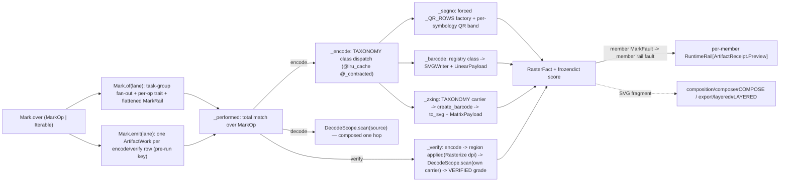

# [PY_ARTIFACTS_GRAPHIC_MARKS_ENCODE]

Machine-readable-mark operation owner. `Mark` owns the closed `MarkOp` family across generation, `DecodeScope.scan`, and print-survivability verification. One total dispatch routes segno QR/Micro-QR/structured append, python-barcode linear generation, zxing-cpp matrix generation, decode, and encode-rasterize-decode verification. `TAXONOMY` selects the provider class; factory-specific bands admit every option before a worker runs.

Every provider boundary maps named raises into `MarkFault`. `_QR_BANDS` selects the exact QR factory shape, `_CLASS_BANDS` covers linear and matrix families, and `_admit` rejects `MarkClass.SCAN` through `uncreatable`; admitted bands deep-freeze before entering cached operation payloads. `Mark.of(lane)` fans independent operations through one `anyio.create_task_group`, preserving input order through task handles while each case declares its own `KernelTrait` row.

## [01]-[INDEX]

- [01]-[MARK]: `MarkOp`, `Mark`, `Content`, taxonomy-derived provider dispatch, factory-specific QR admission, and the composed scan/verify inverse form one marks operation rail.

## [02]-[MARK]

- Owner: `Mark` holds the closed operation tuple. `encode` carries admitted content and options, `decode` carries source and detector scope, and `verify` carries encode input plus the full `RenderPolicy`; `_encode` derives provider dispatch from `TAXONOMY`, and `_QR_ROWS` derives only the forced segno factory.
- Cases: `MarkOp.of_encode` admits creatable members; scan-only members rail `uncreatable`. `MarkOp.Decode` composes `DecodeScope.scan`. `MarkOp.of_verify` requires `RenderPolicy`, refuses carrier-less symbols through `unscannable`, and records failed recovery as evidence rather than a transport fault.
- Trait: `Mark.over` normalizes singular and iterable request shapes. `of(lane)` launches each independent request in one task group; `_trait` selects `RELEASING` for encode and pixel scans, `HOSTILE` for raster scans and verify, and deterministic codec work carries no caller retry beyond the trait row.
- Receipt: each emitted operation folds into `RasterFact` and projects to `ArtifactReceipt.Preview(key, width, height, bytes_, scores)`, threading `len(RasterFact.data)` and `RasterFact.score` onto the shared receipt. Encode arms report zero pixel dimensions for SVG and stamp evidence keyed by `MarkFact`; verify reports raster dimensions and stamps `VERIFIED`/`DPI` beside native numeric scan facts.
- Faults: `MarkFault` carries provider, admission, geometry, scan, contract, `unscannable`, and `uncreatable` causes on one rail; `options` accumulates every `ValidationError` location.
- Content: `Content.raw` preserves `str | bytes`, so segno and zxing receive binary payloads without a lossy text round trip while the text-only python-barcode arm refuses bytes at ingress. Structured `wifi`/`geo`/`email` and full `vcard`/`mecard` cases fold to canonical QR text once. `Content.epc(EpcPayment)` carries segno's full public EPC helper axis as a frozen per-mode payload; `make_epc_qr` fixes QR error/version policy, and verify refuses EPC because no public canonical-text twin exists for byte-equality evidence.
- Growth: a new segno symbol kind is one `_QR_ROWS` row; a new structured payload one `Content` case plus one `_resolved_content` arm, a richer existing payload one more field on its case; a new linear or 2D-matrix symbology one `Symbology` member plus one `TAXONOMY` row on the mark floor — no dispatch edit here; a new fault cause one `MarkFault` case; a new evidence fact one `MarkFact` member the owning arm stamps; a new option knob one key on the owning per-class band; a new operation one `MarkOp` case plus one `_performed` arm plus one `_trait` row; a data-URI or per-module `matrix_iter` render one segno growth axis on the qr arm; zero new surface.

```python signature
# --- [RUNTIME_PRELUDE] ------------------------------------------------------------------
from collections.abc import Callable, Iterable
from decimal import Decimal
from enum import StrEnum
from functools import lru_cache, partial, wraps
from io import BytesIO
from typing import TYPE_CHECKING, Literal, NotRequired, ReadOnly, Required, Self, TypedDict, assert_never, cast

import anyio
import msgspec
from beartype import BeartypeConf, beartype
from beartype.roar import BeartypeCallHintViolation
from builtins import frozendict
from expression import Error, Ok, Result, case, tag, tagged_union
from expression.collections import Block
from expression.extra.result import traverse
from msgspec import Struct
from pydantic import TypeAdapter, ValidationError

from rasm.artifacts.core.plan import Admission, ArtifactWork
from rasm.artifacts.core.receipt import ArtifactReceipt
from rasm.artifacts.graphic.layer import LayerContent, LayerIntent, LayerMeta, LayerNode
from rasm.artifacts.graphic.marks.decode import DecodeScope, DecodedSymbol, ScopeKind
from rasm.artifacts.graphic.marks.mark import (
    TAXONOMY,
    DecodeSource,
    LinearPayload,
    MarkClass,
    MarkFault,
    MatrixPayload,
    MicroQrPayload,
    OptionBand,
    QrPayload,
    QrSequencePayload,
    Symbology,
)
from rasm.artifacts.graphic.raster.process import RasterFact
from rasm.artifacts.graphic.vector.path import bounds
from rasm.artifacts.graphic.vector.region import RegionOp, RenderPolicy, applied
from rasm.runtime.faults import BoundaryFault, RuntimeRail
from rasm.runtime.identity import ContentIdentity
from rasm.runtime.lanes import LanePolicy
from rasm.runtime.workers import Kernel, KernelTrait

lazy import barcode
lazy import segno
lazy import zxingcpp
lazy from barcode.errors import BarcodeNotFoundError, IllegalCharacterError, NumberOfDigitsError, WrongCountryCodeError
lazy from segno import helpers

if TYPE_CHECKING:
    from segno import QRCode, QRCodeSequence


# --- [TYPES] ----------------------------------------------------------------------------
type MarkRail = Result[RasterFact, MarkFault | BoundaryFault]


class SegnoFactory(StrEnum):
    MAKE_QR = "make_qr"
    MAKE_MICRO = "make_micro"
    MAKE_SEQUENCE = "make_sequence"


class MarkFact(StrEnum):
    DESIGNATOR = "designator"
    VERSION = "version"
    ERROR = "error"
    MASK = "mask"
    MODE = "mode"
    SYMBOL_SIZE = "symbol_size"
    SYMBOLS = "symbols"
    COUNT = "count"
    IS_MICRO = "is_micro"
    DEFAULT_BORDER = "default_border"
    FULLCODE = "fullcode"
    SYMBOLOGY = "symbology"
    FORMAT = "format"
    FAMILY = "family"
    EC_LEVEL = "ec_level"
    CONTENT_KIND = "content_kind"
    VERIFIED = "verified"
    DPI = "dpi"


class VCardFields(TypedDict, closed=True):
    name: Required[ReadOnly[str]]
    displayname: Required[ReadOnly[str]]
    email: NotRequired[ReadOnly[str]]
    phone: NotRequired[ReadOnly[str]]
    fax: NotRequired[ReadOnly[str]]
    videophone: NotRequired[ReadOnly[str]]
    cellphone: NotRequired[ReadOnly[str]]
    homephone: NotRequired[ReadOnly[str]]
    workphone: NotRequired[ReadOnly[str]]
    memo: NotRequired[ReadOnly[str]]
    nickname: NotRequired[ReadOnly[str]]
    birthday: NotRequired[ReadOnly[str]]
    url: NotRequired[ReadOnly[str]]
    pobox: NotRequired[ReadOnly[str]]
    street: NotRequired[ReadOnly[str]]
    city: NotRequired[ReadOnly[str]]
    region: NotRequired[ReadOnly[str]]
    zipcode: NotRequired[ReadOnly[str]]
    country: NotRequired[ReadOnly[str]]
    org: NotRequired[ReadOnly[str]]
    title: NotRequired[ReadOnly[str]]
    photo_uri: NotRequired[ReadOnly[str]]
    source: NotRequired[ReadOnly[str]]
    rev: NotRequired[ReadOnly[str]]
    lat: NotRequired[ReadOnly[float]]
    lng: NotRequired[ReadOnly[float]]


class MeCardFields(TypedDict, closed=True):
    name: Required[ReadOnly[str]]
    reading: NotRequired[ReadOnly[str]]
    email: NotRequired[ReadOnly[str]]
    phone: NotRequired[ReadOnly[str]]
    videophone: NotRequired[ReadOnly[str]]
    memo: NotRequired[ReadOnly[str]]
    nickname: NotRequired[ReadOnly[str]]
    birthday: NotRequired[ReadOnly[str]]
    url: NotRequired[ReadOnly[str]]
    pobox: NotRequired[ReadOnly[str]]
    roomno: NotRequired[ReadOnly[str]]
    houseno: NotRequired[ReadOnly[str]]
    city: NotRequired[ReadOnly[str]]
    prefecture: NotRequired[ReadOnly[str]]
    zipcode: NotRequired[ReadOnly[str]]
    country: NotRequired[ReadOnly[str]]


class EpcPayment(Struct, frozen=True):
    name: str
    iban: str
    amount: int | float | Decimal
    text: str | None = None
    reference: str | None = None
    bic: str | None = None
    purpose: str | None = None
    encoding: str | int | None = None


type RawContent = str | bytes
type MarkContent = RawContent | EpcPayment


@tagged_union(frozen=True)
class Content:
    tag: Literal["raw", "wifi", "vcard", "mecard", "geo", "email", "epc"] = tag()
    raw: RawContent = case()
    wifi: tuple[str, str | None, str | None, bool] = case()
    vcard: VCardFields = case()
    mecard: MeCardFields = case()
    geo: tuple[float, float] = case()
    email: tuple[str, str | None, str | None, str | None, str | None] = case()
    epc: EpcPayment = case()
```

```python signature
# --- [TABLES] ---------------------------------------------------------------------------
# per-class admission adapters and the only arm-local dispatch data; everything else derives
# from the mark floor's ONE TAXONOMY correspondence.
_QR_BANDS: frozendict[Symbology, TypeAdapter[OptionBand]] = frozendict({
    Symbology.QR: TypeAdapter(QrPayload),
    Symbology.MICRO_QR: TypeAdapter(MicroQrPayload),
    Symbology.QR_SEQUENCE: TypeAdapter(QrSequencePayload),
})
_CLASS_BANDS: frozendict[MarkClass, TypeAdapter[OptionBand]] = frozendict({
    MarkClass.LINEAR: TypeAdapter(LinearPayload),
    MarkClass.MATRIX: TypeAdapter(MatrixPayload),
})
_QR_ROWS: frozendict[Symbology, SegnoFactory] = frozendict({
    Symbology.QR: SegnoFactory.MAKE_QR,
    Symbology.MICRO_QR: SegnoFactory.MAKE_MICRO,
    Symbology.QR_SEQUENCE: SegnoFactory.MAKE_SEQUENCE,
})
_CONTRACT = BeartypeConf(is_pep484_tower=True)


def _canon_hook(value: object, /) -> object:
    # frozendict is not a dict subclass, so the canonical-key encoder lowers each band row explicitly; every other payload
    # member (str/bytes/StrEnum/msgspec Struct) encodes natively.
    match value:
        case frozendict():
            return dict(value)
        case _:
            raise NotImplementedError


_CANON = msgspec.msgpack.Encoder(enc_hook=_canon_hook)


# --- [OPERATIONS] -----------------------------------------------------------------------
def _frozen(value: object, /) -> object:
    # deep-fold the admitted band to a hashable frozendict tree so lru_cache and the op payload stay immutable
    return frozendict({key: _frozen(inner) for key, inner in value.items()}) if isinstance(value, dict) else value


def _admit(symbology: Symbology, content: MarkContent, raw: OptionBand, /) -> Result[tuple[MarkContent, frozendict[str, object]], MarkFault]:
    # ONE admission seam: the symbology's MarkClass selects the closed per-class band, so a cross-family
    # knob fails validation here and a factory-scoped key outside its row's accepts fails by name —
    # every admitted option has an owning arm and stage, never a silently dropped key.
    cls = TAXONOMY[symbology][0]
    if cls is MarkClass.SCAN:
        return Error(MarkFault(uncreatable=symbology))
    if cls is MarkClass.LINEAR and isinstance(content, bytes):
        return Error(MarkFault(content="<binary-linear-content>"))
    if isinstance(content, EpcPayment) and symbology is not Symbology.QR:
        return Error(MarkFault(content="<epc-requires-qr>"))
    adapter = _QR_BANDS[symbology] if cls is MarkClass.QR else _CLASS_BANDS[cls]
    try:
        admitted = adapter.validate_python(raw)
    except ValidationError as fault:
        return Error(MarkFault(options=tuple(str(error["loc"]) for error in fault.errors())))
    if isinstance(content, EpcPayment) and admitted.get("make"):
        return Error(MarkFault(options=("('make',): EPC fixes error/version policy",)))
    return Ok((content, cast(frozendict[str, object], _frozen(admitted))))


def _resolved_content(content: Content, /) -> Result[MarkContent, MarkFault]:
    try:
        match content:
            case Content(tag="raw", raw=text):
                return Ok(text)
            case Content(tag="wifi", wifi=(ssid, password, security, hidden)):
                return Ok(helpers.make_wifi_data(ssid=ssid, password=password, security=security, hidden=hidden))
            case Content(tag="vcard", vcard=fields):
                return Ok(helpers.make_vcard_data(**fields))
            case Content(tag="mecard", mecard=fields):
                return Ok(helpers.make_mecard_data(**fields))
            case Content(tag="geo", geo=(lat, lng)):
                return Ok(helpers.make_geo_data(lat, lng))
            case Content(tag="email", email=(to, cc, bcc, subject, body)):
                return Ok(helpers.make_make_email_data(to=to, cc=cc, bcc=bcc, subject=subject, body=body))
            case Content(tag="epc", epc=payment):
                return Ok(payment)
            case _ as unreachable:
                assert_never(unreachable)
    except (ValueError, TypeError) as fault:
        return Error(MarkFault(content=str(fault)))


@tagged_union(frozen=True)
class MarkOp:
    tag: Literal["encode", "decode", "verify"] = tag()
    encode: tuple[MarkContent, Symbology, frozendict[str, object]] = case()
    decode: tuple[DecodeSource, DecodeScope] = case()  # a read op: data, excluded from emit
    verify: tuple[MarkContent, Symbology, frozendict[str, object], RenderPolicy] = case()

    @staticmethod
    def Encode(content: MarkContent, symbology: Symbology, band: frozendict[str, object] = frozendict(), /) -> "MarkOp":
        return MarkOp(encode=(content, symbology, band))

    @staticmethod
    def Decode(source: DecodeSource, scope: DecodeScope = DecodeScope(), /) -> "MarkOp":
        return MarkOp(decode=(source, scope))

    @staticmethod
    def of_encode(content: Content, symbology: Symbology, band: OptionBand | None = None, /) -> Result["MarkOp", MarkFault]:
        return _resolved_content(content).bind(
            lambda text: _admit(symbology, text, band if band is not None else cast(OptionBand, {})).map(
                lambda admitted: MarkOp.Encode(admitted[0], symbology, admitted[1])
            )
        )

    @staticmethod
    def of_verify(content: Content, symbology: Symbology, render: RenderPolicy, band: OptionBand | None = None, /) -> Result["MarkOp", MarkFault]:
        if TAXONOMY[symbology][1] is None:  # a carrier-less member can never decode back — refuse at construction
            return Error(MarkFault(unscannable=symbology))
        return _resolved_content(content).bind(
            lambda text: Error(MarkFault(content="<epc-has-no-public-canonical-text>"))
            if isinstance(text, EpcPayment)
            else _admit(symbology, text, band if band is not None else cast(OptionBand, {})).map(
                lambda admitted: MarkOp(verify=(admitted[0], symbology, admitted[1], render))
            )
        )


def _segno(factory: SegnoFactory, content: MarkContent, symbology: Symbology, band: frozendict[str, object], /) -> Result[RasterFact, MarkFault]:
    make = cast(frozendict[str, object], band.get("make", frozendict()))
    render = cast(frozendict[str, object], band.get("render", frozendict()))
    try:
        symbol = helpers.make_epc_qr(**msgspec.structs.asdict(content)) if isinstance(content, EpcPayment) else getattr(segno, factory)(content, **dict(make))
    except segno.DataOverflowError:
        return Error(MarkFault(overflow=symbology))
    except ValueError as fault:
        return Error(MarkFault(content=str(fault)) if isinstance(content, EpcPayment) else MarkFault(parameter=str(fault)))
    sink = BytesIO()
    style = cast(frozendict[str, object], render.get("svg", frozendict()))
    writer = {key: value for key, value in render.items() if key != "svg"}
    try:
        symbol.save(sink, kind="svg", **writer, **dict(style))
    except ValueError as fault:
        return Error(MarkFault(render=str(fault)))
    return Ok(RasterFact(sink.getvalue(), score=_segno_score(factory, symbol, render)))


def _segno_score(factory: SegnoFactory, symbol: "QRCode | QRCodeSequence", render: frozendict[str, object], /) -> frozendict[str, str]:
    if factory is SegnoFactory.MAKE_SEQUENCE:
        return frozendict({
            MarkFact.COUNT: str(len(symbol)),
            MarkFact.SYMBOLS: msgspec.json.encode(
                tuple(
                    (
                        member.designator,
                        str(member.version),
                        str(member.error),
                        str(member.mask),
                        str(member.mode),
                        member.symbol_size(scale=render.get("scale", 1), border=render.get("border")),
                    )
                    for member in symbol
                )
            ).decode(),
        })
    width, height = symbol.symbol_size(scale=render.get("scale", 1), border=render.get("border"))
    return frozendict({
        MarkFact.DESIGNATOR: symbol.designator,
        MarkFact.VERSION: str(symbol.version),
        MarkFact.ERROR: str(symbol.error),
        MarkFact.MASK: str(symbol.mask),
        MarkFact.MODE: str(symbol.mode),
        MarkFact.SYMBOL_SIZE: f"{width}x{height}",
        MarkFact.IS_MICRO: str(symbol.is_micro),
        MarkFact.DEFAULT_BORDER: str(symbol.default_border_size),
    })


def _barcode(content: MarkContent, symbology: Symbology, band: frozendict[str, object], /) -> Result[RasterFact, MarkFault]:
    if not isinstance(content, str):
        return Error(MarkFault(content="<non-text-linear-content>"))
    sink = BytesIO()
    try:
        symbol = barcode.get_barcode_class(symbology.value)(content, writer=barcode.writer.SVGWriter())
        symbol.write(sink, options=band.get("render"), text=band.get("text"))
    except BarcodeNotFoundError:
        return Error(MarkFault(unknown=symbology.value))
    except IllegalCharacterError as fault:
        return Error(MarkFault(illegal=str(fault)))
    except (NumberOfDigitsError, WrongCountryCodeError) as fault:
        return Error(MarkFault(arity=str(fault)))
    return Ok(RasterFact(sink.getvalue(), score=frozendict({MarkFact.FULLCODE: symbol.get_fullcode(), MarkFact.SYMBOLOGY: symbology.value})))


def _zxing(content: MarkContent, symbology: Symbology, band: frozendict[str, object], /) -> Result[RasterFact, MarkFault]:
    if isinstance(content, EpcPayment):
        return Error(MarkFault(content="<epc-requires-qr>"))
    carrier = TAXONOMY[symbology][1]
    if carrier is None:
        return Error(MarkFault(unscannable=symbology))
    fmt = zxingcpp.barcode_format_from_str(carrier)
    make = cast(frozendict[str, object], band.get("make", frozendict()))
    render = cast(frozendict[str, object], band.get("render", frozendict()))
    try:
        symbol = zxingcpp.create_barcode(content, fmt, **dict(make))  # ec_level the sole genuine creator key; geometry is the writer's
    except ValueError as fault:
        return Error(MarkFault(ec_level=str(fault)))
    svg = symbol.to_svg(
        scale=int(render.get("scale", 1)), add_hrt=bool(render.get("add_hrt", False)), add_quiet_zones=bool(render.get("add_quiet_zones", True))
    )
    return Ok(
        RasterFact(
            svg.encode(),
            score=frozendict({
                MarkFact.FORMAT: str(symbol.format),  # the precise 3.0 display name ('Data Matrix'/'PDF417'/'Aztec')
                MarkFact.FAMILY: str(symbol.symbology),  # the rolled-up BarcodeFormat.symbology family (MicroPDF417 -> PDF417) distinct from .format
                MarkFact.EC_LEVEL: str(dict(make).get("ec_level", "")),
                MarkFact.CONTENT_KIND: symbol.content_type.name,
            }),
        )
    )


def _contracted(
    operation: Callable[[MarkContent, Symbology, frozendict[str, object]], Result[RasterFact, MarkFault]], /
) -> Callable[[MarkContent, Symbology, frozendict[str, object]], Result[RasterFact, MarkFault]]:
    guarded = beartype(conf=_CONTRACT)(operation)

    @wraps(operation)
    def call(content: MarkContent, symbology: Symbology, band: frozendict[str, object], /) -> Result[RasterFact, MarkFault]:
        try:
            return guarded(content, symbology, band)
        except BeartypeCallHintViolation as violation:
            return Error(MarkFault(contract=str(violation)))

    return call


@lru_cache(maxsize=256)
@_contracted
def _encode(content: MarkContent, symbology: Symbology, band: frozendict[str, object], /) -> Result[RasterFact, MarkFault]:
    # class dispatch DERIVES from TAXONOMY — a new symbology is one floor row, zero edits here.
    match TAXONOMY[symbology][0]:
        case MarkClass.QR:
            return _segno(_QR_ROWS[symbology], content, symbology, band)
        case MarkClass.LINEAR:
            return _barcode(content, symbology, band)
        case MarkClass.MATRIX:
            return _zxing(content, symbology, band)
        case MarkClass.SCAN:
            return Error(MarkFault(uncreatable=symbology))
        case _ as unreachable:
            assert_never(unreachable)


def _verify(content: MarkContent, symbology: Symbology, band: frozendict[str, object], render: RenderPolicy, /) -> Result[RasterFact, MarkFault]:
    # print-survivability round trip: encode -> region rasterize at the declared resolution ->
    # scan scoped to the mark's OWN carrier -> grade recovery as evidence; a failed recovery is a
    # graded VERIFIED=0.0 verdict on the score band, never a fault.
    if isinstance(content, EpcPayment):
        return Error(MarkFault(content="<epc-has-no-public-canonical-text>"))

    def _graded(png: bytes, /) -> Result[RasterFact, MarkFault]:
        return DecodeScope.of(ScopeKind.THOROUGH, symbology).scan(DecodeSource.Raster(png)).map(
            lambda fact: RasterFact(
                png,
                fact.width,
                fact.height,
                fact.score
                | frozendict({
                    MarkFact.VERIFIED: float(
                        any(
                            symbol.valid and (symbol.raw == content if isinstance(content, bytes) else symbol.text == content)
                            for symbol in DecodedSymbol.recovered(fact)
                        )
                    ),
                    MarkFact.DPI: render.dpi,
                }),
            )
        )

    return _encode(content, symbology, band).bind(
        lambda encoded: applied(RegionOp.Rasterize(encoded.data, render))
        .map_error(lambda fault: MarkFault(geometry=fault.tag))
        .bind(lambda result: _graded(result.raster))
    )


def _performed(op: MarkOp, /) -> Result[RasterFact, MarkFault]:
    match op:
        case MarkOp(tag="encode", encode=(content, symbology, band)):
            return _encode(content, symbology, band)
        case MarkOp(tag="decode", decode=(source, scope)):
            return scope.scan(source)
        case MarkOp(tag="verify", verify=(content, symbology, band, render)):
            return _verify(content, symbology, band, render)
        case _ as unreachable:
            assert_never(unreachable)


def _trait(op: MarkOp, /) -> KernelTrait:
    match op:
        case MarkOp(tag="decode", decode=(source, _)):
            return KernelTrait.HOSTILE if source.tag == "raster" else KernelTrait.RELEASING  # untrusted bytes earn crash isolation
        case MarkOp(tag="verify"):
            return KernelTrait.HOSTILE  # pathops + resvg + zxing native CPU round trip
        case _:
            return KernelTrait.RELEASING


async def _offloaded(lane: LanePolicy, op: MarkOp, /) -> MarkRail:
    railed = await lane.offload(Kernel.of(_performed, _trait(op)), op)
    return railed.bind(lambda inner: inner)
```

```python signature
# --- [COMPOSITION] ----------------------------------------------------------------------
def _normalized(ops: MarkOp | Iterable[MarkOp], /) -> tuple[MarkOp, ...]:
    match ops:
        case MarkOp():
            return (ops,)
        case _:
            return tuple(ops)


def _mark_bbox(svg: bytes, /) -> Result[tuple[float, float, float, float], MarkFault]:
    # geometry rides the graphic/vector/path substrate — its memoized `_parsed` core serves repeated bounds reads
    # over the same bytes, never a second local SVG.parse of the generated mark.
    return bounds(svg).map_error(lambda fault: MarkFault(geometry=str(fault)))


def _layer(name: str, count: int, index: int, encode: tuple[MarkContent, Symbology, frozendict[str, object]], /) -> Result[LayerNode, MarkFault]:
    # _mark_bbox gates SVG well-formedness before the fragment lands on a layer; the box value itself stays with the placing consumer.
    content, symbology, band = encode
    label = name if count == 1 else f"{name}-{index}"
    return _encode(content, symbology, band).bind(
        lambda fact: _mark_bbox(fact.data).map(
            lambda _box: LayerNode.Leaf(LayerMeta(name=label, intent=LayerIntent.ANNOTATION), LayerContent.Fragment(fact.data))
        )
    )


class Mark(Struct, frozen=True):
    ops: tuple[MarkOp, ...]

    @classmethod
    def over(cls, ops: MarkOp | Iterable[MarkOp], /) -> Self:
        return cls(ops=_normalized(ops))

    async def of(self, lane: LanePolicy, /) -> Block[MarkRail]:
        async with anyio.create_task_group() as group:
            handles = tuple(group.start_soon(_offloaded, lane, op) for op in self.ops)
        return Block.of_seq(handle.return_value for handle in handles)

    def emit(self, lane: LanePolicy, /) -> Iterable[ArtifactWork]:
        # one node per encode/verify row — the per-member PRE-RUN key keeps elision per-member (a
        # re-issued sheet re-renders only changed rows) and faults one malformed mark to its own node,
        # never the sheet; a decode row is data and never an artifact.
        return tuple(
            ArtifactWork(
                key=ContentIdentity.key(f"mark-{op.tag}", _CANON.encode(op.encode if op.tag == "encode" else op.verify)),
                work=partial(Mark._emit, op, lane),
                parents=(),
                admission=Admission(keyed=None),
                cost=1.0,
            )
            for op in self.ops
            if op.tag in ("encode", "verify")
        )

    @staticmethod
    async def _emit(op: MarkOp, lane: LanePolicy, /) -> RuntimeRail[ArtifactReceipt]:
        fact = await lane.offload(Kernel.of(_performed, _trait(op)), op)
        # member's MarkFault folds into ITS OWN rail fault — Work[ArtifactReceipt] forbids an inner Result; the receipt key is
        # product identity over the emitted bytes, distinct from the pre-run op key the emit row minted.
        return fact.bind(
            lambda res: res.map(
                lambda f: ArtifactReceipt.Preview(ContentIdentity.key(f"mark-{op.tag}", f.data), f.width, f.height, len(f.data), f.score)
            ).map_error(lambda fault: BoundaryFault(boundary=(f"mark.{op.tag}", fault.tag)))
        )

    def layered(self, name: str, /) -> Result[Block[LayerNode], MarkFault]:
        encodes = tuple(op.encode for op in self.ops if op.tag == "encode")
        rows = Block.of_seq(enumerate(encodes))
        return traverse(lambda row: _layer(name, len(encodes), row[0], row[1]), rows)


# --- [EXPORTS] --------------------------------------------------------------------------
__all__ = [
    "Content",
    "EpcPayment",
    "Mark",
    "MarkContent",
    "MarkFact",
    "MarkOp",
    "MarkRail",
    "MeCardFields",
    "RawContent",
    "SegnoFactory",
    "VCardFields",
]
```



## [03]-[RESEARCH]

<!-- source-only: research row template:
[TOKEN]-[OPEN|BLOCKED]: <exact question>; <verification route>.
-->

(none)
