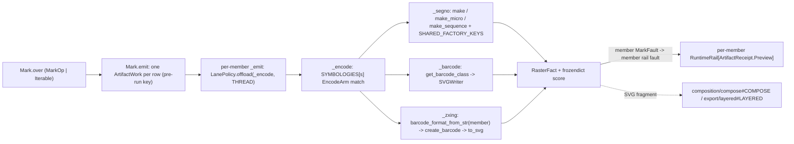

# [PY_ARTIFACTS_GRAPHIC_MARKS_ENCODE]

The machine-readable-mark generation owner. `Mark` is ONE owner over the host-free encoded-mark codec discriminating symbology over the closed `Symbology` vocabulary: segno (QR/Micro-QR and structured-append sequence generation with the full factory-parameter axis, the `segno.helpers` structured-payload grammar, and the full `SvgStyle` SVG serializer band — the per-module `finder_dark`/`data_dark`/`alignment_dark`/`timing_dark`/`version_dark`/`format_dark`/`dark_module`/`separator`/`quiet_zone` color axis and the `svgclass`/`lineclass`/`svgid`/`omitsize`/`unit`/`title`/`desc`/`xmldecl`/`svgns`/`svgversion`/`nl`/`draw_transparent` structural axis a `dark`/`light`-only slice drops), python-barcode (the linear 1D symbology registry over `SVGWriter`), and zxing-cpp (the 2D-matrix DataMatrix/PDF417/Compact PDF417/Aztec/MaxiCode/rMQR `create_barcode`/`Barcode.to_svg` dependency-free encode arm spanning the complete `AllCreatable` matrix set) — all importing on the runtime. One mark surface, not a per-symbology code class, not a per-operation function family, not an erased `opts` bag, and not a fault-free pass that drops every provider raise on the floor.

Every encode arm is fallible at the provider edge AND at the serializer edge, and the interior is total over `Result[RasterFact, MarkFault]`: segno raises `DataOverflowError` on a payload past the largest version (mapped at the factory call onto `MarkFault.overflow`) or a non-overflow `ValueError` on a type-admitted but domain-invalid factory parameter (an out-of-range `version`/`mask`/`mode`/`error`, mapped onto `MarkFault.parameter`) and a serializer `ValueError` on a rejected `SvgStyle` combination (`omitsize` with `unit`, a malformed color or `svgversion`) mapped onto `MarkFault.render` at the `symbol.save` call rather than escaping past the encode try as the former bare unwrapped `save` did, python-barcode raises the `errors.BarcodeError` family (`BarcodeNotFoundError`/`IllegalCharacterError`/`NumberOfDigitsError`/`WrongCountryCodeError`), and zxing-cpp raises `ValueError("Invalid ecLevel: …")` on an out-of-range `ec_level` — each named exactly once at its arm and mapped into the closed `MarkFault` `@tagged_union`, never a bare `except Exception` flattening the causes and never a railless `_compute` that lets the raise escape the capsule. The option knobs cross the seam as ONE closed `MarkPayload` `TypedDict` admitted through a module-level `TypeAdapter` into an immutable `frozendict` evidence band, so no interior arm re-validates a `dict[str, object]`, and structured QR content (`wifi`/`vcard`/`mecard`/`geo`/`email`) is admitted through the `Content` family that folds to canonical text through `segno.helpers.make_*_data` exactly once before encode.

`Mark` owns the encode call modality: `Mark.over` normalizes `MarkOp | Iterable[MarkOp]` into one `ops` tuple at the head, so a single mark and a mixed QR + linear + 2D-matrix label sheet are the same entrypoint discriminating on input shape, and `emit()` lowers the sheet to one `ArtifactWork` per row — per-member PRE-RUN keys over the canonical encode payload, per-member elision, one malformed mark faulting its own node — while `lru_cache` collapses a repeated row to one encode. Every operation folds into one typed `RasterFact` whose `score` is a `frozendict` keyed by the `MarkFact` evidence vocabulary (segno designator/version/error/mask/symbol-size, the python-barcode `get_fullcode` check digit, the zxing resolved format/ec-level), and each member's `_emit` resolves `RuntimeRail[ArtifactReceipt.Preview]` carrying the node key, the default zero pixel dimensions (the encode SVG path carries no raster; the module extent rides the score), and the `RasterFact.score` evidence threaded straight onto `Preview.scores`. The decode inverse is `graphic/marks/decode#DECODE`'s own read surface over the shared `graphic/marks/mark#MARK` vocabulary — decoded payloads are data, never artifact ops, and neither behavior page imports the other. `RasterFact` and the shared `Symbology`/`MarkPayload`/`SvgStyle`/`WriterOptions`/`MarkFault` vocabulary are imported from their owners (`graphic/raster/process#PROCESS`, `graphic/marks/mark#MARK`), never re-declared here.

## [01]-[INDEX]

- [01]-[MARK]: machine-readable-mark generation owner over segno, python-barcode, and zxing-cpp — the `Symbology` vocabulary (imported from `graphic/marks/mark#MARK`) keyed straight against the `SYMBOLOGIES` `EncodeArm` dispatch table (the `qr` case carrying its `SegnoFactory` plus per-row `SegnoKey` accepts, `linear` carrying nothing, `matrix` carrying its zxing `BarcodeFormat` display name, spanning QR/Micro-QR, linear 1D, and 2D-matrix classes), the encode-only `MarkOp` family lowered to one `ArtifactWork` per row through `emit()`, the closed `MarkFault` provider-exception vocabulary, the `MarkPayload` typed option band, and the `Content` structured-payload family — all dispatch-table-folded with zero re-discriminating arm and one `assert_never` exhaustiveness witness per `match`.

## [02]-[MARK]

- Owner: `Mark` the one machine-readable-mark owner holding `ops: tuple[MarkOp, ...]` and discriminating operation over the closed `MarkOp` family; `MarkOp` an `expression.tagged_union` whose `encode` case carries its own typed `(str, Symbology, frozendict[str, object])` payload, never a shared erased `params` dict; `RasterFact` the one typed result every arm folds into — `data`/`width`/`height`/`score` recovering the encoded SVG bytes, the default zero pixel dimensions, and the `frozendict` evidence map — projected to `core/receipt#RECEIPT` `ArtifactReceipt.Preview` at the boundary; segno the QR/sequence arm, python-barcode the linear arm, and zxing-cpp the 2D-matrix arm folded by the `SYMBOLOGIES` `EncodeArm` cases; the zxing-cpp `read_barcodes` inverse is `graphic/marks/decode#DECODE`'s own read surface over the shared `graphic/marks/mark#MARK` vocabulary. The `SYMBOLOGIES` table is the egress-grade collapse: each row IS one `EncodeArm` case (`qr` holding the `SegnoFactory` plus per-row `SegnoKey` accepts, `linear` carrying nothing, `matrix` carrying its zxing `BarcodeFormat` display name), so `_encode` routes by one table lookup plus one three-arm `match` with no `.arm`/`.member` hop, never a per-operation sibling function and never a re-discriminating `match` inside an arm.
- Cases: `MarkOp` cases — `Encode(content, symbology, opts)` (the machine-readable-mark arm carrying the resolved-text content, the typed `Symbology` sub-axis, and the admitted `frozendict` option band — QR/Micro-QR/structured-append sequence over segno, the linear (1D) symbologies over the python-barcode registry, and the 2D-matrix DataMatrix/PDF417/Compact PDF417/Aztec/MaxiCode/rMQR classes over zxing-cpp `create_barcode`/`Barcode.to_svg`, all serializing to the dependency-free SVG path) — admitted through the `of_encode` validated factory and matched by one total `match`/`case` with `assert_never`; the QR-only literal is COLLAPSED into the `Encode` case whose `EncodeArm` case keys the encoder and the 2D-matrix routing is RESOLVED by the `matrix` `EncodeArm` case carrying its zxing `BarcodeFormat` display name, never a sibling op per symbology, never a separate-2D-matrix owner, and never an `engine`/`gated` knob.
- Modality: `Mark.over` is the one modal-arity entrypoint normalizing `MarkOp | Iterable[MarkOp]` into the `ops` tuple by a structural `match` at the head, so a lone mark is the one-element case and a mixed-symbology label sheet is the multi-element case under the identical surface — never an `encode`/`decode` knob, never a `batch: bool`, and never a per-symbology or `of_many` sibling. The operation is the value's `MarkOp` case; the arity is the value's shape.
- Receipt: each operation folds into `RasterFact` and projects to `core/receipt#RECEIPT` `ArtifactReceipt.Preview(key, width, height, scores)` at the rail boundary, threading `RasterFact.score` straight onto the `Preview.scores` `frozendict[str, float | str]` band; the `Encode` arms report the default zero pixel dimensions (the SVG path carries no raster) and stamp the resolved evidence onto the `RasterFact.score` `frozendict` keyed by the `MarkFact` vocabulary — segno's `designator`/`version`/`error`/`mask`/`mode`/`symbol_size`, the python-barcode `get_fullcode`/`symbology`, or the zxing `format` plus its rolled-up `symbology` FAMILY (`Barcode.symbology`, distinct from the precise `Barcode.format`) and the requested `ec_level` — and the `Decode` arm reports the decoded `text`/`format`/`valid`/`position` round-trip facts on the same map the rail consumer reads inline. The `Preview.scores` band already carries the marks `str` facts beside the `graphic/raster/measure#MEASURE` perceptual `float` band, so this owner delivers them in; the lone residual is the `core/receipt#RECEIPT` `_facts` arm projecting `scores` outward, never a new receipt case here.
- Faults: `MarkFault` is the one closed `@tagged_union` vocabulary every arm maps its provider raise into — `overflow` (segno `DataOverflowError`, carrying the `Symbology`), `parameter` (a non-overflow segno factory `ValueError` on a type-admitted but domain-invalid `version`/`mask`/`mode`/`error` value, the encode-time sibling of the serializer-time `render` cause, so a bad factory option rails rather than escaping the capsule), `unknown`/`illegal`/`arity` (the python-barcode `errors.*` family), `ec_level` (the zxing `ValueError`), `content` (a `segno.helpers` payload-format failure or an empty decode payload), `render` (a `segno.QRCode.save` serializer `ValueError` on a rejected `SvgStyle` combination, structurally distinct from the admission-time `options` cause), `options` (a `MarkPayload` `ValidationError`, the case now a `tuple[str, ...]` carrying every `.errors()` `loc` path exactly as the sibling `export/layered#LAYERED` `ExportFault.payload` does, never the first error's `type` alone), `geometry` (an `svgelements` parse/bounds failure on the `layered` projection), `worker` (an `anyio.BrokenWorkerProcess` the the runtime retry class schedule exhausted on the `Decode` subprocess seam), `decode` (a `graphic/marks/decode#DECODE` `MarkDecodeError` source-open fault — the `DecodeFault` `UNREADABLE`/`MALFORMED` value carried per-op so a corrupt decode source rails its own `Block` slot rather than escaping to the outer `async_boundary` as an opaque `BoundaryFault`), and `contract` (a `BeartypeCallHintViolation` the `_contracted` definition-time weave lifts onto `_encode`'s rail, never raising into `_one`) — each provider exception named exactly at the arm that raises it, never a bare `except Exception` and never `None`-as-failure; recovery keys on the case, never a reconstructed message.
- Content: `Content` is the closed structured-payload family the segno arm admits — `raw` text plus the small-grammar `wifi`(ssid/password/security/hidden), `geo`(lat/lng), and `email`(to/cc/bcc/subject/body) tuple cases and the rich-grammar `vcard`/`mecard` cases carrying the full closed `VCardFields`/`MeCardFields` `TypedDict` their `_data` twin accepts — `VCardFields` the complete 26-field `make_vcard_data` grammar (name/displayname, the email/phone/fax/videophone/cellphone/homephone/workphone contact axis, the memo/nickname/birthday/url/title/photo_uri/source/rev metadata, the pobox/street/city/region/zipcode/country address block, org, and lat/lng), `MeCardFields` the complete 16-field `make_mecard_data` grammar — never the 6-field vcard slice the prior tuple case modeled while its prose claimed the full grammar. Each folds to canonical QR text through `make_wifi_data`/`make_vcard_data`/`make_mecard_data`/`make_geo_data`/`make_make_email_data` in `_resolved_content` exactly once at `of_encode` ingress (the rich cases spreading the admitted `TypedDict` as `**fields`), so the imaging owner never hand-concatenates a `WIFI:`/`vCard` grammar and never models a thin slice of a contact the helper carries in full; a malformed payload maps onto `MarkFault.content`, and the resolved text is the canonical `Encode` content every arm sees, never a structured object threaded into the interior.
- Growth: a new segno factory parameter is one `SHARED_FACTORY_KEYS` entry or one per-row `SegnoKey` accept; a new segno symbol kind is one `SYMBOLOGIES` row binding `EncodeArm(qr=...)` with its `SegnoFactory`; a new structured payload is one `Content` case plus one `_resolved_content` arm over its `segno.helpers` member, and a richer existing payload is one more field on its case tuple; a new linear symbology is one `SYMBOLOGIES` row binding `EncodeArm(linear=None)` whose `Symbology.value` resolves the python-barcode `PROVIDED_BARCODES` registry; a new 2D-matrix symbology is one `SYMBOLOGIES` row binding `EncodeArm(matrix=...)` with its zxing `BarcodeFormat` display name — the complete `AllCreatable` matrix set DataMatrix/PDF417/Compact PDF417/Aztec/MaxiCode/rMQR all land that way, and any future creatable zxing format is one more row; a new fault cause is one `MarkFault` case; a new evidence fact is one `MarkFact` member the owning arm stamps (the `matrix` arm's rolled-up `symbology` FAMILY beside `format`/`ec_level` is exactly that, and `zxingcpp.barcode_formats_list(BarcodeFormat.AllCreatable)` enumerates the creatable roster the `matrix` rows must stay a subset of); a new option knob is one `MarkPayload` key, a new segno SVG serializer knob is one `SvgStyle` band key, and a new python-barcode geometry knob is one `WriterOptions` key; a self-contained inline document embed or a custom TYPE_*-classified render is one segno growth axis on the `qr` arm (`QRCode.svg_data_uri`/`png_data_uri` for a `data:` URI landing straight in an HTML/SVG tree with no asset write, `QRCode.matrix_iter(verbose=True)` streaming the `consts.TYPE_*` per-module classification a custom renderer consumes); a new decode scope or source band is one `ScopeKind`/`DecodeSource` case on `graphic/marks/decode#DECODE` (the `Decode` op carries its `DecodeSource`/`DecodeScope`, never a per-symbology decode sibling here); zero new surface.

```python signature
from collections.abc import Callable, Iterable
from enum import StrEnum
from functools import lru_cache, partial, wraps
from io import BytesIO
from typing import TYPE_CHECKING, Literal, NotRequired, ReadOnly, Required, Self, TypedDict, Unpack, assert_never

from beartype import BeartypeConf, beartype
from beartype.roar import BeartypeCallHintViolation
from expression import Error, Ok, Result, Some, case, tag, tagged_union
from expression.collections import Block
from expression.extra.result import traverse
from msgspec import Struct
from pydantic import TypeAdapter, ValidationError

from rasm.runtime.identity import CANONICAL_POLICY, ContentIdentity
from rasm.runtime.faults import BoundaryFault, RuntimeRail
from rasm.runtime.lanes import LanePolicy, Modality
from rasm.runtime.resilience import RetryClass

from artifacts.core.plan import Admission, ArtifactWork
from artifacts.core.receipt import ArtifactReceipt
from artifacts.graphic.layer import LayerContent, LayerIntent, LayerNode
from artifacts.graphic.marks.mark import MarkFault, MarkPayload, Symbology, SvgStyle, WriterOptions
from artifacts.graphic.raster.process import RasterFact

lazy import barcode
lazy import segno
lazy import zxingcpp
lazy from barcode.errors import BarcodeNotFoundError, IllegalCharacterError, NumberOfDigitsError, WrongCountryCodeError
lazy from segno import helpers
lazy from svgelements import SVG

if TYPE_CHECKING:
    from segno import QRCode, QRCodeSequence


# --- [TYPES] ----------------------------------------------------------------------------
class SegnoFactory(StrEnum):
    MAKE = "make"
    MAKE_MICRO = "make_micro"
    MAKE_SEQUENCE = "make_sequence"


class SegnoKey(StrEnum):
    ECI = "eci"
    MICRO = "micro"
    SYMBOL_COUNT = "symbol_count"


class MarkFact(StrEnum):
    DESIGNATOR = "designator"
    VERSION = "version"
    ERROR = "error"
    MASK = "mask"
    MODE = "mode"
    SYMBOL_SIZE = "symbol_size"
    SYMBOLS = "symbols"
    FULLCODE = "fullcode"
    SYMBOLOGY = "symbology"
    FORMAT = "format"
    FAMILY = "family"
    EC_LEVEL = "ec_level"


@tagged_union(frozen=True)
class EncodeArm:
    tag: Literal["qr", "linear", "matrix"] = tag()
    qr: tuple[SegnoFactory, tuple[SegnoKey, ...]] = case()
    linear: None = case()
    matrix: str = case()


class VCardFields(TypedDict, closed=True):
    name: Required[ReadOnly[str]]
    displayname: Required[ReadOnly[str]]
    email: NotRequired[ReadOnly[str]]
    phone: NotRequired[ReadOnly[str]]
    fax: NotRequired[ReadOnly[str]]
    videophone: NotRequired[ReadOnly[str]]
    cellphone: NotRequired[ReadOnly[str]]
    homephone: NotRequired[ReadOnly[str]]
    workphone: NotRequired[ReadOnly[str]]
    memo: NotRequired[ReadOnly[str]]
    nickname: NotRequired[ReadOnly[str]]
    birthday: NotRequired[ReadOnly[str]]
    url: NotRequired[ReadOnly[str]]
    pobox: NotRequired[ReadOnly[str]]
    street: NotRequired[ReadOnly[str]]
    city: NotRequired[ReadOnly[str]]
    region: NotRequired[ReadOnly[str]]
    zipcode: NotRequired[ReadOnly[str]]
    country: NotRequired[ReadOnly[str]]
    org: NotRequired[ReadOnly[str]]
    title: NotRequired[ReadOnly[str]]
    photo_uri: NotRequired[ReadOnly[str]]
    source: NotRequired[ReadOnly[str]]
    rev: NotRequired[ReadOnly[str]]
    lat: NotRequired[ReadOnly[float]]
    lng: NotRequired[ReadOnly[float]]


class MeCardFields(TypedDict, closed=True):
    name: Required[ReadOnly[str]]
    reading: NotRequired[ReadOnly[str]]
    email: NotRequired[ReadOnly[str]]
    phone: NotRequired[ReadOnly[str]]
    videophone: NotRequired[ReadOnly[str]]
    memo: NotRequired[ReadOnly[str]]
    nickname: NotRequired[ReadOnly[str]]
    birthday: NotRequired[ReadOnly[str]]
    url: NotRequired[ReadOnly[str]]
    pobox: NotRequired[ReadOnly[str]]
    roomno: NotRequired[ReadOnly[str]]
    houseno: NotRequired[ReadOnly[str]]
    city: NotRequired[ReadOnly[str]]
    prefecture: NotRequired[ReadOnly[str]]
    zipcode: NotRequired[ReadOnly[str]]
    country: NotRequired[ReadOnly[str]]


@tagged_union(frozen=True)
class Content:
    tag: Literal["raw", "wifi", "vcard", "mecard", "geo", "email"] = tag()
    raw: str = case()
    wifi: tuple[str, str | None, str | None, bool] = case()
    vcard: VCardFields = case()
    mecard: MeCardFields = case()
    geo: tuple[float, float] = case()
    email: tuple[str, str | None, str | None, str | None, str | None] = case()


```

`RasterFact` is the one fact every arm yields — bytes plus the default zero pixel dimensions plus the `frozendict` evidence map keyed by the `MarkFact` vocabulary — so `_one` projects one shape into `ArtifactReceipt.Preview` regardless of op; the `score` is `frozendict` (not a mutable `dict` default an immutable struct rejects) and its keys are `MarkFact` members (not bare strings restating what the program already names). `RasterFact` is imported from its canonical owner `graphic/raster/process#PROCESS` — its `(data, width, height, score: frozendict[str, float | str])` band equals the `core/receipt#RECEIPT` `Preview.scores` band exactly, so the encode arms' `str` facts and the sibling `graphic/marks/decode#DECODE` arm's native-`float` `COUNT`/`VALID`/`BUILD` facts both fold losslessly through one mint with no `str()` coerce. `SYMBOLOGIES` maps each `Symbology` straight to one `EncodeArm` case, so the zxing `BarcodeFormat` display name lives on the `matrix` case that alone consumes it; the `qr` case carries its `SegnoFactory` plus `SegnoKey` accepts, `linear` carries nothing (the python-barcode registry resolves off `Symbology.value`), and no dead `member` column rides the QR or linear rows — `graphic/marks/decode#DECODE` owns its own `_FORMAT` `Symbology -> BarcodeFormat` table and never reads the encode rows. `MarkFault` is the closed provider-exception vocabulary the interior is total over.

```python signature
# --- [OPERATIONS] -----------------------------------------------------------------------
_PAYLOAD = TypeAdapter(MarkPayload)


def _admit(raw: MarkPayload, /) -> Result[frozendict[str, object], MarkFault]:
    try:
        admitted = _PAYLOAD.validate_python(raw)
    except ValidationError as fault:
        return Error(MarkFault(options=tuple(str(error["loc"]) for error in fault.errors())))
    return Ok(frozendict({key: frozendict(value) if isinstance(value, dict) else value for key, value in admitted.items()}))


def _resolved_content(content: Content, /) -> Result[str, MarkFault]:
    try:
        match content:
            case Content(tag="raw", raw=text):
                return Ok(text)
            case Content(tag="wifi", wifi=(ssid, password, security, hidden)):
                return Ok(helpers.make_wifi_data(ssid=ssid, password=password, security=security, hidden=hidden))
            case Content(tag="vcard", vcard=fields):
                return Ok(helpers.make_vcard_data(**fields))
            case Content(tag="mecard", mecard=fields):
                return Ok(helpers.make_mecard_data(**fields))
            case Content(tag="geo", geo=(lat, lng)):
                return Ok(helpers.make_geo_data(lat, lng))
            case Content(tag="email", email=(to, cc, bcc, subject, body)):
                return Ok(helpers.make_make_email_data(to=to, cc=cc, bcc=bcc, subject=subject, body=body))
            case _ as unreachable:
                assert_never(unreachable)
    except (ValueError, TypeError) as fault:
        return Error(MarkFault(content=str(fault)))


@tagged_union(frozen=True)
class MarkOp:
    tag: Literal["encode"] = tag()  # the decode inverse is graphic/marks/decode's own read surface — data, never an artifact op
    encode: tuple[str, Symbology, frozendict[str, object]] = case()

    @staticmethod
    def Encode(content: str, symbology: Symbology, opts: frozendict[str, object] = frozendict(), /) -> "MarkOp":
        return MarkOp(encode=(content, symbology, opts))

    @staticmethod
    def of_encode(content: Content, symbology: Symbology, /, **opts: Unpack[MarkPayload]) -> Result["MarkOp", MarkFault]:
        return _resolved_content(content).bind(lambda text: _admit(opts).map(lambda band: MarkOp.Encode(text, symbology, band)))


SHARED_FACTORY_KEYS: tuple[str, ...] = ("error", "version", "mode", "mask", "encoding", "boost_error")
ZXING_CREATE_KEYS: tuple[str, ...] = ("ec_level", "width", "height", "margin")


def _segno(
    factory: SegnoFactory, accepts: tuple[SegnoKey, ...], content: str, symbology: Symbology, opts: frozendict[str, object], /
) -> Result[RasterFact, MarkFault]:
    keys = (*SHARED_FACTORY_KEYS, *accepts)
    try:
        symbol = getattr(segno, factory)(content, **{key: opts[key] for key in keys if key in opts})
    except segno.DataOverflowError:
        return Error(MarkFault(overflow=symbology))
    except ValueError as fault:
        return Error(MarkFault(parameter=str(fault)))
    sink = BytesIO()
    try:
        symbol.save(
            sink,
            kind="svg",
            scale=opts.get("scale", 1),
            border=opts.get("border"),
            dark=opts.get("dark", "#000"),
            light=opts.get("light"),
            **opts.get("svg", frozendict()),
        )
    except ValueError as fault:
        return Error(MarkFault(render=str(fault)))
    return Ok(RasterFact(sink.getvalue(), score=_segno_score(factory, symbol, opts)))


def _segno_score(factory: SegnoFactory, symbol: "QRCode | QRCodeSequence", opts: frozendict[str, object], /) -> frozendict[str, str]:
    if factory is SegnoFactory.MAKE_SEQUENCE:
        return frozendict({MarkFact.SYMBOLS: str(len(symbol))})
    width, height = symbol.symbol_size(scale=opts.get("scale", 1), border=opts.get("border"))
    return frozendict({
        MarkFact.DESIGNATOR: symbol.designator,
        MarkFact.VERSION: str(symbol.version),
        MarkFact.ERROR: str(symbol.error),
        MarkFact.MASK: str(symbol.mask),
        MarkFact.MODE: str(symbol.mode),
        MarkFact.SYMBOL_SIZE: f"{width}x{height}",
    })


def _barcode(content: str, symbology: Symbology, opts: frozendict[str, object], /) -> Result[RasterFact, MarkFault]:
    sink = BytesIO()
    try:
        symbol = barcode.get_barcode_class(symbology.value)(content, writer=barcode.writer.SVGWriter())
        symbol.write(sink, options=opts.get("writer_options"), text=opts.get("text"))
    except BarcodeNotFoundError:
        return Error(MarkFault(unknown=symbology.value))
    except IllegalCharacterError as fault:
        return Error(MarkFault(illegal=str(fault)))
    except (NumberOfDigitsError, WrongCountryCodeError) as fault:
        return Error(MarkFault(arity=str(fault)))
    return Ok(RasterFact(sink.getvalue(), score=frozendict({MarkFact.FULLCODE: symbol.get_fullcode(), MarkFact.SYMBOLOGY: symbology.value})))


def _zxing(member: str, content: str, opts: frozendict[str, object], /) -> Result[RasterFact, MarkFault]:
    fmt = zxingcpp.barcode_format_from_str(member)
    try:
        symbol = zxingcpp.create_barcode(content, fmt, **{key: opts[key] for key in ZXING_CREATE_KEYS if key in opts})
    except ValueError as fault:
        return Error(MarkFault(ec_level=str(fault)))
    svg = symbol.to_svg(
        scale=int(opts.get("scale", 1)), add_hrt=bool(opts.get("add_hrt", False)), add_quiet_zones=bool(opts.get("add_quiet_zones", True))
    )
    return Ok(
        RasterFact(
            svg.encode(),
            score=frozendict({
                MarkFact.FORMAT: str(symbol.format),  # the precise 3.0 display name ('Data Matrix'/'PDF417'/'Aztec')
                MarkFact.FAMILY: str(symbol.symbology),  # the rolled-up BarcodeFormat.symbology family (MicroPDF417 -> PDF417) distinct from .format
                MarkFact.EC_LEVEL: str(opts.get("ec_level", "")),
            }),
        )
    )


_CONTRACT = BeartypeConf(is_pep484_tower=True)


def _contracted(
    operation: Callable[[str, Symbology, frozendict[str, object]], Result[RasterFact, MarkFault]], /
) -> Callable[[str, Symbology, frozendict[str, object]], Result[RasterFact, MarkFault]]:
    guarded = beartype(conf=_CONTRACT)(operation)

    @wraps(operation)
    def call(content: str, symbology: Symbology, opts: frozendict[str, object], /) -> Result[RasterFact, MarkFault]:
        try:
            return guarded(content, symbology, opts)
        except BeartypeCallHintViolation as violation:
            return Error(MarkFault(contract=type(violation).__name__))

    return call


@lru_cache(maxsize=256)
@_contracted
def _encode(content: str, symbology: Symbology, opts: frozendict[str, object], /) -> Result[RasterFact, MarkFault]:
    match SYMBOLOGIES[symbology]:
        case EncodeArm(tag="qr", qr=(factory, accepts)):
            return _segno(factory, accepts, content, symbology, opts)
        case EncodeArm(tag="linear"):
            return _barcode(content, symbology, opts)
        case EncodeArm(tag="matrix", matrix=member):
            return _zxing(member, content, opts)
        case _ as unreachable:
            assert_never(unreachable)


SYMBOLOGIES: frozendict[Symbology, EncodeArm] = frozendict({
    Symbology.QR: EncodeArm(qr=(SegnoFactory.MAKE, (SegnoKey.ECI, SegnoKey.MICRO))),
    Symbology.MICRO_QR: EncodeArm(qr=(SegnoFactory.MAKE_MICRO, ())),
    Symbology.QR_SEQUENCE: EncodeArm(qr=(SegnoFactory.MAKE_SEQUENCE, (SegnoKey.SYMBOL_COUNT,))),
    Symbology.CODE128: EncodeArm(linear=None),
    Symbology.CODE39: EncodeArm(linear=None),
    Symbology.EAN13: EncodeArm(linear=None),
    Symbology.EAN8: EncodeArm(linear=None),
    Symbology.EAN14: EncodeArm(linear=None),
    Symbology.UPCA: EncodeArm(linear=None),
    Symbology.ITF: EncodeArm(linear=None),
    Symbology.CODABAR: EncodeArm(linear=None),
    Symbology.ISBN10: EncodeArm(linear=None),
    Symbology.ISBN13: EncodeArm(linear=None),
    Symbology.ISSN: EncodeArm(linear=None),
    Symbology.PZN: EncodeArm(linear=None),
    Symbology.GS1_128: EncodeArm(linear=None),
    Symbology.DATA_MATRIX: EncodeArm(matrix="Data Matrix"),
    Symbology.PDF417: EncodeArm(matrix="PDF417"),
    Symbology.COMPACT_PDF417: EncodeArm(matrix="Compact PDF417"),
    Symbology.AZTEC: EncodeArm(matrix="Aztec"),
    Symbology.MAXICODE: EncodeArm(matrix="MaxiCode"),
    Symbology.RMQR: EncodeArm(matrix="rMQR Code"),
})
```

The `SYMBOLOGIES` table folds every symbology to one `EncodeArm` case with zero re-discrimination inside an arm: `_encode` matches `SYMBOLOGIES[symbology]` over three cases. The `qr` case carries its own `SegnoFactory` and `SegnoKey` accepts so QR, Micro-QR, and the structured-append sequence are three distinct rows resolving three distinct segno factories (`make` / `make_micro` / `make_sequence`) through `getattr(segno, factory)` over the `SegnoFactory` member (the name travels as the enum, never a bare literal). The `SHARED_FACTORY_KEYS` tuple threads the six common factory parameters every segno factory accepts, and the per-row `accepts` column carries only the factory-specific keys — `eci`/`micro` on the `make` row, `symbol_count` on the `make_sequence` row, none on `make_micro` — so the key-filtered kwarg spread over the admitted `frozendict` threads exactly the parameters each factory admits with no over-key crashing a factory that rejects it. The serializer side is the symmetric collapse: `symbol.save(kind="svg")` spreads `scale`/`border`/`dark`/`light` plus the whole admitted `SvgStyle` band (`**opts.get("svg", frozendict())`), so segno's full per-module-color and structural SVG surface threads through one band rather than a `dark`/`light`-only slice, and the save is wrapped in a `try` mapping a serializer `ValueError` (a rejected style combination such as `omitsize` with `unit`) onto `MarkFault.render` — the former unwrapped `save` let that raise escape the encode capsule. The `make_sequence` row spans a large payload across multiple symbols in one `QRCodeSequence.save(kind="svg")` keyed by `symbol_count`, and `_segno_score` stamps the resolved `designator`/`version`/`error`/`mask`/`mode`/`symbol_size` on the `QRCode`-yielding rows and the spanned-symbol count (`len(QRCodeSequence)`) on the sequence row, guarded by the `factory is SegnoFactory.MAKE_SEQUENCE` identity so the `QRCodeSequence` never reaches the `QRCode`-only `designator`/`symbol_size` surface. The `linear` arm resolves the registry by `Symbology.value` against `PROVIDED_BARCODES`, stamps the `get_fullcode` human-readable check digit, and maps the four `errors.*` causes onto distinct `MarkFault` cases. The `matrix` arm reads the `matrix` case's zxing display name (verified to resolve through `barcode_format_from_str`, which accepts both the separated `'Data Matrix'` and separatorless `'DataMatrix'` spellings, never the `.name` re-parse the 3.0 `str()` rename breaks), encodes through `create_barcode(content, fmt, **opts)` keyed by the `ZXING_CREATE_KEYS` (`ec_level`/`width`/`height`/`margin`) filtered spread — `scale` is the `to_svg` serialize knob zxing places on the serializer, never a `create_barcode` kwarg — and serializes with `to_svg(scale=, add_hrt=, add_quiet_zones=True)` for dependency-free output; MaxiCode, Compact PDF417, and rMQR are all creatable in zxing 3.0 (verified `create_barcode(...).to_svg()`), so the `MAXICODE`/`COMPACT_PDF417`/`RMQR` rows encode rather than routing to a decode-only sibling, the six `matrix` rows spanning the complete `BarcodeFormat.AllCreatable` matrix set. No symbology mints a sibling owner; a new linear code is one `EncodeArm(linear=None)` row resolving off `Symbology.value`, a new segno symbol kind is one `EncodeArm(qr=...)` row carrying its `SegnoFactory` and factory-specific `accepts`, and a new 2D-matrix code is one `EncodeArm(matrix=...)` row carrying its zxing `BarcodeFormat` display name.

```python signature
# --- [COMPOSITION] ----------------------------------------------------------------------
def _normalized(ops: MarkOp | Iterable[MarkOp], /) -> tuple[MarkOp, ...]:
    match ops:
        case MarkOp():
            return (ops,)
        case _:
            return tuple(ops)


def _mark_bbox(svg: bytes, /) -> Result[tuple[float, float, float, float], MarkFault]:
    try:
        box = SVG.parse(BytesIO(svg), reify=True).bbox()
    except (ValueError, TypeError) as fault:
        return Error(MarkFault(geometry=str(fault)))
    return Ok(box) if box is not None else Error(MarkFault(geometry="<empty-bounds>"))


def _layer(name: str, count: int, index: int, encode: tuple[str, Symbology, frozendict[str, object]], /) -> Result[LayerNode, MarkFault]:
    content, symbology, opts = encode
    label = name if count == 1 else f"{name}-{index}"
    return _encode(content, symbology, opts).bind(
        lambda fact: _mark_bbox(fact.data).map(
            lambda _box: LayerNode(name=label, intent=LayerIntent.ANNOTATION, content=Some(LayerContent(fragment=fact.data)))
        )
    )


class Mark(Struct, frozen=True):
    ops: tuple[MarkOp, ...]

    @classmethod
    def over(cls, ops: MarkOp | Iterable[MarkOp], /) -> Self:
        return cls(ops=_normalized(ops))

    def emit(self, /) -> Iterable[ArtifactWork]:
        # one node per mark — per-member PRE-RUN input keys keep elision per-member: a re-issued label
        # sheet re-renders only changed rows, and one malformed mark faults its own node, never the sheet.
        return tuple(
            ArtifactWork(
                key=ContentIdentity.of("mark-encode", op.encode, policy=CANONICAL_POLICY),
                work=partial(Mark._emit, op),
                parents=(),
                admission=Admission(keyed=None),
                cost=1.0,
            )
            for op in self.ops
        )

    @staticmethod
    async def _emit(op: MarkOp, /) -> RuntimeRail[ArtifactReceipt]:
        content, symbology, opts = op.encode
        fact = await LanePolicy.offload(_encode, content, symbology, opts, modality=Modality.THREAD)
        # the member's MarkFault folds into ITS OWN rail fault — Work[ArtifactReceipt] forbids an inner Result.
        return fact.bind(
            lambda res: res.map(
                lambda f: ArtifactReceipt.Preview(ContentIdentity.of("mark-encode", op.encode, policy=CANONICAL_POLICY), f.width, f.height, f.score)
            ).map_error(lambda fault: BoundaryFault(boundary=(f"mark.{symbology}", f"{fault.tag}:{fault}")))
        )

    def layered(self, name: str, /) -> Result[Block[LayerNode], MarkFault]:
        encodes = tuple(op.encode for op in self.ops)
        rows = Block.of_seq(enumerate(encodes))
        return traverse(lambda row: _layer(name, len(encodes), row[0], row[1]), rows)
```

`Mark.over` is the modal head: a lone `MarkOp` and an iterable of ops normalize through one structural `match` into the `ops` tuple, so `emit()` is the single node entrypoint over both the one-mark and the label-sheet shapes — one `ArtifactWork` per row, each key minted PRE-RUN over the canonical `(content, symbology, opts)` encode payload so keyed admission probes the warm seed before any render, and one malformed mark faults its own node rather than the sheet. `_emit` awaits the rail-total `_encode` through `LanePolicy.offload(..., modality=Modality.THREAD)` — its `@lru_cache @_contracted` stack already lifted any `BeartypeCallHintViolation` onto `MarkFault.contract`, so the offloaded native render returns a `Result` rather than raising, the in-process `lru_cache` still collapses a repeated row, and the member's `MarkFault` folds into its OWN rail's boundary fault (`Work[ArtifactReceipt]` forbids an inner `Result`). The decode inverse lives entirely on `graphic/marks/decode#DECODE` — both pages import the `graphic/marks/mark#MARK` neutral vocabulary and neither imports the other. `layered` traverses the encode rows, railing each `_mark_bbox` parse failure onto `MarkFault.geometry`, and binds each mark as one `graphic/layer#LAYERED` `LayerNode(fragment)` row with the label indexed against the row count — so a single mark still labels `name`, never `name-1`.


