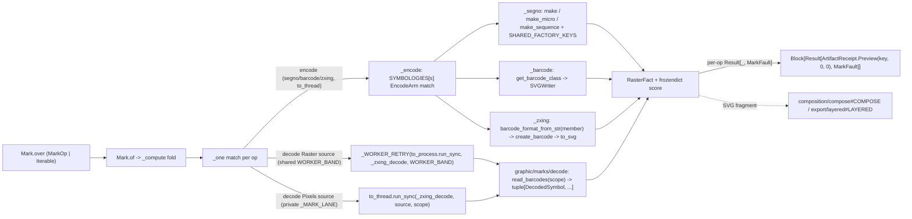

# [PY_ARTIFACTS_GRAPHIC_MARKS_ENCODE]

The machine-readable-mark generation owner. `Mark` is ONE owner over the host-free encoded-mark codec discriminating symbology over the closed `Symbology` vocabulary: segno (QR/Micro-QR and structured-append sequence generation with the full factory-parameter axis, the `segno.helpers` structured-payload grammar, and the full `SvgStyle` SVG serializer band — the per-module `finder_dark`/`data_dark`/`alignment_dark`/`timing_dark`/`version_dark`/`format_dark`/`dark_module`/`separator`/`quiet_zone` color axis and the `svgclass`/`lineclass`/`svgid`/`omitsize`/`unit`/`title`/`desc`/`xmldecl`/`svgns`/`svgversion`/`nl`/`draw_transparent` structural axis a `dark`/`light`-only slice drops), python-barcode (the linear 1D symbology registry over `SVGWriter`), and zxing-cpp (the 2D-matrix DataMatrix/PDF417/Compact PDF417/Aztec/MaxiCode/rMQR `create_barcode`/`Barcode.to_svg` dependency-free encode arm spanning the complete `AllCreatable` matrix set) — all importing on the runtime. One mark surface, not a per-symbology code class, not a per-operation function family, not an erased `opts` bag, and not a fault-free pass that drops every provider raise on the floor.

Every encode arm is fallible at the provider edge AND at the serializer edge, and the interior is total over `Result[RasterFact, MarkFault]`: segno raises `DataOverflowError` on a payload past the largest version (mapped at the factory call onto `MarkFault.overflow`) or a non-overflow `ValueError` on a type-admitted but domain-invalid factory parameter (an out-of-range `version`/`mask`/`mode`/`error`, mapped onto `MarkFault.parameter`) and a serializer `ValueError` on a rejected `SvgStyle` combination (`omitsize` with `unit`, a malformed color or `svgversion`) mapped onto `MarkFault.render` at the `symbol.save` call rather than escaping past the encode try as the former bare unwrapped `save` did, python-barcode raises the `errors.BarcodeError` family (`BarcodeNotFoundError`/`IllegalCharacterError`/`NumberOfDigitsError`/`WrongCountryCodeError`), and zxing-cpp raises `ValueError("Invalid ecLevel: …")` on an out-of-range `ec_level` — each named exactly once at its arm and mapped into the closed `MarkFault` `@tagged_union`, never a bare `except Exception` flattening the causes and never a railless `_compute` that lets the raise escape the capsule. The option knobs cross the seam as ONE closed `MarkPayload` `TypedDict` admitted through a module-level `TypeAdapter` into an immutable `frozendict` evidence band, so no interior arm re-validates a `dict[str, object]`, and structured QR content (`wifi`/`vcard`/`mecard`/`geo`/`email`) is admitted through the `Content` family that folds to canonical text through `segno.helpers.make_*_data` exactly once before encode.

`Mark` owns the full call modality: `Mark.over` normalizes `MarkOp | Iterable[MarkOp]` into one `ops` tuple at the head, so a single mark and a mixed QR + linear + 2D-matrix label sheet are the same entrypoint discriminating on input shape, `of` gathers the sheet into one `Block[Result[ArtifactReceipt, MarkFault]]` survivor stream — each mark railed on its own slot exactly as the sibling `graphic/raster/io#RASTER` batch does, so one malformed mark faults itself without discarding the sheet — and `lru_cache` collapses a repeated row to one encode. Every operation folds into one typed `RasterFact` whose `score` is a `frozendict` keyed by the `MarkFact` evidence vocabulary (segno designator/version/error/mask/symbol-size, the python-barcode `get_fullcode` check digit, the zxing resolved format/ec-level) and returns a `RuntimeRail[Block[Result[ArtifactReceipt, MarkFault]]]` whose per-op `ArtifactReceipt.Preview` carries the content key, the default zero pixel dimensions (the encode SVG path carries no raster; the module extent rides the score), and the `RasterFact.score` evidence threaded straight onto `Preview.scores`. The `MarkOp` family spans `Encode` (this page's three-arm generation, each native render offloaded off the runtime loop) and `Decode` (the rich `read_barcodes` inverse owned by `graphic/marks/decode#DECODE`, whose `_zxing_decode(source, scope)` worker folds every decoded `DecodedSymbol` into the shared `RasterFact`). The decode band is the `DecodeSource` case the `_one` arm dispatches, not a knob: a `Raster` source crosses the `faults`-owned `to_process.run_sync` subprocess seam because `Image.open` decodes untrusted bytes that earn crash isolation, while a `Pixels` `numpy` frame crosses an `anyio.to_thread.run_sync` slot because the trusted already-decoded frame shares the address space with no pickle — both off the loop. The gated `Raster` decode contends the ONE shared `execution/lanes#LANE` `WORKER_BAND` `CapacityLimiter` under a `stamina.AsyncRetryingCaller(...).on(BrokenWorkerProcess)` retry — the exact `_WORKER_RETRY` + `WORKER_BAND` seam `graphic/raster/io#RASTER` threads every native `to_process` crossing through, so the marks Pillow `Image.open` decode lands on the same bounded native worker pool as the raster/detect/metadata/color arms rather than a private lane that oversubscribes the host against them, and a transient OOM/signal worker death recovers before the slot faults — while the in-process `to_thread` encode render and the trusted `Pixels` decode keep the private `_MARK_LANE`, never inline on the event loop. `RasterFact` is declared on the worker `graphic/raster/io#RASTER` owner; this page re-declares the minimal `(data, width, height, score)` shape so the mark codec folds the same fact into the shared `ArtifactReceipt.Preview` without importing the worker owner, and `graphic/marks/decode#DECODE` imports that one declaration rather than re-stating it.

## [01]-[INDEX]

- [01]-[MARK]: machine-readable-mark generation-and-decode owner over segno, python-barcode, and zxing-cpp — the `Symbology` vocabulary keyed straight against the `SYMBOLOGIES` `EncodeArm` dispatch table (the `qr` case carrying its `SegnoFactory` plus per-row `SegnoKey` accepts, `linear` carrying nothing, `matrix` carrying its zxing `BarcodeFormat` display name, spanning QR/Micro-QR, linear 1D, and 2D-matrix classes), the `MarkOp` two-case family (`Encode` symbology generation folding to one offloaded SVG `RasterFact` on this page, `Decode` the round-trip inverse over `read_barcodes` on `graphic/marks/decode#DECODE`), the closed `MarkFault` provider-exception vocabulary, the `MarkPayload` typed option band, and the `Content` structured-payload family — all dispatch-table-folded with zero re-discriminating arm and one `assert_never` exhaustiveness witness per `match`.

## [02]-[MARK]

- Owner: `Mark` the one machine-readable-mark owner holding `ops: tuple[MarkOp, ...]` and discriminating operation over the closed `MarkOp` family; `MarkOp` an `expression.tagged_union` whose every case carries its own typed payload (`encode` a `(str, Symbology, frozendict[str, object])`, `decode` a `(DecodeSource, DecodeScope)`), never a shared erased `params` dict; `RasterFact` the one typed result every arm folds into — `data`/`width`/`height`/`score` recovering the encoded SVG bytes, the default zero pixel dimensions, and the `frozendict` evidence map — projected to `core/receipt#RECEIPT` `ArtifactReceipt.Preview` at the boundary; segno the QR/sequence arm, python-barcode the linear arm, and zxing-cpp the 2D-matrix arm folded by the `SYMBOLOGIES` `EncodeArm` cases, with the `Decode` round-trip the zxing-cpp `read_barcodes` inverse owned by `graphic/marks/decode#DECODE`. The `SYMBOLOGIES` table is the egress-grade collapse: each row IS one `EncodeArm` case (`qr` holding the `SegnoFactory` plus per-row `SegnoKey` accepts, `linear` carrying nothing, `matrix` carrying its zxing `BarcodeFormat` display name), so `_encode` routes by one table lookup plus one three-arm `match` with no `.arm`/`.member` hop, never a per-operation sibling function and never a re-discriminating `match` inside an arm.
- Cases: `MarkOp` cases — `Encode(content, symbology, opts)` (the machine-readable-mark arm carrying the resolved-text content, the typed `Symbology` sub-axis, and the admitted `frozendict` option band — QR/Micro-QR/structured-append sequence over segno, the linear (1D) symbologies over the python-barcode registry, and the 2D-matrix DataMatrix/PDF417/Compact PDF417/Aztec/MaxiCode/rMQR classes over zxing-cpp `create_barcode`/`Barcode.to_svg`, all serializing to the dependency-free SVG path) · `Decode(source, scope)` (the round-trip inverse over zxing-cpp `read_barcodes`, carrying the `graphic/marks/decode#DECODE`-owned `DecodeSource` raster-bytes/pixel-array family and the `DecodeScope` detector policy, recovering the full `tuple[DecodedSymbol, ...]` evidence the decoder owns) — admitted through the two-tier `of_encode`/`of_decode` validated factories and matched by one total `match`/`case` with `assert_never`; the QR-only literal is COLLAPSED into the `Encode` case whose `EncodeArm` case keys the encoder, the 2D-matrix routing is RESOLVED by the `matrix` `EncodeArm` case carrying its zxing `BarcodeFormat` display name, and the process-vs-thread decode band is the `DecodeSource` case (a `Raster` source the crash-isolated `to_process` seam, a `Pixels` frame the `to_thread` slot), never a sibling op per symbology, never a separate-2D-matrix owner, and never an `engine`/`gated` knob.
- Modality: `Mark.over` is the one modal-arity entrypoint normalizing `MarkOp | Iterable[MarkOp]` into the `ops` tuple by a structural `match` at the head, so a lone mark is the one-element case and a mixed-symbology label sheet is the multi-element case under the identical surface — never an `encode`/`decode` knob, never a `batch: bool`, and never a per-symbology or `of_many` sibling. The operation is the value's `MarkOp` case; the arity is the value's shape.
- Receipt: each operation folds into `RasterFact` and projects to `core/receipt#RECEIPT` `ArtifactReceipt.Preview(key, width, height, scores)` at the rail boundary, threading `RasterFact.score` straight onto the `Preview.scores` `frozendict[str, float | str]` band; the `Encode` arms report the default zero pixel dimensions (the SVG path carries no raster) and stamp the resolved evidence onto the `RasterFact.score` `frozendict` keyed by the `MarkFact` vocabulary — segno's `designator`/`version`/`error`/`mask`/`mode`/`symbol_size`, the python-barcode `get_fullcode`/`symbology`, or the zxing `format` plus its rolled-up `symbology` FAMILY (`Barcode.symbology`, distinct from the precise `Barcode.format`) and the requested `ec_level` — and the `Decode` arm reports the decoded `text`/`format`/`valid`/`position` round-trip facts on the same map the rail consumer reads inline. The `Preview.scores` band already carries the marks `str` facts beside the `graphic/raster/measure#MEASURE` perceptual `float` band, so this owner delivers them in; the lone residual is the `core/receipt#RECEIPT` `_facts` arm projecting `scores` outward, never a new receipt case here.
- Faults: `MarkFault` is the one closed `@tagged_union` vocabulary every arm maps its provider raise into — `overflow` (segno `DataOverflowError`, carrying the `Symbology`), `parameter` (a non-overflow segno factory `ValueError` on a type-admitted but domain-invalid `version`/`mask`/`mode`/`error` value, the encode-time sibling of the serializer-time `render` cause, so a bad factory option rails rather than escaping the capsule), `unknown`/`illegal`/`arity` (the python-barcode `errors.*` family), `ec_level` (the zxing `ValueError`), `content` (a `segno.helpers` payload-format failure or an empty decode payload), `render` (a `segno.QRCode.save` serializer `ValueError` on a rejected `SvgStyle` combination, structurally distinct from the admission-time `options` cause), `options` (a `MarkPayload` `ValidationError`, the case now a `tuple[str, ...]` carrying every `.errors()` `loc` path exactly as the sibling `export/layered#LAYERED` `ExportFault.payload` does, never the first error's `type` alone), `geometry` (an `svgelements` parse/bounds failure on the `layered` projection), `worker` (an `anyio.BrokenWorkerProcess` the stamina schedule exhausted on the `Decode` subprocess seam), `decode` (a `graphic/marks/decode#DECODE` `MarkDecodeError` source-open fault — the `DecodeFault` `UNREADABLE`/`MALFORMED` value carried per-op so a corrupt decode source rails its own `Block` slot rather than escaping to the outer `async_boundary` as an opaque `BoundaryFault`), and `contract` (a `BeartypeCallHintViolation` the `_contracted` definition-time weave lifts onto `_encode`'s rail, never raising into `_one`) — each provider exception named exactly at the arm that raises it, never a bare `except Exception` and never `None`-as-failure; recovery keys on the case, never a reconstructed message.
- Content: `Content` is the closed structured-payload family the segno arm admits — `raw` text plus the small-grammar `wifi`(ssid/password/security/hidden), `geo`(lat/lng), and `email`(to/cc/bcc/subject/body) tuple cases and the rich-grammar `vcard`/`mecard` cases carrying the full closed `VCardFields`/`MeCardFields` `TypedDict` their `_data` twin accepts — `VCardFields` the complete 26-field `make_vcard_data` grammar (name/displayname, the email/phone/fax/videophone/cellphone/homephone/workphone contact axis, the memo/nickname/birthday/url/title/photo_uri/source/rev metadata, the pobox/street/city/region/zipcode/country address block, org, and lat/lng), `MeCardFields` the complete 16-field `make_mecard_data` grammar — never the 6-field vcard slice the prior tuple case modeled while its prose claimed the full grammar. Each folds to canonical QR text through `make_wifi_data`/`make_vcard_data`/`make_mecard_data`/`make_geo_data`/`make_make_email_data` in `_resolved_content` exactly once at `of_encode` ingress (the rich cases spreading the admitted `TypedDict` as `**fields`), so the imaging owner never hand-concatenates a `WIFI:`/`vCard` grammar and never models a thin slice of a contact the helper carries in full; a malformed payload maps onto `MarkFault.content`, and the resolved text is the canonical `Encode` content every arm sees, never a structured object threaded into the interior.
- Growth: a new segno factory parameter is one `SHARED_FACTORY_KEYS` entry or one per-row `SegnoKey` accept; a new segno symbol kind is one `SYMBOLOGIES` row binding `EncodeArm(qr=...)` with its `SegnoFactory`; a new structured payload is one `Content` case plus one `_resolved_content` arm over its `segno.helpers` member, and a richer existing payload is one more field on its case tuple; a new linear symbology is one `SYMBOLOGIES` row binding `EncodeArm(linear=None)` whose `Symbology.value` resolves the python-barcode `PROVIDED_BARCODES` registry; a new 2D-matrix symbology is one `SYMBOLOGIES` row binding `EncodeArm(matrix=...)` with its zxing `BarcodeFormat` display name — the complete `AllCreatable` matrix set DataMatrix/PDF417/Compact PDF417/Aztec/MaxiCode/rMQR all land that way, and any future creatable zxing format is one more row; a new fault cause is one `MarkFault` case; a new evidence fact is one `MarkFact` member the owning arm stamps (the `matrix` arm's rolled-up `symbology` FAMILY beside `format`/`ec_level` is exactly that, and `zxingcpp.barcode_formats_list(BarcodeFormat.AllCreatable)` enumerates the creatable roster the `matrix` rows must stay a subset of); a new option knob is one `MarkPayload` key, a new segno SVG serializer knob is one `SvgStyle` band key, and a new python-barcode geometry knob is one `WriterOptions` key; a self-contained inline document embed or a custom TYPE_*-classified render is one segno growth axis on the `qr` arm (`QRCode.svg_data_uri`/`png_data_uri` for a `data:` URI landing straight in an HTML/SVG tree with no asset write, `QRCode.matrix_iter(verbose=True)` streaming the `consts.TYPE_*` per-module classification a custom renderer consumes); a new decode scope or source band is one `ScopeKind`/`DecodeSource` case on `graphic/marks/decode#DECODE` (the `Decode` op carries its `DecodeSource`/`DecodeScope`, never a per-symbology decode sibling here); zero new surface.

```python signature
from collections.abc import Callable, Iterable
from enum import StrEnum
from functools import lru_cache, wraps
from io import BytesIO
from typing import TYPE_CHECKING, Literal, NotRequired, ReadOnly, Required, Self, TypedDict, Unpack, assert_never

import stamina
from anyio import BrokenWorkerProcess, CapacityLimiter, to_process, to_thread
from beartype import BeartypeConf, beartype
from beartype.roar import BeartypeCallHintViolation
from builtins import frozendict
from expression import Error, Ok, Result, case, tag, tagged_union
from expression.collections import Block
from expression.extra.result import traverse
from msgspec import Struct
from pydantic import TypeAdapter, ValidationError

from rasm.runtime.content_identity import ContentIdentity
from rasm.runtime.faults import RuntimeRail, async_boundary
from rasm.runtime.lanes import WORKER_BAND

from artifacts.export.layered import Layer
from artifacts.core.receipt import ArtifactReceipt

lazy import barcode
lazy import segno
lazy import zxingcpp
lazy from barcode.errors import BarcodeNotFoundError, IllegalCharacterError, NumberOfDigitsError, WrongCountryCodeError
lazy from segno import helpers
lazy from svgelements import SVG

lazy from artifacts.graphic.marks.decode import DecodeSource, MarkDecodeError, _zxing_decode

if TYPE_CHECKING:
    from segno import QRCode, QRCodeSequence

    from artifacts.graphic.marks.decode import (
        DecodeScope,
    )  # DecodeSource rides the runtime `lazy from` above (used in the `_one` match); annotation-only DecodeScope stays type-checking-only


# --- [TYPES] ----------------------------------------------------------------------------
class Symbology(StrEnum):
    QR = "qr"
    MICRO_QR = "micro-qr"
    QR_SEQUENCE = "qr-sequence"
    CODE128 = "code128"
    CODE39 = "code39"
    EAN13 = "ean13"
    EAN8 = "ean8"
    EAN14 = "ean14"
    UPCA = "upca"
    ITF = "itf"
    CODABAR = "codabar"
    ISBN10 = "isbn10"
    ISBN13 = "isbn13"
    ISSN = "issn"
    PZN = "pzn"
    GS1_128 = "gs1_128"
    DATA_MATRIX = "data-matrix"
    PDF417 = "pdf417"
    COMPACT_PDF417 = "compact-pdf417"
    AZTEC = "aztec"
    MAXICODE = "maxicode"
    RMQR = "rmqr"


class SegnoFactory(StrEnum):
    MAKE = "make"
    MAKE_MICRO = "make_micro"
    MAKE_SEQUENCE = "make_sequence"


class SegnoKey(StrEnum):
    ECI = "eci"
    MICRO = "micro"
    SYMBOL_COUNT = "symbol_count"


class MarkFact(StrEnum):
    DESIGNATOR = "designator"
    VERSION = "version"
    ERROR = "error"
    MASK = "mask"
    MODE = "mode"
    SYMBOL_SIZE = "symbol_size"
    SYMBOLS = "symbols"
    FULLCODE = "fullcode"
    SYMBOLOGY = "symbology"
    FORMAT = "format"
    FAMILY = "family"
    EC_LEVEL = "ec_level"


@tagged_union(frozen=True)
class EncodeArm:
    tag: Literal["qr", "linear", "matrix"] = tag()
    qr: tuple[SegnoFactory, tuple[SegnoKey, ...]] = case()
    linear: None = case()
    matrix: str = case()


class VCardFields(TypedDict, closed=True):
    name: Required[ReadOnly[str]]
    displayname: Required[ReadOnly[str]]
    email: NotRequired[ReadOnly[str]]
    phone: NotRequired[ReadOnly[str]]
    fax: NotRequired[ReadOnly[str]]
    videophone: NotRequired[ReadOnly[str]]
    cellphone: NotRequired[ReadOnly[str]]
    homephone: NotRequired[ReadOnly[str]]
    workphone: NotRequired[ReadOnly[str]]
    memo: NotRequired[ReadOnly[str]]
    nickname: NotRequired[ReadOnly[str]]
    birthday: NotRequired[ReadOnly[str]]
    url: NotRequired[ReadOnly[str]]
    pobox: NotRequired[ReadOnly[str]]
    street: NotRequired[ReadOnly[str]]
    city: NotRequired[ReadOnly[str]]
    region: NotRequired[ReadOnly[str]]
    zipcode: NotRequired[ReadOnly[str]]
    country: NotRequired[ReadOnly[str]]
    org: NotRequired[ReadOnly[str]]
    title: NotRequired[ReadOnly[str]]
    photo_uri: NotRequired[ReadOnly[str]]
    source: NotRequired[ReadOnly[str]]
    rev: NotRequired[ReadOnly[str]]
    lat: NotRequired[ReadOnly[float]]
    lng: NotRequired[ReadOnly[float]]


class MeCardFields(TypedDict, closed=True):
    name: Required[ReadOnly[str]]
    reading: NotRequired[ReadOnly[str]]
    email: NotRequired[ReadOnly[str]]
    phone: NotRequired[ReadOnly[str]]
    videophone: NotRequired[ReadOnly[str]]
    memo: NotRequired[ReadOnly[str]]
    nickname: NotRequired[ReadOnly[str]]
    birthday: NotRequired[ReadOnly[str]]
    url: NotRequired[ReadOnly[str]]
    pobox: NotRequired[ReadOnly[str]]
    roomno: NotRequired[ReadOnly[str]]
    houseno: NotRequired[ReadOnly[str]]
    city: NotRequired[ReadOnly[str]]
    prefecture: NotRequired[ReadOnly[str]]
    zipcode: NotRequired[ReadOnly[str]]
    country: NotRequired[ReadOnly[str]]


@tagged_union(frozen=True)
class Content:
    tag: Literal["raw", "wifi", "vcard", "mecard", "geo", "email"] = tag()
    raw: str = case()
    wifi: tuple[str, str | None, str | None, bool] = case()
    vcard: VCardFields = case()
    mecard: MeCardFields = case()
    geo: tuple[float, float] = case()
    email: tuple[str, str | None, str | None, str | None, str | None] = case()


class SvgStyle(TypedDict, closed=True):
    finder_dark: NotRequired[ReadOnly[str]]
    finder_light: NotRequired[ReadOnly[str]]
    data_dark: NotRequired[ReadOnly[str]]
    data_light: NotRequired[ReadOnly[str]]
    alignment_dark: NotRequired[ReadOnly[str]]
    alignment_light: NotRequired[ReadOnly[str]]
    timing_dark: NotRequired[ReadOnly[str]]
    timing_light: NotRequired[ReadOnly[str]]
    version_dark: NotRequired[ReadOnly[str]]
    version_light: NotRequired[ReadOnly[str]]
    format_dark: NotRequired[ReadOnly[str]]
    format_light: NotRequired[ReadOnly[str]]
    dark_module: NotRequired[ReadOnly[str]]
    separator: NotRequired[ReadOnly[str]]
    quiet_zone: NotRequired[ReadOnly[str]]
    svgclass: NotRequired[ReadOnly[str]]
    lineclass: NotRequired[ReadOnly[str]]
    svgid: NotRequired[ReadOnly[str]]
    title: NotRequired[ReadOnly[str]]
    desc: NotRequired[ReadOnly[str]]
    unit: NotRequired[ReadOnly[str]]
    encoding: NotRequired[ReadOnly[str]]
    svgversion: NotRequired[ReadOnly[float]]
    omitsize: NotRequired[ReadOnly[bool]]
    svgns: NotRequired[ReadOnly[bool]]
    xmldecl: NotRequired[ReadOnly[bool]]
    nl: NotRequired[ReadOnly[bool]]
    draw_transparent: NotRequired[ReadOnly[bool]]


class WriterOptions(TypedDict, closed=True):
    module_width: NotRequired[ReadOnly[float]]
    module_height: NotRequired[ReadOnly[float]]
    quiet_zone: NotRequired[ReadOnly[float]]
    font_size: NotRequired[ReadOnly[int]]
    font_path: NotRequired[ReadOnly[str]]
    text_distance: NotRequired[ReadOnly[float]]
    text_line_distance: NotRequired[ReadOnly[float]]
    background: NotRequired[ReadOnly[str]]
    foreground: NotRequired[ReadOnly[str]]
    center_text: NotRequired[ReadOnly[bool]]
    guard_height_factor: NotRequired[ReadOnly[float]]
    margin_top: NotRequired[ReadOnly[float]]
    margin_bottom: NotRequired[ReadOnly[float]]
    compress: NotRequired[ReadOnly[bool]]
    with_doctype: NotRequired[ReadOnly[bool]]


class MarkPayload(TypedDict, closed=True):
    error: NotRequired[ReadOnly[str]]
    version: NotRequired[ReadOnly[int | str]]
    mode: NotRequired[ReadOnly[str]]
    mask: NotRequired[ReadOnly[int]]
    encoding: NotRequired[ReadOnly[str]]
    boost_error: NotRequired[ReadOnly[bool]]
    eci: NotRequired[ReadOnly[bool]]
    micro: NotRequired[ReadOnly[bool]]
    symbol_count: NotRequired[ReadOnly[int]]
    ec_level: NotRequired[ReadOnly[str | int]]
    scale: NotRequired[ReadOnly[int]]
    border: NotRequired[ReadOnly[int]]
    margin: NotRequired[ReadOnly[int]]
    dark: NotRequired[ReadOnly[str]]
    light: NotRequired[ReadOnly[str]]
    svg: NotRequired[ReadOnly[SvgStyle]]
    add_hrt: NotRequired[ReadOnly[bool]]
    add_quiet_zones: NotRequired[ReadOnly[bool]]
    text: NotRequired[ReadOnly[str]]
    writer_options: NotRequired[ReadOnly[WriterOptions]]


# --- [MODELS] ---------------------------------------------------------------------------
class RasterFact(Struct, frozen=True):
    data: bytes
    width: int = 0
    height: int = 0
    score: frozendict[str, float | str] = (
        frozendict()
    )  # the value band matches the declaring graphic/raster/io#RASTER owner so a sibling decode COUNT/VALID/BUILD fact rides as a native float beside the encode str facts


# --- [ERRORS] ---------------------------------------------------------------------------
@tagged_union(frozen=True)
class MarkFault:
    tag: Literal[
        "overflow", "parameter", "unknown", "illegal", "arity", "ec_level", "content", "render", "options", "geometry", "worker", "decode", "contract"
    ] = tag()
    overflow: Symbology = case()
    parameter: str = case()
    unknown: str = case()
    illegal: str = case()
    arity: str = case()
    ec_level: str = case()
    content: str = case()
    render: str = case()
    options: tuple[str, ...] = case()
    geometry: str = case()
    worker: str = case()
    decode: str = case()  # a graphic/marks/decode#DECODE source-open fault (UNREADABLE/MALFORMED), the DecodeFault value carried per-op so a corrupt decode source rails its own slot rather than aborting the sheet through the outer boundary
    contract: str = case()
```

`RasterFact` is the one fact every arm yields — bytes plus the default zero pixel dimensions plus the `frozendict` evidence map keyed by the `MarkFact` vocabulary — so `_one` projects one shape into `ArtifactReceipt.Preview` regardless of op; the `score` is `frozendict` (not a mutable `dict` default an immutable struct rejects) and its keys are `MarkFact` members (not bare strings restating what the program already names). `RasterFact` is the worker `graphic/raster/io#RASTER` owner's value object re-declared here as the identical `(data, width, height, score: frozendict[str, float | str])` shape — the value band widened to `float | str` to equal the declaring owner and the `core/receipt#RECEIPT` `Preview.scores` band exactly, so the encode arms' `str` facts and the sibling `graphic/marks/decode#DECODE` arm's native-`float` `COUNT`/`VALID`/`BUILD` facts both fold losslessly through one mint with no `str()` coerce — so the mark codec folds the same fact into the shared `ArtifactReceipt.Preview` without importing the worker owner. `SYMBOLOGIES` maps each `Symbology` straight to one `EncodeArm` case, so the zxing `BarcodeFormat` display name lives on the `matrix` case that alone consumes it; the `qr` case carries its `SegnoFactory` plus `SegnoKey` accepts, `linear` carries nothing (the python-barcode registry resolves off `Symbology.value`), and no dead `member` column rides the QR or linear rows — `graphic/marks/decode#DECODE` owns its own `_FORMAT` `Symbology -> BarcodeFormat` table and never reads the encode rows. `MarkFault` is the closed provider-exception vocabulary the interior is total over.

```python signature
# --- [OPERATIONS] -----------------------------------------------------------------------
_PAYLOAD = TypeAdapter(MarkPayload)
# the private in-process lane — the segno/python-barcode/zxing render and the trusted `Pixels` decode ride `to_thread`
# slots against this bound so the native render never runs inline on the event loop; the gated `Raster` decode instead
# contends the SHARED `WORKER_BAND` beside every other native `to_process` arm (raster/detect/metadata/color) rather than
# oversubscribing the host against them on a private lane, so `_MARK_LANE` bounds only the in-process thread work.
_MARK_LANE: CapacityLimiter = CapacityLimiter(8)
# every gated `Raster` decode `to_process` crossing wraps this retry (the exemplar `graphic/raster/io#RASTER` `_WORKER_RETRY`)
# so a transient OOM/signal worker death recovers before the slot faults; a deterministic crash exhausts it and rails `worker`.
_WORKER_RETRY = stamina.AsyncRetryingCaller(attempts=3, timeout=30.0).on(BrokenWorkerProcess)


def _admit(raw: MarkPayload, /) -> Result[frozendict[str, object], MarkFault]:
    try:
        admitted = _PAYLOAD.validate_python(raw)
    except ValidationError as fault:
        return Error(MarkFault(options=tuple(str(error["loc"]) for error in fault.errors())))
    return Ok(frozendict({key: frozendict(value) if isinstance(value, dict) else value for key, value in admitted.items()}))


def _resolved_content(content: Content, /) -> Result[str, MarkFault]:
    try:
        match content:
            case Content(tag="raw", raw=text):
                return Ok(text)
            case Content(tag="wifi", wifi=(ssid, password, security, hidden)):
                return Ok(helpers.make_wifi_data(ssid=ssid, password=password, security=security, hidden=hidden))
            case Content(tag="vcard", vcard=fields):
                return Ok(helpers.make_vcard_data(**fields))
            case Content(tag="mecard", mecard=fields):
                return Ok(helpers.make_mecard_data(**fields))
            case Content(tag="geo", geo=(lat, lng)):
                return Ok(helpers.make_geo_data(lat, lng))
            case Content(tag="email", email=(to, cc, bcc, subject, body)):
                return Ok(helpers.make_make_email_data(to=to, cc=cc, bcc=bcc, subject=subject, body=body))
            case _ as unreachable:
                assert_never(unreachable)
    except (ValueError, TypeError) as fault:
        return Error(MarkFault(content=str(fault)))


@tagged_union(frozen=True)
class MarkOp:
    tag: Literal["encode", "decode"] = tag()
    encode: tuple[str, Symbology, frozendict[str, object]] = case()
    decode: "tuple[DecodeSource, DecodeScope]" = case()

    @staticmethod
    def Encode(content: str, symbology: Symbology, opts: frozendict[str, object] = frozendict(), /) -> "MarkOp":
        return MarkOp(encode=(content, symbology, opts))

    @staticmethod
    def Decode(source: "DecodeSource", scope: "DecodeScope", /) -> "MarkOp":
        return MarkOp(decode=(source, scope))

    @staticmethod
    def of_encode(content: Content, symbology: Symbology, /, **opts: Unpack[MarkPayload]) -> Result["MarkOp", MarkFault]:
        return _resolved_content(content).bind(lambda text: _admit(opts).map(lambda band: MarkOp.Encode(text, symbology, band)))

    @staticmethod
    def of_decode(source: "DecodeSource", scope: "DecodeScope", /) -> Result["MarkOp", MarkFault]:
        return Ok(MarkOp.Decode(source, scope)) if source.tag != "raster" or source.raster else Error(MarkFault(content="<empty-payload>"))


SHARED_FACTORY_KEYS: tuple[str, ...] = ("error", "version", "mode", "mask", "encoding", "boost_error")
ZXING_CREATE_KEYS: tuple[str, ...] = ("ec_level", "width", "height", "margin")


def _segno(
    factory: SegnoFactory, accepts: tuple[SegnoKey, ...], content: str, symbology: Symbology, opts: frozendict[str, object], /
) -> Result[RasterFact, MarkFault]:
    keys = (*SHARED_FACTORY_KEYS, *accepts)
    try:
        symbol = getattr(segno, factory)(content, **{key: opts[key] for key in keys if key in opts})
    except segno.DataOverflowError:
        return Error(MarkFault(overflow=symbology))
    except ValueError as fault:
        return Error(MarkFault(parameter=str(fault)))
    sink = BytesIO()
    try:
        symbol.save(
            sink,
            kind="svg",
            scale=opts.get("scale", 1),
            border=opts.get("border"),
            dark=opts.get("dark", "#000"),
            light=opts.get("light"),
            **opts.get("svg", frozendict()),
        )
    except ValueError as fault:
        return Error(MarkFault(render=str(fault)))
    return Ok(RasterFact(sink.getvalue(), score=_segno_score(factory, symbol, opts)))


def _segno_score(factory: SegnoFactory, symbol: "QRCode | QRCodeSequence", opts: frozendict[str, object], /) -> frozendict[str, str]:
    if factory is SegnoFactory.MAKE_SEQUENCE:
        return frozendict({MarkFact.SYMBOLS: str(len(symbol))})
    width, height = symbol.symbol_size(scale=opts.get("scale", 1), border=opts.get("border"))
    return frozendict({
        MarkFact.DESIGNATOR: symbol.designator,
        MarkFact.VERSION: str(symbol.version),
        MarkFact.ERROR: str(symbol.error),
        MarkFact.MASK: str(symbol.mask),
        MarkFact.MODE: str(symbol.mode),
        MarkFact.SYMBOL_SIZE: f"{width}x{height}",
    })


def _barcode(content: str, symbology: Symbology, opts: frozendict[str, object], /) -> Result[RasterFact, MarkFault]:
    sink = BytesIO()
    try:
        symbol = barcode.get_barcode_class(symbology.value)(content, writer=barcode.writer.SVGWriter())
        symbol.write(sink, options=opts.get("writer_options"), text=opts.get("text"))
    except BarcodeNotFoundError:
        return Error(MarkFault(unknown=symbology.value))
    except IllegalCharacterError as fault:
        return Error(MarkFault(illegal=str(fault)))
    except (NumberOfDigitsError, WrongCountryCodeError) as fault:
        return Error(MarkFault(arity=str(fault)))
    return Ok(RasterFact(sink.getvalue(), score=frozendict({MarkFact.FULLCODE: symbol.get_fullcode(), MarkFact.SYMBOLOGY: symbology.value})))


def _zxing(member: str, content: str, opts: frozendict[str, object], /) -> Result[RasterFact, MarkFault]:
    fmt = zxingcpp.barcode_format_from_str(member)
    try:
        symbol = zxingcpp.create_barcode(content, fmt, **{key: opts[key] for key in ZXING_CREATE_KEYS if key in opts})
    except ValueError as fault:
        return Error(MarkFault(ec_level=str(fault)))
    svg = symbol.to_svg(
        scale=int(opts.get("scale", 1)), add_hrt=bool(opts.get("add_hrt", False)), add_quiet_zones=bool(opts.get("add_quiet_zones", True))
    )
    return Ok(
        RasterFact(
            svg.encode(),
            score=frozendict({
                MarkFact.FORMAT: str(symbol.format),  # the precise 3.0 display name ('Data Matrix'/'PDF417'/'Aztec')
                MarkFact.FAMILY: str(symbol.symbology),  # the rolled-up BarcodeFormat.symbology family (MicroPDF417 -> PDF417) distinct from .format
                MarkFact.EC_LEVEL: str(opts.get("ec_level", "")),
            }),
        )
    )


_CONTRACT = BeartypeConf(is_pep484_tower=True)


def _contracted(
    operation: Callable[[str, Symbology, frozendict[str, object]], Result[RasterFact, MarkFault]], /
) -> Callable[[str, Symbology, frozendict[str, object]], Result[RasterFact, MarkFault]]:
    guarded = beartype(conf=_CONTRACT)(operation)

    @wraps(operation)
    def call(content: str, symbology: Symbology, opts: frozendict[str, object], /) -> Result[RasterFact, MarkFault]:
        try:
            return guarded(content, symbology, opts)
        except BeartypeCallHintViolation as violation:
            return Error(MarkFault(contract=type(violation).__name__))

    return call


@lru_cache(maxsize=256)
@_contracted
def _encode(content: str, symbology: Symbology, opts: frozendict[str, object], /) -> Result[RasterFact, MarkFault]:
    match SYMBOLOGIES[symbology]:
        case EncodeArm(tag="qr", qr=(factory, accepts)):
            return _segno(factory, accepts, content, symbology, opts)
        case EncodeArm(tag="linear"):
            return _barcode(content, symbology, opts)
        case EncodeArm(tag="matrix", matrix=member):
            return _zxing(member, content, opts)
        case _ as unreachable:
            assert_never(unreachable)


SYMBOLOGIES: frozendict[Symbology, EncodeArm] = frozendict({
    Symbology.QR: EncodeArm(qr=(SegnoFactory.MAKE, (SegnoKey.ECI, SegnoKey.MICRO))),
    Symbology.MICRO_QR: EncodeArm(qr=(SegnoFactory.MAKE_MICRO, ())),
    Symbology.QR_SEQUENCE: EncodeArm(qr=(SegnoFactory.MAKE_SEQUENCE, (SegnoKey.SYMBOL_COUNT,))),
    Symbology.CODE128: EncodeArm(linear=None),
    Symbology.CODE39: EncodeArm(linear=None),
    Symbology.EAN13: EncodeArm(linear=None),
    Symbology.EAN8: EncodeArm(linear=None),
    Symbology.EAN14: EncodeArm(linear=None),
    Symbology.UPCA: EncodeArm(linear=None),
    Symbology.ITF: EncodeArm(linear=None),
    Symbology.CODABAR: EncodeArm(linear=None),
    Symbology.ISBN10: EncodeArm(linear=None),
    Symbology.ISBN13: EncodeArm(linear=None),
    Symbology.ISSN: EncodeArm(linear=None),
    Symbology.PZN: EncodeArm(linear=None),
    Symbology.GS1_128: EncodeArm(linear=None),
    Symbology.DATA_MATRIX: EncodeArm(matrix="Data Matrix"),
    Symbology.PDF417: EncodeArm(matrix="PDF417"),
    Symbology.COMPACT_PDF417: EncodeArm(matrix="Compact PDF417"),
    Symbology.AZTEC: EncodeArm(matrix="Aztec"),
    Symbology.MAXICODE: EncodeArm(matrix="MaxiCode"),
    Symbology.RMQR: EncodeArm(matrix="rMQR Code"),
})
```

The `SYMBOLOGIES` table folds every symbology to one `EncodeArm` case with zero re-discrimination inside an arm: `_encode` matches `SYMBOLOGIES[symbology]` over three cases. The `qr` case carries its own `SegnoFactory` and `SegnoKey` accepts so QR, Micro-QR, and the structured-append sequence are three distinct rows resolving three distinct segno factories (`make` / `make_micro` / `make_sequence`) through `getattr(segno, factory)` over the `SegnoFactory` member (the name travels as the enum, never a bare literal). The `SHARED_FACTORY_KEYS` tuple threads the six common factory parameters every segno factory accepts, and the per-row `accepts` column carries only the factory-specific keys — `eci`/`micro` on the `make` row, `symbol_count` on the `make_sequence` row, none on `make_micro` — so the key-filtered kwarg spread over the admitted `frozendict` threads exactly the parameters each factory admits with no over-key crashing a factory that rejects it. The serializer side is the symmetric collapse: `symbol.save(kind="svg")` spreads `scale`/`border`/`dark`/`light` plus the whole admitted `SvgStyle` band (`**opts.get("svg", frozendict())`), so segno's full per-module-color and structural SVG surface threads through one band rather than a `dark`/`light`-only slice, and the save is wrapped in a `try` mapping a serializer `ValueError` (a rejected style combination such as `omitsize` with `unit`) onto `MarkFault.render` — the former unwrapped `save` let that raise escape the encode capsule. The `make_sequence` row spans a large payload across multiple symbols in one `QRCodeSequence.save(kind="svg")` keyed by `symbol_count`, and `_segno_score` stamps the resolved `designator`/`version`/`error`/`mask`/`mode`/`symbol_size` on the `QRCode`-yielding rows and the spanned-symbol count (`len(QRCodeSequence)`) on the sequence row, guarded by the `factory is SegnoFactory.MAKE_SEQUENCE` identity so the `QRCodeSequence` never reaches the `QRCode`-only `designator`/`symbol_size` surface. The `linear` arm resolves the registry by `Symbology.value` against `PROVIDED_BARCODES`, stamps the `get_fullcode` human-readable check digit, and maps the four `errors.*` causes onto distinct `MarkFault` cases. The `matrix` arm reads the `matrix` case's zxing display name (verified to resolve through `barcode_format_from_str`, which accepts both the separated `'Data Matrix'` and separatorless `'DataMatrix'` spellings, never the `.name` re-parse the 3.0 `str()` rename breaks), encodes through `create_barcode(content, fmt, **opts)` keyed by the `ZXING_CREATE_KEYS` (`ec_level`/`width`/`height`/`margin`) filtered spread — `scale` is the `to_svg` serialize knob zxing places on the serializer, never a `create_barcode` kwarg — and serializes with `to_svg(scale=, add_hrt=, add_quiet_zones=True)` for dependency-free output; MaxiCode, Compact PDF417, and rMQR are all creatable in zxing 3.0 (verified `create_barcode(...).to_svg()`), so the `MAXICODE`/`COMPACT_PDF417`/`RMQR` rows encode rather than routing to a decode-only sibling, the six `matrix` rows spanning the complete `BarcodeFormat.AllCreatable` matrix set. No symbology mints a sibling owner; a new linear code is one `EncodeArm(linear=None)` row resolving off `Symbology.value`, a new segno symbol kind is one `EncodeArm(qr=...)` row carrying its `SegnoFactory` and factory-specific `accepts`, and a new 2D-matrix code is one `EncodeArm(matrix=...)` row carrying its zxing `BarcodeFormat` display name.

```python signature
# --- [COMPOSITION] ----------------------------------------------------------------------
def _normalized(ops: MarkOp | Iterable[MarkOp], /) -> tuple[MarkOp, ...]:
    match ops:
        case MarkOp():
            return (ops,)
        case _:
            return tuple(ops)


def _mark_bbox(svg: bytes, /) -> Result[tuple[float, float, float, float], MarkFault]:
    try:
        box = SVG.parse(BytesIO(svg), reify=True).bbox()
    except (ValueError, TypeError) as fault:
        return Error(MarkFault(geometry=str(fault)))
    return Ok(box) if box is not None else Error(MarkFault(geometry="<empty-bounds>"))


def _layer(name: str, count: int, index: int, encode: tuple[str, Symbology, frozendict[str, object]], /) -> Result[Layer, MarkFault]:
    content, symbology, opts = encode
    label = name if count == 1 else f"{name}-{index}"
    return _encode(content, symbology, opts).bind(lambda fact: _mark_bbox(fact.data).map(lambda box: Layer(label, fact.data, box)))


class Mark(Struct, frozen=True):
    ops: tuple[MarkOp, ...]

    @classmethod
    def over(cls, ops: MarkOp | Iterable[MarkOp], /) -> Self:
        return cls(ops=_normalized(ops))

    async def of(self) -> RuntimeRail[Block[Result[ArtifactReceipt, MarkFault]]]:
        return await async_boundary("mark.sheet", self._compute)

    async def _compute(self) -> Block[Result[ArtifactReceipt, MarkFault]]:
        # survivor batch (the sibling graphic/raster/io#RASTER shape): each op's Result rides its own slot in
        # the Block so one malformed mark faults itself without discarding the sheet's good marks, and the one
        # outer async_boundary wraps the bare Block exactly once (never a Result[Result[...], MarkFault] nesting).
        results: Block[Result[ArtifactReceipt, MarkFault]] = Block.empty()
        for op in self.ops:  # Exemption: async sequential fold — no async traverse exists, the carrier rebinds per awaited op.
            results = results.append(Block.singleton(await self._one(op)))
        return results

    async def _one(self, op: MarkOp, /) -> Result[ArtifactReceipt, MarkFault]:
        match op:
            case MarkOp(tag="encode", encode=(content, symbology, opts)):
                fact = await to_thread.run_sync(
                    _encode, content, symbology, opts, limiter=_MARK_LANE
                )  # native render off the loop; lru_cache stays in-process
            case MarkOp(tag="decode", decode=(source, scope)):
                try:
                    match source:
                        case DecodeSource(tag="raster"):
                            fact = Ok(
                                await _WORKER_RETRY(to_process.run_sync, _zxing_decode, source, scope, limiter=WORKER_BAND)
                            )  # untrusted bytes crash-isolated on the shared native worker band, transient death retried
                        case DecodeSource(tag="pixels"):
                            fact = Ok(
                                await to_thread.run_sync(_zxing_decode, source, scope, limiter=_MARK_LANE)
                            )  # trusted numpy frame shares the address space, no pickle — private in-process lane
                        case _ as unreachable:
                            assert_never(unreachable)
                except MarkDecodeError as unreadable:  # the decode source-open UNREADABLE/MALFORMED fault, railed per-op onto this slot (never the outer boundary), pickled back intact across the to_process seam
                    fact = Error(MarkFault(decode=unreadable.fault.value))
                except BrokenWorkerProcess as broken:  # a worker death the stamina schedule exhausted — retried transient, not a content fault
                    fact = Error(MarkFault(worker=type(broken).__name__))
            case _ as unreachable:
                assert_never(unreachable)
        return fact.map(lambda f: ArtifactReceipt.Preview(ContentIdentity.of(f"mark-{op.tag}", f.data), f.width, f.height, f.score))

    def layered(self, name: str, /) -> Result[Block[Layer], MarkFault]:
        encodes = tuple(op.encode for op in self.ops if op.tag == "encode")
        rows = Block.of_seq(enumerate(encodes))
        return traverse(lambda row: _layer(name, len(encodes), row[0], row[1]), rows)
```

`Mark.over` is the modal head: a lone `MarkOp` and an iterable of ops normalize through one structural `match` into the `ops` tuple, so `of` is the single async rail entry over both the one-mark and the label-sheet shapes, and `_compute` collects each op's `await self._one(op)` `Result[ArtifactReceipt, MarkFault]` onto its own slot in the returned `Block` — the survivor batch the sibling `graphic/raster/io#RASTER` owner shares, one malformed mark faulting itself rather than short-circuiting the sheet's good marks — so `async_boundary` wraps the bare `Block[Result[...]]` exactly once and never mints the `Result[Result[...], MarkFault]` nesting a `_compute` returning `Result[Block, MarkFault]` under a `RuntimeRail[Block]` boundary would. `_one` is the per-op `match` carrying the offloaded-encode-vs-offloaded-decode split: the `encode` case awaits the rail-total `_encode` on a `to_thread` slot — its `@lru_cache @_contracted` stack already lifted any `BeartypeCallHintViolation` onto `MarkFault.contract`, so the offloaded native render returns a `Result` rather than raising (no `try` in the dispatch body) and the in-process `lru_cache` still collapses a repeated row — and the `decode` case imports `_zxing_decode` at boundary scope (so the gated decoder body never lands on the core page and the encode↔decode module cycle never forms), threads the crash-isolated `Raster` crossing through `_WORKER_RETRY(to_process.run_sync, ...)` on the shared `WORKER_BAND` — the same stamina-guarded native worker seam the raster/detect/metadata/color arms share, so a transient worker death recovers and the marks decode never oversubscribes the host against them on a private lane — while the trusted `Pixels` frame rides a no-pickle `to_thread.run_sync` slot under the private `_MARK_LANE`; one `try` around both decode arms rails a `MarkDecodeError` source-open fault onto `MarkFault.decode` (the `DecodeFault` value per-op, so an unreadable/malformed decode source faults its own `Block` slot rather than escaping to the outer boundary) and a retry-exhausted `BrokenWorkerProcess` onto `MarkFault.worker`. `_encode` is `@lru_cache`-memoized over the hashable `(content, symbology, frozendict)` key, so a repeated row in a label sheet and the `layered` projection both reuse one encode rather than re-rendering — the re-encode the former `layer` arm paid every call. `layered` traverses the `Encode` ops alone (skipping `Decode` rows, which carry no SVG source), railing each `_mark_bbox` parse failure onto `MarkFault.geometry`, and binds each mark as one `Layer(label, source, bbox)` row with the label indexed against the `Encode`-local count and position — so a single mark beside one or more decodes still labels `name`, never `name-1` off a global op index.



## [03]-[RESEARCH]

- [TYPED_PAYLOAD] [RESOLVED]: the option knobs cross the seam as one closed `MarkPayload` `TypedDict` (`closed=True`, every key `NotRequired[ReadOnly[...]]`) admitted through the module-level `_PAYLOAD = TypeAdapter(MarkPayload)` into a `frozendict[str, object]` evidence band, so the interior arms read admitted evidence and never re-validate a `dict[str, object]` bag; a `ValidationError` maps onto `MarkFault.options` as a `tuple[str, ...]` of every `.errors()` `loc` path — aligned with the sibling `export/layered#LAYERED` `ExportFault.payload` and the shapes-page admission law — never `str(exc)` and never the first error's `type` alone the prior `.errors()[0]["type"]` slice kept. The former `opts: dict[str, object]` payload — the erased bag the page's own prose claimed to have deleted — is the rejected form; the key-filtered kwarg spread now reads the admitted band keyed by `SHARED_FACTORY_KEYS`/`ZXING_CREATE_KEYS`, the python-barcode `writer_options` geometry rides a nested closed `WriterOptions` `TypedDict` (`module_width`/`module_height`/`quiet_zone`/`font_size`/`font_path`/`text_distance`/`background`/`foreground`/`center_text`/`guard_height_factor`/`margin_top`/`margin_bottom`/`compress`/`with_doctype`), and the segno SVG serializer surface rides a second nested closed `SvgStyle` `TypedDict` (the 15 per-module color keys plus the 13 structural keys) beside it rather than an erased `frozendict[str, object]` bag, so both the python-barcode geometry and the segno styling surfaces are typed at admission; `_admit` deep-folds BOTH nested bands to `frozendict` (one `frozendict(value) if isinstance(value, dict)` pass) so the admitted band stays fully hashable for the `_encode` `@lru_cache` key.
- [STRUCTURED_CONTENT] [RESOLVED]: the `segno.helpers` structured-payload grammar is the QR-content axis the former page ignored entirely. Verified by direct signature reflection: the public `_data` twins `make_wifi_data(ssid, password, security, hidden)`, `make_vcard_data(name, displayname, email, …)` (26 parameters), `make_mecard_data(name, reading, …)` (16 parameters), `make_geo_data(lat, lng)`, and `make_make_email_data(to, cc, bcc, subject, body)` (the email helper spelled with segno's own doubled-verb name, confirmed present where `make_email_data` is absent) exist and return formatted QR text. The `Content` closed family admits `raw` plus `wifi`/`vcard`/`mecard`/`geo`/`email`; the small-grammar `wifi`/`geo`/`email` cases stay tuples already complete over their helper (4/2/5 parameters), while the rich `vcard`/`mecard` cases carry the FULL closed `VCardFields`/`MeCardFields` `TypedDict` (26 and 16 keys exactly matching the helper parameters, `name`/`displayname` `Required`, the rest `NotRequired[ReadOnly[...]]`) spread as `**fields` — closing the prior six-field `vcard` tuple slice that modeled six of `make_vcard_data`'s twenty-six parameters while the page's own prose claimed "the full grammar field set", the illusory over-claim this rebuild removes. `_resolved_content` folds each structured case to canonical text through its helper exactly once at `of_encode` ingress, and a `ValueError`/`TypeError` from a malformed payload maps onto `MarkFault.content`. The EPC helper (`make_epc_qr`) is the one justified exclusion — reflection confirms it returns a configured `QRCode` with NO `make_epc_qr_data` text twin, so it cannot fold through the resolve-to-text path the `Content` family is, and admitting it would require either a parallel non-text encode path or a hand-rolled BCD grammar; it stays a documented growth axis, never a hand-concatenated `WIFI:`/`vCard` string in the imaging owner.
- [MODAL_SHEET] [RESOLVED]: `Mark.over` normalizes `MarkOp | Iterable[MarkOp]` into one `ops` tuple at the head and `of` gathers it into one `Block[Result[ArtifactReceipt, MarkFault]]` survivor stream, delivering the mixed QR + linear + 2D-matrix label sheet the former single-op page only promised in prose. The arity is the input shape (one op vs many), never an `of_many` sibling, a `batch: bool`, or an `encode`/`decode` knob; `_compute` collects each op's `await self._one(op)` `Result` onto its own `Block` slot (concurrency's sequential-fold form) so a malformed mark faults itself rather than discarding the sheet's good marks — the exact survivor shape the sibling `graphic/raster/io#RASTER` `_compute -> Block[Result[ArtifactReceipt, RasterFault]]` returns, so both batch producers expose one `RuntimeRail[Block[Result[ArtifactReceipt, DomainFault]]]` and the outer `async_boundary` wraps the bare `Block` exactly once. The prior fail-fast `_compute -> Result[Block[ArtifactReceipt], MarkFault]` under a `RuntimeRail[Block[ArtifactReceipt]]` boundary was the illusory type-coherence defect this rebuild removes: `async_boundary(self._compute)` minted a `RuntimeRail[Result[Block[ArtifactReceipt], MarkFault]]` the declared single-level return type silently erased, wrapping every `MarkFault` as `Ok(Error(...))`. `lru_cache` collapses a repeated sheet row to one encode.
- [QR_SETTLED] [RESOLVED]: the in-process `segno.make`/`make_micro`/`make_sequence` factory axis, the `QRCode.save(kind="svg")`/`QRCodeSequence.save(kind="svg")` serializers, and the `QRCode.designator`/`version`/`error`/`mask`/`mode`/`symbol_size` evidence verify against the `segno` `.api` catalogue and direct reflection (`installed: 1.6.6`) — `QRCode.mode` is the resolved primary segment mode the score now stamps beside the rest. The `make` row carries `eci`/`micro`, `make_sequence` carries `symbol_count`, `make_micro` carries none, and `symbol_size(scale=, border=)` returns the `(width, height)` module extent stamped on the score (`190x190` for a scale-10 symbol); `designator`/`version`/`error`/`mask` live on `QRCode` only, so the `factory is SegnoFactory.MAKE_SEQUENCE` guard routes the sequence row to `len(QRCodeSequence)` instead. The six `SHARED_FACTORY_KEYS` and the full `QRCode.save(kind="svg")` serializer surface threaded through the `SvgStyle` band are SETTLED on every factory by direct reflection: `write_svg` exposes `scale`/`border`/`colormap` plus the structural `svgclass`/`lineclass`/`svgid`/`omitsize`/`unit`/`encoding`/`svgversion`/`xmldecl`/`svgns`/`nl`/`draw_transparent`/`title`/`desc` axis, and the high-level `save` admits the per-module color keys (`finder_dark`/`finder_light`/`data_dark`/`data_light`/`alignment_dark`/`alignment_light`/`timing_dark`/`timing_light`/`version_dark`/`version_light`/`format_dark`/`format_light`/`dark_module`/`separator`/`quiet_zone`, each a confirmed `save(kind="svg", **{key: "#abc"})`), folding them into the colormap — so the prior `dark`/`light`-only slice modeled two of a ~28-knob styling surface, and an `omitsize`-with-`unit` combination raises a `ValueError` now mapped onto `MarkFault.render` (the former unwrapped `save` let it escape). segno serializes SVG with no Pillow dependency, and structured-append spanning a large payload is one `make_sequence` plus one span `save` (verified `QRCodeSequence.save(BytesIO, kind="svg")` emits one byte stream over the spanned symbols), never a hand-stitched concatenation.
- [BARCODE_SETTLED] [RESOLVED]: the python-barcode `get_barcode_class(name)`/`PROVIDED_BARCODES`/`SVGWriter`/`Barcode.write(fp, options, text)`/`Barcode.get_fullcode`/`errors.*` registry and writer surface is SETTLED against the `python-barcode` `.api` catalogue (`installed: 0.16.1`, 22 `PROVIDED_BARCODES` keys). Each linear `Symbology.value` is a registry name resolving the full set (`CODE128`/`CODE39`/`EAN13`/`EAN8`/`EAN14`/`UPCA`/`ITF`/`CODABAR`/`ISBN10`/`ISBN13`/`ISSN`/`PZN`/`GS1_128`), never a hand-picked sub-enum dropping the `EAN14` trade code or the legacy `ISBN10`; an unknown key raises `BarcodeNotFoundError` mapped onto `MarkFault.unknown`, an illegal character `IllegalCharacterError` onto `MarkFault.illegal`, and a digit/country fault `NumberOfDigitsError`/`WrongCountryCodeError` onto `MarkFault.arity`. python-barcode is strictly linear (1D) — the 2D-matrix classes route to the zxing arm — and `SVGWriter` is the ONLY admitted writer on the core path (the `ImageWriter` PNG path needs Pillow and re-introduces the leak segno removed).
- [WORKER_SEAM_PARITY] [RESOLVED]: the `Decode` `Raster` `to_process` crossing is brought to full parity with the sibling `graphic/raster/io#RASTER` native-worker seam it decodes beside — it wraps `_WORKER_RETRY = stamina.AsyncRetryingCaller(attempts=3, timeout=30.0).on(BrokenWorkerProcess)` (verified against the `stamina` `.api` `AsyncRetryingCaller.on` binding — a fixed-policy caller built once whose `.on(exc)` pre-binds the transient set, the exact `_WORKER_RETRY` the raster page threads) so a transient OOM/signal worker death recovers before the slot faults, and it contends the ONE shared `WORKER_BAND` `CapacityLimiter` (`from rasm.runtime.lanes import WORKER_BAND`, the same import `graphic/raster/io#RASTER` uses, verified present on the runtime lanes owner) rather than the private `_MARK_LANE(8)`: the marks Pillow `Image.open` decode is a native `Image.open` on the identical native pool the raster/detect/metadata/color arms fan onto, so the former private lane oversubscribed the host against that shared band. The prior direct `to_process.run_sync(..., limiter=_MARK_LANE)` with a bare `except BrokenWorkerProcess` was the illusory parity gap — it named the same fault case yet neither retried the transient death nor shared the host-wide native bound. `_MARK_LANE` now bounds ONLY the in-process `to_thread` work (the segno/python-barcode/zxing render and the trusted `Pixels` decode, which share the address space with no pickle and correctly stay off the shared subprocess band). The retry set is `BrokenWorkerProcess` alone, never a `zxing`/`Pillow` content fault (`stamina` selectivity law): a corrupt raster must fault its slot, only a worker death re-drives.
- [MATRIX_FAMILY] [RESOLVED]: the `matrix` arm stamps the rolled-up `Barcode.symbology` FAMILY beside the precise `Barcode.format` — verified against the `zxing-cpp` `.api` `[02]-[PUBLIC_TYPES]` that `Barcode.symbology` is DISTINCT from `Barcode.format` (`.format` the precise decoded format `MicroPDF417`/`DataMatrix`, `.symbology` the family it rolls up into, `MicroQRCode.symbology is QRCode`), so the former single `FORMAT` stamp modeled one of two orthogonal symbology facts. `MarkFact.FAMILY` is the new evidence member; `str(symbol.symbology)` the resolved family (the `create_barcode` write path populates `format`/`symbology` on the `Barcode`). `zxingcpp.barcode_formats_list(BarcodeFormat.AllCreatable)` (`.api` `[03]` capability-probe row) enumerates the creatable roster the six `matrix` `SYMBOLOGIES` rows must stay a subset of — the creatable-set evidence a roster-drift check reads, documented as the growth-axis validator. The segno inline `svg_data_uri`/`png_data_uri` self-contained-embed forms and the `matrix_iter(verbose=True)` `consts.TYPE_*` module-classification render (`segno` `.api` `[03]` rows [03]/[04]/[05]) stay documented `qr`-arm growth axes — a `data:` URI is a `str` egress, not the `RasterFact(data: bytes)` the shared `ArtifactReceipt.Preview` mint carries, so it lands as a case only when a self-contained-document consumer needs it, never a parallel str egress breaking the fact contract.
- [SCORE_BAND] [RESOLVED]: `RasterFact.score` is widened from `frozendict[str, str]` to `frozendict[str, float | str]`, the value band the declaring `graphic/raster/io#RASTER` owner and the `core/receipt#RECEIPT` `Preview.scores` band already carry (verified against the `zxing-cpp` `.api` `[STACKING]` "all land on the same `Preview.scores` `frozendict[str, float | str]` band"), so this re-declaration equals the owner exactly rather than narrowing it. The encode arms stamp `str` facts (`designator`/`version`/`format`/`ec_level`), so the widening changes no encode value; it is the owning re-declaration site for the sibling `graphic/marks/decode#DECODE` arm's native-`float` `COUNT`/`VALID`/`BUILD` facts, which now ride the shared fact un-coerced onto `Preview.scores` beside the `graphic/raster/measure#MEASURE` perceptual `float` band. The default form collapses from the ceremony `field(default_factory=frozendict)` to the plain immutable `= frozendict()` the owner uses, since `frozendict` is hashable and carries no mutable-default hazard.
- [GEOMETRY_SETTLED] [RESOLVED]: the `Mark.layered` projection reads each emitted mark's absolute extent through `svgelements` `SVG.parse(BytesIO(svg), reify=True).bbox()` — verified by direct reflection that `SVG` subclasses `Group` and the parsed root answers `bbox()` (a scale-2 QR returns `(4.0, 5.0, 34.0, 33.0)`), `reify=True` baking transforms so the document `bbox()` returns absolute coordinates (MIT pure-Python `Python` `1.9.6`, the same parse-and-bounds owner `composition/compose#COMPOSE` folds over). `_mark_bbox` rails a parse failure or a `None` bounds onto `MarkFault.geometry`, the former bare-tuple-returning `_mark_bbox` (which crashed on a `Decode` op and re-encoded outside any rail) being the deleted form; `layered` skips `Decode` rows because a decoded mark carries no SVG source.
