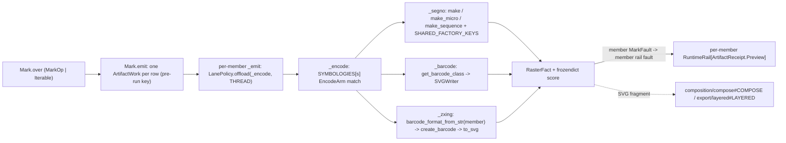

# [PY_ARTIFACTS_GRAPHIC_MARKS_ENCODE]

Machine-readable-mark generation owner. `Mark` is one owner over the host-free encoded-mark codec, discriminating symbology over the closed `Symbology` vocabulary across three provider arms — segno (QR/Micro-QR and structured-append sequence, the full factory-parameter axis, the `segno.helpers` structured-payload grammar, and the whole `SvgStyle` serializer band a `dark`/`light`-only slice drops), python-barcode (the linear 1D registry over `SVGWriter`), and zxing-cpp (the 2D-matrix `create_barcode`/`Barcode.to_svg` arm over the complete `AllCreatable` matrix set) — all serializing to the dependency-free SVG path. One mark surface, not a per-symbology class, not a per-operation family, not an erased `opts` bag, not a fault-free pass dropping every provider raise.

Every arm is fallible at the provider and serializer edges and the interior is total over `Result[RasterFact, MarkFault]`: each provider raise is named once at its arm and mapped into the closed `MarkFault` `@tagged_union`, never a bare `except Exception` flattening the causes nor a railless `_compute` that lets a raise escape the capsule. Option knobs cross the seam as one `MarkPayload` `TypedDict` admitted through a module-level `TypeAdapter` into an immutable `frozendict`, so no interior arm re-validates a `dict`, and structured QR content folds to canonical text through the `Content` family exactly once at ingress. `Mark.over` normalizes `MarkOp | Iterable[MarkOp]` into one `ops` tuple so a lone mark and a mixed QR + linear + 2D-matrix label sheet are one entrypoint discriminating on input shape, and `emit()` lowers each row to one `ArtifactWork` under a per-member PRE-RUN key while `lru_cache` collapses a repeated row. Every operation folds into `RasterFact` — bytes, the default zero pixel dimensions, and a `frozendict` `score` keyed by the `MarkFact` vocabulary — projected to `core/receipt#RECEIPT` `ArtifactReceipt.Preview` at the boundary; `RasterFact` and the shared `Symbology`/`MarkPayload`/`SvgStyle`/`WriterOptions`/`MarkFault` vocabulary are imported from `graphic/raster/process#PROCESS` and `graphic/marks/mark#MARK`, and the decode inverse is `graphic/marks/decode#DECODE`'s own read surface — neither behavior page imports the other.

## [01]-[INDEX]

- [01]-[MARK]: the machine-readable-mark generation owner over segno, python-barcode, and zxing-cpp — the `Symbology` vocabulary keyed against the `SYMBOLOGIES` `EncodeArm` dispatch table, the encode-only `MarkOp` family lowered to one `ArtifactWork` per row through `emit()`, the closed `MarkFault` vocabulary, the `MarkPayload` option band, and the `Content` structured-payload family.

## [02]-[MARK]

- Owner: `Mark` holds `ops: tuple[MarkOp, ...]` and discriminates operation over the closed `MarkOp` family, whose `encode` case carries its own typed `(str, Symbology, frozendict[str, object])` payload rather than a shared erased `params` dict. `SYMBOLOGIES` is the egress-grade collapse — each row IS one `EncodeArm` case (`qr` holding its `SegnoFactory` plus per-row `SegnoKey` accepts, `linear` nothing, `matrix` its zxing `BarcodeFormat` display name) — so `_encode` routes by one table lookup plus one three-arm `match` with no `.arm`/`.member` hop, never a per-operation sibling nor a re-discriminating match inside an arm.
- Cases: `MarkOp.Encode(content, symbology, opts)` carries the resolved-text content, the typed `Symbology` sub-axis, and the admitted `frozendict` option band, admitted through the `of_encode` validated factory — QR/Micro-QR/sequence over segno, the linear symbologies over the python-barcode registry, the 2D-matrix classes over zxing-cpp — every symbology one case keyed by its `EncodeArm`, never a sibling op per symbology, a separate 2D-matrix owner, or an `engine`/`gated` knob.
- Modality: `Mark.over` normalizes `MarkOp | Iterable[MarkOp]` into the `ops` tuple by a structural `match` at the head, so a lone mark and a mixed-symbology label sheet share the surface — the operation is the value's `MarkOp` case, the arity its shape. Never an `encode`/`decode` knob, a `batch: bool`, or an `of_many` sibling.
- Receipt: each operation folds into `RasterFact` and projects to `ArtifactReceipt.Preview(key, width, height, scores)`, threading `RasterFact.score` straight onto `Preview.scores` — the `RasterFact.score` band equals `Preview.scores` exactly, so the encode arms' `str` facts and the sibling decode arm's native-`float` facts both fold through one mint with no coerce. Encode arms report zero pixel dimensions (the SVG path carries no raster) and stamp evidence keyed by the `MarkFact` vocabulary — segno's designator/version/error/mask/symbol-size, the python-barcode `get_fullcode`, or the zxing `format` plus its rolled-up `symbology` family and requested `ec_level`. One residual remains: `core/receipt#RECEIPT`'s `_facts` arm projects `scores` outward, never a new receipt case here.
- Faults: `MarkFault` is the closed `@tagged_union` every arm maps its provider raise into. Encode-time `parameter` (a domain-invalid segno factory value) is the sibling of the serializer-time `render` (a rejected `SvgStyle` combination at `symbol.save`, which the former unwrapped `save` let escape the capsule); `options` carries every `ValidationError` `loc` path as a `tuple[str, ...]`, not the first error's type alone; `decode` carries a `graphic/marks/decode#DECODE` source-open fault per-op so a corrupt source rails its own `Block` slot rather than escaping as an opaque `BoundaryFault`; `contract` lifts the `BeartypeCallHintViolation` the definition-time weave catches. `unknown`/`illegal`/`arity` split the python-barcode `errors.*` family. Each named once at its arm, never a bare `except Exception` nor `None`-as-failure; recovery keys on the case.
- Content: `Content` is the closed structured-payload family the segno arm admits — `raw` plus the small-grammar `wifi`/`geo`/`email` tuple cases and the rich-grammar `vcard`/`mecard` cases carrying the complete closed `VCardFields`/`MeCardFields` grammar their `make_*_data` twin accepts, never a thin slice of a contact the helper carries in full. Each folds to canonical QR text through `segno.helpers` in `_resolved_content` exactly once at `of_encode` ingress (the rich cases spreading the admitted `TypedDict` as `**fields`), so the imaging owner never hand-concatenates a grammar; a malformed payload maps onto `MarkFault.content`, and the resolved text is the canonical `Encode` content every arm sees.
- Growth: a new segno factory parameter is one `SHARED_FACTORY_KEYS` entry or per-row `SegnoKey` accept; a new segno symbol kind one `SYMBOLOGIES` row binding `EncodeArm(qr=...)`; a new structured payload one `Content` case plus one `_resolved_content` arm, a richer existing payload one more field on its case; a new linear symbology one `EncodeArm(linear=None)` row off `Symbology.value`; a new 2D-matrix symbology one `EncodeArm(matrix=...)` row carrying its zxing display name, the `matrix` rows a subset of `barcode_formats_list(BarcodeFormat.AllCreatable)`; a new fault cause one `MarkFault` case; a new evidence fact one `MarkFact` member the owning arm stamps; a new option knob one `MarkPayload`/`SvgStyle`/`WriterOptions` key; a data-URI or per-module `matrix_iter` render one segno growth axis on the `qr` arm; a new decode scope or source band is `graphic/marks/decode#DECODE`'s, never a per-symbology decode sibling here; zero new surface.

```python signature
from collections.abc import Callable, Iterable
from enum import StrEnum
from functools import lru_cache, partial, wraps
from io import BytesIO
from typing import TYPE_CHECKING, Literal, NotRequired, ReadOnly, Required, Self, TypedDict, Unpack, assert_never

from beartype import BeartypeConf, beartype
from beartype.roar import BeartypeCallHintViolation
from expression import Error, Ok, Result, Some, case, tag, tagged_union
from expression.collections import Block
from expression.extra.result import traverse
from msgspec import Struct
from pydantic import TypeAdapter, ValidationError

from rasm.runtime.identity import CANONICAL_POLICY, ContentIdentity
from rasm.runtime.faults import BoundaryFault, RuntimeRail
from rasm.runtime.lanes import LanePolicy, Modality
from rasm.runtime.resilience import RetryClass

from artifacts.core.plan import Admission, ArtifactWork
from artifacts.core.receipt import ArtifactReceipt
from artifacts.graphic.layer import LayerContent, LayerIntent, LayerNode
from artifacts.graphic.marks.mark import MarkFault, MarkPayload, Symbology, SvgStyle, WriterOptions
from artifacts.graphic.raster.process import RasterFact

lazy import barcode
lazy import segno
lazy import zxingcpp
lazy from barcode.errors import BarcodeNotFoundError, IllegalCharacterError, NumberOfDigitsError, WrongCountryCodeError
lazy from segno import helpers
lazy from svgelements import SVG

if TYPE_CHECKING:
    from segno import QRCode, QRCodeSequence


# --- [TYPES] ----------------------------------------------------------------------------
class SegnoFactory(StrEnum):
    MAKE = "make"
    MAKE_MICRO = "make_micro"
    MAKE_SEQUENCE = "make_sequence"


class SegnoKey(StrEnum):
    ECI = "eci"
    MICRO = "micro"
    SYMBOL_COUNT = "symbol_count"


class MarkFact(StrEnum):
    DESIGNATOR = "designator"
    VERSION = "version"
    ERROR = "error"
    MASK = "mask"
    MODE = "mode"
    SYMBOL_SIZE = "symbol_size"
    SYMBOLS = "symbols"
    FULLCODE = "fullcode"
    SYMBOLOGY = "symbology"
    FORMAT = "format"
    FAMILY = "family"
    EC_LEVEL = "ec_level"


@tagged_union(frozen=True)
class EncodeArm:
    tag: Literal["qr", "linear", "matrix"] = tag()
    qr: tuple[SegnoFactory, tuple[SegnoKey, ...]] = case()
    linear: None = case()
    matrix: str = case()


class VCardFields(TypedDict, closed=True):
    name: Required[ReadOnly[str]]
    displayname: Required[ReadOnly[str]]
    email: NotRequired[ReadOnly[str]]
    phone: NotRequired[ReadOnly[str]]
    fax: NotRequired[ReadOnly[str]]
    videophone: NotRequired[ReadOnly[str]]
    cellphone: NotRequired[ReadOnly[str]]
    homephone: NotRequired[ReadOnly[str]]
    workphone: NotRequired[ReadOnly[str]]
    memo: NotRequired[ReadOnly[str]]
    nickname: NotRequired[ReadOnly[str]]
    birthday: NotRequired[ReadOnly[str]]
    url: NotRequired[ReadOnly[str]]
    pobox: NotRequired[ReadOnly[str]]
    street: NotRequired[ReadOnly[str]]
    city: NotRequired[ReadOnly[str]]
    region: NotRequired[ReadOnly[str]]
    zipcode: NotRequired[ReadOnly[str]]
    country: NotRequired[ReadOnly[str]]
    org: NotRequired[ReadOnly[str]]
    title: NotRequired[ReadOnly[str]]
    photo_uri: NotRequired[ReadOnly[str]]
    source: NotRequired[ReadOnly[str]]
    rev: NotRequired[ReadOnly[str]]
    lat: NotRequired[ReadOnly[float]]
    lng: NotRequired[ReadOnly[float]]


class MeCardFields(TypedDict, closed=True):
    name: Required[ReadOnly[str]]
    reading: NotRequired[ReadOnly[str]]
    email: NotRequired[ReadOnly[str]]
    phone: NotRequired[ReadOnly[str]]
    videophone: NotRequired[ReadOnly[str]]
    memo: NotRequired[ReadOnly[str]]
    nickname: NotRequired[ReadOnly[str]]
    birthday: NotRequired[ReadOnly[str]]
    url: NotRequired[ReadOnly[str]]
    pobox: NotRequired[ReadOnly[str]]
    roomno: NotRequired[ReadOnly[str]]
    houseno: NotRequired[ReadOnly[str]]
    city: NotRequired[ReadOnly[str]]
    prefecture: NotRequired[ReadOnly[str]]
    zipcode: NotRequired[ReadOnly[str]]
    country: NotRequired[ReadOnly[str]]


@tagged_union(frozen=True)
class Content:
    tag: Literal["raw", "wifi", "vcard", "mecard", "geo", "email"] = tag()
    raw: str = case()
    wifi: tuple[str, str | None, str | None, bool] = case()
    vcard: VCardFields = case()
    mecard: MeCardFields = case()
    geo: tuple[float, float] = case()
    email: tuple[str, str | None, str | None, str | None, str | None] = case()


```

```python signature
# --- [OPERATIONS] -----------------------------------------------------------------------
_PAYLOAD = TypeAdapter(MarkPayload)


def _admit(raw: MarkPayload, /) -> Result[frozendict[str, object], MarkFault]:
    try:
        admitted = _PAYLOAD.validate_python(raw)
    except ValidationError as fault:
        return Error(MarkFault(options=tuple(str(error["loc"]) for error in fault.errors())))
    return Ok(frozendict({key: frozendict(value) if isinstance(value, dict) else value for key, value in admitted.items()}))


def _resolved_content(content: Content, /) -> Result[str, MarkFault]:
    try:
        match content:
            case Content(tag="raw", raw=text):
                return Ok(text)
            case Content(tag="wifi", wifi=(ssid, password, security, hidden)):
                return Ok(helpers.make_wifi_data(ssid=ssid, password=password, security=security, hidden=hidden))
            case Content(tag="vcard", vcard=fields):
                return Ok(helpers.make_vcard_data(**fields))
            case Content(tag="mecard", mecard=fields):
                return Ok(helpers.make_mecard_data(**fields))
            case Content(tag="geo", geo=(lat, lng)):
                return Ok(helpers.make_geo_data(lat, lng))
            case Content(tag="email", email=(to, cc, bcc, subject, body)):
                return Ok(helpers.make_make_email_data(to=to, cc=cc, bcc=bcc, subject=subject, body=body))
            case _ as unreachable:
                assert_never(unreachable)
    except (ValueError, TypeError) as fault:
        return Error(MarkFault(content=str(fault)))


@tagged_union(frozen=True)
class MarkOp:
    tag: Literal["encode"] = tag()  # the decode inverse is graphic/marks/decode's own read surface — data, never an artifact op
    encode: tuple[str, Symbology, frozendict[str, object]] = case()

    @staticmethod
    def Encode(content: str, symbology: Symbology, opts: frozendict[str, object] = frozendict(), /) -> "MarkOp":
        return MarkOp(encode=(content, symbology, opts))

    @staticmethod
    def of_encode(content: Content, symbology: Symbology, /, **opts: Unpack[MarkPayload]) -> Result["MarkOp", MarkFault]:
        return _resolved_content(content).bind(lambda text: _admit(opts).map(lambda band: MarkOp.Encode(text, symbology, band)))


SHARED_FACTORY_KEYS: tuple[str, ...] = ("error", "version", "mode", "mask", "encoding", "boost_error")
ZXING_CREATE_KEYS: tuple[str, ...] = ("ec_level", "width", "height", "margin")


def _segno(
    factory: SegnoFactory, accepts: tuple[SegnoKey, ...], content: str, symbology: Symbology, opts: frozendict[str, object], /
) -> Result[RasterFact, MarkFault]:
    keys = (*SHARED_FACTORY_KEYS, *accepts)
    try:
        symbol = getattr(segno, factory)(content, **{key: opts[key] for key in keys if key in opts})
    except segno.DataOverflowError:
        return Error(MarkFault(overflow=symbology))
    except ValueError as fault:
        return Error(MarkFault(parameter=str(fault)))
    sink = BytesIO()
    try:
        symbol.save(
            sink,
            kind="svg",
            scale=opts.get("scale", 1),
            border=opts.get("border"),
            dark=opts.get("dark", "#000"),
            light=opts.get("light"),
            **opts.get("svg", frozendict()),
        )
    except ValueError as fault:
        return Error(MarkFault(render=str(fault)))
    return Ok(RasterFact(sink.getvalue(), score=_segno_score(factory, symbol, opts)))


def _segno_score(factory: SegnoFactory, symbol: "QRCode | QRCodeSequence", opts: frozendict[str, object], /) -> frozendict[str, str]:
    if factory is SegnoFactory.MAKE_SEQUENCE:
        return frozendict({MarkFact.SYMBOLS: str(len(symbol))})
    width, height = symbol.symbol_size(scale=opts.get("scale", 1), border=opts.get("border"))
    return frozendict({
        MarkFact.DESIGNATOR: symbol.designator,
        MarkFact.VERSION: str(symbol.version),
        MarkFact.ERROR: str(symbol.error),
        MarkFact.MASK: str(symbol.mask),
        MarkFact.MODE: str(symbol.mode),
        MarkFact.SYMBOL_SIZE: f"{width}x{height}",
    })


def _barcode(content: str, symbology: Symbology, opts: frozendict[str, object], /) -> Result[RasterFact, MarkFault]:
    sink = BytesIO()
    try:
        symbol = barcode.get_barcode_class(symbology.value)(content, writer=barcode.writer.SVGWriter())
        symbol.write(sink, options=opts.get("writer_options"), text=opts.get("text"))
    except BarcodeNotFoundError:
        return Error(MarkFault(unknown=symbology.value))
    except IllegalCharacterError as fault:
        return Error(MarkFault(illegal=str(fault)))
    except (NumberOfDigitsError, WrongCountryCodeError) as fault:
        return Error(MarkFault(arity=str(fault)))
    return Ok(RasterFact(sink.getvalue(), score=frozendict({MarkFact.FULLCODE: symbol.get_fullcode(), MarkFact.SYMBOLOGY: symbology.value})))


def _zxing(member: str, content: str, opts: frozendict[str, object], /) -> Result[RasterFact, MarkFault]:
    fmt = zxingcpp.barcode_format_from_str(member)  # accepts 'Data Matrix' and 'DataMatrix' alike; never the .name re-parse the 3.0 str() rename breaks
    try:
        symbol = zxingcpp.create_barcode(content, fmt, **{key: opts[key] for key in ZXING_CREATE_KEYS if key in opts})
    except ValueError as fault:
        return Error(MarkFault(ec_level=str(fault)))
    svg = symbol.to_svg(
        scale=int(opts.get("scale", 1)), add_hrt=bool(opts.get("add_hrt", False)), add_quiet_zones=bool(opts.get("add_quiet_zones", True))
    )
    return Ok(
        RasterFact(
            svg.encode(),
            score=frozendict({
                MarkFact.FORMAT: str(symbol.format),  # the precise 3.0 display name ('Data Matrix'/'PDF417'/'Aztec')
                MarkFact.FAMILY: str(symbol.symbology),  # the rolled-up BarcodeFormat.symbology family (MicroPDF417 -> PDF417) distinct from .format
                MarkFact.EC_LEVEL: str(opts.get("ec_level", "")),
            }),
        )
    )


_CONTRACT = BeartypeConf(is_pep484_tower=True)


def _contracted(
    operation: Callable[[str, Symbology, frozendict[str, object]], Result[RasterFact, MarkFault]], /
) -> Callable[[str, Symbology, frozendict[str, object]], Result[RasterFact, MarkFault]]:
    guarded = beartype(conf=_CONTRACT)(operation)

    @wraps(operation)
    def call(content: str, symbology: Symbology, opts: frozendict[str, object], /) -> Result[RasterFact, MarkFault]:
        try:
            return guarded(content, symbology, opts)
        except BeartypeCallHintViolation as violation:
            return Error(MarkFault(contract=type(violation).__name__))

    return call


@lru_cache(maxsize=256)
@_contracted
def _encode(content: str, symbology: Symbology, opts: frozendict[str, object], /) -> Result[RasterFact, MarkFault]:
    match SYMBOLOGIES[symbology]:
        case EncodeArm(tag="qr", qr=(factory, accepts)):
            return _segno(factory, accepts, content, symbology, opts)
        case EncodeArm(tag="linear"):
            return _barcode(content, symbology, opts)
        case EncodeArm(tag="matrix", matrix=member):
            return _zxing(member, content, opts)
        case _ as unreachable:
            assert_never(unreachable)


SYMBOLOGIES: frozendict[Symbology, EncodeArm] = frozendict({
    Symbology.QR: EncodeArm(qr=(SegnoFactory.MAKE, (SegnoKey.ECI, SegnoKey.MICRO))),
    Symbology.MICRO_QR: EncodeArm(qr=(SegnoFactory.MAKE_MICRO, ())),
    Symbology.QR_SEQUENCE: EncodeArm(qr=(SegnoFactory.MAKE_SEQUENCE, (SegnoKey.SYMBOL_COUNT,))),
    Symbology.CODE128: EncodeArm(linear=None),
    Symbology.CODE39: EncodeArm(linear=None),
    Symbology.EAN13: EncodeArm(linear=None),
    Symbology.EAN8: EncodeArm(linear=None),
    Symbology.EAN14: EncodeArm(linear=None),
    Symbology.UPCA: EncodeArm(linear=None),
    Symbology.ITF: EncodeArm(linear=None),
    Symbology.CODABAR: EncodeArm(linear=None),
    Symbology.ISBN10: EncodeArm(linear=None),
    Symbology.ISBN13: EncodeArm(linear=None),
    Symbology.ISSN: EncodeArm(linear=None),
    Symbology.PZN: EncodeArm(linear=None),
    Symbology.GS1_128: EncodeArm(linear=None),
    Symbology.DATA_MATRIX: EncodeArm(matrix="Data Matrix"),
    Symbology.PDF417: EncodeArm(matrix="PDF417"),
    Symbology.COMPACT_PDF417: EncodeArm(matrix="Compact PDF417"),
    Symbology.AZTEC: EncodeArm(matrix="Aztec"),
    Symbology.MAXICODE: EncodeArm(matrix="MaxiCode"),
    Symbology.RMQR: EncodeArm(matrix="rMQR Code"),
})
```

```python signature
# --- [COMPOSITION] ----------------------------------------------------------------------
def _normalized(ops: MarkOp | Iterable[MarkOp], /) -> tuple[MarkOp, ...]:
    match ops:
        case MarkOp():
            return (ops,)
        case _:
            return tuple(ops)


def _mark_bbox(svg: bytes, /) -> Result[tuple[float, float, float, float], MarkFault]:
    try:
        box = SVG.parse(BytesIO(svg), reify=True).bbox()
    except (ValueError, TypeError) as fault:
        return Error(MarkFault(geometry=str(fault)))
    return Ok(box) if box is not None else Error(MarkFault(geometry="<empty-bounds>"))


def _layer(name: str, count: int, index: int, encode: tuple[str, Symbology, frozendict[str, object]], /) -> Result[LayerNode, MarkFault]:
    content, symbology, opts = encode
    label = name if count == 1 else f"{name}-{index}"
    return _encode(content, symbology, opts).bind(
        lambda fact: _mark_bbox(fact.data).map(
            lambda _box: LayerNode(name=label, intent=LayerIntent.ANNOTATION, content=Some(LayerContent(fragment=fact.data)))
        )
    )


class Mark(Struct, frozen=True):
    ops: tuple[MarkOp, ...]

    @classmethod
    def over(cls, ops: MarkOp | Iterable[MarkOp], /) -> Self:
        return cls(ops=_normalized(ops))

    def emit(self, /) -> Iterable[ArtifactWork]:
        # one node per mark — the per-member PRE-RUN key keeps elision per-member (a re-issued sheet
        # re-renders only changed rows) and faults one malformed mark to its own node, never the sheet.
        return tuple(
            ArtifactWork(
                key=ContentIdentity.of("mark-encode", op.encode, policy=CANONICAL_POLICY),
                work=partial(Mark._emit, op),
                parents=(),
                admission=Admission(keyed=None),
                cost=1.0,
            )
            for op in self.ops
        )

    @staticmethod
    async def _emit(op: MarkOp, /) -> RuntimeRail[ArtifactReceipt]:
        content, symbology, opts = op.encode
        fact = await LanePolicy.offload(_encode, content, symbology, opts, modality=Modality.THREAD)
        # the member's MarkFault folds into ITS OWN rail fault — Work[ArtifactReceipt] forbids an inner Result.
        return fact.bind(
            lambda res: res.map(
                lambda f: ArtifactReceipt.Preview(ContentIdentity.of("mark-encode", op.encode, policy=CANONICAL_POLICY), f.width, f.height, f.score)
            ).map_error(lambda fault: BoundaryFault(boundary=(f"mark.{symbology}", f"{fault.tag}:{fault}")))
        )

    def layered(self, name: str, /) -> Result[Block[LayerNode], MarkFault]:
        encodes = tuple(op.encode for op in self.ops)
        rows = Block.of_seq(enumerate(encodes))
        return traverse(lambda row: _layer(name, len(encodes), row[0], row[1]), rows)
```



## [03]-[RESEARCH]

<!-- source-only: research row template:
[TOKEN]-[OPEN|BLOCKED]: <exact question>; <verification route>.
-->

(none)
