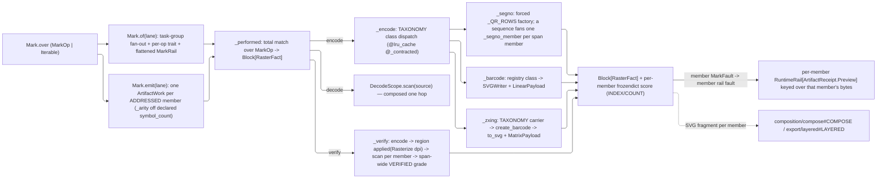

# [PY_ARTIFACTS_GRAPHIC_MARKS_ENCODE]

Machine-readable-mark operation owner. `Mark` owns the closed `MarkOp` family across generation, `DecodeScope.scan`, and print-survivability verification. One total dispatch routes segno QR/Micro-QR/structured append, python-barcode linear generation, zxing-cpp matrix generation, decode, and encode-rasterize-decode verification. `TAXONOMY` selects the provider class; factory-specific bands admit every option before a worker runs.

Every provider boundary maps named raises into `MarkFault`. `_QR_BANDS` selects the exact QR factory shape, `_CLASS_BANDS` covers the linear, matrix, and writer families; admitted bands deep-freeze before entering cached operation payloads. `Mark.of(lane)` fans independent operations through one `anyio.create_task_group`, preserving input order through task handles while each case declares its own `KernelTrait` row.

Every operation answers a `Block[RasterFact]`, one fact per ADDRESSED member: a structured-append span is N separately scannable documents, so it fans into N facts and N `ArtifactWork` nodes — each node storing its member-keyed content key and `work` coroutine, whose `_emit` settles that member's extent, position, and receipt — while a lone symbol is the one-member case of that fold. Construction knows the count because `QrSequenceMake.symbol_count` is REQUIRED on the `graphic/marks/mark#MARK` band, where the version/EC solve runs inside the worker long after the plan minted its nodes.

## [01]-[INDEX]

- [02]-[MARK]: `MarkOp`, `Mark`, `Content`, taxonomy-derived provider dispatch, factory-specific QR admission, and the composed scan/verify inverse form one marks operation rail.

## [02]-[MARK]

- Owner: `Mark` holds the closed operation tuple. `encode` carries admitted content and options, `decode` carries source and detector scope, and `verify` carries encode input plus the full `RenderPolicy`; `_encode` derives provider dispatch from `TAXONOMY`, and `_QR_ROWS` derives only the forced segno factory.
- Cases: `MarkOp.of_encode` admits every member the taxonomy carries — the writer family included, since the zxing writer generates it. `MarkOp.Decode` composes `DecodeScope.scan`. `MarkOp.of_verify` requires `RenderPolicy`, refuses carrier-less symbols through `unscannable`, and records failed recovery as evidence rather than a transport fault.
- Law: `MarkFault` carries provider, admission, geometry, scan, contract, and `unscannable` causes on one rail; `options` accumulates every `ValidationError` location.
- Law: `Content.raw` preserves `str | bytes`, so segno and zxing receive binary payloads without a lossy text round trip while the text-only python-barcode arm refuses bytes at ingress. Structured `wifi`/`geo`/`email` and full `vcard`/`mecard` cases fold to canonical QR text once. `Content.epc(EpcPayment)` carries segno's full public EPC helper axis as a frozen per-mode payload; `make_epc_qr` fixes QR error/version policy, and verify refuses EPC because no public canonical-text twin exists for byte-equality evidence.
- Entry: `Mark.over` normalizes singular and iterable request shapes. `of(lane)` launches each independent request in one task group; `_trait` selects `RELEASING` for encode and pixel scans, `HOSTILE` for raster scans and verify, and deterministic codec work carries no caller retry beyond the trait row. `emit(lane)` mints one node per addressed member off `_arity`, which reads the declared `symbol_count` — the one axis where a request's node count exceeds one.
- Receipt: each ADDRESSED member folds into its own `RasterFact` and projects to `ArtifactReceipt.Preview(key, width, height, bytes_, scores)` keyed over THAT member's emitted bytes, threading `len(RasterFact.data)` and `RasterFact.score` onto the shared receipt — one artifact identity per scannable product, never one receipt standing for a span. Every encode arm measures its real extent off the produced symbol, and `_segno_score` stamps `MarkFact` evidence with `INDEX`/`COUNT` naming the member's position; verify reports the scanned raster dimensions and stamps `VERIFIED`/`DPI` with the member's own `INDEX`/`COUNT` position pair beside native numeric scan facts, its verdict graded over the WHOLE span because a member carries only a fragment of the payload.
- Growth: a new segno symbol kind is one `_QR_ROWS` row; a new structured payload one `Content` case plus one `_resolved_content` arm, a richer existing payload one more field on its case; a new linear or 2D-matrix symbology one `Symbology` member plus one `TAXONOMY` row on the mark floor — no dispatch edit here; a new fault cause one `MarkFault` case; a new evidence fact one `MarkFact` member the owning arm stamps; a new option knob one key on the owning per-class band; a new operation one `MarkOp` case plus one `_performed` arm plus one `_trait` row, beside one `_arity` arm where it addresses more than one member; a data-URI or per-module `matrix_iter` render one segno growth axis on the qr arm; zero new surface.

```python signature
# --- [RUNTIME_PRELUDE] ------------------------------------------------------------------
from collections.abc import Callable, Iterable
from decimal import Decimal
from enum import StrEnum
from functools import lru_cache, partial, wraps
from io import BytesIO
from typing import TYPE_CHECKING, Literal, NotRequired, ReadOnly, Required, Self, TypedDict, assert_never, cast

import anyio
import msgspec
from beartype import beartype
from beartype.roar import BeartypeCallHintViolation
from builtins import frozendict
from expression import Error, Ok, Result, case, tag, tagged_union
from expression.collections import Block
from expression.extra.result import traverse
from msgspec import Struct
from pydantic import TypeAdapter, ValidationError

from rasm.artifacts.core.plan import Admission, ArtifactWork
from rasm.artifacts.core.receipt import ArtifactReceipt
from rasm.artifacts.graphic.layer import LayerNode
from rasm.artifacts.graphic.marks.decode import DecodeScope, DecodedSymbol, ScopeKind
from rasm.artifacts.graphic.marks.mark import (
    TAXONOMY,
    DecodeSource,
    LinearPayload,
    MarkClass,
    MarkFault,
    MatrixPayload,
    MicroQrPayload,
    OptionBand,
    QrPayload,
    QrSequencePayload,
    Symbology,
)
from rasm.artifacts.graphic.raster.process import RasterFact
from rasm.artifacts.graphic.vector.path import bounds
from rasm.artifacts.graphic.vector.region import RegionOp, RenderPolicy, applied
from rasm.runtime.faults import FAULT_CONF, BoundaryFault, RuntimeRail
from rasm.runtime.identity import ContentIdentity
from rasm.runtime.lanes import LanePolicy
from rasm.runtime.workers import Kernel, KernelTrait

lazy import barcode
lazy import segno
lazy import zxingcpp
lazy from barcode.errors import BarcodeNotFoundError, IllegalCharacterError, NumberOfDigitsError, WrongCountryCodeError
lazy from segno import helpers

if TYPE_CHECKING:
    from segno import QRCode  # a `QRCodeSequence` member IS a `QRCode`, so the fan annotates the member type alone


# --- [TYPES] ----------------------------------------------------------------------------
# every operation answers a BLOCK of facts, one per ADDRESSED member: a lone symbol is the one-member case and a
# structured-append span the N-member case, so no arm carries a second shape for the plural one.
type MarkRail = Result[Block[RasterFact], MarkFault | BoundaryFault]


class SegnoFactory(StrEnum):
    MAKE_QR = "make_qr"
    MAKE_MICRO = "make_micro"
    MAKE_SEQUENCE = "make_sequence"


class MarkFact(StrEnum):
    DESIGNATOR = "designator"
    VERSION = "version"
    ERROR = "error"
    MASK = "mask"
    MODE = "mode"
    SYMBOL_SIZE = "symbol_size"
    INDEX = "index"
    COUNT = "count"
    IS_MICRO = "is_micro"
    DEFAULT_BORDER = "default_border"
    FULLCODE = "fullcode"
    SYMBOLOGY = "symbology"
    FORMAT = "format"
    FAMILY = "family"
    EC_LEVEL = "ec_level"
    CONTENT_KIND = "content_kind"
    VERIFIED = "verified"
    DPI = "dpi"


class VCardFields(TypedDict, closed=True):
    name: Required[ReadOnly[str]]
    displayname: Required[ReadOnly[str]]
    email: NotRequired[ReadOnly[str]]
    phone: NotRequired[ReadOnly[str]]
    fax: NotRequired[ReadOnly[str]]
    videophone: NotRequired[ReadOnly[str]]
    cellphone: NotRequired[ReadOnly[str]]
    homephone: NotRequired[ReadOnly[str]]
    workphone: NotRequired[ReadOnly[str]]
    memo: NotRequired[ReadOnly[str]]
    nickname: NotRequired[ReadOnly[str]]
    birthday: NotRequired[ReadOnly[str]]
    url: NotRequired[ReadOnly[str]]
    pobox: NotRequired[ReadOnly[str]]
    street: NotRequired[ReadOnly[str]]
    city: NotRequired[ReadOnly[str]]
    region: NotRequired[ReadOnly[str]]
    zipcode: NotRequired[ReadOnly[str]]
    country: NotRequired[ReadOnly[str]]
    org: NotRequired[ReadOnly[str]]
    title: NotRequired[ReadOnly[str]]
    photo_uri: NotRequired[ReadOnly[str]]
    source: NotRequired[ReadOnly[str]]
    rev: NotRequired[ReadOnly[str]]
    lat: NotRequired[ReadOnly[float]]
    lng: NotRequired[ReadOnly[float]]


class MeCardFields(TypedDict, closed=True):
    name: Required[ReadOnly[str]]
    reading: NotRequired[ReadOnly[str]]
    email: NotRequired[ReadOnly[str]]
    phone: NotRequired[ReadOnly[str]]
    videophone: NotRequired[ReadOnly[str]]
    memo: NotRequired[ReadOnly[str]]
    nickname: NotRequired[ReadOnly[str]]
    birthday: NotRequired[ReadOnly[str]]
    url: NotRequired[ReadOnly[str]]
    pobox: NotRequired[ReadOnly[str]]
    roomno: NotRequired[ReadOnly[str]]
    houseno: NotRequired[ReadOnly[str]]
    city: NotRequired[ReadOnly[str]]
    prefecture: NotRequired[ReadOnly[str]]
    zipcode: NotRequired[ReadOnly[str]]
    country: NotRequired[ReadOnly[str]]


class EpcPayment(Struct, frozen=True):
    name: str
    iban: str
    amount: int | float | Decimal
    text: str | None = None
    reference: str | None = None
    bic: str | None = None
    purpose: str | None = None
    encoding: str | int | None = None


type RawContent = str | bytes
type MarkContent = RawContent | EpcPayment


@tagged_union(frozen=True)
class Content:
    tag: Literal["raw", "wifi", "vcard", "mecard", "geo", "email", "epc"] = tag()
    raw: RawContent = case()
    wifi: tuple[str, str | None, str | None, bool] = case()
    vcard: VCardFields = case()
    mecard: MeCardFields = case()
    geo: tuple[float, float] = case()
    email: tuple[str, str | None, str | None, str | None, str | None] = case()
    epc: EpcPayment = case()
```

```python signature
# --- [TABLES] ---------------------------------------------------------------------------
# per-class admission adapters and the only arm-local dispatch data; everything else derives
# from the mark floor's ONE TAXONOMY correspondence.
_QR_BANDS: frozendict[Symbology, TypeAdapter[OptionBand]] = frozendict({
    Symbology.QR: TypeAdapter(QrPayload),
    Symbology.MICRO_QR: TypeAdapter(MicroQrPayload),
    Symbology.QR_SEQUENCE: TypeAdapter(QrSequencePayload),
})
_CLASS_BANDS: frozendict[MarkClass, TypeAdapter[OptionBand]] = frozendict({
    MarkClass.LINEAR: TypeAdapter(LinearPayload),
    MarkClass.MATRIX: TypeAdapter(MatrixPayload),
    MarkClass.WRITER: TypeAdapter(LinearPayload),  # the writer family is 1-D, so it admits the linear band
})
_QR_ROWS: frozendict[Symbology, SegnoFactory] = frozendict({
    Symbology.QR: SegnoFactory.MAKE_QR,
    Symbology.MICRO_QR: SegnoFactory.MAKE_MICRO,
    Symbology.QR_SEQUENCE: SegnoFactory.MAKE_SEQUENCE,
})


def _canon_hook(value: object, /) -> object:
    # frozendict is not a dict subclass, so the canonical-key encoder lowers each band row explicitly; every other payload
    # member (str/bytes/StrEnum/msgspec Struct) encodes natively.
    match value:
        case frozendict():
            return dict(value)
        case _:
            raise NotImplementedError


_CANON = msgspec.msgpack.Encoder(enc_hook=_canon_hook)


# --- [OPERATIONS] -----------------------------------------------------------------------
def _frozen(value: object, /) -> object:
    # deep-fold the admitted band to a hashable frozendict tree so lru_cache and the op payload stay immutable
    return frozendict({key: _frozen(inner) for key, inner in value.items()}) if isinstance(value, dict) else value


def _admit(symbology: Symbology, content: MarkContent, raw: OptionBand, /) -> Result[tuple[MarkContent, frozendict[str, object]], MarkFault]:
    # ONE admission seam: the symbology's MarkClass selects the closed per-class band, so a cross-family
    # knob fails validation here and a factory-scoped key outside its row's accepts fails by name —
    # every admitted option has an owning arm and stage, never a silently dropped key.
    cls = TAXONOMY[symbology][0]
    if cls is MarkClass.LINEAR and isinstance(content, bytes):
        return Error(MarkFault(content="<binary-linear-content>"))
    if isinstance(content, EpcPayment) and symbology is not Symbology.QR:
        return Error(MarkFault(content="<epc-requires-qr>"))
    adapter = _QR_BANDS[symbology] if cls is MarkClass.QR else _CLASS_BANDS[cls]
    try:
        admitted = adapter.validate_python(raw)
    except ValidationError as fault:
        return Error(MarkFault(options=tuple(str(error["loc"]) for error in fault.errors())))
    if isinstance(content, EpcPayment) and admitted.get("make"):
        return Error(MarkFault(options=("('make',): EPC fixes error/version policy",)))
    return Ok((content, cast(frozendict[str, object], _frozen(admitted))))


def _resolved_content(content: Content, /) -> Result[MarkContent, MarkFault]:
    try:
        match content:
            case Content(tag="raw", raw=text):
                return Ok(text)
            case Content(tag="wifi", wifi=(ssid, password, security, hidden)):
                return Ok(helpers.make_wifi_data(ssid=ssid, password=password, security=security, hidden=hidden))
            case Content(tag="vcard", vcard=fields):
                return Ok(helpers.make_vcard_data(**fields))
            case Content(tag="mecard", mecard=fields):
                return Ok(helpers.make_mecard_data(**fields))
            case Content(tag="geo", geo=(lat, lng)):
                return Ok(helpers.make_geo_data(lat, lng))
            case Content(tag="email", email=(to, cc, bcc, subject, body)):
                return Ok(helpers.make_make_email_data(to=to, cc=cc, bcc=bcc, subject=subject, body=body))
            case Content(tag="epc", epc=payment):
                return Ok(payment)
            case _ as unreachable:
                assert_never(unreachable)
    except (ValueError, TypeError) as fault:
        return Error(MarkFault(content=str(fault)))


@tagged_union(frozen=True)
class MarkOp:
    # `of_encode` and `of_verify` are the ONLY band-carrying mints and both cross `_admit`, so an `encode` or
    # `verify` payload always holds an ADMITTED band — a bare constructor defaulting an empty band was the
    # admission bypass under which `_arity`'s required sequence read raised instead of refusing.
    tag: Literal["encode", "decode", "verify"] = tag()
    encode: tuple[MarkContent, Symbology, frozendict[str, object]] = case()
    decode: tuple[DecodeSource, DecodeScope] = case()  # a read op: data, excluded from emit
    verify: tuple[MarkContent, Symbology, frozendict[str, object], RenderPolicy] = case()

    @staticmethod
    def Decode(source: DecodeSource, scope: DecodeScope = DecodeScope(), /) -> "MarkOp":
        return MarkOp(decode=(source, scope))

    @staticmethod
    def of_encode(content: Content, symbology: Symbology, band: OptionBand | None = None, /) -> Result["MarkOp", MarkFault]:
        return _resolved_content(content).bind(
            lambda text: _admit(symbology, text, band if band is not None else cast(OptionBand, {})).map(
                lambda admitted: MarkOp(encode=(admitted[0], symbology, admitted[1]))
            )
        )

    @staticmethod
    def of_verify(content: Content, symbology: Symbology, render: RenderPolicy, band: OptionBand | None = None, /) -> Result["MarkOp", MarkFault]:
        if TAXONOMY[symbology][1] is None:  # a carrier-less member can never decode back — refuse at construction
            return Error(MarkFault(unscannable=symbology))
        return _resolved_content(content).bind(
            lambda text: Error(MarkFault(content="<epc-has-no-public-canonical-text>"))
            if isinstance(text, EpcPayment)
            else _admit(symbology, text, band if band is not None else cast(OptionBand, {})).map(
                lambda admitted: MarkOp(verify=(admitted[0], symbology, admitted[1], render))
            )
        )


def _segno(factory: SegnoFactory, content: MarkContent, symbology: Symbology, band: frozendict[str, object], /) -> Result[Block[RasterFact], MarkFault]:
    make = cast(frozendict[str, object], band.get("make", frozendict()))
    render = cast(frozendict[str, object], band.get("render", frozendict()))
    try:
        symbol = helpers.make_epc_qr(**msgspec.structs.asdict(content)) if isinstance(content, EpcPayment) else getattr(segno, factory)(content, **dict(make))
    except segno.DataOverflowError:
        return Error(MarkFault(overflow=symbology))
    except ValueError as fault:
        return Error(MarkFault(content=str(fault)) if isinstance(content, EpcPayment) else MarkFault(parameter=str(fault)))
    if factory is not SegnoFactory.MAKE_SEQUENCE:
        return _segno_member(render, 1, (0, symbol)).map(Block.singleton)
    # Structured append IS N documents: `QRCodeSequence.save` writes EVERY member into the one stream it is
    # handed, and MEASURED a three-symbol span so saved yields 13159 bytes carrying three `<svg` roots — bytes no
    # SVG reader accepts. Each member scans separately and addresses separately, so the span FANS into one
    # document per member instead of collapsing into a payload that parses nowhere; every `QRCodeSequence` member
    # IS a `QRCode`, so one member fold serves the span and the lone symbol alike.
    declared = cast(int, make["symbol_count"])  # required by the sequence band, so the read is total
    if len(symbol) != declared:
        # Plan nodes already exist one per DECLARED member, so a span segno resolved at another arity would leave
        # nodes addressing symbols that do not exist; this refusal names both counts rather than truncating.
        return Error(MarkFault(arity=f"<declared-{declared}-resolved-{len(symbol)}>"))
    return traverse(partial(_segno_member, render, len(symbol)), Block.of_seq(enumerate(symbol)))


def _segno_member(render: frozendict[str, object], count: int, row: tuple[int, "QRCode"], /) -> Result[RasterFact, MarkFault]:
    index, symbol = row
    sink = BytesIO()
    style = cast(frozendict[str, object], render.get("svg", frozendict()))
    writer = {key: value for key, value in render.items() if key != "svg"}
    try:
        symbol.save(sink, kind="svg", **writer, **dict(style))
    except ValueError as fault:
        return Error(MarkFault(render=str(fault)))
    # ONE measure of the module and pixel extent feeds both the fact and its score band: `RasterFact`'s
    # width/height are the receipt's own `Preview` dimensions, so leaving them at the struct default published
    # every generated mark as a zero-by-zero raster while the same numbers sat one call away.
    extent = symbol.symbol_size(scale=render.get("scale", 1), border=render.get("border"))
    return Ok(RasterFact(sink.getvalue(), extent[0], extent[1], score=_segno_score(symbol, extent, index, count)))


def _segno_score(symbol: "QRCode", extent: tuple[int, int], index: int, count: int, /) -> frozendict[str, str]:
    # ONE projection over a RESOLVED symbol, span member and lone symbol alike — the fan removed the sequence-only
    # branch whose `msgspec.json` blob packed every member's facts into one opaque string the receipt band could
    # neither compare nor measure. Position rides two scalars instead: a lone symbol reads `0` of `1`.
    return frozendict({
        MarkFact.DESIGNATOR: symbol.designator,
        MarkFact.VERSION: str(symbol.version),
        MarkFact.ERROR: str(symbol.error),
        MarkFact.MASK: str(symbol.mask),
        MarkFact.MODE: str(symbol.mode),
        MarkFact.SYMBOL_SIZE: f"{extent[0]}x{extent[1]}",
        MarkFact.IS_MICRO: str(symbol.is_micro),
        MarkFact.DEFAULT_BORDER: str(symbol.default_border_size),
        MarkFact.INDEX: str(index),
        MarkFact.COUNT: str(count),
    })


def _barcode(content: MarkContent, symbology: Symbology, band: frozendict[str, object], /) -> Result[RasterFact, MarkFault]:
    if not isinstance(content, str):
        return Error(MarkFault(content="<non-text-linear-content>"))
    sink = BytesIO()
    try:
        symbol = barcode.get_barcode_class(symbology.value)(content, writer=barcode.writer.SVGWriter())
        symbol.write(sink, options=band.get("render"), text=band.get("text"))
    except BarcodeNotFoundError:
        return Error(MarkFault(unknown=symbology.value))
    except IllegalCharacterError as fault:
        return Error(MarkFault(illegal=str(fault)))
    except (NumberOfDigitsError, WrongCountryCodeError) as fault:
        return Error(MarkFault(arity=str(fault)))
    # the writer's OWN size fold answers the produced extent in millimetres — `calculate_size(modules, lines)`
    # reads the module width, height, quiet zone, and text band the render band already set — so the fact carries
    # the symbol's real dimensions instead of the struct default that published every linear mark as zero-by-zero
    modules = symbol.build()
    span, rise = symbol.writer.calculate_size(len(modules[0]), len(modules))
    return Ok(
        RasterFact(
            sink.getvalue(),
            int(span),
            int(rise),
            score=frozendict({MarkFact.FULLCODE: symbol.get_fullcode(), MarkFact.SYMBOLOGY: symbology.value}),
        )
    )


def _zxing(content: MarkContent, symbology: Symbology, band: frozendict[str, object], /) -> Result[RasterFact, MarkFault]:
    if isinstance(content, EpcPayment):
        return Error(MarkFault(content="<epc-requires-qr>"))
    carrier = TAXONOMY[symbology][1]
    if carrier is None:
        return Error(MarkFault(unscannable=symbology))
    fmt = zxingcpp.barcode_format_from_str(carrier)
    make = cast(frozendict[str, object], band.get("make", frozendict()))
    render = cast(frozendict[str, object], band.get("render", frozendict()))
    try:
        symbol = zxingcpp.create_barcode(content, fmt, **dict(make))  # ec_level the sole genuine creator key; geometry is the writer's
    except ValueError as fault:
        return Error(MarkFault(ec_level=str(fault)))
    svg = symbol.to_svg(
        scale=int(render.get("scale", 1)), add_hrt=bool(render.get("add_hrt", False)), add_quiet_zones=bool(render.get("add_quiet_zones", True))
    )
    # `Barcode.position` is the symbol's own module quad, so the extent reads off the produced symbol rather than
    # a re-measure of the rendered SVG, and the declared render scale lifts modules to pixels exactly as segno's does
    scale = int(render.get("scale", 1))
    corner = symbol.position.bottom_right
    return Ok(
        RasterFact(
            svg.encode(),
            (corner.x + 1) * scale,
            (corner.y + 1) * scale,
            score=frozendict({
                MarkFact.FORMAT: str(symbol.format),  # the precise 3.0 display name ('Data Matrix'/'PDF417'/'Aztec')
                MarkFact.FAMILY: str(symbol.symbology),  # the rolled-up BarcodeFormat.symbology family (MicroPDF417 -> PDF417) distinct from .format
                MarkFact.EC_LEVEL: str(dict(make).get("ec_level", "")),
                MarkFact.CONTENT_KIND: symbol.content_type.name,
            }),
        )
    )


def _contracted(
    operation: Callable[[MarkContent, Symbology, frozendict[str, object]], Result[Block[RasterFact], MarkFault]], /
) -> Callable[[MarkContent, Symbology, frozendict[str, object]], Result[Block[RasterFact], MarkFault]]:
    guarded = beartype(conf=FAULT_CONF)(operation)

    @wraps(operation)
    def call(content: MarkContent, symbology: Symbology, band: frozendict[str, object], /) -> Result[Block[RasterFact], MarkFault]:
        try:
            return guarded(content, symbology, band)
        except BeartypeCallHintViolation as violation:
            return Error(MarkFault(contract=str(violation)))

    return call


@lru_cache(maxsize=256)
@_contracted
def _encode(content: MarkContent, symbology: Symbology, band: frozendict[str, object], /) -> Result[Block[RasterFact], MarkFault]:
    # class dispatch DERIVES from TAXONOMY — a new symbology is one floor row, zero edits here. The memo is keyed
    # on the whole request, so every member node of one structured-append span shares ONE solve inside a worker
    # process rather than re-solving the span per addressed member.
    match TAXONOMY[symbology][0]:
        case MarkClass.QR:
            return _segno(_QR_ROWS[symbology], content, symbology, band)
        case MarkClass.LINEAR:
            return _barcode(content, symbology, band).map(Block.singleton)
        case MarkClass.MATRIX | MarkClass.WRITER:
            # ONE zxing writer arm for both families: the format member is the taxonomy's own carrier column, so a
            # 1-D `Code 93` and a 2-D `Data Matrix` differ only in the row they select and never in the code path
            return _zxing(content, symbology, band).map(Block.singleton)
        case _ as unreachable:
            assert_never(unreachable)


def _arity(op: MarkOp, /) -> int:
    # ADDRESSED member count, read off the ADMITTED band before any solve runs — total because the failable
    # factories are the only op mints and the sequence adapter REQUIRES `make.symbol_count`: the plan mints one
    # node per member at construction, where the version/EC solve that fixes each member's version runs only
    # inside the worker. Every other symbology addresses one symbol.
    match op:
        case (
            MarkOp(tag="encode", encode=(_content, Symbology.QR_SEQUENCE, band))
            | MarkOp(tag="verify", verify=(_content, Symbology.QR_SEQUENCE, band, _render))
        ):
            return cast(int, cast(frozendict[str, object], band["make"])["symbol_count"])
        case _:
            return 1


def _fragment(scan: RasterFact, content: MarkContent, /) -> RawContent | None:
    # ONE recovered payload per scanned member — the first VALID symbol's raw bytes or its text, the modality read
    # off the ADDRESSED content itself rather than a boolean mode knob crossing the seam. Absence spells `None`
    # because an unrecovered member contributes no fragment to the span reconstruction at all, which is a
    # different fact from recovering an empty one.
    return next((symbol.raw if isinstance(content, bytes) else symbol.text for symbol in DecodedSymbol.recovered(scan) if symbol.valid), None)


@lru_cache(maxsize=256)
def _verify(content: MarkContent, symbology: Symbology, band: frozendict[str, object], render: RenderPolicy, /) -> Result[Block[RasterFact], MarkFault]:
    # print-survivability round trip: encode -> region rasterize at the declared resolution -> scan scoped to the
    # mark's OWN carrier -> grade recovery as evidence; a failed recovery is a graded VERIFIED=0.0 verdict on the
    # score band, never a fault. The memo mirrors `_encode`'s, keyed on the whole request over hashable frozen
    # payloads, so the N member nodes of one structured-append span share ONE encode-rasterize-scan-grade round
    # trip inside a worker process — an unmemoized arm re-verified the WHOLE span once per addressed member,
    # squaring the native rasterize/scan cost — while each node still selects its own member fact.
    if isinstance(content, EpcPayment):
        return Error(MarkFault(content="<epc-has-no-public-canonical-text>"))

    def _scanned(encoded: RasterFact, /) -> Result[RasterFact, MarkFault]:
        return (
            applied(RegionOp.Rasterize(encoded.data, render))
            .map_error(lambda fault: MarkFault(geometry=fault.tag))
            .bind(lambda result: DecodeScope.of(ScopeKind.THOROUGH, symbology).scan(DecodeSource.Raster(result.raster)))
        )

    def _graded(scans: Block[RasterFact], /) -> Block[RasterFact]:
        # ONE verdict over the WHOLE span: a structured-append member carries a FRAGMENT of the payload, so
        # equality against the addressed content grades every member of a real sequence as unrecovered, and only
        # an ORDERED concatenation reproduces what was encoded. A lone symbol is the one-member case, whose
        # concatenation is its own recovered text. Every member takes that verdict while keeping its own scan
        # facts and its own `INDEX`/`COUNT` position pair — the same two scalars the encode fold stamps,
        # re-stamped here because a scan fact carries the decoder's facts and no encode position, and an index
        # without its span count is a position no receipt reader can place.
        parts = tuple(_fragment(scan, content) for scan in scans)
        whole = (
            None
            if any(part is None for part in parts)
            else b"".join(cast(tuple[bytes, ...], parts))
            if isinstance(content, bytes)
            else "".join(cast(tuple[str, ...], parts))
        )
        verdict = float(whole == content)
        return scans.mapi(
            lambda index, scan: RasterFact(
                scan.data,
                scan.width,
                scan.height,
                scan.score
                | frozendict({MarkFact.VERIFIED: verdict, MarkFact.DPI: render.dpi, MarkFact.INDEX: str(index), MarkFact.COUNT: str(len(scans))}),
            )
        )

    return _encode(content, symbology, band).bind(lambda members: traverse(_scanned, members)).map(_graded)


def _performed(op: MarkOp, /) -> Result[Block[RasterFact], MarkFault]:
    match op:
        case MarkOp(tag="encode", encode=(content, symbology, band)):
            return _encode(content, symbology, band)
        case MarkOp(tag="decode", decode=(source, scope)):
            return scope.scan(source).map(Block.singleton)  # one scan reads one source; its symbols ride the score band
        case MarkOp(tag="verify", verify=(content, symbology, band, render)):
            return _verify(content, symbology, band, render)
        case _ as unreachable:
            assert_never(unreachable)


def _trait(op: MarkOp, /) -> KernelTrait:
    match op:
        case MarkOp(tag="decode", decode=(source, _)):
            return KernelTrait.HOSTILE if source.tag == "raster" else KernelTrait.RELEASING  # untrusted bytes earn crash isolation
        case MarkOp(tag="verify"):
            return KernelTrait.HOSTILE  # pathops + resvg + zxing native CPU round trip
        case _:
            return KernelTrait.RELEASING


async def _offloaded(lane: LanePolicy, op: MarkOp, /) -> MarkRail:
    railed = await lane.offload(Kernel.of(_performed, _trait(op)), op)
    return railed.bind(lambda inner: inner)
```

```python signature
# --- [COMPOSITION] ----------------------------------------------------------------------
def _normalized(ops: MarkOp | Iterable[MarkOp], /) -> tuple[MarkOp, ...]:
    match ops:
        case MarkOp():
            return (ops,)
        case _:
            return tuple(ops)


def _mark_bbox(svg: bytes, /) -> Result[tuple[float, float, float, float], MarkFault]:
    # geometry rides the graphic/vector/path substrate — its memoized `_parsed` core serves repeated bounds reads
    # over the same bytes, never a second local SVG.parse of the generated mark.
    return bounds(svg).map_error(lambda fault: MarkFault(geometry=str(fault)))


def _label(name: str, ops: int, op: int, member: int, members: int, /) -> str:
    # one stable leaf label per ADDRESSED member: a lone mark keeps the bare name, a multi-mark set indexes by
    # request, and a structured-append span appends its member ordinal, so no two leaves collide in the tree.
    stem = name if ops == 1 else f"{name}-{op}"
    return stem if members == 1 else f"{stem}-{member}"


def _layer(name: str, count: int, index: int, encode: tuple[MarkContent, Symbology, frozendict[str, object]], /) -> Result[Block[LayerNode], MarkFault]:
    # ONE leaf per addressed member — a structured-append span lands every member on the sheet, never a first
    # symbol standing for the whole payload. `_mark_bbox` gates each member's SVG well-formedness before the
    # fragment lands on a layer; the box value itself stays with the placing consumer.
    content, symbology, band = encode
    return _encode(content, symbology, band).bind(
        lambda members: traverse(
            lambda row: _mark_bbox(row[1].data).map(
                lambda _box: LayerNode.Annotation(_label(name, count, index, row[0], len(members)), row[1].data)
            ),
            Block.of_seq(enumerate(members)),
        )
    )


class Mark(Struct, frozen=True):
    ops: tuple[MarkOp, ...]

    @classmethod
    def over(cls, ops: MarkOp | Iterable[MarkOp], /) -> Self:
        return cls(ops=_normalized(ops))

    async def of(self, lane: LanePolicy, /) -> Block[MarkRail]:
        async with anyio.create_task_group() as group:
            handles = tuple(group.start_soon(_offloaded, lane, op) for op in self.ops)
        return Block.of_seq(handle.return_value for handle in handles)

    def emit(self, lane: LanePolicy, /) -> Iterable[ArtifactWork]:
        # ONE node per ADDRESSED member: a lone symbol mints one node and a structured-append span mints one per
        # member, since each member is its own scannable product carrying its own artifact identity. The pre-run
        # key spans `(request, member)` so elision stays per-member — a re-issued sheet re-renders only the rows
        # that changed — and a malformed mark faults to its own node, never the sheet; a decode row is data and
        # never an artifact.
        return tuple(
            ArtifactWork(
                key=ContentIdentity.key(f"mark-{op.tag}", _CANON.encode((op.encode if op.tag == "encode" else op.verify, member))),
                work=partial(Mark._emit, op, member, lane),
                parents=(),
                admission=Admission(keyed=None),
                cost=1.0,
            )
            for op in self.ops
            if op.tag in ("encode", "verify")
            for member in range(_arity(op))
        )

    @staticmethod
    async def _emit(op: MarkOp, member: int, lane: LanePolicy, /) -> RuntimeRail[ArtifactReceipt]:
        fact = await lane.offload(Kernel.of(_performed, _trait(op)), op)
        # this node addresses exactly ONE member, and the receipt key is product identity over THAT member's
        # emitted bytes — distinct from the pre-run `(request, member)` key the emit row minted. The `item` read is
        # total by construction: `_arity` and `_segno`'s arity refusal both key on the same declared
        # `symbol_count`. A member's MarkFault folds into ITS OWN rail fault — `Work[ArtifactReceipt]` forbids an
        # inner Result.
        return fact.bind(
            lambda res: res.map(lambda members: members.item(member))
            .map(lambda f: ArtifactReceipt.Preview(ContentIdentity.key(f"mark-{op.tag}", f.data), f.width, f.height, len(f.data), f.score))
            .map_error(lambda fault: BoundaryFault(boundary=(f"mark.{op.tag}", fault.tag)))
        )

    def layered(self, name: str, /) -> Result[Block[LayerNode], MarkFault]:
        encodes = tuple(op.encode for op in self.ops if op.tag == "encode")
        rows = Block.of_seq(enumerate(encodes))
        return traverse(lambda row: _layer(name, len(encodes), row[0], row[1]), rows).map(lambda groups: groups.collect(lambda group: group))


# --- [EXPORTS] --------------------------------------------------------------------------
__all__ = [
    "Content",
    "EpcPayment",
    "Mark",
    "MarkContent",
    "MarkFact",
    "MarkOp",
    "MarkRail",
    "MeCardFields",
    "RawContent",
    "SegnoFactory",
    "VCardFields",
]
```


```mermaid
---
config:
  layout: elk
  flowchart:
    curve: linear
    padding: 25
---
flowchart LR
    accTitle: Mark encode, decode, and verify dispatch
    accDescr: The mark lane and work emitter both entering one total operation match whose encode arm dispatches by taxonomy class onto the QR, linear, and matrix writers, whose decode arm composes the scan scope one hop, and whose verify arm rasterizes its own carrier back through the scan for a span-wide grade, every arm answering a block of one fact per addressed member that the emitter selects into a per-member receipt.
    Over["Mark.over (MarkOp | Iterable)"] --> Of["Mark.of(lane): task-group fan-out + per-op trait + flattened MarkRail"]
    Over --> Emit["Mark.emit(lane): one ArtifactWork per ADDRESSED member (_arity off declared symbol_count)"]
    Of --> Perf["_performed: total match over MarkOp -> Block[RasterFact]"]
    Emit --> Perf
    Perf -->|encode| Enc["_encode: TAXONOMY class dispatch (@lru_cache @_contracted)"]
    Perf -->|decode| Scan["DecodeScope.scan(source) — composed one hop"]
    Perf -->|verify| Ver["_verify: encode -> region applied(Rasterize dpi) -> scan per member -> span-wide VERIFIED grade"]
    Enc --> Qr["_segno: forced _QR_ROWS factory; a sequence fans one _segno_member per span member"]
    Enc --> Bar["_barcode: registry class -> SVGWriter + LinearPayload"]
    Enc --> Zx["_zxing: TAXONOMY carrier -> create_barcode -> to_svg + MatrixPayload"]
    Qr --> Fact["Block[RasterFact] + per-member frozendict score (INDEX/COUNT)"]
    Bar --> Fact
    Zx --> Fact
    Ver --> Fact
    Fact -->|"member MarkFault -> member rail fault"| Receipt["per-member RuntimeRail[ArtifactReceipt.Preview] keyed over that member's bytes"]
    Fact -.->|"SVG fragment per member"| Compose["composition/compose#COMPOSE / export/layered#LAYERED"]
```

## [03]-[RESEARCH]

<!-- source-only: research row template; every landed row opens on the list dash this placeholder omits, the census reading `^- [TOKEN]-[OPEN|BLOCKED]:` alone:
[TOKEN]-[OPEN|BLOCKED]: <exact question>; <verification route>.
-->

(none)
