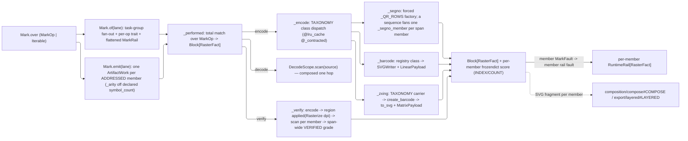

# [PY_ARTIFACTS_GRAPHIC_MARKS_ENCODE]

Machine-readable-mark operation owner. `Mark` owns the closed `MarkOp` family across generation, `DecodeScope.scan`, and print-survivability verification. One total dispatch routes segno QR/Micro-QR/structured append, python-barcode linear generation, zxing-cpp matrix generation, decode, and encode-rasterize-decode verification. `TAXONOMY` selects the provider class; factory-specific bands admit every option before a worker runs.

Every provider boundary maps named raises into `MarkFault`. `_QR_BANDS` selects the exact QR factory shape, `_CLASS_BANDS` covers the linear, matrix, and writer families; admitted bands deep-freeze before entering cached operation payloads. `Mark.of(lane)` fans independent operations through one `anyio.create_task_group`, preserving input order through task handles while each case declares its own `KernelTrait` row.

Every operation answers a `Block[RasterFact]`, one fact per ADDRESSED member: a structured-append span is N separately scannable documents, so it fans into N facts and N `ArtifactWork` nodes, while a lone symbol is the one-member case of that fold. Construction knows the count because `QrSequenceMake.symbol_count` is REQUIRED on the `graphic/marks/mark#MARK` band, where the version/EC solve runs inside the worker long after the plan minted its nodes.

## [01]-[INDEX]

- [02]-[MARK]: `MarkOp`, `Mark`, `Content`, taxonomy-derived provider dispatch, factory-specific QR admission, and the composed scan/verify inverse form one marks operation rail.

## [02]-[MARK]

- Owner: `Mark` holds the closed operation tuple. `encode` carries admitted content and options, `decode` carries source and detector scope, and `verify` carries encode input plus the full `RenderPolicy`; `_encode` derives provider dispatch from `TAXONOMY`, and `_QR_ROWS` derives only the forced segno factory.
- Cases: `MarkOp.of_encode` admits every member the taxonomy carries — the writer family included, since the zxing writer generates it. `MarkOp.Decode` composes `DecodeScope.scan`. `MarkOp.of_verify` requires `RenderPolicy`, refuses carrier-less symbols through `unscannable`, and records failed recovery as evidence rather than a transport fault.
- Law: `MarkFault` carries provider, admission, geometry, scan, contract, and `unscannable` causes on one rail; `options` accumulates every `ValidationError` location.
- Law: `Content.raw` preserves `str | bytes`, so segno and zxing receive binary payloads without a lossy text round trip while the text-only python-barcode arm refuses bytes at ingress. Structured `wifi`/`geo`/`email` and full `vcard`/`mecard` cases fold to canonical QR text once. `Content.epc(EpcPayment)` carries segno's full public EPC helper axis as a frozen per-mode payload; `make_epc_qr` fixes QR error/version policy, and verify refuses EPC because no public canonical-text twin exists for byte-equality evidence.
- Entry: `Mark.over` normalizes singular and iterable request shapes. `of(lane)` launches each independent request in one task group; `_trait` selects `RELEASING` for encode and pixel scans, `HOSTILE` for raster scans and verify, and deterministic codec work carries no caller retry beyond the trait row. `emit(lane)` mints one node per addressed member off `_arity`, which reads the declared `symbol_count` — the one axis where a request's node count exceeds one.
- Output: each addressed member returns its own `RasterFact`. Every encode arm measures its produced extent, and `_segno_score` stamps the member position; verify preserves the scanned dimensions and span-wide verdict in that fact.
- Growth: a new segno symbol kind is one `_QR_ROWS` row; a new structured payload one `Content` case plus one `_resolved_content` arm, a richer existing payload one more field on its case; a new linear or 2D-matrix symbology one `Symbology` member plus one `TAXONOMY` row on the mark floor — no dispatch edit here; a new fault cause one `MarkFault` case; a new evidence fact one `MarkFact` member the owning arm stamps; a new option knob one key on the owning per-class band; a new operation one `MarkOp` case plus one `_performed` arm plus one `_trait` row, beside one `_arity` arm where it addresses more than one member; a data-URI or per-module `matrix_iter` render one segno growth axis on the qr arm; zero new surface.

```python
# --- [IMPORTS] --------------------------------------------------------------------------
from collections.abc import Callable, Iterable
from decimal import Decimal
from enum import StrEnum
from functools import lru_cache, partial, wraps
from io import BytesIO
from typing import TYPE_CHECKING, Final, Literal, NotRequired, ReadOnly, Required, Self, TypedDict, assert_never, cast

import anyio
import msgspec
from beartype import beartype
from beartype.roar import BeartypeCallHintViolation
from builtins import frozendict
from expression import Error, Ok, Result, case, tag, tagged_union
from expression.collections import Block
from expression.extra.result import traverse
from msgspec import Struct
from pydantic import TypeAdapter, ValidationError

from rasm.artifacts.core.hooks import BYTE_VOLUME, DOMAIN, ArtifactsLeg
from rasm.artifacts.core.plan import Admission, ArtifactWork
from rasm.artifacts.graphic.layer import LayerNode
from rasm.artifacts.graphic.marks.decode import DecodeScope, DecodedSymbol, ScopeKind
from rasm.artifacts.graphic.marks.mark import (
    TAXONOMY,
    DecodeSource,
    LinearPayload,
    MarkClass,
    MarkFault,
    MatrixPayload,
    MicroQrPayload,
    OptionBand,
    QrPayload,
    QrSequencePayload,
    Symbology,
)
from rasm.artifacts.graphic.raster.process import RasterFact
from rasm.artifacts.graphic.vector.path import bounds
from rasm.artifacts.graphic.vector.region import RegionOp, RenderPolicy, applied
from rasm.runtime.faults import FAULT_CONF, TRANSIENT, BoundaryFault, FaultRow, RuntimeRail, rostered
from rasm.runtime.identity import ContentIdentity
from rasm.runtime.lanes import LanePolicy
from rasm.runtime.metrics import Metrics
from rasm.runtime.workers import Kernel, KernelTrait

lazy import barcode
lazy import segno
lazy import zxingcpp
lazy from barcode.errors import BarcodeNotFoundError, IllegalCharacterError, NumberOfDigitsError, WrongCountryCodeError
lazy from segno import helpers

if TYPE_CHECKING:
    from segno import QRCode


# --- [TYPES] ----------------------------------------------------------------------------
type MarkRail = Result[Block[RasterFact], MarkFault | BoundaryFault]


class SegnoFactory(StrEnum):
    MAKE_QR = "make_qr"
    MAKE_MICRO = "make_micro"
    MAKE_SEQUENCE = "make_sequence"


class MarkFact(StrEnum):
    DESIGNATOR = "designator"
    VERSION = "version"
    ERROR = "error"
    MASK = "mask"
    MODE = "mode"
    SYMBOL_SIZE = "symbol_size"
    INDEX = "index"
    COUNT = "count"
    IS_MICRO = "is_micro"
    DEFAULT_BORDER = "default_border"
    FULLCODE = "fullcode"
    SYMBOLOGY = "symbology"
    FORMAT = "format"
    FAMILY = "family"
    EC_LEVEL = "ec_level"
    CONTENT_KIND = "content_kind"
    VERIFIED = "verified"
    DPI = "dpi"


class VCardFields(TypedDict, closed=True):
    name: Required[ReadOnly[str]]
    displayname: Required[ReadOnly[str]]
    email: NotRequired[ReadOnly[str]]
    phone: NotRequired[ReadOnly[str]]
    fax: NotRequired[ReadOnly[str]]
    videophone: NotRequired[ReadOnly[str]]
    cellphone: NotRequired[ReadOnly[str]]
    homephone: NotRequired[ReadOnly[str]]
    workphone: NotRequired[ReadOnly[str]]
    memo: NotRequired[ReadOnly[str]]
    nickname: NotRequired[ReadOnly[str]]
    birthday: NotRequired[ReadOnly[str]]
    url: NotRequired[ReadOnly[str]]
    pobox: NotRequired[ReadOnly[str]]
    street: NotRequired[ReadOnly[str]]
    city: NotRequired[ReadOnly[str]]
    region: NotRequired[ReadOnly[str]]
    zipcode: NotRequired[ReadOnly[str]]
    country: NotRequired[ReadOnly[str]]
    org: NotRequired[ReadOnly[str]]
    title: NotRequired[ReadOnly[str]]
    photo_uri: NotRequired[ReadOnly[str]]
    source: NotRequired[ReadOnly[str]]
    rev: NotRequired[ReadOnly[str]]
    lat: NotRequired[ReadOnly[float]]
    lng: NotRequired[ReadOnly[float]]


class MeCardFields(TypedDict, closed=True):
    name: Required[ReadOnly[str]]
    reading: NotRequired[ReadOnly[str]]
    email: NotRequired[ReadOnly[str]]
    phone: NotRequired[ReadOnly[str]]
    videophone: NotRequired[ReadOnly[str]]
    memo: NotRequired[ReadOnly[str]]
    nickname: NotRequired[ReadOnly[str]]
    birthday: NotRequired[ReadOnly[str]]
    url: NotRequired[ReadOnly[str]]
    pobox: NotRequired[ReadOnly[str]]
    roomno: NotRequired[ReadOnly[str]]
    houseno: NotRequired[ReadOnly[str]]
    city: NotRequired[ReadOnly[str]]
    prefecture: NotRequired[ReadOnly[str]]
    zipcode: NotRequired[ReadOnly[str]]
    country: NotRequired[ReadOnly[str]]


class EpcPayment(Struct, frozen=True):
    name: str
    iban: str
    amount: int | float | Decimal
    text: str | None = None
    reference: str | None = None
    bic: str | None = None
    purpose: str | None = None
    encoding: str | int | None = None


type RawContent = str | bytes
type MarkContent = RawContent | EpcPayment


@tagged_union(frozen=True)
class Content:
    tag: Literal["raw", "wifi", "vcard", "mecard", "geo", "email", "epc"] = tag()
    raw: RawContent = case()
    wifi: tuple[str, str | None, str | None, bool] = case()
    vcard: VCardFields = case()
    mecard: MeCardFields = case()
    geo: tuple[float, float] = case()
    email: tuple[str, str | None, str | None, str | None, str | None] = case()
    epc: EpcPayment = case()
```

```python
# --- [TABLES] ---------------------------------------------------------------------------

MARK_ENCODE: Final[FaultRow[ArtifactsLeg]] = FaultRow(
    leg=ArtifactsLeg.ENCODE, point="encode", arm="boundary", defect="mark-refused", retriability=TRANSIENT
)
RAISES: Final[Block[FaultRow[ArtifactsLeg]]] = rostered(Block.of_seq([MARK_ENCODE]))

_QR_BANDS: frozendict[Symbology, TypeAdapter[OptionBand]] = frozendict({
    Symbology.QR: TypeAdapter(QrPayload),
    Symbology.MICRO_QR: TypeAdapter(MicroQrPayload),
    Symbology.QR_SEQUENCE: TypeAdapter(QrSequencePayload),
})
_CLASS_BANDS: frozendict[MarkClass, TypeAdapter[OptionBand]] = frozendict({
    MarkClass.LINEAR: TypeAdapter(LinearPayload),
    MarkClass.MATRIX: TypeAdapter(MatrixPayload),
    MarkClass.WRITER: TypeAdapter(LinearPayload),
})
_QR_ROWS: frozendict[Symbology, SegnoFactory] = frozendict({
    Symbology.QR: SegnoFactory.MAKE_QR,
    Symbology.MICRO_QR: SegnoFactory.MAKE_MICRO,
    Symbology.QR_SEQUENCE: SegnoFactory.MAKE_SEQUENCE,
})


def _canon_hook(value: object, /) -> object:
    match value:
        case frozendict():
            return dict(value)
        case _:
            raise NotImplementedError


_CANON = msgspec.msgpack.Encoder(enc_hook=_canon_hook)


# --- [OPERATIONS] -----------------------------------------------------------------------
def _frozen(value: object, /) -> object:
    return frozendict({key: _frozen(inner) for key, inner in value.items()}) if isinstance(value, dict) else value


def _admit(symbology: Symbology, content: MarkContent, raw: OptionBand, /) -> Result[tuple[MarkContent, frozendict[str, object]], MarkFault]:
    cls = TAXONOMY[symbology][0]
    if cls is MarkClass.LINEAR and isinstance(content, bytes):
        return Error(MarkFault(content="<binary-linear-content>"))
    if isinstance(content, EpcPayment) and symbology is not Symbology.QR:
        return Error(MarkFault(content="<epc-requires-qr>"))
    adapter = _QR_BANDS[symbology] if cls is MarkClass.QR else _CLASS_BANDS[cls]
    try:
        admitted = adapter.validate_python(raw)
    except ValidationError as fault:
        return Error(MarkFault(options=tuple(str(error["loc"]) for error in fault.errors())))
    if isinstance(content, EpcPayment) and admitted.get("make"):
        return Error(MarkFault(options=("('make',): EPC fixes error/version policy",)))
    return Ok((content, cast(frozendict[str, object], _frozen(admitted))))


def _resolved_content(content: Content, /) -> Result[MarkContent, MarkFault]:
    try:
        match content:
            case Content(tag="raw", raw=text):
                return Ok(text)
            case Content(tag="wifi", wifi=(ssid, password, security, hidden)):
                return Ok(helpers.make_wifi_data(ssid=ssid, password=password, security=security, hidden=hidden))
            case Content(tag="vcard", vcard=fields):
                return Ok(helpers.make_vcard_data(**fields))
            case Content(tag="mecard", mecard=fields):
                return Ok(helpers.make_mecard_data(**fields))
            case Content(tag="geo", geo=(lat, lng)):
                return Ok(helpers.make_geo_data(lat, lng))
            case Content(tag="email", email=(to, cc, bcc, subject, body)):
                return Ok(helpers.make_make_email_data(to=to, cc=cc, bcc=bcc, subject=subject, body=body))
            case Content(tag="epc", epc=payment):
                return Ok(payment)
            case _ as unreachable:
                assert_never(unreachable)
    except (ValueError, TypeError) as fault:
        return Error(MarkFault(content=str(fault)))


@tagged_union(frozen=True)
class MarkOp:
    tag: Literal["encode", "decode", "verify"] = tag()
    encode: tuple[MarkContent, Symbology, frozendict[str, object]] = case()
    decode: tuple[DecodeSource, DecodeScope] = case()
    verify: tuple[MarkContent, Symbology, frozendict[str, object], RenderPolicy] = case()

    @staticmethod
    def Decode(source: DecodeSource, scope: DecodeScope = DecodeScope(), /) -> "MarkOp":
        return MarkOp(decode=(source, scope))

    @staticmethod
    def of_encode(content: Content, symbology: Symbology, band: OptionBand | None = None, /) -> Result["MarkOp", MarkFault]:
        return _resolved_content(content).bind(
            lambda text: _admit(symbology, text, band if band is not None else cast(OptionBand, {})).map(
                lambda admitted: MarkOp(encode=(admitted[0], symbology, admitted[1]))
            )
        )

    @staticmethod
    def of_verify(content: Content, symbology: Symbology, render: RenderPolicy, band: OptionBand | None = None, /) -> Result["MarkOp", MarkFault]:
        if TAXONOMY[symbology][1] is None:
            return Error(MarkFault(unscannable=symbology))
        return _resolved_content(content).bind(
            lambda text: Error(MarkFault(content="<epc-has-no-public-canonical-text>"))
            if isinstance(text, EpcPayment)
            else _admit(symbology, text, band if band is not None else cast(OptionBand, {})).map(
                lambda admitted: MarkOp(verify=(admitted[0], symbology, admitted[1], render))
            )
        )


def _segno(factory: SegnoFactory, content: MarkContent, symbology: Symbology, band: frozendict[str, object], /) -> Result[Block[RasterFact], MarkFault]:
    make = cast(frozendict[str, object], band.get("make", frozendict()))
    render = cast(frozendict[str, object], band.get("render", frozendict()))
    try:
        symbol = helpers.make_epc_qr(**msgspec.structs.asdict(content)) if isinstance(content, EpcPayment) else getattr(segno, factory)(content, **dict(make))
    except segno.DataOverflowError:
        return Error(MarkFault(overflow=symbology))
    except ValueError as fault:
        return Error(MarkFault(content=str(fault)) if isinstance(content, EpcPayment) else MarkFault(parameter=str(fault)))
    if factory is not SegnoFactory.MAKE_SEQUENCE:
        return _segno_member(render, 1, (0, symbol)).map(Block.singleton)
    declared = cast(int, make["symbol_count"])
    if len(symbol) != declared:
        return Error(MarkFault(arity=f"<declared-{declared}-resolved-{len(symbol)}>"))
    return traverse(partial(_segno_member, render, len(symbol)), Block.of_seq(enumerate(symbol)))


def _segno_member(render: frozendict[str, object], count: int, row: tuple[int, "QRCode"], /) -> Result[RasterFact, MarkFault]:
    index, symbol = row
    sink = BytesIO()
    style = cast(frozendict[str, object], render.get("svg", frozendict()))
    writer = {key: value for key, value in render.items() if key != "svg"}
    try:
        symbol.save(sink, kind="svg", **writer, **dict(style))
    except ValueError as fault:
        return Error(MarkFault(render=str(fault)))
    extent = symbol.symbol_size(scale=render.get("scale", 1), border=render.get("border"))
    return Ok(RasterFact(sink.getvalue(), extent[0], extent[1], score=_segno_score(symbol, extent, index, count)))


def _segno_score(symbol: "QRCode", extent: tuple[int, int], index: int, count: int, /) -> frozendict[str, str]:
    return frozendict({
        MarkFact.DESIGNATOR: symbol.designator,
        MarkFact.VERSION: str(symbol.version),
        MarkFact.ERROR: str(symbol.error),
        MarkFact.MASK: str(symbol.mask),
        MarkFact.MODE: str(symbol.mode),
        MarkFact.SYMBOL_SIZE: f"{extent[0]}x{extent[1]}",
        MarkFact.IS_MICRO: str(symbol.is_micro),
        MarkFact.DEFAULT_BORDER: str(symbol.default_border_size),
        MarkFact.INDEX: str(index),
        MarkFact.COUNT: str(count),
    })


def _barcode(content: MarkContent, symbology: Symbology, band: frozendict[str, object], /) -> Result[RasterFact, MarkFault]:
    if not isinstance(content, str):
        return Error(MarkFault(content="<non-text-linear-content>"))
    sink = BytesIO()
    try:
        symbol = barcode.get_barcode_class(symbology.value)(content, writer=barcode.writer.SVGWriter())
        symbol.write(sink, options=band.get("render"), text=band.get("text"))
    except BarcodeNotFoundError:
        return Error(MarkFault(unknown=symbology.value))
    except IllegalCharacterError as fault:
        return Error(MarkFault(illegal=str(fault)))
    except (NumberOfDigitsError, WrongCountryCodeError) as fault:
        return Error(MarkFault(arity=str(fault)))
    modules = symbol.build()
    span, rise = symbol.writer.calculate_size(len(modules[0]), len(modules))
    return Ok(
        RasterFact(
            sink.getvalue(),
            int(span),
            int(rise),
            score=frozendict({MarkFact.FULLCODE: symbol.get_fullcode(), MarkFact.SYMBOLOGY: symbology.value}),
        )
    )


def _zxing(content: MarkContent, symbology: Symbology, band: frozendict[str, object], /) -> Result[RasterFact, MarkFault]:
    if isinstance(content, EpcPayment):
        return Error(MarkFault(content="<epc-requires-qr>"))
    carrier = TAXONOMY[symbology][1]
    if carrier is None:
        return Error(MarkFault(unscannable=symbology))
    fmt = zxingcpp.barcode_format_from_str(carrier)
    make = cast(frozendict[str, object], band.get("make", frozendict()))
    render = cast(frozendict[str, object], band.get("render", frozendict()))
    try:
        symbol = zxingcpp.create_barcode(content, fmt, **dict(make))
    except ValueError as fault:
        return Error(MarkFault(ec_level=str(fault)))
    svg = symbol.to_svg(
        scale=int(render.get("scale", 1)), add_hrt=bool(render.get("add_hrt", False)), add_quiet_zones=bool(render.get("add_quiet_zones", True))
    )
    scale = int(render.get("scale", 1))
    corner = symbol.position.bottom_right
    return Ok(
        RasterFact(
            svg.encode(),
            (corner.x + 1) * scale,
            (corner.y + 1) * scale,
            score=frozendict({
                MarkFact.FORMAT: str(symbol.format),
                MarkFact.FAMILY: str(symbol.symbology),
                MarkFact.EC_LEVEL: str(dict(make).get("ec_level", "")),
                MarkFact.CONTENT_KIND: symbol.content_type.name,
            }),
        )
    )


def _contracted(
    operation: Callable[[MarkContent, Symbology, frozendict[str, object]], Result[Block[RasterFact], MarkFault]], /
) -> Callable[[MarkContent, Symbology, frozendict[str, object]], Result[Block[RasterFact], MarkFault]]:
    guarded = beartype(conf=FAULT_CONF)(operation)

    @wraps(operation)
    def call(content: MarkContent, symbology: Symbology, band: frozendict[str, object], /) -> Result[Block[RasterFact], MarkFault]:
        try:
            return guarded(content, symbology, band)
        except BeartypeCallHintViolation as violation:
            return Error(MarkFault(contract=str(violation)))

    return call


@lru_cache(maxsize=256)
@_contracted
def _encode(content: MarkContent, symbology: Symbology, band: frozendict[str, object], /) -> Result[Block[RasterFact], MarkFault]:
    match TAXONOMY[symbology][0]:
        case MarkClass.QR:
            return _segno(_QR_ROWS[symbology], content, symbology, band)
        case MarkClass.LINEAR:
            return _barcode(content, symbology, band).map(Block.singleton)
        case MarkClass.MATRIX | MarkClass.WRITER:
            return _zxing(content, symbology, band).map(Block.singleton)
        case _ as unreachable:
            assert_never(unreachable)


def _arity(op: MarkOp, /) -> int:
    match op:
        case (
            MarkOp(tag="encode", encode=(_content, Symbology.QR_SEQUENCE, band))
            | MarkOp(tag="verify", verify=(_content, Symbology.QR_SEQUENCE, band, _render))
        ):
            return cast(int, cast(frozendict[str, object], band["make"])["symbol_count"])
        case _:
            return 1


def _fragment(scan: RasterFact, content: MarkContent, /) -> RawContent | None:
    return next((symbol.raw if isinstance(content, bytes) else symbol.text for symbol in DecodedSymbol.recovered(scan) if symbol.valid), None)


@lru_cache(maxsize=256)
def _verify(content: MarkContent, symbology: Symbology, band: frozendict[str, object], render: RenderPolicy, /) -> Result[Block[RasterFact], MarkFault]:
    if isinstance(content, EpcPayment):
        return Error(MarkFault(content="<epc-has-no-public-canonical-text>"))

    def _scanned(encoded: RasterFact, /) -> Result[RasterFact, MarkFault]:
        return (
            applied(RegionOp.Rasterize(encoded.data, render))
            .map_error(lambda fault: MarkFault(geometry=fault.tag))
            .bind(lambda result: DecodeScope.of(ScopeKind.THOROUGH, symbology).scan(DecodeSource.Raster(result.raster)))
        )

    def _graded(scans: Block[RasterFact], /) -> Block[RasterFact]:
        parts = tuple(_fragment(scan, content) for scan in scans)
        whole = (
            None
            if any(part is None for part in parts)
            else b"".join(cast(tuple[bytes, ...], parts))
            if isinstance(content, bytes)
            else "".join(cast(tuple[str, ...], parts))
        )
        verdict = float(whole == content)
        return scans.mapi(
            lambda index, scan: RasterFact(
                scan.data,
                scan.width,
                scan.height,
                scan.score
                | frozendict({MarkFact.VERIFIED: verdict, MarkFact.DPI: render.dpi, MarkFact.INDEX: str(index), MarkFact.COUNT: str(len(scans))}),
            )
        )

    return _encode(content, symbology, band).bind(lambda members: traverse(_scanned, members)).map(_graded)


def _performed(op: MarkOp, /) -> Result[Block[RasterFact], MarkFault]:
    match op:
        case MarkOp(tag="encode", encode=(content, symbology, band)):
            return _encode(content, symbology, band)
        case MarkOp(tag="decode", decode=(source, scope)):
            return scope.scan(source).map(Block.singleton)
        case MarkOp(tag="verify", verify=(content, symbology, band, render)):
            return _verify(content, symbology, band, render)
        case _ as unreachable:
            assert_never(unreachable)


def _trait(op: MarkOp, /) -> KernelTrait:
    match op:
        case MarkOp(tag="decode", decode=(source, _)):
            return KernelTrait.HOSTILE if source.tag == "raster" else KernelTrait.RELEASING
        case MarkOp(tag="verify"):
            return KernelTrait.HOSTILE
        case _:
            return KernelTrait.RELEASING


async def _offloaded(lane: LanePolicy, op: MarkOp, /) -> MarkRail:
    railed = await lane.offload(Kernel.of(_performed, _trait(op)), op)
    return railed.bind(lambda inner: inner)
```

```python
# --- [COMPOSITION] ----------------------------------------------------------------------
def _normalized(ops: MarkOp | Iterable[MarkOp], /) -> tuple[MarkOp, ...]:
    match ops:
        case MarkOp():
            return (ops,)
        case _:
            return tuple(ops)


def _mark_bbox(svg: bytes, /) -> Result[tuple[float, float, float, float], MarkFault]:
    return bounds(svg).map_error(lambda fault: MarkFault(geometry=str(fault)))


def _label(name: str, ops: int, op: int, member: int, members: int, /) -> str:
    stem = name if ops == 1 else f"{name}-{op}"
    return stem if members == 1 else f"{stem}-{member}"


def _layer(name: str, count: int, index: int, encode: tuple[MarkContent, Symbology, frozendict[str, object]], /) -> Result[Block[LayerNode], MarkFault]:
    content, symbology, band = encode
    return _encode(content, symbology, band).bind(
        lambda members: traverse(
            lambda row: _mark_bbox(row[1].data).map(
                lambda _box: LayerNode.Annotation(_label(name, count, index, row[0], len(members)), row[1].data)
            ),
            Block.of_seq(enumerate(members)),
        )
    )


class Mark(Struct, frozen=True):
    ops: tuple[MarkOp, ...]

    @classmethod
    def over(cls, ops: MarkOp | Iterable[MarkOp], /) -> Self:
        return cls(ops=_normalized(ops))

    async def of(self, lane: LanePolicy, /) -> Block[MarkRail]:
        async with anyio.create_task_group() as group:
            handles = tuple(group.start_soon(_offloaded, lane, op) for op in self.ops)
        return Block.of_seq(handle.return_value for handle in handles)

    def emit(self, lane: LanePolicy, /) -> Iterable[ArtifactWork[RasterFact]]:
        return tuple(
            ArtifactWork(
                key=ContentIdentity.key(f"mark-{op.tag}", _CANON.encode((op.encode if op.tag == "encode" else op.verify, member))),
                work=partial(Mark._emit, op, member, lane),
                parents=(),
                admission=Admission(keyed=None),
                cost=1.0,
            )
            for op in self.ops
            if op.tag in ("encode", "verify")
            for member in range(_arity(op))
        )

    @staticmethod
    async def _emit(op: MarkOp, member: int, lane: LanePolicy, /) -> RuntimeRail[RasterFact]:
        fact = await lane.offload(Kernel.of(_performed, _trait(op)), op)
        settled = fact.bind(
            lambda res: res.map(lambda members: members.item(member)).map_error(
                lambda fault: BoundaryFault(domain=(MARK_ENCODE.subject, fault))
            )
        )
        match settled:
            case Result(tag="ok", ok=result):
                key = ContentIdentity.key(f"mark-{op.tag}", result.data)
                Metrics.record({BYTE_VOLUME: float(len(result.data))}, domain=DOMAIN, kind="preview", scope=lane.scope)
                return Ok(result)
            case refused:
                return Error(refused.error)

    def layered(self, name: str, /) -> Result[Block[LayerNode], MarkFault]:
        encodes = tuple(op.encode for op in self.ops if op.tag == "encode")
        rows = Block.of_seq(enumerate(encodes))
        return traverse(lambda row: _layer(name, len(encodes), row[0], row[1]), rows).map(lambda groups: groups.collect(lambda group: group))


# --- [EXPORTS] --------------------------------------------------------------------------
__all__ = [
    "Content",
    "EpcPayment",
    "Mark",
    "MarkContent",
    "MarkFact",
    "MarkOp",
    "MarkRail",
    "MeCardFields",
    "RawContent",
    "SegnoFactory",
    "VCardFields",
]
```


```mermaid
---
config:
  layout: elk
  flowchart:
    curve: linear
    padding: 25
---
flowchart LR
    accTitle: Mark encode, decode, and verify dispatch
    accDescr: The mark lane and work emitter enter one total operation match whose encode arm dispatches by taxonomy class, whose decode arm composes the scan scope, and whose verify arm rasterizes its carrier through the scan; every arm answers one RasterFact per addressed member.
    Over["Mark.over (MarkOp | Iterable)"] --> Of["Mark.of(lane): task-group fan-out + per-op trait + flattened MarkRail"]
    Over --> Emit["Mark.emit(lane): one ArtifactWork per ADDRESSED member (_arity off declared symbol_count)"]
    Of --> Perf["_performed: total match over MarkOp -> Block[RasterFact]"]
    Emit --> Perf
    Perf -->|encode| Enc["_encode: TAXONOMY class dispatch (@lru_cache @_contracted)"]
    Perf -->|decode| Scan["DecodeScope.scan(source) — composed one hop"]
    Perf -->|verify| Ver["_verify: encode -> region applied(Rasterize dpi) -> scan per member -> span-wide VERIFIED grade"]
    Enc --> Qr["_segno: forced _QR_ROWS factory; a sequence fans one _segno_member per span member"]
    Enc --> Bar["_barcode: registry class -> SVGWriter + LinearPayload"]
    Enc --> Zx["_zxing: TAXONOMY carrier -> create_barcode -> to_svg + MatrixPayload"]
    Qr --> Fact["Block[RasterFact] + per-member frozendict score (INDEX/COUNT)"]
    Bar --> Fact
    Zx --> Fact
    Ver --> Fact
    Fact -->|"member MarkFault -> member rail fault"| Rail["per-member RuntimeRail[RasterFact]"]
    Fact -.->|"SVG fragment per member"| Compose["composition/compose#COMPOSE / export/layered#LAYERED"]
```

## [03]-[RESEARCH]

<!-- source-only: research row template; every landed row opens on the list dash this placeholder omits, the census reading `^- [TOKEN]-[OPEN|BLOCKED]:` alone:
[TOKEN]-[OPEN|BLOCKED]: <exact question>; <verification route>.
-->

(none)
