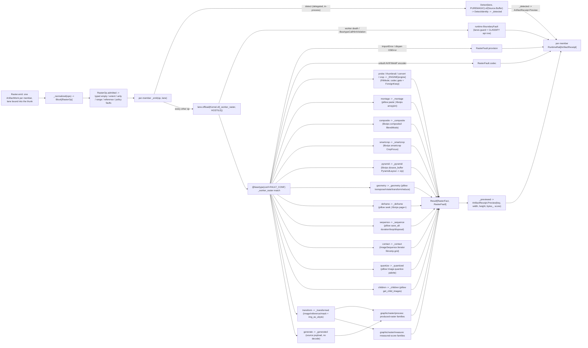

# [PY_ARTIFACTS_GRAPHIC_RASTER_IO]

Raster IO, conversion, and working-surface behavior live on the closed-payload `RasterOp` family. `Raster` holds pillow decode/transpose/resize/alpha/save/montage/contact/geometry, pyvips fused decode/downscale/ICC/smartcrop/pyramid, delegated MIME detection, produced-raster transforms, source generation, and measured transforms. Every operation folds into `RasterFact` or the closed `RasterFault` vocabulary, and each farm member lowers to its own `ArtifactWork`.

pillow, scikit-image, and pyvips are host-native worker packages off the runtime loader path, so `Raster` carries the caller-threaded `lane: LanePolicy` — the same seam field `exchange/detect#DETECT` and `graphic/color/derive#DERIVE` carry — and every worker arm crosses `lane.offload(Kernel.of(_worker_raster, KernelTrait.HOSTILE), op)` onto the shared runtime process band, never a folder-minted `CapacityLimiter` that oversubscribes the host against libvips's own thread pool, never the unbounded default, never a class-qualified `LanePolicy.offload` with no bound instance. `Detect` is the one arm off that seam: `puremagic` is pure-Python with a bundled `magic_data.json`, so `_emit` delegates it lane-threaded to `exchange/detect#DETECT` in-process (the `PUREMAGIC` engine's `RELEASING` thread kernel) with no process crossing, no retry, no payload pickle. `_worker_raster` is `@beartype(conf=FAULT_CONF)`-woven, so a contract violation raises the one `BeartypeCallHintViolation` the runtime `CLASSIFY` table folds onto the `RuntimeRail` as `BoundaryFault.api`, and an exhausted worker death terminates through the lane's `guard`/`async_boundary` conversion — neither is a `RasterFault` case, because the runtime owns both vocabularies and a parallel local case is a second carrier for one fact.

`RasterFact` is canonical on `graphic/raster/process#PROCESS`; this page, `graphic/marks/encode#MARK`, and `graphic/raster/measure#MEASURE` import the one declaration, and its `score: frozendict[str, float | str]` is the exact type `core/receipt#RECEIPT` `ArtifactReceipt.Preview.scores` carries, so the metrics floats, the detect/probe strings, and the marks facts project through one `_previewed` pass with no coerce — `Preview.bytes_` takes `len(fact.data)` on the fixed slot, never a band entry. Array-to-PNG egress is `process#PROCESS`'s `_save_array`; this page exports no raster composable beside the rail.

## [01]-[INDEX]

- [01]-[IO]: the host-free raster owner — pillow working surface, fused libvips pipeline, delegated `exchange/detect#DETECT` MIME gate, and the scikit-image `Transform` arm the process/measure siblings own — every worker arm crossing the caller-threaded runtime process lane, `Detect` in-process off it, folding into one `RasterFact` projected to `ArtifactReceipt.Preview`.

## [02]-[IO]

- Owner: `Raster` owns the closed `RasterOp` family. `GeometryOp` is its payload-carrying geometry sub-axis: fixed transforms carry no payload, `rotate` carries one angle, `affine` carries six coefficients, `perspective` carries eight coefficients, and `reduce` carries one positive factor. `RasterEngine` and `FitMode` remain policy vocabularies because engine reach and sizing behavior vary independently of operation identity. `_ENGINE` is one `frozendict[RasterEngine, EngineOps]`, so `_worker_raster` reads `probe`/`thumbnail`/`convert`/`crop` by one lookup and pillow and libvips share one op shape; every static policy table on this page is a `frozendict` row set, the same container the transform tables use, so the composed `TRANSFORMS | MEASURE_TRANSFORMS` union is one total lookup.
- Cases: `Probe`/`Thumbnail`/`Convert`/`Crop` are engine-polymorphic; `Montage`/`Deframe` split by engine; `Composite`/`SmartCrop`/`Pyramid` are libvips-owned; `Geometry`/`Quantize`/`Children`/`Sequence`/`Contact` are pillow-owned; `Detect` delegates in-process; `Transform` carries an encoded operand; `Generate` carries only a source `Transform` and `TransformPolicy`. `Transform` rejects source rows, and `Generate` rejects operand rows before the worker crossing.
- Entry: `Raster.emit` discriminates on `self.ops` being one `RasterOp` or a tuple — `_normalized` folds either into one `Block[RasterOp]` at the head, so arity is a value property, never a `batch` knob. Each member lowers to its own `ArtifactWork` carrying that member's `RasterFault` as its boundary fault and binding `self.lane` into the work thunk, so one corrupt input faults its node while siblings complete under the plan's front drain — never a fail-fast batch that discards every sibling on the first bad payload.
- Auto: `RasterOp.admitted` validates empty collections, extents, timing arity, indices, codec ranges, geometry factors, transform operands, policy compatibility, and source payload timing before provider dispatch. `_emit` routes `Detect` in-process and crosses every other admitted op through the worker. `_worker_raster` total-dispatches under provision capture; pillow and libvips arms retain their provider-specific guards. `_transformed` decodes image/reference/mask rows once through `img_as_ubyte`; `_generated` constructs the source-only `TransformInput` without bytes or decode.
- Receipt: each op folds into `RasterFact` and projects to `core/receipt#RECEIPT` `ArtifactReceipt.Preview(key, width, height, bytes_, scores)` at the rail boundary — `ContentIdentity.key` mints the bare `ContentKey` over the produced bytes, `bytes_` takes `len(fact.data)`, and `fact.score` threads straight onto `Preview.scores` with no coerce; `Detect` reports zero dimensions plus the resolved mime/class/container and native-`float` confidence, `Probe` reports header facts without transcoding, and measured transforms report perceptual and geometric facts.
- Growth: a new raster op is one `RasterOp` case, one `admitted` arm, and one `_worker_raster` arm; a new engine-polymorphic op one `EngineOps` field plus a pillow and a libvips arm; a new sizing mode one `FitMode` case plus its two branches; a new blend/crop/pyramid form one `BlendMode`/`CropFocus`/`PyramidLayout` member the libvips call resolves by nickname; a new geometric op one payload-correct `GeometryOp` case plus one pillow arm; a new scikit-image transform one `Transform` member plus a `TRANSFORMS`/`MEASURE_TRANSFORMS` row on the owning page; a new codec one `ConvertFormat` row plus its `_VIPS_SUFFIX`/`_CODEC_KWARGS`/`_VIPS_KWARGS` entry; a new engine one `RasterEngine` member plus one `_ENGINE` bundle; a new fault cause one `RasterFault` case breaking every capture at type-check.
- Boundary: `_VIPS_KWARGS` and `_VIPS_SUFFIX` carry libvips nicknames because provider imports remain worker-local. Payload-bearing operations carry canonical bytes rather than `pyvips.Source`/`Target`; `Generate` carries no bytes because source identity derives from its typed operation and policy. Streaming intake belongs to the consumer that owns stream identity. Descriptive EXIF/IPTC/XMP tags stay `exchange/metadata#METADATA`'s; MIME classification stays `exchange/detect#DETECT`'s; transform acceptors stay on process/measure; runtime contract and worker faults stay `BoundaryFault` cases.

```python signature
from builtins import frozendict
from collections.abc import Callable, Iterable
from dataclasses import dataclass
from enum import StrEnum
from functools import partial
from io import BytesIO
from struct import pack
from typing import Final, Literal, assert_never

from beartype import beartype
from expression import Error, Ok, Result, case, tag, tagged_union
from expression.collections import Block
from msgspec import Struct

from rasm.runtime.faults import FAULT_CONF, BoundaryFault, RuntimeRail
from rasm.runtime.identity import ContentIdentity, ContentKey
from rasm.runtime.lanes import LanePolicy
from rasm.runtime.workers import Kernel, KernelTrait

from rasm.artifacts.core.plan import Admission, ArtifactWork
from rasm.artifacts.core.receipt import ArtifactReceipt
from rasm.artifacts.graphic.raster.process import ConvertFormat, RasterFact, Transform, TransformInput, TransformNeeds, TransformPolicy

lazy import pyvips
lazy from PIL import Image, ImageOps, ImageSequence, UnidentifiedImageError, features
lazy from skimage import io as skio, util as skutil

lazy from rasm.artifacts.exchange.detect import Detect, DetectEngine, DetectIdentity, Source
lazy from rasm.artifacts.graphic.raster.measure import MEASURE_TRANSFORMS
lazy from rasm.artifacts.graphic.raster.process import TRANSFORMS

type RasterOpTag = Literal[
    "thumbnail",
    "convert",
    "crop",
    "probe",
    "montage",
    "composite",
    "transform",
    "generate",
    "detect",
    "smartcrop",
    "pyramid",
    "geometry",
    "deframe",
    "sequence",
    "contact",
    "quantize",
    "children",
]
type Pixels = tuple[int, int]
type Box = tuple[int, int, int, int]


class RasterEngine(StrEnum):
    PILLOW = "pillow"
    LIBVIPS = "libvips"


class FitMode(StrEnum):
    CONTAIN = "contain"  # fit inside the box, preserve aspect, no crop (pillow ImageOps.contain / libvips crop=NONE)
    COVER = "cover"  # fill the box, crop the overflow (pillow ImageOps.fit / libvips crop=ATTENTION)
    STRETCH = "stretch"  # force the exact box, ignore aspect (pillow resize / libvips size=FORCE)
    PAD = "pad"  # fit inside, then letterbox to the exact box with background (pillow ImageOps.pad / libvips embed+Extend)


class CropFocus(StrEnum):  # the libvips Interesting model SmartCrop resolves by .value nickname
    ATTENTION = "attention"  # saliency-map peak (default)
    ENTROPY = "entropy"  # maximum-entropy window
    CENTRE = "centre"
    LOW = "low"
    HIGH = "high"
    ALL = "all"  # keep the whole image (the no-crop verdict the caller reads off the result box)


class PyramidLayout(StrEnum):  # the libvips ForeignDzLayout deep-zoom pyramid form dzsave_buffer emits by .value nickname
    DZ = "dz"  # DeepZoom
    ZOOMIFY = "zoomify"
    GOOGLE = "google"
    IIIF = "iiif"
    IIIF3 = "iiif3"


@tagged_union(frozen=True)
class GeometryOp:
    tag: Literal["flip_h", "flip_v", "rotate_90", "rotate_180", "rotate_270", "transpose", "transverse", "rotate", "affine", "perspective", "reduce"] = tag()
    flip_h: None = case()
    flip_v: None = case()
    rotate_90: None = case()
    rotate_180: None = case()
    rotate_270: None = case()
    transpose: None = case()
    transverse: None = case()
    rotate: float = case()
    affine: tuple[float, float, float, float, float, float] = case()
    perspective: tuple[float, float, float, float, float, float, float, float] = case()
    reduce: int = case()


class BlendMode(StrEnum):  # the libvips composite2 nickname vocabulary passed by .value (VipsBlendMode order); OVER is the source-over default
    CLEAR = "clear"
    SOURCE = "source"
    OVER = "over"
    IN = "in"
    OUT = "out"
    ATOP = "atop"
    DEST = "dest"
    DEST_OVER = "dest-over"
    DEST_IN = "dest-in"
    DEST_OUT = "dest-out"
    DEST_ATOP = "dest-atop"
    XOR = "xor"
    ADD = "add"
    SATURATE = "saturate"
    MULTIPLY = "multiply"
    SCREEN = "screen"
    OVERLAY = "overlay"
    DARKEN = "darken"
    LIGHTEN = "lighten"
    COLOUR_DODGE = "colour-dodge"
    COLOUR_BURN = "colour-burn"
    HARD_LIGHT = "hard-light"
    SOFT_LIGHT = "soft-light"
    DIFFERENCE = "difference"
    EXCLUSION = "exclusion"


class QuantizeMethod(StrEnum):  # NAMES congruent with Image.Quantize so Image.Quantize[method.name] resolves the provider enum; PIL enum stays at the edge
    MEDIANCUT = "median-cut"
    MAXCOVERAGE = "max-coverage"
    FASTOCTREE = "fast-octree"  # the only method admitting RGBA without a flatten
    LIBIMAGEQUANT = "libimagequant"  # build-dependent; the highest-quality quantizer


class DitherMode(StrEnum):  # member NAMES congruent with Image.Dither so Image.Dither[dither.name] resolves the provider enum
    NONE = "none"
    ORDERED = "ordered"
    RASTERIZE = "rasterize"
    FLOYDSTEINBERG = "floyd-steinberg"


@tagged_union(frozen=True)
class RasterFault:
    tag: Literal["decode", "bomb", "encode", "engine", "provision", "detect", "codec", "reference", "policy", "bounds", "empty", "extent", "arity", "range"] = tag()
    decode: str = case()
    bomb: tuple[int, int] = case()
    encode: str = case()
    engine: str = case()
    provision: str = case()
    detect: str = case()
    codec: ConvertFormat = case()  # a build-dependent AVIF/HEIF/WebP encoder the linked build lacks — the capability gate, distinct from an encode fault
    reference: Transform = case()  # a row whose needs (reference/mask) the payload omits — the row declares, this seam executes
    policy: tuple[Transform, str, str] = case()
    bounds: str = case()  # a frame/page/child index past the available count — the range fault distinct from a content fault
    empty: RasterOpTag = case()
    extent: tuple[RasterOpTag, tuple[int, ...]] = case()
    arity: tuple[RasterOpTag, int, int] = case()
    range: tuple[RasterOpTag, str, float] = case()


@tagged_union(frozen=True)
class RasterOp:
    tag: RasterOpTag = tag()
    thumbnail: tuple[bytes, Pixels, ConvertFormat, RasterEngine, FitMode] = case()
    convert: tuple[bytes, ConvertFormat, int, int, RasterEngine] = case()
    crop: tuple[bytes, Box, ConvertFormat, RasterEngine] = case()
    probe: tuple[bytes, RasterEngine] = case()
    montage: tuple[tuple[bytes, ...], int, Pixels, ConvertFormat, RasterEngine] = case()
    composite: tuple[bytes, bytes, Pixels, BlendMode, ConvertFormat] = case()
    transform: tuple[bytes, Transform, bytes, bytes, TransformPolicy] = case()
    generate: tuple[Transform, TransformPolicy] = case()
    detect: tuple[bytes] = case()
    smartcrop: tuple[bytes, Pixels, CropFocus, ConvertFormat] = case()
    pyramid: tuple[bytes, PyramidLayout, int, ConvertFormat] = case()
    geometry: tuple[bytes, GeometryOp, ConvertFormat] = case()
    deframe: tuple[bytes, int, ConvertFormat, RasterEngine] = case()
    sequence: tuple[tuple[bytes, ...], tuple[int, ...], int, int, ConvertFormat] = case()
    contact: tuple[bytes, int, Pixels, ConvertFormat] = case()
    quantize: tuple[bytes, int, QuantizeMethod, DitherMode, ConvertFormat] = case()
    children: tuple[bytes, int, ConvertFormat] = case()

    @staticmethod
    def Thumbnail(
        payload: bytes,
        size: Pixels,
        fmt: ConvertFormat = ConvertFormat.PNG,
        engine: RasterEngine = RasterEngine.PILLOW,
        fit: FitMode = FitMode.CONTAIN,
    ) -> "RasterOp":
        return RasterOp(thumbnail=(payload, size, fmt, engine, fit))

    @staticmethod
    def Convert(payload: bytes, codec: ConvertFormat, quality: int = 80, effort: int = 4, engine: RasterEngine = RasterEngine.PILLOW) -> "RasterOp":
        return RasterOp(convert=(payload, codec, quality, effort, engine))

    @staticmethod
    def Crop(payload: bytes, box: Box, fmt: ConvertFormat = ConvertFormat.PNG, engine: RasterEngine = RasterEngine.PILLOW) -> "RasterOp":
        return RasterOp(crop=(payload, box, fmt, engine))

    @staticmethod
    def Probe(payload: bytes, engine: RasterEngine = RasterEngine.PILLOW) -> "RasterOp":
        return RasterOp(probe=(payload, engine))

    @staticmethod
    def Montage(
        tiles: tuple[bytes, ...], columns: int, cell: Pixels, fmt: ConvertFormat = ConvertFormat.PNG, engine: RasterEngine = RasterEngine.PILLOW
    ) -> "RasterOp":
        return RasterOp(montage=(tiles, columns, cell, fmt, engine))

    @staticmethod
    def Composite(
        base: bytes, overlay: bytes, position: Pixels = (0, 0), mode: BlendMode = BlendMode.OVER, fmt: ConvertFormat = ConvertFormat.PNG
    ) -> "RasterOp":
        return RasterOp(composite=(base, overlay, position, mode, fmt))

    @staticmethod
    def Transform(
        payload: bytes, kind: Transform, reference: bytes = b"", mask: bytes = b"", policy: TransformPolicy = TransformPolicy(default=None)
    ) -> "RasterOp":
        return RasterOp(transform=(payload, kind, reference, mask, policy))

    @staticmethod
    def Generate(kind: Transform, policy: TransformPolicy = TransformPolicy(default=None)) -> "RasterOp":
        return RasterOp(generate=(kind, policy))

    @staticmethod
    def Detect(payload: bytes) -> "RasterOp":
        return RasterOp(detect=(payload,))

    @staticmethod
    def SmartCrop(payload: bytes, size: Pixels, focus: CropFocus = CropFocus.ATTENTION, fmt: ConvertFormat = ConvertFormat.PNG) -> "RasterOp":
        return RasterOp(smartcrop=(payload, size, focus, fmt))

    @staticmethod
    def Pyramid(payload: bytes, layout: PyramidLayout = PyramidLayout.DZ, tile: int = 254, fmt: ConvertFormat = ConvertFormat.JPEG) -> "RasterOp":
        return RasterOp(pyramid=(payload, layout, tile, fmt))

    @staticmethod
    def Geometry(payload: bytes, op: GeometryOp, fmt: ConvertFormat = ConvertFormat.PNG) -> "RasterOp":
        return RasterOp(geometry=(payload, op, fmt))

    @staticmethod
    def Deframe(payload: bytes, index: int = 0, fmt: ConvertFormat = ConvertFormat.PNG, engine: RasterEngine = RasterEngine.PILLOW) -> "RasterOp":
        return RasterOp(deframe=(payload, index, fmt, engine))

    @staticmethod
    def Sequence(
        frames: tuple[bytes, ...], delays: tuple[int, ...] = (), loop: int = 0, disposal: int = 2, fmt: ConvertFormat = ConvertFormat.TIFF
    ) -> "RasterOp":
        return RasterOp(sequence=(frames, delays, loop, disposal, fmt))

    @staticmethod
    def Contact(payload: bytes, columns: int = 4, cell: Pixels = (256, 256), fmt: ConvertFormat = ConvertFormat.PNG) -> "RasterOp":
        return RasterOp(contact=(payload, columns, cell, fmt))

    @staticmethod
    def Quantize(
        payload: bytes,
        colors: int = 256,
        method: QuantizeMethod = QuantizeMethod.MEDIANCUT,
        dither: DitherMode = DitherMode.FLOYDSTEINBERG,
        fmt: ConvertFormat = ConvertFormat.PNG,
    ) -> "RasterOp":
        return RasterOp(quantize=(payload, colors, method, dither, fmt))

    @staticmethod
    def Children(payload: bytes, index: int = 0, fmt: ConvertFormat = ConvertFormat.PNG) -> "RasterOp":
        return RasterOp(children=(payload, index, fmt))

    def admitted(self, /) -> Result["RasterOp", RasterFault]:
        match self:
            case RasterOp(tag="thumbnail", thumbnail=(_, (width, height), _, _, _)) if width <= 0 or height <= 0:
                return Error(RasterFault(extent=(self.tag, (width, height))))
            case RasterOp(tag="convert", convert=(_, _, quality, _, _)) if not 0 <= quality <= 100:
                return Error(RasterFault(range=(self.tag, "quality", float(quality))))
            case RasterOp(tag="convert", convert=(_, _, _, effort, _)) if effort < 0:
                return Error(RasterFault(range=(self.tag, "effort", float(effort))))
            case RasterOp(tag="crop", crop=(_, (_, _, width, height), _, _)) if width <= 0 or height <= 0:
                return Error(RasterFault(extent=(self.tag, (width, height))))
            case RasterOp(tag="montage", montage=((), _, _, _, _)) | RasterOp(tag="sequence", sequence=((), _, _, _, _)):
                return Error(RasterFault(empty=self.tag))
            case RasterOp(tag="montage", montage=(_, columns, (width, height), _, _)) if min(columns, width, height) <= 0:
                return Error(RasterFault(extent=(self.tag, (columns, width, height))))
            case RasterOp(tag="transform", transform=(_, kind, reference, mask, policy)):
                row = (TRANSFORMS | MEASURE_TRANSFORMS)[kind]
                match (row.accepts(policy), row.needs):
                    case (False, _):
                        return Error(RasterFault(policy=(kind, row.policy.tag, policy.tag)))
                    case (True, TransformNeeds.REFERENCE) if not reference:
                        return Error(RasterFault(reference=kind))
                    case (True, TransformNeeds.MASK) if not mask:
                        return Error(RasterFault(reference=kind))
                    case (True, TransformNeeds.SOURCE):
                        return Error(RasterFault(policy=(kind, "image", "source")))
                    case (True, TransformNeeds.NONE | TransformNeeds.REFERENCE | TransformNeeds.MASK):
                        return Ok(self)
                    case _ as unreachable:
                        assert_never(unreachable)
            case RasterOp(tag="generate", generate=(kind, policy)):
                row = (TRANSFORMS | MEASURE_TRANSFORMS)[kind]
                match (row.accepts(policy), row.needs):
                    case (False, _):
                        return Error(RasterFault(policy=(kind, row.policy.tag, policy.tag)))
                    case (True, TransformNeeds.SOURCE):
                        return Ok(self)
                    case (True, needs):
                        return Error(RasterFault(policy=(kind, "source", needs.value)))
            case RasterOp(tag="smartcrop", smartcrop=(_, (width, height), _, _)) if width <= 0 or height <= 0:
                return Error(RasterFault(extent=(self.tag, (width, height))))
            case RasterOp(tag="pyramid", pyramid=(_, _, tile, _)) if tile <= 0:
                return Error(RasterFault(extent=(self.tag, (tile,))))
            case RasterOp(tag="geometry", geometry=(_, GeometryOp(tag="reduce", reduce=factor), _)) if factor <= 0:
                return Error(RasterFault(range=(self.tag, "factor", float(factor))))
            case RasterOp(tag="deframe", deframe=(_, index, _, _)) | RasterOp(tag="children", children=(_, index, _)) if index < 0:
                return Error(RasterFault(range=(self.tag, "index", float(index))))
            case RasterOp(tag="sequence", sequence=(frames, delays, _, _, _)) if delays and len(delays) != len(frames):
                return Error(RasterFault(arity=(self.tag, len(frames), len(delays))))
            case RasterOp(tag="sequence", sequence=(_, delays, _, _, _)) if any(delay < 0 for delay in delays):
                return Error(RasterFault(range=(self.tag, "delay", float(min(delays)))))
            case RasterOp(tag="sequence", sequence=(_, _, loop, disposal, _)) if loop < 0 or not 0 <= disposal <= 3:
                # disposal is the closed GIF method band 0..3; an out-of-band value would reach save_all unchecked
                return Error(RasterFault(range=(self.tag, "animation", float(disposal if not 0 <= disposal <= 3 else loop))))
            case RasterOp(tag="contact", contact=(_, columns, (width, height), _)) if min(columns, width, height) <= 0:
                return Error(RasterFault(extent=(self.tag, (columns, width, height))))
            case RasterOp(tag="contact", contact=(_, columns, (width, height), _)) if (
                Image.MAX_IMAGE_PIXELS is not None and columns * width * height > Image.MAX_IMAGE_PIXELS
            ):
                # one grid ROW already breaches Pillow's bomb ceiling — refused pre-run; the frame-count-aware
                # rows extent gates again inside _contact where the decoded tile count is known
                return Error(RasterFault(bomb=(columns * width * height, int(Image.MAX_IMAGE_PIXELS))))
            case RasterOp(tag="quantize", quantize=(_, colors, _, _, _)) if not 1 <= colors <= 256:
                return Error(RasterFault(range=(self.tag, "colors", float(colors))))
            case RasterOp():
                return Ok(self)
            case _ as unreachable:
                assert_never(unreachable)


class Raster(Struct, frozen=True):
    ops: RasterOp | tuple[RasterOp, ...]
    lane: LanePolicy  # the caller-threaded offload seam — isolation, band, retry, and boundary are runtime-owned

    def emit(self, /) -> Iterable[ArtifactWork]:
        # one node per member — per-member PRE-RUN input keys keep elision per-member: a re-issued farm re-renders only changed ops.
        return tuple(
            ArtifactWork(
                key=_keyed(op),
                work=partial(Raster._emit, op, self.lane),
                parents=(),
                admission=Admission(keyed=None),
                cost=1.0,
            )
            for op in _normalized(self.ops)
        )

    @staticmethod
    async def _emit(op: RasterOp, lane: LanePolicy, /) -> RuntimeRail[ArtifactReceipt]:
        match op.admitted():  # Result is a constructor-function rail: patterns match the tagged shape, never Ok/Error class heads
            case Result(tag="error", error=fault):
                return Error(BoundaryFault(boundary=(f"raster.{op.tag}", f"{fault.tag}:{fault}")))
            case Result(tag="ok", ok=valid):
                match valid:
                    case RasterOp(tag="detect", detect=(payload,)):
                        identity = await Detect(lane=lane, engine=DetectEngine.PUREMAGIC).of(Source.Buffer(payload))
                        return identity.map(lambda di: _detected(valid, payload, di))
                    case _:
                        produced = await lane.offload(Kernel.of(_worker_raster, KernelTrait.HOSTILE), valid)
                        return produced.bind(
                            lambda res: res.map(lambda fact: _previewed(valid, fact)).map_error(
                                lambda fault: BoundaryFault(boundary=(f"raster.{valid.tag}", f"{fault.tag}:{fault}"))
                            )
                        )


def _normalized(ops: RasterOp | Iterable[RasterOp], /) -> Block[RasterOp]:
    # closed-owner match: the lone case is the owner's own type, so no str/bytes guard is needed on the iterable arm
    match ops:
        case RasterOp() as lone:
            return Block.singleton(lone)
        case many:
            return Block.of_seq(many)


def _canonical(value: object, /) -> bytes:
    # length-framed canonical chunk (patterns rows [05]/[06]): every variable-width field frames its length and
    # every tuple counts its parts, so two adjacent collections can never shift one digest; bool reads before int.
    match value:
        case None:
            return b"\x00"
        case bool() as flag:
            return b"\x01" if flag else b"\x02"
        case bytes() as raw:
            return len(raw).to_bytes(8, "little") + raw
        case str() as text:
            return len(encoded := text.encode()).to_bytes(8, "little") + encoded
        case int() as number:
            # length-framed variable-width signed encoding — Python ints are unbounded, so a fixed 8-byte
            # window overflows on a large admitted reduction; the frame keeps adjacent chunks unshiftable.
            raw = number.to_bytes(number.bit_length() // 8 + 1, "little", signed=True)
            return len(raw).to_bytes(8, "little") + raw
        case float() as scalar:
            return pack("<d", scalar)
        case GeometryOp() | TransformPolicy() as tagged:
            return _canonical((tagged.tag, getattr(tagged, tagged.tag)))
        case tuple() as parts:
            return len(parts).to_bytes(8, "little") + b"".join(_canonical(part) for part in parts)
        case _ as unreachable:
            assert_never(unreachable)


def _keyed(op: RasterOp, /) -> ContentKey:
    # bare pre-run input key: `ContentIdentity.key` (not the railed `of`) over the case payload's canonical bytes.
    return ContentIdentity.key(f"raster-{op.tag}", _canonical(getattr(op, op.tag)))


def _previewed(op: RasterOp, fact: RasterFact, /) -> ArtifactReceipt:
    # receipt.slot threads the SAME pre-run `_keyed(op)` identity the node scheduled under (the reuse-fold hit/miss
    # law); the output-byte address rides the score band, never the slot.
    return ArtifactReceipt.Preview(
        _keyed(op), fact.width, fact.height, len(fact.data), fact.score | {"address": ContentIdentity.key(f"raster-{op.tag}", fact.data).hex}
    )
```

```python signature
@beartype(conf=FAULT_CONF)
def _worker_raster(op: RasterOp) -> Result[RasterFact, RasterFault]:
    # FAULT_CONF raises the one BeartypeCallHintViolation the runtime CLASSIFY table folds onto the
    # RuntimeRail as BoundaryFault.api — never a bare @beartype throwing an unclassified raise.
    try:
        match op:
            case RasterOp(tag="detect", detect=(_payload,)):
                return Error(RasterFault(detect="<detect-routed-in-process>"))  # totality witness only; `_emit` routes detect in-process
            case RasterOp(tag="probe", probe=(payload, engine)):
                return _ENGINE[engine].probe(payload)
            case RasterOp(tag="thumbnail", thumbnail=(payload, size, fmt, engine, fit)):
                return _ENGINE[engine].thumbnail(payload, size, fmt, fit)
            case RasterOp(tag="convert", convert=(payload, codec, quality, effort, engine)):
                return _ENGINE[engine].convert(payload, codec, quality, effort)
            case RasterOp(tag="crop", crop=(payload, box, fmt, engine)):
                return _ENGINE[engine].crop(payload, box, fmt)
            case RasterOp(tag="montage", montage=(tiles, columns, cell, fmt, engine)):
                return _montage(tiles, columns, cell, fmt, engine)
            case RasterOp(tag="composite", composite=(base, overlay, position, mode, fmt)):
                return _composite(base, overlay, position, mode, fmt)
            case RasterOp(tag="transform", transform=(payload, kind, reference, mask, policy)):
                return _transformed(payload, kind, reference, mask, policy)
            case RasterOp(tag="generate", generate=(kind, policy)):
                return _generated(kind, policy)
            case RasterOp(tag="smartcrop", smartcrop=(payload, size, focus, fmt)):
                return _smartcrop(payload, size, focus, fmt)
            case RasterOp(tag="pyramid", pyramid=(payload, layout, tile, fmt)):
                return _pyramid(payload, layout, tile, fmt)
            case RasterOp(tag="geometry", geometry=(payload, geo, fmt)):
                return _geometry(payload, geo, fmt)
            case RasterOp(tag="deframe", deframe=(payload, index, fmt, engine)):
                return _deframe(payload, index, fmt, engine)
            case RasterOp(tag="sequence", sequence=(frames, delays, loop, disposal, fmt)):
                return _sequence(frames, delays, loop, disposal, fmt)
            case RasterOp(tag="contact", contact=(payload, columns, cell, fmt)):
                return _contact(payload, columns, cell, fmt)
            case RasterOp(tag="quantize", quantize=(payload, colors, method, dither, fmt)):
                return _quantized(payload, colors, method, dither, fmt)
            case RasterOp(tag="children", children=(payload, index, fmt)):
                return _children(payload, index, fmt)
            case _ as unreachable:
                assert_never(unreachable)
    except ImportError as absent:
        return Error(RasterFault(provision=absent.name or "<worker-module>"))
    except OSError as unloadable:  # pyvips cffi dlopen of an unprovisioned libvips (the guards trap every content OSError before here)
        return Error(RasterFault(provision=str(unloadable)))


def _pillow_guarded(work: Callable[[], RasterFact], /) -> Result[RasterFact, RasterFault]:
    try:
        return Ok(work())
    except UnidentifiedImageError:
        return Error(RasterFault(decode="<pillow-unidentified>"))
    except Image.DecompressionBombError:
        return Error(RasterFault(bomb=(0, int(Image.MAX_IMAGE_PIXELS or 0))))
    except (EOFError, IndexError) as fault:
        # a seek/get_child_images/crop range overrun; IndexError is a LookupError sibling of KeyError, so it never shadows the encode arm's KeyError
        return Error(RasterFault(bounds=str(fault)))
    except (OSError, ValueError, KeyError) as fault:
        return Error(RasterFault(encode=type(fault).__name__))


def _vips_guarded(work: Callable[[], RasterFact], /) -> Result[RasterFact, RasterFault]:
    # two-pool guard: bound libvips's own intra-op pool down so it never oversubscribes against the runtime process-lane fan (idempotent)
    pyvips.concurrency_set(1)
    try:
        return Ok(work())
    except IndexError as fault:
        # pre-dispatch page/crop range gates raise IndexError exactly as the Pillow arms do -> bounds
        return Error(RasterFault(bounds=str(fault)))
    except pyvips.Error as fault:
        return Error(RasterFault(engine=str(fault)))


def _detected(op: RasterOp, payload: bytes, identity: "DetectIdentity", /) -> ArtifactReceipt:
    # project the delegated DetectIdentity onto the shared Preview score band; the puremagic sniff fold owned once
    # upstream. receipt.slot threads the pre-run `_keyed(op)` identity; the payload address rides the band.
    return ArtifactReceipt.Preview(
        _keyed(op),
        0,
        0,
        len(payload),
        frozendict({
            "address": ContentIdentity.key(f"raster-{op.tag}", payload).hex,
            "mime": identity.mime,
            "media_class": identity.media_class.value,
            "container": identity.container.value,
            "extension": identity.extensions[0] if identity.extensions else "",
            "confidence": identity.confidence,  # the native float ambiguity signal libmagic cannot supply — the exchange/detect Trust gate input
            "candidates": float(len(identity.matches)),
            "trust": identity.trust.value,
        }),
    )


def _transformed(payload: bytes, kind: Transform, reference: bytes, mask: bytes, policy: TransformPolicy, /) -> Result[RasterFact, RasterFault]:
    table = TRANSFORMS | MEASURE_TRANSFORMS
    row = table[kind]
    try:
        match row.needs:
            case TransformNeeds.NONE:
                frame = skutil.img_as_ubyte(skio.imread(BytesIO(payload)))
                tx = TransformInput(image=(frame, kind, policy))
            case TransformNeeds.REFERENCE:
                frame = skutil.img_as_ubyte(skio.imread(BytesIO(payload)))
                tx = TransformInput(reference=(frame, kind, reference, policy))
            case TransformNeeds.MASK:
                frame = skutil.img_as_ubyte(skio.imread(BytesIO(payload)))
                tx = TransformInput(mask=(frame, kind, mask, policy))
            case TransformNeeds.SOURCE:
                return Error(RasterFault(policy=(kind, "image", "source")))
            case _ as unreachable:
                assert_never(unreachable)
        return Ok(row.arm(tx))
    except (ValueError, OSError, KeyError) as fault:
        return Error(RasterFault(engine=f"skimage:{kind.value}:{type(fault).__name__}"))


def _generated(kind: Transform, policy: TransformPolicy, /) -> Result[RasterFact, RasterFault]:
    try:
        return Ok(TRANSFORMS[kind].arm(TransformInput(source=(kind, policy))))
    except (ValueError, OSError, KeyError) as fault:
        return Error(RasterFault(engine=f"pillow:{kind.value}:{type(fault).__name__}"))


def _thumbnail_pillow(payload: bytes, size: Pixels, fmt: ConvertFormat, fit: FitMode) -> Result[RasterFact, RasterFault]:
    def work() -> RasterFact:
        image = ImageOps.exif_transpose(Image.open(BytesIO(payload)))
        match fit:
            case FitMode.COVER:
                fitted = ImageOps.fit(image, size)
            case FitMode.STRETCH:
                fitted = image.resize(size)
            case FitMode.CONTAIN:
                fitted = ImageOps.contain(image, size)
            case FitMode.PAD:
                fitted = ImageOps.pad(image, size)
            case _ as unreachable:
                assert_never(unreachable)
        sink = BytesIO()
        fitted.save(sink, format=fmt.value)
        return RasterFact(sink.getvalue(), *fitted.size)

    return _pillow_guarded(work)


def _thumbnail_libvips(payload: bytes, size: Pixels, fmt: ConvertFormat, fit: FitMode) -> Result[RasterFact, RasterFault]:
    def work() -> RasterFact:
        crop = pyvips.Interesting.ATTENTION if fit is FitMode.COVER else pyvips.Interesting.NONE
        sizing = pyvips.Size.FORCE if fit is FitMode.STRETCH else pyvips.Size.DOWN
        shrunk = pyvips.Image.new_from_buffer(payload, "", access=pyvips.Access.SEQUENTIAL, fail_on=pyvips.FailOn.ERROR).thumbnail_image(
            size[0], height=size[1], size=sizing, crop=crop
        )
        image = (
            shrunk.embed((size[0] - shrunk.width) // 2, (size[1] - shrunk.height) // 2, size[0], size[1], extend=pyvips.Extend.BACKGROUND)
            if fit is FitMode.PAD
            else shrunk
        )
        return RasterFact(image.write_to_buffer(_VIPS_SUFFIX[fmt]), image.width, image.height)

    return _vips_guarded(work)


def _convert_pillow(payload: bytes, codec: ConvertFormat, quality: int, effort: int) -> Result[RasterFact, RasterFault]:
    if codec in _CODEC_FEATURE and not features.check(_CODEC_FEATURE[codec]):
        # capability gate: an unbuilt AVIF/WebP encoder faults `codec` before save raises an opaque KeyError, distinct from an encode fault
        return Error(RasterFault(codec=codec))

    def work() -> RasterFact:
        image = ImageOps.exif_transpose(Image.open(BytesIO(payload)))
        flat = image.convert("RGB") if codec in _NO_ALPHA and image.mode in {"RGBA", "LA", "P"} else image
        sink = BytesIO()
        flat.save(sink, format=codec.value, **_CODEC_KWARGS[codec](quality, effort))
        return RasterFact(sink.getvalue(), *flat.size)

    return _pillow_guarded(work)


def _convert_libvips(payload: bytes, codec: ConvertFormat, quality: int, effort: int) -> Result[RasterFact, RasterFault]:
    if _VIPS_SUFFIX[codec] not in pyvips.base.get_suffixes():
        # libvips capability probe: an unbuilt saver suffix faults `codec` before write_to_buffer raises pyvips.Error
        return Error(RasterFault(codec=codec))

    def work() -> RasterFact:
        source = pyvips.Image.new_from_buffer(payload, "", access=pyvips.Access.SEQUENTIAL, fail_on=pyvips.FailOn.ERROR).autorot()
        managed = source.icc_transform("srgb", intent=pyvips.Intent.RELATIVE) if source.get_typeof("icc-profile-data") != 0 else source
        flat = managed.flatten() if codec in _NO_ALPHA and managed.hasalpha() else managed
        keep = (
            pyvips.ForeignKeep.ICC | pyvips.ForeignKeep.EXIF | pyvips.ForeignKeep.XMP
        )  # write_to_buffer strips metadata by default; retain ICC/EXIF/XMP so the icc_transform-managed sRGB profile survives egress
        return RasterFact(flat.write_to_buffer(_VIPS_SUFFIX[codec], keep=keep, **_VIPS_KWARGS[codec](quality, effort)), flat.width, flat.height)

    return _vips_guarded(work)


def _crop_pillow(payload: bytes, box: Box, fmt: ConvertFormat) -> Result[RasterFact, RasterFault]:
    def work() -> RasterFact:
        # decoded-extent gate: Pillow `.crop` silently zero-pads past the image edge and libvips `extract_area`
        # raises an opaque engine error — both arms gate identically here, so an out-of-image crop faults `bounds`
        left, top, width, height = box
        image = ImageOps.exif_transpose(Image.open(BytesIO(payload)))
        if left < 0 or top < 0 or left + width > image.width or top + height > image.height:
            raise IndexError(f"crop {box} of {image.width}x{image.height}")
        region = image.crop((left, top, left + width, top + height))
        sink = BytesIO()
        region.save(sink, format=fmt.value)
        return RasterFact(sink.getvalue(), *region.size)

    return _pillow_guarded(work)


def _crop_libvips(payload: bytes, box: Box, fmt: ConvertFormat) -> Result[RasterFact, RasterFault]:
    def work() -> RasterFact:
        left, top, width, height = box
        source = pyvips.Image.new_from_buffer(payload, "", access=pyvips.Access.SEQUENTIAL, fail_on=pyvips.FailOn.ERROR)
        if left < 0 or top < 0 or left + width > source.width or top + height > source.height:
            raise IndexError(f"crop {box} of {source.width}x{source.height}")
        image = source.extract_area(*box)
        return RasterFact(image.write_to_buffer(_VIPS_SUFFIX[fmt]), image.width, image.height)

    return _vips_guarded(work)


def _probe_pillow(payload: bytes) -> Result[RasterFact, RasterFault]:
    def work() -> RasterFact:
        with Image.open(BytesIO(payload)) as image:
            score: frozendict[str, float | str] = frozendict({
                "format": image.format or "",
                "mode": image.mode,
                "frames": str(getattr(image, "n_frames", 1)),
                "icc": "present" if image.info.get("icc_profile") else "absent",
            })
            return RasterFact(payload, image.width, image.height, score)

    return _pillow_guarded(work)


def _probe_libvips(payload: bytes) -> Result[RasterFact, RasterFault]:
    def work() -> RasterFact:
        image = pyvips.Image.new_from_buffer(payload, "", access=pyvips.Access.SEQUENTIAL, fail_on=pyvips.FailOn.ERROR)
        pages = image.get("n-pages") if image.get_typeof("n-pages") != 0 else 1
        score: frozendict[str, float | str] = frozendict({
            "interpretation": str(image.interpretation),
            "bands": str(image.bands),
            "pages": str(pages),
            "icc": "present" if image.get_typeof("icc-profile-data") != 0 else "absent",
        })
        return RasterFact(payload, image.width, image.height, score)

    return _vips_guarded(work)


def _montage(tiles: tuple[bytes, ...], columns: int, cell: Pixels, fmt: ConvertFormat, engine: RasterEngine) -> Result[RasterFact, RasterFault]:
    match engine:
        case RasterEngine.PILLOW:

            def work() -> RasterFact:
                cell_w, cell_h = cell
                rows = -(-len(tiles) // columns)
                grid = Image.new("RGBA", (columns * cell_w, rows * cell_h))
                for index, blob in enumerate(tiles):
                    tile = Image.open(BytesIO(blob))
                    tile.thumbnail(cell)
                    row, col = divmod(index, columns)
                    grid.paste(tile, (col * cell_w, row * cell_h))
                sink = BytesIO()
                grid.save(sink, format=fmt.value)
                return RasterFact(sink.getvalue(), *grid.size)

            return _pillow_guarded(work)
        case RasterEngine.LIBVIPS:

            def work() -> RasterFact:
                # fused arrayjoin grid: each cell shrinks-on-load, the grid computes in one streamed pass — large-tile parity pillow's paste loop cannot match
                cells = [
                    pyvips.Image.new_from_buffer(blob, "", access=pyvips.Access.SEQUENTIAL, fail_on=pyvips.FailOn.ERROR).thumbnail_image(
                        cell[0], height=cell[1], size=pyvips.Size.DOWN
                    )
                    for blob in tiles
                ]
                grid = pyvips.Image.arrayjoin(cells, across=columns)
                return RasterFact(grid.write_to_buffer(_VIPS_SUFFIX[fmt]), grid.width, grid.height)

            return _vips_guarded(work)
        case _ as unreachable:
            assert_never(unreachable)


def _composite(base: bytes, overlay: bytes, position: Pixels, mode: BlendMode, fmt: ConvertFormat) -> Result[RasterFact, RasterFault]:
    def work() -> RasterFact:
        canvas = pyvips.Image.new_from_buffer(base, "", access=pyvips.Access.SEQUENTIAL, fail_on=pyvips.FailOn.ERROR)
        layer = pyvips.Image.new_from_buffer(overlay, "", access=pyvips.Access.SEQUENTIAL, fail_on=pyvips.FailOn.ERROR)
        merged = canvas.composite2(layer, mode.value, x=position[0], y=position[1])
        return RasterFact(merged.write_to_buffer(_VIPS_SUFFIX[fmt]), merged.width, merged.height)

    return _vips_guarded(work)


def _smartcrop(payload: bytes, size: Pixels, focus: CropFocus, fmt: ConvertFormat) -> Result[RasterFact, RasterFault]:
    def work() -> RasterFact:
        # content-aware crop: libvips saliency/entropy extracts the interesting window a fixed-box Crop cannot
        image = (
            pyvips.Image.new_from_buffer(payload, "", access=pyvips.Access.SEQUENTIAL, fail_on=pyvips.FailOn.ERROR)
            .autorot()
            .smartcrop(size[0], size[1], interesting=focus.value)
        )
        return RasterFact(image.write_to_buffer(_VIPS_SUFFIX[fmt]), image.width, image.height)

    return _vips_guarded(work)


def _pyramid(payload: bytes, layout: PyramidLayout, tile: int, fmt: ConvertFormat) -> Result[RasterFact, RasterFault]:
    def work() -> RasterFact:
        # DeepZoom/Zoomify/IIIF pyramid tiling to one zip blob — the large-scan tiled-viewer export
        image = pyvips.Image.new_from_buffer(payload, "", access=pyvips.Access.SEQUENTIAL, fail_on=pyvips.FailOn.ERROR).autorot()
        blob = image.dzsave_buffer(layout=layout.value, tile_size=tile, suffix=f".{fmt.value.lower()}", container="zip")
        return RasterFact(blob, image.width, image.height)

    return _vips_guarded(work)


def _geometry(payload: bytes, op: GeometryOp, fmt: ConvertFormat) -> Result[RasterFact, RasterFault]:
    def work() -> RasterFact:
        image = ImageOps.exif_transpose(Image.open(BytesIO(payload)))
        match op:
            case GeometryOp(tag="rotate", rotate=angle):
                out = image.rotate(angle, resample=Image.Resampling.BICUBIC, expand=True)
            case GeometryOp(tag="reduce", reduce=factor):
                out = image.reduce(factor)
            case GeometryOp(tag="affine", affine=coefficients):
                out = image.transform(image.size, Image.Transform.AFFINE, coefficients, resample=Image.Resampling.BICUBIC)
            case GeometryOp(tag="perspective", perspective=coefficients):
                out = image.transform(image.size, Image.Transform.PERSPECTIVE, coefficients, resample=Image.Resampling.BICUBIC)
            case GeometryOp(tag="flip_h"):
                out = image.transpose(Image.Transpose.FLIP_LEFT_RIGHT)
            case GeometryOp(tag="flip_v"):
                out = image.transpose(Image.Transpose.FLIP_TOP_BOTTOM)
            case GeometryOp(tag="rotate_90"):
                out = image.transpose(Image.Transpose.ROTATE_90)
            case GeometryOp(tag="rotate_180"):
                out = image.transpose(Image.Transpose.ROTATE_180)
            case GeometryOp(tag="rotate_270"):
                out = image.transpose(Image.Transpose.ROTATE_270)
            case GeometryOp(tag="transpose"):
                out = image.transpose(Image.Transpose.TRANSPOSE)
            case GeometryOp(tag="transverse"):
                out = image.transpose(Image.Transpose.TRANSVERSE)
            case _ as unreachable:
                assert_never(unreachable)
        sink = BytesIO()
        out.save(sink, format=fmt.value)
        return RasterFact(sink.getvalue(), *out.size)

    return _pillow_guarded(work)


def _deframe(payload: bytes, index: int, fmt: ConvertFormat, engine: RasterEngine) -> Result[RasterFact, RasterFault]:
    match engine:
        case RasterEngine.PILLOW:

            def work() -> RasterFact:
                # seek to the display-index frame, re-encode single-frame; an index past n_frames raises IndexError -> bounds
                image = Image.open(BytesIO(payload))
                frames = int(getattr(image, "n_frames", 1))
                if not 0 <= index < frames:
                    raise IndexError(f"frame {index} of {frames}")
                image.seek(index)
                sink = BytesIO()
                image.save(sink, format=fmt.value)
                return RasterFact(sink.getvalue(), *image.size, frozendict({"frame": float(index), "frames": float(frames)}))

            return _pillow_guarded(work)
        case RasterEngine.LIBVIPS:

            def work() -> RasterFact:
                # libvips page= streams one page of a huge multi-page TIFF/PDF scan without materializing the whole
                # document; the n-pages probe gates the index first, so an invalid page faults `bounds` exactly as the
                # Pillow arm does, never an opaque provider `engine` raise
                probe = pyvips.Image.new_from_buffer(payload, "", access=pyvips.Access.SEQUENTIAL, fail_on=pyvips.FailOn.ERROR)
                pages = int(probe.get("n-pages")) if probe.get_typeof("n-pages") != 0 else 1
                if not 0 <= index < pages:
                    raise IndexError(f"page {index} of {pages}")
                image = pyvips.Image.new_from_buffer(payload, "", page=index, access=pyvips.Access.SEQUENTIAL, fail_on=pyvips.FailOn.ERROR)
                return RasterFact(image.write_to_buffer(_VIPS_SUFFIX[fmt]), image.width, image.height, frozendict({"frame": float(index), "frames": float(pages)}))

            return _vips_guarded(work)
        case _ as unreachable:
            assert_never(unreachable)


def _sequence(frames: tuple[bytes, ...], delays: tuple[int, ...], loop: int, disposal: int, fmt: ConvertFormat) -> Result[RasterFact, RasterFault]:
    if fmt in _CODEC_FEATURE and not features.check(_CODEC_FEATURE[fmt]):
        # animated WebP/AVIF gate: an unbuilt encoder faults `codec` before save_all raises
        return Error(RasterFault(codec=fmt))

    def work() -> RasterFact:
        # save_all/append_images composes the frame tuple into one multi-page TIFF or animated GIF/APNG/WebP/AVIF;
        # duration/loop ride the animated formats, disposal only the GIF/APNG pair that honors per-frame disposal
        images = [Image.open(BytesIO(blob)) for blob in frames]
        timing = (
            (
                frozendict({"loop": loop})
                | (frozendict({"duration": delays}) if delays else frozendict())
                | (frozendict({"disposal": disposal}) if fmt in _DISPOSAL else frozendict())
            )
            if fmt in _ANIMATED
            else frozendict()
        )
        sink = BytesIO()
        images[0].save(sink, format=fmt.value, save_all=True, append_images=images[1:], **timing)
        return RasterFact(sink.getvalue(), *images[0].size, frozendict({"frames": float(len(images))}))

    return _pillow_guarded(work)


def _contact(payload: bytes, columns: int, cell: Pixels, fmt: ConvertFormat) -> Result[RasterFact, RasterFault]:
    def work() -> RasterFact:
        # filmstrip contact sheet: ImageSequence.Iterator walks every frame of an animated GIF/APNG/WebP or multi-page
        # TIFF and tiles each into one grid — the multi-frame READ inverse of Sequence's multi-frame WRITE
        with Image.open(BytesIO(payload)) as image:
            tiles = [frame.copy() for frame in ImageSequence.Iterator(image)]
        cell_w, cell_h = cell
        rows = -(-len(tiles) // columns)
        pixels = columns * cell_w * rows * cell_h
        if Image.MAX_IMAGE_PIXELS is not None and pixels > Image.MAX_IMAGE_PIXELS:
            # the composed grid obeys the same bomb ceiling Pillow enforces on opens — Image.new allocates unchecked,
            # and the raise lands on the guard's bomb arm exactly as a hostile open does
            raise Image.DecompressionBombError(f"contact grid {pixels} pixels exceeds MAX_IMAGE_PIXELS {Image.MAX_IMAGE_PIXELS}")
        grid = Image.new("RGBA", (columns * cell_w, rows * cell_h))
        for index, tile in enumerate(tiles):
            tile.thumbnail(cell)
            row, col = divmod(index, columns)
            grid.paste(tile, (col * cell_w, row * cell_h))
        flat = grid.convert("RGB") if fmt in _NO_ALPHA else grid  # JPEG/BMP encoders refuse RGBA; alpha-capable targets keep it
        sink = BytesIO()
        flat.save(sink, format=fmt.value)
        return RasterFact(sink.getvalue(), *flat.size, frozendict({"frames": float(len(tiles))}))

    return _pillow_guarded(work)


def _quantized(payload: bytes, colors: int, method: QuantizeMethod, dither: DitherMode, fmt: ConvertFormat) -> Result[RasterFact, RasterFault]:
    def work() -> RasterFact:
        # indexed-color small-file export — Image.quantize over the QuantizeMethod/DitherMode vocab resolved to the PIL enum by name; subsumes convert(palette=ADAPTIVE)
        source = ImageOps.exif_transpose(Image.open(BytesIO(payload)))
        rgb = (
            source if source.mode in {"RGB", "RGBA", "L"} else source.convert("RGB")
        )  # quantize admits only RGB/RGBA/L; a P/CMYK/I;16 source flattens to RGB first
        indexed = rgb.quantize(colors=colors, method=Image.Quantize[method.name], dither=Image.Dither[dither.name])
        sink = BytesIO()
        indexed.save(sink, format=fmt.value)
        return RasterFact(sink.getvalue(), *indexed.size, frozendict({"colors": float(colors), "palette": method.value}))

    return _pillow_guarded(work)


def _children(payload: bytes, index: int, fmt: ConvertFormat) -> Result[RasterFact, RasterFault]:
    def work() -> RasterFact:
        # embedded-thumbnail / multi-resolution sub-image extract via get_child_images — the preview a fresh decode would miss; an index past the count raises IndexError -> bounds
        with Image.open(BytesIO(payload)) as image:
            children = image.get_child_images()
            if not 0 <= index < len(children):
                raise IndexError(f"child {index} of {len(children)}")
            child = children[index]
            sink = BytesIO()
            child.save(sink, format=fmt.value)
            return RasterFact(sink.getvalue(), *child.size, frozendict({"child": float(index), "children": float(len(children))}))

    return _pillow_guarded(work)


@dataclass(frozen=True, slots=True, kw_only=True)
class EngineOps:
    thumbnail: Callable[[bytes, Pixels, ConvertFormat, FitMode], Result[RasterFact, RasterFault]]
    convert: Callable[[bytes, ConvertFormat, int, int], Result[RasterFact, RasterFault]]
    crop: Callable[[bytes, Box, ConvertFormat], Result[RasterFact, RasterFault]]
    probe: Callable[[bytes], Result[RasterFact, RasterFault]]


_ENGINE: Final[frozendict[RasterEngine, EngineOps]] = frozendict({
    RasterEngine.PILLOW: EngineOps(thumbnail=_thumbnail_pillow, convert=_convert_pillow, crop=_crop_pillow, probe=_probe_pillow),
    RasterEngine.LIBVIPS: EngineOps(thumbnail=_thumbnail_libvips, convert=_convert_libvips, crop=_crop_libvips, probe=_probe_libvips),
})
_NO_ALPHA: Final[frozenset[ConvertFormat]] = frozenset({ConvertFormat.JPEG, ConvertFormat.BMP})
_ANIMATED: Final[frozenset[ConvertFormat]] = frozenset({
    ConvertFormat.GIF,
    ConvertFormat.PNG,
    ConvertFormat.WEBP,
    ConvertFormat.AVIF,
})  # the save_all containers that honor per-frame duration + loop; TIFF composes multi-page without timing
_DISPOSAL: Final[frozenset[ConvertFormat]] = frozenset({ConvertFormat.GIF, ConvertFormat.PNG})  # the pair whose encoders honor per-frame disposal
_CODEC_FEATURE: Final[frozendict[ConvertFormat, str]] = frozendict({
    # pillow feature name the capability gate probes; only the optional AVIF/WebP encoders gate
    ConvertFormat.AVIF: "avif",
    ConvertFormat.WEBP: "webp",
})
_VIPS_SUFFIX: Final[frozendict[ConvertFormat, str]] = frozendict({
    ConvertFormat.PNG: ".png",
    ConvertFormat.JPEG: ".jpg",
    ConvertFormat.WEBP: ".webp",
    ConvertFormat.AVIF: ".avif",
    ConvertFormat.GIF: ".gif",
    ConvertFormat.TIFF: ".tif",
    ConvertFormat.BMP: ".bmp",
})
_CODEC_KWARGS: Final[frozendict[ConvertFormat, Callable[[int, int], frozendict[str, object]]]] = frozendict({
    ConvertFormat.AVIF: lambda quality, effort: frozendict({"quality": quality, "speed": effort}),
    ConvertFormat.WEBP: lambda quality, effort: frozendict({"quality": quality, "method": effort}),
    ConvertFormat.JPEG: lambda quality, effort: frozendict({"quality": quality, "optimize": True}),
    ConvertFormat.PNG: lambda quality, effort: frozendict({"optimize": True}),
    ConvertFormat.GIF: lambda quality, effort: frozendict({"optimize": True}),  # timing rides Sequence, palette rides Quantize
    ConvertFormat.TIFF: lambda quality, effort: frozendict({"compression": "tiff_lzw"}),
    ConvertFormat.BMP: lambda quality, effort: frozendict(),
})
_VIPS_KWARGS: Final[frozendict[ConvertFormat, Callable[[int, int], frozendict[str, object]]]] = frozendict({
    ConvertFormat.AVIF: lambda quality, effort: frozendict({"Q": quality, "effort": effort}),
    ConvertFormat.WEBP: lambda quality, effort: frozendict({"Q": quality, "effort": effort}),
    ConvertFormat.JPEG: lambda quality, effort: frozendict({"Q": quality}),
    ConvertFormat.PNG: lambda quality, effort: frozendict({"compression": effort}),
    ConvertFormat.GIF: lambda quality, effort: frozendict({"effort": effort}),
    ConvertFormat.TIFF: lambda quality, effort: frozendict({"compression": "lzw"}),
    ConvertFormat.BMP: lambda quality, effort: frozendict(),
})
```



## [03]-[RESEARCH]

<!-- source-only: research row template:
[TOKEN]-[OPEN|BLOCKED]: <exact question>; <verification route>.
-->

(none)
