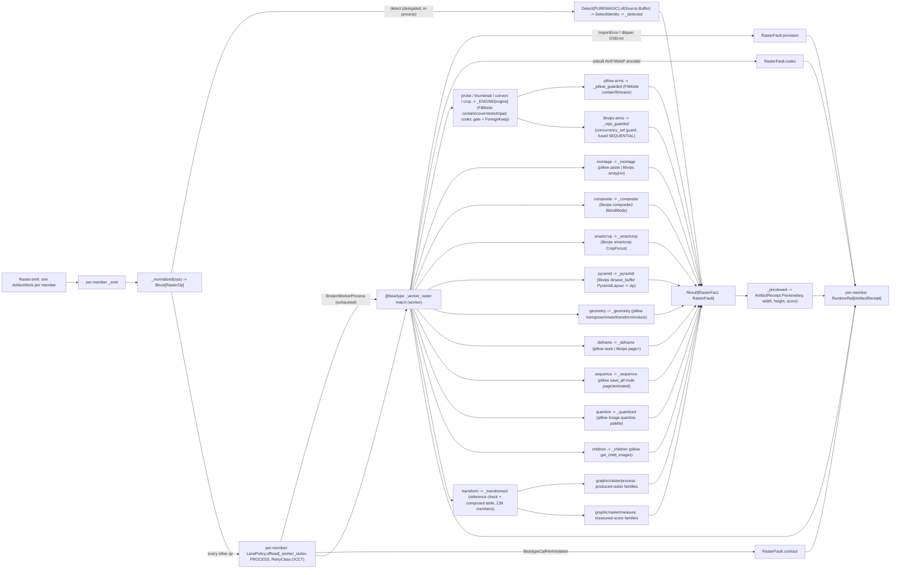

# [PY_ARTIFACTS_GRAPHIC_RASTER_IO]

The raster IO/convert/working-surface owner — the host-free pixel pipeline over the closed-payload `RasterOp` family. `Raster` is ONE surface discriminating operation over `RasterOp` and modality over `RasterOp | tuple[RasterOp, ...]`, holding the pillow in-process working surface (decode, EXIF transpose, `FitMode`-uniform resize, alpha flatten, native AVIF/WebP save, montage, geometry), the pyvips libvips-backed fused decode/downscale/ICC/smartcrop/pyramid pipeline, the delegated `exchange/detect#DETECT` MIME gate, and the scikit-image `Transform` arm whose acceptor bodies `graphic/raster/process#PROCESS` and `graphic/raster/measure#MEASURE` own. Every operation folds into one typed `RasterFact`, faults fold onto the closed `RasterFault` vocabulary, and the farm lowers to one `ArtifactWork` per member so a corrupt input faults its own node without aborting the farm — not a per-media-type class family, not a per-operation function family, not a per-engine sibling owner, not an erased `params` bag.

pillow, scikit-image, and pyvips are host-native worker packages off the runtime loader path, so every worker arm crosses one runtime-owned `LanePolicy.offload(_worker_raster, op, modality=Modality.PROCESS, retry=RetryClass.OCCT)` seam onto the shared `execution/lanes#LANE` process band — the band `exchange/detect`/`exchange/metadata`/`graphic/raster/measure`/`process`/`graphic/color/managed` share — never a folder-minted `CapacityLimiter` that oversubscribes the host against libvips's own thread pool, never the unbounded default. `Detect` is the one arm off that seam: `puremagic` is pure-Python with a bundled `magic_data.json`, so `_emit` delegates it to `exchange/detect#DETECT` in-process (the `PUREMAGIC` engine's `to_thread` band) with no process crossing, no retry, no payload pickle. `RasterFact` is canonical on `graphic/raster/process#PROCESS`; this page, `graphic/marks/encode#MARK`, and `graphic/raster/measure#MEASURE` import the one declaration, and its `score: frozendict[str, float | str]` is the exact type `core/receipt#RECEIPT` `ArtifactReceipt.Preview.scores` carries, so the metrics floats, the detect/probe strings, and the marks facts project through one `_previewed` pass with no coerce.

## [01]-[INDEX]

- [01]-[IO]: the host-free raster owner — pillow working surface, fused libvips pipeline, delegated `exchange/detect#DETECT` MIME gate, and the scikit-image `Transform` arm the process/measure siblings own — every worker arm crossing the runtime process lane, `Detect` in-process off it, folding into one `RasterFact` projected to `ArtifactReceipt.Preview`.

## [02]-[IO]

- Owner: `Raster` over the closed `RasterOp` family with the `RasterEngine`/`FitMode`/`BlendMode`/`CropFocus`/`PyramidLayout`/`GeometryOp`/`ConvertFormat`/`QuantizeMethod`/`DitherMode` policy vocabularies; the engine choice is the `RasterEngine` field and the sizing the `FitMode` field, never a sibling op per engine or fit mode. `_ENGINE` is one `Map[RasterEngine, EngineOps]`, so `_worker_raster` reads `probe`/`thumbnail`/`convert`/`crop` by one lookup and pillow and libvips share one op shape.
- Cases: the `RasterOp` cases split by engine reach — `Probe`/`Thumbnail`/`Convert`/`Crop` engine-polymorphic through `_ENGINE[engine]`; `Montage`/`Deframe` engine-split by a `match` arm; `Composite`/`SmartCrop`/`Pyramid` libvips-only (the blend algebra, saliency crop, and tiled pyramid one engine owns); `Geometry`/`Quantize`/`Children`/`Sequence` pillow-only working surface; `Detect` delegated to `exchange/detect#DETECT` in-process; `Transform` carrying the scikit-image sub-axis whose rows and bodies `graphic/raster/process#PROCESS` + `graphic/raster/measure#MEASURE` own. `Composite` stays single-engine because libvips `composite2` is alpha-correct over the whole `BlendMode` vocabulary where pillow honors only source-over — a pillow blend arm reintroduces the engine split `FitMode` deletes.
- Entry: `Raster.emit` discriminates on `self.ops` being one `RasterOp` or a tuple — `_normalized` folds either into one `Block[RasterOp]` at the head, so arity is a value property, never a `batch` knob. Each member lowers to its own `ArtifactWork` carrying that member's `RasterFault` as its boundary fault, so one corrupt input faults its node while siblings complete under the plan's front drain — never a fail-fast batch that discards every sibling on the first bad payload.
- Auto: `_emit` routes `Detect` in-process and crosses every other op through the worker; `_worker_raster` is `@beartype`-woven and re-dispatches by one total `match` under one outer `try` whose `except ImportError`/`except OSError` arms fold an absent package or libvips dlopen onto `RasterFault.provision`, importing each provider only inside its arm. The pillow arms share one `_pillow_guarded` capture (unidentified -> `decode`, bomb -> `bomb`, seek/child overrun -> `bounds`, else -> `encode`), the libvips arms one `_vips_guarded` (`concurrency_set(1)` two-pool guard + `pyvips.Error` -> `engine`); `Convert`/`Sequence` gate a build-dependent AVIF/WebP encoder through `_CODEC_FEATURE`/`get_suffixes` onto `RasterFault.codec` before the opaque provider raise. `Transform` gates the reference/mask precondition (`RasterFault.reference`) before seeding a `TransformInput` and reading the composed `TRANSFORMS | MEASURE_TRANSFORMS` union. The dispatch splits only on the op case, the per-engine `EngineOps` read, and the `FitMode`/`GeometryOp` sizing branch, never a re-discriminating `match` beyond them.
- Receipt: each op folds into `RasterFact` and projects to `core/receipt#RECEIPT` `ArtifactReceipt.Preview(key, width, height, scores)` at the rail boundary, threading `fact.score` straight onto `Preview.scores` with no coerce; `Detect` reports zero dimensions plus the resolved mime/class/container and native-`float` confidence, `Probe` the header dimensions plus a format/mode/frames/bands/icc map without transcoding, `Transform` the measure-family perceptual scores plus the region/blob/corner/shift facts. The widening is settled — `Preview.scores: frozendict[str, float | str]` already flattens the band into `{"width", "height", **scores}` — so this owner's contribution is the one `fact.score` projection; the measure scores originate on `graphic/raster/measure#MEASURE`.
- Growth: a new raster op is one `RasterOp` case plus one `_worker_raster` arm; a new engine-polymorphic op one `EngineOps` field plus a pillow and a libvips arm; a new sizing mode one `FitMode` case plus its two branches; a new blend/crop/pyramid form one `BlendMode`/`CropFocus`/`PyramidLayout` member the libvips call resolves by nickname; a new geometric op one `GeometryOp` member plus one pillow `match` arm; a new scikit-image transform one `Transform` member plus a `TRANSFORMS`/`MEASURE_TRANSFORMS` row on the owning page; a new codec one `ConvertFormat` row plus its `_VIPS_SUFFIX`/`_CODEC_KWARGS`/`_VIPS_KWARGS` entry (a build-dependent one adds a `_CODEC_FEATURE` gate); a new engine one `RasterEngine` member plus one `_ENGINE` bundle; a new fault cause one `RasterFault` case breaking every capture at type-check. The typed pyvips `Foreign*` encoder enums over the raw `_VIPS_KWARGS` strings and the `Source`/`Target` streaming intake for large-payload egress remain documented growth axes.
- Boundary: the descriptive EXIF/IPTC/XMP tag set stays `exchange/metadata#METADATA`'s; the `puremagic` sniff fold and `MediaClass`/`Container` classification stay `exchange/detect#DETECT`'s, libmagic retained only as that owner's broader `LAYERED` fallback and never io's default; the transform acceptor bodies stay the process/measure pages'.

```python signature
from collections.abc import Callable, Iterable
from dataclasses import dataclass
from enum import StrEnum
from functools import partial
from io import BytesIO
from typing import Final, Literal, assert_never

import numpy as np
from beartype import beartype
from expression import Error, Ok, Result, case, tag, tagged_union
from expression.collections import Block, Map
from msgspec import Struct
from numpy.typing import NDArray

from rasm.runtime.identity import CANONICAL_POLICY, ContentIdentity
from rasm.runtime.faults import BoundaryFault, RuntimeRail
from rasm.runtime.lanes import LanePolicy, Modality
from rasm.runtime.resilience import RetryClass

from artifacts.core.plan import Admission, ArtifactWork
from artifacts.core.receipt import ArtifactReceipt
from artifacts.graphic.raster.process import ConvertFormat, RasterFact, Transform, TransformInput

lazy import pyvips
lazy from PIL import Image, ImageOps, UnidentifiedImageError, features
lazy from skimage import io as skio

lazy from artifacts.exchange.detect import Detect, DetectEngine, DetectIdentity, Source
lazy from artifacts.graphic.raster.measure import MEASURE_TRANSFORMS
lazy from artifacts.graphic.raster.process import TRANSFORMS

type RasterOpTag = Literal[
    "thumbnail",
    "convert",
    "crop",
    "probe",
    "montage",
    "composite",
    "transform",
    "detect",
    "smartcrop",
    "pyramid",
    "geometry",
    "deframe",
    "sequence",
    "quantize",
    "children",
]
type Pixels = tuple[int, int]
type Box = tuple[int, int, int, int]


class RasterEngine(StrEnum):
    PILLOW = "pillow"
    LIBVIPS = "libvips"


class FitMode(StrEnum):
    CONTAIN = "contain"  # fit inside the box, preserve aspect, no crop (pillow ImageOps.contain / libvips crop=NONE)
    COVER = "cover"  # fill the box, crop the overflow (pillow ImageOps.fit / libvips crop=ATTENTION)
    STRETCH = "stretch"  # force the exact box, ignore aspect (pillow resize / libvips size=FORCE)
    PAD = "pad"  # fit inside, then letterbox to the exact box with background (pillow ImageOps.pad / libvips embed+Extend)


class CropFocus(StrEnum):  # the libvips Interesting model SmartCrop resolves by .value nickname
    ATTENTION = "attention"  # saliency-map peak (default)
    ENTROPY = "entropy"  # maximum-entropy window
    CENTRE = "centre"
    LOW = "low"
    HIGH = "high"


class PyramidLayout(StrEnum):  # the libvips ForeignDzLayout deep-zoom pyramid form dzsave_buffer emits by .value nickname
    DZ = "dz"  # DeepZoom
    ZOOMIFY = "zoomify"
    GOOGLE = "google"
    IIIF = "iiif"
    IIIF3 = "iiif3"


class GeometryOp(
    StrEnum
):  # pillow geometry: Transpose members + arbitrary rotate + affine/perspective + integer reduce
    FLIP_H = "flip-h"  # Transpose.FLIP_LEFT_RIGHT
    FLIP_V = "flip-v"  # Transpose.FLIP_TOP_BOTTOM
    ROTATE_90 = "rotate-90"  # Transpose.ROTATE_90 (lossless quarter-turn)
    ROTATE_180 = "rotate-180"  # Transpose.ROTATE_180
    ROTATE_270 = "rotate-270"  # Transpose.ROTATE_270
    TRANSPOSE = "transpose"  # Transpose.TRANSPOSE (main-diagonal)
    TRANSVERSE = "transverse"  # Transpose.TRANSVERSE (anti-diagonal)
    ROTATE = "rotate"  # Image.rotate(angle, expand=True) — arbitrary-angle, params=(angle,)
    AFFINE = "affine"  # Image.transform(size, AFFINE, coeffs) — params the 6 affine coefficients
    PERSPECTIVE = "perspective"  # Image.transform(size, PERSPECTIVE, coeffs) — params the 8 perspective coefficients
    REDUCE = "reduce"  # Image.reduce(factor) — integer-factor box downscale, params=(factor,)


class BlendMode(
    StrEnum
):  # the libvips composite2 nickname vocabulary passed by .value (VipsBlendMode order); OVER is the source-over default
    CLEAR = "clear"
    SOURCE = "source"
    OVER = "over"
    IN = "in"
    OUT = "out"
    ATOP = "atop"
    DEST = "dest"
    DEST_OVER = "dest-over"
    DEST_IN = "dest-in"
    DEST_OUT = "dest-out"
    DEST_ATOP = "dest-atop"
    XOR = "xor"
    ADD = "add"
    SATURATE = "saturate"
    MULTIPLY = "multiply"
    SCREEN = "screen"
    OVERLAY = "overlay"
    DARKEN = "darken"
    LIGHTEN = "lighten"
    COLOUR_DODGE = "colour-dodge"
    COLOUR_BURN = "colour-burn"
    HARD_LIGHT = "hard-light"
    SOFT_LIGHT = "soft-light"
    DIFFERENCE = "difference"
    EXCLUSION = "exclusion"


class QuantizeMethod(
    StrEnum
):  # NAMES congruent with Image.Quantize so Image.Quantize[method.name] resolves the provider enum; PIL enum stays at the edge
    MEDIANCUT = "median-cut"
    MAXCOVERAGE = "max-coverage"
    FASTOCTREE = "fast-octree"  # the only method admitting RGBA without a flatten
    LIBIMAGEQUANT = "libimagequant"  # build-dependent; the highest-quality quantizer


class DitherMode(StrEnum):  # member NAMES congruent with Image.Dither so Image.Dither[dither.name] resolves the provider enum
    NONE = "none"
    ORDERED = "ordered"
    RASTERIZE = "rasterize"
    FLOYDSTEINBERG = "floyd-steinberg"


@tagged_union(frozen=True)
class RasterFault:
    tag: Literal["decode", "bomb", "encode", "engine", "worker", "provision", "detect", "codec", "reference", "bounds", "contract"] = tag()
    decode: str = case()
    bomb: tuple[int, int] = case()
    encode: str = case()
    engine: str = case()
    worker: str = case()
    provision: str = case()
    detect: str = case()
    codec: ConvertFormat = case()  # a build-dependent AVIF/HEIF/WebP encoder the linked build lacks — the capability gate, distinct from an encode fault
    reference: Transform = case()
    bounds: str = (
        case()
    )  # a frame/page/child index past the available count — the range fault distinct from a content fault
    contract: str = case()


@tagged_union(frozen=True)
class RasterOp:
    tag: RasterOpTag = tag()
    thumbnail: tuple[bytes, Pixels, ConvertFormat, RasterEngine, FitMode] = case()
    convert: tuple[bytes, ConvertFormat, int, int, RasterEngine] = case()
    crop: tuple[bytes, Box, ConvertFormat, RasterEngine] = case()
    probe: tuple[bytes, RasterEngine] = case()
    montage: tuple[tuple[bytes, ...], int, Pixels, ConvertFormat, RasterEngine] = case()
    composite: tuple[bytes, bytes, Pixels, BlendMode, ConvertFormat] = case()
    transform: tuple[bytes, Transform, bytes, bytes, frozendict[str, float]] = case()
    detect: tuple[bytes] = case()
    smartcrop: tuple[bytes, Pixels, CropFocus, ConvertFormat] = case()
    pyramid: tuple[bytes, PyramidLayout, int, ConvertFormat] = case()
    geometry: tuple[bytes, GeometryOp, tuple[float, ...], ConvertFormat] = case()
    deframe: tuple[bytes, int, ConvertFormat, RasterEngine] = case()
    sequence: tuple[tuple[bytes, ...], tuple[int, ...], int, ConvertFormat] = case()
    quantize: tuple[bytes, int, QuantizeMethod, DitherMode, ConvertFormat] = case()
    children: tuple[bytes, int, ConvertFormat] = case()

    @staticmethod
    def Thumbnail(
        payload: bytes,
        size: Pixels,
        fmt: ConvertFormat = ConvertFormat.PNG,
        engine: RasterEngine = RasterEngine.PILLOW,
        fit: FitMode = FitMode.CONTAIN,
    ) -> "RasterOp":
        return RasterOp(thumbnail=(payload, size, fmt, engine, fit))

    @staticmethod
    def Convert(payload: bytes, codec: ConvertFormat, quality: int = 80, effort: int = 4, engine: RasterEngine = RasterEngine.PILLOW) -> "RasterOp":
        return RasterOp(convert=(payload, codec, quality, effort, engine))

    @staticmethod
    def Crop(payload: bytes, box: Box, fmt: ConvertFormat = ConvertFormat.PNG, engine: RasterEngine = RasterEngine.PILLOW) -> "RasterOp":
        return RasterOp(crop=(payload, box, fmt, engine))

    @staticmethod
    def Probe(payload: bytes, engine: RasterEngine = RasterEngine.PILLOW) -> "RasterOp":
        return RasterOp(probe=(payload, engine))

    @staticmethod
    def Montage(
        tiles: tuple[bytes, ...], columns: int, cell: Pixels, fmt: ConvertFormat = ConvertFormat.PNG, engine: RasterEngine = RasterEngine.PILLOW
    ) -> "RasterOp":
        return RasterOp(montage=(tiles, columns, cell, fmt, engine))

    @staticmethod
    def Composite(
        base: bytes, overlay: bytes, position: Pixels = (0, 0), mode: BlendMode = BlendMode.OVER, fmt: ConvertFormat = ConvertFormat.PNG
    ) -> "RasterOp":
        return RasterOp(composite=(base, overlay, position, mode, fmt))

    @staticmethod
    def Transform(
        payload: bytes, kind: Transform, reference: bytes = b"", mask: bytes = b"", opts: frozendict[str, float] = frozendict()
    ) -> "RasterOp":
        return RasterOp(transform=(payload, kind, reference, mask, opts))

    @staticmethod
    def Detect(payload: bytes) -> "RasterOp":
        return RasterOp(detect=(payload,))

    @staticmethod
    def SmartCrop(payload: bytes, size: Pixels, focus: CropFocus = CropFocus.ATTENTION, fmt: ConvertFormat = ConvertFormat.PNG) -> "RasterOp":
        return RasterOp(smartcrop=(payload, size, focus, fmt))

    @staticmethod
    def Pyramid(payload: bytes, layout: PyramidLayout = PyramidLayout.DZ, tile: int = 254, fmt: ConvertFormat = ConvertFormat.JPEG) -> "RasterOp":
        return RasterOp(pyramid=(payload, layout, tile, fmt))

    @staticmethod
    def Geometry(payload: bytes, op: GeometryOp, params: tuple[float, ...] = (), fmt: ConvertFormat = ConvertFormat.PNG) -> "RasterOp":
        return RasterOp(geometry=(payload, op, params, fmt))

    @staticmethod
    def Deframe(payload: bytes, index: int = 0, fmt: ConvertFormat = ConvertFormat.PNG, engine: RasterEngine = RasterEngine.PILLOW) -> "RasterOp":
        return RasterOp(deframe=(payload, index, fmt, engine))

    @staticmethod
    def Sequence(frames: tuple[bytes, ...], delays: tuple[int, ...] = (), loop: int = 0, fmt: ConvertFormat = ConvertFormat.TIFF) -> "RasterOp":
        return RasterOp(sequence=(frames, delays, loop, fmt))

    @staticmethod
    def Quantize(
        payload: bytes,
        colors: int = 256,
        method: QuantizeMethod = QuantizeMethod.MEDIANCUT,
        dither: DitherMode = DitherMode.FLOYDSTEINBERG,
        fmt: ConvertFormat = ConvertFormat.PNG,
    ) -> "RasterOp":
        return RasterOp(quantize=(payload, colors, method, dither, fmt))

    @staticmethod
    def Children(payload: bytes, index: int = 0, fmt: ConvertFormat = ConvertFormat.PNG) -> "RasterOp":
        return RasterOp(children=(payload, index, fmt))


class Raster(Struct, frozen=True):
    ops: RasterOp | tuple[RasterOp, ...]

    def emit(self, /) -> Iterable[ArtifactWork]:
        # one node per member — per-member PRE-RUN input keys keep elision per-member: a re-issued farm re-renders only changed ops.
        return tuple(
            ArtifactWork(
                key=ContentIdentity.of(f"raster-{op.tag}", op, policy=CANONICAL_POLICY),
                work=partial(Raster._emit, op),
                parents=(),
                admission=Admission(keyed=None),
                cost=1.0,
            )
            for op in _normalized(self.ops)
        )

    @staticmethod
    async def _emit(op: RasterOp, /) -> RuntimeRail[ArtifactReceipt]:
        # the member rail: a RasterFault folds into its own node's boundary fault — one corrupt input
        # faults its node while siblings complete under the plan's front drain.
        match op:
            case RasterOp(
                tag="detect", detect=(payload,)
            ):  # delegate the sniff to exchange/detect#DETECT (PUREMAGIC in-process to_thread, no worker crossing); the fold is authored once there
                identity = await Detect(engine=DetectEngine.PUREMAGIC).of(Source.Buffer(payload))
                return identity.map(lambda di: _detected(op, payload, di))
            case _:
                produced = await LanePolicy.offload(_worker_raster, op, modality=Modality.PROCESS, retry=RetryClass.OCCT)
                return produced.bind(
                    lambda res: res.map(lambda fact: _previewed(op, fact)).map_error(
                        lambda fault: BoundaryFault(boundary=(f"raster.{op.tag}", f"{fault.tag}:{fault}"))
                    )
                )


def _normalized(ops: RasterOp | Iterable[RasterOp], /) -> Block[RasterOp]:
    match ops:
        case Iterable() as many:
            return Block.of_seq(many)
        case lone:
            return Block.singleton(lone)


def _previewed(op: RasterOp, fact: RasterFact, /) -> ArtifactReceipt:
    return ArtifactReceipt.Preview(ContentIdentity.of(f"raster-{op.tag}", fact.data), fact.width, fact.height, fact.score)
```

```python signature
@beartype
def _worker_raster(op: RasterOp) -> Result[RasterFact, RasterFault]:
    try:
        match op:
            case RasterOp(tag="detect", detect=(_payload,)):
                return Error(
                    RasterFault(detect="<detect-routed-in-process>")
                )  # totality witness only; `_emit` routes detect in-process, never reached here
            case RasterOp(tag="probe", probe=(payload, engine)):
                return _ENGINE[engine].probe(payload)
            case RasterOp(tag="thumbnail", thumbnail=(payload, size, fmt, engine, fit)):
                return _ENGINE[engine].thumbnail(payload, size, fmt, fit)
            case RasterOp(tag="convert", convert=(payload, codec, quality, effort, engine)):
                return _ENGINE[engine].convert(payload, codec, quality, effort)
            case RasterOp(tag="crop", crop=(payload, box, fmt, engine)):
                return _ENGINE[engine].crop(payload, box, fmt)
            case RasterOp(tag="montage", montage=(tiles, columns, cell, fmt, engine)):
                return _montage(tiles, columns, cell, fmt, engine)
            case RasterOp(tag="composite", composite=(base, overlay, position, mode, fmt)):
                return _composite(base, overlay, position, mode, fmt)
            case RasterOp(tag="transform", transform=(payload, kind, reference, mask, opts)):
                return _transformed(payload, kind, reference, mask, opts)
            case RasterOp(tag="smartcrop", smartcrop=(payload, size, focus, fmt)):
                return _smartcrop(payload, size, focus, fmt)
            case RasterOp(tag="pyramid", pyramid=(payload, layout, tile, fmt)):
                return _pyramid(payload, layout, tile, fmt)
            case RasterOp(tag="geometry", geometry=(payload, geo, params, fmt)):
                return _geometry(payload, geo, params, fmt)
            case RasterOp(tag="deframe", deframe=(payload, index, fmt, engine)):
                return _deframe(payload, index, fmt, engine)
            case RasterOp(tag="sequence", sequence=(frames, delays, loop, fmt)):
                return _sequence(frames, delays, loop, fmt)
            case RasterOp(tag="quantize", quantize=(payload, colors, method, dither, fmt)):
                return _quantized(payload, colors, method, dither, fmt)
            case RasterOp(tag="children", children=(payload, index, fmt)):
                return _children(payload, index, fmt)
            case _ as unreachable:
                assert_never(unreachable)
    except ImportError as absent:
        return Error(RasterFault(provision=absent.name or "<worker-module>"))
    except OSError as unloadable:  # pyvips cffi dlopen of an unprovisioned libvips (the guards trap every content OSError before here)
        return Error(RasterFault(provision=str(unloadable)))


def _pillow_guarded(work: Callable[[], RasterFact], /) -> Result[RasterFact, RasterFault]:
    try:
        return Ok(work())
    except UnidentifiedImageError:
        return Error(RasterFault(decode="<pillow-unidentified>"))
    except Image.DecompressionBombError:
        return Error(RasterFault(bomb=(0, int(Image.MAX_IMAGE_PIXELS or 0))))
    except (
        EOFError,
        IndexError,
    ) as fault:  # a seek/get_child_images overrun; IndexError is a LookupError sibling of KeyError, so it never shadows the encode arm's KeyError
        return Error(RasterFault(bounds=str(fault)))
    except (OSError, ValueError, KeyError) as fault:
        return Error(RasterFault(encode=type(fault).__name__))


def _vips_guarded(work: Callable[[], RasterFact], /) -> Result[RasterFact, RasterFault]:
    pyvips.concurrency_set(
        1
    )  # two-pool guard: bound libvips's own intra-op pool down so it never oversubscribes against the runtime process-lane fan (idempotent)
    try:
        return Ok(work())
    except pyvips.Error as fault:
        return Error(RasterFault(engine=str(fault)))


def _detected(op: RasterOp, payload: bytes, identity: "DetectIdentity", /) -> ArtifactReceipt:
    # project the delegated DetectIdentity onto the shared Preview score band; the puremagic sniff fold owned once upstream.
    return ArtifactReceipt.Preview(
        ContentIdentity.of(f"raster-{op.tag}", payload),
        0,
        0,
        frozendict({
            "mime": identity.mime,
            "media_class": identity.media_class.value,
            "container": identity.container.value,
            "extension": identity.extensions[0] if identity.extensions else "",
            "confidence": identity.confidence,  # the native float ambiguity signal libmagic cannot supply — the exchange/detect Trust gate input
            "candidates": float(len(identity.matches)),
            "trust": identity.trust.value,
        }),
    )


def _transformed(payload: bytes, kind: Transform, reference: bytes, mask: bytes, opts: frozendict[str, float], /) -> Result[RasterFact, RasterFault]:
    if kind in _REFERENCE_REQUIRED and not reference:
        return Error(RasterFault(reference=kind))
    if kind is Transform.INPAINT and not mask:
        return Error(RasterFault(reference=kind))
    try:
        table = TRANSFORMS | MEASURE_TRANSFORMS
        return Ok(table[kind].arm(TransformInput(skio.imread(BytesIO(payload)), kind, reference, mask, opts)))
    except (ValueError, OSError, KeyError) as fault:
        return Error(RasterFault(engine=f"skimage:{kind.value}:{type(fault).__name__}"))


def _thumbnail_pillow(payload: bytes, size: Pixels, fmt: ConvertFormat, fit: FitMode) -> Result[RasterFact, RasterFault]:
    def work() -> RasterFact:
        image = ImageOps.exif_transpose(Image.open(BytesIO(payload)))
        match fit:
            case FitMode.COVER:
                fitted = ImageOps.fit(image, size)
            case FitMode.STRETCH:
                fitted = image.resize(size)
            case FitMode.CONTAIN:
                fitted = ImageOps.contain(image, size)
            case FitMode.PAD:
                fitted = ImageOps.pad(image, size)
            case _ as unreachable:
                assert_never(unreachable)
        sink = BytesIO()
        fitted.save(sink, format=fmt.value)
        return RasterFact(sink.getvalue(), *fitted.size)

    return _pillow_guarded(work)


def _thumbnail_libvips(payload: bytes, size: Pixels, fmt: ConvertFormat, fit: FitMode) -> Result[RasterFact, RasterFault]:
    def work() -> RasterFact:
        crop = pyvips.Interesting.ATTENTION if fit is FitMode.COVER else pyvips.Interesting.NONE
        sizing = pyvips.Size.FORCE if fit is FitMode.STRETCH else pyvips.Size.DOWN
        shrunk = pyvips.Image.new_from_buffer(payload, "", access=pyvips.Access.SEQUENTIAL).thumbnail_image(
            size[0], height=size[1], size=sizing, crop=crop
        )
        image = (
            shrunk.embed((size[0] - shrunk.width) // 2, (size[1] - shrunk.height) // 2, size[0], size[1], extend=pyvips.Extend.BACKGROUND)
            if fit is FitMode.PAD
            else shrunk
        )
        return RasterFact(image.write_to_buffer(_VIPS_SUFFIX[fmt]), image.width, image.height)

    return _vips_guarded(work)


def _convert_pillow(payload: bytes, codec: ConvertFormat, quality: int, effort: int) -> Result[RasterFact, RasterFault]:
    if (
        codec in _CODEC_FEATURE and not features.check(_CODEC_FEATURE[codec])
    ):  # capability gate: an unbuilt AVIF/WebP encoder faults `codec` before save raises an opaque KeyError, distinct from an encode fault
        return Error(RasterFault(codec=codec))

    def work() -> RasterFact:
        image = ImageOps.exif_transpose(Image.open(BytesIO(payload)))
        flat = image.convert("RGB") if codec in _NO_ALPHA and image.mode in {"RGBA", "LA", "P"} else image
        sink = BytesIO()
        flat.save(sink, format=codec.value, **_CODEC_KWARGS[codec](quality, effort))
        return RasterFact(sink.getvalue(), *flat.size)

    return _pillow_guarded(work)


def _convert_libvips(payload: bytes, codec: ConvertFormat, quality: int, effort: int) -> Result[RasterFact, RasterFault]:
    if (
        _VIPS_SUFFIX[codec] not in pyvips.base.get_suffixes()
    ):  # libvips capability probe: an unbuilt saver suffix faults `codec` before write_to_buffer raises pyvips.Error
        return Error(RasterFault(codec=codec))

    def work() -> RasterFact:
        source = pyvips.Image.new_from_buffer(payload, "", access=pyvips.Access.SEQUENTIAL).autorot()
        managed = source.icc_transform("srgb", intent=pyvips.Intent.RELATIVE) if source.get_typeof("icc-profile-data") != 0 else source
        flat = managed.flatten() if codec in _NO_ALPHA and managed.hasalpha() else managed
        keep = (
            pyvips.ForeignKeep.ICC | pyvips.ForeignKeep.EXIF | pyvips.ForeignKeep.XMP
        )  # write_to_buffer strips metadata by default; retain ICC/EXIF/XMP so the icc_transform-managed sRGB profile survives egress
        return RasterFact(flat.write_to_buffer(_VIPS_SUFFIX[codec], keep=keep, **_VIPS_KWARGS[codec](quality, effort)), flat.width, flat.height)

    return _vips_guarded(work)


def _crop_pillow(payload: bytes, box: Box, fmt: ConvertFormat) -> Result[RasterFact, RasterFault]:
    def work() -> RasterFact:
        left, top, width, height = box
        region = ImageOps.exif_transpose(Image.open(BytesIO(payload))).crop((left, top, left + width, top + height))
        sink = BytesIO()
        region.save(sink, format=fmt.value)
        return RasterFact(sink.getvalue(), *region.size)

    return _pillow_guarded(work)


def _crop_libvips(payload: bytes, box: Box, fmt: ConvertFormat) -> Result[RasterFact, RasterFault]:
    def work() -> RasterFact:
        image = pyvips.Image.new_from_buffer(payload, "", access=pyvips.Access.SEQUENTIAL).extract_area(*box)
        return RasterFact(image.write_to_buffer(_VIPS_SUFFIX[fmt]), image.width, image.height)

    return _vips_guarded(work)


def _probe_pillow(payload: bytes) -> Result[RasterFact, RasterFault]:
    def work() -> RasterFact:
        with Image.open(BytesIO(payload)) as image:
            score: frozendict[str, float | str] = frozendict({
                "format": image.format or "",
                "mode": image.mode,
                "frames": str(getattr(image, "n_frames", 1)),
                "icc": "present" if image.info.get("icc_profile") else "absent",
            })
            return RasterFact(payload, image.width, image.height, score)

    return _pillow_guarded(work)


def _probe_libvips(payload: bytes) -> Result[RasterFact, RasterFault]:
    def work() -> RasterFact:
        image = pyvips.Image.new_from_buffer(payload, "", access=pyvips.Access.SEQUENTIAL)
        pages = image.get("n-pages") if image.get_typeof("n-pages") != 0 else 1
        score: frozendict[str, float | str] = frozendict({
            "interpretation": str(image.interpretation),
            "bands": str(image.bands),
            "pages": str(pages),
            "icc": "present" if image.get_typeof("icc-profile-data") != 0 else "absent",
        })
        return RasterFact(payload, image.width, image.height, score)

    return _vips_guarded(work)


def _montage(tiles: tuple[bytes, ...], columns: int, cell: Pixels, fmt: ConvertFormat, engine: RasterEngine) -> Result[RasterFact, RasterFault]:
    match engine:
        case RasterEngine.PILLOW:

            def work() -> RasterFact:
                cell_w, cell_h = cell
                rows = -(-len(tiles) // columns)
                grid = Image.new("RGBA", (columns * cell_w, rows * cell_h))
                for index, blob in enumerate(tiles):
                    tile = Image.open(BytesIO(blob))
                    tile.thumbnail(cell)
                    row, col = divmod(index, columns)
                    grid.paste(tile, (col * cell_w, row * cell_h))
                sink = BytesIO()
                grid.save(sink, format=fmt.value)
                return RasterFact(sink.getvalue(), *grid.size)

            return _pillow_guarded(work)
        case RasterEngine.LIBVIPS:

            def work() -> (
                RasterFact
            ):  # fused arrayjoin grid: each cell shrinks-on-load, the grid computes in one streamed pass — large-tile parity pillow's paste loop cannot match
                cells = [
                    pyvips.Image.new_from_buffer(blob, "", access=pyvips.Access.SEQUENTIAL).thumbnail_image(
                        cell[0], height=cell[1], size=pyvips.Size.DOWN
                    )
                    for blob in tiles
                ]
                grid = pyvips.Image.arrayjoin(cells, across=columns)
                return RasterFact(grid.write_to_buffer(_VIPS_SUFFIX[fmt]), grid.width, grid.height)

            return _vips_guarded(work)
        case _ as unreachable:
            assert_never(unreachable)


def _composite(base: bytes, overlay: bytes, position: Pixels, mode: BlendMode, fmt: ConvertFormat) -> Result[RasterFact, RasterFault]:
    def work() -> RasterFact:
        canvas = pyvips.Image.new_from_buffer(base, "", access=pyvips.Access.SEQUENTIAL)
        layer = pyvips.Image.new_from_buffer(overlay, "", access=pyvips.Access.SEQUENTIAL)
        merged = canvas.composite2(layer, mode.value, x=position[0], y=position[1])
        return RasterFact(merged.write_to_buffer(_VIPS_SUFFIX[fmt]), merged.width, merged.height)

    return _vips_guarded(work)


def _smartcrop(payload: bytes, size: Pixels, focus: CropFocus, fmt: ConvertFormat) -> Result[RasterFact, RasterFault]:
    def work() -> (
        RasterFact
    ):  # content-aware crop: libvips saliency/entropy extracts the interesting window a fixed-box Crop cannot
        image = (
            pyvips.Image.new_from_buffer(payload, "", access=pyvips.Access.SEQUENTIAL).autorot().smartcrop(size[0], size[1], interesting=focus.value)
        )
        return RasterFact(image.write_to_buffer(_VIPS_SUFFIX[fmt]), image.width, image.height)

    return _vips_guarded(work)


def _pyramid(payload: bytes, layout: PyramidLayout, tile: int, fmt: ConvertFormat) -> Result[RasterFact, RasterFault]:
    def work() -> (
        RasterFact
    ):  # DeepZoom/Zoomify/IIIF pyramid tiling to one zip blob — the large-scan tiled-viewer export
        image = pyvips.Image.new_from_buffer(payload, "", access=pyvips.Access.SEQUENTIAL).autorot()
        blob = image.dzsave_buffer(layout=layout.value, tile_size=tile, suffix=f".{fmt.value.lower()}", container="zip")
        return RasterFact(blob, image.width, image.height)

    return _vips_guarded(work)


def _geometry(payload: bytes, op: GeometryOp, params: tuple[float, ...], fmt: ConvertFormat) -> Result[RasterFact, RasterFault]:
    def work() -> (
        RasterFact
    ):  # pillow-only geometry (single-engine); libvips lacks the diagonal transpose + affine/perspective cleanly
        image = ImageOps.exif_transpose(Image.open(BytesIO(payload)))
        match op:
            case GeometryOp.ROTATE:
                out = image.rotate(params[0], resample=Image.Resampling.BICUBIC, expand=True)
            case GeometryOp.REDUCE:
                out = image.reduce(int(params[0]))
            case GeometryOp.AFFINE:
                out = image.transform(image.size, Image.Transform.AFFINE, params, resample=Image.Resampling.BICUBIC)
            case GeometryOp.PERSPECTIVE:
                out = image.transform(image.size, Image.Transform.PERSPECTIVE, params, resample=Image.Resampling.BICUBIC)
            case GeometryOp.FLIP_H:
                out = image.transpose(Image.Transpose.FLIP_LEFT_RIGHT)
            case GeometryOp.FLIP_V:
                out = image.transpose(Image.Transpose.FLIP_TOP_BOTTOM)
            case GeometryOp.ROTATE_90:
                out = image.transpose(Image.Transpose.ROTATE_90)
            case GeometryOp.ROTATE_180:
                out = image.transpose(Image.Transpose.ROTATE_180)
            case GeometryOp.ROTATE_270:
                out = image.transpose(Image.Transpose.ROTATE_270)
            case GeometryOp.TRANSPOSE:
                out = image.transpose(Image.Transpose.TRANSPOSE)
            case GeometryOp.TRANSVERSE:
                out = image.transpose(Image.Transpose.TRANSVERSE)
            case _ as unreachable:
                assert_never(unreachable)
        sink = BytesIO()
        out.save(sink, format=fmt.value)
        return RasterFact(sink.getvalue(), *out.size)

    return _pillow_guarded(work)


def _deframe(payload: bytes, index: int, fmt: ConvertFormat, engine: RasterEngine) -> Result[RasterFact, RasterFault]:
    match engine:
        case RasterEngine.PILLOW:

            def work() -> (
                RasterFact
            ):  # seek to the display-index frame, re-encode single-frame; an index past n_frames raises IndexError -> bounds
                image = Image.open(BytesIO(payload))
                frames = int(getattr(image, "n_frames", 1))
                if not 0 <= index < frames:
                    raise IndexError(f"frame {index} of {frames}")
                image.seek(index)
                sink = BytesIO()
                image.save(sink, format=fmt.value)
                return RasterFact(sink.getvalue(), *image.size, frozendict({"frame": float(index), "frames": float(frames)}))

            return _pillow_guarded(work)
        case RasterEngine.LIBVIPS:

            def work() -> (
                RasterFact
            ):  # libvips page= streams one page of a huge multi-page TIFF/PDF scan without materializing the whole document
                image = pyvips.Image.new_from_buffer(payload, "", page=index, access=pyvips.Access.SEQUENTIAL)
                return RasterFact(image.write_to_buffer(_VIPS_SUFFIX[fmt]), image.width, image.height, frozendict({"frame": float(index)}))

            return _vips_guarded(work)
        case _ as unreachable:
            assert_never(unreachable)


def _sequence(frames: tuple[bytes, ...], delays: tuple[int, ...], loop: int, fmt: ConvertFormat) -> Result[RasterFact, RasterFault]:
    if fmt in _CODEC_FEATURE and not features.check(
        _CODEC_FEATURE[fmt]
    ):  # animated WebP/AVIF gate: an unbuilt encoder faults `codec` before save_all raises
        return Error(RasterFault(codec=fmt))

    def work() -> (
        RasterFact
    ):  # save_all/append_images composes the frame tuple into one multi-page TIFF or animated APNG/WebP/AVIF; delays/loop ride only the animated formats
        images = [Image.open(BytesIO(blob)) for blob in frames]
        timing = {"duration": list(delays), "loop": loop} if fmt in _ANIMATED and delays else {"loop": loop} if fmt in _ANIMATED else {}
        sink = BytesIO()
        images[0].save(sink, format=fmt.value, save_all=True, append_images=images[1:], **timing)
        return RasterFact(sink.getvalue(), *images[0].size, frozendict({"frames": float(len(images))}))

    return _pillow_guarded(work)


def _quantized(payload: bytes, colors: int, method: QuantizeMethod, dither: DitherMode, fmt: ConvertFormat) -> Result[RasterFact, RasterFault]:
    def work() -> (
        RasterFact
    ):  # indexed-color small-file export — Image.quantize over the QuantizeMethod/DitherMode vocab resolved to the PIL enum by name; subsumes convert(palette=ADAPTIVE)
        source = ImageOps.exif_transpose(Image.open(BytesIO(payload)))
        rgb = (
            source if source.mode in {"RGB", "RGBA", "L"} else source.convert("RGB")
        )  # quantize admits only RGB/RGBA/L; a P/CMYK/I;16 source flattens to RGB first
        indexed = rgb.quantize(colors=colors, method=Image.Quantize[method.name], dither=Image.Dither[dither.name])
        sink = BytesIO()
        indexed.save(sink, format=fmt.value)
        return RasterFact(sink.getvalue(), *indexed.size, frozendict({"colors": float(colors), "palette": method.value}))

    return _pillow_guarded(work)


def _children(payload: bytes, index: int, fmt: ConvertFormat) -> Result[RasterFact, RasterFault]:
    def work() -> (
        RasterFact
    ):  # embedded-thumbnail / multi-resolution sub-image extract via get_child_images — the preview a fresh decode would miss; an index past the count raises IndexError -> bounds
        with Image.open(BytesIO(payload)) as image:
            children = image.get_child_images()
            if not 0 <= index < len(children):
                raise IndexError(f"child {index} of {len(children)}")
            child = children[index]
            sink = BytesIO()
            child.save(sink, format=fmt.value)
            return RasterFact(sink.getvalue(), *child.size, frozendict({"child": float(index), "children": float(len(children))}))

    return _pillow_guarded(work)


@dataclass(frozen=True, slots=True, kw_only=True)
class EngineOps:
    thumbnail: Callable[[bytes, Pixels, ConvertFormat, FitMode], Result[RasterFact, RasterFault]]
    convert: Callable[[bytes, ConvertFormat, int, int], Result[RasterFact, RasterFault]]
    crop: Callable[[bytes, Box, ConvertFormat], Result[RasterFact, RasterFault]]
    probe: Callable[[bytes], Result[RasterFact, RasterFault]]


_ENGINE: Final[Map[RasterEngine, EngineOps]] = Map.of_seq([
    (RasterEngine.PILLOW, EngineOps(thumbnail=_thumbnail_pillow, convert=_convert_pillow, crop=_crop_pillow, probe=_probe_pillow)),
    (RasterEngine.LIBVIPS, EngineOps(thumbnail=_thumbnail_libvips, convert=_convert_libvips, crop=_crop_libvips, probe=_probe_libvips)),
])
_NO_ALPHA: frozenset[ConvertFormat] = frozenset({ConvertFormat.JPEG, ConvertFormat.BMP})
_ANIMATED: frozenset[ConvertFormat] = frozenset({
    ConvertFormat.PNG,
    ConvertFormat.WEBP,
    ConvertFormat.AVIF,
})  # the save_all containers that honor per-frame duration + loop; TIFF composes multi-page without timing
_CODEC_FEATURE: Final[Map[ConvertFormat, str]] = Map.of_seq([
    # the pillow feature name the capability gate probes; only the optional AVIF/WebP encoders gate
    (ConvertFormat.AVIF, "avif"),
    (ConvertFormat.WEBP, "webp"),
])
_REFERENCE_REQUIRED: frozenset[Transform] = frozenset({
    Transform.MATCH_HISTOGRAMS,
    Transform.OPTICAL_FLOW,
    Transform.OPTICAL_FLOW_ILK,
    Transform.PHASE_CORRELATION,
    Transform.KEYPOINTS,
    Transform.SIFT_KEYPOINTS,
    Transform.CENSURE_KEYPOINTS,
    Transform.SSIM,
    Transform.PSNR,
    Transform.MSE,
    Transform.NRMSE,
    Transform.NMI,
    Transform.HAUSDORFF,
    Transform.RAND_ERROR,
    Transform.INFO_VARIATION,
    Transform.CONTINGENCY,
})
_VIPS_SUFFIX: Final[Map[ConvertFormat, str]] = Map.of_seq([
    (ConvertFormat.PNG, ".png"),
    (ConvertFormat.JPEG, ".jpg"),
    (ConvertFormat.WEBP, ".webp"),
    (ConvertFormat.AVIF, ".avif"),
    (ConvertFormat.TIFF, ".tif"),
    (ConvertFormat.BMP, ".bmp"),
])
_CODEC_KWARGS: Final[Map[ConvertFormat, Callable[[int, int], frozendict[str, object]]]] = Map.of_seq([
    (ConvertFormat.AVIF, lambda quality, effort: frozendict({"quality": quality, "speed": effort})),
    (ConvertFormat.WEBP, lambda quality, effort: frozendict({"quality": quality, "method": effort})),
    (ConvertFormat.JPEG, lambda quality, effort: frozendict({"quality": quality, "optimize": True})),
    (ConvertFormat.PNG, lambda quality, effort: frozendict({"optimize": True})),
    (ConvertFormat.TIFF, lambda quality, effort: frozendict({"compression": "tiff_lzw"})),
    (ConvertFormat.BMP, lambda quality, effort: frozendict()),
])
_VIPS_KWARGS: Final[Map[ConvertFormat, Callable[[int, int], frozendict[str, object]]]] = Map.of_seq([
    (ConvertFormat.AVIF, lambda quality, effort: frozendict({"Q": quality, "effort": effort})),
    (ConvertFormat.WEBP, lambda quality, effort: frozendict({"Q": quality, "effort": effort})),
    (ConvertFormat.JPEG, lambda quality, effort: frozendict({"Q": quality})),
    (ConvertFormat.PNG, lambda quality, effort: frozendict({"compression": effort})),
    (ConvertFormat.TIFF, lambda quality, effort: frozendict({"compression": "lzw"})),
    (ConvertFormat.BMP, lambda quality, effort: frozendict()),
])
```



## [03]-[RESEARCH]

<!-- source-only: research row template:
[TOKEN]-[OPEN|BLOCKED]: <exact question>; <verification route>.
-->

(none)
