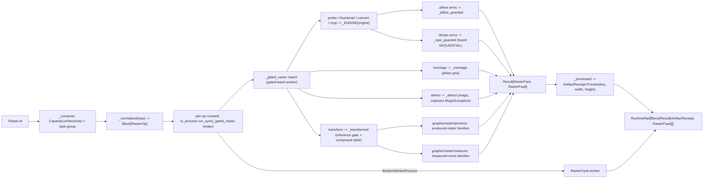

# [PY_ARTIFACTS_GRAPHIC_RASTER_IO]

The raster IO/convert/working-surface owner. `Raster` is ONE owner over the host-free pixel pipeline discriminating operation over the closed-payload `RasterOp` family and modality over `RasterOp | tuple[RasterOp, ...]`: pillow (in-process working surface — decode, EXIF `exif_transpose`, resize/thumbnail, alpha flatten, native AVIF/WebP codec save, grid montage) and pyvips (the libvips-backed fused decode/downscale/ICC/smartcrop streaming pipeline) selected per arm by the `RasterEngine` policy bundle, python-magic (libmagic MIME detection) as the raster ingress gate, and scikit-image (the eleven-submodule scientific transform engine) as the `Transform` arm whose acceptor bodies and `TRANSFORMS` rows are owned by the sibling `graphic/raster/process#PROCESS` and `graphic/raster/measure#MEASURE` pages. One raster surface, not a per-media-type class family, not a per-operation function family, not a per-engine sibling owner, and not an erased `params` bag. Every operation folds into one typed `RasterFact` and the outcome is the closed `RasterFault` vocabulary on a per-op `Result` rail, the batch returning `RuntimeRail[Block[Result[ArtifactReceipt, RasterFault]]]` so one corrupt input faults its own slot without aborting the farm.

pillow, scikit-image, pyvips, and python-magic are all host-native gated-band packages — pillow/scikit-image ride the gated `python_version<'3.15'` band (no cp315 wheel), pyvips binds a Forge-provisioned `libvips`, python-magic a Forge-provisioned `libmagic`, none on the cp315-core loader path — so EVERY arm (the `Detect` MIME gate included) crosses ONE `faults`-owned `anyio.to_process.run_sync(_gated_raster, op, limiter=CapacityLimiter(slots))` subprocess seam onto the gated-band worker, bounded by one `CapacityLimiter` constructed inside the boundary and threaded through every offload. A subinterpreter `to_interpreter.run_sync` offload shares the host interpreter version and cannot host the gated stack, so the separate-process crossing is genuine, not interchangeable with the cp315-core `execution/lanes#LANE` lane. The worker captures each provider raise (`PIL.UnidentifiedImageError`/`Image.DecompressionBombError`, `pyvips.Error`, `magic.MagicException`, the scikit-image transform raises) into a `RasterFault` case at boundary scope; a worker death surfaces as `anyio.BrokenWorkerProcess` and the seam converts it to `RasterFault.worker`, so no foreign exception escapes the seam unconverted.

`RasterFact` is declared here, the gated-band owner; `graphic/marks/encode#MARK` re-declares its minimal `(data, width, height, score)` shape for the in-process mark codec, and the `graphic/raster/process#PROCESS`/`graphic/raster/measure#MEASURE` transform acceptors fold the same `RasterFact` they import from this page.

## [01]-[INDEX]

- [01]-[IO]: raster-image IO/convert working-surface owner over pillow, pyvips, and python-magic — the closed-payload `RasterOp` family (`Thumbnail`/`Convert`/`Crop`/`Probe`/`Montage`/`Transform`/`Detect`) folding into one typed `RasterFact` on the closed `RasterFault` rail, a `RasterEngine` policy bundle (`EngineOps`) selecting the pillow working surface or the pyvips fused-libvips pipeline on the decode-heavy `thumbnail`/`convert`/`crop`/`probe` arms, a `Transform` scikit-image sub-axis spanning the eleven submodules carried on the composed `TRANSFORMS | MEASURE_TRANSFORMS` member-acceptor-kwargs table (the process-family rows on `graphic/raster/process#PROCESS`, the measure-family rows on `graphic/raster/measure#MEASURE`), a `ConvertFormat` codec sub-axis with `frozendict`-builder encode-policy tables, the `Detect` libmagic ingress gate, one modal-arity `Raster.of` over `RasterOp | tuple[RasterOp, ...]` traversing one `CapacityLimiter`-bounded `to_process` task group — all dispatch-table-folded with zero re-discriminating arm.

## [02]-[IO]

- Owner: `Raster` the one raster-and-pixel owner carrying `ops: RasterOp | tuple[RasterOp, ...]` and a `slots` offload-bound policy field, discriminating operation over the closed `RasterOp` family and modality over the input shape; `RasterOp` an `expression.tagged_union` whose every case carries its own typed payload, never a shared erased `params` dict; `RasterFault` the one closed `@tagged_union` fault vocabulary (`decode`/`bomb`/`encode`/`engine`/`worker`/`detect`/`reference`) every arm rails onto, never a bare `str` for the multi-cause raster domain; `RasterFact` the one typed result every arm folds into — `data`/`width`/`height`/`score` recovering the encoded bytes, the pixel dimensions, and the immutable `frozendict` score map — projected to `core/receipt#RECEIPT` `ArtifactReceipt.Preview` at the boundary. The pillow image is the in-process working surface, pyvips the fused-libvips streaming provider, selected per arm by the `RasterEngine` policy bundle `EngineOps` carrying the four decode-heavy callables (`thumbnail`/`convert`/`crop`/`probe`) per engine — one `frozendict[RasterEngine, EngineOps]` collapsing the former inconsistent thumbnail-table-plus-convert-`if`. scikit-image is the scientific-transform engine folded by the composed `TRANSFORMS | MEASURE_TRANSFORMS` row table (rows owned by `graphic/raster/process#PROCESS` + `graphic/raster/measure#MEASURE`), python-magic the media-type gate. The `TRANSFORMS` sub-axis table is the egress-grade collapse: a row carries a callable arm and its own settled `skimage` submodule member, the op routes by one table lookup, never a per-operation sibling function. The `RasterEngine` bundle is the throughput collapse: the `EngineOps.thumbnail`/`convert`/`crop`/`probe` member runs the in-process pure-Python pillow edge or the one-pass fused libvips pipeline, the same op resolving either engine by one `frozendict` read rather than a parallel pyvips owner.
- Cases: `RasterOp` cases — `Thumbnail(payload, size, fmt, engine)` (pillow `ImageOps.exif_transpose` + `Image.thumbnail` + `Image.save`, or the pyvips `new_from_buffer(..., access=Access.SEQUENTIAL).thumbnail_image(width, crop=Interesting.ATTENTION)` fused shrink-on-load) · `Convert(payload, codec, quality, effort, engine)` (pillow `Image.save` keyed by the typed `ConvertFormat`, native AVIF through the built-in `AvifImagePlugin`, alpha `Image.convert("RGB")` flatten when the codec carries no alpha, or the pyvips `autorot().icc_transform(...).flatten().write_to_buffer(...)` streamed managed encode) · `Crop(payload, box, fmt, engine)` (region extract — pillow `Image.crop` over the display-oriented raster, or the pyvips `extract_area(*box)` one-pass extract) · `Probe(payload, engine)` (header-only metadata read with NO transcode — pillow lazy `Image.open` reading `format`/`mode`/`n_frames`/`info["icc_profile"]`, or the pyvips header reading `interpretation`/`bands`/`get_typeof("icc-profile-data")`/`get("n-pages")`, returning the source payload with the dimensions and a rich score map) · `Montage(tiles, columns, cell, fmt)` (pillow grid composite over `Image.new`/`thumbnail`/`paste`) · `Transform(payload, kind, reference, mask, opts)` (the scikit-image arm carrying the typed `Transform` sub-axis whose rows and acceptor bodies are owned by `graphic/raster/process#PROCESS` + `graphic/raster/measure#MEASURE`) · `Detect(payload)` (the libmagic `magic.from_buffer(payload, mime=True)` MIME ingress gate) — matched by one total `match`/`case` with `assert_never`; the engine choice is the `RasterEngine` field on the decode-heavy payloads, never a sibling op per engine or per scikit-image call.
- Modality: `Raster.of` is the one modal-arity entrypoint discriminating on `self.ops` being one `RasterOp` or a `tuple[RasterOp, ...]` — `_normalized` folds either into one `Block[RasterOp]` at the head through a structural `match`, so arity is a property of the value, never a `batch`/`mode` knob; a thumbnail farm is the same call as a single thumbnail. The per-op `Result[ArtifactReceipt, RasterFault]` survives in the returned `Block` so one corrupt input faults its own slot while the rest of the batch completes (the survivor/casualty partition raster batch consumers need), never a fail-fast `sequence` that discards every sibling on the first bad payload.
- Entry: `Raster.of` is `async` over the runtime `async_boundary` and returns one `RuntimeRail[Block[Result[ArtifactReceipt, RasterFault]]]` — the `RuntimeRail` is the runtime telemetry-and-infra boundary, the `Block` the modal batch, the inner `Result[ArtifactReceipt, RasterFault]` the per-op domain outcome — whose `ArtifactReceipt.Preview` carries the content key and pixel dimensions, never an erased `object` a consumer re-validates. `_compute` constructs ONE `CapacityLimiter(self.slots)` inside the boundary, opens one `anyio.create_task_group()` failure boundary, and `start_soon`s the per-op `crossed` coroutine for every normalized op; each `crossed` crosses the `reliability/faults#FAULT` `to_process.run_sync(_gated_raster, op, limiter=limiter)` subprocess seam onto the gated-band worker, converts a `BrokenWorkerProcess` worker death to `RasterFault.worker`, and projects the worker's `RasterFact` to `ArtifactReceipt.Preview` through `Result.map`. There is no in-process raster arm and no per-op subprocess call outside the bounded group: even the `Detect` MIME gate crosses the one seam, because libmagic is a Forge-provisioned native binding absent from the cp315-core loader path exactly like libvips and the gated pillow/scikit-image wheels.
- Auto: the worker `_gated_raster(op) -> Result[RasterFact, RasterFault]` re-dispatches the case by one total `match` at boundary scope, importing `PIL`/`pyvips`/`magic`/`skimage` only inside the arm that needs them so no gated import lands on the core page: `Detect` folds through `_detect` (libmagic, capturing `MagicException` -> `RasterFault.detect`); `Probe`/`Thumbnail`/`Convert`/`Crop` fold through `_ENGINE[engine]` so the `PILLOW` member runs the in-process pillow path and the `LIBVIPS` member runs the fused `new_from_buffer(access=Access.SEQUENTIAL)` pipeline, the pillow arms sharing one `_pillow_guarded` capture (`UnidentifiedImageError` -> `decode`, `DecompressionBombError` -> `bomb`, `OSError`/`ValueError`/`KeyError` -> `encode`) and the libvips arms one `_vips_guarded` capture (`pyvips.Error` -> `engine`); `Montage` folds the pillow grid composite under `_pillow_guarded`; `Transform` folds through `_transformed`, which gates the reference/mask precondition (`RasterFault.reference` when a reference- or mask-requiring `kind` arrives empty) before seeding a `TransformInput` from `skio.imread` and reading the composed `TRANSFORMS | MEASURE_TRANSFORMS` union so all fifty-two members resolve. The capture is co-located with the provider call, the only correct boundary; the dispatch splits only on the op case, never a re-discriminating `match` inside an arm beyond the per-engine policy read.
- Receipt: each operation folds into `RasterFact` and projects to `core/receipt#RECEIPT` `ArtifactReceipt.Preview(key, width, height)` at the rail boundary; the `Detect` arm reports the default zero dimensions and stamps the resolved MIME on the score map, `Probe` reports the header dimensions and a rich `format`/`mode`/`frames`/`bands`/`interpretation`/`icc` score map without transcoding the payload, and the `Transform` arm threads the measure-family `structural_similarity`/`peak_signal_noise_ratio`/`mean_squared_error`/`normalized_root_mse`/`normalized_mutual_information`/`hausdorff_distance` perceptual-quality scores plus the `_measure`/`_register` region/blob/corner/shift facts on the immutable `RasterFact.score` `frozendict` the rail consumer reads inline. Threading those scores into the emitted `_facts` projection is the one `core/receipt#RECEIPT` `[SCORE_FACTS]` widening seam (the `preview` `_facts` arm projects `key`/`width`/`height` today), never a new receipt case and never silently claimed done on this page; the measure-family score facts originate on `graphic/raster/measure#MEASURE` and ride the shared `RasterFact.score` map to this projection.
- Packages: `pillow` (`Image`/`open`/`thumbnail`/`save`/`new`/`paste`/`crop`/`convert`/`fromarray`, `Image.MAX_IMAGE_PIXELS`/`UnidentifiedImageError`/`Image.DecompressionBombError`, `ImageOps.exif_transpose`, native `AvifImagePlugin` on 12.2.0) and `pyvips` (`Image.new_from_buffer`/`thumbnail_image`/`extract_area`/`icc_transform`/`autorot`/`flatten`/`hasalpha`/`write_to_buffer`/`get_typeof`/`get`/`width`/`height`/`bands`/`interpretation`, the `Access`/`Interesting`/`Intent` enum rows, `Error`) all gated `python_version<'3.15'`/native; `python-magic` (`from_buffer(mime=True)`/`MagicException`) the libmagic ingress gate, host-native and provisioning-gated; `scikit-image` the `Transform` engine whose acceptor bodies and rows are owned by `graphic/raster/process#PROCESS` + `graphic/raster/measure#MEASURE` (this page composes the merged table at the `_gated_raster` lookup, never re-declaring an acceptor); `numpy` (the `Frame` host pixel-array alias the transform substrate threads); `anyio` (`to_process.run_sync(limiter=)`, `CapacityLimiter`, `create_task_group`, `BrokenWorkerProcess` — the bounded gated-band subprocess seam every arm crosses); `expression` (`Result`/`Ok`/`Error`/`Block`/`tagged_union`); `msgspec` (`Struct`); runtime (`content_identity.ContentIdentity`, `faults.RuntimeRail`/`async_boundary`), `core/receipt#RECEIPT` (`ArtifactReceipt`).
- Growth: a new raster operation is one `RasterOp` case plus one `_gated_raster` arm; a new decode-heavy engine-polymorphic operation is one `EngineOps` field plus one pillow and one libvips arm; a new scikit-image transform is one `Transform` member plus one `TRANSFORMS`/`MEASURE_TRANSFORMS` row on the owning process/measure page; a new codec format is one `ConvertFormat` row plus one `_VIPS_SUFFIX`/`_CODEC_KWARGS`/`_VIPS_KWARGS` builder entry; a new raster engine is one `RasterEngine` member plus one `_ENGINE` `EngineOps` bundle; a new fault cause is one `RasterFault` case breaking every capture at type-check until handled; the libmagic gate covers a new media-type branch by its returned MIME with no new surface; zero new surface.
- Boundary: a per-media-type raster class family, a per-scikit-image-call sibling function, a parallel pyvips owner beside the pillow surface, an in-process `Detect` import on the core page, an unbounded `to_process` offload, a single-op-only entrypoint, and an erased `params` bag are the deleted forms; no UI, no live viewer; no machine-readable-mark generation or decode (the encoded-mark codec is `graphic/marks/encode#MARK`'s segno/python-barcode/zxing-cpp surface and its `graphic/marks/decode#DECODE` inverse) and no media-container encode (the temporal artifact is `media/video#MEDIA`/`media/audio#MEDIA`'s av surface). pyvips is the fused-libvips high-throughput provider on the resize/convert/crop/probe arms — its `Access.SEQUENTIAL` pipeline fuses decode + downscale + ICC + crop in one streamed O(scanline) pass, reads the embedded profile through `get_typeof("icc-profile-data")` for an ICC-correct `icc_transform`, and `flatten`s alpha against the background for a no-alpha codec, so a large-image fused downscale picks `RasterEngine.LIBVIPS` while the small in-process draw/per-pixel edge stays `RasterEngine.PILLOW`, never a Pillow round-trip where the source is already a libvips pipeline and never a naive `colourspace('srgb')` that discards the source profile; native AVIF rides the already-admitted pillow with no new dependency, the AVIF `quality`/`effort` and WebP `quality`/`method` encode controls riding the `frozendict`-builder `_CODEC_KWARGS` rows; the libmagic `Detect` gate is the raster ingress (one `from_buffer(mime=True)` row, never an extension-table guesser); the scikit-image `Transform` engine is split to `graphic/raster/process#PROCESS` (the eight transform-engine families that PRODUCE a new raster) and `graphic/raster/measure#MEASURE` (the three measurement families that PRODUCE scores), this page owning only the `Transform` StrEnum vocabulary, the `RasterOp.Transform` case, and the `_transformed` arm that reads the composed table. Only `pillow`/`scikit-image` ride the gated `python_version<'3.15'` band and the pyvips/python-magic host-native bindings load a Forge-provisioned `libvips`/`libmagic` not on the cp315 loader path, so every arm dispatches onto the `faults`-owned `to_process.run_sync` gated-band subprocess seam — a separate process the cp315-core `to_interpreter.run_sync` subinterpreter offload cannot replace — where the worker imports `PIL`/`skimage`/`pyvips`/`magic` at boundary scope so no gated import lands on the core page.

```python signature
from collections.abc import Callable, Iterable
from dataclasses import dataclass
from enum import StrEnum
from typing import Literal, assert_never

import numpy as np
from anyio import BrokenWorkerProcess, CapacityLimiter, create_task_group, to_process
from builtins import frozendict
from expression import Error, Ok, Result, case, tag, tagged_union
from expression.collections import Block
from msgspec import Struct
from numpy.typing import NDArray

from rasm.runtime.content_identity import ContentIdentity
from rasm.runtime.faults import RuntimeRail, async_boundary

from artifacts.receipt.receipt import ArtifactReceipt

type RasterOpTag = Literal["thumbnail", "convert", "crop", "probe", "montage", "transform", "detect"]
type Pixels = tuple[int, int]
type Box = tuple[int, int, int, int]
type Frame = NDArray[np.uint8]


class RasterEngine(StrEnum):
    PILLOW = "pillow"
    LIBVIPS = "libvips"


class Transform(StrEnum):
    DENOISE_BILATERAL = "denoise-bilateral"
    DENOISE_NL_MEANS = "denoise-nl-means"
    DENOISE_TV = "denoise-tv"
    DENOISE_WAVELET = "denoise-wavelet"
    INPAINT = "inpaint"
    ROLLING_BALL = "rolling-ball"
    DECONVOLVE = "deconvolve"
    CLAHE = "clahe"
    EQUALIZE = "equalize"
    RESCALE_INTENSITY = "rescale-intensity"
    MATCH_HISTOGRAMS = "match-histograms"
    GAMMA = "gamma"
    LOG = "log"
    SLIC = "slic"
    FELZENSZWALB = "felzenszwalb"
    WATERSHED = "watershed"
    CHAN_VESE = "chan-vese"
    UNSHARP = "unsharp"
    GAUSSIAN = "gaussian"
    MEDIAN = "median"
    SOBEL = "sobel"
    LAPLACE = "laplace"
    FRANGI = "frangi"
    BUTTERWORTH = "butterworth"
    GABOR = "gabor"
    CANNY = "canny"
    THRESHOLD_OTSU = "threshold-otsu"
    THRESHOLD_LOCAL = "threshold-local"
    THRESHOLD_MULTIOTSU = "threshold-multiotsu"
    SKELETONIZE = "skeletonize"
    OPENING = "opening"
    CLOSING = "closing"
    EROSION = "erosion"
    DILATION = "dilation"
    RESIZE = "resize"
    RESCALE = "rescale"
    ROTATE = "rotate"
    RADON = "radon"
    CONTOURS = "contours"
    ENTROPY = "entropy"
    HOG = "hog"
    BLOB = "blob"
    LBP = "lbp"
    CORNERS = "corners"
    OPTICAL_FLOW = "optical-flow"
    PHASE_CORRELATION = "phase-correlation"
    SSIM = "ssim"
    PSNR = "psnr"
    MSE = "mse"
    NRMSE = "nrmse"
    NMI = "nmi"
    HAUSDORFF = "hausdorff"


class ConvertFormat(StrEnum):
    PNG = "PNG"
    JPEG = "JPEG"
    WEBP = "WEBP"
    AVIF = "AVIF"
    TIFF = "TIFF"
    BMP = "BMP"


class RasterFact(Struct, frozen=True):
    data: bytes
    width: int = 0
    height: int = 0
    score: frozendict[str, str] = frozendict()


@tagged_union(frozen=True)
class RasterFault:
    tag: Literal["decode", "bomb", "encode", "engine", "worker", "detect", "reference"] = tag()
    decode: str = case()
    bomb: tuple[int, int] = case()
    encode: str = case()
    engine: str = case()
    worker: str = case()
    detect: str = case()
    reference: Transform = case()


@tagged_union(frozen=True)
class RasterOp:
    tag: RasterOpTag = tag()
    thumbnail: tuple[bytes, Pixels, ConvertFormat, RasterEngine] = case()
    convert: tuple[bytes, ConvertFormat, int, int, RasterEngine] = case()
    crop: tuple[bytes, Box, ConvertFormat, RasterEngine] = case()
    probe: tuple[bytes, RasterEngine] = case()
    montage: tuple[tuple[bytes, ...], int, Pixels, ConvertFormat] = case()
    transform: tuple[bytes, Transform, bytes, bytes, frozendict[str, float]] = case()
    detect: tuple[bytes] = case()

    @staticmethod
    def Thumbnail(payload: bytes, size: Pixels, fmt: ConvertFormat = ConvertFormat.PNG, engine: RasterEngine = RasterEngine.PILLOW) -> "RasterOp":
        return RasterOp(thumbnail=(payload, size, fmt, engine))

    @staticmethod
    def Convert(payload: bytes, codec: ConvertFormat, quality: int = 80, effort: int = 4, engine: RasterEngine = RasterEngine.PILLOW) -> "RasterOp":
        return RasterOp(convert=(payload, codec, quality, effort, engine))

    @staticmethod
    def Crop(payload: bytes, box: Box, fmt: ConvertFormat = ConvertFormat.PNG, engine: RasterEngine = RasterEngine.PILLOW) -> "RasterOp":
        return RasterOp(crop=(payload, box, fmt, engine))

    @staticmethod
    def Probe(payload: bytes, engine: RasterEngine = RasterEngine.PILLOW) -> "RasterOp":
        return RasterOp(probe=(payload, engine))

    @staticmethod
    def Montage(tiles: tuple[bytes, ...], columns: int, cell: Pixels, fmt: ConvertFormat = ConvertFormat.PNG) -> "RasterOp":
        return RasterOp(montage=(tiles, columns, cell, fmt))

    @staticmethod
    def Transform(payload: bytes, kind: Transform, reference: bytes = b"", mask: bytes = b"", opts: frozendict[str, float] = frozendict()) -> "RasterOp":
        return RasterOp(transform=(payload, kind, reference, mask, opts))

    @staticmethod
    def Detect(payload: bytes) -> "RasterOp":
        return RasterOp(detect=(payload,))


class Raster(Struct, frozen=True):
    ops: RasterOp | tuple[RasterOp, ...]
    slots: int = 4

    async def of(self) -> RuntimeRail[Block[Result[ArtifactReceipt, RasterFault]]]:
        return await async_boundary("raster", self._compute)

    async def _compute(self) -> Block[Result[ArtifactReceipt, RasterFault]]:
        limiter = CapacityLimiter(self.slots)

        async def crossed(op: RasterOp, /) -> Result[ArtifactReceipt, RasterFault]:
            try:
                produced = await to_process.run_sync(_gated_raster, op, limiter=limiter)
            except BrokenWorkerProcess as broken:
                return Error(RasterFault(worker=str(broken)))
            return produced.map(lambda fact: _previewed(op, fact))

        async with create_task_group() as group:
            handles = _normalized(self.ops).map(lambda op: group.start_soon(crossed, op))
        return handles.map(lambda handle: handle.return_value)


def _normalized(ops: RasterOp | Iterable[RasterOp], /) -> Block[RasterOp]:
    match ops:
        case RasterOp() as lone:
            return Block.singleton(lone)
        case Iterable() as many:
            return Block.of_seq(many)


def _previewed(op: RasterOp, fact: RasterFact, /) -> ArtifactReceipt:
    return ArtifactReceipt.Preview(ContentIdentity.of(f"raster-{op.tag}", fact.data), fact.width, fact.height)
```

`RasterFact` is the one fact every arm yields — bytes plus dimensions plus the immutable `frozendict` score map — so `_previewed` projects one shape into `ArtifactReceipt.Preview` regardless of op, the `Detect` gate reports the default zero dimensions while `Probe` reports the header dimensions, and the metrics score rides the same fact map both the content-key seed and the `core/receipt#RECEIPT` `_facts` fold project to strings; the `RasterOp` payload is typed per case, never an erased `params` dict the arm re-validates. `RasterFault` is the closed cause vocabulary the whole rail threads — `decode` an undecodable payload, `bomb` a `DecompressionBombError` against the pixel ceiling, `encode` a save/codec failure, `engine` a libvips operation fault, `worker` a `BrokenWorkerProcess` subprocess death, `detect` a libmagic fault, `reference` a transform missing its required reference/mask — each structurally addressable so a downstream `match` routes a worker death apart from a bad codec apart from a corrupt payload, never a message-collapsed string. `RasterFact` is the gated-band owner's value object that `graphic/marks/encode#MARK` re-declares (the minimal `(data, width, height, score)` shape) so the in-process mark codec yields the same fact into the shared `ArtifactReceipt.Preview` without importing the gated-band owner, and that the `graphic/raster/process#PROCESS`/`graphic/raster/measure#MEASURE` transform acceptors import from this page so the produced-raster and measured-score arms fold one shape.

```python signature
def _gated_raster(op: RasterOp) -> Result[RasterFact, RasterFault]:
    match op:
        case RasterOp(tag="detect", detect=(payload,)):
            return _detect(payload)
        case RasterOp(tag="probe", probe=(payload, engine)):
            return _ENGINE[engine].probe(payload)
        case RasterOp(tag="thumbnail", thumbnail=(payload, size, fmt, engine)):
            return _ENGINE[engine].thumbnail(payload, size, fmt)
        case RasterOp(tag="convert", convert=(payload, codec, quality, effort, engine)):
            return _ENGINE[engine].convert(payload, codec, quality, effort)
        case RasterOp(tag="crop", crop=(payload, box, fmt, engine)):
            return _ENGINE[engine].crop(payload, box, fmt)
        case RasterOp(tag="montage", montage=(tiles, columns, cell, fmt)):
            return _montage(tiles, columns, cell, fmt)
        case RasterOp(tag="transform", transform=(payload, kind, reference, mask, opts)):
            return _transformed(payload, kind, reference, mask, opts)
        case _ as unreachable:
            assert_never(unreachable)


def _pillow_guarded(work: Callable[[], RasterFact], /) -> Result[RasterFact, RasterFault]:
    from PIL import Image, UnidentifiedImageError

    try:
        return Ok(work())
    except UnidentifiedImageError:
        return Error(RasterFault(decode="<pillow-unidentified>"))
    except Image.DecompressionBombError:
        return Error(RasterFault(bomb=(0, int(Image.MAX_IMAGE_PIXELS or 0))))
    except (OSError, ValueError, KeyError) as fault:
        return Error(RasterFault(encode=type(fault).__name__))


def _vips_guarded(work: Callable[[], RasterFact], /) -> Result[RasterFact, RasterFault]:
    import pyvips

    try:
        return Ok(work())
    except pyvips.Error as fault:
        return Error(RasterFault(engine=str(fault)))


def _detect(payload: bytes, /) -> Result[RasterFact, RasterFault]:
    import magic

    try:
        return Ok(RasterFact(payload, score=frozendict({"mime": magic.from_buffer(payload, mime=True)})))
    except magic.MagicException as fault:
        return Error(RasterFault(detect=str(fault)))


def _transformed(payload: bytes, kind: Transform, reference: bytes, mask: bytes, opts: frozendict[str, float], /) -> Result[RasterFact, RasterFault]:
    if kind in _REFERENCE_REQUIRED and not reference:
        return Error(RasterFault(reference=kind))
    if kind is Transform.INPAINT and not mask:
        return Error(RasterFault(reference=kind))
    from io import BytesIO

    from skimage import io as skio

    from artifacts.graphic.raster.measure import MEASURE_TRANSFORMS
    from artifacts.graphic.raster.process import TRANSFORMS, TransformInput

    try:
        table = TRANSFORMS | MEASURE_TRANSFORMS
        return Ok(table[kind].arm(TransformInput(skio.imread(BytesIO(payload)), kind, reference, mask, opts)))
    except (ValueError, OSError, KeyError) as fault:
        return Error(RasterFault(engine=f"skimage:{kind.value}:{type(fault).__name__}"))


def _thumbnail_pillow(payload: bytes, size: Pixels, fmt: ConvertFormat) -> Result[RasterFact, RasterFault]:
    def work() -> RasterFact:
        from io import BytesIO

        from PIL import Image, ImageOps

        image = ImageOps.exif_transpose(Image.open(BytesIO(payload)))
        image.thumbnail(size)
        sink = BytesIO()
        image.save(sink, format=fmt.value)
        return RasterFact(sink.getvalue(), *image.size)

    return _pillow_guarded(work)


def _thumbnail_libvips(payload: bytes, size: Pixels, fmt: ConvertFormat) -> Result[RasterFact, RasterFault]:
    def work() -> RasterFact:
        import pyvips

        image = pyvips.Image.new_from_buffer(payload, "", access=pyvips.Access.SEQUENTIAL).thumbnail_image(size[0], height=size[1], crop=pyvips.Interesting.ATTENTION)
        return RasterFact(image.write_to_buffer(_VIPS_SUFFIX[fmt]), image.width, image.height)

    return _vips_guarded(work)


def _convert_pillow(payload: bytes, codec: ConvertFormat, quality: int, effort: int) -> Result[RasterFact, RasterFault]:
    def work() -> RasterFact:
        from io import BytesIO

        from PIL import Image, ImageOps

        image = ImageOps.exif_transpose(Image.open(BytesIO(payload)))
        flat = image.convert("RGB") if codec in _NO_ALPHA and image.mode in {"RGBA", "LA", "P"} else image
        sink = BytesIO()
        flat.save(sink, format=codec.value, **_CODEC_KWARGS[codec](quality, effort))
        return RasterFact(sink.getvalue(), *flat.size)

    return _pillow_guarded(work)


def _convert_libvips(payload: bytes, codec: ConvertFormat, quality: int, effort: int) -> Result[RasterFact, RasterFault]:
    def work() -> RasterFact:
        import pyvips

        source = pyvips.Image.new_from_buffer(payload, "", access=pyvips.Access.SEQUENTIAL).autorot()
        managed = source.icc_transform("srgb", intent=pyvips.Intent.RELATIVE) if source.get_typeof("icc-profile-data") != 0 else source
        flat = managed.flatten() if codec in _NO_ALPHA and managed.hasalpha() else managed
        return RasterFact(flat.write_to_buffer(_VIPS_SUFFIX[codec], **_VIPS_KWARGS[codec](quality, effort)), flat.width, flat.height)

    return _vips_guarded(work)


def _crop_pillow(payload: bytes, box: Box, fmt: ConvertFormat) -> Result[RasterFact, RasterFault]:
    def work() -> RasterFact:
        from io import BytesIO

        from PIL import Image, ImageOps

        left, top, width, height = box
        region = ImageOps.exif_transpose(Image.open(BytesIO(payload))).crop((left, top, left + width, top + height))
        sink = BytesIO()
        region.save(sink, format=fmt.value)
        return RasterFact(sink.getvalue(), *region.size)

    return _pillow_guarded(work)


def _crop_libvips(payload: bytes, box: Box, fmt: ConvertFormat) -> Result[RasterFact, RasterFault]:
    def work() -> RasterFact:
        import pyvips

        image = pyvips.Image.new_from_buffer(payload, "", access=pyvips.Access.SEQUENTIAL).extract_area(*box)
        return RasterFact(image.write_to_buffer(_VIPS_SUFFIX[fmt]), image.width, image.height)

    return _vips_guarded(work)


def _probe_pillow(payload: bytes) -> Result[RasterFact, RasterFault]:
    def work() -> RasterFact:
        from io import BytesIO

        from PIL import Image

        with Image.open(BytesIO(payload)) as image:
            score = frozendict({
                "format": image.format or "",
                "mode": image.mode,
                "frames": str(getattr(image, "n_frames", 1)),
                "icc": "present" if image.info.get("icc_profile") else "absent",
            })
            return RasterFact(payload, image.width, image.height, score)

    return _pillow_guarded(work)


def _probe_libvips(payload: bytes) -> Result[RasterFact, RasterFault]:
    def work() -> RasterFact:
        import pyvips

        image = pyvips.Image.new_from_buffer(payload, "", access=pyvips.Access.SEQUENTIAL)
        pages = image.get("n-pages") if image.get_typeof("n-pages") != 0 else 1
        score = frozendict({
            "interpretation": str(image.interpretation),
            "bands": str(image.bands),
            "pages": str(pages),
            "icc": "present" if image.get_typeof("icc-profile-data") != 0 else "absent",
        })
        return RasterFact(payload, image.width, image.height, score)

    return _vips_guarded(work)


def _montage(tiles: tuple[bytes, ...], columns: int, cell: Pixels, fmt: ConvertFormat) -> Result[RasterFact, RasterFault]:
    def work() -> RasterFact:
        from io import BytesIO

        from PIL import Image

        cell_w, cell_h = cell
        rows = -(-len(tiles) // columns)
        grid = Image.new("RGBA", (columns * cell_w, rows * cell_h))
        for index, blob in enumerate(tiles):
            tile = Image.open(BytesIO(blob))
            tile.thumbnail(cell)
            row, col = divmod(index, columns)
            grid.paste(tile, (col * cell_w, row * cell_h))
        sink = BytesIO()
        grid.save(sink, format=fmt.value)
        return RasterFact(sink.getvalue(), *grid.size)

    return _pillow_guarded(work)


@dataclass(frozen=True, slots=True, kw_only=True)
class EngineOps:
    thumbnail: Callable[[bytes, Pixels, ConvertFormat], Result[RasterFact, RasterFault]]
    convert: Callable[[bytes, ConvertFormat, int, int], Result[RasterFact, RasterFault]]
    crop: Callable[[bytes, Box, ConvertFormat], Result[RasterFact, RasterFault]]
    probe: Callable[[bytes], Result[RasterFact, RasterFault]]


_ENGINE: frozendict[RasterEngine, EngineOps] = frozendict({
    RasterEngine.PILLOW: EngineOps(thumbnail=_thumbnail_pillow, convert=_convert_pillow, crop=_crop_pillow, probe=_probe_pillow),
    RasterEngine.LIBVIPS: EngineOps(thumbnail=_thumbnail_libvips, convert=_convert_libvips, crop=_crop_libvips, probe=_probe_libvips),
})
_NO_ALPHA: frozenset[ConvertFormat] = frozenset({ConvertFormat.JPEG, ConvertFormat.BMP})
_REFERENCE_REQUIRED: frozenset[Transform] = frozenset({
    Transform.MATCH_HISTOGRAMS, Transform.OPTICAL_FLOW, Transform.PHASE_CORRELATION,
    Transform.SSIM, Transform.PSNR, Transform.MSE, Transform.NRMSE, Transform.NMI, Transform.HAUSDORFF,
})
_VIPS_SUFFIX: frozendict[ConvertFormat, str] = frozendict({
    ConvertFormat.PNG: ".png", ConvertFormat.JPEG: ".jpg", ConvertFormat.WEBP: ".webp",
    ConvertFormat.AVIF: ".avif", ConvertFormat.TIFF: ".tif", ConvertFormat.BMP: ".bmp",
})
_CODEC_KWARGS: frozendict[ConvertFormat, Callable[[int, int], frozendict[str, object]]] = frozendict({
    ConvertFormat.AVIF: lambda quality, effort: frozendict({"quality": quality, "speed": effort}),
    ConvertFormat.WEBP: lambda quality, effort: frozendict({"quality": quality, "method": effort}),
    ConvertFormat.JPEG: lambda quality, effort: frozendict({"quality": quality, "optimize": True}),
    ConvertFormat.PNG: lambda quality, effort: frozendict({"optimize": True}),
    ConvertFormat.TIFF: lambda quality, effort: frozendict({"compression": "tiff_lzw"}),
    ConvertFormat.BMP: lambda quality, effort: frozendict(),
})
_VIPS_KWARGS: frozendict[ConvertFormat, Callable[[int, int], frozendict[str, object]]] = frozendict({
    ConvertFormat.AVIF: lambda quality, effort: frozendict({"Q": quality, "effort": effort}),
    ConvertFormat.WEBP: lambda quality, effort: frozendict({"Q": quality, "effort": effort}),
    ConvertFormat.JPEG: lambda quality, effort: frozendict({"Q": quality}),
    ConvertFormat.PNG: lambda quality, effort: frozendict({"compression": effort}),
    ConvertFormat.TIFF: lambda quality, effort: frozendict({"compression": "lzw"}),
    ConvertFormat.BMP: lambda quality, effort: frozendict(),
})
```

The `RasterEngine` policy bundle is the throughput collapse: `_ENGINE` is one `frozendict[RasterEngine, EngineOps]` whose `EngineOps` carries the four decode-heavy callables per engine, so `_gated_raster` reads `_ENGINE[engine].thumbnail`/`convert`/`crop`/`probe` by one lookup and the pillow and libvips engines share one op shape with zero re-discrimination — the former inconsistent thumbnail-`dict`-plus-convert-`if` is gone. The pillow arms route every decode/encode raise through one `_pillow_guarded` capture (a shared boundary adapter, not a single-call helper — four callers) and the libvips arms through one `_vips_guarded`, each naming the exact provider exception set and mapping it onto the closed `RasterFault` rather than a bare `except Exception`. The native AVIF row is a pure `Convert` deepen on the already-admitted pillow: `Image.save(format="AVIF")` emits AVIF through the built-in `AvifImagePlugin` Pillow 12.2.0 ships, and `_CODEC_KWARGS` keys each codec's encode controls by a `frozendict`-builder row taking `(quality, effort)` so a codec reaches its native parameters by one row, never a per-format encoder and never a per-call dict literal. The pyvips provider arm is the fused alternative: `new_from_buffer(payload, access=Access.SEQUENTIAL)` opens a one-pass streaming pipeline, `autorot()` bakes EXIF orientation, `icc_transform("srgb", intent=Intent.RELATIVE)` runs liblcms2-backed ICC conversion only when `get_typeof("icc-profile-data")` proves an embedded profile, `flatten()` composites alpha against the background for a `_NO_ALPHA` codec, and `write_to_buffer(suffix, **_VIPS_KWARGS[codec](quality, effort))` computes the pipeline exactly once at egress. `Probe` is the metadata-without-transcode arm: pillow's lazy `Image.open` reads `format`/`mode`/`n_frames`/`info["icc_profile"]` and libvips reads `interpretation`/`bands`/`get("n-pages")`/`get_typeof("icc-profile-data")` off the header, both returning the source `payload` unchanged with the dimensions and a rich score map, so a gallery learns dimensions and codec without a decode+re-encode round trip. `Crop` extracts a region (`box = (left, top, width, height)`) — pillow `Image.crop` after `exif_transpose` so the box is in display orientation, libvips `extract_area(*box)` in one streamed pass. `_transformed` gates the reference/mask precondition onto `RasterFault.reference` before seeding the `TransformInput` and reads the composed `TRANSFORMS | MEASURE_TRANSFORMS` union so all fifty-two `Transform` members resolve, the `TransformInput` carrier and the acceptor bodies owned by `graphic/raster/process#PROCESS` + `graphic/raster/measure#MEASURE` and never re-declared here.



## [03]-[RESEARCH]

- [FAULT_RAIL] [RESOLVED]: the closed `RasterFault` `@tagged_union` (`decode`/`bomb`/`encode`/`engine`/`worker`/`detect`/`reference`) is the cause vocabulary the whole rail threads, replacing the former illusory bare `RuntimeRail[ArtifactReceipt]` that modelled no failure mode. Each case is structurally addressable so a downstream `match` routes a subprocess death apart from a bad codec apart from a corrupt payload. The capture is co-located with the provider call at boundary scope inside the worker: `_pillow_guarded` names `PIL.UnidentifiedImageError` -> `decode`, `Image.DecompressionBombError` -> `bomb` (carrying `Image.MAX_IMAGE_PIXELS` as the ceiling), and `OSError`/`ValueError`/`KeyError` -> `encode`; `_vips_guarded` names `pyvips.Error` -> `engine`; `_detect` names `magic.MagicException` -> `detect`; `_transformed` gates `RasterFault.reference` for a reference/mask-requiring `kind` and maps the scikit-image raise to `engine`. The `pillow`/`pyvips`/`python-magic` `.api` `[02]-[PUBLIC_TYPES]` fault rows confirm `UnidentifiedImageError`/`DecompressionBombError`/`Error`/`MagicException`; the `pillow` `[04]-[IMPLEMENTATION_LAW]` evidence axis confirms `MAX_IMAGE_PIXELS` is the bomb ceiling. No bare `except Exception` rides the worker; an unexpected raise propagates as a defect through `BrokenWorkerProcess`.
- [OFFLOAD_BOUND] [RESOLVED]: every gated-band arm crosses `anyio.to_process.run_sync(_gated_raster, op, limiter=CapacityLimiter(self.slots))` bounded by ONE `CapacityLimiter` constructed inside `_compute` and threaded into every offload, never the unbounded default. The `anyio` `.api` `[03]-[ENTRYPOINTS]` row [06] confirms `to_process.run_sync(func, *args, cancellable=False, limiter=None)` and `[04]-[IMPLEMENTATION_LAW]` confirms the explicit-limiter rule and the `BrokenWorkerProcess` worker-death surface; `[02]-[PUBLIC_TYPES]` confirms `CapacityLimiter`/`BrokenWorkerProcess`/`create_task_group`. The batch runs as N bounded worker tasks under one `create_task_group` failure boundary, each holding one gated-band pipeline, the bound respecting the libvips internal thread pool the `pyvips` `.api` `[04]-[IMPLEMENTATION_LAW]` `[STACK_INTEGRATION]` names so the two pools do not oversubscribe the host. The worker death converts to `RasterFault.worker` at the seam, so no foreign exception escapes unconverted.
- [MODAL_ARITY] [RESOLVED]: `Raster.of` is the one modal-arity entrypoint over `ops: RasterOp | tuple[RasterOp, ...]`, normalized once at the head by `_normalized` through a structural `match` into one `Block[RasterOp]`, so a thumbnail farm and a single thumbnail are the same call and arity is a property of the value, never a `batch`/`mode` knob. The return is `RuntimeRail[Block[Result[ArtifactReceipt, RasterFault]]]` — the per-op `Result` survives in the `Block` (the survivor/casualty partition raster batch consumers need, `boundaries.md` `[PROBE_SWEEP]`), so one corrupt input faults its own slot without aborting the farm, never a fail-fast `sequence` discarding every sibling.
- [DETECT_GATED] [RESOLVED]: the libmagic `Detect` ingress gate now crosses the `to_process.run_sync` seam into the worker, where `_detect` imports `magic` at boundary scope and calls `from_buffer(payload, mime=True)`; the former in-process `Raster.media_type` staticmethod imported `magic` on the cp315-core process where the Forge-provisioned `libmagic` is absent from the loader path, so the in-process call could not resolve. The `python-magic` `.api` `[03]-[ENTRYPOINTS]` row [01] confirms `from_buffer(buffer, mime=False) -> str` with `mime=True` returning the MIME type and `[04]-[IMPLEMENTATION_LAW]` confirms the in-memory-bytes row is the canonical detection and that libmagic is a provisioning-gated native binding; the gate routes an image payload onto the raster arms vs a foreign owner, one `from_buffer` row not an extension-table guesser. This `Detect` gate is the artifacts-internal raster ingress, disjoint from the boundary `exchange/detect#DETECT` python-magic owner that gates the document/ingest plane.
- [PROBE_CROP] [RESOLVED]: `Probe` and `Crop` close two real domain gaps the former surface lacked. `Probe` reads image metadata WITHOUT a transcode — the pillow `.api` `[03]-[ENTRYPOINTS]` row [01] confirms `Image.open` is lazy (deferred decode), and `[04]-[IMPLEMENTATION_LAW]` confirms `format`/`mode`/`info`/`seek`/`tell` plus `ImageSequence` carry header facts, so `_probe_pillow` reads `format`/`mode`/`n_frames`/`info["icc_profile"]` and `_probe_libvips` reads `interpretation`/`bands`/`get("n-pages")`/`get_typeof("icc-profile-data")` off the lazy header (pyvips `.api` `[03]` row [02] `new_from_buffer` + the generated `get`/`get_typeof` metadata surface row), both returning the source payload with the dimensions and a rich score map. `Crop` is the region-extract working-surface op — pillow `.api` `[03]` row [06] `Image.crop(box)`, pyvips `.api` `[03]` row [04] `extract_area(left, top, width, height)`. The `exif_transpose` orientation deepen (pillow `[03]` row [06] `ImageOps.exif_transpose`, pyvips `[03]` row [10] `autorot`) and the alpha `flatten` deepen for a `_NO_ALPHA` codec (pillow `convert("RGB")`, pyvips `[03]` row [08] `flatten`/`hasalpha`) are in-place correctness folds on the existing decode-heavy arms, not new surfaces.
- [AVIF_SETTLED] [RESEARCH]: the native AVIF `Convert` row is SETTLED on the already-admitted pillow — the `pillow` catalogue `[01]-[PACKAGE_SURFACE]` confirms `installed: 12.2.0` with the bundled wheel building the `avif` codec feature, and `[04]-[IMPLEMENTATION_LAW]` confirms `Image.save` keys the codec by `format` with `quality`/`optimize`/`compression` riding save kwargs, so `Image.save(format="AVIF")` emits AVIF through the built-in `AvifImagePlugin`, needing no `pillow-avif-plugin` dependency (none on the manifest). The `ConvertFormat` closed vocabulary keys the codec by row and `_CODEC_KWARGS` keys each codec's encode controls by a `frozendict`-builder. The verified pillow save kwargs are `quality`/`optimize`/`compression`; the AVIF `speed` and WebP `method` encoder-effort kwargs are NOT yet enumerated in the `pillow` `.api` rows (the rail is dark on cp315 and the catalogue records the feature/param set as read off live `PIL.features` when the package lands), so the `_CODEC_KWARGS` AVIF `speed`/WebP `method` spellings stay a marked RESEARCH-deepen seam. The pyvips `_VIPS_KWARGS` `Q`/`effort`/`compression` spellings are SETTLED against the `pyvips` `.api` `[04]` egress axis. Close-condition: `.api` carries the per-plugin pillow save-kwarg rows for AVIF `speed` and WebP `method`.
- [VIPS_FUSED_PROVIDER] [RESEARCH]: the pyvips `RasterEngine.LIBVIPS` fused-pipeline provider arm composes `new_from_buffer(payload, "", access=Access.SEQUENTIAL)`, `thumbnail_image(width, height=..., crop=Interesting.ATTENTION)`, `autorot()`, `icc_transform("srgb", intent=Intent.RELATIVE)` guarded by `get_typeof("icc-profile-data") != 0`, `flatten()` guarded by `hasalpha()`, `extract_area(*box)`, and `write_to_buffer(suffix, **kwargs)` against the folder `pyvips` `.api` catalogue: `new_from_buffer` construction row [02], `thumbnail` operation row [01], `extract_area`/`crop` row [04], `icc_transform` row [06], `flatten`/`hasalpha` row [08], `autorot` row [10], `write_to_buffer` egress row [02], and `Access.SEQUENTIAL`/`Interesting.ATTENTION`/`Intent.RELATIVE` the `[02]-[PUBLIC_TYPES]` enum rows; `[04]-[IMPLEMENTATION_LAW]` `[STACK_INTEGRATION]` confirms the `new_from_buffer(png_bytes, access=Access.SEQUENTIAL).thumbnail_image(width)` fused-downscale composition this arm reuses. The catalogue records pyvips as sdist-only with native libvips NOT provisioned on this band, so the provider arm runs on the gated `to_process.run_sync` worker beside pillow/scikit-image and the `assay api resolve pyvips` reflection deepens once the Forge scientific toolchain provisions libvips on the worker — the one open spelling is the `thumbnail_image(width, *, height, crop)` instance-method signature (the catalogue spells the load-from-file `Image.thumbnail` row and the already-loaded-pipeline `thumbnail_image` variant through the generated `__getattr__` operation surface). Close-condition: `.api` carries the explicit `thumbnail_image` instance-method row.
- [PROCESS_MEASURE_SPLIT] [RESOLVED]: the scikit-image `Transform` engine is split three ways while the `Raster`/`RasterOp`/`RasterFault` owner stays whole on this page. This `io` page owns the `Transform` StrEnum (all fifty-two members), the `RasterOp.Transform` case, the `_transformed` arm, the `_REFERENCE_REQUIRED` precondition set, and the pillow/pyvips/python-magic IO/convert/crop/probe/thumbnail/montage/detect surface. `graphic/raster/process#PROCESS` owns the eight produced-raster acceptors, the shared `TransformInput`/`TransformArm` structs, the `_save_array`/`_luminance` helpers, and the base `TRANSFORMS` table; `graphic/raster/measure#MEASURE` owns the three measurement acceptors, imports that substrate, and contributes `MEASURE_TRANSFORMS`. `_transformed` composes the dispatch as `TRANSFORMS | MEASURE_TRANSFORMS` and looks up `table[kind]`, so all fifty-two members resolve through one union — the thirty-eight process-family rows on the process page, the fourteen measure-family rows on the measure page — every member landing in exactly one page's rows with zero loss and zero overlap.
- [MARKS_SPLIT] [RESOLVED]: the machine-readable-mark generation + decode concern is split to the sibling `graphic/marks/encode#MARK` generation owner and its `graphic/marks/decode#DECODE` inverse — a coherent in-process cp315-core encoded-mark codec semantically disjoint from the pixel-raster engine and on a different (un-gated) process band, only the zxing `Decode` raster-intake crossing back to this gated band through the `to_process.run_sync` seam. `RasterFact` is declared on this gated-band owner and `graphic/marks/encode#MARK` re-declares its minimal `(data, width, height, score)` shape so both producers fold into the shared `core/receipt#RECEIPT` `ArtifactReceipt.Preview` with no cross-owner import; the python-magic media-detect gate and the pyvips fused-libvips provider settle on this raster IO owner, never on the marks codec.
