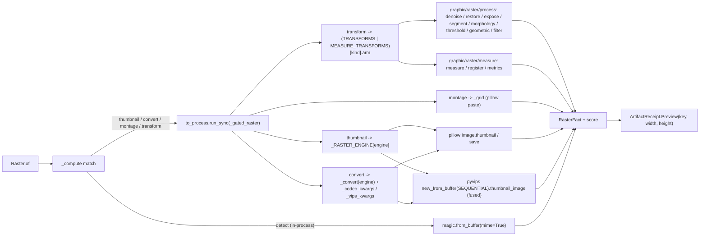

# [PY_ARTIFACTS_GRAPHIC_RASTER_IO]

The raster IO/convert/working-surface owner. `Raster` is ONE owner over the host-free pixel pipeline discriminating operation over the closed-payload `RasterOp` family: pillow (I/O, resize, thumbnail, native AVIF/WebP codec conversion, montage) as the in-process working surface, pyvips (the libvips-backed fused decode/downscale/ICC/smartcrop streaming pipeline) as the high-throughput provider beside pillow, python-magic (libmagic MIME detection) as the raster ingress gate, and scikit-image (the eleven-submodule scientific transform engine) as the `Transform` arm whose acceptor bodies and `TRANSFORMS` rows are owned by the sibling `graphic/raster/process#PROCESS` and `graphic/raster/measure#MEASURE` pages — all on the gated `python_version<'3.15'` band. One raster surface, not a per-media-type class family, not a per-operation function family, and not an erased `params` bag. Every operation folds into one typed `RasterFact` and returns a `RuntimeRail[ArtifactReceipt]` whose `ArtifactReceipt.Preview` carries the content key and pixel dimensions. pillow, scikit-image, and pyvips are host-native gated-band packages (pillow/scikit-image never resolve in the cp315-core process, pyvips binds a Forge-provisioned `libvips` that is not on the cp315 loader path), so every arm crosses the `faults`-owned `to_process.run_sync` subprocess seam onto the gated-band worker — a separate process the cp315-core `to_interpreter.run_sync` subinterpreter offload cannot replace for the gated `pillow`/`skimage`/`libvips` stack. `RasterFact` is declared here, the gated-band owner; `graphic/marks/encode#MARK` re-declares its minimal `(data, width, height, score)` shape for the in-process mark codec, and the `graphic/raster/process#PROCESS`/`graphic/raster/measure#MEASURE` transform acceptors fold the same `RasterFact` they import from this page.

## [01]-[INDEX]

- [01]-[IO]: raster-image IO/convert working-surface owner over pillow, pyvips, and python-magic — the closed-payload `RasterOp` family (`Thumbnail`/`Convert`/`Montage`/`Transform`/`Detect`) folding into one typed `RasterFact`, a `Transform` scikit-image sub-axis spanning the eleven submodules carried on the composed `TRANSFORMS` member-acceptor-kwargs table (the process-family rows on `graphic/raster/process#PROCESS`, the measure-family rows on `graphic/raster/measure#MEASURE`), a `RasterEngine` provider sub-axis selecting the pillow working surface or the pyvips fused-libvips pipeline on the resize/convert arms, a `ConvertFormat` codec sub-axis, the `media_type` libmagic ingress gate, all dispatch-table-folded with zero re-discriminating arm.

## [02]-[IO]

- Owner: `Raster` the one raster-and-pixel owner discriminating operation over the closed `RasterOp` family; `RasterOp` an `expression.tagged_union` whose every case carries its own typed payload, never a shared erased `params` dict; `RasterFact` the one typed result every arm folds into — `data`/`width`/`height`/`score` recovering the encoded bytes, the pixel dimensions, and the perceptual-quality score map — projected to `core/receipt#RECEIPT` `ArtifactReceipt.Preview` at the boundary; the pillow image is the in-process working surface, pyvips the fused-libvips streaming provider selected per arm by the `RasterEngine` axis, scikit-image the scientific-transform engine folded by the composed `TRANSFORMS` row table (rows owned by `graphic/raster/process#PROCESS` + `graphic/raster/measure#MEASURE`), python-magic the media-type gate. The `TRANSFORMS` sub-axis table is the egress-grade collapse: a row carries a callable arm and its own settled `skimage` submodule member, the op routes by one table lookup, never a per-operation sibling function and never a re-discriminating `match` inside an arm. The `RasterEngine` provider axis is the throughput collapse: a `PILLOW` arm runs the in-process pure-Python edge and a `LIBVIPS` arm runs the one-pass fused libvips pipeline, the same `Thumbnail`/`Convert` op resolving either engine by one policy field rather than a parallel pyvips owner.
- Cases: `RasterOp` cases — `Thumbnail(payload, size, fmt, engine)` (pillow `Image.thumbnail` then `Image.save`, or the pyvips `new_from_buffer(..., access=Access.SEQUENTIAL).thumbnail_image(width)` fused shrink-on-load when `engine` is `LIBVIPS`) · `Convert(payload, codec, quality, effort, engine)` (pillow `Image.save` keyed by the typed `ConvertFormat` codec, the native AVIF encode through the built-in `AvifImagePlugin` reached by `quality`/`effort` save kwargs, or the pyvips `write_to_buffer(format_string, Q=..., effort=...)` streamed encode under `LIBVIPS`) · `Montage(tiles, columns, cell, fmt)` (pillow grid composite over `Image.new`/`thumbnail`/`paste`) · `Transform(payload, kind, reference, mask, opts)` (the scikit-image arm carrying the typed `Transform` sub-axis — restoration/exposure/segmentation/thresholding/morphology/geometric-transform/filters/feature/measurement/registration families plus the six-row perceptual-quality metrics family, each one `TRANSFORMS` row carrying its submodule member, acceptor, and optional kwargs, the rows and acceptor bodies owned by `graphic/raster/process#PROCESS` + `graphic/raster/measure#MEASURE`) · `Detect(payload)` (the libmagic `magic.from_buffer(payload, mime=True)` MIME ingress gate that routes a payload to the raster arms vs a foreign owner) — matched by one total `match`/`case`; the one-shot SLIC is COLLAPSED into the `Transform` case whose `Transform` row keys the scikit-image family, and the engine choice is the `RasterEngine` field on the `Thumbnail`/`Convert` payload, never a sibling op per engine or per scikit-image call.
- Entry: `Raster.of` is `async` over the runtime `async_boundary` and dispatches the `RasterOp` case, returning one `RuntimeRail[ArtifactReceipt]` whose `ArtifactReceipt.Preview` carries the content key and pixel dimensions and whose `_facts` projection threads the metrics/measure score map — never an erased `object` a consumer re-validates; EVERY `RasterOp` case crosses the runtime `reliability/faults#FAULT` `anyio.to_process.run_sync` subprocess seam onto the gated-band pillow/scikit-image/libvips worker, because the pillow/scikit-image packages ride the gated `python_version<'3.15'` band and the pyvips libvips binding loads a Forge-provisioned native `libvips` that is not on the cp315-core loader path — the genuine separate-process crossing the gated stack needs, distinct from the cp315-core `execution/lanes#LANE` `to_interpreter.run_sync` subinterpreter offload which shares the host interpreter version and cannot host those gated-band packages. There is no in-process raster arm: a payload first passes the `Detect` MIME gate, then folds onto the one `to_process.run_sync(_gated_raster, op)` seam.
- Auto: `_compute` folds the case through one `match` — `Detect` resolves `magic.from_buffer(payload, mime=True)` and stamps the MIME on the score map, and every other case dispatches through `to_process.run_sync(_gated_raster, op)` where the gated-band worker re-dispatches the case by `match` at boundary scope: `Thumbnail`/`Convert` route through `_RASTER_ENGINE[engine]` so the `PILLOW` arm runs the in-process pillow save and the `LIBVIPS` arm runs the fused `new_from_buffer(access=Access.SEQUENTIAL)` pipeline (decode + shrink-on-load + ICC + crop in one streamed pass), `Convert` reaching native AVIF through the `quality`/`effort` save kwargs, `Montage` composing the pillow grid composite, and `Transform` folding through the composed `TRANSFORMS[kind]` row whose `arm` selects one of the eleven acceptors and whose `member` names the submodule attribute the `getattr` fold resolves so the four denoise rows, the nine filter/edge rows, the five morphology rows, and the six metric rows each share one acceptor with zero parallel inline dispatch dict; the `TRANSFORMS[kind]` lookup resolves the merged `graphic/raster/process#PROCESS` `TRANSFORMS | graphic/raster/measure#MEASURE` `MEASURE_TRANSFORMS` union so all fifty-two `Transform` members resolve, the eight process-family acceptors on the process page and the three measure-family acceptors on the measure page; the `_compute` `match` splits only on the in-process-detect-vs-gated-raster band (the MIME gate resolves in-process, every pixel arm crosses the one `to_process.run_sync(_gated_raster, op)` seam), never a per-op subprocess call.
- Receipt: each operation folds into `RasterFact` and projects to `core/receipt#RECEIPT` `ArtifactReceipt.Preview(key, width, height)` at the rail boundary; the `Detect` arm reports the default zero dimensions (the MIME gate carries no pixel raster) and stamps the resolved MIME on the score map, and the `Transform` arm threads the measure-family `structural_similarity`/`peak_signal_noise_ratio`/`mean_squared_error`/`normalized_root_mse`/`normalized_mutual_information`/`hausdorff_distance` perceptual-quality scores plus the `_measure`/`_register` region/blob/corner/shift facts on the `RasterFact.score` map the rail consumer reads inline — threading those scores into the emitted `_facts` projection is the one `core/receipt#RECEIPT` `[SCORE_FACTS]` widening seam (the `preview` `_facts` arm projects `key`/`width`/`height` today), never a new receipt case and never silently claimed done on this page; the measure-family score facts originate on `graphic/raster/measure#MEASURE` and ride the shared `RasterFact.score` map to this projection.
- Packages: `pillow` (`Image`/`open`/`thumbnail`/`save`/`new`/`paste`/`fromarray`, native `AvifImagePlugin` on 12.2.0) and `pyvips` (`Image.new_from_buffer`/`new_from_source`/`thumbnail_image`/`resize`/`smartcrop`/`icc_transform`/`colourspace`/`flatten`/`autorot`/`write_to_buffer`/`numpy`, the `Access`/`Interesting`/`Intent`/`Kernel`/`Size` enum rows, `Image.get_value("icc-profile-data")`, `pyvips.base.version`) all gated `python_version<'3.15'`; `python-magic` (`from_buffer(mime=True)`/`Magic`/`MagicException`) the libmagic ingress gate, host-native and provisioning-gated like libvips; `scikit-image` the `Transform` engine whose acceptor bodies and `TRANSFORMS` rows are owned by `graphic/raster/process#PROCESS` + `graphic/raster/measure#MEASURE` (this page composes the merged table at the `_gated_raster` lookup, never re-declaring an acceptor); `numpy` (the pyvips `numpy()`/`new_from_array` host pixel seam and the codec/montage folds); runtime (`content_identity.ContentIdentity`, `faults.RuntimeRail`/`async_boundary` and the `faults`-owned `anyio.to_process.run_sync` subprocess seam every raster arm crosses — the genuine separate-process crossing distinct from the cp315-core `execution/lanes#LANE` `to_interpreter.run_sync` subinterpreter offload, both settled at their owners), `core/receipt#RECEIPT` (`ArtifactReceipt`).
- Growth: a new raster operation is one `RasterOp` case plus one `_gated_raster` arm; a new scikit-image transform is one `Transform` row plus one `TRANSFORMS` (or `MEASURE_TRANSFORMS`) table row on the owning process/measure page carrying its submodule `member`, acceptor, and optional `kwargs` policy column — landing on the matching submodule acceptor with zero new acceptor when the submodule is already mined; a new codec format is one `ConvertFormat` row; a new raster engine is one `RasterEngine` row plus one `_RASTER_ENGINE` dispatch entry carrying its fused-pipeline arm, the `Thumbnail`/`Convert` ops picking it up by the one engine field; the libmagic gate covers a new media-type branch by its returned MIME with no new surface; zero new surface.
- Boundary: a per-media-type raster class family, a per-scikit-image-call sibling function, a parallel pyvips owner beside the pillow surface, and an erased `params` bag are the deleted forms; no UI, no live viewer; no machine-readable-mark generation or decode (the encoded-mark codec is `graphic/marks/encode#MARK`'s segno/python-barcode/zxing-cpp surface and its `graphic/marks/decode#DECODE` inverse) and no media-container encode (the temporal artifact is `media/video#MEDIA`/`media/audio#MEDIA`'s av surface). pyvips is the fused-libvips high-throughput provider on the resize/convert/thumbnail arms — its `Access.SEQUENTIAL` pipeline fuses decode + downscale + ICC + smartcrop in one streamed O(scanline) pass and reads the embedded profile through `Image.get_value("icc-profile-data")` for an ICC-correct `icc_transform`, so a large-image fused downscale picks `RasterEngine.LIBVIPS` while the small in-process draw/per-pixel edge stays `RasterEngine.PILLOW`, never a Pillow round-trip where the source is already a libvips pipeline and never a naive `colourspace('srgb')` that discards the source profile; native AVIF rides the already-admitted pillow with no new dependency (no `pillow-avif-plugin` exists on the manifest), the AVIF-specific `quality`/`effort` encode controls riding the `Image.save` kwargs the catalogue settles; the libmagic `Detect` gate is the raster ingress (one `from_buffer(mime=True)` row, never an extension-table guesser) routing an image payload onto the raster arms; the scikit-image `Transform` engine itself is split to `graphic/raster/process#PROCESS` (the eight transform-engine families that PRODUCE a new raster) and `graphic/raster/measure#MEASURE` (the three measurement families that PRODUCE scores), this page owning only the `Transform` StrEnum vocabulary, the `RasterOp.Transform` case, and the `_gated_raster` `transform` arm that reads the composed table; only `pillow`/`scikit-image` ride the gated `python_version<'3.15'` band and the pyvips/python-magic host-native bindings load a Forge-provisioned `libvips`/`libmagic` that is not on the cp315 loader path, so every arm dispatches onto the `faults`-owned `to_process.run_sync` gated-band subprocess seam — a separate process the cp315-core `to_interpreter.run_sync` subinterpreter offload cannot replace for the gated stack — where the worker imports `PIL`/`skimage`/`pyvips`/`magic` at boundary scope so no gated import lands on the core page.

```python signature
from collections.abc import Callable
from enum import StrEnum
from typing import Literal

import numpy as np
from anyio import to_process
from expression import case, tag, tagged_union
from msgspec import Struct
from numpy.typing import NDArray

from rasm.runtime.content_identity import ContentIdentity
from rasm.runtime.faults import RuntimeRail, async_boundary

from artifacts.receipt.receipt import ArtifactReceipt

type RasterOpTag = Literal["thumbnail", "convert", "montage", "transform", "detect"]
type Pixels = tuple[int, int]
type Frame = NDArray[np.uint8]


class RasterEngine(StrEnum):
    PILLOW = "pillow"
    LIBVIPS = "libvips"


class Transform(StrEnum):
    DENOISE_BILATERAL = "denoise-bilateral"
    DENOISE_NL_MEANS = "denoise-nl-means"
    DENOISE_TV = "denoise-tv"
    DENOISE_WAVELET = "denoise-wavelet"
    INPAINT = "inpaint"
    ROLLING_BALL = "rolling-ball"
    DECONVOLVE = "deconvolve"
    CLAHE = "clahe"
    EQUALIZE = "equalize"
    RESCALE_INTENSITY = "rescale-intensity"
    MATCH_HISTOGRAMS = "match-histograms"
    GAMMA = "gamma"
    LOG = "log"
    SLIC = "slic"
    FELZENSZWALB = "felzenszwalb"
    WATERSHED = "watershed"
    CHAN_VESE = "chan-vese"
    UNSHARP = "unsharp"
    GAUSSIAN = "gaussian"
    MEDIAN = "median"
    SOBEL = "sobel"
    LAPLACE = "laplace"
    FRANGI = "frangi"
    BUTTERWORTH = "butterworth"
    GABOR = "gabor"
    CANNY = "canny"
    THRESHOLD_OTSU = "threshold-otsu"
    THRESHOLD_LOCAL = "threshold-local"
    THRESHOLD_MULTIOTSU = "threshold-multiotsu"
    SKELETONIZE = "skeletonize"
    OPENING = "opening"
    CLOSING = "closing"
    EROSION = "erosion"
    DILATION = "dilation"
    RESIZE = "resize"
    RESCALE = "rescale"
    ROTATE = "rotate"
    RADON = "radon"
    CONTOURS = "contours"
    ENTROPY = "entropy"
    HOG = "hog"
    BLOB = "blob"
    LBP = "lbp"
    CORNERS = "corners"
    OPTICAL_FLOW = "optical-flow"
    PHASE_CORRELATION = "phase-correlation"
    SSIM = "ssim"
    PSNR = "psnr"
    MSE = "mse"
    NRMSE = "nrmse"
    NMI = "nmi"
    HAUSDORFF = "hausdorff"


class ConvertFormat(StrEnum):
    PNG = "PNG"
    JPEG = "JPEG"
    WEBP = "WEBP"
    AVIF = "AVIF"
    TIFF = "TIFF"
    BMP = "BMP"


class RasterFact(Struct, frozen=True):
    data: bytes
    width: int = 0
    height: int = 0
    score: dict[str, str] = {}


@tagged_union(frozen=True)
class RasterOp:
    tag: RasterOpTag = tag()
    thumbnail: tuple[bytes, Pixels, ConvertFormat, RasterEngine] = case()
    convert: tuple[bytes, ConvertFormat, int, int, RasterEngine] = case()
    montage: tuple[tuple[bytes, ...], int, Pixels, ConvertFormat] = case()
    transform: tuple[bytes, Transform, bytes, bytes, dict[str, float]] = case()
    detect: tuple[bytes] = case()

    @staticmethod
    def Thumbnail(payload: bytes, size: Pixels, fmt: ConvertFormat = ConvertFormat.PNG, engine: RasterEngine = RasterEngine.PILLOW) -> "RasterOp":
        return RasterOp(thumbnail=(payload, size, fmt, engine))

    @staticmethod
    def Convert(payload: bytes, codec: ConvertFormat, quality: int = 80, effort: int = 4, engine: RasterEngine = RasterEngine.PILLOW) -> "RasterOp":
        return RasterOp(convert=(payload, codec, quality, effort, engine))

    @staticmethod
    def Montage(tiles: tuple[bytes, ...], columns: int, cell: Pixels, fmt: ConvertFormat = ConvertFormat.PNG) -> "RasterOp":
        return RasterOp(montage=(tiles, columns, cell, fmt))

    @staticmethod
    def Transform(payload: bytes, kind: Transform, reference: bytes = b"", mask: bytes = b"", opts: dict[str, float] = {}) -> "RasterOp":
        return RasterOp(transform=(payload, kind, reference, mask, opts))

    @staticmethod
    def Detect(payload: bytes) -> "RasterOp":
        return RasterOp(detect=(payload,))


class Raster(Struct, frozen=True):
    op: RasterOp

    async def of(self) -> RuntimeRail[ArtifactReceipt]:
        return await async_boundary(f"raster.{self.op.tag}", self._compute)

    async def _compute(self) -> ArtifactReceipt:
        match self.op:
            case RasterOp(tag="detect", detect=(payload,)):
                fact = RasterFact(payload, score={"mime": Raster.media_type(payload)})
            case _:
                fact = await to_process.run_sync(_gated_raster, self.op)
        return ArtifactReceipt.Preview(ContentIdentity.of(f"raster-{self.op.tag}", fact.data), fact.width, fact.height)

    @staticmethod
    def media_type(payload: bytes) -> str:
        import magic

        return magic.from_buffer(payload, mime=True)
```

`RasterFact` is the one fact every arm yields — bytes plus dimensions plus the optional score map — so `_compute` projects one shape into `ArtifactReceipt.Preview` regardless of op, the `Detect` gate reports the default zero dimensions (the MIME path carries no pixel raster), and the metrics score rides the same fact map both the content-key seed and the `core/receipt#RECEIPT` `_facts` fold project to strings; the `RasterOp` payload is typed per case, never an erased `params` dict the arm re-validates. `RasterFact` is the gated-band owner's value object that `graphic/marks/encode#MARK` re-declares (the minimal `(data, width, height, score)` shape) so the in-process mark codec yields the same fact into the shared `ArtifactReceipt.Preview` without importing the gated-band owner, and that the `graphic/raster/process#PROCESS`/`graphic/raster/measure#MEASURE` transform acceptors import from this page so the produced-raster and measured-score arms fold one shape.

```python signature
def _gated_raster(op: RasterOp) -> RasterFact:
    from io import BytesIO

    from artifacts.graphic.raster.measure import MEASURE_TRANSFORMS
    from artifacts.graphic.raster.process import TRANSFORMS, TransformInput

    table = TRANSFORMS | MEASURE_TRANSFORMS
    match op:
        case RasterOp(tag="thumbnail", thumbnail=(payload, size, fmt, engine)):
            return _RASTER_ENGINE[engine](payload, size, fmt)
        case RasterOp(tag="convert", convert=(payload, codec, quality, effort, engine)):
            return _convert(engine, payload, codec, quality, effort)
        case RasterOp(tag="montage", montage=(tiles, columns, cell, fmt)):
            grid = _grid(tiles, columns, cell)
            sink = BytesIO()
            grid.save(sink, format=fmt.value)
            return RasterFact(sink.getvalue(), *grid.size)
        case RasterOp(tag="transform", transform=(payload, kind, reference, mask, opts)):
            from skimage import io as skio

            return table[kind].arm(TransformInput(skio.imread(BytesIO(payload)), kind, reference, mask, opts))


def _thumbnail_pillow(payload: bytes, size: Pixels, fmt: ConvertFormat) -> RasterFact:
    from io import BytesIO

    from PIL import Image

    image = Image.open(BytesIO(payload))
    image.thumbnail(size)
    sink = BytesIO()
    image.save(sink, format=fmt.value)
    return RasterFact(sink.getvalue(), *image.size)


def _thumbnail_libvips(payload: bytes, size: Pixels, fmt: ConvertFormat) -> RasterFact:
    import pyvips

    image = pyvips.Image.new_from_buffer(payload, "", access=pyvips.Access.SEQUENTIAL).thumbnail_image(size[0], height=size[1], crop=pyvips.Interesting.ATTENTION)
    blob = image.write_to_buffer(_VIPS_SUFFIX[fmt])
    return RasterFact(blob, image.width, image.height)


def _convert(engine: RasterEngine, payload: bytes, codec: ConvertFormat, quality: int, effort: int) -> RasterFact:
    from io import BytesIO

    from PIL import Image

    if engine is RasterEngine.LIBVIPS:
        import pyvips

        source = pyvips.Image.new_from_buffer(payload, "", access=pyvips.Access.SEQUENTIAL)
        managed = source.icc_transform("srgb", intent=pyvips.Intent.RELATIVE) if source.get_typeof("icc-profile-data") != 0 else source
        return RasterFact(managed.write_to_buffer(_VIPS_SUFFIX[codec], **_vips_kwargs(codec, quality, effort)), managed.width, managed.height)
    image = Image.open(BytesIO(payload))
    sink = BytesIO()
    image.save(sink, format=codec.value, **_codec_kwargs(codec, quality, effort))
    return RasterFact(sink.getvalue(), *image.size)


def _codec_kwargs(codec: ConvertFormat, quality: int, effort: int) -> dict[str, int]:
    return {
        ConvertFormat.AVIF: {"quality": quality, "speed": effort},
        ConvertFormat.WEBP: {"quality": quality, "method": effort},
        ConvertFormat.JPEG: {"quality": quality, "optimize": True},
    }.get(codec, {})


def _vips_kwargs(codec: ConvertFormat, quality: int, effort: int) -> dict[str, int]:
    return {
        ConvertFormat.AVIF: {"Q": quality, "effort": effort},
        ConvertFormat.WEBP: {"Q": quality, "effort": effort},
        ConvertFormat.JPEG: {"Q": quality},
    }.get(codec, {})


def _grid(tiles: tuple[bytes, ...], columns: int, cell: Pixels) -> "Image.Image":
    from io import BytesIO

    from PIL import Image

    cell_w, cell_h = cell
    rows = -(-len(tiles) // columns)
    grid = Image.new("RGBA", (columns * cell_w, rows * cell_h))
    for index, blob in enumerate(tiles):
        tile = Image.open(BytesIO(blob))
        tile.thumbnail(cell)
        row, col = divmod(index, columns)
        grid.paste(tile, (col * cell_w, row * cell_h))
    return grid


_RASTER_ENGINE: dict[RasterEngine, Callable[[bytes, Pixels, ConvertFormat], RasterFact]] = {
    RasterEngine.PILLOW: _thumbnail_pillow,
    RasterEngine.LIBVIPS: _thumbnail_libvips,
}
_VIPS_SUFFIX: dict[ConvertFormat, str] = {
    ConvertFormat.PNG: ".png",
    ConvertFormat.JPEG: ".jpg",
    ConvertFormat.WEBP: ".webp",
    ConvertFormat.AVIF: ".avif",
    ConvertFormat.TIFF: ".tif",
    ConvertFormat.BMP: ".bmp",
}
```

The native AVIF row is a pure `Convert` deepen on the already-admitted pillow: `Image.save(format="AVIF")` emits AVIF through the built-in `AvifImagePlugin` Pillow 12.2.0 ships, and the `_codec_kwargs` table keys each codec's encode controls by row so a codec reaches its native parameters by one row, never a per-format encoder and never a bare `quality=None`. The pyvips provider arm is the fused alternative: `new_from_buffer(payload, access=Access.SEQUENTIAL)` opens a one-pass streaming pipeline, `thumbnail_image(width, crop=Interesting.ATTENTION)` fuses shrink-on-load decode with content-aware downscale, `icc_transform("srgb", intent=Intent.RELATIVE)` runs liblcms2-backed ICC conversion only when `get_typeof("icc-profile-data")` proves an embedded profile (never the naive `colourspace` that discards it), and `write_to_buffer(suffix, Q=..., effort=...)` computes the pipeline exactly once at egress — so a large-image fused downscale stays O(scanline) on the libvips engine while the in-process pillow edge keeps the small draw/per-pixel path. The `_RASTER_ENGINE` dispatch row resolves the thumbnail engine by one `RasterEngine` token, the `_VIPS_SUFFIX` table maps each `ConvertFormat` to the libvips format-string the encoder keys on, and `_vips_kwargs` mirrors `_codec_kwargs` for the libvips `Q`/`effort` spelling, so the pillow and libvips engines share one op shape with zero re-discrimination. The `_grid` composite composes `Image.new`/`thumbnail`/`paste` with `divmod(index, columns)` yielding `(row, col)` directly, never a reversed-tuple slice. The `transform` arm reads the composed `TRANSFORMS | MEASURE_TRANSFORMS` table — `TRANSFORMS` the eight produced-raster rows imported from `graphic/raster/process#PROCESS`, `MEASURE_TRANSFORMS` the three measured-score rows imported from `graphic/raster/measure#MEASURE` — so the lookup resolves every one of the fifty-two `Transform` members across the union, the `TransformInput` carrier and the acceptor bodies owned by those pages and never re-declared here.



## [03]-[RESEARCH]

- [AVIF_SETTLED] [RESEARCH]: the native AVIF `Convert` row is SETTLED on the already-admitted pillow. The `pillow` catalogue `[01]-[PACKAGE_SURFACE]` confirms `installed: 12.2.0` and `[04]-[IMPLEMENTATION_LAW]` confirms `Image.save` keys the codec by the explicit `format` with quality/optimize/compression riding save kwargs, so `Image.save(format="AVIF")` emits AVIF through the built-in `AvifImagePlugin` Pillow 12.2.0 ships, needing no `pillow-avif-plugin` dependency (none exists on the manifest to reject). The `ConvertFormat` closed vocabulary keys the codec by row — `PNG`/`JPEG`/`WEBP`/`AVIF`/`TIFF`/`BMP` — so a new codec format is one row, never a per-format encoder. The catalogue settles `quality`/`optimize` as save kwargs (SETTLED on the `JPEG` row), but the AVIF `speed` and WebP `method` encoder-effort kwargs are NOT yet enumerated in the `pillow` `.api` rows — the `_codec_kwargs` AVIF/WebP effort spellings stay a marked RESEARCH-deepen seam until an `assay api` reflection pass captures the `AvifImagePlugin`/`WebPImagePlugin` save-encoder parameters on the gated `python_version<'3.15'` band. Close-condition: `.api` carries the per-plugin save-kwarg rows; the AVIF `format`/`quality` legs are settled, only the `speed`/`method` effort spellings deepen.
- [VIPS_FUSED_PROVIDER] [RESEARCH]: the pyvips `RasterEngine.LIBVIPS` fused-pipeline provider arm composes `Image.new_from_buffer(payload, "", access=Access.SEQUENTIAL)`, `thumbnail_image(width, height=..., crop=Interesting.ATTENTION)`, `icc_transform("srgb", intent=Intent.RELATIVE)` guarded by `get_typeof("icc-profile-data") != 0`, and `write_to_buffer(suffix, Q=..., effort=...)` against the folder `pyvips` `.api` catalogue: `new_from_buffer` is `[03]-[ENTRYPOINTS]` construction row [02], `thumbnail`/`thumbnail_buffer`/`thumbnail_source` the fused shrink-on-load operation row [01], `icc_transform`/`colourspace` the ICC operation row [06], `write_to_buffer(format_string, **kwargs)` the egress row [02], and `Access.SEQUENTIAL`/`Interesting.ATTENTION`/`Intent.RELATIVE` the `[02]-[PUBLIC_TYPES]` enum rows [01]/[02]/[03]; `[04]-[IMPLEMENTATION_LAW]` `[STACK_INTEGRATION]` confirms the `new_from_buffer(png_bytes, access=Access.SEQUENTIAL).thumbnail_image(width)` SVG-raster fused-downscale composition this arm reuses, and the boundary confirms pyvips is the fused-pipeline/large-image owner beside pillow's in-process draw edge. Two spellings deepen against an `assay api` reflection pass once libvips is on the loader path: (1) the `thumbnail_image(width, *, height, crop)` instance-method signature (the catalogue spells the `Image.thumbnail(filename, width, ...)` load-from-file row but the `thumbnail_image` already-loaded-pipeline variant rides the same shrink engine through `__getattr__`, the generated method set being introspected from the live libvips build); (2) the per-encoder `write_to_buffer` option spellings `Q`/`effort` the `_vips_kwargs` row carries (the catalogue `[04]` egress axis names `Q`/`effort`/`lossless`/`strip` as the option family riding `**kwargs` or the `[...]` string but does not enumerate the per-format defaults). The pyvips catalogue records the distribution as sdist-only with native libvips NOT provisioned on this band, so the provider arm runs on the gated `python_version<'3.15'` `to_process.run_sync` worker beside pillow/scikit-image and the `assay api resolve pyvips` reflection deepens once the Forge scientific toolchain provisions libvips on the worker. Close-condition: `.api` carries the `thumbnail_image` instance-method row and the per-format `write_to_buffer` option defaults.
- [MEDIA_DETECT_GATE] [RESOLVED]: the libmagic `Detect` ingress gate `magic.from_buffer(payload, mime=True)` is SETTLED against the folder `python-magic` `.api` catalogue — `[03]-[ENTRYPOINTS]` stateless row [01] confirms `from_buffer(buffer, mime=False) -> str` with `mime=True` returning the MIME type, and `[04]-[IMPLEMENTATION_LAW]` confirms the in-memory-bytes row is the canonical detection because admission already holds the payload. The gate is the raster ingress that routes an image payload onto the raster arms vs a foreign owner (the `.api` boundary names `pillow`/`pyvips` as the image MIME branch consumers), one `from_buffer` row not an extension-table guesser. python-magic binds a Forge-provisioned `libmagic` not on the cp315 loader path, so the `Detect` resolution and every gated raster arm share the one `to_process.run_sync` worker; the `from_buffer(mime=True)` spelling is confirmed and the gate is settled. This `Detect` gate is the artifacts-internal raster ingress and is disjoint from the boundary `exchange/detect#DETECT` python-magic owner that gates the document/ingest plane.
- [RASTER_SEAM] [RESOLVED]: `_gated_raster` runs on the `python_version<'3.15'` band through `anyio.to_process.run_sync(_gated_raster, op)`, importing `PIL`/`skimage`/`pyvips`/`magic` at boundary scope inside the gated-band worker, never on the cp315-core owner; the pillow `Image.open`/`thumbnail`/`save`/`new`/`paste`/`fromarray`, the scikit-image `io.imread` submodule spelling the `transform` arm seeds, and the pyvips `new_from_buffer`/`thumbnail_image`/`icc_transform`/`write_to_buffer` operation spellings verify against the folder `.api` catalogues for `pillow`/`scikit-image`/`pyvips`, and the codec/montage folds ride the already-admitted `numpy` array backing. The `to_process.run_sync` subprocess seam is the spelling the runtime `reliability/faults#FAULT` owner has already settled as the boundary `async_boundary` closes over — a subinterpreter shares the host interpreter version and cannot host the gated `pillow`/`scikit-image` packages nor the host-native libvips/libmagic bindings, so the raster cases cross this genuine separate-process seam rather than the cp315-core `execution/lanes#LANE` `to_interpreter.run_sync` subinterpreter offload, and `_gated_raster` is a module-level function dispatched by qualified name across the process seam (`to_process.run_sync` cannot target a bound method or closure), so it stays out of the `Raster` owner deliberately, not as a stray helper. The one open item is the branch-catalogue gap the sibling color-managed owner already tracks: the branch `anyio` `.api` catalogue reflects `open_process`/`run_process`/`to_thread.run_sync`/`to_interpreter.run_sync` but no `to_process` row, so `assay api` reflection over `anyio.to_process` deepens the branch catalogue to match the settled owner spelling, never re-opening this fence. `_grid` composes the pillow grid composite over `Image.new`/`thumbnail`/`paste` inside this page's worker, and the `transform` arm seeds the `TransformInput` (owned by `graphic/raster/process#PROCESS`) from `skio.imread` before handing to the composed-table acceptor.
- [MARKS_SPLIT] [RESOLVED]: the machine-readable-mark generation + decode concern (segno QR/Micro-QR/sequence, python-barcode linear-1D, zxing-cpp 2D-matrix encode + `read_barcodes` decode) is split to the sibling `graphic/marks/encode#MARK` generation owner and its `graphic/marks/decode#DECODE` inverse — a coherent in-process cp315-core encoded-mark codec semantically disjoint from the pixel-raster transform engine and on a different (un-gated) process band, only the zxing `Decode` raster-intake crossing back to this gated band through the `to_process.run_sync` seam because `read_barcodes` opens its raster through a gated-band Pillow worker. `RasterFact` is declared on this gated-band owner and `graphic/marks/encode#MARK` re-declares its minimal `(data, width, height, score)` shape so both producers fold into the shared `core/receipt#RECEIPT` `ArtifactReceipt.Preview` with no cross-owner import; the python-magic media-detect gate and the pyvips fused-libvips provider settle on this raster IO owner, never on the marks codec.
- [PROCESS_MEASURE_SPLIT] [RESOLVED]: the scikit-image `Transform` engine is split three ways while the `Raster`/`RasterOp` owner stays whole on this page. This `io` page owns the `Transform` StrEnum (all fifty-two members, because `RasterOp.Transform` references it and the `_gated_raster` `transform` arm reads it), the `RasterOp.Transform` case, the `_gated_raster` dispatcher, and the pillow/pyvips/python-magic IO/convert/thumbnail/montage/detect surface. `graphic/raster/process#PROCESS` owns the eight transform-engine acceptors that PRODUCE a new raster (`_denoise`/`_restore`/`_expose`/`_segment`/`_morphology`/`_threshold`/`_geometric`/`_filter`), the shared `TransformInput`/`TransformArm` structs, the `_save_array`/`_luminance` helpers, and the base `TRANSFORMS` table carrying those families' rows. `graphic/raster/measure#MEASURE` owns the three measurement acceptors that PRODUCE scores (`_measure` region/feature, `_register` registration, `_metrics` perceptual-quality), imports the `TransformInput`/`TransformArm`/`_save_array`/`_luminance` substrate from the process page, and contributes a `MEASURE_TRANSFORMS: dict[Transform, TransformArm]` of its families' rows. `_gated_raster` composes the dispatch as `TRANSFORMS | MEASURE_TRANSFORMS` and looks up `table[kind]`, so all fifty-two members resolve through one union: the forty-six process-family member rows (the four denoise, three restoration, six exposure, four segmentation, five morphology, three thresholding, four geometric, nine filter/edge keys) on the process page, the six measure-family member rows (six measure/feature contours/entropy/HOG/blob/LBP/corners) plus the two registration rows plus the six metrics rows on the measure page — every member landing in exactly one page's rows with zero loss and zero overlap. The `_compute` `match` keeps the in-process-detect-vs-gated-raster split unchanged; only the table composition is the new seam, never a per-acceptor subprocess call.
