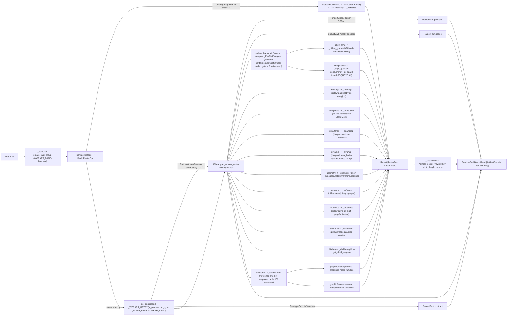

# [PY_ARTIFACTS_GRAPHIC_RASTER_IO]

The raster IO/convert/working-surface owner. `Raster` is ONE owner over the host-free pixel pipeline discriminating operation over the closed-payload `RasterOp` family and modality over `RasterOp | tuple[RasterOp, ...]`: pillow (in-process working surface — decode, EXIF `exif_transpose`, `FitMode`-uniform resize/`ImageOps.contain`/`fit`, alpha flatten, native AVIF/WebP codec save, grid montage) and pyvips (the libvips-backed fused decode/downscale/ICC/smartcrop streaming pipeline) selected per arm by the `RasterEngine` policy bundle, the `exchange/detect#DETECT` `Detect` owner delegated at the raster ingress gate (its `MediaClass`/`Container`/`Trust` `DetectIdentity` projected onto the preview band), and scikit-image (the twelve-family scientific transform engine, nine produced-raster plus three measured-score) as the `Transform` arm whose acceptor bodies and `TRANSFORMS` rows are owned by the sibling `graphic/raster/process#PROCESS` and `graphic/raster/measure#MEASURE` pages. One raster surface, not a per-media-type class family, not a per-operation function family, not a per-engine sibling owner, and not an erased `params` bag. Every operation folds into one typed `RasterFact` and the outcome is the closed `RasterFault` vocabulary on a per-op `Result` rail, the batch returning `RuntimeRail[Block[Result[ArtifactReceipt, RasterFault]]]` so one corrupt input faults its own slot without aborting the farm.

pillow, scikit-image, and pyvips are host-native worker packages — pillow and scikit-image ride the worker band, pyvips binds a Forge-provisioned `libvips`, none on the runtime loader path — so EVERY worker arm crosses ONE `faults`-owned `anyio.to_process.run_sync(_worker_raster, op, limiter=WORKER_BAND)` subprocess seam onto the worker, bounded by the ONE shared `execution/lanes#LANE` `WORKER_BAND` `CapacityLimiter` the `exchange/detect`/`exchange/metadata`/`graphic/raster/measure`/`process`/`graphic/color/managed` worker lane shares — never a per-owner `CapacityLimiter(slots)` knob that oversubscribes the host against libvips's own internal thread pool, and never the unbounded per-loop default. The `Detect` MIME gate is the ONE arm that does NOT cross that seam: `puremagic` is pure-Python on the runtime loader path with a bundled `magic_data.json` and no native dependency, so `_compute` DELEGATES it to the `exchange/detect#DETECT` owner IN-PROCESS (the `PUREMAGIC` engine's own `to_thread` band) with no `to_process` crossing, no worker retry, and no payload pickle. Each worker crossing wraps `stamina.AsyncRetryingCaller(...).on(BrokenWorkerProcess)` so a transient OOM/signal worker death recovers before the slot faults. A subinterpreter `to_interpreter.run_sync` offload shares the host interpreter version and cannot host the native stack, so the separate-process crossing is genuine, not interchangeable with the runtime `execution/lanes#LANE` lane. The worker captures each provider raise (`PIL.UnidentifiedImageError`/`Image.DecompressionBombError`, `pyvips.Error`, the scikit-image transform raises) into a `RasterFault` case at boundary scope, and the delegated `exchange/detect#DETECT` sniff's `BoundaryFault` lifts into `RasterFault.detect`; a `@beartype` contract violation lifts to `RasterFault.contract`, an unbuilt AVIF/WebP encoder the capability gate rejects to `RasterFault.codec`, an exhausted worker death to `RasterFault.worker`, and an absent worker package or unprovisioned native binding (`ImportError` from `PIL`/`skimage`, the `cffi` dlopen `OSError` from an unprovisioned `libvips`) to `RasterFault.provision` — the host-readiness fault distinct from a content fault — so no foreign exception escapes the seam unconverted.

`RasterFact` is declared here, the worker owner; `graphic/marks/encode#MARK` re-declares its minimal `(data, width, height, score)` shape for the in-process mark codec, and the `graphic/raster/process#PROCESS`/`graphic/raster/measure#MEASURE` transform acceptors fold the same `RasterFact` they import from this page. Its `score: frozendict[str, float | str]` is the exact value type the `core/receipt#RECEIPT` `ArtifactReceipt.Preview.scores` band carries, so the metrics float band, the detect/probe string facts, and the marks facts all project losslessly through one `_previewed` pass with no `str()` coerce.

## [01]-[INDEX]

- [01]-[IO]: the host-free raster owner over the closed-payload `RasterOp` family (`thumbnail`/`convert`/`crop`/`probe`/`montage`/`composite`/`transform`/`detect`/`smartcrop`/`pyramid`/`geometry`/`deframe`/`sequence`/`quantize`/`children`) and `RasterOp | tuple[RasterOp, ...]` modality — the pillow in-process working surface (thumbnail/convert/crop/probe/montage/geometry), the pyvips libvips fused decode/ICC/smartcrop/dzsave-pyramid/arrayjoin streaming pipeline, and the delegated `exchange/detect#DETECT` in-process `Detect` MIME gate selected by the `RasterEngine`/`FitMode`/`BlendMode`/`CropFocus`/`PyramidLayout`/`GeometryOp`/`ConvertFormat` policy vocabularies; the scikit-image `Transform` sub-axis dispatched through the composed `TRANSFORMS | MEASURE_TRANSFORMS` union the sibling `graphic/raster/process#PROCESS` + `graphic/raster/measure#MEASURE` own; every worker arm crossing the one `WORKER_BAND`-bounded `to_process` seam under `_WORKER_RETRY` while the pure-Python `Detect` runs in-process off it, folding into one typed `RasterFact` projected to `core/receipt#RECEIPT` `ArtifactReceipt.Preview(key, width, height, scores)`, and the closed `RasterFault` cause vocabulary (the `codec` capability-detection case included) on a per-op `Result` rail so one corrupt input faults its own slot.

## [02]-[IO]

- Cases: `RasterOp` cases — `Thumbnail(payload, size, fmt, engine, fit)` (the `FitMode`-uniform resize: pillow `ImageOps.contain`/`fit`/`resize` keyed by `CONTAIN`/`COVER`/`STRETCH`, or the pyvips `new_from_buffer(..., access=Access.SEQUENTIAL).thumbnail_image(width, height=, size=Size, crop=Interesting)` fused shrink-on-load keyed by the same `FitMode`) · `Convert(payload, codec, quality, effort, engine)` (pillow `Image.save` keyed by the typed `ConvertFormat`, native AVIF through the built-in `AvifImagePlugin`, alpha `Image.convert("RGB")` flatten when the codec carries no alpha, or the pyvips `autorot().icc_transform(...).flatten().write_to_buffer(...)` streamed managed encode) · `Crop(payload, box, fmt, engine)` (region extract — pillow `Image.crop` over the display-oriented raster, or the pyvips `extract_area(*box)` one-pass extract) · `Probe(payload, engine)` (header-only metadata read with NO transcode — pillow lazy `Image.open` reading `format`/`mode`/`n_frames`/`info["icc_profile"]`, or the pyvips header reading `interpretation`/`bands`/`get_typeof("icc-profile-data")`/`get("n-pages")`, returning the source payload with the dimensions and a rich score map) · `Montage(tiles, columns, cell, fmt, engine)` (the pillow `Image.new`/`thumbnail`/`paste` grid composite, or the fused libvips `arrayjoin([cell, ...], across=columns)` grid for engine parity on large-tile sheets) · `Composite(base, overlay, position, mode, fmt)` (the libvips two-layer overlay/watermark over `composite2(layer, BlendMode, x=, y=)`, the full `BlendMode` Porter-Duff/separable vocabulary on the one engine that owns it) · `Transform(payload, kind, reference, mask, opts)` (the scikit-image arm carrying the typed `Transform` sub-axis whose rows and acceptor bodies are owned by `graphic/raster/process#PROCESS` + `graphic/raster/measure#MEASURE`) · `Detect(payload)` (the raster ingress gate DELEGATING to the `exchange/detect#DETECT` `Detect` owner in-process — `Detect(engine=DetectEngine.PUREMAGIC).of(Source.Buffer(payload))` — projecting the returned `DetectIdentity` `media_class`/`container`/`confidence`/`trust` facts, the puremagic sniff fold owned once upstream) · `SmartCrop(payload, size, focus, fmt)` (the content-aware libvips `smartcrop(width, height, interesting=CropFocus)` auto-focus window) · `Pyramid(payload, layout, tile, fmt)` (the libvips `dzsave_buffer(layout=PyramidLayout, tile_size=, container="zip")` DeepZoom/Zoomify/IIIF tiled export to one zip blob) · `Geometry(payload, op, params, fmt)` (the pillow-only `GeometryOp` working-surface family — `Transpose` flip/quarter-turn/diagonal, arbitrary `rotate`, `transform` affine/perspective, integer `reduce`) · `Deframe(payload, index, fmt, engine)` (multi-frame page/frame extract — pillow `Image.open(...).seek(index)` over the `ImageSequence` cursor, or the libvips `new_from_buffer(..., page=index)` one-page stream of a huge multi-page TIFF/PDF scan, an index past the count railing `RasterFault.bounds`) · `Sequence(frames, delays, loop, fmt)` (the pillow multi-frame COMPOSE — `save(save_all=True, append_images=...)` assembling one multi-page TIFF or animated APNG/WebP/AVIF, `delays`/`loop` honored only on the `_ANIMATED` formats) · `Quantize(payload, colors, method, dither, fmt)` (the pillow `Image.quantize` indexed-color export over the `QuantizeMethod`/`DitherMode` vocab — median-cut/max-coverage/octree/libimagequant + Floyd-Steinberg, subsuming `convert(palette=ADAPTIVE)`) · `Children(payload, index, fmt)` (the pillow `get_child_images` embedded-thumbnail / multi-resolution sub-image extract) — matched by one total `match`/`case` with `assert_never`; the engine choice is the `RasterEngine` field and the sizing the `FitMode` field on the decode-heavy payloads, never a sibling op per engine, per fit mode, or per scikit-image call.
- Modality: `Raster.of` is the one modal-arity entrypoint discriminating on `self.ops` being one `RasterOp` or a `tuple[RasterOp, ...]` — `_normalized` folds either into one `Block[RasterOp]` at the head through a structural `match`, so arity is a property of the value, never a `batch`/`mode` knob; a thumbnail farm is the same call as a single thumbnail. The per-op `Result[ArtifactReceipt, RasterFault]` survives in the returned `Block` so one corrupt input faults its own slot while the rest of the batch completes (the survivor/casualty partition raster batch consumers need), never a fail-fast `sequence` that discards every sibling on the first bad payload.
- Auto: `_compute` routes the pure-Python `Detect` in-process (the delegated `exchange/detect#DETECT` gate needs no worker) and crosses every other op through the worker; the worker `_worker_raster(op) -> Result[RasterFact, RasterFault]` is `@beartype`-woven and re-dispatches the case by one total `match` at boundary scope under one outer `try` whose `except ImportError`/`except OSError` arms convert an absent worker package or `cffi` dlopen of an unprovisioned native binding to `RasterFault.provision` — the host-readiness fault every worker arm shares — importing `PIL`/`pyvips`/`skimage` only inside the arm that needs them so no worker import lands on the core page: the detect arm DELEGATES to the `exchange/detect#DETECT` `Detect` owner in-process (`Detect(engine=DetectEngine.PUREMAGIC).of(Source.Buffer(payload))`), projecting the returned `DetectIdentity` through `_detected` and lifting its `BoundaryFault` onto `RasterFault.detect` (the worker `match` keeps a defensive detect arm as the totality witness, never reached because `_compute` routes detect in-process); `Probe`/`Thumbnail`/`Convert`/`Crop` fold through `_ENGINE[engine]` so the `PILLOW` member runs the in-process pillow path and the `LIBVIPS` member runs the fused `new_from_buffer(access=Access.SEQUENTIAL)` pipeline, the pillow arms sharing one `_pillow_guarded` capture (`UnidentifiedImageError` -> `decode`, `DecompressionBombError` -> `bomb`, `OSError`/`ValueError`/`KeyError` -> `encode`) and the libvips arms one `_vips_guarded` capture (`concurrency_set(1)` two-pool guard + `pyvips.Error` -> `engine`), the `Convert` arms first gating the codec through `features.check`/`get_suffixes` onto `RasterFault.codec`; `Montage` folds the pillow paste grid or the libvips `arrayjoin` grid by `engine`; `Composite` folds the libvips `composite2` two-layer overlay; `SmartCrop`/`Pyramid` fold the libvips `smartcrop`/`dzsave_buffer` under `_vips_guarded`; `Geometry` folds the pillow `transpose`/`rotate`/`transform`/`reduce` family under `_pillow_guarded`; `Deframe` folds the pillow `seek` frame extract or the libvips `page=` page stream by `engine`, and `Sequence` folds the pillow `save_all`/`append_images` multi-frame compose (gating an animated `WEBP`/`AVIF` encoder through `_CODEC_FEATURE` onto `RasterFault.codec`); `Quantize` and `Children` fold the pillow `Image.quantize` palette export and `get_child_images` sub-image extract under `_pillow_guarded`, a frame/child index past the count railing `RasterFault.bounds`; `Transform` folds through `_transformed`, which gates the reference/mask precondition (`RasterFault.reference` when a reference- or mask-requiring `kind` arrives empty) before seeding a `TransformInput` from `skio.imread` and reading the composed `TRANSFORMS | MEASURE_TRANSFORMS` union so all one hundred thirty-nine members resolve. The content capture is co-located with the provider call and the provisioning capture wraps the whole worker dispatch — the two correct boundaries; the dispatch splits only on the op case, the per-engine `EngineOps`/`match` read, and the `FitMode`/`GeometryOp` sizing branch, never a re-discriminating `match` beyond them.
- Receipt: each operation folds into `RasterFact` and projects to `core/receipt#RECEIPT` `ArtifactReceipt.Preview(key, width, height, scores)` at the rail boundary, threading `fact.score` straight onto `Preview.scores`; the `Detect` arm reports the default zero dimensions and stamps the resolved `mime`/`media_class`/`container` plus the native-`float` `confidence` and match-`candidates` count and the `extension` on the score map, `Probe` reports the header dimensions and a rich `format`/`mode`/`frames`/`bands`/`interpretation`/`icc` score map without transcoding the payload, and the `Transform` arm threads the measure-family `structural_similarity`/`peak_signal_noise_ratio`/`mean_squared_error`/`normalized_root_mse`/`normalized_mutual_information`/`hausdorff_distance` perceptual-quality scores plus the `_measure`/`_register` region/blob/corner/shift facts on the immutable `RasterFact.score` `frozendict` the rail consumer reads inline. The receipt-side widening is settled — `Preview.scores: frozendict[str, float | str]` already exists and its `_facts` arm flattens the band into `{"width", "height", **scores}` — so this owner's contribution is the one projection that threads `fact.score` through, never a `_previewed` that drops the band; the measure-family score facts originate on `graphic/raster/measure#MEASURE` and ride the shared `RasterFact.score` map to this projection.
- Growth: a new raster operation is one `RasterOp` case plus one `_worker_raster` arm (the in-process `Detect` its own `_compute` arm); a new decode-heavy engine-polymorphic operation is one `EngineOps` field plus one pillow and one libvips arm; a new sizing mode is one `FitMode` case plus one pillow and one libvips branch; a new compositing blend mode is one `BlendMode` member the libvips `composite2` already resolves by nickname; a new content-crop focus is one `CropFocus` member the libvips `smartcrop` resolves by nickname; a new pyramid form is one `PyramidLayout` member the libvips `dzsave_buffer` resolves; a new geometric op is one `GeometryOp` member plus one pillow `match` arm (the `Transpose`/`transform`/`reduce` surface already mined); a new scikit-image transform is one `Transform` member plus one `TRANSFORMS`/`MEASURE_TRANSFORMS` row on the owning process/measure page; a new codec format is one `ConvertFormat` row plus one `_VIPS_SUFFIX`/`_CODEC_KWARGS`/`_VIPS_KWARGS` builder entry, and a build-dependent one is one `_CODEC_FEATURE` gate row; a new raster engine is one `RasterEngine` member plus one `_ENGINE` `EngineOps` bundle (or one `match` arm on the engine-polymorphic `Montage`); a new fault cause is one `RasterFault` case breaking every capture at type-check until handled (the `bounds` frame/child-range case is exactly that growth); the `Detect` gate covers a new media-type branch by the `exchange/detect#DETECT` `MediaClass`/`Container` rows with no new surface here; a new palette-quantize control is one `QuantizeMethod`/`DitherMode` member, and a new multi-frame direction is one `Deframe`/`Sequence` arm (the multi-frame `Deframe`/`Sequence`, the `Quantize` indexed export, and the `Children` embedded-thumbnail extract landed this pass as `RasterOp` cases); the typed pyvips `Foreign*` encoder enums (`ForeignWebpPreset`/`ForeignTiffCompression`/`ForeignHeifEncoder`) over the raw `_VIPS_KWARGS` option strings and the `Source`/`Target`/`SourceCustom` streaming intake for large-payload egress remain documented growth axes each landing as one typed value or ingest arm; zero new surface.

```python signature
from collections.abc import Callable, Iterable
from dataclasses import dataclass
from enum import StrEnum
from io import BytesIO
from typing import Literal, assert_never

import numpy as np
import stamina
from anyio import BrokenWorkerProcess, create_task_group, to_process
from beartype import beartype
from beartype.roar import BeartypeCallHintViolation
from builtins import frozendict
from expression import Error, Ok, Result, case, tag, tagged_union
from expression.collections import Block
from msgspec import Struct
from numpy.typing import NDArray

from rasm.runtime.content_identity import ContentIdentity
from rasm.runtime.faults import RuntimeRail, async_boundary
from rasm.runtime.lanes import WORKER_BAND

from artifacts.core.receipt import ArtifactReceipt

lazy import pyvips
lazy from PIL import Image, ImageOps, UnidentifiedImageError, features
lazy from skimage import io as skio

lazy from artifacts.exchange.detect import Detect, DetectEngine, DetectIdentity, Source
lazy from artifacts.graphic.raster.measure import MEASURE_TRANSFORMS
lazy from artifacts.graphic.raster.process import TRANSFORMS, TransformInput

type RasterOpTag = Literal[
    "thumbnail",
    "convert",
    "crop",
    "probe",
    "montage",
    "composite",
    "transform",
    "detect",
    "smartcrop",
    "pyramid",
    "geometry",
    "deframe",
    "sequence",
    "quantize",
    "children",
]
type Pixels = tuple[int, int]
type Box = tuple[int, int, int, int]
type Frame = NDArray[np.uint8]

# transient OOM/signal worker death recovers before the slot faults; a deterministic crash exhausts the schedule and rails worker.
_WORKER_RETRY = stamina.AsyncRetryingCaller(attempts=3, timeout=30.0).on(BrokenWorkerProcess)


class RasterEngine(StrEnum):
    PILLOW = "pillow"
    LIBVIPS = "libvips"


class FitMode(StrEnum):
    CONTAIN = "contain"  # fit inside the box, preserve aspect, no crop (pillow ImageOps.contain / libvips crop=NONE)
    COVER = "cover"  # fill the box, crop the overflow (pillow ImageOps.fit / libvips crop=ATTENTION)
    STRETCH = "stretch"  # force the exact box, ignore aspect (pillow resize / libvips size=FORCE)
    PAD = "pad"  # fit inside, then letterbox to the exact box with background (pillow ImageOps.pad / libvips embed+Extend)


class CropFocus(StrEnum):  # the libvips Interesting salient-region model the content-aware SmartCrop resolves by .value nickname
    ATTENTION = "attention"  # saliency-map peak (the default auto-focus)
    ENTROPY = "entropy"  # maximum-entropy window
    CENTRE = "centre"
    LOW = "low"  # lowest-column/row edge
    HIGH = "high"


class PyramidLayout(StrEnum):  # the libvips ForeignDzLayout deep-zoom pyramid form dzsave_buffer emits by .value nickname
    DZ = "dz"  # DeepZoom
    ZOOMIFY = "zoomify"
    GOOGLE = "google"
    IIIF = "iiif"
    IIIF3 = "iiif3"


class GeometryOp(
    StrEnum
):  # the pillow geometric working-surface family: Transpose members + arbitrary rotate + affine/perspective transform + integer reduce
    FLIP_H = "flip-h"  # Transpose.FLIP_LEFT_RIGHT
    FLIP_V = "flip-v"  # Transpose.FLIP_TOP_BOTTOM
    ROTATE_90 = "rotate-90"  # Transpose.ROTATE_90 (lossless quarter-turn)
    ROTATE_180 = "rotate-180"  # Transpose.ROTATE_180
    ROTATE_270 = "rotate-270"  # Transpose.ROTATE_270
    TRANSPOSE = "transpose"  # Transpose.TRANSPOSE (main-diagonal)
    TRANSVERSE = "transverse"  # Transpose.TRANSVERSE (anti-diagonal)
    ROTATE = "rotate"  # Image.rotate(angle, expand=True) — arbitrary-angle, params=(angle,)
    AFFINE = "affine"  # Image.transform(size, AFFINE, coeffs) — params the 6 affine coefficients
    PERSPECTIVE = "perspective"  # Image.transform(size, PERSPECTIVE, coeffs) — params the 8 perspective coefficients
    REDUCE = "reduce"  # Image.reduce(factor) — integer-factor box downscale, params=(factor,)


class BlendMode(
    StrEnum
):  # the full 25-case libvips composite2 nickname vocabulary passed by .value (VipsBlendMode order); OVER is the source-over watermark/stamp default
    CLEAR = "clear"
    SOURCE = "source"
    OVER = "over"
    IN = "in"
    OUT = "out"
    ATOP = "atop"
    DEST = "dest"
    DEST_OVER = "dest-over"
    DEST_IN = "dest-in"
    DEST_OUT = "dest-out"
    DEST_ATOP = "dest-atop"
    XOR = "xor"
    ADD = "add"
    SATURATE = "saturate"
    MULTIPLY = "multiply"
    SCREEN = "screen"
    OVERLAY = "overlay"
    DARKEN = "darken"
    LIGHTEN = "lighten"
    COLOUR_DODGE = "colour-dodge"
    COLOUR_BURN = "colour-burn"
    HARD_LIGHT = "hard-light"
    SOFT_LIGHT = "soft-light"
    DIFFERENCE = "difference"
    EXCLUSION = "exclusion"


class Transform(StrEnum):  # the 139-member sub-axis vocabulary; rows + acceptor bodies live on graphic/raster/process and graphic/raster/measure
    # --- produced-raster families (rows + acceptor bodies on graphic/raster/process)
    DENOISE_BILATERAL = "denoise-bilateral"
    DENOISE_NL_MEANS = "denoise-nl-means"
    DENOISE_TV = "denoise-tv"
    DENOISE_WAVELET = "denoise-wavelet"
    INPAINT = "inpaint"
    ROLLING_BALL = "rolling-ball"
    DECONVOLVE = "deconvolve"
    WIENER = "wiener"  # restoration.wiener supervised deconvolution
    UNSUPERVISED_WIENER = "unsupervised-wiener"  # restoration.unsupervised_wiener self-tuned Wiener-Hunt
    UNWRAP_PHASE = "unwrap-phase"  # restoration.unwrap_phase 2D phase-unwrap
    SEPARATE_STAINS = "separate-stains"  # color.separate_stains H&E/HDX stain unmixing (_color acceptor)
    YCBCR = "ycbcr"  # color.rgb2ycbcr broadcast colorspace (_color acceptor)
    CLAHE = "clahe"
    EQUALIZE = "equalize"
    RESCALE_INTENSITY = "rescale-intensity"
    MATCH_HISTOGRAMS = "match-histograms"
    GAMMA = "gamma"
    LOG = "log"
    SIGMOID = "sigmoid"
    SLIC = "slic"
    FELZENSZWALB = "felzenszwalb"
    QUICKSHIFT = "quickshift"  # segmentation.quickshift mode-seeking superpixel
    WATERSHED = "watershed"
    CHAN_VESE = "chan-vese"
    MORPHOLOGICAL_CHAN_VESE = "morphological-chan-vese"  # segmentation.morphological_chan_vese level-set
    UNSHARP = "unsharp"
    GAUSSIAN = "gaussian"
    MEDIAN = "median"
    SOBEL = "sobel"
    LAPLACE = "laplace"
    FRANGI = "frangi"
    BUTTERWORTH = "butterworth"
    GABOR = "gabor"
    DIFFERENCE_OF_GAUSSIANS = "difference-of-gaussians"  # filters.difference_of_gaussians band-pass
    CANNY = "canny"
    SCHARR = "scharr"
    PREWITT = "prewitt"
    ROBERTS = "roberts"
    FARID = "farid"
    SATO = "sato"
    HESSIAN = "hessian"
    MEIJERING = "meijering"
    THRESHOLD_OTSU = "threshold-otsu"
    THRESHOLD_LOCAL = "threshold-local"
    THRESHOLD_MULTIOTSU = "threshold-multiotsu"
    THRESHOLD_LI = "threshold-li"
    THRESHOLD_YEN = "threshold-yen"
    THRESHOLD_ISODATA = "threshold-isodata"
    THRESHOLD_TRIANGLE = "threshold-triangle"
    THRESHOLD_MEAN = "threshold-mean"
    THRESHOLD_MINIMUM = "threshold-minimum"
    THRESHOLD_NIBLACK = "threshold-niblack"
    THRESHOLD_SAUVOLA = "threshold-sauvola"
    SKELETONIZE = "skeletonize"
    MEDIAL_AXIS = "medial-axis"  # morphology.medial_axis (BINARY_PLAIN)
    THIN = "thin"  # morphology.thin iterative thinning (BINARY_PLAIN)
    OPENING = "opening"
    CLOSING = "closing"
    EROSION = "erosion"
    DILATION = "dilation"
    WHITE_TOPHAT = "white-tophat"  # morphology.white_tophat bright-feature (GRAY_FOOTPRINT)
    BLACK_TOPHAT = "black-tophat"  # morphology.black_tophat dark-feature (GRAY_FOOTPRINT)
    RECONSTRUCTION = "reconstruction"  # morphology.reconstruction opening-by-reconstruction (RECONSTRUCT)
    REMOVE_SMALL_OBJECTS = "remove-small-objects"  # morphology.remove_small_objects (PRUNE)
    RESIZE = "resize"
    RESCALE = "rescale"
    ROTATE = "rotate"
    SWIRL = "swirl"  # transform.swirl free-form warp
    WARP_POLAR = "warp-polar"  # transform.warp_polar log-/linear-polar unwrap
    RADON = "radon"
    IRADON = "iradon"  # transform.iradon filtered back-projection reconstruction
    WARP = "warp"  # transform.warp over estimate_transform("projective") — keystone/perspective dewarp (_geometric)
    RAG_CUT_THRESHOLD = "rag-cut-threshold"  # graph.cut_threshold over the mean-color RAG (_graph)
    RAG_CUT_NORMALIZED = "rag-cut-normalized"  # graph.cut_normalized recursive partition (_graph)
    RAG_MERGE = "rag-merge"  # graph.merge_hierarchical agglomerative merge (_graph)
    MIN_COST_PATH = "min-cost-path"  # graph.route_through_array least-cost path over the luminance cost (_graph)
    COMBINE_STAINS = "combine-stains"  # color.combine_stains inverse remix (_color)
    RGB2HSV = "rgb2hsv"  # color.rgb2hsv (_color)
    RGB2LAB = "rgb2lab"  # color.rgb2lab (_color)
    LAB2RGB = "lab2rgb"  # color.lab2rgb (_color)
    MORPHOLOGICAL_GEODESIC = "morphological-geodesic"  # segmentation.morphological_geodesic_active_contour level-set (_segment)
    FIND_BOUNDARIES = "find-boundaries"  # segmentation.find_boundaries boolean boundary map (_segment)
    CLEAR_BORDER = "clear-border"  # segmentation.clear_border drop edge-touching labels (_segment)
    AREA_OPENING = "area-opening"  # morphology.area_opening max-tree attribute filter (_morphology ATTRIBUTE)
    DIAMETER_OPENING = "diameter-opening"  # morphology.diameter_opening max-tree attribute filter (_morphology ATTRIBUTE)
    REMOVE_SMALL_HOLES = "remove-small-holes"  # morphology.remove_small_holes (_morphology PRUNE)
    CONVEX_HULL = "convex-hull"  # morphology.convex_hull_image (_morphology BINARY_PLAIN)
    ISOTROPIC_EROSION = "isotropic-erosion"  # morphology.isotropic_erosion distance-transform radius (_morphology ISOTROPIC)
    ISOTROPIC_DILATION = "isotropic-dilation"  # morphology.isotropic_dilation distance-transform radius (_morphology ISOTROPIC)
    FLOOD_FILL = "flood-fill"  # morphology.flood_fill seeded fill (_morphology FLOOD)
    HYSTERESIS = "hysteresis"  # filters.apply_hysteresis_threshold two-level binarize (_threshold)
    RANK_MEAN = "rank-mean"  # filters.rank.mean footprint-local (_filter RANK)
    RANK_MEDIAN = "rank-median"  # filters.rank.median footprint-local (_filter RANK)
    RANK_MAXIMUM = "rank-maximum"  # filters.rank.maximum footprint-local (_filter RANK)
    RANK_ENTROPY = "rank-entropy"  # filters.rank.entropy footprint-local (_filter RANK)
    RANK_AUTOLEVEL = "rank-autolevel"  # filters.rank.autolevel footprint-local (_filter RANK)
    RANK_GRADIENT = "rank-gradient"  # filters.rank.gradient footprint-local (_filter RANK)
    # --- measured-score families (rows + acceptor bodies on graphic/raster/measure)
    CONTOURS = "contours"
    ENTROPY = "entropy"
    REGIONPROPS = "regionprops"
    GLCM = "glcm"
    HOG = "hog"
    BLOB = "blob"
    BLOB_DOG = "blob-dog"
    BLOB_DOH = "blob-doh"
    LBP = "lbp"
    CORNERS = "corners"
    CORNERS_SHI_TOMASI = "corners-shi-tomasi"
    PEAKS = "peaks"
    FIT_CIRCLE = "fit-circle"
    FIT_ELLIPSE = "fit-ellipse"
    FIT_LINE = "fit-line"
    OPTICAL_FLOW = "optical-flow"
    OPTICAL_FLOW_ILK = "optical-flow-ilk"
    PHASE_CORRELATION = "phase-correlation"
    KEYPOINTS = "keypoints"
    SIFT_KEYPOINTS = "sift-keypoints"
    SSIM = "ssim"
    PSNR = "psnr"
    MSE = "mse"
    NRMSE = "nrmse"
    NMI = "nmi"
    HAUSDORFF = "hausdorff"
    RAND_ERROR = "rand-error"
    INFO_VARIATION = "info-variation"
    HOUGH_LINE = "hough-line"  # transform.hough_line + hough_line_peaks — the DETECTION family distinct from the RANSAC geometric FIT
    HOUGH_CIRCLE = "hough-circle"  # transform.hough_circle + hough_circle_peaks
    HOUGH_LINE_PROB = "hough-line-prob"  # transform.probabilistic_hough_line segment count
    STRUCTURE_TENSOR = "structure-tensor"  # feature.structure_tensor coherence render
    SHAPE_INDEX = "shape-index"  # feature.shape_index (hessian-eigenvalue) render
    DAISY = "daisy"  # feature.daisy dense-descriptor visualization render
    BASIC_FEATURES = "basic-features"  # feature.multiscale_basic_features stack channel count
    CORNERS_FAST = "corners-fast"  # feature.corner_fast response (member-derived corner branch)
    CORNERS_MORAVEC = "corners-moravec"  # feature.corner_moravec response
    CORNERS_KR = "corners-kitchen-rosenfeld"  # feature.corner_kitchen_rosenfeld response
    BLUR_EFFECT = "blur-effect"  # measure.blur_effect — the first NO-reference sharpness scalar
    CONTINGENCY = "contingency"  # metrics.contingency_table label-overlap (reference-consuming)
    PROFILE_LINE = "profile-line"  # measure.profile_line scan-line intensity profile (_measure)
    CENSURE_KEYPOINTS = "censure-keypoints"  # CENSURE detect + BRIEF describe registration (reference-consuming, _register)


class ConvertFormat(StrEnum):
    PNG = "PNG"
    JPEG = "JPEG"
    WEBP = "WEBP"
    AVIF = "AVIF"
    TIFF = "TIFF"
    BMP = "BMP"


class QuantizeMethod(
    StrEnum
):  # member NAMES congruent with Image.Quantize so Image.Quantize[method.name] resolves the provider enum at the pillow arm — canonical StrEnum crosses the seam, the PIL enum stays at the edge
    MEDIANCUT = "median-cut"
    MAXCOVERAGE = "max-coverage"
    FASTOCTREE = "fast-octree"  # the only method admitting an RGBA source without a flatten
    LIBIMAGEQUANT = "libimagequant"  # build-dependent (the libimagequant feature); the highest-quality quantizer


class DitherMode(StrEnum):  # member NAMES congruent with Image.Dither so Image.Dither[dither.name] resolves the provider enum
    NONE = "none"
    ORDERED = "ordered"
    RASTERIZE = "rasterize"
    FLOYDSTEINBERG = "floyd-steinberg"


class RasterFact(Struct, frozen=True):
    data: bytes
    width: int = 0
    height: int = 0
    score: frozendict[str, float | str] = frozendict()


@tagged_union(frozen=True)
class RasterFault:
    tag: Literal["decode", "bomb", "encode", "engine", "worker", "provision", "detect", "codec", "reference", "bounds", "contract"] = tag()
    decode: str = case()
    bomb: tuple[int, int] = case()
    encode: str = case()
    engine: str = case()
    worker: str = case()
    provision: str = case()
    detect: str = case()
    codec: ConvertFormat = case()  # a build-dependent encoder (AVIF/HEIF/WebP) the linked pillow/libvips build does not expose — the capability-detection gate, distinct from a content encode fault
    reference: Transform = case()
    bounds: str = (
        case()
    )  # a frame/page/child index past the available count (seek/get_child_images) — the range fault distinct from a decode or encode content fault
    contract: str = case()


@tagged_union(frozen=True)
class RasterOp:
    tag: RasterOpTag = tag()
    thumbnail: tuple[bytes, Pixels, ConvertFormat, RasterEngine, FitMode] = case()
    convert: tuple[bytes, ConvertFormat, int, int, RasterEngine] = case()
    crop: tuple[bytes, Box, ConvertFormat, RasterEngine] = case()
    probe: tuple[bytes, RasterEngine] = case()
    montage: tuple[tuple[bytes, ...], int, Pixels, ConvertFormat, RasterEngine] = case()
    composite: tuple[bytes, bytes, Pixels, BlendMode, ConvertFormat] = case()
    transform: tuple[bytes, Transform, bytes, bytes, frozendict[str, float]] = case()
    detect: tuple[bytes] = case()
    smartcrop: tuple[bytes, Pixels, CropFocus, ConvertFormat] = case()
    pyramid: tuple[bytes, PyramidLayout, int, ConvertFormat] = case()
    geometry: tuple[bytes, GeometryOp, tuple[float, ...], ConvertFormat] = case()
    deframe: tuple[bytes, int, ConvertFormat, RasterEngine] = case()
    sequence: tuple[tuple[bytes, ...], tuple[int, ...], int, ConvertFormat] = case()
    quantize: tuple[bytes, int, QuantizeMethod, DitherMode, ConvertFormat] = case()
    children: tuple[bytes, int, ConvertFormat] = case()

    @staticmethod
    def Thumbnail(
        payload: bytes,
        size: Pixels,
        fmt: ConvertFormat = ConvertFormat.PNG,
        engine: RasterEngine = RasterEngine.PILLOW,
        fit: FitMode = FitMode.CONTAIN,
    ) -> "RasterOp":
        return RasterOp(thumbnail=(payload, size, fmt, engine, fit))

    @staticmethod
    def Convert(payload: bytes, codec: ConvertFormat, quality: int = 80, effort: int = 4, engine: RasterEngine = RasterEngine.PILLOW) -> "RasterOp":
        return RasterOp(convert=(payload, codec, quality, effort, engine))

    @staticmethod
    def Crop(payload: bytes, box: Box, fmt: ConvertFormat = ConvertFormat.PNG, engine: RasterEngine = RasterEngine.PILLOW) -> "RasterOp":
        return RasterOp(crop=(payload, box, fmt, engine))

    @staticmethod
    def Probe(payload: bytes, engine: RasterEngine = RasterEngine.PILLOW) -> "RasterOp":
        return RasterOp(probe=(payload, engine))

    @staticmethod
    def Montage(
        tiles: tuple[bytes, ...], columns: int, cell: Pixels, fmt: ConvertFormat = ConvertFormat.PNG, engine: RasterEngine = RasterEngine.PILLOW
    ) -> "RasterOp":
        return RasterOp(montage=(tiles, columns, cell, fmt, engine))

    @staticmethod
    def Composite(
        base: bytes, overlay: bytes, position: Pixels = (0, 0), mode: BlendMode = BlendMode.OVER, fmt: ConvertFormat = ConvertFormat.PNG
    ) -> "RasterOp":
        return RasterOp(composite=(base, overlay, position, mode, fmt))

    @staticmethod
    def Transform(
        payload: bytes, kind: Transform, reference: bytes = b"", mask: bytes = b"", opts: frozendict[str, float] = frozendict()
    ) -> "RasterOp":
        return RasterOp(transform=(payload, kind, reference, mask, opts))

    @staticmethod
    def Detect(payload: bytes) -> "RasterOp":
        return RasterOp(detect=(payload,))

    @staticmethod
    def SmartCrop(payload: bytes, size: Pixels, focus: CropFocus = CropFocus.ATTENTION, fmt: ConvertFormat = ConvertFormat.PNG) -> "RasterOp":
        return RasterOp(smartcrop=(payload, size, focus, fmt))

    @staticmethod
    def Pyramid(payload: bytes, layout: PyramidLayout = PyramidLayout.DZ, tile: int = 254, fmt: ConvertFormat = ConvertFormat.JPEG) -> "RasterOp":
        return RasterOp(pyramid=(payload, layout, tile, fmt))

    @staticmethod
    def Geometry(payload: bytes, op: GeometryOp, params: tuple[float, ...] = (), fmt: ConvertFormat = ConvertFormat.PNG) -> "RasterOp":
        return RasterOp(geometry=(payload, op, params, fmt))

    @staticmethod
    def Deframe(payload: bytes, index: int = 0, fmt: ConvertFormat = ConvertFormat.PNG, engine: RasterEngine = RasterEngine.PILLOW) -> "RasterOp":
        return RasterOp(deframe=(payload, index, fmt, engine))

    @staticmethod
    def Sequence(frames: tuple[bytes, ...], delays: tuple[int, ...] = (), loop: int = 0, fmt: ConvertFormat = ConvertFormat.TIFF) -> "RasterOp":
        return RasterOp(sequence=(frames, delays, loop, fmt))

    @staticmethod
    def Quantize(
        payload: bytes,
        colors: int = 256,
        method: QuantizeMethod = QuantizeMethod.MEDIANCUT,
        dither: DitherMode = DitherMode.FLOYDSTEINBERG,
        fmt: ConvertFormat = ConvertFormat.PNG,
    ) -> "RasterOp":
        return RasterOp(quantize=(payload, colors, method, dither, fmt))

    @staticmethod
    def Children(payload: bytes, index: int = 0, fmt: ConvertFormat = ConvertFormat.PNG) -> "RasterOp":
        return RasterOp(children=(payload, index, fmt))


class Raster(Struct, frozen=True):
    ops: RasterOp | tuple[RasterOp, ...]

    async def of(self) -> RuntimeRail[Block[Result[ArtifactReceipt, RasterFault]]]:
        return await async_boundary("raster", self._compute)

    async def _compute(self) -> Block[Result[ArtifactReceipt, RasterFault]]:
        async def crossed(op: RasterOp, /) -> Result[ArtifactReceipt, RasterFault]:
            match op:
                case RasterOp(
                    tag="detect", detect=(payload,)
                ):  # DELEGATE the sniff to exchange/detect#DETECT (PUREMAGIC -> in-process to_thread, NO to_process worker crossing); the puremagic fold is authored ONCE there
                    identity = await Detect(engine=DetectEngine.PUREMAGIC).of(Source.Buffer(payload))
                    return identity.map(lambda di: _detected(op, payload, di)).map_error(lambda fault: RasterFault(detect=str(fault)))
                case _:
                    try:
                        produced = await _WORKER_RETRY(to_process.run_sync, _worker_raster, op, limiter=WORKER_BAND)
                    except BrokenWorkerProcess as broken:
                        return Error(RasterFault(worker=str(broken)))
                    except BeartypeCallHintViolation as violation:
                        return Error(RasterFault(contract=type(violation).__name__))
                    return produced.map(lambda fact: _previewed(op, fact))

        async with create_task_group() as group:
            handles = _normalized(self.ops).map(lambda op: group.start_soon(crossed, op))
        return handles.map(lambda handle: handle.return_value)


def _normalized(ops: RasterOp | Iterable[RasterOp], /) -> Block[RasterOp]:
    match ops:
        case Iterable() as many:
            return Block.of_seq(many)
        case lone:
            return Block.singleton(lone)


def _previewed(op: RasterOp, fact: RasterFact, /) -> ArtifactReceipt:
    return ArtifactReceipt.Preview(ContentIdentity.of(f"raster-{op.tag}", fact.data), fact.width, fact.height, fact.score)
```

`RasterFact` is the one fact every arm yields — bytes plus dimensions plus the immutable `frozendict[str, float | str]` score map — so `_previewed` projects one shape into `ArtifactReceipt.Preview(key, width, height, scores)` regardless of op, threading `fact.score` straight onto the receipt's `scores` band so the metrics float facts, the `Detect` `mime`/`media_class`/`container`, and the `Probe` header facts all reach the `_facts` fold un-coerced; the `RasterOp` payload is typed per case, never an erased `params` dict the arm re-validates. `RasterFault` is the closed cause vocabulary the whole rail threads — `decode` an undecodable payload, `bomb` a `DecompressionBombError` against the pixel ceiling, `encode` a save/codec failure, `engine` a libvips operation fault, `worker` an exhausted `BrokenWorkerProcess` subprocess death, `provision` an absent worker package or unprovisioned native binding caught as the worker's `ImportError`/dlopen `OSError`, `detect` a delegated `exchange/detect#DETECT` sniff fault (its `BoundaryFault` lifted at the arm), `codec` a build-dependent encoder (AVIF/WebP) the linked pillow/libvips build never compiled (the capability-detection gate, a `ConvertFormat` payload distinct from an `encode` content fault), `reference` a transform missing its required reference/mask, `contract` a `BeartypeCallHintViolation` lifted at the worker seam — each structurally addressable so a downstream `match` routes a host-readiness fault apart from a worker death apart from an unbuilt encoder apart from a bad codec apart from a contract miss, never a message-collapsed string. `RasterFact` is the worker owner's value object that `graphic/marks/encode#MARK` re-declares as the identical `(data, width, height, score: frozendict[str, float | str])` shape (the encode arms stamp `str` facts and the sibling `graphic/marks/decode#DECODE` arm stamps native-`float` `COUNT`/`VALID`/`BUILD` facts, both riding the one `float | str` value band this owner declares) so the in-process mark codec yields the same fact into the shared `ArtifactReceipt.Preview` without importing the worker owner, and that the `graphic/raster/process#PROCESS`/`graphic/raster/measure#MEASURE` transform acceptors import from this page so the produced-raster and measured-score arms fold one shape.

```python signature
@beartype
def _worker_raster(op: RasterOp) -> Result[RasterFact, RasterFault]:
    try:
        match op:
            case RasterOp(tag="detect", detect=(_payload,)):
                return Error(
                    RasterFault(detect="<detect-routed-in-process>")
                )  # totality witness only; `_compute` delegates detect to exchange/detect#DETECT in-process, so this arm is never reached
            case RasterOp(tag="probe", probe=(payload, engine)):
                return _ENGINE[engine].probe(payload)
            case RasterOp(tag="thumbnail", thumbnail=(payload, size, fmt, engine, fit)):
                return _ENGINE[engine].thumbnail(payload, size, fmt, fit)
            case RasterOp(tag="convert", convert=(payload, codec, quality, effort, engine)):
                return _ENGINE[engine].convert(payload, codec, quality, effort)
            case RasterOp(tag="crop", crop=(payload, box, fmt, engine)):
                return _ENGINE[engine].crop(payload, box, fmt)
            case RasterOp(tag="montage", montage=(tiles, columns, cell, fmt, engine)):
                return _montage(tiles, columns, cell, fmt, engine)
            case RasterOp(tag="composite", composite=(base, overlay, position, mode, fmt)):
                return _composite(base, overlay, position, mode, fmt)
            case RasterOp(tag="transform", transform=(payload, kind, reference, mask, opts)):
                return _transformed(payload, kind, reference, mask, opts)
            case RasterOp(tag="smartcrop", smartcrop=(payload, size, focus, fmt)):
                return _smartcrop(payload, size, focus, fmt)
            case RasterOp(tag="pyramid", pyramid=(payload, layout, tile, fmt)):
                return _pyramid(payload, layout, tile, fmt)
            case RasterOp(tag="geometry", geometry=(payload, geo, params, fmt)):
                return _geometry(payload, geo, params, fmt)
            case RasterOp(tag="deframe", deframe=(payload, index, fmt, engine)):
                return _deframe(payload, index, fmt, engine)
            case RasterOp(tag="sequence", sequence=(frames, delays, loop, fmt)):
                return _sequence(frames, delays, loop, fmt)
            case RasterOp(tag="quantize", quantize=(payload, colors, method, dither, fmt)):
                return _quantized(payload, colors, method, dither, fmt)
            case RasterOp(tag="children", children=(payload, index, fmt)):
                return _children(payload, index, fmt)
            case _ as unreachable:
                assert_never(unreachable)
    except ImportError as absent:
        return Error(RasterFault(provision=absent.name or "<worker-module>"))
    except OSError as unloadable:  # pyvips cffi dlopen of an unprovisioned libvips (the guards trap every content OSError before here)
        return Error(RasterFault(provision=str(unloadable)))


def _pillow_guarded(work: Callable[[], RasterFact], /) -> Result[RasterFact, RasterFault]:
    try:
        return Ok(work())
    except UnidentifiedImageError:
        return Error(RasterFault(decode="<pillow-unidentified>"))
    except Image.DecompressionBombError:
        return Error(RasterFault(bomb=(0, int(Image.MAX_IMAGE_PIXELS or 0))))
    except (
        EOFError,
        IndexError,
    ) as fault:  # a seek/get_child_images index past the available frame/child count — IndexError is a LookupError sibling of KeyError, so this arm never shadows the encode arm's KeyError
        return Error(RasterFault(bounds=str(fault)))
    except (OSError, ValueError, KeyError) as fault:
        return Error(RasterFault(encode=type(fault).__name__))


def _vips_guarded(work: Callable[[], RasterFact], /) -> Result[RasterFact, RasterFault]:
    pyvips.concurrency_set(
        1
    )  # two-pool guard: bound libvips's OWN internal intra-op thread pool DOWN so the inner pool never oversubscribes the host against the outer WORKER_BAND to_process fan (idempotent boundary-init)
    try:
        return Ok(work())
    except pyvips.Error as fault:
        return Error(RasterFault(engine=str(fault)))


def _detected(op: RasterOp, payload: bytes, identity: "DetectIdentity", /) -> ArtifactReceipt:
    # project the delegated exchange/detect#DETECT DetectIdentity onto the shared Preview score band — the routing
    # discriminant + native confidence the raster gate surfaces, the puremagic sniff fold owned once upstream.
    return ArtifactReceipt.Preview(
        ContentIdentity.of(f"raster-{op.tag}", payload),
        0,
        0,
        frozendict({
            "mime": identity.mime,
            "media_class": identity.media_class.value,
            "container": identity.container.value,
            "extension": identity.extensions[0] if identity.extensions else "",
            "confidence": identity.confidence,  # the page-native float ambiguity signal libmagic's single unranked string cannot supply — the exchange/detect Trust gate input
            "candidates": float(len(identity.matches)),
            "trust": identity.trust.value,
        }),
    )


def _transformed(payload: bytes, kind: Transform, reference: bytes, mask: bytes, opts: frozendict[str, float], /) -> Result[RasterFact, RasterFault]:
    if kind in _REFERENCE_REQUIRED and not reference:
        return Error(RasterFault(reference=kind))
    if kind is Transform.INPAINT and not mask:
        return Error(RasterFault(reference=kind))
    try:
        table = TRANSFORMS | MEASURE_TRANSFORMS
        return Ok(table[kind].arm(TransformInput(skio.imread(BytesIO(payload)), kind, reference, mask, opts)))
    except (ValueError, OSError, KeyError) as fault:
        return Error(RasterFault(engine=f"skimage:{kind.value}:{type(fault).__name__}"))


def _thumbnail_pillow(payload: bytes, size: Pixels, fmt: ConvertFormat, fit: FitMode) -> Result[RasterFact, RasterFault]:
    def work() -> RasterFact:
        image = ImageOps.exif_transpose(Image.open(BytesIO(payload)))
        match fit:
            case FitMode.COVER:
                fitted = ImageOps.fit(image, size)
            case FitMode.STRETCH:
                fitted = image.resize(size)
            case FitMode.CONTAIN:
                fitted = ImageOps.contain(image, size)
            case FitMode.PAD:
                fitted = ImageOps.pad(image, size)
            case _ as unreachable:
                assert_never(unreachable)
        sink = BytesIO()
        fitted.save(sink, format=fmt.value)
        return RasterFact(sink.getvalue(), *fitted.size)

    return _pillow_guarded(work)


def _thumbnail_libvips(payload: bytes, size: Pixels, fmt: ConvertFormat, fit: FitMode) -> Result[RasterFact, RasterFault]:
    def work() -> RasterFact:
        crop = pyvips.Interesting.ATTENTION if fit is FitMode.COVER else pyvips.Interesting.NONE
        sizing = pyvips.Size.FORCE if fit is FitMode.STRETCH else pyvips.Size.DOWN
        shrunk = pyvips.Image.new_from_buffer(payload, "", access=pyvips.Access.SEQUENTIAL).thumbnail_image(
            size[0], height=size[1], size=sizing, crop=crop
        )
        image = (
            shrunk.embed((size[0] - shrunk.width) // 2, (size[1] - shrunk.height) // 2, size[0], size[1], extend=pyvips.Extend.BACKGROUND)
            if fit is FitMode.PAD
            else shrunk
        )
        return RasterFact(image.write_to_buffer(_VIPS_SUFFIX[fmt]), image.width, image.height)

    return _vips_guarded(work)


def _convert_pillow(payload: bytes, codec: ConvertFormat, quality: int, effort: int) -> Result[RasterFact, RasterFault]:
    if (
        codec in _CODEC_FEATURE and not features.check(_CODEC_FEATURE[codec])
    ):  # capability-detection gate: a build-dependent AVIF/WebP encoder the linked pillow build never compiled faults `codec`, distinct from an encode fault, before the save raises an opaque KeyError
        return Error(RasterFault(codec=codec))

    def work() -> RasterFact:
        image = ImageOps.exif_transpose(Image.open(BytesIO(payload)))
        flat = image.convert("RGB") if codec in _NO_ALPHA and image.mode in {"RGBA", "LA", "P"} else image
        sink = BytesIO()
        flat.save(sink, format=codec.value, **_CODEC_KWARGS[codec](quality, effort))
        return RasterFact(sink.getvalue(), *flat.size)

    return _pillow_guarded(work)


def _convert_libvips(payload: bytes, codec: ConvertFormat, quality: int, effort: int) -> Result[RasterFact, RasterFault]:
    if (
        _VIPS_SUFFIX[codec] not in pyvips.base.get_suffixes()
    ):  # the libvips-side capability probe: an unbuilt saver suffix faults `codec` before write_to_buffer raises an opaque pyvips.Error
        return Error(RasterFault(codec=codec))

    def work() -> RasterFact:
        source = pyvips.Image.new_from_buffer(payload, "", access=pyvips.Access.SEQUENTIAL).autorot()
        managed = source.icc_transform("srgb", intent=pyvips.Intent.RELATIVE) if source.get_typeof("icc-profile-data") != 0 else source
        flat = managed.flatten() if codec in _NO_ALPHA and managed.hasalpha() else managed
        keep = (
            pyvips.ForeignKeep.ICC | pyvips.ForeignKeep.EXIF | pyvips.ForeignKeep.XMP
        )  # write_to_buffer STRIPS metadata by default, so the icc_transform-managed sRGB profile is LOST on re-encode without ForeignKeep — retain ICC/EXIF/XMP so the managed profile survives egress
        return RasterFact(flat.write_to_buffer(_VIPS_SUFFIX[codec], keep=keep, **_VIPS_KWARGS[codec](quality, effort)), flat.width, flat.height)

    return _vips_guarded(work)


def _crop_pillow(payload: bytes, box: Box, fmt: ConvertFormat) -> Result[RasterFact, RasterFault]:
    def work() -> RasterFact:
        left, top, width, height = box
        region = ImageOps.exif_transpose(Image.open(BytesIO(payload))).crop((left, top, left + width, top + height))
        sink = BytesIO()
        region.save(sink, format=fmt.value)
        return RasterFact(sink.getvalue(), *region.size)

    return _pillow_guarded(work)


def _crop_libvips(payload: bytes, box: Box, fmt: ConvertFormat) -> Result[RasterFact, RasterFault]:
    def work() -> RasterFact:
        image = pyvips.Image.new_from_buffer(payload, "", access=pyvips.Access.SEQUENTIAL).extract_area(*box)
        return RasterFact(image.write_to_buffer(_VIPS_SUFFIX[fmt]), image.width, image.height)

    return _vips_guarded(work)


def _probe_pillow(payload: bytes) -> Result[RasterFact, RasterFault]:
    def work() -> RasterFact:
        with Image.open(BytesIO(payload)) as image:
            score: frozendict[str, float | str] = frozendict({
                "format": image.format or "",
                "mode": image.mode,
                "frames": str(getattr(image, "n_frames", 1)),
                "icc": "present" if image.info.get("icc_profile") else "absent",
            })
            return RasterFact(payload, image.width, image.height, score)

    return _pillow_guarded(work)


def _probe_libvips(payload: bytes) -> Result[RasterFact, RasterFault]:
    def work() -> RasterFact:
        image = pyvips.Image.new_from_buffer(payload, "", access=pyvips.Access.SEQUENTIAL)
        pages = image.get("n-pages") if image.get_typeof("n-pages") != 0 else 1
        score: frozendict[str, float | str] = frozendict({
            "interpretation": str(image.interpretation),
            "bands": str(image.bands),
            "pages": str(pages),
            "icc": "present" if image.get_typeof("icc-profile-data") != 0 else "absent",
        })
        return RasterFact(payload, image.width, image.height, score)

    return _vips_guarded(work)


def _montage(tiles: tuple[bytes, ...], columns: int, cell: Pixels, fmt: ConvertFormat, engine: RasterEngine) -> Result[RasterFact, RasterFault]:
    match engine:
        case RasterEngine.PILLOW:

            def work() -> RasterFact:
                cell_w, cell_h = cell
                rows = -(-len(tiles) // columns)
                grid = Image.new("RGBA", (columns * cell_w, rows * cell_h))
                for index, blob in enumerate(tiles):
                    tile = Image.open(BytesIO(blob))
                    tile.thumbnail(cell)
                    row, col = divmod(index, columns)
                    grid.paste(tile, (col * cell_w, row * cell_h))
                sink = BytesIO()
                grid.save(sink, format=fmt.value)
                return RasterFact(sink.getvalue(), *grid.size)

            return _pillow_guarded(work)
        case RasterEngine.LIBVIPS:

            def work() -> (
                RasterFact
            ):  # the fused libvips arrayjoin grid — each cell shrinks-on-load and the grid computes in one streamed pass, engine parity for large-tile sheets pillow's per-tile paste loop cannot match
                cells = [
                    pyvips.Image.new_from_buffer(blob, "", access=pyvips.Access.SEQUENTIAL).thumbnail_image(
                        cell[0], height=cell[1], size=pyvips.Size.DOWN
                    )
                    for blob in tiles
                ]
                grid = pyvips.Image.arrayjoin(cells, across=columns)
                return RasterFact(grid.write_to_buffer(_VIPS_SUFFIX[fmt]), grid.width, grid.height)

            return _vips_guarded(work)
        case _ as unreachable:
            assert_never(unreachable)


def _composite(base: bytes, overlay: bytes, position: Pixels, mode: BlendMode, fmt: ConvertFormat) -> Result[RasterFact, RasterFault]:
    def work() -> RasterFact:
        canvas = pyvips.Image.new_from_buffer(base, "", access=pyvips.Access.SEQUENTIAL)
        layer = pyvips.Image.new_from_buffer(overlay, "", access=pyvips.Access.SEQUENTIAL)
        merged = canvas.composite2(layer, mode.value, x=position[0], y=position[1])
        return RasterFact(merged.write_to_buffer(_VIPS_SUFFIX[fmt]), merged.width, merged.height)

    return _vips_guarded(work)


def _smartcrop(payload: bytes, size: Pixels, focus: CropFocus, fmt: ConvertFormat) -> Result[RasterFact, RasterFault]:
    def work() -> (
        RasterFact
    ):  # content-aware auto-focus crop: the libvips saliency/entropy model extracts the interesting size[0]xsize[1] window, the salient-crop decision a fixed-box Crop cannot make
        image = (
            pyvips.Image.new_from_buffer(payload, "", access=pyvips.Access.SEQUENTIAL).autorot().smartcrop(size[0], size[1], interesting=focus.value)
        )
        return RasterFact(image.write_to_buffer(_VIPS_SUFFIX[fmt]), image.width, image.height)

    return _vips_guarded(work)


def _pyramid(payload: bytes, layout: PyramidLayout, tile: int, fmt: ConvertFormat) -> Result[RasterFact, RasterFault]:
    def work() -> (
        RasterFact
    ):  # DeepZoom/Zoomify/IIIF pyramid tiling to ONE zip blob — the large-drawing/large-scan tiled-viewer export both the publication and AEC-doc planes need
        image = pyvips.Image.new_from_buffer(payload, "", access=pyvips.Access.SEQUENTIAL).autorot()
        blob = image.dzsave_buffer(layout=layout.value, tile_size=tile, suffix=f".{fmt.value.lower()}", container="zip")
        return RasterFact(blob, image.width, image.height)

    return _vips_guarded(work)


def _geometry(payload: bytes, op: GeometryOp, params: tuple[float, ...], fmt: ConvertFormat) -> Result[RasterFact, RasterFault]:
    def work() -> (
        RasterFact
    ):  # pillow-only working-surface geometry (single-engine like Composite/Detect); libvips lacks the diagonal transpose + affine/perspective transform cleanly, so no engine-divergence FitMode deletes
        image = ImageOps.exif_transpose(Image.open(BytesIO(payload)))
        match op:
            case GeometryOp.ROTATE:
                out = image.rotate(params[0], resample=Image.Resampling.BICUBIC, expand=True)
            case GeometryOp.REDUCE:
                out = image.reduce(int(params[0]))
            case GeometryOp.AFFINE:
                out = image.transform(image.size, Image.Transform.AFFINE, params, resample=Image.Resampling.BICUBIC)
            case GeometryOp.PERSPECTIVE:
                out = image.transform(image.size, Image.Transform.PERSPECTIVE, params, resample=Image.Resampling.BICUBIC)
            case GeometryOp.FLIP_H:
                out = image.transpose(Image.Transpose.FLIP_LEFT_RIGHT)
            case GeometryOp.FLIP_V:
                out = image.transpose(Image.Transpose.FLIP_TOP_BOTTOM)
            case GeometryOp.ROTATE_90:
                out = image.transpose(Image.Transpose.ROTATE_90)
            case GeometryOp.ROTATE_180:
                out = image.transpose(Image.Transpose.ROTATE_180)
            case GeometryOp.ROTATE_270:
                out = image.transpose(Image.Transpose.ROTATE_270)
            case GeometryOp.TRANSPOSE:
                out = image.transpose(Image.Transpose.TRANSPOSE)
            case GeometryOp.TRANSVERSE:
                out = image.transpose(Image.Transpose.TRANSVERSE)
            case _ as unreachable:
                assert_never(unreachable)
        sink = BytesIO()
        out.save(sink, format=fmt.value)
        return RasterFact(sink.getvalue(), *out.size)

    return _pillow_guarded(work)


def _deframe(payload: bytes, index: int, fmt: ConvertFormat, engine: RasterEngine) -> Result[RasterFact, RasterFault]:
    match engine:
        case RasterEngine.PILLOW:

            def work() -> (
                RasterFact
            ):  # multi-frame page/frame extract: seek to the display-index frame and re-encode it single-frame; an index past n_frames raises IndexError -> RasterFault.bounds
                image = Image.open(BytesIO(payload))
                frames = int(getattr(image, "n_frames", 1))
                if not 0 <= index < frames:
                    raise IndexError(f"frame {index} of {frames}")
                image.seek(index)
                sink = BytesIO()
                image.save(sink, format=fmt.value)
                return RasterFact(sink.getvalue(), *image.size, frozendict({"frame": float(index), "frames": float(frames)}))

            return _pillow_guarded(work)
        case RasterEngine.LIBVIPS:

            def work() -> (
                RasterFact
            ):  # the libvips page= load streams ONE page of a huge multi-page TIFF/PDF scan off disk without materializing the whole document (the AEC scanned-drawing-set path)
                image = pyvips.Image.new_from_buffer(payload, "", page=index, access=pyvips.Access.SEQUENTIAL)
                return RasterFact(image.write_to_buffer(_VIPS_SUFFIX[fmt]), image.width, image.height, frozendict({"frame": float(index)}))

            return _vips_guarded(work)
        case _ as unreachable:
            assert_never(unreachable)


def _sequence(frames: tuple[bytes, ...], delays: tuple[int, ...], loop: int, fmt: ConvertFormat) -> Result[RasterFact, RasterFault]:
    if fmt in _CODEC_FEATURE and not features.check(
        _CODEC_FEATURE[fmt]
    ):  # animated WebP/AVIF gate: an unbuilt encoder faults `codec` before save_all raises, reusing the Convert-arm gate
        return Error(RasterFault(codec=fmt))

    def work() -> (
        RasterFact
    ):  # multi-frame COMPOSE — save_all/append_images assembles the frame tuple into ONE multi-page TIFF (AEC drawing set) or animated APNG/WebP/AVIF (publication preview); delays/loop ride only the animated formats, TIFF pages carry no timing
        images = [Image.open(BytesIO(blob)) for blob in frames]
        timing = {"duration": list(delays), "loop": loop} if fmt in _ANIMATED and delays else {"loop": loop} if fmt in _ANIMATED else {}
        sink = BytesIO()
        images[0].save(sink, format=fmt.value, save_all=True, append_images=images[1:], **timing)
        return RasterFact(sink.getvalue(), *images[0].size, frozendict({"frames": float(len(images))}))

    return _pillow_guarded(work)


def _quantized(payload: bytes, colors: int, method: QuantizeMethod, dither: DitherMode, fmt: ConvertFormat) -> Result[RasterFact, RasterFault]:
    def work() -> (
        RasterFact
    ):  # indexed-color small-file export for line drawings/logos — Image.quantize (median-cut/max-coverage/octree/libimagequant) over the canonical QuantizeMethod/DitherMode vocab resolved to the PIL enum by name congruence; subsumes convert(palette=ADAPTIVE)
        source = ImageOps.exif_transpose(Image.open(BytesIO(payload)))
        rgb = (
            source if source.mode in {"RGB", "RGBA", "L"} else source.convert("RGB")
        )  # quantize admits only RGB/RGBA/L; a P/CMYK/I;16 source flattens to RGB first
        indexed = rgb.quantize(colors=colors, method=Image.Quantize[method.name], dither=Image.Dither[dither.name])
        sink = BytesIO()
        indexed.save(sink, format=fmt.value)
        return RasterFact(sink.getvalue(), *indexed.size, frozendict({"colors": float(colors), "palette": method.value}))

    return _pillow_guarded(work)


def _children(payload: bytes, index: int, fmt: ConvertFormat) -> Result[RasterFact, RasterFault]:
    def work() -> (
        RasterFact
    ):  # embedded-thumbnail / multi-resolution sub-image extract (JPEG/HEIF/TIFF) via get_child_images — the preview a fresh full decode would miss; an index past the child count raises IndexError -> RasterFault.bounds
        with Image.open(BytesIO(payload)) as image:
            children = image.get_child_images()
            if not 0 <= index < len(children):
                raise IndexError(f"child {index} of {len(children)}")
            child = children[index]
            sink = BytesIO()
            child.save(sink, format=fmt.value)
            return RasterFact(sink.getvalue(), *child.size, frozendict({"child": float(index), "children": float(len(children))}))

    return _pillow_guarded(work)


@dataclass(frozen=True, slots=True, kw_only=True)
class EngineOps:
    thumbnail: Callable[[bytes, Pixels, ConvertFormat, FitMode], Result[RasterFact, RasterFault]]
    convert: Callable[[bytes, ConvertFormat, int, int], Result[RasterFact, RasterFault]]
    crop: Callable[[bytes, Box, ConvertFormat], Result[RasterFact, RasterFault]]
    probe: Callable[[bytes], Result[RasterFact, RasterFault]]


_ENGINE: frozendict[RasterEngine, EngineOps] = frozendict({
    RasterEngine.PILLOW: EngineOps(thumbnail=_thumbnail_pillow, convert=_convert_pillow, crop=_crop_pillow, probe=_probe_pillow),
    RasterEngine.LIBVIPS: EngineOps(thumbnail=_thumbnail_libvips, convert=_convert_libvips, crop=_crop_libvips, probe=_probe_libvips),
})
_NO_ALPHA: frozenset[ConvertFormat] = frozenset({ConvertFormat.JPEG, ConvertFormat.BMP})
_ANIMATED: frozenset[ConvertFormat] = frozenset({
    ConvertFormat.PNG,
    ConvertFormat.WEBP,
    ConvertFormat.AVIF,
})  # the save_all containers that honor per-frame duration + loop (APNG/WebP/AVIF); TIFF composes multi-page without timing
_CODEC_FEATURE: frozendict[ConvertFormat, str] = (
    frozendict({  # the build-dependent pillow feature name the capability gate probes; PNG/JPEG/TIFF/BMP are always compiled, so only the optional AVIF/WebP encoders gate
        ConvertFormat.AVIF: "avif",
        ConvertFormat.WEBP: "webp",
    })
)
_REFERENCE_REQUIRED: frozenset[Transform] = frozenset({
    Transform.MATCH_HISTOGRAMS,
    Transform.OPTICAL_FLOW,
    Transform.OPTICAL_FLOW_ILK,
    Transform.PHASE_CORRELATION,
    Transform.KEYPOINTS,
    Transform.SIFT_KEYPOINTS,
    Transform.CENSURE_KEYPOINTS,
    Transform.SSIM,
    Transform.PSNR,
    Transform.MSE,
    Transform.NRMSE,
    Transform.NMI,
    Transform.HAUSDORFF,
    Transform.RAND_ERROR,
    Transform.INFO_VARIATION,
    Transform.CONTINGENCY,
})
_VIPS_SUFFIX: frozendict[ConvertFormat, str] = frozendict({
    ConvertFormat.PNG: ".png",
    ConvertFormat.JPEG: ".jpg",
    ConvertFormat.WEBP: ".webp",
    ConvertFormat.AVIF: ".avif",
    ConvertFormat.TIFF: ".tif",
    ConvertFormat.BMP: ".bmp",
})
_CODEC_KWARGS: frozendict[ConvertFormat, Callable[[int, int], frozendict[str, object]]] = frozendict({
    ConvertFormat.AVIF: lambda quality, effort: frozendict({"quality": quality, "speed": effort}),
    ConvertFormat.WEBP: lambda quality, effort: frozendict({"quality": quality, "method": effort}),
    ConvertFormat.JPEG: lambda quality, effort: frozendict({"quality": quality, "optimize": True}),
    ConvertFormat.PNG: lambda quality, effort: frozendict({"optimize": True}),
    ConvertFormat.TIFF: lambda quality, effort: frozendict({"compression": "tiff_lzw"}),
    ConvertFormat.BMP: lambda quality, effort: frozendict(),
})
_VIPS_KWARGS: frozendict[ConvertFormat, Callable[[int, int], frozendict[str, object]]] = frozendict({
    ConvertFormat.AVIF: lambda quality, effort: frozendict({"Q": quality, "effort": effort}),
    ConvertFormat.WEBP: lambda quality, effort: frozendict({"Q": quality, "effort": effort}),
    ConvertFormat.JPEG: lambda quality, effort: frozendict({"Q": quality}),
    ConvertFormat.PNG: lambda quality, effort: frozendict({"compression": effort}),
    ConvertFormat.TIFF: lambda quality, effort: frozendict({"compression": "lzw"}),
    ConvertFormat.BMP: lambda quality, effort: frozendict(),
})
```

The `RasterEngine` policy bundle is the throughput collapse: `_ENGINE` is one `frozendict[RasterEngine, EngineOps]` whose `EngineOps` carries the four decode-heavy callables per engine, so `_worker_raster` reads `_ENGINE[engine].thumbnail`/`convert`/`crop`/`probe` by one lookup and the pillow and libvips engines share one op shape with zero re-discrimination, never a thumbnail-`dict`-plus-convert-`if` split. The `FitMode` policy is the geometry collapse that keeps one `Thumbnail` op from resolving two different geometries by engine: `CONTAIN`/`COVER`/`STRETCH`/`PAD` drives both engines identically — `CONTAIN` is pillow `ImageOps.contain` / libvips `crop=Interesting.NONE`, `COVER` is pillow `ImageOps.fit` / libvips `crop=Interesting.ATTENTION`, `STRETCH` is pillow `Image.resize` / libvips `size=Size.FORCE`, `PAD` letterboxes to the exact box through pillow `ImageOps.pad` / libvips `embed(extend=Extend.BACKGROUND)` over the contained shrink, the same sizing on both engines and the `match` closed under `assert_never`. The pillow arms route every decode/encode raise through one `_pillow_guarded` capture (a shared boundary adapter, not a single-call helper — four callers) and the libvips arms through one `_vips_guarded`, each naming the exact provider exception set and mapping it onto the closed `RasterFault` rather than a bare `except Exception`. The native AVIF row is a pure `Convert` deepen on the already-admitted pillow: `Image.save(format="AVIF")` emits AVIF through the built-in `AvifImagePlugin` Pillow 12.2.0 ships, and `_CODEC_KWARGS` keys each codec's encode controls by a `frozendict`-builder row taking `(quality, effort)` so a codec reaches its native parameters by one row, never a per-format encoder and never a per-call dict literal. The pyvips provider arm is the fused alternative: `new_from_buffer(payload, access=Access.SEQUENTIAL)` opens a one-pass streaming pipeline, `autorot()` bakes EXIF orientation, `icc_transform("srgb", intent=Intent.RELATIVE)` runs liblcms2-backed ICC conversion only when `get_typeof("icc-profile-data")` proves an embedded profile, `flatten()` composites alpha against the background for a `_NO_ALPHA` codec, and `write_to_buffer(suffix, **_VIPS_KWARGS[codec](quality, effort))` computes the pipeline exactly once at egress. `Probe` is the metadata-without-transcode arm: pillow's lazy `Image.open` reads `format`/`mode`/`n_frames`/`info["icc_profile"]` and libvips reads `interpretation`/`bands`/`get("n-pages")`/`get_typeof("icc-profile-data")` off the header, both returning the source `payload` unchanged with the dimensions and a rich structural score map, so a gallery learns dimensions and codec without a decode+re-encode round trip — the descriptive EXIF/IPTC/XMP tag set staying `exchange/metadata#METADATA`'s. `Crop` extracts a region (`box = (left, top, width, height)`) — pillow `Image.crop` after `exif_transpose` so the box is in display orientation, libvips `extract_area(*box)` in one streamed pass. `Composite` is the two-layer overlay/watermark working-surface op on the one engine that owns the full blend algebra: `_composite` opens the base and overlay as two `Access.SEQUENTIAL` pipelines and folds them through `canvas.composite2(layer, mode.value, x=, y=)`, the `BlendMode` member passed by its libvips nickname so the full Porter-Duff/separable family resolves through one generated op without a per-mode arm — single-engine like `Montage`/`Detect`/`Transform`, because libvips `composite2` is alpha-correct over the whole vocabulary where pillow honors only source-over, so a `BlendMode`-divergent pillow arm would reintroduce the engine split `FitMode` deletes. The detect arm DELEGATES the whole sniff to the `exchange/detect#DETECT` `Detect` owner rather than re-implementing it: `Detect(engine=DetectEngine.PUREMAGIC).of(Source.Buffer(payload))` returns a `DetectIdentity` `_detected` projects onto the shared `Preview` score band (`mime`/`media_class`/`container`/`confidence`/`trust`/`candidates`), so the `puremagic.magic_string` confidence-roster fold and the `MediaClass.of`/`Container.of` classification are authored ONCE upstream, never a second sniff spelling here. Forcing the `PUREMAGIC` engine keeps `Detect` the ONE arm that runs IN-PROCESS — the `exchange/detect` `to_thread` band, off the event loop, NEVER the `to_process` `WORKER_BAND` crossing (no native dependency to reify in a subprocess, no `BrokenWorkerProcess` death, no payload pickle) — so the whole worker seam drops for the default sniff; the delegated sniff's `BoundaryFault` lifts onto `RasterFault.detect`, and libmagic (`python-magic`) is retained only as the strictly-broader `LAYERED` fallback the `exchange/detect` owner escalates to, never io's default. `_transformed` gates the reference/mask precondition onto `RasterFault.reference` before seeding the `TransformInput` and reads the composed `TRANSFORMS | MEASURE_TRANSFORMS` union so all one hundred thirty-nine `Transform` members resolve, the `TransformInput` carrier and the acceptor bodies owned by `graphic/raster/process#PROCESS` + `graphic/raster/measure#MEASURE` and never re-declared here. The working surface grows without a per-op class: `SmartCrop` is the content-aware libvips `smartcrop(width, height, interesting=CropFocus)` auto-focus window the fixed-box `Crop` cannot resolve; `Pyramid` is the libvips `dzsave_buffer(layout=PyramidLayout, tile_size=, container="zip")` DeepZoom/Zoomify/IIIF tiled export for a large drawing or scan; `Geometry` is the pillow-only working-surface family (`Transpose` flip/quarter-turn/diagonal, arbitrary `Image.rotate(expand=True)`, `Image.transform` affine/perspective, integer `Image.reduce`) over the `GeometryOp` vocabulary under one total `match`; `Montage` gains a libvips `arrayjoin` arm for engine parity on large-tile grids beside the pillow paste loop; the multi-frame plane lands two engine-split ops — `Deframe` extracts ONE page/frame (pillow `Image.open(...).seek(index)` over the `ImageSequence` cursor, or the libvips `new_from_buffer(payload, "", page=index)` streaming one page of a huge multi-page TIFF/PDF scan off disk), a frame index past `n_frames` raising `IndexError` the guard maps onto `RasterFault.bounds`, so a consumer `Probe`s the page count then issues one `Deframe` per page rather than eagerly materializing every frame into RAM (the `LAZY_COMBINATORS` stream-over-materialize contract); and `Sequence` composes a frame tuple into ONE multi-page TIFF (the AEC scanned-drawing-set container) or animated APNG/WebP/AVIF (the publication preview) through pillow `save(save_all=True, append_images=..., duration=, loop=)`, `duration`/`loop` threaded only for the `_ANIMATED` formats and an unbuilt animated encoder gated onto `RasterFault.codec`; `Quantize` is the pillow `Image.quantize(colors, method=Image.Quantize[method.name], dither=Image.Dither[dither.name])` indexed-color export — the canonical `QuantizeMethod` (median-cut/max-coverage/octree/libimagequant) and `DitherMode` (none/ordered/rasterize/Floyd-Steinberg) vocabularies resolving the PIL enum by member-name congruence at the arm (the canonical StrEnum crosses the seam, the provider enum stays at the edge), the small-file line-drawing/logo path `convert(palette=ADAPTIVE)` folds into; `Children` extracts one embedded thumbnail / multi-resolution sub-image through pillow `get_child_images` (the JPEG/HEIF/TIFF preview a fresh full decode would miss), a child index past the count railing `RasterFault.bounds` through the same `(EOFError, IndexError)` guard arm; and every codec-emitting arm is guarded by the capability-detection gate — pillow `features.check(_CODEC_FEATURE[codec])` and libvips `pyvips.base.get_suffixes()` fault `RasterFault.codec` before an unbuilt AVIF/WebP encoder raises an opaque provider error (the same capability-detection shape the media filtergraph filter-registry probe uses). The libvips egress retains the managed profile through `keep=ForeignKeep.ICC | EXIF | XMP` (a bare `write_to_buffer` strips metadata, losing the `icc_transform`-managed sRGB profile on re-encode), and `_vips_guarded` spells the two-pool guard `pyvips.concurrency_set(1)` the prose promised — bounding libvips's own internal thread pool DOWN so the inner pool never oversubscribes the host against the outer `WORKER_BAND` `to_process` fan.



## [03]-[RESEARCH]

- [SCORE_PROJECTION] [RESOLVED]: `_previewed` threads `fact.score` into `ArtifactReceipt.Preview(key, width, height, scores)` — the four-argument mint the `core/receipt#RECEIPT` owner declares (`preview: tuple[ContentKey, int, int, frozendict[str, float | str]]`), whose `_facts` arm flattens the band into `{"width": width, "height": height, **scores}`. The former `_previewed` constructing `Preview(key, width, height)` was the illusory defect: it dropped the score band while the Receipt prose and the `graphic/raster/measure -> core/receipt` `[SCORE_FACTS]` seam claimed the perceptual metrics, the `Detect` MIME facts, and the `Probe` header facts all rode through — so every score `process`/`measure`/`_detect`/`_probe` stamped was silently discarded at this one projection. `RasterFact.score` is widened to `frozendict[str, float | str]` to equal `Preview.scores` exactly, so the pass-through is lossless and a measure-family perceptual metric stamped as a native `float` reaches the `MeterProvider` and the structured-log `Encoder(enc_hook=repr)` un-stringified, the string facts (`mime`/`format`/`mode`) and the marks facts both admitted under the `float | str` union. The receipt-side widening is already settled on the `Preview` case, so no widening seam remains — this owner's contribution is the one threaded projection.
- [FAULT_RAIL] [RESOLVED]: the closed `RasterFault` `@tagged_union` (`decode`/`bomb`/`encode`/`engine`/`worker`/`provision`/`detect`/`codec`/`reference`/`bounds`/`contract`) is the cause vocabulary the whole rail threads. Each case is structurally addressable so a downstream `match` routes a subprocess death apart from a bad codec apart from an unbuilt encoder apart from a corrupt payload apart from a frame/child-range miss apart from a contract miss; the `bounds` case (a `Deframe`/`Children` index past the available count) is captured by `_pillow_guarded`'s `(EOFError, IndexError)` arm — `IndexError` is a `LookupError` sibling of the `encode` arm's `KeyError`, so the ordered arm never shadows it. The capture is co-located with the provider call at boundary scope inside the worker: `_pillow_guarded` names `PIL.UnidentifiedImageError` -> `decode`, `Image.DecompressionBombError` -> `bomb` (carrying `Image.MAX_IMAGE_PIXELS` as the ceiling), and `OSError`/`ValueError`/`KeyError` -> `encode`; `_vips_guarded` names `pyvips.Error` -> `engine`; the delegated `exchange/detect#DETECT` sniff lifts its `BoundaryFault` -> `detect`; the `_convert_*` capability gate names an unbuilt AVIF/WebP encoder -> `codec` (a `ConvertFormat` payload, distinct from an `encode` content fault) BEFORE the save raises an opaque provider error; `_transformed` gates `RasterFault.reference` for a reference/mask-requiring `kind` and maps the scikit-image raise to `engine`. The `contract` case is the sibling-parity deepen (`graphic/marks/encode#MARK`, `graphic/color/managed#MANAGED`, and `algorithms.md` all carry it): `_worker_raster` is `@beartype`-woven and a `BeartypeCallHintViolation` propagates through the `to_process` seam (stamina does not retry it — only `BrokenWorkerProcess` is in the `.on(...)` set) where `crossed` lifts it onto `RasterFault.contract`, distinct from a worker death. The `pillow`/`pyvips` `.api` `[02]-[PUBLIC_TYPES]` fault rows confirm `UnidentifiedImageError`/`DecompressionBombError`/`Error`; the `pillow` `[04]-[IMPLEMENTATION_LAW]` evidence axis confirms `MAX_IMAGE_PIXELS` is the bomb ceiling and `features.check` the capability probe; the `pyvips` `[03]` row confirms `get_suffixes()` the libvips saver-suffix probe. No bare `except Exception` rides the worker; an unexpected raise propagates as a defect through `BrokenWorkerProcess`.
- [DETECT_DELEGATION] [RESOLVED]: the raster `Detect` arm DELEGATES the whole sniff to the `exchange/detect#DETECT` `Detect` owner rather than re-implementing it, so the `puremagic` sniff mechanic is authored ONCE upstream, DROPPING io's `to_process` `WORKER_BAND` crossing for that arm entirely. Verified against the `puremagic` `.api` catalogue (`installed: 2.2.0`, pure-Python `py3-none-any`, bundled `magic_data.json`, `Requires-Python >=3.12`): `magic_string(payload)` returns the confidence-ranked `list[PureMagicWithConfidence]` roster carrying `mime_type`/`extension`/`name`/`confidence` per match (`[03]` row [01]), the `zip_scanner`/`cfbf_scanner` deep-scan (`[03]` rows) resolving the `PK\x03\x04` OOXML/ODF/EPUB/USDZ and `\xd0\xcf\x11\xe0` legacy-Office family to the EXACT subtype libmagic floors to `application/zip`/`application/CDFV2`, and the float `confidence` supplying the native ambiguity signal libmagic's single unranked string cannot. Being pure-Python on the runtime loader path, it has NO native dependency to reify in a subprocess, so `_compute` routes `Detect` in-process directly (a bounded head+foot read keeps even a huge payload off the heap) — the `anyio.to_process` seam, the `stamina` `_WORKER_RETRY`, the `WORKER_BAND` `CapacityLimiter`, and the payload pickle ALL drop for the default sniff, exactly as the `puremagic` `[04]` loader-path law legislates. The delegated sniff's `BoundaryFault` (the `exchange/detect#DETECT` owner's own `PureError`/`PureValueError` capture railed at its `async_boundary`) lifts onto `RasterFault.detect` via `.map_error` at io's arm, and the `_worker_raster` detect arm is a defensive totality witness never reached. libmagic (`python-magic`) is retained ONLY as the strictly-broader `LAYERED` fallback the `exchange/detect` owner escalates to for a leaf signature `magic_data.json` lacks, never io's default path (demoted, not removed — flagged for the final `pyproject` reconciliation as the broader-database fallback). io imports `Detect`/`DetectEngine`/`DetectIdentity`/`Source` from `exchange/detect` and no longer imports `puremagic` directly — the shared-seam reconcile the prior rebuild deferred, now RESOLVED so the puremagic default path is authored ONCE, in `exchange/detect`.
- [WORKING_SURFACE_GROWTH] [RESOLVED]: five working-surface ops close real domain gaps the former surface lacked, each a `RasterOp` case plus one arm, all catalog-verified. `SmartCrop` is content-aware auto-focus crop over libvips `smartcrop(width, height, *, interesting=Interesting.ATTENTION)` (`pyvips` `.api` `[03]` row [04]) keyed by the `CropFocus` `ATTENTION`/`ENTROPY`/`CENTRE`/`LOW`/`HIGH` `Interesting` vocabulary — the salient-crop decision the fixed-box `Crop` cannot make. `Pyramid` is DeepZoom/Zoomify/Google/IIIF tiling over libvips `dzsave_buffer(layout=ForeignDzLayout, tile_size=, container="zip")` (`[03]` row [14], `[02]` row [30] the `ForeignDzLayout`/`ForeignDzContainer` enums) to ONE zip blob — the large-drawing/large-scan tiled-viewer export both the publication and AEC-doc planes need, absent before. `Geometry` is the pillow-only working-surface family over `GeometryOp` — `Image.transpose(Transpose.<M>)` (`pillow` `.api` `[03]` row [05], the seven-member `Transpose` incl. diagonal `TRANSPOSE`/`TRANSVERSE`), arbitrary `Image.rotate(angle, expand=True)` (row [04]), `Image.transform(size, Transform.AFFINE|PERSPECTIVE, coeffs)` (row [07], the five-member `Transform` enum), and integer `Image.reduce(factor)` (row [03]) — pillow-only (single-engine like `Composite`/`Detect`) because libvips lacks the diagonal transpose + affine/perspective transform cleanly, so no engine-divergence `FitMode` deletes. `Montage` gains a libvips `arrayjoin([cell, ...], across=columns)` arm (`[03]` row [09]) for engine parity on large-tile grids beside the pillow `Image.new`/`paste` loop — each cell shrinks-on-load and the grid computes in one streamed pass. Justified on PACKAGE (each admitted surface had no spelling here) and DOMAIN (a raster working surface owns salient crop, deep-zoom, geometric ops, and montage). The typed pyvips `Foreign*` encoder enums (`ForeignWebpPreset.PHOTO`/`ForeignHeifEncoder`/`ForeignTiffCompression`, `pyvips` `.api` `[02]` rows [26]-[29]) over the raw `_VIPS_KWARGS` option strings and the `Source`/`Target`/`SourceCustom` streaming-IO intake (`pyvips` `.api` `[02]` rows [02]-[05], `[03]` rows [06]-[09]) stay documented growth axes — each one typed value or ingest arm the next requirement adds, deferred because the lazy `pyvips` import forbids a module-level `Foreign*` table and the whole payload contract is `bytes` not a live stream. The pillow `quantize`/`Dither` palette export, `get_child_images` embedded-thumbnail extract, and `ImageSequence`/`seek`/`tell` multi-frame extract are PROMOTED to real `RasterOp` cases this pass — see `[FRAME_PALETTE_CHILD]`.
- [FRAME_PALETTE_CHILD] [RESOLVED]: three documented growth axes promote from prose to real `RasterOp` cases, each catalog-verified, each folding the EXISTING `RasterFact` and `Preview` receipt (no new receipt case) with the frame/child/color counts stamped as native `float`s on the widened score band. `Deframe`/`Sequence` own the multi-frame plane: `Deframe` extracts ONE page/frame via pillow `Image.open(...).seek(index)` (`pillow` `.api` `[03]` row [09] `seek`/`tell`/`ImageSequence.Iterator`/`all_frames`, `n_frames` off the lazy header) or the libvips `new_from_buffer(payload, "", page=index)` streaming one page of a huge multi-page TIFF/PDF scan (`pyvips` `.api` `[03]` row [02] the `page=` load option, row [15] `get_n_pages`/`get_page_height`/`pagesplit`), the one-frame-per-op shape honoring the `LAZY_COMBINATORS` stream-over-materialize contract (a consumer `Probe`s the page count then issues one `Deframe` per page, never an eager `all_frames` tuple in RAM); `Sequence` composes a frame tuple into one multi-page TIFF or animated APNG/WebP/AVIF via pillow `save(save_all=True, append_images=..., duration=, loop=)` (`pillow` `.api` `[03]` row [05] the `save_all`/`append_images` kwargs, `[04]` encode axis), the animated-encoder gate reusing `_CODEC_FEATURE`. `Quantize` is the pillow `Image.quantize(colors, method=Image.Quantize[method.name], dither=Image.Dither[dither.name])` indexed-color export (`pillow` `.api` `[03]` row [09] `quantize`, row [08] `convert(palette=ADAPTIVE)`, row [10] `remap_palette`/`putpalette`/`getpalette`; `[02]` row [04] `Quantize` `MEDIANCUT`/`MAXCOVERAGE`/`FASTOCTREE`/`LIBIMAGEQUANT` + row [03] `Dither` `NONE`/`ORDERED`/`RASTERIZE`/`FLOYDSTEINBERG`) over the canonical `QuantizeMethod`/`DitherMode` vocab resolved to the provider enum by name congruence at the arm, a `P`/`CMYK`/`I;16` source flattened to `RGB` first. `Children` extracts one embedded thumbnail / multi-resolution sub-image via pillow `get_child_images` (`pillow` `.api` `[03]` row [08], `[02]` row [02]). Justified on PACKAGE (each admitted pillow surface had no spelling here) and DOMAIN (a raster working surface owns multi-page drawing-set extraction, animated preview, indexed export, and embedded-thumbnail read — both the AEC-documentation and publication planes at once). The `RasterFault.bounds` case is the one new fault cause the promotion adds.
- [CAPABILITY_GATE] [RESOLVED]: the codec capability-detection gate mirrors the brief's media filtergraph capability-detection contract at the raster edge — before a build-dependent encode, probe the linked build's codec set and route to `RasterFault.codec` when the encoder is absent rather than assuming it exists. Verified: pillow `PIL.features.check(feature)`/`check_codec(codec)`/`pilinfo()` (`pillow` `.api` `[04]` capability-detection axis, `[01]` build-floor confirms AVIF/HEIF/WebP are compiled-in-when-built features probed by `check`) gates `_convert_pillow` via the `_CODEC_FEATURE` `frozendict` (`AVIF -> "avif"`, `WEBP -> "webp"`; PNG/JPEG/TIFF/BMP always compiled, no gate), and libvips `pyvips.base.get_suffixes()` (`pyvips` `.api` `[03]` row [05], the build-supported loader+saver suffix list) gates `_convert_libvips` against `_VIPS_SUFFIX[codec]`. The `RasterFault.codec` case carries the `ConvertFormat` so a downstream `match` distinguishes an unbuilt-encoder host-readiness fault from an `encode` content fault and a `provision` absent-package fault. The `concurrency_set(1)` two-pool guard (`pyvips` `.api` `[03]` row [01]) that `_vips_guarded` now spells and the `keep=ForeignKeep.ICC | EXIF | XMP` retention (`[02]` row [25]) on the libvips egress are the two prose-promised-but-unspelled corrections this rebuild lands: the former bounds libvips's internal thread pool DOWN under the outer `WORKER_BAND` fan (the two-pool oversubscription the page named but never called), the latter keeps the `icc_transform`-managed sRGB profile alive across `write_to_buffer` (which strips metadata by default, silently discarding the managed profile the Convert arm just applied).
- [PROBE_CROP] [RESOLVED]: `Probe` and `Crop` close two real domain gaps the former surface lacked. `Probe` reads the structural image header WITHOUT a transcode — the pillow `.api` `[03]-[ENTRYPOINTS]` row [01] confirms `Image.open` is lazy (deferred decode), and `[04]-[IMPLEMENTATION_LAW]` confirms `format`/`mode`/`info`/`seek`/`tell` plus `ImageSequence` carry header facts, so `_probe_pillow` reads `format`/`mode`/`n_frames`/`info["icc_profile"]` and `_probe_libvips` reads `interpretation`/`bands`/`get("n-pages")`/`get_typeof("icc-profile-data")` off the lazy header (pyvips `.api` `[03]` row [02] `new_from_buffer` + the generated `get`/`get_typeof` metadata surface row), both returning the source payload with the dimensions and the structural score map — the descriptive EXIF/IPTC/XMP/GPS field set staying `exchange/metadata#METADATA`'s lane (`Probe` reads codec/dimension/ICC-presence, never camera/creator/location tags). `Crop` is the region-extract working-surface op — pillow `.api` `[03]` row [06] `Image.crop(box)`, pyvips `.api` `[03]` row [04] `extract_area(left, top, width, height)`. The `exif_transpose` orientation deepen (pillow `[03]` row [06] `ImageOps.exif_transpose`, pyvips `[03]` row [10] `autorot`) and the alpha `flatten` deepen for a `_NO_ALPHA` codec (pillow `convert("RGB")`, pyvips `[03]` row [08] `flatten`/`hasalpha`) are in-place correctness folds on the existing decode-heavy arms, not new surfaces.
- [FIT_MODE] [RESOLVED]: the `FitMode` (`CONTAIN`/`COVER`/`STRETCH`) sizing policy closes the engine-divergence defect AND adds the cover/contain/stretch modality the former single-geometry `Thumbnail` lacked. The former `_thumbnail_pillow` (`image.thumbnail(size)`, fit-inside) and `_thumbnail_libvips` (`crop=Interesting.ATTENTION`, fill-and-crop) gave one `Thumbnail` op two different geometries by engine — the illusory "same op resolving either engine by one `frozendict` read" the page claimed. `FitMode` drives both engines identically: `CONTAIN` -> pillow `ImageOps.contain` / libvips `crop=Interesting.NONE`, `COVER` -> pillow `ImageOps.fit` / libvips `crop=Interesting.ATTENTION`, `STRETCH` -> pillow `Image.resize` / libvips `thumbnail_image(size=Size.FORCE)`. Verified against the folder catalogues: pillow `.api` `[03]` row [05] `ImageOps.fit`/`contain`/`cover`/`pad` and row [01] `Image.resize`; pyvips `.api` `[02]-[PUBLIC_TYPES]` enum row [02] `Interesting.NONE`/`ATTENTION`, enum row [08] `Size.BOTH`/`UP`/`DOWN`/`FORCE`, and the `thumbnail_image(width, *, height, size, crop)` instance-method (`[03]` row [01] `thumbnail` plus the already-loaded-pipeline `thumbnail_image` variant). Justified on PACKAGE (the pillow `ImageOps` fit family and the pyvips `Interesting`/`Size` enums both expose the cover/contain/stretch axis) and DOMAIN (a thumbnail/preview surface owns the fit-vs-fill-vs-stretch decision the consumer carries). The default `CONTAIN` is the geometry-preserving fit both engines share, not the libvips `ATTENTION` crop default.
- [FIT_PAD] [RESOLVED]: `FitMode.PAD` adds the letterbox modality — fit inside, then pad to the exact box with a centered background — so a fixed-frame gallery cell never crops or distorts. Verified PACKAGE: pillow `.api` `[03]` row [05] `ImageOps.pad(image, size, ...)` and pyvips `.api` `[03]` row [05] `embed(x, y, width, height, *, extend=Extend.BACKGROUND)` over the `crop=Interesting.NONE` contained shrink, with the `Extend` enum `[02]-[PUBLIC_TYPES]` row [09]. `_thumbnail_pillow` gains one `case FitMode.PAD: ImageOps.pad(image, size)` arm plus the `case _ as unreachable: assert_never(unreachable)` exhaustiveness witness the three-arm `match` lacked; `_thumbnail_libvips` gains one `embed((size[0]-shrunk.width)//2, (size[1]-shrunk.height)//2, *size, extend=Extend.BACKGROUND)` step guarded by `fit is FitMode.PAD`, the centered offset producing the same geometry as pillow's centered `pad`. The fourth `FitMode` member lands by the growth law — one case, one pillow branch, one libvips branch — every existing consumer untouched.
- [COMPOSITE_BLEND] [RESOLVED]: the `Composite` op and the `BlendMode` vocabulary close the two-layer overlay/watermark gap, capturing the pyvips `composite2` + `BlendMode` surface the page admitted but did not yet spell — `Montage` is a grid composite, never a positioned blend. Verified PACKAGE: pyvips `.api` `[03]-[ENTRYPOINTS]` row [09] `image.composite2(overlay, BlendMode.OVER, *, x=, y=)` and `[02]-[PUBLIC_TYPES]` row [05] `BlendMode` (the 25-case Porter-Duff + separable family). `_composite` is libvips-only — single-engine like `Montage`/`Detect`/`Transform` — because libvips `composite2` is alpha-correct over the full `BlendMode` family where pillow's `alpha_composite` honors only source-over, so a pillow arm would reintroduce the engine divergence `FitMode` deletes; the full 25-case `BlendMode` StrEnum enumerates the libvips composite nicknames (`clear`/`source`/`over`/.../`exclusion`) in `VipsBlendMode` order passed by `mode.value`, so the generated `composite2` resolves any mode by one member with no per-mode arm. Justified on PACKAGE (the rich `composite2`/`BlendMode` admitted surface had no spelling here) and DOMAIN (a raster working surface owns the layer/watermark/blend op).
- [VIPS_FUSED_PROVIDER]: the pyvips `RasterEngine.LIBVIPS` fused-pipeline provider arm composes `new_from_buffer(payload, "", access=Access.SEQUENTIAL)`, `thumbnail_image(width, height=, size=Size, crop=Interesting)`, `autorot()`, `icc_transform("srgb", intent=Intent.RELATIVE)` guarded by `get_typeof("icc-profile-data") != 0`, `flatten()` guarded by `hasalpha()`, `extract_area(*box)`, and `write_to_buffer(suffix, **kwargs)` against the folder `pyvips` `.api` catalogue: `new_from_buffer` construction row [02], `thumbnail` operation row [01], `extract_area`/`crop` row [04], `icc_transform` row [06], `flatten`/`hasalpha` row [08], `autorot` row [10], `write_to_buffer` egress row [02], and `Access.SEQUENTIAL`/`Interesting.NONE`/`Interesting.ATTENTION`/`Intent.RELATIVE`/`Size.FORCE`/`Size.DOWN` the `[02]-[PUBLIC_TYPES]` enum rows; `[04]-[IMPLEMENTATION_LAW]` `[STACK_INTEGRATION]` confirms the `new_from_buffer(png_bytes, access=Access.SEQUENTIAL).thumbnail_image(width)` fused-downscale composition this arm reuses. The provider arm runs on the `to_process.run_sync` worker beside pillow/scikit-image, with Forge supplying the native `libvips` runtime and the catalogue carrying the already-loaded-pipeline `thumbnail_image` variant through the generated `__getattr__` operation surface.
- [PROCESS_MEASURE_SPLIT] [RESOLVED]: the scikit-image `Transform` engine is split three ways while the `Raster`/`RasterOp`/`RasterFault` owner stays whole on this page. This `io` page owns the `Transform` StrEnum (all one hundred thirty-nine members — the ninety-seven process-family plus the forty-two measure-family), the `RasterOp.Transform` case, the `_transformed` arm, the `_REFERENCE_REQUIRED` precondition set, and the pillow/pyvips IO/convert/crop/probe/thumbnail/montage/smartcrop/pyramid/geometry surface plus the delegated `exchange/detect#DETECT` in-process detect gate. `graphic/raster/process#PROCESS` owns the ten produced-raster acceptors, the shared `TransformInput`/`TransformArm` structs, the `_save_array`/`_luminance` helpers, and the base `TRANSFORMS` table (ninety-seven rows); `graphic/raster/measure#MEASURE` owns the measurement acceptors, imports that substrate, and contributes `MEASURE_TRANSFORMS` (forty-two rows). `_transformed` composes the dispatch as `TRANSFORMS | MEASURE_TRANSFORMS` and looks up `table[kind]`, so all one hundred thirty-nine members resolve through one union — the process-family rows on the process page, the measure-family rows on the measure page — every member landing in exactly one page's rows with zero loss and zero overlap. The twelve measure-family members this rebuild lands (`HOUGH_LINE`/`HOUGH_CIRCLE`/`HOUGH_LINE_PROB`, `STRUCTURE_TENSOR`/`SHAPE_INDEX`/`DAISY`/`BASIC_FEATURES`, `CORNERS_FAST`/`CORNERS_MORAVEC`/`CORNERS_KR`, `BLUR_EFFECT`, `CONTINGENCY`) sit on this StrEnum with `CONTINGENCY` on `_REFERENCE_REQUIRED` (a label-overlap metric consuming both maps); their rows and acceptor bodies land on `graphic/raster/measure#MEASURE`. The widened `RasterFact.score: frozendict[str, float | str]` admits a measure-family arm stamping a native `float` perceptual metric, so the process/measure acceptors may emit numbers the receipt fold reads un-coerced.
