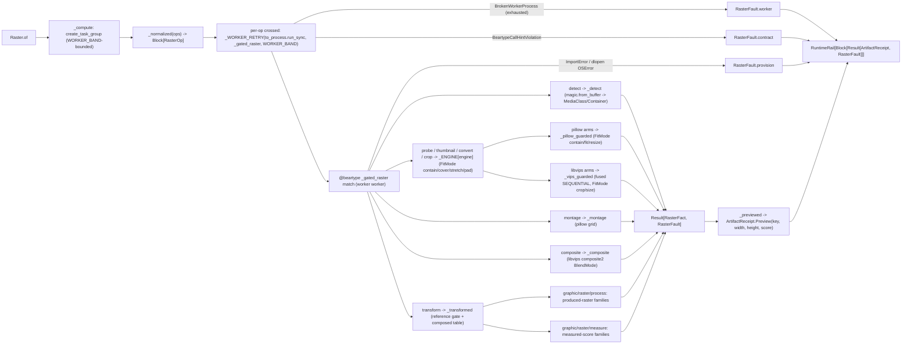

# [PY_ARTIFACTS_GRAPHIC_RASTER_IO]

The raster IO/convert/working-surface owner. `Raster` is ONE owner over the host-free pixel pipeline discriminating operation over the closed-payload `RasterOp` family and modality over `RasterOp | tuple[RasterOp, ...]`: pillow (in-process working surface — decode, EXIF `exif_transpose`, `FitMode`-uniform resize/`ImageOps.contain`/`fit`, alpha flatten, native AVIF/WebP codec save, grid montage) and pyvips (the libvips-backed fused decode/downscale/ICC/smartcrop streaming pipeline) selected per arm by the `RasterEngine` policy bundle, the `exchange/detect#DETECT` `MediaClass`/`Container` routing vocabulary composed at the raster ingress gate, and scikit-image (the eleven-family scientific transform engine, eight produced-raster plus three measured-score) as the `Transform` arm whose acceptor bodies and `TRANSFORMS` rows are owned by the sibling `graphic/raster/process#PROCESS` and `graphic/raster/measure#MEASURE` pages. One raster surface, not a per-media-type class family, not a per-operation function family, not a per-engine sibling owner, and not an erased `params` bag. Every operation folds into one typed `RasterFact` and the outcome is the closed `RasterFault` vocabulary on a per-op `Result` rail, the batch returning `RuntimeRail[Block[Result[ArtifactReceipt, RasterFault]]]` so one corrupt input faults its own slot without aborting the farm.

pillow, scikit-image, pyvips, and python-magic are all host-native worker packages — pillow/scikit-image ride the worker band (no package), pyvips binds a Forge-provisioned `libvips`, python-magic a Forge-provisioned `libmagic`, none on the runtime loader path — so EVERY arm (the `Detect` MIME gate included) crosses ONE `faults`-owned `anyio.to_process.run_sync(_gated_raster, op, limiter=WORKER_BAND)` subprocess seam onto the worker worker, bounded by the ONE shared `execution/lanes#LANE` `WORKER_BAND` `CapacityLimiter` the `exchange/detect`/`exchange/metadata`/`graphic/raster/measure`/`process`/`graphic/color/managed` worker lane shares — never a per-owner `CapacityLimiter(slots)` knob that oversubscribes the host against libvips's own internal thread pool, and never the unbounded per-loop default. Each crossing wraps `stamina.AsyncRetryingCaller(...).on(BrokenWorkerProcess)` so a transient OOM/signal worker death recovers before the slot faults. A subinterpreter `to_interpreter.run_sync` offload shares the host interpreter version and cannot host the gated stack, so the separate-process crossing is genuine, not interchangeable with the runtime `execution/lanes#LANE` lane. The worker captures each provider raise (`PIL.UnidentifiedImageError`/`Image.DecompressionBombError`, `pyvips.Error`, `magic.MagicException`, the scikit-image transform raises) into a `RasterFault` case at boundary scope; a `@beartype` contract violation lifts to `RasterFault.contract`, an exhausted worker death to `RasterFault.worker`, and an absent gated package or unprovisioned native binding (`ImportError` from `PIL`/`magic`/`skimage`, the `cffi` dlopen `OSError` from an unprovisioned `libvips`) to `RasterFault.provision` — the host-readiness fault distinct from a content fault — so no foreign exception escapes the seam unconverted.

`RasterFact` is declared here, the worker owner; `graphic/marks/encode#MARK` re-declares its minimal `(data, width, height, score)` shape for the in-process mark codec, and the `graphic/raster/process#PROCESS`/`graphic/raster/measure#MEASURE` transform acceptors fold the same `RasterFact` they import from this page. Its `score: frozendict[str, float | str]` is the exact value type the `core/receipt#RECEIPT` `ArtifactReceipt.Preview.scores` band carries, so the metrics float band, the detect/probe string facts, and the marks facts all project losslessly through one `_previewed` pass with no `str()` coerce.

## [01]-[INDEX]

- [01]-[IO]: the host-free raster owner over the closed-payload `RasterOp` family (`thumbnail`/`convert`/`crop`/`probe`/`montage`/`composite`/`transform`/`detect`) and `RasterOp | tuple[RasterOp, ...]` modality — the pillow in-process working surface, the pyvips libvips fused decode/ICC/smartcrop streaming pipeline, and the python-magic `Detect` MIME gate selected by the `RasterEngine`/`FitMode`/`BlendMode`/`ConvertFormat` policy vocabularies; the scikit-image `Transform` sub-axis dispatched through the composed `TRANSFORMS | MEASURE_TRANSFORMS` union the sibling `graphic/raster/process#PROCESS` + `graphic/raster/measure#MEASURE` own; every arm crossing the one `WORKER_BAND`-bounded `to_process` worker seam under `_WORKER_RETRY`, folding into one typed `RasterFact` projected to `core/receipt#RECEIPT` `ArtifactReceipt.Preview(key, width, height, scores)`, and the closed `RasterFault` cause vocabulary on a per-op `Result` rail so one corrupt input faults its own slot.

## [02]-[IO]

- Cases: `RasterOp` cases — `Thumbnail(payload, size, fmt, engine, fit)` (the `FitMode`-uniform resize: pillow `ImageOps.contain`/`fit`/`resize` keyed by `CONTAIN`/`COVER`/`STRETCH`, or the pyvips `new_from_buffer(..., access=Access.SEQUENTIAL).thumbnail_image(width, height=, size=Size, crop=Interesting)` fused shrink-on-load keyed by the same `FitMode`) · `Convert(payload, codec, quality, effort, engine)` (pillow `Image.save` keyed by the typed `ConvertFormat`, native AVIF through the built-in `AvifImagePlugin`, alpha `Image.convert("RGB")` flatten when the codec carries no alpha, or the pyvips `autorot().icc_transform(...).flatten().write_to_buffer(...)` streamed managed encode) · `Crop(payload, box, fmt, engine)` (region extract — pillow `Image.crop` over the display-oriented raster, or the pyvips `extract_area(*box)` one-pass extract) · `Probe(payload, engine)` (header-only metadata read with NO transcode — pillow lazy `Image.open` reading `format`/`mode`/`n_frames`/`info["icc_profile"]`, or the pyvips header reading `interpretation`/`bands`/`get_typeof("icc-profile-data")`/`get("n-pages")`, returning the source payload with the dimensions and a rich score map) · `Montage(tiles, columns, cell, fmt)` (pillow grid composite over `Image.new`/`thumbnail`/`paste`) · `Composite(base, overlay, position, mode, fmt)` (the libvips two-layer overlay/watermark over `composite2(layer, BlendMode, x=, y=)`, the full `BlendMode` Porter-Duff/separable vocabulary on the one engine that owns it) · `Transform(payload, kind, reference, mask, opts)` (the scikit-image arm carrying the typed `Transform` sub-axis whose rows and acceptor bodies are owned by `graphic/raster/process#PROCESS` + `graphic/raster/measure#MEASURE`) · `Detect(payload)` (the libmagic `magic.from_buffer(payload, mime=True)` ingress cook folded through the composed `MediaClass.of`/`Container.of` routing) — matched by one total `match`/`case` with `assert_never`; the engine choice is the `RasterEngine` field and the sizing the `FitMode` field on the decode-heavy payloads, never a sibling op per engine, per fit mode, or per scikit-image call.
- Modality: `Raster.of` is the one modal-arity entrypoint discriminating on `self.ops` being one `RasterOp` or a `tuple[RasterOp, ...]` — `_normalized` folds either into one `Block[RasterOp]` at the head through a structural `match`, so arity is a property of the value, never a `batch`/`mode` knob; a thumbnail farm is the same call as a single thumbnail. The per-op `Result[ArtifactReceipt, RasterFault]` survives in the returned `Block` so one corrupt input faults its own slot while the rest of the batch completes (the survivor/casualty partition raster batch consumers need), never a fail-fast `sequence` that discards every sibling on the first bad payload.
- Auto: the worker `_gated_raster(op) -> Result[RasterFact, RasterFault]` is `@beartype`-woven and re-dispatches the case by one total `match` at boundary scope under one outer `try` whose `except ImportError`/`except OSError` arms convert an absent gated package or `cffi` dlopen of an unprovisioned native binding to `RasterFault.provision` — the host-readiness fault every gated arm shares — importing `PIL`/`pyvips`/`magic`/`skimage` only inside the arm that needs them so no gated import lands on the core page: `Detect` folds through `_detect` (libmagic `from_buffer(mime=True)` composing `MediaClass.of`/`Container.of`, capturing `MagicException` -> `RasterFault.detect`); `Probe`/`Thumbnail`/`Convert`/`Crop` fold through `_ENGINE[engine]` so the `PILLOW` member runs the in-process pillow path and the `LIBVIPS` member runs the fused `new_from_buffer(access=Access.SEQUENTIAL)` pipeline, the pillow arms sharing one `_pillow_guarded` capture (`UnidentifiedImageError` -> `decode`, `DecompressionBombError` -> `bomb`, `OSError`/`ValueError`/`KeyError` -> `encode`) and the libvips arms one `_vips_guarded` capture (`pyvips.Error` -> `engine`); `Montage` folds the pillow grid composite under `_pillow_guarded`; `Composite` folds the libvips `composite2` two-layer overlay under `_vips_guarded`; `Transform` folds through `_transformed`, which gates the reference/mask precondition (`RasterFault.reference` when a reference- or mask-requiring `kind` arrives empty) before seeding a `TransformInput` from `skio.imread` and reading the composed `TRANSFORMS | MEASURE_TRANSFORMS` union so all eighty-two members resolve. The content capture is co-located with the provider call and the provisioning capture wraps the whole worker dispatch — the two correct boundaries; the dispatch splits only on the op case, the per-engine `EngineOps` read, and the `FitMode` sizing branch, never a re-discriminating `match` beyond them.
- Receipt: each operation folds into `RasterFact` and projects to `core/receipt#RECEIPT` `ArtifactReceipt.Preview(key, width, height, scores)` at the rail boundary, threading `fact.score` straight onto `Preview.scores`; the `Detect` arm reports the default zero dimensions and stamps the resolved `mime`/`media_class`/`container` on the score map, `Probe` reports the header dimensions and a rich `format`/`mode`/`frames`/`bands`/`interpretation`/`icc` score map without transcoding the payload, and the `Transform` arm threads the measure-family `structural_similarity`/`peak_signal_noise_ratio`/`mean_squared_error`/`normalized_root_mse`/`normalized_mutual_information`/`hausdorff_distance` perceptual-quality scores plus the `_measure`/`_register` region/blob/corner/shift facts on the immutable `RasterFact.score` `frozendict` the rail consumer reads inline. The receipt-side widening is settled — `Preview.scores: frozendict[str, float | str]` already exists and its `_facts` arm flattens the band into `{"width", "height", **scores}` — so this owner's contribution is the one projection that threads `fact.score` through, never a `_previewed` that drops the band; the measure-family score facts originate on `graphic/raster/measure#MEASURE` and ride the shared `RasterFact.score` map to this projection.
- Growth: a new raster operation is one `RasterOp` case plus one `_gated_raster` arm; a new decode-heavy engine-polymorphic operation is one `EngineOps` field plus one pillow and one libvips arm; a new sizing mode is one `FitMode` case plus one pillow and one libvips branch; a new compositing blend mode is one `BlendMode` member the libvips `composite2` already resolves by nickname; a new scikit-image transform is one `Transform` member plus one `TRANSFORMS`/`MEASURE_TRANSFORMS` row on the owning process/measure page; a new codec format is one `ConvertFormat` row plus one `_VIPS_SUFFIX`/`_CODEC_KWARGS`/`_VIPS_KWARGS` builder entry; a new raster engine is one `RasterEngine` member plus one `_ENGINE` `EngineOps` bundle; a new fault cause is one `RasterFault` case breaking every capture at type-check until handled; the `Detect` gate covers a new media-type branch by the `exchange/detect#DETECT` `MediaClass`/`Container` rows with no new surface here; zero new surface.

```python signature
from collections.abc import Callable, Iterable
from dataclasses import dataclass
from enum import StrEnum
from io import BytesIO
from typing import Literal, assert_never

import numpy as np
import stamina
from anyio import BrokenWorkerProcess, create_task_group, to_process
from beartype import beartype
from beartype.roar import BeartypeCallHintViolation
from builtins import frozendict
from expression import Error, Ok, Result, case, tag, tagged_union
from expression.collections import Block
from msgspec import Struct
from numpy.typing import NDArray

from rasm.runtime.content_identity import ContentIdentity
from rasm.runtime.faults import RuntimeRail, async_boundary
from rasm.runtime.lanes import WORKER_BAND

from artifacts.receipt.receipt import ArtifactReceipt

lazy import magic
lazy import pyvips
lazy from PIL import Image, ImageOps, UnidentifiedImageError
lazy from skimage import io as skio

lazy from artifacts.exchange.detect import Container, MediaClass
lazy from artifacts.graphic.raster.measure import MEASURE_TRANSFORMS
lazy from artifacts.graphic.raster.process import TRANSFORMS, TransformInput

type RasterOpTag = Literal["thumbnail", "convert", "crop", "probe", "montage", "composite", "transform", "detect"]
type Pixels = tuple[int, int]
type Box = tuple[int, int, int, int]
type Frame = NDArray[np.uint8]

# transient OOM/signal worker death recovers before the slot faults; a deterministic crash exhausts the schedule and rails worker.
_WORKER_RETRY = stamina.AsyncRetryingCaller(attempts=3, timeout=30.0).on(BrokenWorkerProcess)


class RasterEngine(StrEnum):
    PILLOW = "pillow"
    LIBVIPS = "libvips"


class FitMode(StrEnum):
    CONTAIN = "contain"  # fit inside the box, preserve aspect, no crop (pillow ImageOps.contain / libvips crop=NONE)
    COVER = "cover"      # fill the box, crop the overflow (pillow ImageOps.fit / libvips crop=ATTENTION)
    STRETCH = "stretch"  # force the exact box, ignore aspect (pillow resize / libvips size=FORCE)
    PAD = "pad"          # fit inside, then letterbox to the exact box with background (pillow ImageOps.pad / libvips embed+Extend)


class BlendMode(StrEnum):  # the full 25-case libvips composite2 nickname vocabulary passed by .value (VipsBlendMode order); OVER is the source-over watermark/stamp default
    CLEAR = "clear"
    SOURCE = "source"
    OVER = "over"
    IN = "in"
    OUT = "out"
    ATOP = "atop"
    DEST = "dest"
    DEST_OVER = "dest-over"
    DEST_IN = "dest-in"
    DEST_OUT = "dest-out"
    DEST_ATOP = "dest-atop"
    XOR = "xor"
    ADD = "add"
    SATURATE = "saturate"
    MULTIPLY = "multiply"
    SCREEN = "screen"
    OVERLAY = "overlay"
    DARKEN = "darken"
    LIGHTEN = "lighten"
    COLOUR_DODGE = "colour-dodge"
    COLOUR_BURN = "colour-burn"
    HARD_LIGHT = "hard-light"
    SOFT_LIGHT = "soft-light"
    DIFFERENCE = "difference"
    EXCLUSION = "exclusion"


class Transform(StrEnum):  # the 82-member sub-axis vocabulary; rows + acceptor bodies live on graphic/raster/process and graphic/raster/measure
    # --- produced-raster families (rows + acceptor bodies on graphic/raster/process)
    DENOISE_BILATERAL = "denoise-bilateral"
    DENOISE_NL_MEANS = "denoise-nl-means"
    DENOISE_TV = "denoise-tv"
    DENOISE_WAVELET = "denoise-wavelet"
    INPAINT = "inpaint"
    ROLLING_BALL = "rolling-ball"
    DECONVOLVE = "deconvolve"
    CLAHE = "clahe"
    EQUALIZE = "equalize"
    RESCALE_INTENSITY = "rescale-intensity"
    MATCH_HISTOGRAMS = "match-histograms"
    GAMMA = "gamma"
    LOG = "log"
    SIGMOID = "sigmoid"
    SLIC = "slic"
    FELZENSZWALB = "felzenszwalb"
    WATERSHED = "watershed"
    CHAN_VESE = "chan-vese"
    UNSHARP = "unsharp"
    GAUSSIAN = "gaussian"
    MEDIAN = "median"
    SOBEL = "sobel"
    LAPLACE = "laplace"
    FRANGI = "frangi"
    BUTTERWORTH = "butterworth"
    GABOR = "gabor"
    CANNY = "canny"
    SCHARR = "scharr"
    PREWITT = "prewitt"
    ROBERTS = "roberts"
    FARID = "farid"
    SATO = "sato"
    HESSIAN = "hessian"
    MEIJERING = "meijering"
    THRESHOLD_OTSU = "threshold-otsu"
    THRESHOLD_LOCAL = "threshold-local"
    THRESHOLD_MULTIOTSU = "threshold-multiotsu"
    THRESHOLD_LI = "threshold-li"
    THRESHOLD_YEN = "threshold-yen"
    THRESHOLD_ISODATA = "threshold-isodata"
    THRESHOLD_TRIANGLE = "threshold-triangle"
    THRESHOLD_MEAN = "threshold-mean"
    THRESHOLD_MINIMUM = "threshold-minimum"
    THRESHOLD_NIBLACK = "threshold-niblack"
    THRESHOLD_SAUVOLA = "threshold-sauvola"
    SKELETONIZE = "skeletonize"
    OPENING = "opening"
    CLOSING = "closing"
    EROSION = "erosion"
    DILATION = "dilation"
    RESIZE = "resize"
    RESCALE = "rescale"
    ROTATE = "rotate"
    RADON = "radon"
    # --- measured-score families (rows + acceptor bodies on graphic/raster/measure)
    CONTOURS = "contours"
    ENTROPY = "entropy"
    REGIONPROPS = "regionprops"
    GLCM = "glcm"
    HOG = "hog"
    BLOB = "blob"
    BLOB_DOG = "blob-dog"
    BLOB_DOH = "blob-doh"
    LBP = "lbp"
    CORNERS = "corners"
    CORNERS_SHI_TOMASI = "corners-shi-tomasi"
    PEAKS = "peaks"
    FIT_CIRCLE = "fit-circle"
    FIT_ELLIPSE = "fit-ellipse"
    FIT_LINE = "fit-line"
    OPTICAL_FLOW = "optical-flow"
    OPTICAL_FLOW_ILK = "optical-flow-ilk"
    PHASE_CORRELATION = "phase-correlation"
    KEYPOINTS = "keypoints"
    SIFT_KEYPOINTS = "sift-keypoints"
    SSIM = "ssim"
    PSNR = "psnr"
    MSE = "mse"
    NRMSE = "nrmse"
    NMI = "nmi"
    HAUSDORFF = "hausdorff"
    RAND_ERROR = "rand-error"
    INFO_VARIATION = "info-variation"


class ConvertFormat(StrEnum):
    PNG = "PNG"
    JPEG = "JPEG"
    WEBP = "WEBP"
    AVIF = "AVIF"
    TIFF = "TIFF"
    BMP = "BMP"


class RasterFact(Struct, frozen=True):
    data: bytes
    width: int = 0
    height: int = 0
    score: frozendict[str, float | str] = frozendict()


@tagged_union(frozen=True)
class RasterFault:
    tag: Literal["decode", "bomb", "encode", "engine", "worker", "provision", "detect", "reference", "contract"] = tag()
    decode: str = case()
    bomb: tuple[int, int] = case()
    encode: str = case()
    engine: str = case()
    worker: str = case()
    provision: str = case()
    detect: str = case()
    reference: Transform = case()
    contract: str = case()


@tagged_union(frozen=True)
class RasterOp:
    tag: RasterOpTag = tag()
    thumbnail: tuple[bytes, Pixels, ConvertFormat, RasterEngine, FitMode] = case()
    convert: tuple[bytes, ConvertFormat, int, int, RasterEngine] = case()
    crop: tuple[bytes, Box, ConvertFormat, RasterEngine] = case()
    probe: tuple[bytes, RasterEngine] = case()
    montage: tuple[tuple[bytes, ...], int, Pixels, ConvertFormat] = case()
    composite: tuple[bytes, bytes, Pixels, BlendMode, ConvertFormat] = case()
    transform: tuple[bytes, Transform, bytes, bytes, frozendict[str, float]] = case()
    detect: tuple[bytes] = case()

    @staticmethod
    def Thumbnail(payload: bytes, size: Pixels, fmt: ConvertFormat = ConvertFormat.PNG, engine: RasterEngine = RasterEngine.PILLOW, fit: FitMode = FitMode.CONTAIN) -> "RasterOp":
        return RasterOp(thumbnail=(payload, size, fmt, engine, fit))

    @staticmethod
    def Convert(payload: bytes, codec: ConvertFormat, quality: int = 80, effort: int = 4, engine: RasterEngine = RasterEngine.PILLOW) -> "RasterOp":
        return RasterOp(convert=(payload, codec, quality, effort, engine))

    @staticmethod
    def Crop(payload: bytes, box: Box, fmt: ConvertFormat = ConvertFormat.PNG, engine: RasterEngine = RasterEngine.PILLOW) -> "RasterOp":
        return RasterOp(crop=(payload, box, fmt, engine))

    @staticmethod
    def Probe(payload: bytes, engine: RasterEngine = RasterEngine.PILLOW) -> "RasterOp":
        return RasterOp(probe=(payload, engine))

    @staticmethod
    def Montage(tiles: tuple[bytes, ...], columns: int, cell: Pixels, fmt: ConvertFormat = ConvertFormat.PNG) -> "RasterOp":
        return RasterOp(montage=(tiles, columns, cell, fmt))

    @staticmethod
    def Composite(base: bytes, overlay: bytes, position: Pixels = (0, 0), mode: BlendMode = BlendMode.OVER, fmt: ConvertFormat = ConvertFormat.PNG) -> "RasterOp":
        return RasterOp(composite=(base, overlay, position, mode, fmt))

    @staticmethod
    def Transform(payload: bytes, kind: Transform, reference: bytes = b"", mask: bytes = b"", opts: frozendict[str, float] = frozendict()) -> "RasterOp":
        return RasterOp(transform=(payload, kind, reference, mask, opts))

    @staticmethod
    def Detect(payload: bytes) -> "RasterOp":
        return RasterOp(detect=(payload,))


class Raster(Struct, frozen=True):
    ops: RasterOp | tuple[RasterOp, ...]

    async def of(self) -> RuntimeRail[Block[Result[ArtifactReceipt, RasterFault]]]:
        return await async_boundary("raster", self._compute)

    async def _compute(self) -> Block[Result[ArtifactReceipt, RasterFault]]:
        async def crossed(op: RasterOp, /) -> Result[ArtifactReceipt, RasterFault]:
            try:
                produced = await _WORKER_RETRY(to_process.run_sync, _gated_raster, op, limiter=WORKER_BAND)
            except BrokenWorkerProcess as broken:
                return Error(RasterFault(worker=str(broken)))
            except BeartypeCallHintViolation as violation:
                return Error(RasterFault(contract=type(violation).__name__))
            return produced.map(lambda fact: _previewed(op, fact))

        async with create_task_group() as group:
            handles = _normalized(self.ops).map(lambda op: group.start_soon(crossed, op))
        return handles.map(lambda handle: handle.return_value)


def _normalized(ops: RasterOp | Iterable[RasterOp], /) -> Block[RasterOp]:
    match ops:
        case Iterable() as many:
            return Block.of_seq(many)
        case lone:
            return Block.singleton(lone)


def _previewed(op: RasterOp, fact: RasterFact, /) -> ArtifactReceipt:
    return ArtifactReceipt.Preview(ContentIdentity.of(f"raster-{op.tag}", fact.data), fact.width, fact.height, fact.score)
```

`RasterFact` is the one fact every arm yields — bytes plus dimensions plus the immutable `frozendict[str, float | str]` score map — so `_previewed` projects one shape into `ArtifactReceipt.Preview(key, width, height, scores)` regardless of op, threading `fact.score` straight onto the receipt's `scores` band so the metrics float facts, the `Detect` `mime`/`media_class`/`container`, and the `Probe` header facts all reach the `_facts` fold un-coerced; the `RasterOp` payload is typed per case, never an erased `params` dict the arm re-validates. `RasterFault` is the closed cause vocabulary the whole rail threads — `decode` an undecodable payload, `bomb` a `DecompressionBombError` against the pixel ceiling, `encode` a save/codec failure, `engine` a libvips operation fault, `worker` an exhausted `BrokenWorkerProcess` subprocess death, `provision` an absent gated package or unprovisioned native binding caught as the worker's `ImportError`/dlopen `OSError`, `detect` a libmagic fault, `reference` a transform missing its required reference/mask, `contract` a `BeartypeCallHintViolation` lifted at the worker seam — each structurally addressable so a downstream `match` routes a host-readiness fault apart from a worker death apart from a bad codec apart from a contract miss, never a message-collapsed string. `RasterFact` is the worker owner's value object that `graphic/marks/encode#MARK` re-declares (the minimal `(data, width, height, score)` shape, its own facts all `str`) so the in-process mark codec yields the same fact into the shared `ArtifactReceipt.Preview` without importing the worker owner, and that the `graphic/raster/process#PROCESS`/`graphic/raster/measure#MEASURE` transform acceptors import from this page so the produced-raster and measured-score arms fold one shape.

```python signature
@beartype
def _gated_raster(op: RasterOp) -> Result[RasterFact, RasterFault]:
    try:
        match op:
            case RasterOp(tag="detect", detect=(payload,)):
                return _detect(payload)
            case RasterOp(tag="probe", probe=(payload, engine)):
                return _ENGINE[engine].probe(payload)
            case RasterOp(tag="thumbnail", thumbnail=(payload, size, fmt, engine, fit)):
                return _ENGINE[engine].thumbnail(payload, size, fmt, fit)
            case RasterOp(tag="convert", convert=(payload, codec, quality, effort, engine)):
                return _ENGINE[engine].convert(payload, codec, quality, effort)
            case RasterOp(tag="crop", crop=(payload, box, fmt, engine)):
                return _ENGINE[engine].crop(payload, box, fmt)
            case RasterOp(tag="montage", montage=(tiles, columns, cell, fmt)):
                return _montage(tiles, columns, cell, fmt)
            case RasterOp(tag="composite", composite=(base, overlay, position, mode, fmt)):
                return _composite(base, overlay, position, mode, fmt)
            case RasterOp(tag="transform", transform=(payload, kind, reference, mask, opts)):
                return _transformed(payload, kind, reference, mask, opts)
            case _ as unreachable:
                assert_never(unreachable)
    except ImportError as absent:
        return Error(RasterFault(provision=absent.name or "<gated-module>"))
    except OSError as unloadable:  # pyvips cffi dlopen of an unprovisioned libvips (the guards trap every content OSError before here)
        return Error(RasterFault(provision=str(unloadable)))


def _pillow_guarded(work: Callable[[], RasterFact], /) -> Result[RasterFact, RasterFault]:
    try:
        return Ok(work())
    except UnidentifiedImageError:
        return Error(RasterFault(decode="<pillow-unidentified>"))
    except Image.DecompressionBombError:
        return Error(RasterFault(bomb=(0, int(Image.MAX_IMAGE_PIXELS or 0))))
    except (OSError, ValueError, KeyError) as fault:
        return Error(RasterFault(encode=type(fault).__name__))


def _vips_guarded(work: Callable[[], RasterFact], /) -> Result[RasterFact, RasterFault]:
    try:
        return Ok(work())
    except pyvips.Error as fault:
        return Error(RasterFault(engine=str(fault)))


def _detect(payload: bytes, /) -> Result[RasterFact, RasterFault]:
    try:
        mime = magic.from_buffer(payload, mime=True)
    except magic.MagicException as fault:
        return Error(RasterFault(detect=str(fault)))
    return Ok(RasterFact(payload, score=frozendict({
        "mime": mime,
        "media_class": MediaClass.of(mime).value,
        "container": Container.of(mime).value,
    })))


def _transformed(payload: bytes, kind: Transform, reference: bytes, mask: bytes, opts: frozendict[str, float], /) -> Result[RasterFact, RasterFault]:
    if kind in _REFERENCE_REQUIRED and not reference:
        return Error(RasterFault(reference=kind))
    if kind is Transform.INPAINT and not mask:
        return Error(RasterFault(reference=kind))
    try:
        table = TRANSFORMS | MEASURE_TRANSFORMS
        return Ok(table[kind].arm(TransformInput(skio.imread(BytesIO(payload)), kind, reference, mask, opts)))
    except (ValueError, OSError, KeyError) as fault:
        return Error(RasterFault(engine=f"skimage:{kind.value}:{type(fault).__name__}"))


def _thumbnail_pillow(payload: bytes, size: Pixels, fmt: ConvertFormat, fit: FitMode) -> Result[RasterFact, RasterFault]:
    def work() -> RasterFact:
        image = ImageOps.exif_transpose(Image.open(BytesIO(payload)))
        match fit:
            case FitMode.COVER:
                fitted = ImageOps.fit(image, size)
            case FitMode.STRETCH:
                fitted = image.resize(size)
            case FitMode.CONTAIN:
                fitted = ImageOps.contain(image, size)
            case FitMode.PAD:
                fitted = ImageOps.pad(image, size)
            case _ as unreachable:
                assert_never(unreachable)
        sink = BytesIO()
        fitted.save(sink, format=fmt.value)
        return RasterFact(sink.getvalue(), *fitted.size)

    return _pillow_guarded(work)


def _thumbnail_libvips(payload: bytes, size: Pixels, fmt: ConvertFormat, fit: FitMode) -> Result[RasterFact, RasterFault]:
    def work() -> RasterFact:
        crop = pyvips.Interesting.ATTENTION if fit is FitMode.COVER else pyvips.Interesting.NONE
        sizing = pyvips.Size.FORCE if fit is FitMode.STRETCH else pyvips.Size.DOWN
        shrunk = pyvips.Image.new_from_buffer(payload, "", access=pyvips.Access.SEQUENTIAL).thumbnail_image(size[0], height=size[1], size=sizing, crop=crop)
        image = shrunk.embed((size[0] - shrunk.width) // 2, (size[1] - shrunk.height) // 2, size[0], size[1], extend=pyvips.Extend.BACKGROUND) if fit is FitMode.PAD else shrunk
        return RasterFact(image.write_to_buffer(_VIPS_SUFFIX[fmt]), image.width, image.height)

    return _vips_guarded(work)


def _convert_pillow(payload: bytes, codec: ConvertFormat, quality: int, effort: int) -> Result[RasterFact, RasterFault]:
    def work() -> RasterFact:
        image = ImageOps.exif_transpose(Image.open(BytesIO(payload)))
        flat = image.convert("RGB") if codec in _NO_ALPHA and image.mode in {"RGBA", "LA", "P"} else image
        sink = BytesIO()
        flat.save(sink, format=codec.value, **_CODEC_KWARGS[codec](quality, effort))
        return RasterFact(sink.getvalue(), *flat.size)

    return _pillow_guarded(work)


def _convert_libvips(payload: bytes, codec: ConvertFormat, quality: int, effort: int) -> Result[RasterFact, RasterFault]:
    def work() -> RasterFact:
        source = pyvips.Image.new_from_buffer(payload, "", access=pyvips.Access.SEQUENTIAL).autorot()
        managed = source.icc_transform("srgb", intent=pyvips.Intent.RELATIVE) if source.get_typeof("icc-profile-data") != 0 else source
        flat = managed.flatten() if codec in _NO_ALPHA and managed.hasalpha() else managed
        return RasterFact(flat.write_to_buffer(_VIPS_SUFFIX[codec], **_VIPS_KWARGS[codec](quality, effort)), flat.width, flat.height)

    return _vips_guarded(work)


def _crop_pillow(payload: bytes, box: Box, fmt: ConvertFormat) -> Result[RasterFact, RasterFault]:
    def work() -> RasterFact:
        left, top, width, height = box
        region = ImageOps.exif_transpose(Image.open(BytesIO(payload))).crop((left, top, left + width, top + height))
        sink = BytesIO()
        region.save(sink, format=fmt.value)
        return RasterFact(sink.getvalue(), *region.size)

    return _pillow_guarded(work)


def _crop_libvips(payload: bytes, box: Box, fmt: ConvertFormat) -> Result[RasterFact, RasterFault]:
    def work() -> RasterFact:
        image = pyvips.Image.new_from_buffer(payload, "", access=pyvips.Access.SEQUENTIAL).extract_area(*box)
        return RasterFact(image.write_to_buffer(_VIPS_SUFFIX[fmt]), image.width, image.height)

    return _vips_guarded(work)


def _probe_pillow(payload: bytes) -> Result[RasterFact, RasterFault]:
    def work() -> RasterFact:
        with Image.open(BytesIO(payload)) as image:
            score: frozendict[str, float | str] = frozendict({
                "format": image.format or "",
                "mode": image.mode,
                "frames": str(getattr(image, "n_frames", 1)),
                "icc": "present" if image.info.get("icc_profile") else "absent",
            })
            return RasterFact(payload, image.width, image.height, score)

    return _pillow_guarded(work)


def _probe_libvips(payload: bytes) -> Result[RasterFact, RasterFault]:
    def work() -> RasterFact:
        image = pyvips.Image.new_from_buffer(payload, "", access=pyvips.Access.SEQUENTIAL)
        pages = image.get("n-pages") if image.get_typeof("n-pages") != 0 else 1
        score: frozendict[str, float | str] = frozendict({
            "interpretation": str(image.interpretation),
            "bands": str(image.bands),
            "pages": str(pages),
            "icc": "present" if image.get_typeof("icc-profile-data") != 0 else "absent",
        })
        return RasterFact(payload, image.width, image.height, score)

    return _vips_guarded(work)


def _montage(tiles: tuple[bytes, ...], columns: int, cell: Pixels, fmt: ConvertFormat) -> Result[RasterFact, RasterFault]:
    def work() -> RasterFact:
        cell_w, cell_h = cell
        rows = -(-len(tiles) // columns)
        grid = Image.new("RGBA", (columns * cell_w, rows * cell_h))
        for index, blob in enumerate(tiles):
            tile = Image.open(BytesIO(blob))
            tile.thumbnail(cell)
            row, col = divmod(index, columns)
            grid.paste(tile, (col * cell_w, row * cell_h))
        sink = BytesIO()
        grid.save(sink, format=fmt.value)
        return RasterFact(sink.getvalue(), *grid.size)

    return _pillow_guarded(work)


def _composite(base: bytes, overlay: bytes, position: Pixels, mode: BlendMode, fmt: ConvertFormat) -> Result[RasterFact, RasterFault]:
    def work() -> RasterFact:
        canvas = pyvips.Image.new_from_buffer(base, "", access=pyvips.Access.SEQUENTIAL)
        layer = pyvips.Image.new_from_buffer(overlay, "", access=pyvips.Access.SEQUENTIAL)
        merged = canvas.composite2(layer, mode.value, x=position[0], y=position[1])
        return RasterFact(merged.write_to_buffer(_VIPS_SUFFIX[fmt]), merged.width, merged.height)

    return _vips_guarded(work)


@dataclass(frozen=True, slots=True, kw_only=True)
class EngineOps:
    thumbnail: Callable[[bytes, Pixels, ConvertFormat, FitMode], Result[RasterFact, RasterFault]]
    convert: Callable[[bytes, ConvertFormat, int, int], Result[RasterFact, RasterFault]]
    crop: Callable[[bytes, Box, ConvertFormat], Result[RasterFact, RasterFault]]
    probe: Callable[[bytes], Result[RasterFact, RasterFault]]


_ENGINE: frozendict[RasterEngine, EngineOps] = frozendict({
    RasterEngine.PILLOW: EngineOps(thumbnail=_thumbnail_pillow, convert=_convert_pillow, crop=_crop_pillow, probe=_probe_pillow),
    RasterEngine.LIBVIPS: EngineOps(thumbnail=_thumbnail_libvips, convert=_convert_libvips, crop=_crop_libvips, probe=_probe_libvips),
})
_NO_ALPHA: frozenset[ConvertFormat] = frozenset({ConvertFormat.JPEG, ConvertFormat.BMP})
_REFERENCE_REQUIRED: frozenset[Transform] = frozenset({
    Transform.MATCH_HISTOGRAMS, Transform.OPTICAL_FLOW, Transform.OPTICAL_FLOW_ILK, Transform.PHASE_CORRELATION,
    Transform.KEYPOINTS, Transform.SIFT_KEYPOINTS,
    Transform.SSIM, Transform.PSNR, Transform.MSE, Transform.NRMSE, Transform.NMI, Transform.HAUSDORFF,
    Transform.RAND_ERROR, Transform.INFO_VARIATION,
})
_VIPS_SUFFIX: frozendict[ConvertFormat, str] = frozendict({
    ConvertFormat.PNG: ".png", ConvertFormat.JPEG: ".jpg", ConvertFormat.WEBP: ".webp",
    ConvertFormat.AVIF: ".avif", ConvertFormat.TIFF: ".tif", ConvertFormat.BMP: ".bmp",
})
_CODEC_KWARGS: frozendict[ConvertFormat, Callable[[int, int], frozendict[str, object]]] = frozendict({
    ConvertFormat.AVIF: lambda quality, effort: frozendict({"quality": quality, "speed": effort}),
    ConvertFormat.WEBP: lambda quality, effort: frozendict({"quality": quality, "method": effort}),
    ConvertFormat.JPEG: lambda quality, effort: frozendict({"quality": quality, "optimize": True}),
    ConvertFormat.PNG: lambda quality, effort: frozendict({"optimize": True}),
    ConvertFormat.TIFF: lambda quality, effort: frozendict({"compression": "tiff_lzw"}),
    ConvertFormat.BMP: lambda quality, effort: frozendict(),
})
_VIPS_KWARGS: frozendict[ConvertFormat, Callable[[int, int], frozendict[str, object]]] = frozendict({
    ConvertFormat.AVIF: lambda quality, effort: frozendict({"Q": quality, "effort": effort}),
    ConvertFormat.WEBP: lambda quality, effort: frozendict({"Q": quality, "effort": effort}),
    ConvertFormat.JPEG: lambda quality, effort: frozendict({"Q": quality}),
    ConvertFormat.PNG: lambda quality, effort: frozendict({"compression": effort}),
    ConvertFormat.TIFF: lambda quality, effort: frozendict({"compression": "lzw"}),
    ConvertFormat.BMP: lambda quality, effort: frozendict(),
})
```

The `RasterEngine` policy bundle is the throughput collapse: `_ENGINE` is one `frozendict[RasterEngine, EngineOps]` whose `EngineOps` carries the four decode-heavy callables per engine, so `_gated_raster` reads `_ENGINE[engine].thumbnail`/`convert`/`crop`/`probe` by one lookup and the pillow and libvips engines share one op shape with zero re-discrimination, never a thumbnail-`dict`-plus-convert-`if` split. The `FitMode` policy is the geometry collapse that keeps one `Thumbnail` op from resolving two different geometries by engine: `CONTAIN`/`COVER`/`STRETCH`/`PAD` drives both engines identically — `CONTAIN` is pillow `ImageOps.contain` / libvips `crop=Interesting.NONE`, `COVER` is pillow `ImageOps.fit` / libvips `crop=Interesting.ATTENTION`, `STRETCH` is pillow `Image.resize` / libvips `size=Size.FORCE`, `PAD` letterboxes to the exact box through pillow `ImageOps.pad` / libvips `embed(extend=Extend.BACKGROUND)` over the contained shrink, the same sizing on both engines and the `match` closed under `assert_never`. The pillow arms route every decode/encode raise through one `_pillow_guarded` capture (a shared boundary adapter, not a single-call helper — four callers) and the libvips arms through one `_vips_guarded`, each naming the exact provider exception set and mapping it onto the closed `RasterFault` rather than a bare `except Exception`. The native AVIF row is a pure `Convert` deepen on the already-admitted pillow: `Image.save(format="AVIF")` emits AVIF through the built-in `AvifImagePlugin` Pillow 12.2.0 ships, and `_CODEC_KWARGS` keys each codec's encode controls by a `frozendict`-builder row taking `(quality, effort)` so a codec reaches its native parameters by one row, never a per-format encoder and never a per-call dict literal. The pyvips provider arm is the fused alternative: `new_from_buffer(payload, access=Access.SEQUENTIAL)` opens a one-pass streaming pipeline, `autorot()` bakes EXIF orientation, `icc_transform("srgb", intent=Intent.RELATIVE)` runs liblcms2-backed ICC conversion only when `get_typeof("icc-profile-data")` proves an embedded profile, `flatten()` composites alpha against the background for a `_NO_ALPHA` codec, and `write_to_buffer(suffix, **_VIPS_KWARGS[codec](quality, effort))` computes the pipeline exactly once at egress. `Probe` is the metadata-without-transcode arm: pillow's lazy `Image.open` reads `format`/`mode`/`n_frames`/`info["icc_profile"]` and libvips reads `interpretation`/`bands`/`get("n-pages")`/`get_typeof("icc-profile-data")` off the header, both returning the source `payload` unchanged with the dimensions and a rich structural score map, so a gallery learns dimensions and codec without a decode+re-encode round trip — the descriptive EXIF/IPTC/XMP tag set staying `exchange/metadata#METADATA`'s. `Crop` extracts a region (`box = (left, top, width, height)`) — pillow `Image.crop` after `exif_transpose` so the box is in display orientation, libvips `extract_area(*box)` in one streamed pass. `Composite` is the two-layer overlay/watermark working-surface op on the one engine that owns the full blend algebra: `_composite` opens the base and overlay as two `Access.SEQUENTIAL` pipelines and folds them through `canvas.composite2(layer, mode.value, x=, y=)`, the `BlendMode` member passed by its libvips nickname so the full Porter-Duff/separable family resolves through one generated op without a per-mode arm — single-engine like `Montage`/`Detect`/`Transform`, because libvips `composite2` is alpha-correct over the whole vocabulary where pillow honors only source-over, so a `BlendMode`-divergent pillow arm would reintroduce the engine split `FitMode` deletes. `_detect` is the raster ingress gate composing the `exchange/detect#DETECT` owner: one `magic.from_buffer(payload, mime=True)` cook folded through the public `MediaClass.of`/`Container.of` classifiers so the score carries the typed routing discriminant a consumer dispatches on, never a raw mime string re-parsed downstream and never a parallel cookie/flag detector. `_transformed` gates the reference/mask precondition onto `RasterFault.reference` before seeding the `TransformInput` and reads the composed `TRANSFORMS | MEASURE_TRANSFORMS` union so all eighty-two `Transform` members resolve, the `TransformInput` carrier and the acceptor bodies owned by `graphic/raster/process#PROCESS` + `graphic/raster/measure#MEASURE` and never re-declared here.



## [03]-[RESEARCH]

- [SCORE_PROJECTION] [RESOLVED]: `_previewed` threads `fact.score` into `ArtifactReceipt.Preview(key, width, height, scores)` — the four-argument mint the `core/receipt#RECEIPT` owner declares (`preview: tuple[ContentKey, int, int, frozendict[str, float | str]]`), whose `_facts` arm flattens the band into `{"width": width, "height": height, **scores}`. The former `_previewed` constructing `Preview(key, width, height)` was the illusory defect: it dropped the score band while the Receipt prose and the `graphic/raster/measure -> core/receipt` `[SCORE_FACTS]` seam claimed the perceptual metrics, the `Detect` MIME facts, and the `Probe` header facts all rode through — so every score `process`/`measure`/`_detect`/`_probe` stamped was silently discarded at this one projection. `RasterFact.score` is widened to `frozendict[str, float | str]` to equal `Preview.scores` exactly, so the pass-through is lossless and a measure-family perceptual metric stamped as a native `float` reaches the `MeterProvider` and the structured-log `Encoder(enc_hook=repr)` un-stringified, the string facts (`mime`/`format`/`mode`) and the marks facts both admitted under the `float | str` union. The receipt-side widening is already settled on the `Preview` case, so no widening seam remains — this owner's contribution is the one threaded projection.
- [FAULT_RAIL] [RESOLVED]: the closed `RasterFault` `@tagged_union` (`decode`/`bomb`/`encode`/`engine`/`worker`/`provision`/`detect`/`reference`/`contract`) is the cause vocabulary the whole rail threads. Each case is structurally addressable so a downstream `match` routes a subprocess death apart from a bad codec apart from a corrupt payload apart from a contract miss. The capture is co-located with the provider call at boundary scope inside the worker: `_pillow_guarded` names `PIL.UnidentifiedImageError` -> `decode`, `Image.DecompressionBombError` -> `bomb` (carrying `Image.MAX_IMAGE_PIXELS` as the ceiling), and `OSError`/`ValueError`/`KeyError` -> `encode`; `_vips_guarded` names `pyvips.Error` -> `engine`; `_detect` names `magic.MagicException` -> `detect`; `_transformed` gates `RasterFault.reference` for a reference/mask-requiring `kind` and maps the scikit-image raise to `engine`. The `contract` case is the sibling-parity deepen (`graphic/marks/encode#MARK`, `graphic/color/managed#MANAGED`, and `algorithms.md` all carry it): `_gated_raster` is `@beartype`-woven and a `BeartypeCallHintViolation` propagates through the `to_process` seam (stamina does not retry it — only `BrokenWorkerProcess` is in the `.on(...)` set) where `crossed` lifts it onto `RasterFault.contract`, distinct from a worker death. The `pillow`/`pyvips`/`python-magic` `.api` `[02]-[PUBLIC_TYPES]` fault rows confirm `UnidentifiedImageError`/`DecompressionBombError`/`Error`/`MagicException`; the `pillow` `[04]-[IMPLEMENTATION_LAW]` evidence axis confirms `MAX_IMAGE_PIXELS` is the bomb ceiling. No bare `except Exception` rides the worker; an unexpected raise propagates as a defect through `BrokenWorkerProcess`.
- [PROBE_CROP] [RESOLVED]: `Probe` and `Crop` close two real domain gaps the former surface lacked. `Probe` reads the structural image header WITHOUT a transcode — the pillow `.api` `[03]-[ENTRYPOINTS]` row [01] confirms `Image.open` is lazy (deferred decode), and `[04]-[IMPLEMENTATION_LAW]` confirms `format`/`mode`/`info`/`seek`/`tell` plus `ImageSequence` carry header facts, so `_probe_pillow` reads `format`/`mode`/`n_frames`/`info["icc_profile"]` and `_probe_libvips` reads `interpretation`/`bands`/`get("n-pages")`/`get_typeof("icc-profile-data")` off the lazy header (pyvips `.api` `[03]` row [02] `new_from_buffer` + the generated `get`/`get_typeof` metadata surface row), both returning the source payload with the dimensions and the structural score map — the descriptive EXIF/IPTC/XMP/GPS field set staying `exchange/metadata#METADATA`'s lane (`Probe` reads codec/dimension/ICC-presence, never camera/creator/location tags). `Crop` is the region-extract working-surface op — pillow `.api` `[03]` row [06] `Image.crop(box)`, pyvips `.api` `[03]` row [04] `extract_area(left, top, width, height)`. The `exif_transpose` orientation deepen (pillow `[03]` row [06] `ImageOps.exif_transpose`, pyvips `[03]` row [10] `autorot`) and the alpha `flatten` deepen for a `_NO_ALPHA` codec (pillow `convert("RGB")`, pyvips `[03]` row [08] `flatten`/`hasalpha`) are in-place correctness folds on the existing decode-heavy arms, not new surfaces.
- [FIT_MODE] [RESOLVED]: the `FitMode` (`CONTAIN`/`COVER`/`STRETCH`) sizing policy closes the engine-divergence defect AND adds the cover/contain/stretch modality the former single-geometry `Thumbnail` lacked. The former `_thumbnail_pillow` (`image.thumbnail(size)`, fit-inside) and `_thumbnail_libvips` (`crop=Interesting.ATTENTION`, fill-and-crop) gave one `Thumbnail` op two different geometries by engine — the illusory "same op resolving either engine by one `frozendict` read" the page claimed. `FitMode` drives both engines identically: `CONTAIN` -> pillow `ImageOps.contain` / libvips `crop=Interesting.NONE`, `COVER` -> pillow `ImageOps.fit` / libvips `crop=Interesting.ATTENTION`, `STRETCH` -> pillow `Image.resize` / libvips `thumbnail_image(size=Size.FORCE)`. Verified against the folder catalogues: pillow `.api` `[03]` row [05] `ImageOps.fit`/`contain`/`cover`/`pad` and row [01] `Image.resize`; pyvips `.api` `[02]-[PUBLIC_TYPES]` enum row [02] `Interesting.NONE`/`ATTENTION`, enum row [08] `Size.BOTH`/`UP`/`DOWN`/`FORCE`, and the `thumbnail_image(width, *, height, size, crop)` instance-method (`[03]` row [01] `thumbnail` plus the already-loaded-pipeline `thumbnail_image` variant). Justified on PACKAGE (the pillow `ImageOps` fit family and the pyvips `Interesting`/`Size` enums both expose the cover/contain/stretch axis) and DOMAIN (a thumbnail/preview surface owns the fit-vs-fill-vs-stretch decision the consumer carries). The default `CONTAIN` is the geometry-preserving fit both engines share, not the libvips `ATTENTION` crop default.
- [FIT_PAD] [RESOLVED]: `FitMode.PAD` adds the letterbox modality — fit inside, then pad to the exact box with a centered background — so a fixed-frame gallery cell never crops or distorts. Verified PACKAGE: pillow `.api` `[03]` row [05] `ImageOps.pad(image, size, ...)` and pyvips `.api` `[03]` row [05] `embed(x, y, width, height, *, extend=Extend.BACKGROUND)` over the `crop=Interesting.NONE` contained shrink, with the `Extend` enum `[02]-[PUBLIC_TYPES]` row [09]. `_thumbnail_pillow` gains one `case FitMode.PAD: ImageOps.pad(image, size)` arm plus the `case _ as unreachable: assert_never(unreachable)` exhaustiveness witness the three-arm `match` lacked; `_thumbnail_libvips` gains one `embed((size[0]-shrunk.width)//2, (size[1]-shrunk.height)//2, *size, extend=Extend.BACKGROUND)` step guarded by `fit is FitMode.PAD`, the centered offset producing the same geometry as pillow's centered `pad`. The fourth `FitMode` member lands by the growth law — one case, one pillow branch, one libvips branch — every existing consumer untouched.
- [COMPOSITE_BLEND] [RESOLVED]: the `Composite` op and the `BlendMode` vocabulary close the two-layer overlay/watermark gap, capturing the pyvips `composite2` + `BlendMode` surface the page admitted but did not yet spell — `Montage` is a grid composite, never a positioned blend. Verified PACKAGE: pyvips `.api` `[03]-[ENTRYPOINTS]` row [09] `image.composite2(overlay, BlendMode.OVER, *, x=, y=)` and `[02]-[PUBLIC_TYPES]` row [05] `BlendMode` (the 25-case Porter-Duff + separable family). `_composite` is libvips-only — single-engine like `Montage`/`Detect`/`Transform` — because libvips `composite2` is alpha-correct over the full `BlendMode` family where pillow's `alpha_composite` honors only source-over, so a pillow arm would reintroduce the engine divergence `FitMode` deletes; the full 25-case `BlendMode` StrEnum enumerates the libvips composite nicknames (`clear`/`source`/`over`/.../`exclusion`) in `VipsBlendMode` order passed by `mode.value`, so the generated `composite2` resolves any mode by one member with no per-mode arm. Justified on PACKAGE (the rich `composite2`/`BlendMode` admitted surface had no spelling here) and DOMAIN (a raster working surface owns the layer/watermark/blend op).
- [VIPS_FUSED_PROVIDER] [RESEARCH]: the pyvips `RasterEngine.LIBVIPS` fused-pipeline provider arm composes `new_from_buffer(payload, "", access=Access.SEQUENTIAL)`, `thumbnail_image(width, height=, size=Size, crop=Interesting)`, `autorot()`, `icc_transform("srgb", intent=Intent.RELATIVE)` guarded by `get_typeof("icc-profile-data") != 0`, `flatten()` guarded by `hasalpha()`, `extract_area(*box)`, and `write_to_buffer(suffix, **kwargs)` against the folder `pyvips` `.api` catalogue: `new_from_buffer` construction row [02], `thumbnail` operation row [01], `extract_area`/`crop` row [04], `icc_transform` row [06], `flatten`/`hasalpha` row [08], `autorot` row [10], `write_to_buffer` egress row [02], and `Access.SEQUENTIAL`/`Interesting.NONE`/`Interesting.ATTENTION`/`Intent.RELATIVE`/`Size.FORCE`/`Size.DOWN` the `[02]-[PUBLIC_TYPES]` enum rows; `[04]-[IMPLEMENTATION_LAW]` `[STACK_INTEGRATION]` confirms the `new_from_buffer(png_bytes, access=Access.SEQUENTIAL).thumbnail_image(width)` fused-downscale composition this arm reuses. The catalogue records pyvips as sdist-only with native libvips NOT provisioned on this band, so the provider arm runs on the gated `to_process.run_sync` worker beside pillow/scikit-image and the `assay api resolve pyvips` reflection deepens once the Forge scientific toolchain provisions libvips on the worker — the one open spelling is the `thumbnail_image(width, *, height, size, crop)` instance-method signature (the catalogue spells the load-from-file `Image.thumbnail` row and the already-loaded-pipeline `thumbnail_image` variant through the generated `__getattr__` operation surface). Close-condition: `.api` carries the explicit `thumbnail_image` instance-method row.
- [PROCESS_MEASURE_SPLIT] [RESOLVED]: the scikit-image `Transform` engine is split three ways while the `Raster`/`RasterOp`/`RasterFault` owner stays whole on this page. This `io` page owns the `Transform` StrEnum (all eighty-two members), the `RasterOp.Transform` case, the `_transformed` arm, the `_REFERENCE_REQUIRED` precondition set, and the pillow/pyvips/python-magic IO/convert/crop/probe/thumbnail/montage/detect surface. `graphic/raster/process#PROCESS` owns the eight produced-raster acceptors, the shared `TransformInput`/`TransformArm` structs, the `_save_array`/`_luminance` helpers, and the base `TRANSFORMS` table; `graphic/raster/measure#MEASURE` owns the three measurement acceptors, imports that substrate, and contributes `MEASURE_TRANSFORMS`. `_transformed` composes the dispatch as `TRANSFORMS | MEASURE_TRANSFORMS` and looks up `table[kind]`, so all eighty-two members resolve through one union — the process-family rows on the process page, the measure-family rows on the measure page — every member landing in exactly one page's rows with zero loss and zero overlap. The widened `RasterFact.score: frozendict[str, float | str]` admits a measure-family arm stamping a native `float` perceptual metric, so the process/measure acceptors may emit numbers the receipt fold reads un-coerced.
