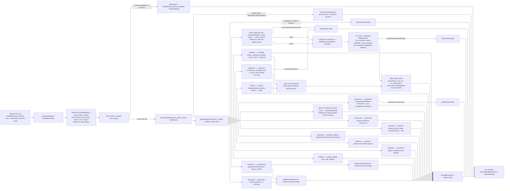

# [PY_ARTIFACTS_GRAPHIC_RASTER_IO]

Raster IO, conversion, and working-surface behavior live on the closed-payload `RasterOp` family. `Raster` holds pillow decode/transpose/resize/alpha/save/montage/contact/geometry, pyvips fused decode/downscale/ICC/smartcrop/pyramid, delegated MIME detection, produced-raster transforms, source generation, and measured transforms. One `CODEC` row per container binds the ORDERED writer preference serving each engine — that engine's own NATIVE encoder first under its linked-build probe, the imagecodecs ARRAY writer behind it — beside the `BandLaw` mode admission and the `FrameLaw` clock rung every arm reads, so capability degrades by probe rather than by an asserted build fact, egress crosses one pillow and one libvips function, and no arm re-spells a save, a mode, or a timing key. Every operation folds into `RasterFact` or the closed `RasterFault` vocabulary, and each farm member lowers to its own `ArtifactWork`.

One `RasterPolicy` carries the three egress axes every producing arm reads — the `CodecPolicy` quality/effort coordinates each row spells in its own encoder dialect, the `IccTransform` bundle imported from `graphic/color/managed#MANAGED`, and the `Resample` light space a reduce runs in — threaded beside `lane` and folded into the pre-run content key, so a re-managed or re-encoded product never collides with its predecessor on one slot and no arm binds a module literal no caller reaches. Colour vocabularies are the color sub-domain's: `BlendMode` and `PorterDuff` arrive from `graphic/color/derive#DERIVE` and lower to the single libvips nickname inside `_composite`, and the ICC coordinates arrive on the `IccTransform` bundle and resolve once per egress — `_vips_managed` for the libvips pipeline, `_managed` over `imagecodecs.cms_transform` for every pillow and array leg — so identical input lands the same destination profile on either engine.

pillow, scikit-image, and pyvips are host-native worker packages off the runtime loader path, so `Raster` carries the caller-threaded `lane: LanePolicy` — the same seam field `exchange/detect#DETECT` and `graphic/color/derive#DERIVE` carry — and every worker arm crosses `lane.offload(Kernel.of(_worker_raster, KernelTrait.HOSTILE), op)` onto the shared runtime process band, never a folder-minted `CapacityLimiter` that oversubscribes the host against libvips's own thread pool, never the unbounded default, never a class-qualified `LanePolicy.offload` with no bound instance. `Detect` is the one arm off that seam: `puremagic` is pure-Python with a bundled `magic_data.json`, so `_emit` delegates it lane-threaded to `exchange/detect#DETECT` in-process (the `PUREMAGIC` engine's `RELEASING` thread kernel) with no process crossing, no retry, no payload pickle. `_worker_raster` is `@beartype(conf=FAULT_CONF)`-woven, so a contract violation raises the one `BeartypeCallHintViolation` the runtime `CLASSIFY` table folds onto the `RuntimeRail` as `BoundaryFault.api`, and an exhausted worker death terminates through the lane's `guard`/`async_boundary` conversion — neither is a `RasterFault` case, because the runtime owns both vocabularies and a parallel local case is a second carrier for one fact.

`RasterFact` is canonical on `graphic/raster/process#PROCESS`; this page, `graphic/marks/encode#MARK`, and `graphic/raster/measure#MEASURE` import the one declaration. Array-to-PNG egress is `graphic/raster/process#PROCESS`'s `_save_array`; this page exports no raster composable beside the rail.

## [01]-[INDEX]

- [02]-[IO]: `Raster` owns the host-free raster plane — pillow working surface, fused libvips pipeline, delegated `exchange/detect#DETECT` MIME gate, and the scikit-image `Transform` arm the process/measure siblings own — under one caller-threaded `RasterPolicy` carrying the codec coordinates, the imported `IccTransform` gate, and the resample light space, every worker arm crossing the runtime process lane, `Detect` in-process off it, and each member returning its native result.

## [02]-[IO]

- Owner: `Raster` owns the closed `RasterOp` family beside one `RasterPolicy`. `GeometryOp` is the payload-carrying geometry sub-axis: fixed transforms carry no payload, `rotate` carries one angle, `affine` carries six coefficients, `perspective` carries eight coefficients, and `reduce` carries one positive factor. `RasterEngine` and `FitMode` remain policy vocabularies because engine reach and sizing behavior vary independently of operation identity. `_ENGINE` is one `frozendict[RasterEngine, EngineOps]`, so `_worker_raster` reads `probe`/`thumbnail`/`convert`/`crop` by one lookup and pillow and libvips share one op shape; `_GUARD` is its peer keying each engine to its own provider-exception guard, so `_produced` is the ONE producing tail every arm reaches; `CODEC` carries every codec fact — the ordered per-engine `CodecEmit` preference, the `BandLaw` mode admission, the `FrameLaw` clock rung — so an arm resolves one row and never consults a parallel membership set the next container silently drops out of. Every static policy table on this page is a `frozendict` row set, the same container the transform tables use, so the composed `TRANSFORMS | MEASURE_TRANSFORMS` union is one total lookup.
- Cases: `Probe`/`Thumbnail`/`Convert`/`Crop` are engine-polymorphic; `Montage`/`Deframe` split by engine; `Composite`/`SmartCrop`/`Pyramid` are libvips-owned; `Geometry`/`Quantize`/`Children`/`Sequence`/`Contact` are pillow-owned; `Detect` delegates in-process; `Transform` carries an encoded operand; `Generate` carries only a source `Transform` and `TransformPolicy`. `Transform` rejects source rows, and `Generate` rejects operand rows before the worker crossing.
- Entry: `Raster.emit` discriminates on `self.ops` being one `RasterOp` or a tuple — `_normalized` folds either into one `Block[RasterOp]` at the head, so arity is a value property, never a `batch` knob. Each member lowers to its own `ArtifactWork` carrying that member's `RasterFault` as its boundary fault and binding `self.lane` and `self.policy` into the work thunk, so one corrupt input faults its node while siblings complete under the plan's front drain — never a fail-fast batch that discards every sibling on the first bad payload.
- Auto: `RasterOp.admitted(policy)` is the ONE pre-dispatch gate over both halves — the policy's codec range, its press-bundle refusal, and its ICC depth first, then the op's empty collections, extents, timing arity, indices, geometry factors, transform operands, policy compatibility, and source payload timing. `_emit` routes `Detect` in-process and crosses every other admitted op through the worker. `_worker_raster` total-dispatches under provision capture; each engine's arm reaches its guard through `_produced`. `_transformed` decodes image/reference/mask rows once through `img_as_ubyte`; `_generated` constructs the source-only `TransformInput` without bytes or decode.
- Output: producing operations return `RasterFact` and record their settled byte volume; detection returns `DetectIdentity` unchanged.
- Growth: a new raster op is one `RasterOp` case, one `admitted` arm, and one `_worker_raster` arm; a new engine-polymorphic op one `EngineOps` field with a pillow and a libvips arm; a new sizing mode one `FitMode` case with its two branches; a new crop or pyramid form one `CropFocus`/`PyramidLayout` member the libvips call resolves by nickname; a new blend or compositing operator one `BlendMode`/`PorterDuff` row at `graphic/color/derive#DERIVE` plus one `_BLEND`/`_PORTER` lowering row here; a new geometric op one payload-correct `GeometryOp` case with one pillow arm; a new scikit-image transform one `Transform` member with a `TRANSFORMS`/`MEASURE_TRANSFORMS` row on the owning page; a new codec one `ConvertFormat` member with one `CODEC` row naming its ordered `CodecEmit` preference per engine and answering the `BandLaw` and `FrameLaw` columns — an engine whose every listed writer probes false carries the container nowhere and `_writer` faults `codec` for it; a new container band set one `BandLaw` member with its `_BANDS` entry; a new per-frame encoder key one `FrameLaw` rung carrying that key on every wider rung's cumulative `_CLOCK` tuple; a new engine one `RasterEngine` member with one `_ENGINE` bundle, one `_GUARD` row, and one writer column on every `CODEC` row that engine can write; a new encoder coordinate one `CodecPolicy` field every option builder already receives whole; a new fault cause one `RasterFault` case breaking every capture at type-check.
- Boundary: `CODEC` writer columns carry libvips saver suffixes and pillow format names as literals because provider imports remain worker-local, and each literal is simultaneously the call spelling and its own capability-probe key; no column asserts that a build lacks an encoder, because the ordered preference falls through to the array writer whenever the native probe refuses. Every libvips saver suffix proves the build REGISTERED the operation and never that the operation's own encoder backend linked — `get_suffixes` offers `.heic` on a libheif carrying no HEVC encoder and `heifsave` then refuses, and `.avif` rides that same delegating saver — so the libvips probe is a memoized one-shot trial write and the missing backend falls through exactly as an unregistered suffix does. A trial write proves the REGISTERED band shape alone: `jxlsave` accepts the 1-band and 3-band trial and refuses a 2-band or 4-band image mid-write, so a container whose native saver covers less than its `BandLaw` admits lists the array writer FIRST and the native leg nowhere. Container DEPTH stops at 8 bits: `ConvertFormat` names display containers, `Frame` is `uint8` whole, an `IccTransform` past that depth refuses at admission, and the 16-bit, half, and float lanes of these same codec families are the deep-pixel texture plane's — a widened member here pushes an 8-bit intermediate onto a texture path and quantizes it silently. `BandLaw` states which MODES a container carries, never how alpha associates: association is a deep-pixel plane fact and a straight-versus-associated conversion at 8 bits quantizes catastrophically at low alpha, so this funnel declares admission and the texture plane owns the conversion. ICC reach stops at the built-in device profiles: a raw ICC blob destination, soft proofing, separations, and the TAC gate are `graphic/color/managed#MANAGED`'s press legs, which own the temp-file profile capsule this funnel never opens. Payload-bearing operations carry canonical bytes rather than `pyvips.Source`/`Target`; `Generate` carries no bytes because source identity derives from its typed operation and policy. Streaming intake belongs to the consumer that owns stream identity. Descriptive EXIF/IPTC/XMP tags stay `exchange/metadata#METADATA`'s; MIME classification stays `exchange/detect#DETECT`'s; transform acceptors stay on process/measure; runtime contract and worker faults stay `BoundaryFault` cases.

```python
import os
from builtins import frozendict
from collections.abc import Callable, Iterable
from dataclasses import dataclass
from enum import StrEnum
from functools import cache, partial
from io import BytesIO
from struct import pack
from typing import Final, Literal, assert_never

import numpy as np
from beartype import beartype
from expression import Error, Ok, Result, case, tag, tagged_union
from expression.collections import Block
from msgspec import Struct

from rasm.runtime.faults import FAULT_CONF, TERMINAL, TRANSIENT, BoundaryFault, FaultRow, RuntimeRail, rostered
from rasm.runtime.identity import ContentIdentity, ContentKey, IdentitySource
from rasm.runtime.lanes import LanePolicy
from rasm.runtime.metrics import Metrics
from rasm.runtime.workers import Kernel, KernelTrait

from rasm.artifacts.core.hooks import BYTE_VOLUME, DOMAIN, ArtifactsLeg
from rasm.artifacts.core.plan import Admission, ArtifactWork
from rasm.artifacts.graphic.color.derive import BlendMode, PorterDuff
from rasm.artifacts.graphic.color.managed import BitDepth, BuiltinProfile, IccTransform, RenderingIntent
from rasm.artifacts.graphic.raster.process import (
    ConvertFormat,
    Frame,
    RasterFact,
    Transform,
    TransformInput,
    TransformNeeds,
    TransformPolicy,
)

lazy import imagecodecs

os.environ.setdefault("VIPS_CONCURRENCY", "1")
lazy import pyvips
lazy from PIL import Image, ImageOps, ImageSequence, UnidentifiedImageError, features

lazy from rasm.artifacts.exchange.detect import Detect, DetectEngine, DetectIdentity, Source
lazy from rasm.artifacts.graphic.raster.measure import MEASURE_TRANSFORMS
lazy from rasm.artifacts.graphic.raster.process import TRANSFORMS

RASTER_ADMIT: Final[FaultRow[ArtifactsLeg]] = FaultRow(
    leg=ArtifactsLeg.IO, point="admit", arm="config", defect="op-refused", retriability=TERMINAL
)
RASTER_PRODUCE: Final[FaultRow[ArtifactsLeg]] = FaultRow(
    leg=ArtifactsLeg.IO, point="produce", arm="boundary", defect="raster-refused", retriability=TRANSIENT
)
RAISES: Final[Block[FaultRow[ArtifactsLeg]]] = rostered(Block.of_seq([RASTER_ADMIT, RASTER_PRODUCE]))

type RasterOpTag = Literal[
    "thumbnail",
    "convert",
    "crop",
    "probe",
    "montage",
    "composite",
    "transform",
    "generate",
    "detect",
    "smartcrop",
    "pyramid",
    "geometry",
    "deframe",
    "sequence",
    "contact",
    "quantize",
    "children",
]
type Pixels = tuple[int, int]
type Box = tuple[int, int, int, int]

_DISPLAY_BITS: Final[int] = int(np.iinfo(np.uint8).bits)


class RasterEngine(StrEnum):
    PILLOW = "pillow"
    LIBVIPS = "libvips"


class Resample(StrEnum):
    GAMMA = "gamma"
    LINEAR = "linear"


class FitMode(StrEnum):
    CONTAIN = "contain"
    COVER = "cover"
    STRETCH = "stretch"
    PAD = "pad"


class CropFocus(StrEnum):
    ATTENTION = "attention"
    ENTROPY = "entropy"
    CENTRE = "centre"
    LOW = "low"
    HIGH = "high"
    ALL = "all"


class PyramidLayout(StrEnum):
    DZ = "dz"
    ZOOMIFY = "zoomify"
    GOOGLE = "google"
    IIIF = "iiif"
    IIIF3 = "iiif3"


@tagged_union(frozen=True)
class GeometryOp:
    tag: Literal["flip_h", "flip_v", "rotate_90", "rotate_180", "rotate_270", "transpose", "transverse", "rotate", "affine", "perspective", "reduce"] = tag()
    flip_h: None = case()
    flip_v: None = case()
    rotate_90: None = case()
    rotate_180: None = case()
    rotate_270: None = case()
    transpose: None = case()
    transverse: None = case()
    rotate: float = case()
    affine: tuple[float, float, float, float, float, float] = case()
    perspective: tuple[float, float, float, float, float, float, float, float] = case()
    reduce: int = case()


class QuantizeMethod(StrEnum):
    MEDIANCUT = "median-cut"
    MAXCOVERAGE = "max-coverage"
    FASTOCTREE = "fast-octree"
    LIBIMAGEQUANT = "libimagequant"


class DitherMode(StrEnum):
    NONE = "none"
    ORDERED = "ordered"
    RASTERIZE = "rasterize"
    FLOYDSTEINBERG = "floyd-steinberg"


@tagged_union(frozen=True)
class RasterFault:
    tag: Literal[
        "decode", "bomb", "encode", "engine", "provision", "detect", "codec", "profile", "depth", "blend",
        "reference", "policy", "bounds", "empty", "extent", "arity", "range",
    ] = tag()
    decode: str = case()
    bomb: tuple[int, int] = case()
    encode: str = case()
    engine: str = case()
    provision: str = case()
    detect: str = case()
    codec: ConvertFormat = case()
    profile: str = case()
    depth: str = case()
    blend: tuple[str, str] = case()
    reference: Transform = case()
    policy: tuple[Transform, str, str] = case()
    bounds: str = case()
    empty: RasterOpTag = case()
    extent: tuple[RasterOpTag, tuple[int, ...]] = case()
    arity: tuple[RasterOpTag, int, int] = case()
    range: tuple[RasterOpTag, str, float] = case()


@dataclass(frozen=True, slots=True, kw_only=True)
class CodecPolicy:
    quality: int = 80
    effort: int = 4

    @property
    def rate(self) -> float:
        return 100.0 / float(max(self.quality, 1))


@dataclass(frozen=True, slots=True, kw_only=True)
class RasterPolicy:
    codec: CodecPolicy = CodecPolicy()
    icc: IccTransform = IccTransform()
    resample: Resample = Resample.LINEAR
    source: BuiltinProfile = BuiltinProfile.SRGB
    destination: BuiltinProfile = BuiltinProfile.SRGB

    def admitted(self, /) -> Result["RasterPolicy", RasterFault]:
        match self:
            case RasterPolicy(codec=CodecPolicy(quality=quality)) if not 0 <= quality <= 100:
                return Error(RasterFault(range=("convert", "quality", float(quality))))
            case RasterPolicy(codec=CodecPolicy(effort=effort)) if effort < 0:
                return Error(RasterFault(range=("convert", "effort", float(effort))))
            case RasterPolicy(icc=IccTransform(depth=depth)) if depth is not BitDepth.UINT8:
                return Error(RasterFault(depth=depth.value))
            case RasterPolicy(icc=icc) if icc.proof.is_some() or icc.separations:
                return Error(RasterFault(profile="<press-bundle>"))
            case RasterPolicy(source=source, destination=destination) if not {source, destination} <= _CMS_PROFILE.keys():
                return Error(RasterFault(profile=f"{source.name}->{destination.name}"))
            case _:
                return Ok(self)

    @property
    def preimage(self) -> tuple[object, ...]:
        return (
            self.codec.quality, self.codec.effort, self.resample.value, self.source.name, self.destination.name,
            self.icc.intent.value, self.icc.black_point.value, self.icc.pcs.value, self.icc.depth.value,
        )


@tagged_union(frozen=True)
class RasterOp:
    tag: RasterOpTag = tag()
    thumbnail: tuple[bytes, Pixels, ConvertFormat, RasterEngine, FitMode] = case()
    convert: tuple[bytes, ConvertFormat, RasterEngine] = case()
    crop: tuple[bytes, Box, ConvertFormat, RasterEngine] = case()
    probe: tuple[bytes, RasterEngine] = case()
    montage: tuple[tuple[bytes, ...], int, Pixels, ConvertFormat, RasterEngine] = case()
    composite: tuple[bytes, bytes, Pixels, BlendMode, PorterDuff, ConvertFormat] = case()
    transform: tuple[bytes, Transform, bytes, bytes, TransformPolicy] = case()
    generate: tuple[Transform, TransformPolicy] = case()
    detect: tuple[bytes] = case()
    smartcrop: tuple[bytes, Pixels, CropFocus, ConvertFormat] = case()
    pyramid: tuple[bytes, PyramidLayout, int, ConvertFormat] = case()
    geometry: tuple[bytes, GeometryOp, ConvertFormat] = case()
    deframe: tuple[bytes, int, ConvertFormat, RasterEngine] = case()
    sequence: tuple[tuple[bytes, ...], tuple[int, ...], int, int, ConvertFormat] = case()
    contact: tuple[bytes, int, Pixels, ConvertFormat] = case()
    quantize: tuple[bytes, int, QuantizeMethod, DitherMode, ConvertFormat] = case()
    children: tuple[bytes, int, ConvertFormat] = case()

    @staticmethod
    def Thumbnail(
        payload: bytes,
        size: Pixels,
        fmt: ConvertFormat = ConvertFormat.PNG,
        engine: RasterEngine = RasterEngine.PILLOW,
        fit: FitMode = FitMode.CONTAIN,
    ) -> "RasterOp":
        return RasterOp(thumbnail=(payload, size, fmt, engine, fit))

    @staticmethod
    def Convert(payload: bytes, codec: ConvertFormat, engine: RasterEngine = RasterEngine.PILLOW) -> "RasterOp":
        return RasterOp(convert=(payload, codec, engine))

    @staticmethod
    def Crop(payload: bytes, box: Box, fmt: ConvertFormat = ConvertFormat.PNG, engine: RasterEngine = RasterEngine.PILLOW) -> "RasterOp":
        return RasterOp(crop=(payload, box, fmt, engine))

    @staticmethod
    def Probe(payload: bytes, engine: RasterEngine = RasterEngine.PILLOW) -> "RasterOp":
        return RasterOp(probe=(payload, engine))

    @staticmethod
    def Montage(
        tiles: tuple[bytes, ...], columns: int, cell: Pixels, fmt: ConvertFormat = ConvertFormat.PNG, engine: RasterEngine = RasterEngine.PILLOW
    ) -> "RasterOp":
        return RasterOp(montage=(tiles, columns, cell, fmt, engine))

    @staticmethod
    def Composite(
        base: bytes,
        overlay: bytes,
        position: Pixels = (0, 0),
        blend: BlendMode = BlendMode.NORMAL,
        operator: PorterDuff = PorterDuff.SOURCE_OVER,
        fmt: ConvertFormat = ConvertFormat.PNG,
    ) -> "RasterOp":
        return RasterOp(composite=(base, overlay, position, blend, operator, fmt))

    @staticmethod
    def Transform(
        payload: bytes, kind: Transform, reference: bytes = b"", mask: bytes = b"", policy: TransformPolicy = TransformPolicy(default=None)
    ) -> "RasterOp":
        return RasterOp(transform=(payload, kind, reference, mask, policy))

    @staticmethod
    def Generate(kind: Transform, policy: TransformPolicy = TransformPolicy(default=None)) -> "RasterOp":
        return RasterOp(generate=(kind, policy))

    @staticmethod
    def Detect(payload: bytes) -> "RasterOp":
        return RasterOp(detect=(payload,))

    @staticmethod
    def SmartCrop(payload: bytes, size: Pixels, focus: CropFocus = CropFocus.ATTENTION, fmt: ConvertFormat = ConvertFormat.PNG) -> "RasterOp":
        return RasterOp(smartcrop=(payload, size, focus, fmt))

    @staticmethod
    def Pyramid(payload: bytes, layout: PyramidLayout = PyramidLayout.DZ, tile: int = 254, fmt: ConvertFormat = ConvertFormat.JPEG) -> "RasterOp":
        return RasterOp(pyramid=(payload, layout, tile, fmt))

    @staticmethod
    def Geometry(payload: bytes, op: GeometryOp, fmt: ConvertFormat = ConvertFormat.PNG) -> "RasterOp":
        return RasterOp(geometry=(payload, op, fmt))

    @staticmethod
    def Deframe(payload: bytes, index: int = 0, fmt: ConvertFormat = ConvertFormat.PNG, engine: RasterEngine = RasterEngine.PILLOW) -> "RasterOp":
        return RasterOp(deframe=(payload, index, fmt, engine))

    @staticmethod
    def Sequence(
        frames: tuple[bytes, ...], delays: tuple[int, ...] = (), loop: int = 0, disposal: int = 2, fmt: ConvertFormat = ConvertFormat.TIFF
    ) -> "RasterOp":
        return RasterOp(sequence=(frames, delays, loop, disposal, fmt))

    @staticmethod
    def Contact(payload: bytes, columns: int = 4, cell: Pixels = (256, 256), fmt: ConvertFormat = ConvertFormat.PNG) -> "RasterOp":
        return RasterOp(contact=(payload, columns, cell, fmt))

    @staticmethod
    def Quantize(
        payload: bytes,
        colors: int = 256,
        method: QuantizeMethod = QuantizeMethod.MEDIANCUT,
        dither: DitherMode = DitherMode.FLOYDSTEINBERG,
        fmt: ConvertFormat = ConvertFormat.PNG,
    ) -> "RasterOp":
        return RasterOp(quantize=(payload, colors, method, dither, fmt))

    @staticmethod
    def Children(payload: bytes, index: int = 0, fmt: ConvertFormat = ConvertFormat.PNG) -> "RasterOp":
        return RasterOp(children=(payload, index, fmt))

    def admitted(self, policy: RasterPolicy, /) -> Result["RasterOp", RasterFault]:
        return policy.admitted().bind(lambda _admitted: self._payload())

    def _payload(self, /) -> Result["RasterOp", RasterFault]:
        match self:
            case RasterOp(tag="composite", composite=(_, _, _, blend, operator, _)):
                return _lowered(blend, operator).map(lambda _nickname: self)
            case RasterOp(tag="thumbnail", thumbnail=(_, (width, height), _, _, _)) if width <= 0 or height <= 0:
                return Error(RasterFault(extent=(self.tag, (width, height))))
            case RasterOp(tag="crop", crop=(_, (_, _, width, height), _, _)) if width <= 0 or height <= 0:
                return Error(RasterFault(extent=(self.tag, (width, height))))
            case RasterOp(tag="montage", montage=((), _, _, _, _)) | RasterOp(tag="sequence", sequence=((), _, _, _, _)):
                return Error(RasterFault(empty=self.tag))
            case RasterOp(tag="montage", montage=(_, columns, (width, height), _, _)) | RasterOp(tag="contact", contact=(_, columns, (width, height), _)) if (
                min(columns, width, height) <= 0
            ):
                return Error(RasterFault(extent=(self.tag, (columns, width, height))))
            case RasterOp(tag="montage", montage=(_, columns, (width, height), _, _)) | RasterOp(tag="contact", contact=(_, columns, (width, height), _)) if (
                Image.MAX_IMAGE_PIXELS is not None and columns * width * height > Image.MAX_IMAGE_PIXELS
            ):
                return Error(RasterFault(bomb=(columns * width * height, int(Image.MAX_IMAGE_PIXELS))))
            case RasterOp(tag="transform", transform=(_, kind, reference, mask, policy)):
                row = (TRANSFORMS | MEASURE_TRANSFORMS)[kind]
                match (row.accepts(policy), row.needs):
                    case (False, _):
                        return Error(RasterFault(policy=(kind, row.policy.tag, policy.tag)))
                    case (True, TransformNeeds.REFERENCE) if not reference:
                        return Error(RasterFault(reference=kind))
                    case (True, TransformNeeds.MASK) if not mask:
                        return Error(RasterFault(reference=kind))
                    case (True, TransformNeeds.SOURCE):
                        return Error(RasterFault(policy=(kind, "image", "source")))
                    case (True, TransformNeeds.NONE | TransformNeeds.REFERENCE | TransformNeeds.MASK):
                        return Ok(self)
                    case _ as unreachable:
                        assert_never(unreachable)
            case RasterOp(tag="generate", generate=(kind, policy)):
                row = (TRANSFORMS | MEASURE_TRANSFORMS)[kind]
                match (row.accepts(policy), row.needs):
                    case (False, _):
                        return Error(RasterFault(policy=(kind, row.policy.tag, policy.tag)))
                    case (True, TransformNeeds.SOURCE):
                        return Ok(self)
                    case (True, needs):
                        return Error(RasterFault(policy=(kind, "source", needs.value)))
            case RasterOp(tag="smartcrop", smartcrop=(_, (width, height), _, _)) if width <= 0 or height <= 0:
                return Error(RasterFault(extent=(self.tag, (width, height))))
            case RasterOp(tag="pyramid", pyramid=(_, _, tile, _)) if tile <= 0:
                return Error(RasterFault(extent=(self.tag, (tile,))))
            case RasterOp(tag="geometry", geometry=(_, GeometryOp(tag="reduce", reduce=factor), _)) if factor <= 0:
                return Error(RasterFault(range=(self.tag, "factor", float(factor))))
            case RasterOp(tag="deframe", deframe=(_, index, _, _)) | RasterOp(tag="children", children=(_, index, _)) if index < 0:
                return Error(RasterFault(range=(self.tag, "index", float(index))))
            case RasterOp(tag="sequence", sequence=(frames, delays, _, _, _)) if delays and len(delays) != len(frames):
                return Error(RasterFault(arity=(self.tag, len(frames), len(delays))))
            case RasterOp(tag="sequence", sequence=(_, delays, _, _, _)) if any(delay < 0 for delay in delays):
                return Error(RasterFault(range=(self.tag, "delay", float(min(delays)))))
            case RasterOp(tag="sequence", sequence=(_, _, loop, disposal, _)) if loop < 0 or not 0 <= disposal <= 3:
                return Error(RasterFault(range=(self.tag, "animation", float(disposal if not 0 <= disposal <= 3 else loop))))
            case RasterOp(tag="quantize", quantize=(_, colors, _, _, _)) if not 1 <= colors <= 256:
                return Error(RasterFault(range=(self.tag, "colors", float(colors))))
            case RasterOp():
                return Ok(self)
            case _ as unreachable:
                assert_never(unreachable)


class Raster(Struct, frozen=True):
    ops: RasterOp | tuple[RasterOp, ...]
    lane: LanePolicy
    policy: RasterPolicy = RasterPolicy()

    def emit(self, /) -> Iterable[ArtifactWork]:
        return tuple(
            ArtifactWork(
                key=_keyed(op, self.policy),
                work=partial(Raster._emit, op, self.lane, self.policy),
                parents=(),
                admission=Admission(keyed=None),
                cost=1.0,
            )
            for op in _normalized(self.ops)
        )

    @staticmethod
    async def _emit(op: RasterOp, lane: LanePolicy, policy: RasterPolicy, /) -> "RuntimeRail[RasterFact | DetectIdentity]":
        settled: "RuntimeRail[RasterFact | DetectIdentity]"
        match op.admitted(policy):
            case Result(tag="error", error=fault):
                return Error(BoundaryFault(domain=(RASTER_ADMIT.subject, fault)))
            case Result(tag="ok", ok=valid):
                match valid:
                    case RasterOp(tag="detect", detect=(payload,)):
                        settled = await Detect(lane=lane, engine=DetectEngine.PUREMAGIC).of(Source.Buffer(payload))
                    case _:
                        produced = await lane.offload(Kernel.of(_worker_raster, KernelTrait.HOSTILE), valid, policy)
                        settled = produced.bind(
                            lambda res: res.map_error(
                                lambda fault: BoundaryFault(domain=(RASTER_PRODUCE.subject, fault))
                            )
                        )
            case _ as unreachable:
                assert_never(unreachable)
        match settled:
            case Result(tag="ok", ok=RasterFact(data=data) as result):
                size = len(data)
                Metrics.record({BYTE_VOLUME: float(size)}, domain=DOMAIN, kind="preview", scope=lane.scope)
                return Ok(result)
            case Result(tag="ok", ok=result):
                return Ok(result)
            case refused:
                return Error(refused.error)


def _normalized[T](values: T | Iterable[T], /) -> Block[T]:
    match values:
        case Block() as block:
            return block
        case tuple() | list() as many:
            return Block.of_seq(many)
        case lone:
            return Block.singleton(lone)


def _canonical(value: object, /) -> tuple[bytes, ...]:
    match value:
        case None:
            return (b"\x00",)
        case bool() as flag:
            return (b"\x01" if flag else b"\x02",)
        case bytes() as raw:
            return (raw,)
        case str() as text:
            return (text.encode(),)
        case int() as number:
            return (number.to_bytes(number.bit_length() // 8 + 1, "little", signed=True),)
        case float() as scalar:
            return (pack("<d", scalar),)
        case GeometryOp() | TransformPolicy() as tagged:
            return _canonical((tagged.tag, getattr(tagged, tagged.tag)))
        case tuple() as parts:
            return tuple(chunk for part in parts for chunk in _canonical(part))
        case _ as unreachable:
            assert_never(unreachable)


def _keyed(op: RasterOp, policy: RasterPolicy, /) -> ContentKey:
    return ContentIdentity.key(
        f"raster-{op.tag}", IdentitySource(parts=_canonical((getattr(op, op.tag), policy.preimage)))
    )


```

```python
@beartype(conf=FAULT_CONF)
def _worker_raster(op: RasterOp, policy: RasterPolicy) -> Result[RasterFact, RasterFault]:
    try:
        match op:
            case RasterOp(tag="detect", detect=(_payload,)):
                return Error(RasterFault(detect="<detect-routed-in-process>"))
            case RasterOp(tag="probe", probe=(payload, engine)):
                return _ENGINE[engine].probe(payload)
            case RasterOp(tag="thumbnail", thumbnail=(payload, size, fmt, engine, fit)):
                return _ENGINE[engine].thumbnail(payload, size, fmt, fit, policy)
            case RasterOp(tag="convert", convert=(payload, codec, engine)):
                return _ENGINE[engine].convert(payload, codec, policy)
            case RasterOp(tag="crop", crop=(payload, box, fmt, engine)):
                return _ENGINE[engine].crop(payload, box, fmt, policy)
            case RasterOp(tag="montage", montage=(tiles, columns, cell, fmt, engine)):
                return _montage(tiles, columns, cell, fmt, engine, policy)
            case RasterOp(tag="composite", composite=(base, overlay, position, blend, operator, fmt)):
                return _composite(base, overlay, position, blend, operator, fmt, policy)
            case RasterOp(tag="transform", transform=(payload, kind, reference, mask, transform_policy)):
                return _transformed(payload, kind, reference, mask, transform_policy)
            case RasterOp(tag="generate", generate=(kind, transform_policy)):
                return _generated(kind, transform_policy)
            case RasterOp(tag="smartcrop", smartcrop=(payload, size, focus, fmt)):
                return _smartcrop(payload, size, focus, fmt, policy)
            case RasterOp(tag="pyramid", pyramid=(payload, layout, tile, fmt)):
                return _pyramid(payload, layout, tile, fmt, policy)
            case RasterOp(tag="geometry", geometry=(payload, geo, fmt)):
                return _geometry(payload, geo, fmt, policy)
            case RasterOp(tag="deframe", deframe=(payload, index, fmt, engine)):
                return _deframe(payload, index, fmt, engine, policy)
            case RasterOp(tag="sequence", sequence=(frames, delays, loop, disposal, fmt)):
                return _sequence(frames, delays, loop, disposal, fmt, policy)
            case RasterOp(tag="contact", contact=(payload, columns, cell, fmt)):
                return _contact(payload, columns, cell, fmt, policy)
            case RasterOp(tag="quantize", quantize=(payload, colors, method, dither, fmt)):
                return _quantized(payload, colors, method, dither, fmt, policy)
            case RasterOp(tag="children", children=(payload, index, fmt)):
                return _children(payload, index, fmt, policy)
            case _ as unreachable:
                assert_never(unreachable)
    except ImportError as absent:
        return Error(RasterFault(provision=absent.name or "<worker-module>"))
    except OSError as unloadable:
        return Error(RasterFault(provision=str(unloadable)))


def _pillow_guarded(work: Callable[[], RasterFact], /) -> Result[RasterFact, RasterFault]:
    try:
        return Ok(work())
    except UnidentifiedImageError:
        return Error(RasterFault(decode="<pillow-unidentified>"))
    except Image.DecompressionBombError:
        return Error(RasterFault(bomb=(0, int(Image.MAX_IMAGE_PIXELS or 0))))
    except imagecodecs.CmsError as malformed:
        return Error(RasterFault(profile=str(malformed)))
    except (EOFError, IndexError) as fault:
        return Error(RasterFault(bounds=str(fault)))
    except (OSError, ValueError, KeyError) as fault:
        return Error(RasterFault(encode=type(fault).__name__))


def _vips_guarded(work: Callable[[], RasterFact], /) -> Result[RasterFact, RasterFault]:
    try:
        return Ok(work())
    except IndexError as fault:
        return Error(RasterFault(bounds=str(fault)))
    except pyvips.Error as fault:
        return Error(RasterFault(engine=str(fault)))


_GUARD: Final[frozendict[RasterEngine, Callable[[Callable[[], RasterFact]], Result[RasterFact, RasterFault]]]] = frozendict({
    RasterEngine.PILLOW: _pillow_guarded,
    RasterEngine.LIBVIPS: _vips_guarded,
})


class BandLaw(StrEnum):
    FULL = "full"
    OPAQUE = "opaque"
    COLOR = "color"


class FrameLaw(StrEnum):
    SINGLE = "single"
    PAGES = "pages"
    TIMED = "timed"
    LOOPED = "looped"
    DISPOSED = "disposed"


_BANDS: Final[frozendict[BandLaw, frozenset[str]]] = frozendict({
    BandLaw.FULL: frozenset({"L", "LA", "RGB", "RGBA"}),
    BandLaw.OPAQUE: frozenset({"L", "RGB"}),
    BandLaw.COLOR: frozenset({"RGB", "RGBA"}),
})
_CLOCK: Final[frozendict[FrameLaw, tuple[str, ...]]] = frozendict({
    FrameLaw.SINGLE: (),
    FrameLaw.PAGES: (),
    FrameLaw.TIMED: ("duration",),
    FrameLaw.LOOPED: ("duration", "loop"),
    FrameLaw.DISPOSED: ("duration", "loop", "disposal"),
})


@tagged_union(frozen=True)
class CodecEmit:
    tag: Literal["native", "array"] = tag()
    native: tuple[str, Callable[[], bool], Callable[[CodecPolicy], frozendict[str, object]]] = case()
    array: tuple[Callable[[], bool], Callable[[Frame, CodecPolicy], bytes]] = case()


@dataclass(frozen=True, slots=True, kw_only=True)
class CodecRow:
    writers: frozendict[RasterEngine, tuple[CodecEmit, ...]]
    bands: BandLaw
    frames: FrameLaw
    palette: bool = False


def _pillow_writer(name: str, feature: str | None, options: Callable[[CodecPolicy], frozendict[str, object]], /) -> CodecEmit:
    return CodecEmit(native=(name, (lambda: True) if feature is None else (lambda: features.check(feature)), options))


@cache
def _vips_backed(suffix: str, /) -> bool:
    if suffix not in pyvips.base.get_suffixes():
        return False
    try:
        pyvips.Image.black(1, 1, bands=3).colourspace(pyvips.Interpretation.SRGB).write_to_buffer(suffix)
    except pyvips.Error:
        return False
    return True


def _vips_writer(suffix: str, options: Callable[[CodecPolicy], frozendict[str, object]], /) -> CodecEmit:
    return CodecEmit(native=(suffix, partial(_vips_backed, suffix), options))


def _array_writer(probe: Callable[[], bool], encode: Callable[[Frame, CodecPolicy], bytes], /) -> CodecEmit:
    return CodecEmit(array=(probe, encode))


def _shared(*preference: CodecEmit) -> frozendict[RasterEngine, tuple[CodecEmit, ...]]:
    return frozendict({engine: preference for engine in RasterEngine})


def _probed(emit: CodecEmit, /) -> bool:
    match emit:
        case CodecEmit(tag="native", native=(_, probe, _)) | CodecEmit(tag="array", array=(probe, _)):
            return probe()
        case _ as unreachable:
            assert_never(unreachable)


def writer(codec: ConvertFormat, engine: RasterEngine, /) -> Result[CodecEmit, RasterFault]:
    return next(
        (Ok(emit) for emit in CODEC[codec].writers.get(engine, ()) if _probed(emit)),
        Error(RasterFault(codec=codec)),
    )


def _produced(engine: RasterEngine, codec: ConvertFormat, work: Callable[[CodecEmit], RasterFact], /) -> Result[RasterFact, RasterFault]:
    return writer(codec, engine).bind(lambda emit: _GUARD[engine](partial(work, emit)))


def _moded(image: "Image.Image", law: BandLaw, /, *, palette: bool = False) -> str:
    if palette and image.mode == "P":
        return "P"
    admitted, alpha = _BANDS[law], image.has_transparency_data
    gray = image.mode in {"1", "L", "LA", "I;16"}
    for candidate in (image.mode, "LA" if gray else "RGBA", "RGBA", "L" if gray else "RGB"):
        if candidate in admitted and (alpha or candidate not in {"LA", "RGBA"}):
            return candidate
    return "RGB"


def _banded(image: "Image.Image", /, *, law: BandLaw, palette: bool = False) -> "Image.Image":
    return image if image.mode == (admitted := _moded(image, law, palette=palette)) else image.convert(admitted)


def _framed_vips(image: "pyvips.Image", /, *, law: BandLaw) -> Frame:
    colored = image.colourspace(pyvips.Interpretation.SRGB) if image.bands < 3 and _BANDS[law].isdisjoint({"L", "LA"}) else image
    return colored.cast(pyvips.BandFormat.UCHAR).numpy()


_CHROMATIC: Final[frozenset[str]] = frozenset({"RGB", "RGBA"})
_CMS_PROFILE: Final[frozendict[BuiltinProfile, str]] = frozendict({
    BuiltinProfile.SRGB: "srgb",
})
_CMS_INTENT: Final[frozendict[RenderingIntent, str]] = frozendict({
    intent: (RenderingIntent.PERCEPTUAL if intent is RenderingIntent.AUTO else intent).name
    + ("_COLORIMETRIC" if intent in {RenderingIntent.RELATIVE, RenderingIntent.ABSOLUTE} else "")
    for intent in RenderingIntent
})


def _validated(profile: bytes, /) -> bytes:
    imagecodecs.cms_profile_validate(profile)
    return profile


def _rejoined(source: Frame, converted: Frame, /) -> Frame:
    return converted if source.shape[-1] == converted.shape[-1] else np.dstack((converted, source[..., 3:]))


def _managed(banded: "Image.Image", policy: RasterPolicy, destination: bytes, /) -> "Image.Image":
    frame = np.asarray(banded)
    embedded = banded.info.get("icc_profile")
    return (
        banded
        if banded.mode not in _CHROMATIC or (embedded is None and policy.source is policy.destination)
        else Image.fromarray(
            _rejoined(
                frame,
                imagecodecs.cms_transform(
                    frame[..., :3],
                    _validated(embedded) if embedded is not None else imagecodecs.cms_profile(_CMS_PROFILE[policy.source]),
                    destination,
                    intent=_CMS_INTENT[policy.icc.intent],
                ),
            ),
            banded.mode,
        )
    )


def _vips_managed(image: "pyvips.Image", policy: RasterPolicy, /) -> "pyvips.Image":
    icc = policy.icc
    return image.icc_transform(
        policy.destination.vips,
        input_profile=policy.source.vips,
        embedded=True,
        intent=icc.intent.value,
        black_point_compensation=icc.black_point.enabled,
        pcs=icc.pcs.value,
        depth=_DISPLAY_BITS,
    )


def _pillow_bytes(
    frames: "Image.Image | Iterable[Image.Image]", codec: ConvertFormat, emit: CodecEmit, policy: RasterPolicy, /, **save: object
) -> bytes:
    row = CODEC[codec]
    destination = imagecodecs.cms_profile(_CMS_PROFILE[policy.destination])
    block = _normalized(frames).map(partial(_banded, law=row.bands, palette=row.palette)).map(lambda image: _managed(image, policy, destination))
    tagged = frozendict({"icc_profile": destination}) if block.head().mode in _CHROMATIC else frozendict()
    match emit:
        case CodecEmit(tag="native", native=(name, _, options)):
            multi = frozendict({"save_all": True, "append_images": list(block.tail())}) if len(block) > 1 else frozendict()
            sink = BytesIO()
            block.head().save(sink, format=name, **options(policy.codec) | tagged | multi | save)
            return sink.getvalue()
        case CodecEmit(tag="array", array=(_, encode)):
            return encode(np.asarray(block.head()), policy.codec)
        case _ as unreachable:
            assert_never(unreachable)


def _vips_bytes(image: "pyvips.Image", codec: ConvertFormat, emit: CodecEmit, policy: RasterPolicy, /) -> bytes:
    law = CODEC[codec].bands
    managed = _vips_managed(image, policy)
    flat = managed.flatten() if managed.hasalpha() and _BANDS[law].isdisjoint({"LA", "RGBA"}) else managed
    match emit:
        case CodecEmit(tag="native", native=(suffix, _, options)):
            keep = pyvips.ForeignKeep.ICC | pyvips.ForeignKeep.EXIF | pyvips.ForeignKeep.XMP
            return flat.write_to_buffer(suffix, keep=keep, **options(policy.codec))
        case CodecEmit(tag="array", array=(_, encode)):
            return encode(_framed_vips(flat, law=law), policy.codec)
        case _ as unreachable:
            assert_never(unreachable)


def _transformed(payload: bytes, kind: Transform, reference: bytes, mask: bytes, policy: TransformPolicy, /) -> Result[RasterFact, RasterFault]:
    table = TRANSFORMS | MEASURE_TRANSFORMS
    row = table[kind]
    try:
        frame = _framed_pillow(payload)
        match row.needs:
            case TransformNeeds.NONE:
                tx = TransformInput(image=(frame, kind, policy))
            case TransformNeeds.REFERENCE:
                tx = TransformInput(reference=(frame, kind, reference, policy))
            case TransformNeeds.MASK:
                tx = TransformInput(mask=(frame, kind, mask, policy))
            case TransformNeeds.SOURCE:
                return Error(RasterFault(policy=(kind, "image", "source")))
            case _ as unreachable:
                assert_never(unreachable)
        return Ok(row.arm(tx))
    except (ValueError, OSError, KeyError) as fault:
        return Error(RasterFault(engine=f"transform:{kind.value}:{type(fault).__name__}"))


def _framed_pillow(payload: bytes, /) -> Frame:
    with Image.open(BytesIO(payload)) as opened:
        return np.asarray(_banded(ImageOps.exif_transpose(opened), law=BandLaw.FULL), dtype=np.uint8)


def _generated(kind: Transform, policy: TransformPolicy, /) -> Result[RasterFact, RasterFault]:
    try:
        return Ok(TRANSFORMS[kind].arm(TransformInput(source=(kind, policy))))
    except (ValueError, OSError, KeyError) as fault:
        return Error(RasterFault(engine=f"pillow:{kind.value}:{type(fault).__name__}"))


def _thumbnail_pillow(payload: bytes, size: Pixels, fmt: ConvertFormat, fit: FitMode, policy: RasterPolicy) -> Result[RasterFact, RasterFault]:
    def work(emit: CodecEmit) -> RasterFact:
        image = ImageOps.exif_transpose(Image.open(BytesIO(payload)))
        match fit:
            case FitMode.COVER:
                fitted = ImageOps.fit(image, size)
            case FitMode.STRETCH:
                fitted = image.resize(size)
            case FitMode.CONTAIN:
                fitted = ImageOps.contain(image, size)
            case FitMode.PAD:
                fitted = ImageOps.pad(image, size)
            case _ as unreachable:
                assert_never(unreachable)
        return RasterFact(_pillow_bytes(fitted, fmt, emit, policy), *fitted.size)

    return _produced(RasterEngine.PILLOW, fmt, work)


def _shrunk(payload: bytes, size: Pixels, fit: FitMode, policy: RasterPolicy, /) -> "pyvips.Image":
    return pyvips.Image.thumbnail_buffer(
        payload,
        size[0],
        height=size[1],
        size=pyvips.Size.FORCE if fit is FitMode.STRETCH else pyvips.Size.BOTH,
        crop=pyvips.Interesting.ATTENTION if fit is FitMode.COVER else pyvips.Interesting.NONE,
        linear=policy.resample is Resample.LINEAR,
        fail_on=pyvips.FailOn.ERROR,
    )


def _thumbnail_libvips(payload: bytes, size: Pixels, fmt: ConvertFormat, fit: FitMode, policy: RasterPolicy) -> Result[RasterFact, RasterFault]:
    def work(emit: CodecEmit) -> RasterFact:
        shrunk = _shrunk(payload, size, fit, policy)
        image = (
            shrunk.embed((size[0] - shrunk.width) // 2, (size[1] - shrunk.height) // 2, size[0], size[1], extend=pyvips.Extend.BACKGROUND)
            if fit is FitMode.PAD
            else shrunk
        )
        return RasterFact(_vips_bytes(image, fmt, emit, policy), image.width, image.height)

    return _produced(RasterEngine.LIBVIPS, fmt, work)


def _convert_pillow(payload: bytes, codec: ConvertFormat, policy: RasterPolicy) -> Result[RasterFact, RasterFault]:
    def work(emit: CodecEmit) -> RasterFact:
        image = ImageOps.exif_transpose(Image.open(BytesIO(payload)))
        return RasterFact(_pillow_bytes(image, codec, emit, policy), *image.size)

    return _produced(RasterEngine.PILLOW, codec, work)


def _convert_libvips(payload: bytes, codec: ConvertFormat, policy: RasterPolicy) -> Result[RasterFact, RasterFault]:
    def work(emit: CodecEmit) -> RasterFact:
        image = pyvips.Image.new_from_buffer(payload, "", access=pyvips.Access.SEQUENTIAL, fail_on=pyvips.FailOn.ERROR).autorot()
        return RasterFact(_vips_bytes(image, codec, emit, policy), image.width, image.height)

    return _produced(RasterEngine.LIBVIPS, codec, work)


def _crop_pillow(payload: bytes, box: Box, fmt: ConvertFormat, policy: RasterPolicy) -> Result[RasterFact, RasterFault]:
    def work(emit: CodecEmit) -> RasterFact:
        left, top, width, height = box
        image = ImageOps.exif_transpose(Image.open(BytesIO(payload)))
        if left < 0 or top < 0 or left + width > image.width or top + height > image.height:
            raise IndexError(f"crop {box} of {image.width}x{image.height}")
        region = image.crop((left, top, left + width, top + height))
        return RasterFact(_pillow_bytes(region, fmt, emit, policy), *region.size)

    return _produced(RasterEngine.PILLOW, fmt, work)


def _crop_libvips(payload: bytes, box: Box, fmt: ConvertFormat, policy: RasterPolicy) -> Result[RasterFact, RasterFault]:
    def work(emit: CodecEmit) -> RasterFact:
        left, top, width, height = box
        source = pyvips.Image.new_from_buffer(payload, "", access=pyvips.Access.SEQUENTIAL, fail_on=pyvips.FailOn.ERROR).autorot()
        if left < 0 or top < 0 or left + width > source.width or top + height > source.height:
            raise IndexError(f"crop {box} of {source.width}x{source.height}")
        image = source.extract_area(*box)
        return RasterFact(_vips_bytes(image, fmt, emit, policy), image.width, image.height)

    return _produced(RasterEngine.LIBVIPS, fmt, work)


def _probe_pillow(payload: bytes) -> Result[RasterFact, RasterFault]:
    def work() -> RasterFact:
        with Image.open(BytesIO(payload)) as image:
            score: frozendict[str, float | str] = frozendict({
                "format": image.format or "",
                "mode": image.mode,
                "frames": str(getattr(image, "n_frames", 1)),
                "icc": "present" if image.info.get("icc_profile") else "absent",
            })
            return RasterFact(payload, image.width, image.height, score)

    return _pillow_guarded(work)


def _probe_libvips(payload: bytes) -> Result[RasterFact, RasterFault]:
    def work() -> RasterFact:
        image = pyvips.Image.new_from_buffer(payload, "", access=pyvips.Access.SEQUENTIAL, fail_on=pyvips.FailOn.ERROR)
        pages = image.get("n-pages") if image.get_typeof("n-pages") != 0 else 1
        score: frozendict[str, float | str] = frozendict({
            "interpretation": str(image.interpretation),
            "bands": str(image.bands),
            "pages": str(pages),
            "icc": "present" if image.get_typeof("icc-profile-data") != 0 else "absent",
        })
        return RasterFact(payload, image.width, image.height, score)

    return _vips_guarded(work)


def _grid(
    tiles: list["Image.Image"],
    columns: int,
    cell: Pixels,
    fmt: ConvertFormat,
    emit: CodecEmit,
    policy: RasterPolicy,
    score: frozendict[str, float | str],
    /,
) -> RasterFact:
    cell_w, cell_h = cell
    rows = -(-len(tiles) // columns)
    pixels = columns * cell_w * rows * cell_h
    if Image.MAX_IMAGE_PIXELS is not None and pixels > Image.MAX_IMAGE_PIXELS:
        raise Image.DecompressionBombError(f"grid {pixels} pixels exceeds MAX_IMAGE_PIXELS {Image.MAX_IMAGE_PIXELS}")
    grid = Image.new("RGBA", (columns * cell_w, rows * cell_h))
    for index, tile in enumerate(tiles):
        tile.thumbnail(cell)
        row, col = divmod(index, columns)
        grid.paste(tile, (col * cell_w, row * cell_h))
    return RasterFact(_pillow_bytes(grid, fmt, emit, policy), *grid.size, score)


def _montage(
    tiles: tuple[bytes, ...], columns: int, cell: Pixels, fmt: ConvertFormat, engine: RasterEngine, policy: RasterPolicy
) -> Result[RasterFact, RasterFault]:
    match engine:
        case RasterEngine.PILLOW:

            def work(emit: CodecEmit) -> RasterFact:
                tiled = [Image.open(BytesIO(blob)) for blob in tiles]
                return _grid(tiled, columns, cell, fmt, emit, policy, frozendict({"tiles": float(len(tiles))}))

        case RasterEngine.LIBVIPS:

            def work(emit: CodecEmit) -> RasterFact:
                cells = [_shrunk(blob, cell, FitMode.CONTAIN, policy) for blob in tiles]
                grid = pyvips.Image.arrayjoin(cells, across=columns)
                return RasterFact(_vips_bytes(grid, fmt, emit, policy), grid.width, grid.height)

        case _ as unreachable:
            assert_never(unreachable)
    return _produced(engine, fmt, work)


_BLEND: Final[frozendict[BlendMode, str]] = frozendict({
    BlendMode.MULTIPLY: "multiply",
    BlendMode.SCREEN: "screen",
    BlendMode.OVERLAY: "overlay",
    BlendMode.DARKEN: "darken",
    BlendMode.LIGHTEN: "lighten",
    BlendMode.COLOR_DODGE: "colour-dodge",
    BlendMode.COLOR_BURN: "colour-burn",
    BlendMode.HARD_LIGHT: "hard-light",
    BlendMode.SOFT_LIGHT: "soft-light",
    BlendMode.DIFFERENCE: "difference",
    BlendMode.EXCLUSION: "exclusion",
})
_PORTER: Final[frozendict[PorterDuff, str]] = frozendict({
    PorterDuff.SATURATE: "saturate",
    PorterDuff.CLEAR: "clear",
    PorterDuff.COPY: "source",
    PorterDuff.DESTINATION: "dest",
    PorterDuff.SOURCE_OVER: "over",
    PorterDuff.DESTINATION_OVER: "dest-over",
    PorterDuff.SOURCE_IN: "in",
    PorterDuff.DESTINATION_IN: "dest-in",
    PorterDuff.SOURCE_OUT: "out",
    PorterDuff.DESTINATION_OUT: "dest-out",
    PorterDuff.SOURCE_ATOP: "atop",
    PorterDuff.DESTINATION_ATOP: "dest-atop",
    PorterDuff.XOR: "xor",
    PorterDuff.LIGHTER: "add",
    PorterDuff.PLUS_LIGHTER: "add",
})


def _lowered(blend: BlendMode, operator: PorterDuff, /) -> Result[str, RasterFault]:
    match (blend, _PORTER.get(operator), _BLEND.get(blend)):
        case (BlendMode.NORMAL, str() as composited, _):
            return Ok(composited)
        case (_, "over", str() as separable):
            return Ok(separable)
        case _:
            return Error(RasterFault(blend=(blend.name, operator.name)))


def _composite(
    base: bytes, overlay: bytes, position: Pixels, blend: BlendMode, operator: PorterDuff, fmt: ConvertFormat, policy: RasterPolicy
) -> Result[RasterFact, RasterFault]:
    def work(nickname: str, emit: CodecEmit) -> RasterFact:
        canvas = pyvips.Image.new_from_buffer(base, "", access=pyvips.Access.SEQUENTIAL, fail_on=pyvips.FailOn.ERROR)
        layer = pyvips.Image.new_from_buffer(overlay, "", access=pyvips.Access.SEQUENTIAL, fail_on=pyvips.FailOn.ERROR)
        merged = canvas.composite2(layer, nickname, x=position[0], y=position[1])
        return RasterFact(_vips_bytes(merged, fmt, emit, policy), merged.width, merged.height)

    return _lowered(blend, operator).bind(lambda nickname: _produced(RasterEngine.LIBVIPS, fmt, partial(work, nickname)))


def _smartcrop(payload: bytes, size: Pixels, focus: CropFocus, fmt: ConvertFormat, policy: RasterPolicy) -> Result[RasterFact, RasterFault]:
    def work(emit: CodecEmit) -> RasterFact:
        image = (
            pyvips.Image.new_from_buffer(payload, "", access=pyvips.Access.SEQUENTIAL, fail_on=pyvips.FailOn.ERROR)
            .autorot()
            .smartcrop(size[0], size[1], interesting=focus.value)
        )
        return RasterFact(_vips_bytes(image, fmt, emit, policy), image.width, image.height)

    return _produced(RasterEngine.LIBVIPS, fmt, work)


def _pyramid(payload: bytes, layout: PyramidLayout, tile: int, fmt: ConvertFormat, policy: RasterPolicy) -> Result[RasterFact, RasterFault]:
    def work(suffix: str) -> RasterFact:
        opened = pyvips.Image.new_from_buffer(payload, "", access=pyvips.Access.SEQUENTIAL, fail_on=pyvips.FailOn.ERROR).autorot()
        image = _vips_managed(opened, policy)
        blob = image.dzsave_buffer(layout=layout.value, tile_size=tile, suffix=suffix, container="zip")
        return RasterFact(blob, image.width, image.height)

    match writer(fmt, RasterEngine.LIBVIPS):
        case Result(tag="error", error=fault):
            return Error(fault)
        case Result(tag="ok", ok=CodecEmit(tag="native", native=(suffix, _, _))):
            return _vips_guarded(partial(work, suffix))
        case Result(tag="ok"):
            return Error(RasterFault(codec=fmt))
        case _ as unreachable:
            assert_never(unreachable)


def _geometry(payload: bytes, op: GeometryOp, fmt: ConvertFormat, policy: RasterPolicy) -> Result[RasterFact, RasterFault]:
    def work(emit: CodecEmit) -> RasterFact:
        image = ImageOps.exif_transpose(Image.open(BytesIO(payload)))
        match op:
            case GeometryOp(tag="rotate", rotate=angle):
                out = image.rotate(angle, resample=Image.Resampling.BICUBIC, expand=True)
            case GeometryOp(tag="reduce", reduce=factor):
                out = image.reduce(factor)
            case GeometryOp(tag="affine", affine=coefficients):
                out = image.transform(image.size, Image.Transform.AFFINE, coefficients, resample=Image.Resampling.BICUBIC)
            case GeometryOp(tag="perspective", perspective=coefficients):
                out = image.transform(image.size, Image.Transform.PERSPECTIVE, coefficients, resample=Image.Resampling.BICUBIC)
            case GeometryOp(tag="flip_h"):
                out = image.transpose(Image.Transpose.FLIP_LEFT_RIGHT)
            case GeometryOp(tag="flip_v"):
                out = image.transpose(Image.Transpose.FLIP_TOP_BOTTOM)
            case GeometryOp(tag="rotate_90"):
                out = image.transpose(Image.Transpose.ROTATE_90)
            case GeometryOp(tag="rotate_180"):
                out = image.transpose(Image.Transpose.ROTATE_180)
            case GeometryOp(tag="rotate_270"):
                out = image.transpose(Image.Transpose.ROTATE_270)
            case GeometryOp(tag="transpose"):
                out = image.transpose(Image.Transpose.TRANSPOSE)
            case GeometryOp(tag="transverse"):
                out = image.transpose(Image.Transpose.TRANSVERSE)
            case _ as unreachable:
                assert_never(unreachable)
        return RasterFact(_pillow_bytes(out, fmt, emit, policy), *out.size)

    return _produced(RasterEngine.PILLOW, fmt, work)


def _deframe(payload: bytes, index: int, fmt: ConvertFormat, engine: RasterEngine, policy: RasterPolicy) -> Result[RasterFact, RasterFault]:
    match engine:
        case RasterEngine.PILLOW:

            def work(emit: CodecEmit) -> RasterFact:
                image = Image.open(BytesIO(payload))
                frames = int(getattr(image, "n_frames", 1))
                if not 0 <= index < frames:
                    raise IndexError(f"frame {index} of {frames}")
                image.seek(index)
                return RasterFact(_pillow_bytes(image, fmt, emit, policy), *image.size, frozendict({"frame": float(index), "frames": float(frames)}))

        case RasterEngine.LIBVIPS:

            def work(emit: CodecEmit) -> RasterFact:
                probe = pyvips.Image.new_from_buffer(payload, "", access=pyvips.Access.SEQUENTIAL, fail_on=pyvips.FailOn.ERROR)
                pages = int(probe.get("n-pages")) if probe.get_typeof("n-pages") != 0 else 1
                if not 0 <= index < pages:
                    raise IndexError(f"page {index} of {pages}")
                image = pyvips.Image.new_from_buffer(payload, "", page=index, access=pyvips.Access.SEQUENTIAL, fail_on=pyvips.FailOn.ERROR)
                return RasterFact(
                    _vips_bytes(image, fmt, emit, policy), image.width, image.height, frozendict({"frame": float(index), "frames": float(pages)})
                )

        case _ as unreachable:
            assert_never(unreachable)
    return _produced(engine, fmt, work)


def _sequence(
    frames: tuple[bytes, ...], delays: tuple[int, ...], loop: int, disposal: int, fmt: ConvertFormat, policy: RasterPolicy
) -> Result[RasterFact, RasterFault]:
    def work(emit: CodecEmit) -> RasterFact:
        images = [Image.open(BytesIO(blob)) for blob in frames]
        clock: frozendict[str, object] = frozendict({"duration": delays, "loop": loop, "disposal": disposal})
        timing = frozendict({key: clock[key] for key in _CLOCK[CODEC[fmt].frames] if key != "duration" or delays})
        return RasterFact(_pillow_bytes(images, fmt, emit, policy, **timing), *images[0].size, frozendict({"frames": float(len(images))}))

    match CODEC[fmt].frames:
        case FrameLaw.SINGLE:
            return Error(RasterFault(codec=fmt))
        case _:
            return _produced(RasterEngine.PILLOW, fmt, work)


def _contact(payload: bytes, columns: int, cell: Pixels, fmt: ConvertFormat, policy: RasterPolicy) -> Result[RasterFact, RasterFault]:
    def work(emit: CodecEmit) -> RasterFact:
        with Image.open(BytesIO(payload)) as image:
            tiles = [frame.copy() for frame in ImageSequence.Iterator(image)]
        return _grid(tiles, columns, cell, fmt, emit, policy, frozendict({"frames": float(len(tiles))}))

    return _produced(RasterEngine.PILLOW, fmt, work)


def _quantized(
    payload: bytes, colors: int, method: QuantizeMethod, dither: DitherMode, fmt: ConvertFormat, policy: RasterPolicy
) -> Result[RasterFact, RasterFault]:
    def work(emit: CodecEmit) -> RasterFact:
        source = ImageOps.exif_transpose(Image.open(BytesIO(payload)))
        rgb = (
            source if source.mode in {"RGB", "RGBA", "L"} else source.convert("RGB")
        )
        indexed = rgb.quantize(colors=colors, method=Image.Quantize[method.name], dither=Image.Dither[dither.name])
        return RasterFact(_pillow_bytes(indexed, fmt, emit, policy), *indexed.size, frozendict({"colors": float(colors), "palette": method.value}))

    return _produced(RasterEngine.PILLOW, fmt, work)


def _children(payload: bytes, index: int, fmt: ConvertFormat, policy: RasterPolicy) -> Result[RasterFact, RasterFault]:
    def work(emit: CodecEmit) -> RasterFact:
        with Image.open(BytesIO(payload)) as image:
            children = image.get_child_images()
            if not 0 <= index < len(children):
                raise IndexError(f"child {index} of {len(children)}")
            child = children[index]
            return RasterFact(
                _pillow_bytes(child, fmt, emit, policy), *child.size, frozendict({"child": float(index), "children": float(len(children))})
            )

    return _produced(RasterEngine.PILLOW, fmt, work)


@dataclass(frozen=True, slots=True, kw_only=True)
class EngineOps:
    thumbnail: Callable[[bytes, Pixels, ConvertFormat, FitMode, RasterPolicy], Result[RasterFact, RasterFault]]
    convert: Callable[[bytes, ConvertFormat, RasterPolicy], Result[RasterFact, RasterFault]]
    crop: Callable[[bytes, Box, ConvertFormat, RasterPolicy], Result[RasterFact, RasterFault]]
    probe: Callable[[bytes], Result[RasterFact, RasterFault]]


_ENGINE: Final[frozendict[RasterEngine, EngineOps]] = frozendict({
    RasterEngine.PILLOW: EngineOps(thumbnail=_thumbnail_pillow, convert=_convert_pillow, crop=_crop_pillow, probe=_probe_pillow),
    RasterEngine.LIBVIPS: EngineOps(thumbnail=_thumbnail_libvips, convert=_convert_libvips, crop=_crop_libvips, probe=_probe_libvips),
})
CODEC: Final[frozendict[ConvertFormat, CodecRow]] = frozendict({
    ConvertFormat.PNG: CodecRow(
        writers=frozendict({
            RasterEngine.PILLOW: (_pillow_writer("PNG", None, lambda codec: frozendict({"optimize": True})),),
            RasterEngine.LIBVIPS: (_vips_writer(".png", lambda codec: frozendict({"compression": codec.effort})),),
        }),
        bands=BandLaw.FULL,
        frames=FrameLaw.DISPOSED,
        palette=True,
    ),
    ConvertFormat.JPEG: CodecRow(
        writers=frozendict({
            RasterEngine.PILLOW: (_pillow_writer("JPEG", None, lambda codec: frozendict({"quality": codec.quality, "optimize": True})),),
            RasterEngine.LIBVIPS: (_vips_writer(".jpg", lambda codec: frozendict({"Q": codec.quality})),),
        }),
        bands=BandLaw.OPAQUE,
        frames=FrameLaw.SINGLE,
    ),
    ConvertFormat.WEBP: CodecRow(
        writers=frozendict({
            RasterEngine.PILLOW: (_pillow_writer("WEBP", "webp", lambda codec: frozendict({"quality": codec.quality, "method": codec.effort})),),
            RasterEngine.LIBVIPS: (_vips_writer(".webp", lambda codec: frozendict({"Q": codec.quality, "effort": codec.effort})),),
        }),
        bands=BandLaw.FULL,
        frames=FrameLaw.LOOPED,
        palette=True,
    ),
    ConvertFormat.AVIF: CodecRow(
        writers=frozendict({
            RasterEngine.PILLOW: (_pillow_writer("AVIF", "avif", lambda codec: frozendict({"quality": codec.quality, "speed": codec.effort})),),
            RasterEngine.LIBVIPS: (_vips_writer(".avif", lambda codec: frozendict({"Q": codec.quality, "effort": codec.effort})),),
        }),
        bands=BandLaw.FULL,
        frames=FrameLaw.TIMED,
    ),
    ConvertFormat.HEIF: CodecRow(
        writers=frozendict({
            RasterEngine.LIBVIPS: (_vips_writer(".heic", lambda codec: frozendict({"Q": codec.quality, "effort": codec.effort})),),
        }),
        bands=BandLaw.FULL,
        frames=FrameLaw.SINGLE,
    ),
    ConvertFormat.JP2: CodecRow(
        writers=frozendict({
            RasterEngine.PILLOW: (
                _pillow_writer(
                    "JPEG2000",
                    "jpg_2000",
                    lambda codec: frozendict({"irreversible": codec.quality < 100, "quality_mode": "rates", "quality_layers": (codec.rate,)}),
                ),
                _array_writer(lambda: imagecodecs.JPEG2K.available, lambda frame, codec: imagecodecs.jpeg2k_encode(frame, level=None if codec.quality >= 100 else codec.rate)),
            ),
            RasterEngine.LIBVIPS: (
                _vips_writer(".jp2", lambda codec: frozendict({"Q": codec.quality, "lossless": codec.quality >= 100})),
                _array_writer(lambda: imagecodecs.JPEG2K.available, lambda frame, codec: imagecodecs.jpeg2k_encode(frame, level=None if codec.quality >= 100 else codec.rate)),
            ),
        }),
        bands=BandLaw.FULL,
        frames=FrameLaw.SINGLE,
    ),
    ConvertFormat.GIF: CodecRow(
        writers=frozendict({
            RasterEngine.PILLOW: (_pillow_writer("GIF", None, lambda codec: frozendict({"optimize": True})),),
            RasterEngine.LIBVIPS: (_vips_writer(".gif", lambda codec: frozendict({"effort": codec.effort})),),
        }),
        bands=BandLaw.FULL,
        frames=FrameLaw.DISPOSED,
        palette=True,
    ),
    ConvertFormat.TIFF: CodecRow(
        writers=frozendict({
            RasterEngine.PILLOW: (_pillow_writer("TIFF", None, lambda codec: frozendict({"compression": "tiff_lzw"})),),
            RasterEngine.LIBVIPS: (_vips_writer(".tif", lambda codec: frozendict({"compression": "lzw"})),),
        }),
        bands=BandLaw.FULL,
        frames=FrameLaw.PAGES,
        palette=True,
    ),
    ConvertFormat.BMP: CodecRow(
        writers=frozendict({
            RasterEngine.PILLOW: (
                _pillow_writer("BMP", None, lambda codec: frozendict()),
                _array_writer(lambda: imagecodecs.BMP.available, lambda frame, codec: imagecodecs.bmp_encode(frame)),
            ),
            RasterEngine.LIBVIPS: (
                _vips_writer(".bmp", lambda codec: frozendict()),
                _array_writer(lambda: imagecodecs.BMP.available, lambda frame, codec: imagecodecs.bmp_encode(frame)),
            ),
        }),
        bands=BandLaw.OPAQUE,
        frames=FrameLaw.SINGLE,
        palette=True,
    ),
    ConvertFormat.JXL: CodecRow(
        writers=_shared(
            _array_writer(
                lambda: imagecodecs.JPEGXL.available,
                lambda frame, codec: imagecodecs.jpegxl_encode(frame, level=codec.quality, effort=codec.effort),
            )
        ),
        bands=BandLaw.FULL,
        frames=FrameLaw.SINGLE,
    ),
    ConvertFormat.QOI: CodecRow(
        writers=frozendict({
            RasterEngine.PILLOW: (
                _pillow_writer("QOI", None, lambda codec: frozendict()),
                _array_writer(lambda: imagecodecs.QOI.available, lambda frame, codec: imagecodecs.qoi_encode(frame)),
            ),
            RasterEngine.LIBVIPS: (_array_writer(lambda: imagecodecs.QOI.available, lambda frame, codec: imagecodecs.qoi_encode(frame)),),
        }),
        bands=BandLaw.COLOR,
        frames=FrameLaw.SINGLE,
    ),
})
```


```mermaid
---
config:
  layout: elk
  flowchart:
    curve: linear
    padding: 25
---
flowchart LR
    accTitle: Raster production flow
    accDescr: Raster.emit fans one ArtifactWork per member under one policy, admits the operation and policy, resolves the engine and writer, applies the ICC gates, and returns RasterFact or DetectIdentity.
    Emit["Raster.emit: one ArtifactWork per member, lane + policy bound into the thunk"] --> Norm["_normalized(ops) -> Block[RasterOp]"]
    Norm --> Admit["RasterOp.admitted(policy) -> policy range / depth / press-bundle, then empty / extent / arity / range / reference / blend faults"]
    Admit --> Member["per-member _emit(op, lane, policy)"]
    Member -->|"detect (delegated, in-process)"| Det["Detect(lane, PUREMAGIC).of(Source.Buffer) -> DetectIdentity"]
    Member -->|"every other op"| Cross["lane.offload(Kernel.of(_worker_raster, HOSTILE))"]
    Cross -->|"worker death / BeartypeCallHintViolation"| Runtime["runtime BoundaryFault (lanes guard + CLASSIFY api row)"]
    Cross --> Worker["@beartype(conf=FAULT_CONF) _worker_raster match"]
    Worker -->|"ImportError / dlopen OSError"| Prov["RasterFault.provision"]
    Worker --> Row["every producing arm: _produced(engine, codec, work) -> _writer ordered preference, then the engine guard"]
    Row -->|"every listed leg probes false"| Codec["RasterFault.codec"]
    Row -->|"native"| Band["_moded: row BandLaw -> admitted mode (flatten | promote)"]
    Row -->|"array"| Band
    Band --> Icc["ICC gate: _managed (imagecodecs cms_transform, alpha rejoined) | _vips_managed (icc_transform embedded + fallback)"]
    Icc -->|"malformed embedded blob"| Prof["RasterFault.profile"]
    Icc --> Egress["_pillow_bytes (arity-polymorphic save_all + icc_profile tag) | _vips_bytes (ForeignKeep ICC/EXIF/XMP)"]
    Worker --> Eng["probe / thumbnail / convert / crop -> _ENGINE[engine] (FitMode, thumbnail_buffer shrink-on-load)"]
    Worker --> Mont["montage -> _montage (pillow _grid paste | libvips _shrunk cells + arrayjoin)"]
    Worker --> Comp["composite -> _composite (_lowered BlendMode x PorterDuff -> one composite2 nickname)"]
    Comp -->|"pair libvips cannot spell"| Blend["RasterFault.blend"]
    Worker --> Sc["smartcrop -> _smartcrop (libvips smartcrop CropFocus)"]
    Worker --> Py["pyramid -> _pyramid (libvips dzsave_buffer PyramidLayout -> zip)"]
    Worker --> Ge["geometry -> _geometry (pillow transpose/rotate/transform/reduce)"]
    Worker --> Df["deframe -> _deframe (pillow seek | libvips page=)"]
    Worker --> Seq["sequence -> _sequence (FrameLaw rung gate, then _CLOCK keys through save_all)"]
    Seq -->|"FrameLaw.SINGLE"| Codec
    Worker --> Ct["contact -> _contact (ImageSequence.Iterator frames -> _grid)"]
    Ct --> Gridn["_grid: one composed-extent bomb ceiling for both tiled arms"]
    Mont --> Gridn
    Gridn --> Egress
    Worker --> Qz["quantize -> _quantized (pillow Image.quantize palette)"]
    Worker --> Ch["children -> _children (pillow get_child_images)"]
    Worker --> Tx["transform -> _transformed (image/reference/mask + img_as_ubyte)"]
    Worker --> Gn["generate -> _generated (source payload, no decode)"]
    Tx --> Proc["graphic/raster/process: produced-raster families"]
    Tx --> Meas["graphic/raster/measure: measured-score families"]
    Gn --> Proc
    Eng --> Fact["Result[RasterFact, RasterFault]"]
    Mont --> Fact
    Comp --> Fact
    Sc --> Fact
    Py --> Fact
    Ge --> Fact
    Df --> Fact
    Seq --> Fact
    Qz --> Fact
    Ch --> Fact
    Proc --> Fact
    Meas --> Fact
    Egress --> Fact
    Codec --> Rail
    Prof --> Rail
    Blend --> Rail
    Prov --> Rail
    Runtime --> Rail
    Det --> Rail
    Fact --> Rail["per-member RuntimeRail[RasterFact | DetectIdentity]"]
```

## [03]-[RESEARCH]

<!-- source-only: research row template; every landed row opens on the list dash this placeholder omits, the census reading `^- [TOKEN]-[OPEN|BLOCKED]:` alone:
[TOKEN]-[OPEN|BLOCKED]: <exact question>; <verification route>.
-->

(none)
