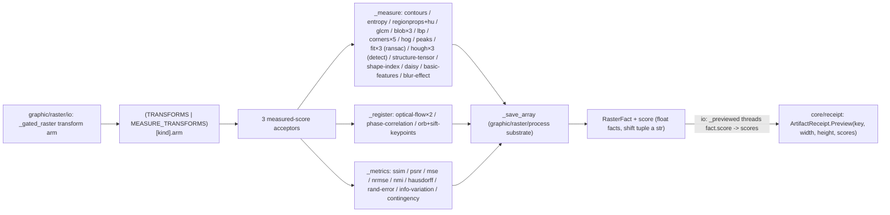

# [PY_ARTIFACTS_GRAPHIC_RASTER_MEASURE]

The scikit-image measurement owner. The `Transform` measured-score half is ONE engine over the three families that PRODUCE a scalar or measurement rather than a transformed raster — `_measure` (marching-squares contours, Shannon entropy, `regionprops` morphometry plus the seven rotation/scale-invariant Hu moments, GLCM Haralick texture, LoG/DoG/DoH blobs, LBP texture render, the member-derived Harris/Shi-Tomasi/FAST/Moravec/Kitchen-Rosenfeld corner-response family, HOG gradient render, `peak_local_max` peak counts, the member-derived `measure.ransac` circle/ellipse/line geometric-fit residual+inlier family, the `hough_line`/`hough_circle`/`probabilistic_hough_line` DETECTION family distinct from that FIT family, the `structure_tensor`/`shape_index` tensor renders, the `daisy`/`multiscale_basic_features` dense descriptors, and the no-reference `blur_effect` sharpness scalar), `_register` (TV-L1 and iterative-Lucas-Kanade optical-flow magnitude, sub-pixel phase correlation, the member-derived ORB/SIFT keypoint-match registration family), and `_metrics` (the SSIM/PSNR/MSE/NRMSE/NMI/Hausdorff intensity-quality scalars plus the adapted-Rand-error, variation-of-information, and `contingency_table` label-map segmentation metrics) — contributed to the merged dispatch as the `MEASURE_TRANSFORMS` `frozendict` over the worker band. The shared transform substrate `graphic/raster/process#PROCESS` owns — the `TransformInput`/`TransformArm` structs and the `_save_array`/`_luminance`/`_channels` helpers — is imported, never re-declared. The `Raster`/`RasterOp` owner, the `Transform` `StrEnum`, and the `_gated_raster` dispatcher live on `graphic/raster/io#IO`, which composes the full dispatch as `TRANSFORMS | MEASURE_TRANSFORMS`. Each acceptor folds one typed `RasterFact` stamping its measurement onto the `RasterFact.score` map keyed by the family fact name or the `Transform.value` — every numeric measurement a native `float` and only the structural shift tuple a `str`, so the perceptual band reaches the receipt as numbers, not formatted strings — threaded into `core/receipt#RECEIPT` `ArtifactReceipt.Preview(key, width, height, scores)` whose `scores` band the receipt's `_facts` arm flattens. scikit-image is a host-native worker package, so every acceptor runs inside the `faults`-owned `to_process.run_sync` worker worker importing `skimage` at boundary scope, never on the runtime owner.

## [01]-[INDEX]

- [01]-[MEASURE]: scikit-image measurement owner over the three measured-score families — the `MEASURE_TRANSFORMS` `frozendict` folding the twenty-seven measure/feature rows (contours/entropy/regionprops/glcm/blob×3/lbp/corners×5/hog/peaks/fit×3/hough×3/structure-tensor/shape-index/daisy/basic-features/blur-effect/profile-line), six registration rows (optical-flow×2/phase-correlation/orb+sift-keypoints/censure+brief-keypoints), and nine metrics rows (SSIM/PSNR/MSE/NRMSE/NMI/Hausdorff/rand-error/info-variation/contingency) into three acceptors (`_measure`/`_register`/`_metrics`), the same-signature detector families reading their own `TransformArm.member` through one `getattr(<submodule>, member)` (the blob trio, the five-member corner-response family, the flow pair, the ORB/SIFT keypoint-detector pair, AND the `measure.ransac` `CircleModel`/`EllipseModel`/`LineModelND` geometric-fit trio all member-derived, with the `CENSURE`+`BRIEF` detect-then-describe pair and the `profile_line` scan-line as their own sub-branches) so a sibling detector or model is one row not a new arm, composing the shared `TransformInput`/`TransformArm`/`_save_array`/`_luminance`/`_channels` substrate from `graphic/raster/process#PROCESS`, all dispatch-table-folded with zero parallel inline dispatch dict.

## [02]-[MEASURE]

- Owner: the scikit-image measurement engine producing a scalar or measurement, the measured-score half of the `Transform` sub-axis the `graphic/raster/io#IO` `Raster` owner dispatches; the `TransformArm` row (imported from `graphic/raster/process#PROCESS`, never re-declared) names the submodule `member` an acceptor resolves through one `getattr`, carries the acceptor `arm`, and threads the optional `kwargs` policy column merged under caller `opts` (`row.kwargs | tx.opts`) so every per-member default rides its row and no magic literal scatters into a body — `_metrics` reading `kwargs` for the `data_range` law (the SSIM `channel_axis` injected grayscale-safe through the imported `_channels`, last in the merge so a caller `opts` never overrides it, never a static `-1`), `_measure` reading it for the `CONTOURS` `level`, `LBP` `P`/`R`/`method`, `PEAKS`/`CORNERS`/`CORNERS_SHI_TOMASI` `min_distance`, and `FIT_CIRCLE`/`FIT_ELLIPSE`/`FIT_LINE` `measure.ransac` `min_samples`/`residual_threshold`/`max_trials`/`rng` defaults, and `_register` reading it for the `PHASE_CORRELATION` `upsample_factor` and the keypoint detector's constructor kwargs (`ORB` `n_keypoints`) — over the imported `TransformInput` `(image, kind, reference, mask, opts)` carrier, so the prior `tx.opts.get("min_distance", 5)`/`tx.opts.get("upsample_factor", 10)` body-magic defaults are deleted to row columns. `MEASURE_TRANSFORMS` is the one `frozendict[Transform, TransformArm]` this page declares, merged with the process-family `TRANSFORMS` at the `_gated_raster` lookup so every composed `Transform` member resolves beside the process-family rows; each acceptor folds one typed `RasterFact` stamping its measurement onto the `score` map. The collapse is `DERIVED_LOGIC`: every same-signature family reads `row.member` through one `getattr(<submodule>, member)`, so the blob trio (`blob_log`/`blob_dog`/`blob_doh`), the corner pair (`corner_harris`/`corner_shi_tomasi`), the flow pair (`optical_flow_tvl1`/`optical_flow_ilk`), the keypoint-detector pair (`ORB`/`SIFT`, each constructed `getattr(feature, member)(**row.kwargs)` then driving the uniform `detect_and_extract` -> `match_descriptors` pipeline), and the geometric-fit trio (`CircleModel`/`EllipseModel`/`LineModelND`, each `getattr(measure, member)` driving one `measure.ransac` over the `feature.canny` edge points to a residual+inlier fact) each route through one branch and a fourth member is one row, never a per-call sibling function and never a parallel metrics table beside the produced-raster engine.
- Cases: the three acceptors fold the forty-two measure-family `Transform` members — `_measure` (`CONTOURS` count, `ENTROPY` Shannon, `REGIONPROPS` region morphometry plus the seven `moments_hu` invariants, `GLCM` Haralick texture, `BLOB`/`BLOB_DOG`/`BLOB_DOH` LoG/DoG/DoH counts, `LBP` texture render, the member-derived `CORNERS`/`CORNERS_SHI_TOMASI`/`CORNERS_FAST`/`CORNERS_MORAVEC`/`CORNERS_KR` peak counts, `HOG` gradient render, `PEAKS` intensity local-maxima count, `FIT_CIRCLE`/`FIT_ELLIPSE`/`FIT_LINE` RANSAC residual+inlier fit, `HOUGH_LINE`/`HOUGH_CIRCLE`/`HOUGH_LINE_PROB` peak/segment-detection counts, `STRUCTURE_TENSOR`/`SHAPE_INDEX` tensor renders, `DAISY`/`BASIC_FEATURES` dense-descriptor renders, `BLUR_EFFECT` no-reference sharpness, `PROFILE_LINE` scan-line intensity profile — over the `feature`/`measure`/`transform` region+feature+fitting+Hough surface) · `_register` (`OPTICAL_FLOW`/`OPTICAL_FLOW_ILK` magnitude, `PHASE_CORRELATION` sub-pixel shift, `KEYPOINTS`/`SIFT_KEYPOINTS` ORB/SIFT detect-and-match counts and `CENSURE_KEYPOINTS` the CENSURE+BRIEF detect-then-describe count over `registration`/`feature`) · `_metrics` (`SSIM`/`PSNR`/`MSE`/`NRMSE`/`NMI` intensity-quality scalars, `HAUSDORFF` the canny-edge point-set distance, `RAND_ERROR`/`INFO_VARIATION` label-map segmentation metrics, `CONTINGENCY` the label-overlap sparse-count-matrix nnz+cardinality over the `metrics` surface) — each one `MEASURE_TRANSFORMS` row carrying its submodule member, acceptor, and optional kwargs, matched by the composed-table lookup the `graphic/raster/io#IO` dispatcher reads, never a sibling op per scikit-image call and never a hand-built dispatch dict.
- Auto: each acceptor re-dispatches only on the per-kind signature variance its submodule forces. `_measure` branches the count/scalar/render/table/fit return shapes — `CONTOURS` (`find_contours` count over the `level` row default), `ENTROPY` (`shannon_entropy` scalar), `REGIONPROPS` (`regionprops_table` morphometry over an Otsu-labelled mask, the per-property means folded into one `frozendict` union, never a mutable `dict` staged then spread), `GLCM` (`graycoprops` Haralick scalars over a `graycomatrix`), `LBP` (the raw `local_binary_pattern` code field handed straight to `_save_array`, which owns the display normalize, never a body `codes / codes.max()`), `HOG` (rendered gradient image over the grayscale-safe `_channels(image)` channel axis), `PEAKS` (`peak_local_max` intensity local-maxima count), `FIT_CIRCLE`/`FIT_ELLIPSE`/`FIT_LINE` (the `feature.canny` edge points fed to one `measure.ransac` over `getattr(measure, row.member)`, the `inliers`/`inlier_ratio`/`residual` read off the returned `(model, inliers)`, a `None` model collapsing to zero inliers and an `inf` residual rather than raising) — plus the DETECTION arms distinct from that FIT family: `HOUGH_LINE`/`HOUGH_CIRCLE` (`transform.hough_line`/`hough_circle` over the canny edges, `hough_line_peaks`/`hough_circle_peaks` counting the accumulator peaks, the circle radii built from the row `radius_min`/`radius_max`/`radius_step`/`peaks` defaults) and `HOUGH_LINE_PROB` (`probabilistic_hough_line` segment count over the row `threshold`/`line_length`/`line_gap`), the tensor renders `STRUCTURE_TENSOR` (the `Arr+Acc` trace over the row `sigma`) and `SHAPE_INDEX` (`np.nan_to_num` flattening the flat-region NaN), the dense-descriptor renders `DAISY` (the `visualize=True` two-tuple, the grid cardinality stamped) and `BASIC_FEATURES` (the `multiscale_basic_features` stack channel count), and the no-reference `BLUR_EFFECT` sharpness scalar — with the blob, five-member corner, and geometric-fit families reading `row.member` so the detector or model is the row not the arm. `_register` branches `PHASE_CORRELATION` (`phase_cross_correlation` shift+error over the `upsample_factor` row default) from the member-derived keypoint family `KEYPOINTS`/`SIFT_KEYPOINTS` (`getattr(feature, row.member)(**row.kwargs).detect_and_extract` -> `match_descriptors` cross-check counts) and the member-derived optical-flow magnitude over the reference luminance (the raw magnitude handed to `_save_array` for the render, never a body `magnitude / magnitude.max()`, while the raw `magnitude.mean()` is the `flow_mean` fact). `_metrics` branches `CONTINGENCY` (`metrics.contingency_table` over both Otsu-labelled maps, stamping the sparse-matrix `nnz` plus per-side label cardinality) ahead of the `_LABEL_METRICS` segmentation pair — labelling both inputs over Otsu and zipping the tuple result against `_LABEL_KEYS` under `strict=True` — and the `HAUSDORFF` binary point-set distance over the `feature.canny` edge maps of both luminances (the binary-image contract `hausdorff_distance` requires, never the raw-pixel `argwhere` a color operand collapses to 3-D coordinates) from the intensity scalars folding through one `getattr(metrics, row.member)(reference, image, **(row.kwargs | tx.opts | channel))`, where the SSIM `channel_axis` rides the `_channels(image)` injection placed last so `opts` overrides `data_range` but never the grayscale-safe axis, rather than a static `-1`. Every acceptor stamps its measurement onto the `RasterFact.score` map keyed by the family fact name or the `Transform.value`, every numeric fact a native `float` and only the structural shift tuple a `str`.
- Receipt: each acceptor folds into `RasterFact` through the imported `_save_array` and projects to `core/receipt#RECEIPT` `ArtifactReceipt.Preview(key, width, height, scores)` at the `graphic/raster/io#IO` rail boundary — `graphic/raster/io#IO` threads `fact.score` straight onto `Preview.scores: frozendict[str, float | str]` whose `_facts` arm flattens it (`{"width": width, "height": height, **scores}`), and the imported `graphic/raster/process#PROCESS` `_save_array(array, score)` already accepts `score: frozendict[str, float | str]`, so the receipt, io, AND substrate legs of the score-facts seam are all landed and the perceptual band reaches the structured log line as native numbers with no cross-file widening outstanding. The measurement scalars are the load-bearing facts: `_measure` the `contours`/`entropy`/`regions`-plus-morphometry/Haralick/`blobs`/`corners`/`peaks` floats and the `inliers`/`inlier_ratio`/`residual` geometric-fit floats, `_register` the `error`/`flow_mean`/`keypoints`/`matches` floats and the structural `shift` tuple as a `str`, `_metrics` the five `SSIM`/`PSNR`/`MSE`/`NRMSE`/`NMI` intensity-quality floats, the `HAUSDORFF` edge point-set distance, and the `rand_error`/`precision`/`recall`/`split_entropy`/`merge_entropy` segmentation floats. This page is the upstream producer of those numeric facts and stamps each as a native `float`, never re-stringifying a value the receipt reads as a number.
- Growth: a new measured-score scikit-image transform is one `Transform` member on `graphic/raster/io#IO` plus one `MEASURE_TRANSFORMS` row carrying its submodule `member`, acceptor, and optional `kwargs` — landing on the matching acceptor with zero new branch when the submodule signature is already mined (a fourth blob detector, a SIXTH corner response beside the realized Harris/Shi-Tomasi/FAST/Moravec/Kitchen-Rosenfeld, a third flow method, or a fourth RANSAC model beside the realized `CircleModel`/`EllipseModel`/`LineModelND` is one row the family branch reads through `row.member`); a measurement with a genuinely new return shape is one branch (a new label metric is one `_LABEL_KEYS` row plus one `_LABEL_METRICS` member). The Hough detection family, the `structure_tensor`/`shape_index` tensor renders, the `daisy`/`multiscale_basic_features` dense descriptors, the `contingency_table` label-overlap matrix, the FAST/Moravec/Kitchen-Rosenfeld corner responses, the `profile_line` scan-line measurement, and the `CENSURE`+`BRIEF` detect-then-describe registration pipeline this pass lands are all realized rows now, not growth prose. The two remaining `feature` adjacents stay documented growth for a real reason: `haar_like_feature`/`Cascade` (`.api` feature [18]) needs a trained cascade classifier the acceptor does not synthesize, and `fisher_vector`/`learn_gmm` (feature [19]) needs a fitted GMM — each an external-model input, not a one-image measurement, so each lands as one row only once its model input has a spelling. The shared `TransformInput`/`TransformArm`/`_save_array`/`_luminance`/`_channels` substrate grows on `graphic/raster/process#PROCESS`; zero new surface here.

```python signature
from io import BytesIO

import numpy as np

from builtins import frozendict

from artifacts.graphic.raster.io import RasterFact, Transform
from artifacts.graphic.raster.process import TransformArm, TransformInput, _channels, _luminance, _save_array

lazy from skimage import feature, filters, io as skio, measure, metrics, registration, transform, util

_MORPHOMETRY: tuple[str, ...] = ("area", "eccentricity", "solidity", "orientation", "perimeter", "euler_number", "extent", "axis_major_length", "axis_minor_length", "equivalent_diameter_area")
_HARALICK: tuple[str, ...] = ("contrast", "dissimilarity", "homogeneity", "energy", "correlation", "ASM")
_GLCM_DISTANCES: tuple[int, ...] = (1, 2)
_GLCM_ANGLES: tuple[float, ...] = (0.0, np.pi / 4, np.pi / 2, 3 * np.pi / 4)
_LABEL_METRICS: frozenset[Transform] = frozenset({Transform.RAND_ERROR, Transform.INFO_VARIATION})
_LABEL_KEYS: frozendict[Transform, tuple[str, ...]] = frozendict({
    Transform.RAND_ERROR: ("rand_error", "precision", "recall"),
    Transform.INFO_VARIATION: ("split_entropy", "merge_entropy"),
})


def _measure(tx: TransformInput) -> RasterFact:
    gray = _luminance(tx.image)
    row = MEASURE_TRANSFORMS[tx.kind]
    match tx.kind:
        case Transform.CONTOURS:
            contours = measure.find_contours(gray, **(row.kwargs | tx.opts))
            return _save_array(tx.image, frozendict({"contours": float(len(contours))}))
        case Transform.ENTROPY:
            return _save_array(tx.image, frozendict({"entropy": float(measure.shannon_entropy(tx.image))}))
        case Transform.REGIONPROPS:
            labels = measure.label(gray > filters.threshold_otsu(gray))
            table = measure.regionprops_table(labels, gray, properties=("label", *_MORPHOMETRY, "moments_hu"))
            count = int(table["label"].size)
            morph = frozendict({prop: float(np.asarray(table[prop]).mean()) for prop in _MORPHOMETRY}) if count else frozendict()
            hu = frozendict({key: float(np.asarray(table[key]).mean()) for key in table if key.startswith("moments_hu")}) if count else frozendict()  # the 7 rotation/scale-invariant Hu moments expand to moments_hu-0..6 columns (separator-robust prefix fold)
            return _save_array(tx.image, frozendict({"regions": float(count)}) | morph | hu)
        case Transform.GLCM:
            glcm = feature.graycomatrix(util.img_as_ubyte(gray), distances=list(_GLCM_DISTANCES), angles=list(_GLCM_ANGLES), levels=256, symmetric=True, normed=True)
            return _save_array(tx.image, frozendict({prop: float(feature.graycoprops(glcm, prop).mean()) for prop in _HARALICK}))
        case Transform.BLOB | Transform.BLOB_DOG | Transform.BLOB_DOH:
            return _save_array(tx.image, frozendict({"blobs": float(len(getattr(feature, row.member)(gray, **(row.kwargs | tx.opts))))}))
        case Transform.LBP:
            return _save_array(feature.local_binary_pattern(gray, **(row.kwargs | tx.opts)), frozendict())
        case Transform.HOG:
            _, render = feature.hog(tx.image, channel_axis=_channels(tx.image), visualize=True)
            return _save_array(render, frozendict())
        case Transform.PEAKS:
            return _save_array(tx.image, frozendict({"peaks": float(len(feature.peak_local_max(gray, **(row.kwargs | tx.opts))))}))
        case Transform.FIT_CIRCLE | Transform.FIT_ELLIPSE | Transform.FIT_LINE:
            points = np.column_stack(np.nonzero(feature.canny(gray)))
            model, inliers = measure.ransac(points, getattr(measure, row.member), **(row.kwargs | tx.opts))
            kept = int(inliers.sum()) if inliers is not None else 0
            residual = float(model.residuals(points[inliers]).mean()) if kept else float("inf")
            return _save_array(tx.image, frozendict({"inliers": float(kept), "inlier_ratio": kept / max(len(points), 1), "residual": residual}))
        case Transform.BLUR_EFFECT:  # the first NO-reference metric: sharpness from re-blur strength, no operand pair, so it rides _measure not _metrics
            return _save_array(tx.image, frozendict({"blur": float(measure.blur_effect(gray))}))
        case Transform.HOUGH_LINE:  # the DETECTION family (peaks over the accumulator) distinct from the RANSAC geometric FIT family above
            hspace, angles, dists = transform.hough_line(feature.canny(gray))
            _accum, peak_angles, _peak_dists = transform.hough_line_peaks(hspace, angles, dists)
            return _save_array(tx.image, frozendict({"lines": float(len(peak_angles))}))
        case Transform.HOUGH_LINE_PROB:
            segments = transform.probabilistic_hough_line(feature.canny(gray), **(row.kwargs | tx.opts))
            return _save_array(tx.image, frozendict({"segments": float(len(segments))}))
        case Transform.HOUGH_CIRCLE:
            opts = row.kwargs | tx.opts
            radii = np.arange(int(opts["radius_min"]), int(opts["radius_max"]), int(opts["radius_step"]))
            accums, *_centres_radii = transform.hough_circle_peaks(transform.hough_circle(feature.canny(gray), radii), radii, total_num_peaks=int(opts["peaks"]))
            return _save_array(tx.image, frozendict({"circles": float(len(accums))}))
        case Transform.STRUCTURE_TENSOR:  # the Arr+Acc trace coherence-energy render
            elems = feature.structure_tensor(gray, sigma=float((row.kwargs | tx.opts)["sigma"]), order="rc")
            trace = elems[0] + elems[-1]
            return _save_array(trace, frozendict({"tensor_energy": float(np.mean(trace))}))
        case Transform.SHAPE_INDEX:  # hessian-eigenvalue local shape classification render (NaN at flat regions -> 0)
            index = np.nan_to_num(feature.shape_index(gray))
            return _save_array(index, frozendict({"shape_index": float(index.mean())}))
        case Transform.DAISY:  # dense DAISY descriptor grid + its visualization render
            descs, render = feature.daisy(gray, visualize=True)
            return _save_array(render, frozendict({"descriptors": float(descs.shape[0] * descs.shape[1])}))
        case Transform.BASIC_FEATURES:  # the multiscale intensity/edge/texture feature stack (channel count stamped, first channel rendered)
            stack = feature.multiscale_basic_features(tx.image, channel_axis=_channels(tx.image))
            return _save_array(stack[..., 0], frozendict({"features": float(stack.shape[-1])}))
        case Transform.PROFILE_LINE:  # intensity profile along an opts-defined src->dst segment — the section-cut/line-profile scan measurement (AEC scan-line + publication figure)
            opts = row.kwargs | tx.opts
            profile = np.asarray(measure.profile_line(gray, (opts["src_row"], opts["src_col"]), (opts["dst_row"], opts["dst_col"]), linewidth=int(opts["linewidth"])), dtype=float)
            scan = frozendict({"profile_mean": float(profile.mean()), "profile_min": float(profile.min()), "profile_max": float(profile.max()), "profile_length": float(profile.size)}) if profile.size else frozendict({"profile_length": 0.0})
            return _save_array(tx.image, scan)
        case _:  # the member-derived corner-response family: corner_harris/shi_tomasi/fast/moravec/kitchen_rosenfeld all resolve through one getattr + corner_peaks
            peaks = feature.corner_peaks(getattr(feature, row.member)(gray), **(row.kwargs | tx.opts))
            return _save_array(tx.image, frozendict({"corners": float(len(peaks))}))


def _register(tx: TransformInput) -> RasterFact:
    moving, reference = _luminance(tx.image), _luminance(skio.imread(BytesIO(tx.reference)))
    row = MEASURE_TRANSFORMS[tx.kind]
    match tx.kind:
        case Transform.PHASE_CORRELATION:
            shift, error, _diff = registration.phase_cross_correlation(reference, moving, **(row.kwargs | tx.opts))
            return _save_array(tx.image, frozendict({"shift": str(tuple(shift)), "error": float(error)}))
        case Transform.KEYPOINTS | Transform.SIFT_KEYPOINTS:
            detector = getattr(feature, row.member)(**row.kwargs)
            detector.detect_and_extract(reference)
            anchor = detector.descriptors
            detector.detect_and_extract(moving)
            matches = feature.match_descriptors(anchor, detector.descriptors, cross_check=True)
            return _save_array(tx.image, frozendict({"keypoints": float(len(detector.keypoints)), "matches": float(len(matches))}))
        case Transform.CENSURE_KEYPOINTS:  # CENSURE detects keypoints, BRIEF describes them given those keypoints — the detect-then-describe pair distinct from ORB/SIFT's uniform detect_and_extract
            detector, extractor = getattr(feature, row.member)(**row.kwargs), feature.BRIEF()
            detector.detect(reference)
            extractor.extract(reference, detector.keypoints)
            anchor = extractor.descriptors
            detector.detect(moving)
            extractor.extract(moving, detector.keypoints)
            matches = feature.match_descriptors(anchor, extractor.descriptors, cross_check=True)
            return _save_array(tx.image, frozendict({"keypoints": float(len(detector.keypoints)), "matches": float(len(matches))}))
        case _:
            magnitude = np.linalg.norm(getattr(registration, row.member)(reference, moving, **(row.kwargs | tx.opts)), axis=0)
            return _save_array(magnitude, frozendict({"flow_mean": float(magnitude.mean())}))


def _metrics(tx: TransformInput) -> RasterFact:
    row = MEASURE_TRANSFORMS[tx.kind]
    reference = skio.imread(BytesIO(tx.reference))
    if tx.kind is Transform.CONTINGENCY:  # the label-overlap sparse count matrix over both Otsu-labelled maps — a segmentation deepen beside the rand-error/info-variation pair, stamping nnz + per-side label cardinality, not a scalar the _LABEL_KEYS zip carries
        ref_gray, test_gray = _luminance(reference), _luminance(tx.image)
        truth = measure.label(ref_gray > filters.threshold_otsu(ref_gray))
        test = measure.label(test_gray > filters.threshold_otsu(test_gray))
        overlap = metrics.contingency_table(truth, test)
        return _save_array(tx.image, frozendict({"overlap_nnz": float(overlap.nnz), "truth_labels": float(overlap.shape[0]), "test_labels": float(overlap.shape[1])}))
    if tx.kind in _LABEL_METRICS:
        ref_gray, test_gray = _luminance(reference), _luminance(tx.image)
        truth = measure.label(ref_gray > filters.threshold_otsu(ref_gray))
        test = measure.label(test_gray > filters.threshold_otsu(test_gray))
        scored = np.atleast_1d(getattr(metrics, row.member)(truth, test))
        return _save_array(tx.image, frozendict({key: float(value) for key, value in zip(_LABEL_KEYS[tx.kind], scored, strict=True)}))
    if tx.kind is Transform.HAUSDORFF:  # a binary point-set distance, not an intensity scalar: over the canny edge maps, never the raw 3-D pixel argwhere
        edges = feature.canny(_luminance(reference)), feature.canny(_luminance(tx.image))
        return _save_array(tx.image, frozendict({tx.kind.value: float(getattr(metrics, row.member)(*edges, **(row.kwargs | tx.opts)))}))
    channel = frozendict({"channel_axis": _channels(tx.image)}) if tx.kind is Transform.SSIM else frozendict()
    value = getattr(metrics, row.member)(reference, tx.image, **(row.kwargs | tx.opts | channel))
    return _save_array(tx.image, frozendict({tx.kind.value: float(value)}))


MEASURE_TRANSFORMS: frozendict[Transform, TransformArm] = frozendict({
    Transform.CONTOURS: TransformArm("find_contours", _measure, frozendict({"level": 0.5})),
    Transform.ENTROPY: TransformArm("shannon_entropy", _measure),
    Transform.REGIONPROPS: TransformArm("regionprops_table", _measure),
    Transform.GLCM: TransformArm("graycomatrix", _measure),
    Transform.HOG: TransformArm("hog", _measure),
    Transform.BLOB: TransformArm("blob_log", _measure),
    Transform.BLOB_DOG: TransformArm("blob_dog", _measure),
    Transform.BLOB_DOH: TransformArm("blob_doh", _measure),
    Transform.LBP: TransformArm("local_binary_pattern", _measure, frozendict({"P": 8, "R": 1.0, "method": "uniform"})),
    Transform.PEAKS: TransformArm("peak_local_max", _measure, frozendict({"min_distance": 5})),
    Transform.CORNERS: TransformArm("corner_harris", _measure, frozendict({"min_distance": 5})),
    Transform.CORNERS_SHI_TOMASI: TransformArm("corner_shi_tomasi", _measure, frozendict({"min_distance": 5})),
    Transform.FIT_CIRCLE: TransformArm("CircleModel", _measure, frozendict({"min_samples": 3, "residual_threshold": 2.0, "max_trials": 200, "rng": 0})),
    Transform.FIT_ELLIPSE: TransformArm("EllipseModel", _measure, frozendict({"min_samples": 5, "residual_threshold": 2.0, "max_trials": 200, "rng": 0})),
    Transform.FIT_LINE: TransformArm("LineModelND", _measure, frozendict({"min_samples": 2, "residual_threshold": 2.0, "max_trials": 200, "rng": 0})),
    Transform.OPTICAL_FLOW: TransformArm("optical_flow_tvl1", _register),
    Transform.OPTICAL_FLOW_ILK: TransformArm("optical_flow_ilk", _register),
    Transform.PHASE_CORRELATION: TransformArm("phase_cross_correlation", _register, frozendict({"upsample_factor": 10})),
    Transform.KEYPOINTS: TransformArm("ORB", _register, frozendict({"n_keypoints": 200})),
    Transform.SIFT_KEYPOINTS: TransformArm("SIFT", _register),
    Transform.SSIM: TransformArm("structural_similarity", _metrics, frozendict({"data_range": 255})),
    Transform.PSNR: TransformArm("peak_signal_noise_ratio", _metrics, frozendict({"data_range": 255})),
    Transform.MSE: TransformArm("mean_squared_error", _metrics),
    Transform.NRMSE: TransformArm("normalized_root_mse", _metrics),
    Transform.NMI: TransformArm("normalized_mutual_information", _metrics),
    Transform.HAUSDORFF: TransformArm("hausdorff_distance", _metrics),
    Transform.RAND_ERROR: TransformArm("adapted_rand_error", _metrics),
    Transform.INFO_VARIATION: TransformArm("variation_of_information", _metrics),
    Transform.CONTINGENCY: TransformArm("contingency_table", _metrics),
    Transform.BLUR_EFFECT: TransformArm("blur_effect", _measure),
    Transform.HOUGH_LINE: TransformArm("hough_line", _measure),
    Transform.HOUGH_CIRCLE: TransformArm("hough_circle", _measure, frozendict({"radius_min": 10, "radius_max": 100, "radius_step": 10, "peaks": 20})),
    Transform.HOUGH_LINE_PROB: TransformArm("probabilistic_hough_line", _measure, frozendict({"threshold": 10, "line_length": 50, "line_gap": 10})),
    Transform.STRUCTURE_TENSOR: TransformArm("structure_tensor", _measure, frozendict({"sigma": 1.0})),
    Transform.SHAPE_INDEX: TransformArm("shape_index", _measure),
    Transform.DAISY: TransformArm("daisy", _measure),
    Transform.BASIC_FEATURES: TransformArm("multiscale_basic_features", _measure),
    Transform.CORNERS_FAST: TransformArm("corner_fast", _measure, frozendict({"min_distance": 5})),
    Transform.CORNERS_MORAVEC: TransformArm("corner_moravec", _measure, frozendict({"min_distance": 5})),
    Transform.CORNERS_KR: TransformArm("corner_kitchen_rosenfeld", _measure, frozendict({"min_distance": 5})),
    Transform.PROFILE_LINE: TransformArm("profile_line", _measure, frozendict({"src_row": 0.0, "src_col": 0.0, "dst_row": 100.0, "dst_col": 100.0, "linewidth": 1})),
    Transform.CENSURE_KEYPOINTS: TransformArm("CENSURE", _register, frozendict({"min_scale": 1, "max_scale": 7})),
})
```

The scikit-image `Transform` measured-score engine is the egress-grade collapse over the three measurement families: a `TransformArm` row (imported from `graphic/raster/process#PROCESS`) names the submodule `member` the acceptor resolves through one `getattr`, carries the acceptor `arm`, and threads the optional `kwargs` policy column, the `MEASURE_TRANSFORMS` `frozendict` is keyed by the `Transform` value, and the `graphic/raster/io#IO` `_gated_raster` reads the merged `TRANSFORMS | MEASURE_TRANSFORMS` in one composed-table lookup. Three acceptors own the whole measured-score family with zero parallel inline dispatch dict: `_measure` folds the count/scalar/render/table/fit/detection shapes and reads `row.member` for the blob trio (`blob_log`/`blob_dog`/`blob_doh`), the five-member corner-response family (`corner_harris`/`corner_shi_tomasi`/`corner_fast`/`corner_moravec`/`corner_kitchen_rosenfeld` through one `corner_peaks`), and the geometric-fit trio (`CircleModel`/`EllipseModel`/`LineModelND` driving one `measure.ransac` over the `feature.canny` edge points to an `inliers`/`inlier_ratio`/`residual` fact) so a sibling detector or model is one row, and carries the explicit-return-shape arms the submodule signature forces — the Hough `hough_line`/`hough_circle`/`probabilistic_hough_line` DETECTION family (peaks over the accumulator, distinct from the RANSAC FIT family), the `structure_tensor`/`shape_index` tensor renders, the `daisy`/`multiscale_basic_features` dense-descriptor renders, the `blur_effect` no-reference sharpness scalar, and the `regionprops` seven-`moments_hu` invariant fold; `_register` folds phase correlation, the member-derived ORB/SIFT keypoint-detector pair (`getattr(feature, row.member)(**row.kwargs)` driving one `detect_and_extract` -> `match_descriptors` pipeline), and the member-derived optical-flow pair (`optical_flow_tvl1`/`optical_flow_ilk`); `_metrics` folds the five intensity-quality scalars through one `getattr(metrics, row.member)(reference, image, **(row.kwargs | tx.opts | channel))`, routes the `HAUSDORFF` binary point-set distance over the `feature.canny` edge maps of both luminances (the binary-image contract `hausdorff_distance` requires), branches the `CONTINGENCY` label-overlap sparse-count matrix (`nnz` + per-side cardinality), and partitions the `_LABEL_METRICS` segmentation pair (`adapted_rand_error`/`variation_of_information`) labelling both inputs and zipping the tuple result against `_LABEL_KEYS` under `strict=True`. The `CONTOURS` `level`, `LBP` `P`/`R`/`method`, `PEAKS`/`CORNERS`/`CORNERS_SHI_TOMASI`/`CORNERS_FAST`/`CORNERS_MORAVEC`/`CORNERS_KR` `min_distance`, `FIT_*` `min_samples`/`residual_threshold`/`max_trials`/`rng`, `HOUGH_CIRCLE` `radius_min`/`radius_max`/`radius_step`/`peaks`, `HOUGH_LINE_PROB` `threshold`/`line_length`/`line_gap`, `STRUCTURE_TENSOR` `sigma`, `PHASE_CORRELATION` `upsample_factor`, `ORB` `n_keypoints`, and `SSIM`/`PSNR` `data_range` defaults ride the row's `kwargs` column merged under `tx.opts`, so a magic constant never inlines into an arm and the prior `tx.opts.get(..., magic)` body defaults are deleted; the SSIM `channel_axis` is the one per-image axis a static row cannot carry, injected grayscale-safe through `_channels(image)` last in the merge so `opts` overrides `data_range` but never the axis. Every numeric measurement leaves as a native `float` and only the structural `shift` tuple as a `str`, so the perceptual band crosses into the receipt unstringified. `MEASURE_TRANSFORMS` is the only table this page declares, contributed to the `graphic/raster/io#IO` `_gated_raster` union so all forty-two measure-family members resolve there beside the ninety-seven process-family members (one hundred thirty-nine total) with zero loss.



## [03]-[RESEARCH]

- [SCIKIT_TRANSFORM_SETTLED] [RESOLVED]: the three measured-score scikit-image families are fence code verified against the folder `.api` catalogue for `scikit-image`, every cited member now resolving in-catalog after the four prior marked deepens (`graycoprops`/`graycomatrix`, `ORB`/`SIFT` constructors, `feature.hog` visualize/tuple, the `CircleModel`/`EllipseModel`/`LineModelND` `params`/`residuals`) landed their signatures into the catalogue. The `feature` arms verify against `[03]-[ENTRYPOINTS]` feature rows — `canny` [01], `hog` [02], `blob_dog` [05], `blob_log` [06], `corner_harris` [07], `corner_peaks` [08], `peak_local_max` [09], `local_binary_pattern` [10], `graycomatrix`/`graycoprops` [11], `blob_doh` [13], `corner_shi_tomasi` [15], `match_descriptors` [04], and the keypoint-detector pair `ORB`/`SIFT` (feature `[PUBLIC_TYPE_SCOPE]` rows [02]/[01], entrypoint [14]/[03]); the `measure` arms against measurement rows `label` [01], `regionprops_table` [03], `find_contours` [04], `shannon_entropy` [08], `ransac` [06] over the `[PUBLIC_TYPE_SCOPE]` measure-fitting models `CircleModel`/`EllipseModel`/`LineModelND` [01]/[02]/[03]; the `registration` arms against `phase_cross_correlation` [01], `optical_flow_ilk` [02], `optical_flow_tvl1` [03]; the `metrics` arms against quality rows `structural_similarity` [01], `peak_signal_noise_ratio` [02], `hausdorff_distance` [03], `mean_squared_error` [04], `normalized_root_mse` [05], `normalized_mutual_information` [06], `adapted_rand_error` [07], `variation_of_information` [08]; `filters.threshold_otsu` against filtering row [04]; `color.rgb2gray`/`img_as_ubyte` through the imported `_luminance`/`_save_array` substrate. The twelve members this rebuild lands verify against the same catalogue: the Hough DETECTION family `transform.hough_line`/`hough_circle` (transform rows [07]/[08]) with `hough_line_peaks`/`hough_circle_peaks`/`probabilistic_hough_line` (row [11]); the tensor renders `feature.structure_tensor` (feature [12]) and `feature.shape_index` (feature [16], over `hessian_matrix`); the dense descriptors `feature.daisy`/`feature.multiscale_basic_features` (feature [17]); the label-overlap `metrics.contingency_table` (metrics [09]); and the member-derived corner responses `feature.corner_fast`/`corner_moravec`/`corner_kitchen_rosenfeld` (feature [15]) landing on the existing `corner_peaks` branch. The catalogue `[04]-[IMPLEMENTATION_LAW]` `channel_axis` law (integer-or-`None`, never inferred) is honoured by the imported `_channels(image)` on the HOG/DAISY/BASIC_FEATURES arms and the SSIM metric rather than a static `-1`, the metrics `data_range` law fixes `data_range=255` on the SSIM/PSNR rows, and the `MEASURE_TRANSFORMS` `frozendict` is the fold over the three acceptors with the blob/corner/flow/keypoint/fit families reading `row.member` through `getattr(<submodule>, member)`. The produced-raster families carry their own portion of this item on `graphic/raster/process#PROCESS`.
- [REGIONPROPS_MORPHOMETRY] [RESOLVED]: the `REGIONPROPS` arm labels an Otsu-binarized luminance through `measure.label` and reads `measure.regionprops_table(labels, gray, properties=("label", *_MORPHOMETRY, "moments_hu"))`, returning the `[04]-[IMPLEMENTATION_LAW]` "dict of equal-length arrays" the page reduces by `np.asarray(values).mean()` per property plus the region count off `table["label"].size`. The `_MORPHOMETRY` scalar set is deepened from six to ten (`area`/`eccentricity`/`solidity`/`orientation`/`perimeter`/`euler_number` plus `extent`/`axis_major_length`/`axis_minor_length`/`equivalent_diameter_area`) — the standard `regionprops` scalar morphometry surface — and the seven rotation/scale-invariant Hu moments ride the `"moments_hu"` property, which `regionprops_table` expands to `moments_hu-0..6` columns the arm folds by a separator-robust `key.startswith("moments_hu")` prefix match so the `-`-separator default is not assumed. The admitted `regionprops` PROPS vocabulary — the `_MORPHOMETRY` scalar names and the `moments_hu` property form — now lands in the `scikit-image` `.api` `[04]-[IMPLEMENTATION_LAW]` region-morphometry enumeration and the `regionprops_table` [03] row, so every property this arm reads resolves in-catalog.
- [GLCM_HARALICK] [RESOLVED]: the `GLCM` arm reads `feature.graycoprops(feature.graycomatrix(util.img_as_ubyte(gray), distances=list(_GLCM_DISTANCES), angles=list(_GLCM_ANGLES), levels=256, symmetric=True, normed=True), prop).mean()` over the `_HARALICK` prop tuple. The folder `scikit-image` `.api` feature row [11] now carries the full `graycomatrix(image, distances, angles, levels=None, symmetric=False, normed=False)` signature and the `graycoprops(P, prop)` literal set (`contrast`/`dissimilarity`/`homogeneity`/`ASM`/`energy`/`correlation` plus the 0.25-added `mean`/`variance`/`std`/`entropy`), so every `_HARALICK` prop string and the `symmetric`/`normed`/`levels` kwargs resolve in-catalog and the `img_as_ubyte` admission satisfies the catalogued integer-only `graycomatrix` contract (which rejects float operands). The marked deepen is closed — no `prop` string or kwarg the arm names is uncatalogued.
- [ORB_KEYPOINTS] [RESOLVED]: the keypoint arm is member-derived over `KEYPOINTS`/`SIFT_KEYPOINTS` — `getattr(feature, row.member)(**row.kwargs)` constructs the detector (`ORB` carrying `n_keypoints` on its row, `SIFT` carrying none), runs `detector.detect_and_extract(image)` over the reference and moving luminance, reads `detector.keypoints`/`detector.descriptors`, and folds `feature.match_descriptors(anchor, detector.descriptors, cross_check=True)` into the keypoint/match counts. The folder `scikit-image` `.api` feature row [14] now carries the `ORB(downscale, n_scales, n_keypoints, fast_n, fast_threshold, harris_k)` and (row [03]) the full `SIFT(upsampling, n_octaves, n_scales, sigma_min, sigma_in, c_dog, c_edge, n_bins, lambda_ori, c_max, lambda_descr, n_hist, n_ori)` constructor signatures, so `ORB(n_keypoints=200)` and the bare `SIFT()` both resolve in-catalog. The `[04]-[IMPLEMENTATION_LAW]` feature-pipeline law now splits the uniform `SIFT`/`ORB` `detect_and_extract` sequence from the `CENSURE`/`BRIEF` detect-then-describe pair, so the landed `CENSURE_KEYPOINTS` sub-branch (`CENSURE().detect(image)` -> `.keypoints`, then `BRIEF().extract(image, keypoints)` -> `.descriptors`) reads its own catalogued path rather than the `detect_and_extract` uniform. Marked deepen closed.
- [HOG_VISUALIZE] [RESOLVED]: the `feature.hog(image, channel_axis=_channels(image), visualize=True)` HOG-render spelling the `_measure` acceptor destructures resolves in-catalog — the folder `scikit-image` `.api` feature row [02] now carries `hog(image, orientations=9, pixels_per_cell=(8,8), cells_per_block=(3,3), block_norm='L2-Hys', visualize=False, transform_sqrt=False, feature_vector=True, *, channel_axis=None)` and states that `visualize=True` returns the `(descriptor, hog_image)` two-tuple whose second element is the render, so the `_, render = feature.hog(...)` destructure reads the catalogued tuple return. The grayscale-safe `_channels(image)` (resolving `channel_axis=None` on a 2-D operand) replaces the prior hardcoded `channel_axis=-1`, honouring the catalogued integer-or-`None` channel-axis law. Marked deepen closed.
- [GEOMETRIC_FIT] [RESOLVED]: the `FIT_CIRCLE`/`FIT_ELLIPSE`/`FIT_LINE` geometric-fit family and the `PEAKS` count close the largest measured-score capability gap the prior surface left — robust geometric model fitting and generic intensity-peak detection, both one-image measurements the `_measure` acceptor owns. The fit family is member-derived: `getattr(measure, row.member)` resolves the `CircleModel`/`EllipseModel`/`LineModelND` model class (catalogue `[02]-[PUBLIC_TYPES]` measure-fitting rows [01]/[02]/[03], now carrying each model's `params` tuple — circle `(xc, yc, r)`, ellipse `(xc, yc, a, b, theta)`, line `(origin, direction)` — plus `residuals(data)` and the 0.26 `from_estimate(data)` classmethod), `np.column_stack(np.nonzero(feature.canny(gray)))` extracts the `(N, 2)` edge points, and one `measure.ransac(points, ModelClass, **(row.kwargs | tx.opts))` (catalogue measure entrypoint [06]) returns the `(model, inliers)` pair the arm reads into `inliers`/`inlier_ratio`/`residual` floats through the catalogued `model.residuals(data)`, a `None` model collapsing to zero inliers and an `inf` residual rather than raising. The `[04]-[IMPLEMENTATION_LAW]` RANSAC law now records that 0.26 replaces the deprecated `estimate` with `from_estimate` and deprecates no-arg construction, but `ransac` still accepts the model class and instantiates it internally — so `measure.ransac(points, CircleModel, ...)` is the current form the arm uses and needs no change. The per-model `min_samples` (3/5/2) and the shared `residual_threshold`/`max_trials`/`rng=0` determinism seed ride each row's `kwargs`, so a fourth model is one row. The `PEAKS` count reads `feature.peak_local_max(gray, **(row.kwargs | tx.opts))` (catalogue feature [09]) over the `min_distance` row default, distinct from the corner-response peak family. Justified on PACKAGE (the `ransac`/fitting-model and `peak_local_max` admitted surface had no spelling here) and DOMAIN (a measurement owner owns the geometric-fit residual/inlier and peak-count family). Marked deepen closed — the model `params`/`residuals` signatures now resolve in-catalog.
- [DETECTION_AND_DESCRIPTORS] [RESOLVED]: the twelve members this rebuild lands close every growth axis the prior surface only NAMED. The Hough DETECTION family (`HOUGH_LINE`/`HOUGH_CIRCLE`/`HOUGH_LINE_PROB`) is genuinely distinct from the RANSAC geometric FIT family — a `transform.hough_line`/`hough_circle` accumulator over the `feature.canny` edges peaked by `hough_line_peaks`/`hough_circle_peaks` (the circle radii built from the row `radius_min`/`radius_max`/`radius_step`), or a `probabilistic_hough_line` segment list — each a one-image detection COUNT the `_measure` acceptor owns beside the FIT residual/inlier fact; verified against transform rows [07]/[08]/[11]. The `STRUCTURE_TENSOR` (Arr+Acc trace) and `SHAPE_INDEX` (`np.nan_to_num` over the flat-region NaN) tensor renders (feature [12]/[16]) and the `DAISY` (`visualize=True` two-tuple) / `BASIC_FEATURES` (`multiscale_basic_features` stack channel count) dense descriptors (feature [17]) are render/count arms folding through `_save_array`. `CONTINGENCY` (`metrics.contingency_table`, metrics [09]) is the label-overlap segmentation deepen beside the `_LABEL_METRICS` pair, stamping the sparse-matrix `nnz` + per-side label cardinality rather than a scalar. The three FAST/Moravec/Kitchen-Rosenfeld corner responses (feature [15]) land on the existing member-derived `corner_peaks` branch with ZERO new arm. Justified on PACKAGE (each admitted `.api` member had no spelling here) and DOMAIN (the detection/tensor/descriptor/no-reference families the concept demands). The `measure.blur_effect` no-reference sharpness scalar and the `regionprops` `moments_hu` property — formerly the two members absent from the `scikit-image` `.api` rows — now land in the catalogue (`blur_effect` the region-measurement [09] row plus the `[04]` no-reference-quality line, `moments_hu` the `regionprops_table` [03] row plus the `[04]` region-morphometry line), and the `transform.hough_*`/`feature.structure_tensor`/`shape_index`/`daisy`/`multiscale_basic_features`/`corner_fast`/`corner_moravec`/`corner_kitchen_rosenfeld`/`metrics.contingency_table` rows were already present — so every member this arm cites resolves in-catalog.
- [SCAN_AND_CENSURE] [RESOLVED]: two named growth axes land as real rows. `PROFILE_LINE` is a one-image `_measure` scan-line: `measure.profile_line(gray, (src_row, src_col), (dst_row, dst_col), linewidth=...)` (folder `.api` measure entrypoint [10]) samples the intensity profile along an opts-defined segment and returns the 1-D profile array the arm reduces to `profile_mean`/`profile_min`/`profile_max`/`profile_length` scalar facts (a zero-length degenerate segment stamping only `profile_length=0`) — the section-cut / line-profile measurement an AEC scan-line analysis and a publication line-profile figure both need, distinct from the `metrics` operand pair. `CENSURE_KEYPOINTS` is a `_register` detect-then-describe sub-branch: `getattr(feature, row.member)(**row.kwargs)` builds the `CENSURE` detector (`.api` feature [14], the center-surround keypoint detector), `CENSURE.detect(frame)` fills `.keypoints`, `feature.BRIEF().extract(frame, detector.keypoints)` fills `.descriptors`, and `feature.match_descriptors(anchor, descriptors, cross_check=True)` counts the cross-checked matches over the reference/moving luminance pair — the two-stage pipeline distinct from ORB/SIFT's uniform `detect_and_extract` (CENSURE emits no descriptors, BRIEF describes given keypoints), so it lands as its own sub-branch not a member row, and rides `_REFERENCE_REQUIRED` on `graphic/raster/io#IO` as a reference-consuming registration. Justified on PACKAGE (both were unused verified members) and DOMAIN (a measurement owner owns the scan-line profile and an alternative keypoint-registration pipeline).
- [MEASURE_SCORE_FACTS] [RESOLVED]: the receipt, io, AND substrate legs of the `graphic/raster/measure -> core/receipt#RECEIPT` `[SCORE_FACTS]` seam are all LANDED — `core/receipt#RECEIPT` `ArtifactReceipt.Preview` carries `scores: frozendict[str, float | str] = frozendict()` flattened by its `_facts` arm (`{"width": width, "height": height, **scores}`), `graphic/raster/io#IO` `_previewed(op, fact)` threads `fact.score` straight onto `Preview(scores=...)` over the widened `RasterFact.score: frozendict[str, float | str]`, and the imported `graphic/raster/process#PROCESS` `_save_array(array, score)` already accepts `score: frozendict[str, float | str]` (settled there as `[SCORE_NATIVE]` over the `NDArray[np.floating | np.integer | np.bool_]` operand), so the perceptual band reaches the structured log line as native `float` with no cross-file widening outstanding. This page therefore stamps each numeric measurement as a `float` (only the structural `shift` tuple as a `str`), never a formatted string, and never re-stringifies a value the receipt reads as a number.
- [MEASURE_SUBSTRATE] [RESOLVED]: this page composes the shared transform substrate `graphic/raster/process#PROCESS` owns — `TransformInput`/`TransformArm` and `_save_array`/`_luminance`/`_channels` are imported (`from artifacts.graphic.raster.process import TransformArm, TransformInput, _channels, _luminance, _save_array`) and never re-declared, so the produced-raster and measured-score acceptors fold one `TransformInput` carrier, one `TransformArm` row shape, one `_save_array` re-encode path, and one grayscale-safe `_channels` channel-axis resolver. This page declares only `MEASURE_TRANSFORMS: frozendict[Transform, TransformArm]` of its forty-two measure-family rows; the base `TRANSFORMS` process-family rows live on `graphic/raster/process#PROCESS`, and the `graphic/raster/io#IO` `_gated_raster` composes the merged `TRANSFORMS | MEASURE_TRANSFORMS` dispatch so every composed `Transform` member resolves with each landing in exactly one page's rows. `RasterFact`/`Transform` are imported from `graphic/raster/io#IO` and never re-declared, so the worker owner's value object and vocabulary stay single-sourced.
- [MEASURE_ENUM_RIPPLE] [RESOLVED]: the twelve measure-family members this rebuild adds — `HOUGH_LINE`/`HOUGH_CIRCLE`/`HOUGH_LINE_PROB`/`STRUCTURE_TENSOR`/`SHAPE_INDEX`/`DAISY`/`BASIC_FEATURES`/`CORNERS_FAST`/`CORNERS_MORAVEC`/`CORNERS_KR`/`BLUR_EFFECT`/`CONTINGENCY` — are landed on the `graphic/raster/io#IO` `Transform` `StrEnum` (the single vocabulary owner, kebab value form `"hough-line"`/`"hough-circle"`/`"hough-line-prob"`/`"structure-tensor"`/`"shape-index"`/`"daisy"`/`"basic-features"`/`"corners-fast"`/`"corners-moravec"`/`"corners-kitchen-rosenfeld"`/`"blur-effect"`/`"contingency"`), and the single reference-consuming addition (`CONTINGENCY`, a label-overlap metric over both maps) sits on its `_REFERENCE_REQUIRED` frozenset beside the settled `RAND_ERROR`/`INFO_VARIATION` (the Hough/tensor/descriptor/corner/blur measurements are one-image and consume no reference). The `Transform` vocabulary now carries all one hundred thirty-nine members — ninety-seven process-family rows plus these forty-two measure-family rows — so the composed `TRANSFORMS | MEASURE_TRANSFORMS` dispatch resolves one hundred thirty-nine, the dispatch-count prose on `graphic/raster/io#IO` and `graphic/raster/process#PROCESS` both already read one hundred thirty-nine (the ninety-seven process-family rows plus these forty-two measure-family rows), so the three-page dispatch count is reconciled with zero cross-file drift.
