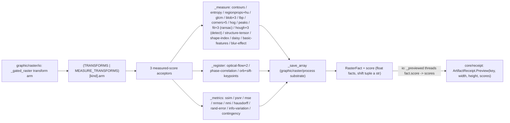

# [PY_ARTIFACTS_GRAPHIC_RASTER_MEASURE]

The scikit-image measurement owner — the measured-score half of the `Transform` sub-axis, ONE engine over the three families that PRODUCE a scalar or measurement rather than a transformed raster: `_measure` (contours, entropy, `regionprops` morphometry with the Hu moments, GLCM texture, blobs, LBP, the corner-response family, HOG, peaks, the RANSAC circle/ellipse/line fits, the Hough detection family distinct from that fit family, structure-tensor/shape-index renders, dense descriptors, the no-reference `blur_effect`), `_register` (optical-flow magnitude, phase correlation, the ORB/SIFT/CENSURE keypoint-match family), and `_metrics` (SSIM/PSNR/MSE/NRMSE/NMI intensity-quality scalars plus the adapted-Rand/variation-of-information/`contingency_table` label-map metrics). Each acceptor folds one typed `RasterFact` stamping its measurement onto the `score` map — every numeric fact a native `float` and only the structural shift tuple a `str`, so the perceptual band reaches the receipt as numbers.

The shared transform substrate `graphic/raster/process#PROCESS` owns — the `TransformInput`/`TransformArm` structs and `_save_array`/`_luminance`/`_channels` — is imported, never re-declared; the `Raster`/`RasterOp` owner and the `Transform` enum live on `graphic/raster/io#IO`, which composes the full dispatch as `TRANSFORMS | MEASURE_TRANSFORMS`. This page contributes only the `MEASURE_TRANSFORMS` `frozendict`, and every same-signature family reads `row.member` through one `getattr(<submodule>, member)` so a sibling detector or model is one row. scikit-image is a host-native worker package, so every acceptor runs inside io's runtime process-lane worker, never on the runtime owner.

## [01]-[INDEX]

- [01]-[MEASURE]: the scikit-image measurement owner over the three measured-score families — the `MEASURE_TRANSFORMS` `frozendict` folding the measure/feature, registration, and metrics rows into three acceptors (`_measure`/`_register`/`_metrics`), each same-signature family reading its `member` through one `getattr`, composing the `TransformInput`/`TransformArm`/`_save_array`/`_luminance`/`_channels` substrate from `graphic/raster/process#PROCESS`.

## [02]-[MEASURE]

- Owner: the scikit-image measurement engine producing a scalar or measurement, the measured-score half of the `Transform` sub-axis the `graphic/raster/io#IO` `Raster` owner dispatches. The `TransformArm` row (imported from `graphic/raster/process#PROCESS`, never re-declared) names the submodule `member` an acceptor resolves through one `getattr`, carries the acceptor `arm`, and threads the `kwargs` policy column merged under caller `opts` (`row.kwargs | tx.opts`) so no magic literal scatters into a body — `_metrics` reads it for the SSIM/PSNR `data_range`, `_measure` for the `CONTOURS` `level`/`LBP`/`PEAKS`/`CORNERS`/`FIT_*` defaults, `_register` for the `PHASE_CORRELATION` `upsample_factor` and the detector constructor kwargs. `MEASURE_TRANSFORMS` is the one `frozendict[Transform, TransformArm]` this page declares, merged with `TRANSFORMS` at the `_gated_raster` lookup so every composed member resolves. The collapse is `DERIVED_LOGIC`: every same-signature family reads `row.member` through one `getattr(<submodule>, member)` — the blob trio, the corner pair, the flow pair, the ORB/SIFT keypoint pair (each driving the uniform `detect_and_extract` -> `match_descriptors` pipeline), and the `CircleModel`/`EllipseModel`/`LineModelND` fit trio (each driving one `measure.ransac` over the `feature.canny` edge points to a residual+inlier fact) — so a fourth member is one row, never a per-call sibling.
- Cases: the three acceptors fold the measure-family members — `_measure` (contours/entropy/regionprops+Hu/glcm/blobs/lbp/corners/hog/peaks/RANSAC fits/Hough detection/structure-tensor/shape-index/daisy/basic-features/blur-effect/profile-line over the `feature`/`measure`/`transform` surface), `_register` (optical-flow magnitude, phase correlation, ORB/SIFT/CENSURE+BRIEF keypoint counts over `registration`/`feature`), `_metrics` (SSIM/PSNR/MSE/NRMSE/NMI scalars, the `HAUSDORFF` canny-edge point-set distance, the `RAND_ERROR`/`INFO_VARIATION` label-map metrics, the `CONTINGENCY` label-overlap matrix over the `metrics` surface) — each one `MEASURE_TRANSFORMS` row matched by the composed-table lookup, never a sibling op per scikit-image call.
- Auto: each acceptor re-dispatches only on the per-kind return-shape variance its submodule forces. `_measure` branches the count/scalar/render/table/fit/detection shapes — `REGIONPROPS` folds the per-property means and the seven `moments_hu` into one `frozendict` union (never a mutable `dict` staged then spread), `LBP` hands the raw code field to `_save_array` for the display normalize (never a body `codes / codes.max()`), the RANSAC fits read `inliers`/`inlier_ratio`/`residual` off the returned `(model, inliers)` (a `None` model collapsing to zero inliers and an `inf` residual rather than raising), the Hough DETECTION arms count accumulator peaks distinct from that fit family, and the blob/corner/fit families read `row.member` so the detector is the row. `_register` branches `PHASE_CORRELATION`, the member-derived keypoint family (`detect_and_extract` -> `match_descriptors` counts), and the optical-flow magnitude (the raw magnitude to `_save_array`, `magnitude.mean()` the `flow_mean` fact). `_metrics` branches `CONTINGENCY` and the `_LABEL_METRICS` pair (Otsu-labelling both inputs, zipping the tuple against `_LABEL_KEYS` under `strict=True`) ahead of the `HAUSDORFF` binary point-set distance over the canny edge maps (never the raw-pixel `argwhere` a color operand collapses to 3-D), the intensity scalars folding through one `getattr(metrics, row.member)(reference, image, **(row.kwargs | tx.opts | channel))` where the SSIM `channel_axis` rides the `_channels(image)` injection placed last so `opts` overrides `data_range` but never the axis. Every numeric fact leaves as a native `float`, only the structural shift tuple as a `str`.
- Receipt: each acceptor folds into `RasterFact` through the imported `_save_array` and projects to `core/receipt#RECEIPT` `ArtifactReceipt.Preview(key, width, height, scores)` at the `graphic/raster/io#IO` rail boundary, which threads `fact.score` straight onto `Preview.scores: frozendict[str, float | str]` whose `_facts` arm flattens it; the receipt, io, and substrate legs of the score-facts seam are landed, so the perceptual band reaches the structured log as native numbers with no widening outstanding. This page is the upstream producer of those numeric facts and stamps each as a native `float`, never re-stringifying a value the receipt reads as a number.
- Growth: a new measured-score transform is one `Transform` member on `graphic/raster/process#PROCESS` plus one `MEASURE_TRANSFORMS` row carrying its submodule `member`, acceptor, and `kwargs` — landing on the matching acceptor with zero new branch when the submodule signature is mined (a fourth blob detector, a sixth corner response, a third flow method, or a fourth RANSAC model is one row the family branch reads through `row.member`); a measurement with a genuinely new return shape is one branch (a new label metric is one `_LABEL_KEYS` row plus one `_LABEL_METRICS` member). The two remaining `feature` adjacents stay documented growth: `haar_like_feature`/`Cascade` needs a trained cascade classifier the acceptor does not synthesize, and `fisher_vector`/`learn_gmm` needs a fitted GMM — each an external-model input, so each lands as one row once its model input has a spelling. The shared substrate grows on `graphic/raster/process#PROCESS`; zero new surface here.
- Packages: `scikit-image` (`feature`/`filters`/`measure`/`metrics`/`registration`/`transform`/`util` at the members the rows name, census-gated on the cp315 wheel); `numpy` (the fact reductions); the `graphic/raster/process#PROCESS` substrate (`RasterFact`/`Transform`/`TransformArm`/`TransformInput`/`_channels`/`_luminance`/`_save_array`, imported never re-declared); stdlib `io`.
- Boundary: the shared `TransformInput`/`TransformArm`/`_save_array`/`_luminance`/`_channels` substrate and the `Transform` enum are `graphic/raster/process#PROCESS`'s; the `Raster`/`RasterOp` owner and the composed `TRANSFORMS | MEASURE_TRANSFORMS` lookup are `graphic/raster/io#IO`'s; the produced-raster families (a new pixel array, not a scalar) are process's — this page owns only the measured-score half.

```python signature
from io import BytesIO

import numpy as np


from artifacts.graphic.raster.process import RasterFact, Transform, TransformArm, TransformInput, _channels, _luminance, _save_array

lazy from skimage import feature, filters, io as skio, measure, metrics, registration, transform, util

_MORPHOMETRY: tuple[str, ...] = (
    "area",
    "eccentricity",
    "solidity",
    "orientation",
    "perimeter",
    "euler_number",
    "extent",
    "axis_major_length",
    "axis_minor_length",
    "equivalent_diameter_area",
)
_HARALICK: tuple[str, ...] = ("contrast", "dissimilarity", "homogeneity", "energy", "correlation", "ASM")
_GLCM_DISTANCES: tuple[int, ...] = (1, 2)
_GLCM_ANGLES: tuple[float, ...] = (0.0, np.pi / 4, np.pi / 2, 3 * np.pi / 4)
_LABEL_METRICS: frozenset[Transform] = frozenset({Transform.RAND_ERROR, Transform.INFO_VARIATION})
_LABEL_KEYS: frozendict[Transform, tuple[str, ...]] = frozendict({
    Transform.RAND_ERROR: ("rand_error", "precision", "recall"),
    Transform.INFO_VARIATION: ("split_entropy", "merge_entropy"),
})


def _measure(tx: TransformInput) -> RasterFact:
    gray = _luminance(tx.image)
    row = MEASURE_TRANSFORMS[tx.kind]
    match tx.kind:
        case Transform.CONTOURS:
            contours = measure.find_contours(gray, **(row.kwargs | tx.opts))
            return _save_array(tx.image, frozendict({"contours": float(len(contours))}))
        case Transform.ENTROPY:
            return _save_array(tx.image, frozendict({"entropy": float(measure.shannon_entropy(tx.image))}))
        case Transform.REGIONPROPS:
            labels = measure.label(gray > filters.threshold_otsu(gray))
            table = measure.regionprops_table(labels, gray, properties=("label", *_MORPHOMETRY, "moments_hu"))
            count = int(table["label"].size)
            morph = frozendict({prop: float(np.asarray(table[prop]).mean()) for prop in _MORPHOMETRY}) if count else frozendict()
            hu = (
                frozendict({key: float(np.asarray(table[key]).mean()) for key in table if key.startswith("moments_hu")}) if count else frozendict()
            )  # the 7 rotation/scale-invariant Hu moments expand to moments_hu-0..6 columns (separator-robust prefix fold)
            return _save_array(tx.image, frozendict({"regions": float(count)}) | morph | hu)
        case Transform.GLCM:
            glcm = feature.graycomatrix(
                util.img_as_ubyte(gray), distances=list(_GLCM_DISTANCES), angles=list(_GLCM_ANGLES), levels=256, symmetric=True, normed=True
            )
            return _save_array(tx.image, frozendict({prop: float(feature.graycoprops(glcm, prop).mean()) for prop in _HARALICK}))
        case Transform.BLOB | Transform.BLOB_DOG | Transform.BLOB_DOH:
            return _save_array(tx.image, frozendict({"blobs": float(len(getattr(feature, row.member)(gray, **(row.kwargs | tx.opts))))}))
        case Transform.LBP:
            return _save_array(feature.local_binary_pattern(gray, **(row.kwargs | tx.opts)), frozendict())
        case Transform.HOG:
            _, render = feature.hog(tx.image, channel_axis=_channels(tx.image), visualize=True)
            return _save_array(render, frozendict())
        case Transform.PEAKS:
            return _save_array(tx.image, frozendict({"peaks": float(len(feature.peak_local_max(gray, **(row.kwargs | tx.opts))))}))
        case Transform.FIT_CIRCLE | Transform.FIT_ELLIPSE | Transform.FIT_LINE:
            points = np.column_stack(np.nonzero(feature.canny(gray)))
            model, inliers = measure.ransac(points, getattr(measure, row.member), **(row.kwargs | tx.opts))
            kept = int(inliers.sum()) if inliers is not None else 0
            residual = float(model.residuals(points[inliers]).mean()) if kept else float("inf")
            return _save_array(tx.image, frozendict({"inliers": float(kept), "inlier_ratio": kept / max(len(points), 1), "residual": residual}))
        case (
            Transform.BLUR_EFFECT
        ):  # no-reference sharpness from re-blur strength, no operand pair, so it rides _measure
            return _save_array(tx.image, frozendict({"blur": float(measure.blur_effect(gray))}))
        case Transform.HOUGH_LINE:  # DETECTION family (accumulator peaks) distinct from the RANSAC FIT family
            hspace, angles, dists = transform.hough_line(feature.canny(gray))
            _accum, peak_angles, _peak_dists = transform.hough_line_peaks(hspace, angles, dists)
            return _save_array(tx.image, frozendict({"lines": float(len(peak_angles))}))
        case Transform.HOUGH_LINE_PROB:
            segments = transform.probabilistic_hough_line(feature.canny(gray), **(row.kwargs | tx.opts))
            return _save_array(tx.image, frozendict({"segments": float(len(segments))}))
        case Transform.HOUGH_CIRCLE:
            opts = row.kwargs | tx.opts
            radii = np.arange(int(opts["radius_min"]), int(opts["radius_max"]), int(opts["radius_step"]))
            accums, *_centres_radii = transform.hough_circle_peaks(
                transform.hough_circle(feature.canny(gray), radii), radii, total_num_peaks=int(opts["peaks"])
            )
            return _save_array(tx.image, frozendict({"circles": float(len(accums))}))
        case Transform.STRUCTURE_TENSOR:  # the Arr+Acc trace coherence-energy render
            elems = feature.structure_tensor(gray, sigma=float((row.kwargs | tx.opts)["sigma"]), order="rc")
            trace = elems[0] + elems[-1]
            return _save_array(trace, frozendict({"tensor_energy": float(np.mean(trace))}))
        case Transform.SHAPE_INDEX:  # hessian-eigenvalue local shape classification render (NaN at flat regions -> 0)
            index = np.nan_to_num(feature.shape_index(gray))
            return _save_array(index, frozendict({"shape_index": float(index.mean())}))
        case Transform.DAISY:  # dense DAISY descriptor grid + its visualization render
            descs, render = feature.daisy(gray, visualize=True)
            return _save_array(render, frozendict({"descriptors": float(descs.shape[0] * descs.shape[1])}))
        case Transform.BASIC_FEATURES:  # the multiscale intensity/edge/texture feature stack (channel count stamped, first channel rendered)
            stack = feature.multiscale_basic_features(tx.image, channel_axis=_channels(tx.image))
            return _save_array(stack[..., 0], frozendict({"features": float(stack.shape[-1])}))
        case Transform.PROFILE_LINE:  # intensity profile along an opts-defined src->dst segment — the section-cut/line-profile scan
            opts = row.kwargs | tx.opts
            profile = np.asarray(
                measure.profile_line(gray, (opts["src_row"], opts["src_col"]), (opts["dst_row"], opts["dst_col"]), linewidth=int(opts["linewidth"])),
                dtype=float,
            )
            scan = (
                frozendict({
                    "profile_mean": float(profile.mean()),
                    "profile_min": float(profile.min()),
                    "profile_max": float(profile.max()),
                    "profile_length": float(profile.size),
                })
                if profile.size
                else frozendict({"profile_length": 0.0})
            )
            return _save_array(tx.image, scan)
        case _:  # the member-derived corner-response family: corner_harris/shi_tomasi/fast/moravec/kitchen_rosenfeld all resolve through one getattr + corner_peaks
            peaks = feature.corner_peaks(getattr(feature, row.member)(gray), **(row.kwargs | tx.opts))
            return _save_array(tx.image, frozendict({"corners": float(len(peaks))}))


def _register(tx: TransformInput) -> RasterFact:
    moving, reference = _luminance(tx.image), _luminance(skio.imread(BytesIO(tx.reference)))
    row = MEASURE_TRANSFORMS[tx.kind]
    match tx.kind:
        case Transform.PHASE_CORRELATION:
            shift, error, _diff = registration.phase_cross_correlation(reference, moving, **(row.kwargs | tx.opts))
            return _save_array(tx.image, frozendict({"shift": str(tuple(shift)), "error": float(error)}))
        case Transform.KEYPOINTS | Transform.SIFT_KEYPOINTS:
            detector = getattr(feature, row.member)(**row.kwargs)
            detector.detect_and_extract(reference)
            anchor = detector.descriptors
            detector.detect_and_extract(moving)
            matches = feature.match_descriptors(anchor, detector.descriptors, cross_check=True)
            return _save_array(tx.image, frozendict({"keypoints": float(len(detector.keypoints)), "matches": float(len(matches))}))
        case Transform.CENSURE_KEYPOINTS:  # CENSURE detects, BRIEF describes given those keypoints — the detect-then-describe pair distinct from ORB/SIFT's detect_and_extract
            detector, extractor = getattr(feature, row.member)(**row.kwargs), feature.BRIEF()
            detector.detect(reference)
            extractor.extract(reference, detector.keypoints)
            anchor = extractor.descriptors
            detector.detect(moving)
            extractor.extract(moving, detector.keypoints)
            matches = feature.match_descriptors(anchor, extractor.descriptors, cross_check=True)
            return _save_array(tx.image, frozendict({"keypoints": float(len(detector.keypoints)), "matches": float(len(matches))}))
        case _:
            magnitude = np.linalg.norm(getattr(registration, row.member)(reference, moving, **(row.kwargs | tx.opts)), axis=0)
            return _save_array(magnitude, frozendict({"flow_mean": float(magnitude.mean())}))


def _metrics(tx: TransformInput) -> RasterFact:
    row = MEASURE_TRANSFORMS[tx.kind]
    reference = skio.imread(BytesIO(tx.reference))
    if (
        tx.kind is Transform.CONTINGENCY
    ):  # the label-overlap sparse count matrix over both Otsu-labelled maps, stamping nnz + per-side cardinality, not a scalar the _LABEL_KEYS zip carries
        ref_gray, test_gray = _luminance(reference), _luminance(tx.image)
        truth = measure.label(ref_gray > filters.threshold_otsu(ref_gray))
        test = measure.label(test_gray > filters.threshold_otsu(test_gray))
        overlap = metrics.contingency_table(truth, test)
        return _save_array(
            tx.image, frozendict({"overlap_nnz": float(overlap.nnz), "truth_labels": float(overlap.shape[0]), "test_labels": float(overlap.shape[1])})
        )
    if tx.kind in _LABEL_METRICS:
        ref_gray, test_gray = _luminance(reference), _luminance(tx.image)
        truth = measure.label(ref_gray > filters.threshold_otsu(ref_gray))
        test = measure.label(test_gray > filters.threshold_otsu(test_gray))
        scored = np.atleast_1d(getattr(metrics, row.member)(truth, test))
        return _save_array(tx.image, frozendict({key: float(value) for key, value in zip(_LABEL_KEYS[tx.kind], scored, strict=True)}))
    if (
        tx.kind is Transform.HAUSDORFF
    ):  # a binary point-set distance, not an intensity scalar: over the canny edge maps, never the raw 3-D pixel argwhere
        edges = feature.canny(_luminance(reference)), feature.canny(_luminance(tx.image))
        return _save_array(tx.image, frozendict({tx.kind.value: float(getattr(metrics, row.member)(*edges, **(row.kwargs | tx.opts)))}))
    channel = frozendict({"channel_axis": _channels(tx.image)}) if tx.kind is Transform.SSIM else frozendict()
    value = getattr(metrics, row.member)(reference, tx.image, **(row.kwargs | tx.opts | channel))
    return _save_array(tx.image, frozendict({tx.kind.value: float(value)}))


MEASURE_TRANSFORMS: frozendict[Transform, TransformArm] = frozendict({
    Transform.CONTOURS: TransformArm("find_contours", _measure, frozendict({"level": 0.5})),
    Transform.ENTROPY: TransformArm("shannon_entropy", _measure),
    Transform.REGIONPROPS: TransformArm("regionprops_table", _measure),
    Transform.GLCM: TransformArm("graycomatrix", _measure),
    Transform.HOG: TransformArm("hog", _measure),
    Transform.BLOB: TransformArm("blob_log", _measure),
    Transform.BLOB_DOG: TransformArm("blob_dog", _measure),
    Transform.BLOB_DOH: TransformArm("blob_doh", _measure),
    Transform.LBP: TransformArm("local_binary_pattern", _measure, frozendict({"P": 8, "R": 1.0, "method": "uniform"})),
    Transform.PEAKS: TransformArm("peak_local_max", _measure, frozendict({"min_distance": 5})),
    Transform.CORNERS: TransformArm("corner_harris", _measure, frozendict({"min_distance": 5})),
    Transform.CORNERS_SHI_TOMASI: TransformArm("corner_shi_tomasi", _measure, frozendict({"min_distance": 5})),
    Transform.FIT_CIRCLE: TransformArm(
        "CircleModel", _measure, frozendict({"min_samples": 3, "residual_threshold": 2.0, "max_trials": 200, "rng": 0})
    ),
    Transform.FIT_ELLIPSE: TransformArm(
        "EllipseModel", _measure, frozendict({"min_samples": 5, "residual_threshold": 2.0, "max_trials": 200, "rng": 0})
    ),
    Transform.FIT_LINE: TransformArm("LineModelND", _measure, frozendict({"min_samples": 2, "residual_threshold": 2.0, "max_trials": 200, "rng": 0})),
    Transform.OPTICAL_FLOW: TransformArm("optical_flow_tvl1", _register),
    Transform.OPTICAL_FLOW_ILK: TransformArm("optical_flow_ilk", _register),
    Transform.PHASE_CORRELATION: TransformArm("phase_cross_correlation", _register, frozendict({"upsample_factor": 10})),
    Transform.KEYPOINTS: TransformArm("ORB", _register, frozendict({"n_keypoints": 200})),
    Transform.SIFT_KEYPOINTS: TransformArm("SIFT", _register),
    Transform.SSIM: TransformArm("structural_similarity", _metrics, frozendict({"data_range": 255})),
    Transform.PSNR: TransformArm("peak_signal_noise_ratio", _metrics, frozendict({"data_range": 255})),
    Transform.MSE: TransformArm("mean_squared_error", _metrics),
    Transform.NRMSE: TransformArm("normalized_root_mse", _metrics),
    Transform.NMI: TransformArm("normalized_mutual_information", _metrics),
    Transform.HAUSDORFF: TransformArm("hausdorff_distance", _metrics),
    Transform.RAND_ERROR: TransformArm("adapted_rand_error", _metrics),
    Transform.INFO_VARIATION: TransformArm("variation_of_information", _metrics),
    Transform.CONTINGENCY: TransformArm("contingency_table", _metrics),
    Transform.BLUR_EFFECT: TransformArm("blur_effect", _measure),
    Transform.HOUGH_LINE: TransformArm("hough_line", _measure),
    Transform.HOUGH_CIRCLE: TransformArm("hough_circle", _measure, frozendict({"radius_min": 10, "radius_max": 100, "radius_step": 10, "peaks": 20})),
    Transform.HOUGH_LINE_PROB: TransformArm("probabilistic_hough_line", _measure, frozendict({"threshold": 10, "line_length": 50, "line_gap": 10})),
    Transform.STRUCTURE_TENSOR: TransformArm("structure_tensor", _measure, frozendict({"sigma": 1.0})),
    Transform.SHAPE_INDEX: TransformArm("shape_index", _measure),
    Transform.DAISY: TransformArm("daisy", _measure),
    Transform.BASIC_FEATURES: TransformArm("multiscale_basic_features", _measure),
    Transform.CORNERS_FAST: TransformArm("corner_fast", _measure, frozendict({"min_distance": 5})),
    Transform.CORNERS_MORAVEC: TransformArm("corner_moravec", _measure, frozendict({"min_distance": 5})),
    Transform.CORNERS_KR: TransformArm("corner_kitchen_rosenfeld", _measure, frozendict({"min_distance": 5})),
    Transform.PROFILE_LINE: TransformArm(
        "profile_line", _measure, frozendict({"src_row": 0.0, "src_col": 0.0, "dst_row": 100.0, "dst_col": 100.0, "linewidth": 1})
    ),
    Transform.CENSURE_KEYPOINTS: TransformArm("CENSURE", _register, frozendict({"min_scale": 1, "max_scale": 7})),
})
```



## [03]-[RESEARCH]

<!-- source-only: research row template:
[TOKEN]-[OPEN|BLOCKED]: <exact question>; <verification route>.
-->

(none)
