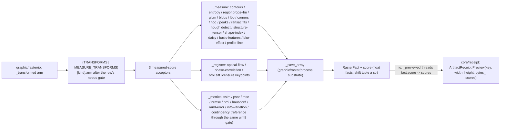

# [PY_ARTIFACTS_GRAPHIC_RASTER_MEASURE]

scikit-image measurement lives here as the measured-score half of `Transform`. `_measure` owns single-image scalar, table, render, fit, and detection facts; `_register` owns reference registration and feature matching; `_metrics` owns intensity, label-map, and point-set comparisons. Each acceptor folds one `RasterFact.score` band with native numeric values.

`graphic/raster/process#PROCESS` owns `Transform`, `TransformPolicy`, `TransformInput`, `TransformArm`, `TransformNeeds`, `RasterFact`, `_save_array`, `_luminance`, and `_channels`. This page contributes `MEASURE_TRANSFORMS` in the same container as `TRANSFORMS`; `graphic/raster/io#IO` composes both and constructs the required image or reference payload before dispatch. Same-signature families resolve `row.member` through one provider lookup.

## [01]-[INDEX]

- [01]-[MEASURE]: the scikit-image measurement owner over the three measured-score families — the `MEASURE_TRANSFORMS` `frozendict` folding the measure/feature, registration, and metrics rows into three acceptors (`_measure`/`_register`/`_metrics`), each same-signature family reading its `member` through one `getattr`, composing the `TransformInput`/`TransformArm`/`_save_array`/`_luminance`/`_channels` substrate from `graphic/raster/process#PROCESS`.

## [02]-[MEASURE]

- Owner: `MEASURE_TRANSFORMS` maps each measured `Transform` to one `TransformArm`. Rows declare `TransformNeeds.REFERENCE` where required and carry closed `TransformPolicy` seeds; `TransformArm.options` selects a complete typed override. `_LABEL_METRICS` derives from `_LABEL_KEYS`, and blob, corner, flow, keypoint, and geometric-fit families resolve their provider class or function from the row.
- Cases: the three acceptors fold the measure-family members — `_measure` (contours/entropy/regionprops+Hu/glcm/blobs/lbp/corners/hog/peaks/RANSAC fits/Hough detection/structure-tensor/shape-index/daisy/basic-features/blur-effect/profile-line over the `feature`/`measure`/`transform` surface), `_register` (optical-flow magnitude, phase correlation, ORB/SIFT/CENSURE+BRIEF keypoint counts over `registration`/`feature`), `_metrics` (SSIM/PSNR/MSE/NRMSE/NMI scalars, the `HAUSDORFF` canny-edge point-set distance, the `RAND_ERROR`/`INFO_VARIATION` label-map metrics, the `CONTINGENCY` label-overlap matrix over the `metrics` surface) — each one `MEASURE_TRANSFORMS` row matched by the composed-table lookup, never a sibling op per scikit-image call.
- Auto: each acceptor first matches the admitted `TransformInput` case, then resolves `row.options(policy)`. `_measure` total-dispatches count, scalar, render, table, fit, and detection result shapes; `_register` total-dispatches phase correlation, descriptor matching, and optical-flow magnitude; `_metrics` total-dispatches contingency, derived label metrics, edge-set Hausdorff distance, channel-aware SSIM, and intensity scalars. Provider overrides reach detector constructors and every function call through the same policy boundary.
- Receipt: each acceptor folds into `RasterFact` through the imported `_save_array` and projects to `core/receipt#RECEIPT` `ArtifactReceipt.Preview(key, width, height, bytes_, scores)` at the `graphic/raster/io#IO` rail boundary, which threads `fact.score` straight onto `Preview.scores: frozendict[str, float | str]` whose `_facts` arm flattens it under the `score.` namespace. This page is the upstream producer of those numeric facts and stamps each as a native `float`, never re-stringifying a value the receipt reads as a number.
- Growth: a measured operation adds one `Transform` member, one `MEASURE_TRANSFORMS` row, and one existing acceptor arm when its result shape already exists. New parameters extend `TransformPolicy`; new model payload timing extends the shared `TransformInput` owner before admission here.
- Packages: `scikit-image` (`feature`/`filters`/`measure`/`metrics`/`registration`/`transform`/`util` at the members the rows name, census-gated on the cp315 wheel); `numpy` (fact reductions); `graphic/raster/process#PROCESS` (`RasterFact`/`Transform`/`TransformPolicy`/`TransformArm`/`TransformInput`/`TransformNeeds`/`_channels`/`_luminance`/`_save_array`); stdlib `io`/`typing.Final`.
- Boundary: the shared `TransformInput`/`TransformArm`/`_save_array`/`_luminance`/`_channels` substrate, the `Transform` enum, and the `TransformNeeds` axis are `graphic/raster/process#PROCESS`'s; the `Raster`/`RasterOp` owner and the composed `TRANSFORMS | MEASURE_TRANSFORMS` lookup are `graphic/raster/io#IO`'s (`_transformed` executes the gate each row here declares); the produced-raster families (a new pixel array, not a scalar) are process's — this page owns only the measured-score half.

```python signature
from builtins import frozendict
from io import BytesIO
from typing import Final, assert_never

import numpy as np

from rasm.artifacts.graphic.raster.process import (
    RasterFact,
    Transform,
    TransformArm,
    TransformInput,
    TransformNeeds,
    TransformPolicy,
    _channels,
    _luminance,
    _save_array,
)

lazy from skimage import feature, filters, io as skio, measure, metrics, registration, transform, util

_MORPHOMETRY: Final[tuple[str, ...]] = (
    "area",
    "eccentricity",
    "solidity",
    "orientation",
    "perimeter",
    "euler_number",
    "extent",
    "axis_major_length",
    "axis_minor_length",
    "equivalent_diameter_area",
)
_HARALICK: Final[tuple[str, ...]] = ("contrast", "dissimilarity", "homogeneity", "energy", "correlation", "ASM")
_GLCM_DISTANCES: Final[tuple[int, ...]] = (1, 2)
_GLCM_ANGLES: Final[tuple[float, ...]] = (0.0, np.pi / 4, np.pi / 2, 3 * np.pi / 4)
_LABEL_KEYS: Final[frozendict[Transform, tuple[str, ...]]] = frozendict({
    Transform.RAND_ERROR: ("rand_error", "precision", "recall"),
    Transform.INFO_VARIATION: ("split_entropy", "merge_entropy"),
})
_LABEL_METRICS: Final[frozenset[Transform]] = frozenset(_LABEL_KEYS)


def _measure(tx: TransformInput) -> RasterFact:
    match tx:
        case TransformInput(tag="image", image=(image, kind, policy)):
            pass
        case _ as unreachable:
            assert_never(unreachable)
    gray = _luminance(image)
    row = MEASURE_TRANSFORMS[kind]
    opts = row.options(policy)
    match kind:
        case Transform.CONTOURS:
            contours = measure.find_contours(gray, **opts)
            return _save_array(image, frozendict({"contours": float(len(contours))}))
        case Transform.ENTROPY:
            return _save_array(image, frozendict({"entropy": float(measure.shannon_entropy(image))}))
        case Transform.REGIONPROPS:
            labels = measure.label(gray > filters.threshold_otsu(gray))
            table = measure.regionprops_table(labels, gray, properties=("label", *_MORPHOMETRY, "moments_hu"))
            count = int(table["label"].size)
            morph = frozendict({prop: float(np.asarray(table[prop]).mean()) for prop in _MORPHOMETRY}) if count else frozendict()
            hu = (
                frozendict({key: float(np.asarray(table[key]).mean()) for key in table if key.startswith("moments_hu")}) if count else frozendict()
            )  # the 7 rotation/scale-invariant Hu moments expand to moments_hu-0..6 columns (separator-robust prefix fold)
            return _save_array(image, frozendict({"regions": float(count)}) | morph | hu)
        case Transform.GLCM:
            glcm = feature.graycomatrix(util.img_as_ubyte(gray), **opts)
            return _save_array(image, frozendict({prop: float(feature.graycoprops(glcm, prop).mean()) for prop in _HARALICK}))
        case Transform.BLOB | Transform.BLOB_DOG | Transform.BLOB_DOH:
            return _save_array(image, frozendict({"blobs": float(len(getattr(feature, row.member)(gray, **opts)))}))
        case Transform.LBP:
            return _save_array(feature.local_binary_pattern(gray, **opts), frozendict())
        case Transform.HOG:
            _, render = feature.hog(image, channel_axis=_channels(image), visualize=True)
            return _save_array(render, frozendict())
        case Transform.PEAKS:
            return _save_array(image, frozendict({"peaks": float(len(feature.peak_local_max(gray, **opts)))}))
        case Transform.FIT_CIRCLE | Transform.FIT_ELLIPSE | Transform.FIT_LINE:
            points = np.column_stack(np.nonzero(feature.canny(gray)))
            if len(points) < int(opts["min_samples"]):  # an edge-starved frame cannot seat a model — the zero-fit fact, never a provider raise
                return _save_array(image, frozendict({"inliers": 0.0, "inlier_ratio": 0.0, "residual": float("inf")}))
            model, inliers = measure.ransac(points, getattr(measure, row.member), **opts)
            kept = int(inliers.sum()) if inliers is not None else 0
            residual = float(model.residuals(points[inliers]).mean()) if kept else float("inf")
            return _save_array(image, frozendict({"inliers": float(kept), "inlier_ratio": kept / max(len(points), 1), "residual": residual}))
        case Transform.BLUR_EFFECT:  # no-reference sharpness from re-blur strength, no operand pair, so it rides _measure
            return _save_array(image, frozendict({"blur": float(measure.blur_effect(gray))}))
        case Transform.HOUGH_LINE:  # DETECTION family (accumulator peaks) distinct from the RANSAC FIT family
            hspace, angles, dists = transform.hough_line(feature.canny(gray))
            _accum, peak_angles, _peak_dists = transform.hough_line_peaks(hspace, angles, dists)
            return _save_array(image, frozendict({"lines": float(len(peak_angles))}))
        case Transform.HOUGH_LINE_PROB:
            segments = transform.probabilistic_hough_line(feature.canny(gray), **opts)
            return _save_array(image, frozendict({"segments": float(len(segments))}))
        case Transform.HOUGH_CIRCLE:
            radii = np.arange(int(opts["radius_min"]), int(opts["radius_max"]), int(opts["radius_step"]))
            accums, *_centres_radii = transform.hough_circle_peaks(
                transform.hough_circle(feature.canny(gray), radii), radii, total_num_peaks=int(opts["peaks"])
            )
            return _save_array(image, frozendict({"circles": float(len(accums))}))
        case Transform.STRUCTURE_TENSOR:  # the Arr+Acc trace coherence-energy render
            elems = feature.structure_tensor(gray, sigma=float(opts["sigma"]), order="rc")
            trace = elems[0] + elems[-1]
            return _save_array(trace, frozendict({"tensor_energy": float(np.mean(trace))}))
        case Transform.SHAPE_INDEX:  # hessian-eigenvalue local shape classification render (NaN at flat regions -> 0)
            index = np.nan_to_num(feature.shape_index(gray))
            return _save_array(index, frozendict({"shape_index": float(index.mean())}))
        case Transform.DAISY:  # dense DAISY descriptor grid + its visualization render
            descs, render = feature.daisy(gray, visualize=True)
            return _save_array(render, frozendict({"descriptors": float(descs.shape[0] * descs.shape[1])}))
        case Transform.BASIC_FEATURES:  # the multiscale intensity/edge/texture feature stack (channel count stamped, first channel rendered)
            stack = feature.multiscale_basic_features(image, channel_axis=_channels(image))
            return _save_array(stack[..., 0], frozendict({"features": float(stack.shape[-1])}))
        case Transform.PROFILE_LINE:  # intensity profile along a row-declared src->dst segment — the section-cut/line-profile scan
            start = (max(0, min(int(opts["src_row"]), gray.shape[0] - 1)), max(0, min(int(opts["src_col"]), gray.shape[1] - 1)))
            end = (max(0, min(int(opts["dst_row"]), gray.shape[0] - 1)), max(0, min(int(opts["dst_col"]), gray.shape[1] - 1)))
            profile = np.asarray(
                measure.profile_line(gray, start, end, linewidth=int(opts["linewidth"])),
                dtype=float,
            )
            scan = (
                frozendict({
                    "profile_mean": float(profile.mean()),
                    "profile_min": float(profile.min()),
                    "profile_max": float(profile.max()),
                    "profile_length": float(profile.size),
                })
                if profile.size
                else frozendict({"profile_length": 0.0})
            )
            return _save_array(image, scan)
        case Transform.CORNERS | Transform.CORNERS_SHI_TOMASI | Transform.CORNERS_FAST | Transform.CORNERS_MORAVEC | Transform.CORNERS_KR:
            peaks = feature.corner_peaks(getattr(feature, row.member)(gray), **opts)
            return _save_array(image, frozendict({"corners": float(len(peaks))}))
        case _ as unreachable:
            assert_never(unreachable)


def _register(tx: TransformInput) -> RasterFact:
    match tx:
        case TransformInput(tag="reference", reference=(image, kind, encoded_reference, policy)):
            pass
        case _ as unreachable:
            assert_never(unreachable)
    moving, reference = _luminance(image), _luminance(skio.imread(BytesIO(encoded_reference)))
    row, opts = MEASURE_TRANSFORMS[kind], MEASURE_TRANSFORMS[kind].options(policy)
    match kind:
        case Transform.PHASE_CORRELATION:
            shift, error, _diff = registration.phase_cross_correlation(reference, moving, **opts)
            return _save_array(image, frozendict({"shift": str(tuple(shift)), "error": float(error)}))
        case Transform.KEYPOINTS | Transform.SIFT_KEYPOINTS:
            detector = getattr(feature, row.member)(**opts)
            detector.detect_and_extract(reference)
            anchor = detector.descriptors
            detector.detect_and_extract(moving)
            matches = feature.match_descriptors(anchor, detector.descriptors, cross_check=True)
            return _save_array(image, frozendict({"keypoints": float(len(detector.keypoints)), "matches": float(len(matches))}))
        case Transform.CENSURE_KEYPOINTS:  # CENSURE detects, BRIEF describes given those keypoints — the detect-then-describe pair distinct from ORB/SIFT's detect_and_extract
            detector, extractor = getattr(feature, row.member)(**opts), feature.BRIEF()
            detector.detect(reference)
            extractor.extract(reference, detector.keypoints)
            anchor = extractor.descriptors
            detector.detect(moving)
            extractor.extract(moving, detector.keypoints)
            matches = feature.match_descriptors(anchor, extractor.descriptors, cross_check=True)
            return _save_array(image, frozendict({"keypoints": float(len(detector.keypoints)), "matches": float(len(matches))}))
        case Transform.OPTICAL_FLOW | Transform.OPTICAL_FLOW_ILK:
            magnitude = np.linalg.norm(getattr(registration, row.member)(reference, moving, **opts), axis=0)
            return _save_array(magnitude, frozendict({"flow_mean": float(magnitude.mean())}))
        case _ as unreachable:
            assert_never(unreachable)


def _metrics(tx: TransformInput) -> RasterFact:
    match tx:
        case TransformInput(tag="reference", reference=(image, kind, encoded_reference, policy)):
            pass
        case _ as unreachable:
            assert_never(unreachable)
    row, reference = MEASURE_TRANSFORMS[kind], util.img_as_ubyte(skio.imread(BytesIO(encoded_reference)))
    opts = row.options(policy)
    match kind:
        case Transform.CONTINGENCY:
            ref_gray, test_gray = _luminance(reference), _luminance(image)
            truth = measure.label(ref_gray > filters.threshold_otsu(ref_gray))
            test = measure.label(test_gray > filters.threshold_otsu(test_gray))
            overlap = metrics.contingency_table(truth, test)
            return _save_array(image, frozendict({"overlap_nnz": float(overlap.nnz), "truth_labels": float(overlap.shape[0]), "test_labels": float(overlap.shape[1])}))
        case _ if kind in _LABEL_METRICS:
            ref_gray, test_gray = _luminance(reference), _luminance(image)
            truth = measure.label(ref_gray > filters.threshold_otsu(ref_gray))
            test = measure.label(test_gray > filters.threshold_otsu(test_gray))
            scored = np.atleast_1d(getattr(metrics, row.member)(truth, test))
            return _save_array(image, frozendict({key: float(value) for key, value in zip(_LABEL_KEYS[kind], scored, strict=True)}))
        case Transform.HAUSDORFF:
            edges = feature.canny(_luminance(reference)), feature.canny(_luminance(image))
            return _save_array(image, frozendict({kind.value: float(getattr(metrics, row.member)(*edges, **opts))}))
        case Transform.SSIM:
            value = getattr(metrics, row.member)(reference, image, **(opts | frozendict({"channel_axis": _channels(image)})))
            return _save_array(image, frozendict({kind.value: float(value)}))
        case Transform.PSNR | Transform.MSE | Transform.NRMSE | Transform.NMI:
            value = getattr(metrics, row.member)(reference, image, **opts)
            return _save_array(image, frozendict({kind.value: float(value)}))
        case _ as unreachable:
            assert_never(unreachable)


MEASURE_TRANSFORMS: Final[frozendict[Transform, TransformArm]] = frozendict({
    # --- _measure: one-image scalar/render/table/fit/detection facts
    Transform.CONTOURS: TransformArm("find_contours", _measure, TransformPolicy(contour=0.5)),
    Transform.ENTROPY: TransformArm("shannon_entropy", _measure),
    Transform.REGIONPROPS: TransformArm("regionprops_table", _measure),
    Transform.GLCM: TransformArm("graycomatrix", _measure, TransformPolicy(glcm=(_GLCM_DISTANCES, _GLCM_ANGLES, 256, True, True))),
    Transform.HOG: TransformArm("hog", _measure),
    Transform.BLOB: TransformArm("blob_log", _measure),
    Transform.BLOB_DOG: TransformArm("blob_dog", _measure),
    Transform.BLOB_DOH: TransformArm("blob_doh", _measure),
    Transform.LBP: TransformArm("local_binary_pattern", _measure, TransformPolicy(lbp=(8, 1.0, "uniform"))),
    Transform.PEAKS: TransformArm("peak_local_max", _measure, TransformPolicy(distance=5)),
    Transform.CORNERS: TransformArm("corner_harris", _measure, TransformPolicy(distance=5)),
    Transform.CORNERS_SHI_TOMASI: TransformArm("corner_shi_tomasi", _measure, TransformPolicy(distance=5)),
    Transform.CORNERS_FAST: TransformArm("corner_fast", _measure, TransformPolicy(distance=5)),
    Transform.CORNERS_MORAVEC: TransformArm("corner_moravec", _measure, TransformPolicy(distance=5)),
    Transform.CORNERS_KR: TransformArm("corner_kitchen_rosenfeld", _measure, TransformPolicy(distance=5)),
    Transform.FIT_CIRCLE: TransformArm(
        "CircleModel", _measure, TransformPolicy(ransac=(3, 2.0, 200, 0))
    ),
    Transform.FIT_ELLIPSE: TransformArm(
        "EllipseModel", _measure, TransformPolicy(ransac=(5, 2.0, 200, 0))
    ),
    Transform.FIT_LINE: TransformArm("LineModelND", _measure, TransformPolicy(ransac=(2, 2.0, 200, 0))),
    Transform.HOUGH_LINE: TransformArm("hough_line", _measure),
    Transform.HOUGH_CIRCLE: TransformArm("hough_circle", _measure, TransformPolicy(circles=(10, 100, 10, 20))),
    Transform.HOUGH_LINE_PROB: TransformArm("probabilistic_hough_line", _measure, TransformPolicy(hough_line=(10, 50, 10))),
    Transform.STRUCTURE_TENSOR: TransformArm("structure_tensor", _measure, TransformPolicy(sigma=1.0)),
    Transform.SHAPE_INDEX: TransformArm("shape_index", _measure),
    Transform.DAISY: TransformArm("daisy", _measure),
    Transform.BASIC_FEATURES: TransformArm("multiscale_basic_features", _measure),
    Transform.BLUR_EFFECT: TransformArm("blur_effect", _measure),
    Transform.PROFILE_LINE: TransformArm(
        "profile_line", _measure, TransformPolicy(profile=(0, 0, 100, 100, 1))
    ),
    # --- _register: reference-consuming registration facts
    Transform.OPTICAL_FLOW: TransformArm("optical_flow_tvl1", _register, needs=TransformNeeds.REFERENCE),
    Transform.OPTICAL_FLOW_ILK: TransformArm("optical_flow_ilk", _register, needs=TransformNeeds.REFERENCE),
    Transform.PHASE_CORRELATION: TransformArm(
        "phase_cross_correlation", _register, TransformPolicy(upsample=10), needs=TransformNeeds.REFERENCE
    ),
    Transform.KEYPOINTS: TransformArm("ORB", _register, TransformPolicy(keypoints=200), needs=TransformNeeds.REFERENCE),
    Transform.SIFT_KEYPOINTS: TransformArm("SIFT", _register, needs=TransformNeeds.REFERENCE),
    Transform.CENSURE_KEYPOINTS: TransformArm(
        "CENSURE", _register, TransformPolicy(censure=(1, 7)), needs=TransformNeeds.REFERENCE
    ),
    # --- _metrics: reference-consuming quality and label-map facts
    Transform.SSIM: TransformArm("structural_similarity", _metrics, TransformPolicy(data_range=255), needs=TransformNeeds.REFERENCE),
    Transform.PSNR: TransformArm("peak_signal_noise_ratio", _metrics, TransformPolicy(data_range=255), needs=TransformNeeds.REFERENCE),
    Transform.MSE: TransformArm("mean_squared_error", _metrics, needs=TransformNeeds.REFERENCE),
    Transform.NRMSE: TransformArm("normalized_root_mse", _metrics, needs=TransformNeeds.REFERENCE),
    Transform.NMI: TransformArm("normalized_mutual_information", _metrics, needs=TransformNeeds.REFERENCE),
    Transform.HAUSDORFF: TransformArm("hausdorff_distance", _metrics, needs=TransformNeeds.REFERENCE),
    Transform.RAND_ERROR: TransformArm("adapted_rand_error", _metrics, needs=TransformNeeds.REFERENCE),
    Transform.INFO_VARIATION: TransformArm("variation_of_information", _metrics, needs=TransformNeeds.REFERENCE),
    Transform.CONTINGENCY: TransformArm("contingency_table", _metrics, needs=TransformNeeds.REFERENCE),
})
```



## [03]-[RESEARCH]

<!-- source-only: research row template:
[TOKEN]-[OPEN|BLOCKED]: <exact question>; <verification route>.
-->

(none)
