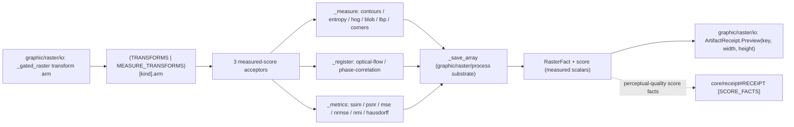

# [PY_ARTIFACTS_GRAPHIC_RASTER_MEASURE]

The scikit-image measurement owner. The `Transform` measured-score half is ONE engine over the three measurement families that PRODUCE scalars rather than a transformed raster — `_measure` (marching-squares contours, Shannon entropy, HOG render, LoG blobs, LBP texture, Harris corners region+feature measurement), `_register` (TV-L1 optical-flow magnitude and sub-pixel phase-correlation registration), and `_metrics` (the six perceptual-quality `structural_similarity`/`peak_signal_noise_ratio`/`mean_squared_error`/`normalized_root_mse`/`normalized_mutual_information`/`hausdorff_distance` scalars) — contributed to the merged dispatch as `MEASURE_TRANSFORMS` over the gated `python_version<'3.15'` band. This page composes the shared transform substrate `graphic/raster/process#PROCESS` owns: the `TransformInput`/`TransformArm` structs and the `_save_array`/`_luminance` helpers are imported, never re-declared. The `Raster`/`RasterOp` owner, the `Transform` StrEnum vocabulary, and the `_gated_raster` dispatcher live on `graphic/raster/io#IO`, which composes the full fifty-two-member dispatch as `TRANSFORMS | MEASURE_TRANSFORMS`. Every acceptor yields one typed `RasterFact` (declared on `graphic/raster/io#IO`, imported here) stamping its perceptual-quality scalar onto the `RasterFact.score` map keyed by the `Transform` value, so the measurement scores fold into `core/receipt#RECEIPT` `ArtifactReceipt.Preview` score facts at the boundary. scikit-image is a host-native gated-band package, so the acceptors run only inside the `faults`-owned `to_process.run_sync` gated-band worker importing `skimage` at boundary scope, never on the cp315-core owner.

## [01]-[INDEX]

- [01]-[MEASURE]: scikit-image measurement owner over the three measured-score families — the `MEASURE_TRANSFORMS` table folding the six measure/feature rows (contours/entropy/HOG/blob/LBP/corners), two registration rows (optical-flow/phase-correlation), and six metrics rows (SSIM/PSNR/MSE/NRMSE/NMI/Hausdorff) into three acceptors (`_measure`/`_register`/`_metrics`), each reading its own `TransformArm.member` through one `getattr(<submodule>, member)`, composing the shared `TransformInput`/`TransformArm`/`_save_array`/`_luminance` substrate from `graphic/raster/process#PROCESS`, all dispatch-table-folded with zero parallel inline dispatch dict.

## [02]-[MEASURE]

- Owner: the scikit-image measurement engine producing a scalar score, the measured-score half of the `Transform` sub-axis the `graphic/raster/io#IO` `Raster` owner dispatches; the `TransformArm` row carrying the submodule `member` an acceptor resolves through one `getattr`, the acceptor `arm`, and the optional `kwargs` policy column — the `metrics` rows reading the `kwargs` column for the `channel_axis`/`data_range` law — and the `TransformInput` `(image, kind, reference, mask, opts)` carrier are imported from `graphic/raster/process#PROCESS`, never re-declared; `MEASURE_TRANSFORMS` the table keyed by the `Transform` value carrying these three families' rows, merged with the process-family `TRANSFORMS` at the `graphic/raster/io#IO` `_gated_raster` lookup so the full fifty-two-member dispatch resolves; every acceptor folds into one typed `RasterFact` stamping its measured scalar onto the `score` map. The `MEASURE_TRANSFORMS` table is the egress-grade collapse: a row carries a callable arm and its own settled `skimage` submodule member, the op routes by one table lookup, never a per-operation sibling function and never a parallel metrics table beside the produced-raster engine.
- Cases: the three measured-score acceptors fold the fourteen measure-family `Transform` members — `_measure` (CONTOURS marching-squares, ENTROPY Shannon, HOG render, BLOB LoG, LBP texture, CORNERS Harris over the `feature`/`measure` region+feature surface) · `_register` (OPTICAL_FLOW TV-L1 magnitude, PHASE_CORRELATION sub-pixel shift over `registration`) · `_metrics` (SSIM, PSNR, MSE, NRMSE, NMI, HAUSDORFF over the six `metrics` quality scalars) — each one `MEASURE_TRANSFORMS` row carrying its submodule member, acceptor, and optional kwargs, matched by the composed-table lookup the `graphic/raster/io#IO` dispatcher reads, never a sibling op per scikit-image call and never a hand-built three-call dict.
- Entry: there is no owner entrypoint on this page — the acceptors are reached only through the `graphic/raster/io#IO` `_gated_raster` `transform` arm, which seeds a `TransformInput` from `skio.imread` and folds through the composed `TRANSFORMS | MEASURE_TRANSFORMS` table; the measured-score acceptors run inside the `faults`-owned `to_process.run_sync` gated-band worker because the scikit-image package rides the gated `python_version<'3.15'` band and cannot resolve on the cp315-core process, the genuine separate-process crossing distinct from the cp315-core `execution/lanes#LANE` `to_interpreter.run_sync` subinterpreter offload which shares the host interpreter version and cannot host scikit-image. The acceptors import `skimage` submodules at boundary scope so no gated import lands on a core page.
- Auto: `_gated_raster` folds the `transform` case through the composed `MEASURE_TRANSFORMS[kind].arm(TransformInput(...))` when the kind keys a measure-family row, and each acceptor re-dispatches only on the per-kind variance its submodule forces — `_measure` branches CONTOURS (`find_contours` count) / ENTROPY (`shannon_entropy`) / LBP (`local_binary_pattern` codes) / HOG (`feature.hog(visualize=True)` render) / BLOB (`blob_log` count) / CORNERS (`corner_peaks(corner_harris)` count), the contour/blob/corner arms returning the source raster with the count on the score and the LBP/HOG arms returning the rendered texture/gradient image; `_register` branches PHASE_CORRELATION (`phase_cross_correlation` sub-pixel shift+error) vs the TV-L1 optical-flow magnitude over the reference luminance; `_metrics` reads `TRANSFORMS`-style `MEASURE_TRANSFORMS[kind].member`/`kwargs` through one `getattr(metrics, member)(reference, image, **kwargs)` so the six quality scalars share one acceptor with zero parallel metrics table. Every acceptor stamps its measured scalar onto the `RasterFact.score` map keyed by the family fact name or the `Transform.value`.
- Receipt: each acceptor folds into `RasterFact` through `_save_array` (the substrate re-encode imported from `graphic/raster/process#PROCESS`) and projects to `core/receipt#RECEIPT` `ArtifactReceipt.Preview(key, width, height)` at the `graphic/raster/io#IO` rail boundary; the measurement scalars are the load-bearing receipt facts these families carry — `_measure` the `contours`/`entropy`/`blobs`/`corners` counts and scalars, `_register` the `shift`/`error` registration facts, `_metrics` the `structural_similarity`/`peak_signal_noise_ratio`/`mean_squared_error`/`normalized_root_mse`/`normalized_mutual_information`/`hausdorff_distance` perceptual-quality scalars keyed by the `Transform.value` — stamped on the `RasterFact.score` map the rail consumer reads inline. Threading those measurement scores into the emitted `_facts` projection is the `graphic/raster/measure -> core/receipt#RECEIPT` `[SCORE_FACTS]` widening seam (the `preview` `_facts` arm projects `key`/`width`/`height` today, the perceptual-quality scalars feed `ArtifactReceipt.Preview` score facts), never a new receipt case and never silently claimed done on this page.
- Packages: `scikit-image` (`feature`/`measure`/`metrics`/`registration`/`color`/`util`/`io` submodules, gated `python_version<'3.15'`) the measurement engine — `feature` (`hog`/`blob_log`/`corner_harris`/`corner_peaks`/`local_binary_pattern`), `measure` (`find_contours`/`shannon_entropy`), `registration` (`phase_cross_correlation`/`optical_flow_tvl1`), `metrics` (`structural_similarity`/`peak_signal_noise_ratio`/`mean_squared_error`/`normalized_root_mse`/`normalized_mutual_information`/`hausdorff_distance`), `color.rgb2gray` (through the imported `_luminance`), `util.img_as_ubyte`/`io.imread`; `pillow` (`Image.fromarray`/`save` through the imported `_save_array`) gated `python_version<'3.15'`; `numpy` (the `skimage` array backing plus the `np.linalg.norm` flow-magnitude fold); `graphic/raster/process#PROCESS` (`TransformInput`/`TransformArm`/`_save_array`/`_luminance` imported, never re-declared); `graphic/raster/io#IO` (`RasterFact`/`Transform`/`Frame` imported); runtime (the `faults`-owned `to_process.run_sync` seam every acceptor runs inside, settled at its owner), `core/receipt#RECEIPT` (`ArtifactReceipt.Preview` the measured scores feed).
- Growth: a new measured-score scikit-image transform is one `Transform` member on `graphic/raster/io#IO` plus one `MEASURE_TRANSFORMS` row here carrying its submodule `member`, acceptor, and optional `kwargs` policy column — landing on the matching submodule acceptor with zero new acceptor when the submodule is already mined (a new feature measurement is one `_measure` row, a new quality metric one `_metrics` row reading the `member`/`kwargs` columns); the shared `TransformInput`/`TransformArm`/`_save_array`/`_luminance` substrate grows on `graphic/raster/process#PROCESS` rather than per-family duplicates here; zero new surface.
- Boundary: a per-scikit-image-call sibling function, a parallel acceptor per metric, a hand-built three-call metrics dict, and an erased `params` bag are the deleted forms; no IO/convert/thumbnail/montage working surface (that is `graphic/raster/io#IO`'s pillow/pyvips surface), no media-detect gate (`graphic/raster/io#IO`'s python-magic gate), and no produced-raster transform engine — the eight families that PRODUCE a new raster array (`_denoise`/`_restore`/`_expose`/`_segment`/`_morphology`/`_threshold`/`_geometric`/`_filter`) are `graphic/raster/process#PROCESS`'s, which owns the `TransformInput`/`TransformArm`/`_save_array`/`_luminance` substrate this page composes. The three families here PRODUCE a scalar score the `RasterFact.score` map carries (the `_measure` contour/blob/corner counts and the `_metrics` quality scalars return the source raster unchanged with the score stamped, the LBP/HOG/optical-flow arms return the rendered texture/gradient/magnitude image), the clean produced-raster-vs-measured-score axis the split cuts. scikit-image rides the gated `python_version<'3.15'` band, so every acceptor runs inside the `faults`-owned `to_process.run_sync` gated-band worker importing `skimage` at boundary scope, a separate process the cp315-core `to_interpreter.run_sync` subinterpreter offload cannot replace for the gated stack.

```python signature
import numpy as np

from artifacts.graphic.raster.io import RasterFact, Transform
from artifacts.graphic.raster.process import TransformArm, TransformInput, _luminance, _save_array


def _measure(input: TransformInput) -> RasterFact:
    from skimage import feature, measure, util

    gray = _luminance(input.image)
    match input.kind:
        case Transform.CONTOURS:
            contours = measure.find_contours(gray, level=input.opts.get("level", 0.5))
            return _save_array(input.image, {"contours": str(len(contours))})
        case Transform.ENTROPY:
            return _save_array(input.image, {"entropy": f"{measure.shannon_entropy(input.image):.6f}"})
        case Transform.LBP:
            codes = feature.local_binary_pattern(gray, P=8, R=1.0, method="uniform")
            return _save_array(util.img_as_ubyte(codes / codes.max()), {})
        case Transform.HOG:
            _, render = feature.hog(input.image, channel_axis=-1, visualize=True)
            return _save_array(render, {})
        case Transform.BLOB:
            blobs = feature.blob_log(gray, **input.opts)
            return _save_array(input.image, {"blobs": str(len(blobs))})
        case _:
            peaks = feature.corner_peaks(feature.corner_harris(gray), min_distance=int(input.opts.get("min_distance", 5)))
            return _save_array(input.image, {"corners": str(len(peaks))})


def _register(input: TransformInput) -> RasterFact:
    from io import BytesIO

    from skimage import io as skio, registration, util

    moving, reference = _luminance(input.image), _luminance(skio.imread(BytesIO(input.reference)))
    match input.kind:
        case Transform.PHASE_CORRELATION:
            shift, error, _ = registration.phase_cross_correlation(reference, moving, upsample_factor=10)
            return _save_array(input.image, {"shift": str(tuple(shift)), "error": f"{float(error):.6f}"})
        case _:
            flow = registration.optical_flow_tvl1(reference, moving)
            return _save_array(util.img_as_ubyte(np.linalg.norm(flow, axis=0) / np.linalg.norm(flow, axis=0).max()), {})


def _metrics(input: TransformInput) -> RasterFact:
    from io import BytesIO

    from skimage import io as skio, metrics

    reference = skio.imread(BytesIO(input.reference))
    row = MEASURE_TRANSFORMS[input.kind]
    value = getattr(metrics, row.member)(reference, input.image, **row.kwargs)
    return _save_array(input.image, {input.kind.value: f"{float(value):.6f}"})


MEASURE_TRANSFORMS: dict[Transform, TransformArm] = {
    Transform.CONTOURS: TransformArm("find_contours", _measure),
    Transform.ENTROPY: TransformArm("shannon_entropy", _measure),
    Transform.HOG: TransformArm("hog", _measure),
    Transform.BLOB: TransformArm("blob_log", _measure),
    Transform.LBP: TransformArm("local_binary_pattern", _measure),
    Transform.CORNERS: TransformArm("corner_harris", _measure),
    Transform.OPTICAL_FLOW: TransformArm("optical_flow_tvl1", _register),
    Transform.PHASE_CORRELATION: TransformArm("phase_cross_correlation", _register),
    Transform.SSIM: TransformArm("structural_similarity", _metrics, {"channel_axis": -1, "data_range": 255}),
    Transform.PSNR: TransformArm("peak_signal_noise_ratio", _metrics, {"data_range": 255}),
    Transform.MSE: TransformArm("mean_squared_error", _metrics),
    Transform.NRMSE: TransformArm("normalized_root_mse", _metrics),
    Transform.NMI: TransformArm("normalized_mutual_information", _metrics),
    Transform.HAUSDORFF: TransformArm("hausdorff_distance", _metrics),
}
```

The scikit-image `Transform` measured-score engine is the egress-grade collapse over the three measurement families: a `TransformArm` row (imported from `graphic/raster/process#PROCESS`) names the submodule `member` the acceptor resolves through one `getattr`, carries the acceptor `arm`, and threads the optional `kwargs` policy column, the `MEASURE_TRANSFORMS` table is keyed by the `Transform` value, and the `graphic/raster/io#IO` `_gated_raster` reads the merged `TRANSFORMS | MEASURE_TRANSFORMS` in one composed-table lookup. Three acceptors own the whole measured-score family with zero parallel inline dispatch dict — `_measure` (marching-squares contours, Shannon entropy, HOG render, LoG blobs, LBP texture, Harris corners, the contour/blob/corner arms returning the source raster with the count on the score and the LBP/HOG arms returning the rendered texture/gradient image), `_register` (TV-L1 optical-flow magnitude and sub-pixel phase correlation over the reference luminance), and `_metrics` (the six perceptual-quality scalars folding through one `getattr(metrics, row.member)(reference, image, **row.kwargs)` keyed by the row's `member`/`kwargs` columns — `structural_similarity`, `peak_signal_noise_ratio`, `mean_squared_error`, `normalized_root_mse`, `normalized_mutual_information`, and `hausdorff_distance` each stamping its perceptual-quality scalar onto the fact `score` map keyed by the `Transform` value, never a hand-built three-call dict and never a parallel metrics table). The `TransformInput` carrier, the `TransformArm` row shape, and the `_save_array`/`_luminance` helpers are imported from `graphic/raster/process#PROCESS` so the produced-raster and measured-score arms fold one substrate; `MEASURE_TRANSFORMS` is the only table this page declares, contributed to the `graphic/raster/io#IO` `_gated_raster` union so all fourteen measure-family members resolve there beside the thirty-eight process-family members with zero loss.



## [03]-[RESEARCH]

- [SCIKIT_TRANSFORM_SETTLED] [RESEARCH]: the three measured-score scikit-image families are SETTLED fence code verified against the folder `.api` catalogue for `scikit-image`. The `feature` arms (`hog`/`blob_log`/`corner_harris`/`corner_peaks`/`local_binary_pattern`) verify against `[03]-[ENTRYPOINTS]` feature rows [02], [06]-[07], [09]-[10]; the `measure` arms (`find_contours`/`shannon_entropy`) against measurement rows [04], [08]; the `registration` arms (`phase_cross_correlation`/`optical_flow_tvl1`) against registration rows [01], [03]; the `metrics` arms (`structural_similarity`/`peak_signal_noise_ratio`/`mean_squared_error`/`normalized_root_mse`/`normalized_mutual_information`/`hausdorff_distance`) against quality-metrics rows [01]-[06]; `color.rgb2gray`/`img_as_ubyte` against color and utility scope (through the imported `_luminance`/`_save_array` substrate). The catalogue `[04]-[IMPLEMENTATION_LAW]` `channel_axis` law fixes the `channel_axis=-1` kwarg on the multichannel HOG arm and the SSIM metric, the `data_range` law fixes the explicit `data_range=255` on the SSIM/PSNR metrics, and the `MEASURE_TRANSFORMS` table is the SETTLED fold over the three measured-score acceptors — `_measure`/`_register`/`_metrics` — each reading its own `TransformArm.member` through one `getattr(<submodule>, member)` and the metric rows additionally reading the `kwargs` policy column, so the six measure/feature rows, the two registration rows, and the six metric rows collapse into one acceptor each with zero parallel inline dispatch dict; the six perceptual-quality scalars ride the `RasterFact.score` fact keyed by the `Transform` value. The produced-raster families' rows (`_denoise`/`_restore`/`_expose`/`_segment`/`_morphology`/`_threshold`/`_geometric`/`_filter`) carry their own portion of `[SCIKIT_TRANSFORM_SETTLED]` on `graphic/raster/process#PROCESS`.
- [HOG_VISUALIZE] [RESEARCH]: the `feature.hog(image, channel_axis=-1, visualize=True)` HOG-render spelling the `_measure` acceptor destructures is the one feature catalogue-deepen item. The `scikit-image` `.api` `[03]-[ENTRYPOINTS]` feature row [02] confirms `hog(image, orientations, pixels_per_cell, cells_per_block, ..., channel_axis)` but does not enumerate the `visualize` flag or the `(descriptor, hog_image)` two-tuple return inside the `...` span, so the `_, render = feature.hog(...)` destructure stays a marked RESEARCH item until an `assay api` reflection pass over `feature.hog` captures the `visualize` parameter and the tuple return; the `hog` descriptor leg is settled, only the `visualize` render flag deepens. Close-condition: `.api` carries the `feature.hog` `visualize` kwarg and tuple-return row.
- [MEASURE_SCORE_FACTS] [RESOLVED]: the perceptual-quality metrics and the region/feature/registration measurement scalars feed the `core/receipt#RECEIPT` `ArtifactReceipt.Preview` score facts through the `graphic/raster/measure -> core/receipt [RECEIPT]` seam (ARCHITECTURE.md `[02]-[SEAMS]`, `graphic/raster/measure -> python:artifacts/core/receipt # [RECEIPT]: ArtifactReceipt.Preview pixel + perceptual-metric facts`). The `_metrics` acceptor stamps each of the six scalars (`structural_similarity`/`peak_signal_noise_ratio`/`mean_squared_error`/`normalized_root_mse`/`normalized_mutual_information`/`hausdorff_distance`) onto the `RasterFact.score` map keyed by the `Transform.value`, `_measure` stamps the `contours`/`entropy`/`blobs`/`corners` facts, and `_register` stamps the `shift`/`error` registration facts; these ride the shared `RasterFact.score` map to the `graphic/raster/io#IO` `_compute` projection, which folds into `ArtifactReceipt.Preview`. Threading the measurement scores into the emitted `_facts` projection is the `[SCORE_FACTS]` widening seam the receipt owner tracks (the `preview` `_facts` arm projects `key`/`width`/`height` today), never a new receipt case and never silently claimed done on this page; this measure page is the upstream producer of those score facts the receipt owner consumes.
- [MEASURE_SUBSTRATE] [RESOLVED]: this page composes the shared transform substrate `graphic/raster/process#PROCESS` owns — the `TransformInput`/`TransformArm` structs and the `_save_array`/`_luminance` helpers are imported (`from artifacts.graphic.raster.process import TransformArm, TransformInput, _luminance, _save_array`) and never re-declared, so the produced-raster and measured-score acceptors fold one `TransformInput` carrier, one `TransformArm` row shape, and one `_save_array` re-encode path. This page declares only `MEASURE_TRANSFORMS: dict[Transform, TransformArm]` of its fourteen measure-family rows; the base `TRANSFORMS` table with the thirty-eight process-family rows lives on `graphic/raster/process#PROCESS`, and the `graphic/raster/io#IO` `_gated_raster` composes the merged `TRANSFORMS | MEASURE_TRANSFORMS` dispatch so all fifty-two `Transform` members resolve with each member landing in exactly one page's rows. `RasterFact`/`Transform`/`Frame` are imported from `graphic/raster/io#IO` and never re-declared, so the gated-band owner's value object and vocabulary stay single-sourced.
