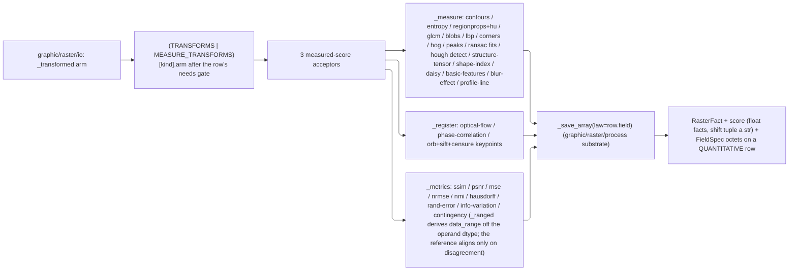

# [PY_ARTIFACTS_GRAPHIC_RASTER_MEASURE]

scikit-image measurement lives here as the measured-score half of `Transform`. `_measure` owns single-image scalar, table, render, fit, and detection facts; `_register` owns reference registration and feature matching; `_metrics` owns intensity, label-map, and point-set comparisons. Each acceptor folds one `RasterFact.score` band with native numeric values.

`graphic/raster/process#PROCESS` owns `Transform`, `TransformPolicy`, `TransformInput`, `TransformArm`, `TransformNeeds`, `FieldLaw`, `Frame`, `RasterFact`, `_save_array`, `_luminance`, and `_channels`. This page contributes `MEASURE_TRANSFORMS` in the same container as `TRANSFORMS`; `graphic/raster/io#IO` composes both and constructs the required image or reference payload before dispatch. EVERY arm resolves its provider call through `row.member`, so the column is load-bearing on all forty-two rows rather than on the same-signature families alone — a member string the arm beside it hardcodes governs nothing, and the two spellings drift the first time a provider renames one. Every comparison range derives from the operand's own dtype rather than a seeded literal.

## [01]-[INDEX]

- [02]-[MEASURE]: the scikit-image measurement owner over the three measured-score families — the `MEASURE_TRANSFORMS` `frozendict` folding the measure/feature, registration, and metrics rows into three acceptors (`_measure`/`_register`/`_metrics`), each same-signature family reading its `member` through one `getattr`, the comparison range derived off the operand's own dtype through `_ranged`, and the quantitative rows riding their pre-rescale field out on the fact, composing the `TransformInput`/`TransformArm`/`FieldLaw`/`_save_array`/`_luminance`/`_channels` substrate from `graphic/raster/process#PROCESS`.

## [02]-[MEASURE]

- Owner: `MEASURE_TRANSFORMS` maps each measured `Transform` to one `TransformArm`. Rows declare `TransformNeeds.REFERENCE` where required, carry closed `TransformPolicy` seeds, and state their `FieldLaw`; `TransformArm.options` selects a complete typed override. `_LABEL_METRICS` derives from `_LABEL_KEYS`, `_ranged` derives the comparison range from the operand's own dtype, and blob, corner, flow, keypoint, and geometric-fit families resolve their provider class or function from the row.
- Cases: the three acceptors fold the measure-family members — `_measure` (contours/entropy/regionprops+Hu/glcm/blobs/lbp/corners/hog/peaks/RANSAC fits/Hough detection/structure-tensor/shape-index/daisy/basic-features/blur-effect/profile-line over the `feature`/`measure`/`transform` surface), `_register` (optical-flow magnitude, phase correlation, ORB/SIFT/CENSURE+BRIEF keypoint counts over `registration`/`feature`), `_metrics` (SSIM/PSNR/MSE/NRMSE/NMI scalars, the `HAUSDORFF` canny-edge point-set distance, the `RAND_ERROR`/`INFO_VARIATION` label-map metrics, the `CONTINGENCY` label-overlap matrix over the `metrics` surface) — each one `MEASURE_TRANSFORMS` row matched by the composed-table lookup, never a sibling op per scikit-image call.
- Auto: each acceptor first matches the admitted `TransformInput` case, then resolves `row.options(policy)` — `_metrics` through `_ranged`, which supersedes the row's declared range seed with the operand's own dtype ceiling on every default call and yields wholly to a caller override. `_measure` total-dispatches count, scalar, render, field, table, fit, and detection result shapes; `_register` total-dispatches phase correlation, descriptor matching, and optical-flow magnitude; `_metrics` total-dispatches contingency, derived label metrics, edge-set Hausdorff distance, channel-aware SSIM, and intensity scalars, aligning the decoded reference to the operand's dtype only where the two disagree. Provider overrides reach detector constructors and every function call through the same policy boundary.
- Output: each acceptor folds through `_save_array` into `RasterFact`. A `QUANTITATIVE` row preserves its pre-rescale octets in `RasterFact.field` beside the native numeric scores.
- Growth: a measured operation adds one `Transform` member, one `MEASURE_TRANSFORMS` row carrying its `FieldLaw`, and one existing acceptor arm when its result shape already exists. New parameters extend `TransformPolicy`; new model payload timing extends the shared `TransformInput` owner before admission here. A metric reading a comparison range declares `TransformPolicy(data_range=...)` as its seed so the override family is admitted, and `_ranged` supplies the live value.
- Packages: `scikit-image` (`feature`/`filters`/`measure`/`metrics`/`registration`/`transform`/`util` at the members the rows name); `numpy` (fact reductions and the dtype-ceiling derivation); `graphic/raster/process#PROCESS` (`FieldLaw`/`Frame`/`RasterFact`/`Transform`/`TransformPolicy`/`TransformArm`/`TransformInput`/`TransformNeeds`/`_channels`/`_luminance`/`_save_array`); stdlib `io`/`typing.Final`.
- Boundary: the shared `TransformInput`/`TransformArm`/`_save_array`/`_luminance`/`_channels` substrate, the `Transform` enum, and the `TransformNeeds`/`FieldLaw` axes are `graphic/raster/process#PROCESS`'s; the `Raster`/`RasterOp` owner and the composed `TRANSFORMS | MEASURE_TRANSFORMS` lookup are `graphic/raster/io#IO`'s (`_transformed` executes the gate each row here declares); the produced-raster families (a new pixel array, not a scalar) are process's — this page owns only the measured-score half. Depth stops at the `Frame` carrier both operands share: measuring a LOSSY DEEP encode — an EXR compression row, a UASTC or ETC1S block, a half-float codec — is `graphic/texture/plane#PLANE`'s own fidelity leg, because the strata bar that plane from importing this page and this page names no deep carrier; a deep reference lands here only by crossing the same 8-bit admission the operand crossed.

```python
from builtins import frozendict
from io import BytesIO
from typing import Final, assert_never

import numpy as np

from rasm.artifacts.graphic.raster.process import (
    FieldLaw,
    Frame,
    RasterFact,
    Transform,
    TransformArm,
    TransformInput,
    TransformNeeds,
    TransformPolicy,
    _channels,
    _luminance,
    _save_array,
)

lazy from skimage import feature, filters, io as skio, measure, metrics, registration, transform, util

_MORPHOMETRY: Final[tuple[str, ...]] = (
    "area",
    "eccentricity",
    "solidity",
    "orientation",
    "perimeter",
    "euler_number",
    "extent",
    "axis_major_length",
    "axis_minor_length",
    "equivalent_diameter_area",
)
_HARALICK: Final[tuple[str, ...]] = ("contrast", "dissimilarity", "homogeneity", "energy", "correlation", "ASM")
_GLCM_DISTANCES: Final[tuple[int, ...]] = (1, 2)
_GLCM_ANGLES: Final[tuple[float, ...]] = (0.0, np.pi / 4, np.pi / 2, 3 * np.pi / 4)
_LABEL_KEYS: Final[frozendict[Transform, tuple[str, ...]]] = frozendict({
    Transform.RAND_ERROR: ("rand_error", "precision", "recall"),
    Transform.INFO_VARIATION: ("split_entropy", "merge_entropy"),
})
_LABEL_METRICS: Final[frozenset[Transform]] = frozenset(_LABEL_KEYS)
_DISPLAY_RANGE: Final[int] = int(np.iinfo(np.uint8).max)


def _ranged(operand: Frame, row: TransformArm, policy: TransformPolicy, /) -> frozendict[str, object]:
    derived = float(np.iinfo(operand.dtype).max) if np.issubdtype(operand.dtype, np.integer) else float(np.ptp(operand))
    ranged = row.policy.tag == "data_range" and policy.tag == "default"
    return row.options(policy) | (frozendict({"data_range": derived}) if ranged else frozendict())


def _measure(tx: TransformInput) -> RasterFact:
    match tx:
        case TransformInput(tag="image", image=(image, kind, policy)):
            pass
        case _ as unreachable:
            assert_never(unreachable)
    gray = _luminance(image)
    row = MEASURE_TRANSFORMS[kind]
    opts = row.options(policy)
    match kind:
        case Transform.CONTOURS:
            contours = getattr(measure, row.member)(gray, **opts)
            return _save_array(image, frozendict({"contours": float(len(contours))}))
        case Transform.ENTROPY:
            return _save_array(image, frozendict({"entropy": float(getattr(measure, row.member)(image))}))
        case Transform.REGIONPROPS:
            labels = measure.label(gray > filters.threshold_otsu(gray))
            table = getattr(measure, row.member)(labels, gray, properties=("label", *_MORPHOMETRY, "moments_hu"))
            count = int(table["label"].size)
            morph = frozendict({prop: float(np.asarray(table[prop]).mean()) for prop in _MORPHOMETRY}) if count else frozendict()
            hu = (
                frozendict({key: float(np.asarray(table[key]).mean()) for key in table if key.startswith("moments_hu")}) if count else frozendict()
            )
            return _save_array(image, frozendict({"regions": float(count)}) | morph | hu)
        case Transform.GLCM:
            glcm = getattr(feature, row.member)(util.img_as_ubyte(gray), **opts)
            return _save_array(image, frozendict({prop: float(feature.graycoprops(glcm, prop).mean()) for prop in _HARALICK}))
        case Transform.BLOB | Transform.BLOB_DOG | Transform.BLOB_DOH:
            return _save_array(image, frozendict({"blobs": float(len(getattr(feature, row.member)(gray, **opts)))}))
        case Transform.LBP:
            pattern = getattr(feature, row.member)(gray, **opts)
            return _save_array(pattern, frozendict({"lbp_entropy": float(measure.shannon_entropy(pattern)), "lbp_bins": float(pattern.max() + 1)}))
        case Transform.HOG:
            descriptor, render = getattr(feature, row.member)(image, channel_axis=_channels(image), visualize=True)
            return _save_array(render, frozendict({"descriptor_length": float(descriptor.size), "gradient_energy": float(descriptor.mean())}))
        case Transform.PEAKS:
            return _save_array(image, frozendict({"peaks": float(len(getattr(feature, row.member)(gray, **opts)))}))
        case Transform.FIT_CIRCLE | Transform.FIT_ELLIPSE | Transform.FIT_LINE:
            points = np.column_stack(np.nonzero(feature.canny(gray)))
            if len(points) < int(opts["min_samples"]):
                return _save_array(image, frozendict({"inliers": 0.0, "inlier_ratio": 0.0, "residual": float("inf")}))
            model, inliers = measure.ransac(points, getattr(measure, row.member), **opts)
            kept = int(inliers.sum()) if inliers is not None else 0
            residual = float(model.residuals(points[inliers]).mean()) if kept else float("inf")
            return _save_array(image, frozendict({"inliers": float(kept), "inlier_ratio": kept / max(len(points), 1), "residual": residual}))
        case Transform.BLUR_EFFECT:
            return _save_array(image, frozendict({"blur": float(getattr(measure, row.member)(gray))}))
        case Transform.HOUGH_LINE:
            hspace, angles, dists = getattr(transform, row.member)(feature.canny(gray))
            _accum, peak_angles, _peak_dists = transform.hough_line_peaks(hspace, angles, dists)
            return _save_array(image, frozendict({"lines": float(len(peak_angles))}))
        case Transform.HOUGH_LINE_PROB:
            segments = getattr(transform, row.member)(feature.canny(gray), **opts)
            return _save_array(image, frozendict({"segments": float(len(segments))}))
        case Transform.HOUGH_CIRCLE:
            radii = np.arange(int(opts["radius_min"]), int(opts["radius_max"]), int(opts["radius_step"]))
            accums, *_centres_radii = transform.hough_circle_peaks(
                getattr(transform, row.member)(feature.canny(gray), radii), radii, total_num_peaks=int(opts["peaks"])
            )
            return _save_array(image, frozendict({"circles": float(len(accums))}))
        case Transform.STRUCTURE_TENSOR:
            elems = getattr(feature, row.member)(gray, sigma=float(opts["sigma"]), order="rc")
            trace = elems[0] + elems[-1]
            return _save_array(trace, frozendict({"tensor_energy": float(np.mean(trace))}), law=row.field)
        case Transform.SHAPE_INDEX:
            index = np.nan_to_num(getattr(feature, row.member)(gray))
            return _save_array(index, frozendict({"shape_index": float(index.mean())}), law=row.field)
        case Transform.DAISY:
            descs, render = getattr(feature, row.member)(gray, visualize=True)
            return _save_array(render, frozendict({"descriptors": float(descs.shape[0] * descs.shape[1])}))
        case Transform.BASIC_FEATURES:
            stack = getattr(feature, row.member)(image, channel_axis=_channels(image))
            return _save_array(stack[..., 0], frozendict({"features": float(stack.shape[-1])}))
        case Transform.PROFILE_LINE:
            start = (max(0, min(int(opts["src_row"]), gray.shape[0] - 1)), max(0, min(int(opts["src_col"]), gray.shape[1] - 1)))
            end = (max(0, min(int(opts["dst_row"]), gray.shape[0] - 1)), max(0, min(int(opts["dst_col"]), gray.shape[1] - 1)))
            profile = np.asarray(
                measure.profile_line(gray, start, end, linewidth=int(opts["linewidth"])),
                dtype=float,
            )
            scan = (
                frozendict({
                    "profile_mean": float(profile.mean()),
                    "profile_min": float(profile.min()),
                    "profile_max": float(profile.max()),
                    "profile_length": float(profile.size),
                })
                if profile.size
                else frozendict({"profile_length": 0.0})
            )
            return _save_array(image, scan)
        case Transform.CORNERS | Transform.CORNERS_SHI_TOMASI | Transform.CORNERS_FAST | Transform.CORNERS_MORAVEC | Transform.CORNERS_KR:
            peaks = feature.corner_peaks(getattr(feature, row.member)(gray), **opts)
            return _save_array(image, frozendict({"corners": float(len(peaks))}))
        case _ as unreachable:
            assert_never(unreachable)


def _register(tx: TransformInput) -> RasterFact:
    match tx:
        case TransformInput(tag="reference", reference=(image, kind, encoded_reference, policy)):
            pass
        case _ as unreachable:
            assert_never(unreachable)
    moving, reference = _luminance(image), _luminance(skio.imread(BytesIO(encoded_reference)))
    row, opts = MEASURE_TRANSFORMS[kind], MEASURE_TRANSFORMS[kind].options(policy)
    match kind:
        case Transform.PHASE_CORRELATION:
            shift, error, _diff = registration.phase_cross_correlation(reference, moving, **opts)
            return _save_array(image, frozendict({"shift": str(tuple(shift)), "error": float(error)}))
        case Transform.KEYPOINTS | Transform.SIFT_KEYPOINTS:
            detector = getattr(feature, row.member)(**opts)
            detector.detect_and_extract(reference)
            anchor = detector.descriptors
            detector.detect_and_extract(moving)
            matches = feature.match_descriptors(anchor, detector.descriptors, cross_check=True)
            return _save_array(image, frozendict({"keypoints": float(len(detector.keypoints)), "matches": float(len(matches))}))
        case Transform.CENSURE_KEYPOINTS:
            detector, extractor = getattr(feature, row.member)(**opts), feature.BRIEF()
            detector.detect(reference)
            extractor.extract(reference, detector.keypoints)
            anchor = extractor.descriptors
            detector.detect(moving)
            extractor.extract(moving, detector.keypoints)
            matches = feature.match_descriptors(anchor, extractor.descriptors, cross_check=True)
            return _save_array(image, frozendict({"keypoints": float(len(detector.keypoints)), "matches": float(len(matches))}))
        case Transform.OPTICAL_FLOW | Transform.OPTICAL_FLOW_ILK:
            magnitude = np.linalg.norm(getattr(registration, row.member)(reference, moving, **opts), axis=0)
            return _save_array(magnitude, frozendict({"flow_mean": float(magnitude.mean())}), law=row.field)
        case _ as unreachable:
            assert_never(unreachable)


def _metrics(tx: TransformInput) -> RasterFact:
    match tx:
        case TransformInput(tag="reference", reference=(image, kind, encoded_reference, policy)):
            pass
        case _ as unreachable:
            assert_never(unreachable)
    row, decoded = MEASURE_TRANSFORMS[kind], skio.imread(BytesIO(encoded_reference))
    reference = decoded if decoded.dtype == image.dtype else util.img_as_ubyte(decoded)
    opts = _ranged(image, row, policy)
    match kind:
        case Transform.CONTINGENCY:
            ref_gray, test_gray = _luminance(reference), _luminance(image)
            truth = measure.label(ref_gray > filters.threshold_otsu(ref_gray))
            test = measure.label(test_gray > filters.threshold_otsu(test_gray))
            overlap = metrics.contingency_table(truth, test)
            return _save_array(image, frozendict({"overlap_nnz": float(overlap.nnz), "truth_labels": float(overlap.shape[0]), "test_labels": float(overlap.shape[1])}))
        case _ if kind in _LABEL_METRICS:
            ref_gray, test_gray = _luminance(reference), _luminance(image)
            truth = measure.label(ref_gray > filters.threshold_otsu(ref_gray))
            test = measure.label(test_gray > filters.threshold_otsu(test_gray))
            scored = np.atleast_1d(getattr(metrics, row.member)(truth, test))
            return _save_array(image, frozendict({key: float(value) for key, value in zip(_LABEL_KEYS[kind], scored, strict=True)}))
        case Transform.HAUSDORFF:
            edges = feature.canny(_luminance(reference)), feature.canny(_luminance(image))
            return _save_array(image, frozendict({kind.value: float(getattr(metrics, row.member)(*edges, **opts))}))
        case Transform.SSIM:
            value = getattr(metrics, row.member)(reference, image, **(opts | frozendict({"channel_axis": _channels(image)})))
            return _save_array(image, frozendict({kind.value: float(value)}))
        case Transform.PSNR | Transform.MSE | Transform.NRMSE | Transform.NMI:
            value = getattr(metrics, row.member)(reference, image, **opts)
            return _save_array(image, frozendict({kind.value: float(value)}))
        case _ as unreachable:
            assert_never(unreachable)


MEASURE_TRANSFORMS: Final[frozendict[Transform, TransformArm]] = frozendict({
    Transform.CONTOURS: TransformArm("find_contours", _measure, TransformPolicy(contour=0.5)),
    Transform.ENTROPY: TransformArm("shannon_entropy", _measure),
    Transform.REGIONPROPS: TransformArm("regionprops_table", _measure),
    Transform.GLCM: TransformArm("graycomatrix", _measure, TransformPolicy(glcm=(_GLCM_DISTANCES, _GLCM_ANGLES, 256, True, True))),
    Transform.HOG: TransformArm("hog", _measure),
    Transform.BLOB: TransformArm("blob_log", _measure),
    Transform.BLOB_DOG: TransformArm("blob_dog", _measure),
    Transform.BLOB_DOH: TransformArm("blob_doh", _measure),
    Transform.LBP: TransformArm("local_binary_pattern", _measure, TransformPolicy(lbp=(8, 1.0, "uniform"))),
    Transform.PEAKS: TransformArm("peak_local_max", _measure, TransformPolicy(distance=5)),
    Transform.CORNERS: TransformArm("corner_harris", _measure, TransformPolicy(distance=5)),
    Transform.CORNERS_SHI_TOMASI: TransformArm("corner_shi_tomasi", _measure, TransformPolicy(distance=5)),
    Transform.CORNERS_FAST: TransformArm("corner_fast", _measure, TransformPolicy(distance=5)),
    Transform.CORNERS_MORAVEC: TransformArm("corner_moravec", _measure, TransformPolicy(distance=5)),
    Transform.CORNERS_KR: TransformArm("corner_kitchen_rosenfeld", _measure, TransformPolicy(distance=5)),
    Transform.FIT_CIRCLE: TransformArm(
        "CircleModel", _measure, TransformPolicy(ransac=(3, 2.0, 200, 0))
    ),
    Transform.FIT_ELLIPSE: TransformArm(
        "EllipseModel", _measure, TransformPolicy(ransac=(5, 2.0, 200, 0))
    ),
    Transform.FIT_LINE: TransformArm("LineModelND", _measure, TransformPolicy(ransac=(2, 2.0, 200, 0))),
    Transform.HOUGH_LINE: TransformArm("hough_line", _measure),
    Transform.HOUGH_CIRCLE: TransformArm("hough_circle", _measure, TransformPolicy(circles=(10, 100, 10, 20))),
    Transform.HOUGH_LINE_PROB: TransformArm("probabilistic_hough_line", _measure, TransformPolicy(hough_line=(10, 50, 10))),
    Transform.STRUCTURE_TENSOR: TransformArm("structure_tensor", _measure, TransformPolicy(sigma=1.0), field=FieldLaw.QUANTITATIVE),
    Transform.SHAPE_INDEX: TransformArm("shape_index", _measure, field=FieldLaw.QUANTITATIVE),
    Transform.DAISY: TransformArm("daisy", _measure),
    Transform.BASIC_FEATURES: TransformArm("multiscale_basic_features", _measure),
    Transform.BLUR_EFFECT: TransformArm("blur_effect", _measure),
    Transform.PROFILE_LINE: TransformArm(
        "profile_line", _measure, TransformPolicy(profile=(0, 0, 100, 100, 1))
    ),
    Transform.OPTICAL_FLOW: TransformArm("optical_flow_tvl1", _register, needs=TransformNeeds.REFERENCE, field=FieldLaw.QUANTITATIVE),
    Transform.OPTICAL_FLOW_ILK: TransformArm("optical_flow_ilk", _register, needs=TransformNeeds.REFERENCE, field=FieldLaw.QUANTITATIVE),
    Transform.PHASE_CORRELATION: TransformArm(
        "phase_cross_correlation", _register, TransformPolicy(upsample=10), needs=TransformNeeds.REFERENCE
    ),
    Transform.KEYPOINTS: TransformArm("ORB", _register, TransformPolicy(keypoints=200), needs=TransformNeeds.REFERENCE),
    Transform.SIFT_KEYPOINTS: TransformArm("SIFT", _register, needs=TransformNeeds.REFERENCE),
    Transform.CENSURE_KEYPOINTS: TransformArm(
        "CENSURE", _register, TransformPolicy(censure=(1, 7)), needs=TransformNeeds.REFERENCE
    ),
    Transform.SSIM: TransformArm("structural_similarity", _metrics, TransformPolicy(data_range=_DISPLAY_RANGE), needs=TransformNeeds.REFERENCE),
    Transform.PSNR: TransformArm("peak_signal_noise_ratio", _metrics, TransformPolicy(data_range=_DISPLAY_RANGE), needs=TransformNeeds.REFERENCE),
    Transform.MSE: TransformArm("mean_squared_error", _metrics, needs=TransformNeeds.REFERENCE),
    Transform.NRMSE: TransformArm("normalized_root_mse", _metrics, needs=TransformNeeds.REFERENCE),
    Transform.NMI: TransformArm("normalized_mutual_information", _metrics, needs=TransformNeeds.REFERENCE),
    Transform.HAUSDORFF: TransformArm("hausdorff_distance", _metrics, needs=TransformNeeds.REFERENCE),
    Transform.RAND_ERROR: TransformArm("adapted_rand_error", _metrics, needs=TransformNeeds.REFERENCE),
    Transform.INFO_VARIATION: TransformArm("variation_of_information", _metrics, needs=TransformNeeds.REFERENCE),
    Transform.CONTINGENCY: TransformArm("contingency_table", _metrics, needs=TransformNeeds.REFERENCE),
})
```


```mermaid
---
config:
  layout: elk
  flowchart:
    curve: linear
    padding: 25
---
flowchart LR
    accTitle: Raster measurement acceptor fan
    accDescr: The transform arm resolves one table row past its needs gate into measurement, registration, and reference-metric acceptors, each saving through the shared array substrate into RasterFact.
    Tx["graphic/raster/io: _transformed arm"] --> Table["(TRANSFORMS | MEASURE_TRANSFORMS)[kind].arm after the row's needs gate"]
    Table --> Acc["3 measured-score acceptors"]
    Acc --> Mea["_measure: contours / entropy / regionprops+hu / glcm / blobs / lbp / corners / hog / peaks / ransac fits / hough detect / structure-tensor / shape-index / daisy / basic-features / blur-effect / profile-line"]
    Acc --> Reg["_register: optical-flow / phase-correlation / orb+sift+censure keypoints"]
    Acc --> Met["_metrics: ssim / psnr / mse / nrmse / nmi / hausdorff / rand-error / info-variation / contingency (_ranged derives data_range off the operand dtype; the reference aligns only on disagreement)"]
    Mea --> Save["_save_array(law=row.field) (graphic/raster/process substrate)"]
    Reg --> Save
    Met --> Save
    Save --> Fact["RasterFact + score (float facts, shift tuple a str) + FieldSpec octets on a QUANTITATIVE row"]
```

## [03]-[RESEARCH]

<!-- source-only: research row template; every landed row opens on the list dash this placeholder omits, the census reading `^- [TOKEN]-[OPEN|BLOCKED]:` alone:
[TOKEN]-[OPEN|BLOCKED]: <exact question>; <verification route>.
-->

(none)
