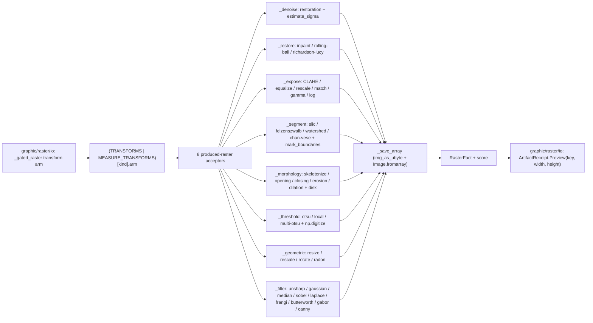

# [PY_ARTIFACTS_GRAPHIC_RASTER_PROCESS]

The scikit-image transform-engine owner. The `Transform` produced-raster half is ONE engine over the eight transform-engine families that PRODUCE a new raster — `restoration` (the four denoisers plus inpaint/rolling-ball/deconvolution), `exposure` (CLAHE/equalize/rescale/histogram-match/gamma/log), `segmentation` (SLIC/Felzenszwalb/watershed/Chan-Vese), `thresholding` (Otsu/local/multi-Otsu), `morphology` (skeletonize/opening/closing/erosion/dilation), `geometric-transform` (resize/rescale/rotate/Radon), and `filters` (unsharp/gaussian/median/sobel/laplace/frangi/butterworth/gabor/canny) — folded by the `TRANSFORMS` member-acceptor-kwargs table over the gated `python_version<'3.15'` band. This page owns the shared transform substrate the measure half composes: the `TransformInput`/`TransformArm` structs and the `_save_array`/`_luminance` helpers, plus the base `TRANSFORMS` table carrying these eight families' rows. The `Raster`/`RasterOp` owner, the `Transform` StrEnum vocabulary, and the `_gated_raster` dispatcher live on `graphic/raster/io#IO`; the measurement half (`_measure`/`_register`/`_metrics` plus `MEASURE_TRANSFORMS`) lives on `graphic/raster/measure#MEASURE` and imports this page's substrate. Every acceptor yields one typed `RasterFact` (declared on `graphic/raster/io#IO`, imported here) so the `_gated_raster` `transform` arm folds one shape into `core/receipt#RECEIPT` `ArtifactReceipt.Preview`. scikit-image is a host-native gated-band package, so the acceptors run only inside the `faults`-owned `to_process.run_sync` gated-band worker importing `skimage` at boundary scope, never on the cp315-core owner.

## [01]-[INDEX]

- [01]-[PROCESS]: scikit-image transform-engine owner over the eight produced-raster families — the `TRANSFORMS` base table folding the four denoise rows, three restoration rows, six exposure rows, four segmentation rows, three thresholding rows, five morphology rows, four geometric rows, and nine filter/edge rows into eight acceptors (`_denoise`/`_restore`/`_expose`/`_segment`/`_morphology`/`_threshold`/`_geometric`/`_filter`), each reading its own `TransformArm.member` through one `getattr(<submodule>, member)`, the shared `TransformInput`/`TransformArm` structs and `_save_array`/`_luminance` helpers the measure half composes, all dispatch-table-folded with zero parallel inline dispatch dict.

## [02]-[PROCESS]

- Owner: the scikit-image transform-engine producing a new raster, the produced-raster half of the `Transform` sub-axis the `graphic/raster/io#IO` `Raster` owner dispatches; `TransformArm` the row carrying the submodule `member` an acceptor resolves through one `getattr`, the acceptor `arm`, and the optional `kwargs` policy column; `TransformInput` the typed `(image, kind, reference, mask, opts)` carrier every acceptor reads, never an erased `params` dict the arm re-validates; `TRANSFORMS` the base table keyed by the `Transform` value carrying these eight families' rows, merged with `graphic/raster/measure#MEASURE`'s `MEASURE_TRANSFORMS` at the `graphic/raster/io#IO` `_gated_raster` lookup so the full fifty-two-member dispatch resolves; every acceptor folds into one typed `RasterFact` recovering the re-encoded transform bytes plus the optional score map. The `TRANSFORMS` table is the egress-grade collapse: a row carries a callable arm and its own settled `skimage` submodule member, the op routes by one table lookup, never a per-operation sibling function and never a re-discriminating `match` inside an arm beyond the per-acceptor kind branch the submodule's own signature variance forces.
- Cases: the eight produced-raster acceptors fold the thirty-eight process-family `Transform` members — `_denoise` (DENOISE_BILATERAL/DENOISE_NL_MEANS/DENOISE_TV/DENOISE_WAVELET over `restoration` `estimate_sigma`) · `_restore` (INPAINT biharmonic, ROLLING_BALL background subtraction, DECONVOLVE Richardson-Lucy) · `_expose` (CLAHE, EQUALIZE, RESCALE_INTENSITY, MATCH_HISTOGRAMS, GAMMA, LOG over the `is_low_contrast` gate) · `_segment` (SLIC, FELZENSZWALB, marker WATERSHED, CHAN_VESE over `regionprops_table` region counting) · `_morphology` (Otsu-binarized SKELETONIZE, OPENING, CLOSING, EROSION, DILATION over the `disk` footprint factory) · `_threshold` (THRESHOLD_OTSU, THRESHOLD_LOCAL, THRESHOLD_MULTIOTSU over `np.digitize`) · `_geometric` (RESIZE, RESCALE, ROTATE, RADON sinogram) · `_filter` (UNSHARP, GAUSSIAN, MEDIAN, SOBEL, LAPLACE, FRANGI, BUTTERWORTH, GABOR, CANNY over the edge-grayscale gate) — each one `TRANSFORMS` row carrying its submodule member, acceptor, and optional kwargs, matched by the composed-table lookup the `graphic/raster/io#IO` dispatcher reads, never a sibling op per scikit-image call.
- Entry: there is no owner entrypoint on this page — the acceptors are reached only through the `graphic/raster/io#IO` `_gated_raster` `transform` arm, which seeds a `TransformInput` from `skio.imread` and folds through the composed `TRANSFORMS | MEASURE_TRANSFORMS` table; the produced-raster acceptors run inside the `faults`-owned `to_process.run_sync` gated-band worker because the scikit-image package rides the gated `python_version<'3.15'` band and cannot resolve on the cp315-core process, the genuine separate-process crossing distinct from the cp315-core `execution/lanes#LANE` `to_interpreter.run_sync` subinterpreter offload which shares the host interpreter version and cannot host scikit-image. The acceptors import `skimage` submodules at boundary scope so no gated import lands on a core page.
- Auto: `_gated_raster` folds the `transform` case through the composed `TRANSFORMS[kind].arm(TransformInput(...))`, and each acceptor re-dispatches only on the per-kind signature variance its submodule forces — `_denoise` reads `TRANSFORMS[input.kind].member` through `getattr(restoration, member)` and threads `estimate_sigma`; `_restore` branches `INPAINT`/`DECONVOLVE`/rolling-ball on the three restoration signatures; `_expose` branches `MATCH_HISTOGRAMS` (reference image) vs the rest over the `is_low_contrast` gate; `_segment` branches `WATERSHED` (sobel markers) / `CHAN_VESE` (float luminance) / the SLIC/Felzenszwalb channel-axis default, then overlays `mark_boundaries` and counts `regionprops_table`; `_morphology` Otsu-binarizes then branches `SKELETONIZE` (no footprint) vs the four footprint ops over `disk`; `_threshold` branches `THRESHOLD_MULTIOTSU` (`np.digitize`) vs the binary cut; `_geometric` branches `RESIZE`/`RESCALE`/`ROTATE`/Radon over `transform`; `_filter` keys the edge-grayscale gate and the `feature.canny` vs `filters` module split — so the four denoise rows, the nine filter/edge rows, the five morphology rows, the four geometric rows, and the four segmentation rows each share one acceptor with zero parallel inline dispatch dict, the `member` `getattr` resolving the submodule attribute the row names.
- Receipt: each acceptor folds into `RasterFact` through `_save_array` (re-encoding the transformed scikit-image array to PNG bytes through `util.img_as_ubyte` plus `Image.fromarray`) and projects to `core/receipt#RECEIPT` `ArtifactReceipt.Preview(key, width, height)` at the `graphic/raster/io#IO` rail boundary; the produced-raster acceptors carry no perceptual score beyond the diagnostic facts their family stamps — `_denoise` the `sigma`, `_expose` the `contrast` low/ok gate, `_segment` the `regions` count — on the `RasterFact.score` map the rail consumer reads inline, distinct from the measurement scores the `graphic/raster/measure#MEASURE` half stamps.
- Packages: `scikit-image` (`restoration`/`exposure`/`segmentation`/`morphology`/`transform`/`filters`/`feature`/`color`/`util`/`io` submodules, gated `python_version<'3.15'`) the transform engine — `restoration` (`denoise_bilateral`/`denoise_nl_means`/`denoise_tv_chambolle`/`denoise_wavelet`/`estimate_sigma`/`inpaint_biharmonic`/`rolling_ball`/`richardson_lucy`), `exposure` (`equalize_adapthist`/`equalize_hist`/`rescale_intensity`/`match_histograms`/`adjust_gamma`/`adjust_log`/`is_low_contrast`), `segmentation` (`slic`/`felzenszwalb`/`watershed`/`chan_vese`/`mark_boundaries`), `morphology` (`skeletonize`/`binary_opening`/`binary_closing`/`binary_erosion`/`binary_dilation`/`disk`), `transform` (`resize`/`rescale`/`rotate`/`radon`), `filters` (`unsharp_mask`/`gaussian`/`median`/`sobel`/`laplace`/`frangi`/`butterworth`/`gabor`/`threshold_otsu`/`threshold_local`/`threshold_multiotsu`), `feature.canny`, `measure.regionprops_table`, `color.rgb2gray`, `util.img_as_float`/`img_as_ubyte`/`io.imread`; `pillow` (`Image.fromarray`/`save` re-encoding the array to PNG in `_save_array`) gated `python_version<'3.15'`; `numpy` (the `skimage` array backing plus the `np.digitize`/`np.ones` PSF and threshold folds); `graphic/raster/io#IO` (`RasterFact`/`Transform`/`ConvertFormat` imported, never re-declared); runtime (the `faults`-owned `to_process.run_sync` seam every acceptor runs inside, settled at its owner).
- Growth: a new produced-raster scikit-image transform is one `Transform` member on `graphic/raster/io#IO` plus one `TRANSFORMS` row here carrying its submodule `member`, acceptor, and optional `kwargs` policy column — landing on the matching submodule acceptor with zero new acceptor when the submodule is already mined (a new denoiser is one `_denoise` row, a new filter one `_filter` row); a new transform family is one acceptor plus its rows; the shared `TransformInput`/`TransformArm` substrate and `_save_array`/`_luminance` helpers grow in place rather than per-family duplicates; zero new surface.
- Boundary: a per-scikit-image-call sibling function, a parallel acceptor per `Transform` member, and an erased `params` bag are the deleted forms; no IO/convert/thumbnail/montage working surface (that is `graphic/raster/io#IO`'s pillow/pyvips surface), no media-detect gate (that is `graphic/raster/io#IO`'s python-magic gate), and no measurement half — the `_measure`/`_register`/`_metrics` acceptors that PRODUCE scores rather than a transformed raster are `graphic/raster/measure#MEASURE`'s, which composes this page's `TransformInput`/`TransformArm`/`_save_array`/`_luminance` substrate and contributes its `MEASURE_TRANSFORMS` rows to the merged dispatch. The eight families here all PRODUCE a new raster array `_save_array` re-encodes; the measurement families stamp a scalar onto the score map without a new pixel raster, the clean produced-raster-vs-measured-score axis the split cuts. scikit-image rides the gated `python_version<'3.15'` band, so every acceptor runs inside the `faults`-owned `to_process.run_sync` gated-band worker importing `skimage` at boundary scope, a separate process the cp315-core `to_interpreter.run_sync` subinterpreter offload cannot replace for the gated stack.

```python signature
from collections.abc import Callable

import numpy as np
from msgspec import Struct
from numpy.typing import NDArray

from artifacts.graphic.raster.io import ConvertFormat, Frame, RasterFact, Transform


class TransformInput(Struct, frozen=True):
    image: Frame
    kind: Transform
    reference: bytes
    mask: bytes
    opts: dict[str, float]


class TransformArm(Struct, frozen=True):
    member: str
    arm: Callable[["TransformInput"], RasterFact]
    kwargs: dict[str, object] = {}


def _save_array(array: NDArray[np.floating | np.integer], score: dict[str, str]) -> RasterFact:
    from io import BytesIO

    from PIL import Image
    from skimage import util

    image = Image.fromarray(util.img_as_ubyte(array))
    sink = BytesIO()
    image.save(sink, format=ConvertFormat.PNG.value)
    return RasterFact(sink.getvalue(), *image.size, score)


def _luminance(frame: Frame) -> NDArray[np.floating]:
    from skimage import color

    return color.rgb2gray(frame) if frame.ndim == 3 else frame


def _denoise(input: TransformInput) -> RasterFact:
    from skimage import restoration

    member = getattr(restoration, TRANSFORMS[input.kind].member)
    sigma = restoration.estimate_sigma(input.image, channel_axis=-1)
    return _save_array(member(input.image, channel_axis=-1, **(input.opts or {"sigma": sigma})), {"sigma": f"{float(sigma):.6f}"})


def _restore(input: TransformInput) -> RasterFact:
    from io import BytesIO

    from skimage import io as skio, restoration

    member = getattr(restoration, TRANSFORMS[input.kind].member)
    match input.kind:
        case Transform.INPAINT:
            return _save_array(member(input.image, skio.imread(BytesIO(input.mask)), channel_axis=-1), {})
        case Transform.DECONVOLVE:
            sigma = restoration.estimate_sigma(input.image, channel_axis=-1)
            span = int(input.opts.get("psf", 5))
            psf = np.ones((span, span), dtype=np.float64) / float(span * span)
            return _save_array(member(input.image, psf, num_iter=int(input.opts.get("num_iter", 10)), channel_axis=-1), {"sigma": f"{float(sigma):.6f}"})
        case _:
            return _save_array(input.image - member(input.image, radius=input.opts.get("radius", 50.0)), {})


def _expose(input: TransformInput) -> RasterFact:
    from io import BytesIO

    from skimage import exposure, io as skio

    member = getattr(exposure, TRANSFORMS[input.kind].member)
    contrast = "low" if exposure.is_low_contrast(input.image) else "ok"
    match input.kind:
        case Transform.MATCH_HISTOGRAMS:
            return _save_array(member(input.image, skio.imread(BytesIO(input.reference)), channel_axis=-1), {"contrast": contrast})
        case _:
            return _save_array(member(input.image, **input.opts), {"contrast": contrast})


def _segment(input: TransformInput) -> RasterFact:
    from skimage import filters, measure, segmentation, util

    match input.kind:
        case Transform.WATERSHED:
            labels = segmentation.watershed(filters.sobel(_luminance(input.image)), markers=int(input.opts.get("markers", 250)))
        case Transform.CHAN_VESE:
            labels = segmentation.chan_vese(util.img_as_float(_luminance(input.image)), **input.opts).astype(int)
        case _:
            labels = getattr(segmentation, TRANSFORMS[input.kind].member)(input.image, channel_axis=-1, **input.opts)
    overlay = util.img_as_ubyte(segmentation.mark_boundaries(input.image, labels))
    return _save_array(overlay, {"regions": str(measure.regionprops_table(labels, properties=("label",))["label"].size)})


def _morphology(input: TransformInput) -> RasterFact:
    from skimage import filters, morphology, util

    gray = _luminance(input.image)
    binary = gray > filters.threshold_otsu(gray)
    footprint = morphology.disk(int(input.opts.get("radius", 1)))
    member = getattr(morphology, TRANSFORMS[input.kind].member)
    result = member(binary) if input.kind is Transform.SKELETONIZE else member(binary, footprint)
    return _save_array(util.img_as_ubyte(result), {})


def _threshold(input: TransformInput) -> RasterFact:
    from skimage import filters, util

    gray = _luminance(input.image)
    member = getattr(filters, TRANSFORMS[input.kind].member)
    cut = member(gray, **input.opts)
    mask = np.digitize(gray, cut) if input.kind is Transform.THRESHOLD_MULTIOTSU else gray > cut
    return _save_array(util.img_as_ubyte(mask / mask.max() if mask.max() else mask), {})


def _geometric(input: TransformInput) -> RasterFact:
    from skimage import transform

    member = getattr(transform, TRANSFORMS[input.kind].member)
    match input.kind:
        case Transform.RESIZE:
            warped = member(input.image, (int(input.opts.get("rows", 256)), int(input.opts.get("cols", 256))), anti_aliasing=True)
        case Transform.RESCALE:
            warped = member(input.image, input.opts.get("scale", 0.5), channel_axis=-1, anti_aliasing=True)
        case Transform.ROTATE:
            warped = member(input.image, input.opts.get("angle", 90.0), resize=True)
        case _:
            sinogram = member(_luminance(input.image))
            warped = sinogram / sinogram.max() if sinogram.max() else sinogram
    return _save_array(warped, {})


def _filter(input: TransformInput) -> RasterFact:
    from skimage import feature, filters

    edge = input.kind in {Transform.SOBEL, Transform.CANNY, Transform.LAPLACE, Transform.FRANGI, Transform.GABOR}
    module = feature if input.kind is Transform.CANNY else filters
    member = getattr(module, TRANSFORMS[input.kind].member)
    source = _luminance(input.image) if edge else input.image
    raw = member(source, **(({} if edge else {"channel_axis": -1}) | TRANSFORMS[input.kind].kwargs | input.opts))
    return _save_array(raw[0] if input.kind is Transform.GABOR else raw, {})


TRANSFORMS: dict[Transform, TransformArm] = {
    Transform.DENOISE_BILATERAL: TransformArm("denoise_bilateral", _denoise),
    Transform.DENOISE_NL_MEANS: TransformArm("denoise_nl_means", _denoise),
    Transform.DENOISE_TV: TransformArm("denoise_tv_chambolle", _denoise),
    Transform.DENOISE_WAVELET: TransformArm("denoise_wavelet", _denoise),
    Transform.INPAINT: TransformArm("inpaint_biharmonic", _restore),
    Transform.ROLLING_BALL: TransformArm("rolling_ball", _restore),
    Transform.DECONVOLVE: TransformArm("richardson_lucy", _restore),
    Transform.CLAHE: TransformArm("equalize_adapthist", _expose),
    Transform.EQUALIZE: TransformArm("equalize_hist", _expose),
    Transform.RESCALE_INTENSITY: TransformArm("rescale_intensity", _expose),
    Transform.MATCH_HISTOGRAMS: TransformArm("match_histograms", _expose),
    Transform.GAMMA: TransformArm("adjust_gamma", _expose),
    Transform.LOG: TransformArm("adjust_log", _expose),
    Transform.SLIC: TransformArm("slic", _segment),
    Transform.FELZENSZWALB: TransformArm("felzenszwalb", _segment),
    Transform.WATERSHED: TransformArm("watershed", _segment),
    Transform.CHAN_VESE: TransformArm("chan_vese", _segment),
    Transform.UNSHARP: TransformArm("unsharp_mask", _filter),
    Transform.GAUSSIAN: TransformArm("gaussian", _filter),
    Transform.MEDIAN: TransformArm("median", _filter),
    Transform.SOBEL: TransformArm("sobel", _filter),
    Transform.LAPLACE: TransformArm("laplace", _filter),
    Transform.FRANGI: TransformArm("frangi", _filter),
    Transform.BUTTERWORTH: TransformArm("butterworth", _filter),
    Transform.GABOR: TransformArm("gabor", _filter, {"frequency": 0.6}),
    Transform.CANNY: TransformArm("canny", _filter),
    Transform.THRESHOLD_OTSU: TransformArm("threshold_otsu", _threshold),
    Transform.THRESHOLD_LOCAL: TransformArm("threshold_local", _threshold),
    Transform.THRESHOLD_MULTIOTSU: TransformArm("threshold_multiotsu", _threshold),
    Transform.SKELETONIZE: TransformArm("skeletonize", _morphology),
    Transform.OPENING: TransformArm("binary_opening", _morphology),
    Transform.CLOSING: TransformArm("binary_closing", _morphology),
    Transform.EROSION: TransformArm("binary_erosion", _morphology),
    Transform.DILATION: TransformArm("binary_dilation", _morphology),
    Transform.RESIZE: TransformArm("resize", _geometric),
    Transform.RESCALE: TransformArm("rescale", _geometric),
    Transform.ROTATE: TransformArm("rotate", _geometric),
    Transform.RADON: TransformArm("radon", _geometric),
}
```

The scikit-image `Transform` produced-raster engine is the egress-grade collapse over the eight transform-engine families: a `TransformArm` row names the submodule `member` the acceptor resolves through one `getattr`, carries the acceptor `arm`, and threads the optional `kwargs` policy column, the base `TRANSFORMS` table is keyed by the `Transform` value, and the `graphic/raster/io#IO` `_gated_raster` is one composed-table lookup. Eight acceptors own the whole produced-raster family with zero parallel inline dispatch dict — `_denoise` (the four `restoration` denoisers over `estimate_sigma`), `_restore` (inpaint biharmonic, rolling-ball background subtraction, Richardson-Lucy deconvolution), `_expose` (CLAHE, equalize, rescale, histogram match, gamma, log over the `is_low_contrast` gate), `_segment` (SLIC, Felzenszwalb, marker watershed, Chan-Vese over `regionprops_table` region counting), `_morphology` (Otsu-binarized skeletonize, opening, closing, erosion, dilation over the `disk` footprint factory), `_threshold` (Otsu, local, multi-Otsu over `np.digitize`), `_geometric` (resize, rescale, rotate, Radon sinogram), and `_filter` (unsharp, gaussian, median, sobel, laplace, frangi, butterworth, gabor, canny over the edge-grayscale gate). The `TransformInput` carrier threads the `(image, kind, reference, mask, opts)` payload typed per case, the `TransformArm` row threads the `member`/`arm`/`kwargs` columns, and `_save_array`/`_luminance` are the shared substrate the measure half composes — `_save_array` re-encoding the produced array to PNG bytes through `util.img_as_ubyte` plus `Image.fromarray`, `_luminance` resolving the grayscale projection the edge/morphology/threshold acceptors gate on; the `graphic/raster/measure#MEASURE` half imports all four substrate symbols from this page and contributes the measurement rows to the merged `TRANSFORMS | MEASURE_TRANSFORMS` dispatch.



## [03]-[RESEARCH]

- [SCIKIT_TRANSFORM_SETTLED] [RESEARCH]: the eight produced-raster scikit-image families are SETTLED fence code verified against the folder `.api` catalogue for `scikit-image`. The `restoration` arms (`denoise_bilateral`/`denoise_nl_means`/`denoise_tv_chambolle`/`denoise_wavelet`/`estimate_sigma`/`inpaint_biharmonic`/`rolling_ball`/`richardson_lucy`) verify against `[03]-[ENTRYPOINTS]` restoration scope rows [01]-[08]; the `exposure` arms (`equalize_adapthist`/`equalize_hist`/`rescale_intensity`/`match_histograms`/`adjust_gamma`/`adjust_log`/`is_low_contrast`) against exposure rows [01]-[06] and [08]; the `segmentation` arms (`slic`/`felzenszwalb`/`watershed`/`chan_vese`) against segmentation rows [01]-[03] and [05]; the `morphology` arms (`skeletonize`/`binary_opening`/`binary_closing`/`binary_erosion`/`binary_dilation`/`disk`) against morphology rows [01]-[04], [10], [11]; the `transform` arms (`resize`/`rescale`/`rotate`/`radon`) against geometric-transform rows [01]-[03] and [09]; the `filters` arms (`unsharp_mask`/`gaussian`/`median`/`sobel`/`laplace`/`frangi`/`butterworth`/`gabor`/`threshold_otsu`/`threshold_local`/`threshold_multiotsu`) against filtering rows [01]-[11]; the `feature.canny` edge arm against feature row [01]; `measure.regionprops_table` against measurement row [03]; `color.rgb2gray`/`img_as_float`/`img_as_ubyte` against color and utility scope. The catalogue `[04]-[IMPLEMENTATION_LAW]` `channel_axis` law fixes the `channel_axis=-1` kwarg on every multichannel arm, and the structuring-element law fixes `disk` as the footprint factory the morphology arm reads rather than a hand-rolled array. The base `TRANSFORMS` table is the SETTLED fold over the eight produced-raster acceptors — `_denoise`/`_restore`/`_expose`/`_segment`/`_morphology`/`_threshold`/`_geometric`/`_filter` — each reading its own `TransformArm.member` through one `getattr(<submodule>, member)`, so the four denoise rows, the nine filter/edge rows, the five morphology rows, the four geometric rows, the four segmentation rows, the three restoration rows, the six exposure rows, and the three thresholding rows collapse into one acceptor each with zero parallel inline dispatch dict; the measurement families' rows (`_measure`/`_register`/`_metrics`) carry their own portion of `[SCIKIT_TRANSFORM_SETTLED]` on `graphic/raster/measure#MEASURE`.
- [MARK_BOUNDARIES] [RESEARCH]: the `segmentation.mark_boundaries(image, labels)` label-overlay spelling the `_segment` acceptor renders is the one segmentation catalogue-deepen item. The `scikit-image` `.api` `[03]-[ENTRYPOINTS]` segmentation scope enumerates `find_boundaries` (row [07], the boolean boundary map) but not `mark_boundaries` (the RGB overlay composite), so the `mark_boundaries` spelling stays a marked RESEARCH item until an `assay api` reflection pass over `skimage.segmentation` captures the overlay surface; the `slic`/`felzenszwalb`/`watershed`/`chan_vese`/`regionprops_table` legs are settled, only the boundary-overlay render deepens. Close-condition: `.api` carries the `segmentation.mark_boundaries` row.
- [PROCESS_SUBSTRATE] [RESOLVED]: this page owns the shared transform substrate the measure half composes — the `TransformInput`/`TransformArm` structs and the `_save_array`/`_luminance` helpers — declared here as the larger transform-engine owner. `graphic/raster/measure#MEASURE` imports all four (`from artifacts.graphic.raster.process import TransformInput, TransformArm, _save_array, _luminance`) and never re-declares them, so the produced-raster and measured-score acceptors fold one `TransformInput` carrier, one `TransformArm` row shape, and one `_save_array` re-encode path. The base `TRANSFORMS` table here carries the thirty-eight process-family member rows; the measure page contributes `MEASURE_TRANSFORMS: dict[Transform, TransformArm]` of its fourteen measure-family rows, and the `graphic/raster/io#IO` `_gated_raster` composes the merged `TRANSFORMS | MEASURE_TRANSFORMS` dispatch so all fifty-two `Transform` members resolve with each member landing in exactly one page's rows. `RasterFact`/`Transform`/`ConvertFormat`/`Frame` are imported from `graphic/raster/io#IO` and never re-declared, so the gated-band owner's value object and vocabulary stay single-sourced.
