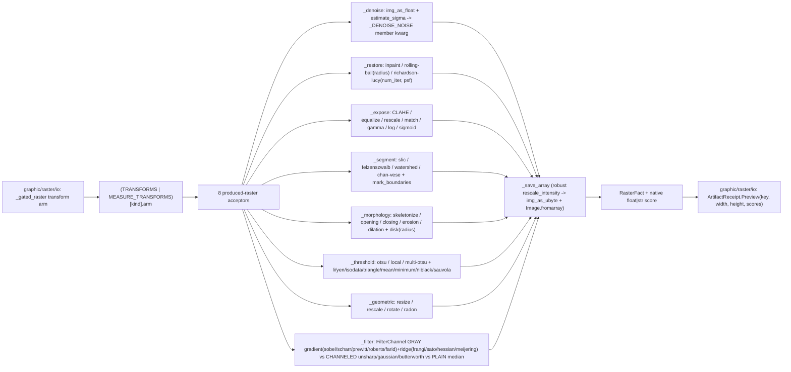

# [PY_ARTIFACTS_GRAPHIC_RASTER_PROCESS]

The scikit-image produced-raster transform engine. ONE engine over the eight transform-engine families that PRODUCE a new raster — `restoration` (the four denoisers plus inpaint/rolling-ball/deconvolution), `exposure` (CLAHE/equalize/rescale/histogram-match/gamma/log/sigmoid), `segmentation` (SLIC/Felzenszwalb/watershed/Chan-Vese), `morphology` (skeletonize/opening/closing/erosion/dilation), `thresholding` (Otsu/local/multi-Otsu plus Li/Yen/Isodata/triangle/mean/minimum and the Niblack/Sauvola local document binarizers), `geometric-transform` (resize/rescale/rotate/Radon), and `filters` (unsharp/gaussian/median/sobel/laplace/frangi/butterworth/gabor/canny plus the scharr/prewitt/roberts/farid gradient and sato/hessian/meijering ridge operators) — folded by the `TRANSFORMS` `frozendict` member-acceptor-kwargs table over the worker band. This page owns the shared transform substrate the measure half composes: the frozen-dataclass `TransformInput`/`TransformArm` carriers and the `_save_array`/`_luminance`/`_channels` helpers, plus the base `TRANSFORMS` table carrying these eight families' fifty-four rows. The `Raster`/`RasterOp` owner, the `Transform` StrEnum vocabulary, and the `_gated_raster` dispatcher live on `graphic/raster/io#IO`; the measurement half (`_measure`/`_register`/`_metrics` plus `MEASURE_TRANSFORMS`) lives on `graphic/raster/measure#MEASURE` and imports this page's substrate. Every acceptor yields one typed `RasterFact` (declared on `graphic/raster/io#IO`, imported here) so the `_gated_raster` `transform` arm folds one shape into `core/receipt#RECEIPT` `ArtifactReceipt.Preview`.

The acceptor is a pure NumPy-array transform: it owns no rail, raises into the `graphic/raster/io#IO` `_transformed` boundary that catches `(ValueError, OSError, KeyError)`, and never re-validates an already-admitted `TransformInput`. scikit-image is a host-native worker package, so the acceptors run only inside the `faults`-owned `to_process.run_sync` worker worker importing `skimage` at boundary scope, never on the runtime owner; the dtype-scale and display-range gates the providers refuse (`estimate_sigma` reads the noise in the operand's own scale, `img_as_ubyte` rejects a float outside `[-1, 1]`) are re-imposed at admission so each member runs on the dtype its algorithm assumes.

## [01]-[INDEX]

- [01]-[PROCESS]: scikit-image produced-raster engine over the eight transform-engine families — the `TRANSFORMS` `frozendict` table folding the four denoise rows, three restoration rows, seven exposure rows, four segmentation rows, eleven thresholding rows, five morphology rows, four geometric rows, and sixteen filter/edge rows into eight acceptors (`_denoise`/`_restore`/`_expose`/`_segment`/`_morphology`/`_threshold`/`_geometric`/`_filter`), each resolving its `TransformArm.member` through one `getattr(<submodule>, member)` and merging the row's `kwargs` policy column under the caller `opts` (`row.kwargs | opts`) so every per-member default rides its row and no magic literal scatters into a body, the shared `TransformInput`/`TransformArm` carriers and `_save_array`/`_luminance`/`_channels` substrate the measure half composes, every member verified against the folder `scikit-image` `.api`, every diagnostic stamped NATIVE onto the `frozendict[str, float | str]` `RasterFact.score` band, all dispatch-table-folded with zero parallel inline dispatch dict and zero mutable module table.

## [02]-[PROCESS]

- Owner: the scikit-image transform engine producing a new raster, the produced-raster half of the `Transform` sub-axis the `graphic/raster/io#IO` `Raster` owner dispatches; `TransformArm` the frozen-dataclass row carrying the submodule `member` an acceptor resolves through one `getattr`, the acceptor `arm`, and the `kwargs` `frozendict` policy column merged under caller `opts`; `TransformInput` the frozen-dataclass `(image, kind, reference, mask, opts)` carrier every acceptor reads, the `opts` an immutable `frozendict[str, float]` matching the `graphic/raster/io#IO` `RasterOp.transform` payload, never an erased `dict` the arm re-validates. `TransformArm`/`TransformInput` are frozen dataclasses, not `msgspec.Struct`, because the row carries a behaviour callable and the carrier threads an in-process `numpy` `Frame` — neither is a wire shape — so the policy-value owner is the doctrine's frozen-dataclass form, not the boundary codec. `TRANSFORMS` the base `frozendict[Transform, TransformArm]` keyed by the `Transform` value, merged with `graphic/raster/measure#MEASURE`'s `MEASURE_TRANSFORMS` at the `graphic/raster/io#IO` `_gated_raster` lookup so the full eighty-two-member dispatch resolves; every acceptor folds into one typed `RasterFact` recovering the re-encoded transform bytes plus a diagnostic `frozendict[str, float | str]` score. The `TRANSFORMS` table is the egress-grade collapse: a row binds the callable arm, its settled `skimage` submodule member, and its default kwargs, the op routes by one table lookup, never a per-operation sibling function and never a re-discriminating `match` inside an arm beyond the per-kind signature variance the submodule forces.
- Cases: the eight produced-raster acceptors fold the fifty-four process-family `Transform` members — `_denoise` (DENOISE_BILATERAL/DENOISE_NL_MEANS/DENOISE_TV/DENOISE_WAVELET, each routing the `estimate_sigma` noise level to its own member kwarg through `_DENOISE_NOISE` over `img_as_float`) · `_restore` (INPAINT biharmonic over a thresholded `as_gray` mask, ROLLING_BALL background subtraction over the row `radius`, DECONVOLVE Richardson-Lucy over a float operand and the row `num_iter`/`psf`) · `_expose` (CLAHE, EQUALIZE, RESCALE_INTENSITY, MATCH_HISTOGRAMS, GAMMA, LOG, SIGMOID over the `is_low_contrast` gate) · `_segment` (SLIC, FELZENSZWALB, marker WATERSHED over the row `markers`, CHAN_VESE over `regionprops_table` region counting and `mark_boundaries` overlay) · `_morphology` (Otsu-binarized SKELETONIZE, OPENING, CLOSING, EROSION, DILATION over the `disk` footprint factory keyed by the row `radius`) · `_threshold` (THRESHOLD_OTSU, THRESHOLD_LOCAL over the `block_size` policy default, THRESHOLD_MULTIOTSU over `np.digitize`, the THRESHOLD_LI/YEN/ISODATA/TRIANGLE/MEAN/MINIMUM global family and the THRESHOLD_NIBLACK/SAUVOLA local document binarizers over the `window_size` policy default, all through the one binary-cut arm) · `_geometric` (RESIZE/RESCALE/ROTATE over their row sizing default, RADON sinogram) · `_filter` (UNSHARP, GAUSSIAN, MEDIAN, SOBEL, LAPLACE, FRANGI, BUTTERWORTH, GABOR, CANNY plus the SCHARR/PREWITT/ROBERTS/FARID gradient and SATO/HESSIAN/MEIJERING ridge operators over the row's `FilterChannel` `GRAY`/`CHANNELED`/`PLAIN` disposition) — each one `TRANSFORMS` row, matched by the composed-table lookup the `graphic/raster/io#IO` dispatcher reads, never a sibling op per scikit-image call.
- Auto: `_gated_raster` folds the `transform` case through the composed `TRANSFORMS[kind].arm(TransformInput(...))`, and each acceptor re-dispatches only on the per-kind signature variance its submodule forces while pushing every other split into a `frozendict` policy — `_denoise` resolves the member, admits the operand to float through `img_as_float`, estimates one scalar `sigma` via `estimate_sigma(average_sigmas=True)`, and routes it to the member's own noise kwarg (`sigma_color` for bilateral, `h`+`sigma` for nl-means, `sigma` for wavelet, none for the TV `weight`) through `_DENOISE_NOISE`; `_restore` branches INPAINT (thresholded `as_gray` mask) / DECONVOLVE (float operand, uniform PSF from the row `psf`/`num_iter`) / rolling-ball (background subtraction over the row `radius`); `_expose` branches MATCH_HISTOGRAMS (reference image) vs the rest over the `is_low_contrast` gate; `_segment` branches WATERSHED (sobel markers from the row `markers`) / CHAN_VESE (float luminance) / the SLIC/Felzenszwalb channel-axis default, then overlays `mark_boundaries` and counts `regionprops_table`; `_morphology` Otsu-binarizes then branches SKELETONIZE (no footprint) vs the four footprint ops over `disk` keyed by the row `radius`; `_threshold` branches THRESHOLD_MULTIOTSU (`np.digitize`) vs the binary cut that serves every scalar and local-array threshold uniformly; `_geometric` branches RESIZE/RESCALE/ROTATE over their row sizing defaults / RADON; `_filter` reads the row's `FilterChannel` disposition under one total `match` — `GRAY` (luminance operand, no channel axis: every gradient/ridge operator plus canny/gabor), `CHANNELED` (raw operand with `channel_axis`: unsharp/gaussian/butterworth), `PLAIN` (raw operand, no channel axis: median) — plus the `feature.canny` module split and the `gabor` real/imag tuple, so `channel_axis` is `_channels(image)` per member (grayscale-safe), the disposition rides the row, and the eight acceptors carry zero mutable module dict and no member can land in two channel buckets at once.
- Receipt: each acceptor folds into `RasterFact` through `_save_array` — the robust display-normalizer that passes a uint8/bool/`[0, 1]`-float array straight to `util.img_as_ubyte` and `exposure.rescale_intensity`s every out-of-range float or integer-label array to `[0, 1]` first, so an edge magnitude exceeding `1.0`, a negative Laplacian, or a multi-Otsu label field re-encodes to a viewable PNG without a per-acceptor min-max — and projects to `core/receipt#RECEIPT` `ArtifactReceipt.Preview(key, width, height, scores)` at the `graphic/raster/io#IO` rail boundary. Every acceptor stamps one diagnostic onto the `RasterFact.score` `frozendict[str, float | str]` the rail consumer reads inline, NATIVE on the float band rather than `str`-coerced — `_denoise` the `sigma` float, `_restore` the `masked`/`background` fraction (float) or deconvolution `iterations` (int), `_expose` the `contrast` low/ok gate (categorical str), `_segment` the `regions` count (int), `_morphology` the `foreground` fraction (float), `_threshold` the `foreground` fraction (float) or class count (int), `_geometric` the output `shape` (categorical str), `_filter` the mean filter `response` (float) — distinct from the measurement scores the `graphic/raster/measure#MEASURE` half stamps, all flowing losslessly onto the `ArtifactReceipt.Preview.scores` band the io owner threads with no coerce.
- Growth: a new produced-raster scikit-image transform is one `Transform` member on `graphic/raster/io#IO` plus one `TRANSFORMS` row here carrying its submodule `member`, acceptor, and default `kwargs` — landing on the matching submodule acceptor with zero new acceptor when the submodule is already mined (a new global threshold is one `_threshold` row, a new ridge filter one `_filter` row defaulting `FilterChannel.GRAY`, a new contrast curve one `_expose` row, a new warp one `_geometric` row); a new transform family is one acceptor plus its rows; the shared `TransformInput`/`TransformArm` substrate and `_save_array`/`_luminance`/`_channels` helpers grow in place rather than per-family duplicates; the catalog `[03]-[ENTRYPOINTS]` surfaces the unmined adjacent members each existing acceptor still absorbs as rows (`difference_of_gaussians`; `white_tophat`/`black_tophat`/`medial_axis`/`thin`/`reconstruction`/`remove_small_objects`; `quickshift`/`random_walker`/`expand_labels`/`morphological_chan_vese`; `swirl`/`warp_polar`/`iradon`; `unsupervised_wiener`/`wiener`/`unwrap_phase`/`calibrate_denoiser`), each one member on `graphic/raster/io#IO` plus one row here; zero new surface.
- Boundary: a per-scikit-image-call sibling function, a parallel acceptor per `Transform` member, a mutable module dispatch dict, a `.get(key, magic)` default in a body, and an erased `dict` opts bag are the deleted forms; no IO/convert/thumbnail/montage working surface (that is `graphic/raster/io#IO`'s pillow/pyvips surface), no media-detect gate (that is `graphic/raster/io#IO`'s python-magic gate), and no measurement half — the `_measure`/`_register`/`_metrics` acceptors that PRODUCE scores rather than a transformed raster are `graphic/raster/measure#MEASURE`'s, which composes this page's `TransformInput`/`TransformArm`/`_save_array`/`_luminance`/`_channels` substrate and contributes its `MEASURE_TRANSFORMS` rows to the merged dispatch. The eight families here all PRODUCE a new raster array `_save_array` re-encodes; the measurement families stamp a scalar onto the score map without a new pixel raster, the clean produced-raster-vs-measured-score axis the split cuts.

```python signature
from collections.abc import Callable
from dataclasses import dataclass
from enum import StrEnum
from io import BytesIO
from typing import assert_never

import numpy as np
from builtins import frozendict
from numpy.typing import NDArray

from artifacts.graphic.raster.io import ConvertFormat, Frame, RasterFact, Transform

lazy from PIL import Image
lazy from skimage import color, exposure, feature, filters, io as skio, measure, morphology, restoration, segmentation, transform, util


class FilterChannel(StrEnum):
    GRAY = "gray"            # luminance operand, no channel axis (gradient + ridge + canny + gabor)
    CHANNELED = "channeled"  # raw operand with channel_axis injected (unsharp / gaussian / butterworth)
    PLAIN = "plain"          # raw operand, no channel axis (median)


@dataclass(frozen=True, slots=True, eq=False)
class TransformInput:
    image: Frame
    kind: Transform
    reference: bytes
    mask: bytes
    opts: frozendict[str, float]


@dataclass(frozen=True, slots=True)
class TransformArm:
    member: str
    arm: Callable[[TransformInput], RasterFact]
    kwargs: frozendict[str, object] = frozendict()
    channel: FilterChannel = FilterChannel.GRAY  # read only by _filter; the per-member operand/channel-axis disposition


def _channels(frame: Frame, /) -> int | None:
    return -1 if frame.ndim == 3 else None


def _luminance(frame: Frame, /) -> NDArray[np.floating]:
    return color.rgb2gray(frame) if frame.ndim == 3 else util.img_as_float(frame)


def _save_array(array: NDArray[np.floating | np.integer | np.bool_], score: frozendict[str, float | str], /) -> RasterFact:
    framed = (
        array
        if array.dtype in (np.uint8, np.bool_) or (np.issubdtype(array.dtype, np.floating) and 0.0 <= float(array.min()) and float(array.max()) <= 1.0)
        else exposure.rescale_intensity(array.astype(np.float64), out_range=(0.0, 1.0))
    )
    image = Image.fromarray(util.img_as_ubyte(framed))
    sink = BytesIO()
    image.save(sink, format=ConvertFormat.PNG.value)
    return RasterFact(sink.getvalue(), *image.size, score)


_DENOISE_NOISE: frozendict[Transform, Callable[[float], frozendict[str, float]]] = frozendict({
    Transform.DENOISE_BILATERAL: lambda sigma: frozendict({"sigma_color": sigma}),
    Transform.DENOISE_NL_MEANS: lambda sigma: frozendict({"h": 0.8 * sigma, "sigma": sigma}),
    Transform.DENOISE_WAVELET: lambda sigma: frozendict({"sigma": sigma}),
})


def _denoise(tx: TransformInput) -> RasterFact:
    row, axis = TRANSFORMS[tx.kind], _channels(tx.image)
    image = util.img_as_float(tx.image)
    sigma = float(restoration.estimate_sigma(image, average_sigmas=True, channel_axis=axis))
    tuned = _DENOISE_NOISE[tx.kind](sigma) if tx.kind in _DENOISE_NOISE else frozendict()
    member = getattr(restoration, row.member)
    return _save_array(member(image, channel_axis=axis, **(row.kwargs | tuned | tx.opts)), frozendict({"sigma": sigma}))


def _restore(tx: TransformInput) -> RasterFact:
    row = TRANSFORMS[tx.kind]
    member, axis, opts = getattr(restoration, row.member), _channels(tx.image), row.kwargs | tx.opts
    match tx.kind:
        case Transform.INPAINT:
            mask = skio.imread(BytesIO(tx.mask), as_gray=True) > 0.0
            return _save_array(member(tx.image, mask, channel_axis=axis), frozendict({"masked": float(mask.mean())}))
        case Transform.DECONVOLVE:
            image, iters, span = util.img_as_float(tx.image), int(opts["num_iter"]), int(opts["psf"])
            psf = np.ones((span, span), dtype=np.float64) / float(span * span)
            return _save_array(member(image, psf, num_iter=iters, channel_axis=axis), frozendict({"iterations": iters}))
        case _:
            background = member(tx.image, radius=int(opts["radius"]))
            return _save_array(tx.image - background, frozendict({"background": float(background.mean())}))


def _expose(tx: TransformInput) -> RasterFact:
    row = TRANSFORMS[tx.kind]
    member = getattr(exposure, row.member)
    score = frozendict({"contrast": "low" if exposure.is_low_contrast(tx.image) else "ok"})
    match tx.kind:
        case Transform.MATCH_HISTOGRAMS:
            reference = skio.imread(BytesIO(tx.reference))
            return _save_array(member(tx.image, reference, channel_axis=_channels(tx.image)), score)
        case _:
            return _save_array(member(tx.image, **(row.kwargs | tx.opts)), score)


def _segment(tx: TransformInput) -> RasterFact:
    row = TRANSFORMS[tx.kind]
    opts = row.kwargs | tx.opts
    match tx.kind:
        case Transform.WATERSHED:
            labels = segmentation.watershed(filters.sobel(_luminance(tx.image)), markers=int(opts["markers"]))
        case Transform.CHAN_VESE:
            labels = segmentation.chan_vese(_luminance(tx.image), **opts).astype(int)
        case _:
            labels = getattr(segmentation, row.member)(tx.image, channel_axis=_channels(tx.image), **opts)
    overlay = segmentation.mark_boundaries(tx.image, labels)
    regions = int(measure.regionprops_table(labels, properties=("label",))["label"].size)
    return _save_array(overlay, frozendict({"regions": regions}))


def _morphology(tx: TransformInput) -> RasterFact:
    row = TRANSFORMS[tx.kind]
    gray = _luminance(tx.image)
    binary = gray > filters.threshold_otsu(gray)
    member = getattr(morphology, row.member)
    result = member(binary) if tx.kind is Transform.SKELETONIZE else member(binary, morphology.disk(int((row.kwargs | tx.opts)["radius"])))
    return _save_array(result, frozendict({"foreground": float(result.mean())}))


def _threshold(tx: TransformInput) -> RasterFact:
    row = TRANSFORMS[tx.kind]
    gray = _luminance(tx.image)
    cut = getattr(filters, row.member)(gray, **(row.kwargs | tx.opts))
    match tx.kind:
        case Transform.THRESHOLD_MULTIOTSU:
            return _save_array(np.digitize(gray, cut), frozendict({"classes": len(cut) + 1}))
        case _:
            mask = gray > cut
            return _save_array(mask, frozendict({"foreground": float(mask.mean())}))


def _geometric(tx: TransformInput) -> RasterFact:
    row = TRANSFORMS[tx.kind]
    member, opts = getattr(transform, row.member), row.kwargs | tx.opts
    match tx.kind:
        case Transform.RESIZE:
            warped = member(tx.image, (int(opts["rows"]), int(opts["cols"])), anti_aliasing=True)
        case Transform.RESCALE:
            warped = member(tx.image, float(opts["scale"]), channel_axis=_channels(tx.image), anti_aliasing=True)
        case Transform.ROTATE:
            warped = member(tx.image, float(opts["angle"]), resize=True)
        case _:
            warped = member(_luminance(tx.image))
    return _save_array(warped, frozendict({"shape": "x".join(str(dim) for dim in warped.shape[:2])}))


def _filter(tx: TransformInput) -> RasterFact:
    row = TRANSFORMS[tx.kind]
    member = getattr(feature if tx.kind is Transform.CANNY else filters, row.member)
    match row.channel:
        case FilterChannel.GRAY:
            source, channel = _luminance(tx.image), frozendict()
        case FilterChannel.CHANNELED:
            source, channel = tx.image, frozendict({"channel_axis": _channels(tx.image)})
        case FilterChannel.PLAIN:
            source, channel = tx.image, frozendict()
        case _ as unreachable:
            assert_never(unreachable)
    raw = member(source, **(channel | row.kwargs | tx.opts))
    out = raw[0] if tx.kind is Transform.GABOR else raw
    return _save_array(out, frozendict({"response": float(out.mean())}))


TRANSFORMS: frozendict[Transform, TransformArm] = frozendict({
    Transform.DENOISE_BILATERAL: TransformArm("denoise_bilateral", _denoise),
    Transform.DENOISE_NL_MEANS: TransformArm("denoise_nl_means", _denoise, frozendict({"fast_mode": True, "patch_size": 5, "patch_distance": 6})),
    Transform.DENOISE_TV: TransformArm("denoise_tv_chambolle", _denoise, frozendict({"weight": 0.1})),
    Transform.DENOISE_WAVELET: TransformArm("denoise_wavelet", _denoise),
    Transform.INPAINT: TransformArm("inpaint_biharmonic", _restore),
    Transform.ROLLING_BALL: TransformArm("rolling_ball", _restore, frozendict({"radius": 50})),
    Transform.DECONVOLVE: TransformArm("richardson_lucy", _restore, frozendict({"num_iter": 10, "psf": 5})),
    Transform.CLAHE: TransformArm("equalize_adapthist", _expose),
    Transform.EQUALIZE: TransformArm("equalize_hist", _expose),
    Transform.RESCALE_INTENSITY: TransformArm("rescale_intensity", _expose),
    Transform.MATCH_HISTOGRAMS: TransformArm("match_histograms", _expose),
    Transform.GAMMA: TransformArm("adjust_gamma", _expose),
    Transform.LOG: TransformArm("adjust_log", _expose),
    Transform.SIGMOID: TransformArm("adjust_sigmoid", _expose),
    Transform.SLIC: TransformArm("slic", _segment),
    Transform.FELZENSZWALB: TransformArm("felzenszwalb", _segment),
    Transform.WATERSHED: TransformArm("watershed", _segment, frozendict({"markers": 250})),
    Transform.CHAN_VESE: TransformArm("chan_vese", _segment),
    Transform.UNSHARP: TransformArm("unsharp_mask", _filter, channel=FilterChannel.CHANNELED),
    Transform.GAUSSIAN: TransformArm("gaussian", _filter, channel=FilterChannel.CHANNELED),
    Transform.MEDIAN: TransformArm("median", _filter, channel=FilterChannel.PLAIN),
    Transform.SOBEL: TransformArm("sobel", _filter),
    Transform.LAPLACE: TransformArm("laplace", _filter),
    Transform.FRANGI: TransformArm("frangi", _filter),
    Transform.BUTTERWORTH: TransformArm("butterworth", _filter, channel=FilterChannel.CHANNELED),
    Transform.GABOR: TransformArm("gabor", _filter, frozendict({"frequency": 0.6})),
    Transform.CANNY: TransformArm("canny", _filter),
    Transform.SCHARR: TransformArm("scharr", _filter),
    Transform.PREWITT: TransformArm("prewitt", _filter),
    Transform.ROBERTS: TransformArm("roberts", _filter),
    Transform.FARID: TransformArm("farid", _filter),
    Transform.SATO: TransformArm("sato", _filter),
    Transform.HESSIAN: TransformArm("hessian", _filter),
    Transform.MEIJERING: TransformArm("meijering", _filter),
    Transform.THRESHOLD_OTSU: TransformArm("threshold_otsu", _threshold),
    Transform.THRESHOLD_LOCAL: TransformArm("threshold_local", _threshold, frozendict({"block_size": 35})),
    Transform.THRESHOLD_MULTIOTSU: TransformArm("threshold_multiotsu", _threshold),
    Transform.THRESHOLD_LI: TransformArm("threshold_li", _threshold),
    Transform.THRESHOLD_YEN: TransformArm("threshold_yen", _threshold),
    Transform.THRESHOLD_ISODATA: TransformArm("threshold_isodata", _threshold),
    Transform.THRESHOLD_TRIANGLE: TransformArm("threshold_triangle", _threshold),
    Transform.THRESHOLD_MEAN: TransformArm("threshold_mean", _threshold),
    Transform.THRESHOLD_MINIMUM: TransformArm("threshold_minimum", _threshold),
    Transform.THRESHOLD_NIBLACK: TransformArm("threshold_niblack", _threshold, frozendict({"window_size": 15})),
    Transform.THRESHOLD_SAUVOLA: TransformArm("threshold_sauvola", _threshold, frozendict({"window_size": 15})),
    Transform.SKELETONIZE: TransformArm("skeletonize", _morphology),
    Transform.OPENING: TransformArm("binary_opening", _morphology, frozendict({"radius": 1})),
    Transform.CLOSING: TransformArm("binary_closing", _morphology, frozendict({"radius": 1})),
    Transform.EROSION: TransformArm("binary_erosion", _morphology, frozendict({"radius": 1})),
    Transform.DILATION: TransformArm("binary_dilation", _morphology, frozendict({"radius": 1})),
    Transform.RESIZE: TransformArm("resize", _geometric, frozendict({"rows": 256, "cols": 256})),
    Transform.RESCALE: TransformArm("rescale", _geometric, frozendict({"scale": 0.5})),
    Transform.ROTATE: TransformArm("rotate", _geometric, frozendict({"angle": 90.0})),
    Transform.RADON: TransformArm("radon", _geometric),
})
```

The scikit-image `Transform` produced-raster engine is the egress-grade collapse over the eight transform-engine families: a `TransformArm` row names the submodule `member` the acceptor resolves through one `getattr`, carries the acceptor `arm`, and threads the `kwargs` `frozendict` policy column — every per-member default (the deconvolution `num_iter`/`psf`, the rolling-ball `radius`, the watershed `markers`, the footprint `radius`, the resize `rows`/`cols`, the rotate `angle`, the rescale `scale`, the `threshold_local` `block_size`, the Niblack/Sauvola `window_size`) riding its row and merged under the caller `opts` (`row.kwargs | opts`) so no magic literal scatters into a body; the base `TRANSFORMS` table is one `frozendict` keyed by the `Transform` value, and the `graphic/raster/io#IO` `_gated_raster` is one composed-table lookup. `_denoise` admits to float and routes the scalar `estimate_sigma` to each member's own kwarg through `_DENOISE_NOISE`; `_filter` reads each row's `FilterChannel` disposition so `median` (`PLAIN`) takes no channel axis, `unsharp`/`gaussian`/`butterworth` (`CHANNELED`) inject `channel_axis`, and the gradient (`sobel`/`scharr`/`prewitt`/`roberts`/`farid`) and ridge (`frangi`/`sato`/`hessian`/`meijering`) filters (`GRAY`) run on `_luminance`, the row the single edit site so a member cannot land in two buckets; `_threshold` serves the full global family and the Niblack/Sauvola local binarizers through one binary-cut arm beside the multi-Otsu `np.digitize`; `_save_array` is the robust display-normalizer that `rescale_intensity`s any out-of-range or label-valued array before re-encode and admits the bool/uint8/`[0, 1]`-float producer dtype directly; `_channels` makes every channel axis grayscale-safe. Each acceptor stamps a NATIVE `float`/`int` diagnostic (or a categorical `str` for the `contrast`/`shape` facts) onto the `frozendict[str, float | str]` band the `graphic/raster/io#IO` `RasterFact.score` owner declares, so the `core/receipt#RECEIPT` `ArtifactReceipt.Preview.scores` projection reads the metric signals as numbers with no `str()` coerce. The `TransformInput` carrier threads the `(image, kind, reference, mask, opts)` payload as a frozen dataclass with `opts` an immutable `frozendict[str, float]`, the `TransformArm` row the `member`/`arm`/`kwargs` columns — both the shared substrate the measure half composes: the `graphic/raster/measure#MEASURE` half imports all five substrate symbols from this page and contributes its measurement rows to the merged `TRANSFORMS | MEASURE_TRANSFORMS` dispatch.



## [03]-[RESEARCH]

- [SCIKIT_TRANSFORM_SETTLED] [RESOLVED]: the eight produced-raster scikit-image families are SETTLED fence code verified member-by-member against the folder `.api` catalogue for `scikit-image`. The `restoration` arms verify against `[03]-[ENTRYPOINTS]` restoration rows [01]-[08]: row [01] `denoise_bilateral(..., sigma_color, sigma_spatial, ...)` takes no `sigma`, row [04] `denoise_tv_chambolle(image, weight, ...)` takes `weight`, so the uniform `sigma=` of a naive fence is the `_DENOISE_NOISE` per-member routing (`sigma_color` bilateral / `h`+`sigma` nl-means / `sigma` wavelet / `weight` TV), row [05] `estimate_sigma(image, average_sigmas, *, channel_axis)` supplies the scalar noise on an `img_as_float`-admitted operand so the estimate matches the `[0, 1]` scale the denoisers assume. The `exposure` arms verify against exposure rows [01]-[06], [08]-[09] (`adjust_sigmoid` row [09]); the `segmentation` arms against rows [01]-[03], [05] plus `mark_boundaries` (row [10]) and `regionprops_table` (measure row [03]); the `morphology` arms against rows [01]-[04], [10] plus `disk` (row [11]); the `transform` arms against geometric rows [01]-[03], [09]; the `filters` arms against rows [01]-[03], [07]-[11] plus the gradient operators `scharr`/`prewitt`/`roberts`/`farid` (row [12]) and the ridge operators `sato`/`hessian`/`meijering` (row [13]), and the threshold family `threshold_otsu`/`threshold_local`/`threshold_multiotsu` (rows [04]-[06]) plus `threshold_li`/`threshold_yen`/`threshold_isodata`/`threshold_triangle`/`threshold_mean`/`threshold_minimum` (row [15]) and the local document binarizers `threshold_niblack`/`threshold_sauvola` (row [16]) — row [03] `median(image, footprint, out, mode, cval, behavior)` carries no `channel_axis`, so `median`'s row is `FilterChannel.PLAIN`, and row [05] `threshold_local(image, block_size, ...)` requires `block_size`, carried as the row default beside the Niblack/Sauvola `window_size`; the `feature.canny` edge arm verifies against feature row [01]. The `[04]-[IMPLEMENTATION_LAW]` `channel_axis` law (multichannel `channel_axis` is integer-or-`None`, never inferred) is honored by `_channels(image)` returning `-1` for an RGB operand and `None` for grayscale, and the `img_as_float`/`img_as_ubyte` dtype-boundary law is honored by `_save_array`'s range gate. The measurement families' rows carry their own portion of `[SCIKIT_TRANSFORM_SETTLED]` on `graphic/raster/measure#MEASURE`.
- [SCORE_NATIVE] [RESOLVED]: every acceptor stamps its diagnostic NATIVE onto the `frozendict[str, float | str]` band the `graphic/raster/io#IO` `RasterFact.score` owner declares — `sigma`/`masked`/`background`/`foreground`/`response` as `float`, `iterations`/`regions`/`classes` as `int`, `contrast`/`shape` as the genuinely-categorical `str` — replacing the prior `frozendict[str, str]` form that `str`-coerced every metric. The `core/receipt#RECEIPT` `ArtifactReceipt.Preview.scores: frozendict[str, float | str]` and its `_facts` arm flatten the band into `{"width", "height", **scores}`, and `graphic/raster/io#IO` `_previewed` threads `fact.score` straight onto `Preview.scores`, so the perceptual/numeric facts reach the structured log line as numbers with no coerce. `_save_array`'s `score` parameter and the `array` operand widen to `frozendict[str, float | str]` and `NDArray[np.floating | np.integer | np.bool_]` so the bool morphology/threshold producers the body already routes through `util.img_as_ubyte` are typed at the seam.
- [DEFAULTS_ON_ROWS] [RESOLVED]: every per-member numeric default rides its `TransformArm.kwargs` row and the body reads the merged `row.kwargs | opts`, so a default has one edit site on the table and never a `.get(key, magic)` literal scattered into an acceptor: the rolling-ball `radius`, the deconvolution `num_iter`/`psf`, the watershed `markers`, the morphology footprint `radius`, the resize `rows`/`cols`, the rotate `angle`, the rescale `scale`, the `threshold_local` `block_size`, and the Niblack/Sauvola `window_size` are all row columns the caller `opts` overrides. This honours the `[TRANSFORM_FROZEN]` law that a per-member default is a row column, and a new default-bearing member is one row, never a body edit.
- [SAVE_NORMALIZE] [RESOLVED]: `_save_array` is the substrate display-normalizer the eight acceptors and the three measure acceptors share. The `[04]-[IMPLEMENTATION_LAW]` dtype axis fixes that `img_as_ubyte` accepts uint8 directly and a float only in `[-1, 1]`, so an edge magnitude (`sobel`/`scharr`/`laplace` exceeding `1.0` or negative), a Radon sinogram, and a `np.digitize` multi-Otsu label field would raise; `_save_array` passes a uint8/bool/`[0, 1]`-float array through and `exposure.rescale_intensity(..., out_range=(0.0, 1.0))`s every other array first, so a per-acceptor `array / array.max()` normalization is one substrate gate and no edge-filter output crashes the re-encode. The acceptors hand `_save_array` the native producer dtype (float `[0, 1]`, bool, uint8, or label int) and the substrate owns the viewable projection.
- [TRANSFORM_FROZEN] [RESOLVED]: the dispatch table, the policy column, the caller opts, and the score map are all `frozendict`, never a mutable `dict`. `TRANSFORMS: frozendict[Transform, TransformArm]` is the immutable owner the `language.md` `[FROZENDICT_TABLE_SITE]` legislates over a module-level dictionary used as a policy table; `TransformArm.kwargs: frozendict[str, object] = frozendict()` is the frozen-dataclass default the doctrine's POLICY_VALUES card prescribes for a callable-bearing row (the `arm: Callable[[TransformInput], RasterFact]` field is why `TransformArm` is a frozen dataclass and not a `msgspec.Struct` wire owner); `TransformInput.opts: frozendict[str, float]` matches the `graphic/raster/io#IO` `RasterOp.transform` payload exactly so the carrier crosses the worker seam immutable. The merge `row.kwargs | opts` is one `frozendict` union per call, the caller `opts` overriding the row default.
- [PROCESS_SUBSTRATE] [RESOLVED]: this page owns the shared transform substrate the measure half composes — the frozen-dataclass `TransformInput`/`TransformArm` carriers and the `_save_array`/`_luminance`/`_channels` helpers — declared here as the larger transform-engine owner. Both carriers are frozen dataclasses, not `msgspec.Struct`: `TransformInput` threads an in-process `numpy` `Frame` and is constructed and consumed entirely inside the worker worker (never serialized), and `TransformArm` carries a behaviour callable, so the doctrine's frozen-dataclass policy-value owner is the right shape over the boundary codec. `graphic/raster/measure#MEASURE` imports the substrate (`from artifacts.graphic.raster.process import TransformInput, TransformArm, _save_array, _luminance`) and never re-declares it, so the produced-raster and measured-score acceptors fold one `TransformInput` carrier, one `TransformArm` row shape, and one `_save_array` re-encode path; `_channels` is the grayscale-safe channel-axis resolver the measure half's HOG arm adopts in place of a hardcoded `channel_axis=-1`. The base `TRANSFORMS` table here carries the fifty-four process-family member rows; the measure page contributes `MEASURE_TRANSFORMS` of its twenty-eight measure-family rows, and the `graphic/raster/io#IO` `_gated_raster` composes the merged `TRANSFORMS | MEASURE_TRANSFORMS` dispatch so all eighty-two `Transform` members resolve with each member landing in exactly one page's rows. `RasterFact`/`Transform`/`ConvertFormat`/`Frame` are imported from `graphic/raster/io#IO` and never re-declared.
- [FAMILY_COMPLETION] [RESOLVED]: the sixteen members this rebuild adds — the exposure curve `SIGMOID`, the filter gradient operators `SCHARR`/`PREWITT`/`ROBERTS`/`FARID` and ridge operators `SATO`/`HESSIAN`/`MEIJERING`, and the global threshold family `THRESHOLD_LI`/`THRESHOLD_YEN`/`THRESHOLD_ISODATA`/`THRESHOLD_TRIANGLE`/`THRESHOLD_MEAN`/`THRESHOLD_MINIMUM` plus the local document binarizers `THRESHOLD_NIBLACK`/`THRESHOLD_SAUVOLA` — close the three thinnest produced-raster slices (one of nine global thresholds, two of six gradient operators, one of four ridge filters), each a catalog-confirmed zero-new-branch sibling landing as one `TRANSFORMS` row through the existing acceptor. They are landed on the `graphic/raster/io#IO` `Transform` `StrEnum` (the single vocabulary owner); none requires a reference or mask, so `_REFERENCE_REQUIRED` does not grow. The process-family row count is fifty-four and the composed `TRANSFORMS | MEASURE_TRANSFORMS` dispatch eighty-two (the measure half twenty-eight rows), the dispatch-count prose across `graphic/raster/io#IO`, `graphic/raster/measure#MEASURE`, and this page reading eighty-two.
