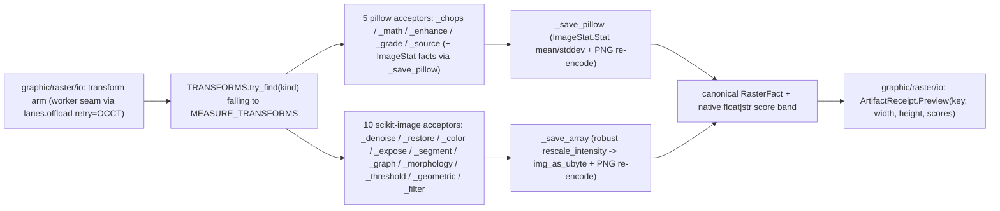

# [PY_ARTIFACTS_GRAPHIC_RASTER_PROCESS]

The produced-raster behavior engine and the raster plane's vocabulary owner. This page declares the shared vocabulary every raster sibling composes downward — the `Transform` StrEnum sub-axis, the `TransformInput`/`TransformArm` carriers, the canonical `RasterFact`, `ConvertFormat`, and the `Frame` pixel alias — importing NOTHING raster-internal, so the plane's import direction is `io → measure → process` and policy binds above the vocabulary. The two produced-raster engines fold through one dispatch shape: the pillow working families (ImageChops channel algebra, ImageMath band expressions, ImageEnhance factors, Color3DLUT grade, the procedural gradient/noise/mandelbrot/spread sources) and the scikit-image transform families (denoising, restoration, color, exposure, segmentation, graph, morphology, thresholding, geometric-transform, filters); the scikit-image rows are census-gated until the cp315 wheel lands, the pillow families carrying the plane ungated.

Every acceptor is a pure NumPy/PIL transform: it owns no rail, raises into the `graphic/raster/io#IO` boundary that catches `(ValueError, OSError, KeyError)`, and never re-validates an admitted `TransformInput`. pillow and scikit-image are host-native worker packages, so acceptors execute only inside io's worker crossing under the runtime `lanes.offload(kernel, retry=RetryClass.OCCT)` bound — this page mints no limiter, retry, or worker handle. The dtype-scale gates the providers demand (`estimate_sigma` reads noise in the operand's own scale, `img_as_ubyte` rejects a float outside `[-1, 1]`) are re-imposed at admission so each member runs on the dtype its algorithm assumes.

## [01]-[INDEX]

- [01]-[PROCESS]: the raster plane's vocabulary owner (`Transform`/`ConvertFormat`/`Frame`/`RasterFact`/`TransformInput`/`TransformArm`, zero raster-internal imports) plus the produced-raster engine — the `TRANSFORMS` `Map` folding the census-gated scikit-image rows into ten acceptors and the ungated pillow rows into five, each resolving its provider `member` through one `getattr` and merging `row.kwargs | opts`, every diagnostic stamped native onto `RasterFact.score`.

## [02]-[PROCESS]

- Owner: the raster plane's shared vocabulary and the produced-raster half of the `Transform` sub-axis the `graphic/raster/io#IO` `Raster` owner dispatches. The vocabulary is one owner block declared here — `Transform` the StrEnum sub-axis (produced-raster scikit-image + pillow rows plus the measured rows whose acceptor bodies live on `graphic/raster/measure#MEASURE`), `ConvertFormat`, the `Frame` `NDArray[np.uint8]` alias, `RasterFact` the plane's ONE fact shape (bytes + dimensions + the `frozendict[str, float | str]` score band; `Map` is the table form, never a payload slot), `TransformInput` the frozen-dataclass `(image, kind, reference, mask, opts)` carrier, and `TransformArm` the row carrying the provider `member`, the acceptor `arm`, the `kwargs` policy column, and the `FilterChannel`/`MorphKind` dispositions. `TransformArm`/`TransformInput` are frozen dataclasses, not `msgspec.Struct`, because one carries a callable and the other threads an in-process `numpy` `Frame` — neither is a wire shape. `TRANSFORMS` is the one `Final[Map[Transform, TransformArm]]`; io resolves a kind against it falling to `graphic/raster/measure#MEASURE`'s `MEASURE_TRANSFORMS`, so the full dispatch resolves with each member in exactly one page's rows, never a per-operation sibling and never a re-discriminating `match` beyond the per-kind signature variance the provider forces.
- Cases: the five pillow acceptors fold the ungated rows — `_chops` (ImageChops two-image channel algebra over the decoded `reference`, `add`/`subtract` `scale`/`offset` on their rows), `_math` (`ImageMath.lambda_eval` gain/bias affine), `_enhance` (the `ImageEnhance` factors), `_grade` (`Color3DLUT` trilinear apply; the flattened float32 table rides `reference` so LUT AUTHORING stays `graphic/color/managed`'s and this arm only APPLIES), `_source` (procedural gradient/noise/mandelbrot fields and `effect_spread`). The ten scikit-image acceptors fold the census-gated rows — `_denoise`/`_restore`/`_color`/`_expose`/`_segment`/`_graph`/`_morphology`/`_threshold`/`_geometric`/`_filter` — each one `TRANSFORMS` row, matched by io's composed-table lookup, never a sibling op per provider call.
- Auto: each acceptor re-dispatches only on the per-kind signature variance its provider forces, pushing every other split onto a row policy. `_denoise` admits to float, estimates one scalar `sigma` via `estimate_sigma(average_sigmas=True)`, and routes it to the member's own noise kwarg through `_DENOISE_NOISE`; `_restore` branches INPAINT/DECONVOLVE/WIENER/UNSUPERVISED_WIENER/UNWRAP_PHASE/rolling-ball over one `_psf` builder; `_morphology` Otsu-binarizes then reads the row's `MorphKind` under one total `match` closed by `assert_never`; `_filter` reads the row's `FilterChannel` (GRAY luminance, CHANNELED with `channel_axis` injected, PLAIN, RANK uint8 + `disk(radius)`) plus the `feature.canny` module split and the `gabor` real/imag tuple; `_threshold` branches HYSTERESIS and THRESHOLD_MULTIOTSU (`np.digitize`) vs the binary cut; `_segment`/`_graph` branch the level-set/boundary/border and MIN_COST_PATH/RAG forms then overlay `mark_boundaries` and count `regionprops_table`; `_geometric` branches the sizing/warp/sinogram forms including the WARP homography from the 4 corners to the opts-displaced corners. `channel_axis` is `_channels(image)` per member (grayscale-safe), and no member lands in two channel or morphology buckets.
- Receipt: each acceptor folds into the canonical `RasterFact` declared here — the scikit arms through `_save_array`, the robust display-normalizer that passes a uint8/bool/`[0, 1]`-float array straight to `img_as_ubyte` and `rescale_intensity`s every out-of-range float or label array to `[0, 1]` first, so an edge magnitude past `1.0`, a negative Laplacian, or a multi-Otsu label field re-encodes without a per-acceptor min-max; the pillow arms through `_save_pillow`, folding `ImageStat.Stat` luminance `mean`/`stddev` under the acceptor's own stamp. io projects the fact to `core/receipt#RECEIPT` `ArtifactReceipt.Preview(key, width, height, scores)`, threading `fact.score` with no coerce — distinct from the measurement scores `graphic/raster/measure#MEASURE` stamps.
- Growth: a new produced-raster member is one `Transform` member here plus one `TRANSFORMS` row carrying its provider `member`, acceptor, and default `kwargs` — landing on the matching acceptor with zero new acceptor when the provider surface is mined; a new family is one acceptor plus its rows; the `MorphKind`/`FilterChannel` dispositions absorb a new operand/footprint sibling as one row; a new measured-score member is one `Transform` member here plus one row on `graphic/raster/measure#MEASURE`. The genuine deferrals stay: `random_walker`/`expand_labels`/`join_segmentations` (a seed-label or second-segmentation input the acceptor does not synthesize), `active_contour` (an explicit init snake), `calibrate_denoiser` (returns a denoiser, not a raster), `convert_colorspace` (a string space-pair the float-only `opts` cannot express), and the `Color3DLUT.generate(size, callback)` callable-row form — each one row once its input arrives.
- Packages: `pillow` (`ImageChops`/`ImageMath`/`ImageStat`/`ImageEnhance`/`ImageFilter.Color3DLUT`/`Image.linear_gradient`/`radial_gradient`/`effect_noise`/`effect_mandelbrot`/`effect_spread` — the ungated engine); `scikit-image` (the ten families at the members the rows name, census-gated on the cp315 wheel); `numpy` (operand algebra, `frombuffer`/`digitize`/`ptp`); `msgspec` (`Struct` the `RasterFact` wire shape); `expression` (`Map.of_seq`); stdlib `dataclasses`/`enum`/`io`.
- Boundary: no IO/convert/thumbnail/montage working surface and no policy above the vocabulary — the codec-POLICY rows binding `ConvertFormat` → engine/save-args and the `_REFERENCE_REQUIRED` admission rows stay `graphic/raster/io#IO`'s. No measurement half: the `_measure`/`_register`/`_metrics` acceptors that PRODUCE scores rather than a transformed raster are `graphic/raster/measure#MEASURE`'s, importing this substrate and contributing `MEASURE_TRANSFORMS`. A per-provider-call sibling, a parallel acceptor per member, a mutable module dispatch dict, a `.get(key, magic)` body default, an erased `dict` opts bag, and a re-declaration of any vocabulary owner here are the rejected forms — `RasterFact` is the plane's ONE fact shape (`marks/encode`'s minimal twin resolves to this canonical).

```python signature
from collections.abc import Callable
from dataclasses import dataclass
from enum import StrEnum
from io import BytesIO
from typing import Final, assert_never

import numpy as np
from expression.collections import Map
from msgspec import Struct
from numpy.typing import NDArray

lazy from PIL import Image, ImageChops, ImageEnhance, ImageFilter, ImageMath, ImageStat
lazy from skimage import color, exposure, feature, filters, graph, io as skio, measure, morphology, restoration, segmentation, transform, util

type Frame = NDArray[np.uint8]


class Transform(StrEnum):  # the raster sub-axis vocabulary declared HERE; measured-row acceptor bodies live on graphic/raster/measure
    # --- produced-raster scikit-image families (census-gated: the marker drops when the cp315 wheel lands)
    DENOISE_BILATERAL = "denoise-bilateral"
    DENOISE_NL_MEANS = "denoise-nl-means"
    DENOISE_TV = "denoise-tv"
    DENOISE_WAVELET = "denoise-wavelet"
    INPAINT = "inpaint"
    ROLLING_BALL = "rolling-ball"
    DECONVOLVE = "deconvolve"
    WIENER = "wiener"  # restoration.wiener supervised deconvolution
    UNSUPERVISED_WIENER = "unsupervised-wiener"  # restoration.unsupervised_wiener self-tuned Wiener-Hunt
    UNWRAP_PHASE = "unwrap-phase"  # restoration.unwrap_phase 2D phase-unwrap
    SEPARATE_STAINS = "separate-stains"  # color.separate_stains H&E/HDX unmixing (_color)
    COMBINE_STAINS = "combine-stains"  # color.combine_stains inverse remix (_color)
    YCBCR = "ycbcr"
    RGB2HSV = "rgb2hsv"
    RGB2LAB = "rgb2lab"
    LAB2RGB = "lab2rgb"
    CLAHE = "clahe"
    EQUALIZE = "equalize"
    RESCALE_INTENSITY = "rescale-intensity"
    MATCH_HISTOGRAMS = "match-histograms"  # reference-consuming
    GAMMA = "gamma"
    LOG = "log"
    SIGMOID = "sigmoid"
    SLIC = "slic"
    FELZENSZWALB = "felzenszwalb"
    QUICKSHIFT = "quickshift"
    WATERSHED = "watershed"
    CHAN_VESE = "chan-vese"
    MORPHOLOGICAL_CHAN_VESE = "morphological-chan-vese"
    MORPHOLOGICAL_GEODESIC = "morphological-geodesic"  # over inverse_gaussian_gradient (_segment)
    FIND_BOUNDARIES = "find-boundaries"
    CLEAR_BORDER = "clear-border"
    RAG_CUT_THRESHOLD = "rag-cut-threshold"  # graph.cut_threshold over the mean-color RAG (_graph)
    RAG_CUT_NORMALIZED = "rag-cut-normalized"
    RAG_MERGE = "rag-merge"
    MIN_COST_PATH = "min-cost-path"  # graph.route_through_array over the luminance cost (_graph)
    UNSHARP = "unsharp"
    GAUSSIAN = "gaussian"
    MEDIAN = "median"
    SOBEL = "sobel"
    LAPLACE = "laplace"
    FRANGI = "frangi"
    BUTTERWORTH = "butterworth"
    GABOR = "gabor"
    DIFFERENCE_OF_GAUSSIANS = "difference-of-gaussians"
    CANNY = "canny"
    SCHARR = "scharr"
    PREWITT = "prewitt"
    ROBERTS = "roberts"
    FARID = "farid"
    SATO = "sato"
    HESSIAN = "hessian"
    MEIJERING = "meijering"
    RANK_MEAN = "rank-mean"  # filters.rank.* footprint-local (_filter RANK)
    RANK_MEDIAN = "rank-median"
    RANK_MAXIMUM = "rank-maximum"
    RANK_ENTROPY = "rank-entropy"
    RANK_AUTOLEVEL = "rank-autolevel"
    RANK_GRADIENT = "rank-gradient"
    THRESHOLD_OTSU = "threshold-otsu"
    THRESHOLD_LOCAL = "threshold-local"
    THRESHOLD_MULTIOTSU = "threshold-multiotsu"
    THRESHOLD_LI = "threshold-li"
    THRESHOLD_YEN = "threshold-yen"
    THRESHOLD_ISODATA = "threshold-isodata"
    THRESHOLD_TRIANGLE = "threshold-triangle"
    THRESHOLD_MEAN = "threshold-mean"
    THRESHOLD_MINIMUM = "threshold-minimum"
    THRESHOLD_NIBLACK = "threshold-niblack"
    THRESHOLD_SAUVOLA = "threshold-sauvola"
    HYSTERESIS = "hysteresis"  # filters.apply_hysteresis_threshold two-level binarize (_threshold)
    SKELETONIZE = "skeletonize"
    MEDIAL_AXIS = "medial-axis"
    THIN = "thin"
    CONVEX_HULL = "convex-hull"
    OPENING = "opening"
    CLOSING = "closing"
    EROSION = "erosion"
    DILATION = "dilation"
    WHITE_TOPHAT = "white-tophat"
    BLACK_TOPHAT = "black-tophat"
    RECONSTRUCTION = "reconstruction"
    REMOVE_SMALL_OBJECTS = "remove-small-objects"
    REMOVE_SMALL_HOLES = "remove-small-holes"
    AREA_OPENING = "area-opening"
    DIAMETER_OPENING = "diameter-opening"
    ISOTROPIC_EROSION = "isotropic-erosion"
    ISOTROPIC_DILATION = "isotropic-dilation"
    FLOOD_FILL = "flood-fill"
    RESIZE = "resize"
    RESCALE = "rescale"
    ROTATE = "rotate"
    SWIRL = "swirl"
    WARP_POLAR = "warp-polar"
    WARP = "warp"  # transform.warp over estimate_transform("projective") keystone dewarp (_geometric)
    RADON = "radon"
    IRADON = "iradon"
    # --- produced-raster pillow families (rows + acceptor bodies here; ungated — the plane's working engine)
    CHOPS_MULTIPLY = "chops-multiply"  # ImageChops two-image channel algebra (_chops; reference-consuming)
    CHOPS_SCREEN = "chops-screen"
    CHOPS_OVERLAY = "chops-overlay"
    CHOPS_SOFT_LIGHT = "chops-soft-light"
    CHOPS_HARD_LIGHT = "chops-hard-light"
    CHOPS_DIFFERENCE = "chops-difference"
    CHOPS_ADD = "chops-add"  # scale/offset ride the row
    CHOPS_SUBTRACT = "chops-subtract"
    CHOPS_ADD_MODULO = "chops-add-modulo"
    CHOPS_DARKER = "chops-darker"
    CHOPS_LIGHTER = "chops-lighter"
    MATH_LINEAR = "math-linear"  # ImageMath.lambda_eval gain/bias affine (_math)
    ENHANCE_COLOR = "enhance-color"  # ImageEnhance factor rows (_enhance)
    ENHANCE_CONTRAST = "enhance-contrast"
    ENHANCE_BRIGHTNESS = "enhance-brightness"
    ENHANCE_SHARPNESS = "enhance-sharpness"
    LUT_3D = "lut-3d"  # ImageFilter.Color3DLUT table application; the table rides reference (_grade)
    SOURCE_LINEAR_GRADIENT = "source-linear-gradient"  # procedural L ramps and fields (_source)
    SOURCE_RADIAL_GRADIENT = "source-radial-gradient"
    SOURCE_NOISE = "source-noise"
    SOURCE_MANDELBROT = "source-mandelbrot"
    EFFECT_SPREAD = "effect-spread"  # random per-pixel displacement of the operand (_source)
    # --- measured-score families (rows + acceptor bodies on graphic/raster/measure)
    CONTOURS = "contours"
    ENTROPY = "entropy"
    REGIONPROPS = "regionprops"
    GLCM = "glcm"
    HOG = "hog"
    BLOB = "blob"
    BLOB_DOG = "blob-dog"
    BLOB_DOH = "blob-doh"
    LBP = "lbp"
    CORNERS = "corners"
    CORNERS_SHI_TOMASI = "corners-shi-tomasi"
    CORNERS_FAST = "corners-fast"
    CORNERS_MORAVEC = "corners-moravec"
    CORNERS_KR = "corners-kitchen-rosenfeld"
    PEAKS = "peaks"
    FIT_CIRCLE = "fit-circle"
    FIT_ELLIPSE = "fit-ellipse"
    FIT_LINE = "fit-line"
    HOUGH_LINE = "hough-line"  # the DETECTION family distinct from the RANSAC geometric FIT
    HOUGH_CIRCLE = "hough-circle"
    HOUGH_LINE_PROB = "hough-line-prob"
    STRUCTURE_TENSOR = "structure-tensor"
    SHAPE_INDEX = "shape-index"
    DAISY = "daisy"
    BASIC_FEATURES = "basic-features"
    BLUR_EFFECT = "blur-effect"  # the first NO-reference sharpness scalar
    PROFILE_LINE = "profile-line"
    OPTICAL_FLOW = "optical-flow"
    OPTICAL_FLOW_ILK = "optical-flow-ilk"
    PHASE_CORRELATION = "phase-correlation"
    KEYPOINTS = "keypoints"
    SIFT_KEYPOINTS = "sift-keypoints"
    CENSURE_KEYPOINTS = "censure-keypoints"  # CENSURE detect + BRIEF describe (reference-consuming)
    SSIM = "ssim"
    PSNR = "psnr"
    MSE = "mse"
    NRMSE = "nrmse"
    NMI = "nmi"
    HAUSDORFF = "hausdorff"
    RAND_ERROR = "rand-error"
    INFO_VARIATION = "info-variation"
    CONTINGENCY = "contingency"  # metrics.contingency_table label-overlap (reference-consuming)


class ConvertFormat(StrEnum):
    PNG = "PNG"
    JPEG = "JPEG"
    WEBP = "WEBP"
    AVIF = "AVIF"
    TIFF = "TIFF"
    BMP = "BMP"


class FilterChannel(StrEnum):
    GRAY = "gray"  # luminance operand, no channel axis (gradient + ridge + canny + gabor)
    CHANNELED = "channeled"  # raw operand with channel_axis injected (unsharp / gaussian / butterworth / difference-of-gaussians)
    PLAIN = "plain"  # raw operand, no channel axis (median)
    RANK = "rank"  # footprint-local rank filter on a uint8 operand (filters.rank.*)


class MorphKind(StrEnum):
    BINARY_FOOTPRINT = "binary-footprint"  # binary op over a disk footprint: opening / closing / erosion / dilation
    BINARY_PLAIN = "binary-plain"  # binary op, no footprint: skeletonize / medial_axis / thin / convex_hull_image
    GRAY_FOOTPRINT = "gray-footprint"  # grayscale op over a disk footprint: white_tophat / black_tophat
    RECONSTRUCT = "reconstruct"  # seed(eroded gray)-under-mask(gray) reconstruction by dilation
    PRUNE = "prune"  # component removal by a size/area floor (kwargs on the row)
    ATTRIBUTE = "attribute"  # max-tree attribute filter on gray: area_opening / diameter_opening
    ISOTROPIC = "isotropic"  # distance-transform radius morphology, no footprint
    FLOOD = "flood"  # seeded flood fill from an opts seed point


class RasterFact(Struct, frozen=True):
    # the plane's ONE fact shape; the score band stays frozendict, the table form is Map, never a payload slot
    data: bytes
    width: int = 0
    height: int = 0
    score: frozendict[str, float | str] = frozendict()


@dataclass(frozen=True, slots=True, eq=False)
class TransformInput:
    image: Frame
    kind: Transform
    reference: bytes
    mask: bytes
    opts: frozendict[str, float]


@dataclass(frozen=True, slots=True)
class TransformArm:
    member: str
    arm: Callable[[TransformInput], RasterFact]
    kwargs: frozendict[str, object] = frozendict()
    channel: FilterChannel = FilterChannel.GRAY  # read only by _filter; the per-member operand/channel-axis disposition
    morph: MorphKind = MorphKind.BINARY_FOOTPRINT  # read only by _morphology; the per-member operand/footprint disposition


def _channels(frame: Frame, /) -> int | None:
    return -1 if frame.ndim == 3 else None


def _luminance(frame: Frame, /) -> NDArray[np.floating]:
    return color.rgb2gray(frame) if frame.ndim == 3 else util.img_as_float(frame)


def _save_array(array: NDArray[np.floating | np.integer | np.bool_], score: frozendict[str, float | str], /) -> RasterFact:
    framed = (
        array
        if array.dtype in (np.uint8, np.bool_)
        or (np.issubdtype(array.dtype, np.floating) and 0.0 <= float(array.min()) and float(array.max()) <= 1.0)
        else exposure.rescale_intensity(array.astype(np.float64), out_range=(0.0, 1.0))
    )
    image = Image.fromarray(util.img_as_ubyte(framed))
    sink = BytesIO()
    image.save(sink, format=ConvertFormat.PNG.value)
    return RasterFact(sink.getvalue(), *image.size, score)


def _save_pillow(image: "Image.Image", score: frozendict[str, float | str], /) -> RasterFact:
    stat = ImageStat.Stat(image.convert("L"))
    sink = BytesIO()
    image.save(sink, format=ConvertFormat.PNG.value)
    return RasterFact(sink.getvalue(), *image.size, frozendict({"mean": float(stat.mean[0]), "stddev": float(stat.stddev[0])}) | score)


def _chops(tx: TransformInput) -> RasterFact:
    row = TRANSFORMS[tx.kind]
    member, opts = getattr(ImageChops, row.member), row.kwargs | tx.opts
    base = Image.fromarray(tx.image).convert("RGB")
    overlay = Image.open(BytesIO(tx.reference)).convert("RGB").resize(base.size)
    match tx.kind:
        case Transform.CHOPS_ADD | Transform.CHOPS_SUBTRACT:  # the only scale/offset-bearing pair in the family
            merged = member(base, overlay, scale=float(opts["scale"]), offset=int(opts["offset"]))
        case _:
            merged = member(base, overlay)
    return _save_pillow(merged, frozendict({"blend": row.member}))


def _math(tx: TransformInput) -> RasterFact:
    opts = TRANSFORMS[tx.kind].kwargs | tx.opts
    gain, bias = float(opts["gain"]), float(opts["bias"])
    graded = ImageMath.lambda_eval(lambda env: env["im"] * gain + bias, im=Image.fromarray(tx.image).convert("F"))
    return _save_array(np.asarray(graded, dtype=np.float64), frozendict({"gain": gain, "bias": bias}))


def _enhance(tx: TransformInput) -> RasterFact:
    row = TRANSFORMS[tx.kind]
    factor = float((row.kwargs | tx.opts)["factor"])
    enhanced = getattr(ImageEnhance, row.member)(Image.fromarray(tx.image).convert("RGB")).enhance(factor)
    return _save_pillow(enhanced, frozendict({"factor": factor}))


def _grade(tx: TransformInput) -> RasterFact:
    # applies an upstream-authored trilinear table (graphic/color/managed authors LUTs; this arm only applies)
    size = int((TRANSFORMS[tx.kind].kwargs | tx.opts)["size"])
    table = np.frombuffer(tx.reference, dtype=np.float32).reshape(-1, 3)
    graded = Image.fromarray(tx.image).convert("RGB").filter(ImageFilter.Color3DLUT(size, table.tolist()))
    return _save_pillow(graded, frozendict({"lut_size": float(size)}))


def _source(tx: TransformInput) -> RasterFact:
    row = TRANSFORMS[tx.kind]
    opts = row.kwargs | tx.opts
    match tx.kind:
        case Transform.EFFECT_SPREAD:
            image = Image.fromarray(tx.image).effect_spread(int(opts["distance"]))
        case Transform.SOURCE_NOISE:
            image = Image.effect_noise((int(opts["cols"]), int(opts["rows"])), float(opts["sigma"]))
        case Transform.SOURCE_MANDELBROT:
            extent = (float(opts["x0"]), float(opts["y0"]), float(opts["x1"]), float(opts["y1"]))
            image = Image.effect_mandelbrot((int(opts["cols"]), int(opts["rows"])), extent, int(opts["quality"]))
        case _:  # SOURCE_LINEAR_GRADIENT / SOURCE_RADIAL_GRADIENT — the 256-level L ramp resized to the requested frame
            image = getattr(Image, row.member)("L").resize((int(opts["cols"]), int(opts["rows"])))
    return _save_pillow(image, frozendict({"source": row.member}))


_DENOISE_NOISE: Final[Map[Transform, Callable[[float], frozendict[str, float]]]] = Map.of_seq([
    (Transform.DENOISE_BILATERAL, lambda sigma: frozendict({"sigma_color": sigma})),
    (Transform.DENOISE_NL_MEANS, lambda sigma: frozendict({"h": 0.8 * sigma, "sigma": sigma})),
    (Transform.DENOISE_WAVELET, lambda sigma: frozendict({"sigma": sigma})),
])


def _denoise(tx: TransformInput) -> RasterFact:
    row, axis = TRANSFORMS[tx.kind], _channels(tx.image)
    image = util.img_as_float(tx.image)
    sigma = float(restoration.estimate_sigma(image, average_sigmas=True, channel_axis=axis))
    tuned = _DENOISE_NOISE[tx.kind](sigma) if tx.kind in _DENOISE_NOISE else frozendict()
    member = getattr(restoration, row.member)
    return _save_array(member(image, channel_axis=axis, **(row.kwargs | tuned | tx.opts)), frozendict({"sigma": sigma}))


def _psf(opts: frozendict[str, float], /) -> NDArray[np.floating]:
    span = int(opts["psf"])
    return np.ones((span, span), dtype=np.float64) / float(span * span)


def _restore(tx: TransformInput) -> RasterFact:
    row = TRANSFORMS[tx.kind]
    member, axis, opts = getattr(restoration, row.member), _channels(tx.image), row.kwargs | tx.opts
    match tx.kind:
        case Transform.INPAINT:
            mask = skio.imread(BytesIO(tx.mask), as_gray=True) > 0.0
            return _save_array(member(tx.image, mask, channel_axis=axis), frozendict({"masked": float(mask.mean())}))
        case Transform.DECONVOLVE:
            image, iters = util.img_as_float(tx.image), int(opts["num_iter"])
            return _save_array(member(image, _psf(opts), num_iter=iters, channel_axis=axis), frozendict({"iterations": iters}))
        case Transform.WIENER:
            balance = float(opts["balance"])
            return _save_array(member(_luminance(tx.image), _psf(opts), balance), frozendict({"balance": balance}))
        case Transform.UNSUPERVISED_WIENER:
            restored, _chains = member(_luminance(tx.image), _psf(opts))  # self-tuned Wiener-Hunt returns (deconvolved, posterior)
            return _save_array(restored, frozendict({"self_tuned": 1.0}))
        case Transform.UNWRAP_PHASE:
            unwrapped = member(_luminance(tx.image))
            return _save_array(unwrapped, frozendict({"range": float(np.ptp(unwrapped))}))
        case _:
            background = member(tx.image, radius=int(opts["radius"]))
            return _save_array(tx.image - background, frozendict({"background": float(background.mean())}))


def _color(tx: TransformInput) -> RasterFact:
    row = TRANSFORMS[tx.kind]
    member = getattr(color, row.member)
    match tx.kind:
        case Transform.SEPARATE_STAINS:  # H&E/HDX stain unmixing over the fixed color-deconvolution matrix
            stains = member(tx.image, color.hed_from_rgb, channel_axis=_channels(tx.image))
            return _save_array(stains, frozendict({"stains": float(stains.shape[-1])}))
        case Transform.COMBINE_STAINS:  # the inverse remix: stain planes back to RGB over the rgb_from_hed matrix
            return _save_array(member(tx.image, color.rgb_from_hed, channel_axis=_channels(tx.image)), frozendict({"space": "rgb"}))
        case _:  # member-derived single-argument conversion: rgb2ycbcr / rgb2hsv / rgb2lab / lab2rgb
            return _save_array(member(tx.image), frozendict({"space": row.member}))


def _expose(tx: TransformInput) -> RasterFact:
    row = TRANSFORMS[tx.kind]
    member = getattr(exposure, row.member)
    score = frozendict({"contrast": "low" if exposure.is_low_contrast(tx.image) else "ok"})
    match tx.kind:
        case Transform.MATCH_HISTOGRAMS:
            reference = skio.imread(BytesIO(tx.reference))
            return _save_array(member(tx.image, reference, channel_axis=_channels(tx.image)), score)
        case _:
            return _save_array(member(tx.image, **(row.kwargs | tx.opts)), score)


def _segment(tx: TransformInput) -> RasterFact:
    row = TRANSFORMS[tx.kind]
    opts = row.kwargs | tx.opts
    if tx.kind is Transform.FIND_BOUNDARIES:  # boolean boundary map of an Otsu-labelled field — a render, not a label overlay
        gray = _luminance(tx.image)
        boundaries = segmentation.find_boundaries(measure.label(gray > filters.threshold_otsu(gray)))
        return _save_array(boundaries, frozendict({"boundary_fraction": float(boundaries.mean())}))
    match tx.kind:
        case Transform.WATERSHED:
            labels = segmentation.watershed(filters.sobel(_luminance(tx.image)), markers=int(opts["markers"]))
        case Transform.CHAN_VESE:
            labels = segmentation.chan_vese(_luminance(tx.image), **opts).astype(int)
        case Transform.MORPHOLOGICAL_CHAN_VESE:
            labels = segmentation.morphological_chan_vese(_luminance(tx.image), int(opts["num_iter"])).astype(int)
        case Transform.MORPHOLOGICAL_GEODESIC:  # geodesic active-contour level-set over the inverse-gaussian-gradient edge-stopping map
            labels = segmentation.morphological_geodesic_active_contour(
                segmentation.inverse_gaussian_gradient(_luminance(tx.image)), int(opts["num_iter"])
            ).astype(int)
        case Transform.CLEAR_BORDER:  # drop the Otsu-labelled components touching the frame edge
            gray = _luminance(tx.image)
            labels = segmentation.clear_border(measure.label(gray > filters.threshold_otsu(gray)))
        case _:  # SLIC / FELZENSZWALB / QUICKSHIFT — the channel-axis superpixel default
            labels = getattr(segmentation, row.member)(tx.image, channel_axis=_channels(tx.image), **opts)
    overlay = segmentation.mark_boundaries(tx.image, labels)
    regions = int(measure.regionprops_table(labels, properties=("label",))["label"].size)
    return _save_array(overlay, frozendict({"regions": regions}))


def _weight_mean_color(rag: object, src: int, dst: int, neighbor: int, /) -> dict[str, float]:
    # skimage RAG merge idiom: edge weight is the mean-color L2 distance (the networkx edge-data dict the callback contract requires)
    return {"weight": float(np.linalg.norm(rag.nodes[dst]["mean color"] - rag.nodes[neighbor]["mean color"]))}


def _merge_mean_color(rag: object, src: int, dst: int, /) -> None:
    # skimage RAG merge idiom: fold src's color mass into dst before the edge drops (the callback mutates the provider RAG in place)
    rag.nodes[dst]["total color"] += rag.nodes[src]["total color"]
    rag.nodes[dst]["pixel count"] += rag.nodes[src]["pixel count"]
    rag.nodes[dst]["mean color"] = rag.nodes[dst]["total color"] / rag.nodes[dst]["pixel count"]


def _graph(tx: TransformInput) -> RasterFact:
    row = TRANSFORMS[tx.kind]
    opts = row.kwargs | tx.opts
    if tx.kind is Transform.MIN_COST_PATH:  # least-cost path through the luminance-as-cost surface
        cost = _luminance(tx.image)
        indices, weight = graph.route_through_array(cost, (int(opts["src_row"]), int(opts["src_col"])), (int(opts["dst_row"]), int(opts["dst_col"])))
        trace = np.zeros(cost.shape, dtype=bool)
        trace[tuple(np.asarray(indices, dtype=int).T)] = True
        return _save_array(trace, frozendict({"path_cost": float(weight), "path_length": float(len(indices))}))
    labels = segmentation.slic(tx.image, n_segments=int(opts["n_segments"]), channel_axis=_channels(tx.image))
    rag = graph.rag_mean_color(tx.image, labels)  # region-adjacency graph weighted by superpixel mean-color difference
    merged = (
        graph.merge_hierarchical(
            labels, rag, thresh=float(opts["thresh"]), rag_copy=False, in_place_merge=True,
            merge_func=_merge_mean_color, weight_func=_weight_mean_color,
        )
        if tx.kind is Transform.RAG_MERGE
        else getattr(graph, row.member)(labels, rag, float(opts["thresh"]))  # RAG_CUT_THRESHOLD / RAG_CUT_NORMALIZED — (labels, rag, thresh)
    )
    overlay = segmentation.mark_boundaries(tx.image, merged)
    regions = int(measure.regionprops_table(merged, properties=("label",))["label"].size)
    return _save_array(overlay, frozendict({"regions": regions}))


def _morphology(tx: TransformInput) -> RasterFact:
    row = TRANSFORMS[tx.kind]
    gray = _luminance(tx.image)
    binary = gray > filters.threshold_otsu(gray)
    member, opts = getattr(morphology, row.member), row.kwargs | tx.opts
    match row.morph:
        case MorphKind.BINARY_FOOTPRINT:
            result = member(binary, morphology.disk(int(opts["radius"])))
        case MorphKind.BINARY_PLAIN:  # skeletonize / medial_axis / thin / convex_hull_image — binary in, binary out, no footprint
            result = member(binary)
        case MorphKind.GRAY_FOOTPRINT:
            result = member(gray, morphology.disk(int(opts["radius"])))
        case MorphKind.RECONSTRUCT:  # opening-by-reconstruction: dilate an eroded seed under the gray mask
            result = member(morphology.erosion(gray, morphology.disk(int(opts["radius"]))), gray)
        case MorphKind.PRUNE:  # remove_small_objects (min_size) / remove_small_holes (area_threshold) — the floor kwarg rides the row
            result = member(binary, **{key: int(value) for key, value in opts.items()})
        case MorphKind.ATTRIBUTE:  # area_opening / diameter_opening — max-tree attribute filter on the grayscale operand
            result = member(gray, **{key: int(value) for key, value in opts.items()})
        case MorphKind.ISOTROPIC:  # distance-transform radius morphology (no explicit footprint)
            result = member(binary, int(opts["radius"]))
        case MorphKind.FLOOD:  # seeded flood fill: fill the connected region at the opts seed point on a uint8 operand
            result = member(util.img_as_ubyte(gray), (int(opts["seed_row"]), int(opts["seed_col"])), 255)
        case _ as unreachable:
            assert_never(unreachable)
    return _save_array(result, frozendict({"foreground": float(np.asarray(result, dtype=float).mean())}))


def _threshold(tx: TransformInput) -> RasterFact:
    row = TRANSFORMS[tx.kind]
    gray = _luminance(tx.image)
    opts = row.kwargs | tx.opts
    if tx.kind is Transform.HYSTERESIS:  # apply_hysteresis_threshold returns the low/high mask directly, not a scalar cut
        mask = filters.apply_hysteresis_threshold(gray, float(opts["low"]), float(opts["high"]))
        return _save_array(mask, frozendict({"foreground": float(mask.mean())}))
    cut = getattr(filters, row.member)(gray, **opts)
    match tx.kind:
        case Transform.THRESHOLD_MULTIOTSU:
            return _save_array(np.digitize(gray, cut), frozendict({"classes": len(cut) + 1}))
        case _:
            mask = gray > cut
            return _save_array(mask, frozendict({"foreground": float(mask.mean())}))


def _geometric(tx: TransformInput) -> RasterFact:
    row = TRANSFORMS[tx.kind]
    member, opts = getattr(transform, row.member), row.kwargs | tx.opts
    match tx.kind:
        case Transform.RESIZE:
            warped = member(tx.image, (int(opts["rows"]), int(opts["cols"])), anti_aliasing=True)
        case Transform.RESCALE:
            warped = member(tx.image, float(opts["scale"]), channel_axis=_channels(tx.image), anti_aliasing=True)
        case Transform.ROTATE:
            warped = member(tx.image, float(opts["angle"]), resize=True)
        case Transform.SWIRL:  # skimage.warp builds one 2D coordinate map, so the operand is luminance
            warped = member(_luminance(tx.image), strength=float(opts["strength"]), radius=float(opts["radius"]))
        case Transform.WARP_POLAR:  # log-/linear-polar unwrap; channel_axis keeps the color operand
            warped = member(tx.image, channel_axis=_channels(tx.image), **opts)
        case Transform.WARP:  # projective dewarp: homography from the 4 image corners to 4 opts-displaced corners, warped through its inverse
            rows, cols = tx.image.shape[:2]
            src = np.array([[0.0, 0.0], [cols, 0.0], [cols, rows], [0.0, rows]], dtype=float)
            dst = src + np.array(
                [[opts["tl_dx"], opts["tl_dy"]], [opts["tr_dx"], opts["tr_dy"]], [opts["br_dx"], opts["br_dy"]], [opts["bl_dx"], opts["bl_dy"]]],
                dtype=float,
            )
            warped = member(tx.image, transform.estimate_transform("projective", src, dst).inverse, output_shape=(rows, cols))
        case _:  # RADON sinogram / IRADON filtered back-projection reconstruction over the luminance operand
            warped = member(_luminance(tx.image))
    return _save_array(warped, frozendict({"shape": "x".join(str(dim) for dim in warped.shape[:2])}))


def _filter(tx: TransformInput) -> RasterFact:
    row = TRANSFORMS[tx.kind]
    opts = row.kwargs | tx.opts
    match row.channel:
        case FilterChannel.GRAY:
            member, source, extra = getattr(feature if tx.kind is Transform.CANNY else filters, row.member), _luminance(tx.image), opts
        case FilterChannel.CHANNELED:
            member, source, extra = getattr(filters, row.member), tx.image, frozendict({"channel_axis": _channels(tx.image)}) | opts
        case FilterChannel.PLAIN:
            member, source, extra = getattr(filters, row.member), tx.image, opts
        case FilterChannel.RANK:  # filters.rank.<member>(uint8, footprint=disk(radius)); radius rides the row into the footprint
            member, source, extra = (
                getattr(filters.rank, row.member),
                util.img_as_ubyte(_luminance(tx.image)),
                frozendict({"footprint": morphology.disk(int(opts.get("radius", 3)))}),
            )
        case _ as unreachable:
            assert_never(unreachable)
    raw = member(source, **extra)
    out = raw[0] if tx.kind is Transform.GABOR else raw
    return _save_array(out, frozendict({"response": float(out.mean())}))


TRANSFORMS: Final[Map[Transform, TransformArm]] = Map.of_seq([
    (Transform.DENOISE_BILATERAL, TransformArm("denoise_bilateral", _denoise)),
    (Transform.DENOISE_NL_MEANS, TransformArm("denoise_nl_means", _denoise, frozendict({"fast_mode": True, "patch_size": 5, "patch_distance": 6}))),
    (Transform.DENOISE_TV, TransformArm("denoise_tv_chambolle", _denoise, frozendict({"weight": 0.1}))),
    (Transform.DENOISE_WAVELET, TransformArm("denoise_wavelet", _denoise)),
    (Transform.INPAINT, TransformArm("inpaint_biharmonic", _restore)),
    (Transform.ROLLING_BALL, TransformArm("rolling_ball", _restore, frozendict({"radius": 50}))),
    (Transform.DECONVOLVE, TransformArm("richardson_lucy", _restore, frozendict({"num_iter": 10, "psf": 5}))),
    (Transform.WIENER, TransformArm("wiener", _restore, frozendict({"psf": 5, "balance": 0.1}))),
    (Transform.UNSUPERVISED_WIENER, TransformArm("unsupervised_wiener", _restore, frozendict({"psf": 5}))),
    (Transform.UNWRAP_PHASE, TransformArm("unwrap_phase", _restore)),
    (Transform.SEPARATE_STAINS, TransformArm("separate_stains", _color)),
    (Transform.COMBINE_STAINS, TransformArm("combine_stains", _color)),
    (Transform.YCBCR, TransformArm("rgb2ycbcr", _color)),
    (Transform.RGB2HSV, TransformArm("rgb2hsv", _color)),
    (Transform.RGB2LAB, TransformArm("rgb2lab", _color)),
    (Transform.LAB2RGB, TransformArm("lab2rgb", _color)),
    (Transform.CLAHE, TransformArm("equalize_adapthist", _expose)),
    (Transform.EQUALIZE, TransformArm("equalize_hist", _expose)),
    (Transform.RESCALE_INTENSITY, TransformArm("rescale_intensity", _expose)),
    (Transform.MATCH_HISTOGRAMS, TransformArm("match_histograms", _expose)),
    (Transform.GAMMA, TransformArm("adjust_gamma", _expose)),
    (Transform.LOG, TransformArm("adjust_log", _expose)),
    (Transform.SIGMOID, TransformArm("adjust_sigmoid", _expose)),
    (Transform.SLIC, TransformArm("slic", _segment)),
    (Transform.FELZENSZWALB, TransformArm("felzenszwalb", _segment)),
    (Transform.QUICKSHIFT, TransformArm("quickshift", _segment)),
    (Transform.WATERSHED, TransformArm("watershed", _segment, frozendict({"markers": 250}))),
    (Transform.CHAN_VESE, TransformArm("chan_vese", _segment)),
    (Transform.MORPHOLOGICAL_CHAN_VESE, TransformArm("morphological_chan_vese", _segment, frozendict({"num_iter": 35}))),
    (Transform.MORPHOLOGICAL_GEODESIC, TransformArm("morphological_geodesic_active_contour", _segment, frozendict({"num_iter": 35}))),
    (Transform.FIND_BOUNDARIES, TransformArm("find_boundaries", _segment)),
    (Transform.CLEAR_BORDER, TransformArm("clear_border", _segment)),
    (Transform.RAG_CUT_THRESHOLD, TransformArm("cut_threshold", _graph, frozendict({"n_segments": 400, "thresh": 0.08}))),
    (Transform.RAG_CUT_NORMALIZED, TransformArm("cut_normalized", _graph, frozendict({"n_segments": 400, "thresh": 0.001}))),
    (Transform.RAG_MERGE, TransformArm("merge_hierarchical", _graph, frozendict({"n_segments": 400, "thresh": 0.08}))),
    (Transform.MIN_COST_PATH, TransformArm("route_through_array", _graph, frozendict({"src_row": 0.0, "src_col": 0.0, "dst_row": 100.0, "dst_col": 100.0}))),
    (Transform.UNSHARP, TransformArm("unsharp_mask", _filter, channel=FilterChannel.CHANNELED)),
    (Transform.GAUSSIAN, TransformArm("gaussian", _filter, channel=FilterChannel.CHANNELED)),
    (Transform.MEDIAN, TransformArm("median", _filter, channel=FilterChannel.PLAIN)),
    (Transform.SOBEL, TransformArm("sobel", _filter)),
    (Transform.LAPLACE, TransformArm("laplace", _filter)),
    (Transform.FRANGI, TransformArm("frangi", _filter)),
    (Transform.BUTTERWORTH, TransformArm("butterworth", _filter, channel=FilterChannel.CHANNELED)),
    (Transform.GABOR, TransformArm("gabor", _filter, frozendict({"frequency": 0.6}))),
    (Transform.DIFFERENCE_OF_GAUSSIANS, TransformArm("difference_of_gaussians", _filter, frozendict({"low_sigma": 1.0}), channel=FilterChannel.CHANNELED)),
    (Transform.CANNY, TransformArm("canny", _filter)),
    (Transform.SCHARR, TransformArm("scharr", _filter)),
    (Transform.PREWITT, TransformArm("prewitt", _filter)),
    (Transform.ROBERTS, TransformArm("roberts", _filter)),
    (Transform.FARID, TransformArm("farid", _filter)),
    (Transform.SATO, TransformArm("sato", _filter)),
    (Transform.HESSIAN, TransformArm("hessian", _filter)),
    (Transform.MEIJERING, TransformArm("meijering", _filter)),
    (Transform.RANK_MEAN, TransformArm("mean", _filter, frozendict({"radius": 3}), channel=FilterChannel.RANK)),
    (Transform.RANK_MEDIAN, TransformArm("median", _filter, frozendict({"radius": 3}), channel=FilterChannel.RANK)),
    (Transform.RANK_MAXIMUM, TransformArm("maximum", _filter, frozendict({"radius": 3}), channel=FilterChannel.RANK)),
    (Transform.RANK_ENTROPY, TransformArm("entropy", _filter, frozendict({"radius": 5}), channel=FilterChannel.RANK)),
    (Transform.RANK_AUTOLEVEL, TransformArm("autolevel", _filter, frozendict({"radius": 3}), channel=FilterChannel.RANK)),
    (Transform.RANK_GRADIENT, TransformArm("gradient", _filter, frozendict({"radius": 3}), channel=FilterChannel.RANK)),
    (Transform.THRESHOLD_OTSU, TransformArm("threshold_otsu", _threshold)),
    (Transform.THRESHOLD_LOCAL, TransformArm("threshold_local", _threshold, frozendict({"block_size": 35}))),
    (Transform.THRESHOLD_MULTIOTSU, TransformArm("threshold_multiotsu", _threshold)),
    (Transform.THRESHOLD_LI, TransformArm("threshold_li", _threshold)),
    (Transform.THRESHOLD_YEN, TransformArm("threshold_yen", _threshold)),
    (Transform.THRESHOLD_ISODATA, TransformArm("threshold_isodata", _threshold)),
    (Transform.THRESHOLD_TRIANGLE, TransformArm("threshold_triangle", _threshold)),
    (Transform.THRESHOLD_MEAN, TransformArm("threshold_mean", _threshold)),
    (Transform.THRESHOLD_MINIMUM, TransformArm("threshold_minimum", _threshold)),
    (Transform.THRESHOLD_NIBLACK, TransformArm("threshold_niblack", _threshold, frozendict({"window_size": 15}))),
    (Transform.THRESHOLD_SAUVOLA, TransformArm("threshold_sauvola", _threshold, frozendict({"window_size": 15}))),
    (Transform.HYSTERESIS, TransformArm("apply_hysteresis_threshold", _threshold, frozendict({"low": 0.1, "high": 0.35}))),
    (Transform.SKELETONIZE, TransformArm("skeletonize", _morphology, morph=MorphKind.BINARY_PLAIN)),
    (Transform.MEDIAL_AXIS, TransformArm("medial_axis", _morphology, morph=MorphKind.BINARY_PLAIN)),
    (Transform.THIN, TransformArm("thin", _morphology, morph=MorphKind.BINARY_PLAIN)),
    (Transform.CONVEX_HULL, TransformArm("convex_hull_image", _morphology, morph=MorphKind.BINARY_PLAIN)),
    (Transform.OPENING, TransformArm("binary_opening", _morphology, frozendict({"radius": 1}))),
    (Transform.CLOSING, TransformArm("binary_closing", _morphology, frozendict({"radius": 1}))),
    (Transform.EROSION, TransformArm("binary_erosion", _morphology, frozendict({"radius": 1}))),
    (Transform.DILATION, TransformArm("binary_dilation", _morphology, frozendict({"radius": 1}))),
    (Transform.WHITE_TOPHAT, TransformArm("white_tophat", _morphology, frozendict({"radius": 5}), morph=MorphKind.GRAY_FOOTPRINT)),
    (Transform.BLACK_TOPHAT, TransformArm("black_tophat", _morphology, frozendict({"radius": 5}), morph=MorphKind.GRAY_FOOTPRINT)),
    (Transform.RECONSTRUCTION, TransformArm("reconstruction", _morphology, frozendict({"radius": 3}), morph=MorphKind.RECONSTRUCT)),
    (Transform.REMOVE_SMALL_OBJECTS, TransformArm("remove_small_objects", _morphology, frozendict({"min_size": 64}), morph=MorphKind.PRUNE)),
    (Transform.REMOVE_SMALL_HOLES, TransformArm("remove_small_holes", _morphology, frozendict({"area_threshold": 64}), morph=MorphKind.PRUNE)),
    (Transform.AREA_OPENING, TransformArm("area_opening", _morphology, frozendict({"area_threshold": 64}), morph=MorphKind.ATTRIBUTE)),
    (Transform.DIAMETER_OPENING, TransformArm("diameter_opening", _morphology, frozendict({"diameter_threshold": 8}), morph=MorphKind.ATTRIBUTE)),
    (Transform.ISOTROPIC_EROSION, TransformArm("isotropic_erosion", _morphology, frozendict({"radius": 3}), morph=MorphKind.ISOTROPIC)),
    (Transform.ISOTROPIC_DILATION, TransformArm("isotropic_dilation", _morphology, frozendict({"radius": 3}), morph=MorphKind.ISOTROPIC)),
    (Transform.FLOOD_FILL, TransformArm("flood_fill", _morphology, frozendict({"seed_row": 0.0, "seed_col": 0.0}), morph=MorphKind.FLOOD)),
    (Transform.RESIZE, TransformArm("resize", _geometric, frozendict({"rows": 256, "cols": 256}))),
    (Transform.RESCALE, TransformArm("rescale", _geometric, frozendict({"scale": 0.5}))),
    (Transform.ROTATE, TransformArm("rotate", _geometric, frozendict({"angle": 90.0}))),
    (Transform.SWIRL, TransformArm("swirl", _geometric, frozendict({"strength": 1.0, "radius": 100.0}))),
    (Transform.WARP_POLAR, TransformArm("warp_polar", _geometric)),
    (Transform.WARP, TransformArm(
        "warp", _geometric,
        frozendict({"tl_dx": 0.0, "tl_dy": 0.0, "tr_dx": 0.0, "tr_dy": 0.0, "br_dx": 0.0, "br_dy": 0.0, "bl_dx": 0.0, "bl_dy": 0.0}),
    )),
    (Transform.RADON, TransformArm("radon", _geometric)),
    (Transform.IRADON, TransformArm("iradon", _geometric)),
    (Transform.CHOPS_MULTIPLY, TransformArm("multiply", _chops)),
    (Transform.CHOPS_SCREEN, TransformArm("screen", _chops)),
    (Transform.CHOPS_OVERLAY, TransformArm("overlay", _chops)),
    (Transform.CHOPS_SOFT_LIGHT, TransformArm("soft_light", _chops)),
    (Transform.CHOPS_HARD_LIGHT, TransformArm("hard_light", _chops)),
    (Transform.CHOPS_DIFFERENCE, TransformArm("difference", _chops)),
    (Transform.CHOPS_ADD, TransformArm("add", _chops, frozendict({"scale": 1.0, "offset": 0.0}))),
    (Transform.CHOPS_SUBTRACT, TransformArm("subtract", _chops, frozendict({"scale": 1.0, "offset": 0.0}))),
    (Transform.CHOPS_ADD_MODULO, TransformArm("add_modulo", _chops)),
    (Transform.CHOPS_DARKER, TransformArm("darker", _chops)),
    (Transform.CHOPS_LIGHTER, TransformArm("lighter", _chops)),
    (Transform.MATH_LINEAR, TransformArm("lambda_eval", _math, frozendict({"gain": 1.0, "bias": 0.0}))),
    (Transform.ENHANCE_COLOR, TransformArm("Color", _enhance, frozendict({"factor": 1.2}))),
    (Transform.ENHANCE_CONTRAST, TransformArm("Contrast", _enhance, frozendict({"factor": 1.2}))),
    (Transform.ENHANCE_BRIGHTNESS, TransformArm("Brightness", _enhance, frozendict({"factor": 1.1}))),
    (Transform.ENHANCE_SHARPNESS, TransformArm("Sharpness", _enhance, frozendict({"factor": 1.5}))),
    (Transform.LUT_3D, TransformArm("Color3DLUT", _grade, frozendict({"size": 17.0}))),
    (Transform.SOURCE_LINEAR_GRADIENT, TransformArm("linear_gradient", _source, frozendict({"rows": 256.0, "cols": 256.0}))),
    (Transform.SOURCE_RADIAL_GRADIENT, TransformArm("radial_gradient", _source, frozendict({"rows": 256.0, "cols": 256.0}))),
    (Transform.SOURCE_NOISE, TransformArm("effect_noise", _source, frozendict({"rows": 256.0, "cols": 256.0, "sigma": 32.0}))),
    (Transform.SOURCE_MANDELBROT, TransformArm(
        "effect_mandelbrot", _source,
        frozendict({"rows": 512.0, "cols": 512.0, "x0": -2.5, "y0": -1.5, "x1": 1.5, "y1": 1.5, "quality": 100.0}),
    )),
    (Transform.EFFECT_SPREAD, TransformArm("effect_spread", _source, frozendict({"distance": 8.0}))),
])
```



## [03]-[RESEARCH]

<!-- source-only: research row template:
[TOKEN]-[OPEN|BLOCKED]: <exact question>; <verification route>.
-->

(none)
