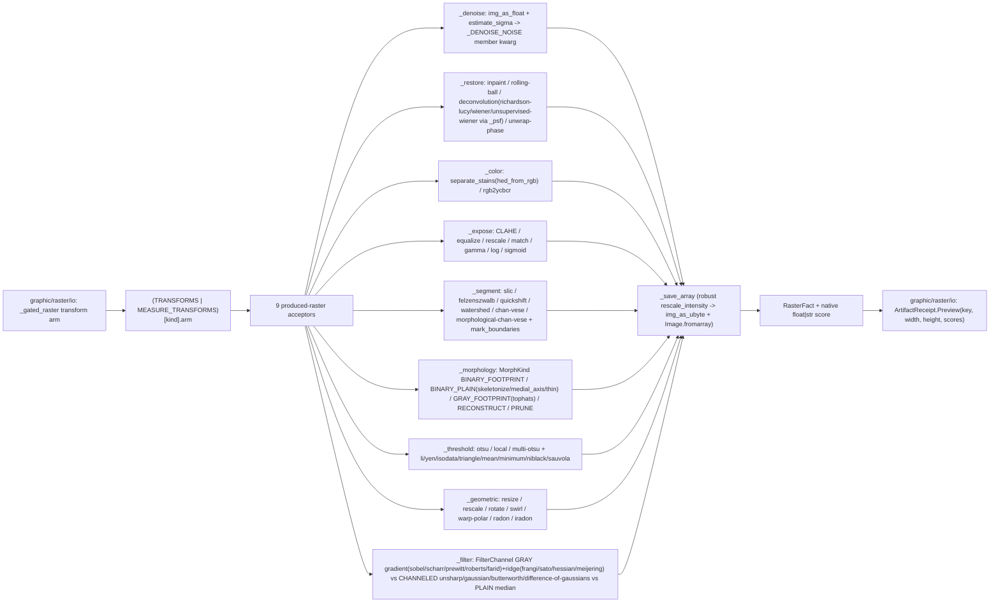

# [PY_ARTIFACTS_GRAPHIC_RASTER_PROCESS]

The scikit-image produced-raster transform engine. ONE engine over the ten transform-engine families that PRODUCE a new raster — `restoration` (the four denoisers plus inpaint/rolling-ball and the deconvolution family Richardson-Lucy/Wiener/unsupervised-Wiener/phase-unwrap), `color` (H&E/HDX stain unmixing + inverse remix plus the YCbCr/HSV/Lab colorspace conversions), `exposure` (CLAHE/equalize/rescale/histogram-match/gamma/log/sigmoid), `segmentation` (SLIC/Felzenszwalb/quickshift/watershed/Chan-Vese/morphological-Chan-Vese/morphological-geodesic level-sets plus find-boundaries/clear-border), `graph` (region-adjacency-graph mean-color cut/normalized-cut/hierarchical-merge refinement of the superpixels plus minimum-cost-path routing), `morphology` (skeletonize/medial-axis/thin/convex-hull/opening/closing/erosion/dilation plus white-/black-tophat/reconstruction/remove-small-objects+holes/area-+diameter-opening attribute filters/isotropic radius morphology/seeded flood-fill over the `MorphKind` disposition), `thresholding` (Otsu/local/multi-Otsu plus Li/Yen/Isodata/triangle/mean/minimum, the Niblack/Sauvola local document binarizers, and the two-level hysteresis binarize), `geometric-transform` (resize/rescale/rotate/swirl/warp-polar/projective-keystone-warp/Radon/inverse-Radon), and `filters` (unsharp/gaussian/difference-of-gaussians/median/sobel/laplace/frangi/butterworth/gabor/canny plus the scharr/prewitt/roberts/farid gradient, sato/hessian/meijering ridge, and the footprint-local rank mean/median/maximum/entropy/autolevel/gradient operators) — folded by the `TRANSFORMS` `frozendict` member-acceptor-kwargs table over the worker band. This page owns the shared transform substrate the measure half composes: the frozen-dataclass `TransformInput`/`TransformArm` carriers and the `_save_array`/`_luminance`/`_channels` helpers, plus the base `TRANSFORMS` table carrying these ten families' ninety-seven rows. The `Raster`/`RasterOp` owner, the `Transform` StrEnum vocabulary, and the `_gated_raster` dispatcher live on `graphic/raster/io#IO`; the measurement half (`_measure`/`_register`/`_metrics` plus `MEASURE_TRANSFORMS`) lives on `graphic/raster/measure#MEASURE` and imports this page's substrate. Every acceptor yields one typed `RasterFact` (declared on `graphic/raster/io#IO`, imported here) so the `_gated_raster` `transform` arm folds one shape into `core/receipt#RECEIPT` `ArtifactReceipt.Preview`.

The acceptor is a pure NumPy-array transform: it owns no rail, raises into the `graphic/raster/io#IO` `_transformed` boundary that catches `(ValueError, OSError, KeyError)`, and never re-validates an already-admitted `TransformInput`. scikit-image is a host-native worker package, so the acceptors run only inside the `faults`-owned `to_process.run_sync` worker worker importing `skimage` at boundary scope, never on the runtime owner; the dtype-scale and display-range gates the providers refuse (`estimate_sigma` reads the noise in the operand's own scale, `img_as_ubyte` rejects a float outside `[-1, 1]`) are re-imposed at admission so each member runs on the dtype its algorithm assumes.

## [01]-[INDEX]

- [01]-[PROCESS]: scikit-image produced-raster engine over the ten transform-engine families — the `TRANSFORMS` `frozendict` table folding the four denoise rows, six restoration rows, six color rows, seven exposure rows, nine segmentation rows, four graph rows, twelve thresholding rows, eighteen morphology rows, eight geometric rows, and twenty-three filter/edge rows into ten acceptors (`_denoise`/`_restore`/`_color`/`_expose`/`_segment`/`_graph`/`_morphology`/`_threshold`/`_geometric`/`_filter`), each resolving its `TransformArm.member` through one `getattr(<submodule>, member)` and merging the row's `kwargs` policy column under the caller `opts` (`row.kwargs | opts`) so every per-member default rides its row and no magic literal scatters into a body, the per-member operand/axis variance pushed onto the `FilterChannel` and `MorphKind` row dispositions so no acceptor re-discriminates beyond the signature variance its submodule forces, the shared `TransformInput`/`TransformArm` carriers and `_save_array`/`_luminance`/`_channels` substrate the measure half composes, every member verified against the folder `scikit-image` `.api`, every diagnostic stamped NATIVE onto the `frozendict[str, float | str]` `RasterFact.score` band, all dispatch-table-folded with zero parallel inline dispatch dict and zero mutable module table.

## [02]-[PROCESS]

- Owner: the scikit-image transform engine producing a new raster, the produced-raster half of the `Transform` sub-axis the `graphic/raster/io#IO` `Raster` owner dispatches; `TransformArm` the frozen-dataclass row carrying the submodule `member` an acceptor resolves through one `getattr`, the acceptor `arm`, and the `kwargs` `frozendict` policy column merged under caller `opts`; `TransformInput` the frozen-dataclass `(image, kind, reference, mask, opts)` carrier every acceptor reads, the `opts` an immutable `frozendict[str, float]` matching the `graphic/raster/io#IO` `RasterOp.transform` payload, never an erased `dict` the arm re-validates. `TransformArm`/`TransformInput` are frozen dataclasses, not `msgspec.Struct`, because the row carries a behaviour callable and the carrier threads an in-process `numpy` `Frame` — neither is a wire shape — so the policy-value owner is the doctrine's frozen-dataclass form, not the boundary codec. `TRANSFORMS` the base `frozendict[Transform, TransformArm]` keyed by the `Transform` value, merged with `graphic/raster/measure#MEASURE`'s `MEASURE_TRANSFORMS` at the `graphic/raster/io#IO` `_gated_raster` lookup so the full one-hundred-thirty-nine-member dispatch resolves; every acceptor folds into one typed `RasterFact` recovering the re-encoded transform bytes plus a diagnostic `frozendict[str, float | str]` score. The `TRANSFORMS` table is the egress-grade collapse: a row binds the callable arm, its settled `skimage` submodule member, and its default kwargs, the op routes by one table lookup, never a per-operation sibling function and never a re-discriminating `match` inside an arm beyond the per-kind signature variance the submodule forces.
- Cases: the ten produced-raster acceptors fold the ninety-seven process-family `Transform` members — `_denoise` (DENOISE_BILATERAL/DENOISE_NL_MEANS/DENOISE_TV/DENOISE_WAVELET, each routing the `estimate_sigma` noise level to its own member kwarg through `_DENOISE_NOISE` over `img_as_float`) · `_restore` (INPAINT biharmonic over a thresholded `as_gray` mask, ROLLING_BALL background subtraction over the row `radius`, and the deconvolution/phase family DECONVOLVE Richardson-Lucy/WIENER supervised/UNSUPERVISED_WIENER self-tuned over a uniform `_psf` from the row `psf`/`num_iter`/`balance` and UNWRAP_PHASE over the luminance phase field) · `_color` (SEPARATE_STAINS H&E/HDX unmixing over the fixed `color.hed_from_rgb` matrix, COMBINE_STAINS the inverse remix over `color.rgb_from_hed`, and the member-derived YCBCR/RGB2HSV/RGB2LAB/LAB2RGB colorspace conversions) · `_expose` (CLAHE, EQUALIZE, RESCALE_INTENSITY, MATCH_HISTOGRAMS, GAMMA, LOG, SIGMOID over the `is_low_contrast` gate) · `_segment` (SLIC, FELZENSZWALB, QUICKSHIFT superpixels over the channel-axis default, marker WATERSHED over the row `markers`, CHAN_VESE/MORPHOLOGICAL_CHAN_VESE/MORPHOLOGICAL_GEODESIC level-sets, FIND_BOUNDARIES the boolean boundary render, and CLEAR_BORDER over `regionprops_table` region counting and `mark_boundaries` overlay) · `_graph` (RAG_CUT_THRESHOLD/RAG_CUT_NORMALIZED/RAG_MERGE region-adjacency-graph refinement of the `slic`+`rag_mean_color` mean-color graph, and MIN_COST_PATH least-cost path over the luminance cost surface) · `_morphology` (Otsu-binarized SKELETONIZE/MEDIAL_AXIS/THIN/CONVEX_HULL, OPENING/CLOSING/EROSION/DILATION over the `disk` footprint factory keyed by the row `radius`, WHITE_TOPHAT/BLACK_TOPHAT grayscale-morphology, RECONSTRUCTION opening-by-reconstruction, REMOVE_SMALL_OBJECTS/REMOVE_SMALL_HOLES over the size/area floor, AREA_OPENING/DIAMETER_OPENING max-tree attribute filters, ISOTROPIC_EROSION/ISOTROPIC_DILATION distance-transform radius morphology, and seeded FLOOD_FILL, dispatched by the `MorphKind` row disposition) · `_threshold` (THRESHOLD_OTSU, THRESHOLD_LOCAL over the `block_size` policy default, THRESHOLD_MULTIOTSU over `np.digitize`, the THRESHOLD_LI/YEN/ISODATA/TRIANGLE/MEAN/MINIMUM global family and the THRESHOLD_NIBLACK/SAUVOLA local document binarizers over the `window_size` policy default through the one binary-cut arm, and the two-level HYSTERESIS binarize returning its mask directly) · `_geometric` (RESIZE/RESCALE/ROTATE over their row sizing default, SWIRL free-form warp, WARP_POLAR log-/linear-polar unwrap, WARP projective/keystone dewarp over `estimate_transform`, RADON sinogram, IRADON filtered back-projection reconstruction) · `_filter` (UNSHARP, GAUSSIAN, DIFFERENCE_OF_GAUSSIANS band-pass, MEDIAN, SOBEL, LAPLACE, FRANGI, BUTTERWORTH, GABOR, CANNY plus the SCHARR/PREWITT/ROBERTS/FARID gradient, SATO/HESSIAN/MEIJERING ridge, and the footprint-local RANK_MEAN/RANK_MEDIAN/RANK_MAXIMUM/RANK_ENTROPY/RANK_AUTOLEVEL/RANK_GRADIENT operators over the row's `FilterChannel` `GRAY`/`CHANNELED`/`PLAIN`/`RANK` disposition) — each one `TRANSFORMS` row, matched by the composed-table lookup the `graphic/raster/io#IO` dispatcher reads, never a sibling op per scikit-image call.
- Auto: `_gated_raster` folds the `transform` case through the composed `TRANSFORMS[kind].arm(TransformInput(...))`, and each acceptor re-dispatches only on the per-kind signature variance its submodule forces while pushing every other split into a `frozendict` policy — `_denoise` resolves the member, admits the operand to float through `img_as_float`, estimates one scalar `sigma` via `estimate_sigma(average_sigmas=True)`, and routes it to the member's own noise kwarg (`sigma_color` for bilateral, `h`+`sigma` for nl-means, `sigma` for wavelet, none for the TV `weight`) through `_DENOISE_NOISE`; `_restore` branches INPAINT (thresholded `as_gray` mask) / DECONVOLVE (float operand, uniform `_psf` from the row `psf`/`num_iter`) / WIENER (luminance, `_psf`, row `balance`) / UNSUPERVISED_WIENER (luminance, `_psf`, the `(deconvolved, posterior)` tuple destructured) / UNWRAP_PHASE (luminance phase field) / rolling-ball (background subtraction over the row `radius`); `_color` branches SEPARATE_STAINS (`color.hed_from_rgb` stain matrix, `channel_axis`) / COMBINE_STAINS (`color.rgb_from_hed` inverse matrix) / the member-derived rgb2ycbcr/rgb2hsv/rgb2lab/lab2rgb conversion; `_expose` branches MATCH_HISTOGRAMS (reference image) vs the rest over the `is_low_contrast` gate; `_segment` returns FIND_BOUNDARIES as the boolean boundary map directly, else branches WATERSHED (sobel markers from the row `markers`) / CHAN_VESE, MORPHOLOGICAL_CHAN_VESE, and MORPHOLOGICAL_GEODESIC (float luminance, row `num_iter`, the geodesic snake over `inverse_gaussian_gradient`) / CLEAR_BORDER over an Otsu label / the SLIC/Felzenszwalb/quickshift channel-axis default, then overlays `mark_boundaries` and counts `regionprops_table`; `_graph` builds `slic` superpixels + `rag_mean_color`, then RAG_MERGE folds `merge_hierarchical` over the mean-color callbacks while RAG_CUT_THRESHOLD/RAG_CUT_NORMALIZED are member-derived `(labels, rag, thresh)`, and MIN_COST_PATH traces `route_through_array` over the luminance cost; `_morphology` Otsu-binarizes then reads the row's `MorphKind` disposition under one total `match` — BINARY_FOOTPRINT (opening/closing/erosion/dilation over `disk`), BINARY_PLAIN (skeletonize/medial_axis/thin/convex_hull_image), GRAY_FOOTPRINT (white_tophat/black_tophat on the float gray), RECONSTRUCT (eroded-seed-under-gray-mask reconstruction), PRUNE (remove_small_objects/remove_small_holes over the row's size/area floor), ATTRIBUTE (area_opening/diameter_opening max-tree on the gray), ISOTROPIC (isotropic_erosion/dilation by radius, no footprint), FLOOD (flood_fill from the opts seed); `_threshold` branches HYSTERESIS (the `apply_hysteresis_threshold` low/high mask directly) then THRESHOLD_MULTIOTSU (`np.digitize`) vs the binary cut that serves every scalar and local-array threshold uniformly; `_geometric` branches RESIZE/RESCALE/ROTATE over their row sizing defaults / SWIRL (luminance strength/radius warp) / WARP_POLAR (channel-axis polar unwrap) / WARP (a projective homography from the 4 corners to the opts-displaced corners, warped through its inverse map) / RADON+IRADON (luminance sinogram forward/inverse); `_filter` reads the row's `FilterChannel` disposition under one total `match` — `GRAY` (luminance operand, no channel axis: every gradient/ridge operator plus canny/gabor), `CHANNELED` (raw operand with `channel_axis`: unsharp/gaussian/butterworth/difference-of-gaussians), `PLAIN` (raw operand, no channel axis: median), `RANK` (uint8 luminance + a `disk(radius)` footprint: filters.rank.mean/median/maximum/entropy/autolevel/gradient) — plus the `feature.canny` module split and the `gabor` real/imag tuple, so `channel_axis` is `_channels(image)` per member (grayscale-safe), the disposition rides the row, and the ten acceptors carry zero mutable module dict and no member can land in two channel or morphology buckets at once.
- Receipt: each acceptor folds into `RasterFact` through `_save_array` — the robust display-normalizer that passes a uint8/bool/`[0, 1]`-float array straight to `util.img_as_ubyte` and `exposure.rescale_intensity`s every out-of-range float or integer-label array to `[0, 1]` first, so an edge magnitude exceeding `1.0`, a negative Laplacian, or a multi-Otsu label field re-encodes to a viewable PNG without a per-acceptor min-max — and projects to `core/receipt#RECEIPT` `ArtifactReceipt.Preview(key, width, height, scores)` at the `graphic/raster/io#IO` rail boundary. Every acceptor stamps one diagnostic onto the `RasterFact.score` `frozendict[str, float | str]` the rail consumer reads inline, NATIVE on the float band rather than `str`-coerced — `_denoise` the `sigma` float, `_restore` the `masked`/`background` fraction (float) or deconvolution `iterations` (int), `_expose` the `contrast` low/ok gate (categorical str), `_segment` the `regions` count (int), `_morphology` the `foreground` fraction (float), `_threshold` the `foreground` fraction (float) or class count (int), `_geometric` the output `shape` (categorical str), `_filter` the mean filter `response` (float) — distinct from the measurement scores the `graphic/raster/measure#MEASURE` half stamps, all flowing losslessly onto the `ArtifactReceipt.Preview.scores` band the io owner threads with no coerce.
- Growth: a new produced-raster scikit-image transform is one `Transform` member on `graphic/raster/io#IO` plus one `TRANSFORMS` row here carrying its submodule `member`, acceptor, and default `kwargs` — landing on the matching submodule acceptor with zero new acceptor when the submodule is already mined (a new global threshold is one `_threshold` row, a new ridge filter one `_filter` row defaulting `FilterChannel.GRAY`, a new contrast curve one `_expose` row, a new warp one `_geometric` row); a new transform family is one acceptor plus its rows; the shared `TransformInput`/`TransformArm` substrate and `_save_array`/`_luminance`/`_channels` helpers grow in place rather than per-family duplicates, and the `MorphKind`/`FilterChannel` dispositions absorb a new operand/footprint sibling as one row plus its disposition, never a body edit; the catalog `[03]-[ENTRYPOINTS]` surfaces the still-unmined adjacents each acceptor absorbs only once its extra input has a spelling — `segmentation.random_walker`/`expand_labels` (a seed-label or prior-segmentation input the standalone acceptor does not synthesize), `restoration.calibrate_denoiser` (a J-invariant parameter calibration returning a denoiser, not a raster), and the `color.combine_stains`/`convert_colorspace` inverse/generic colorspace pair — each landing as one `Transform` member on `graphic/raster/io#IO` plus one row here once its input arrives, never a new surface; the deconvolution/phase, stain/colorspace, superpixel, grayscale-reconstruction, warp, and band-pass adjacents formerly parked here are now promoted rows.
- Boundary: a per-scikit-image-call sibling function, a parallel acceptor per `Transform` member, a mutable module dispatch dict, a `.get(key, magic)` default in a body, and an erased `dict` opts bag are the deleted forms; no IO/convert/thumbnail/montage working surface (that is `graphic/raster/io#IO`'s pillow/pyvips surface), no media-detect gate (that is `graphic/raster/io#IO`'s python-magic gate), and no measurement half — the `_measure`/`_register`/`_metrics` acceptors that PRODUCE scores rather than a transformed raster are `graphic/raster/measure#MEASURE`'s, which composes this page's `TransformInput`/`TransformArm`/`_save_array`/`_luminance`/`_channels` substrate and contributes its `MEASURE_TRANSFORMS` rows to the merged dispatch. The ten families here all PRODUCE a new raster array `_save_array` re-encodes; the measurement families stamp a scalar onto the score map without a new pixel raster, the clean produced-raster-vs-measured-score axis the split cuts.

```python signature
from collections.abc import Callable
from dataclasses import dataclass
from enum import StrEnum
from io import BytesIO
from typing import assert_never

import numpy as np
from builtins import frozendict
from numpy.typing import NDArray

from artifacts.graphic.raster.io import ConvertFormat, Frame, RasterFact, Transform

lazy from PIL import Image
lazy from skimage import color, exposure, feature, filters, graph, io as skio, measure, morphology, restoration, segmentation, transform, util


class FilterChannel(StrEnum):
    GRAY = "gray"            # luminance operand, no channel axis (gradient + ridge + canny + gabor + DoG on gray)
    CHANNELED = "channeled"  # raw operand with channel_axis injected (unsharp / gaussian / butterworth / difference-of-gaussians)
    PLAIN = "plain"          # raw operand, no channel axis (median)
    RANK = "rank"            # footprint-local rank filter on a uint8 operand (filters.rank.mean/median/maximum/entropy/autolevel/gradient)


class MorphKind(StrEnum):
    BINARY_FOOTPRINT = "binary-footprint"  # binary op over a disk footprint: opening / closing / erosion / dilation
    BINARY_PLAIN = "binary-plain"          # binary op, no footprint: skeletonize / medial_axis / thin / convex_hull_image
    GRAY_FOOTPRINT = "gray-footprint"      # grayscale op over a disk footprint: white_tophat / black_tophat
    RECONSTRUCT = "reconstruct"            # seed(eroded gray)-under-mask(gray) reconstruction by dilation
    PRUNE = "prune"                        # component removal by a size/area floor: remove_small_objects / remove_small_holes (kwargs on the row)
    ATTRIBUTE = "attribute"                # max-tree attribute filter on gray: area_opening / diameter_opening
    ISOTROPIC = "isotropic"                # distance-transform radius morphology, no footprint: isotropic_erosion / isotropic_dilation
    FLOOD = "flood"                        # seeded flood fill from an opts seed point: flood_fill


@dataclass(frozen=True, slots=True, eq=False)
class TransformInput:
    image: Frame
    kind: Transform
    reference: bytes
    mask: bytes
    opts: frozendict[str, float]


@dataclass(frozen=True, slots=True)
class TransformArm:
    member: str
    arm: Callable[[TransformInput], RasterFact]
    kwargs: frozendict[str, object] = frozendict()
    channel: FilterChannel = FilterChannel.GRAY  # read only by _filter; the per-member operand/channel-axis disposition
    morph: MorphKind = MorphKind.BINARY_FOOTPRINT  # read only by _morphology; the per-member operand/footprint disposition


def _channels(frame: Frame, /) -> int | None:
    return -1 if frame.ndim == 3 else None


def _luminance(frame: Frame, /) -> NDArray[np.floating]:
    return color.rgb2gray(frame) if frame.ndim == 3 else util.img_as_float(frame)


def _save_array(array: NDArray[np.floating | np.integer | np.bool_], score: frozendict[str, float | str], /) -> RasterFact:
    framed = (
        array
        if array.dtype in (np.uint8, np.bool_) or (np.issubdtype(array.dtype, np.floating) and 0.0 <= float(array.min()) and float(array.max()) <= 1.0)
        else exposure.rescale_intensity(array.astype(np.float64), out_range=(0.0, 1.0))
    )
    image = Image.fromarray(util.img_as_ubyte(framed))
    sink = BytesIO()
    image.save(sink, format=ConvertFormat.PNG.value)
    return RasterFact(sink.getvalue(), *image.size, score)


_DENOISE_NOISE: frozendict[Transform, Callable[[float], frozendict[str, float]]] = frozendict({
    Transform.DENOISE_BILATERAL: lambda sigma: frozendict({"sigma_color": sigma}),
    Transform.DENOISE_NL_MEANS: lambda sigma: frozendict({"h": 0.8 * sigma, "sigma": sigma}),
    Transform.DENOISE_WAVELET: lambda sigma: frozendict({"sigma": sigma}),
})


def _denoise(tx: TransformInput) -> RasterFact:
    row, axis = TRANSFORMS[tx.kind], _channels(tx.image)
    image = util.img_as_float(tx.image)
    sigma = float(restoration.estimate_sigma(image, average_sigmas=True, channel_axis=axis))
    tuned = _DENOISE_NOISE[tx.kind](sigma) if tx.kind in _DENOISE_NOISE else frozendict()
    member = getattr(restoration, row.member)
    return _save_array(member(image, channel_axis=axis, **(row.kwargs | tuned | tx.opts)), frozendict({"sigma": sigma}))


def _psf(opts: frozendict[str, float], /) -> NDArray[np.floating]:
    span = int(opts["psf"])
    return np.ones((span, span), dtype=np.float64) / float(span * span)


def _restore(tx: TransformInput) -> RasterFact:
    row = TRANSFORMS[tx.kind]
    member, axis, opts = getattr(restoration, row.member), _channels(tx.image), row.kwargs | tx.opts
    match tx.kind:
        case Transform.INPAINT:
            mask = skio.imread(BytesIO(tx.mask), as_gray=True) > 0.0
            return _save_array(member(tx.image, mask, channel_axis=axis), frozendict({"masked": float(mask.mean())}))
        case Transform.DECONVOLVE:
            image, iters = util.img_as_float(tx.image), int(opts["num_iter"])
            return _save_array(member(image, _psf(opts), num_iter=iters, channel_axis=axis), frozendict({"iterations": iters}))
        case Transform.WIENER:
            balance = float(opts["balance"])
            return _save_array(member(_luminance(tx.image), _psf(opts), balance), frozendict({"balance": balance}))
        case Transform.UNSUPERVISED_WIENER:
            restored, _chains = member(_luminance(tx.image), _psf(opts))  # self-tuned Wiener-Hunt returns (deconvolved, posterior)
            return _save_array(restored, frozendict({"self_tuned": 1.0}))
        case Transform.UNWRAP_PHASE:
            unwrapped = member(_luminance(tx.image))
            return _save_array(unwrapped, frozendict({"range": float(np.ptp(unwrapped))}))
        case _:
            background = member(tx.image, radius=int(opts["radius"]))
            return _save_array(tx.image - background, frozendict({"background": float(background.mean())}))


def _color(tx: TransformInput) -> RasterFact:
    row = TRANSFORMS[tx.kind]
    member = getattr(color, row.member)
    match tx.kind:
        case Transform.SEPARATE_STAINS:  # H&E/HDX stain unmixing over the fixed color-deconvolution matrix
            stains = member(tx.image, color.hed_from_rgb, channel_axis=_channels(tx.image))
            return _save_array(stains, frozendict({"stains": float(stains.shape[-1])}))
        case Transform.COMBINE_STAINS:  # the inverse remix: stain planes back to RGB over the rgb_from_hed matrix
            return _save_array(member(tx.image, color.rgb_from_hed, channel_axis=_channels(tx.image)), frozendict({"space": "rgb"}))
        case _:  # member-derived single-argument conversion: rgb2ycbcr / rgb2hsv / rgb2lab / lab2rgb (the inverse forms read the operand's channels as their source space)
            return _save_array(member(tx.image), frozendict({"space": row.member}))


def _expose(tx: TransformInput) -> RasterFact:
    row = TRANSFORMS[tx.kind]
    member = getattr(exposure, row.member)
    score = frozendict({"contrast": "low" if exposure.is_low_contrast(tx.image) else "ok"})
    match tx.kind:
        case Transform.MATCH_HISTOGRAMS:
            reference = skio.imread(BytesIO(tx.reference))
            return _save_array(member(tx.image, reference, channel_axis=_channels(tx.image)), score)
        case _:
            return _save_array(member(tx.image, **(row.kwargs | tx.opts)), score)


def _segment(tx: TransformInput) -> RasterFact:
    row = TRANSFORMS[tx.kind]
    opts = row.kwargs | tx.opts
    if tx.kind is Transform.FIND_BOUNDARIES:  # boolean boundary map of an Otsu-labelled field — a render, not a label overlay
        gray = _luminance(tx.image)
        boundaries = segmentation.find_boundaries(measure.label(gray > filters.threshold_otsu(gray)))
        return _save_array(boundaries, frozendict({"boundary_fraction": float(boundaries.mean())}))
    match tx.kind:
        case Transform.WATERSHED:
            labels = segmentation.watershed(filters.sobel(_luminance(tx.image)), markers=int(opts["markers"]))
        case Transform.CHAN_VESE:
            labels = segmentation.chan_vese(_luminance(tx.image), **opts).astype(int)
        case Transform.MORPHOLOGICAL_CHAN_VESE:
            labels = segmentation.morphological_chan_vese(_luminance(tx.image), int(opts["num_iter"])).astype(int)
        case Transform.MORPHOLOGICAL_GEODESIC:  # geodesic active-contour level-set over the inverse-gaussian-gradient edge-stopping map
            labels = segmentation.morphological_geodesic_active_contour(segmentation.inverse_gaussian_gradient(_luminance(tx.image)), int(opts["num_iter"])).astype(int)
        case Transform.CLEAR_BORDER:  # drop the Otsu-labelled components touching the frame edge
            gray = _luminance(tx.image)
            labels = segmentation.clear_border(measure.label(gray > filters.threshold_otsu(gray)))
        case _:  # SLIC / FELZENSZWALB / QUICKSHIFT — the channel-axis superpixel default
            labels = getattr(segmentation, row.member)(tx.image, channel_axis=_channels(tx.image), **opts)
    overlay = segmentation.mark_boundaries(tx.image, labels)
    regions = int(measure.regionprops_table(labels, properties=("label",))["label"].size)
    return _save_array(overlay, frozendict({"regions": regions}))


def _weight_mean_color(rag: object, src: int, dst: int, neighbor: int, /) -> dict[str, float]:  # skimage RAG merge idiom: edge weight is the mean-color L2 distance (the networkx edge-data dict the merge_hierarchical callback contract requires)
    return {"weight": float(np.linalg.norm(rag.nodes[dst]["mean color"] - rag.nodes[neighbor]["mean color"]))}


def _merge_mean_color(rag: object, src: int, dst: int, /) -> None:  # skimage RAG merge idiom: fold src's color mass into dst before the edge is dropped (the callback mutates the provider RAG in place)
    rag.nodes[dst]["total color"] += rag.nodes[src]["total color"]
    rag.nodes[dst]["pixel count"] += rag.nodes[src]["pixel count"]
    rag.nodes[dst]["mean color"] = rag.nodes[dst]["total color"] / rag.nodes[dst]["pixel count"]


def _graph(tx: TransformInput) -> RasterFact:
    row, opts = TRANSFORMS[tx.kind], TRANSFORMS[tx.kind].kwargs | tx.opts
    if tx.kind is Transform.MIN_COST_PATH:  # least-cost path through the luminance-as-cost surface (route_through_array over the MCP_Geometric finder)
        cost = _luminance(tx.image)
        indices, weight = graph.route_through_array(cost, (int(opts["src_row"]), int(opts["src_col"])), (int(opts["dst_row"]), int(opts["dst_col"])))
        trace = np.zeros(cost.shape, dtype=bool)
        trace[tuple(np.asarray(indices, dtype=int).T)] = True
        return _save_array(trace, frozendict({"path_cost": float(weight), "path_length": float(len(indices))}))
    labels = segmentation.slic(tx.image, n_segments=int(opts["n_segments"]), channel_axis=_channels(tx.image))
    rag = graph.rag_mean_color(tx.image, labels)  # region-adjacency graph weighted by superpixel mean-color difference
    merged = (
        graph.merge_hierarchical(labels, rag, thresh=float(opts["thresh"]), rag_copy=False, in_place_merge=True, merge_func=_merge_mean_color, weight_func=_weight_mean_color)
        if tx.kind is Transform.RAG_MERGE
        else getattr(graph, row.member)(labels, rag, float(opts["thresh"]))  # RAG_CUT_THRESHOLD / RAG_CUT_NORMALIZED — member-derived (labels, rag, thresh)
    )
    overlay = segmentation.mark_boundaries(tx.image, merged)
    regions = int(measure.regionprops_table(merged, properties=("label",))["label"].size)
    return _save_array(overlay, frozendict({"regions": regions}))


def _morphology(tx: TransformInput) -> RasterFact:
    row = TRANSFORMS[tx.kind]
    gray = _luminance(tx.image)
    binary = gray > filters.threshold_otsu(gray)
    member, opts = getattr(morphology, row.member), row.kwargs | tx.opts
    match row.morph:
        case MorphKind.BINARY_FOOTPRINT:
            result = member(binary, morphology.disk(int(opts["radius"])))
        case MorphKind.BINARY_PLAIN:  # skeletonize / medial_axis / thin / convex_hull_image — binary in, binary out, no footprint
            result = member(binary)
        case MorphKind.GRAY_FOOTPRINT:
            result = member(gray, morphology.disk(int(opts["radius"])))
        case MorphKind.RECONSTRUCT:  # opening-by-reconstruction: dilate an eroded seed under the gray mask
            result = member(morphology.erosion(gray, morphology.disk(int(opts["radius"]))), gray)
        case MorphKind.PRUNE:  # remove_small_objects (min_size) / remove_small_holes (area_threshold) — the floor kwarg rides the row
            result = member(binary, **{key: int(value) for key, value in opts.items()})
        case MorphKind.ATTRIBUTE:  # area_opening / diameter_opening — max-tree attribute filter on the grayscale operand, threshold kwarg on the row
            result = member(gray, **{key: int(value) for key, value in opts.items()})
        case MorphKind.ISOTROPIC:  # distance-transform radius morphology (no explicit footprint): isotropic_erosion / isotropic_dilation
            result = member(binary, int(opts["radius"]))
        case MorphKind.FLOOD:  # seeded flood fill: fill the connected region at the opts seed point on a uint8 operand
            result = member(util.img_as_ubyte(gray), (int(opts["seed_row"]), int(opts["seed_col"])), 255)
        case _ as unreachable:
            assert_never(unreachable)
    return _save_array(result, frozendict({"foreground": float(np.asarray(result, dtype=float).mean())}))


def _threshold(tx: TransformInput) -> RasterFact:
    row = TRANSFORMS[tx.kind]
    gray = _luminance(tx.image)
    opts = row.kwargs | tx.opts
    if tx.kind is Transform.HYSTERESIS:  # two-level binarize: apply_hysteresis_threshold returns the low/high mask directly, not a scalar cut the gray is compared against
        mask = filters.apply_hysteresis_threshold(gray, float(opts["low"]), float(opts["high"]))
        return _save_array(mask, frozendict({"foreground": float(mask.mean())}))
    cut = getattr(filters, row.member)(gray, **opts)
    match tx.kind:
        case Transform.THRESHOLD_MULTIOTSU:
            return _save_array(np.digitize(gray, cut), frozendict({"classes": len(cut) + 1}))
        case _:
            mask = gray > cut
            return _save_array(mask, frozendict({"foreground": float(mask.mean())}))


def _geometric(tx: TransformInput) -> RasterFact:
    row = TRANSFORMS[tx.kind]
    member, opts = getattr(transform, row.member), row.kwargs | tx.opts
    match tx.kind:
        case Transform.RESIZE:
            warped = member(tx.image, (int(opts["rows"]), int(opts["cols"])), anti_aliasing=True)
        case Transform.RESCALE:
            warped = member(tx.image, float(opts["scale"]), channel_axis=_channels(tx.image), anti_aliasing=True)
        case Transform.ROTATE:
            warped = member(tx.image, float(opts["angle"]), resize=True)
        case Transform.SWIRL:  # free-form warp; skimage.warp builds one 2D coordinate map, so the operand is luminance
            warped = member(_luminance(tx.image), strength=float(opts["strength"]), radius=float(opts["radius"]))
        case Transform.WARP_POLAR:  # log-/linear-polar unwrap; channel_axis keeps the color operand
            warped = member(tx.image, channel_axis=_channels(tx.image), **opts)
        case Transform.WARP:  # projective/keystone dewarp: fit a homography from the 4 image corners to 4 opts-displaced corners, warp through its inverse map
            rows, cols = tx.image.shape[:2]
            src = np.array([[0.0, 0.0], [cols, 0.0], [cols, rows], [0.0, rows]], dtype=float)
            dst = src + np.array([[opts["tl_dx"], opts["tl_dy"]], [opts["tr_dx"], opts["tr_dy"]], [opts["br_dx"], opts["br_dy"]], [opts["bl_dx"], opts["bl_dy"]]], dtype=float)
            warped = member(tx.image, transform.estimate_transform("projective", src, dst).inverse, output_shape=(rows, cols))
        case _:  # RADON sinogram / IRADON filtered back-projection reconstruction over the luminance operand
            warped = member(_luminance(tx.image))
    return _save_array(warped, frozendict({"shape": "x".join(str(dim) for dim in warped.shape[:2])}))


def _filter(tx: TransformInput) -> RasterFact:
    row, opts = TRANSFORMS[tx.kind], TRANSFORMS[tx.kind].kwargs | tx.opts
    match row.channel:
        case FilterChannel.GRAY:
            member, source, extra = getattr(feature if tx.kind is Transform.CANNY else filters, row.member), _luminance(tx.image), opts
        case FilterChannel.CHANNELED:
            member, source, extra = getattr(filters, row.member), tx.image, frozendict({"channel_axis": _channels(tx.image)}) | opts
        case FilterChannel.PLAIN:
            member, source, extra = getattr(filters, row.member), tx.image, opts
        case FilterChannel.RANK:  # footprint-local rank filter on a uint8 operand: filters.rank.<member>(uint8, footprint=disk(radius)); radius rides the row into the footprint, never re-passed as a filter kwarg
            member, source, extra = getattr(filters.rank, row.member), util.img_as_ubyte(_luminance(tx.image)), frozendict({"footprint": morphology.disk(int(opts.get("radius", 3)))})
        case _ as unreachable:
            assert_never(unreachable)
    raw = member(source, **extra)
    out = raw[0] if tx.kind is Transform.GABOR else raw
    return _save_array(out, frozendict({"response": float(out.mean())}))


TRANSFORMS: frozendict[Transform, TransformArm] = frozendict({
    Transform.DENOISE_BILATERAL: TransformArm("denoise_bilateral", _denoise),
    Transform.DENOISE_NL_MEANS: TransformArm("denoise_nl_means", _denoise, frozendict({"fast_mode": True, "patch_size": 5, "patch_distance": 6})),
    Transform.DENOISE_TV: TransformArm("denoise_tv_chambolle", _denoise, frozendict({"weight": 0.1})),
    Transform.DENOISE_WAVELET: TransformArm("denoise_wavelet", _denoise),
    Transform.INPAINT: TransformArm("inpaint_biharmonic", _restore),
    Transform.ROLLING_BALL: TransformArm("rolling_ball", _restore, frozendict({"radius": 50})),
    Transform.DECONVOLVE: TransformArm("richardson_lucy", _restore, frozendict({"num_iter": 10, "psf": 5})),
    Transform.WIENER: TransformArm("wiener", _restore, frozendict({"psf": 5, "balance": 0.1})),
    Transform.UNSUPERVISED_WIENER: TransformArm("unsupervised_wiener", _restore, frozendict({"psf": 5})),
    Transform.UNWRAP_PHASE: TransformArm("unwrap_phase", _restore),
    Transform.SEPARATE_STAINS: TransformArm("separate_stains", _color),
    Transform.YCBCR: TransformArm("rgb2ycbcr", _color),
    Transform.CLAHE: TransformArm("equalize_adapthist", _expose),
    Transform.EQUALIZE: TransformArm("equalize_hist", _expose),
    Transform.RESCALE_INTENSITY: TransformArm("rescale_intensity", _expose),
    Transform.MATCH_HISTOGRAMS: TransformArm("match_histograms", _expose),
    Transform.GAMMA: TransformArm("adjust_gamma", _expose),
    Transform.LOG: TransformArm("adjust_log", _expose),
    Transform.SIGMOID: TransformArm("adjust_sigmoid", _expose),
    Transform.SLIC: TransformArm("slic", _segment),
    Transform.FELZENSZWALB: TransformArm("felzenszwalb", _segment),
    Transform.QUICKSHIFT: TransformArm("quickshift", _segment),
    Transform.WATERSHED: TransformArm("watershed", _segment, frozendict({"markers": 250})),
    Transform.CHAN_VESE: TransformArm("chan_vese", _segment),
    Transform.MORPHOLOGICAL_CHAN_VESE: TransformArm("morphological_chan_vese", _segment, frozendict({"num_iter": 35})),
    Transform.UNSHARP: TransformArm("unsharp_mask", _filter, channel=FilterChannel.CHANNELED),
    Transform.GAUSSIAN: TransformArm("gaussian", _filter, channel=FilterChannel.CHANNELED),
    Transform.MEDIAN: TransformArm("median", _filter, channel=FilterChannel.PLAIN),
    Transform.SOBEL: TransformArm("sobel", _filter),
    Transform.LAPLACE: TransformArm("laplace", _filter),
    Transform.FRANGI: TransformArm("frangi", _filter),
    Transform.BUTTERWORTH: TransformArm("butterworth", _filter, channel=FilterChannel.CHANNELED),
    Transform.GABOR: TransformArm("gabor", _filter, frozendict({"frequency": 0.6})),
    Transform.DIFFERENCE_OF_GAUSSIANS: TransformArm("difference_of_gaussians", _filter, frozendict({"low_sigma": 1.0}), channel=FilterChannel.CHANNELED),
    Transform.CANNY: TransformArm("canny", _filter),
    Transform.SCHARR: TransformArm("scharr", _filter),
    Transform.PREWITT: TransformArm("prewitt", _filter),
    Transform.ROBERTS: TransformArm("roberts", _filter),
    Transform.FARID: TransformArm("farid", _filter),
    Transform.SATO: TransformArm("sato", _filter),
    Transform.HESSIAN: TransformArm("hessian", _filter),
    Transform.MEIJERING: TransformArm("meijering", _filter),
    Transform.THRESHOLD_OTSU: TransformArm("threshold_otsu", _threshold),
    Transform.THRESHOLD_LOCAL: TransformArm("threshold_local", _threshold, frozendict({"block_size": 35})),
    Transform.THRESHOLD_MULTIOTSU: TransformArm("threshold_multiotsu", _threshold),
    Transform.THRESHOLD_LI: TransformArm("threshold_li", _threshold),
    Transform.THRESHOLD_YEN: TransformArm("threshold_yen", _threshold),
    Transform.THRESHOLD_ISODATA: TransformArm("threshold_isodata", _threshold),
    Transform.THRESHOLD_TRIANGLE: TransformArm("threshold_triangle", _threshold),
    Transform.THRESHOLD_MEAN: TransformArm("threshold_mean", _threshold),
    Transform.THRESHOLD_MINIMUM: TransformArm("threshold_minimum", _threshold),
    Transform.THRESHOLD_NIBLACK: TransformArm("threshold_niblack", _threshold, frozendict({"window_size": 15})),
    Transform.THRESHOLD_SAUVOLA: TransformArm("threshold_sauvola", _threshold, frozendict({"window_size": 15})),
    Transform.SKELETONIZE: TransformArm("skeletonize", _morphology, morph=MorphKind.BINARY_PLAIN),
    Transform.MEDIAL_AXIS: TransformArm("medial_axis", _morphology, morph=MorphKind.BINARY_PLAIN),
    Transform.THIN: TransformArm("thin", _morphology, morph=MorphKind.BINARY_PLAIN),
    Transform.OPENING: TransformArm("binary_opening", _morphology, frozendict({"radius": 1})),
    Transform.CLOSING: TransformArm("binary_closing", _morphology, frozendict({"radius": 1})),
    Transform.EROSION: TransformArm("binary_erosion", _morphology, frozendict({"radius": 1})),
    Transform.DILATION: TransformArm("binary_dilation", _morphology, frozendict({"radius": 1})),
    Transform.WHITE_TOPHAT: TransformArm("white_tophat", _morphology, frozendict({"radius": 5}), morph=MorphKind.GRAY_FOOTPRINT),
    Transform.BLACK_TOPHAT: TransformArm("black_tophat", _morphology, frozendict({"radius": 5}), morph=MorphKind.GRAY_FOOTPRINT),
    Transform.RECONSTRUCTION: TransformArm("reconstruction", _morphology, frozendict({"radius": 3}), morph=MorphKind.RECONSTRUCT),
    Transform.REMOVE_SMALL_OBJECTS: TransformArm("remove_small_objects", _morphology, frozendict({"min_size": 64}), morph=MorphKind.PRUNE),
    Transform.RESIZE: TransformArm("resize", _geometric, frozendict({"rows": 256, "cols": 256})),
    Transform.RESCALE: TransformArm("rescale", _geometric, frozendict({"scale": 0.5})),
    Transform.ROTATE: TransformArm("rotate", _geometric, frozendict({"angle": 90.0})),
    Transform.SWIRL: TransformArm("swirl", _geometric, frozendict({"strength": 1.0, "radius": 100.0})),
    Transform.WARP_POLAR: TransformArm("warp_polar", _geometric),
    Transform.WARP: TransformArm("warp", _geometric, frozendict({"tl_dx": 0.0, "tl_dy": 0.0, "tr_dx": 0.0, "tr_dy": 0.0, "br_dx": 0.0, "br_dy": 0.0, "bl_dx": 0.0, "bl_dy": 0.0})),
    Transform.RADON: TransformArm("radon", _geometric),
    Transform.IRADON: TransformArm("iradon", _geometric),
    Transform.RAG_CUT_THRESHOLD: TransformArm("cut_threshold", _graph, frozendict({"n_segments": 400, "thresh": 0.08})),
    Transform.RAG_CUT_NORMALIZED: TransformArm("cut_normalized", _graph, frozendict({"n_segments": 400, "thresh": 0.001})),
    Transform.RAG_MERGE: TransformArm("merge_hierarchical", _graph, frozendict({"n_segments": 400, "thresh": 0.08})),
    Transform.MIN_COST_PATH: TransformArm("route_through_array", _graph, frozendict({"src_row": 0.0, "src_col": 0.0, "dst_row": 100.0, "dst_col": 100.0})),
    Transform.COMBINE_STAINS: TransformArm("combine_stains", _color),
    Transform.RGB2HSV: TransformArm("rgb2hsv", _color),
    Transform.RGB2LAB: TransformArm("rgb2lab", _color),
    Transform.LAB2RGB: TransformArm("lab2rgb", _color),
    Transform.MORPHOLOGICAL_GEODESIC: TransformArm("morphological_geodesic_active_contour", _segment, frozendict({"num_iter": 35})),
    Transform.FIND_BOUNDARIES: TransformArm("find_boundaries", _segment),
    Transform.CLEAR_BORDER: TransformArm("clear_border", _segment),
    Transform.AREA_OPENING: TransformArm("area_opening", _morphology, frozendict({"area_threshold": 64}), morph=MorphKind.ATTRIBUTE),
    Transform.DIAMETER_OPENING: TransformArm("diameter_opening", _morphology, frozendict({"diameter_threshold": 8}), morph=MorphKind.ATTRIBUTE),
    Transform.REMOVE_SMALL_HOLES: TransformArm("remove_small_holes", _morphology, frozendict({"area_threshold": 64}), morph=MorphKind.PRUNE),
    Transform.CONVEX_HULL: TransformArm("convex_hull_image", _morphology, morph=MorphKind.BINARY_PLAIN),
    Transform.ISOTROPIC_EROSION: TransformArm("isotropic_erosion", _morphology, frozendict({"radius": 3}), morph=MorphKind.ISOTROPIC),
    Transform.ISOTROPIC_DILATION: TransformArm("isotropic_dilation", _morphology, frozendict({"radius": 3}), morph=MorphKind.ISOTROPIC),
    Transform.FLOOD_FILL: TransformArm("flood_fill", _morphology, frozendict({"seed_row": 0.0, "seed_col": 0.0}), morph=MorphKind.FLOOD),
    Transform.HYSTERESIS: TransformArm("apply_hysteresis_threshold", _threshold, frozendict({"low": 0.1, "high": 0.35})),
    Transform.RANK_MEAN: TransformArm("mean", _filter, frozendict({"radius": 3}), channel=FilterChannel.RANK),
    Transform.RANK_MEDIAN: TransformArm("median", _filter, frozendict({"radius": 3}), channel=FilterChannel.RANK),
    Transform.RANK_MAXIMUM: TransformArm("maximum", _filter, frozendict({"radius": 3}), channel=FilterChannel.RANK),
    Transform.RANK_ENTROPY: TransformArm("entropy", _filter, frozendict({"radius": 5}), channel=FilterChannel.RANK),
    Transform.RANK_AUTOLEVEL: TransformArm("autolevel", _filter, frozendict({"radius": 3}), channel=FilterChannel.RANK),
    Transform.RANK_GRADIENT: TransformArm("gradient", _filter, frozendict({"radius": 3}), channel=FilterChannel.RANK),
})
```

The scikit-image `Transform` produced-raster engine is the egress-grade collapse over the ten transform-engine families: a `TransformArm` row names the submodule `member` the acceptor resolves through one `getattr`, carries the acceptor `arm`, and threads the `kwargs` `frozendict` policy column plus the `FilterChannel`/`MorphKind` operand disposition — every per-member default (the deconvolution `num_iter`/`psf`/`balance`, the rolling-ball `radius`, the watershed `markers`, the morphological-Chan-Vese/warp/reconstruction `num_iter`/`strength`/`radius`, the footprint `radius`, the prune `min_size`, the difference-of-gaussians `low_sigma`, the resize `rows`/`cols`, the rotate `angle`, the rescale `scale`, the `threshold_local` `block_size`, the Niblack/Sauvola `window_size`) riding its row and merged under the caller `opts` (`row.kwargs | opts`) so no magic literal scatters into a body; the base `TRANSFORMS` table is one `frozendict` keyed by the `Transform` value, and the `graphic/raster/io#IO` `_gated_raster` is one composed-table lookup. `_denoise` admits to float and routes the scalar `estimate_sigma` to each member's own kwarg through `_DENOISE_NOISE`; `_restore` shares one `_psf` builder across Richardson-Lucy/Wiener/unsupervised-Wiener; `_color` unmixes stains and converts the YCbCr broadcast colorspace; `_filter` reads each row's `FilterChannel` disposition so `median` (`PLAIN`) takes no channel axis, `unsharp`/`gaussian`/`butterworth`/`difference_of_gaussians` (`CHANNELED`) inject `channel_axis`, and the gradient (`sobel`/`scharr`/`prewitt`/`roberts`/`farid`) and ridge (`frangi`/`sato`/`hessian`/`meijering`) filters (`GRAY`) run on `_luminance`, the row the single edit site so a member cannot land in two buckets; `_morphology` reads the `MorphKind` disposition so binary/grayscale/plain/reconstruct/prune operands never cross; `_threshold` serves the full global family and the Niblack/Sauvola local binarizers through one binary-cut arm beside the multi-Otsu `np.digitize`; `_save_array` is the robust display-normalizer that `rescale_intensity`s any out-of-range or label-valued array before re-encode and admits the bool/uint8/`[0, 1]`-float producer dtype directly; `_channels` makes every channel axis grayscale-safe. Each acceptor stamps a NATIVE `float`/`int` diagnostic (or a categorical `str` for the `contrast`/`shape` facts) onto the `frozendict[str, float | str]` band the `graphic/raster/io#IO` `RasterFact.score` owner declares, so the `core/receipt#RECEIPT` `ArtifactReceipt.Preview.scores` projection reads the metric signals as numbers with no `str()` coerce. The `TransformInput` carrier threads the `(image, kind, reference, mask, opts)` payload as a frozen dataclass with `opts` an immutable `frozendict[str, float]`, the `TransformArm` row the `member`/`arm`/`kwargs` columns — both the shared substrate the measure half composes: the `graphic/raster/measure#MEASURE` half imports all five substrate symbols from this page and contributes its measurement rows to the merged `TRANSFORMS | MEASURE_TRANSFORMS` dispatch.



## [03]-[RESEARCH]

- [SCIKIT_TRANSFORM_SETTLED] [RESOLVED]: the ten produced-raster scikit-image families are SETTLED fence code verified member-by-member against the folder `.api` catalogue for `scikit-image` — the deconvolution/phase promotions verify against restoration rows [09] (`unsupervised_wiener` returns the `(deconvolved, posterior)` tuple the arm destructures; `wiener(image, psf, balance)`) and [10] (`unwrap_phase`); the `_color` acceptor against color rows [09] (`separate_stains(rgb, conv_matrix, *, channel_axis)` over the `color.hed_from_rgb` module matrix) and [10] (`rgb2ycbcr`); the segmentation promotions against rows [09] (`quickshift`, channel-axis default) and [12] (`morphological_chan_vese(image, num_iter, ...)`); the morphology promotions against rows [08]/[14]/[15]/[18] (`remove_small_objects` over the stable `min_size=` floor — the folder catalog row [08] labels the size arg `max_size`, a transcription slip flagged for catalog reconcile since the stable skimage keyword is `min_size`; `white_tophat`/`black_tophat`, `reconstruction(seed, mask)` over an eroded seed, `medial_axis`/`thin`) carried by the `MorphKind` disposition; the geometric promotions against rows [10]/[13] (`iradon`, `swirl`, `warp_polar` with its `channel_axis`); and the band-pass against filters row [14] (`difference_of_gaussians`, `FilterChannel.CHANNELED`). The `restoration` arms verify against `[03]-[ENTRYPOINTS]` restoration rows [01]-[08]: row [01] `denoise_bilateral(..., sigma_color, sigma_spatial, ...)` takes no `sigma`, row [04] `denoise_tv_chambolle(image, weight, ...)` takes `weight`, so the uniform `sigma=` of a naive fence is the `_DENOISE_NOISE` per-member routing (`sigma_color` bilateral / `h`+`sigma` nl-means / `sigma` wavelet / `weight` TV), row [05] `estimate_sigma(image, average_sigmas, *, channel_axis)` supplies the scalar noise on an `img_as_float`-admitted operand so the estimate matches the `[0, 1]` scale the denoisers assume. The `exposure` arms verify against exposure rows [01]-[06], [08]-[09] (`adjust_sigmoid` row [09]); the `segmentation` arms against rows [01]-[03], [05] plus `mark_boundaries` (row [10]) and `regionprops_table` (measure row [03]); the `morphology` arms against rows [01]-[04], [10] plus `disk` (row [11]); the `transform` arms against geometric rows [01]-[03], [09]; the `filters` arms against rows [01]-[03], [07]-[11] plus the gradient operators `scharr`/`prewitt`/`roberts`/`farid` (row [12]) and the ridge operators `sato`/`hessian`/`meijering` (row [13]), and the threshold family `threshold_otsu`/`threshold_local`/`threshold_multiotsu` (rows [04]-[06]) plus `threshold_li`/`threshold_yen`/`threshold_isodata`/`threshold_triangle`/`threshold_mean`/`threshold_minimum` (row [15]) and the local document binarizers `threshold_niblack`/`threshold_sauvola` (row [16]) — row [03] `median(image, footprint, out, mode, cval, behavior)` carries no `channel_axis`, so `median`'s row is `FilterChannel.PLAIN`, and row [05] `threshold_local(image, block_size, ...)` requires `block_size`, carried as the row default beside the Niblack/Sauvola `window_size`; the `feature.canny` edge arm verifies against feature row [01]. The `[04]-[IMPLEMENTATION_LAW]` `channel_axis` law (multichannel `channel_axis` is integer-or-`None`, never inferred) is honored by `_channels(image)` returning `-1` for an RGB operand and `None` for grayscale, and the `img_as_float`/`img_as_ubyte` dtype-boundary law is honored by `_save_array`'s range gate. The measurement families' rows carry their own portion of `[SCIKIT_TRANSFORM_SETTLED]` on `graphic/raster/measure#MEASURE`.
- [SCORE_NATIVE] [RESOLVED]: every acceptor stamps its diagnostic NATIVE onto the `frozendict[str, float | str]` band the `graphic/raster/io#IO` `RasterFact.score` owner declares — `sigma`/`masked`/`background`/`foreground`/`response` as `float`, `iterations`/`regions`/`classes` as `int`, `contrast`/`shape` as the genuinely-categorical `str` — replacing the prior `frozendict[str, str]` form that `str`-coerced every metric. The `core/receipt#RECEIPT` `ArtifactReceipt.Preview.scores: frozendict[str, float | str]` and its `_facts` arm flatten the band into `{"width", "height", **scores}`, and `graphic/raster/io#IO` `_previewed` threads `fact.score` straight onto `Preview.scores`, so the perceptual/numeric facts reach the structured log line as numbers with no coerce. `_save_array`'s `score` parameter and the `array` operand widen to `frozendict[str, float | str]` and `NDArray[np.floating | np.integer | np.bool_]` so the bool morphology/threshold producers the body already routes through `util.img_as_ubyte` are typed at the seam.
- [DEFAULTS_ON_ROWS] [RESOLVED]: every per-member numeric default rides its `TransformArm.kwargs` row and the body reads the merged `row.kwargs | opts`, so a default has one edit site on the table and never a `.get(key, magic)` literal scattered into an acceptor: the rolling-ball `radius`, the deconvolution `num_iter`/`psf`, the watershed `markers`, the morphology footprint `radius`, the resize `rows`/`cols`, the rotate `angle`, the rescale `scale`, the `threshold_local` `block_size`, and the Niblack/Sauvola `window_size` are all row columns the caller `opts` overrides. This honours the `[TRANSFORM_FROZEN]` law that a per-member default is a row column, and a new default-bearing member is one row, never a body edit.
- [SAVE_NORMALIZE] [RESOLVED]: `_save_array` is the substrate display-normalizer the ten produced-raster acceptors and the measure acceptors share. The `[04]-[IMPLEMENTATION_LAW]` dtype axis fixes that `img_as_ubyte` accepts uint8 directly and a float only in `[-1, 1]`, so an edge magnitude (`sobel`/`scharr`/`laplace` exceeding `1.0` or negative), a Radon sinogram, and a `np.digitize` multi-Otsu label field would raise; `_save_array` passes a uint8/bool/`[0, 1]`-float array through and `exposure.rescale_intensity(..., out_range=(0.0, 1.0))`s every other array first, so a per-acceptor `array / array.max()` normalization is one substrate gate and no edge-filter output crashes the re-encode. The acceptors hand `_save_array` the native producer dtype (float `[0, 1]`, bool, uint8, or label int) and the substrate owns the viewable projection.
- [TRANSFORM_FROZEN] [RESOLVED]: the dispatch table, the policy column, the caller opts, and the score map are all `frozendict`, never a mutable `dict`. `TRANSFORMS: frozendict[Transform, TransformArm]` is the immutable owner the `language.md` `[FROZENDICT_TABLE_SITE]` legislates over a module-level dictionary used as a policy table; `TransformArm.kwargs: frozendict[str, object] = frozendict()` is the frozen-dataclass default the doctrine's POLICY_VALUES card prescribes for a callable-bearing row (the `arm: Callable[[TransformInput], RasterFact]` field is why `TransformArm` is a frozen dataclass and not a `msgspec.Struct` wire owner); `TransformInput.opts: frozendict[str, float]` matches the `graphic/raster/io#IO` `RasterOp.transform` payload exactly so the carrier crosses the worker seam immutable. The merge `row.kwargs | opts` is one `frozendict` union per call, the caller `opts` overriding the row default.
- [PROCESS_SUBSTRATE] [RESOLVED]: this page owns the shared transform substrate the measure half composes — the frozen-dataclass `TransformInput`/`TransformArm` carriers and the `_save_array`/`_luminance`/`_channels` helpers — declared here as the larger transform-engine owner. Both carriers are frozen dataclasses, not `msgspec.Struct`: `TransformInput` threads an in-process `numpy` `Frame` and is constructed and consumed entirely inside the worker worker (never serialized), and `TransformArm` carries a behaviour callable, so the doctrine's frozen-dataclass policy-value owner is the right shape over the boundary codec. `graphic/raster/measure#MEASURE` imports the substrate (`from artifacts.graphic.raster.process import TransformInput, TransformArm, _save_array, _luminance`) and never re-declares it, so the produced-raster and measured-score acceptors fold one `TransformInput` carrier, one `TransformArm` row shape, and one `_save_array` re-encode path; `_channels` is the grayscale-safe channel-axis resolver the measure half's HOG arm adopts in place of a hardcoded `channel_axis=-1`. The base `TRANSFORMS` table here carries the ninety-seven process-family member rows; the measure page contributes `MEASURE_TRANSFORMS` of its forty-two measure-family rows, and the `graphic/raster/io#IO` `_gated_raster` composes the merged `TRANSFORMS | MEASURE_TRANSFORMS` dispatch so all one hundred thirty-nine `Transform` members resolve with each member landing in exactly one page's rows. `RasterFact`/`Transform`/`ConvertFormat`/`Frame` are imported from `graphic/raster/io#IO` and never re-declared.
- [FAMILY_COMPLETION] [RESOLVED]: the seventeen members this pass promotes from documented Growth-prose adjacents to real `TRANSFORMS` rows close the six thinnest produced-raster family slices, each catalog-confirmed against the folder `scikit-image` `.api` and each landing through an existing (or one new) acceptor with zero engine reinvention — the deconvolution siblings `WIENER`/`UNSUPERVISED_WIENER` (restoration rows [09]) plus the phase owner `UNWRAP_PHASE` (row [10]) beside the lone `DECONVOLVE`; the new `_color` acceptor's `SEPARATE_STAINS` (color row [09], H&E/HDX stain unmixing over `color.hed_from_rgb`) and `YCBCR` (row [10], the broadcast colorspace); the superpixel sibling `QUICKSHIFT` (segmentation row [09]) and the level-set `MORPHOLOGICAL_CHAN_VESE` (row [12]); the grayscale-reconstruction and skeleton-refinement morphology `WHITE_TOPHAT`/`BLACK_TOPHAT` (row [14]), `RECONSTRUCTION` (row [15]), `MEDIAL_AXIS`/`THIN` (row [18]), and `REMOVE_SMALL_OBJECTS` (row [08]); the warp family `SWIRL`/`WARP_POLAR` (transform row [13]) and the filtered-back-projection reconstruction `IRADON` (row [10], the inverse of the admitted `RADON`); and the band-pass `DIFFERENCE_OF_GAUSSIANS` (filters row [14], `FilterChannel.CHANNELED` beside `gaussian`/`butterworth`). None requires a reference or mask (stain unmixing keys the fixed `color.hed_from_rgb` matrix, `WIENER`/`UNSUPERVISED_WIENER` build the uniform `_psf` from the row `psf`), so `graphic/raster/io#IO`'s `_REFERENCE_REQUIRED` does not grow. All seventeen landed on the `graphic/raster/io#IO` `Transform` `StrEnum` (the single vocabulary owner), raising the process-family row count fifty-four -> seventy-one at that pass; this pass extends the families further (see `[FAMILY_EXTENSION]`) to ninety-seven process-family rows, and the composed `TRANSFORMS | MEASURE_TRANSFORMS` dispatch now resolves one hundred thirty-nine (ninety-seven process-family plus forty-two measure-family), the dispatch-count prose on `graphic/raster/io#IO` and this page reading one hundred thirty-nine.
- [FAMILY_EXTENSION] [RESOLVED]: the twenty-six members this pass adds close the six thinnest remaining produced-raster slices the reading map named, each catalog-confirmed against the folder `scikit-image` `.api` and each landing through an existing (or the one new `_graph`) acceptor with zero engine reinvention — (1) the NEW `_graph` acceptor's `RAG_CUT_THRESHOLD`/`RAG_CUT_NORMALIZED` (graph rows [04]/[05], member-derived `(labels, rag, thresh)` over the `slic`+`rag_mean_color` mean-color RAG), `RAG_MERGE` (row [06], `merge_hierarchical` over the module-level `_weight_mean_color`/`_merge_mean_color` skimage-idiom callbacks), and `MIN_COST_PATH` (row [07], `route_through_array` least-cost path over the luminance cost surface); (2) the `_color` inverse+conversion siblings `COMBINE_STAINS` (color row [09], `rgb_from_hed` remix), `RGB2HSV`/`RGB2LAB`/`LAB2RGB` (rows [02]/[03]/[04], member-derived); (3) the `_segment` level-set/boundary siblings `MORPHOLOGICAL_GEODESIC` (row [12], over `inverse_gaussian_gradient`), `FIND_BOUNDARIES` (row [07], the boolean boundary render), `CLEAR_BORDER` (row [11]); (4) the `_morphology` attribute/hull/isotropic/hole/flood family `AREA_OPENING`/`DIAMETER_OPENING` (row [16], `MorphKind.ATTRIBUTE`), `REMOVE_SMALL_HOLES` (row [09], generalized `MorphKind.PRUNE`), `CONVEX_HULL` (row [19], `MorphKind.BINARY_PLAIN`), `ISOTROPIC_EROSION`/`ISOTROPIC_DILATION` (row [20], `MorphKind.ISOTROPIC`), `FLOOD_FILL` (row [12], `MorphKind.FLOOD`); (5) the `_threshold` two-level `HYSTERESIS` (filters row [18], returning the mask directly, not a scalar cut); (6) the `_geometric` `WARP` (projective/keystone dewarp over `estimate_transform("projective")` + `transform.warp(...inverse)`, transform rows [04]/[06]) and the `_filter` `FilterChannel.RANK` footprint-local family `RANK_MEAN`/`RANK_MEDIAN`/`RANK_MAXIMUM`/`RANK_ENTROPY`/`RANK_AUTOLEVEL`/`RANK_GRADIENT` (filters row [20], `filters.rank.*` over the uint8 operand + `disk` footprint). Justified on PACKAGE (each was an unused admitted `.api` member) and DOMAIN (the RAG-refinement/min-cost-path, colorspace, geodesic-snake/boundary, attribute/hull/isotropic morphology, hysteresis, projective-warp, and rank-filter families the concept demands). Only `CENSURE_KEYPOINTS` on the measure half is reference-consuming; every process member here is one-image, so `graphic/raster/io#IO`'s `_REFERENCE_REQUIRED` does not grow. The genuine deferrals stay documented — `random_walker`/`expand_labels`/`join_segmentations` (a seed-label or second-segmentation input the standalone acceptor does not synthesize), `active_contour` (an explicit init snake seed), `calibrate_denoiser` (returns a denoiser, not a raster), and `convert_colorspace` (a string from/to space-pair the float-only `opts` carrier cannot express, its concrete `rgb2hsv`/`rgb2lab` conversions already landed member-derived) — each lands as one row only once its extra input has a spelling.
- [MORPHOLOGY_DISPOSITION] [RESOLVED]: the six morphology promotions carry per-member operand/footprint variance that the prior binary `if SKELETONIZE else disk(...)` two-way branch cannot express, so `_morphology` reads a `MorphKind` row disposition under one total `match` mirroring the `_filter` `FilterChannel` collapse — `BINARY_FOOTPRINT` (opening/closing/erosion/dilation over `morphology.disk(radius)`), `BINARY_PLAIN` (skeletonize/`medial_axis`/`thin`, no footprint), `GRAY_FOOTPRINT` (`white_tophat`/`black_tophat` on the float `gray` operand), `RECONSTRUCT` (`reconstruction` of an eroded seed under the `gray` mask, the opening-by-reconstruction idiom), and `PRUNE` (`remove_small_objects` over `min_size`) — so a member cannot land in two dispositions and a new grayscale or attribute-morphology sibling is one row plus its `MorphKind`, never a body edit. `SKELETONIZE` moves from the special-cased `if` to `MorphKind.BINARY_PLAIN`, the two-way branch dissolving into the closed disposition the `assert_never` proves total. The `foreground` score reads `np.asarray(result, dtype=float).mean()` so a bool skeleton/prune and a float tophat/reconstruction both stamp one native fraction/response.
