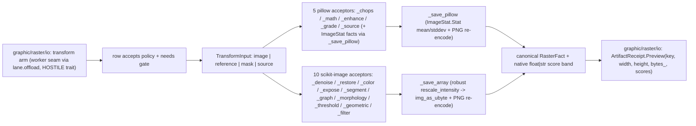

# [PY_ARTIFACTS_GRAPHIC_RASTER_PROCESS]

Produced-raster behavior and shared raster vocabulary live here. `Transform` names the operation sub-axis; `TransformNeeds` states payload timing; `TransformPolicy` carries closed per-family parameters; `ColorSpace` bounds generic conversion names; `TransformInput` admits image, reference, mask, or source payloads without absent-field ghosts; `TransformArm` binds provider member, policy, disposition, and acceptor; `RasterFact`, `ConvertFormat`, and `Frame` complete the substrate. `io → measure → process` remains the raster import direction. pillow carries the working families, and scikit-image carries denoising, restoration, color, exposure, segmentation, graph, morphology, thresholding, geometry, filtering, and measurement behind its manifest interpreter marker.

Each acceptor is a pure NumPy/PIL transform. `graphic/raster/io#IO` owns its `(ValueError, OSError, KeyError)` rail, `lane.offload` crossing, and uint8 admission. Source cases bypass decode and carry only `Transform` plus `TransformPolicy`; image, reference, and mask cases carry the admitted `Frame` with exactly their required operand.

## [01]-[INDEX]

- [01]-[PROCESS]: Raster vocabulary plus the produced-raster engine; `TRANSFORMS` binds typed `TransformPolicy` seeds to pillow and scikit-image acceptors, and every diagnostic lands on `RasterFact.score`.

## [02]-[PROCESS]

- Owner: `Transform`, `TransformNeeds`, `TransformPolicy`, `ColorSpace`, `TransformInput`, `TransformArm`, `ConvertFormat`, `Frame`, and `RasterFact` form one raster substrate. `TransformPolicy` is the closed parameter algebra; `TransformArm.options` selects its seed or a complete typed override before materializing provider kwargs. `TransformInput` is the closed payload-timing family: `image`, `reference`, `mask`, and `source` each admit only their fields. `TRANSFORMS` and `graphic/raster/measure#MEASURE`'s `MEASURE_TRANSFORMS` share `Final[frozendict[Transform, TransformArm]]`, so `io` composes one lookup with each member in exactly one table.
- Cases: five pillow acceptors own channel algebra, band math, enhancement, LUT application, generated gradients/noise/mandelbrot, and spread. Ten scikit-image acceptors own denoising, restoration, color, exposure, segmentation, graph, morphology, threshold, geometry, and filtering. `TransformPolicy` cases preserve each provider's parameter arity and value types; `TransformArm.accepts` rejects a policy from another family before dispatch.
- Auto: each acceptor matches its admitted `TransformInput` case, resolves `TransformArm.options(policy)`, and re-dispatches only where provider signatures differ. `TransformPolicy.provider` is the sole typed-policy-to-kwargs boundary. `_denoise` adds estimated noise, `_restore` builds the PSF, `_morphology` resolves `MorphKind`, `_filter` resolves `FilterChannel`, `_threshold` separates scalar and multilevel cuts, `_segment` and `_graph` resolve their structural results, and `_geometric` constructs fixed-arity coordinate payloads. Every closed match ends in `assert_never`.
- Receipt: each acceptor folds into the canonical `RasterFact` declared here — the scikit arms through `_save_array`, the robust display-normalizer that passes a uint8/bool/`[0, 1]`-float array straight to `img_as_ubyte` and `rescale_intensity`s every out-of-range float or label array to `[0, 1]` first, so an edge magnitude past `1.0`, a negative Laplacian, or a multi-Otsu label field re-encodes without a per-acceptor min-max; the pillow arms through `_save_pillow`, folding `ImageStat.Stat` luminance `mean`/`stddev` under the acceptor's own stamp. Every numeric stamp is a native `float` because `RasterFact.score` is the exact `frozendict[str, float | str]` band `core/receipt#RECEIPT` `ArtifactReceipt.Preview.scores` carries — io threads `fact.score` with no coerce.
- Growth: a provider member adds one `Transform` value and one row carrying `member`, acceptor, `TransformPolicy`, dispositions, and `TransformNeeds`; a new parameter shape adds one `TransformPolicy` case plus its total `provider` arm. New payload timing extends `TransformInput` and `TransformNeeds` together with `io`'s constructor arm.
- Packages: `pillow` (`ImageChops`/`ImageMath`/`ImageStat`/`ImageEnhance`/`ImageFilter.Color3DLUT`/`Image.linear_gradient`/`radial_gradient`/`effect_noise`/`effect_mandelbrot`/`effect_spread` — the ungated engine); `scikit-image` (the ten families at the members the rows name, census-gated on the cp315 wheel); `numpy` (operand algebra, `frombuffer`/`digitize`/`ptp`); `msgspec` (`Struct` the `RasterFact` wire shape); stdlib `dataclasses`/`enum`/`io`.
- Boundary: no IO/convert/thumbnail/montage working surface and no policy above the vocabulary — the codec-POLICY rows binding `ConvertFormat` → engine/save-args stay `graphic/raster/io#IO`'s, and the `needs` gate EXECUTES there while each row DECLARES its own requirement here, so a reference-consuming transform never depends on a roster a foreign page hand-maintains. No measurement half: the `_measure`/`_register`/`_metrics` acceptors that PRODUCE scores rather than a transformed raster are `graphic/raster/measure#MEASURE`'s, importing this substrate and contributing `MEASURE_TRANSFORMS`. A per-provider-call sibling, a parallel acceptor per member, a mutable module dispatch dict, a `.get(key, magic)` body default, a second requirement roster beside the row's `needs`, and a re-declaration of any vocabulary owner here are the rejected forms — `RasterFact` is the plane's ONE fact shape (`marks/encode`'s minimal twin resolves to this canonical). `_save_array`, `_luminance`, and `_channels` are the plane's shared worker-side substrate: `graphic/raster/measure#MEASURE` composes all three by import, and `media/analysis#ANALYSIS` composes `_save_array` as its rendered-frame PNG egress.

```python signature
from builtins import frozendict
from collections.abc import Callable
from dataclasses import dataclass
from enum import StrEnum
from io import BytesIO
from typing import Final, Literal, assert_never

import numpy as np
from expression import case, tag, tagged_union
from msgspec import Struct
from numpy.typing import NDArray

lazy from PIL import Image, ImageChops, ImageEnhance, ImageFilter, ImageMath, ImageStat
lazy from skimage import color, exposure, feature, filters, graph, io as skio, measure, morphology, restoration, segmentation, transform, util

type Frame = NDArray[np.uint8]


class Transform(StrEnum):  # the raster sub-axis vocabulary declared HERE; measured-row acceptor bodies live on graphic/raster/measure
    # --- produced-raster scikit-image families (census-gated: the marker drops when the cp315 wheel lands)
    DENOISE_BILATERAL = "denoise-bilateral"
    DENOISE_NL_MEANS = "denoise-nl-means"
    DENOISE_TV = "denoise-tv"
    DENOISE_WAVELET = "denoise-wavelet"
    INPAINT = "inpaint"
    ROLLING_BALL = "rolling-ball"
    DECONVOLVE = "deconvolve"
    WIENER = "wiener"  # restoration.wiener supervised deconvolution
    UNSUPERVISED_WIENER = "unsupervised-wiener"  # restoration.unsupervised_wiener self-tuned Wiener-Hunt
    UNWRAP_PHASE = "unwrap-phase"  # restoration.unwrap_phase 2D phase-unwrap
    SEPARATE_STAINS = "separate-stains"  # color.separate_stains H&E/HDX unmixing (_color)
    COMBINE_STAINS = "combine-stains"  # color.combine_stains inverse remix (_color)
    CONVERT_COLORSPACE = "convert-colorspace"  # color.convert_colorspace over the row's fromspace/tospace string pair (_color)
    YCBCR = "ycbcr"
    RGB2HSV = "rgb2hsv"
    RGB2LAB = "rgb2lab"
    LAB2RGB = "lab2rgb"
    CLAHE = "clahe"
    EQUALIZE = "equalize"
    RESCALE_INTENSITY = "rescale-intensity"
    MATCH_HISTOGRAMS = "match-histograms"  # reference-consuming
    GAMMA = "gamma"
    LOG = "log"
    SIGMOID = "sigmoid"
    SLIC = "slic"
    FELZENSZWALB = "felzenszwalb"
    QUICKSHIFT = "quickshift"
    WATERSHED = "watershed"
    CHAN_VESE = "chan-vese"
    MORPHOLOGICAL_CHAN_VESE = "morphological-chan-vese"
    MORPHOLOGICAL_GEODESIC = "morphological-geodesic"  # over inverse_gaussian_gradient (_segment)
    FIND_BOUNDARIES = "find-boundaries"
    CLEAR_BORDER = "clear-border"
    RAG_CUT_THRESHOLD = "rag-cut-threshold"  # graph.cut_threshold over the mean-color RAG (_graph)
    RAG_CUT_NORMALIZED = "rag-cut-normalized"
    RAG_MERGE = "rag-merge"
    MIN_COST_PATH = "min-cost-path"  # graph.route_through_array over the luminance cost (_graph)
    UNSHARP = "unsharp"
    GAUSSIAN = "gaussian"
    MEDIAN = "median"
    SOBEL = "sobel"
    LAPLACE = "laplace"
    FRANGI = "frangi"
    BUTTERWORTH = "butterworth"
    GABOR = "gabor"
    DIFFERENCE_OF_GAUSSIANS = "difference-of-gaussians"
    CANNY = "canny"
    SCHARR = "scharr"
    PREWITT = "prewitt"
    ROBERTS = "roberts"
    FARID = "farid"
    SATO = "sato"
    HESSIAN = "hessian"
    MEIJERING = "meijering"
    RANK_MEAN = "rank-mean"  # filters.rank.* footprint-local (_filter RANK)
    RANK_MEDIAN = "rank-median"
    RANK_MAXIMUM = "rank-maximum"
    RANK_ENTROPY = "rank-entropy"
    RANK_AUTOLEVEL = "rank-autolevel"
    RANK_GRADIENT = "rank-gradient"
    THRESHOLD_OTSU = "threshold-otsu"
    THRESHOLD_LOCAL = "threshold-local"
    THRESHOLD_MULTIOTSU = "threshold-multiotsu"
    THRESHOLD_LI = "threshold-li"
    THRESHOLD_YEN = "threshold-yen"
    THRESHOLD_ISODATA = "threshold-isodata"
    THRESHOLD_TRIANGLE = "threshold-triangle"
    THRESHOLD_MEAN = "threshold-mean"
    THRESHOLD_MINIMUM = "threshold-minimum"
    THRESHOLD_NIBLACK = "threshold-niblack"
    THRESHOLD_SAUVOLA = "threshold-sauvola"
    HYSTERESIS = "hysteresis"  # filters.apply_hysteresis_threshold two-level binarize (_threshold)
    SKELETONIZE = "skeletonize"
    MEDIAL_AXIS = "medial-axis"
    THIN = "thin"
    CONVEX_HULL = "convex-hull"
    OPENING = "opening"
    CLOSING = "closing"
    EROSION = "erosion"
    DILATION = "dilation"
    WHITE_TOPHAT = "white-tophat"
    BLACK_TOPHAT = "black-tophat"
    RECONSTRUCTION = "reconstruction"
    REMOVE_SMALL_OBJECTS = "remove-small-objects"
    REMOVE_SMALL_HOLES = "remove-small-holes"
    AREA_OPENING = "area-opening"
    DIAMETER_OPENING = "diameter-opening"
    ISOTROPIC_EROSION = "isotropic-erosion"
    ISOTROPIC_DILATION = "isotropic-dilation"
    FLOOD_FILL = "flood-fill"
    RESIZE = "resize"
    RESCALE = "rescale"
    ROTATE = "rotate"
    SWIRL = "swirl"
    WARP_POLAR = "warp-polar"
    WARP = "warp"  # transform.warp over estimate_transform("projective") keystone dewarp (_geometric)
    RADON = "radon"
    IRADON = "iradon"
    # --- produced-raster pillow families (rows + acceptor bodies here; ungated — the plane's working engine)
    CHOPS_MULTIPLY = "chops-multiply"  # ImageChops two-image channel algebra (_chops; reference-consuming)
    CHOPS_SCREEN = "chops-screen"
    CHOPS_OVERLAY = "chops-overlay"
    CHOPS_SOFT_LIGHT = "chops-soft-light"
    CHOPS_HARD_LIGHT = "chops-hard-light"
    CHOPS_DIFFERENCE = "chops-difference"
    CHOPS_ADD = "chops-add"  # scale/offset ride the row
    CHOPS_SUBTRACT = "chops-subtract"
    CHOPS_ADD_MODULO = "chops-add-modulo"
    CHOPS_DARKER = "chops-darker"
    CHOPS_LIGHTER = "chops-lighter"
    MATH_LINEAR = "math-linear"  # ImageMath.lambda_eval gain/bias affine (_math)
    ENHANCE_COLOR = "enhance-color"  # ImageEnhance factor rows (_enhance)
    ENHANCE_CONTRAST = "enhance-contrast"
    ENHANCE_BRIGHTNESS = "enhance-brightness"
    ENHANCE_SHARPNESS = "enhance-sharpness"
    LUT_3D = "lut-3d"  # ImageFilter.Color3DLUT table application; the table rides reference (_grade)
    SOURCE_LINEAR_GRADIENT = "source-linear-gradient"  # procedural L ramps and fields (_source)
    SOURCE_RADIAL_GRADIENT = "source-radial-gradient"
    SOURCE_NOISE = "source-noise"
    SOURCE_MANDELBROT = "source-mandelbrot"
    EFFECT_SPREAD = "effect-spread"  # random per-pixel displacement of the operand (_source)
    # --- measured-score families (rows + acceptor bodies on graphic/raster/measure)
    CONTOURS = "contours"
    ENTROPY = "entropy"
    REGIONPROPS = "regionprops"
    GLCM = "glcm"
    HOG = "hog"
    BLOB = "blob"
    BLOB_DOG = "blob-dog"
    BLOB_DOH = "blob-doh"
    LBP = "lbp"
    CORNERS = "corners"
    CORNERS_SHI_TOMASI = "corners-shi-tomasi"
    CORNERS_FAST = "corners-fast"
    CORNERS_MORAVEC = "corners-moravec"
    CORNERS_KR = "corners-kitchen-rosenfeld"
    PEAKS = "peaks"
    FIT_CIRCLE = "fit-circle"
    FIT_ELLIPSE = "fit-ellipse"
    FIT_LINE = "fit-line"
    HOUGH_LINE = "hough-line"  # the DETECTION family distinct from the RANSAC geometric FIT
    HOUGH_CIRCLE = "hough-circle"
    HOUGH_LINE_PROB = "hough-line-prob"
    STRUCTURE_TENSOR = "structure-tensor"
    SHAPE_INDEX = "shape-index"
    DAISY = "daisy"
    BASIC_FEATURES = "basic-features"
    BLUR_EFFECT = "blur-effect"  # the first NO-reference sharpness scalar
    PROFILE_LINE = "profile-line"
    OPTICAL_FLOW = "optical-flow"
    OPTICAL_FLOW_ILK = "optical-flow-ilk"
    PHASE_CORRELATION = "phase-correlation"
    KEYPOINTS = "keypoints"
    SIFT_KEYPOINTS = "sift-keypoints"
    CENSURE_KEYPOINTS = "censure-keypoints"  # CENSURE detect + BRIEF describe (reference-consuming)
    SSIM = "ssim"
    PSNR = "psnr"
    MSE = "mse"
    NRMSE = "nrmse"
    NMI = "nmi"
    HAUSDORFF = "hausdorff"
    RAND_ERROR = "rand-error"
    INFO_VARIATION = "info-variation"
    CONTINGENCY = "contingency"  # metrics.contingency_table label-overlap (reference-consuming)


class ConvertFormat(StrEnum):
    PNG = "PNG"
    JPEG = "JPEG"
    WEBP = "WEBP"
    AVIF = "AVIF"
    GIF = "GIF"
    TIFF = "TIFF"
    BMP = "BMP"


class TransformNeeds(StrEnum):  # the operand-requirement axis a row states on itself; io's one gate arm reads it before dispatch
    NONE = "none"
    REFERENCE = "reference"  # the second operand: a chops overlay, a LUT table, a histogram/metric/registration reference
    MASK = "mask"  # the inpaint mask
    SOURCE = "source"  # a generated frame owns no decoded operand


class ColorSpace(StrEnum):
    RGB = "RGB"
    HSV = "HSV"
    RGB_CIE = "RGB CIE"
    XYZ = "XYZ"
    YUV = "YUV"
    YIQ = "YIQ"
    YPBPR = "YPbPr"
    YCBCR = "YCbCr"
    YDBDR = "YDbDr"


class FilterChannel(StrEnum):
    GRAY = "gray"  # luminance operand, no channel axis (gradient + ridge + canny + gabor)
    CHANNELED = "channeled"  # raw operand with channel_axis injected (unsharp / gaussian / butterworth / difference-of-gaussians)
    PLAIN = "plain"  # raw operand, no channel axis (median)
    RANK = "rank"  # footprint-local rank filter on a uint8 operand (filters.rank.*)


class MorphKind(StrEnum):
    BINARY_FOOTPRINT = "binary-footprint"  # binary op over a disk footprint: opening / closing / erosion / dilation
    BINARY_PLAIN = "binary-plain"  # binary op, no footprint: skeletonize / medial_axis / thin / convex_hull_image
    GRAY_FOOTPRINT = "gray-footprint"  # grayscale op over a disk footprint: white_tophat / black_tophat
    RECONSTRUCT = "reconstruct"  # seed(eroded gray)-under-mask(gray) reconstruction by dilation
    PRUNE = "prune"  # component removal by a size/area floor (kwargs on the row)
    ATTRIBUTE = "attribute"  # max-tree attribute filter on gray: area_opening / diameter_opening
    ISOTROPIC = "isotropic"  # distance-transform radius morphology, no footprint
    FLOOD = "flood"  # seeded flood fill from a row-declared seed point


class RasterFact(Struct, frozen=True):
    # plane's ONE fact shape; the score band is the exact frozendict[str, float | str] ArtifactReceipt.Preview.scores carries
    data: bytes
    width: int = 0
    height: int = 0
    score: frozendict[str, float | str] = frozendict()


@tagged_union(frozen=True)
class TransformPolicy:
    tag: Literal[
        "default", "none", "denoise_nl", "weight", "radius", "deconvolution", "wiener", "psf", "colorspace", "markers",
        "iterations", "rag", "path", "frequency", "low_sigma", "block", "window", "hysteresis", "min_size", "area", "diameter",
        "seed", "extent", "scale", "angle", "swirl", "projective", "chops", "linear", "factor", "lut", "noise", "mandelbrot",
        "spread", "contour", "lbp", "distance", "ransac", "circles", "hough_line", "sigma", "profile", "upsample", "keypoints",
        "censure", "data_range", "glcm",
    ] = tag()
    default: None = case()
    none: None = case()
    denoise_nl: tuple[bool, int, int] = case()
    weight: float = case()
    radius: int = case()
    deconvolution: tuple[int, int] = case()
    wiener: tuple[int, float] = case()
    psf: int = case()
    colorspace: tuple[ColorSpace, ColorSpace] = case()
    markers: int = case()
    iterations: int = case()
    rag: tuple[int, float] = case()
    path: tuple[int, int, int, int] = case()
    frequency: float = case()
    low_sigma: float = case()
    block: int = case()
    window: int = case()
    hysteresis: tuple[float, float] = case()
    min_size: int = case()
    area: int = case()
    diameter: int = case()
    seed: tuple[int, int] = case()
    extent: tuple[int, int] = case()
    scale: float = case()
    angle: float = case()
    swirl: tuple[float, float] = case()
    projective: tuple[float, float, float, float, float, float, float, float] = case()
    chops: tuple[float, int] = case()
    linear: tuple[float, float] = case()
    factor: float = case()
    lut: int = case()
    noise: tuple[int, int, float] = case()
    mandelbrot: tuple[int, int, float, float, float, float, int] = case()
    spread: int = case()
    contour: float = case()
    lbp: tuple[int, float, str] = case()
    distance: int = case()
    ransac: tuple[int, float, int, int] = case()
    circles: tuple[int, int, int, int] = case()
    hough_line: tuple[int, int, int] = case()
    sigma: float = case()
    profile: tuple[int, int, int, int, int] = case()
    upsample: int = case()
    keypoints: int = case()
    censure: tuple[int, int] = case()
    data_range: int = case()
    glcm: tuple[tuple[int, ...], tuple[float, ...], int, bool, bool] = case()

    def admitted(self, /) -> bool:
        # every float-bearing payload proves finiteness before its range check — an infinity satisfies `>`/`>=`/`!=`
        # and would cross into the provider; an int payload cannot carry one, so the int arms stay range-only.
        match self:
            case TransformPolicy(tag="default") | TransformPolicy(tag="none") | TransformPolicy(tag="colorspace"):
                return True
            case TransformPolicy(tag="angle", angle=value):
                return bool(np.isfinite(value))
            case TransformPolicy(tag="projective", projective=values):
                return bool(np.isfinite(values).all())
            case TransformPolicy(tag="linear", linear=values):
                return bool(np.isfinite(values).all())
            case TransformPolicy(tag="factor", factor=value):
                return bool(np.isfinite(value)) and value >= 0.0
            case TransformPolicy(tag="contour", contour=value):
                return 0.0 <= value <= 1.0
            case TransformPolicy(tag="denoise_nl", denoise_nl=(_, patch_size, patch_distance)):
                return patch_size > 0 and patch_distance > 0
            case TransformPolicy(tag="weight", weight=value) | TransformPolicy(tag="low_sigma", low_sigma=value):
                return bool(np.isfinite(value)) and value > 0.0
            case TransformPolicy(tag="frequency", frequency=value) | TransformPolicy(tag="sigma", sigma=value):
                return bool(np.isfinite(value)) and value > 0.0
            case TransformPolicy(tag="radius", radius=value) | TransformPolicy(tag="psf", psf=value):
                return value > 0
            case TransformPolicy(tag="markers", markers=value) | TransformPolicy(tag="iterations", iterations=value):
                return value > 0
            case TransformPolicy(tag="block", block=value) | TransformPolicy(tag="window", window=value):
                return value > 0
            case TransformPolicy(tag="min_size", min_size=value) | TransformPolicy(tag="area", area=value):
                return value > 0
            case TransformPolicy(tag="diameter", diameter=value) | TransformPolicy(tag="spread", spread=value):
                return value > 0
            case TransformPolicy(tag="distance", distance=value) | TransformPolicy(tag="upsample", upsample=value):
                return value > 0
            case TransformPolicy(tag="keypoints", keypoints=value) | TransformPolicy(tag="data_range", data_range=value):
                return value > 0
            case TransformPolicy(tag="deconvolution", deconvolution=(psf, iterations)):
                return psf > 0 and iterations > 0
            case TransformPolicy(tag="wiener", wiener=(psf, balance)):
                return psf > 0 and bool(np.isfinite(balance)) and balance >= 0.0
            case TransformPolicy(tag="rag", rag=(segments, threshold)):
                return segments > 0 and bool(np.isfinite(threshold)) and threshold >= 0.0
            case TransformPolicy(tag="path", path=coordinates):
                return min(coordinates) >= 0
            case TransformPolicy(tag="hysteresis", hysteresis=(low, high)):
                return bool(np.isfinite((low, high)).all()) and 0.0 <= low <= high
            case TransformPolicy(tag="seed", seed=point):
                return min(point) >= 0
            case TransformPolicy(tag="extent", extent=(rows, cols)):
                return rows > 0 and cols > 0
            case TransformPolicy(tag="scale", scale=value):
                return bool(np.isfinite(value)) and value > 0.0
            case TransformPolicy(tag="swirl", swirl=(strength, radius)):
                return bool(np.isfinite((strength, radius)).all()) and radius > 0.0
            case TransformPolicy(tag="chops", chops=(scale, _)):
                return bool(np.isfinite(scale)) and scale != 0.0
            case TransformPolicy(tag="lut", lut=size):
                return 2 <= size <= 65
            case TransformPolicy(tag="noise", noise=(rows, cols, sigma)):
                return rows > 0 and cols > 0 and bool(np.isfinite(sigma)) and sigma >= 0.0
            case TransformPolicy(tag="mandelbrot", mandelbrot=(rows, cols, x0, y0, x1, y1, quality)):
                return rows > 0 and cols > 0 and bool(np.isfinite((x0, y0, x1, y1)).all()) and x0 < x1 and y0 < y1 and quality > 0
            case TransformPolicy(tag="lbp", lbp=(points, radius, method)):
                return points > 0 and bool(np.isfinite(radius)) and radius > 0.0 and bool(method)
            case TransformPolicy(tag="ransac", ransac=(samples, residual, trials, seed)):
                return samples > 0 and bool(np.isfinite(residual)) and residual > 0.0 and trials > 0 and seed >= 0
            case TransformPolicy(tag="circles", circles=(minimum, maximum, step, peaks)):
                return 0 <= minimum < maximum and step > 0 and peaks > 0
            case TransformPolicy(tag="hough_line", hough_line=(threshold, length, gap)):
                return threshold > 0 and length > 0 and gap >= 0
            case TransformPolicy(tag="profile", profile=(src_row, src_col, dst_row, dst_col, linewidth)):
                return min(src_row, src_col, dst_row, dst_col) >= 0 and linewidth > 0
            case TransformPolicy(tag="censure", censure=(minimum, maximum)):
                return 0 <= minimum <= maximum
            case TransformPolicy(tag="glcm", glcm=(distances, angles, levels, _, _)):
                return bool(distances) and bool(angles) and min(distances) > 0 and bool(np.isfinite(angles).all()) and levels > 1
            case _ as unreachable:
                assert_never(unreachable)

    def provider(self, /) -> frozendict[str, object]:
        match self:
            case TransformPolicy(tag="default") | TransformPolicy(tag="none"):
                return frozendict()
            case TransformPolicy(tag="denoise_nl", denoise_nl=(fast_mode, patch_size, patch_distance)):
                return frozendict({"fast_mode": fast_mode, "patch_size": patch_size, "patch_distance": patch_distance})
            case TransformPolicy(tag="weight", weight=value):
                return frozendict({"weight": value})
            case TransformPolicy(tag="radius", radius=value):
                return frozendict({"radius": value})
            case TransformPolicy(tag="deconvolution", deconvolution=(psf, iterations)):
                return frozendict({"psf": psf, "num_iter": iterations})
            case TransformPolicy(tag="wiener", wiener=(psf, balance)):
                return frozendict({"psf": psf, "balance": balance})
            case TransformPolicy(tag="psf", psf=value):
                return frozendict({"psf": value})
            case TransformPolicy(tag="colorspace", colorspace=(source, target)):
                return frozendict({"fromspace": source.value, "tospace": target.value})
            case TransformPolicy(tag="markers", markers=value):
                return frozendict({"markers": value})
            case TransformPolicy(tag="iterations", iterations=value):
                return frozendict({"num_iter": value})
            case TransformPolicy(tag="rag", rag=(segments, threshold)):
                return frozendict({"n_segments": segments, "thresh": threshold})
            case TransformPolicy(tag="path", path=(src_row, src_col, dst_row, dst_col)):
                return frozendict({"src_row": src_row, "src_col": src_col, "dst_row": dst_row, "dst_col": dst_col})
            case TransformPolicy(tag="frequency", frequency=value):
                return frozendict({"frequency": value})
            case TransformPolicy(tag="low_sigma", low_sigma=value):
                return frozendict({"low_sigma": value})
            case TransformPolicy(tag="block", block=value):
                return frozendict({"block_size": value})
            case TransformPolicy(tag="window", window=value):
                return frozendict({"window_size": value})
            case TransformPolicy(tag="hysteresis", hysteresis=(low, high)):
                return frozendict({"low": low, "high": high})
            case TransformPolicy(tag="min_size", min_size=value):
                return frozendict({"min_size": value})
            case TransformPolicy(tag="area", area=value):
                return frozendict({"area_threshold": value})
            case TransformPolicy(tag="diameter", diameter=value):
                return frozendict({"diameter_threshold": value})
            case TransformPolicy(tag="seed", seed=(row, col)):
                return frozendict({"seed_row": row, "seed_col": col})
            case TransformPolicy(tag="extent", extent=(rows, cols)):
                return frozendict({"rows": rows, "cols": cols})
            case TransformPolicy(tag="scale", scale=value):
                return frozendict({"scale": value})
            case TransformPolicy(tag="angle", angle=value):
                return frozendict({"angle": value})
            case TransformPolicy(tag="swirl", swirl=(strength, radius)):
                return frozendict({"strength": strength, "radius": radius})
            case TransformPolicy(tag="projective", projective=(tl_dx, tl_dy, tr_dx, tr_dy, br_dx, br_dy, bl_dx, bl_dy)):
                return frozendict({"tl_dx": tl_dx, "tl_dy": tl_dy, "tr_dx": tr_dx, "tr_dy": tr_dy, "br_dx": br_dx, "br_dy": br_dy, "bl_dx": bl_dx, "bl_dy": bl_dy})
            case TransformPolicy(tag="chops", chops=(scale, offset)):
                return frozendict({"scale": scale, "offset": offset})
            case TransformPolicy(tag="linear", linear=(gain, bias)):
                return frozendict({"gain": gain, "bias": bias})
            case TransformPolicy(tag="factor", factor=value):
                return frozendict({"factor": value})
            case TransformPolicy(tag="lut", lut=value):
                return frozendict({"size": value})
            case TransformPolicy(tag="noise", noise=(rows, cols, sigma)):
                return frozendict({"rows": rows, "cols": cols, "sigma": sigma})
            case TransformPolicy(tag="mandelbrot", mandelbrot=(rows, cols, x0, y0, x1, y1, quality)):
                return frozendict({"rows": rows, "cols": cols, "x0": x0, "y0": y0, "x1": x1, "y1": y1, "quality": quality})
            case TransformPolicy(tag="spread", spread=value):
                return frozendict({"distance": value})
            case TransformPolicy(tag="contour", contour=value):
                return frozendict({"level": value})
            case TransformPolicy(tag="lbp", lbp=(points, radius, method)):
                return frozendict({"P": points, "R": radius, "method": method})
            case TransformPolicy(tag="distance", distance=value):
                return frozendict({"min_distance": value})
            case TransformPolicy(tag="ransac", ransac=(samples, residual, trials, seed)):
                return frozendict({"min_samples": samples, "residual_threshold": residual, "max_trials": trials, "rng": seed})
            case TransformPolicy(tag="circles", circles=(radius_min, radius_max, radius_step, peaks)):
                return frozendict({"radius_min": radius_min, "radius_max": radius_max, "radius_step": radius_step, "peaks": peaks})
            case TransformPolicy(tag="hough_line", hough_line=(threshold, length, gap)):
                return frozendict({"threshold": threshold, "line_length": length, "line_gap": gap})
            case TransformPolicy(tag="sigma", sigma=value):
                return frozendict({"sigma": value})
            case TransformPolicy(tag="profile", profile=(src_row, src_col, dst_row, dst_col, linewidth)):
                return frozendict({"src_row": src_row, "src_col": src_col, "dst_row": dst_row, "dst_col": dst_col, "linewidth": linewidth})
            case TransformPolicy(tag="upsample", upsample=value):
                return frozendict({"upsample_factor": value})
            case TransformPolicy(tag="keypoints", keypoints=value):
                return frozendict({"n_keypoints": value})
            case TransformPolicy(tag="censure", censure=(minimum, maximum)):
                return frozendict({"min_scale": minimum, "max_scale": maximum})
            case TransformPolicy(tag="data_range", data_range=value):
                return frozendict({"data_range": value})
            case TransformPolicy(tag="glcm", glcm=(distances, angles, levels, symmetric, normed)):
                return frozendict({"distances": distances, "angles": angles, "levels": levels, "symmetric": symmetric, "normed": normed})
            case _ as unreachable:
                assert_never(unreachable)


@tagged_union(frozen=True)
class TransformInput:
    tag: Literal["image", "reference", "mask", "source"] = tag()
    image: tuple[Frame, Transform, TransformPolicy] = case()
    reference: tuple[Frame, Transform, bytes, TransformPolicy] = case()
    mask: tuple[Frame, Transform, bytes, TransformPolicy] = case()
    source: tuple[Transform, TransformPolicy] = case()


@dataclass(frozen=True, slots=True)
class TransformArm:
    member: str
    arm: Callable[[TransformInput], RasterFact]
    policy: TransformPolicy = TransformPolicy(none=None)
    channel: FilterChannel = FilterChannel.GRAY  # read only by _filter; the per-member operand/channel-axis disposition
    morph: MorphKind = MorphKind.BINARY_FOOTPRINT  # read only by _morphology; the per-member operand/footprint disposition
    needs: TransformNeeds = TransformNeeds.NONE  # the operand requirement io's gate reads; the row, never a foreign roster

    def accepts(self, override: TransformPolicy, /) -> bool:
        selected = self.policy if override.tag == "default" else override
        return override.tag in ("default", self.policy.tag) and selected.admitted()

    def options(self, override: TransformPolicy, /) -> frozendict[str, object]:
        return (self.policy if override.tag == "default" else override).provider()


def _channels(frame: Frame, /) -> int | None:
    return -1 if frame.ndim == 3 else None


def _luminance(frame: Frame, /) -> NDArray[np.floating]:
    return color.rgb2gray(frame) if frame.ndim == 3 else util.img_as_float(frame)


def _save_array(array: NDArray[np.floating | np.integer | np.bool_], score: frozendict[str, float | str], /) -> RasterFact:
    framed = (
        array
        if array.dtype in (np.uint8, np.bool_)
        or (np.issubdtype(array.dtype, np.floating) and 0.0 <= float(array.min()) and float(array.max()) <= 1.0)
        else exposure.rescale_intensity(array.astype(np.float64), out_range=(0.0, 1.0))
    )
    image = Image.fromarray(util.img_as_ubyte(framed))
    sink = BytesIO()
    image.save(sink, format=ConvertFormat.PNG.value)
    return RasterFact(sink.getvalue(), *image.size, score)


def _save_pillow(image: "Image.Image", score: frozendict[str, float | str], /) -> RasterFact:
    stat = ImageStat.Stat(image.convert("L"))
    sink = BytesIO()
    image.save(sink, format=ConvertFormat.PNG.value)
    return RasterFact(sink.getvalue(), *image.size, frozendict({"mean": float(stat.mean[0]), "stddev": float(stat.stddev[0])}) | score)


def _chops(tx: TransformInput) -> RasterFact:
    match tx:
        case TransformInput(tag="reference", reference=(image, kind, reference, policy)):
            pass
        case _ as unreachable:
            assert_never(unreachable)
    row = TRANSFORMS[kind]
    member = getattr(ImageChops, row.member)
    base = Image.fromarray(image).convert("RGB")
    overlay = Image.open(BytesIO(reference)).convert("RGB").resize(base.size)
    merged = member(base, overlay, **row.options(policy))
    return _save_pillow(merged, frozendict({"blend": row.member}))


def _math(tx: TransformInput) -> RasterFact:
    match tx:
        case TransformInput(tag="image", image=(image, kind, policy)):
            pass
        case _ as unreachable:
            assert_never(unreachable)
    opts = TRANSFORMS[kind].options(policy)
    gain, bias = float(opts["gain"]), float(opts["bias"])
    graded = ImageMath.lambda_eval(lambda env: env["im"] * gain + bias, im=Image.fromarray(image).convert("F"))
    return _save_array(np.asarray(graded, dtype=np.float64), frozendict({"gain": gain, "bias": bias}))


def _enhance(tx: TransformInput) -> RasterFact:
    match tx:
        case TransformInput(tag="image", image=(image, kind, policy)):
            pass
        case _ as unreachable:
            assert_never(unreachable)
    row = TRANSFORMS[kind]
    factor = float(row.options(policy)["factor"])
    enhanced = getattr(ImageEnhance, row.member)(Image.fromarray(image).convert("RGB")).enhance(factor)
    return _save_pillow(enhanced, frozendict({"factor": factor}))


def _grade(tx: TransformInput) -> RasterFact:
    match tx:
        case TransformInput(tag="reference", reference=(image, kind, reference, policy)):
            pass
        case _ as unreachable:
            assert_never(unreachable)
    size = int(TRANSFORMS[kind].options(policy)["size"])
    table = np.frombuffer(reference, dtype=np.float32).reshape(-1, 3)
    graded = Image.fromarray(image).convert("RGB").filter(ImageFilter.Color3DLUT(size, table.tolist()))
    return _save_pillow(graded, frozendict({"lut_size": float(size)}))


def _source(tx: TransformInput) -> RasterFact:
    match tx:
        case TransformInput(tag="image", image=(frame, Transform.EFFECT_SPREAD as kind, policy)):
            row, opts = TRANSFORMS[kind], TRANSFORMS[kind].options(policy)
            image = Image.fromarray(frame).effect_spread(int(opts["distance"]))
        case TransformInput(tag="source", source=(Transform.SOURCE_NOISE as kind, policy)):
            row, opts = TRANSFORMS[kind], TRANSFORMS[kind].options(policy)
            image = Image.effect_noise((int(opts["cols"]), int(opts["rows"])), float(opts["sigma"]))
        case TransformInput(tag="source", source=(Transform.SOURCE_MANDELBROT as kind, policy)):
            row, opts = TRANSFORMS[kind], TRANSFORMS[kind].options(policy)
            extent = (float(opts["x0"]), float(opts["y0"]), float(opts["x1"]), float(opts["y1"]))
            image = Image.effect_mandelbrot((int(opts["cols"]), int(opts["rows"])), extent, int(opts["quality"]))
        case TransformInput(tag="source", source=((Transform.SOURCE_LINEAR_GRADIENT | Transform.SOURCE_RADIAL_GRADIENT) as kind, policy)):
            row, opts = TRANSFORMS[kind], TRANSFORMS[kind].options(policy)
            image = getattr(Image, row.member)("L").resize((int(opts["cols"]), int(opts["rows"])))
        case _ as unreachable:
            assert_never(unreachable)
    return _save_pillow(image, frozendict({"source": row.member}))


_DENOISE_NOISE: Final[frozendict[Transform, Callable[[float], frozendict[str, float]]]] = frozendict({
    Transform.DENOISE_BILATERAL: lambda sigma: frozendict({"sigma_color": sigma}),
    Transform.DENOISE_NL_MEANS: lambda sigma: frozendict({"h": 0.8 * sigma, "sigma": sigma}),
    Transform.DENOISE_WAVELET: lambda sigma: frozendict({"sigma": sigma}),
})


def _denoise(tx: TransformInput) -> RasterFact:
    match tx:
        case TransformInput(tag="image", image=(frame, kind, policy)):
            pass
        case _ as unreachable:
            assert_never(unreachable)
    row, axis = TRANSFORMS[kind], _channels(frame)
    image = util.img_as_float(frame)
    sigma = float(restoration.estimate_sigma(image, average_sigmas=True, channel_axis=axis))
    tuned = _DENOISE_NOISE[kind](sigma) if kind in _DENOISE_NOISE else frozendict()
    member = getattr(restoration, row.member)
    return _save_array(member(image, channel_axis=axis, **(tuned | row.options(policy))), frozendict({"sigma": sigma}))


def _psf(opts: frozendict[str, object], /) -> NDArray[np.floating]:
    span = int(opts["psf"])
    return np.ones((span, span), dtype=np.float64) / float(span * span)


def _restore(tx: TransformInput) -> RasterFact:
    match tx:
        case TransformInput(tag="mask", mask=(frame, Transform.INPAINT as kind, encoded_mask, policy)):
            row, axis = TRANSFORMS[kind], _channels(frame)
            mask = skio.imread(BytesIO(encoded_mask), as_gray=True) > 0.0
            return _save_array(getattr(restoration, row.member)(frame, mask, channel_axis=axis), frozendict({"masked": float(mask.mean())}))
        case TransformInput(tag="image", image=(frame, kind, policy)):
            row, axis = TRANSFORMS[kind], _channels(frame)
            member, opts = getattr(restoration, row.member), row.options(policy)
        case _ as unreachable:
            assert_never(unreachable)
    match kind:
        case Transform.DECONVOLVE:
            # `richardson_lucy` admits no `channel_axis` (catalog row [07]); the deconvolution family operates
            # on the luminance plane exactly as its Wiener siblings — color-plane policy is the dispatch axis.
            image, iters = util.img_as_float(_luminance(frame)), int(opts["num_iter"])
            return _save_array(member(image, _psf(opts), num_iter=iters), frozendict({"iterations": float(iters)}))
        case Transform.WIENER:
            balance = float(opts["balance"])
            return _save_array(member(_luminance(frame), _psf(opts), balance), frozendict({"balance": balance}))
        case Transform.UNSUPERVISED_WIENER:
            restored, _chains = member(_luminance(frame), _psf(opts))
            return _save_array(restored, frozendict({"self_tuned": 1.0}))
        case Transform.UNWRAP_PHASE:
            unwrapped = member(_luminance(frame))
            return _save_array(unwrapped, frozendict({"range": float(np.ptp(unwrapped))}))
        case Transform.ROLLING_BALL:
            # float operand: a uint8 subtraction wraps on any pixel darker than its background estimate
            image = util.img_as_float(frame)
            background = member(image, radius=int(opts["radius"]))
            return _save_array(image - background, frozendict({"background": float(background.mean())}))
        case _ as unreachable:
            assert_never(unreachable)


def _color(tx: TransformInput) -> RasterFact:
    match tx:
        case TransformInput(tag="image", image=(image, kind, policy)):
            pass
        case _ as unreachable:
            assert_never(unreachable)
    row = TRANSFORMS[kind]
    member = getattr(color, row.member)
    match kind:
        case Transform.SEPARATE_STAINS:  # H&E/HDX stain unmixing over the fixed color-deconvolution matrix
            stains = member(image, color.hed_from_rgb, channel_axis=_channels(image))
            return _save_array(stains, frozendict({"stains": float(stains.shape[-1])}))
        case Transform.COMBINE_STAINS:  # the inverse remix: stain planes back to RGB over the rgb_from_hed matrix
            return _save_array(member(image, color.rgb_from_hed, channel_axis=_channels(image)), frozendict({"space": "rgb"}))
        case Transform.CONVERT_COLORSPACE:  # the name-dispatched space pair rides the row's typed string kwargs
            opts = row.options(policy)
            return _save_array(member(image, str(opts["fromspace"]), str(opts["tospace"])), frozendict({"space": str(opts["tospace"])}))
        case Transform.YCBCR | Transform.RGB2HSV | Transform.RGB2LAB | Transform.LAB2RGB:
            return _save_array(member(image), frozendict({"space": row.member}))
        case _ as unreachable:
            assert_never(unreachable)


def _expose(tx: TransformInput) -> RasterFact:
    match tx:
        case TransformInput(tag="reference", reference=(image, Transform.MATCH_HISTOGRAMS as kind, encoded_reference, policy)):
            row = TRANSFORMS[kind]
            reference = skio.imread(BytesIO(encoded_reference))
            score = frozendict({"contrast": "low" if exposure.is_low_contrast(image) else "ok"})
            return _save_array(getattr(exposure, row.member)(image, reference, channel_axis=_channels(image)), score)
        case TransformInput(tag="image", image=(image, kind, policy)):
            row = TRANSFORMS[kind]
        case _ as unreachable:
            assert_never(unreachable)
    member = getattr(exposure, row.member)
    score = frozendict({"contrast": "low" if exposure.is_low_contrast(image) else "ok"})
    return _save_array(member(image, **row.options(policy)), score)


def _segment(tx: TransformInput) -> RasterFact:
    match tx:
        case TransformInput(tag="image", image=(image, kind, policy)):
            pass
        case _ as unreachable:
            assert_never(unreachable)
    row, opts = TRANSFORMS[kind], TRANSFORMS[kind].options(policy)
    match kind:
        case Transform.FIND_BOUNDARIES:
            gray = _luminance(image)
            boundaries = segmentation.find_boundaries(measure.label(gray > filters.threshold_otsu(gray)))
            return _save_array(boundaries, frozendict({"boundary_fraction": float(boundaries.mean())}))
        case Transform.WATERSHED:
            labels = segmentation.watershed(filters.sobel(_luminance(image)), markers=int(opts["markers"]))
        case Transform.CHAN_VESE:
            labels = segmentation.chan_vese(_luminance(image), **opts).astype(int)
        case Transform.MORPHOLOGICAL_CHAN_VESE:
            labels = segmentation.morphological_chan_vese(_luminance(image), int(opts["num_iter"])).astype(int)
        case Transform.MORPHOLOGICAL_GEODESIC:
            labels = segmentation.morphological_geodesic_active_contour(
                segmentation.inverse_gaussian_gradient(_luminance(image)), int(opts["num_iter"])
            ).astype(int)
        case Transform.CLEAR_BORDER:
            gray = _luminance(image)
            labels = segmentation.clear_border(measure.label(gray > filters.threshold_otsu(gray)))
        case Transform.SLIC | Transform.FELZENSZWALB | Transform.QUICKSHIFT:
            labels = getattr(segmentation, row.member)(image, channel_axis=_channels(image), **opts)
        case _ as unreachable:
            assert_never(unreachable)
    overlay = segmentation.mark_boundaries(image, labels)
    regions = int(measure.regionprops_table(labels, properties=("label",))["label"].size)
    return _save_array(overlay, frozendict({"regions": float(regions)}))


def _weight_mean_color(rag: object, src: int, dst: int, neighbor: int, /) -> dict[str, float]:
    # skimage RAG merge idiom: edge weight is the mean-color L2 distance (the networkx edge-data dict the callback contract requires)
    return {"weight": float(np.linalg.norm(rag.nodes[dst]["mean color"] - rag.nodes[neighbor]["mean color"]))}


def _merge_mean_color(rag: object, src: int, dst: int, /) -> None:
    # skimage RAG merge idiom: fold src's color mass into dst before the edge drops (the callback mutates the provider RAG in place)
    rag.nodes[dst]["total color"] += rag.nodes[src]["total color"]
    rag.nodes[dst]["pixel count"] += rag.nodes[src]["pixel count"]
    rag.nodes[dst]["mean color"] = rag.nodes[dst]["total color"] / rag.nodes[dst]["pixel count"]


def _graph(tx: TransformInput) -> RasterFact:
    match tx:
        case TransformInput(tag="image", image=(image, kind, policy)):
            pass
        case _ as unreachable:
            assert_never(unreachable)
    row, opts = TRANSFORMS[kind], TRANSFORMS[kind].options(policy)
    match kind:
        case Transform.MIN_COST_PATH:
            cost = _luminance(image)
            start = (min(int(opts["src_row"]), cost.shape[0] - 1), min(int(opts["src_col"]), cost.shape[1] - 1))
            end = (min(int(opts["dst_row"]), cost.shape[0] - 1), min(int(opts["dst_col"]), cost.shape[1] - 1))
            indices, weight = graph.route_through_array(cost, start, end)
            trace = np.zeros(cost.shape, dtype=bool)
            trace[tuple(np.asarray(indices, dtype=int).T)] = True
            return _save_array(trace, frozendict({"path_cost": float(weight), "path_length": float(len(indices))}))
        case Transform.RAG_CUT_THRESHOLD | Transform.RAG_CUT_NORMALIZED | Transform.RAG_MERGE:
            labels = segmentation.slic(image, n_segments=int(opts["n_segments"]), channel_axis=_channels(image))
            rag = graph.rag_mean_color(image, labels)
            merged = (
                graph.merge_hierarchical(
                    labels, rag, thresh=float(opts["thresh"]), rag_copy=False, in_place_merge=True,
                    merge_func=_merge_mean_color, weight_func=_weight_mean_color,
                )
                if kind is Transform.RAG_MERGE
                else getattr(graph, row.member)(labels, rag, float(opts["thresh"]))
            )
        case _ as unreachable:
            assert_never(unreachable)
    overlay = segmentation.mark_boundaries(image, merged)
    regions = int(measure.regionprops_table(merged, properties=("label",))["label"].size)
    return _save_array(overlay, frozendict({"regions": float(regions)}))


def _morphology(tx: TransformInput) -> RasterFact:
    match tx:
        case TransformInput(tag="image", image=(image, kind, policy)):
            pass
        case _ as unreachable:
            assert_never(unreachable)
    row = TRANSFORMS[kind]
    gray = _luminance(image)
    binary = gray > filters.threshold_otsu(gray)
    member, opts = getattr(morphology, row.member), row.options(policy)
    match row.morph:
        case MorphKind.BINARY_FOOTPRINT:
            result = member(binary, morphology.disk(int(opts["radius"])))
        case MorphKind.BINARY_PLAIN:  # skeletonize / medial_axis / thin / convex_hull_image — binary in, binary out, no footprint
            result = member(binary)
        case MorphKind.GRAY_FOOTPRINT:
            result = member(gray, morphology.disk(int(opts["radius"])))
        case MorphKind.RECONSTRUCT:  # opening-by-reconstruction: dilate an eroded seed under the gray mask
            result = member(morphology.erosion(gray, morphology.disk(int(opts["radius"]))), gray)
        case MorphKind.PRUNE:  # remove_small_objects (min_size) / remove_small_holes (area_threshold) — the floor kwarg rides the row typed
            result = member(binary, **opts)
        case MorphKind.ATTRIBUTE:  # area_opening / diameter_opening — max-tree attribute filter on the grayscale operand
            result = member(gray, **opts)
        case MorphKind.ISOTROPIC:  # distance-transform radius morphology (no explicit footprint)
            result = member(binary, int(opts["radius"]))
        case MorphKind.FLOOD:  # seeded flood fill: fill the connected region at the row-declared seed point on a uint8 operand
            result = member(util.img_as_ubyte(gray), (int(opts["seed_row"]), int(opts["seed_col"])), 255)
        case _ as unreachable:
            assert_never(unreachable)
    return _save_array(result, frozendict({"foreground": float(np.asarray(result, dtype=float).mean())}))


def _threshold(tx: TransformInput) -> RasterFact:
    match tx:
        case TransformInput(tag="image", image=(image, kind, policy)):
            pass
        case _ as unreachable:
            assert_never(unreachable)
    row, gray = TRANSFORMS[kind], _luminance(image)
    opts = row.options(policy)
    match kind:
        case Transform.HYSTERESIS:
            mask = filters.apply_hysteresis_threshold(gray, **opts)
            return _save_array(mask, frozendict({"foreground": float(mask.mean())}))
        case Transform.THRESHOLD_MULTIOTSU:
            cut = getattr(filters, row.member)(gray, **opts)
            return _save_array(np.digitize(gray, cut), frozendict({"classes": float(len(cut) + 1)}))
        case Transform.THRESHOLD_OTSU | Transform.THRESHOLD_LOCAL | Transform.THRESHOLD_LI | Transform.THRESHOLD_YEN | Transform.THRESHOLD_ISODATA | Transform.THRESHOLD_TRIANGLE | Transform.THRESHOLD_MEAN | Transform.THRESHOLD_MINIMUM | Transform.THRESHOLD_NIBLACK | Transform.THRESHOLD_SAUVOLA:
            cut = getattr(filters, row.member)(gray, **opts)
            mask = gray > cut
            return _save_array(mask, frozendict({"foreground": float(mask.mean())}))
        case _ as unreachable:
            assert_never(unreachable)


def _geometric(tx: TransformInput) -> RasterFact:
    match tx:
        case TransformInput(tag="image", image=(image, kind, policy)):
            pass
        case _ as unreachable:
            assert_never(unreachable)
    row = TRANSFORMS[kind]
    member, opts = getattr(transform, row.member), row.options(policy)
    match kind:
        case Transform.RESIZE:
            warped = member(image, (int(opts["rows"]), int(opts["cols"])), anti_aliasing=True)
        case Transform.RESCALE:
            warped = member(image, float(opts["scale"]), channel_axis=_channels(image), anti_aliasing=True)
        case Transform.ROTATE:
            warped = member(image, float(opts["angle"]), resize=True)
        case Transform.SWIRL:
            warped = member(_luminance(image), strength=float(opts["strength"]), radius=float(opts["radius"]))
        case Transform.WARP_POLAR:
            warped = member(image, channel_axis=_channels(image), **opts)
        case Transform.WARP:
            rows, cols = image.shape[:2]
            src = np.array([[0.0, 0.0], [cols, 0.0], [cols, rows], [0.0, rows]], dtype=float)
            dst = src + np.array(
                [[opts["tl_dx"], opts["tl_dy"]], [opts["tr_dx"], opts["tr_dy"]], [opts["br_dx"], opts["br_dy"]], [opts["bl_dx"], opts["bl_dy"]]],
                dtype=float,
            )
            warped = member(image, transform.estimate_transform("projective", src, dst).inverse, output_shape=(rows, cols))
        case Transform.RADON | Transform.IRADON:
            warped = member(_luminance(image))
        case _ as unreachable:
            assert_never(unreachable)
    return _save_array(warped, frozendict({"shape": "x".join(str(dim) for dim in warped.shape[:2])}))


def _filter(tx: TransformInput) -> RasterFact:
    match tx:
        case TransformInput(tag="image", image=(image, kind, policy)):
            pass
        case _ as unreachable:
            assert_never(unreachable)
    row = TRANSFORMS[kind]
    opts = row.options(policy)
    match row.channel:
        case FilterChannel.GRAY:
            member, source, extra = getattr(feature if kind is Transform.CANNY else filters, row.member), _luminance(image), opts
        case FilterChannel.CHANNELED:
            member, source, extra = getattr(filters, row.member), image, frozendict({"channel_axis": _channels(image)}) | opts
        case FilterChannel.PLAIN:
            member, source, extra = getattr(filters, row.member), image, opts
        case FilterChannel.RANK:  # filters.rank.<member>(uint8, footprint=disk(radius)); radius rides the row into the footprint
            member, source, extra = (
                getattr(filters.rank, row.member),
                util.img_as_ubyte(_luminance(image)),
                frozendict({"footprint": morphology.disk(int(opts["radius"]))}),
            )
        case _ as unreachable:
            assert_never(unreachable)
    raw = member(source, **extra)
    out = raw[0] if kind is Transform.GABOR else raw
    return _save_array(out, frozendict({"response": float(out.mean())}))


TRANSFORMS: Final[frozendict[Transform, TransformArm]] = frozendict({
    Transform.DENOISE_BILATERAL: TransformArm("denoise_bilateral", _denoise),
    Transform.DENOISE_NL_MEANS: TransformArm("denoise_nl_means", _denoise, TransformPolicy(denoise_nl=(True, 5, 6))),
    Transform.DENOISE_TV: TransformArm("denoise_tv_chambolle", _denoise, TransformPolicy(weight=0.1)),
    Transform.DENOISE_WAVELET: TransformArm("denoise_wavelet", _denoise),
    Transform.INPAINT: TransformArm("inpaint_biharmonic", _restore, needs=TransformNeeds.MASK),
    Transform.ROLLING_BALL: TransformArm("rolling_ball", _restore, TransformPolicy(radius=50)),
    Transform.DECONVOLVE: TransformArm("richardson_lucy", _restore, TransformPolicy(deconvolution=(5, 10))),
    Transform.WIENER: TransformArm("wiener", _restore, TransformPolicy(wiener=(5, 0.1))),
    Transform.UNSUPERVISED_WIENER: TransformArm("unsupervised_wiener", _restore, TransformPolicy(psf=5)),
    Transform.UNWRAP_PHASE: TransformArm("unwrap_phase", _restore),
    Transform.SEPARATE_STAINS: TransformArm("separate_stains", _color),
    Transform.COMBINE_STAINS: TransformArm("combine_stains", _color),
    Transform.CONVERT_COLORSPACE: TransformArm("convert_colorspace", _color, TransformPolicy(colorspace=(ColorSpace.RGB, ColorSpace.HSV))),
    Transform.YCBCR: TransformArm("rgb2ycbcr", _color),
    Transform.RGB2HSV: TransformArm("rgb2hsv", _color),
    Transform.RGB2LAB: TransformArm("rgb2lab", _color),
    Transform.LAB2RGB: TransformArm("lab2rgb", _color),
    Transform.CLAHE: TransformArm("equalize_adapthist", _expose),
    Transform.EQUALIZE: TransformArm("equalize_hist", _expose),
    Transform.RESCALE_INTENSITY: TransformArm("rescale_intensity", _expose),
    Transform.MATCH_HISTOGRAMS: TransformArm("match_histograms", _expose, needs=TransformNeeds.REFERENCE),
    Transform.GAMMA: TransformArm("adjust_gamma", _expose),
    Transform.LOG: TransformArm("adjust_log", _expose),
    Transform.SIGMOID: TransformArm("adjust_sigmoid", _expose),
    Transform.SLIC: TransformArm("slic", _segment),
    Transform.FELZENSZWALB: TransformArm("felzenszwalb", _segment),
    Transform.QUICKSHIFT: TransformArm("quickshift", _segment),
    Transform.WATERSHED: TransformArm("watershed", _segment, TransformPolicy(markers=250)),
    Transform.CHAN_VESE: TransformArm("chan_vese", _segment),
    Transform.MORPHOLOGICAL_CHAN_VESE: TransformArm("morphological_chan_vese", _segment, TransformPolicy(iterations=35)),
    Transform.MORPHOLOGICAL_GEODESIC: TransformArm("morphological_geodesic_active_contour", _segment, TransformPolicy(iterations=35)),
    Transform.FIND_BOUNDARIES: TransformArm("find_boundaries", _segment),
    Transform.CLEAR_BORDER: TransformArm("clear_border", _segment),
    Transform.RAG_CUT_THRESHOLD: TransformArm("cut_threshold", _graph, TransformPolicy(rag=(400, 0.08))),
    Transform.RAG_CUT_NORMALIZED: TransformArm("cut_normalized", _graph, TransformPolicy(rag=(400, 0.001))),
    Transform.RAG_MERGE: TransformArm("merge_hierarchical", _graph, TransformPolicy(rag=(400, 0.08))),
    Transform.MIN_COST_PATH: TransformArm("route_through_array", _graph, TransformPolicy(path=(0, 0, 100, 100))),
    Transform.UNSHARP: TransformArm("unsharp_mask", _filter, channel=FilterChannel.CHANNELED),
    Transform.GAUSSIAN: TransformArm("gaussian", _filter, channel=FilterChannel.CHANNELED),
    Transform.MEDIAN: TransformArm("median", _filter, channel=FilterChannel.PLAIN),
    Transform.SOBEL: TransformArm("sobel", _filter),
    Transform.LAPLACE: TransformArm("laplace", _filter),
    Transform.FRANGI: TransformArm("frangi", _filter),
    Transform.BUTTERWORTH: TransformArm("butterworth", _filter, channel=FilterChannel.CHANNELED),
    Transform.GABOR: TransformArm("gabor", _filter, TransformPolicy(frequency=0.6)),
    Transform.DIFFERENCE_OF_GAUSSIANS: TransformArm("difference_of_gaussians", _filter, TransformPolicy(low_sigma=1.0), channel=FilterChannel.CHANNELED),
    Transform.CANNY: TransformArm("canny", _filter),
    Transform.SCHARR: TransformArm("scharr", _filter),
    Transform.PREWITT: TransformArm("prewitt", _filter),
    Transform.ROBERTS: TransformArm("roberts", _filter),
    Transform.FARID: TransformArm("farid", _filter),
    Transform.SATO: TransformArm("sato", _filter),
    Transform.HESSIAN: TransformArm("hessian", _filter),
    Transform.MEIJERING: TransformArm("meijering", _filter),
    Transform.RANK_MEAN: TransformArm("mean", _filter, TransformPolicy(radius=3), channel=FilterChannel.RANK),
    Transform.RANK_MEDIAN: TransformArm("median", _filter, TransformPolicy(radius=3), channel=FilterChannel.RANK),
    Transform.RANK_MAXIMUM: TransformArm("maximum", _filter, TransformPolicy(radius=3), channel=FilterChannel.RANK),
    Transform.RANK_ENTROPY: TransformArm("entropy", _filter, TransformPolicy(radius=5), channel=FilterChannel.RANK),
    Transform.RANK_AUTOLEVEL: TransformArm("autolevel", _filter, TransformPolicy(radius=3), channel=FilterChannel.RANK),
    Transform.RANK_GRADIENT: TransformArm("gradient", _filter, TransformPolicy(radius=3), channel=FilterChannel.RANK),
    Transform.THRESHOLD_OTSU: TransformArm("threshold_otsu", _threshold),
    Transform.THRESHOLD_LOCAL: TransformArm("threshold_local", _threshold, TransformPolicy(block=35)),
    Transform.THRESHOLD_MULTIOTSU: TransformArm("threshold_multiotsu", _threshold),
    Transform.THRESHOLD_LI: TransformArm("threshold_li", _threshold),
    Transform.THRESHOLD_YEN: TransformArm("threshold_yen", _threshold),
    Transform.THRESHOLD_ISODATA: TransformArm("threshold_isodata", _threshold),
    Transform.THRESHOLD_TRIANGLE: TransformArm("threshold_triangle", _threshold),
    Transform.THRESHOLD_MEAN: TransformArm("threshold_mean", _threshold),
    Transform.THRESHOLD_MINIMUM: TransformArm("threshold_minimum", _threshold),
    Transform.THRESHOLD_NIBLACK: TransformArm("threshold_niblack", _threshold, TransformPolicy(window=15)),
    Transform.THRESHOLD_SAUVOLA: TransformArm("threshold_sauvola", _threshold, TransformPolicy(window=15)),
    Transform.HYSTERESIS: TransformArm("apply_hysteresis_threshold", _threshold, TransformPolicy(hysteresis=(0.1, 0.35))),
    Transform.SKELETONIZE: TransformArm("skeletonize", _morphology, morph=MorphKind.BINARY_PLAIN),
    Transform.MEDIAL_AXIS: TransformArm("medial_axis", _morphology, morph=MorphKind.BINARY_PLAIN),
    Transform.THIN: TransformArm("thin", _morphology, morph=MorphKind.BINARY_PLAIN),
    Transform.CONVEX_HULL: TransformArm("convex_hull_image", _morphology, morph=MorphKind.BINARY_PLAIN),
    Transform.OPENING: TransformArm("binary_opening", _morphology, TransformPolicy(radius=1)),
    Transform.CLOSING: TransformArm("binary_closing", _morphology, TransformPolicy(radius=1)),
    Transform.EROSION: TransformArm("binary_erosion", _morphology, TransformPolicy(radius=1)),
    Transform.DILATION: TransformArm("binary_dilation", _morphology, TransformPolicy(radius=1)),
    Transform.WHITE_TOPHAT: TransformArm("white_tophat", _morphology, TransformPolicy(radius=5), morph=MorphKind.GRAY_FOOTPRINT),
    Transform.BLACK_TOPHAT: TransformArm("black_tophat", _morphology, TransformPolicy(radius=5), morph=MorphKind.GRAY_FOOTPRINT),
    Transform.RECONSTRUCTION: TransformArm("reconstruction", _morphology, TransformPolicy(radius=3), morph=MorphKind.RECONSTRUCT),
    Transform.REMOVE_SMALL_OBJECTS: TransformArm("remove_small_objects", _morphology, TransformPolicy(min_size=64), morph=MorphKind.PRUNE),
    Transform.REMOVE_SMALL_HOLES: TransformArm("remove_small_holes", _morphology, TransformPolicy(area=64), morph=MorphKind.PRUNE),
    Transform.AREA_OPENING: TransformArm("area_opening", _morphology, TransformPolicy(area=64), morph=MorphKind.ATTRIBUTE),
    Transform.DIAMETER_OPENING: TransformArm("diameter_opening", _morphology, TransformPolicy(diameter=8), morph=MorphKind.ATTRIBUTE),
    Transform.ISOTROPIC_EROSION: TransformArm("isotropic_erosion", _morphology, TransformPolicy(radius=3), morph=MorphKind.ISOTROPIC),
    Transform.ISOTROPIC_DILATION: TransformArm("isotropic_dilation", _morphology, TransformPolicy(radius=3), morph=MorphKind.ISOTROPIC),
    Transform.FLOOD_FILL: TransformArm("flood_fill", _morphology, TransformPolicy(seed=(0, 0)), morph=MorphKind.FLOOD),
    Transform.RESIZE: TransformArm("resize", _geometric, TransformPolicy(extent=(256, 256))),
    Transform.RESCALE: TransformArm("rescale", _geometric, TransformPolicy(scale=0.5)),
    Transform.ROTATE: TransformArm("rotate", _geometric, TransformPolicy(angle=90.0)),
    Transform.SWIRL: TransformArm("swirl", _geometric, TransformPolicy(swirl=(1.0, 100.0))),
    Transform.WARP_POLAR: TransformArm("warp_polar", _geometric),
    Transform.WARP: TransformArm(
        "warp", _geometric,
        TransformPolicy(projective=(0.0, 0.0, 0.0, 0.0, 0.0, 0.0, 0.0, 0.0)),
    ),
    Transform.RADON: TransformArm("radon", _geometric),
    Transform.IRADON: TransformArm("iradon", _geometric),
    Transform.CHOPS_MULTIPLY: TransformArm("multiply", _chops, needs=TransformNeeds.REFERENCE),
    Transform.CHOPS_SCREEN: TransformArm("screen", _chops, needs=TransformNeeds.REFERENCE),
    Transform.CHOPS_OVERLAY: TransformArm("overlay", _chops, needs=TransformNeeds.REFERENCE),
    Transform.CHOPS_SOFT_LIGHT: TransformArm("soft_light", _chops, needs=TransformNeeds.REFERENCE),
    Transform.CHOPS_HARD_LIGHT: TransformArm("hard_light", _chops, needs=TransformNeeds.REFERENCE),
    Transform.CHOPS_DIFFERENCE: TransformArm("difference", _chops, needs=TransformNeeds.REFERENCE),
    Transform.CHOPS_ADD: TransformArm("add", _chops, TransformPolicy(chops=(1.0, 0)), needs=TransformNeeds.REFERENCE),
    Transform.CHOPS_SUBTRACT: TransformArm("subtract", _chops, TransformPolicy(chops=(1.0, 0)), needs=TransformNeeds.REFERENCE),
    Transform.CHOPS_ADD_MODULO: TransformArm("add_modulo", _chops, needs=TransformNeeds.REFERENCE),
    Transform.CHOPS_DARKER: TransformArm("darker", _chops, needs=TransformNeeds.REFERENCE),
    Transform.CHOPS_LIGHTER: TransformArm("lighter", _chops, needs=TransformNeeds.REFERENCE),
    Transform.MATH_LINEAR: TransformArm("lambda_eval", _math, TransformPolicy(linear=(1.0, 0.0))),
    Transform.ENHANCE_COLOR: TransformArm("Color", _enhance, TransformPolicy(factor=1.2)),
    Transform.ENHANCE_CONTRAST: TransformArm("Contrast", _enhance, TransformPolicy(factor=1.2)),
    Transform.ENHANCE_BRIGHTNESS: TransformArm("Brightness", _enhance, TransformPolicy(factor=1.1)),
    Transform.ENHANCE_SHARPNESS: TransformArm("Sharpness", _enhance, TransformPolicy(factor=1.5)),
    Transform.LUT_3D: TransformArm("Color3DLUT", _grade, TransformPolicy(lut=17), needs=TransformNeeds.REFERENCE),
    Transform.SOURCE_LINEAR_GRADIENT: TransformArm("linear_gradient", _source, TransformPolicy(extent=(256, 256)), needs=TransformNeeds.SOURCE),
    Transform.SOURCE_RADIAL_GRADIENT: TransformArm("radial_gradient", _source, TransformPolicy(extent=(256, 256)), needs=TransformNeeds.SOURCE),
    Transform.SOURCE_NOISE: TransformArm("effect_noise", _source, TransformPolicy(noise=(256, 256, 32.0)), needs=TransformNeeds.SOURCE),
    Transform.SOURCE_MANDELBROT: TransformArm(
        "effect_mandelbrot", _source,
        TransformPolicy(mandelbrot=(512, 512, -2.5, -1.5, 1.5, 1.5, 100)), needs=TransformNeeds.SOURCE,
    ),
    Transform.EFFECT_SPREAD: TransformArm("effect_spread", _source, TransformPolicy(spread=8)),
})
```



## [03]-[RESEARCH]

<!-- source-only: research row template:
[TOKEN]-[OPEN|BLOCKED]: <exact question>; <verification route>.
-->

(none)
