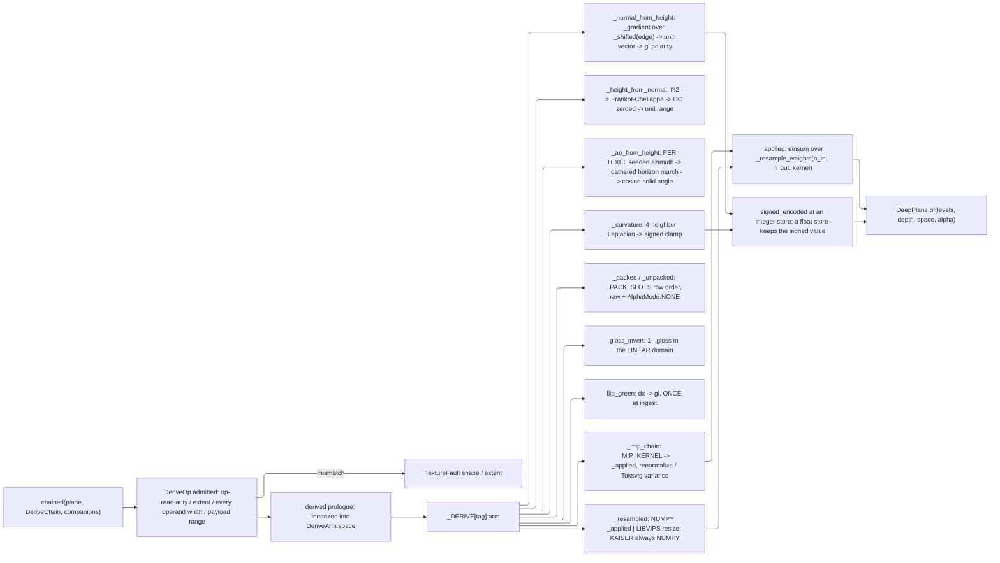

# [PY_ARTIFACTS_GRAPHIC_TEXTURE_DERIVE]

`derive` owns every numeric transform between texture channels: the gradient and integration pair that moves a field between height and normal, the horizon fold that reads occlusion off a height field, the curvature operator, the packing algebra, the gloss inversion, the green-polarity flip, the mip pyramid under its per-channel policy, and the resampler both of those stand on. Every kernel takes and returns the `graphic/texture/plane#PLANE` `Plane` — `float32`, `(H, W, C)`, scene-linear — so no arm quantizes an intermediate and a chain of six operations loses nothing an eight-bit funnel takes on the first step.

These are deliberately NOT `graphic/raster/process#PROCESS` `Transform` rows. That page's acceptor rail terminates in `img_as_ubyte`, which is exactly right for a perceptual score or a display preview and exactly wrong for a normal vector, a millimetre height span, or a solver product — a `TRANSFORMS` row for `normal_from_height` quantizes the field it computes. Both pages therefore split on PRODUCT, not on engine: measured scores and produced previews stay there, deep-pixel channel derivation lives here, and neither page carries the other's rail. `plane#PLANE` supplies the carrier, the transfer law, and the vocabularies; `ingest#INGEST` supplies the role roster whose `mip` and `signed` columns select the policies these arms execute; `set#TEXTURE_SET` composes a `DeriveChain` per map inside its own worker crossing and owns the lane, the receipt, and the egress. This page mints none of those.

## [01]-[INDEX]

- [02]-[DERIVE]: `DeriveOp` closes the derivation family, declares per-row arity and transfer, dispatches through `derived`, folds a `DeriveChain`, and remaps signed channels for the integer depths.
- [03]-[KERNEL]: numeric bodies — separable filter-weight construction, the Frankot-Chellappa spectral integration, the horizon occlusion fold, the curvature operator, the packing algebra, and the two resample engines.

## [02]-[DERIVE]

- Owner: `DeriveOp` is the closed payload-carrying family and `_DERIVE` its one `frozendict[DeriveOpTag, DeriveArm]` row table. Each row — never the arm body and never the caller — declares the op-read operand arity, the transfer domain the kernel runs in, the produced component count and association, whether the arm folds a whole pyramid, and whether its product is signed. `derived` reads the row once, admits against it, converts the operands into the declared domain, and dispatches; no kernel re-derives a fact the row already carries.
- Cases: `normal_from_height` and `height_from_normal` are the inverse pair, `ao_from_height` and `curvature` the two remaining height readers, `pack` and `unpack` the `ChannelPack` algebra, `gloss_invert` the roughness ingest transfer, `flip_green` the convention conversion, `mip_chain` the pyramid fold, `resample` the arbitrary-extent move, and `neutral_fill` the constant writer a mip gutter, a UDIM hole, and an absent pack slot all take. Every inverse is one more case on the SAME family under the same total `match`, never a sibling entrypoint pair.
- Law: `height` is normalized `[0, 1]` on the plane and the millimetre span rides the manifest, never the pixels. `height_from_normal` therefore produces a UNIT field and the physical scale is a set-level fact — a solver that bakes millimetres into the plane forks the value from every consumer that reads the span off the wire.
- Law: `curvature` and `geometry_normal` are SIGNED `[-1, 1]` on the plane. `plane#PLANE` `quantized` clips to `[0, 1]`, so an integer-depth store runs `signed_encoded` (`(v + 1) / 2`) and a read runs `signed_decoded` (`2v - 1`); a float depth stores the signed value directly. That remap declares once, keyed on the role's `signed` column, and no page re-spells it.
- Law: EDGE HANDLING is a payload, never a default. `Edge.WRAP` differentiates and filters through `np.roll`, so a tiled plane's derived normal, occlusion, and curvature agree across the seam; `Edge.CLAMP` replicates the border. Tiled sources folded under `CLAMP` produce a normal discontinuity exactly one texel wide at the wrap — invisible in a thumbnail and a hard lighting seam on a repeated surface.
- Law: TWO neighborhood accessors, one edge vocabulary. `_shifted` moves the whole plane by one constant offset and serves every stencil; `_gathered` reads a PER-TEXEL float coordinate bilinearly and serves every jittered or warped march. Collapsing a per-texel offset to its mean before a roll rotates every ray at once as a global rotation of every ray at once — it reproduces the banding the jitter buys off while still paying for the draw, and no receipt distinguishes the two.
- Law: `gloss_invert` evaluates `roughness = 1 - gloss` in the LINEAR domain. Gloss planes authored `srgb` decode to linear BEFORE the inversion; inverting the encoded value is the silent-roughness-fork defect, and the row's `space` column is what forces the decode.
- Law: `flip_green` converts a `dx` plane to the canonical `gl` ONCE, at ingest, before the plane is keyed. Both normal channels of a set share one convention, and the wire always carries `gl` — the `normal_convention` field records the INGEST source alone.
- Law: a fold runs in the LINEAR domain always. `mip_chain` decodes, folds, and re-encodes per level, because averaging `srgb`-encoded texels darkens the pyramid. `MipPolicy.NORMAL_RENORMALIZE` box-folds then unit-normalizes each texel vector, and `MipPolicy.ROUGHNESS_VARIANCE` takes the paired normal channel as its second operand and adds the variance that channel lost at the same level — a roughness channel mipped under `BOX` alone is a declared quality floor, not the default, and specular aliasing reappearing at distance is what the policy buys off.
- Law: a packed plane mips PER COMPONENT under each slot's own policy. One policy across a pack is the defect: occlusion wants `box`, roughness wants `roughnessVariance`, metalness wants `box`, and folding all three under one kernel smears the roughness the pack exists to carry.
- Entry: `derived(operands, op)` is total over the family and `chained(plane, chain, companions)` folds a `DeriveChain` left-to-right on the `Result` rail, so the first fault short-circuits with its own cause intact. Arity, transfer domain, and extent agreement are proven in `admitted` before any kernel sees an array.
- Law: ARITY IS READ FROM THE OP, never fixed on the row. `mip_chain` takes one operand at every policy and TWO under `ROUGHNESS_VARIANCE`, whose Toksvig term needs the paired normal channel at each level — and `ROUGHNESS_VARIANCE` is the roster's own mip law for five roughness roles, so a static column makes the DEFAULT path index past the end of its operand tuple. `DeriveArm.arity` is therefore `Callable[[DeriveOp], int]`, `admitted` reads it, and `chained` stages the companion the same table declares.
- Auto: `DeriveOp.admitted` checks the op-read operand count, extent equality across operands, EVERY operand's component count against the arm's declared input shape, and payload ranges (positive radius, positive level count, sample count above zero, an in-band unpack slot); `_produced` then proves the arm's own output width against the row's `channels` column, so a kernel that drifts from the law its consumers read off that row breaks at the fold rather than at a wire field two pages away.
- Packages: `numpy` (`libs/python/.api/numpy.md`) owns every kernel — `fft.fft2`/`ifft2`/`fftfreq` the spectral integration, `einsum` the separable resample, `roll` the wrap edge, `kaiser`/`sinc` the window, `linalg` nothing at all since the Poisson solve is spectral; `pyvips` (`.api/pyvips.md`) the streaming float resample engine over `new_from_array`/`resize`/`shrink`/`numpy` at `BandFormat.FLOAT`; `expression` the `Result` rail and the tagged families; the builtin `frozendict` the row tables.
- Growth: a new derivation is one `DeriveOp` case, one `_DERIVE` row, one `derived` arm, and one kernel; a new resample filter is one `ResampleKernel` row with one `_FILTER` entry carrying its radius and tap function — the weight builder is parameterized over both and gains nothing; a new mip fold is one `plane#PLANE` `MipPolicy` row with one `_MIP` entry.
- Boundary: no codec, no file, no lane, no receipt, and no role vocabulary lives here — `plane#PLANE` owns the containers, `ingest#INGEST` the roles and their per-role policy columns, `set#TEXTURE_SET` the crossing and the evidence. Perceptual scores, denoising, segmentation, registration, and every eight-bit produced raster stay `graphic/raster/process#PROCESS` and `graphic/raster/measure#MEASURE`. Environment-map projection, spherical-harmonic irradiance, and GGX prefiltering stay `ibl#IBL`, which reads a directional parameterization no planar kernel here carries.

```python signature
# --- [RUNTIME_PRELUDE] ------------------------------------------------------------------
from collections.abc import Callable
from dataclasses import dataclass
from enum import StrEnum
from typing import Final, Literal, assert_never

import numpy as np
from builtins import frozendict
from expression import Error, Ok, Result, case, tag, tagged_union
from expression.collections import Block

from rasm.artifacts.graphic.texture.plane import AlphaMode, DeepPlane, Extent, MipPolicy, Plane, PlaneSpace, TextureFault, linearized

lazy import pyvips

# --- [TYPES] ----------------------------------------------------------------------------

type DeriveOpTag = Literal[
    "normal_from_height",
    "height_from_normal",
    "ao_from_height",
    "curvature",
    "pack",
    "unpack",
    "gloss_invert",
    "flip_green",
    "mip_chain",
    "resample",
    "neutral_fill",
]
type DeriveChain = tuple["DeriveOp", ...]


class Edge(StrEnum):  # a payload on every neighborhood op, never a default — a tiled plane folded CLAMP seams at the wrap
    CLAMP = "clamp"
    WRAP = "wrap"


class NormalConvention(StrEnum):  # transcribed from the frozen fragment; `ingest#INGEST` resolves it from the filename stem
    GL = "gl"  # green is +Y; the OpenGL/glTF/USD/MaterialX convention and the CANONICAL wire form
    DX = "dx"  # green is -Y; admitted at ingest, converted to `gl` BEFORE the plane is keyed


class ChannelPack(StrEnum):  # the only two packing orders; a third is a new row, never a caller-ordered tuple
    ORM = "orm"  # R occlusion, G specular_roughness, B base_metalness — the glTF KHR read order and the ONLY glTF-crossing pack
    MRA = "mra"  # R base_metalness, G specular_roughness, B occlusion


class ResampleKernel(StrEnum):
    BOX = "box"  # area average; exact for an integer shrink
    TRIANGLE = "triangle"  # linear tent
    KAISER = "kaiser"  # windowed sinc; the color-channel mip default and the one kernel libvips does not carry
    LANCZOS3 = "lanczos3"  # three-lobe windowed sinc


class ResampleEngine(StrEnum):
    NUMPY = "numpy"  # the separable weight-matrix owner; exact, deterministic, every kernel row
    LIBVIPS = "libvips"  # the streaming float lane for a plane too large to hold two copies; KAISER routes NUMPY regardless


# --- [MODELS] ---------------------------------------------------------------------------


@tagged_union(frozen=True)
class DeriveOp:
    tag: DeriveOpTag = tag()
    normal_from_height: tuple[float, NormalConvention, Edge] = case()  # strength, target convention, edge handling
    height_from_normal: tuple[Edge, float] = case()  # edge handling, the post-integration unit-range gain
    ao_from_height: tuple[int, int, float, Edge, int] = case()  # directions, steps, radius in texels, edge, jitter seed
    curvature: tuple[float, Edge] = case()  # scale applied before the signed clamp, edge handling
    pack: ChannelPack = case()
    unpack: tuple[ChannelPack, int] = case()  # the pack row and the SLOT index in it; one call yields one channel
    gloss_invert: None = case()
    flip_green: None = case()
    mip_chain: tuple[MipPolicy, int] = case()  # policy and the level ceiling; 0 means "to 1x1"
    resample: tuple[Extent, ResampleKernel, ResampleEngine] = case()
    neutral_fill: tuple[tuple[float, ...], float] = case()  # per-component neutral and the coverage threshold below which it writes

    @staticmethod
    def NormalFromHeight(strength: float = 1.0, convention: NormalConvention = NormalConvention.GL, edge: Edge = Edge.WRAP) -> "DeriveOp":
        return DeriveOp(normal_from_height=(strength, convention, edge))

    @staticmethod
    def HeightFromNormal(edge: Edge = Edge.WRAP, gain: float = 1.0) -> "DeriveOp":
        return DeriveOp(height_from_normal=(edge, gain))

    @staticmethod
    def AoFromHeight(directions: int = 16, steps: int = 12, radius: float = 16.0, edge: Edge = Edge.WRAP, seed: int = 0) -> "DeriveOp":
        return DeriveOp(ao_from_height=(directions, steps, radius, edge, seed))

    @staticmethod
    def Curvature(scale: float = 1.0, edge: Edge = Edge.WRAP) -> "DeriveOp":
        return DeriveOp(curvature=(scale, edge))

    @staticmethod
    def MipChain(policy: MipPolicy = MipPolicy.KAISER, levels: int = 0) -> "DeriveOp":
        return DeriveOp(mip_chain=(policy, levels))

    @staticmethod
    def Resample(extent: Extent, kernel: ResampleKernel = ResampleKernel.KAISER, engine: ResampleEngine = ResampleEngine.NUMPY) -> "DeriveOp":
        return DeriveOp(resample=(extent, kernel, engine))

    @staticmethod
    def NeutralFill(neutral: tuple[float, ...], coverage: float = 0.0) -> "DeriveOp":
        return DeriveOp(neutral_fill=(neutral, coverage))

    def admitted(self, operands: tuple[DeepPlane, ...], /) -> Result["DeriveOp", TextureFault]:
        row = _DERIVE[self.tag]
        arity = row.arity(self)
        match (len(operands), operands):
            case (count, _) if count != arity:
                return Error(TextureFault(shape=(arity, count)))
            case (_, (first, *rest)) if any(other.extent != first.extent for other in rest):
                return Error(TextureFault(extent=first.extent))
            case (_, planes) if row.accepts is not None and any(plane.channels not in row.accepts for plane in planes):
                # EVERY operand is gated, not the first: `pack` takes three single-component planes and a
                # three-component operand in slot two writes a silently wrong pack the receipt cannot distinguish
                return Error(TextureFault(shape=tuple(plane.channels for plane in planes)))
        match self:
            case DeriveOp(tag="ao_from_height", ao_from_height=(directions, steps, radius, _, _)) if min(directions, steps) < 1 or radius <= 0.0:
                return Error(TextureFault(shape=(directions, steps)))
            case DeriveOp(tag="mip_chain", mip_chain=(_, levels)) if levels < 0:
                return Error(TextureFault(shape=(levels,)))
            case DeriveOp(tag="resample", resample=((width, height), _, _)) if min(width, height) < 1:
                return Error(TextureFault(extent=(width, height)))
            case DeriveOp(tag="neutral_fill", neutral_fill=(neutral, _)) if len(neutral) != operands[0].channels:
                return Error(TextureFault(shape=(operands[0].channels, len(neutral))))
            case DeriveOp(tag="unpack", unpack=(_pack, slot)) if not 0 <= slot <= 2:
                # a pack occupies three RGB slots and its alpha carries nothing; slot 3 names the component the
                # `[03.5]` row declares unused, so it is out of band rather than a fourth channel to read
                return Error(TextureFault(shape=(slot,)))
            case DeriveOp():
                return Ok(self)
            case _ as unreachable:
                assert_never(unreachable)


@dataclass(frozen=True, slots=True, kw_only=True)
class DeriveArm:
    # ONE row per derivation: everything `derived` needs BEFORE it reaches a kernel, so no body re-derives a fact
    # its row states, and no caller passes a domain, a component count, or a signedness the operation already fixes.
    arity: Callable[["DeriveOp"], int]  # admitted operand count READ FROM THE OP — `mip_chain` takes one operand at
    # every policy and TWO under ROUGHNESS_VARIANCE, whose Toksvig term needs the paired normal channel at each
    # level; a static column reads the common case as the whole truth and the companion arm indexes past the end.
    accepts: frozenset[int] | None  # admitted input component counts; None admits any
    channels: int  # produced SEMANTIC component count; 0 means "whatever the operand carried"
    space: PlaneSpace  # the domain the kernel runs in; `derived` linearizes into it once and re-encodes after
    alpha: AlphaMode | None  # the produced association; None inherits the operand's, and `pack` declares NONE
    signed: bool  # the product occupies [-1, 1] and takes the `signed_encoded` remap at an integer store
    levels: bool  # the arm produces or consumes a WHOLE pyramid; every other arm runs level 0 and returns one level
    arm: Callable[[tuple[DeepPlane, ...], "DeriveOp"], tuple[Plane, ...]]
```

```python signature
# --- [OPERATIONS] -----------------------------------------------------------------------


def signed_encoded(plane: Plane, /) -> Plane:
    # Owns the ONE signed-to-unit remap an integer store needs: `plane#PLANE` `quantized` clips to [0, 1], so a normal
    # or curvature plane stored at u8/u16 lands here first and a float store never runs it.
    return ((plane + 1.0) * 0.5).astype(np.float32)


def signed_decoded(plane: Plane, /) -> Plane:
    return (plane * 2.0 - 1.0).astype(np.float32)


def _produced(row: DeriveArm, planes: tuple[Plane, ...], operand: DeepPlane, /) -> Result[tuple[Plane, ...], TextureFault]:
    # Proves the row's `channels` column here rather than decorating it: an arm returning a width its own row denies is a
    # kernel that drifted from the law every consumer reads off that row, and the drift is invisible until a pack
    # slot or a wire `channels` field disagrees with the bytes beside it. A `0` column inherits the operand.
    expected = row.channels or operand.channels
    return Ok(planes) if all(int(level.shape[2]) == expected for level in planes) else Error(TextureFault(shape=(expected, int(planes[0].shape[2]))))


def derived(operands: tuple[DeepPlane, ...], op: DeriveOp, /) -> Result[DeepPlane, TextureFault]:
    # one prologue for every case: admit against the row, linearize each operand into the row's declared domain,
    # dispatch, prove the produced width, then rebuild the carrier. The kernels see linear float arrays and nothing
    # else, and the association comes off the ROW — a packed plane carries none whatever its operand declared.
    def _run(valid: DeriveOp, /) -> Result[DeepPlane, TextureFault]:
        row = _DERIVE[valid.tag]
        lowered = tuple(
            DeepPlane(
                levels=tuple(linearized(level, source.space) for level in source.levels),
                depth=source.depth,
                space=row.space,
                alpha=source.alpha,
            )
            for source in operands
        )
        return _produced(row, row.arm(lowered, valid), operands[0]).bind(
            lambda planes: DeepPlane.of(planes, operands[0].depth, row.space, row.alpha if row.alpha is not None else operands[0].alpha)
        )

    return op.admitted(operands).bind(_run)


def chained(plane: DeepPlane, chain: DeriveChain, companions: frozendict[DeriveOpTag, DeepPlane] = frozendict(), /) -> Result[DeepPlane, TextureFault]:
    # left-to-right fold on the rail: the first fault short-circuits carrying its own cause, and a multi-operand
    # row draws its companion from the keyed table rather than a positional tail the caller has to order. A row
    # whose op-read arity exceeds one with no companion staged rails on the arity gate rather than raising a
    # `KeyError` inside the fold, so a missing paired normal names itself as a shape fault the caller can route.
    return Block.of_seq(chain).fold(
        lambda railed, op: railed.bind(
            lambda current: derived((current, *(companion for companion in (companions.get(op.tag),) if companion is not None)), op)
        ),
        Ok(plane),
    )
```

## [03]-[KERNEL]

- Owner: one separable weight builder serves BOTH the mip fold and the arbitrary-extent resample. `_resample_weights(n_in, n_out, kernel)` returns an `(n_out, n_in)` `float32` matrix from one windowed-filter algorithm parameterized by the `_FILTER` row's radius and tap function, and `_applied` contracts it on each axis through `np.einsum`. Per-kernel resampler families, per-scale special cases, and a separate mip downsampler are the enumerated forms this refuses — a new filter is a row, not a function.
- Law: the filter is evaluated in DESTINATION space with the support scaled by the shrink ratio, so a 2x downsample integrates over two source texels and an upsample interpolates over the kernel's own radius; the row weights normalize to sum one, which is what keeps a fold energy-preserving and a `neutral` constant surviving a pyramid unchanged.
- Law: `MipPolicy.KAISER` is the color default and libvips carries NO kaiser kernel — `ResampleEngine.LIBVIPS` maps `BOX` to `shrink`, `TRIANGLE` to `Kernel.LINEAR`, and `LANCZOS3` to `Kernel.LANCZOS3`, and a `KAISER` request routes `NUMPY` whatever the engine column says. Engines carry a throughput policy over one filter vocabulary, never a second filter vocabulary.
- Law: `height_from_normal` is Frankot-Chellappa spectral integration, not an iterative Poisson relaxation. Its gradient pair `(p, q) = (-n_x / n_z, -n_y / n_z)` transforms once, the least-squares integrable surface is `Z = (-i w_x P - i w_y Q) / (w_x^2 + w_y^2)`, and the DC bin is zeroed because an integrated height field is defined up to a constant. One forward and one inverse FFT is the whole solve; a relaxation loop over the same functional is orders slower and converges to the same answer.
- Law: `height_from_normal` normalizes the reconstructed field to `[0, 1]` by its own extrema, so the millimetre span is a set-level fact and never a plane value. Flat normal planes integrate to a constant field whose extrema coincide; the normalization guards that division and yields the `0.5` neutral rather than a NaN sheet.
- Law: `ao_from_height` is a HORIZON fold, not a ray cast: for each of `directions` azimuths it marches `steps` samples out to `radius`, tracks the maximum elevation angle the height field subtends, and integrates the unoccluded cosine-weighted solid angle. Azimuth offsets carry a per-texel jitter drawn from a SEEDED generator so the seed replays the plane byte-for-byte — an unseeded jitter forks the content key on every run.
- Law: `curvature` is the discrete mean curvature of the height field — the Laplacian under the op's edge mode, scaled and clamped into `[-1, 1]`. Convexity read off the normal divergence agrees to first order and costs a second field; the height Laplacian is the one operator.
- Law: an absent pack slot fills with its channel's NEUTRAL, never zero. Zero is `base_metalness`'s neutral and `occlusion`'s fully-occluded value at once, so a zero fill darkens every unpacked occlusion read; `neutral_fill` takes the constant from the role roster and writes it under the coverage threshold.
- Auto: `pack` composes three single-component operands into the slot order the `ChannelPack` row fixes, and its `_DERIVE` row declares `PlaneSpace.RAW` with `AlphaMode.NONE` so the four-component product never inherits an operand's association — the alpha component of a packed plane carries nothing and is never repurposed. `unpack` is the same row read backward under a SLOT index on the op, returning the one named component; a call yielding all three hands the level-tuple carrier three same-extent planes, where the halving chain refuses at the first successor.
- Boundary: no arm here reads or writes a file, spawns a tool, or crosses a lane. `pyvips` arms hold one image the whole pass and hands back a `numpy` view; libvips's own cache and loader controls are the worker owner's boundary-init concern on `graphic/raster/io#IO`, not a per-call knob here.

```python signature
# --- [CONSTANTS] ------------------------------------------------------------------------


@dataclass(frozen=True, slots=True, kw_only=True)
class FilterRow:
    radius: float  # support in DESTINATION texels before the shrink scaling
    tap: Callable[[np.ndarray], np.ndarray]  # the normalized tap function over |x| in [0, radius]


_KAISER_BETA: Final[float] = 6.0  # sidelobe attenuation of the mip window; higher trades ringing for softness
_FILTER: Final[frozendict[ResampleKernel, FilterRow]] = frozendict({
    ResampleKernel.BOX: FilterRow(radius=0.5, tap=lambda x: (np.abs(x) <= 0.5).astype(np.float32)),
    ResampleKernel.TRIANGLE: FilterRow(radius=1.0, tap=lambda x: np.maximum(0.0, 1.0 - np.abs(x)).astype(np.float32)),
    ResampleKernel.KAISER: FilterRow(
        radius=3.0,
        tap=lambda x: (
            np.sinc(x) * np.i0(_KAISER_BETA * np.sqrt(np.maximum(0.0, 1.0 - (x / 3.0) ** 2))) / np.i0(_KAISER_BETA)
        ).astype(np.float32),
    ),
    ResampleKernel.LANCZOS3: FilterRow(radius=3.0, tap=lambda x: (np.sinc(x) * np.sinc(x / 3.0)).astype(np.float32)),
})
_VIPS_KERNEL: Final[frozendict[ResampleKernel, str]] = frozendict({
    # libvips carries no kaiser row, so KAISER is absent here and `_resampled` routes it NUMPY whatever the engine column says
    ResampleKernel.TRIANGLE: "linear",
    ResampleKernel.LANCZOS3: "lanczos3",
})
_PACK_SLOTS: Final[frozendict[ChannelPack, tuple[int, int, int]]] = frozendict({
    # Fixes the operand index each RGB slot draws from; the row IS the order and no caller passes a tuple
    ChannelPack.ORM: (0, 1, 2),
    ChannelPack.MRA: (2, 1, 0),
})
```

```python signature
# --- [OPERATIONS] -----------------------------------------------------------------------


def _resample_weights(n_in: int, n_out: int, kernel: ResampleKernel, /) -> np.ndarray:
    # ONE weight builder for every kernel, every scale, and both directions: the support scales by the shrink ratio
    # so a downsample INTEGRATES and an upsample interpolates, and each row normalizes to sum one, which is what
    # keeps a fold energy-preserving and a neutral constant unchanged through a whole pyramid.
    row = _FILTER[kernel]
    scale = min(1.0, n_out / n_in)
    support = row.radius / scale
    centers = (np.arange(n_out, dtype=np.float32) + 0.5) * (n_in / n_out) - 0.5
    offsets = np.arange(n_in, dtype=np.float32)[None, :] - centers[:, None]
    weights = row.tap(offsets * scale) * (np.abs(offsets) <= support).astype(np.float32)
    return (weights / np.maximum(weights.sum(axis=1, keepdims=True), 1e-12)).astype(np.float32)


def _applied(plane: Plane, extent: Extent, kernel: ResampleKernel, /) -> Plane:
    width, height = extent
    rows = _resample_weights(int(plane.shape[0]), height, kernel)
    cols = _resample_weights(int(plane.shape[1]), width, kernel)
    return np.einsum("yh,xw,hwc->yxc", rows, cols, plane, optimize=True).astype(np.float32)


def _vips_resampled(plane: Plane, extent: Extent, kernel: ResampleKernel, /) -> Plane:
    # Streaming float lane: libvips processes float natively at BandFormat.FLOAT, so the eight-bit funnel the
    # `graphic/raster/io#IO` arms carry is that page's policy and never a libvips limit. The `reshape` tail is
    # LOAD-BEARING: a one-band libvips image returns `(H, W)` from `numpy()` with the component axis dropped,
    # while every two-, three-, and four-band image keeps it — so the reshape restores the estate's `(H, W, C)`
    # invariant on the single-component planes every scalar channel is.
    width, height = extent
    image = pyvips.Image.new_from_array(plane)
    return image.resize(width / image.width, vscale=height / image.height, kernel=_VIPS_KERNEL[kernel]).numpy().astype(np.float32).reshape(height, width, -1)


def _resampled(operands: tuple[DeepPlane, ...], op: DeriveOp, /) -> tuple[Plane, ...]:
    extent, kernel, engine = op.resample
    match engine:
        case ResampleEngine.LIBVIPS if kernel in _VIPS_KERNEL:
            return (_vips_resampled(operands[0].base, extent, kernel),)
        case ResampleEngine.LIBVIPS | ResampleEngine.NUMPY:
            return (_applied(operands[0].base, extent, kernel),)
        case _ as unreachable:
            assert_never(unreachable)


def _shifted(plane: Plane, dx: int, dy: int, edge: Edge, /) -> Plane:
    # Serves as the ONE neighborhood accessor both the gradient and the horizon march read through, so the edge mode is
    # honored identically by every kernel and no arm hand-rolls a border case.
    match edge:
        case Edge.WRAP:
            return np.roll(plane, shift=(-dy, -dx), axis=(0, 1))
        case Edge.CLAMP:
            return np.take(np.take(plane, np.clip(np.arange(plane.shape[0]) + dy, 0, plane.shape[0] - 1), axis=0),
                           np.clip(np.arange(plane.shape[1]) + dx, 0, plane.shape[1] - 1), axis=1)
        case _ as unreachable:
            assert_never(unreachable)


def _gathered(plane: Plane, dx: np.ndarray, dy: np.ndarray, edge: Edge, /) -> Plane:
    # PER-TEXEL neighborhood accessor beside the uniform one: `_shifted` moves the whole plane by one constant
    # offset, which is every gradient stencil and no jittered march. A horizon fold whose azimuth is per-texel
    # cannot be a roll — collapsing that jitter to its mean before the shift is a global rotation of every ray at
    # once, which reproduces the banding the jitter exists to break while still paying for the random draw.
    # Bilinear over WRAPPED or CLAMPED float coordinates is the one gather both this and any warp read through.
    rows, cols = int(plane.shape[0]), int(plane.shape[1])
    y = (np.arange(rows, dtype=np.float32)[:, None] + dy)
    x = (np.arange(cols, dtype=np.float32)[None, :] + dx)
    x0, y0 = np.floor(x), np.floor(y)
    fx, fy = (x - x0)[..., None], (y - y0)[..., None]
    match edge:
        case Edge.WRAP:
            xi = ((x0.astype(np.int64)) % cols, (x0.astype(np.int64) + 1) % cols)
            yi = ((y0.astype(np.int64)) % rows, (y0.astype(np.int64) + 1) % rows)
        case Edge.CLAMP:
            xi = (np.clip(x0.astype(np.int64), 0, cols - 1), np.clip(x0.astype(np.int64) + 1, 0, cols - 1))
            yi = (np.clip(y0.astype(np.int64), 0, rows - 1), np.clip(y0.astype(np.int64) + 1, 0, rows - 1))
        case _ as unreachable:
            assert_never(unreachable)
    return (
        plane[yi[0], xi[0], :] * (1.0 - fx) * (1.0 - fy)
        + plane[yi[0], xi[1], :] * fx * (1.0 - fy)
        + plane[yi[1], xi[0], :] * (1.0 - fx) * fy
        + plane[yi[1], xi[1], :] * fx * fy
    ).astype(np.float32)


def _gradient(height: Plane, edge: Edge, /) -> tuple[Plane, Plane]:
    # central differences through the one shift accessor; `np.gradient` carries no wrap mode, so a tiled plane
    # differentiated with it seams exactly one texel wide at the repeat.
    return (
        ((_shifted(height, 1, 0, edge) - _shifted(height, -1, 0, edge)) * 0.5).astype(np.float32),
        ((_shifted(height, 0, 1, edge) - _shifted(height, 0, -1, edge)) * 0.5).astype(np.float32),
    )


def _normal_from_height(operands: tuple[DeepPlane, ...], op: DeriveOp, /) -> tuple[Plane, ...]:
    strength, convention, edge = op.normal_from_height
    dx, dy = _gradient(operands[0].base[..., 0:1], edge)
    vector = np.concatenate([-dx * strength, -dy * strength, np.ones_like(dx)], axis=2)
    unit = (vector / np.maximum(np.linalg.norm(vector, axis=2, keepdims=True), 1e-12)).astype(np.float32)
    # Convention rides the GREEN polarity alone; the plane leaves as `gl` and the source convention rides the manifest
    return (unit if convention is NormalConvention.GL else np.concatenate([unit[..., 0:1], -unit[..., 1:2], unit[..., 2:3]], axis=2),)


def _height_from_normal(operands: tuple[DeepPlane, ...], op: DeriveOp, /) -> tuple[Plane, ...]:
    # Frankot-Chellappa: ONE forward and ONE inverse transform recover the least-squares integrable surface from
    # Transforms the gradient pair; the DC bin zeroes because an integrated height field is defined up to a constant.
    _edge, gain = op.height_from_normal
    normal = operands[0].base
    slope_x = -normal[..., 0] / np.where(np.abs(normal[..., 2]) < 1e-6, 1e-6, normal[..., 2])
    slope_y = -normal[..., 1] / np.where(np.abs(normal[..., 2]) < 1e-6, 1e-6, normal[..., 2])
    rows, cols = slope_x.shape
    wy = (2.0 * np.pi * np.fft.fftfreq(rows))[:, None]
    wx = (2.0 * np.pi * np.fft.fftfreq(cols))[None, :]
    denominator = wx * wx + wy * wy
    denominator[0, 0] = 1.0
    spectrum = (-1j * wx * np.fft.fft2(slope_x) - 1j * wy * np.fft.fft2(slope_y)) / denominator
    spectrum[0, 0] = 0.0
    field = np.real(np.fft.ifft2(spectrum)).astype(np.float32)
    span = float(field.max() - field.min())
    # a flat normal plane integrates to a constant field whose extrema coincide; the guard yields the 0.5 neutral
    normalized = np.full_like(field, 0.5) if span < 1e-9 else ((field - field.min()) / span * gain)
    return (np.clip(normalized, 0.0, 1.0)[..., None].astype(np.float32),)


def _ao_from_height(operands: tuple[DeepPlane, ...], op: DeriveOp, /) -> tuple[Plane, ...]:
    # horizon fold: per azimuth, march out to `radius` tracking the maximum subtended elevation, then integrate the
    # unoccluded cosine-weighted solid angle. The azimuth jitter is PER-TEXEL and rides `_gathered`, so neighbouring
    # texels sample different rays and the banding a shared azimuth set produces never forms; the draw is SEEDED,
    # so one seed replays the plane byte-for-byte and the content key over its encoded bytes means something.
    # `1 - sin(atan(h))` is the unoccluded fraction for one direction, and `horizon` starts at zero so a descending
    # neighbourhood contributes no occlusion rather than a negative one.
    directions, steps, radius, edge, seed = op.ao_from_height
    height = operands[0].base[..., 0:1]
    jitter = np.random.default_rng(seed).random(height.shape[:2], dtype=np.float32)
    occlusion = np.zeros_like(height)
    for index in range(directions):
        angle = (index + jitter) * (2.0 * np.pi / directions)
        cos_a, sin_a = np.cos(angle).astype(np.float32), np.sin(angle).astype(np.float32)
        horizon = np.zeros_like(height)
        for step in range(1, steps + 1):
            distance = radius * step / steps
            sampled = _gathered(height, cos_a * distance, sin_a * distance, edge)
            horizon = np.maximum(horizon, (sampled - height) / distance)
        occlusion += 1.0 - horizon / np.sqrt(horizon * horizon + 1.0)
    return ((occlusion / directions).clip(0.0, 1.0).astype(np.float32),)


def _curvature(operands: tuple[DeepPlane, ...], op: DeriveOp, /) -> tuple[Plane, ...]:
    scale, edge = op.curvature
    height = operands[0].base[..., 0:1]
    laplacian = (
        _shifted(height, 1, 0, edge) + _shifted(height, -1, 0, edge) + _shifted(height, 0, 1, edge) + _shifted(height, 0, -1, edge) - 4.0 * height
    )
    return (np.clip(laplacian * scale, -1.0, 1.0).astype(np.float32),)


def _packed(operands: tuple[DeepPlane, ...], op: DeriveOp, /) -> tuple[Plane, ...]:
    # a packed plane is ALWAYS raw transfer and AlphaMode.NONE; the fourth component carries nothing and the row
    # declares the slot order, so no caller passes a tuple and no arm re-spells the glTF read sequence.
    slots = _PACK_SLOTS[op.pack]
    return (np.concatenate([operands[slot].base[..., 0:1] for slot in slots] + [np.ones_like(operands[0].base[..., 0:1])], axis=2).astype(np.float32),)


def _unpacked(operands: tuple[DeepPlane, ...], op: DeriveOp, /) -> tuple[Plane, ...]:
    # Each op NAMES the slot it reads, so this returns ONE plane. Returning all three hands `DeepPlane.of` a
    # tuple of same-extent planes as a pyramid, where the halving chain refuses at the first successor — three
    # products from a level-tuple carrier is a shape the arm signature cannot express and never could.
    pack, slot = op.unpack
    return (operands[0].base[..., _PACK_SLOTS[pack][slot] : _PACK_SLOTS[pack][slot] + 1].astype(np.float32),)


def _mip_chain(operands: tuple[DeepPlane, ...], op: DeriveOp, /) -> tuple[Plane, ...]:
    # every fold runs LINEAR (the prologue already linearized), halving and clamping at 1. ROUGHNESS_VARIANCE takes
    # Reads the paired normal channel as its second operand and adds back the variance that channel lost at the SAME level.
    policy, ceiling = op.mip_chain
    base = operands[0].base
    kernel = _MIP_KERNEL[policy]
    levels = [base]
    normals = [operands[1].base] if policy is MipPolicy.ROUGHNESS_VARIANCE else []
    while (policy is not MipPolicy.NONE) and (ceiling == 0 or len(levels) < ceiling) and max(levels[-1].shape[0], levels[-1].shape[1]) > 1:
        extent = (max(1, int(levels[-1].shape[1]) // 2), max(1, int(levels[-1].shape[0]) // 2))
        folded = _applied(levels[-1], extent, kernel)
        match policy:
            case MipPolicy.NORMAL_RENORMALIZE:
                folded = (folded / np.maximum(np.linalg.norm(folded, axis=2, keepdims=True), 1e-12)).astype(np.float32)
            case MipPolicy.ROUGHNESS_VARIANCE:
                normals.append(_applied(normals[-1], extent, ResampleKernel.BOX))
                lost = np.clip(1.0 - np.linalg.norm(normals[-1], axis=2, keepdims=True), 0.0, 1.0)
                # Toksvig: the shortened averaged normal IS the variance the level lost, folded into roughness so
                # specular aliasing does not reappear at distance instead of being tuned away at the shader.
                folded = np.sqrt(np.clip(folded * folded + lost * lost, 0.0, 1.0)).astype(np.float32)
            case MipPolicy.BOX | MipPolicy.KAISER | MipPolicy.NONE:
                pass
            case _ as unreachable:
                assert_never(unreachable)
        levels.append(folded)
    return tuple(levels)


def _neutral_fill(operands: tuple[DeepPlane, ...], op: DeriveOp, /) -> tuple[Plane, ...]:
    # an absent slot, a mip gutter, and a UDIM hole all take the CHANNEL's neutral, never zero — zero is
    # base_metalness's neutral and occlusion's fully-occluded value at once, so a zero fill darkens every read.
    neutral, coverage = op.neutral_fill
    plane = operands[0].base
    covered = plane[..., -1:] > coverage if plane.shape[2] == 4 else np.ones_like(plane[..., :1], dtype=bool)
    return (np.where(covered, plane, np.array(neutral, dtype=np.float32)).astype(np.float32),)


_MIP_KERNEL: Final[frozendict[MipPolicy, ResampleKernel]] = frozendict({
    MipPolicy.BOX: ResampleKernel.BOX,
    MipPolicy.KAISER: ResampleKernel.KAISER,
    MipPolicy.NORMAL_RENORMALIZE: ResampleKernel.BOX,
    MipPolicy.ROUGHNESS_VARIANCE: ResampleKernel.BOX,
    MipPolicy.NONE: ResampleKernel.BOX,
})

_ONE: Final[Callable[[DeriveOp], int]] = lambda _op: 1  # the arity every single-operand row reads; `pack` and the variance mip declare their own


def _mip_arity(op: DeriveOp, /) -> int:
    # ROUGHNESS_VARIANCE is the ONE policy whose fold reads a second plane: the Toksvig term is the length the
    # PAIRED normal channel lost at each level, so the companion is an operand of the op and not a hidden global.
    policy, _ceiling = op.mip_chain
    return 2 if policy is MipPolicy.ROUGHNESS_VARIANCE else 1


_DERIVE: Final[frozendict[DeriveOpTag, DeriveArm]] = frozendict({
    "normal_from_height": DeriveArm(
        arity=_ONE, accepts=frozenset({1}), channels=3, space=PlaneSpace.RAW, alpha=AlphaMode.NONE, signed=True, levels=False, arm=_normal_from_height
    ),
    "height_from_normal": DeriveArm(
        arity=_ONE, accepts=frozenset({3, 4}), channels=1, space=PlaneSpace.RAW, alpha=AlphaMode.NONE, signed=False, levels=False, arm=_height_from_normal
    ),
    "ao_from_height": DeriveArm(
        arity=_ONE, accepts=frozenset({1}), channels=1, space=PlaneSpace.LINEAR, alpha=AlphaMode.NONE, signed=False, levels=False, arm=_ao_from_height
    ),
    "curvature": DeriveArm(
        arity=_ONE, accepts=frozenset({1}), channels=1, space=PlaneSpace.RAW, alpha=AlphaMode.NONE, signed=True, levels=False, arm=_curvature
    ),
    "pack": DeriveArm(
        # a packed plane is ALWAYS raw with NO association — the row declares it, so a four-component product never
        # inherits an operand's `straight` and no consumer reads the unused fourth slot as coverage
        arity=lambda _op: 3, accepts=frozenset({1}), channels=4, space=PlaneSpace.RAW, alpha=AlphaMode.NONE, signed=False, levels=False, arm=_packed
    ),
    "unpack": DeriveArm(
        arity=_ONE, accepts=frozenset({4}), channels=1, space=PlaneSpace.RAW, alpha=AlphaMode.NONE, signed=False, levels=False, arm=_unpacked
    ),
    "gloss_invert": DeriveArm(
        arity=_ONE, accepts=frozenset({1}), channels=1, space=PlaneSpace.LINEAR, alpha=AlphaMode.NONE, signed=False, levels=False,
        # `roughness = 1 - gloss` evaluated LINEAR; the row's space column is what forces the srgb decode first
        arm=lambda operands, _op: ((1.0 - operands[0].base).astype(np.float32),),
    ),
    "flip_green": DeriveArm(
        arity=_ONE, accepts=frozenset({3, 4}), channels=3, space=PlaneSpace.RAW, alpha=AlphaMode.NONE, signed=True, levels=False,
        arm=lambda operands, _op: (
            np.concatenate([operands[0].base[..., 0:1], -operands[0].base[..., 1:2], operands[0].base[..., 2:3]], axis=2).astype(np.float32),
        ),
    ),
    "mip_chain": DeriveArm(arity=_mip_arity, accepts=None, channels=0, space=PlaneSpace.LINEAR, alpha=None, signed=False, levels=True, arm=_mip_chain),
    "resample": DeriveArm(arity=_ONE, accepts=None, channels=0, space=PlaneSpace.LINEAR, alpha=None, signed=False, levels=False, arm=_resampled),
    "neutral_fill": DeriveArm(arity=_ONE, accepts=None, channels=0, space=PlaneSpace.RAW, alpha=None, signed=False, levels=False, arm=_neutral_fill),
})
```



## [04]-[RESEARCH]

<!-- source-only: research row template:
[TOKEN]-[OPEN|BLOCKED]: <exact question>; <verification route>.
-->

(none)
