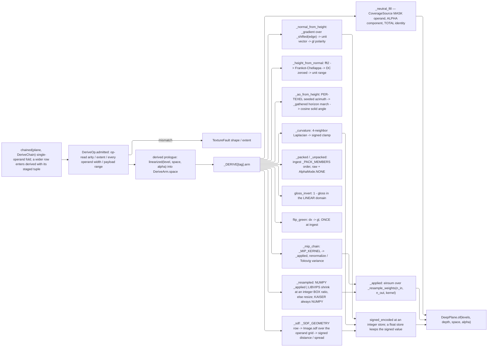

# [PY_ARTIFACTS_GRAPHIC_TEXTURE_DERIVE]

`derive` owns every numeric transform between texture channels: the gradient and integration pair that moves a field between height and normal, the horizon fold that reads occlusion off a height field, the curvature operator, the packing algebra, the gloss inversion, the green-polarity flip, the mip pyramid under its per-channel policy, and the resampler both of those stand on. Every kernel takes and returns the `graphic/texture/plane#PLANE` `Plane` — `float32`, `(H, W, C)`, scene-linear — so no arm quantizes an intermediate and a chain of six operations loses nothing an eight-bit funnel takes on the first step.

These are deliberately NOT `graphic/raster/process#PROCESS` `Transform` rows. That page's acceptor rail terminates in `img_as_ubyte`, which is exactly right for a perceptual score or a display preview and exactly wrong for a normal vector, a millimetre height span, or a solver product — a `TRANSFORMS` row for `normal_from_height` quantizes the field it computes. Both pages therefore split on PRODUCT, not on engine: measured scores and produced previews stay there, deep-pixel channel derivation lives here, and neither page carries the other's rail. `plane#PLANE` supplies the carrier, the transfer law, and the vocabularies; `ingest#INGEST` supplies the role roster whose `mip` and `signed` columns select the policies these arms execute; `set#TEXTURE_SET` composes a `DeriveChain` per map inside its own worker crossing and owns the lane, publication, and egress.

## [01]-[INDEX]

- [02]-[DERIVE]: `DeriveOp` closes the derivation family, declares per-row arity and transfer, dispatches through `derived`, folds a `DeriveChain`, and remaps signed channels for the integer depths.
- [03]-[KERNEL]: numeric bodies — separable filter-weight construction, the Frankot-Chellappa spectral integration, the horizon occlusion fold, the curvature operator, the packing algebra, the procedural distance field, and the two resample engines.

## [02]-[DERIVE]

- Owner: `DeriveOp` is the closed payload-carrying family and `_DERIVE` its one `frozendict[DeriveOpTag, DeriveArm]` row table. Each row — never the arm body and never the caller — declares the op-read operand arity, the transfer domain the kernel runs in, the produced component count and association, whether the arm folds a whole pyramid, and whether its product is signed. `derived` reads the row once, admits against it, converts the operands into the declared domain, and dispatches; no kernel re-derives a fact the row already carries.
- Cases: `normal_from_height` and `height_from_normal` are the inverse pair, `ao_from_height` and `curvature` the two remaining height readers, `pack` and `unpack` the `ChannelPack` algebra, `gloss_invert` the roughness ingest transfer, `flip_green` the convention conversion, `mip_chain` the pyramid fold, `resample` the arbitrary-extent move, `sdf` the procedural distance field a decal, edge falloff, or mask channel is authored from, and `neutral_fill` the constant writer a mip gutter, a UDIM hole, and an absent pack slot all take. Every inverse is one more case on the SAME family under the same total `match`, never a sibling entrypoint pair.
- Law: `height` is normalized `[0, 1]` on the plane and the millimetre span rides the manifest, never the pixels. `height_from_normal` therefore produces a UNIT field and the physical scale is a set-level fact — a solver that bakes millimetres into the plane forks the value from every consumer that reads the span off the wire.
- Law: `curvature` and `geometry_normal` are SIGNED `[-1, 1]` on the plane. `plane#PLANE` `quantized` clips to `[0, 1]`, so an integer-depth store runs `signed_encoded` (`(v + 1) / 2`) and a read runs `signed_decoded` (`2v - 1`); a float depth stores the signed value directly. That remap declares once, keyed on the role's `signed` column, and no page re-spells it.
- Law: EDGE HANDLING is a payload, never a default. `Edge.WRAP` differentiates and filters through `np.roll`, so a tiled plane's derived normal, occlusion, and curvature agree across the seam; `Edge.CLAMP` replicates the border. Tiled sources folded under `CLAMP` produce a normal discontinuity exactly one texel wide at the wrap — invisible in a thumbnail and a hard lighting seam on a repeated surface.
- Law: TWO neighborhood accessors, one edge vocabulary. `_shifted` moves the whole plane by one constant offset and serves every stencil; `_gathered` reads a PER-TEXEL float coordinate bilinearly and serves every jittered or warped march. Collapsing a per-texel offset to its mean before a roll is a global rotation of every ray at once and reproduces the banding the jitter buys off while still paying for the draw.
- Law: `gloss_invert` evaluates `roughness = 1 - gloss` in the LINEAR domain. Gloss planes authored `srgb` decode to linear BEFORE the inversion; inverting the encoded value is the silent-roughness-fork defect, and the row's `space` column is what forces the decode.
- Law: `flip_green` converts a `dx` plane to the canonical `gl` ONCE, at ingest, before the plane is keyed. Both normal channels of a set share one convention, and the wire always carries `gl` — the `normal_convention` field records the INGEST source alone.
- Law: a fold runs in the LINEAR domain always. `mip_chain` decodes, folds, and re-encodes per level, because averaging `srgb`-encoded texels darkens the pyramid. `MipPolicy.NORMAL_RENORMALIZE` box-folds then unit-normalizes each texel vector, and `MipPolicy.ROUGHNESS_VARIANCE` takes the paired normal channel as its second operand and adds the variance that channel lost at the same level — a roughness channel mipped under `BOX` alone is a declared quality floor, not the default, and specular aliasing reappearing at distance is what the policy buys off.
- Law: a packed plane mips PER COMPONENT under each slot's own policy. One policy across a pack is the defect: occlusion wants `box`, roughness wants `roughnessVariance`, metalness wants `box`, and folding all three under one kernel smears the roughness the pack exists to carry.
- Entry: `derived(operands, op)` is total over the family and `chained(plane, chain)` folds a `DeriveChain` left-to-right on the `Result` rail, so the first fault short-circuits with its own cause intact. A multi-operand row enters through `derived` with its whole staged tuple, which `set#TEXTURE_SET` `OperandLeg` builds at plan time — a tag-keyed companion map beside the fold was a second staging owner no caller reached, and it seated one tuple per TAG where a chain repeating a tag needs one per POSITION. Arity, transfer domain, and extent agreement are proven in `admitted` before any kernel sees an array.
- Law: ARITY IS READ FROM THE OP, never fixed on the row. `mip_chain` takes one operand at every policy and TWO under `ROUGHNESS_VARIANCE`, whose Toksvig term needs the paired normal channel at each level — and `ROUGHNESS_VARIANCE` is the roster's own mip law for five roughness roles, so a static column makes the DEFAULT path index past the end of its operand tuple. `DeriveArm.arity` is therefore `Callable[[DeriveOp], int]`, `admitted` reads it, and `chained` stages the companion the same table declares.
- Auto: `DeriveOp.admitted` checks the op-read operand count, extent equality across operands, EVERY operand's component count against the arm's declared input shape, and payload ranges (positive radius, positive level count, sample count above zero, an in-band unpack slot, a positive distance-field spread, and the geometry inputs the requested `SdfShape` row declares); `_produced` then proves the arm's own output width against the row's `channels` column, so a kernel that drifts from the law its consumers read off that row breaks at the fold rather than at a wire field two pages away.
- Packages: `numpy` (`libs/python/.api/numpy.md`) owns every kernel — `fft.fft2`/`ifft2`/`fftfreq` the spectral integration, `einsum` the separable resample, `roll` the wrap edge, `kaiser`/`sinc` the window, `linalg` nothing at all since the Poisson solve is spectral; `pyvips` (`.api/pyvips.md`) the streaming float lane over `new_from_array`/`resize`/`shrink`/`sdf`/`numpy` — a float array enters and leaves natively, no band-format knob crosses; `expression` the `Result` rail and the tagged families; the builtin `frozendict` the row tables.
- Growth: a new derivation is one `DeriveOp` case, one `_DERIVE` row, one `derived` arm, and one kernel; a new resample filter is one `ResampleKernel` row with one `_FILTER` entry carrying its radius and tap function — the weight builder is parameterized over both and gains nothing; a new mip fold is one `plane#PLANE` `MipPolicy` row with one `_MIP` entry; a new distance-field primitive is one `SdfShape` row with one `_SDF_GEOMETRY` entry naming the geometry inputs it reads.
- Boundary: no codec, file, lane, or role vocabulary lives here — `plane#PLANE` owns the containers, `ingest#INGEST` the roles and their per-role policy columns, `set#TEXTURE_SET` the crossing and evidence. Perceptual scores, denoising, segmentation, registration, and every eight-bit produced raster stay `graphic/raster/process#PROCESS` and `graphic/raster/measure#MEASURE`. Environment-map projection, spherical-harmonic irradiance, and GGX prefiltering stay `ibl#IBL`, which reads a directional parameterization no planar kernel here carries.

```python
# --- [IMPORTS] --------------------------------------------------------------------------
from collections.abc import Callable
from dataclasses import dataclass
from enum import StrEnum
from typing import Final, Literal, assert_never

import numpy as np
from builtins import frozendict
from expression import Error, Ok, Result, case, tag, tagged_union
from expression.collections import Block

from rasm.artifacts.graphic.texture.plane import AlphaMode, DeepPlane, Extent, MipPolicy, Plane, PlanePrimaries, PlaneSpace, TextureFault, linearized

lazy import pyvips

# --- [TYPES] ----------------------------------------------------------------------------

type DeriveOpTag = Literal[
    "normal_from_height",
    "height_from_normal",
    "ao_from_height",
    "curvature",
    "pack",
    "unpack",
    "gloss_invert",
    "flip_green",
    "mip_chain",
    "resample",
    "sdf",
    "neutral_fill",
]
type DeriveChain = tuple["DeriveOp", ...]


class Edge(StrEnum):
    CLAMP = "clamp"
    WRAP = "wrap"


class CoverageSource(StrEnum):
    MASK = "mask"
    ALPHA = "alpha"
    TOTAL = "total"


class SdfShape(StrEnum):
    CIRCLE = "circle"
    BOX = "box"
    ROUNDED_BOX = "rounded_box"
    LINE = "line"


class NormalConvention(StrEnum):
    GL = "gl"
    DX = "dx"


class ChannelPack(StrEnum):
    ORM = "orm"
    MRA = "mra"


class ResampleKernel(StrEnum):
    BOX = "box"
    TRIANGLE = "triangle"
    KAISER = "kaiser"
    LANCZOS3 = "lanczos3"


class ResampleEngine(StrEnum):
    NUMPY = "numpy"
    LIBVIPS = "libvips"


# --- [MODELS] ---------------------------------------------------------------------------


@tagged_union(frozen=True)
class DeriveOp:
    tag: DeriveOpTag = tag()
    normal_from_height: tuple[float, Edge] = case()
    height_from_normal: tuple[Edge, float] = case()
    ao_from_height: tuple[int, int, float, Edge, int, float] = case()
    curvature: tuple[float, Edge] = case()
    pack: ChannelPack = case()
    unpack: tuple[ChannelPack, int] = case()
    gloss_invert: None = case()
    flip_green: None = case()
    mip_chain: tuple[MipPolicy, int] = case()
    resample: tuple[Extent, ResampleKernel, ResampleEngine] = case()
    sdf: tuple[SdfShape, tuple[float, float], tuple[float, float], float, tuple[float, ...], float] = case()
    neutral_fill: tuple[tuple[float, ...], float, CoverageSource] = case()

    @staticmethod
    def NormalFromHeight(strength: float = 1.0, edge: Edge = Edge.WRAP) -> "DeriveOp":
        return DeriveOp(normal_from_height=(strength, edge))

    @staticmethod
    def HeightFromNormal(edge: Edge = Edge.WRAP, gain: float = 1.0) -> "DeriveOp":
        return DeriveOp(height_from_normal=(edge, gain))

    @staticmethod
    def AoFromHeight(
        directions: int = 16, steps: int = 12, radius: float = 16.0, edge: Edge = Edge.WRAP, seed: int = 0, relief: float = 0.0
    ) -> "DeriveOp":
        return DeriveOp(ao_from_height=(directions, steps, radius, edge, seed, relief))

    @staticmethod
    def Curvature(scale: float = 1.0, edge: Edge = Edge.WRAP) -> "DeriveOp":
        return DeriveOp(curvature=(scale, edge))

    @staticmethod
    def MipChain(policy: MipPolicy = MipPolicy.KAISER, levels: int = 0) -> "DeriveOp":
        return DeriveOp(mip_chain=(policy, levels))

    @staticmethod
    def Resample(extent: Extent, kernel: ResampleKernel = ResampleKernel.KAISER, engine: ResampleEngine = ResampleEngine.NUMPY) -> "DeriveOp":
        return DeriveOp(resample=(extent, kernel, engine))

    @staticmethod
    def Sdf(
        shape: SdfShape, *, a: tuple[float, float] = (0.0, 0.0), b: tuple[float, float] = (0.0, 0.0), radius: float = 0.0,
        corners: tuple[float, ...] = (), spread: float = 1.0
    ) -> "DeriveOp":
        return DeriveOp(sdf=(shape, a, b, radius, corners, spread))

    @staticmethod
    def NeutralFill(neutral: tuple[float, ...], coverage: float = 0.0, source: CoverageSource = CoverageSource.TOTAL) -> "DeriveOp":
        return DeriveOp(neutral_fill=(neutral, coverage, source))

    def admitted(self, operands: tuple[DeepPlane, ...], /) -> Result["DeriveOp", TextureFault]:
        row = _DERIVE[self.tag]
        arity = row.arity(self)
        match (len(operands), operands):
            case (count, _) if count != arity:
                return Error(TextureFault(shape=(arity, count)))
            case (_, (first, *rest)) if any(other.extent != first.extent for other in rest):
                return Error(TextureFault(extent=first.extent))
            case (_, planes) if row.accepts is not None and any(plane.channels not in row.accepts for plane in planes):
                return Error(TextureFault(shape=tuple(plane.channels for plane in planes)))
        match self:
            case DeriveOp(tag="ao_from_height", ao_from_height=(directions, steps, radius, _, _, relief)) if (
                min(directions, steps) < 1 or radius <= 0.0 or relief < 0.0
            ):
                return Error(TextureFault(shape=(directions, steps)))
            case DeriveOp(tag="mip_chain", mip_chain=(_, levels)) if levels < 0:
                return Error(TextureFault(shape=(levels,)))
            case DeriveOp(tag="resample", resample=((width, height), _, _)) if min(width, height) < 1:
                return Error(TextureFault(extent=(width, height)))
            case DeriveOp(tag="sdf", sdf=(shape, _a, _b, radius, corners, spread)) if (
                spread <= 0.0 or ("radius" in _SDF_GEOMETRY[shape] and radius <= 0.0) or ("corners" in _SDF_GEOMETRY[shape] and len(corners) != 4)
            ):
                return Error(TextureFault(shape=(len(_SDF_GEOMETRY[shape]), len(corners))))
            case DeriveOp(tag="neutral_fill", neutral_fill=(neutral, _, _)) if len(neutral) != operands[0].channels:
                return Error(TextureFault(shape=(operands[0].channels, len(neutral))))
            case DeriveOp(tag="neutral_fill", neutral_fill=(_, _, CoverageSource.ALPHA)) if operands[0].channels != 4:
                return Error(TextureFault(shape=(4, operands[0].channels)))
            case DeriveOp(tag="neutral_fill", neutral_fill=(_, _, CoverageSource.MASK)) if operands[1].channels != 1:
                return Error(TextureFault(shape=(1, operands[1].channels)))
            case DeriveOp(tag="unpack", unpack=(_pack, slot)) if not 0 <= slot <= 2:
                return Error(TextureFault(shape=(slot,)))
            case DeriveOp():
                return Ok(self)


@dataclass(frozen=True, slots=True, kw_only=True)
class DeriveArm:
    arity: Callable[["DeriveOp"], int]
    accepts: frozenset[int] | None
    channels: int
    space: PlaneSpace
    alpha: AlphaMode | None
    signed: bool
    levels: bool
    arm: Callable[[tuple[DeepPlane, ...], "DeriveOp"], tuple[Plane, ...]]
```

```python
# --- [OPERATIONS] -----------------------------------------------------------------------


def signed_encoded(plane: Plane, /) -> Plane:
    return ((plane + 1.0) * 0.5).astype(np.float32)


def signed_decoded(plane: Plane, /) -> Plane:
    return (plane * 2.0 - 1.0).astype(np.float32)


def _produced(row: DeriveArm, planes: tuple[Plane, ...], operand: DeepPlane, /) -> Result[tuple[Plane, ...], TextureFault]:
    expected = row.channels or operand.channels
    return Ok(planes) if all(int(level.shape[2]) == expected for level in planes) else Error(TextureFault(shape=(expected, int(planes[0].shape[2]))))


def derived(operands: tuple[DeepPlane, ...], op: DeriveOp, /) -> Result[DeepPlane, TextureFault]:
    def _run(valid: DeriveOp, /) -> Result[DeepPlane, TextureFault]:
        row = _DERIVE[valid.tag]
        lowered = tuple(
            DeepPlane(
                levels=tuple(linearized(level, source.space, source.alpha) for level in source.levels),
                depth=source.depth,
                space=row.space,
                alpha=source.alpha,
                primaries=source.primaries if row.space is not PlaneSpace.RAW else PlanePrimaries.NONE,
                faces=source.faces,
            )
            for source in operands
        )
        return _produced(row, row.arm(lowered, valid), operands[0]).bind(
            lambda planes: DeepPlane.of(
                planes,
                operands[0].depth,
                row.space,
                row.alpha if row.alpha is not None else operands[0].alpha,
                lowered[0].primaries,
                operands[0].faces,
            )
        )

    return op.admitted(operands).bind(_run)


def chained(plane: DeepPlane, chain: DeriveChain, /) -> Result[DeepPlane, TextureFault]:
    return Block.of_seq(chain).fold(lambda railed, op: railed.bind(lambda current: derived((current,), op)), Ok(plane))
```

## [03]-[KERNEL]

- Owner: one separable weight builder serves BOTH the mip fold and the arbitrary-extent resample. `_resample_weights(n_in, n_out, kernel)` returns an `(n_out, n_in)` `float32` matrix from one windowed-filter algorithm parameterized by the `_FILTER` row's radius and tap function, and `_applied` contracts it on each axis through `np.einsum`. Per-kernel resampler families, per-scale special cases, and a separate mip downsampler are the enumerated forms this refuses — a new filter is a row, not a function.
- Law: the filter is evaluated in DESTINATION space with the support scaled by the shrink ratio, so a 2x downsample integrates over two source texels and an upsample interpolates over the kernel's own radius; the row weights normalize to sum one, which is what keeps a fold energy-preserving and a `neutral` constant surviving a pyramid unchanged.
- Law: `MipPolicy.KAISER` is the color default and libvips carries NO kaiser kernel — `ResampleEngine.LIBVIPS` maps `BOX` to `Image.shrink`, `TRIANGLE` to `Kernel.LINEAR`, and `LANCZOS3` to `Kernel.LANCZOS3`, and a `KAISER` request routes `NUMPY` whatever the engine column says. Engines carry a throughput policy over one filter vocabulary, never a second filter vocabulary.
- Law: the engine column is a THROUGHPUT POLICY and `_vips_capable` is its one gate — a request libvips cannot serve EXACTLY falls to the numpy owner instead of faulting. EXACT is measured against `_resample_weights`, never assumed: the integer box `shrink` reproduces the box integral to float32 epsilon, while every libvips kernel reduction sits a percent or two off the same integral at every non-trivial ratio, so BOX admits at an integer ratio alone and TRIANGLE/LANCZOS3 admit nowhere the produced bytes must match the numpy owner's. `shrink` is a separate call from `resize` rather than a kernel row and it takes FLOAT factors, landing the requested extent at any ratio — what a non-integer shrink does not land is the box integral, because its block bounds round while the filter's do not.
- Law: `resize` is the whole libvips leg and `reduce` adds no reach — a downsizing `resize` composes an integer `shrink` with a residual `reduce` and lands bytes IDENTICAL to the bare `reduce` at every measured ratio, while `resize` alone also carries the upsample the mint and decal paths take. A `reduce` arm beside it is one more surface over one operation.
- Law: a plane digest keys over ENCODED bytes, so an engine that is not byte-exact against the numpy owner is a DECLARED axis of the request, never a hidden route: `ResampleEngine` rides the op payload the node key merkles, so two engines over one extent are two requests and neither forks the other's key. What the caller declares by choosing `LIBVIPS` is the provider's own arithmetic and its version with it, which is why a cross-host byte-parity product declares `NUMPY` and the streaming lane serves the plane too large to hold two copies.
- Law: `height_from_normal` is Frankot-Chellappa spectral integration, not an iterative Poisson relaxation. Its gradient pair `(p, q) = (-n_x / n_z, -n_y / n_z)` transforms once, the least-squares integrable surface is `Z = (-i w_x P - i w_y Q) / (w_x^2 + w_y^2)`, and the DC bin is zeroed because an integrated height field is defined up to a constant. One forward and one inverse FFT is the whole solve; a relaxation loop over the same functional is orders slower and converges to the same answer.
- Law: `height_from_normal` normalizes the reconstructed field to `[0, 1]` by its own extrema, so the millimetre span is a set-level fact and never a plane value. Flat normal planes integrate to a constant field whose extrema coincide; the normalization guards that division and yields the `0.5` neutral rather than a NaN sheet.
- Law: `ao_from_height` is a HORIZON fold, not a ray cast: for each of `directions` azimuths it marches `steps` samples out to `radius`, tracks the maximum elevation angle the height field subtends, and integrates the unoccluded cosine-weighted solid angle. Azimuth offsets carry a per-texel jitter drawn from a SEEDED generator so the seed replays the plane byte-for-byte — an unseeded jitter forks the content key on every run.
- Law: `curvature` is the discrete mean curvature of the height field — the Laplacian under the op's edge mode, scaled and clamped into `[-1, 1]`. Convexity read off the normal divergence agrees to first order and costs a second field; the height Laplacian is the one operator.
- Law: `sdf` MINTS over its operand's grid rather than reading its texels — libvips returns a one-band float field of SIGNED distances in texels, so the op carries the `spread` in texels the kernel divides by and the product is the signed `[-1, 1]` plane the roster's own `signed` column already knows how to store. A spread baked as a constant makes one authored falloff width the only one the estate can express, and an unnormalized distance field overflows every bounded container that stores it.
- Law: the geometry a shape reads is a `_SDF_GEOMETRY` row, never a shape-keyed `if` ladder in the kernel — `CIRCLE` reads its centre and radius, `BOX` and `LINE` their two endpoints, `ROUNDED_BOX` both endpoints with its four corner radii — and `admitted` proves the row's inputs are present before libvips speaks, because the operation raises a bare provider `Error` naming an argument count rather than the shape whose geometry the caller left out.
- Law: an absent pack slot fills with its channel's NEUTRAL, never zero. Zero is `base_metalness`'s neutral and `occlusion`'s fully-occluded value at once, so a zero fill darkens every unpacked occlusion read; `neutral_fill` takes the constant from the role roster and writes it under the coverage threshold.
- Law: COVERAGE IS A NAMED SOURCE, never an inferred one. `CoverageSource` is the op's own payload member and the arity it reads: `MASK` stages the validity plane as a second operand — the `plane#PLANE` `LERC` row decodes its per-texel mask beside the values, so a container that carries validity as first-class data hands it straight in; `ALPHA` reads the fourth component of a four-component operand; `TOTAL` declares that every texel is valid and fills nothing. An inferred source read the fourth component where one existed and fell back to an all-true mask everywhere else, so on a one-, two-, or three-component plane a UDIM hole and a genuine `0.0` were one fact and the hole silently kept its zero — the exact conflation the mask carrier exists to end. `ALPHA` on a narrower operand refuses at admission rather than degrading to `TOTAL`, because the caller that named the wrong source is the one defect the fill cannot repair.
- Law: a signed field fills against its own neutral, so `MASK` and `ALPHA` write the row's constant BEFORE the `signed_encoded` store runs — filling after the remap writes `0.5`-space material into a `[-1, 1]` plane and the next decode reads the hole as a half-magnitude value rather than the declared neutral.
- Auto: `pack` composes three single-component operands into the slot order the `ChannelPack` row fixes, and its `_DERIVE` row declares `PlaneSpace.RAW` with `AlphaMode.NONE` so the four-component product never inherits an operand's association — the alpha component of a packed plane carries nothing and is never repurposed. `unpack` is the same row read backward under a SLOT index on the op, returning the one named component; a call yielding all three hands the level-tuple carrier three same-extent planes, where the halving chain refuses at the first successor.
- Boundary: no arm here reads or writes a file, spawns a tool, or crosses a lane. `pyvips` arms hold one image the whole pass and hands back a `numpy` view; libvips's own cache and loader controls are the worker owner's boundary-init concern on `graphic/raster/io#IO`, not a per-call knob here.

```python
# --- [CONSTANTS] ------------------------------------------------------------------------


@dataclass(frozen=True, slots=True, kw_only=True)
class FilterRow:
    radius: float
    tap: Callable[[np.ndarray], np.ndarray]


_KAISER_BETA: Final[float] = 6.0
_FILTER: Final[frozendict[ResampleKernel, FilterRow]] = frozendict({
    ResampleKernel.BOX: FilterRow(radius=0.5, tap=lambda x: (np.abs(x) <= 0.5).astype(np.float32)),
    ResampleKernel.TRIANGLE: FilterRow(radius=1.0, tap=lambda x: np.maximum(0.0, 1.0 - np.abs(x)).astype(np.float32)),
    ResampleKernel.KAISER: FilterRow(
        radius=3.0,
        tap=lambda x: (
            np.sinc(x) * np.i0(_KAISER_BETA * np.sqrt(np.maximum(0.0, 1.0 - (x / 3.0) ** 2))) / np.i0(_KAISER_BETA)
        ).astype(np.float32),
    ),
    ResampleKernel.LANCZOS3: FilterRow(radius=3.0, tap=lambda x: (np.sinc(x) * np.sinc(x / 3.0)).astype(np.float32)),
})
_VIPS_KERNEL: Final[frozendict[ResampleKernel, str]] = frozendict({
    ResampleKernel.TRIANGLE: "linear",
    ResampleKernel.LANCZOS3: "lanczos3",
})
_VIPS_SHRINK: Final[frozenset[ResampleKernel]] = frozenset({ResampleKernel.BOX})
_SDF_GEOMETRY: Final[frozendict[SdfShape, tuple[str, ...]]] = frozendict({
    SdfShape.CIRCLE: ("a", "radius"),
    SdfShape.BOX: ("a", "b"),
    SdfShape.ROUNDED_BOX: ("a", "b", "corners"),
    SdfShape.LINE: ("a", "b"),
})
_SDF_ARGUMENT: Final[frozendict[str, str]] = frozendict({"a": "a", "b": "b", "radius": "r", "corners": "corners"})
```

```python
# --- [OPERATIONS] -----------------------------------------------------------------------


def _resample_weights(n_in: int, n_out: int, kernel: ResampleKernel, /) -> np.ndarray:
    row = _FILTER[kernel]
    scale = min(1.0, n_out / n_in)
    support = row.radius / scale
    centers = (np.arange(n_out, dtype=np.float32) + 0.5) * (n_in / n_out) - 0.5
    offsets = np.arange(n_in, dtype=np.float32)[None, :] - centers[:, None]
    weights = row.tap(offsets * scale) * (np.abs(offsets) <= support).astype(np.float32)
    return (weights / np.maximum(weights.sum(axis=1, keepdims=True), 1e-12)).astype(np.float32)


def _applied(plane: Plane, extent: Extent, kernel: ResampleKernel, /) -> Plane:
    width, height = extent
    rows = _resample_weights(int(plane.shape[0]), height, kernel)
    cols = _resample_weights(int(plane.shape[1]), width, kernel)
    return np.einsum("yh,xw,hwc->yxc", rows, cols, plane, optimize=True).astype(np.float32)


def _vips_resampled(plane: Plane, extent: Extent, kernel: ResampleKernel, /) -> Plane:
    width, height = extent
    image = pyvips.Image.new_from_array(plane)
    moved = (
        image.shrink(image.width // width, image.height // height)
        if kernel in _VIPS_SHRINK
        else image.resize(width / image.width, vscale=height / image.height, kernel=_VIPS_KERNEL[kernel])
    )
    return moved.numpy().astype(np.float32).reshape(height, width, -1)


def _vips_capable(plane: Plane, extent: Extent, kernel: ResampleKernel, /) -> bool:
    width, height = extent
    match kernel:
        case _ if kernel in _VIPS_SHRINK:
            return width > 0 and height > 0 and int(plane.shape[1]) % width == 0 and int(plane.shape[0]) % height == 0
        case _:
            return kernel in _VIPS_KERNEL


def _resampled(operands: tuple[DeepPlane, ...], op: DeriveOp, /) -> tuple[Plane, ...]:
    extent, kernel, engine = op.resample
    return (
        (_vips_resampled(operands[0].base, extent, kernel),)
        if engine is ResampleEngine.LIBVIPS and _vips_capable(operands[0].base, extent, kernel)
        else (_applied(operands[0].base, extent, kernel),)
    )


def _shifted(plane: Plane, dx: int, dy: int, edge: Edge, /) -> Plane:
    match edge:
        case Edge.WRAP:
            return np.roll(plane, shift=(-dy, -dx), axis=(0, 1))
        case Edge.CLAMP:
            return np.take(np.take(plane, np.clip(np.arange(plane.shape[0]) + dy, 0, plane.shape[0] - 1), axis=0),
                           np.clip(np.arange(plane.shape[1]) + dx, 0, plane.shape[1] - 1), axis=1)
        case _ as unreachable:
            assert_never(unreachable)


def _gathered(plane: Plane, dx: np.ndarray, dy: np.ndarray, edge: Edge, /) -> Plane:
    rows, cols = int(plane.shape[0]), int(plane.shape[1])
    y = (np.arange(rows, dtype=np.float32)[:, None] + dy)
    x = (np.arange(cols, dtype=np.float32)[None, :] + dx)
    x0, y0 = np.floor(x), np.floor(y)
    fx, fy = (x - x0)[..., None], (y - y0)[..., None]
    match edge:
        case Edge.WRAP:
            xi = ((x0.astype(np.int64)) % cols, (x0.astype(np.int64) + 1) % cols)
            yi = ((y0.astype(np.int64)) % rows, (y0.astype(np.int64) + 1) % rows)
        case Edge.CLAMP:
            xi = (np.clip(x0.astype(np.int64), 0, cols - 1), np.clip(x0.astype(np.int64) + 1, 0, cols - 1))
            yi = (np.clip(y0.astype(np.int64), 0, rows - 1), np.clip(y0.astype(np.int64) + 1, 0, rows - 1))
        case _ as unreachable:
            assert_never(unreachable)
    return (
        plane[yi[0], xi[0], :] * (1.0 - fx) * (1.0 - fy)
        + plane[yi[0], xi[1], :] * fx * (1.0 - fy)
        + plane[yi[1], xi[0], :] * (1.0 - fx) * fy
        + plane[yi[1], xi[1], :] * fx * fy
    ).astype(np.float32)


def _gradient(height: Plane, edge: Edge, /) -> tuple[Plane, Plane]:
    return (
        ((_shifted(height, 1, 0, edge) - _shifted(height, -1, 0, edge)) * 0.5).astype(np.float32),
        ((_shifted(height, 0, 1, edge) - _shifted(height, 0, -1, edge)) * 0.5).astype(np.float32),
    )


def _normal_from_height(operands: tuple[DeepPlane, ...], op: DeriveOp, /) -> tuple[Plane, ...]:
    strength, edge = op.normal_from_height
    dx, dy = _gradient(operands[0].base[..., 0:1], edge)
    vector = np.concatenate([-dx * strength, -dy * strength, np.ones_like(dx)], axis=2)
    return ((vector / np.maximum(np.linalg.norm(vector, axis=2, keepdims=True), 1e-12)).astype(np.float32),)


def _height_from_normal(operands: tuple[DeepPlane, ...], op: DeriveOp, /) -> tuple[Plane, ...]:
    edge, gain = op.height_from_normal
    normal = operands[0].base
    slope_x = -normal[..., 0] / np.where(np.abs(normal[..., 2]) < 1e-6, 1e-6, normal[..., 2])
    slope_y = -normal[..., 1] / np.where(np.abs(normal[..., 2]) < 1e-6, 1e-6, normal[..., 2])
    if edge is Edge.CLAMP:
        slope_x = np.block([[slope_x, -slope_x[:, ::-1]], [slope_x[::-1, :], -slope_x[::-1, ::-1]]])
        slope_y = np.block([[slope_y, slope_y[:, ::-1]], [-slope_y[::-1, :], -slope_y[::-1, ::-1]]])
    rows, cols = slope_x.shape
    wy = (2.0 * np.pi * np.fft.fftfreq(rows))[:, None]
    wx = (2.0 * np.pi * np.fft.fftfreq(cols))[None, :]
    denominator = wx * wx + wy * wy
    denominator[0, 0] = 1.0
    spectrum = (-1j * wx * np.fft.fft2(slope_x) - 1j * wy * np.fft.fft2(slope_y)) / denominator
    spectrum[0, 0] = 0.0
    field = np.real(np.fft.ifft2(spectrum)).astype(np.float32)
    if edge is Edge.CLAMP:
        field = field[: rows // 2, : cols // 2]
    span = float(field.max() - field.min())
    normalized = np.full_like(field, 0.5) if span < 1e-9 else ((field - field.min()) / span * gain)
    return (np.clip(normalized, 0.0, 1.0)[..., None].astype(np.float32),)


def _ao_from_height(operands: tuple[DeepPlane, ...], op: DeriveOp, /) -> tuple[Plane, ...]:
    directions, steps, radius, edge, seed, relief = op.ao_from_height
    height = operands[0].base[..., 0:1]
    rise_scale = relief if relief > 0.0 else 1.0
    jitter = np.random.default_rng(seed).random(height.shape[:2], dtype=np.float32)
    occlusion = np.zeros_like(height)
    for index in range(directions):
        angle = (index + jitter) * (2.0 * np.pi / directions)
        cos_a, sin_a = np.cos(angle).astype(np.float32), np.sin(angle).astype(np.float32)
        horizon = np.zeros_like(height)
        for step in range(1, steps + 1):
            distance = radius * step / steps
            sampled = _gathered(height, cos_a * distance, sin_a * distance, edge)
            horizon = np.maximum(horizon, (sampled - height) * rise_scale / distance)
        occlusion += 1.0 - horizon / np.sqrt(horizon * horizon + 1.0)
    return ((occlusion / directions).clip(0.0, 1.0).astype(np.float32),)


def _curvature(operands: tuple[DeepPlane, ...], op: DeriveOp, /) -> tuple[Plane, ...]:
    scale, edge = op.curvature
    height = operands[0].base[..., 0:1]
    laplacian = (
        _shifted(height, 1, 0, edge) + _shifted(height, -1, 0, edge) + _shifted(height, 0, 1, edge) + _shifted(height, 0, -1, edge) - 4.0 * height
    )
    return (np.clip(laplacian * scale, -1.0, 1.0).astype(np.float32),)


def _packed(operands: tuple[DeepPlane, ...], op: DeriveOp, /) -> tuple[Plane, ...]:
    return (np.concatenate([operand.base[..., 0:1] for operand in operands[:3]] + [np.ones_like(operands[0].base[..., 0:1])], axis=2).astype(np.float32),)


def _unpacked(operands: tuple[DeepPlane, ...], op: DeriveOp, /) -> tuple[Plane, ...]:
    _pack, slot = op.unpack
    return (operands[0].base[..., slot : slot + 1].astype(np.float32),)


def _mip_chain(operands: tuple[DeepPlane, ...], op: DeriveOp, /) -> tuple[Plane, ...]:
    policy, ceiling = op.mip_chain
    base = operands[0].base
    kernel = _MIP_KERNEL[policy]
    levels = [base]
    normals = [operands[1].base] if policy is MipPolicy.ROUGHNESS_VARIANCE else []
    while (policy is not MipPolicy.NONE) and (ceiling == 0 or len(levels) < ceiling) and max(levels[-1].shape[0], levels[-1].shape[1]) > 1:
        extent = (max(1, int(levels[-1].shape[1]) // 2), max(1, int(levels[-1].shape[0]) // 2))
        folded = _applied(levels[-1], extent, kernel)
        match policy:
            case MipPolicy.NORMAL_RENORMALIZE:
                folded = (folded / np.maximum(np.linalg.norm(folded, axis=2, keepdims=True), 1e-12)).astype(np.float32)
            case MipPolicy.ROUGHNESS_VARIANCE:
                normals.append(_applied(normals[-1], extent, ResampleKernel.BOX))
                lost = np.clip(1.0 - np.linalg.norm(normals[-1], axis=2, keepdims=True), 0.0, 1.0)
                folded = np.sqrt(np.clip(folded * folded + lost * lost, 0.0, 1.0)).astype(np.float32)
            case MipPolicy.BOX | MipPolicy.KAISER | MipPolicy.NONE:
                pass
            case _ as unreachable:
                assert_never(unreachable)
        levels.append(folded)
    return tuple(levels)


def _sdf(operands: tuple[DeepPlane, ...], op: DeriveOp, /) -> tuple[Plane, ...]:
    shape, a, b, radius, corners, spread = op.sdf
    width, height = operands[0].extent
    supplied = {"a": list(a), "b": list(b), "radius": radius, "corners": list(corners)}
    geometry = {_SDF_ARGUMENT[name]: supplied[name] for name in _SDF_GEOMETRY[shape]}
    distance = pyvips.Image.sdf(width, height, shape.value, **geometry).numpy().astype(np.float32).reshape(height, width, 1)
    return (np.clip(distance / spread, -1.0, 1.0).astype(np.float32),)


def _neutral_fill(operands: tuple[DeepPlane, ...], op: DeriveOp, /) -> tuple[Plane, ...]:
    neutral, coverage, source = op.neutral_fill
    plane = operands[0].base
    match source:
        case CoverageSource.MASK:
            covered = operands[1].base[..., :1] > coverage
        case CoverageSource.ALPHA:
            covered = plane[..., -1:] > coverage
        case CoverageSource.TOTAL:
            return (plane,)
        case _ as unreachable:
            assert_never(unreachable)
    return (np.where(covered, plane, np.array(neutral, dtype=np.float32)).astype(np.float32),)


_MIP_KERNEL: Final[frozendict[MipPolicy, ResampleKernel]] = frozendict({
    MipPolicy.BOX: ResampleKernel.BOX,
    MipPolicy.KAISER: ResampleKernel.KAISER,
    MipPolicy.NORMAL_RENORMALIZE: ResampleKernel.BOX,
    MipPolicy.ROUGHNESS_VARIANCE: ResampleKernel.BOX,
    MipPolicy.NONE: ResampleKernel.BOX,
})

_ONE: Final[Callable[[DeriveOp], int]] = lambda _op: 1


def _mip_arity(op: DeriveOp, /) -> int:
    policy, _ceiling = op.mip_chain
    return 2 if policy is MipPolicy.ROUGHNESS_VARIANCE else 1


def _fill_arity(op: DeriveOp, /) -> int:
    _neutral, _coverage, source = op.neutral_fill
    return 2 if source is CoverageSource.MASK else 1


_DERIVE: Final[frozendict[DeriveOpTag, DeriveArm]] = frozendict({
    "normal_from_height": DeriveArm(
        arity=_ONE, accepts=frozenset({1}), channels=3, space=PlaneSpace.RAW, alpha=AlphaMode.NONE, signed=True, levels=False, arm=_normal_from_height
    ),
    "height_from_normal": DeriveArm(
        arity=_ONE, accepts=frozenset({3, 4}), channels=1, space=PlaneSpace.RAW, alpha=AlphaMode.NONE, signed=False, levels=False, arm=_height_from_normal
    ),
    "ao_from_height": DeriveArm(
        arity=_ONE, accepts=frozenset({1}), channels=1, space=PlaneSpace.LINEAR, alpha=AlphaMode.NONE, signed=False, levels=False, arm=_ao_from_height
    ),
    "curvature": DeriveArm(
        arity=_ONE, accepts=frozenset({1}), channels=1, space=PlaneSpace.RAW, alpha=AlphaMode.NONE, signed=True, levels=False, arm=_curvature
    ),
    "pack": DeriveArm(
        arity=lambda _op: 3, accepts=frozenset({1}), channels=4, space=PlaneSpace.RAW, alpha=AlphaMode.NONE, signed=False, levels=False, arm=_packed
    ),
    "unpack": DeriveArm(
        arity=_ONE, accepts=frozenset({4}), channels=1, space=PlaneSpace.RAW, alpha=AlphaMode.NONE, signed=False, levels=False, arm=_unpacked
    ),
    "gloss_invert": DeriveArm(
        arity=_ONE, accepts=frozenset({1}), channels=1, space=PlaneSpace.LINEAR, alpha=AlphaMode.NONE, signed=False, levels=False,
        arm=lambda operands, _op: ((1.0 - operands[0].base).astype(np.float32),),
    ),
    "flip_green": DeriveArm(
        arity=_ONE, accepts=frozenset({3, 4}), channels=3, space=PlaneSpace.RAW, alpha=AlphaMode.NONE, signed=True, levels=False,
        arm=lambda operands, _op: (
            np.concatenate([operands[0].base[..., 0:1], -operands[0].base[..., 1:2], operands[0].base[..., 2:3]], axis=2).astype(np.float32),
        ),
    ),
    "mip_chain": DeriveArm(arity=_mip_arity, accepts=None, channels=0, space=PlaneSpace.LINEAR, alpha=None, signed=False, levels=True, arm=_mip_chain),
    "resample": DeriveArm(arity=_ONE, accepts=None, channels=0, space=PlaneSpace.LINEAR, alpha=None, signed=False, levels=False, arm=_resampled),
    "sdf": DeriveArm(
        arity=_ONE, accepts=None, channels=1, space=PlaneSpace.RAW, alpha=AlphaMode.NONE, signed=True, levels=False, arm=_sdf
    ),
    "neutral_fill": DeriveArm(arity=_fill_arity, accepts=None, channels=0, space=PlaneSpace.RAW, alpha=None, signed=False, levels=False, arm=_neutral_fill),
})
```



## [04]-[RESEARCH]

<!-- source-only: research row template; every landed row opens on the list dash this placeholder omits, the census reading `^- [TOKEN]-[OPEN|BLOCKED]:` alone:
[TOKEN]-[OPEN|BLOCKED]: <exact question>; <verification route>.
-->

(none)
