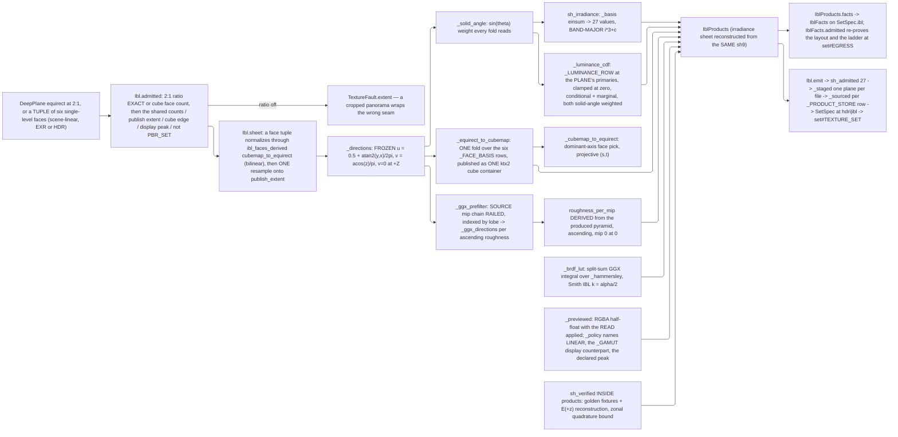

# [PY_ARTIFACTS_GRAPHIC_TEXTURE_IBL]

`ibl` owns the ENVIRONMENT half of the texture sub-domain: the projection pair that moves a radiance field between an equirectangular sheet and a cube, the spherical-harmonic irradiance projection, the GGX specular prefilter pyramid, the split-sum BRDF lookup table, the luminance CDF an importance sampler reads, and the display-referred gain-map preview. Its products are the files an `hdri` or `ibl` manifest names, and it composes `set#TEXTURE_SET` for the emit, the lane, the egress, and the receipt — python IBL and HDRI products ride the PYTHON manifest entry, never the C# document's kind list.

Three constants are FROZEN and this page transcribes rather than decides them. Up axis stays `+Z`, matching the OpenPBR local frame — a Y-up runtime remaps the DIRECTION BASIS at the read and never reorders the wire bands. Equirect mapping runs `u = 0.5 + atan2(d.y, d.x) / 2π` and `v = acos(clamp(d.z, -1, 1)) / π` with `v = 0` at `+Z` and `u` increasing counter-clockwise viewed from `+Z`. SH9 spells one basis, one normalization, one band order, and one golden fixture that every transcribing implementation shares, so a band permutation or a convention swap silently relights every surface and only the fixture catches it. `plane#PLANE` supplies the carrier, the codecs, and the named-channel EXR leg, `derive#DERIVE` the resampler, `ingest#INGEST` the product slot vocabulary and its law rows — an environment product carries no channel role.

## [01]-[INDEX]

- [02]-[IBL]: `IblOp` closes the operation family over the equirect and cubemap projection pair, the GGX prefilter and BRDF-LUT kernels, the luminance CDF, and the `IblProducts` assembly whose per-product store row drives the set emit.
- [03]-[HARMONICS]: SH9 freezes its basis, band order, normalization, layout, and golden fixture, carrying the irradiance projection and reconstruction every implementation agrees on.

## [02]-[IBL]

- Owner: `IblOp` is the closed family, `ibl_derived` its ONE total dispatch, and `IblProducts` the assembled result. `Ibl` composes `set#TEXTURE_SET` — it builds a `SetSpec` at `SetKind.HDRI` or `SetKind.IBL` whose maps are the environment products and hands it the caller's lane AND sink, so the crossing, the elision, the egress grammar, the byte egress, and the receipt are the producer's and this page adds no second rail.
- Law: the FAMILY IS THE ENTRYPOINT. `ibl_derived` is what `Ibl.products` composes, so every case is reachable capability — a declared family with no dispatcher is a vocabulary nothing reads, and the projection pair beneath it then has no caller at all: two kernels the page describes in full and never runs. Each case's own admission rides its own arm, so an out-of-band edge, mip, or sample count refuses at the dispatch rather than raising inside a kernel it never reached.
- Cases: `equirect_to_cubemap` and `cubemap_to_equirect` are the projection inverses, `sh_irradiance` the diffuse projection, `ggx_prefilter` the specular pyramid, `brdf_lut` the split-sum table, and `luminance_cdf` the importance-sampling distribution. Every inverse is one more case on the SAME family, never a sibling entrypoint pair.
- Law: every equirect plane admits at 2:1 extent EXACTLY. Sheets at another ratio are a cropped panorama or a cube cross, and sampling it under the frozen mapping wraps the wrong seam — the ratio check is the one thing that catches it before the light is silently rotated.
- Law: a cube is a TUPLE of six single-level square faces in the frozen order `+X`, `-X`, `+Y`, `-Y`, `+Z`, `-Z` — the exact shape `equirect_to_cubemap` itself returns, so the projection pair round-trips on its own types. A six-LEVEL carrier is unconstructible by design: the level tuple asserts a halving chain six equal faces refuse at the first successor, and spelling a cube that way left both cube arms dead. Per-face record families, six-field structs, and horizontal-cross sheets are the other refused forms.
- Law: the FACE TUPLE and the PUBLISHED cube are two shapes and the variant slot splits them. The six-face form is what `ibl_derived` hands a caller that asked for faces, each face carrying its layer index in the `<variant>` slot as the two-digit infix, and it publishes NOTHING. The published form is ONE `ktx2` cube container whose six faces ride the container's own face axis, so its leaf spends no infix at all and a GPU cube sampler binds one file. `MapSpec.faces` is what makes the producer fan one node over six staged sources instead of six nodes over six leaves.
- Law: the cube's per-face intermediate is a LOSSLESS EXR the container swallows, and it is the one product this page hands over as `payload` rather than `encoded`. A cube container is not constructible from one plane, so the six faces must reach the producer as planes the worker re-assembles; a lossy intermediate puts the container's own quantization on top of a codec's, and `zip` costs nothing but bytes that never leave the process.
- Law: the EQUIRECT SHEET is the one representation every fold reads, and `Ibl.sheet` normalizes into it — a face-tuple source projects through `ibl_faces_derived` `cubemap_to_equirect` at admission, so a cube HDRI ingests and every downstream fold still reads the one parameterization the frozen mapping, the harmonics, the prefilter, and the CDF all stand on. The forward projection is reachable through `ibl_derived` for a caller that wants faces, and BILINEAR reconstruction is the law on both arms — a kernel payload no arm read was a dead knob, and a nearest-texel inverse made the round trip lossy in one direction only.
- Law: the PUBLISH GRID is declared, not inherited. `publish_extent` resamples the normalized sheet ONCE through `derive#DERIVE` before any fold, so the harmonics, the prefilter, the CDF, and the published equirect all stand on the grid the manifest names and a consumer allocates against. Inheriting the source's own extent published a 16k capture at 16k into every consumer while the resampler sat imported one line away, and resampling per product instead runs the frozen mapping over several grids at once.
- Law: the prefilter pyramid's roughness ladder is `roughness_per_mip`, ascending, with mip 0 at roughness 0, and its length EQUALS the pyramid depth. Consumers interpolate between adjacent mips by roughness, so a non-monotonic or short ladder produces a specular response that jumps at a level boundary.
- Law: GGX importance sampling uses the HAMMERSLEY sequence, not a pseudo-random draw. Low-discrepancy points fall as a pure function of the sample index, so the prefiltered pyramid is byte-reproducible across hosts and its content key means something; a seeded RNG reproduces only where the same generator ships.
- Law: the prefilter reads the SOURCE PYRAMID, the level rising with the lobe. Rough GGX lobes spread their taps over a solid angle orders of magnitude wider than one source texel, so gathering every tap from the full-resolution sheet under-samples that lobe and each bright texel inside it survives as a firefly the consumer then blames on the capture. `derive#DERIVE` `mip_chain` builds the chain once at `KAISER` and every level indexes it; the tap count is unchanged. Level selection stays PER OUTPUT LEVEL, never per tap: a per-tap adjacent-level trilinear gather doubles the gathers and pays measured ~1.8x wall time at an identical tap budget, while the pre-resampled stack already band-limits every tap the lobe draws — the per-tap refinement buys back nothing the Kaiser chain has not paid for.
- Law: the mip chain RAILS. Defaulting a failed fold to the base level produces precisely the full-resolution gather the level indexing exists to prevent, and publishes it as a correct prefilter — the failure's only evidence was a discarded `Error`, so a swallowed fold is indistinguishable from a computed pyramid at every consumer.
- Law: `intensity` is a multiplier applied ON READ and never baked into the planes. Baking it forks the content key from the radiance field, so two scenes differing only in exposure store two full pyramids.
- Law: the IRRADIANCE SHEET is a produced plane, not a spare receipt band. `[09]` names an `irradiance` leaf and the roster carries its law row, so a consumer with no SH evaluator reads the diffuse dome as a plane rather than reconstructing nine coefficients it cannot evaluate — a declared product no producer writes is the phantom the roster's own `<product>` slot exposes. It reconstructs at a band-limited extent because a degree-two field is smooth and source resolution stores nothing the coefficients lack.
- Law: the BRDF LUT is scene-INDEPENDENT — a function of `NdotV` and roughness alone, so one table serves every environment and its digest is a constant of the split-sum approximation, not of the capture. It is the SAME GGX integral the prefilter runs over the SAME `_hammersley` sequence, split by the Schlick `(1 - v·h)^5` term into a scale and a bias on `F0`, under the Smith IBL remap `k = α/2`; the direct-light remap `k = (α + 1)² / 8` darkens every grazing-angle reflection by a fixed factor, and a table interpolating `NdotV` against roughness with no integral at all is a smooth surface that looks plausible and reflects nothing correctly.
- Law: the guide is LUMINANCE under the PLANE'S OWN primaries, never a channel mean and never a hardcoded row — an equal-weight fold reads a saturated blue sky as brighter than its own luminance and steers the sampler at it, which is exactly the noise an importance sampler exists to remove, and a fixed AP1 row applied to a BT.709 capture mis-weights every channel by percents in the same direction. `_LUMINANCE_ROW` is keyed by `plane#PLANE` `PlanePrimaries` and `_luminance_cdf` takes the PLANE so it reads the datum the carrier already holds. Each CDF pairs a MARGINAL row distribution over `v` with a CONDITIONAL column distribution per row, both weighted by `sin(theta)` — the solid angle an equirect row subtends shrinks toward the poles, and a CDF built on raw luminance oversamples the poles by exactly that factor.
- Law: the PREVIEW is the one DISPLAY-REFERRED product and the one place `intensity` is baked. Baking is correct HERE and nowhere else: the preview IS the read applied, while every scene-linear product stays the radiance field its content key names. Its three container facts come off values this page already holds — the plane is scene-linear so the transfer names `LINEAR`, the gamut is the display counterpart of the carrier's own primaries, and the peak is the display target the caller declared — and a scene gamut with no display counterpart REFUSES, because a gain map cannot recover its own chromaticity from the pixels and a wrong tag is re-mapped by every viewer that reads it.
- Entry: `Ibl.products` computes every product in ONE pass over ONE source and `Ibl.emit` hands them to `set#TEXTURE_SET`. Both are RAILED where a source-bytes producer's are not, because the products exist before the plan does and an absent EXR core has no node to fault on. Arity is a value property of the requested product set: an `hdri` kind publishes the equirect, its harmonics, and the reconstructed irradiance sheet, and an `ibl` kind adds the prefilter pyramid, the BRDF table, and the importance-sampling guide — the three a diffuse-only consumer never reads and never pays for, so a kind that computes them all and publishes some is work the caller was billed for and never received.
- Law: the CUBE and the PREVIEW are orthogonal to the kind and each is selected by a value that carries its own dimension — `cube_edge` the face edge in texels, `preview_nits` the display peak the gain map is authored against, and zero on either publishes none. Kind cannot decide them: `ibl` already means "prefilter, table, guide", while an `hdri` kind serving a GPU consumer wants a cube and no prefilter and a review page wants a preview and neither. A boolean pair beside the kind carries no edge and no peak, so the value the arm needs rides a second parameter the flag only gates.
- Law: the specular ladder stages ONE SOURCE PER MIP INDEX on the producer's `<variant>` axis. Folding the products into a slot-keyed map kept whichever level the fold wrote last and published a one-file pyramid whose `roughness_per_mip` still claimed the full depth — a consumer interpolating that ladder reads a level that is not there.
- Law: `SetSpec.ibl` carries the facts this page owns — the harmonics, the ladder, the read-side intensity, the frozen up axis — and `set#EGRESS` joins them to the digests its own fan produced. Neither half can build `IblEntry` alone, and naming the leaves here forks the egress grammar while still leaving every digest unfillable.
- Auto: admission proves the 2:1 ratio (or the six-face cube the sheet projection normalizes), positive mip and sample counts, a positive publish extent and cube edge where either is declared, and the kind; `sh_admitted` proves the twenty-seven-value layout before the spec assembles, `sh_verified` runs the golden vectors against the live basis, and `set#TEXTURE_SET` `IblFacts.admitted` re-proves that layout beside the ladder-length agreement at the assembly, which is the LAST site before the wire and the one a caller filling `SetSpec.ibl` directly still crosses.
- Law: the ladder DERIVES from the produced pyramid, never from the requested depth. `roughness_per_mip` is built over the specular tuple the prefilter returned, so its length equals the entry count by construction and the two facts `IblFacts.admitted` compares cannot disagree — reading the ladder off `mips` while the levels came from a fold left one request shape (a kind that publishes no pyramid, a fold that returned short) publishing a ladder for levels no consumer can index.
- Receipt: the products fold into `ArtifactReceipt.Texture` at `kind` `hdri` or `ibl` through the producer's own projection — the SET-level receipt carries the twenty-seven SH coefficients as `sh_<band>_<channel>` scalars (the `set#EGRESS` fold writes them off the manifest's own `ibl` leg), and each per-product plane rides its own `map` band exactly as a channel plane does. Band values stay one native scalar, so the RGB triple at a band spells three entries; the WIRE carries the flat twenty-seven-value list under the frozen band-major layout, and the two spellings are one number set.
- Packages: `numpy` every kernel — `arctan2`/`arccos` the mapping, `einsum` the basis contraction, `linalg.solve` the luminance-row derivation, `cumsum` the CDF, `searchsorted` its inverse; `plane#PLANE` the carrier, the `EXR`/`KTX2`/`ULTRAHDR` rows, the `Envmap` vocabulary, the chromaticity datum every luminance row derives from, and the `named_exr` document leg under its `exr_attributes` header builder; `derive#DERIVE` the resampler and the mip chain; `set#TEXTURE_SET` the emit, the lane, the egress, the manifest, and the frozen SH length both ends admit against.
- Growth: a new environment product is one `ingest#INGEST` `IblProduct` row with its `_PRODUCT_LAW` entry, one `_PRODUCT_STORE` row naming its container and depth, one `IblProducts` field, one `_staged` arm, and one `IblEntry` field — a product with a kernel of its own adds one `IblOp` case and one `ibl_derived` arm, while a product that reshapes one already computed adds neither; `slot_law`, `_ROSTER`, and the egress grammar pick every one of them up with no edit at the producer. A new sky model is a .NET-side data asset this page never synthesizes.
- Boundary: procedural sky authoring, the fitted Hosek-Wilkie coefficient asset, and the environment-light row a path tracer consumes are the .NET side's — this page ingests a captured or supplied radiance field and prefilters it. Tone mapping, display rendering, and view transforms stay `graphic/color/managed#MANAGED`'s and `opencolorio`'s; the gain-map preview is a container the encoder tone-maps internally, never a view transform authored here.
- Boundary: the USD dome-light consumer takes the EQUIRECT under `latlong` — `UsdLux.DomeLight`'s `inputs:texture:format` admits `automatic`, `latlong`, `mirroredBall`, `angular`, and `cubeMapVerticalCross`, and NO six-face token — so a six-face publication has no USD reader at all. The cube's consumers are the GPU cube sampler and the C# path tracer's environment row, and both bind the one `ktx2` container.

```python signature
# --- [RUNTIME_PRELUDE] ------------------------------------------------------------------
from collections.abc import Callable
from dataclasses import dataclass
from enum import StrEnum
from pathlib import Path
from tempfile import NamedTemporaryFile
from typing import Final, Literal, assert_never

import numpy as np
from builtins import frozendict
from expression import Error, Ok, Result, Some, case, effect, tag, tagged_union
from expression.collections import Block
from msgspec import Struct

from rasm.runtime.lanes import LanePolicy

from rasm.artifacts.core.plan import ArtifactWork, ProductSink
from rasm.artifacts.graphic.texture.derive import DeriveOp, derived
from rasm.artifacts.graphic.texture.ingest import IblProduct
from rasm.artifacts.graphic.texture.plane import (
    _CHROMATICITY, AlphaMode, DeepFormat, DeepPlane, EncodePolicy, Envmap, Extent, MipPolicy, Plane, PlaneDepth, PlanePrimaries, PlaneSpace,
    TextureFault, encode, exr_attributes, named_exr,
)
from rasm.artifacts.graphic.texture.set import SH_LENGTH, IblFacts, LicenseClass, MapSource, MapSpec, SetKind, SetSpec, TextureSet

# --- [TYPES] ----------------------------------------------------------------------------

type IblOpTag = Literal["equirect_to_cubemap", "cubemap_to_equirect", "sh_irradiance", "ggx_prefilter", "brdf_lut", "luminance_cdf"]


class CubeFace(StrEnum):
    # FROZEN layer order a cubemap occupies; the layer index rides the `<variant>` slot as a two-digit infix
    POS_X = "px"
    NEG_X = "nx"
    POS_Y = "py"
    NEG_Y = "ny"
    POS_Z = "pz"
    NEG_Z = "nz"


# --- [CONSTANTS] ------------------------------------------------------------------------

_UP_AXIS: Final[str] = "z"  # FROZEN; a Y-up runtime remaps the DIRECTION BASIS at the read and never rewrites the wire
_EQUIRECT_RATIO: Final[float] = 2.0
_CUBE_FACES: Final[tuple[CubeFace, ...]] = tuple(CubeFace)
_FACE_BASIS: Final[frozendict[CubeFace, tuple[tuple[float, float, float], ...]]] = frozendict({
    # (right, up, forward) per face in the +Z-up world basis; a face direction is `forward + s * right + t * up`
    # with s and t in [-1, 1], so ONE parameterized fold covers all six and no face carries its own kernel.
    CubeFace.POS_X: ((0.0, 1.0, 0.0), (0.0, 0.0, 1.0), (1.0, 0.0, 0.0)),
    CubeFace.NEG_X: ((0.0, -1.0, 0.0), (0.0, 0.0, 1.0), (-1.0, 0.0, 0.0)),
    CubeFace.POS_Y: ((-1.0, 0.0, 0.0), (0.0, 0.0, 1.0), (0.0, 1.0, 0.0)),
    CubeFace.NEG_Y: ((1.0, 0.0, 0.0), (0.0, 0.0, 1.0), (0.0, -1.0, 0.0)),
    CubeFace.POS_Z: ((0.0, 1.0, 0.0), (-1.0, 0.0, 0.0), (0.0, 0.0, 1.0)),
    CubeFace.NEG_Z: ((0.0, 1.0, 0.0), (1.0, 0.0, 0.0), (0.0, 0.0, -1.0)),
})
_IRRADIANCE_EXTENT: Final[Extent] = (64, 32)  # a degree-two field is smooth; source resolution stores nothing the nine coefficients lack
_BRDF_EXTENT: Final[Extent] = (256, 256)  # NdotV across x, roughness across y; scene-independent, so one table serves every capture
_PREFILTER_SAMPLES: Final[int] = 1024
def _luminance_of(chromaticity: tuple[float, ...], /) -> np.ndarray:
    # the Y row of a gamut's own RGB-to-XYZ matrix, DERIVED from the chromaticities `plane#PLANE` already owns:
    # lift each primary to a unit-Y tristimulus, solve the per-primary scale that lands the white point, and read
    # the middle row. A hand-written Y triple per gamut is a second constant set nothing checks against the
    # chromaticities it claims to summarize, and the estate carries the chromaticities already.
    red, green, blue, white = (chromaticity[index : index + 2] for index in (0, 2, 4, 6))
    lifted = np.array([[x / y, 1.0, (1.0 - x - y) / y] for x, y in (red, green, blue)], dtype=np.float64).T
    target = np.array([white[0] / white[1], 1.0, (1.0 - white[0] - white[1]) / white[1]], dtype=np.float64)
    return (lifted * np.linalg.solve(lifted, target))[1].astype(np.float32)


_LUMINANCE_ROW: Final[frozendict[PlanePrimaries, np.ndarray]] = frozendict({
    primaries: _luminance_of(chromaticity) for primaries, chromaticity in _CHROMATICITY.items()
})
# ^ EXACTLY the gamuts `plane#PLANE` states chromaticities for, so the two tables cannot list different rosters:
# a plane whose primaries that owner declines to spell has no luminance row here either, and every reader refuses
# on the absence rather than folding a gamut nobody declared. `NONE` is the live instance and the point of it.
_GAMUT: Final[frozendict[PlanePrimaries, str]] = frozendict({
    # the `imagecodecs.ULTRAHDR.CG` MEMBER NAME each gamut lands on, which is the whole roster the gain-map
    # container admits — three display gamuts and nothing else, so a scene gamut with no display counterpart
    # refuses rather than shipping a preview tagged with a chromaticity its own numbers are not in.
    PlanePrimaries.BT709: "BT_709",
    PlanePrimaries.SRGB: "BT_709",
    PlanePrimaries.BT2020: "BT_2100",
    PlanePrimaries.DISPLAYP3: "DISPLAY_P3",
})
_PREVIEW_TRANSFER: Final[str] = "LINEAR"
# ^ the `imagecodecs.ULTRAHDR.CT` member the preview declares: the plane handed in is scene-linear radiance, and
# the container tone-maps its own SDR base, so naming HLG or PQ here would claim a curve the numbers never carried.


@dataclass(frozen=True, slots=True, kw_only=True)
class ProductStore:
    # ONE row per product carrying every egress fact this page decides: the published container, its storage
    # depth, the named channel keys its document writes, the `Envmap` parameterization a directional sheet
    # declares, and whether the container assembles from a face tuple. Three tables keyed on one enum drift the
    # moment a product gains a column in two of them, so the columns ride the row the fold already reads.
    format: DeepFormat
    depth: PlaneDepth
    channels: tuple[str, ...]
    envmap: Envmap | None = None  # absent on a TABLE product: a BRDF LUT and a CDF carry no direction to declare
    faces: bool = False  # the container holds the six-face tuple and the producer assembles it from staged planes


_PRODUCT_STORE: Final[frozendict[IblProduct, ProductStore]] = frozendict({
    # The named channel keys are what make each document self-describing: the latlong sheets and the cube faces
    # ride the format's own `R`/`G`/`B` convention so the anonymous decode still recovers them in slot order,
    # while the two tables name what their lanes MEAN — a `Y`+`A` pair records a luminance image and loses which
    # lane was the scale and which the bias, and only `named_exr_read` can hand those keys back.
    IblProduct.EQUIRECT: ProductStore(format=DeepFormat.EXR, depth=PlaneDepth.F32, channels=("R", "G", "B"), envmap=Envmap.LATLONG),
    IblProduct.IRRADIANCE: ProductStore(format=DeepFormat.EXR, depth=PlaneDepth.F32, channels=("R", "G", "B"), envmap=Envmap.LATLONG),
    IblProduct.SPECULAR: ProductStore(format=DeepFormat.EXR, depth=PlaneDepth.F16, channels=("R", "G", "B"), envmap=Envmap.LATLONG),
    IblProduct.BRDF_LUT: ProductStore(format=DeepFormat.EXR, depth=PlaneDepth.F32, channels=("scale", "bias")),
    IblProduct.LUMINANCE_CDF: ProductStore(format=DeepFormat.EXR, depth=PlaneDepth.F32, channels=("conditional", "marginal")),
    IblProduct.CUBEMAP: ProductStore(
        format=DeepFormat.KTX2, depth=PlaneDepth.F16, channels=("R", "G", "B"), envmap=Envmap.CUBE, faces=True
    ),
    IblProduct.PREVIEW: ProductStore(format=DeepFormat.ULTRAHDR, depth=PlaneDepth.F16, channels=("R", "G", "B", "A")),
})


# --- [MODELS] ---------------------------------------------------------------------------


@tagged_union(frozen=True)
class IblOp:
    tag: IblOpTag = tag()
    equirect_to_cubemap: int = case()  # face edge in texels; BILINEAR reconstruction is the law, not a knob
    cubemap_to_equirect: Extent = case()  # target sheet extent; bilinear on both projection arms — a kernel payload no arm read was a dead knob
    sh_irradiance: None = case()
    ggx_prefilter: tuple[int, int] = case()  # mip count, sample count — the pyramid reads its extent off the source
    # ^ a leading edge field rode here and every dispatch discarded it while the one caller passed zero; the face
    # edge is a REAL field on the cube arm, which is where it always belonged and where it is now read.
    brdf_lut: tuple[Extent, int] = case()  # table extent AND sample count — a module constant here ran the LUT at a budget `Ibl.samples` never reached
    luminance_cdf: None = case()


class IblProducts(Struct, frozen=True):
    equirect: DeepPlane
    irradiance: DeepPlane | None = None  # the SH dome reconstructed as a plane; the `[09]` `irradiance` leaf
    sh9: tuple[float, ...] = ()  # EXACTLY 27 values, band-major with RGB interleaved; `sh_admitted` refuses any other length
    specular: tuple[DeepPlane, ...] = ()
    brdf_lut: DeepPlane | None = None
    luminance_cdf: DeepPlane | None = None
    cubemap: tuple[DeepPlane, ...] = ()  # six single-level faces in the frozen `_CUBE_FACES` order; ONE published container
    preview: DeepPlane | None = None  # the display-referred gain-map sheet, intensity already applied
    preview_nits: float = 0.0  # the display peak the gain map is authored against; the encode policy reads it here
    intensity: float = 1.0  # applied ON READ; baking it forks the content key from the radiance field
    rotation: float = 0.0  # about +Z, in [0, 2pi)

    @property
    def roughness_per_mip(self, /) -> tuple[float, ...]:
        # DERIVED from the pyramid that exists, through the SAME ladder the prefilter ran, so the two cannot
        # disagree. Carrying it as a field read off the REQUESTED depth published a full ladder beside a short or
        # absent pyramid, and a consumer interpolating that ladder read a level that was never written.
        return _roughness_ladder(len(self.specular))

    @property
    def facts(self, /) -> IblFacts:
        # the half of `IblEntry` this page OWNS. Files and digests exist only after the producer's fan drains, so
        # the entry itself is assembled at `set#EGRESS` from these facts and those entries — naming the leaves
        # here too would fork the egress grammar and still leave the digests unfillable.
        return IblFacts(
            sh9=self.sh9,
            roughness_per_mip=self.roughness_per_mip,
            intensity=self.intensity,
            up_axis=_UP_AXIS,  # FROZEN `z`; a `y` value is a decode refusal at every reader
            rotation=self.rotation,  # read-side policy exactly as intensity; a computed-and-dropped rotation could not round-trip
        )


class Ibl(Struct, frozen=True):
    source: DeepPlane | tuple[DeepPlane, ...]
    # ^ an equirect sheet at 2:1, OR a TUPLE of six single-level face planes in the frozen `_CUBE_FACES` order.
    # A cube is NEVER a six-level `DeepPlane`: the level tuple asserts a halving chain six equal faces refuse at
    # the first successor, so that spelling was unconstructible and both cube arms were dead. The tuple-of-planes
    # form is the one `equirect_to_cubemap` itself returns, so the projection pair round-trips by construction.
    lane: LanePolicy  # the caller-threaded offload seam the producer requires — declared BEFORE the defaulted kind, because msgspec raises TypeError at class creation for a required field after a defaulted one
    sink: ProductSink[TextureFault]  # threaded straight to the producer; the environment bytes cross the caller's egress like any other product
    kind: SetKind = SetKind.IBL
    mips: int = 6
    samples: int = _PREFILTER_SAMPLES
    intensity: float = 1.0
    rotation: float = 0.0
    publish_extent: Extent | None = None  # the ONE grid every fold and the published sheet stand on; None keeps the source's
    cube_edge: int = 0  # face edge in texels; 0 publishes no cube, a positive value publishes one KTX2 cube container
    preview_nits: float = 0.0  # the display peak the gain map is authored against; 0.0 publishes no preview

    def sheet(self, /) -> Result[DeepPlane, TextureFault]:
        # ONE normalization every arm reads: a cube source projects to the equirect sheet the frozen mapping,
        # the harmonics, the prefilter, and the CDF all stand on, an equirect source passes through, and a
        # declared publish extent resamples ONCE here so every fold downstream runs on the grid the manifest
        # names. Resampling per product instead would run the frozen mapping over several grids at once.
        match self.source:
            case tuple() as faces:
                edge = int(faces[0].base.shape[0])
                normalized = ibl_faces_derived(faces, IblOp(cubemap_to_equirect=(edge * 4, edge * 2))).map(lambda built: built[0])
            case plane:
                normalized = Ok(plane)
        return normalized.bind(
            lambda sheet: Ok(sheet) if self.publish_extent is None else derived((sheet,), DeriveOp.Resample(self.publish_extent))
        )

    def admitted(self, /) -> Result["Ibl", TextureFault]:
        if isinstance(self.source, tuple):
            match self.source:
                case faces if len(faces) != len(_CUBE_FACES):
                    return Error(TextureFault(shape=(len(_CUBE_FACES), len(faces))))
                case faces if any(face.extent != faces[0].extent or face.extent[0] != face.extent[1] or face.mips != 1 for face in faces):
                    # six SQUARE single-level faces at one extent; anything else is not a cube
                    return Error(TextureFault(extent=faces[0].extent))
            return self._admitted_counts()
        # the sheet arm owns its ONE shape gate and shares every other with the cube arm, so a count rule cannot
        # hold on one source shape and lapse on the other — which is what two parallel gate ladders produced
        width, height = self.source.extent
        if abs(width / height - _EQUIRECT_RATIO) > 1e-6:
            # a sheet at another ratio is a cropped panorama or a cube cross; sampled under the frozen mapping
            # it wraps the wrong seam and silently rotates the whole light rig
            return Error(TextureFault(extent=(width, height)))
        return self._admitted_counts()

    def _admitted_counts(self, /) -> Result["Ibl", TextureFault]:
        # the source-shape-independent gates the cube arm shares with the sheet arm
        match (self.mips, self.samples, self.kind, self.publish_extent, self.cube_edge, self.preview_nits):
            case (mips, _, _, _, _, _) if mips < 1:
                return Error(TextureFault(shape=(mips,)))
            case (_, samples, _, _, _, _) if samples < 1:
                return Error(TextureFault(shape=(samples,)))
            case (_, _, SetKind.PBR_SET, _, _, _):
                # an environment source is not a baked PBR set and the fault says so; a `(EXR, PQ)` payload names a
                # container and a transfer neither of which the caller supplied and neither of which is the cause
                return Error(TextureFault(role=f"<ibl-kind:{SetKind.PBR_SET.value}>"))
            case (_, _, _, (width, height), _, _) if min(width, height) < 1 or abs(width / height - _EQUIRECT_RATIO) > 1e-6:
                # the publish grid IS an equirect sheet: the frozen mapping stands on 2:1 exactly, so a declared
                # extent at another ratio re-seams every fold that runs after the resample
                return Error(TextureFault(extent=(width, height)))
            case (_, _, _, _, edge, _) if edge < 0:
                return Error(TextureFault(shape=(edge,)))
            case (_, _, _, _, _, nits) if nits < 0.0:
                return Error(TextureFault(encode=f"preview:<negative-display-peak:{nits}>"))
            case _:
                return Ok(self)

    def emit(self, /) -> Result[tuple[ArtifactWork, ...], TextureFault]:
        # composes the producer: the environment products become the maps of a SetSpec at `hdri` or `ibl`, so the
        # crossing, the keyed elision, the egress grammar, the manifest, and the receipt are all `set#TEXTURE_SET`'s.
        # This emit is RAILED where a source-bytes producer's is not: the products are computed and encoded BEFORE
        # its plan exists, so an absent EXR core is a fault with no node to carry it — and the producer's own emit
        # rails too, so its admission refusal rides the same Result instead of hiding inside an iterable.
        return self.admitted().bind(lambda ready: ready._spec()).bind(lambda spec: TextureSet(spec=spec, lane=self.lane, sink=self.sink).emit())

    def _spec(self, /) -> Result[SetSpec, TextureFault]:
        # every product is computed HERE in one pass over one source and handed to the producer already in its
        # published container: a `payload` source would make the worker decode and re-encode a plane this page
        # already settled, which re-quantizes a lossy row and re-keys it. The ONE exception is the cube, whose
        # container is not constructible from a single plane — its six faces cross as lossless EXR the worker
        # re-assembles, so the round trip buys the container and costs nothing but process-local bytes. The
        # specular pyramid ships as per-level FILES under the `<variant>` infix, because no EXR write survives a
        # mip- or rip-tiled part; the cube spends no infix at all, because its container holds the face axis.
        return self.products().bind(
            lambda products: Block.of_seq(_staged(products)).fold(
                lambda railed, item: railed.bind(
                    lambda built: _sourced(item[0], item[2], products).map(
                        lambda source: {
                            # each product accumulates its OWN variant map, so a six-level ladder lands six
                            # sources under one slot. Keying the fold by slot alone kept the LAST level and
                            # published a one-entry pyramid whose roughness ladder still claimed six.
                            **built,
                            item[0]: {**built.get(item[0], {}), item[1]: source},
                        }
                    )
                ),
                Ok({}),
            ).map(lambda staged: (products, staged))  # sh9 already admitted at its ONE site inside `products`
        ).map(
            lambda pair: SetSpec(
                kind=self.kind,
                extent=pair[0].equirect.extent,
                maps=frozendict({
                    slot: MapSpec(
                        sources=frozendict(sources),
                        format=_PRODUCT_STORE[slot].format,
                        depth=_PRODUCT_STORE[slot].depth,
                        mips=MipPolicy.NONE,
                        faces=_PRODUCT_STORE[slot].faces,
                    )
                    for slot, sources in pair[1].items()
                }),
                alpha=AlphaMode.NONE,
                # the layer axis reads a REAL count the moment a cube publishes, so the set-level variant gate
                # counts one axis rather than a term no caller ever moved off its constant
                layers=len(_CUBE_FACES) if pair[0].cubemap else 1,
                license_class=LicenseClass.PERMISSIVE,
                ibl=Some(pair[0].facts),  # the environment leg the manifest fold joins to its own drained digests
            )
        )

    @effect.result[IblProducts, TextureFault]()
    def products(self, /):
        # ONE pass over ONE source, RAILED end to end — the basis PROVES itself first (`sh_verified` runs the
        # golden vectors once per products pass; a fixture table nothing evaluates is a comment), the harmonics
        # compute ONCE, and the irradiance sheet reconstructs from that same vector rather than re-projecting the
        # whole dome a second time. An `hdri` kind publishes the equirect, its harmonics, and the reconstructed
        # irradiance sheet; an `ibl` kind adds the prefilter pyramid, the split-sum table, and the
        # importance-sampling guide — the three a diffuse-only consumer never reads and never pays for — while
        # the cube and the preview ride their own dimensioned values, orthogonal to the kind and to each other.
        # DO-NOTATION rather than a bind tower: every step after the first REUSES the equirect and the dome
        # reuses the vector, and value reuse is the discriminant, so the alternative re-binds each intermediate
        # inside the next closure and buries the one linear sequence this is under its own nesting.
        full = self.kind is SetKind.IBL
        equirect = yield from self.sheet()
        yield from sh_verified()
        specular = yield from _optional(full, equirect, IblOp(ggx_prefilter=(self.mips, self.samples)))
        lut = yield from _optional(full, equirect, IblOp(brdf_lut=(_BRDF_EXTENT, self.samples)))
        cdf = yield from _optional(full, equirect, IblOp(luminance_cdf=None))
        cube = yield from _optional(self.cube_edge > 0, equirect, IblOp(equirect_to_cubemap=self.cube_edge))
        preview = yield from _previewed(equirect, self.preview_nits, self.intensity)
        sh9 = yield from sh_admitted(sh_irradiance(equirect.base))
        # Irradiance sheets are a real product, not a spare band: the `[09]` roster names an `irradiance` leaf and
        # carries its law row, so a consumer with no SH evaluator reads the diffuse dome as a plane. Its extent is
        # the harmonics' own band limit — a degree-two field is smooth, and storing it at source resolution
        # stores nothing the nine coefficients lack.
        dome = yield from _leveled(
            (sh_reconstructed(sh9, _directions(*_IRRADIANCE_EXTENT)),), PlaneDepth.F16, PlaneSpace.LINEAR, equirect.primaries
        )
        return IblProducts(
            equirect=equirect,
            sh9=sh9,
            irradiance=dome[0],
            specular=specular,
            brdf_lut=lut[0] if lut else None,
            luminance_cdf=cdf[0] if cdf else None,
            cubemap=cube,
            preview=preview[0] if preview else None,
            preview_nits=self.preview_nits,
            intensity=self.intensity,
            rotation=self.rotation,
        )
```

```python signature
# --- [OPERATIONS] -----------------------------------------------------------------------


def _directions(width: int, height: int, /) -> Plane:
    # FROZEN equirect mapping, read backward: texel centers to unit directions in the +Z-up world basis.
    # `u = 0.5 + atan2(y, x) / 2pi` and `v = acos(clamp(z, -1, 1)) / pi` with v = 0 at +Z; u increases
    # counter-clockwise viewed from +Z, so a sampler and this generator agree by construction.
    v = (np.arange(height, dtype=np.float32) + 0.5) / height
    u = (np.arange(width, dtype=np.float32) + 0.5) / width
    theta = (v * np.pi)[:, None]
    phi = ((u - 0.5) * 2.0 * np.pi)[None, :]
    sin_theta = np.sin(theta)
    return np.stack(
        [np.broadcast_to(sin_theta * np.cos(phi), (height, width)), np.broadcast_to(sin_theta * np.sin(phi), (height, width)),
         np.broadcast_to(np.cos(theta), (height, width))],
        axis=2,
    ).astype(np.float32)


def _uv(direction: Plane, /) -> tuple[Plane, Plane]:
    # Same mapping forward; both directions are ONE law, so a projection and its inverse cannot drift
    return (
        (0.5 + np.arctan2(direction[..., 1], direction[..., 0]) / (2.0 * np.pi)).astype(np.float32),
        (np.arccos(np.clip(direction[..., 2], -1.0, 1.0)) / np.pi).astype(np.float32),
    )


def _solid_angle(width: int, height: int, /) -> Plane:
    # Per-texel solid angle every projection, SH fold, and CDF weights by: an equirect row's angular width
    # shrinks toward the poles as sin(theta), and a fold that skips it over-weights the poles by exactly that factor
    theta = ((np.arange(height, dtype=np.float32) + 0.5) / height * np.pi)[:, None]
    return np.broadcast_to((np.pi / height) * (2.0 * np.pi / width) * np.sin(theta), (height, width))[..., None].astype(np.float32)


def _sampled(equirect: Plane, direction: Plane, /) -> Plane:
    # bilinear equirect lookup with a WRAPPING u and a CLAMPED v — u is periodic and v is not, so one edge mode
    # across both axes seams the sheet at the prime meridian or folds the poles onto each other.
    height, width, _ = equirect.shape
    u, v = _uv(direction)
    x, y = u * width - 0.5, v * height - 0.5
    x0, y0 = np.floor(x).astype(np.int64), np.clip(np.floor(y), 0, height - 1).astype(np.int64)
    fx, fy = (x - x0)[..., None], (y - y0)[..., None]
    xi = (x0 % width, (x0 + 1) % width)
    yi = (y0, np.clip(y0 + 1, 0, height - 1))
    return (
        equirect[yi[0][..., None], xi[0][..., None], :][..., 0, :] * (1 - fx) * (1 - fy)
        + equirect[yi[0][..., None], xi[1][..., None], :][..., 0, :] * fx * (1 - fy)
        + equirect[yi[1][..., None], xi[0][..., None], :][..., 0, :] * (1 - fx) * fy
        + equirect[yi[1][..., None], xi[1][..., None], :][..., 0, :] * fx * fy
    ).astype(np.float32)


def _face_directions(face: CubeFace, edge: int, /) -> Plane:
    right, up, forward = (np.array(axis, dtype=np.float32) for axis in _FACE_BASIS[face])
    s = ((np.arange(edge, dtype=np.float32) + 0.5) / edge * 2.0 - 1.0)[None, :, None]
    t = ((np.arange(edge, dtype=np.float32) + 0.5) / edge * 2.0 - 1.0)[:, None, None]
    vector = forward[None, None, :] + s * right[None, None, :] + t * up[None, None, :]
    return (vector / np.linalg.norm(vector, axis=2, keepdims=True)).astype(np.float32)


def _equirect_to_cubemap(equirect: Plane, edge: int, /) -> tuple[Plane, ...]:
    # ONE parameterized fold over the six `_FACE_BASIS` rows; a per-face kernel is the enumerated form this refuses
    return tuple(_sampled(equirect, _face_directions(face, edge)) for face in _CUBE_FACES)


def _cubemap_to_equirect(faces: tuple[Plane, ...], extent: Extent, /) -> Plane:
    # Inverse leg: each equirect texel's direction picks its face by the dominant axis and its (s, t) by the
    # remaining pair divided by that axis magnitude — the cube's own projective parameterization, not a search.
    # The gather is BILINEAR inside the face, matching the forward projection's own reconstruction: a
    # nearest-texel inverse made the round trip lossy in one direction only, an asymmetry no fixture forgives.
    width, height = extent
    direction = _directions(width, height)
    dominant = np.argmax(np.abs(direction), axis=2)
    sign = np.take_along_axis(direction, dominant[..., None], axis=2)[..., 0] >= 0.0
    face_index = (dominant * 2 + (~sign).astype(np.int64)).astype(np.int64)
    sampled = np.zeros((height, width, faces[0].shape[2]), dtype=np.float32)
    for index, face in enumerate(faces):
        mask = face_index == index
        right, up, forward = (np.array(axis, dtype=np.float32) for axis in _FACE_BASIS[_CUBE_FACES[index]])
        depth = np.abs(direction @ forward)
        s = np.clip((direction @ right) / np.maximum(depth, 1e-9) * 0.5 + 0.5, 0.0, 1.0)
        t = np.clip((direction @ up) / np.maximum(depth, 1e-9) * 0.5 + 0.5, 0.0, 1.0)
        edge = face.shape[0]
        x = np.clip(s[mask] * edge - 0.5, 0.0, edge - 1.0)
        y = np.clip(t[mask] * edge - 0.5, 0.0, edge - 1.0)
        x0, y0 = np.floor(x).astype(np.int64), np.floor(y).astype(np.int64)
        x1, y1 = np.minimum(x0 + 1, edge - 1), np.minimum(y0 + 1, edge - 1)
        fx, fy = (x - x0)[:, None], (y - y0)[:, None]
        sampled[mask] = (
            face[y0, x0, :] * (1.0 - fx) * (1.0 - fy)
            + face[y0, x1, :] * fx * (1.0 - fy)
            + face[y1, x0, :] * (1.0 - fx) * fy
            + face[y1, x1, :] * fx * fy
        ).astype(np.float32)
    return sampled


def ibl_derived(source: DeepPlane, op: IblOp, /) -> Result[tuple[DeepPlane, ...], TextureFault]:
    # Dispatches TOTALLY over the closed family, mirroring `derive#DERIVE` `derived`: a declared family with no
    # dispatcher is a vocabulary nothing reads. `Ibl.products` composes the prefilter, LUT, and CDF arms;
    # `Ibl.sheet` the cube inverse through `ibl_faces_derived`; the `sh_irradiance` arm serves an external caller
    # wanting the dome alone — `products` reconstructs from its own single sh9 computation instead of paying the
    # full-dome projection twice. The admission each case needs rides its own arm, so an operand whose extent or
    # face count the op cannot take rails here and never inside a kernel.
    match op:
        case IblOp(tag="equirect_to_cubemap", equirect_to_cubemap=edge) if edge >= 1:
            return _leveled(_equirect_to_cubemap(source.base, edge), PlaneDepth.F32, PlaneSpace.LINEAR, source.primaries)
        case IblOp(tag="sh_irradiance"):
            # E(n) ITSELF: the reconstruction law puts `albedo / pi` at the CONSUMER, so dividing here pays it
            # twice and darkens every diffuse dome by a factor no reader can recover from the plane
            return _leveled(
                (sh_reconstructed(sh_irradiance(source.base), _directions(*_IRRADIANCE_EXTENT)),), PlaneDepth.F16, PlaneSpace.LINEAR, source.primaries
            )
        case IblOp(tag="ggx_prefilter", ggx_prefilter=(mips, samples)) if min(mips, samples) >= 1:
            return _ggx_prefilter(source, mips, samples).bind(
                lambda levels: _leveled(levels, PlaneDepth.F16, PlaneSpace.LINEAR, source.primaries)
            )
        case IblOp(tag="brdf_lut", brdf_lut=(extent, samples)) if min(extent) >= 1 and samples >= 1:
            # the split-sum table is a PARAMETER field, not a colour one: it carries no primaries at all and the
            # `none` row is the honest declaration, where inheriting the capture's gamut claims a fact it has not
            return _leveled((_brdf_lut(extent, samples),), PlaneDepth.F32, PlaneSpace.RAW, PlanePrimaries.NONE)
        case IblOp(tag="luminance_cdf"):
            return _luminance_cdf(source).bind(lambda cdf: _leveled((cdf,), PlaneDepth.F32, PlaneSpace.RAW, PlanePrimaries.NONE))
        case IblOp(tag="cubemap_to_equirect"):
            # the inverse consumes SIX face planes, not one carrier — `ibl_faces_derived` is its dispatch
            return Error(TextureFault(shape=(len(_CUBE_FACES), 1)))
        case IblOp():
            # every guarded arm above falls here when its own payload is out of band, so an unusable edge, mip, or
            # sample count is one refusal naming the op rather than a raise inside the kernel it never reached
            return Error(TextureFault(shape=(0,)))
        case _ as unreachable:
            assert_never(unreachable)


def ibl_faces_derived(faces: tuple[DeepPlane, ...], op: IblOp, /) -> Result[tuple[DeepPlane, ...], TextureFault]:
    # the FACE-TUPLE half of the dispatch: a cube is six single-level planes — the exact shape
    # `equirect_to_cubemap` returns — so the projection pair round-trips on its own types, where a six-level
    # carrier asserted a halving chain equal faces refuse and left both cube arms unconstructible.
    match op:
        case IblOp(tag="cubemap_to_equirect", cubemap_to_equirect=extent) if (
            len(faces) == len(_CUBE_FACES) and min(extent) >= 1 and all(face.mips == 1 for face in faces)
        ):
            return _leveled(
                (_cubemap_to_equirect(tuple(face.base for face in faces), extent),), PlaneDepth.F32, PlaneSpace.LINEAR, faces[0].primaries
            )
        case _:
            return Error(TextureFault(shape=(len(_CUBE_FACES), len(faces))))


def _optional(wanted: bool, source: DeepPlane, op: IblOp, /) -> Result[tuple[DeepPlane, ...], TextureFault]:
    # a product the KIND does not publish costs nothing and rails as an empty tuple; a product it does publish
    # rails on its own dispatch. One helper keeps every optional leg on the same rail, so a kernel failure never
    # degrades into an absent product the manifest then reports as a set the caller simply did not request.
    return ibl_derived(source, op) if wanted else Ok(())


def _roughness_ladder(mips: int, /) -> tuple[float, ...]:
    # ASCENDING, mip 0 at roughness 0, length EQUAL to the pyramid depth — the ONE spelling the prefilter runs and
    # `IblProducts.roughness_per_mip` publishes, so the ladder a consumer interpolates against is the ladder that
    # ran and a second derivation cannot drift from it.
    return tuple(float(index) / max(1, mips - 1) for index in range(mips))


def _staged(products: IblProducts, /) -> tuple[tuple[IblProduct, int | None, DeepPlane], ...]:
    # the slot type is `IblProduct` and not the wider `MapSlot`: every plane this page stages is an environment
    # product, and the narrower annotation is what lets `_PRODUCT_STORE` be indexed without a widening cast.
    # (slot, variant, plane) per STAGED PLANE. The equirect, the irradiance sheet, the BRDF table, the CDF, and
    # the preview take no variant; the specular ladder takes its mip index as the two-digit infix the frozen
    # grammar spells, and mip zero is a REAL variant whose index is 0 and never an absent infix. The cube's six
    # faces key the source map by layer index too, but their spec is a FACES spec — the producer fans one node
    # over all six and its leaf spends no infix, because the container itself holds the face axis.
    return (
        (IblProduct.EQUIRECT, None, products.equirect),
        *(((IblProduct.IRRADIANCE, None, products.irradiance),) if products.irradiance is not None else ()),
        *((IblProduct.SPECULAR, index, level) for index, level in enumerate(products.specular)),
        *(((IblProduct.BRDF_LUT, None, products.brdf_lut),) if products.brdf_lut is not None else ()),
        *(((IblProduct.LUMINANCE_CDF, None, products.luminance_cdf),) if products.luminance_cdf is not None else ()),
        *((IblProduct.CUBEMAP, index, face) for index, face in enumerate(products.cubemap)),
        *(((IblProduct.PREVIEW, None, products.preview),) if products.preview is not None else ()),
    )


def _luminance(plane: DeepPlane, /) -> Result[np.ndarray, TextureFault]:
    # the plane's OWN Y row, refused where its primaries are unspecified. A luminance fold under `none` is the
    # authority guess the datum exists to end, and the alternative — quietly folding a default gamut's weights —
    # steers the importance sampler and the preview's boost range at a brightness nobody declared.
    match _LUMINANCE_ROW.get(plane.primaries):
        case None:
            return Error(TextureFault(encode=f"luminance:<unspecified-primaries:{plane.primaries.value}>"))
        case row:
            return Ok(row)


def _named_bytes(product: IblProduct, plane: DeepPlane, /) -> Result[bytes, TextureFault]:
    # the NAMED-CHANNEL leg: `plane#PLANE` `named_exr` is the one writer that can put an `envmap` attribute and a
    # real channel key on the file, and it writes to a PATH, so the bytes cross one temporary exactly as the KTX2
    # floor leg's own read-back does. `exr_attributes` builds the header off the CARRIER's own facts — its
    # compression row, its chromaticities, and the parameterization this page declares — so no attribute is hand
    # -listed here and the provider constants stay behind the owner that defers them.
    channels = frozendict({name: plane.base[..., index] for index, name in enumerate(_PRODUCT_STORE[product].channels)})
    with NamedTemporaryFile(suffix=".exr") as scratch:
        named_exr(channels, exr_attributes(plane, envmap=_PRODUCT_STORE[product].envmap), scratch.name)
        return Ok(Path(scratch.name).read_bytes())


def _policy(product: IblProduct, products: IblProducts, /) -> Result[EncodePolicy, TextureFault]:
    # the gain-map row is the ONE product whose policy is resolved rather than defaulted, and its three fields are
    # facts this page already holds: the plane is scene-linear so the transfer names LINEAR, the gamut names the
    # display counterpart of the carrier's own primaries, and the peak is the display target the caller declared.
    # A scene gamut with no display counterpart refuses — a preview tagged with a chromaticity its numbers are not
    # in is a file every viewer re-maps, and the tag is the one thing a gain map cannot recover from the pixels.
    match _PRODUCT_STORE[product].format:
        case DeepFormat.ULTRAHDR:
            match _GAMUT.get(products.equirect.primaries):
                case None:
                    return Error(TextureFault(primaries=(products.equirect.space, products.equirect.primaries)))
                case gamut:
                    return Ok(EncodePolicy(ultrahdr=(_PREVIEW_TRANSFER, gamut, products.preview_nits)))
        case _:
            return Ok(EncodePolicy(default=None))


def _sourced(product: IblProduct, plane: DeepPlane, products: IblProducts, /) -> Result[MapSource, TextureFault]:
    # A published container crosses as `encoded` — probed, digested, passed through, never re-quantized, and its
    # PRODUCER-declared transfer rides the source so a `raw` table never reads back `linear` off a decode row's
    # own tag. The cube is the ONE product whose container the worker must assemble, so its faces cross as
    # `payload` in the lossless intermediate the assembly decodes; the chain is empty, the plane arrives settled.
    row = _PRODUCT_STORE[product]
    named = _named_bytes(product, plane)
    if row.faces:
        return named.map(lambda payload: MapSource(payload=(payload, ())))
    if row.format is DeepFormat.EXR:
        return named.map(lambda payload: MapSource(encoded=(payload, DeepFormat.EXR, plane.space)))
    return (
        _policy(product, products)
        .bind(lambda policy: encode(plane, row.format, policy))
        .map(lambda payload: MapSource(encoded=(payload, row.format, plane.space)))
    )


def _previewed(equirect: DeepPlane, nits: float, intensity: float, /) -> Result[tuple[DeepPlane, ...], TextureFault]:
    # the display-referred sheet: RGBA half-float with the READ applied, which is the one product whose intensity
    # is baked because the preview IS the read. A gain-map container takes four lanes and half float alone, so the
    # opaque alpha is the container's own demand rather than a coverage claim the environment ever carried.
    return (
        _leveled(
            (np.concatenate([equirect.base[..., :3] * intensity, np.ones_like(equirect.base[..., :1])], axis=2).astype(np.float32),),
            PlaneDepth.F16,
            PlaneSpace.LINEAR,
            equirect.primaries,
        )
        if nits > 0.0
        else Ok(())
    )


def _leveled(
    planes: tuple[Plane, ...], depth: PlaneDepth, space: PlaneSpace, primaries: PlanePrimaries, /
) -> Result[tuple[DeepPlane, ...], TextureFault]:
    # each product is its OWN single-level carrier, never a pyramid: the cube's six faces and the prefilter's
    # roughness ladder are sibling planes at declared extents, and the halving chain a level tuple asserts is a
    # relation neither of them holds. Primaries thread through every product because the datum is the operand's,
    # so a derived sheet cannot silently fall back to the carrier default the source never declared.
    return Block.of_seq(planes).fold(
        lambda railed, plane: railed.bind(
            # every parameter of `of` is positional-only, so the primaries datum rides its slot after the
            # association rather than a keyword the signature refuses
            lambda built: DeepPlane.of((plane,), depth, space, AlphaMode.NONE, primaries).map(lambda one: (*built, one))
        ),
        Ok(()),
    )


def _hammersley(count: int, /) -> tuple[np.ndarray, np.ndarray]:
    # Low-discrepancy sequences fall as a PURE function of the sample index, so the prefiltered pyramid is
    # byte-reproducible across hosts and its content key means something; a seeded RNG reproduces only where
    # that same generator ships. Second coordinate carries the radical inverse in base 2.
    index = np.arange(count, dtype=np.uint32)
    bits = index.copy()
    # Van der Corput pairing: the 16-bit half swap first, then each shift with ITS OWN mask — (1, 0x5555...),
    # (2, 0x3333...), (4, 0x0F0F...), (8, 0x00FF...) — a transposed pairing is not the radical inverse and the
    # prefilter integrates a clumped point set that sparkles at the tap budget.
    bits = ((bits << 16) | (bits >> 16)) & 0xFFFFFFFF
    for shift, mask in ((1, 0x55555555), (2, 0x33333333), (4, 0x0F0F0F0F), (8, 0x00FF00FF)):
        bits = ((bits & np.uint32(mask)) << np.uint32(shift)) | ((bits & np.uint32(~mask & 0xFFFFFFFF)) >> np.uint32(shift))
    return ((index.astype(np.float32) / count), (bits.astype(np.float64) * 2.3283064365386963e-10).astype(np.float32))


def _ggx_directions(alpha: float, count: int, /) -> np.ndarray:
    # GGX/Trowbridge-Reitz importance sampling in the LOCAL frame; the half-vector distribution is inverted
    # analytically, so no rejection loop and no per-sample branch exists.
    xi_a, xi_b = _hammersley(count)
    phi = 2.0 * np.pi * xi_a
    cos_theta = np.sqrt((1.0 - xi_b) / (1.0 + (alpha * alpha - 1.0) * xi_b))
    sin_theta = np.sqrt(np.maximum(0.0, 1.0 - cos_theta * cos_theta))
    return np.stack([sin_theta * np.cos(phi), sin_theta * np.sin(phi), cos_theta], axis=1).astype(np.float32)


def _convolved(equirect: Plane, normals: Plane, taps: np.ndarray, /) -> Plane:
    # Local GGX half-vector sets rotate into each texel's own frame through a branch-free basis: the helper
    # axis is +X unless the normal is nearly +X, where +Z takes over — a fixed helper degenerates exactly at the
    # pole the frame is built for. Weighting by NdotL and dropping the back hemisphere is the split-sum's own
    # approximation, and the weight sum normalizes so a uniform field prefilters to itself at every roughness.
    helper = np.where(np.abs(normals[..., 0:1]) > 0.9, np.array([0.0, 0.0, 1.0], np.float32), np.array([1.0, 0.0, 0.0], np.float32))
    tangent = np.cross(helper, normals)
    tangent = tangent / np.maximum(np.linalg.norm(tangent, axis=2, keepdims=True), 1e-12)
    bitangent = np.cross(normals, tangent)
    total = np.zeros_like(normals)
    weight = np.zeros(normals.shape[:2] + (1,), dtype=np.float32)
    for tap in taps:
        half = (tangent * tap[0] + bitangent * tap[1] + normals * tap[2]).astype(np.float32)
        light = (2.0 * np.sum(normals * half, axis=2, keepdims=True) * half - normals).astype(np.float32)
        n_dot_l = np.clip(np.sum(normals * light, axis=2, keepdims=True), 0.0, 1.0)
        total += _sampled(equirect, light) * n_dot_l
        weight += n_dot_l
    return (total / np.maximum(weight, 1e-12)).astype(np.float32)


def _ggx_prefilter(sheet: DeepPlane, mips: int, samples: int, /) -> Result[tuple[Plane, ...], TextureFault]:
    # takes the CARRIER, not the bare array: the mip chain runs through `derive#DERIVE`, which reads the operand's
    # transfer, association, chromaticity, and face count off it — rebuilding a stand-in carrier here dropped every
    # one of those and folded the pyramid under the defaults rather than under the capture's own declarations.
    # Roughness ladders run ASCENDING with mip 0 at roughness 0 and length EQUAL to the pyramid depth: a
    # consumer interpolates between adjacent levels by roughness, so a short or non-monotonic ladder jumps at a
    # level boundary. Each level reads the SOURCE PYRAMID and not level 0: a rough lobe spreads its taps over a
    # solid angle far wider than one source texel, so gathering from the full-resolution sheet under-samples that
    # lobe by orders of magnitude and every bright texel inside it survives as a firefly the consumer then blames
    # on the capture. `derive#DERIVE` `mip_chain` builds the chain once, and the level rises with the lobe.
    # The mip chain RAILS. Defaulting a failed fold to the base level alone produced a whole pyramid gathered from
    # the full-resolution sheet — exactly the firefly-ridden under-sampling this level indexing exists to prevent —
    # and published it as a correct prefilter, because the only evidence of the failure was a discarded `Error`.
    roughness = _roughness_ladder(mips)
    width, height = sheet.extent
    return derived((sheet,), DeriveOp.MipChain(MipPolicy.KAISER, mips)).map(
        lambda chain: tuple(
            _convolved(
                chain.levels[min(index, chain.mips - 1)],
                _directions(max(1, width >> index), max(1, height >> index)),
                _ggx_directions(max(value * value, 1e-4), samples),
            )
            for index, value in enumerate(roughness)
        )
    )


def _brdf_lut(extent: Extent, samples: int, /) -> Plane:
    # SCENE-INDEPENDENT: a function of NdotV and roughness alone, so one table serves every capture and its digest
    # is a constant of the split-sum approximation. The two components are the SCALE and the BIAS on F0, and they
    # are the same GGX integral the prefilter runs — `∫ f(l,v)/F · (n·l) dl` split by the Schlick `(1-v·h)^5`
    # term — over the SAME `_hammersley` sequence, so the table and the pyramid agree by construction and the
    # table stays byte-reproducible. The Smith geometry term takes the IBL `k = α/2` remap, not the direct-light
    # `k = (α+1)²/8`; the direct remap here darkens every grazing-angle reflection by a fixed factor.
    width, height = extent
    n_dot_v = ((np.arange(width, dtype=np.float32) + 0.5) / width)[None, :, None]
    roughness = ((np.arange(height, dtype=np.float32) + 0.5) / height)[:, None, None]
    view = np.concatenate([np.sqrt(np.maximum(0.0, 1.0 - n_dot_v * n_dot_v)), np.zeros_like(n_dot_v), n_dot_v], axis=2).astype(np.float32)
    alpha = np.maximum(roughness * roughness, 1e-4)
    scale, bias = np.zeros((height, width), np.float32), np.zeros((height, width), np.float32)
    xi_a, xi_b = _hammersley(samples)
    for index in range(samples):
        # Half-vectors draw per (roughness, NdotV) cell because alpha varies down the table; the local
        # frame is the identity, so the tangent-space draw needs no rotation and the whole sweep stays vectorized
        phi = 2.0 * np.pi * float(xi_a[index])
        cos_h = np.sqrt((1.0 - float(xi_b[index])) / (1.0 + (alpha * alpha - 1.0) * float(xi_b[index])))
        sin_h = np.sqrt(np.maximum(0.0, 1.0 - cos_h * cos_h))
        half = np.concatenate([sin_h * np.cos(phi), sin_h * np.sin(phi), cos_h], axis=2).astype(np.float32)
        v_dot_h = np.sum(view * half, axis=2, keepdims=True)
        light = (2.0 * v_dot_h * half - view).astype(np.float32)
        n_dot_l, n_dot_h = np.clip(light[..., 2:3], 0.0, 1.0), np.clip(half[..., 2:3], 0.0, 1.0)
        k = alpha * 0.5
        visibility = (n_dot_l / np.maximum(n_dot_l * (1.0 - k) + k, 1e-9)) * (n_dot_v / np.maximum(n_dot_v * (1.0 - k) + k, 1e-9))
        weight = np.where(n_dot_l > 0.0, visibility * np.clip(v_dot_h, 0.0, 1.0) / np.maximum(n_dot_h * n_dot_v, 1e-9), 0.0)
        fresnel = np.power(1.0 - np.clip(v_dot_h, 0.0, 1.0), 5.0)
        scale += ((1.0 - fresnel) * weight)[..., 0]
        bias += (fresnel * weight)[..., 0]
    return np.stack([scale / samples, bias / samples], axis=2).astype(np.float32)


def _luminance_cdf(plane: DeepPlane, /) -> Result[Plane, TextureFault]:
    # a MARGINAL row distribution over v plus a CONDITIONAL column distribution per row, both weighted by the
    # per-texel solid angle: an equirect row's angular width shrinks as sin(theta), and a CDF over raw luminance
    # oversamples the poles by exactly that factor. Two components: conditional in R, marginal broadcast in G.
    # Guide reads LUMINANCE under the PLANE'S OWN primaries, not a channel mean and not a fixed row: an
    # equal-weight fold reads a saturated blue sky as brighter than its own luminance and steers the sampler at
    # it, and a foreign gamut's row mis-weights every channel in one direction. The fold takes the PLANE, so the
    # datum comes off the carrier that holds it rather than a constant this page would have to guess.
    # A wide-gamut Y row carries a NEGATIVE blue weight — AP0's is the live instance — so the weighted field
    # clamps at zero before the scan: a negative sample makes `cumsum` non-monotonic and the inverse lookup a
    # sampler runs over it returns a direction from the wrong row entirely.
    def _built(row: np.ndarray, /) -> Plane:
        equirect = plane.base
        luminance = np.maximum((equirect[..., :3] * row).sum(axis=2, keepdims=True), 0.0)
        weighted = (luminance * _solid_angle(equirect.shape[1], equirect.shape[0]))[..., 0]
        conditional = np.cumsum(weighted, axis=1)
        row_total = np.maximum(conditional[:, -1:], 1e-12)
        marginal = np.cumsum(row_total[:, 0])
        return np.stack([
            (conditional / row_total).astype(np.float32),
            np.broadcast_to((marginal / max(float(marginal[-1]), 1e-12))[:, None], weighted.shape).astype(np.float32),
        ], axis=2)

    return _luminance(plane).map(_built)
```

## [03]-[HARMONICS]

- Owner: the SH9 spelling is FROZEN at `tests/contracts/schema/appearance-vocabulary.schema.json` — `$defs/sh9` the layout, `$defs/sh9Basis` the basis rows, `$defs/sh9Golden` the two fixtures — and every transcribing implementation, this page among them, carries it verbatim. Band permutations, normalization changes, and up-axis swaps silently relight every surface and produce no error anywhere; `sh_verified` running the golden fixture is what catches it, and `sh_admitted` is what keeps a mis-shaped vector off both wires.
- Law: the basis is REAL ORTHONORMAL spherical harmonics through `l = 2` in a right-handed `+Z`-up world basis matching the OpenPBR local frame. Projection runs `L_i = ∫ L(ω) Y_i(ω) dω` and irradiance reconstruction `E(n) = Σ Â_l(i) · L_i · Y_i(n)` with `Â_0 = π`, `Â_1 = 2π/3`, `Â_2 = π/4`; Lambertian outgoing radiance is `albedo · E(n) / π`.
- Law: the LAYOUT is band-major with RGB interleaved — index `i * 3 + c` holds band `i` channel `c` — and the length is EXACTLY twenty-seven. Channel-major layouts are the decode fork this freeze forecloses, and any other length refuses at admit.
- Law: TWO golden vectors jointly discriminate band order, normalization, and up axis, and `sh_verified` RUNS them against the live basis — `Ibl.products` composes it, so a drifted basis refuses before a single product encodes. Uniform field `L(ω) = 1` yields `sh_0 = 3.5449077018110318` (`2√π`) with every other band zero and `E(+ẑ) = π`; a linear field `L(ω) = ω·ẑ` yields `sh_2 = 2.046653415892977` with every other band zero and `E(+ẑ) = 2π/3`. Second vector carries the AXIS discriminator: a Y-up implementation places the non-zero at `sh_1` or `sh_3` and fails. TOLERANCE IS PER BAND CLASS: the φ-symmetric grid cancels every `m ≠ 0` band exactly, so those hold the frozen `1e-6`; the zonal bands carry the midpoint quadrature's own `O((π/H)²)` residue — measured `8e-4` on `sh_6` at the fixture grid — so they hold `2e-3`, and an analytic expectation asserted at `1e-6` against a discrete kernel is a fixture a CORRECT implementation fails, which is the defect this split forecloses. A band-order, normalization, or axis error displaces mass at `O(1)`, three orders past either bound. `_SH_RADIANCE` carries each vector's own input field beside its expectation, so the verifier cannot drift from the fixture it checks — and a fixture table nothing evaluates is a comment about the three facts that silently relight every surface and raise nowhere.
- Law: the length admits at EXACTLY twenty-seven. A shorter list reshapes into the wrong band count at every one of the three transcribing implementations and a longer one drops its tail; `sh_admitted` is what stands between those two and the wire.
- Law: a Y-up runtime remaps the DIRECTION BASIS at the read; it never reorders the wire bands and never rewrites the wire. That remap proves itself against the second golden vector at the landing, and a landing without that proof is incomplete.
- Law: the projection weights by the per-texel SOLID ANGLE, not by texel count. Equirect rows subtend `sin(theta)` of the sphere, so an unweighted sum over-counts the poles and tilts the reconstructed irradiance toward whatever the zenith happens to hold.
- Auto: the basis constants are a `_SH_BASIS` row table carrying the `(l, m)` pair, the normalization constant, and the direction monomial, so the projection contracts one `einsum` over nine rows and the reconstruction reuses the SAME rows — a projection and a reconstruction spelled apart is the drift the shared table forecloses.
- Law: the drift refusal NAMES its fixture and its band. `sh_verified` is the one gate standing between a drifted basis and every relit surface, and it fires exactly once per products pass, so what it reports is all a reader ever gets — a count of anything is unactionable there, and the fault carries the `<fixture>:<band>` pairs through the vocabulary's own string case rather than through a numeric tuple that cannot hold a name.
- Output: the twenty-seven values ride the manifest's `sh9` list in the frozen layout, and the receipt band spells them `sh_<band>_<channel>` because a band value is one native scalar. Both spellings carry the same number set in the same order.
- Boundary: no tone map, no exposure, no display transform. Coefficients stay scene-linear radiance and the read-side `intensity` multiplier is the only scale.

```python signature
# --- [CONSTANTS] ------------------------------------------------------------------------


class ShBand(Struct, frozen=True):
    slot: str  # `sh_0`..`sh_8`, the manifest and receipt band spelling
    degree: tuple[int, int]  # (l, m)
    constant: float
    monomial: str  # the direction polynomial in x, y, z the basis evaluates


_SH_BASIS: Final[tuple[ShBand, ...]] = (
    ShBand(slot="sh_0", degree=(0, 0), constant=0.28209479177387814, monomial="1"),
    ShBand(slot="sh_1", degree=(1, -1), constant=0.4886025119029199, monomial="y"),
    ShBand(slot="sh_2", degree=(1, 0), constant=0.4886025119029199, monomial="z"),
    ShBand(slot="sh_3", degree=(1, 1), constant=0.4886025119029199, monomial="x"),
    ShBand(slot="sh_4", degree=(2, -2), constant=1.0925484305920792, monomial="x*y"),
    ShBand(slot="sh_5", degree=(2, -1), constant=1.0925484305920792, monomial="y*z"),
    ShBand(slot="sh_6", degree=(2, 0), constant=0.31539156525252005, monomial="3*z*z - 1"),
    ShBand(slot="sh_7", degree=(2, 1), constant=1.0925484305920792, monomial="x*z"),
    ShBand(slot="sh_8", degree=(2, 2), constant=0.5462742152960396, monomial="x*x - y*y"),
)
_SH_CONVOLUTION: Final[tuple[float, float, float]] = (np.pi, 2.0 * np.pi / 3.0, np.pi / 4.0)  # A-hat per degree l; irradiance, not radiance
_SH_TOLERANCE: Final[float] = 1e-6
_SH_ZONAL_TOLERANCE: Final[float] = 2e-3
# ^ the m=0 bands (`sh_0`, `sh_2`, `sh_6`) integrate a θ-dependent monomial the MIDPOINT quadrature cannot land
# at the analytic value — the residue is O((π/H)²) and at the fixture grid sits near 8e-4 on `sh_6` — while every
# m≠0 band cancels EXACTLY under the φ-symmetric grid and holds the frozen 1e-6. Two tolerances, both
# discriminating: a band-order, normalization, or axis error displaces mass at O(1), three orders past either.
_SH_ZONAL: Final[frozenset[str]] = frozenset({"sh_0", "sh_2", "sh_6"})
# `SH_LENGTH` is the WIRE's constant and rides its document owner at `set#TEXTURE_SET`: nine bands, RGB
# interleaved at index `i * 3 + c`, the frozen `$defs/sh9` layout verbatim. Both admission sites — this page's
# producer-side gate and the assembly's last-site gate — read that one number, where a local copy beside it is
# two constants for one frozen length and only one of them moves when the layout does.
_SH_FIXTURE_EXTENT: Final[Extent] = (128, 64)  # the projection grid the golden vectors evaluate on; 2:1, band-limit-sufficient
_SH_GOLDEN: Final[frozendict[str, tuple[str, float]]] = frozendict({
    # (non-zero slot, its exact value) for the two fixtures; every other band is zero at `_SH_TOLERANCE`
    "uniform": ("sh_0", 3.5449077018110318),  # L = 1; equals 2*sqrt(pi), and E(n) = pi for every n
    "linear_z": ("sh_2", 2.046653415892977),  # L = dot(w, z-hat); the AXIS discriminator a Y-up basis fails
})
_SH_RADIANCE: Final[frozendict[str, Callable[[Plane], Plane]]] = frozendict({
    # each fixture's own INPUT field over the direction grid, so the table carries both halves of its vector and
    # a verifier cannot drift from the expectation it checks
    "uniform": lambda direction: np.ones_like(direction),
    "linear_z": lambda direction: np.broadcast_to(direction[..., 2:3], direction.shape).copy(),
})


# --- [OPERATIONS] -----------------------------------------------------------------------


def _basis(direction: Plane, /) -> np.ndarray:
    # ONE evaluation of the nine rows; the projection contracts it and the reconstruction reuses it, so a
    # projection and a reconstruction spelled apart cannot drift into two conventions.
    x, y, z = direction[..., 0], direction[..., 1], direction[..., 2]
    monomials = (np.ones_like(x), y, z, x, x * y, y * z, 3.0 * z * z - 1.0, x * z, x * x - y * y)
    return np.stack([band.constant * value for band, value in zip(_SH_BASIS, monomials, strict=True)], axis=2).astype(np.float32)


def sh_irradiance(equirect: Plane, /) -> tuple[float, ...]:
    # weighted by the per-texel SOLID ANGLE, never by texel count: an equirect row subtends sin(theta) of the
    # sphere, so an unweighted sum over-counts the poles and tilts the reconstruction toward the zenith.
    height, width, _ = equirect.shape
    basis = _basis(_directions(width, height))
    weight = _solid_angle(width, height)
    coefficients = np.einsum("hwb,hwc->bc", basis * weight, equirect[..., :3], optimize=True)
    # BAND-MAJOR with RGB interleaved: index i*3 + c holds band i channel c. A channel-major flatten is the
    # decode fork the freeze forecloses, and a length other than 27 refuses at admit on both wires.
    return tuple(float(value) for value in coefficients.reshape(-1))


def sh_admitted(sh9: tuple[float, ...], /) -> Result[tuple[float, ...], TextureFault]:
    # EXACTLY twenty-seven under the frozen `$defs/sh9` layout. A shorter list reshapes into the wrong band count at every
    # reader — every branch transcribes this one vector — and a longer one drops its tail; both relight every
    # surface and neither raises anywhere. The gate is the only thing standing between the two.
    return Ok(sh9) if len(sh9) == SH_LENGTH else Error(TextureFault(shape=(SH_LENGTH, len(sh9))))


def sh_verified() -> Result[frozendict[str, tuple[float, ...]], TextureFault]:
    # RUNS the two golden vectors the freeze declares. A fixture table nothing evaluates is a comment: band order,
    # normalization, and up axis are exactly the three things that silently relight every surface and raise
    # nowhere, and the second vector is the axis discriminator a Y-up basis fails by placing its non-zero at
    # `sh_1` or `sh_3`. Each vector proves its own slot AND the zero of every other band — azimuthal bands at the
    # frozen `_SH_TOLERANCE` (the φ-symmetric grid cancels them exactly), zonal bands at the quadrature bound —
    # and the RECONSTRUCTION proves against the frozen `E(+ẑ)` expectations, so the  convolution and the layout
    # are checked in the same pass as the projection.
    direction = _directions(*_SH_FIXTURE_EXTENT)
    produced = frozendict({name: sh_irradiance(field(direction)) for name, field in _SH_RADIANCE.items()})
    drifted = tuple(
        f"{name}:{band.slot}"
        for name, coefficients in produced.items()
        for index, band in enumerate(_SH_BASIS)
        if abs(float(coefficients[index * 3]) - (_SH_GOLDEN[name][1] if band.slot == _SH_GOLDEN[name][0] else 0.0))
        > (_SH_ZONAL_TOLERANCE if band.slot in _SH_ZONAL else _SH_TOLERANCE)
    )
    zenith = np.zeros((1, 1, 3), dtype=np.float32)
    zenith[0, 0, 2] = 1.0
    reconstructed = {
        # frozen `$defs/sh9Golden`: L = 1 reconstructs E(n) = π for every n; L = ω·ẑ reconstructs E(+ẑ) = 2π/3
        "uniform": (float(sh_reconstructed(produced["uniform"], zenith)[0, 0, 0]), float(np.pi)),
        "linear_z": (float(sh_reconstructed(produced["linear_z"], zenith)[0, 0, 0]), float(2.0 * np.pi / 3.0)),
    }
    misbuilt = tuple(name for name, (measured, expected) in reconstructed.items() if abs(measured - expected) > _SH_ZONAL_TOLERANCE * 4.0)
    if not drifted and not misbuilt:
        return Ok(produced)
    # the fault NAMES the fixture and the band. `shape` is `tuple[int, ...]`, so routing a name set through it
    # published the CHARACTER COUNTS of the drifted band names — unactionable at the one moment this gate fires,
    # which is the moment a drifted basis is about to relight every surface downstream of it.
    return Error(TextureFault(encode=f"sh:<drifted:{','.join((*drifted, *misbuilt))}>"))


def sh_reconstructed(sh9: tuple[float, ...], direction: Plane, /) -> Plane:
    # E(n) = sum A-hat(l) * L_i * Y_i(n); Lambertian outgoing radiance is albedo * E(n) / pi, applied by the consumer
    coefficients = np.asarray(sh9, dtype=np.float32).reshape(len(_SH_BASIS), 3)
    scale = np.array([_SH_CONVOLUTION[band.degree[0]] for band in _SH_BASIS], dtype=np.float32)[:, None]
    return np.einsum("hwb,bc->hwc", _basis(direction), coefficients * scale, optimize=True).astype(np.float32)
```



## [04]-[RESEARCH]

<!-- source-only: research row template; every landed row opens on the list dash this placeholder omits, the census reading `^- [TOKEN]-[OPEN|BLOCKED]:` alone:
[TOKEN]-[OPEN|BLOCKED]: <exact question>; <verification route>.
-->

(none)
