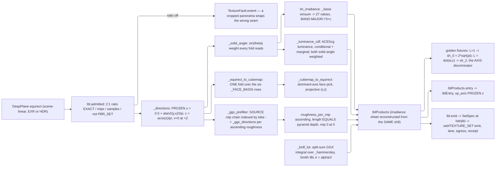

# [PY_ARTIFACTS_GRAPHIC_TEXTURE_IBL]

`ibl` owns the ENVIRONMENT half of the texture sub-domain: the projection pair that moves a radiance field between an equirectangular sheet and a cube, the spherical-harmonic irradiance projection, the GGX specular prefilter pyramid, the split-sum BRDF lookup table, and the luminance CDF an importance sampler reads. Its products are the five files an `hdri` or `ibl` manifest names, and it composes `set#TEXTURE_SET` for the emit, the lane, the egress, and the receipt — python IBL and HDRI products ride the PYTHON manifest entry, never the C# document's kind list.

Three constants are FROZEN and this page transcribes rather than decides them. Up axis stays `+Z`, matching the OpenPBR local frame — a Y-up runtime remaps the DIRECTION BASIS at the read and never reorders the wire bands. Equirect mapping runs `u = 0.5 + atan2(d.y, d.x) / 2π` and `v = acos(clamp(d.z, -1, 1)) / π` with `v = 0` at `+Z` and `u` increasing counter-clockwise viewed from `+Z`. SH9 spells one basis, one normalization, one band order, and one golden fixture — three implementations transcribe it, so a band permutation or a convention swap silently relights every surface and only the fixture catches it. `plane#PLANE` supplies the carrier and the codecs, `derive#DERIVE` the resampler, `ingest#INGEST` nothing at all — an environment product carries no channel role.

## [01]-[INDEX]

- [02]-[IBL]: `IblOp` closes the operation family over the equirect and cubemap projection pair, the GGX prefilter and BRDF-LUT kernels, the luminance CDF, and the `IblProducts` assembly composing the set emit.
- [03]-[HARMONICS]: SH9 freezes its basis, band order, normalization, layout, and golden fixture, carrying the irradiance projection and reconstruction every implementation agrees on.

## [02]-[IBL]

- Owner: `IblOp` is the closed family, `ibl_derived` its ONE total dispatch, and `IblProducts` the assembled result. `Ibl` composes `set#TEXTURE_SET` — it builds a `SetSpec` at `SetKind.HDRI` or `SetKind.IBL` whose maps are the environment products and hands it the caller's lane, so the crossing, the elision, the egress grammar, and the receipt are the producer's and this page adds no second rail.
- Law: the FAMILY IS THE ENTRYPOINT. `ibl_derived` is what `Ibl.products` composes, so every case is reachable capability — a declared family with no dispatcher is a vocabulary nothing reads, and the projection pair beneath it then has no caller at all: two kernels the page describes in full and never runs. Each case's own admission rides its own arm, so an out-of-band edge, mip, or sample count refuses at the dispatch rather than raising inside a kernel it never reached.
- Cases: `equirect_to_cubemap` and `cubemap_to_equirect` are the projection inverses, `sh_irradiance` the diffuse projection, `ggx_prefilter` the specular pyramid, `brdf_lut` the split-sum table, and `luminance_cdf` the importance-sampling distribution. Every inverse is one more case on the SAME family, never a sibling entrypoint pair.
- Law: every equirect plane admits at 2:1 extent EXACTLY. Sheets at another ratio are a cropped panorama or a cube cross, and sampling it under the frozen mapping wraps the wrong seam — the ratio check is the one thing that catches it before the light is silently rotated.
- Law: `layers` is the shape a cube takes, never a second record. Cubemaps run six layers under the layer law, face order `+X`, `-X`, `+Y`, `-Y`, `+Z`, `-Z`, with the layer index riding the `<variant>` slot as a two-digit infix. Per-face record families, six-field structs, and horizontal-cross sheets are the three forms this refuses.
- Law: the prefilter pyramid's roughness ladder is `roughness_per_mip`, ascending, with mip 0 at roughness 0, and its length EQUALS the pyramid depth. Consumers interpolate between adjacent mips by roughness, so a non-monotonic or short ladder produces a specular response that jumps at a level boundary.
- Law: GGX importance sampling uses the HAMMERSLEY sequence, not a pseudo-random draw. Low-discrepancy points fall as a pure function of the sample index, so the prefiltered pyramid is byte-reproducible across hosts and its content key means something; a seeded RNG reproduces only where the same generator ships.
- Law: the prefilter reads the SOURCE PYRAMID, the level rising with the lobe. Rough GGX lobes spread their taps over a solid angle orders of magnitude wider than one source texel, so gathering every tap from the full-resolution sheet under-samples that lobe and each bright texel inside it survives as a firefly the consumer then blames on the capture. `derive#DERIVE` `mip_chain` builds the chain once at `KAISER` and every level indexes it; the tap count is unchanged.
- Law: `intensity` is a multiplier applied ON READ and never baked into the planes. Baking it forks the content key from the radiance field, so two scenes differing only in exposure store two full pyramids.
- Law: the IRRADIANCE SHEET is a produced plane, not a spare receipt band. `[09]` names an `irradiance` leaf and the roster carries its law row, so a consumer with no SH evaluator reads the diffuse dome as a plane rather than reconstructing nine coefficients it cannot evaluate — a declared product no producer writes is the phantom the roster's own `<product>` slot exposes. It reconstructs at a band-limited extent because a degree-two field is smooth and source resolution stores nothing the coefficients lack.
- Law: the BRDF LUT is scene-INDEPENDENT — a function of `NdotV` and roughness alone, so one table serves every environment and its digest is a constant of the split-sum approximation, not of the capture. It is the SAME GGX integral the prefilter runs over the SAME `_hammersley` sequence, split by the Schlick `(1 - v·h)^5` term into a scale and a bias on `F0`, under the Smith IBL remap `k = α/2`; the direct-light remap `k = (α + 1)² / 8` darkens every grazing-angle reflection by a fixed factor, and a table interpolating `NdotV` against roughness with no integral at all is a smooth surface that looks plausible and reflects nothing correctly.
- Law: the guide is LUMINANCE under the `[03.1]` ACEScg primaries, never a channel mean — an equal-weight fold reads a saturated blue sky as brighter than its own luminance and steers the sampler at it, which is exactly the noise an importance sampler exists to remove. Each CDF pairs a MARGINAL row distribution over `v` with a CONDITIONAL column distribution per row, both weighted by `sin(theta)` — the solid angle an equirect row subtends shrinks toward the poles, and a CDF built on raw luminance oversamples the poles by exactly that factor.
- Entry: `Ibl.products` computes every product in ONE pass over ONE source and `Ibl.emit` hands them to `set#TEXTURE_SET` as `encoded` maps. That emit is RAILED where a source-bytes producer's is not, because the products exist before the plan does and an absent EXR core has no node to fault on. Arity is a value property of the requested product set: an `hdri` kind publishes the equirect, its harmonics, and the reconstructed irradiance sheet, and an `ibl` kind adds the prefilter pyramid, the BRDF table, and the importance-sampling guide — the three a diffuse-only consumer never reads and never pays for, so a kind that computes them all and publishes some is work the caller was billed for and never received.
- Auto: admission proves the 2:1 ratio, the face count on a cubemap source, positive mip and sample counts, and a monotonic roughness ladder before any projection runs.
- Receipt: the products fold into `ArtifactReceipt.Texture` at `kind` `hdri` or `ibl` through the producer's own projection, the `map` band carrying the twenty-seven SH coefficients as `sh_<band>_<channel>` scalars beside the per-product digests. Band values stay one native scalar, so the RGB triple at a band spells three entries; the WIRE carries the flat twenty-seven-value list under the frozen band-major layout, and the two spellings are one number set.
- Packages: `numpy` every kernel — `arctan2`/`arccos` the mapping, `einsum` the basis contraction, `cumsum` the CDF, `searchsorted` its inverse; `plane#PLANE` the carrier and the `EXR`/`HDR`/`KTX2` rows; `derive#DERIVE` the resampler and the mip chain; `set#TEXTURE_SET` the emit, the lane, the egress, and the manifest.
- Growth: a new environment product is one `ingest#INGEST` `IblProduct` row with its `_PRODUCT_LAW` entry, one `IblOp` case, one `ibl_derived` arm, one kernel, and one `IblEntry` field — `slot_law`, `_ROSTER`, and the egress grammar all pick it up with no edit at the producer; a new sky model is a C#-side data asset this page never synthesizes.
- Boundary: procedural sky authoring, the fitted Hosek-Wilkie coefficient asset, and the environment-light row a path tracer consumes are the C# side's — this page ingests a captured or supplied radiance field and prefilters it. Tone mapping, display rendering, and view transforms stay `graphic/color/managed#MANAGED`'s and `opencolorio`'s.

```python signature
# --- [RUNTIME_PRELUDE] ------------------------------------------------------------------
from collections.abc import Iterable
from enum import StrEnum
from typing import Final, Literal, assert_never

import numpy as np
from builtins import frozendict
from expression import Error, Ok, Result, case, tag, tagged_union
from expression.collections import Block
from msgspec import Struct

from rasm.runtime.lanes import LanePolicy
from rasm.runtime.transport.shapes import IblEntry

from rasm.artifacts.core.plan import ArtifactWork
from rasm.artifacts.graphic.texture.derive import DeriveOp, ResampleKernel, derived
from rasm.artifacts.graphic.texture.ingest import IblProduct, MapSlot
from rasm.artifacts.graphic.texture.plane import AlphaMode, DeepFormat, DeepPlane, EncodePolicy, Extent, MipPolicy, Plane, PlaneDepth, PlaneSpace, TextureFault, encode
from rasm.artifacts.graphic.texture.set import MapSource, MapSpec, SetKind, SetSpec, TextureSet, leaf

# --- [TYPES] ----------------------------------------------------------------------------

type IblOpTag = Literal["equirect_to_cubemap", "cubemap_to_equirect", "sh_irradiance", "ggx_prefilter", "brdf_lut", "luminance_cdf"]


class CubeFace(StrEnum):
    # FROZEN layer order a cubemap occupies; the layer index rides the `<variant>` slot as a two-digit infix
    POS_X = "px"
    NEG_X = "nx"
    POS_Y = "py"
    NEG_Y = "ny"
    POS_Z = "pz"
    NEG_Z = "nz"


# --- [CONSTANTS] ------------------------------------------------------------------------

_UP_AXIS: Final[str] = "z"  # FROZEN; a Y-up runtime remaps the DIRECTION BASIS at the read and never rewrites the wire
_EQUIRECT_RATIO: Final[float] = 2.0
_CUBE_FACES: Final[tuple[CubeFace, ...]] = tuple(CubeFace)
_FACE_BASIS: Final[frozendict[CubeFace, tuple[tuple[float, float, float], ...]]] = frozendict({
    # (right, up, forward) per face in the +Z-up world basis; a face direction is `forward + s * right + t * up`
    # with s and t in [-1, 1], so ONE parameterized fold covers all six and no face carries its own kernel.
    CubeFace.POS_X: ((0.0, 1.0, 0.0), (0.0, 0.0, 1.0), (1.0, 0.0, 0.0)),
    CubeFace.NEG_X: ((0.0, -1.0, 0.0), (0.0, 0.0, 1.0), (-1.0, 0.0, 0.0)),
    CubeFace.POS_Y: ((-1.0, 0.0, 0.0), (0.0, 0.0, 1.0), (0.0, 1.0, 0.0)),
    CubeFace.NEG_Y: ((1.0, 0.0, 0.0), (0.0, 0.0, 1.0), (0.0, -1.0, 0.0)),
    CubeFace.POS_Z: ((0.0, 1.0, 0.0), (-1.0, 0.0, 0.0), (0.0, 0.0, 1.0)),
    CubeFace.NEG_Z: ((0.0, 1.0, 0.0), (1.0, 0.0, 0.0), (0.0, 0.0, -1.0)),
})
_IRRADIANCE_EXTENT: Final[Extent] = (64, 32)  # a degree-two field is smooth; source resolution stores nothing the nine coefficients lack
_BRDF_EXTENT: Final[Extent] = (256, 256)  # NdotV across x, roughness across y; scene-independent, so one table serves every capture
_PREFILTER_SAMPLES: Final[int] = 1024
_LUMINANCE: Final[np.ndarray] = np.array([0.2722287, 0.6740818, 0.0536895], dtype=np.float32)  # ACEScg Y row; the `[03.1]` linear primaries
_EXR_POLICY: Final[EncodePolicy] = EncodePolicy(exr=("zip", 45.0))  # LOSSLESS: an environment product is a solver input, never a preview


# --- [MODELS] ---------------------------------------------------------------------------


@tagged_union(frozen=True)
class IblOp:
    tag: IblOpTag = tag()
    equirect_to_cubemap: tuple[int, ResampleKernel] = case()  # face edge in texels, reconstruction filter
    cubemap_to_equirect: tuple[Extent, ResampleKernel] = case()
    sh_irradiance: None = case()
    ggx_prefilter: tuple[int, int, int] = case()  # base face or width, mip count, sample count
    brdf_lut: Extent = case()
    luminance_cdf: None = case()


class IblProducts(Struct, frozen=True):
    equirect: DeepPlane
    irradiance: DeepPlane | None = None  # the SH dome reconstructed as a plane; the `[09]` `irradiance` leaf
    sh9: tuple[float, ...] = ()  # EXACTLY 27 values, band-major with RGB interleaved; a length other than 27 refuses at admit
    specular: tuple[DeepPlane, ...] = ()
    roughness_per_mip: tuple[float, ...] = ()
    brdf_lut: DeepPlane | None = None
    luminance_cdf: DeepPlane | None = None
    intensity: float = 1.0  # applied ON READ; baking it forks the content key from the radiance field
    rotation: float = 0.0  # about +Z, in [0, 2pi)

    def entry(self, digests: frozendict[IblProduct, str], /) -> IblEntry:
        return IblEntry(
            sh9=list(self.sh9),
            equirect_file=leaf(IblProduct.EQUIRECT.value, DeepFormat.EXR),
            equirect_digest=digests[IblProduct.EQUIRECT],
            specular_files=[leaf(IblProduct.SPECULAR.value, DeepFormat.EXR, variant=index) for index in range(len(self.specular))],
            roughness_per_mip=list(self.roughness_per_mip),
            brdf_lut_file=leaf(IblProduct.BRDF_LUT.value, DeepFormat.EXR) if self.brdf_lut is not None else "",
            brdf_lut_digest=digests.get(IblProduct.BRDF_LUT, ""),
            luminance_cdf_file=leaf(IblProduct.LUMINANCE_CDF.value, DeepFormat.EXR) if self.luminance_cdf is not None else "",
            intensity=self.intensity,
            up_axis=_UP_AXIS,  # FROZEN `z`; a `y` value is a decode refusal at every reader
        )


class Ibl(Struct, frozen=True):
    source: DeepPlane
    lane: LanePolicy  # the caller-threaded offload seam the producer requires — declared BEFORE the defaulted kind, because msgspec raises TypeError at class creation for a required field after a defaulted one
    kind: SetKind = SetKind.IBL
    mips: int = 6
    samples: int = _PREFILTER_SAMPLES
    intensity: float = 1.0
    rotation: float = 0.0

    def admitted(self, /) -> Result["Ibl", TextureFault]:
        width, height = self.source.extent
        match (width / height, self.mips, self.samples, self.kind):
            case (ratio, _, _, _) if abs(ratio - _EQUIRECT_RATIO) > 1e-6:
                # a sheet at another ratio is a cropped panorama or a cube cross; sampled under the frozen mapping
                # it wraps the wrong seam and silently rotates the whole light rig
                return Error(TextureFault(extent=(width, height)))
            case (_, mips, _, _) if mips < 1:
                return Error(TextureFault(shape=(mips,)))
            case (_, _, samples, _) if samples < 1:
                return Error(TextureFault(shape=(samples,)))
            case (_, _, _, SetKind.PBR_SET):
                # an environment source is not a baked PBR set and the fault says so; a `(EXR, PQ)` payload names a
                # container and a transfer neither of which the caller supplied and neither of which is the cause
                return Error(TextureFault(role=f"<ibl-kind:{SetKind.PBR_SET.value}>"))
            case _:
                return Ok(self)

    def emit(self, /) -> Result[Iterable[ArtifactWork], TextureFault]:
        # composes the producer: the environment products become the maps of a SetSpec at `hdri` or `ibl`, so the
        # crossing, the keyed elision, the egress grammar, the manifest, and the receipt are all `set#TEXTURE_SET`'s.
        # This emit is RAILED where a source-bytes producer's is not: the products are computed and encoded BEFORE
        # its plan exists, so an absent EXR core is a fault with no node to carry it.
        return self.admitted().bind(lambda ready: ready._spec()).map(lambda spec: TextureSet(spec=spec, lane=self.lane).emit())

    def _spec(self, /) -> Result[SetSpec, TextureFault]:
        # every product is computed HERE in one pass over one source and handed to the producer as `encoded` bytes:
        # a `payload` source would make the worker decode and re-encode a plane this page already settled, which
        # re-quantizes a lossy row and re-keys it. The specular pyramid ships as per-level FILES under the mip
        # variant infix, because no EXR write survives a mip- or rip-tiled part.
        products = self.products()
        planes: tuple[tuple[MapSlot, DeepPlane, int], ...] = (
            (IblProduct.EQUIRECT, products.equirect, 0),
            *(((IblProduct.IRRADIANCE, products.irradiance, 0),) if products.irradiance is not None else ()),
            *((IblProduct.SPECULAR, level, index) for index, level in enumerate(products.specular)),
            *(((IblProduct.BRDF_LUT, products.brdf_lut, 0),) if products.brdf_lut is not None else ()),
            *(((IblProduct.LUMINANCE_CDF, products.luminance_cdf, 0),) if products.luminance_cdf is not None else ()),
        )
        return Block.of_seq(planes).fold(
            lambda railed, item: railed.bind(
                lambda built: encode(item[1], DeepFormat.EXR, _EXR_POLICY).map(
                    lambda payload: {
                        **built,
                        item[0]: MapSpec(
                            source=MapSource(encoded=(payload, DeepFormat.EXR)),
                            format=DeepFormat.EXR,
                            depth=PlaneDepth.F16 if item[0] is IblProduct.SPECULAR else PlaneDepth.F32,
                            mips=MipPolicy.NONE,
                        ),
                    }
                )
            ),
            Ok({}),
        ).map(
            lambda maps: SetSpec(
                kind=self.kind, extent=self.source.extent, maps=frozendict(maps), alpha=AlphaMode.NONE, license_class="permissive"
            )
        )

    def products(self, /) -> IblProducts:
        # ONE pass over ONE source: the direction grid, the solid-angle weight, and the source mip chain are built
        # once and every product reads them, so an irradiance-only request and a full IBL differ in taps, not in
        # setup. An `hdri` kind publishes the equirect, its harmonics, and the reconstructed irradiance sheet; an
        # `ibl` kind adds the prefilter pyramid, the split-sum table, and the importance-sampling guide — the three
        # products a diffuse-only consumer never reads and never pays for.
        full = self.kind is SetKind.IBL
        specular, ladder = _ggx_prefilter(self.source.base, self.mips, self.samples) if full else ((), ())
        sh9 = sh_irradiance(self.source.base)
        return IblProducts(
            equirect=self.source,
            sh9=sh9,
            # Irradiance sheets are a real product, not a spare band: `[09]` names an `irradiance` leaf and the
            # roster carries its law row, so a consumer with no SH evaluator reads the diffuse dome as a plane.
            # Its extent is the harmonics' own band limit — a degree-two field is smooth, and storing it at source
            # resolution stores nothing the nine coefficients did not already carry.
            irradiance=DeepPlane(
                levels=(sh_reconstructed(sh9, _directions(*_IRRADIANCE_EXTENT)),),  # E(n) itself — the consumer applies albedo/pi per the reconstruction law, and dividing here double-pays it
                depth=PlaneDepth.F16,
                space=PlaneSpace.LINEAR,
            ),
            specular=tuple(DeepPlane(levels=(level,), depth=PlaneDepth.F16, space=PlaneSpace.LINEAR) for level in specular),
            roughness_per_mip=ladder,
            brdf_lut=DeepPlane(levels=(_brdf_lut(_BRDF_EXTENT, self.samples),), depth=PlaneDepth.F32, space=PlaneSpace.RAW) if full else None,
            luminance_cdf=DeepPlane(levels=(_luminance_cdf(self.source.base),), depth=PlaneDepth.F32, space=PlaneSpace.RAW) if full else None,
            intensity=self.intensity,
            rotation=self.rotation,
        )
```

```python signature
# --- [OPERATIONS] -----------------------------------------------------------------------


def _directions(width: int, height: int, /) -> Plane:
    # FROZEN equirect mapping, read backward: texel centers to unit directions in the +Z-up world basis.
    # `u = 0.5 + atan2(y, x) / 2pi` and `v = acos(clamp(z, -1, 1)) / pi` with v = 0 at +Z; u increases
    # counter-clockwise viewed from +Z, so a sampler and this generator agree by construction.
    v = (np.arange(height, dtype=np.float32) + 0.5) / height
    u = (np.arange(width, dtype=np.float32) + 0.5) / width
    theta = (v * np.pi)[:, None]
    phi = ((u - 0.5) * 2.0 * np.pi)[None, :]
    sin_theta = np.sin(theta)
    return np.stack(
        [np.broadcast_to(sin_theta * np.cos(phi), (height, width)), np.broadcast_to(sin_theta * np.sin(phi), (height, width)),
         np.broadcast_to(np.cos(theta), (height, width))],
        axis=2,
    ).astype(np.float32)


def _uv(direction: Plane, /) -> tuple[Plane, Plane]:
    # Same mapping forward; both directions are ONE law, so a projection and its inverse cannot drift
    return (
        (0.5 + np.arctan2(direction[..., 1], direction[..., 0]) / (2.0 * np.pi)).astype(np.float32),
        (np.arccos(np.clip(direction[..., 2], -1.0, 1.0)) / np.pi).astype(np.float32),
    )


def _solid_angle(width: int, height: int, /) -> Plane:
    # Per-texel solid angle every projection, SH fold, and CDF weights by: an equirect row's angular width
    # shrinks toward the poles as sin(theta), and a fold that skips it over-weights the poles by exactly that factor
    theta = ((np.arange(height, dtype=np.float32) + 0.5) / height * np.pi)[:, None]
    return np.broadcast_to((np.pi / height) * (2.0 * np.pi / width) * np.sin(theta), (height, width))[..., None].astype(np.float32)


def _sampled(equirect: Plane, direction: Plane, /) -> Plane:
    # bilinear equirect lookup with a WRAPPING u and a CLAMPED v — u is periodic and v is not, so one edge mode
    # across both axes seams the sheet at the prime meridian or folds the poles onto each other.
    height, width, _ = equirect.shape
    u, v = _uv(direction)
    x, y = u * width - 0.5, v * height - 0.5
    x0, y0 = np.floor(x).astype(np.int64), np.clip(np.floor(y), 0, height - 1).astype(np.int64)
    fx, fy = (x - x0)[..., None], (y - y0)[..., None]
    xi = (x0 % width, (x0 + 1) % width)
    yi = (y0, np.clip(y0 + 1, 0, height - 1))
    return (
        equirect[yi[0][..., None], xi[0][..., None], :][..., 0, :] * (1 - fx) * (1 - fy)
        + equirect[yi[0][..., None], xi[1][..., None], :][..., 0, :] * fx * (1 - fy)
        + equirect[yi[1][..., None], xi[0][..., None], :][..., 0, :] * (1 - fx) * fy
        + equirect[yi[1][..., None], xi[1][..., None], :][..., 0, :] * fx * fy
    ).astype(np.float32)


def _face_directions(face: CubeFace, edge: int, /) -> Plane:
    right, up, forward = (np.array(axis, dtype=np.float32) for axis in _FACE_BASIS[face])
    s = ((np.arange(edge, dtype=np.float32) + 0.5) / edge * 2.0 - 1.0)[None, :, None]
    t = ((np.arange(edge, dtype=np.float32) + 0.5) / edge * 2.0 - 1.0)[:, None, None]
    vector = forward[None, None, :] + s * right[None, None, :] + t * up[None, None, :]
    return (vector / np.linalg.norm(vector, axis=2, keepdims=True)).astype(np.float32)


def _equirect_to_cubemap(equirect: Plane, edge: int, /) -> tuple[Plane, ...]:
    # ONE parameterized fold over the six `_FACE_BASIS` rows; a per-face kernel is the enumerated form this refuses
    return tuple(_sampled(equirect, _face_directions(face, edge)) for face in _CUBE_FACES)


def _cubemap_to_equirect(faces: tuple[Plane, ...], extent: Extent, /) -> Plane:
    # Inverse leg: each equirect texel's direction picks its face by the dominant axis and its (s, t) by the
    # remaining pair divided by that axis magnitude — the cube's own projective parameterization, not a search.
    width, height = extent
    direction = _directions(width, height)
    dominant = np.argmax(np.abs(direction), axis=2)
    sign = np.take_along_axis(direction, dominant[..., None], axis=2)[..., 0] >= 0.0
    face_index = (dominant * 2 + (~sign).astype(np.int64)).astype(np.int64)
    sampled = np.zeros((height, width, faces[0].shape[2]), dtype=np.float32)
    for index, face in enumerate(faces):
        mask = face_index == index
        right, up, forward = (np.array(axis, dtype=np.float32) for axis in _FACE_BASIS[_CUBE_FACES[index]])
        depth = np.abs(direction @ forward)
        s = np.clip((direction @ right) / np.maximum(depth, 1e-9) * 0.5 + 0.5, 0.0, 1.0)
        t = np.clip((direction @ up) / np.maximum(depth, 1e-9) * 0.5 + 0.5, 0.0, 1.0)
        edge = face.shape[0]
        sampled[mask] = face[np.clip((t[mask] * edge).astype(np.int64), 0, edge - 1), np.clip((s[mask] * edge).astype(np.int64), 0, edge - 1), :]
    return sampled


def ibl_derived(source: DeepPlane, op: IblOp, /) -> Result[tuple[DeepPlane, ...], TextureFault]:
    # Dispatches TOTALLY over the closed family, mirroring `derive#DERIVE` `derived`: a declared family with no
    # dispatcher is a vocabulary nothing reads, and its projection pair then has no caller at all — `Ibl.products`
    # composes THIS, so `equirect_to_cubemap` and `cubemap_to_equirect` are reachable capability rather than two
    # kernels the page describes and never runs. The admission each case needs rides its own arm, so an operand
    # whose extent or face count the op cannot take rails here and never inside a kernel.
    match op:
        case IblOp(tag="equirect_to_cubemap", equirect_to_cubemap=(edge, _kernel)) if edge >= 1:
            return _leveled(_equirect_to_cubemap(source.base, edge), PlaneDepth.F32, PlaneSpace.LINEAR)
        case IblOp(tag="cubemap_to_equirect", cubemap_to_equirect=(extent, _kernel)) if source.channels >= 1 and len(source.levels) == len(_CUBE_FACES):
            return _leveled((_cubemap_to_equirect(source.levels, extent),), PlaneDepth.F32, PlaneSpace.LINEAR)
        case IblOp(tag="sh_irradiance"):
            return _leveled(
                (sh_reconstructed(sh_irradiance(source.base), _directions(*_IRRADIANCE_EXTENT)) / np.float32(np.pi),), PlaneDepth.F16, PlaneSpace.LINEAR
            )
        case IblOp(tag="ggx_prefilter", ggx_prefilter=(_edge, mips, samples)) if min(mips, samples) >= 1:
            return _leveled(_ggx_prefilter(source.base, mips, samples)[0], PlaneDepth.F16, PlaneSpace.LINEAR)
        case IblOp(tag="brdf_lut", brdf_lut=extent) if min(extent) >= 1:
            return _leveled((_brdf_lut(extent, _PREFILTER_SAMPLES),), PlaneDepth.F32, PlaneSpace.RAW)
        case IblOp(tag="luminance_cdf"):
            return _leveled((_luminance_cdf(source.base),), PlaneDepth.F32, PlaneSpace.RAW)
        case IblOp():
            # every guarded arm above falls here when its own payload is out of band, so an unusable edge, mip, or
            # sample count is one refusal naming the op rather than a raise inside the kernel it never reached
            return Error(TextureFault(shape=(0,)))
        case _ as unreachable:
            assert_never(unreachable)


def _leveled(planes: tuple[Plane, ...], depth: PlaneDepth, space: PlaneSpace, /) -> Result[tuple[DeepPlane, ...], TextureFault]:
    # each product is its OWN single-level carrier, never a pyramid: the cube's six faces and the prefilter's
    # roughness ladder are sibling planes at declared extents, and the halving chain a level tuple asserts is a
    # relation neither of them holds.
    return Block.of_seq(planes).fold(
        lambda railed, plane: railed.bind(lambda built: DeepPlane.of((plane,), depth, space).map(lambda one: (*built, one))), Ok(())
    )


def _hammersley(count: int, /) -> tuple[np.ndarray, np.ndarray]:
    # Low-discrepancy sequences fall as a PURE function of the sample index, so the prefiltered pyramid is
    # byte-reproducible across hosts and its content key means something; a seeded RNG reproduces only where
    # that same generator ships. Second coordinate carries the radical inverse in base 2.
    index = np.arange(count, dtype=np.uint32)
    bits = index.copy()
    # Van der Corput pairing: the 16-bit half swap first, then each shift with ITS OWN mask — (1, 0x5555...),
    # (2, 0x3333...), (4, 0x0F0F...), (8, 0x00FF...) — a transposed pairing is not the radical inverse and the
    # prefilter integrates a clumped point set that sparkles at the tap budget.
    bits = ((bits << 16) | (bits >> 16)) & 0xFFFFFFFF
    for shift, mask in ((1, 0x55555555), (2, 0x33333333), (4, 0x0F0F0F0F), (8, 0x00FF00FF)):
        bits = ((bits & np.uint32(mask)) << np.uint32(shift)) | ((bits & np.uint32(~mask & 0xFFFFFFFF)) >> np.uint32(shift))
    return ((index.astype(np.float32) / count), (bits.astype(np.float64) * 2.3283064365386963e-10).astype(np.float32))


def _ggx_directions(alpha: float, count: int, /) -> np.ndarray:
    # GGX/Trowbridge-Reitz importance sampling in the LOCAL frame; the half-vector distribution is inverted
    # analytically, so no rejection loop and no per-sample branch exists.
    xi_a, xi_b = _hammersley(count)
    phi = 2.0 * np.pi * xi_a
    cos_theta = np.sqrt((1.0 - xi_b) / (1.0 + (alpha * alpha - 1.0) * xi_b))
    sin_theta = np.sqrt(np.maximum(0.0, 1.0 - cos_theta * cos_theta))
    return np.stack([sin_theta * np.cos(phi), sin_theta * np.sin(phi), cos_theta], axis=1).astype(np.float32)


def _convolved(equirect: Plane, normals: Plane, taps: np.ndarray, /) -> Plane:
    # Local GGX half-vector sets rotate into each texel's own frame through a branch-free basis: the helper
    # axis is +X unless the normal is nearly +X, where +Z takes over — a fixed helper degenerates exactly at the
    # pole the frame is built for. Weighting by NdotL and dropping the back hemisphere is the split-sum's own
    # approximation, and the weight sum normalizes so a uniform field prefilters to itself at every roughness.
    helper = np.where(np.abs(normals[..., 0:1]) > 0.9, np.array([0.0, 0.0, 1.0], np.float32), np.array([1.0, 0.0, 0.0], np.float32))
    tangent = np.cross(helper, normals)
    tangent = tangent / np.maximum(np.linalg.norm(tangent, axis=2, keepdims=True), 1e-12)
    bitangent = np.cross(normals, tangent)
    total = np.zeros_like(normals)
    weight = np.zeros(normals.shape[:2] + (1,), dtype=np.float32)
    for tap in taps:
        half = (tangent * tap[0] + bitangent * tap[1] + normals * tap[2]).astype(np.float32)
        light = (2.0 * np.sum(normals * half, axis=2, keepdims=True) * half - normals).astype(np.float32)
        n_dot_l = np.clip(np.sum(normals * light, axis=2, keepdims=True), 0.0, 1.0)
        total += _sampled(equirect, light) * n_dot_l
        weight += n_dot_l
    return (total / np.maximum(weight, 1e-12)).astype(np.float32)


def _ggx_prefilter(equirect: Plane, mips: int, samples: int, /) -> tuple[tuple[Plane, ...], tuple[float, ...]]:
    # Roughness ladders run ASCENDING with mip 0 at roughness 0 and length EQUAL to the pyramid depth: a
    # consumer interpolates between adjacent levels by roughness, so a short or non-monotonic ladder jumps at a
    # level boundary. Each level reads the SOURCE PYRAMID and not level 0: a rough lobe spreads its taps over a
    # solid angle far wider than one source texel, so gathering from the full-resolution sheet under-samples that
    # lobe by orders of magnitude and every bright texel inside it survives as a firefly the consumer then blames
    # on the capture. `derive#DERIVE` `mip_chain` builds the chain once, and the level rises with the lobe.
    roughness = tuple(float(index) / max(1, mips - 1) for index in range(mips))
    width, height = int(equirect.shape[1]), int(equirect.shape[0])
    chain = derived((DeepPlane(levels=(equirect,), depth=PlaneDepth.F32, space=PlaneSpace.LINEAR),), DeriveOp.MipChain(MipPolicy.KAISER, mips))
    source = chain.map(lambda built: built.levels).default_value((equirect,))
    levels = tuple(
        _convolved(source[min(index, len(source) - 1)], _directions(max(1, width >> index), max(1, height >> index)), _ggx_directions(max(value * value, 1e-4), samples))
        for index, value in enumerate(roughness)
    )
    return (levels, roughness)


def _brdf_lut(extent: Extent, samples: int, /) -> Plane:
    # SCENE-INDEPENDENT: a function of NdotV and roughness alone, so one table serves every capture and its digest
    # is a constant of the split-sum approximation. The two components are the SCALE and the BIAS on F0, and they
    # are the same GGX integral the prefilter runs — `∫ f(l,v)/F · (n·l) dl` split by the Schlick `(1-v·h)^5`
    # term — over the SAME `_hammersley` sequence, so the table and the pyramid agree by construction and the
    # table stays byte-reproducible. The Smith geometry term takes the IBL `k = α/2` remap, not the direct-light
    # `k = (α+1)²/8`; the direct remap here darkens every grazing-angle reflection by a fixed factor.
    width, height = extent
    n_dot_v = ((np.arange(width, dtype=np.float32) + 0.5) / width)[None, :, None]
    roughness = ((np.arange(height, dtype=np.float32) + 0.5) / height)[:, None, None]
    view = np.concatenate([np.sqrt(np.maximum(0.0, 1.0 - n_dot_v * n_dot_v)), np.zeros_like(n_dot_v), n_dot_v], axis=2).astype(np.float32)
    alpha = np.maximum(roughness * roughness, 1e-4)
    scale, bias = np.zeros((height, width), np.float32), np.zeros((height, width), np.float32)
    xi_a, xi_b = _hammersley(samples)
    for index in range(samples):
        # Half-vectors draw per (roughness, NdotV) cell because alpha varies down the table; the local
        # frame is the identity, so the tangent-space draw needs no rotation and the whole sweep stays vectorized
        phi = 2.0 * np.pi * float(xi_a[index])
        cos_h = np.sqrt((1.0 - float(xi_b[index])) / (1.0 + (alpha * alpha - 1.0) * float(xi_b[index])))
        sin_h = np.sqrt(np.maximum(0.0, 1.0 - cos_h * cos_h))
        half = np.concatenate([sin_h * np.cos(phi), sin_h * np.sin(phi), cos_h], axis=2).astype(np.float32)
        v_dot_h = np.sum(view * half, axis=2, keepdims=True)
        light = (2.0 * v_dot_h * half - view).astype(np.float32)
        n_dot_l, n_dot_h = np.clip(light[..., 2:3], 0.0, 1.0), np.clip(half[..., 2:3], 0.0, 1.0)
        k = alpha * 0.5
        visibility = (n_dot_l / np.maximum(n_dot_l * (1.0 - k) + k, 1e-9)) * (n_dot_v / np.maximum(n_dot_v * (1.0 - k) + k, 1e-9))
        weight = np.where(n_dot_l > 0.0, visibility * np.clip(v_dot_h, 0.0, 1.0) / np.maximum(n_dot_h * n_dot_v, 1e-9), 0.0)
        fresnel = np.power(1.0 - np.clip(v_dot_h, 0.0, 1.0), 5.0)
        scale += ((1.0 - fresnel) * weight)[..., 0]
        bias += (fresnel * weight)[..., 0]
    return np.stack([scale / samples, bias / samples], axis=2).astype(np.float32)


def _luminance_cdf(equirect: Plane, /) -> Plane:
    # a MARGINAL row distribution over v plus a CONDITIONAL column distribution per row, both weighted by the
    # per-texel solid angle: an equirect row's angular width shrinks as sin(theta), and a CDF over raw luminance
    # oversamples the poles by exactly that factor. Two components: conditional in R, marginal broadcast in G.
    # Guide reads LUMINANCE, not a channel mean: an equal-weight fold reads a saturated blue sky as brighter than
    # its own luminance and steers the sampler at it, which is the noise an importance sampler exists to remove.
    weighted = ((equirect[..., :3] * _LUMINANCE).sum(axis=2, keepdims=True) * _solid_angle(equirect.shape[1], equirect.shape[0]))[..., 0]
    conditional = np.cumsum(weighted, axis=1)
    row_total = np.maximum(conditional[:, -1:], 1e-12)
    marginal = np.cumsum(row_total[:, 0])
    return np.stack([
        (conditional / row_total).astype(np.float32),
        np.broadcast_to((marginal / max(float(marginal[-1]), 1e-12))[:, None], weighted.shape).astype(np.float32),
    ], axis=2)
```

## [03]-[HARMONICS]

- Owner: the SH9 spelling is FROZEN here and three implementations transcribe it — this page, the C# prefilter, and the three.js `SphericalHarmonics3` landing. Band permutations, normalization changes, and up-axis swaps silently relight every surface and produces no error anywhere; the golden fixture is what catches it.
- Law: the basis is REAL ORTHONORMAL spherical harmonics through `l = 2` in a right-handed `+Z`-up world basis matching the OpenPBR local frame. Projection runs `L_i = ∫ L(ω) Y_i(ω) dω` and irradiance reconstruction `E(n) = Σ Â_l(i) · L_i · Y_i(n)` with `Â_0 = π`, `Â_1 = 2π/3`, `Â_2 = π/4`; Lambertian outgoing radiance is `albedo · E(n) / π`.
- Law: the LAYOUT is band-major with RGB interleaved — index `i * 3 + c` holds band `i` channel `c` — and the length is EXACTLY twenty-seven. Channel-major layouts are the decode fork this freeze forecloses, and any other length refuses at admit.
- Law: TWO golden vectors jointly discriminate band order, normalization, and up axis, at `1e-6` absolute tolerance per coefficient. Uniform field `L(ω) = 1` yields `sh_0 = 3.5449077018110318` (`2√π`) with every other band zero and `E(n) = π` for every `n`; a linear field `L(ω) = ω·ẑ` yields `sh_2 = 2.046653415892977` with every other band zero. Second vector carries the AXIS discriminator: a Y-up implementation places the non-zero at `sh_1` or `sh_3` and fails.
- Law: a Y-up runtime remaps the DIRECTION BASIS at the read; it never reorders the wire bands and never rewrites the wire. That remap proves itself against the second golden vector at the landing, and a landing without that proof is incomplete.
- Law: the projection weights by the per-texel SOLID ANGLE, not by texel count. Equirect rows subtend `sin(theta)` of the sphere, so an unweighted sum over-counts the poles and tilts the reconstructed irradiance toward whatever the zenith happens to hold.
- Auto: the basis constants are a `_SH_BASIS` row table carrying the `(l, m)` pair, the normalization constant, and the direction monomial, so the projection contracts one `einsum` over nine rows and the reconstruction reuses the SAME rows — a projection and a reconstruction spelled apart is the drift the shared table forecloses.
- Output: the twenty-seven values ride the manifest's `sh9` list in the frozen layout, and the receipt band spells them `sh_<band>_<channel>` because a band value is one native scalar. Both spellings carry the same number set in the same order.
- Boundary: no tone map, no exposure, no display transform. Coefficients stay scene-linear radiance and the read-side `intensity` multiplier is the only scale.

```python signature
# --- [CONSTANTS] ------------------------------------------------------------------------


class ShBand(Struct, frozen=True):
    slot: str  # `sh_0`..`sh_8`, the manifest and receipt band spelling
    degree: tuple[int, int]  # (l, m)
    constant: float
    monomial: str  # the direction polynomial in x, y, z the basis evaluates


_SH_BASIS: Final[tuple[ShBand, ...]] = (
    ShBand(slot="sh_0", degree=(0, 0), constant=0.28209479177387814, monomial="1"),
    ShBand(slot="sh_1", degree=(1, -1), constant=0.4886025119029199, monomial="y"),
    ShBand(slot="sh_2", degree=(1, 0), constant=0.4886025119029199, monomial="z"),
    ShBand(slot="sh_3", degree=(1, 1), constant=0.4886025119029199, monomial="x"),
    ShBand(slot="sh_4", degree=(2, -2), constant=1.0925484305920792, monomial="x*y"),
    ShBand(slot="sh_5", degree=(2, -1), constant=1.0925484305920792, monomial="y*z"),
    ShBand(slot="sh_6", degree=(2, 0), constant=0.31539156525252005, monomial="3*z*z - 1"),
    ShBand(slot="sh_7", degree=(2, 1), constant=1.0925484305920792, monomial="x*z"),
    ShBand(slot="sh_8", degree=(2, 2), constant=0.5462742152960396, monomial="x*x - y*y"),
)
_SH_CONVOLUTION: Final[tuple[float, float, float]] = (np.pi, 2.0 * np.pi / 3.0, np.pi / 4.0)  # A-hat per degree l; irradiance, not radiance
_SH_TOLERANCE: Final[float] = 1e-6
_SH_GOLDEN: Final[frozendict[str, tuple[str, float]]] = frozendict({
    # (non-zero slot, its exact value) for the two fixtures; every other band is zero at `_SH_TOLERANCE`
    "uniform": ("sh_0", 3.5449077018110318),  # L = 1; equals 2*sqrt(pi), and E(n) = pi for every n
    "linear_z": ("sh_2", 2.046653415892977),  # L = dot(w, z-hat); the AXIS discriminator a Y-up basis fails
})


# --- [OPERATIONS] -----------------------------------------------------------------------


def _basis(direction: Plane, /) -> np.ndarray:
    # ONE evaluation of the nine rows; the projection contracts it and the reconstruction reuses it, so a
    # projection and a reconstruction spelled apart cannot drift into two conventions.
    x, y, z = direction[..., 0], direction[..., 1], direction[..., 2]
    monomials = (np.ones_like(x), y, z, x, x * y, y * z, 3.0 * z * z - 1.0, x * z, x * x - y * y)
    return np.stack([band.constant * value for band, value in zip(_SH_BASIS, monomials, strict=True)], axis=2).astype(np.float32)


def sh_irradiance(equirect: Plane, /) -> tuple[float, ...]:
    # weighted by the per-texel SOLID ANGLE, never by texel count: an equirect row subtends sin(theta) of the
    # sphere, so an unweighted sum over-counts the poles and tilts the reconstruction toward the zenith.
    height, width, _ = equirect.shape
    basis = _basis(_directions(width, height))
    weight = _solid_angle(width, height)
    coefficients = np.einsum("hwb,hwc->bc", basis * weight, equirect[..., :3], optimize=True)
    # BAND-MAJOR with RGB interleaved: index i*3 + c holds band i channel c. A channel-major flatten is the
    # decode fork the freeze forecloses, and a length other than 27 refuses at admit on both wires.
    return tuple(float(value) for value in coefficients.reshape(-1))


def sh_reconstructed(sh9: tuple[float, ...], direction: Plane, /) -> Plane:
    # E(n) = sum A-hat(l) * L_i * Y_i(n); Lambertian outgoing radiance is albedo * E(n) / pi, applied by the consumer
    coefficients = np.asarray(sh9, dtype=np.float32).reshape(len(_SH_BASIS), 3)
    scale = np.array([_SH_CONVOLUTION[band.degree[0]] for band in _SH_BASIS], dtype=np.float32)[:, None]
    return np.einsum("hwb,bc->hwc", _basis(direction), coefficients * scale, optimize=True).astype(np.float32)
```



## [04]-[RESEARCH]

<!-- source-only: research row template:
[TOKEN]-[OPEN|BLOCKED]: <exact question>; <verification route>.
-->

- [PREFILTER_CONVOLVE]-[OPEN]: settle the tap-gathering signature for the per-level GGX convolution — whether the source mip level per tap resolves from the sample's solid angle against the source texel's inside one vectorized gather, or the level selection lifts to a per-level pre-resampled source stack the tap indexes; live timing on a 4096x2048 float32 equirect at 1024 samples against both shapes.
