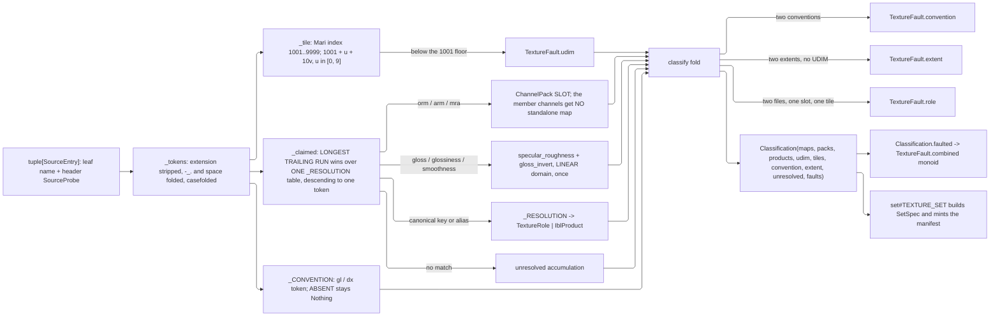

# [PY_ARTIFACTS_GRAPHIC_TEXTURE_INGEST]

`ingest` owns the CHANNEL VOCABULARY and the classifier that resolves a directory of loose files into it. `TextureRole` is the closed roster every other page keys on, `_ROLE_SPACE` the one frozen law table carrying each role's component count, transfer, neutral, unit, mip policy, signedness, and mint origin, and `_ALIASES` the alias grammar an artist's naming convention reaches it through. `classify` is TOTAL and PURE: it reads filename stems and header probes, resolves what the tables claim, and ACCUMULATES everything else — an unmatched stem lands in `unresolved`, never a guess and never an exception.

Every roster column TRANSCRIBES the frozen cross-branch fragment: a canonical name that OpenPBR Surface 1.1 defines is the OpenPBR identifier verbatim (`geometry_opacity`, never `opacity`), so the `.mtlx` port binding is mechanical and the C# `TextureChannel` PascalCase, the python `TextureRole` UPPER_SNAKE, and the TS camelCase literal all derive from the one key by casing alone. Cross-branch equality tests the KEY, never the identifier. `plane#PLANE` supplies the transfer, mip, and fault vocabularies; `derive#DERIVE` supplies `NormalConvention` and `ChannelPack`, whose EXECUTION lives with the kernels that flip a green channel and order a pack; this page resolves both from a stem and records the source convention on the provenance leg. `set#TEXTURE_SET` consumes a `Classification` to build its `SetSpec` and mints the manifest; python synthesizes no plane bytes for a role this table marks `BAKED`.

## [01]-[INDEX]

- [02]-[ROLE]: `TextureRole`, `IblProduct`, and `ChannelPack` close the slot vocabularies, `RoleLaw` lands every column of the frozen fragment, three law tables resolve under one total `slot_law`, and import-time gates keep the rosters, the descent bound, and the alias grammar unambiguous.
- [03]-[CLASSIFY]: stem normalization, the UDIM grammar, the one-table longest-run resolution descent, and the total accumulating `classify` fold over a source roster and its header probes.

## [02]-[ROLE]

- Owner: `TextureRole` is the ONE channel vocabulary and `_ROLE_SPACE` its ONE law table. That roster DERIVES from the `OpenPbrSurface` column set, the OpenPBR geometry group, and four derived fields — a projection of an existing closed vocabulary, not a hand-picked eight, so a coat-roughness or sheen bake has a row on day one and the C# and python cardinalities match by construction.
- Owner: `IblProduct` is the environment half of the SAME egress slot and `ChannelPack` its packed half; all three land here rather than at their kernels, because one vocabulary owner keeps `slot_law` total over `MapSlot` and keeps `ibl#IBL` free of a cycle back through the producer that consumes it. `slot_law` discriminates on the slot's own TYPE, so a producer carries no "which table" flag and a new vocabulary is one more arm.
- Owner: `_PACK_MEMBERS` fixes each pack's RGB slot order as ROLES and `_PACK_LAW` DERIVES the pack's own row from them — four components, always `raw`, never associated, and a neutral that is its members' own constants in slot order. Packs are therefore ordinary slots the producer fans a node for and the egress names a leaf for, not a manifest entry hand-built beside the maps; a hand-written pack neutral is where a zero fill re-enters and darkens every unpacked occlusion read.
- Cases: twenty-six OpenPBR rows, five geometry rows, three derived rows, five environment products, two packs. Two exclusions are set-level facts no per-texel field can carry: the conductor is a `ConductorMetal` key riding the manifest beside the channel list, and `geometry_thin_walled` is a double-sided-shell boolean that admits no plane.
- Law: `_ROLE_SPACE` is the ONE roster and its `space` column IS the per-role colorspace law. Every other column — `channels`, `neutral`, `unit`, `mip`, `signed`, `mint` — rides the SAME row, so a second table keyed by role cannot fork from it and a page reading one column reads the same row every other page reads.
- Law: NEUTRAL is the constant a producer writes into an absent packed slot, a mip gutter, and a UDIM hole; it is the OpenPBR Surface 1.1 default converted into the channel's declared unit. Zero is never the generic fill — it is `base_metalness`'s neutral and `occlusion`'s fully-occluded value at once.
- Law: `specular_color` and `coat_color` carry no `OpenPbrSurface` column and are synthesized White by the wire mapper; they are ROWS because OpenPBR defines the inputs and the wire projection already carries them, so a baked tint plane binds without any wire change.
- Law: ROUGHNESS is the only representation. Gloss, glossiness, and smoothness are INGEST aliases carrying a transfer, never a role and never a wire field — `_GLOSS` marks the stems whose resolution attaches a `gloss_invert` transfer to `specular_roughness`, and the inversion runs in the LINEAR domain once, here. No downstream surface holds a gloss spelling.
- Law: a color channel at INTEGER depth encodes `srgb` and the same channel at FLOAT depth encodes `linear`; every non-color channel is transfer-invariant across depth. `_ROLE_SPACE` states the color-side tag and `set#TEXTURE_SET` resolves the depth-conditional half at map admission, so the two facts never live in two tables.
- Law: `mint` is the cross-branch division of labor. `Mint.BAKED` names a role whose plane bytes come from the C# press; python carries it by CLASSIFICATION alone and synthesizes none of it. `Mint.DERIVABLE` names the five roles python also mints through a `derive#DERIVE` `DeriveOp` — `geometry_normal`, `geometry_coat_normal`, `height`, `occlusion`, `curvature`.
- Law: the vocabulary is GATED at import. Four load gates raise before a single classify runs — a roster drifted from its law table, a neutral tuple whose arity drifted from its own channel count, an alias or slot key claimed twice across the channel, product, pack, and gloss vocabularies, and a resolution key spanning more tokens than the descent reaches. Drifted tables otherwise mis-resolve one file in a hundred and is invisible in every downstream receipt.
- Auto: all three law tables prove completeness against their own member sets at import, so a row added to one and not the other cannot ship; the slot vocabularies prove key-disjointness because they share ONE egress slot and a collision makes a leaf name ambiguous at the read; and `_RUN_CEILING` proves itself against `_RESOLUTION` rather than the table assuming the bound, so a longer canonical key is a load failure and never a silently unreachable row.
- Packages: `expression` the `Option` carrier and the fault monoid this page reduces; `msgspec` the frozen carriers; the builtin `frozendict` every table; stdlib `re` the stem-boundary and UDIM patterns; `numpy` only through the neutral tuples the `derive#DERIVE` fill arm materializes.
- Growth: a new channel is one `TextureRole` member with one `_ROLE_SPACE` row and its `_ALIASES` entries; a new environment product is one `IblProduct` member with one `_PRODUCT_LAW` row; a new pack is one `ChannelPack` member with one `_PACK_MEMBERS` row, whose law and neutral DERIVE — `slot_law`, `_RESOLUTION`, and the producer's roster stay total on all three. When the row crosses either wire it lands in the frozen fragment FIRST, since a locally minted slot is the fork the fragment exists to foreclose.
- Boundary: this page transcribes the roster and decides none of it. Genuine gaps route as a card at the owning tier and re-freeze in the fragment; a divergent local spelling is the drift defect. Baking, shading, and the graph binding stay C#'s; the plane bytes for a `BAKED` role never originate on this branch.

```python signature
# --- [RUNTIME_PRELUDE] ------------------------------------------------------------------
from dataclasses import dataclass
from enum import StrEnum
from re import compile as re_compile
from typing import Final, Literal, assert_never

from builtins import frozendict
from expression import Nothing, Option, Some
from expression.collections import Block
from msgspec import Struct

from rasm.artifacts.graphic.texture.derive import ChannelPack, NormalConvention
from rasm.artifacts.graphic.texture.plane import DeepFormat, Extent, MipPolicy, PlaneDepth, PlaneSpace, TextureFault

# --- [TYPES] ----------------------------------------------------------------------------


class Mint(StrEnum):  # who produces the plane BYTES; python classifies every row and synthesizes only the DERIVABLE set
    BAKED = "cs"  # the C# press bakes them; python carries the row by ingest classification alone
    DERIVABLE = "cs-py"  # python also mints them through a `derive#DERIVE` DeriveOp


class TextureRole(StrEnum):
    # Canonical keys stay snake_case and the member identifier its mechanical UPPER_SNAKE; a name OpenPBR
    # Surface 1.1 defines is the OpenPBR identifier VERBATIM, so the `.mtlx` port binding needs no translation.
    BASE_WEIGHT = "base_weight"
    BASE_COLOR = "base_color"
    BASE_METALNESS = "base_metalness"
    BASE_DIFFUSE_ROUGHNESS = "base_diffuse_roughness"
    BASE_SPECULAR_TINT = "base_specular_tint"
    SPECULAR_WEIGHT = "specular_weight"
    SPECULAR_COLOR = "specular_color"
    SPECULAR_ROUGHNESS = "specular_roughness"
    SPECULAR_ROUGHNESS_ANISOTROPY = "specular_roughness_anisotropy"
    SPECULAR_IOR = "specular_ior"
    TRANSMISSION_WEIGHT = "transmission_weight"
    TRANSMISSION_ROUGHNESS = "transmission_roughness"
    SUBSURFACE_WEIGHT = "subsurface_weight"
    SUBSURFACE_RADIUS = "subsurface_radius"
    COAT_WEIGHT = "coat_weight"
    COAT_COLOR = "coat_color"
    COAT_ROUGHNESS = "coat_roughness"
    COAT_IOR = "coat_ior"
    FUZZ_WEIGHT = "fuzz_weight"
    FUZZ_COLOR = "fuzz_color"
    FUZZ_ROUGHNESS = "fuzz_roughness"
    THIN_FILM_WEIGHT = "thin_film_weight"
    THIN_FILM_THICKNESS = "thin_film_thickness"
    THIN_FILM_IOR = "thin_film_ior"
    EMISSION_COLOR = "emission_color"
    EMISSION_LUMINANCE = "emission_luminance"
    GEOMETRY_OPACITY = "geometry_opacity"
    GEOMETRY_NORMAL = "geometry_normal"
    GEOMETRY_COAT_NORMAL = "geometry_coat_normal"
    GEOMETRY_TANGENT = "geometry_tangent"
    GEOMETRY_COAT_TANGENT = "geometry_coat_tangent"
    HEIGHT = "height"
    OCCLUSION = "occlusion"
    CURVATURE = "curvature"


class IblProduct(StrEnum):
    # Environment half of the slot vocabulary, occupying the SAME egress slot a channel name does. Declared
    # here beside `TextureRole` because one vocabulary owner keeps `slot_law` total and keeps `ibl#IBL` free of a
    # cycle back through the producer that consumes it.
    EQUIRECT = "equirect"
    IRRADIANCE = "irradiance"
    SPECULAR = "specular"
    BRDF_LUT = "brdf_lut"
    LUMINANCE_CDF = "luminance_cdf"


type MapSlot = TextureRole | IblProduct | ChannelPack  # the `<channel>`, `<product>`, or pack slot of the egress grammar; disjoint by construction


class Udim(StrEnum):
    NONE = "none"
    MARI = "mari"  # the four-digit 1001+ grammar; 1001 + u + 10 * v


# --- [MODELS] ---------------------------------------------------------------------------


@dataclass(frozen=True, slots=True, kw_only=True)
class RoleLaw:
    # Transcribes the frozen fragment's channel row whole: every column a page reads rides THIS row, so the
    # per-role colorspace law and the per-role mip law can never be two tables that drift.
    channels: int  # SEMANTIC component count; storage width rounds up through {1, 2, 4} at the codec boundary
    space: PlaneSpace  # the color-side transfer tag; the depth-conditional srgb/linear half resolves at map admission
    neutral: tuple[float, ...]  # the constant an absent pack slot, a mip gutter, and a UDIM hole take
    unit: str  # the declared unit the neutral is expressed in; empty where the channel is dimensionless
    mip: MipPolicy
    signed: bool  # the plane occupies [-1, 1]; an integer store runs the `derive#DERIVE` signed remap
    mint: Mint


class SourceProbe(Struct, frozen=True):
    # Header facts a classify reads WITHOUT decoding pixels: `plane#PLANE` `decode` is never called here, so a
    # thousand-file directory classifies at header cost and a probe-free entry still resolves by stem alone.
    extent: Extent = (0, 0)
    channels: int = 0
    depth: Option[PlaneDepth] = Nothing
    format: Option[DeepFormat] = Nothing


class SourceEntry(Struct, frozen=True):
    name: str  # the leaf filename as found; never an absolute host path
    probe: SourceProbe = SourceProbe()


class Candidate(Struct, frozen=True):
    # one resolved file: the SLOT it claims, the tile it occupies, and the transfer the alias attached. Exactly one
    # of `role`, `pack`, and `product` is filled — `slot` is the projection every consumer reads — so a packed
    # stem never doubles as a standalone member map and a set never publishes two truths for one channel. A slot
    # resolved from TWO files at the same tile is a conflict, never a silent last-writer-wins.
    entry: SourceEntry
    role: TextureRole | None = None
    pack: Option[ChannelPack] = Nothing
    product: Option[IblProduct] = Nothing
    tile: int = 0  # the Mari index, or 0 when the set is not UDIM
    gloss: bool = False  # the stem spelled gloss/glossiness/smoothness; resolution attaches the linear inversion
    convention: Option[NormalConvention] = Nothing

    @property
    def slot(self, /) -> MapSlot:
        return self.role if self.role is not None else self.pack.default_value(None) or self.product.value


class Classification(Struct, frozen=True):
    maps: frozendict[TextureRole, tuple[Candidate, ...]] = frozendict()
    packs: frozendict[ChannelPack, tuple[Candidate, ...]] = frozendict()
    products: frozendict[IblProduct, tuple[Candidate, ...]] = frozendict()  # an ingested HDRI or prefilter directory
    udim: Udim = Udim.NONE
    udim_tiles: tuple[int, ...] = ()
    convention: Option[NormalConvention] = Nothing
    extent: Extent = (0, 0)
    unresolved: tuple[str, ...] = ()
    faults: tuple[TextureFault, ...] = ()

    @property
    def faulted(self, /) -> Option[TextureFault]:
        # Accumulating disposition the fault monoid realizes: every member stays structurally addressable
        # instead of collapsing into one message, so a caller routes on the case and not on a formatted string.
        return Nothing if not self.faults else Some(Block.of_seq(self.faults).reduce(TextureFault.combined))
```

```python signature
# --- [CONSTANTS] ------------------------------------------------------------------------

_ROLE_SPACE: Final[frozendict[TextureRole, RoleLaw]] = frozendict({
    TextureRole.BASE_WEIGHT: RoleLaw(channels=1, space=PlaneSpace.LINEAR, neutral=(1.0,), unit="", mip=MipPolicy.BOX, signed=False, mint=Mint.BAKED),
    TextureRole.BASE_COLOR: RoleLaw(channels=3, space=PlaneSpace.SRGB, neutral=(0.8, 0.8, 0.8), unit="", mip=MipPolicy.KAISER, signed=False, mint=Mint.BAKED),
    TextureRole.BASE_METALNESS: RoleLaw(channels=1, space=PlaneSpace.LINEAR, neutral=(0.0,), unit="", mip=MipPolicy.BOX, signed=False, mint=Mint.BAKED),
    TextureRole.BASE_DIFFUSE_ROUGHNESS: RoleLaw(
        channels=1, space=PlaneSpace.LINEAR, neutral=(0.0,), unit="", mip=MipPolicy.ROUGHNESS_VARIANCE, signed=False, mint=Mint.BAKED
    ),
    TextureRole.BASE_SPECULAR_TINT: RoleLaw(channels=1, space=PlaneSpace.LINEAR, neutral=(0.0,), unit="", mip=MipPolicy.BOX, signed=False, mint=Mint.BAKED),
    TextureRole.SPECULAR_WEIGHT: RoleLaw(channels=1, space=PlaneSpace.LINEAR, neutral=(1.0,), unit="", mip=MipPolicy.BOX, signed=False, mint=Mint.BAKED),
    TextureRole.SPECULAR_COLOR: RoleLaw(
        channels=3, space=PlaneSpace.SRGB, neutral=(1.0, 1.0, 1.0), unit="", mip=MipPolicy.KAISER, signed=False, mint=Mint.BAKED
    ),
    TextureRole.SPECULAR_ROUGHNESS: RoleLaw(
        channels=1, space=PlaneSpace.LINEAR, neutral=(0.3,), unit="", mip=MipPolicy.ROUGHNESS_VARIANCE, signed=False, mint=Mint.BAKED
    ),
    TextureRole.SPECULAR_ROUGHNESS_ANISOTROPY: RoleLaw(
        # Vector columns shorten to `SpecularAnisotropy` on the C# side ALONE; the channel key and the `.mtlx`
        # port stay canonical, so this is the one row whose branch identifier does not derive mechanically.
        channels=1, space=PlaneSpace.LINEAR, neutral=(0.0,), unit="", mip=MipPolicy.BOX, signed=False, mint=Mint.BAKED
    ),
    TextureRole.SPECULAR_IOR: RoleLaw(channels=1, space=PlaneSpace.RAW, neutral=(1.5,), unit="", mip=MipPolicy.BOX, signed=False, mint=Mint.BAKED),
    TextureRole.TRANSMISSION_WEIGHT: RoleLaw(channels=1, space=PlaneSpace.LINEAR, neutral=(0.0,), unit="", mip=MipPolicy.BOX, signed=False, mint=Mint.BAKED),
    TextureRole.TRANSMISSION_ROUGHNESS: RoleLaw(
        # a Rasm column with no OpenPBR input: OpenPBR couples it to `specular_roughness`, so it never crosses `.mtlx`
        channels=1, space=PlaneSpace.LINEAR, neutral=(0.0,), unit="", mip=MipPolicy.ROUGHNESS_VARIANCE, signed=False, mint=Mint.BAKED
    ),
    TextureRole.SUBSURFACE_WEIGHT: RoleLaw(channels=1, space=PlaneSpace.LINEAR, neutral=(0.0,), unit="", mip=MipPolicy.BOX, signed=False, mint=Mint.BAKED),
    TextureRole.SUBSURFACE_RADIUS: RoleLaw(
        # a 3-band carrier: both wires flatten it per channel while `.mtlx` splits radius and radius_scale
        channels=3, space=PlaneSpace.RAW, neutral=(1.0, 0.5, 0.25), unit="mm", mip=MipPolicy.BOX, signed=False, mint=Mint.BAKED
    ),
    TextureRole.COAT_WEIGHT: RoleLaw(channels=1, space=PlaneSpace.LINEAR, neutral=(0.0,), unit="", mip=MipPolicy.BOX, signed=False, mint=Mint.BAKED),
    TextureRole.COAT_COLOR: RoleLaw(channels=3, space=PlaneSpace.SRGB, neutral=(1.0, 1.0, 1.0), unit="", mip=MipPolicy.KAISER, signed=False, mint=Mint.BAKED),
    TextureRole.COAT_ROUGHNESS: RoleLaw(
        channels=1, space=PlaneSpace.LINEAR, neutral=(0.0,), unit="", mip=MipPolicy.ROUGHNESS_VARIANCE, signed=False, mint=Mint.BAKED
    ),
    TextureRole.COAT_IOR: RoleLaw(channels=1, space=PlaneSpace.RAW, neutral=(1.6,), unit="", mip=MipPolicy.BOX, signed=False, mint=Mint.BAKED),
    TextureRole.FUZZ_WEIGHT: RoleLaw(channels=1, space=PlaneSpace.LINEAR, neutral=(0.0,), unit="", mip=MipPolicy.BOX, signed=False, mint=Mint.BAKED),
    TextureRole.FUZZ_COLOR: RoleLaw(channels=3, space=PlaneSpace.SRGB, neutral=(1.0, 1.0, 1.0), unit="", mip=MipPolicy.KAISER, signed=False, mint=Mint.BAKED),
    TextureRole.FUZZ_ROUGHNESS: RoleLaw(
        channels=1, space=PlaneSpace.LINEAR, neutral=(0.5,), unit="", mip=MipPolicy.ROUGHNESS_VARIANCE, signed=False, mint=Mint.BAKED
    ),
    TextureRole.THIN_FILM_WEIGHT: RoleLaw(channels=1, space=PlaneSpace.LINEAR, neutral=(0.0,), unit="", mip=MipPolicy.BOX, signed=False, mint=Mint.BAKED),
    TextureRole.THIN_FILM_THICKNESS: RoleLaw(
        # nm everywhere but `.mtlx`, whose micrometre input takes a divide by 1000 at the C# egress
        channels=1, space=PlaneSpace.RAW, neutral=(500.0,), unit="nm", mip=MipPolicy.BOX, signed=False, mint=Mint.BAKED
    ),
    TextureRole.THIN_FILM_IOR: RoleLaw(channels=1, space=PlaneSpace.RAW, neutral=(1.4,), unit="", mip=MipPolicy.BOX, signed=False, mint=Mint.BAKED),
    TextureRole.EMISSION_COLOR: RoleLaw(
        channels=3, space=PlaneSpace.SRGB, neutral=(1.0, 1.0, 1.0), unit="", mip=MipPolicy.KAISER, signed=False, mint=Mint.BAKED
    ),
    TextureRole.EMISSION_LUMINANCE: RoleLaw(
        channels=1, space=PlaneSpace.LINEAR, neutral=(0.0,), unit="cd/m2", mip=MipPolicy.BOX, signed=False, mint=Mint.BAKED
    ),
    TextureRole.GEOMETRY_OPACITY: RoleLaw(channels=1, space=PlaneSpace.LINEAR, neutral=(1.0,), unit="", mip=MipPolicy.BOX, signed=False, mint=Mint.BAKED),
    TextureRole.GEOMETRY_NORMAL: RoleLaw(
        channels=3, space=PlaneSpace.RAW, neutral=(0.0, 0.0, 1.0), unit="", mip=MipPolicy.NORMAL_RENORMALIZE, signed=True, mint=Mint.DERIVABLE
    ),
    TextureRole.GEOMETRY_COAT_NORMAL: RoleLaw(
        channels=3, space=PlaneSpace.RAW, neutral=(0.0, 0.0, 1.0), unit="", mip=MipPolicy.NORMAL_RENORMALIZE, signed=True, mint=Mint.DERIVABLE
    ),
    TextureRole.GEOMETRY_TANGENT: RoleLaw(
        channels=3, space=PlaneSpace.RAW, neutral=(1.0, 0.0, 0.0), unit="", mip=MipPolicy.NORMAL_RENORMALIZE, signed=True, mint=Mint.BAKED
    ),
    TextureRole.GEOMETRY_COAT_TANGENT: RoleLaw(
        channels=3, space=PlaneSpace.RAW, neutral=(1.0, 0.0, 0.0), unit="", mip=MipPolicy.NORMAL_RENORMALIZE, signed=True, mint=Mint.BAKED
    ),
    TextureRole.HEIGHT: RoleLaw(
        # normalized [0, 1]; the millimetre span rides the manifest's height scale, NEVER the plane
        channels=1, space=PlaneSpace.RAW, neutral=(0.5,), unit="", mip=MipPolicy.BOX, signed=False, mint=Mint.DERIVABLE
    ),
    TextureRole.OCCLUSION: RoleLaw(channels=1, space=PlaneSpace.LINEAR, neutral=(1.0,), unit="", mip=MipPolicy.BOX, signed=False, mint=Mint.DERIVABLE),
    TextureRole.CURVATURE: RoleLaw(
        channels=1, space=PlaneSpace.RAW, neutral=(0.0,), unit="", mip=MipPolicy.BOX, signed=True, mint=Mint.DERIVABLE
    ),
})

_PRODUCT_LAW: Final[frozendict[IblProduct, RoleLaw]] = frozendict({
    # Seats the environment products under the SAME row shape a channel takes, so `slot_law` is total over `MapSlot` and
    # `set#TEXTURE_SET` reads one law surface instead of branching on which vocabulary a slot came from.
    IblProduct.EQUIRECT: RoleLaw(
        channels=3, space=PlaneSpace.LINEAR, neutral=(0.0, 0.0, 0.0), unit="cd/m2", mip=MipPolicy.KAISER, signed=False, mint=Mint.DERIVABLE
    ),
    IblProduct.IRRADIANCE: RoleLaw(
        channels=3, space=PlaneSpace.LINEAR, neutral=(0.0, 0.0, 0.0), unit="cd/m2", mip=MipPolicy.NONE, signed=False, mint=Mint.DERIVABLE
    ),
    IblProduct.SPECULAR: RoleLaw(
        # GGX pyramids ship as per-level FILES: no EXR write survives a mip- or rip-tiled part, and the
        # roughness ladder is a manifest list rather than a container-carried level index
        channels=3, space=PlaneSpace.LINEAR, neutral=(0.0, 0.0, 0.0), unit="cd/m2", mip=MipPolicy.NONE, signed=False, mint=Mint.DERIVABLE
    ),
    IblProduct.BRDF_LUT: RoleLaw(channels=2, space=PlaneSpace.RAW, neutral=(0.0, 0.0), unit="", mip=MipPolicy.NONE, signed=False, mint=Mint.DERIVABLE),
    IblProduct.LUMINANCE_CDF: RoleLaw(channels=2, space=PlaneSpace.RAW, neutral=(0.0, 0.0), unit="", mip=MipPolicy.NONE, signed=False, mint=Mint.DERIVABLE),
})


_PACK_MEMBERS: Final[frozendict[ChannelPack, tuple[TextureRole, ...]]] = frozendict({
    # Fixes the RGB slot order per pack row; `derive#DERIVE` `_PACK_SLOTS` carries the same order as operand
    # indices and this table carries it as ROLES, so the producer's pack node names its own parents from here
    ChannelPack.ORM: (TextureRole.OCCLUSION, TextureRole.SPECULAR_ROUGHNESS, TextureRole.BASE_METALNESS),
    ChannelPack.MRA: (TextureRole.BASE_METALNESS, TextureRole.SPECULAR_ROUGHNESS, TextureRole.OCCLUSION),
})
_PACK_LAW: Final[frozendict[ChannelPack, RoleLaw]] = frozendict({
    # a pack is a SLOT like any other — four components, always `raw`, never associated, and its neutral is its
    # members' own neutrals in slot order with the unused alpha at one. Deriving the neutral from `_ROLE_SPACE`
    # is what keeps an absent slot filling with its channel's constant rather than a zero this table restated.
    pack: RoleLaw(
        channels=4,
        space=PlaneSpace.RAW,
        neutral=(*(_ROLE_SPACE[member].neutral[0] for member in members), 1.0),
        unit="",
        mip=MipPolicy.BOX,  # the SET-level fold is per component under each member's own policy; this is the carrier default
        signed=False,
        mint=Mint.DERIVABLE,
    )
    for pack, members in _PACK_MEMBERS.items()
})
_NORMAL_ROLES: Final[frozenset[TextureRole]] = frozenset({TextureRole.GEOMETRY_NORMAL, TextureRole.GEOMETRY_COAT_NORMAL})


def slot_law(slot: MapSlot, /) -> RoleLaw:
    # ONE law surface over every vocabulary; the slot's own type is the discriminant, so a producer never carries
    # a "which table" flag and a new vocabulary is one more arm, not a second law lookup at every call site.
    match slot:
        case TextureRole() as role:
            return _ROLE_SPACE[role]
        case IblProduct() as product:
            return _PRODUCT_LAW[product]
        case ChannelPack() as pack:
            return _PACK_LAW[pack]
        case _ as unreachable:
            assert_never(unreachable)


_ALIASES: Final[frozendict[str, TextureRole]] = frozendict({
    # Owns the ONE alias table; matching runs case-insensitively over the NORMALIZED stem, and the C# classifier roster is
    # that same transcription. An entry claiming two roles breaks `_ALIAS_GATE` at import.
    "albedo": TextureRole.BASE_COLOR, "diffuse": TextureRole.BASE_COLOR, "basecolor": TextureRole.BASE_COLOR,
    "col": TextureRole.BASE_COLOR, "color": TextureRole.BASE_COLOR, "d": TextureRole.BASE_COLOR, "alb": TextureRole.BASE_COLOR,
    "metallic": TextureRole.BASE_METALNESS, "metalness": TextureRole.BASE_METALNESS, "metal": TextureRole.BASE_METALNESS,
    "m": TextureRole.BASE_METALNESS, "mtl": TextureRole.BASE_METALNESS,
    "roughness": TextureRole.SPECULAR_ROUGHNESS, "rough": TextureRole.SPECULAR_ROUGHNESS, "rgh": TextureRole.SPECULAR_ROUGHNESS,
    "r": TextureRole.SPECULAR_ROUGHNESS,
    "normal": TextureRole.GEOMETRY_NORMAL, "nor": TextureRole.GEOMETRY_NORMAL, "nrm": TextureRole.GEOMETRY_NORMAL,
    "n": TextureRole.GEOMETRY_NORMAL, "normalgl": TextureRole.GEOMETRY_NORMAL, "nordx": TextureRole.GEOMETRY_NORMAL,
    "normaldx": TextureRole.GEOMETRY_NORMAL,
    "opacity": TextureRole.GEOMETRY_OPACITY, "alpha": TextureRole.GEOMETRY_OPACITY, "mask": TextureRole.GEOMETRY_OPACITY,
    "transparency": TextureRole.GEOMETRY_OPACITY,
    "height": TextureRole.HEIGHT, "disp": TextureRole.HEIGHT, "displacement": TextureRole.HEIGHT, "bump": TextureRole.HEIGHT, "h": TextureRole.HEIGHT,
    "ao": TextureRole.OCCLUSION, "occlusion": TextureRole.OCCLUSION, "ambientocclusion": TextureRole.OCCLUSION,
    "curv": TextureRole.CURVATURE, "curvature": TextureRole.CURVATURE,
    "emissive": TextureRole.EMISSION_COLOR, "emission": TextureRole.EMISSION_COLOR, "glow": TextureRole.EMISSION_COLOR, "e": TextureRole.EMISSION_COLOR,
    "spec": TextureRole.SPECULAR_COLOR, "specular": TextureRole.SPECULAR_COLOR, "speccol": TextureRole.SPECULAR_COLOR,
    "transmission": TextureRole.TRANSMISSION_WEIGHT, "transmissive": TextureRole.TRANSMISSION_WEIGHT, "refraction": TextureRole.TRANSMISSION_WEIGHT,
    "sss": TextureRole.SUBSURFACE_WEIGHT, "subsurface": TextureRole.SUBSURFACE_WEIGHT, "scatter": TextureRole.SUBSURFACE_WEIGHT,
    "clearcoat": TextureRole.COAT_WEIGHT, "coat": TextureRole.COAT_WEIGHT, "cc": TextureRole.COAT_WEIGHT,
    "sheen": TextureRole.FUZZ_WEIGHT, "fuzz": TextureRole.FUZZ_WEIGHT, "velvet": TextureRole.FUZZ_WEIGHT,
})
_PACK_ALIASES: Final[frozendict[str, ChannelPack]] = frozendict({
    # a packed stem resolves to a PACK row, never to one channel; `arm` is an alias of `orm` (identical slot order)
    "orm": ChannelPack.ORM, "arm": ChannelPack.ORM, "mra": ChannelPack.MRA,
})
_GLOSS: Final[frozenset[str]] = frozenset({"gloss", "glossiness", "smoothness"})  # resolve to specular_roughness UNDER the linear inversion
_CONVENTION: Final[frozendict[str, NormalConvention]] = frozendict({
    "gl": NormalConvention.GL, "normalgl": NormalConvention.GL, "norgl": NormalConvention.GL, "opengl": NormalConvention.GL,
    "dx": NormalConvention.DX, "normaldx": NormalConvention.DX, "nordx": NormalConvention.DX, "directx": NormalConvention.DX,
})
_BOUNDARY = re_compile(r"[-_. ]+")  # `-`, `_`, `.`, and space ALL fold to one boundary before any table lookup
_UDIM = re_compile(r"(?<!\d)([1-9][0-9]{3})(?!\d)")  # the Mari four-digit index; 1001 is (u=0, v=0) and 9999 the ceiling
_UDIM_FLOOR: Final[int] = 1001
_UDIM_ROW: Final[int] = 10  # tiles per row; index = 1001 + u + 10 * v with u in [0, 9]
_RUN_CEILING: Final[int] = 3  # the longest trailing token run a canonical key spans (`specular_roughness_anisotropy`)

_RESOLUTION: Final[frozendict[str, MapSlot | Literal["gloss"]]] = frozendict({
    # ONE lookup the descent reads, keyed by the UNDERSCORE-JOINED token run: every canonical channel key, every
    # alias, every pack alias, and the gloss stems land here so the resolver is one table descent instead of four
    # ordered `case` arms. The canonical keys are LOAD-BEARING and not decoration — the egress grammar names a
    # leaf `<channel>.<ext>`, so `coat_roughness.exr` is a file this estate itself writes, and a resolver matching
    # single tokens alone folds its stem to `roughness` and re-ingests it as `specular_roughness`.
    **{role.value: role for role in TextureRole},
    **{product.value: product for product in IblProduct},
    **_ALIASES,
    **_PACK_ALIASES,
    **dict.fromkeys(_GLOSS, "gloss"),
})

if set(_ROLE_SPACE) != set(TextureRole) or set(_PRODUCT_LAW) != set(IblProduct) or set(_PACK_LAW) != set(ChannelPack):
    raise RuntimeError("texture.ingest: a slot roster drifted from its law table")
if any(len(_BOUNDARY.split(key)) > _RUN_CEILING for key in _RESOLUTION):
    # Descent tries the longest trailing run first and stops at the ceiling; a key spanning more tokens than
    # its ceiling is silently unreachable, so the roster proves the bound instead of the bound assuming the roster
    raise RuntimeError("texture.ingest: a resolution key spans more tokens than the descent ceiling")
if any(len(law.neutral) != law.channels for law in (*_ROLE_SPACE.values(), *_PRODUCT_LAW.values(), *_PACK_LAW.values())):
    raise RuntimeError("texture.ingest: a neutral arity drifted from its own channel count")
if len({slot.value for slot in (*TextureRole, *IblProduct, *ChannelPack)}) != len(TextureRole) + len(IblProduct) + len(ChannelPack):
    # all THREE vocabularies share ONE egress slot, so a colliding key makes a leaf name ambiguous at the read
    # and makes `_slot_of` resolve a receipt band to whichever roster the roster order reached first
    raise RuntimeError("texture.ingest: the slot vocabularies collide on a key")
if set(_ALIASES) & set(_PACK_ALIASES) or set(_ALIASES) & _GLOSS:
    # an alias claiming both a role and a pack, or shadowing a gloss stem, mis-resolves ONE file in a directory and
    # is invisible in every downstream receipt — the gate makes it a load failure instead.
    raise RuntimeError("texture.ingest: alias table collides with the pack or gloss vocabulary")
```

## [03]-[CLASSIFY]

- Owner: `classify` is the ONE classification entrypoint over a source roster and its header probes. It resolves the role, the pack membership, the UDIM tile, the gloss transfer, and the normal convention per entry, folds them into a `Classification`, and accumulates every failure — it never raises, never returns a bare `Error`, and never infers a role from a probe alone.
- Law: matching runs over the NORMALIZED stem — `-`, `_`, `.`, and space all fold to one boundary and the whole stem casefolds — so `Wood_Planks-BaseColor.1001.exr`, `wood planks basecolor 1001.exr`, and `WOODPLANKS.BASECOLOR.1001.EXR` resolve identically. Matching anchors at the stem's END, because a material name frequently contains a channel word (`rustmetal_basecolor` is base color, not metalness).
- Law: the LONGEST TRAILING RUN wins, descending to one token against ONE `_RESOLUTION` table carrying every canonical key, alias, pack alias, and gloss stem. Canonical keys stay load-bearing: the egress grammar writes a leaf `<channel>.<ext>`, so `coat_roughness.exr` is a file this estate itself produces, and a resolver reading single tokens alone re-ingests it as `specular_roughness` — its own output misclassified, silently, into the wrong shading term. `_RUN_CEILING` PROVES its bound against the table at import rather than assuming it.
- Law: a PACK claim seats the pack and NOTHING else. `Candidate` fills exactly one of `role`, `pack`, and `product`, so an `orm` file never lands as a standalone occlusion map beside its own pack — which is precisely the packed-and-standalone collision `set#TEXTURE_SET` refuses, and which a role-shaped pack candidate trips on every ORM directory ingested.
- Law: a stem carrying NEITHER a `gl` nor a `dx` token leaves the convention UNRESOLVED and the classification records it. Defaulting a convention is the silent-lighting-inversion defect this refuses: a `dx` plane read as `gl` inverts every green-channel slope and lights every surface backwards, and nothing downstream can detect it. `nor_gl`/`normalgl` resolve `GL`; `nor_dx`/`normaldx` resolve `DX`; both also resolve the ROLE, so the token does double duty and no entry needs two.
- Law: both normal channels of a set share ONE convention. Sets whose entries resolve divergent conventions fault `convention` rather than converting per file, because a per-file conversion silently accepts a directory an artist assembled from two sources and produces a set whose coat normal fights its base normal.
- Law: `gloss`, `glossiness`, and `smoothness` resolve `specular_roughness` carrying `gloss=True`, and the resolution attaches the `derive#DERIVE` `gloss_invert` transfer. Inversion happens ONCE, here, in the LINEAR domain; no downstream surface holds a gloss spelling and no wire field carries one.
- Law: a packed stem resolves to a `ChannelPack` ROW and never to one channel, and a channel appearing in a pack has no standalone map row. `arm` and `orm` are the same slot order; `mra` is the reverse.
- Law: every UDIM index is `1001 + u + 10 * v` with `u` in `[0, 9]`, spanning `1001` through `9999` — a pattern bounded to `1xxx` drops every tile at `v` of ten or more, which is an ordinary UDIM sheet. That FLOOR is the one real bound: `u` is `(index - 1001) % 10` and no integer leaves that band, so a guard restating the row width is a condition that cannot fail. Four-digit tokens below 1001 are no UDIM and fault `udim` rather than entering the tile set.
- Law: classification is PURE and reads headers alone. `plane#PLANE` `decode` is never called here, so a thousand-file directory classifies at header cost; the probe supplies extent, component count, depth, and container for the AGREEMENT checks, and a probe-free entry still resolves by stem.
- Law: extent disagreement across a non-UDIM set faults `extent`. UDIM tiles legitimately differ in extent between tiles, so the check applies within a tile and never across the tile set.
- Auto: `unresolved` accumulates every stem no table claimed, and `faults` accumulates the typed causes; the caller reads `Classification.faulted` for the reduced monoid and `unresolved` for the raw stems. One hundred files carrying three unrecognized names classify ninety-seven and name three.
- Output: `Classification` is the input `set#TEXTURE_SET` builds a `SetSpec` from and the source of the manifest's `unresolved` field. Nothing here mints a manifest, a receipt, or a plane.
- Growth: a new alias is one `_ALIASES` entry, which `_RESOLUTION` folds in with no descent edit; a new UDIM grammar is one `Udim` row with one parse arm; a new convention token is one `_CONVENTION` entry.
- Boundary: no decode, no derive, no encode, no lane, no receipt. Directory walking, host paths, and object-store listing stay at the app root that hands this page a leaf-name roster — a host path never crosses into a manifest, whose `source` field carries an ingest root or a generator id alone.

```python signature
# --- [OPERATIONS] -----------------------------------------------------------------------


def _tokens(name: str, /) -> tuple[str, ...]:
    # Normalizes whole: strip the extension, fold every separator to one boundary, casefold. Everything
    # downstream matches against these tokens, so no table entry carries punctuation and no lookup re-normalizes.
    stem = name.rsplit("/", 1)[-1].rsplit(".", 1)[0] if "." in name.rsplit("/", 1)[-1] else name.rsplit("/", 1)[-1]
    return tuple(token for token in _BOUNDARY.split(stem.casefold()) if token)


def _tile(name: str, /) -> Option[int]:
    match _UDIM.search(name):
        case None:
            return Nothing
        case found:
            return Some(int(found.group(1)))


def _claimed(tokens: tuple[str, ...], /) -> MapSlot | Literal["gloss"] | None:
    # Longest TRAILING RUN wins, tried down to one token: a material name routinely contains a channel word,
    # so the match anchors at the stem's END (`rustmetal_basecolor` is base color, not metalness), and the run
    # descends so a multi-token canonical key beats the single alias buried in its own tail — `coat_roughness`
    # resolves `coat_roughness` and never the `roughness` its last token spells. One table, one descent; four
    # ordered `case` arms over single tokens is the enumerated form this collapses, and the arm that matched a
    # canonical key against a single token could never fire, because the boundary split takes every key apart.
    for span in range(min(_RUN_CEILING, len(tokens)), 0, -1):
        claim = _RESOLUTION.get("_".join(tokens[-span:]))
        if claim is not None:
            return claim
    return None


def _resolved(entry: SourceEntry, /) -> Candidate | tuple[str, TextureFault] | None:
    # a pack claim carries the PACK and no role, a gloss claim carries the inversion, and an unmatched stem
    # returns None so the fold accumulates it instead of guessing.
    tokens = _tokens(entry.name)
    tile = _tile(entry.name).default_value(0)
    if tile and tile < _UDIM_FLOOR:
        # 1001 is the Mari floor and `u` is `(index - 1001) % 10`, which no integer can leave — the floor is the
        # ONE real bound, and a modulo guard restating it is a condition that cannot fail
        return (entry.name, TextureFault(udim=entry.name))
    convention = next((_CONVENTION[token] for token in reversed(tokens) if token in _CONVENTION), None)
    match _claimed(tokens):
        case None:
            return None
        case "gloss":
            return Candidate(entry=entry, role=TextureRole.SPECULAR_ROUGHNESS, tile=tile, gloss=True)
        case ChannelPack() as pack:
            # a packed stem claims the PACK ALONE: seating it under a member role too would publish the file as a
            # standalone map beside its own pack, which is exactly the collision `set#TEXTURE_SET` refuses
            return Candidate(entry=entry, role=None, pack=Some(pack), tile=tile)
        case IblProduct() as product:
            return Candidate(entry=entry, role=None, product=Some(product), tile=tile)
        case TextureRole() as role:
            carried = Some(convention) if convention is not None and role in _NORMAL_ROLES else Nothing
            return Candidate(entry=entry, role=role, tile=tile, convention=carried)
        case _ as unreachable:
            assert_never(unreachable)


def classify(entries: tuple[SourceEntry, ...], /) -> Classification:
    # TOTAL and PURE: every entry either resolves, faults with a typed cause, or accumulates into `unresolved`.
    # Raising here discards the ninety-seven files a directory did resolve for the sake of naming three.
    resolved = tuple(_resolved(entry) for entry in entries)
    candidates = tuple(item for item in resolved if isinstance(item, Candidate))
    faults = tuple(fault for item in resolved if isinstance(item, tuple) for _name, fault in (item,))
    unresolved = tuple(entry.name for entry, item in zip(entries, resolved, strict=True) if item is None)
    conventions = frozenset(candidate.convention.default_value(NormalConvention.GL) for candidate in candidates if candidate.convention.is_some())
    tiles = tuple(sorted({candidate.tile for candidate in candidates if candidate.tile}))
    extents = frozenset(candidate.entry.probe.extent for candidate in candidates if candidate.entry.probe.extent != (0, 0))
    return Classification(
        # `role` is filled on a channel claim ALONE, so a packed stem lands in `packs` and nowhere else; the two
        # folds read the same resolved candidates and neither re-normalizes a stem the resolver already split
        maps=frozendict({
            role: tuple(candidate for candidate in candidates if candidate.role is role)
            for role in {candidate.role for candidate in candidates if candidate.role is not None}
        }),
        packs=frozendict({
            pack: tuple(candidate for candidate in candidates if candidate.pack == Some(pack))
            for pack in {candidate.pack.value for candidate in candidates if candidate.pack.is_some()}
        }),
        products=frozendict({
            product: tuple(candidate for candidate in candidates if candidate.product == Some(product))
            for product in {candidate.product.value for candidate in candidates if candidate.product.is_some()}
        }),
        udim=Udim.MARI if tiles else Udim.NONE,
        udim_tiles=tiles,
        # a NORMAL plane whose convention no token resolved leaves it Nothing: a defaulted convention inverts every
        # green slope and lights the surface backwards, and no downstream surface can detect it after the fact.
        convention=Some(next(iter(conventions))) if len(conventions) == 1 else Nothing,
        extent=next(iter(extents)) if len(extents) == 1 else (0, 0),
        unresolved=unresolved,
        faults=(
            *faults,
            *((TextureFault(convention="<divergent-across-set>"),) if len(conventions) > 1 else ()),
            # UDIM tiles legitimately differ in extent tile-to-tile, so the agreement check applies to a flat set alone
            *((TextureFault(extent=next(iter(extents))),) if len(extents) > 1 and not tiles else ()),
            *(
                # Conflicts land per SLOT and per tile, so a pack and a product collide on their own terms too
                (TextureFault(role=f"<{slot.value}:{len(group)}-candidates-one-tile>"),)
                for slot, group in {c.slot: [d for d in candidates if d.slot is c.slot and d.tile == c.tile] for c in candidates}.items()
                if len(group) > 1
            ),
        ),
    )
```



## [04]-[RESEARCH]

<!-- source-only: research row template:
[TOKEN]-[OPEN|BLOCKED]: <exact question>; <verification route>.
-->

(none)
