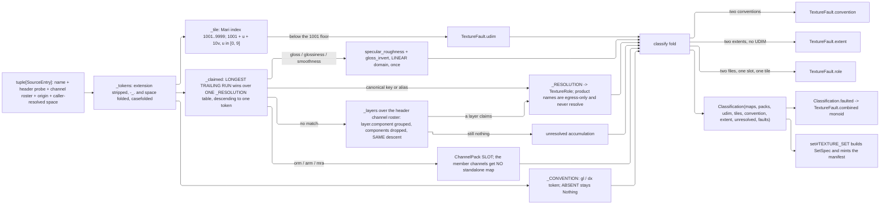

# [PY_ARTIFACTS_GRAPHIC_TEXTURE_INGEST]

`ingest` owns the CHANNEL VOCABULARY and the classifier that resolves a directory of loose files into it. `TextureRole` is the closed roster every other page keys on, `_ROLE_SPACE` the one frozen law table carrying each role's component count, transfer, neutral, unit, mip policy, signedness, and mint origin, and `_ALIASES` the alias grammar an artist's naming convention reaches it through. `classify` is TOTAL and PURE: it reads names, header probes, and the channel rosters those headers carry, resolves what the tables claim, and ACCUMULATES everything else — an unmatched name lands in `unresolved`, never a guess and never an exception.

Every roster column TRANSCRIBES the frozen cross-branch fragment: a canonical name that OpenPBR Surface 1.1 defines is the OpenPBR identifier verbatim (`geometry_opacity`, never `opacity`), so the `.mtlx` port binding is mechanical and the C# `TextureChannel` PascalCase, the python `TextureRole` UPPER_SNAKE, and the TS camelCase literal all derive from the one key by casing alone. Cross-branch equality tests the KEY, never the identifier. `plane#PLANE` supplies the transfer, mip, and fault vocabularies; `derive#DERIVE` supplies `NormalConvention` and `ChannelPack`, whose EXECUTION lives with the kernels that flip a green channel and order a pack; this page resolves both from a stem and records the source convention on the provenance leg. `set#TEXTURE_SET` consumes a `Classification` to build its `SetSpec` and mints the manifest; python synthesizes no plane bytes for a role this table marks `BAKED`.

## [01]-[INDEX]

- [02]-[ROLE]: `TextureRole`, `IblProduct`, and `ChannelPack` close the slot vocabularies, `RoleLaw` lands every column of the frozen fragment, three law tables resolve under one total `slot_law`, and import-time gates keep the rosters, the descent bound, and the alias grammar unambiguous.
- [03]-[CLASSIFY]: stem normalization, the UDIM grammar, the one-table longest-run resolution descent over the stem and then the container's own channel layers, and the total accumulating `classify` fold over a source roster.

## [02]-[ROLE]

- Owner: `TextureRole` is the ONE channel vocabulary and `_ROLE_SPACE` its ONE law table. That roster DERIVES from the `OpenPbrSurface` column set, the OpenPBR geometry group, and four derived fields — a projection of an existing closed vocabulary, not a hand-picked eight, so a coat-roughness or sheen bake has a row on day one and the C# and python cardinalities match by construction.
- Owner: `IblProduct` is the environment half of the SAME egress slot and `ChannelPack` its packed half; all three land here rather than at their kernels, because one vocabulary owner keeps `slot_law` total over `MapSlot` and keeps `ibl#IBL` free of a cycle back through the producer that consumes it. `slot_law` discriminates on the slot's own TYPE, so a producer carries no "which table" flag and a new vocabulary is one more arm.
- Owner: `_PACK_MEMBERS` fixes each pack's RGB slot order as ROLES and `_PACK_LAW` DERIVES the pack's own row from them — four components, always `raw`, never associated, and a neutral that is its members' own constants in slot order. Packs are therefore ordinary slots the producer fans a node for and the egress names a leaf for, not a manifest entry hand-built beside the maps; a hand-written pack neutral is where a zero fill re-enters and darkens every unpacked occlusion read.
- Cases: the OpenPBR surface groups, the OpenPBR geometry group, the derived channels, the environment products, and the packs. Two exclusions are set-level facts no per-texel field can carry: the conductor is a `ConductorMetal` key riding the manifest beside the channel list, and `geometry_thin_walled` is a double-sided-shell boolean that admits no plane.
- Law: `_ROLE_SPACE` is the ONE roster and its `space` column IS the per-role colorspace law. Every other column — `channels`, `neutral`, `unit`, `mip`, `signed`, `bounded`, `mint` — rides the SAME row, so a second table keyed by role cannot fork from it and a page reading one column reads the same row every other page reads.
- Law: `bounded` is the STORAGE ADMISSION every integer container stands on. `plane#PLANE` `quantized` clips to `[0, 1]`, so a channel whose values leave that band — an index of refraction near `1.5`, a nanometre film thickness near `500`, a millimetre scattering radius, an absolute `cd/m²` luminance, every environment product — writes pure white into an integer store with no error anywhere. Those rows read `bounded=False` and `set#TEXTURE_SET` `default_spec` routes them to the float container; a unit column alone cannot carry it, because `emission_luminance` is dimensioned and neutral at zero while `height` is dimensionless and genuinely unit-normalized.
- Law: NEUTRAL is the constant a producer writes into an absent packed slot, a mip gutter, and a UDIM hole; it is the OpenPBR Surface 1.1 default converted into the channel's declared unit. Zero is never the generic fill — it is `base_metalness`'s neutral and `occlusion`'s fully-occluded value at once.
- Law: `specular_color` and `coat_color` carry no `OpenPbrSurface` column and are synthesized White by the wire mapper; they are ROWS because OpenPBR defines the inputs and the wire projection already carries them, so a baked tint plane binds without any wire change.
- Law: ROUGHNESS is the only representation. Gloss, glossiness, and smoothness are INGEST aliases carrying a transfer, never a role and never a wire field — `_GLOSS` marks the stems whose resolution attaches a `gloss_invert` transfer to `specular_roughness`, and the inversion runs in the LINEAR domain once, here. No downstream surface holds a gloss spelling.
- Law: a color channel at INTEGER depth encodes `srgb` and the same channel at FLOAT depth encodes `linear`; every non-color channel is transfer-invariant across depth. `_ROLE_SPACE` states the color-side tag and `set#TEXTURE_SET` resolves the depth-conditional half at map admission, so the two facts never live in two tables.
- Law: `mint` is the cross-branch division of labor. `Mint.BAKED` names a role whose plane bytes come from the C# press; python carries it by CLASSIFICATION alone and synthesizes none of it. `Mint.DERIVABLE` names the five roles python also mints through a `derive#DERIVE` `DeriveOp` — `geometry_normal`, `geometry_coat_normal`, `height`, `occlusion`, `curvature`.
- Law: the vocabulary is GATED at import. Every load gate raises before a single classify runs — a roster drifted from its law table, a neutral tuple whose arity drifted from its own channel count, an alias or slot key claimed twice across the channel, product, pack, and gloss vocabularies, a resolution key spanning more tokens than the descent reaches, a signed row denying its own bounded remap, and a bare convention token claiming a resolution key the run drops. Drifted tables otherwise mis-resolve one file in a hundred and are invisible in every downstream receipt.
- Auto: all three law tables prove completeness against their own member sets at import, so a row added to one and not the other cannot ship; the slot vocabularies prove key-disjointness because they share ONE egress slot and a collision makes a leaf name ambiguous at the read; and `_RUN_CEILING` proves itself against `_RESOLUTION` rather than the table assuming the bound, so a longer canonical key is a load failure and never a silently unreachable row.
- Packages: `expression` the `Option` carrier and the fault monoid this page reduces; `msgspec` the frozen carriers; the builtin `frozendict` every table; stdlib `re` the stem-boundary and UDIM patterns; `numpy` only through the neutral tuples the `derive#DERIVE` fill arm materializes.
- Growth: a new channel is one `TextureRole` member with one `_ROLE_SPACE` row and its `_ALIASES` entries; a new environment product is one `IblProduct` member with one `_PRODUCT_LAW` row; a new pack is one `ChannelPack` member with one `_PACK_MEMBERS` row, whose law and neutral DERIVE — `slot_law`, `_RESOLUTION`, and the producer's roster stay total on all three. When the row crosses either wire it lands in the frozen fragment FIRST, since a locally minted slot is the fork the fragment exists to foreclose.
- Boundary: this page transcribes the roster and decides none of it. Genuine gaps route as a card at the owning tier and re-freeze in the fragment; a divergent local spelling is the drift defect. Baking, shading, and the graph binding stay C#'s; the plane bytes for a `BAKED` role never originate on this branch.

```python signature
# --- [RUNTIME_PRELUDE] ------------------------------------------------------------------
from dataclasses import dataclass
from enum import StrEnum
from re import compile as re_compile
from typing import Final, Literal, assert_never

from builtins import frozendict
from expression import Nothing, Option, Some, case, tag, tagged_union
from expression.collections import Block
from msgspec import Struct

from rasm.artifacts.graphic.texture.derive import ChannelPack, NormalConvention
from rasm.artifacts.graphic.texture.plane import DeepFormat, Extent, MipPolicy, PlaneDepth, PlaneSpace, TextureFault

# --- [TYPES] ----------------------------------------------------------------------------


class Mint(StrEnum):  # who produces the plane BYTES; python classifies every row and synthesizes only the DERIVABLE set
    BAKED = "cs"  # the C# press bakes them; python carries the row by ingest classification alone
    DERIVABLE = "cs·py"  # python also mints them through a `derive#DERIVE` DeriveOp
    PYTHON = "py"  # python `ibl#IBL` ALONE mints them — the environment products the C# document carries no kind for


class TextureRole(StrEnum):
    # Canonical keys stay snake_case and the member identifier its mechanical UPPER_SNAKE; a name OpenPBR
    # Surface 1.1 defines is the OpenPBR identifier VERBATIM, so the `.mtlx` port binding needs no translation.
    BASE_WEIGHT = "base_weight"
    BASE_COLOR = "base_color"
    BASE_METALNESS = "base_metalness"
    BASE_DIFFUSE_ROUGHNESS = "base_diffuse_roughness"
    BASE_SPECULAR_TINT = "base_specular_tint"
    SPECULAR_WEIGHT = "specular_weight"
    SPECULAR_COLOR = "specular_color"
    SPECULAR_ROUGHNESS = "specular_roughness"
    SPECULAR_ROUGHNESS_ANISOTROPY = "specular_roughness_anisotropy"
    SPECULAR_ROUGHNESS_ANISOTROPY_ROTATION = "specular_roughness_anisotropy_rotation"
    SPECULAR_IOR = "specular_ior"
    TRANSMISSION_WEIGHT = "transmission_weight"
    TRANSMISSION_ROUGHNESS = "transmission_roughness"
    SUBSURFACE_WEIGHT = "subsurface_weight"
    SUBSURFACE_RADIUS = "subsurface_radius"
    COAT_WEIGHT = "coat_weight"
    COAT_COLOR = "coat_color"
    COAT_ROUGHNESS = "coat_roughness"
    COAT_IOR = "coat_ior"
    FUZZ_WEIGHT = "fuzz_weight"
    FUZZ_COLOR = "fuzz_color"
    FUZZ_ROUGHNESS = "fuzz_roughness"
    THIN_FILM_WEIGHT = "thin_film_weight"
    THIN_FILM_THICKNESS = "thin_film_thickness"
    THIN_FILM_IOR = "thin_film_ior"
    EMISSION_COLOR = "emission_color"
    EMISSION_LUMINANCE = "emission_luminance"
    GEOMETRY_OPACITY = "geometry_opacity"
    GEOMETRY_NORMAL = "geometry_normal"
    GEOMETRY_COAT_NORMAL = "geometry_coat_normal"
    GEOMETRY_TANGENT = "geometry_tangent"
    GEOMETRY_COAT_TANGENT = "geometry_coat_tangent"
    HEIGHT = "height"
    OCCLUSION = "occlusion"
    CURVATURE = "curvature"


class IblProduct(StrEnum):
    # Environment half of the slot vocabulary, occupying the SAME egress slot a channel name does. Declared
    # here beside `TextureRole` because one vocabulary owner keeps `slot_law` total and keeps `ibl#IBL` free of a
    # cycle back through the producer that consumes it.
    EQUIRECT = "equirect"
    IRRADIANCE = "irradiance"
    SPECULAR = "specular"
    BRDF_LUT = "brdf_lut"
    LUMINANCE_CDF = "luminance_cdf"
    CUBEMAP = "cubemap"  # the SIX-FACE radiance container a GPU cube sampler binds; one file, six faces, no infix
    PREVIEW = "preview"  # the DISPLAY-REFERRED gain-map preview; the one product whose read-side intensity is baked


type MapSlot = TextureRole | IblProduct | ChannelPack  # the `<channel>`, `<product>`, or pack slot of the egress grammar; disjoint by construction


class Udim(StrEnum):
    NONE = "none"
    MARI = "mari"  # the four-digit 1001+ grammar; 1001 + u + 10 * v


class SourceOrigin(StrEnum):
    # WHERE the entry's evidence came from. Origin is a column on ONE entry owner rather than a sibling record,
    # because both answers share the whole discriminant set — admitted before classification, keyed by name,
    # evidence-at-probe-time, consumed into `Candidate` — and differ only in which evidence fields are filled.
    FILE = "file"  # a leaf the app root's directory walk found
    EMBEDDED = "embedded"  # an image a glTF/GLB container names in its own `images[]` beside a `materials[]` binding


# --- [MODELS] ---------------------------------------------------------------------------


@dataclass(frozen=True, slots=True, kw_only=True)
class RoleLaw:
    # Transcribes the frozen fragment's channel row whole: every column a page reads rides THIS row, so the
    # per-role colorspace law and the per-role mip law can never be two tables that drift.
    channels: int  # SEMANTIC component count; storage width rounds up through {1, 2, 4} at the codec boundary
    space: PlaneSpace  # the color-side transfer tag; the depth-conditional srgb/linear half resolves at map admission
    neutral: tuple[float, ...]  # the constant an absent pack slot, a mip gutter, and a UDIM hole take
    unit: str  # the declared unit the neutral is expressed in; empty where the channel is dimensionless
    mip: MipPolicy
    signed: bool  # the plane occupies [-1, 1]; an integer store runs the `derive#DERIVE` signed remap
    bounded: bool  # the plane occupies [0, 1] after any signed remap, so an INTEGER container can carry it
    mint: Mint


class SourceProbe(Struct, frozen=True):
    # Header facts a classify reads WITHOUT decoding pixels: `plane#PLANE` `decode` is never called here, so a
    # thousand-file directory classifies at header cost and a probe-free entry still resolves by stem alone.
    extent: Extent = (0, 0)
    channels: int = 0
    depth: Option[PlaneDepth] = Nothing
    format: Option[DeepFormat] = Nothing


class SourceEntry(Struct, frozen=True):
    # ONE entry owner over every origin: a walked leaf, a glTF-embedded image, and a multi-channel document each
    # carry a name, a header probe, and whatever extra evidence their origin affords. A sibling record per origin
    # answers admission, identity, timing, and consumer identically to this one, so it folds here as columns.
    name: str  # the leaf filename or the container's own image name; never an absolute host path
    probe: SourceProbe = SourceProbe()
    origin: SourceOrigin = SourceOrigin.FILE
    channels: tuple[str, ...] = ()
    # ^ the container's OWN channel roster where its header carries one — an EXR read `header_only` hands back
    # `header()["channels"]` as `Channel` records with `.name` a plain string, and NO pixel is touched. A
    # multi-AOV document whose channel names ARE its role roster resolves off this where its stem carries nothing.
    material: str = ""  # the glTF material the embedded image binds under; empty on a walked leaf
    space: Option[tuple[str, int]] = Nothing
    # ^ a CALLER-RESOLVED (colorspace name, file-rule index) pair. `graphic/color/managed#MANAGED` owns the OCIO
    # config and its `FileRules`, and the strata forbid this page importing it, so the declared-rules answer
    # arrives resolved and rides through as provenance — this page mints no config and infers no space of its own.


class Candidate(Struct, frozen=True):
    # one resolved file: the SLOT it claims, the tile it occupies, and the transfer the alias attached. Exactly one
    # of `role` and `pack` is filled — `slot` is the projection every consumer reads — so a packed stem never
    # doubles as a standalone member map and a set never publishes two truths for one channel. A slot resolved
    # from TWO files at the same tile is a conflict, never a silent last-writer-wins. No `product` leg exists:
    # the `[09]` product names are egress-only and an IBL product arrives manifest-borne, never stem-classified.
    entry: SourceEntry
    role: TextureRole | None = None
    pack: Option[ChannelPack] = Nothing
    tile: int = 0  # the Mari index, or 0 when the set is not UDIM
    gloss: bool = False  # the stem spelled gloss/glossiness/smoothness; resolution attaches the linear inversion
    convention: Option[NormalConvention] = Nothing
    channel: str = ""
    # ^ the SOURCE channel inside a multi-channel document, empty where the whole plane is the slot. A multi-AOV
    # EXR claims one candidate per resolved channel over ONE entry, so the extractor knows which named channel to
    # read back and the conflict census still groups by (slot, tile) — two AOVs claiming one role is a conflict.
    space: Option[tuple[str, int]] = Nothing  # the entry's caller-resolved space provenance, carried, never re-derived

    @property
    def slot(self, /) -> MapSlot:
        return self.role if self.role is not None else self.pack.value


@tagged_union(frozen=True)
class Resolution:
    # ONE typed disposition per source entry, so `classify` folds on a TAG rather than probing runtime shapes:
    # a claim, a typed refusal carrying the stem it names, or an honest miss. The three outcomes were a
    # `Candidate | tuple[str, TextureFault] | None` union whose reader could only be an `isinstance` ladder no
    # checker proves exhaustive, and whose `None` arm meant "unresolved" on a page where every other `None`
    # means "absent" — one more optional candidate field and the two spellings collide.
    tag: Literal["claimed", "faulted", "unclaimed"] = tag()
    claimed: "Candidate" = case()
    faulted: tuple[str, TextureFault] = case()  # the stem and its typed cause
    unclaimed: str = case()  # the stem no table claimed; it rides the manifest's own `unresolved` list


class Classification(Struct, frozen=True):
    maps: frozendict[TextureRole, tuple[Candidate, ...]] = frozendict()
    packs: frozendict[ChannelPack, tuple[Candidate, ...]] = frozendict()
    udim: Udim = Udim.NONE
    udim_tiles: tuple[int, ...] = ()
    convention: Option[NormalConvention] = Nothing
    extent: Extent = (0, 0)
    unresolved: tuple[str, ...] = ()
    faults: tuple[TextureFault, ...] = ()

    @property
    def faulted(self, /) -> Option[TextureFault]:
        # Accumulating disposition the fault monoid realizes: every member stays structurally addressable
        # instead of collapsing into one message, so a caller routes on the case and not on a formatted string.
        return Nothing if not self.faults else Some(Block.of_seq(self.faults).reduce(TextureFault.combined))
```

```python signature
# --- [CONSTANTS] ------------------------------------------------------------------------

_ROLE_SPACE: Final[frozendict[TextureRole, RoleLaw]] = frozendict({
    TextureRole.BASE_WEIGHT: RoleLaw(channels=1, space=PlaneSpace.LINEAR, neutral=(1.0,), unit="", mip=MipPolicy.BOX, signed=False, bounded=True, mint=Mint.BAKED),
    TextureRole.BASE_COLOR: RoleLaw(channels=3, space=PlaneSpace.SRGB, neutral=(0.8, 0.8, 0.8), unit="", mip=MipPolicy.KAISER, signed=False, bounded=True, mint=Mint.BAKED),
    TextureRole.BASE_METALNESS: RoleLaw(channels=1, space=PlaneSpace.LINEAR, neutral=(0.0,), unit="", mip=MipPolicy.BOX, signed=False, bounded=True, mint=Mint.BAKED),
    TextureRole.BASE_DIFFUSE_ROUGHNESS: RoleLaw(
        channels=1, space=PlaneSpace.LINEAR, neutral=(0.0,), unit="", mip=MipPolicy.ROUGHNESS_VARIANCE, signed=False, bounded=True, mint=Mint.BAKED
    ),
    TextureRole.BASE_SPECULAR_TINT: RoleLaw(channels=1, space=PlaneSpace.LINEAR, neutral=(0.0,), unit="", mip=MipPolicy.BOX, signed=False, bounded=True, mint=Mint.BAKED),
    TextureRole.SPECULAR_WEIGHT: RoleLaw(channels=1, space=PlaneSpace.LINEAR, neutral=(1.0,), unit="", mip=MipPolicy.BOX, signed=False, bounded=True, mint=Mint.BAKED),
    TextureRole.SPECULAR_COLOR: RoleLaw(
        channels=3, space=PlaneSpace.SRGB, neutral=(1.0, 1.0, 1.0), unit="", mip=MipPolicy.KAISER, signed=False, bounded=True, mint=Mint.BAKED
    ),
    TextureRole.SPECULAR_ROUGHNESS: RoleLaw(
        channels=1, space=PlaneSpace.LINEAR, neutral=(0.3,), unit="", mip=MipPolicy.ROUGHNESS_VARIANCE, signed=False, bounded=True, mint=Mint.BAKED
    ),
    TextureRole.SPECULAR_ROUGHNESS_ANISOTROPY: RoleLaw(
        # Vector columns shorten to `SpecularAnisotropy` on the .NET side ALONE; the channel key and the `.mtlx`
        # port stay canonical, so this is one of the two rows whose branch identifier does not derive mechanically.
        channels=1, space=PlaneSpace.LINEAR, neutral=(0.0,), unit="", mip=MipPolicy.BOX, signed=False, bounded=True, mint=Mint.BAKED
    ),
    TextureRole.SPECULAR_ROUGHNESS_ANISOTROPY_ROTATION: RoleLaw(
        # The scalar rotation plane carries anisotropy direction — it mips correctly under BOX where a tangent
        # VECTOR plane cancels; the C# identifier shortens to `SpecularRotation`, the second non-mechanical row.
        channels=1, space=PlaneSpace.LINEAR, neutral=(0.0,), unit="", mip=MipPolicy.BOX, signed=False, bounded=True, mint=Mint.BAKED
    ),
    TextureRole.SPECULAR_IOR: RoleLaw(channels=1, space=PlaneSpace.RAW, neutral=(1.5,), unit="", mip=MipPolicy.BOX, signed=False, bounded=False, mint=Mint.BAKED),
    TextureRole.TRANSMISSION_WEIGHT: RoleLaw(channels=1, space=PlaneSpace.LINEAR, neutral=(0.0,), unit="", mip=MipPolicy.BOX, signed=False, bounded=True, mint=Mint.BAKED),
    TextureRole.TRANSMISSION_ROUGHNESS: RoleLaw(
        # a Rasm column with no OpenPBR input: OpenPBR couples it to `specular_roughness`, so it never crosses `.mtlx`
        channels=1, space=PlaneSpace.LINEAR, neutral=(0.0,), unit="", mip=MipPolicy.ROUGHNESS_VARIANCE, signed=False, bounded=True, mint=Mint.BAKED
    ),
    TextureRole.SUBSURFACE_WEIGHT: RoleLaw(channels=1, space=PlaneSpace.LINEAR, neutral=(0.0,), unit="", mip=MipPolicy.BOX, signed=False, bounded=True, mint=Mint.BAKED),
    TextureRole.SUBSURFACE_RADIUS: RoleLaw(
        # a 3-band carrier: both wires flatten it per channel while `.mtlx` splits radius and radius_scale
        channels=3, space=PlaneSpace.RAW, neutral=(1.0, 0.5, 0.25), unit="mm", mip=MipPolicy.BOX, signed=False, bounded=False, mint=Mint.BAKED
    ),
    TextureRole.COAT_WEIGHT: RoleLaw(channels=1, space=PlaneSpace.LINEAR, neutral=(0.0,), unit="", mip=MipPolicy.BOX, signed=False, bounded=True, mint=Mint.BAKED),
    TextureRole.COAT_COLOR: RoleLaw(channels=3, space=PlaneSpace.SRGB, neutral=(1.0, 1.0, 1.0), unit="", mip=MipPolicy.KAISER, signed=False, bounded=True, mint=Mint.BAKED),
    TextureRole.COAT_ROUGHNESS: RoleLaw(
        channels=1, space=PlaneSpace.LINEAR, neutral=(0.0,), unit="", mip=MipPolicy.ROUGHNESS_VARIANCE, signed=False, bounded=True, mint=Mint.BAKED
    ),
    TextureRole.COAT_IOR: RoleLaw(channels=1, space=PlaneSpace.RAW, neutral=(1.6,), unit="", mip=MipPolicy.BOX, signed=False, bounded=False, mint=Mint.BAKED),
    TextureRole.FUZZ_WEIGHT: RoleLaw(channels=1, space=PlaneSpace.LINEAR, neutral=(0.0,), unit="", mip=MipPolicy.BOX, signed=False, bounded=True, mint=Mint.BAKED),
    TextureRole.FUZZ_COLOR: RoleLaw(channels=3, space=PlaneSpace.SRGB, neutral=(1.0, 1.0, 1.0), unit="", mip=MipPolicy.KAISER, signed=False, bounded=True, mint=Mint.BAKED),
    TextureRole.FUZZ_ROUGHNESS: RoleLaw(
        channels=1, space=PlaneSpace.LINEAR, neutral=(0.5,), unit="", mip=MipPolicy.ROUGHNESS_VARIANCE, signed=False, bounded=True, mint=Mint.BAKED
    ),
    TextureRole.THIN_FILM_WEIGHT: RoleLaw(channels=1, space=PlaneSpace.LINEAR, neutral=(0.0,), unit="", mip=MipPolicy.BOX, signed=False, bounded=True, mint=Mint.BAKED),
    TextureRole.THIN_FILM_THICKNESS: RoleLaw(
        # nm everywhere but `.mtlx`, whose micrometre input takes a divide by 1000 at the C# egress
        channels=1, space=PlaneSpace.RAW, neutral=(500.0,), unit="nm", mip=MipPolicy.BOX, signed=False, bounded=False, mint=Mint.BAKED
    ),
    TextureRole.THIN_FILM_IOR: RoleLaw(channels=1, space=PlaneSpace.RAW, neutral=(1.4,), unit="", mip=MipPolicy.BOX, signed=False, bounded=False, mint=Mint.BAKED),
    TextureRole.EMISSION_COLOR: RoleLaw(
        channels=3, space=PlaneSpace.SRGB, neutral=(1.0, 1.0, 1.0), unit="", mip=MipPolicy.KAISER, signed=False, bounded=True, mint=Mint.BAKED
    ),
    TextureRole.EMISSION_LUMINANCE: RoleLaw(
        channels=1, space=PlaneSpace.LINEAR, neutral=(0.0,), unit="cd/m2", mip=MipPolicy.BOX, signed=False, bounded=False, mint=Mint.BAKED
    ),
    TextureRole.GEOMETRY_OPACITY: RoleLaw(channels=1, space=PlaneSpace.LINEAR, neutral=(1.0,), unit="", mip=MipPolicy.BOX, signed=False, bounded=True, mint=Mint.BAKED),
    TextureRole.GEOMETRY_NORMAL: RoleLaw(
        channels=3, space=PlaneSpace.RAW, neutral=(0.0, 0.0, 1.0), unit="", mip=MipPolicy.NORMAL_RENORMALIZE, signed=True, bounded=True, mint=Mint.DERIVABLE
    ),
    TextureRole.GEOMETRY_COAT_NORMAL: RoleLaw(
        channels=3, space=PlaneSpace.RAW, neutral=(0.0, 0.0, 1.0), unit="", mip=MipPolicy.NORMAL_RENORMALIZE, signed=True, bounded=True, mint=Mint.DERIVABLE
    ),
    TextureRole.GEOMETRY_TANGENT: RoleLaw(
        channels=3, space=PlaneSpace.RAW, neutral=(1.0, 0.0, 0.0), unit="", mip=MipPolicy.NORMAL_RENORMALIZE, signed=True, bounded=True, mint=Mint.BAKED
    ),
    TextureRole.GEOMETRY_COAT_TANGENT: RoleLaw(
        channels=3, space=PlaneSpace.RAW, neutral=(1.0, 0.0, 0.0), unit="", mip=MipPolicy.NORMAL_RENORMALIZE, signed=True, bounded=True, mint=Mint.BAKED
    ),
    TextureRole.HEIGHT: RoleLaw(
        # normalized [0, 1]; the millimetre span rides the manifest's height scale, NEVER the plane
        channels=1, space=PlaneSpace.RAW, neutral=(0.5,), unit="", mip=MipPolicy.BOX, signed=False, bounded=True, mint=Mint.DERIVABLE
    ),
    TextureRole.OCCLUSION: RoleLaw(channels=1, space=PlaneSpace.LINEAR, neutral=(1.0,), unit="", mip=MipPolicy.BOX, signed=False, bounded=True, mint=Mint.DERIVABLE),
    TextureRole.CURVATURE: RoleLaw(
        channels=1, space=PlaneSpace.RAW, neutral=(0.0,), unit="", mip=MipPolicy.BOX, signed=True, bounded=True, mint=Mint.DERIVABLE
    ),
})

_PRODUCT_LAW: Final[frozendict[IblProduct, RoleLaw]] = frozendict({
    # Seats the environment products under the SAME row shape a channel takes, so `slot_law` is total over `MapSlot` and
    # `set#TEXTURE_SET` reads one law surface instead of branching on which vocabulary a slot came from. Mint reads
    # `PYTHON` on every row: the C# document carries no HDRI kind, so a `cs·py` mint here asserts a producer that
    # does not exist.
    IblProduct.EQUIRECT: RoleLaw(
        channels=3, space=PlaneSpace.LINEAR, neutral=(0.0, 0.0, 0.0), unit="cd/m2", mip=MipPolicy.KAISER, signed=False, bounded=False, mint=Mint.PYTHON
    ),
    IblProduct.IRRADIANCE: RoleLaw(
        channels=3, space=PlaneSpace.LINEAR, neutral=(0.0, 0.0, 0.0), unit="cd/m2", mip=MipPolicy.NONE, signed=False, bounded=False, mint=Mint.PYTHON
    ),
    IblProduct.SPECULAR: RoleLaw(
        # GGX pyramids ship as per-level FILES: no EXR write survives a mip- or rip-tiled part, and the
        # roughness ladder is a manifest list rather than a container-carried level index
        channels=3, space=PlaneSpace.LINEAR, neutral=(0.0, 0.0, 0.0), unit="cd/m2", mip=MipPolicy.NONE, signed=False, bounded=False, mint=Mint.PYTHON
    ),
    IblProduct.BRDF_LUT: RoleLaw(channels=2, space=PlaneSpace.RAW, neutral=(0.0, 0.0), unit="", mip=MipPolicy.NONE, signed=False, bounded=True, mint=Mint.PYTHON),
    IblProduct.LUMINANCE_CDF: RoleLaw(channels=2, space=PlaneSpace.RAW, neutral=(0.0, 0.0), unit="", mip=MipPolicy.NONE, signed=False, bounded=True, mint=Mint.PYTHON),
    IblProduct.CUBEMAP: RoleLaw(
        # SIX faces in ONE container, so the row is a radiance plane exactly as the equirect is and the face axis
        # rides the container's own `num_faces` rather than a variant infix — a cube consumer binds one file
        channels=3, space=PlaneSpace.LINEAR, neutral=(0.0, 0.0, 0.0), unit="cd/m2", mip=MipPolicy.NONE, signed=False, bounded=False, mint=Mint.PYTHON
    ),
    IblProduct.PREVIEW: RoleLaw(
        # the ONE display-referred product: a gain-map container takes RGBA half-float, so the row is four
        # components with an opaque neutral, and its values stay ABSOLUTE luminance because the gain map's own
        # boost range is authored against a declared display peak rather than a normalized [0, 1] band
        channels=4, space=PlaneSpace.LINEAR, neutral=(0.0, 0.0, 0.0, 1.0), unit="cd/m2", mip=MipPolicy.NONE, signed=False, bounded=False,
        mint=Mint.PYTHON
    ),
})


_PACK_MEMBERS: Final[frozendict[ChannelPack, tuple[TextureRole, ...]]] = frozendict({
    # the ONE slot-order owner: this table carries each pack's RGB order as ROLES, the producer stages its
    # operand legs in exactly this order, and `derive#DERIVE` `_packed` concatenates positionally — no second
    # index table exists to compose a permutation onto an already-ordered tuple
    ChannelPack.ORM: (TextureRole.OCCLUSION, TextureRole.SPECULAR_ROUGHNESS, TextureRole.BASE_METALNESS),
    ChannelPack.MRA: (TextureRole.BASE_METALNESS, TextureRole.SPECULAR_ROUGHNESS, TextureRole.OCCLUSION),
})
_PACK_LAW: Final[frozendict[ChannelPack, RoleLaw]] = frozendict({
    # a pack is a SLOT like any other — four components, always `raw`, never associated, and its neutral is its
    # members' own neutrals in slot order with the unused alpha at one. Deriving the neutral from `_ROLE_SPACE`
    # is what keeps an absent slot filling with its channel's constant rather than a zero this table restated.
    pack: RoleLaw(
        channels=4,
        space=PlaneSpace.RAW,
        neutral=(*(_ROLE_SPACE[member].neutral[0] for member in members), 1.0),
        unit="",
        mip=MipPolicy.BOX,  # the SET-level fold is per component under each member's own policy; this is the carrier default
        signed=False, bounded=True,
        mint=Mint.DERIVABLE,
    )
    for pack, members in _PACK_MEMBERS.items()
})
_NORMAL_ROLES: Final[frozenset[TextureRole]] = frozenset({TextureRole.GEOMETRY_NORMAL, TextureRole.GEOMETRY_COAT_NORMAL})


def slot_law(slot: MapSlot, /) -> RoleLaw:
    # ONE law surface over every vocabulary; the slot's own type is the discriminant, so a producer never carries
    # a "which table" flag and a new vocabulary is one more arm, not a second law lookup at every call site.
    match slot:
        case TextureRole() as role:
            return _ROLE_SPACE[role]
        case IblProduct() as product:
            return _PRODUCT_LAW[product]
        case ChannelPack() as pack:
            return _PACK_LAW[pack]
        case _ as unreachable:
            assert_never(unreachable)


_ALIASES: Final[frozendict[str, TextureRole]] = frozendict({
    # Owns the ONE alias table; matching runs case-insensitively over the NORMALIZED stem, and the C# classifier roster is
    # that same transcription. An entry claiming two roles breaks `_ALIAS_GATE` at import.
    "albedo": TextureRole.BASE_COLOR, "diffuse": TextureRole.BASE_COLOR, "basecolor": TextureRole.BASE_COLOR,
    "col": TextureRole.BASE_COLOR, "color": TextureRole.BASE_COLOR, "d": TextureRole.BASE_COLOR, "alb": TextureRole.BASE_COLOR,
    "metallic": TextureRole.BASE_METALNESS, "metalness": TextureRole.BASE_METALNESS, "metal": TextureRole.BASE_METALNESS,
    "m": TextureRole.BASE_METALNESS, "mtl": TextureRole.BASE_METALNESS,
    "roughness": TextureRole.SPECULAR_ROUGHNESS, "rough": TextureRole.SPECULAR_ROUGHNESS, "rgh": TextureRole.SPECULAR_ROUGHNESS,
    "r": TextureRole.SPECULAR_ROUGHNESS,
    "normal": TextureRole.GEOMETRY_NORMAL, "nor": TextureRole.GEOMETRY_NORMAL, "nrm": TextureRole.GEOMETRY_NORMAL,
    "n": TextureRole.GEOMETRY_NORMAL, "normalgl": TextureRole.GEOMETRY_NORMAL, "norgl": TextureRole.GEOMETRY_NORMAL,
    "nordx": TextureRole.GEOMETRY_NORMAL, "normaldx": TextureRole.GEOMETRY_NORMAL,
    "opacity": TextureRole.GEOMETRY_OPACITY, "alpha": TextureRole.GEOMETRY_OPACITY, "mask": TextureRole.GEOMETRY_OPACITY,
    "transparency": TextureRole.GEOMETRY_OPACITY,
    "height": TextureRole.HEIGHT, "disp": TextureRole.HEIGHT, "displacement": TextureRole.HEIGHT, "bump": TextureRole.HEIGHT, "h": TextureRole.HEIGHT,
    "ao": TextureRole.OCCLUSION, "occlusion": TextureRole.OCCLUSION, "ambientocclusion": TextureRole.OCCLUSION,
    "curv": TextureRole.CURVATURE, "curvature": TextureRole.CURVATURE,
    "emissive": TextureRole.EMISSION_COLOR, "emission": TextureRole.EMISSION_COLOR, "glow": TextureRole.EMISSION_COLOR, "e": TextureRole.EMISSION_COLOR,
    "spec": TextureRole.SPECULAR_COLOR, "specular": TextureRole.SPECULAR_COLOR, "speccol": TextureRole.SPECULAR_COLOR,
    "transmission": TextureRole.TRANSMISSION_WEIGHT, "transmissive": TextureRole.TRANSMISSION_WEIGHT, "refraction": TextureRole.TRANSMISSION_WEIGHT,
    "sss": TextureRole.SUBSURFACE_WEIGHT, "subsurface": TextureRole.SUBSURFACE_WEIGHT, "scatter": TextureRole.SUBSURFACE_WEIGHT,
    "clearcoat": TextureRole.COAT_WEIGHT, "coat": TextureRole.COAT_WEIGHT, "cc": TextureRole.COAT_WEIGHT,
    "sheen": TextureRole.FUZZ_WEIGHT, "fuzz": TextureRole.FUZZ_WEIGHT, "velvet": TextureRole.FUZZ_WEIGHT,
    # The COAT, FUZZ, IOR, ANISOTROPY, and THIN-FILM tails: without them the industry export names fold to their
    # own last token and land on the wrong shading term with no fault anywhere — `clearcoat_roughness` resolved
    # `specular_roughness`, `sheen_color` resolved `base_color`, and `clearcoat_normal` resolved the BASE normal
    # and fought it. That is the exact defect the canonical-key law names, left live for the alias half.
    "clearcoat_roughness": TextureRole.COAT_ROUGHNESS, "coatrough": TextureRole.COAT_ROUGHNESS, "ccrough": TextureRole.COAT_ROUGHNESS,
    "clearcoat_normal": TextureRole.GEOMETRY_COAT_NORMAL, "coat_normal": TextureRole.GEOMETRY_COAT_NORMAL,
    "coatnormal": TextureRole.GEOMETRY_COAT_NORMAL, "ccnormal": TextureRole.GEOMETRY_COAT_NORMAL,
    "clearcoat_color": TextureRole.COAT_COLOR, "coatcol": TextureRole.COAT_COLOR,
    "sheen_roughness": TextureRole.FUZZ_ROUGHNESS, "sheenrough": TextureRole.FUZZ_ROUGHNESS,
    "sheen_color": TextureRole.FUZZ_COLOR, "sheencol": TextureRole.FUZZ_COLOR,
    "ior": TextureRole.SPECULAR_IOR, "refraction_index": TextureRole.SPECULAR_IOR, "refractive_index": TextureRole.SPECULAR_IOR,
    "anisotropy": TextureRole.SPECULAR_ROUGHNESS_ANISOTROPY, "aniso": TextureRole.SPECULAR_ROUGHNESS_ANISOTROPY,
    "specular_level": TextureRole.SPECULAR_WEIGHT, "speclevel": TextureRole.SPECULAR_WEIGHT,
    "emissive_strength": TextureRole.EMISSION_LUMINANCE, "emission_strength": TextureRole.EMISSION_LUMINANCE,
    "iridescence": TextureRole.THIN_FILM_WEIGHT, "iridescence_thickness": TextureRole.THIN_FILM_THICKNESS,
    "sss_radius": TextureRole.SUBSURFACE_RADIUS, "scatter_radius": TextureRole.SUBSURFACE_RADIUS,
})
_PACK_ALIASES: Final[frozendict[str, ChannelPack]] = frozendict({
    # a packed stem resolves to a PACK row, never to one channel; `arm` is an alias of `orm` (identical slot order)
    "orm": ChannelPack.ORM, "arm": ChannelPack.ORM, "mra": ChannelPack.MRA,
})
_GLOSS: Final[frozenset[str]] = frozenset({"gloss", "glossiness", "smoothness"})  # resolve to specular_roughness UNDER the linear inversion
_CONVENTION: Final[frozendict[str, NormalConvention]] = frozendict({
    "gl": NormalConvention.GL, "normalgl": NormalConvention.GL, "norgl": NormalConvention.GL, "opengl": NormalConvention.GL,
    "dx": NormalConvention.DX, "normaldx": NormalConvention.DX, "nordx": NormalConvention.DX, "directx": NormalConvention.DX,
})
_CONVENTION_ONLY: Final[frozenset[str]] = frozenset(_CONVENTION) - frozenset(_ALIASES)
# ^ the convention tokens that claim NO role of their own, DERIVED so the split cannot drift: `nordx`/`normalgl`
# do double duty and stay in the resolution run, while a bare `gl`/`dx`/`opengl`/`directx` is a suffix the run
# drops. A hand-listed second set is where a new compound token lands in both and vanishes from the descent.
_BOUNDARY = re_compile(r"[-_. ]+")  # `-`, `_`, `.`, and space ALL fold to one boundary before any table lookup
_UDIM = re_compile(r"\.([1-9][0-9]{3})\.[A-Za-z0-9]+$")
# ^ the Mari DOT-DELIMITED position `<stem>.<tile>.<ext>` and NOTHING else: a bare four-digit run inside the stem
# is a resolution or counter suffix (`wood_basecolor_2048`), and a whole-name search classified every such
# directory as a one-tile Mari sheet with no fault anywhere. 1001 is (u=0, v=0) and 9999 the ceiling.
_UDIM_FLOOR: Final[int] = 1001
_RUN_CEILING: Final[int] = 3  # the longest trailing token run a canonical key spans (`specular_roughness_anisotropy`)
_COMPONENT: Final[frozenset[str]] = frozenset({"r", "g", "b", "a", "x", "y", "z"})
# ^ the component tails an EXR channel name takes after its layer; the layer alone carries the role, so these
# strip before the descent and a bare component name claims nothing at all

_RESOLUTION: Final[frozendict[str, MapSlot | Literal["gloss"]]] = frozendict({
    # ONE lookup the descent reads, keyed by the UNDERSCORE-JOINED token run: every canonical channel key, every
    # alias, every pack alias, and the gloss stems land here so the resolver is one table descent instead of four
    # ordered `case` arms. The canonical keys are LOAD-BEARING and not decoration — the egress grammar names a
    # leaf `<channel>.<ext>`, so `coat_roughness.exr` is a file this estate itself writes, and a resolver matching
    # single tokens alone folds its stem to `roughness` and re-ingests it as `specular_roughness`.
    # The `IblProduct` names are ABSENT by law: the `[09]` `<product>` vocabulary is egress-only — IBL products
    # arrive manifest-borne from their producer and never re-classify from stems, and seating them here is the
    # shadowing defect the freeze forecloses (`_ALIASES["specular"]` silently ate `IblProduct.SPECULAR`).
    **{role.value: role for role in TextureRole},
    **_ALIASES,
    **_PACK_ALIASES,
    **dict.fromkeys(_GLOSS, "gloss"),
})

if set(_ROLE_SPACE) != set(TextureRole) or set(_PRODUCT_LAW) != set(IblProduct) or set(_PACK_LAW) != set(ChannelPack):
    raise RuntimeError("texture.ingest: a slot roster drifted from its law table")
if any(len(_BOUNDARY.split(key)) > _RUN_CEILING for key in _RESOLUTION):
    # Descent tries the longest trailing run first and stops at the ceiling; a key spanning more tokens than
    # its ceiling is silently unreachable, so the roster proves the bound instead of the bound assuming the roster
    raise RuntimeError("texture.ingest: a resolution key spans more tokens than the descent ceiling")
if any(len(law.neutral) != law.channels for law in (*_ROLE_SPACE.values(), *_PRODUCT_LAW.values(), *_PACK_LAW.values())):
    raise RuntimeError("texture.ingest: a neutral arity drifted from its own channel count")
if len({slot.value for slot in (*TextureRole, *IblProduct, *ChannelPack)}) != len(TextureRole) + len(IblProduct) + len(ChannelPack):
    # all THREE vocabularies share ONE egress slot, so a colliding key makes a leaf name ambiguous at the read
    # and makes `_slot_of` resolve a receipt band to whichever roster the roster order reached first
    raise RuntimeError("texture.ingest: the slot vocabularies collide on a key")
if any(law.signed and not law.bounded for law in (*_ROLE_SPACE.values(), *_PRODUCT_LAW.values(), *_PACK_LAW.values())):
    # a SIGNED plane occupies [-1, 1] and the `derive#DERIVE` remap lands it inside [0, 1], so `signed` without
    # `bounded` claims a row that both fits an integer store and cannot — the pair contradicts and the storage
    # default reads whichever column its own match arm happens to test first
    raise RuntimeError("texture.ingest: a signed row denies its own bounded remap")
if any(token in _RESOLUTION for token in _CONVENTION_ONLY):
    # the resolution run DROPS these tokens, so a convention spelling that also claims a slot becomes a role no
    # stem can ever reach — the gate keeps the two vocabularies' overlap in `_CONVENTION` alone, where it works
    raise RuntimeError("texture.ingest: a bare convention token claims a resolution key the run drops")
if set(_ALIASES) & set(_PACK_ALIASES) or set(_ALIASES) & _GLOSS:
    # an alias claiming both a role and a pack, or shadowing a gloss stem, mis-resolves ONE file in a directory and
    # is invisible in every downstream receipt — the gate makes it a load failure instead.
    raise RuntimeError("texture.ingest: alias table collides with the pack or gloss vocabulary")
if any(product.value in _RESOLUTION for product in IblProduct):
    # the `[09]` product names are EGRESS-ONLY vocabulary: a product key inside the resolution map either shadows
    # an alias or is shadowed by one, and either way one stem silently claims the wrong slot forever after
    raise RuntimeError("texture.ingest: an egress-only product name entered the classify resolution map")
```

## [03]-[CLASSIFY]

- Owner: `classify` is the ONE classification entrypoint over a source roster and its header probes. It resolves the role, the pack membership, the UDIM tile, the gloss transfer, and the normal convention per entry, folds them into a `Classification`, and accumulates every failure — it never raises, never returns a bare `Error`, and never infers a role from a probe alone.
- Law: an entry yields a TUPLE of dispositions, not one. A single-plane leaf resolves to one claim and a multi-AOV document to one claim per resolved channel, so `_resolved` returns `tuple[Resolution, ...]` and `classify` chains them — a scalar return forced a multi-channel document to name exactly one of its own roles and drop the rest, silently, with the roster it carried sitting unread in its own header.
- Law: the CHANNEL ROSTER is the second resolution surface and it runs only where the stem resolved nothing. A stem naming a role is the author's own declaration and outranks a container's internal names; an EXR whose stem says nothing and whose header says `diffuse`/`normal`/`roughness` resolves off the header, each admitted channel claiming its own candidate under the SAME `_RESOLUTION` descent — one table, two entry points, no second alias vocabulary. The header read touches no pixel, so a directory of multi-AOV documents still classifies at header cost.
- Law: colorspace provenance ARRIVES; this page resolves none. The strata forbid `graphic/texture` importing `graphic/color/managed#MANAGED`, which owns the OCIO config and its `FileRules`, so a caller that consulted the declared rules hands the `(space name, rule index)` pair in on the entry and classification records it on the candidate. A stem-keyed colorspace table minted here forks the project's own declared rules — the exact drift the config's file rules exist to foreclose — and a bare space name with no rule index leaves the reader unable to say WHICH rule matched, which is the whole provenance.
- Law: an EMBEDDED entry is a container-named image, and the container groups it. A glTF `images[]` name resolves through the same descent a filename does; its `materials[]` binding rides `SourceEntry.material`, and the caller classifies ONE material's entries per call because one `Classification` is one set — a multi-material GLB is N sets, never one set with N conflicting base-colour claims.
- Law: `Resolution` is the TYPED disposition per entry — claimed, faulted, or unclaimed — and the fold reads its tag. A `Candidate | tuple | None` union has no reader but an `isinstance` ladder, which no checker proves exhaustive and which spells "unresolved" as the same `None` every optional field on this page already means "absent" by.
- Law: matching runs over the NORMALIZED stem — `-`, `_`, `.`, and space all fold to one boundary and the whole stem casefolds — so `Wood_Planks-BaseColor.1001.exr`, `wood planks basecolor 1001.exr`, and `WOODPLANKS.BASECOLOR.1001.EXR` resolve identically. Matching anchors at the stem's END, because a material name frequently contains a channel word (`rustmetal_basecolor` is base color, not metalness).
- Law: the resolution run is the stem MINUS its non-channel tail tokens — a UDIM index and a bare `gl`/`dx`/`opengl`/`directx` are stripped by `_channel_run` before the descent. Matching anchors at the end, so either one standing between the descent and the channel word makes the whole stem unresolvable: `basecolor.1001.exr` and `nor_gl.png` are the two spellings the frozen alias table names by hand, and leaving their suffixes in the run left both unclaimed while every table entry read correct. Compound tokens (`normalgl`, `nordx`) claim the role themselves and stay.
- Law: the LONGEST TRAILING RUN wins, descending to one token against ONE `_RESOLUTION` table carrying every canonical key, alias, pack alias, and gloss stem. Canonical keys stay load-bearing: the egress grammar writes a leaf `<channel>.<ext>`, so `coat_roughness.exr` is a file this estate itself produces, and a resolver reading single tokens alone re-ingests it as `specular_roughness` — its own output misclassified, silently, into the wrong shading term. `_RUN_CEILING` PROVES its bound against the table at import rather than assuming it.
- Law: a PACK claim seats the pack and NOTHING else. `Candidate` fills exactly one of `role` and `pack` — no `product` leg exists, because the `[09]` product names are egress-only — so an `orm` file never lands as a standalone occlusion map beside its own pack, which is precisely the packed-and-standalone collision `set#TEXTURE_SET` refuses and which a role-shaped pack candidate trips on every ORM directory ingested.
- Law: a stem carrying NEITHER a `gl` nor a `dx` token leaves the convention UNRESOLVED and the classification records it. Defaulting a convention is the silent-lighting-inversion defect this refuses: a `dx` plane read as `gl` inverts every green-channel slope and lights every surface backwards, and nothing downstream can detect it. `nor_gl`/`normalgl` resolve `GL`; `nor_dx`/`normaldx` resolve `DX`; both also resolve the ROLE, so the token does double duty and no entry needs two.
- Law: both normal channels of a set share ONE convention. Sets whose entries resolve divergent conventions fault `convention` rather than converting per file, because a per-file conversion silently accepts a directory an artist assembled from two sources and produces a set whose coat normal fights its base normal.
- Law: `gloss`, `glossiness`, and `smoothness` resolve `specular_roughness` carrying `gloss=True`, and the resolution attaches the `derive#DERIVE` `gloss_invert` transfer. Inversion happens ONCE, here, in the LINEAR domain; no downstream surface holds a gloss spelling and no wire field carries one.
- Law: a packed stem resolves to a `ChannelPack` ROW and never to one channel, and a channel appearing in a pack has no standalone map row. `arm` and `orm` are the same slot order; `mra` is the reverse.
- Law: every UDIM index is `1001 + u + 10 * v` with `u` in `[0, 9]`, spanning `1001` through `9999` — a pattern bounded to `1xxx` drops every tile at `v` of ten or more, which is an ordinary UDIM sheet. That FLOOR is the one real bound: `u` is `(index - 1001) % 10` and no integer leaves that band, so a guard restating the row width is a condition that cannot fail. Four-digit tokens below 1001 are no UDIM and fault `udim` rather than entering the tile set.
- Law: classification is PURE and reads headers alone. `plane#PLANE` `decode` is never called here, so a thousand-file directory classifies at header cost; the probe supplies extent, component count, depth, and container for the AGREEMENT checks, the channel roster supplies the names, and a probe-free entry still resolves by stem.
- Law: extent disagreement across a non-UDIM set faults `extent`. UDIM tiles legitimately differ in extent between tiles, so the check applies within a tile and never across the tile set.
- Auto: `unresolved` accumulates every stem no table claimed, and `faults` accumulates the typed causes; the caller reads `Classification.faulted` for the reduced monoid and `unresolved` for the raw stems. One hundred files carrying three unrecognized names classify ninety-seven and name three.
- Output: `Classification` is the input `set#TEXTURE_SET` builds a `SetSpec` from and the source of the manifest's `unresolved` field. Nothing here mints a manifest, a receipt, or a plane.
- Growth: a new alias is one `_ALIASES` entry, which `_RESOLUTION` folds in with no descent edit; a new UDIM grammar is one `Udim` row with one parse arm; a new convention token is one `_CONVENTION` entry; a new source origin is one `SourceOrigin` row with the evidence columns it fills, and the descent is unedited because every origin resolves through the same table.
- Boundary: no decode, no derive, no encode, no lane, no receipt. Directory walking, glTF chunk parsing, host paths, and object-store listing stay at the app root that hands this page a name roster with its header evidence — a host path never crosses into a manifest, whose `source` field carries an ingest root or a generator id alone. The OCIO config, its `FileRules`, and every colorspace transform stay `graphic/color/managed#MANAGED`'s.

```python signature
# --- [OPERATIONS] -----------------------------------------------------------------------


def _tokens(name: str, /) -> tuple[str, ...]:
    # Normalizes whole: strip the extension, fold every separator to one boundary, casefold. Everything
    # downstream matches against these tokens, so no table entry carries punctuation and no lookup re-normalizes.
    stem = name.rsplit("/", 1)[-1].rsplit(".", 1)[0] if "." in name.rsplit("/", 1)[-1] else name.rsplit("/", 1)[-1]
    return tuple(token for token in _BOUNDARY.split(stem.casefold()) if token)


def _channel_run(tokens: tuple[str, ...], /) -> tuple[str, ...]:
    # The resolution run is the stem with its NON-CHANNEL tail tokens stripped. Matching anchors at the end, so a
    # bare convention token or a trailing numeric run stands between the descent and the channel word and the
    # whole stem resolves to nothing: `basecolor.1001.exr` folds to (`basecolor`, `1001`) and `nor_gl.png` to
    # (`nor`, `gl`), and neither run nor any of its suffixes is a `_RESOLUTION` key. Trailing DIGIT-ONLY tokens
    # strip iteratively — a UDIM tile, a resolution suffix (`wood_basecolor_2048`), and an export counter never
    # name a channel — while a digit-bearing MIXED token (`wood2`) stays, since only the pure-numeric tail is
    # provably not a channel word. Compound convention tokens (`normalgl`, `nordx`) are NOT stripped — they claim
    # the role themselves.
    kept = tuple(token for token in tokens if token not in _CONVENTION_ONLY)
    while kept and kept[-1].isdigit():
        kept = kept[:-1]
    return kept


def _layers(channels: tuple[str, ...], /) -> tuple[str, ...]:
    # `<layer>.<component>` is the EXR channel grammar, so the LAYER carries the role and the components are the
    # plane's own lanes: `diffuse.R`/`diffuse.G`/`diffuse.B` is ONE claim and never three, and a bare `R`/`G`/`B`
    # root layer names no role at all. Resolving the raw channel names instead read `diffuse.R` as `(diffuse, r)`
    # and its one-token tail claimed `specular_roughness` — a colour AOV silently ingested as a roughness map.
    # `dict.fromkeys` dedupes first-wins over the header's own order, so the claim set is deterministic.
    def _layer(name: str, /) -> str:
        head, _dot, tail = name.rpartition(".")
        return head if head and tail.casefold() in _COMPONENT else ("" if name.casefold() in _COMPONENT else name)

    return tuple(dict.fromkeys(layer for name in channels if (layer := _layer(name))))


def _tile(name: str, /) -> Option[int]:
    # the tile parses from the DOT-DELIMITED position alone — `_UDIM` anchors `<stem>.<tile>.<ext>` at the
    # name's end, so a four-digit run inside the stem never enters the tile set
    match _UDIM.search(name.rsplit("/", 1)[-1]):
        case None:
            return Nothing
        case found:
            return Some(int(found.group(1)))


def _claimed(tokens: tuple[str, ...], /) -> TextureRole | ChannelPack | Literal["gloss"] | None:
    # Longest TRAILING RUN wins, tried down to one token: a material name routinely contains a channel word,
    # so the match anchors at the stem's END (`rustmetal_basecolor` is base color, not metalness), and the run
    # descends so a multi-token canonical key beats the single alias buried in its own tail — `coat_roughness`
    # resolves `coat_roughness` and never the `roughness` its last token spells. One table, one descent; four
    # ordered `case` arms over single tokens is the enumerated form this collapses, and the arm that matched a
    # canonical key against a single token could never fire, because the boundary split takes every key apart.
    for span in range(min(_RUN_CEILING, len(tokens)), 0, -1):
        claim = _RESOLUTION.get("_".join(tokens[-span:]))
        if claim is not None:
            return claim
    return None


def _candidate(
    entry: SourceEntry, claim: TextureRole | ChannelPack | Literal["gloss"], tile: int, convention: NormalConvention | None, channel: str, /
) -> Resolution:
    # ONE candidate constructor both resolution surfaces reach, so a stem-resolved claim and a channel-resolved
    # claim can never carry different evidence for the same slot. The entry's caller-resolved space provenance
    # rides every claim it produces — the pair belongs to the FILE, so each of a document's channels carries it.
    match claim:
        case "gloss":
            return Resolution(claimed=Candidate(
                entry=entry, role=TextureRole.SPECULAR_ROUGHNESS, tile=tile, gloss=True, channel=channel, space=entry.space
            ))
        case ChannelPack() as pack:
            # a packed stem claims the PACK ALONE: seating it under a member role too would publish the file as a
            # standalone map beside its own pack, which is exactly the collision `set#TEXTURE_SET` refuses
            return Resolution(claimed=Candidate(entry=entry, role=None, pack=Some(pack), tile=tile, channel=channel, space=entry.space))
        case TextureRole() as role:
            carried = Some(convention) if convention is not None and role in _NORMAL_ROLES else Nothing
            return Resolution(claimed=Candidate(entry=entry, role=role, tile=tile, convention=carried, channel=channel, space=entry.space))
        case _ as unreachable:
            assert_never(unreachable)


def _resolved(entry: SourceEntry, /) -> tuple[Resolution, ...]:
    # a pack claim carries the PACK and no role, a gloss claim carries the inversion, and an unmatched stem falls
    # through to the CHANNEL ROSTER before it lands `unclaimed`, so the fold accumulates rather than guessing.
    # The tuple return is what lets ONE multi-AOV document claim one candidate per resolved channel; a scalar
    # return made such a file name exactly one of its own roles and drop every other, reading correct throughout.
    tokens = _tokens(entry.name)
    tile = _tile(entry.name).default_value(0)
    if tile and tile < _UDIM_FLOOR:
        # 1001 is the Mari floor and `u` is `(index - 1001) % 10`, which no integer can leave — the floor is the
        # ONE real bound, and a modulo guard restating it is a condition that cannot fail
        return (Resolution(faulted=(entry.name, TextureFault(udim=entry.name))),)
    convention = next((_CONVENTION[token] for token in reversed(tokens) if token in _CONVENTION), None)
    match _claimed(_channel_run(tokens)):
        case None:
            # the STEM outranks the header: a name the author wrote is a declaration, and the roster inside a
            # container is what answers only when the author wrote nothing. Each admitted channel claims its own
            # candidate under the SAME descent, so no second alias vocabulary exists for the header half.
            claimed = tuple((layer, _claimed(_channel_run(_tokens(layer)))) for layer in _layers(entry.channels))
            resolved = tuple(_candidate(entry, claim, tile, convention, layer) for layer, claim in claimed if claim is not None)
            return resolved if resolved else (Resolution(unclaimed=entry.name),)
        case claim:
            return (_candidate(entry, claim, tile, convention, ""),)


def classify(entries: tuple[SourceEntry, ...], /) -> Classification:
    # TOTAL and PURE: every entry either resolves, faults with a typed cause, or accumulates into `unresolved`.
    # Raising here discards the ninety-seven files a directory did resolve for the sake of naming three.
    # Each disposition reads off the RESOLUTION TAG. A `Candidate | tuple | None` union read back through
    # `isinstance` ladders erases the three outcomes into runtime shape tests no checker can prove exhaustive,
    # and it makes `None` mean "unresolved" on a page whose every other `None` means "absent" — the two collapse
    # the first time a genuinely optional candidate field wants the same spelling.
    resolved = tuple(item for entry in entries for item in _resolved(entry))
    candidates = tuple(item.claimed for item in resolved if item.tag == "claimed")
    faults = tuple(item.faulted[1] for item in resolved if item.tag == "faulted")
    unresolved = tuple(item.unclaimed for item in resolved if item.tag == "unclaimed")
    conventions = frozenset(candidate.convention.default_value(NormalConvention.GL) for candidate in candidates if candidate.convention.is_some())
    tiles = tuple(sorted({candidate.tile for candidate in candidates if candidate.tile}))
    extents = frozenset(candidate.entry.probe.extent for candidate in candidates if candidate.entry.probe.extent != (0, 0))
    # conflict and extent agreement both group by (SLOT, TILE): a slot-keyed comprehension kept only the LAST
    # candidate's tile group, so a genuine duplicate at tile 1001 vanished behind the 1002 singleton — the census
    # gate was itself last-writer-wins, the exact silence it exists to fault.
    grouped: dict[tuple[MapSlot, int], tuple[Candidate, ...]] = {}
    for candidate in candidates:
        grouped[(candidate.slot, candidate.tile)] = (*grouped.get((candidate.slot, candidate.tile), ()), candidate)
    tile_extents = {
        tile: frozenset(c.entry.probe.extent for c in candidates if c.tile == tile and c.entry.probe.extent != (0, 0)) for tile in tiles
    }
    return Classification(
        # `role` is filled on a channel claim ALONE, so a packed stem lands in `packs` and nowhere else; the two
        # folds read the same resolved candidates and neither re-normalizes a stem the resolver already split
        maps=frozendict({
            role: tuple(candidate for candidate in candidates if candidate.role is role)
            for role in {candidate.role for candidate in candidates if candidate.role is not None}
        }),
        packs=frozendict({
            pack: tuple(candidate for candidate in candidates if candidate.pack == Some(pack))
            for pack in {candidate.pack.value for candidate in candidates if candidate.pack.is_some()}
        }),
        udim=Udim.MARI if tiles else Udim.NONE,
        udim_tiles=tiles,
        # a NORMAL plane whose convention no token resolved leaves it Nothing: a defaulted convention inverts every
        # green slope and lights the surface backwards, and no downstream surface can detect it after the fact.
        convention=Some(next(iter(conventions))) if len(conventions) == 1 else Nothing,
        extent=next(iter(extents)) if len(extents) == 1 else (0, 0),
        unresolved=unresolved,
        faults=(
            *faults,
            *((TextureFault(convention="<divergent-across-set>"),) if len(conventions) > 1 else ()),
            # extent agreement is per TILE on a UDIM set — tiles legitimately differ tile-to-tile — and set-wide otherwise
            *((TextureFault(extent=next(iter(extents))),) if len(extents) > 1 and not tiles else ()),
            *(
                (TextureFault(extent=next(iter(clashing))),)
                for tile, clashing in tile_extents.items()
                if len(clashing) > 1
            ),
            *(
                (TextureFault(role=f"<{slot.value}:{len(group)}-candidates-one-tile>"),)
                for (slot, _tile), group in grouped.items()
                if len(group) > 1
            ),
        ),
    )
```



## [04]-[RESEARCH]

<!-- source-only: research row template; every landed row opens on the list dash this placeholder omits, the census reading `^- [TOKEN]-[OPEN|BLOCKED]:` alone:
[TOKEN]-[OPEN|BLOCKED]: <exact question>; <verification route>.
-->

(none)
