# [PY_ARTIFACTS_GRAPHIC_TEXTURE_PLANE]

`plane` owns the DEEP-PIXEL substrate the whole `graphic/texture` sub-domain stands on: one `float32` working array, the storage vocabulary a file records it under, and the closed codec row table that carries it out to a deep container and back. It lifts the estate's 8-bit ceiling — `graphic/raster/process#PROCESS` `Frame` is `NDArray[np.uint8]` and every arm on that page funnels through `img_as_ubyte`, which quantizes a height field, a normal vector, and a scene-linear radiance sample into the same 256 steps. This page stands BESIDE that page and never edits it: a display preview stays `Frame`, a texture or measurement plane is a `Plane`, and an 8-bit intermediate anywhere on a texture path is the silent-quantization defect the split exists to foreclose.

Vocabulary here is TRANSCRIBED from the frozen cross-branch fragment and re-decides nothing: `PlaneSpace` carries all five transfer tags, `AlphaMode` the three association rows, `PlaneDepth` the four storage depths, `MipPolicy` the five folds, `KtxPayload` the three KTX2 payload classes. `graphic/texture/ingest#INGEST` owns the role roster and reads `PlaneSpace`/`MipPolicy` off this page; `graphic/texture/derive#DERIVE` folds and resamples the levels this page admits; `graphic/texture/set#TEXTURE_SET` and `graphic/texture/ibl#IBL` compose `encode`/`decode` inside their own worker crossings. This page mints no `ArtifactWork`, no receipt, and no lane — it is a substrate the producers compose, exactly as `graphic/raster/process#PROCESS` is for the 8-bit half. Provider imports stay worker-local behind the `lazy import` proxy, so an unprovisioned native core faults `codec_absent` at the row's capability probe rather than raising a `DelayedImportError` mid-write.

## [01]-[INDEX]

- [02]-[PLANE]: `Plane` carries the `float32` working array, its storage/transfer/association/mip vocabularies, the level-carrying `DeepPlane` record under a total admission, and the depth, transfer, and association conversions every codec boundary runs.
- [03]-[CODEC]: `DeepFormat` rosters every container over one `CodecRow` table, sniffs magic through `decode`, dispatches `encode` by row under a per-container `EncodePolicy`, and holds the dual-leg KTX2 seam.

## [02]-[PLANE]

- Owner: `Plane` is `NDArray[np.float32]` shaped `(H, W, C)` ALWAYS — a single-component plane is `(H, W, 1)`, never `(H, W)`, so every kernel, fold, and codec arm indexes one shape and no arm carries a rank branch. `DeepPlane` is the admitted carrier: a level tuple, a storage `PlaneDepth`, a `PlaneSpace` transfer tag, and an `AlphaMode`. Working precision is `float32` at every intermediate; `PlaneDepth` is the STORAGE target the codec quantizes to, never the working dtype, so a `u8` mask and an `f32` curvature field fold through identical kernels.
- Cases: `PlaneDepth` `{U8, U16, F16, F32}`, `PlaneSpace` `{LINEAR, SRGB, RAW, PQ, HLG}`, `AlphaMode` `{STRAIGHT, ASSOCIATED, NONE}`, `MipPolicy` `{BOX, KAISER, NORMAL_RENORMALIZE, ROUGHNESS_VARIANCE, NONE}`. Each transcribes the frozen fragment whole; a three-row `PlaneSpace` or a two-row `MipPolicy` is a cardinality defect the cross-branch equality test catches, not a local simplification. `KtxPayload` carries the three frozen wire classes PLUS two rows the wire never sees — `ASTC` names the in-process block encoder libktx actually ships, and `NONE` names the uncompressed deep store every non-eight-bit KTX2 takes; both are branch-local exactly as `RAW_BCN` is, and the manifest column stays the frozen three.
- Law: a pyramid is `levels`, never a second shape. `levels[0]` is the base and each successor halves both axes clamping at 1, so a KTX2 container that carries its own pyramid and a `derive#DERIVE` `mip_chain` product decode into the same record and no consumer branches on provenance. `mips == 1` is the single-level plane and the `MipPolicy.NONE` row.
- Law: transfer conversion runs ONCE, at the codec boundary, and every interior fold is LINEAR. `srgb` decodes to scene-linear on read and re-encodes on write per level; averaging `srgb`-encoded texels darkens a pyramid, so a fold that skips the decode is the mip-darkening defect. `raw` is the identity on both directions and carries no color management: the stored number IS the parameter.
- Law: `pq` and `hlg` are display transfers legal on an environment or IBL plane ALONE. This page ADMITS them because `ibl#IBL` reads a display-referred capture; `set#TEXTURE_SET` refuses them at set admission, because a bake target is scene-referred and a display-referred bake forks the shading value from the stored value.
- Law: a `pq` decode lands ABSOLUTE `cd/m²`, scaled by `_PQ_PEAK` in both directions. The ST 2084 curve alone returns the [0, 1] fraction of that peak, so a decode stopping at the curve places a PQ capture four orders of magnitude below the `linear` capture beside it — the two scales fork with no error anywhere, and the environment products whose `unit` column already reads `cd/m²` are what the scaled form makes true.
- Law: alpha association is the CODEC's, never the caller's — `encode` converts INTO the row's canonical association and `decode` normalizes back OUT to the declared `AlphaMode`, and neither step is a knob. Converting `straight`↔`associated` at `u8` quantizes catastrophically at low alpha, so a plane whose declared association differs from its row's canonical association admits at `U16`, `F16`, or `F32` alone and faults `depth` otherwise.
- Law: a three-component plane IS a four-component plane declaring `AlphaMode.NONE`; no odd-width storage texel exists. Semantic component counts ride the wire, storage width rounds up through `{1, 2, 4}`, and the `_STORAGE_WIDTH` projection is the one site that rounds.
- Law: every plane digest is `ContentIdentity.key` over the ENCODED container bytes, never the source array — a lossy row (`dwaa`, `dwab`, `b44`, `b44a`, `pxr24`, a non-`lossless` AVIF/JXL/WebP policy) round-trips to different values, so a key minted over the source array names bytes no reader can reproduce. Wire digest fields spell `ContentKey.project("wire")` — the identity owner's bare 32-lowercase-hex view: `ContentKey.hex` carries the `:<fmt>` tail its own projection defines and a wire field carrying that tail, or a hand-formatted `{value:032x}`, is the address fork.
- Entry: `decode(payload)` is total over bytes and takes NO format knob — `_sniffed` runs the SHIPPED `<codec>_check` on every probe-passing row and the DECODED dtype selects among the depth siblings one check claims (`jpegxl_check` claims both JXL rows — the ONE genuine sibling split; an 8-bit PNG or AVIF decodes on its production row with the recovered `U8` depth carried truthfully, no 8-bit sibling row existing to split to). `encode(plane, fmt, policy)` is the inverse under one `EncodePolicy` case per container. `converted(plane, container, *, depth, space, alpha)` is the ONE conversion surface every arm composes; a per-axis `to_linear`/`to_u16`/`premultiply` family is the sibling spam it refuses.
- Auto: `DeepPlane.of` proves rank, dtype, component count, the halving chain, extent positivity, and finiteness before any consumer sees the record, so the interior is total over admitted planes and no kernel re-checks a shape. `np.isfinite(...).all()` is asserted at admission and NOT re-asserted per fold: a NaN entering a Poisson solve or an SH projection poisons every output texel, and catching it at the fold names the wrong site.
- Packages: `numpy` (`libs/python/.api/numpy.md`) is the array substrate and its dtype IS the sample format every codec reads; `imagecodecs` (`.api/imagecodecs.md`) the flat deep-pixel codec quadruples and their `<CODEC>.available` capability probes; `openexr` (`.api/openexr.md`) the named-channel document `imagecodecs` cannot address; `pyktx` (`.api/pyktx.md`) and the provisioned `ktx` CLI the KTX2 container; `pyvips` (`.api/pyvips.md`) the float-lane resampler `derive#DERIVE` composes; `expression` the `Result` rail and the `TextureFault` tagged union; `msgspec` the frozen carrier `Struct`s; the builtin `frozendict` every static row table.
- Growth: a new storage depth is one `PlaneDepth` row with its `_DEPTH_DTYPE` and `_DEPTH_RANGE` entries; a new transfer is one `PlaneSpace` row with its `_TRANSFER` encode/decode pair; a new mip fold is one `MipPolicy` row with one `derive#DERIVE` arm; a new fault cause is one `TextureFault` case breaking every capture at type-check.
- Boundary: 8-bit display rasters, thumbnails, montages, and the `RasterOp` working surface stay `graphic/raster/io#IO`'s and `graphic/raster/process#PROCESS`'s; role vocabulary, aliasing, and classification stay `ingest#INGEST`'s; kernels, folds, and resampling stay `derive#DERIVE`'s; set assembly, egress naming, receipts, and the lane crossing stay `set#TEXTURE_SET`'s; ICC-profile transforms stay `graphic/color/managed#MANAGED`'s and config-driven working-space resolution `opencolorio`'s — this page carries the transfer FUNCTION per the frozen tag and synthesizes no profile.

```python signature
# --- [RUNTIME_PRELUDE] ------------------------------------------------------------------
from collections.abc import Callable
from dataclasses import dataclass
from enum import StrEnum
from pathlib import Path
from shutil import which
from subprocess import run as spawn
from tempfile import NamedTemporaryFile, TemporaryDirectory
from typing import Final, Literal, assert_never

import numpy as np
from builtins import frozendict
from expression import Error, Ok, Result, case, tag, tagged_union
from expression.collections import Block
from msgspec import Struct
from numpy.typing import NDArray

from rasm.runtime.identity import ContentIdentity, ContentKey

lazy import imagecodecs
lazy import OpenEXR

# --- [TYPES] ----------------------------------------------------------------------------

type Plane = NDArray[np.float32]  # ALWAYS (H, W, C); a scalar field is (H, W, 1), so no kernel carries a rank branch
type Extent = tuple[int, int]  # (width, height), the wire field order


class PlaneDepth(StrEnum):  # the STORAGE depth a codec quantizes to; the working array stays float32 at every intermediate
    U8 = "u8"
    U16 = "u16"
    F16 = "f16"
    F32 = "f32"


class PlaneSpace(StrEnum):  # the frozen five-row transfer roster; a three-row transcription is a cardinality defect
    LINEAR = "linear"  # scene-linear light quantity; the stored number IS the linear value
    SRGB = "srgb"  # IEC 61966-2-1 display encoding; decodes to scene-linear on read
    RAW = "raw"  # no transfer, no color management; the stored number IS the parameter
    PQ = "pq"  # SMPTE ST 2084; environment/IBL planes ONLY
    HLG = "hlg"  # ITU-R BT.2100 HLG; environment/IBL planes ONLY


class AlphaMode(StrEnum):
    STRAIGHT = "straight"  # RGB is NOT multiplied by alpha — png/webp/tiff/ktx2 canonical
    ASSOCIATED = "associated"  # RGB IS multiplied by alpha — exr canonical
    NONE = "none"  # the plane carries no alpha component — hdr and every 1/2-component plane


class MipPolicy(StrEnum):
    BOX = "box"  # 2x2 arithmetic mean in the LINEAR domain
    KAISER = "kaiser"  # windowed-sinc downsample in the LINEAR domain; the color-channel default
    NORMAL_RENORMALIZE = "normalRenormalize"  # box fold then unit-normalize each texel vector
    ROUGHNESS_VARIANCE = "roughnessVariance"  # box fold plus the normal-variance term the paired normal channel lost
    NONE = "none"  # single-level plane; no pyramid exists


class KtxPayload(StrEnum):
    RAW_BCN = "rawBcn"  # KTX2 holding BC1-BC7/BC6H block data direct; libktx ships NO BCn encoder, so this class REFUSES here
    UASTC = "uastc"  # KTX2 UASTC, Basis-transcodable; vector channels and any quality-floor color channel
    ETC1S = "etc1s"  # KTX2 ETC1S/BasisLZ, Basis-transcodable; color channels at the default quality policy
    ASTC = "astc"  # KTX2 ASTC blocks direct through `compress_astc`; NOT transcodable, desktop-native, never manifest-borne
    NONE = "none"  # no block step: the UNCOMPRESSED deep store every non-8-bit KTX2 takes, and the ONE HDR route both legs carry


class DeepFormat(StrEnum):  # the CONTAINER roster; `[05.2]` `format` on the manifest carries these keys verbatim
    EXR = "exr"
    HDR = "hdr"
    PNG16 = "png16"
    TIFF_F32 = "tiff_f32"
    JXL = "jxl"
    JXL_F16 = "jxl_f16"
    AVIF12 = "avif12"
    WEBP = "webp"
    KTX2 = "ktx2"


class KtxLeg(StrEnum):  # the dual-leg encode seam; the probe decides, never a caller flag
    IN_PROCESS = "pyktx"  # the cffi binding over the SAME provisioned libktx; skips the spawn and the intermediate file
    TOOL = "ktx"  # the provisioned unified CLI; the immovable FLOOR both branches spawn


# --- [ERRORS] ---------------------------------------------------------------------------


@tagged_union(frozen=True)
class TextureFault:
    tag: Literal[
        "decode", "encode", "depth", "shape", "space", "extent", "alpha", "chain", "role", "convention", "udim", "codec_absent", "tool_absent", "aggregate"
    ] = tag()
    decode: str = case()
    encode: str = case()
    depth: tuple[DeepFormat, PlaneDepth] = case()  # a depth the container cannot carry, or an association conversion below 16-bit
    shape: tuple[int, ...] = case()  # a non-(H, W, C) rank, a component count outside {1, 2, 3, 4}, or a non-finite texel set
    space: tuple[DeepFormat, PlaneSpace] = case()  # a transfer tag the container or the consuming surface refuses
    extent: Extent = case()
    alpha: tuple[DeepFormat, AlphaMode] = case()
    chain: tuple[int, Extent, Extent] = case()  # level index with the expected and the supplied extent — the halving-chain break
    role: str = case()  # a stem or wire key no canonical channel claims — `ingest#INGEST` mints it
    convention: str = case()  # a normal plane whose GL/DX convention no token resolved — `ingest#INGEST` mints it
    udim: str = case()  # a UDIM stem whose Mari index is unparsable or out of band
    codec_absent: DeepFormat = case()  # the linked native core lacks this container's encoder — the capability gate
    tool_absent: str = case()  # the provisioned binary the seam spawns is absent from the host
    aggregate: tuple["TextureFault", ...] = case()

    @staticmethod
    def _members(fault: "TextureFault", /) -> tuple["TextureFault", ...]:
        return fault.aggregate if fault.tag == "aggregate" else (fault,)

    @staticmethod
    def combined(left: "TextureFault", right: "TextureFault", /) -> "TextureFault":
        # Serves as the associative monoid `ingest#INGEST`'s accumulating classify reduces over; nested aggregates flatten,
        # so every member stays structurally addressable instead of message-collapsed into one string.
        return TextureFault(aggregate=(*TextureFault._members(left), *TextureFault._members(right)))


# --- [MODELS] ---------------------------------------------------------------------------


class DeepPlane(Struct, frozen=True):
    # ONE carrier for a single-level plane and a pyramid: a KTX2 container that ships its own levels and a
    # `derive#DERIVE` `mip_chain` product decode into this record identically, so no consumer branches on provenance.
    levels: tuple[Plane, ...]
    depth: PlaneDepth
    space: PlaneSpace
    alpha: AlphaMode = AlphaMode.NONE

    @property
    def base(self, /) -> Plane:
        return self.levels[0]

    @property
    def mips(self, /) -> int:
        return len(self.levels)

    @property
    def extent(self, /) -> Extent:
        height, width, _ = self.levels[0].shape
        return (width, height)

    @property
    def channels(self, /) -> int:
        # Semantic component count; `_STORAGE_WIDTH` rounds it up through {1, 2, 4} at the codec boundary alone
        return int(self.levels[0].shape[2])

    @staticmethod
    def of(levels: tuple[Plane, ...], depth: PlaneDepth, space: PlaneSpace, alpha: AlphaMode = AlphaMode.NONE, /) -> Result["DeepPlane", TextureFault]:
        match levels:
            case ():
                return Error(TextureFault(extent=(0, 0)))
            case (first, *_) if first.ndim != 3 or first.shape[2] not in {1, 2, 3, 4} or first.dtype != np.float32:
                return Error(TextureFault(shape=first.shape))
            case (first, *_) if min(first.shape[0], first.shape[1]) < 1:
                return Error(TextureFault(extent=(int(first.shape[1]), int(first.shape[0]))))
            case (first, *_) if alpha is not AlphaMode.NONE and first.shape[2] != 4:
                return Error(TextureFault(shape=first.shape))
        for index, (parent, child) in enumerate(zip(levels, levels[1:], strict=False), start=1):
            expected = (max(1, int(parent.shape[1]) // 2), max(1, int(parent.shape[0]) // 2))
            supplied = (int(child.shape[1]), int(child.shape[0]))
            if supplied != expected or child.shape[2] != levels[0].shape[2] or child.dtype != np.float32:
                return Error(TextureFault(chain=(index, expected, supplied)))
        if not all(bool(np.isfinite(level).all()) for level in levels):
            # asserted ONCE here and never re-asserted per fold: a NaN entering a Poisson solve or an SH projection
            # poisons every output texel, and a per-fold guard names the wrong site for a defect admitted upstream.
            return Error(TextureFault(shape=levels[0].shape))
        return Ok(DeepPlane(levels=levels, depth=depth, space=space, alpha=alpha))

    @staticmethod
    def digest(payload: bytes, /) -> ContentKey:
        # keyed over the ENCODED container bytes: a lossy row round-trips to different values, so a key minted over
        # a source array names bytes no reader reproduces. `project("wire")` is the wire spelling — `ContentKey.hex`
        # carries the `:{fmt}` tail its own projection defines and a wire digest carrying that tail is the address fork.
        # Namespace stays ONE constant: a depth-varying `fmt` re-keys identical bytes per declared depth and breaks
        # that merkle replay `set#TEXTURE_SET` rebuilds from the wire digests, which knows the namespace and not the depth.
        return ContentIdentity.key(PLANE_FMT, payload)


# --- [CONSTANTS] ------------------------------------------------------------------------

_DEPTH_DTYPE: Final[frozendict[PlaneDepth, np.dtype]] = frozendict({
    PlaneDepth.U8: np.dtype(np.uint8),
    PlaneDepth.U16: np.dtype(np.uint16),
    PlaneDepth.F16: np.dtype(np.float16),
    PlaneDepth.F32: np.dtype(np.float32),
})
_DEPTH_RANGE: Final[frozendict[PlaneDepth, float]] = frozendict({
    # Integer quantization full scale; a float depth carries 0.0 as the sentinel meaning "store the value itself"
    PlaneDepth.U8: 255.0,
    PlaneDepth.U16: 65535.0,
    PlaneDepth.F16: 0.0,
    PlaneDepth.F32: 0.0,
})
_STORAGE_WIDTH: Final[frozendict[int, int]] = frozendict({1: 1, 2: 2, 3: 4, 4: 4})  # semantic count -> storage width; the ONE rounding site
PLANE_FMT: Final[str] = "texture-plane"  # the ONE plane-digest namespace both the mint and the wire-side merkle replay read
_SRGB_BREAK: Final[float] = 0.0031308  # IEC 61966-2-1 linear-segment break on the ENCODE side; the decode break is 0.04045
_PQ_CONSTANTS: Final[tuple[float, float, float, float, float]] = (0.1593017578125, 78.84375, 0.8359375, 18.8515625, 18.6875)  # m1, m2, c1, c2, c3
_HLG_CONSTANTS: Final[tuple[float, float, float]] = (0.17883277, 0.28466892, 0.55991073)  # a, b, c of the ITU-R BT.2100 OETF upper segment
_PQ_PEAK: Final[float] = 10000.0  # cd/m² the ST 2084 curve normalizes against, so `linear` recovers an absolute luminance
```

```python signature
# --- [OPERATIONS] -----------------------------------------------------------------------


def _srgb_to_linear(plane: Plane, /) -> Plane:
    return np.where(plane <= 0.04045, plane / 12.92, ((plane + 0.055) / 1.055) ** 2.4).astype(np.float32)


def _linear_to_srgb(plane: Plane, /) -> Plane:
    return np.where(plane <= _SRGB_BREAK, plane * 12.92, 1.055 * np.power(np.maximum(plane, 0.0), 1.0 / 2.4) - 0.055).astype(np.float32)


def _pq_to_linear(plane: Plane, /) -> Plane:
    # ST 2084 EOTF SCALED BY THE PEAK: the curve's own output is the [0, 1] fraction of `_PQ_PEAK`, so a decode
    # stopping there lands a PQ capture ten-thousand times below the `linear` capture beside it and the two
    # scales fork silently. The linear plane therefore carries ABSOLUTE cd/m² — the unit `_PRODUCT_LAW` declares
    # for every environment product — and `ibl#IBL` `intensity` is the one read-side rescale.
    m1, m2, c1, c2, c3 = _PQ_CONSTANTS
    powed = np.power(np.maximum(plane, 0.0), 1.0 / m2)
    return (np.power(np.maximum(powed - c1, 0.0) / (c2 - c3 * powed), 1.0 / m1) * _PQ_PEAK).astype(np.float32)


def _linear_to_pq(plane: Plane, /) -> Plane:
    # exact inverse of the decode: the absolute cd/m² plane normalizes against the same peak before the OETF
    m1, m2, c1, c2, c3 = _PQ_CONSTANTS
    powed = np.power(np.clip(plane / _PQ_PEAK, 0.0, 1.0), m1)
    return (np.power((c1 + c2 * powed) / (1.0 + c3 * powed), m2)).astype(np.float32)


def _hlg_to_linear(plane: Plane, /) -> Plane:
    a, b, c = _HLG_CONSTANTS
    return np.where(plane <= 0.5, (plane * plane) / 3.0, (np.exp((np.maximum(plane, 0.5) - c) / a) + b) / 12.0).astype(np.float32)


def _linear_to_hlg(plane: Plane, /) -> Plane:
    a, b, c = _HLG_CONSTANTS
    scaled = np.maximum(plane, 0.0)
    return np.where(scaled <= 1.0 / 12.0, np.sqrt(3.0 * scaled), a * np.log(np.maximum(12.0 * scaled - b, 1e-9)) + c).astype(np.float32)


@dataclass(frozen=True, slots=True, kw_only=True)
class TransferArm:
    # ONE row per transfer tag carrying both directions, so a decode and an encode can never drift apart and no
    # arm re-spells a curve. `raw` and `linear` share the identity pair and differ only in what they DECLARE.
    to_linear: Callable[[Plane], Plane]
    from_linear: Callable[[Plane], Plane]
    color: bool  # the tag encodes COLOR; a non-color channel is transfer-invariant across depth and takes `raw`
    display: bool  # a display-referred transfer; `set#TEXTURE_SET` refuses a display row on a bake target


_TRANSFER: Final[frozendict[PlaneSpace, TransferArm]] = frozendict({
    PlaneSpace.LINEAR: TransferArm(to_linear=lambda p: p, from_linear=lambda p: p, color=True, display=False),
    PlaneSpace.SRGB: TransferArm(to_linear=_srgb_to_linear, from_linear=_linear_to_srgb, color=True, display=False),
    PlaneSpace.RAW: TransferArm(to_linear=lambda p: p, from_linear=lambda p: p, color=False, display=False),
    PlaneSpace.PQ: TransferArm(to_linear=_pq_to_linear, from_linear=_linear_to_pq, color=True, display=True),
    PlaneSpace.HLG: TransferArm(to_linear=_hlg_to_linear, from_linear=_linear_to_hlg, color=True, display=True),
})


def linearized(plane: Plane, space: PlaneSpace, /) -> Plane:
    return _TRANSFER[space].to_linear(plane)


def encoded_transfer(plane: Plane, space: PlaneSpace, /) -> Plane:
    return _TRANSFER[space].from_linear(plane)


def associated(plane: Plane, source: AlphaMode, target: AlphaMode, /) -> Plane:
    # Owns the ONE association move; `encode` runs it toward the row's canonical association and `decode` back to the
    # declared one. Un-premultiplying divides by alpha, so a zero-coverage texel keeps its stored RGB rather than
    # exploding — the coverage edge a naive divide turns into a halo.
    match (source, target):
        case (same, other) if same is other or AlphaMode.NONE in {same, other}:
            return plane
        case (AlphaMode.STRAIGHT, AlphaMode.ASSOCIATED):
            return np.concatenate([plane[..., :3] * plane[..., 3:4], plane[..., 3:4]], axis=2).astype(np.float32)
        case (AlphaMode.ASSOCIATED, AlphaMode.STRAIGHT):
            alpha = plane[..., 3:4]
            return np.concatenate([np.divide(plane[..., :3], alpha, out=plane[..., :3].copy(), where=alpha > 0.0), alpha], axis=2).astype(np.float32)
        case _:
            # the first arm's GUARD already absorbed every same-and-NONE pairing, so no `assert_never` can stand
            # here: a guarded arm narrows nothing and the checker still carries the full pair type into the tail
            return plane


def quantized(plane: Plane, depth: PlaneDepth, /, *, bits: int = 0) -> NDArray[np.generic]:
    # Owns the ONE cast into storage: an integer depth clamps to [0, 1] and scales by full range with round-half-away
    # (`np.rint` is banker's rounding and biases a 0.5 mid-gray against its own inverse), a float depth casts alone.
    # `bits` names a SUB-DEPTH full scale a container declares inside a wider storage dtype — AVIF at
    # `bitspersample=12` reads a uint16 array whose samples must span 4095, and feeding it the 65535 scale clips
    # every sample above a sixteenth of range to white, exactly and silently.
    full = float((1 << bits) - 1) if bits else _DEPTH_RANGE[depth]
    if full == 0.0:
        return np.ascontiguousarray(plane, dtype=_DEPTH_DTYPE[depth])
    return np.ascontiguousarray(np.floor(np.clip(plane, 0.0, 1.0) * full + 0.5), dtype=_DEPTH_DTYPE[depth])


def lifted(stored: NDArray[np.generic], /, *, bits: int = 0) -> Result[tuple[Plane, PlaneDepth], TextureFault]:
    # Inverts `quantized` keyed on the ARRAY's own dtype — the decoded array is the truth a codec hands back,
    # never a depth the caller assumed — and the RECOVERED depth is what splits the container siblings one sniff
    # claims. A 2-D decode (a single-component container) gains its component axis here. `bits` carries the same
    # sub-depth scale the encode declared, so a 12-bit AVIF sample handed back in a uint16 array normalizes
    # against 4095 and not against the dtype's own ceiling, which would land the whole plane a sixteenth too dark.
    shaped = stored if stored.ndim == 3 else stored[..., np.newaxis]
    match shaped.dtype:
        case dtype if dtype == np.uint8:
            return Ok(((shaped.astype(np.float32) / float((1 << bits) - 1 if bits else 255)), PlaneDepth.U8))
        case dtype if dtype == np.uint16:
            return Ok(((shaped.astype(np.float32) / float((1 << bits) - 1 if bits else 65535)), PlaneDepth.U16))
        case dtype if dtype == np.float16:
            return Ok((np.ascontiguousarray(shaped, dtype=np.float32), PlaneDepth.F16))
        case dtype if dtype in {np.float32, np.float64}:
            return Ok((np.ascontiguousarray(shaped, dtype=np.float32), PlaneDepth.F32))
        case dtype:
            return Error(TextureFault(decode=f"<unadmitted-dtype:{dtype}>"))


def decoded_plane(
    stored: NDArray[np.generic], space: PlaneSpace, alpha: AlphaMode = AlphaMode.NONE, /, *, bits: int = 0
) -> Result[DeepPlane, TextureFault]:
    # ONE decode tail every `CodecRow.decode` composes: lift the dtype into the working float plane, carry the
    # RECOVERED depth, and admit. A per-row lambda restating the lift is nine copies of one fold, and each copy
    # is where a hardcoded depth outlives the container it was written for. `bits` threads the row's sub-depth
    # full scale through, so the one row declaring one lands on the same scale its encode wrote.
    # The row's canonical association binds ONLY where the decoded array carries a fourth component: an alpha tag
    # on a 1/2/3-component plane is the shape `DeepPlane.of` refuses, so every scalar channel, RGB color plane,
    # and equirect a row decoded used to fault `shape` here — the whole decode surface dead below four components.
    return lifted(stored, bits=bits).bind(
        lambda pair: DeepPlane.of((pair[0],), pair[1], space, alpha if int(pair[0].shape[2]) == 4 else AlphaMode.NONE)
    )


def converted(plane: DeepPlane, container: DeepFormat, /, *, depth: PlaneDepth, space: PlaneSpace, alpha: AlphaMode) -> Result[DeepPlane, TextureFault]:
    # ONE conversion surface over all three axes — a `to_linear`/`to_u16`/`premultiply` sibling family is the
    # surface spam this refuses. Transfer runs per level in the LINEAR domain; association runs before the
    # re-encode so a transparent texel never bleeds opaque color across a coverage edge. The container rides in
    # because the one refusal here is association-shaped and its fault names the row that demanded the move.
    if alpha is not plane.alpha and depth is PlaneDepth.U8 and AlphaMode.NONE not in {alpha, plane.alpha}:
        # Straight<->associated moves divide or multiply by coverage; at 255 steps a low-alpha texel loses
        # its whole colour, so the pairing admits at U16, F16, or F32 and refuses naming the row that forced it
        return Error(TextureFault(alpha=(container, alpha)))
    moved = tuple(
        encoded_transfer(associated(linearized(level, plane.space), plane.alpha, alpha), space) for level in plane.levels
    )
    return DeepPlane.of(moved, depth, space, alpha)
```

## [03]-[CODEC]

- Owner: `DEEP_CODEC` is ONE `frozendict[DeepFormat, CodecRow]` and every codec fact an arm reads lives on the row — the sniffer, the admitted depths, the legal transfer tags, the admitted semantic component counts, the canonical association, pyramid capability, the `EncodePolicy` case it accepts, the lossy-policy set, and the capability probe. It is PUBLIC because `set#TEXTURE_SET` gates a `MapSpec` against the same row this page encodes through; a private table forces a sibling to mirror the depth, transfer, and width sets, and the mirror drifts on the next container.
- Cases: `EXR` and `HDR` are the scene-linear float rows; `PNG16`, `TIFF_F32`, `JXL`, `JXL_F16`, `AVIF12` the production-depth rows; `WEBP` the 8-bit egress row; `KTX2` the GPU container. `WEBP` is the ONE row admitting `U8` alone and it exists for a GPU-uploadable color channel a web consumer decodes without a transcoder, never as a texture-path default.
- Law: SNIFFING IS THE PACKAGE'S, never a magic table this page maintains. `imagecodecs` ships `<codec>_check` beside every `encode`/`decode`/`_version` member and each one discriminates the whole roster exactly; a hand-rolled prefix mis-sniffs four of these nine rows on the estate's OWN output — `jpegxl_encode` writes the ISOBMFF-boxed container rather than the naked `\xff\x0a` codestream, an AVIF `ftyp` box carries a variable size ahead of its brand, TIFF admits big-endian and BigTIFF, and a bare `RIFF` prefix claims every AVI and WAV. `KTX2` is the one row `imagecodecs` carries no codec for and the only one holding a container identifier of its own.
- Law: `decode` takes NO format knob and never re-checks a probe: `_sniffed` gates each row's check behind its own `probe`, because any attribute past `.available` on an unbuilt core raises `DelayedImportError`. Absent cores drop their containers from the sniff set, so a payload nothing claims faults `decode`, and `codec_absent` fires where the CALLER named a container — at `encode` and at the KTX2 legs.
- Law: the DECODED depth resolves the sibling. One check claims both JXL rows and claims its production row over an 8-bit source, so `decode` runs one decode and reads the row off `lifted`'s recovered depth; a row declaring a fixed depth in its decode arm publishes `U16` over a float payload and every downstream conversion then works from a depth the file never carried.
- Law: LOSSLESSNESS IS THE ROW UNDER ITS POLICY, never a static column. `exr` at `zip` round-trips byte-exact and the same row at `dwaa` carries roughly `2e-2` absolute error; `jxl` and `webp` flip on their own `lossless` flag; `avif` is lossless at full-quality YUV444 alone. `CodecRow.lossless(policy)` is the one predicate, `_EXR_LOSSY` its compression-row half, and `set#TEXTURE_SET` derives its deterministic floor from it rather than restating a container list.
- Law: the ENCODE row is a capability gate before it is a writer. `EXR.available`, `JPEGXL.available`, `AVIF.available`, and `WEBP.available` read the LINKED build, and any attribute past `.available` on an absent core raises `DelayedImportError` — so the probe fires first and an unbuilt core faults `codec_absent` with the container named, never an opaque provider raise the `encode` arm misclassifies as a content fault.
- Law: `openexr` owns the NAMED-CHANNEL document and `imagecodecs` the anonymous component plane; the split is NAMES, never capability. `exr_encode` writes fixed names by component count (`1 -> Y`, `2 -> Y`+`A`, `3 -> RGB`, `4 -> RGBA`) and `exr_decode` returns components in the file's own ALPHABETICAL order with names DISCARDED — a named-AOV file whose channels are `diffuse.R`/`diffuse.G`/`Z` decodes with `Z` in slot 0. Per-channel FILES are therefore the canonical cross-branch EXR form, and the `named_exr` pair is the branch-local optimization no parity fixture depends on.
- Law: the named leg carries BOTH directions. `named_exr` writes and `named_exr_read` reads back, because the anonymous `exr_decode` cannot recover a channel key it discards — a write-only named leg leaves every AOV bundle, multi-part document, and `envmap`-tagged latlong sheet this estate itself produces unreadable by the estate.
- Law: `OpenEXR.File(header, channels)` derives the extent from the channel arrays and needs neither a `channels` nor a `dataWindow` key. `OpenEXR.Header(w, h)` seeds are NOT re-passable: its `channels` value is a `Channel` dict the constructor refuses outright and its `dataWindow` is an `Imath.Box2i` refused as "expected a box2i tuple", so a header is authored as a bare attribute dict. That constructor also MUTATES the channels dict handed in, replacing every array with a `Channel` object, so a verify pass keeps an independent expected-array dict. On the read side `OpenEXR.File(path)` is a context manager whose `parts` carry `name`/`type`/`width`/`height`/`compression` as METHODS and a `channels` dict of `Channel`; `Channel.type` is a method while `Channel.name` is a plain `str` ATTRIBUTE and `Channel.pixels` an `(H, W)` array — calling the name yields `'str' object is not callable`.
- Law: `tiff_decode` DEFAULTS to `index=0` and a whole float TIFF read passes `index=None`. At the default a 4-component `(16, 16, 4)` plane decodes as `(16, 4)` — a silently reshaped array that passes every dtype check and fails no exception, so the default index is the one TIFF trap this row spells out.
- Law: MIP AND RIP PYRAMIDS DO NOT SURVIVE AN EXR WRITE. Parts whose `tiles.mode` is `MIPMAP_LEVELS` or `RIPMAP_LEVELS` write level 0 alone and leaves a chunk table the reader rejects — the re-read warns `corrupt chunk table` and reports ZERO parts. `mips` is `True` on the `KTX2` row ALONE; every other pyramid ships as one file per level under the `set#TEXTURE_SET` egress grammar.
- Law: KTX2 encode is DUAL-LEG and the probe decides. `ktx`, provisioned as a CLI, holds the immovable FLOOR both branches spawn — its subcommand roster is `create`/`deflate`/`extract`/`encode`/`transcode`/`info`/`validate`/`compare` — and `pyktx` is the in-process ACCELERATION row that skips the spawn and the intermediate file, both binding the SAME `libktx`. Neither leg is a caller flag: `ktx_leg` reads presence and the CLI leg's absence faults `tool_absent`.
- Law: every `ktx` binary prints `GIT-NOTFOUND` for `--version` — KTX-Software bakes its version from `git describe` and the nixpkgs fetch strips git metadata — so a probe asserts PRESENCE and the subcommand roster, NEVER version text.
- Law: a supercompressed KTX2 reads `vk_format` back as `VK_FORMAT_UNDEFINED` until transcode. Every reader branches on `needs_transcoding`; a reader branching on `vk_format` classes every wire-legal payload as malformed. `transcode_basis` further REFUSES on a texture still holding its Zstd supercompression (`KtxError(TRANSCODE_FAILED)`), so an encode-then-transcode inside one process crosses `write_to_named_file`/`create_from_named_file`, whose load inflates the payload.
- Law: KTX2 READ-BACK crosses a file by construction. `KtxTexture2` carries `create_from_named_file` and NO memory constructor, and the same file crossing is what inflates a deflated payload into a transcodable one — the two constraints resolve to the one `NamedTemporaryFile` leg. `transcode_basis(KtxTranscodeFmt.RGBA32)` lands the uncompressed target so the read-back needs no second block decoder, `image_offset(level, layer, face_slice)` and `image_size(level)` slice `data` per level, and `imagecodecs.bcn_decode(payload, BCN.FORMAT.BC7, shape=…)` is the block-target verify leg beside it.
- Law: the read-back reads the FILE's own store, transfer, and association — never a fixed triple. A transcode lands `RGBA32` and the recovered store is that target's; every file the transcoder never touched recovers its `(depth, width)` pair from `_KTX_STORE`, the inverse of the same `_KTX_VK` table the write side indexes. `oetf` carries the KHR data-format transfer (`1` linear, `2` srgb, every other row `raw`) and `premultipled_alpha` — the binding's own spelling — carries the association. A hardcoded `u8`/`srgb`/`straight` tail reinterprets an uncompressed `r16f` equirect as an eight-bit RGBA array, passes every dtype check, and relabels a scene-linear sheet display-encoded so the next conversion applies a curve the bytes never carried.
- Law: the WRITE side records transfer THROUGH the VkFormat and association through the canonical column, never through the binding's own properties — `oetf` and `premultipled_alpha` are READ-ONLY on `KtxTexture2` (measured: no setter), the DFD transfer DERIVES from the format (`_SRGB` rows read back `2`, UNORM/SFLOAT rows `1`), and every plane this page writes is `straight` per the row's canonical association, so there is nothing left to record. The read-back's `oetf`/`premultipled_alpha` reads exist for FOREIGN files; the DFD vocabulary carries no RAW row, so a `raw` plane rides the linear enumerator on both legs — the identity transfer either way — and the ROLE law re-tags it at classification.
- Law: BLOCK COMPRESSION TAKES AN EIGHT-BIT STORE ON BOTH LEGS. `compress_basis` returns `INVALID_OPERATION` and `compress_astc` returns `UNSUPPORTED_FEATURE` on any `u16`, `f16`, or `f32` texture, and the `ktx create --encode` roster admits the `R8*_UNORM`/`R8*_SRGB` formats alone. `ktx_payload_of` therefore resolves `NONE` at every deeper depth and the file ships UNCOMPRESSED at its own `_KTX_VK` row — which is the one HDR container route either leg carries, and which the specular pyramid takes.
- Law: `rawBcn` REFUSES here rather than substituting. libktx ships no BCn encoder, so the row's own `refusal` names the missing capability; mapping the class onto the UASTC parameter pair wrote a UASTC file whose `ktx_payload` field then misreported its own contents to every consumer. `astc` is the block class libktx does ship — `compress_astc` writes ASTC blocks DIRECT, so the file reports `needs_transcoding` False and needs no transcoder, and it is branch-local for exactly the reason `rawBcn` is: the `ktx-parse` and basis-transcoder path a web consumer runs cannot read it. `uastc` carries the vector channels with RDO disabled, `etc1s` the color channels at the default quality policy, and a set-level quality floor raises a color channel to `uastc`.
- Entry: `encode(plane, fmt, policy)` and `decode(payload)` are the two total surfaces; `_ktx_encoded` is the one leg-dispatching interior. `EncodePolicy` is a `@tagged_union` with one case per container's real option set and a `default` case, and `CodecRow.accepts` proves the pairing BEFORE the writer runs — the exact admission shape `graphic/raster/process#PROCESS` `TransformArm.accepts` already carries.
- Auto: the encode fold is depth admission, then transfer and association conversion into the row's canonical form, then quantization, then the writer. `converted` is the single site that moves any axis, so a container's canonical association is honored once and no writer re-derives it.
- Packages: `imagecodecs` (`exr`, `rgbe`, `png`, `tiff`, `jpegxl`, `avif`, `webp` quadruples, the `<CODEC>` capability objects, `EXR.COMPRESSION`, `TIFF.COMPRESSION`/`PREDICTOR`, `AVIF.PIXEL_FORMAT`); `openexr` (`File` as both writer and read-side context manager, `Part.channels`, `Channel.name`/`pixels`/`type`, `isOpenExrFile`); `pyktx` (`KtxTexture2` with `compress_basis`/`compress_astc`/`deflate_zstd`/`oetf`/`premultipled_alpha`/`vk_format`/`needs_transcoding`, `KtxTextureCreateInfo`, `KtxBasisParams`, `KtxAstcParams`, `KtxPackAstcBlockDimension`, `KtxPackAstcEncoderMode`, `KtxPackAstcQualityLevels`, `VkFormat`, `KtxTranscodeFmt`); the provisioned `ktx` CLI (`create` on the set-owned encode seam, `extract` the floor-leg read-back).
- Growth: a new container is one `DeepFormat` row with one `DEEP_CODEC` entry and one `EncodePolicy` case when its options are not already covered; a new KTX2 payload class is one `KtxPayload` row with one `_ktx_encoded` arm and, where Basis writes it, one `_KTX_BASIS` entry; a new EXR compression is one `imagecodecs.EXR.COMPRESSION` spelling the policy carries, admitted to `_EXR_LOSSY` when it does not round-trip, and `CodecRow.lossless` picks it up with no arm edit; a capability an engine lacks for one pairing is one `CodecRow.refusal` arm, never a substitution inside a writer.
- Boundary: block ENCODE is not claimed here — `bcn_encode` and `dds_encode` raise `NotImplementedError` in `imagecodecs` and the KTX2 legs own every block payload; `bcn_decode`/`dds_decode` are the READ-BACK leg a verify pass uses to prove block bytes without a second encoder. Resampling, folding, and every pixel transform stay `derive#DERIVE`'s. Container-level tiling exists for a large scanline EXR and carries no pyramid.

```python signature
# --- [MODELS] ---------------------------------------------------------------------------


@tagged_union(frozen=True)
class EncodePolicy:
    tag: Literal["default", "exr", "hdr", "png", "tiff", "jxl", "avif", "webp", "ktx"] = tag()
    default: None = case()
    exr: tuple[str, float] = case()  # compression row name and the DWA quality `level` carries; a lossless row ignores it
    hdr: bool = case()  # run-length encode the Radiance scanlines
    png: int = case()  # deflate level
    tiff: bool = case()  # apply the FLOATINGPOINT predictor before deflate; false stores the raw float strips
    jxl: tuple[bool, float, int] = case()  # lossless, butteraugli distance, effort
    avif: tuple[int, int, str] = case()  # quality level, speed, pixel-format nickname
    webp: tuple[int, bool] = case()  # quality level, lossless
    ktx: tuple[KtxPayload, int, int, int, bool] = case()
    # ^ payload class, quality level, compression level, zstd level (0 disables), direction semantics. The LAST
    # flag drives the Basis `normal_map` error metric ALONE: the payload class never implies the metric — a color
    # channel raised to UASTC by a quality floor under `normal_map=True` optimizes the wrong error everywhere.


@dataclass(frozen=True, slots=True, kw_only=True)
class CodecRow:
    # ONE row per container: every codec fact an arm reads — the sniffer, the depth reach, the transfer reach, the
    # admitted semantic component counts, the canonical alpha association, pyramid capability, the policy case it
    # accepts, the lossy-policy set, and the capability probe.
    sniff: Callable[[bytes], bool | None]  # the SHIPPED `<codec>_check`; a hand-rolled magic prefix is the deleted form
    depths: frozenset[PlaneDepth]
    spaces: frozenset[PlaneSpace]
    widths: frozenset[int]  # admitted SEMANTIC component counts; `rgbe` carries three and nothing else
    alpha: AlphaMode  # the CANONICAL association; encode converts INTO it, decode normalizes back OUT
    mips: bool  # the container holds its own pyramid; every other row ships a pyramid as per-level FILES
    policy: Literal["default", "exr", "hdr", "png", "tiff", "jxl", "avif", "webp", "ktx"]
    lossy: frozenset[str]  # the POLICY spellings that do not round-trip byte-exact; empty means the row always does
    probe: Callable[[], bool]  # reads the LINKED build; the ONLY call safe on an absent core beside `<codec>_version()`
    encode: Callable[[DeepPlane, EncodePolicy], bytes]
    decode: Callable[[bytes], Result[DeepPlane, TextureFault]]
    binary: bool = False  # the row needs a PROVISIONED host binary or an in-process binding beside the linked cores
    refusal: Callable[[DeepPlane, EncodePolicy], TextureFault | None] = lambda _plane, _policy: None
    # ^ the row's OWN policy-and-plane refusal, proven before the writer runs. KTX2 is the one row filling it —
    # its block encoders take 8-bit input alone and libktx ships no BCn encoder — and a per-row refusal arm inside
    # `encode` would be that fact spelled where every other codec fact about the container does not live.

    def accepts(self, policy: EncodePolicy, /) -> bool:
        return policy.tag in {"default", self.policy}

    def lossless(self, policy: EncodePolicy, /) -> bool:
        # losslessness is a property of the ROW UNDER ITS POLICY, never a static column: `exr` at `zip` round-trips
        # byte-exact and the same row at `dwaa` carries ~2e-2 absolute error, `jxl` and `webp` flip on their own
        # `lossless` flag, and `avif` is lossless at YUV444 alone. A static column reads one of those as the truth
        # for all of them, and a content key minted over an encoded plane is exactly what that lie corrupts.
        match policy:
            case EncodePolicy(tag="exr", exr=(row, _level)):
                return row.upper() not in self.lossy
            case EncodePolicy(tag="jxl", jxl=(lossless, _distance, _effort)):
                return lossless
            case EncodePolicy(tag="webp", webp=(_quality, lossless)):
                return lossless
            case EncodePolicy(tag="avif", avif=(quality, _speed, pixelformat)):
                return quality >= 100 and pixelformat == "YUV444"
            case _:
                return not self.lossy
```

```python signature
# --- [OPERATIONS] -----------------------------------------------------------------------


def _exr_encoded(plane: DeepPlane, policy: EncodePolicy, /) -> bytes:
    # ANONYMOUS component plane — one file per channel is the canonical cross-branch form, so channel NAMES
    # never ride this arm and the alphabetical-decode reordering trap cannot fire.
    row, level = policy.exr if policy.tag == "exr" else ("zip", 45.0)
    return imagecodecs.exr_encode(quantized(plane.base, plane.depth), level=level, compression=imagecodecs.EXR.COMPRESSION[row.upper()])


def _exr_decoded(payload: bytes, /) -> Result[DeepPlane, TextureFault]:
    return decoded_plane(imagecodecs.exr_decode(payload), PlaneSpace.LINEAR, AlphaMode.ASSOCIATED)


def named_exr(channels: frozendict[str, Plane], attributes: frozendict[str, object], path: str, /) -> None:
    # Branch-local NAMED-CHANNEL leg: a `<layer>.<component>` AOV bundle, a multi-part document, or an
    # `envmap`-tagged latlong header. The header is a BARE attribute dict — an `OpenEXR.Header(w, h)` seed carries a
    # `channels` value the constructor refuses and an `Imath.Box2i` `dataWindow` it refuses as "expected a box2i
    # tuple" — and the constructor MUTATES the channels dict, replacing every array with a `Channel` object.
    OpenEXR.File(dict(attributes), {name: np.ascontiguousarray(plane) for name, plane in channels.items()}).write(path)


def named_exr_read(path: str, /) -> Result[frozendict[str, Plane], TextureFault]:
    # The READ-BACK half of the same leg: `imagecodecs.exr_decode` hands back components in the file's own
    # ALPHABETICAL order with names DISCARDED, so a `diffuse.R`/`diffuse.G`/`Z` bundle decodes with `Z` in slot 0
    # and the anonymous path can never recover which channel it read. This leg is the only one that can, which is
    # why a write side with no read side leaves every named document this estate itself produces unreadable by it.
    # `Part.name`/`width`/`height`/`compression` are METHODS; `Channel.name` is a plain `str` ATTRIBUTE on read
    # (its `type` stays a method), and each `Channel.pixels` is an `(H, W)` array — the component axis is the
    # channel key here, so a caller stacking a `<layer>` bundle names its own order and no fold guesses one.
    if not OpenEXR.isOpenExrFile(path):
        return Error(TextureFault(decode=f"<not-an-exr:{path}>"))
    with OpenEXR.File(path) as document:
        # PART IDENTITY survives the read: a multi-part document keys `<part>/<channel>` — each part carries its
        # own R/G/B, so a flat channel-keyed dict kept whichever part iterated last and silently dropped the
        # rest, on the exact documents this leg exists for. A single-part read keys bare channel names, so the
        # `named_exr` round trip hands back the keys it was given.
        single = len(document.parts) == 1
        return Ok(frozendict({
            (channel.name if single else f"{part.name()}/{channel.name}"): np.ascontiguousarray(channel.pixels, dtype=np.float32)
            for part in document.parts
            for channel in part.channels.values()
        }))


def _hdr_encoded(plane: DeepPlane, policy: EncodePolicy, /) -> bytes:
    # Radiance rgbe carries THREE components and no alpha at all; a 1- or 4-component plane refuses at admission
    # rather than inside the codec, where the raise reads `invalid data shape, strides, or dtype`.
    return imagecodecs.rgbe_encode(np.ascontiguousarray(plane.base[..., :3]), header=True, rle=policy.hdr if policy.tag == "hdr" else True)


def _png_encoded(plane: DeepPlane, policy: EncodePolicy, /) -> bytes:
    return imagecodecs.png_encode(quantized(plane.base, PlaneDepth.U16), level=policy.png if policy.tag == "png" else 7)


def _tiff_encoded(plane: DeepPlane, policy: EncodePolicy, /) -> bytes:
    # predictor-then-compressor is one rail: FLOATINGPOINT deinterleaves the float bytes so deflate has structure
    # to find, and libtiff owns the pass internally rather than a caller-side `floatpred_encode` pre-pass.
    predicted = policy.tiff if policy.tag == "tiff" else True
    return imagecodecs.tiff_encode(
        np.ascontiguousarray(plane.base, dtype=np.float32),
        compression=imagecodecs.TIFF.COMPRESSION.ADOBE_DEFLATE,
        predictor=imagecodecs.TIFF.PREDICTOR.FLOATINGPOINT if predicted else imagecodecs.TIFF.PREDICTOR.NONE,
    )


def _tiff_decoded(payload: bytes, /) -> Result[DeepPlane, TextureFault]:
    # `index=None` is LOAD-BEARING: the `index=0` default reads one plane of the sample layout and hands back a
    # silently reshaped array — a (16, 16, 4) float plane decodes as (16, 4), passing every dtype check.
    return decoded_plane(imagecodecs.tiff_decode(payload, index=None), PlaneSpace.LINEAR, AlphaMode.STRAIGHT)


def _jxl_encoded(plane: DeepPlane, policy: EncodePolicy, /) -> bytes:
    lossless, distance, effort = policy.jxl if policy.tag == "jxl" else (True, 0.0, 7)
    return imagecodecs.jpegxl_encode(quantized(plane.base, plane.depth), lossless=lossless, distance=distance, effort=effort)


def _avif_encoded(plane: DeepPlane, policy: EncodePolicy, /) -> bytes:
    # 12-bit AVIF takes a uint16 array whose samples span `_AVIF_BITS` FULL SCALE, never the dtype's own ceiling:
    # `bitspersample=12` declares the sample precision and the encoder clamps at 4095, so a 65535-scaled array
    # round-trips with every sample above a sixteenth of range flattened to white and no error anywhere.
    # LOSSLESS requires YUV444, so a subsampled row is a lossy row whatever the quality level claims.
    quality, speed, pixelformat = policy.avif if policy.tag == "avif" else (100, 6, "YUV444")
    return imagecodecs.avif_encode(
        quantized(plane.base, PlaneDepth.U16, bits=_AVIF_BITS),
        level=quality,
        speed=speed,
        bitspersample=_AVIF_BITS,
        pixelformat=imagecodecs.AVIF.PIXEL_FORMAT[pixelformat],
    )


def _avif_decoded(payload: bytes, /) -> Result[DeepPlane, TextureFault]:
    # the twelve-bit sample scale applies ONLY where the decoder hands back the uint16 carrier — an 8-bit AVIF
    # arrives uint8 at its own full scale, and threading `bits` at it divides by 4095 and quantizes upward.
    # Without the uint16 thread every 12-bit read landed a SIXTEENTH of its own scale: the exact defect `lifted`'s
    # comment names, live on the decode row that declared the sub-depth.
    stored = imagecodecs.avif_decode(payload)
    return decoded_plane(stored, PlaneSpace.SRGB, AlphaMode.STRAIGHT, bits=_AVIF_BITS if stored.dtype == np.uint16 else 0)


def _webp_encoded(plane: DeepPlane, policy: EncodePolicy, /) -> bytes:
    # Holds the ONE 8-bit row: `webp_encode` refuses a uint16 array with "item size not supported by codec", so the
    # depth admission on the row gates it before the codec speaks.
    quality, lossless = policy.webp if policy.tag == "webp" else (90, True)
    return imagecodecs.webp_encode(quantized(plane.base, PlaneDepth.U8), level=quality, lossless=lossless)


_EXR_LOSSY: Final[frozenset[str]] = frozenset({"DWAA", "DWAB", "B44", "B44A", "PXR24"})  # the rows that do NOT round-trip byte-exact
_AVIF_BITS: Final[int] = 12  # the AVIF12 row's SAMPLE precision inside its uint16 carrier; both directions scale by it
_KTX_VK: Final[frozendict[tuple[PlaneDepth, int, bool], str]] = frozendict({
    # (storage depth, storage width, srgb) -> the VkFormat member name; `_STORAGE_WIDTH` rounds the semantic
    # count first. The THIRD key is the transfer's own record: the binding's `oetf` is a READ-ONLY property
    # (measured — no setter), the DFD transfer DERIVES from the VkFormat, so an `_SRGB` row reads back `2` and
    # every UNORM/SFLOAT row `1`. Keying on depth and width alone stamped `R8G8B8A8_SRGB` onto every four-lane
    # u8 plane — a `raw` orm pack relabelled display-encoded, and the next conversion applied a curve the bytes
    # never carried.
    (PlaneDepth.U8, 1, False): "VK_FORMAT_R8_UNORM",
    (PlaneDepth.U8, 1, True): "VK_FORMAT_R8_SRGB",
    (PlaneDepth.U8, 2, False): "VK_FORMAT_R8G8_UNORM",
    (PlaneDepth.U8, 2, True): "VK_FORMAT_R8G8_SRGB",
    (PlaneDepth.U8, 4, False): "VK_FORMAT_R8G8B8A8_UNORM",
    (PlaneDepth.U8, 4, True): "VK_FORMAT_R8G8B8A8_SRGB",
    (PlaneDepth.U16, 1, False): "VK_FORMAT_R16_UNORM",
    (PlaneDepth.U16, 2, False): "VK_FORMAT_R16G16_UNORM",
    (PlaneDepth.U16, 4, False): "VK_FORMAT_R16G16B16A16_UNORM",
    (PlaneDepth.F16, 1, False): "VK_FORMAT_R16_SFLOAT",
    (PlaneDepth.F16, 4, False): "VK_FORMAT_R16G16B16A16_SFLOAT",
    (PlaneDepth.F32, 1, False): "VK_FORMAT_R32_SFLOAT",
    (PlaneDepth.F32, 4, False): "VK_FORMAT_R32G32B32A32_SFLOAT",
})
_KTX_BASIS: Final[frozendict[KtxPayload, tuple[bool, bool]]] = frozendict({
    # payload -> (uastc, rdo); a vector channel takes UASTC with RDO DISABLED, so a normal never smears at a block
    # edge. `RAW_BCN` carries NO row: libktx ships no BCn encoder, and giving it the UASTC pair here is exactly
    # how a caller asking for BC7 blocks received a UASTC file whose own `ktx_payload` field then lied about it.
    KtxPayload.UASTC: (True, False),
    KtxPayload.ETC1S: (False, True),
})
_KTX_ASTC_BLOCK: Final[str] = "D6x6"  # the `KtxPackAstcBlockDimension` member; 6x6 is the quality/size knee for a texture plane
_KTX_ASTC_QUALITY: Final[str] = "MEDIUM"  # the `KtxPackAstcQualityLevels` member the default policy takes
_KTX_BINARY: Final[str] = "ktx"  # the provisioned unified CLI the floor leg spawns; `set#EGRESS` owns the encode seam
_KTX_BLOCK_DEPTH: Final[PlaneDepth] = PlaneDepth.U8
# ^ MEASURED on the provisioned libktx: `compress_basis` returns INVALID_OPERATION and `compress_astc` returns
# UNSUPPORTED_FEATURE on any u16, f16, or f32 store, and the `ktx create --encode` roster admits the eight-bit
# `R8*_UNORM`/`R8*_SRGB` formats alone. Block compression is therefore an 8-BIT-INPUT capability on both legs, and
# a deep KTX2 is the UNCOMPRESSED store at its own `_KTX_VK` row — which is the one HDR container route either
# leg carries, since `ASTC_*_SFLOAT_BLOCK` refuses for non-raw create and the HDR encoder mode is inert at 8 bits.


_KTX_STORE: Final[frozendict[str, tuple[PlaneDepth, int]]] = frozendict({
    name: (depth, width) for (depth, width, _srgb), name in _KTX_VK.items()
})
# ^ the read-back inverse of the SAME table the write side indexes, so an uncompressed store recovers the exact
# depth and storage width it was written under and no decode arm restates a texel layout the encode already
# fixed; the srgb key drops because the transfer reads back off `oetf`, which the VkFormat itself derived.
_KTX_OETF: Final[frozendict[int, PlaneSpace]] = frozendict({1: PlaneSpace.LINEAR, 2: PlaneSpace.SRGB})
# ^ `khr_df_transfer_e`: UNSPECIFIED (0) and every row outside this pair read back as `raw`, which is the honest
# tag for a transfer this vocabulary does not carry — never `srgb`, which would apply a curve the file denies.


def storage_format(depth: PlaneDepth, channels: int, space: PlaneSpace, /) -> str:
    # Resolves the storage texel ONCE for both KTX2 legs: the semantic component count rounds up through
    # {1, 2, 4} and the (depth, width, srgb) triple keys the VkFormat member NAME. The in-process leg indexes
    # `VkFormat` by it and the CLI leg passes it to `--format` with the `VK_FORMAT_` prefix stripped — one table,
    # never two spellings. The DFD vocabulary carries no RAW row: a `raw` plane rides the non-srgb format on both
    # legs exactly as `linear` does — the identity transfer either way — and the ROLE law re-tags it at
    # classification, so the two legs cannot fork the tag.
    return _KTX_VK[(depth, _STORAGE_WIDTH[channels], space is PlaneSpace.SRGB and depth is PlaneDepth.U8)]


def ktx_leg() -> KtxLeg:
    # presence decides, never a caller flag: the in-process binding takes the row when it imports, the provisioned
    # CLI is the floor otherwise, and its own absence is the `tool_absent` refusal the set-level admission reads.
    try:
        import pyktx  # noqa: F401 — presence probe; the encode arm imports the members it needs
    except ImportError:
        return KtxLeg.TOOL
    return KtxLeg.IN_PROCESS


def _ktx_available() -> bool:
    # EITHER leg claims the container: the immovable CLI floor counts exactly as the acceleration binding does,
    # so a CLI-only host still sniffs, decodes, and passes through a KTX2 payload — a probe reading the
    # in-process leg alone dropped the container from the sniff set on the very host the floor exists for.
    return ktx_leg() is KtxLeg.IN_PROCESS or which(_KTX_BINARY) is not None


def ktx_payload_of(plane: DeepPlane, policy: EncodePolicy, /) -> KtxPayload:
    # Resolves the EFFECTIVE payload class ONCE, for the encoder, the refusal, and the fact a receipt records:
    # a deep store carries no block payload whatever the caller asked for, and both KTX2 legs read this one
    # projection so the spawned CLI and the in-process binding can never disagree on which class they wrote.
    requested = policy.ktx[0] if policy.tag == "ktx" else KtxPayload.UASTC
    return requested if plane.depth is _KTX_BLOCK_DEPTH else KtxPayload.NONE


def _ktx_refusal(plane: DeepPlane, policy: EncodePolicy, /) -> TextureFault | None:
    # ONE refusal the row owns: `rawBcn` is a class libktx cannot write at all, so a caller asking for BC7 blocks
    # gets a named fault rather than a UASTC file whose own `ktx_payload` field then misreports its contents.
    # The in-process WRITER is the second refusal — this arm is pyktx-bodied, so a CLI-only host routes its
    # encode through the `set#EGRESS` tool seam and a direct `encode` call there names the container instead of
    # escaping as an ImportError off the rail.
    match (policy.ktx[0] if policy.tag == "ktx" else KtxPayload.UASTC, ktx_leg()):
        case (KtxPayload.RAW_BCN, _):
            return TextureFault(encode="ktx2:<rawBcn-needs-a-bcn-encoder-libktx-does-not-ship>")
        case (_, KtxLeg.TOOL):
            return TextureFault(codec_absent=DeepFormat.KTX2)
        case _:
            return None


def _ktx_encoded(plane: DeepPlane, policy: EncodePolicy, /) -> bytes:
    # every level, layer, and face is CALLER-BUILT: `generate_mipmaps` is a create-info flag recorded on the file
    # for the upload path and folds no pyramid, so `derive#DERIVE` `mip_chain` supplies the levels this arm places.
    # The BLOCK step runs at the eight-bit store ALONE — `ktx_payload_of` resolves `NONE` at every deeper depth and
    # the file ships uncompressed at its `_KTX_VK` row, which is the HDR container the specular pyramid takes.
    from pyktx import (
        KtxAstcParams, KtxBasisParams, KtxPackAstcBlockDimension, KtxPackAstcEncoderMode, KtxPackAstcQualityLevels,
        KtxTexture2, KtxTextureCreateInfo, KtxTextureCreateStorage, VkFormat,
    )

    _requested, quality, level, zstd, direction = policy.ktx if policy.tag == "ktx" else (KtxPayload.UASTC, 128, 2, 0, False)
    payload = ktx_payload_of(plane, policy)
    width, height = plane.extent
    texture = KtxTexture2.create(
        KtxTextureCreateInfo(
            gl_internal_format=None,  # KTX2 keys on vk_format alone; a GL enum here is the KTX1 shape
            base_width=width,
            base_height=height,
            base_depth=1,
            vk_format=VkFormat[storage_format(plane.depth, plane.channels, plane.space)],
            num_dimensions=2,
            num_levels=plane.mips,
            num_layers=1,
            num_faces=1,
        ),
        KtxTextureCreateStorage.ALLOC,
    )
    for index, level_plane in enumerate(plane.levels):
        texture.set_image_from_memory(index, 0, 0, quantized(level_plane, plane.depth).tobytes())
    match payload:
        case KtxPayload.UASTC | KtxPayload.ETC1S:
            # `normal_map` reads the DIRECTION flag alone: the payload class never implies the error metric, and
            # a color channel a quality floor raised to UASTC under the vector metric optimized the wrong error
            uastc, rdo = _KTX_BASIS[payload]
            texture.compress_basis(KtxBasisParams(uastc=uastc, compression_level=level, quality_level=quality, uastc_rdo=rdo, normal_map=direction))
        case KtxPayload.ASTC:
            # the paid in-process block lane beside Basis: `compress_astc` writes ASTC_<block>_UNORM/SRGB blocks
            # DIRECT, so the file reports `needs_transcoding` False and no transcoder stands between it and the
            # upload — which is also why it never crosses a manifest, exactly as `rawBcn` never does.
            texture.compress_astc(
                KtxAstcParams(
                    verbose=False,
                    thread_count=1,  # determinism over throughput: the content key is minted over these bytes
                    block_dimension=KtxPackAstcBlockDimension[_KTX_ASTC_BLOCK],
                    mode=KtxPackAstcEncoderMode.LDR,  # `HDR` is inert at the eight-bit input the encoder admits
                    quality_level=int(KtxPackAstcQualityLevels[_KTX_ASTC_QUALITY]),
                    normal_map=False,
                    perceptual=False,
                    input_swizzle=b"",
                )
            )
        case KtxPayload.NONE | KtxPayload.RAW_BCN:
            # a deep store ships its own texels; `_ktx_refusal` already turned `rawBcn` away before the writer ran
            pass
        case _ as unreachable:
            assert_never(unreachable)
    if zstd > 0 and payload in _KTX_BASIS:
        # Zstd rides the BASIS classes alone, identically on both legs — the CLI passes `--zstd` only beside
        # `--encode`, so deflating the uncompressed deep store here forked the two legs' containers AND armed the
        # in-memory `transcode_basis` TRANSCODE_FAILED trap on a file that never needed a transcoder. A deflated
        # basis payload still refuses `transcode_basis` in-memory: the consumer crosses the file, whose load inflates it.
        texture.deflate_zstd(zstd)
    return texture.write_to_memory()


def _ktx_decoded(payload: bytes, /) -> Result[DeepPlane, TextureFault]:
    # LEG-DISPATCHED read-back: the in-process binding when it imports, the provisioned CLI's `extract` otherwise,
    # so a CLI-only host still decodes the container its own floor wrote.
    return _ktx_bound(payload) if ktx_leg() is KtxLeg.IN_PROCESS else _ktx_extracted(payload)


def _ktx_extracted(payload: bytes, /) -> Result[DeepPlane, TextureFault]:
    # FLOOR-leg read-back (measured): `ktx extract --all` writes one image per level — EXR for a float store, PNG
    # for an eight-bit one, `output.<ext>` single-level and `output_levelN.<ext>` for a ladder — and a Basis
    # payload extracts under `--transcode rgba8`. The extracted leaves decode through the SIBLING rows, so this
    # arm owns no second pixel path and inherits their transfer and association conditionals whole.
    if which(_KTX_BINARY) is None:
        return Error(TextureFault(tool_absent=_KTX_BINARY))
    with TemporaryDirectory() as room:
        source = Path(room) / "in.ktx2"
        source.write_bytes(payload)
        out = Path(room) / "out"
        ran = spawn([_KTX_BINARY, "extract", "--all", str(source), str(out)], capture_output=True, check=False)
        if ran.returncode != 0:
            ran = spawn([_KTX_BINARY, "extract", "--all", "--transcode", "rgba8", str(source), str(out)], capture_output=True, check=False)
        if ran.returncode != 0:
            return Error(TextureFault(decode=f"ktx:{ran.stderr.decode(errors='replace')[:200]}"))
        payloads = tuple(leaf.read_bytes() for leaf in sorted(out.glob("output*")))
    return Block.of_seq(payloads).fold(
        lambda railed, leaf: railed.bind(lambda built: decode(leaf).map(lambda pair: (*built, pair[1]))), Ok(())
    ).bind(
        lambda decoded: DeepPlane.of(tuple(plane.base for plane in decoded), decoded[0].depth, decoded[0].space, decoded[0].alpha)
        if decoded
        else Error(TextureFault(decode="ktx:<extract-wrote-no-levels>"))
    )


def _ktx_bound(payload: bytes, /) -> Result[DeepPlane, TextureFault]:
    # read-back crosses a FILE because `KtxTexture2` carries `create_from_named_file` and no memory constructor,
    # and because a deflated payload refuses `transcode_basis` in memory while the file load inflates it. The
    # reloaded texture reports `supercompression_scheme` back at NONE with `needs_transcoding` still true.
    # `needs_transcoding` is the predicate at every branch: `vk_format` reads VK_FORMAT_UNDEFINED until the
    # transcode lands, so a reader keyed on the format classes every wire-legal payload as malformed.
    from pyktx import KtxTexture2, KtxTextureCreateFlagBits, KtxTranscodeFmt, VkFormat

    with NamedTemporaryFile(suffix=".ktx2") as sink:
        sink.write(payload)
        sink.flush()
        texture = KtxTexture2.create_from_named_file(sink.name, KtxTextureCreateFlagBits.LOAD_IMAGE_DATA_BIT)
    if texture.needs_transcoding:
        # RGBA32 is the UNCOMPRESSED transcode target, so the read-back needs no second block decoder; a
        # `BC7_RGBA` target is the verify leg `imagecodecs.bcn_decode(data, BCN.FORMAT.BC7, shape=…)` reads.
        texture.transcode_basis(KtxTranscodeFmt.RGBA32)
        # a transcode LANDS on RGBA32 whatever the file declared, so the recovered store is that target's own
        depth, channels = PlaneDepth.U8, 4
    else:
        # the DECLARED store is the truth for every file the transcoder never touched — an uncompressed r16f
        # equirect and a direct-ASTC plane both arrive here, and reading either as u8/rgba reinterprets its bytes
        # as a differently-shaped array whose dtype check passes and whose every texel is wrong.
        depth, channels = _KTX_STORE[VkFormat(texture.vk_format).name]
    # TRANSFER and ASSOCIATION are the file's own, never this arm's: `oetf` carries the KHR data-format transfer
    # the writer assigned, and `premultipled_alpha` (the binding's own spelling) carries the association. Reading
    # them back as `srgb`/`straight` relabels every linear environment plane as display-encoded and every
    # associated plane as straight, and the next conversion then applies a curve the bytes never carried.
    space = _KTX_OETF.get(int(texture.oetf), PlaneSpace.RAW)
    alpha = (AlphaMode.ASSOCIATED if texture.premultipled_alpha else AlphaMode.STRAIGHT) if channels == 4 else AlphaMode.NONE
    width, height, store = texture.base_width, texture.base_height, bytes(texture.data)
    levels = tuple(
        np.frombuffer(store, dtype=_DEPTH_DTYPE[depth], count=texture.image_size(level) // _DEPTH_DTYPE[depth].itemsize,
                      offset=texture.image_offset(level, 0, 0)).reshape(max(1, height >> level), max(1, width >> level), channels)
        for level in range(texture.num_levels)
    )
    # every level lifts through the ONE dtype-keyed inverse, so a transcoded uint8 store and a `r32f` store that
    # never needed transcoding land on the same carrier and no consumer branches on how the payload was stored
    return Block.of_seq(levels).fold(
        lambda railed, level: railed.bind(lambda built: lifted(level).map(lambda pair: (*built, pair[0]))), Ok(())
    ).bind(lambda planes: DeepPlane.of(planes, depth, space, alpha))


DEEP_CODEC: Final[frozendict[DeepFormat, CodecRow]] = frozendict({
    DeepFormat.EXR: CodecRow(
        sniff=lambda payload: imagecodecs.exr_check(payload),
        depths=frozenset({PlaneDepth.F16, PlaneDepth.F32}),
        spaces=frozenset({PlaneSpace.LINEAR, PlaneSpace.RAW, PlaneSpace.PQ, PlaneSpace.HLG}),
        widths=frozenset({1, 2, 3, 4}),
        alpha=AlphaMode.ASSOCIATED,
        mips=False,
        policy="exr",
        lossy=_EXR_LOSSY,
        probe=lambda: imagecodecs.EXR.available,
        encode=_exr_encoded,
        decode=_exr_decoded,
    ),
    DeepFormat.HDR: CodecRow(
        sniff=lambda payload: imagecodecs.rgbe_check(payload),
        depths=frozenset({PlaneDepth.F32}),
        spaces=frozenset({PlaneSpace.LINEAR}),
        widths=frozenset({3}),  # rgbe carries THREE components and no alpha; a 1- or 4-component plane refuses here
        alpha=AlphaMode.NONE,
        mips=False,
        policy="hdr",
        lossy=frozenset({"rgbe"}),  # a SHARED 8-bit exponent quantizes the mantissa; the format is lossy, not a policy
        probe=lambda: imagecodecs.RGBE.available,
        encode=_hdr_encoded,
        decode=lambda payload: decoded_plane(imagecodecs.rgbe_decode(payload), PlaneSpace.LINEAR),
    ),
    DeepFormat.PNG16: CodecRow(
        sniff=lambda payload: imagecodecs.png_check(payload),
        depths=frozenset({PlaneDepth.U16}),
        spaces=frozenset({PlaneSpace.SRGB, PlaneSpace.RAW, PlaneSpace.LINEAR}),
        widths=frozenset({1, 2, 3, 4}),
        alpha=AlphaMode.STRAIGHT,
        mips=False,
        policy="png",
        lossy=frozenset(),
        probe=lambda: imagecodecs.PNG.available,
        encode=_png_encoded,
        decode=lambda payload: decoded_plane(imagecodecs.png_decode(payload), PlaneSpace.SRGB, AlphaMode.STRAIGHT),
    ),
    DeepFormat.TIFF_F32: CodecRow(
        sniff=lambda payload: imagecodecs.tiff_check(payload),
        depths=frozenset({PlaneDepth.F32}),
        spaces=frozenset({PlaneSpace.LINEAR, PlaneSpace.RAW}),
        widths=frozenset({1, 2, 3, 4}),
        alpha=AlphaMode.STRAIGHT,
        mips=False,
        policy="tiff",
        lossy=frozenset(),
        probe=lambda: imagecodecs.TIFF.available,
        encode=_tiff_encoded,
        decode=_tiff_decoded,
    ),
    DeepFormat.JXL: CodecRow(
        sniff=lambda payload: imagecodecs.jpegxl_check(payload),
        depths=frozenset({PlaneDepth.U8, PlaneDepth.U16}),
        spaces=frozenset({PlaneSpace.SRGB, PlaneSpace.RAW, PlaneSpace.LINEAR}),
        widths=frozenset({1, 2, 3, 4}),
        alpha=AlphaMode.STRAIGHT,
        mips=False,
        policy="jxl",
        lossy=frozenset({"jxl"}),  # the row's `lossless` flag decides; `lossless` reads it rather than this column
        probe=lambda: imagecodecs.JPEGXL.available,
        encode=_jxl_encoded,
        decode=lambda payload: decoded_plane(imagecodecs.jpegxl_decode(payload), PlaneSpace.SRGB, AlphaMode.STRAIGHT),
    ),
    DeepFormat.JXL_F16: CodecRow(
        sniff=lambda payload: imagecodecs.jpegxl_check(payload),
        depths=frozenset({PlaneDepth.F16, PlaneDepth.F32}),
        spaces=frozenset({PlaneSpace.LINEAR, PlaneSpace.RAW}),
        widths=frozenset({1, 2, 3, 4}),
        alpha=AlphaMode.STRAIGHT,
        mips=False,
        policy="jxl",
        lossy=frozenset({"jxl"}),
        probe=lambda: imagecodecs.JPEGXL.available,
        encode=_jxl_encoded,
        decode=lambda payload: decoded_plane(imagecodecs.jpegxl_decode(payload), PlaneSpace.LINEAR, AlphaMode.STRAIGHT),
    ),
    DeepFormat.AVIF12: CodecRow(
        sniff=lambda payload: imagecodecs.avif_check(payload),
        depths=frozenset({PlaneDepth.U8, PlaneDepth.U16}),
        spaces=frozenset({PlaneSpace.SRGB, PlaneSpace.PQ, PlaneSpace.HLG}),
        widths=frozenset({1, 3, 4}),  # AVIF carries monochrome, RGB, or RGBA; a two-component plane has no brand
        alpha=AlphaMode.STRAIGHT,
        mips=False,
        policy="avif",
        lossy=frozenset({"avif"}),  # LOSSLESS demands YUV444 at full quality; `lossless` reads the policy pair
        probe=lambda: imagecodecs.AVIF.available,
        encode=_avif_encoded,
        decode=_avif_decoded,
    ),
    DeepFormat.WEBP: CodecRow(
        sniff=lambda payload: imagecodecs.webp_check(payload),
        depths=frozenset({PlaneDepth.U8}),
        spaces=frozenset({PlaneSpace.SRGB}),
        widths=frozenset({3, 4}),  # WebP is RGB or RGBA; a scalar channel has no single-component form here
        alpha=AlphaMode.STRAIGHT,
        mips=False,
        policy="webp",
        lossy=frozenset({"webp"}),
        probe=lambda: imagecodecs.WEBP.available,
        encode=_webp_encoded,
        decode=lambda payload: decoded_plane(imagecodecs.webp_decode(payload), PlaneSpace.SRGB, AlphaMode.STRAIGHT),
    ),
    DeepFormat.KTX2: CodecRow(
        # Names the ONE row `imagecodecs` carries no codec for, so its sniff is the container identifier the KTX2
        # specification fixes; every sibling reads the shipped `<codec>_check` rather than a prefix of its own.
        sniff=lambda payload: payload.startswith(b"\xabKTX 20\xbb\r\n\x1a\n"),
        depths=frozenset({PlaneDepth.U8, PlaneDepth.U16, PlaneDepth.F16, PlaneDepth.F32}),
        spaces=frozenset({PlaneSpace.SRGB, PlaneSpace.LINEAR, PlaneSpace.RAW}),
        widths=frozenset({1, 2, 4}),  # the `_KTX_VK` storage-texel table; a 3-component plane rounds to the 4 row
        alpha=AlphaMode.STRAIGHT,
        mips=True,  # the ONE row carrying its own pyramid; a ktx2 channel NEVER takes a mip variant filename
        policy="ktx",
        lossy=frozenset({"ktx"}),  # UASTC and ETC1S are block codecs; only an uncompressed `--format` row survives
        probe=_ktx_available,  # EITHER leg claims the container — the CLI floor counts exactly as the binding does
        encode=_ktx_encoded,
        decode=_ktx_decoded,
        binary=True,  # the ONE row standing on a provisioned host binary or an in-process binding, never a linked core
        refusal=_ktx_refusal,
    ),
})


def _sniffed(payload: bytes, /) -> Result[tuple[DeepFormat, ...], TextureFault]:
    # Each SHIPPED `<codec>_check` sniffs, never a magic prefix this page maintains: `jpegxl_encode` writes
    # its ISOBMFF-boxed container and not the naked codestream, an AVIF `ftyp` box carries a variable size before
    # its brand, TIFF admits both byte orders and BigTIFF, and WebP is a RIFF chassis a hand-rolled `RIFF` prefix
    # shares with every AVI and WAV file. The probe gates the check because any attribute past `.available` on an
    # unbuilt core raises `DelayedImportError`, so an absent core drops its containers from the sniff set and the
    # unmatched payload reports `decode` — the caller-named container is where `codec_absent` fires.
    candidates = tuple(fmt for fmt, row in DEEP_CODEC.items() if row.probe() and row.sniff(payload) is True)
    return Ok(candidates) if candidates else Error(TextureFault(decode=f"<unsniffed:{payload[:12]!r}>"))


def _resolved_row(candidates: tuple[DeepFormat, ...], plane: DeepPlane, /) -> DeepFormat:
    # Decoded depth splits the siblings one sniff claims — `jxl` from `jxl_f16`, the one genuine pair. One decode
    # runs and the row is the candidate whose `depths` admits what came back; the first candidate rides the tail
    # so a depth outside every sibling (an 8-bit PNG on the U16-only `png16` row) still names the container it was
    # read from, with the RECOVERED depth carried truthfully rather than the row's own.
    return next((fmt for fmt in candidates if plane.depth in DEEP_CODEC[fmt].depths), candidates[0])


def decode(payload: bytes, /) -> Result[tuple[DeepFormat, DeepPlane], TextureFault]:
    # The resolved row DECODES AGAIN when it is not the one that ran: a sibling pair does not differ in dtype
    # alone — `jxl` decodes `srgb`/`straight` and `jxl_f16` `linear`, and the AVIF12 row lifts against its own
    # twelve-bit scale — so relabelling the first candidate's product publishes a plane whose transfer, alpha,
    # and sample scale belong to the row that did not win. One extra decode fires only on a genuine sibling
    # split, and the first pass is what supplied the depth the split reads.
    def _split(candidates: tuple[DeepFormat, ...], plane: DeepPlane, /) -> Result[tuple[DeepFormat, DeepPlane], TextureFault]:
        resolved = _resolved_row(candidates, plane)
        return Ok((resolved, plane)) if resolved is candidates[0] else DEEP_CODEC[resolved].decode(payload).map(lambda split: (resolved, split))

    return _sniffed(payload).bind(lambda candidates: DEEP_CODEC[candidates[0]].decode(payload).bind(lambda plane: _split(candidates, plane)))


def encode(plane: DeepPlane, fmt: DeepFormat, policy: EncodePolicy = EncodePolicy(default=None), /) -> Result[bytes, TextureFault]:
    row = DEEP_CODEC[fmt]
    match (row.probe(), row.accepts(policy), plane.depth in row.depths, plane.space in row.spaces, plane.channels in row.widths, plane.mips > 1 and not row.mips):
        case (False, _, _, _, _, _):
            return Error(TextureFault(codec_absent=fmt))
        case (_, False, _, _, _, _):
            return Error(TextureFault(encode=f"{fmt.value}:{policy.tag}"))
        case (_, _, False, _, _, _):
            return Error(TextureFault(depth=(fmt, plane.depth)))
        case (_, _, _, False, _, _):
            return Error(TextureFault(space=(fmt, plane.space)))
        case (_, _, _, _, False, _):
            # Rows own the component gate, so `rgbe` refuses a 1- or 4-component plane at admission rather
            # than inside the codec, where the raise reads `invalid data shape, strides, or dtype`
            return Error(TextureFault(shape=(plane.channels,)))
        case (_, _, _, _, _, True):
            # a pyramid in a container that cannot hold one is a SILENT level-0-only write; the refusal names it
            return Error(TextureFault(encode=f"{fmt.value}:<pyramid-needs-per-level-files>"))
    match row.refusal(plane, policy):
        # the ROW's own last gate, proven after the shared columns and before the writer: a capability the linked
        # engine lacks for THIS pairing is a fault the caller reads, never a substitution the writer makes quietly.
        # The canonical association binds only where a fourth component exists — a 1/2/3-component plane encodes
        # `NONE` whatever the row's canonical column says, mirroring the decode tail's own conditional.
        case TextureFault() as refused:
            return Error(refused)
        case None:
            return converted(
                plane, fmt, depth=plane.depth, space=plane.space, alpha=row.alpha if plane.channels == 4 else AlphaMode.NONE
            ).map(lambda ready: row.encode(ready, policy))
```



```mermaid
---
config:
  layout: elk
  flowchart:
    curve: linear
    padding: 25
---
flowchart LR
    accTitle: Deep-pixel codec flow
    accDescr: Payload bytes gated by the linked-build probe, sniffed to container candidates, decoded and lifted into the float32 Plane, then encoded back through the row's canonical association and depth under its EncodePolicy, with the dual-leg KTX2 seam beside it.
    Bytes["payload bytes"] --> Probe["CodecRow.probe: LINKED build gates the check"]
    Probe --> Sniff["_sniffed: shipped &lt;codec&gt;_check -> container candidates"]
    Sniff -->|"nothing claims it"| FDec["TextureFault.decode"]
    Sniff --> Dec["CodecRow.decode -> lifted(dtype) -> decoded_plane"]
    Dec --> Row["_resolved_row: DECODED depth splits the siblings one check claims"]
    Row --> Rec["DeepPlane(levels, depth, space, alpha)"]
    Rec --> Conv["converted(plane, container): linearized -> associated -> encoded_transfer"]
    Conv --> Enc["encode(plane, fmt, policy)"]
    Enc --> Gate["row gates: probe / accepts / depth / space / widths / pyramid"]
    Gate -->|"gate fails"| Faults["TextureFault codec_absent / encode / depth / space / shape / alpha"]
    Gate --> Arm["row.encode arm"]
    Arm --> IC["imagecodecs: exr / rgbe / png / tiff / jpegxl / avif / webp"]
    Arm --> KTX["_ktx_encoded: ktx_leg probe -> pyktx | ktx CLI"]
    IC --> Out["container bytes"]
    KTX --> Out
    Out --> Key["DeepPlane.digest: ContentIdentity.key over ENCODED bytes"]
    Named["named_exr: AOV / multi-part / envmap header"] --> Out
```

## [04]-[RESEARCH]

<!-- source-only: research row template:
[TOKEN]-[OPEN|BLOCKED]: <exact question>; <verification route>.
-->

- [ASTC_HDR_BLOCKS]-[BLOCKED]: which build option lets an `ASTC_*_SFLOAT_BLOCK` payload be WRITTEN from a float plane — `KtxTexture2.compress_astc` returns `UNSUPPORTED_FEATURE` on every `u16`/`f16`/`f32` store and `ktx create --format ASTC_6x6_SFLOAT_BLOCK` refuses for non-raw input as an unsupported create format, so the HDR encoder mode is unreachable on the provisioned 4.4.2 toolchain; re-probe both legs after any `ktx-tools` bump, and until then the deep KTX2 route is the uncompressed `_KTX_VK` store.
