# [PY_ARTIFACTS_GRAPHIC_TEXTURE_PLANE]

`plane` owns the DEEP-PIXEL substrate the whole `graphic/texture` sub-domain stands on: one `float32` working array, the storage vocabulary a file records it under, and the closed codec row table that carries it out to a deep container and back. It lifts the estate's 8-bit ceiling — `graphic/raster/process#PROCESS` `Frame` is `NDArray[np.uint8]` and every arm on that page funnels through `img_as_ubyte`, which quantizes a height field, a normal vector, and a scene-linear radiance sample into the same 256 steps. This page stands BESIDE that page and never edits it: a display preview stays `Frame`, a texture or measurement plane is a `Plane`, and an 8-bit intermediate anywhere on a texture path is the silent-quantization defect the split exists to foreclose.

Vocabulary here is TRANSCRIBED from the frozen cross-branch fragment and re-decides nothing: `PlaneSpace` carries all five transfer tags, `AlphaMode` the three association rows, `PlaneDepth` the four storage depths, `MipPolicy` the five folds, `KtxPayload` the three KTX2 payload classes. `graphic/texture/ingest#INGEST` owns the role roster and reads `PlaneSpace`/`MipPolicy` off this page; `graphic/texture/derive#DERIVE` folds and resamples the levels this page admits; `graphic/texture/set#TEXTURE_SET` and `graphic/texture/ibl#IBL` compose `encode`/`decode` inside their own worker crossings. This page mints no `ArtifactWork`, no receipt, and no lane — it is a substrate the producers compose, exactly as `graphic/raster/process#PROCESS` is for the 8-bit half. Provider imports stay worker-local behind the `lazy import` proxy, so an unprovisioned native core faults `codec_absent` at the row's capability probe rather than raising a `DelayedImportError` mid-write.

## [01]-[INDEX]

- [02]-[PLANE]: `Plane` carries the `float32` working array, its storage/transfer/primaries/association/mip vocabularies, the level-carrying `DeepPlane` record under a total admission, and the depth, transfer, and association conversions every codec boundary runs.
- [03]-[CODEC]: `DeepFormat` rosters every container over one `DeepCodecRow` table, sniffs magic through `decode`, reads a container's own colour declaration back through `_CICP_SOURCE`, dispatches `encode` by row under the row's own `EncodePolicy` default, owns both KTX2 legs, and measures a lossy row's error through `fidelity`.

## [02]-[PLANE]

- Owner: `Plane` is `NDArray[np.float32]` shaped `(H, W, C)` ALWAYS — a single-component plane is `(H, W, 1)`, never `(H, W)`, so every kernel, fold, and codec arm indexes one shape and no arm carries a rank branch. `DeepPlane` is the admitted carrier: a level tuple, a storage `PlaneDepth`, a `PlaneSpace` transfer tag, and an `AlphaMode`. Working precision is `float32` at every intermediate; `PlaneDepth` is the STORAGE target the codec quantizes to, never the working dtype, so a `u8` mask and an `f32` curvature field fold through identical kernels.
- Cases: `PlaneDepth` `{U8, U16, F16, F32}`, `PlaneSpace` `{LINEAR, SRGB, RAW, PQ, HLG}`, `AlphaMode` `{STRAIGHT, ASSOCIATED, NONE}`, `MipPolicy` `{BOX, KAISER, NORMAL_RENORMALIZE, ROUGHNESS_VARIANCE, NONE}`. Each transcribes the frozen fragment whole; a three-row `PlaneSpace` or a two-row `MipPolicy` is a cardinality defect the cross-branch equality test catches, not a local simplification. `KtxPayload` carries the three frozen wire classes PLUS two rows the wire never sees — `ASTC` names the in-process block encoder libktx actually ships, and `NONE` names the uncompressed deep store every non-eight-bit KTX2 takes; both are branch-local exactly as `RAW_BCN` is, and the manifest column stays the frozen three. `PlanePrimaries` is branch-local for the same reason and its values ARE the `khr_df_primaries_e` enumerators the container-tool roster admits, so the stamp reads the member and no table stands between the datum and the file.
- Law: PRIMARIES ARE A DATUM THE CARRIER DECLARES, never a value derived from the transfer tag. `PlaneSpace` is the transfer roster and carries no chromaticity, so a table keyed on it asserts a functional dependency that does not exist — and asserting AP1 for every `linear` plane labelled a BT.709 base colour with foreign chromaticity, which relabels without converting and no color-conversion guard can catch. `DeepPlane.primaries` is the fact, `BT709` the default every container-recorded default resolves to, and `NONE` the honest tag for a parameter plane carrying no chromaticity at all.
- Law: a primaries MOVE is `graphic/color/managed#MANAGED`'s, composed by the CALLER before a plane enters this estate — exactly as `ibl#IBL` `intensity` is a read-side multiplier the producer never bakes. This page carries the DECLARATION and every conversion surface here (`converted`) threads it untouched; a matrix step inside a texture page would mint a second config composer behind a boundary that routes config-driven working-space resolution away.
- Law: the transfer curve folds over the COLOUR SLICE ALONE. Alpha is linear-coded in every container this roster carries, so a curve applied to the whole `(H, W, C)` array gamma-decodes coverage before `associated` multiplies by it — a `0.5` alpha then premultiplies RGB by `0.214` and the re-encode restores the alpha channel while every colour texel stays wrong. `linearized` and `encoded_transfer` therefore take the operand's association and split `[..., :-1]` from `[..., -1:]`; the split is the law, never a per-container special case.
- Law: a pyramid is `levels`, never a second shape. `levels[0]` is the base and each successor halves both axes clamping at 1, so a KTX2 container that carries its own pyramid and a `derive#DERIVE` `mip_chain` product decode into the same record and no consumer branches on provenance. `mips == 1` is the single-level plane and the `MipPolicy.NONE` row.
- Law: transfer conversion runs ONCE, at the codec boundary, and every interior fold is LINEAR. `srgb` decodes to scene-linear on read and re-encodes on write per level; averaging `srgb`-encoded texels darkens a pyramid, so a fold that skips the decode is the mip-darkening defect. `raw` is the identity on both directions and carries no color management: the stored number IS the parameter.
- Law: `pq` and `hlg` are display transfers legal on an environment or IBL plane ALONE. This page ADMITS them because `ibl#IBL` reads a display-referred capture; `set#TEXTURE_SET` refuses them at set admission, because a bake target is scene-referred and a display-referred bake forks the shading value from the stored value.
- Law: a `pq` decode lands ABSOLUTE `cd/m²`, scaled by `_PQ_PEAK` in both directions. The ST 2084 curve alone returns the [0, 1] fraction of that peak, so a decode stopping at the curve places a PQ capture four orders of magnitude below the `linear` capture beside it — the two scales fork with no error anywhere, and the environment products whose `unit` column already reads `cd/m²` are what the scaled form makes true.
- Law: alpha association is the CODEC's, never the caller's — `encode` converts INTO the row's canonical association and `decode` normalizes back OUT to the declared `AlphaMode`, and neither step is a knob. Converting `straight`↔`associated` at `u8` quantizes catastrophically at low alpha, so a plane whose declared association differs from its row's canonical association admits at `U16`, `F16`, or `F32` alone and faults `depth` otherwise.
- Law: a three-component plane IS a four-component plane declaring `AlphaMode.NONE`; no odd-width storage texel exists. Semantic component counts ride the wire, storage width rounds up through `{1, 2, 4}`, and the `_STORAGE_WIDTH` projection is the one site that rounds.
- Law: every plane digest is `ContentIdentity.key` over the ENCODED container bytes, never the source array — a lossy row (`dwaa`, `dwab`, `b44`, `b44a`, `pxr24`, a non-`lossless` AVIF/JXL/WebP policy) round-trips to different values, so a key minted over the source array names bytes no reader can reproduce. Wire digest fields spell `ContentKey.project("wire")` — the identity owner's bare 32-lowercase-hex view: `ContentKey.hex` carries the `:<fmt>` tail its own projection defines and a wire field carrying that tail, or a hand-formatted `{value:032x}`, is the address fork.
- Law: `raw` and `linear` share the identity transfer pair and differ only in what they DECLARE, so a `raw` plane's primaries are `NONE` and its transfer stamp rides the linear enumerator on every leg — the DFD vocabulary carries no raw row, and the ROLE law re-tags the plane at classification.
- Entry: `decode(payload)` is total over bytes and takes NO format knob — `_sniffed` runs the SHIPPED `<codec>_check` on every probe-passing row and the DECODED dtype selects among the depth siblings one check claims (`jpegxl_check` claims both JXL rows — the ONE genuine sibling split; an 8-bit PNG or AVIF decodes on its production row with the recovered `U8` depth carried truthfully, no 8-bit sibling row existing to split to). `encode(plane, fmt, policy)` is the inverse under one `EncodePolicy` case per container. `converted(plane, container, *, depth, space, alpha)` is the ONE conversion surface every arm composes; a per-axis `to_linear`/`to_u16`/`premultiply` family is the sibling spam it refuses.
- Auto: `DeepPlane.of` proves rank, dtype, component count, the halving chain, extent positivity, and finiteness before any consumer sees the record, so the interior is total over admitted planes and no kernel re-checks a shape. `np.isfinite(...).all()` is asserted at admission and NOT re-asserted per fold: a NaN entering a Poisson solve or an SH projection poisons every output texel, and catching it at the fold names the wrong site.
- Packages: `numpy` (`libs/python/.api/numpy.md`) is the array substrate and its dtype IS the sample format every codec reads; `imagecodecs` (`.api/imagecodecs.md`) the flat deep-pixel codec quadruples and their `<CODEC>.available` capability probes; `openexr` (`.api/openexr.md`) the named-channel document `imagecodecs` cannot address; `pyktx` (`.api/pyktx.md`) and the provisioned `ktx` CLI the KTX2 container; `pyvips` (`.api/pyvips.md`) the float-lane resampler `derive#DERIVE` composes; `colour` (`.api/colour-science.md`) the perceptual difference the fidelity gate reads; `expression` the `Result` rail and the `TextureFault` tagged union; `msgspec` the frozen carrier `Struct`s; the builtin `frozendict` every static row table.
- Growth: a new storage depth is one `PlaneDepth` row with its `_DEPTH_DTYPE` and `_DEPTH_RANGE` entries; a new transfer is one `PlaneSpace` row with its `_TRANSFER` encode/decode pair; a new chromaticity is one `PlanePrimaries` row the tool roster already spells; a new mip fold is one `MipPolicy` row with one `derive#DERIVE` arm; a new fault cause is one `TextureFault` case breaking every capture at type-check.
- Boundary: 8-bit display rasters, thumbnails, montages, and the `RasterOp` working surface stay `graphic/raster/io#IO`'s and `graphic/raster/process#PROCESS`'s; role vocabulary, aliasing, and classification stay `ingest#INGEST`'s; kernels, folds, and resampling stay `derive#DERIVE`'s; set assembly, egress naming, receipts, and the lane crossing stay `set#TEXTURE_SET`'s; ICC-profile transforms stay `graphic/color/managed#MANAGED`'s and config-driven working-space resolution `opencolorio`'s — this page carries the transfer FUNCTION per the frozen tag and synthesizes no profile.

```python signature
# --- [RUNTIME_PRELUDE] ------------------------------------------------------------------
from atexit import register as at_exit
from collections.abc import Callable
from contextlib import ExitStack
from dataclasses import dataclass
from enum import StrEnum
from functools import cache
from importlib.util import find_spec
from itertools import takewhile
from math import log10
from pathlib import Path
from subprocess import run as spawn
from tempfile import NamedTemporaryFile, TemporaryDirectory
from threading import Lock
from typing import Final, Literal, assert_never

import numpy as np
from builtins import frozendict
from exiftool import ExifToolHelper
from exiftool.exceptions import ExifToolException
# ^ EAGER, alone among the provider imports: `PyExifTool` is a pure-Python driver over a subprocess, shipping no
# binary and no native extension, so its import reifies nothing and costs nothing. The `lazy` proxy below exists for
# NATIVE cores, and deferring a typed exception family behind it would reify the proxy inside an `except` clause —
# where a failure to resolve raises DURING handling and buries the fault the guard was written to read.
from expression import Error, Nothing, Ok, Option, Result, Some, case, tag, tagged_union
from expression.collections import Block
from expression.extra.result import catch
from msgspec import Struct, structs
from numpy.typing import NDArray

from rasm.runtime.identity import ContentIdentity, ContentKey
from rasm.runtime.profiles import EXIFTOOL_TOOL, KTX_TOOL, resolved

lazy import colour
lazy import imagecodecs
lazy import OpenEXR
lazy from pyktx import (
    KtxAstcParams, KtxBasisParams, KtxPackAstcBlockDimension, KtxPackAstcEncoderMode, KtxPackAstcQualityLevels,
    KtxTexture2, KtxTextureCreateFlagBits, KtxTextureCreateInfo, KtxTextureCreateStorage, KtxTranscodeFmt, VkFormat,
)
# ^ the acceleration leg's whole member set, deferred at MODULE scope: a function-local `from pyktx import ...` is the
# scattered form the import law refuses, and the `lazy` proxy costs nothing until an arm touches a member. Every
# module-scope table below holds member NAMES rather than the members themselves, so nothing here reifies at import
# and a host without the binding still loads this module and takes the spawned floor.
lazy from pyvips import Error as VipsError, Image as VipsImage
# ^ the JPEG XL colour-declaration leg ALONE: libjxl parses the codestream on load and publishes the ICC profile it
# synthesizes from the colour-encoding bundle, which is the one surface that opens a `jxlc` codestream at all. The
# resampler this binding also owns stays `derive#DERIVE`'s, so no pixel crosses pyvips on this page.
lazy from skimage import metrics  # the fidelity leg's structural-similarity half; the sibling raster pages read the same submodule

# --- [TYPES] ----------------------------------------------------------------------------

type Plane = NDArray[np.float32]  # ALWAYS (H, W, C); a scalar field is (H, W, 1), so no kernel carries a rank branch
type Extent = tuple[int, int]  # (width, height), the wire field order


class PlaneDepth(StrEnum):  # the STORAGE depth a codec quantizes to; the working array stays float32 at every intermediate
    U8 = "u8"
    U16 = "u16"
    F16 = "f16"
    F32 = "f32"


class PlaneSpace(StrEnum):  # the frozen five-row transfer roster; a three-row transcription is a cardinality defect
    LINEAR = "linear"  # scene-linear light quantity; the stored number IS the linear value
    SRGB = "srgb"  # IEC 61966-2-1 display encoding; decodes to scene-linear on read
    RAW = "raw"  # no transfer, no color management; the stored number IS the parameter
    PQ = "pq"  # SMPTE ST 2084; environment/IBL planes ONLY
    HLG = "hlg"  # ITU-R BT.2100 HLG; environment/IBL planes ONLY


class PlanePrimaries(StrEnum):
    # The CHROMATICITY the plane's numbers were authored under — a DATUM, never derived from the transfer tag.
    # Values ARE the `khr_df_primaries_e` enumerators without their prefix, which is the roster the container tool's
    # own colour assignment admits, so the stamp reads `plane.primaries.value` and no correspondence table exists to
    # drift. A primaries MOVE is `graphic/color/managed#MANAGED`'s and runs before a plane reaches this page.
    NONE = "none"  # UNSPECIFIED: a parameter plane carries no chromaticity at all — the `raw` transfer's partner
    BT709 = "bt709"  # the sRGB/Rec.709 primaries; the DEFAULT every container-recorded plane resolves to
    SRGB = "srgb"  # the same chromaticity under its own enumerator, for a file that spells it that way
    BT601_EBU = "bt601_ebu"
    BT601_SMPTE = "bt601_smpte"
    BT2020 = "bt2020"  # the wide-gamut display family a `pq`/`hlg` environment capture arrives under
    CIEXYZ = "ciexyz"
    ACES = "aces"  # AP0
    ACESCC = "acescc"  # AP1 — the scene-linear working space, legal ONLY where a producer PROVED the plane is in it
    NTSC1953 = "ntsc1953"
    PAL525 = "pal525"
    DISPLAYP3 = "displayp3"
    ADOBERGB = "adobergb"


class AlphaMode(StrEnum):
    STRAIGHT = "straight"  # RGB is NOT multiplied by alpha — png/webp/tiff/ktx2 canonical
    ASSOCIATED = "associated"  # RGB IS multiplied by alpha — exr canonical
    NONE = "none"  # the plane carries no alpha component — hdr and every 1/2-component plane


class MipPolicy(StrEnum):
    BOX = "box"  # 2x2 arithmetic mean in the LINEAR domain
    KAISER = "kaiser"  # windowed-sinc downsample in the LINEAR domain; the color-channel default
    NORMAL_RENORMALIZE = "normalRenormalize"  # box fold then unit-normalize each texel vector
    ROUGHNESS_VARIANCE = "roughnessVariance"  # box fold plus the normal-variance term the paired normal channel lost
    NONE = "none"  # single-level plane; no pyramid exists


class KtxPayload(StrEnum):
    RAW_BCN = "rawBcn"  # KTX2 holding BC1-BC7/BC6H block data direct; libktx ships NO BCn encoder, so this class REFUSES here
    UASTC = "uastc"  # KTX2 UASTC, Basis-transcodable; vector channels and any quality-floor color channel
    ETC1S = "etc1s"  # KTX2 ETC1S/BasisLZ, Basis-transcodable; color channels at the default quality policy
    ASTC = "astc"  # KTX2 ASTC blocks direct through `compress_astc`; NOT transcodable, desktop-native, never manifest-borne
    NONE = "none"  # no block step: the UNCOMPRESSED deep store every non-8-bit KTX2 takes, and the ONE HDR route both legs carry


class DeepFormat(StrEnum):  # the CONTAINER roster; `[05.2]` `format` on the manifest carries these keys verbatim
    EXR = "exr"
    HDR = "hdr"
    PNG16 = "png16"
    TIFF_F32 = "tiff_f32"
    JXL = "jxl"
    JXL_F16 = "jxl_f16"
    AVIF12 = "avif12"
    WEBP = "webp"
    KTX2 = "ktx2"
    LERC = "lerc"  # the bounded-error float raster carrying an explicit per-texel VALIDITY mask; lossless at zero error
    HTJ2K = "htj2k"  # the SECOND row holding its own pyramid, and the FIRST such row standing on no provisioned binary
    ULTRAHDR = "ultrahdr"  # gain-map display HDR: the one display-referred egress an environment preview takes
    ZFP = "zfp"  # the float-native block codec whose four modes are the estate's only DECLARED rate, precision, and accuracy bounds


class ProducerTool(StrEnum):
    # The tool that WROTE the bytes — a codec fact, so it rides the row and no writer arm hardcodes it. The frozen
    # `[05.1]` `[09]` roster whole: a three-row transcription is the cardinality defect the cross-branch equality
    # test catches, and a free string published a `passthrough` and a raw leg value into a column admitting neither.
    KTX = "ktx"  # the KTX2 container through EITHER leg — both bind one libktx; `tool_version` names the leg
    IMAGECODECS = "imagecodecs"  # every linked-core container
    PYVIPS = "pyvips"  # the streaming float resample lane `derive#DERIVE` composes
    OPENEXR = "openexr"  # the named-channel document leg — an AOV bundle, a multi-part file, an `envmap`-tagged sheet


class KtxLeg(StrEnum):  # the dual-leg encode seam; the probe decides, never a caller flag
    IN_PROCESS = "pyktx"  # the cffi binding over the SAME provisioned libktx; skips the spawn and the intermediate file
    TOOL = "ktx"  # the provisioned unified CLI; the immovable FLOOR both branches spawn


class Envmap(StrEnum):
    # The environment parameterization a sheet DECLARES in its own header. Values are the provider's MEMBER NAMES,
    # resolved at the call seam — a module-scope table holding the constants themselves would dereference the `lazy`
    # proxy at import and reify a native core the page defers on purpose.
    LATLONG = "ENVMAP_LATLONG"
    CUBE = "ENVMAP_CUBE"


class FidelityMetric(StrEnum):
    # The DEEPEST leg a `PlaneFidelity` carries, so an absent `delta_e` or `ssim` is a DECLARED absence and never a
    # measured zero. It RANKS rather than replaces: both `Option` slots stay readable on the value, so a consumer
    # wanting the exact pair reads them and this token stays the coarse routing answer.
    SIGNAL = "signal"  # mse/nrmse/psnr alone: neither optional leg reached the plane
    STRUCTURAL = "structural"  # the signal set PLUS the windowed structural agreement, on a plane the colour leg does not reach
    PERCEPTUAL = "perceptual"  # the signal set PLUS the CIE 2000 difference over the colour slice, structural reading included wherever the plane seats a window


# --- [ERRORS] ---------------------------------------------------------------------------


@tagged_union(frozen=True)
class TextureFault:
    tag: Literal[
        "decode", "encode", "depth", "shape", "space", "primaries", "extent", "alpha", "chain", "role", "convention", "udim", "codec_absent",
        "tool_absent", "level", "aggregate",
    ] = tag()
    decode: str = case()
    encode: str = case()
    depth: tuple[DeepFormat, PlaneDepth] = case()  # a depth the container cannot carry, or an association conversion below 16-bit
    shape: tuple[int, ...] = case()  # a non-(H, W, C) rank, a component count outside {1, 2, 3, 4}, or a non-finite texel set
    space: tuple[DeepFormat, PlaneSpace] = case()  # a transfer tag the container or the consuming surface refuses
    primaries: tuple[PlaneSpace, PlanePrimaries] = case()
    # ^ a chromaticity the transfer cannot carry, or a leg that cannot STATE the field handed a plane that declares one
    extent: Extent = case()
    alpha: tuple[DeepFormat, AlphaMode] = case()
    chain: tuple[int, Extent, Extent] = case()  # level index with the expected and the supplied extent — the halving-chain break
    role: str = case()  # a stem or wire key no canonical channel claims — `ingest#INGEST` mints it
    convention: str = case()  # a normal plane whose GL/DX convention no token resolved — `ingest#INGEST` mints it
    udim: str = case()  # a UDIM stem whose Mari index is unparsable or out of band
    codec_absent: DeepFormat = case()  # the linked native core lacks this container's encoder — the capability gate
    tool_absent: str = case()  # the provisioned binary the seam spawns is absent from the host
    level: tuple[DeepFormat, float] = case()
    # ^ a policy `level` outside the band the container's own compression row admits. MEASURED: `exr_encode` at a ZIP
    # row raises `ExrError: exr_set_zip_compression_level returned EXR_ERR_INVALID_ARGUMENT` for anything past 9,
    # because `level` is the ZIP compression level on that family and the DWA quality on the other — one float, two
    # meanings, and the estate's own default of 45.0 beside a `zip` row raised on EVERY deep write until the band gated it.
    aggregate: tuple["TextureFault", ...] = case()

    @staticmethod
    def _members(fault: "TextureFault", /) -> tuple["TextureFault", ...]:
        return fault.aggregate if fault.tag == "aggregate" else (fault,)

    @staticmethod
    def combined(left: "TextureFault", right: "TextureFault", /) -> "TextureFault":
        # Serves as the associative monoid `ingest#INGEST`'s accumulating classify reduces over; nested aggregates flatten,
        # so every member stays structurally addressable instead of message-collapsed into one string.
        return TextureFault(aggregate=(*TextureFault._members(left), *TextureFault._members(right)))


# --- [MODELS] ---------------------------------------------------------------------------


class DeepPlane(Struct, frozen=True):
    # ONE carrier for a single-level plane and a pyramid: a KTX2 container that ships its own levels and a
    # `derive#DERIVE` `mip_chain` product decode into this record identically, so no consumer branches on provenance.
    levels: tuple[Plane, ...]
    depth: PlaneDepth
    space: PlaneSpace
    alpha: AlphaMode = AlphaMode.NONE
    primaries: PlanePrimaries = PlanePrimaries.BT709
    # ^ the CHROMATICITY datum, defaulted to the one every container-recorded plane in this estate actually carries.
    # It is declared, threaded, and stamped — never derived from `space`, which is the transfer roster and answers no
    # chromaticity question, and never converted here.
    faces: int = 1
    # ^ `1` is a 2-D plane and `6` a CUBEMAP, and `levels` is LEVEL-MAJOR over them — level 0's faces in frozen face
    # order, then level 1's, so one carrier holds a flat plane, a pyramid, a cube, and a mipped cube with no second
    # shape beside it and no consumer branching on which it holds. A cube publishes as ONE container: the environment
    # dome consumer reads the equirect under its own latlong token and no six-face token exists for it to want,
    # so the six-file form is a caller's intermediate and never a published product.

    @property
    def base(self, /) -> Plane:
        return self.levels[0]

    @property
    def mips(self, /) -> int:
        return len(self.levels) // self.faces

    @property
    def extent(self, /) -> Extent:
        height, width, _ = self.levels[0].shape
        return (width, height)

    @property
    def channels(self, /) -> int:
        # Semantic component count; `_STORAGE_WIDTH` rounds it up through {1, 2, 4} at the codec boundary alone
        return int(self.levels[0].shape[2])

    @staticmethod
    def of(
        levels: tuple[Plane, ...],
        depth: PlaneDepth,
        space: PlaneSpace,
        alpha: AlphaMode = AlphaMode.NONE,
        primaries: PlanePrimaries = PlanePrimaries.BT709,
        faces: int = 1,
        /,
    ) -> Result["DeepPlane", TextureFault]:
        match levels:
            case ():
                return Error(TextureFault(extent=(0, 0)))
            case (first, *_) if first.ndim != 3 or first.shape[2] not in {1, 2, 3, 4} or first.dtype != np.float32:
                return Error(TextureFault(shape=first.shape))
            case (first, *_) if min(first.shape[0], first.shape[1]) < 1:
                return Error(TextureFault(extent=(int(first.shape[1]), int(first.shape[0]))))
            case (first, *_) if alpha is not AlphaMode.NONE and first.shape[2] != 4:
                return Error(TextureFault(shape=first.shape))
            case _ if faces not in {1, 6} or len(levels) % faces:
                # a cube is six faces or it is not a cube, and a level-major store whose length the face count does
                # not divide has no honest reading — one face short is a texture the container silently mis-slices
                return Error(TextureFault(shape=(len(levels), faces)))
        for index, (parent, child) in enumerate(zip(levels, levels[faces:], strict=False), start=faces):
            # the chain strides by the FACE COUNT, so on a cube each level is compared against its OWN face's parent
            # rather than against the next face at the same level, which is the same extent and would pass blind
            expected = (max(1, int(parent.shape[1]) // 2), max(1, int(parent.shape[0]) // 2))
            supplied = (int(child.shape[1]), int(child.shape[0]))
            if supplied != expected or child.shape[2] != levels[0].shape[2] or child.dtype != np.float32:
                return Error(TextureFault(chain=(index, expected, supplied)))
        if faces > 1 and any(level.shape != levels[0].shape for level in levels[:faces]):
            # every face of one level shares one extent by construction; a ragged cube is a mis-assembled fan
            return Error(TextureFault(shape=levels[0].shape))
        if not all(bool(np.isfinite(level).all()) for level in levels):
            # asserted ONCE here and never re-asserted per fold: a NaN entering a Poisson solve or an SH projection
            # poisons every output texel, and a per-fold guard names the wrong site for a defect admitted upstream.
            return Error(TextureFault(shape=levels[0].shape))
        if primaries is not PlanePrimaries.NONE and not _TRANSFER[space].color:
            # a chromaticity on a non-colour transfer is a claim the numbers cannot carry: `raw` IS the parameter, so
            # a stamped primary would tell every reader to gamut-map an index of refraction. NONE is the honest tag.
            return Error(TextureFault(primaries=(space, primaries)))
        return Ok(DeepPlane(levels=levels, depth=depth, space=space, alpha=alpha, primaries=primaries, faces=faces))

    @staticmethod
    def digest(payload: bytes, /) -> ContentKey:
        # keyed over the ENCODED container bytes: a lossy row round-trips to different values, so a key minted over
        # a source array names bytes no reader reproduces. `project("wire")` is the wire spelling — `ContentKey.hex`
        # carries the `:{fmt}` tail its own projection defines and a wire digest carrying that tail is the address fork.
        # Namespace stays ONE constant: a depth-varying `fmt` re-keys identical bytes per declared depth and breaks
        # that merkle replay `set#TEXTURE_SET` rebuilds from the wire digests, which knows the namespace and not the depth.
        return ContentIdentity.key(PLANE_FMT, payload)


# --- [CONSTANTS] ------------------------------------------------------------------------

_DEPTH_DTYPE: Final[frozendict[PlaneDepth, np.dtype]] = frozendict({
    PlaneDepth.U8: np.dtype(np.uint8),
    PlaneDepth.U16: np.dtype(np.uint16),
    PlaneDepth.F16: np.dtype(np.float16),
    PlaneDepth.F32: np.dtype(np.float32),
})
_DEPTH_RANGE: Final[frozendict[PlaneDepth, float]] = frozendict({
    # Integer quantization full scale; a float depth carries 0.0 as the sentinel meaning "store the value itself"
    PlaneDepth.U8: 255.0,
    PlaneDepth.U16: 65535.0,
    PlaneDepth.F16: 0.0,
    PlaneDepth.F32: 0.0,
})
_STORAGE_WIDTH: Final[frozendict[int, int]] = frozendict({1: 1, 2: 2, 3: 4, 4: 4})  # semantic count -> storage width; the ONE rounding site
PLANE_FMT: Final[str] = "texture-plane"  # the ONE plane-digest namespace both the mint and the wire-side merkle replay read
_SRGB_BREAK: Final[float] = 0.0031308  # IEC 61966-2-1 linear-segment break on the ENCODE side; the decode break is 0.04045
_PQ_CONSTANTS: Final[tuple[float, float, float, float, float]] = (0.1593017578125, 78.84375, 0.8359375, 18.8515625, 18.6875)  # m1, m2, c1, c2, c3
_HLG_CONSTANTS: Final[tuple[float, float, float]] = (0.17883277, 0.28466892, 0.55991073)  # a, b, c of the ITU-R BT.2100 OETF upper segment
_PQ_PEAK: Final[float] = 10000.0  # cd/m² the ST 2084 curve normalizes against, so `linear` recovers an absolute luminance
_SSIM_WINDOW: Final[int] = 7  # the provider's own default neighbourhood; `fidelity` caps the derived window at it and never above
_SSIM_FLOOR: Final[int] = 3  # the smallest window carrying degrees of freedom — below it a neighbourhood statistic has no neighbourhood
_CHROMATICITY: Final[frozendict[PlanePrimaries, tuple[float, ...]]] = frozendict({
    # The EXR-side spelling of the carrier's own datum: red, green, blue, and white `xy` pairs as ONE eight-float
    # tuple (an ndarray is REFUSED by the attribute setter). Only the chromaticities a scene-linear product actually
    # ships get a row — a plane declaring anything else writes no attribute rather than a guessed gamut, since an
    # absent `chromaticities` means "the reader's own default" and a wrong one means a silent gamut move.
    PlanePrimaries.BT709: (0.64, 0.33, 0.30, 0.60, 0.15, 0.06, 0.3127, 0.3290),
    PlanePrimaries.SRGB: (0.64, 0.33, 0.30, 0.60, 0.15, 0.06, 0.3127, 0.3290),
    PlanePrimaries.BT2020: (0.708, 0.292, 0.170, 0.797, 0.131, 0.046, 0.3127, 0.3290),
    PlanePrimaries.ACESCC: (0.713, 0.293, 0.165, 0.830, 0.128, 0.044, 0.32168, 0.33767),
    PlanePrimaries.DISPLAYP3: (0.680, 0.320, 0.265, 0.690, 0.150, 0.060, 0.3127, 0.3290),
})
```

```python signature
# --- [OPERATIONS] -----------------------------------------------------------------------


def _srgb_to_linear(plane: Plane, /) -> Plane:
    return np.where(plane <= 0.04045, plane / 12.92, ((plane + 0.055) / 1.055) ** 2.4).astype(np.float32)


def _linear_to_srgb(plane: Plane, /) -> Plane:
    return np.where(plane <= _SRGB_BREAK, plane * 12.92, 1.055 * np.power(np.maximum(plane, 0.0), 1.0 / 2.4) - 0.055).astype(np.float32)


def _pq_to_linear(plane: Plane, /) -> Plane:
    # ST 2084 EOTF SCALED BY THE PEAK: the curve's own output is the [0, 1] fraction of `_PQ_PEAK`, so a decode
    # stopping there lands a PQ capture ten-thousand times below the `linear` capture beside it and the two
    # scales fork silently. The linear plane therefore carries ABSOLUTE cd/m² — the unit `_PRODUCT_LAW` declares
    # for every environment product — and `ibl#IBL` `intensity` is the one read-side rescale.
    m1, m2, c1, c2, c3 = _PQ_CONSTANTS
    powed = np.power(np.maximum(plane, 0.0), 1.0 / m2)
    return (np.power(np.maximum(powed - c1, 0.0) / (c2 - c3 * powed), 1.0 / m1) * _PQ_PEAK).astype(np.float32)


def _linear_to_pq(plane: Plane, /) -> Plane:
    # exact inverse of the decode: the absolute cd/m² plane normalizes against the same peak before the OETF
    m1, m2, c1, c2, c3 = _PQ_CONSTANTS
    powed = np.power(np.clip(plane / _PQ_PEAK, 0.0, 1.0), m1)
    return (np.power((c1 + c2 * powed) / (1.0 + c3 * powed), m2)).astype(np.float32)


def _hlg_to_linear(plane: Plane, /) -> Plane:
    a, b, c = _HLG_CONSTANTS
    return np.where(plane <= 0.5, (plane * plane) / 3.0, (np.exp((np.maximum(plane, 0.5) - c) / a) + b) / 12.0).astype(np.float32)


def _linear_to_hlg(plane: Plane, /) -> Plane:
    a, b, c = _HLG_CONSTANTS
    scaled = np.maximum(plane, 0.0)
    return np.where(scaled <= 1.0 / 12.0, np.sqrt(3.0 * scaled), a * np.log(np.maximum(12.0 * scaled - b, 1e-9)) + c).astype(np.float32)


@dataclass(frozen=True, slots=True, kw_only=True)
class TransferArm:
    # ONE row per transfer tag carrying both directions, so a decode and an encode can never drift apart and no
    # arm re-spells a curve. `raw` and `linear` share the identity pair and differ only in what they DECLARE.
    to_linear: Callable[[Plane], Plane]
    from_linear: Callable[[Plane], Plane]
    color: bool  # the tag encodes COLOR — the column `DeepPlane.of` reads to refuse a chromaticity on a parameter
    # plane and `fidelity` reads to select the perceptual leg; a non-color channel is transfer-invariant and takes `raw`
    display: bool  # a display-referred transfer; `set#TEXTURE_SET` refuses a display row on a bake target


_TRANSFER: Final[frozendict[PlaneSpace, TransferArm]] = frozendict({
    PlaneSpace.LINEAR: TransferArm(to_linear=lambda p: p, from_linear=lambda p: p, color=True, display=False),
    PlaneSpace.SRGB: TransferArm(to_linear=_srgb_to_linear, from_linear=_linear_to_srgb, color=True, display=False),
    PlaneSpace.RAW: TransferArm(to_linear=lambda p: p, from_linear=lambda p: p, color=False, display=False),
    PlaneSpace.PQ: TransferArm(to_linear=_pq_to_linear, from_linear=_linear_to_pq, color=True, display=True),
    PlaneSpace.HLG: TransferArm(to_linear=_hlg_to_linear, from_linear=_linear_to_hlg, color=True, display=True),
})


def _over_colour(plane: Plane, alpha: AlphaMode, curve: Callable[[Plane], Plane], /) -> Plane:
    # ONE slicing fold both directions run through: alpha is LINEAR-CODED in every container this roster carries, so
    # the curve touches `[..., :-1]` and the coverage lane passes through untouched. Folding the curve over the whole
    # array gamma-decoded coverage before `associated` multiplied by it — a 0.5 alpha premultiplied RGB by 0.214 and
    # the re-encode then restored the alpha channel while every colour texel stayed wrong, on every RGBA srgb plane
    # in the estate. The precedent for the colour slice is `_hdr_encoded`'s own `[..., :3]`.
    if alpha is AlphaMode.NONE:
        return curve(plane)
    return np.concatenate([curve(plane[..., :-1]), plane[..., -1:]], axis=2).astype(np.float32)


def linearized(plane: Plane, space: PlaneSpace, alpha: AlphaMode = AlphaMode.NONE, /) -> Plane:
    return _over_colour(plane, alpha, _TRANSFER[space].to_linear)


def encoded_transfer(plane: Plane, space: PlaneSpace, alpha: AlphaMode = AlphaMode.NONE, /) -> Plane:
    return _over_colour(plane, alpha, _TRANSFER[space].from_linear)


def associated(plane: Plane, source: AlphaMode, target: AlphaMode, /) -> Plane:
    # Owns the ONE association move; `encode` runs it toward the row's canonical association and `decode` back to the
    # declared one. Un-premultiplying divides by alpha, so a zero-coverage texel keeps its stored RGB rather than
    # exploding — the coverage edge a naive divide turns into a halo.
    match (source, target):
        case (same, other) if same is other or AlphaMode.NONE in {same, other}:
            return plane
        case (AlphaMode.STRAIGHT, AlphaMode.ASSOCIATED):
            return np.concatenate([plane[..., :3] * plane[..., 3:4], plane[..., 3:4]], axis=2).astype(np.float32)
        case (AlphaMode.ASSOCIATED, AlphaMode.STRAIGHT):
            alpha = plane[..., 3:4]
            return np.concatenate([np.divide(plane[..., :3], alpha, out=plane[..., :3].copy(), where=alpha > 0.0), alpha], axis=2).astype(np.float32)
        case _:
            # the first arm's GUARD already absorbed every same-and-NONE pairing, so no `assert_never` can stand
            # here: a guarded arm narrows nothing and the checker still carries the full pair type into the tail
            return plane


def quantized(plane: Plane, depth: PlaneDepth, /, *, bits: int = 0) -> NDArray[np.generic]:
    # Owns the ONE cast into storage: an integer depth clamps to [0, 1] and scales by full range with round-half-away
    # (`np.rint` is banker's rounding and biases a 0.5 mid-gray against its own inverse), a float depth casts alone.
    # `bits` names a SUB-DEPTH full scale a container declares inside a wider storage dtype — AVIF at
    # `bitspersample=12` reads a uint16 array whose samples must span 4095, and feeding it the 65535 scale clips
    # every sample above a sixteenth of range to white, exactly and silently.
    full = float((1 << bits) - 1) if bits else _DEPTH_RANGE[depth]
    if full == 0.0:
        return np.ascontiguousarray(plane, dtype=_DEPTH_DTYPE[depth])
    return np.ascontiguousarray(np.floor(np.clip(plane, 0.0, 1.0) * full + 0.5), dtype=_DEPTH_DTYPE[depth])


def lifted(stored: NDArray[np.generic], /, *, bits: int = 0) -> Result[tuple[Plane, PlaneDepth], TextureFault]:
    # Inverts `quantized` keyed on the ARRAY's own dtype — the decoded array is the truth a codec hands back,
    # never a depth the caller assumed — and the RECOVERED depth is what splits the container siblings one sniff
    # claims. A 2-D decode (a single-component container) gains its component axis here. `bits` carries the same
    # sub-depth scale the encode declared, so a 12-bit AVIF sample handed back in a uint16 array normalizes
    # against 4095 and not against the dtype's own ceiling, which would land the whole plane a sixteenth too dark.
    shaped = stored if stored.ndim == 3 else stored[..., np.newaxis]
    match shaped.dtype:
        case dtype if dtype == np.uint8:
            return Ok(((shaped.astype(np.float32) / float((1 << bits) - 1 if bits else 255)), PlaneDepth.U8))
        case dtype if dtype == np.uint16:
            return Ok(((shaped.astype(np.float32) / float((1 << bits) - 1 if bits else 65535)), PlaneDepth.U16))
        case dtype if dtype == np.float16:
            return Ok((np.ascontiguousarray(shaped, dtype=np.float32), PlaneDepth.F16))
        case dtype if dtype in {np.float32, np.float64}:
            return Ok((np.ascontiguousarray(shaped, dtype=np.float32), PlaneDepth.F32))
        case dtype:
            return Error(TextureFault(decode=f"<unadmitted-dtype:{dtype}>"))


def decoded_plane(
    stored: NDArray[np.generic],
    space: PlaneSpace,
    alpha: AlphaMode = AlphaMode.NONE,
    primaries: PlanePrimaries = PlanePrimaries.BT709,
    /,
    *,
    bits: int = 0,
) -> Result[DeepPlane, TextureFault]:
    # ONE decode tail every `DeepCodecRow.decode` composes: lift the dtype into the working float plane, carry the
    # RECOVERED depth, and admit. A per-row lambda restating the lift is nine copies of one fold, and each copy
    # is where a hardcoded depth outlives the container it was written for. `bits` threads the row's sub-depth
    # full scale through, so the one row declaring one lands on the same scale its encode wrote.
    # The row's canonical association binds ONLY where the decoded array carries a fourth component: an alpha tag
    # on a 1/2/3-component plane is the shape `DeepPlane.of` refuses, so every scalar channel, RGB color plane,
    # and equirect a row decoded used to fault `shape` here — the whole decode surface dead below four components.
    # PRIMARIES carry the same conditional shape against the transfer: a non-colour row declares NONE whatever the
    # caller passed, because a parameter plane's chromaticity is a claim its numbers cannot hold.
    stated = primaries if _TRANSFER[space].color else PlanePrimaries.NONE
    return lifted(stored, bits=bits).bind(
        lambda pair: DeepPlane.of((pair[0],), pair[1], space, alpha if int(pair[0].shape[2]) == 4 else AlphaMode.NONE, stated)
    )


def converted(plane: DeepPlane, container: DeepFormat, /, *, depth: PlaneDepth, space: PlaneSpace, alpha: AlphaMode) -> Result[DeepPlane, TextureFault]:
    # ONE conversion surface over all three MOVABLE axes — a `to_linear`/`to_u16`/`premultiply` sibling family is the
    # surface spam this refuses. Transfer runs per level in the LINEAR domain over the COLOUR SLICE ALONE; association
    # runs before the re-encode so a transparent texel never bleeds opaque color across a coverage edge. The container
    # rides in because the one refusal here is association-shaped and its fault names the row that demanded the move.
    # PRIMARIES are the axis this surface does NOT move: the operand's chromaticity threads through untouched, because
    # a gamut move is `graphic/color/managed#MANAGED`'s composition and a matrix step here would mint a second config
    # composer behind a boundary that routes config-driven working-space resolution away. A caller wanting the plane in
    # another gamut converts it THERE and hands this page a carrier already declaring the destination.
    if alpha is not plane.alpha and depth is PlaneDepth.U8 and AlphaMode.NONE not in {alpha, plane.alpha}:
        # Straight<->associated moves divide or multiply by coverage; at 255 steps a low-alpha texel loses
        # its whole colour, so the pairing admits at U16, F16, or F32 and refuses naming the row that forced it
        return Error(TextureFault(alpha=(container, alpha)))
    moved = tuple(
        encoded_transfer(associated(linearized(level, plane.space, plane.alpha), plane.alpha, alpha), space, alpha)
        for level in plane.levels
    )
    return DeepPlane.of(moved, depth, space, alpha, plane.primaries if _TRANSFER[space].color else PlanePrimaries.NONE)
```

## [03]-[CODEC]

- Owner: `DEEP_CODEC` is ONE `frozendict[DeepFormat, DeepCodecRow]` and every codec fact an arm reads lives on the row — the sniffer, the admitted depths, the legal transfer tags, the admitted semantic component counts, the canonical association, pyramid capability, whether the container RECORDS a chromaticity, the producing tool, the row's own DEFAULT `EncodePolicy`, the lossy-policy set, and the capability probe. It is PUBLIC because `set#TEXTURE_SET` gates a `MapSpec` against the same row this page encodes through; a private table forces a sibling to mirror the depth, transfer, and width sets, and the mirror drifts on the next container.
- Cases: `EXR` and `HDR` are the scene-linear float rows; `PNG16`, `TIFF_F32`, `JXL`, `JXL_F16`, `AVIF12` the production-depth rows; `LERC` the mask-carrying bounded-error float row and `ZFP` its solver-grade peer carrying the rate, precision, and accuracy modes; `HTJ2K` the integer pyramid row; `WEBP` the 8-bit egress row; `ULTRAHDR` the display-HDR preview row; `KTX2` the GPU container. `WEBP` is the ONE row admitting `U8` alone and it exists for a GPU-uploadable color channel a web consumer decodes without a transcoder, never as a texture-path default.
- Law: THE DEFAULT POLICY IS A ROW FACT, resolved ONCE at `encode`. `DeepCodecRow.default` carries the tuple its arm used to spell as a fallback, `DeepCodecRow.options` returns the caller's policy when the tags agree and the row's default otherwise, and `encode` hands every arm an ALREADY-RESOLVED policy — so each writer destructures its own case unconditionally and the nine `if policy.tag == "x" else (...)` expressions delete. Two owners for one default is how `zstd` read `0` on one leg and `10` on two others, and how `lossless` fell through `not self.lossy` and reported four byte-exact containers LOSSY under the bare default while every arm's own fallback was the lossless setting.
- Law: the row's `policy` discriminant IS `default.tag`. A parallel `Literal` column restating the `EncodePolicy` tag roster the default already selects from is a second truth that lets a new container declare a tag its default contradicts, so `accepts` reads `policy.tag in {"default", self.default.tag}` and the column is gone.
- Law: A POLICY `level` IS BOUND BY ITS OWN COMPRESSION FAMILY, and the row proves the band before the writer runs. MEASURED on the linked core: `exr_encode` reads `level` as the ZIP compression level on `ZIP`/`ZIPS` — bounded `0..9`, raising `ExrError: exr_set_zip_compression_level returned EXR_ERR_INVALID_ARGUMENT` at anything past it — and as the DWA quality on `DWAA`/`DWAB`, where `45.0` is the meaningful default and `100.0` carries roughly `2e-1` absolute error; every remaining row ignores it. One float, two meanings: the estate's own `("zip", 45.0)` default therefore RAISED on every deep write, and the band on the compression row is what turns that into a typed refusal the caller reads.
- Law: THE EXR HTJ2K ROWS ARE LOSSY FOR THIS ESTATE. MEASURED across the extent range a mip ladder spans, `HTJ2K256` and `HTJ2K32` do not round-trip a float plane: a `16x16` level decodes ALL-NaN, a `2x512` sheet decodes NaN, extents at or below eight decode inexact, and only the mid range is byte-exact — while `ZIP` is exact at every one of them. A ladder folding to `1x1` therefore crosses the broken range on every set, so both rows join the lossy set, the deterministic floor excludes an EXR encoded under them, and `lossless` answers False rather than certifying a round trip the core does not perform.
- Law: A CONTAINER'S COLOUR TAGS ARE WRITTEN, NEVER GUESSED. `avif_encode` and `jpegxl_encode` each take `transfer=` and `primaries=`, so an environment plane the AVIF row admits at `pq` writes the ST 2084 tag and a foreign reader stops applying a curve the bytes never carried. `matrix=IDENTITY` rides every AVIF write, because a YUV matrix over a `YUV444` full-quality row is what makes the LOSSLESS claim true. `photometric` rides the JXL write on a ONE-COMPONENT width ALONE — MEASURED: the `RGB` member is `0` and the codec reads `0` as absent, raising `ValueError: photometric 0 not supported by codec`, so RGB is the default and only `GRAY` is passed.
- Law: NEITHER FLAT DECODER HANDS THE TAGS BACK, AND THE FILE STILL DECLARES THEM. `avif_decode` and `jpegxl_decode` return an array alone, so the declaration is read off the METADATA surfaces beside the codec rather than through it, and `_CICP_SOURCE` is the one table naming where each container files it. AVIF states it in the `nclx` box the container reader opens direct. JPEG XL states it in the `jxlc` CODESTREAM, which no box walker opens at all — a walk of a JXL file returns nothing colour-shaped — so `pyvips` `jxlload` publishes the ICC v4.4 profile libjxl synthesizes from that bundle and the profile's `cicp` tag carries the same pair. Both legs read as NUMERIC CICP codes: the printed strings are display text a binary revision re-words, and the integers are the key `_CICP_TRANSFER` and `_CICP_PRIMARIES` lower onto this page's own rosters. A hand-rolled box or codestream walk is REFUSED — a container parser is a capability an admitted package owns, and both parses here are the package's.
- Law: THE READBACK IS TOTAL AND THE DECLARED TAG IS ITS FLOOR. A row with no `_CICP_SOURCE` entry, a payload whose source publishes nothing, an unreadable declaration, and a CICP code outside these rosters resolve identically to the row's own tag — a plane whose declaration cannot be read is exactly the plane that tag was written for. The two axes resolve INDEPENDENTLY, so a file stating a transfer and no chromaticity keeps the declared chromaticity rather than dragging one axis's silence onto the other. A provider raise lands as that same silence and never a `TextureFault`: an unreadable declaration is a fact about the file's METADATA, and faulting the decode would refuse a payload whose texels this page reads perfectly. The producer's own declaration stays the OUTER override `set#TEXTURE_SET` `MapSource.encoded` threads, above the file and above the floor alike.
- Law: THE READBACK CARRIES THE TWO AXES THE CARRIER HOLDS AND NO MORE. `MatrixCoefficients` and `VideoFullRangeFlag` ride the same declaration and are never requested: both are applied by the decoder before it hands back an array, so a carrier field for either would seat a datum no arm can consume — the decorative-density defect a receipt column nothing reads already names. The gain is at the consuming surface rather than here: a `pq` capture now decodes as `pq` and meets `set#TEXTURE_SET`'s display-transfer refusal, where the declared-tag-only read passed it into a bake as a scene-referred plane it was never authored as.
- Law: `openexr` owns the NAMED-CHANNEL document and `imagecodecs` the anonymous component plane, and the named leg READS WITH `separate_channels=True`. MEASURED: at the default mode a file authored `{diffuse.R, diffuse.G, diffuse.B, Z}` reads back as `{Z: (H, W), diffuse: (H, W, 3)}` — the components FUSED and the `<layer>.<component>` keys destroyed, on exactly the AOV bundle the leg exists to carry — while `separate_channels=True` reads back all four keys as their own 2-D arrays. A plain `{R, G, B}` file fuses to the single key `RGB`, which is the correct read for a component consumer and the wrong one here.
- Law: the named leg's HEADER is where a plane declares what the format itself can hold — the `envmap` tag (`ENVMAP_LATLONG` round-trips and reads back `Envmap.ENVMAP_LATLONG`), the `chromaticities` eight-float tuple carrying the same datum `PlanePrimaries` declares (an ndarray is REFUSED; the plain tuple is the admitted form), `ONE_LEVEL` tiled storage for a sheet past the scanline comfort range, a `PreviewImage` thumbnail, and `Part` objects for a multi-part document. Every one is a header key or a `Part`, never a builder.
- Law: SNIFFING IS THE PACKAGE'S, never a magic table this page maintains. `imagecodecs` ships `<codec>_check` beside every `encode`/`decode`/`_version` member and each one discriminates the whole roster exactly; a hand-rolled prefix mis-sniffs four of these nine rows on the estate's OWN output — `jpegxl_encode` writes the ISOBMFF-boxed container rather than the naked `\xff\x0a` codestream, an AVIF `ftyp` box carries a variable size ahead of its brand, TIFF admits big-endian and BigTIFF, and a bare `RIFF` prefix claims every AVI and WAV. `KTX2` is the one row `imagecodecs` carries no codec for and the only one holding a container identifier of its own.
- Law: `decode` takes NO format knob and never re-checks a probe: `_sniffed` gates each row's check behind its own `probe`, because any attribute past `.available` on an unbuilt core raises `DelayedImportError`. Absent cores drop their containers from the sniff set, so a payload nothing claims faults `decode`, and `codec_absent` fires where the CALLER named a container — at `encode` and at the KTX2 legs.
- Law: the DECODED depth resolves the sibling. One check claims both JXL rows and claims its production row over an 8-bit source, so `decode` runs one decode and reads the row off `lifted`'s recovered depth; a row declaring a fixed depth in its decode arm publishes `U16` over a float payload and every downstream conversion then works from a depth the file never carried.
- Law: LOSSLESSNESS IS THE ROW UNDER ITS POLICY, never a static column. `exr` at `zip` round-trips byte-exact and the same row at `dwaa` carries roughly `2e-2` absolute error; `jxl` and `webp` flip on their own `lossless` flag; `avif` is lossless at full-quality YUV444 alone; `lerc` is lossless at a zero error bound and bounded-error above it; `htj2k` on its `reversible` flag. `DeepCodecRow.lossless(policy)` is the one predicate, it resolves the row default FIRST so the bare default reports the row's real setting, `_EXR_ROW` is its compression-row half, and `set#TEXTURE_SET` derives its deterministic floor from it rather than restating a container list.
- Law: ONE `_EXR_ROW` TABLE CARRIES BOTH EXR COMPRESSION FACTS. A row's losslessness and its `level` band are one question asked twice, and a lossy SET beside an ungated float is how the exactness claim and the legal level drifted apart — `_EXR_ROW` states each compression spelling once, the `lossy` column derives from its `lossless` half by comprehension, and the row's `refusal` arm reads its band half, so a new EXR compression lands as one row and both consumers re-derive with no edit.
- Law: the ENCODE row is a capability gate before it is a writer. `EXR.available`, `JPEGXL.available`, `AVIF.available`, and `WEBP.available` read the LINKED build, and any attribute past `.available` on an absent core raises `DelayedImportError` — so the probe fires first and an unbuilt core faults `codec_absent` with the container named, never an opaque provider raise the `encode` arm misclassifies as a content fault.
- Law: `openexr` owns the NAMED-CHANNEL document and `imagecodecs` the anonymous component plane; the split is NAMES, never capability. `exr_encode` writes fixed names by component count (`1 -> Y`, `2 -> Y`+`A`, `3 -> RGB`, `4 -> RGBA`) and `exr_decode` returns components in the file's own ALPHABETICAL order with names DISCARDED — a named-AOV file whose channels are `diffuse.R`/`diffuse.G`/`Z` decodes with `Z` in slot 0. Per-channel FILES are therefore the canonical cross-branch EXR form, and the `named_exr` pair is the branch-local optimization no parity fixture depends on.
- Law: the named leg carries BOTH directions. `named_exr` writes and `named_exr_read` reads back, because the anonymous `exr_decode` cannot recover a channel key it discards — a write-only named leg leaves every AOV bundle, multi-part document, and `envmap`-tagged latlong sheet this estate itself produces unreadable by the estate.
- Law: `OpenEXR.File(header, channels)` derives the extent from the channel arrays and needs neither a `channels` nor a `dataWindow` key. `OpenEXR.Header(w, h)` seeds are NOT re-passable: its `channels` value is a `Channel` dict the constructor refuses outright and its `dataWindow` is an `Imath.Box2i` refused as "expected a box2i tuple", so a header is authored as a bare attribute dict. That constructor also MUTATES the channels dict handed in, replacing every array with a `Channel` object, so a verify pass keeps an independent expected-array dict. On the read side `OpenEXR.File(path)` is a context manager whose `parts` carry `name`/`type`/`width`/`height`/`compression` as METHODS and a `channels` dict of `Channel`; `Channel.type` is a method while `Channel.name` is a plain `str` ATTRIBUTE and `Channel.pixels` an `(H, W)` array — calling the name yields `'str' object is not callable`.
- Law: `tiff_decode` DEFAULTS to `index=0` and a whole float TIFF read passes `index=None`. At the default a 4-component `(16, 16, 4)` plane decodes as `(16, 4)` — a silently reshaped array that passes every dtype check and fails no exception, so the default index is the one TIFF trap this row spells out.
- Law: MIP AND RIP PYRAMIDS DO NOT SURVIVE AN EXR WRITE. Parts whose `tiles.mode` is `MIPMAP_LEVELS` or `RIPMAP_LEVELS` write level 0 alone and leaves a chunk table the reader rejects — the re-read warns `corrupt chunk table` and reports ZERO parts. `mips` is `True` on `KTX2` and `HTJ2K` alone; every other pyramid ships as one file per level under the `set#TEXTURE_SET` egress grammar.
- Law: `HTJ2K` IS THE ONE PYRAMID CONTAINER STANDING ON NO PROVISIONED BINARY, and it is INTEGER-DEPTH. MEASURED: `htj2k_encode(float32, …)` raises `ValueError: dtype('float32') sample format not supported by codec`, so the row admits `U8`/`U16` alone; `resolutions=N` writes a real in-file resolution ladder that `htj2k_decode(payload, skipres=k)` reads level by level, and `reversible=True` round-trips byte-exact at both admitted depths. That makes a lossless multi-resolution INTEGER plane floor-eligible for the first time — `KTX2` carries its own pyramid and is excluded from the floor by the binary it stands on, and every other pyramid pays the per-level file fan.
- Law: A DECLARED BOUND CARRIES ITS OWN KIND. `DeepCodecRow.bound` answers `DeclaredBound` — exact, an ABSOLUTE distance in the plane's own units, a RELATIVE ratio, or unbounded — because the two bounded kinds are not one number: MEASURED, `BITROUND` at twelve significant bits holds `1.2e-4` RELATIVE at every scale while its absolute error reads `6.1e-5` on a unit-range plane and `6.3e-2` on a plane spanning a thousand. A single float carried the unit-range reading onto every receipt, so a scene-linear radiance field published a guarantee three orders tighter than the codec makes. `LERC`'s point-wise `level` and `ZFP`'s accuracy mode are absolute, the quantize band is relative, and `unbounded` is the case that routes a row to the round trip `fidelity` scores.
- Law: `ZFP` IS THE FLOAT-NATIVE DECLARED-BOUND ROW AND THE LERC PEER, NOT ITS RIVAL. LERC is raster-shaped and its whole reason to exist is the validity mask; `ZFP` transforms float blocks and its `ZFP.MODE` roster carries the only rate, precision, and accuracy declarations on the table — a caller states a byte budget, a transform-domain bit count, or an absolute error and the codec holds it. MEASURED: `header=True` makes the payload declare its own shape and dtype so `zfp_decode` needs neither argument, `zfp_check` discriminates the container against every sibling, and `FIXED_ACCURACY` at `1e-3` measured `7.6e-5`. `REVERSIBLE` is the default, byte-exact and on a linked core, so the deterministic floor admits the row by its own derivation.
- Law: A CUBE REFUSES EVERY FLAT CONTAINER. Each writer here encodes `plane.base` — level zero of face zero — so a six-face carrier handed to a row whose `cubes` column is false shipped one sixth of itself while the carrier's own `faces` column still read six. It is the `mips` gate's exact twin and lands as one column plus one arm, because the frozen egress grammar spends no infix on a face and a per-face fan is therefore unspellable.
- Law: `LERC` IS THE ONE ROW CARRYING AN EXPLICIT PER-TEXEL VALIDITY MASK. No other container distinguishes a hole from a genuine zero on a one-, two-, or three-component plane, so a UDIM gap and a measured `0.0` are the same fact everywhere else. MEASURED: `lerc_encode(plane, level=0.0)` round-trips byte-exact, `level=eps` holds the DECLARED point-wise bound (a `0.01` request measured `9.87e-3`), `masks=` carries a boolean array both directions, and `compression='zstd'` rides the band the estate already admits. The mask is data on the row, never a fourth component the consumer must interpret.
- Law: `ULTRAHDR` IS DISPLAY EGRESS, not a texture store. It takes a four-component `float16` plane and writes a gain-map JPEG whose SDR base every viewer already decodes, with `transfer` naming `LINEAR`/`HLG`/`PQ` and `gamut` naming `BT_709`/`DISPLAY_P3`/`BT_2100`; an omitted `sdr` companion makes the library tone-map. It exists for the one genuinely display-referred product this estate makes — an environment capture preview — and the eight-bit raster half cannot carry it, because that page's whole convert roster is display-depth by its own boundary.
- Law: TOOL DISCOVERY IS THE RUNTIME ROSTER'S, THE SPAWN SPELLING IS THIS PAGE'S. `ktx_tool` reads `resolved(KTX_TOOL)` — the deployment path override first, the row's own probe body second — so a host whose binary sits off PATH answers identically here and at the bench floor, where a local `which` graded that host provisioned at the roster and then refused the container the roster had promised. `KTX_BINARY` stays the argv spelling and the fault payload: one constant is the key a host is probed under and the other the executable a leg launches, and one name serving both makes both surfaces its owner. Presence of the in-process binding reads through `find_spec`, which answers without importing, so a leg query never reifies a native core the spawned floor was going to serve anyway.
- Law: KTX2 encode is DUAL-LEG, BOTH LEGS LIVE HERE, and the probe decides. `ktx`, provisioned as a CLI, holds the immovable FLOOR both branches spawn — its subcommand roster is `create`/`deflate`/`extract`/`encode`/`transcode`/`info`/`validate`/`compare` — and `pyktx` is the in-process ACCELERATION row that skips the spawn and the intermediate file, both binding the SAME `libktx`. `_ktx_encoded` leg-dispatches exactly as `_ktx_decoded` does, so a CLI-only host ENCODES rather than refusing a container its own floor writes; `KTX_BINARY` is the one public spelling of the tool name the whole sub-domain keys off, and a second module constant for one binary is the rename nothing proves landed.
- Law: A CUBE IS ONE CONTAINER, NEVER SIX FILES. `KtxTextureCreateInfo(num_faces=6, num_layers=1, is_array=False)` reserves the whole store and `set_image_from_memory(level, layer, face_slice, data)` places each face on its third coordinate — VERIFIED live, the written texture reporting `is_cubemap` True — while the CLI leg spells `--cubemap` with one `--raw` input per face. The tool additionally REQUIRES `--assign-texcoord-origin top-left` on a cube (its own stated constraint, not a Rasm choice), so the origin flag rides the cube arm and no other. `leaf` then names one cube container with no variant infix, exactly as any self-pyramiding container does.
- Law: the KTX2 file records its OWN producer in `kv_data`. `tool` and `tool_version` ride the manifest, so a container separated from its manifest carried no producer identity at all; the in-process leg stamps the `KTXwriter` key and the CLI leg's own create lands the same fact, so neither leg ships an anonymous file and the two agree on what the FILE declares.
- Law: every `ktx` binary prints `GIT-NOTFOUND` for `--version` — KTX-Software bakes its version from `git describe` and the nixpkgs fetch strips git metadata — so a probe asserts PRESENCE and the subcommand roster, NEVER version text.
- Law: a supercompressed KTX2 reads `vk_format` back as `VK_FORMAT_UNDEFINED` until transcode. Every reader branches on `needs_transcoding`; a reader branching on `vk_format` classes every wire-legal payload as malformed. `transcode_basis` further REFUSES on a texture still holding its Zstd supercompression (`KtxError(TRANSCODE_FAILED)`), so an encode-then-transcode inside one process crosses `write_to_named_file`/`create_from_named_file`, whose load inflates the payload.
- Law: KTX2 READ-BACK crosses a file by construction. `KtxTexture2` carries `create_from_named_file` and NO memory constructor, and the same file crossing is what inflates a deflated payload into a transcodable one — the two constraints resolve to the one `NamedTemporaryFile` leg. `transcode_basis(KtxTranscodeFmt.RGBA32)` lands the uncompressed target so the read-back needs no second block decoder, `image_offset(level, layer, face_slice)` and `image_size(level)` slice `data` per level, and `imagecodecs.bcn_decode(payload, BCN.FORMAT.BC7, shape=…)` is the block-target verify leg beside it.
- Law: the read-back reads the FILE's own store, transfer, and association — never a fixed triple. A transcode lands `RGBA32` and the recovered store is that target's; every file the transcoder never touched recovers its `(depth, width)` pair from `_KTX_STORE`, the inverse of the same `_KTX_VK` table the write side indexes. `oetf` carries the KHR data-format transfer (`1` linear, `2` srgb, every other row `raw`) and `premultipled_alpha` — the binding's own spelling — carries the association. A hardcoded `u8`/`srgb`/`straight` tail reinterprets an uncompressed `r16f` equirect as an eight-bit RGBA array, passes every dtype check, and relabels a scene-linear sheet display-encoded so the next conversion applies a curve the bytes never carried.
- Law: the WRITE side records transfer THROUGH the VkFormat and association through the canonical column, never through the binding's own properties — `oetf` and `premultipled_alpha` are READ-ONLY on `KtxTexture2` (measured: no setter), the DFD transfer DERIVES from the format (`_SRGB` rows read back `2`, UNORM/SFLOAT rows `1`), and every plane this page writes is `straight` per the row's canonical association, so there is nothing left to record. The read-back's `oetf`/`premultipled_alpha` reads exist for FOREIGN files; the DFD vocabulary carries no RAW row, so a `raw` plane rides the linear enumerator on both legs — the identity transfer either way — and the ROLE law re-tags it at classification.
- Law: THE TWO LEGS DISAGREE ON PRIMARIES AND THE REFUSAL IS WHAT KEEPS THEM ONE CODEC. The CLI leg states the field on every create; the in-process binding CANNOT — MEASURED, `KtxTexture2` exposes no member matching `prim`, `dfd`, or `color`, and `oetf` is the only DFD colour member and read-only. So a plane declaring a chromaticity written in process would ship `UNSPECIFIED` while the same plane on a CLI host ships the stated value, silently, on a field the shared-leg agreement law claims. The in-process leg therefore REFUSES a plane whose `primaries` is anything but `NONE`, naming the pair; a leg that cannot state a field never writes the plane that needs it.
- Law: `--convert-primaries` is DELIBERATELY REFUSED. It exists on the spawned leg and would convert rather than relabel, but `pyktx` carries no counterpart — a converting CLI leg beside a non-converting in-process leg is two codecs wearing one name, which is the exact defect the shared leg admission exists to foreclose. A gamut move is the caller's, composed at `graphic/color/managed#MANAGED` before the plane arrives, and the create STATES what the numbers already are.
- Law: FIDELITY IS THE COMPLETION OF `lossless`, SO IT LIVES ON THE SAME ROW. `lossless` answers whether a row round-trips; `fidelity` answers by how much it does not, and no other page in this estate measures the error of `dwaa`, `b44`, `pxr24`, a non-lossless JXL/AVIF/WebP policy, or a UASTC/ETC1S payload — the KTX2 conformance gate grades container LEGALITY and says nothing about pixels. `data_range` DERIVES from the operand's own store and is never seeded, `mse`/`nrmse`/`psnr` are pure array folds over the float32 working planes at any depth, the structural leg composes the estate's one SSIM implementation under a window the plane's own smaller side sizes rather than the provider's photographic default, and the perceptual leg reads the `_TRANSFER` `color` column that until now no arm read. Those two legs gate INDEPENDENTLY — window reach and colour reach — so `FidelityMetric` names the deepest one that ran while both `Option` slots stay readable beside it.
- Law: BLOCK COMPRESSION TAKES AN EIGHT-BIT STORE ON BOTH LEGS. `compress_basis` returns `INVALID_OPERATION` and `compress_astc` returns `UNSUPPORTED_FEATURE` on any `u16`, `f16`, or `f32` texture, and the `ktx create --encode` roster admits the `R8*_UNORM`/`R8*_SRGB` formats alone. `ktx_payload_of` therefore resolves `NONE` at every deeper depth and the file ships UNCOMPRESSED at its own `_KTX_VK` row — which is the one HDR container route either leg carries, and which the specular pyramid takes.
- Law: `rawBcn` REFUSES here rather than substituting. libktx ships no BCn encoder, so the row's own `refusal` names the missing capability; mapping the class onto the UASTC parameter pair wrote a UASTC file whose `ktx_payload` field then misreported its own contents to every consumer. `astc` is the block class libktx does ship — `compress_astc` writes ASTC blocks DIRECT, so the file reports `needs_transcoding` False and needs no transcoder, and it is branch-local for exactly the reason `rawBcn` is: the `ktx-parse` and basis-transcoder path a web consumer runs cannot read it. `uastc` carries the vector channels with RDO disabled, `etc1s` the color channels at the default quality policy, and a set-level quality floor raises a color channel to `uastc`.
- Entry: `encode(plane, fmt, policy)` and `decode(payload)` are the two total surfaces; `_ktx_encoded` is the one leg-dispatching interior, `_declared_colour(payload, fmt, space, primaries)` the one colour readback every tag-bearing decode arm composes, and `fidelity(reference, decoded)` the one measurement. `EncodePolicy` is a `@tagged_union` with one case per container's real option set and a `default` case, `DeepCodecRow.accepts` proves the pairing BEFORE the writer runs — the exact admission shape `graphic/raster/process#PROCESS` `TransformArm.accepts` already carries — and `encode` resolves the row default once so every arm sees a policy of its own tag.
- Auto: the encode fold is row admission, then the row's own refusal, then transfer and association conversion into the row's canonical form, then quantization, then the writer. `converted` is the single site that moves any axis, so a container's canonical association is honored once and no writer re-derives it.
- Packages: `imagecodecs` (`exr`, `rgbe`, `png`, `tiff`, `jpegxl`, `avif`, `webp`, `lerc`, `htj2k`, `ultrahdr`, `zfp`, `quantize` quadruples, the `<CODEC>` capability objects, `EXR.COMPRESSION`, `TIFF.COMPRESSION`/`PREDICTOR`, `AVIF.PIXEL_FORMAT`/`TRANSFER_CHARACTERISTICS`/`COLOR_PRIMARIES`/`MATRIX_COEFFICIENTS`, `JPEGXL.TRANSFER_FUNCTION`/`PRIMARIES`/`COLOR_SPACE`, `ULTRAHDR.CT`/`CG`, `ZFP.MODE`, `QUANTIZE.MODE`); the runtime tool roster (`resolved`/`KTX_TOOL`/`EXIFTOOL_TOOL` — the estate's one discovery answer for every provisioned binary this page spawns); `openexr` (`File` as both writer and read-side context manager under `separate_channels=`, `Part`, `Channel.name`/`pixels`, `TileDescription`, `PreviewImage`, `Storage`, `LevelMode`, `ENVMAP_LATLONG`/`ENVMAP_CUBE`, `isOpenExrFile`); `pyktx` (`KtxTexture2` with `compress_basis`/`compress_astc`/`deflate_zstd`/`oetf`/`premultipled_alpha`/`vk_format`/`needs_transcoding`/`is_cubemap`/`num_faces`/`kv_data`, `KtxTextureCreateInfo`, `KtxBasisParams`, `KtxAstcParams`, `KtxPackAstcBlockDimension`, `KtxPackAstcEncoderMode`, `KtxPackAstcQualityLevels`, `VkFormat`, `KtxTranscodeFmt`); the provisioned `ktx` CLI (`create` and `extract`, both legs owned here); `colour` (`delta_E` under its `method=` axis, `XYZ_to_Lab`, `sRGB_to_XYZ`); `scikit-image` (`metrics.structural_similarity` under `data_range`/`channel_axis`/`win_size` — the estate's one structural-similarity implementation, the same submodule the sibling raster measurement half reads); `pyexiftool` (`.api/pyexiftool.md`: `ExifToolHelper` under `common_args`, `get_tags`, `terminate`, and the `ExifToolException` family — the colour-declaration reader over both `nclx` and `cicp`); `pyvips` (`.api/pyvips.md`: `Image.new_from_buffer`, `get_typeof`/`get("icc-profile-data")`, `Error` — the JPEG XL codestream's synthesized profile ALONE, every pixel transform staying `derive#DERIVE`'s).
- Growth: a new container is one `DeepFormat` row with one `DEEP_CODEC` entry and one `EncodePolicy` case when its options are not already covered; a new KTX2 payload class is one `KtxPayload` row with one `_ktx_encoded` arm and, where Basis writes it, one `_KTX_BASIS` entry; a new EXR compression is one `_EXR_ROW` entry carrying its exactness and its level band, and `lossless`, `lossy`, and the refusal all re-derive with no arm edit; a new guarantee shape is one `DeclaredBound` case with one `bound` arm, breaking every consumer at type-check; a new storage-capability axis is one `DeepCodecRow` column beside `mips`/`cubes` with one `encode` gate arm; a new producing tool is one `ProducerTool` row on the owning `DeepCodecRow`; a capability an engine lacks for one pairing is one `DeepCodecRow.refusal` arm, never a substitution inside a writer; a container that RECORDS its own colour declaration is one `_CICP_SOURCE` row naming its group, its sniff suffix, and the arm that extracts the declaring bytes, and a code either roster does not yet lower is one `_CICP_TRANSFER` or `_CICP_PRIMARIES` entry.
- Boundary: block ENCODE is not claimed here — `bcn_encode` and `dds_encode` raise `NotImplementedError` in `imagecodecs` and the KTX2 legs own every block payload; `bcn_decode`/`dds_decode` are the READ-BACK leg a verify pass uses to prove block bytes without a second encoder. Resampling, folding, and every pixel transform stay `derive#DERIVE`'s; a chromaticity MOVE and every config-driven working-space resolution stay `graphic/color/managed#MANAGED`'s, and this page declares the datum without ever converting it. Container conformance grading, the egress grammar, and the receipt fold stay `set#TEXTURE_SET`'s. Container-level tiling exists for a large scanline EXR and carries no pyramid. The colour READBACK reads a declaration and moves nothing: it recovers the transfer and chromaticity a file states so `converted` and the consuming surfaces see the truth, and the transform those axes imply stays `graphic/color/managed#MANAGED`'s exactly as the write side's does. Descriptive metadata — EXIF, IPTC, XMP, and the whole cross-format tag estate the same binary reads — stays `exchange/metadata#METADATA`'s, which holds its own helper; this page requests two tags by name and folds no facet.

```python signature
# --- [MODELS] ---------------------------------------------------------------------------


@tagged_union(frozen=True)
class EncodePolicy:
    tag: Literal["default", "exr", "hdr", "png", "tiff", "jxl", "avif", "webp", "ktx", "lerc", "htj2k", "ultrahdr", "zfp"] = tag()
    default: None = case()
    exr: tuple[str, float, int] = case()
    # ^ compression row name, its `level`, and the `quantize` significant-BIT count (`0` disables). `level` is the
    # ZIP compression level on the zip family and the DWA quality on the DWA family — `_EXR_ROW` bands each, because
    # one float carrying two meanings is how the estate's own default raised on every write. The third slot is a
    # DETERMINISTIC precision reduction applied before the lossless compressor: a curvature or occlusion plane
    # carries far fewer meaningful bits than `float32` stores, and bit-rounding then zipping keeps the row on the
    # deterministic floor where dropping to a lossy codec forfeits it.
    hdr: bool = case()  # run-length encode the Radiance scanlines
    png: int = case()  # deflate level
    tiff: tuple[bool, int] = case()  # FLOATINGPOINT predictor before deflate, and the same quantize bit count
    jxl: tuple[bool, float, int] = case()  # lossless, butteraugli distance, effort
    avif: tuple[int, int, str] = case()  # quality level, speed, pixel-format nickname
    webp: tuple[int, bool] = case()  # quality level, lossless
    lerc: tuple[float, bool] = case()  # max point-wise error (`0.0` is lossless) and whether a validity mask rides along
    htj2k: tuple[bool, int] = case()  # reversible, and the in-file resolution-ladder depth `resolutions=` writes
    ultrahdr: tuple[str, str, float] = case()  # transfer member name, gamut member name, peak nits
    zfp: tuple[str, float] = case()
    # ^ the `ZFP.MODE` member NAME and the value that member reads, which is the whole parameterization: one float
    # means a bitrate under `FIXED_RATE`, a transform-domain bit count under `FIXED_PRECISION`, an absolute error
    # under `FIXED_ACCURACY`, and nothing at all under `REVERSIBLE`. The member rides as a name resolved at the call
    # seam because a module-scope table holding the enum itself would reify the deferred core at import.
    ktx: tuple[KtxPayload, int, int, int, bool] = case()
    # ^ payload class, quality level, compression level, zstd level (0 disables), direction semantics. The LAST
    # flag drives the Basis `normal_map` error metric ALONE: the payload class never implies the metric — a color
    # channel raised to UASTC by a quality floor under `normal_map=True` optimizes the wrong error everywhere.


@tagged_union(frozen=True)
class DeclaredBound:
    # WHAT a pairing GUARANTEES before any byte is written, and the discriminant between an error a producer can
    # STATE and one it must MEASURE. The three bounded cases are not interchangeable numbers: an ABSOLUTE bound is
    # in the plane's own units and a RELATIVE one scales with every texel's magnitude, so publishing a relative
    # guarantee as an absolute one under-reports by the operand's whole dynamic range. MEASURED: `BITROUND` at
    # twelve significant bits holds `1.2e-4` RELATIVE at every scale while its absolute error runs `6.1e-5` on a
    # unit-range plane and `6.3e-2` on a plane spanning a thousand — one number, three orders apart, and a receipt
    # carrying the unit-range reading for a scene-linear radiance field states a guarantee the codec never made.
    tag: Literal["exact", "absolute", "relative", "unbounded"] = tag()
    exact: None = case()  # byte-exact round trip; nothing to measure and nothing to declare
    absolute: float = case()  # max |reference - decoded| in the plane's OWN units — LERC's point-wise error, ZFP accuracy
    relative: float = case()  # max |reference - decoded| / |reference| — the quantize band, whose step scales with magnitude
    unbounded: None = case()
    # ^ a lossy row guaranteeing NOTHING — `dwaa`, a non-lossless JXL/AVIF/WebP, a Basis block payload. These are
    # exactly the encodes a producer has to decode back and score, and the case is what routes them there.


class PlaneFidelity(Struct, frozen=True, gc=False):
    # The measured error of ONE lossy encode against its own source, and the completion of `DeepCodecRow.lossless`:
    # that predicate answers whether a row round-trips, this answers by how much it does not. Every field here is a
    # number some fold actually took — a DECLARED bound is `DeclaredBound`'s and never dressed as a measurement.
    psnr: float
    mse: float
    nrmse: float
    data_range: float
    ssim: Option[float] = Nothing
    # ^ the local structural agreement — luminance, contrast, and covariance over a sliding neighbourhood — the one
    # fidelity number that answers WHERE the error sits rather than only how much of it there is, so a block payload
    # smearing one region and a codec dithering the whole plane stop reading alike at equal `psnr`. ABSENT where the
    # plane's smaller side cannot seat the minimum window, because SSIM is a NEIGHBOURHOOD statistic and a plane with
    # no neighbourhood has no reading to give: `1.0` is the perfect-match value and `0.0` the worst, so neither
    # spells "never measured" and a consumer thresholding the slot would read a mip tail as flawless or as ruined.
    delta_e: Option[float] = Nothing
    # ^ ABSENT on a plane the perceptual leg does not reach, because a required slot defaulting to `0.0` cannot
    # spell absence at all: `0.0` IS the reading a perfect colour match produces, so the two states are one value
    # and every consumer thresholding the field reads a normal, roughness, or height plane as a flawless encode.

    @property
    def metric(self, /) -> FidelityMetric:
        # DERIVED from the primary facts rather than stored beside them: each leg ran exactly when it produced a
        # number, so a stored discriminant is a second truth that can contradict the slots it describes. The two
        # gates are INDEPENDENT — colour reach and window reach — and this names the deepest leg that ran, losing
        # nothing, because both slots stay on the value for a consumer reading the exact pair.
        return FidelityMetric.PERCEPTUAL if self.delta_e.is_some() else FidelityMetric.STRUCTURAL if self.ssim.is_some() else FidelityMetric.SIGNAL


@dataclass(frozen=True, slots=True, kw_only=True)
class DeepCodecRow:
    # ONE row per container: every codec fact an arm reads — the sniffer, the depth reach, the transfer reach, the
    # admitted semantic component counts, the canonical alpha association, pyramid capability, the policy case it
    # accepts, the lossy-policy set, and the capability probe.
    sniff: Callable[[bytes], bool | None]  # the SHIPPED `<codec>_check`; a hand-rolled magic prefix is the deleted form
    depths: frozenset[PlaneDepth]
    spaces: frozenset[PlaneSpace]
    widths: frozenset[int]  # admitted SEMANTIC component counts; `rgbe` carries three and nothing else
    alpha: AlphaMode  # the CANONICAL association; encode converts INTO it, decode normalizes back OUT
    mips: bool  # the container holds its own pyramid; every other row ships a pyramid as per-level FILES
    cubes: bool = False
    # ^ the container holds SIX FACES in one store. The pyramid gate's exact twin, and it exists for the same
    # reason: every writer arm below encodes `plane.base` — level 0 of face 0 — so a six-face carrier handed to a
    # flat row wrote one face and dropped five, silently, on a carrier whose own `faces` column already declared
    # them. A face fan is not a level fan and the egress grammar spends no infix on it, so the honest answer is the
    # refusal rather than a variant the frozen grammar cannot name.
    default: EncodePolicy
    # ^ the row's OWN option tuple, and the SOLE owner of it. Its `tag` IS the row's policy discriminant, so a
    # parallel `Literal` column restating the `EncodePolicy` roster is a second truth a new container can contradict.
    # A sibling table of the same nine tuples is how `zstd` read `0` on one leg and `10` on two others, and how
    # `lossless` fell through to the bare `lossy` column and called four byte-exact containers lossy.
    lossy: frozenset[str]  # the POLICY spellings that do not round-trip byte-exact; empty means the row always does
    probe: Callable[[], bool]  # reads the LINKED build; the ONLY call safe on an absent core beside `<codec>_version()`
    tool: ProducerTool  # WHICH tool writes these bytes — a codec fact, so a writer arm never hardcodes it downstream
    encode: Callable[[DeepPlane, EncodePolicy], bytes]  # receives an ALREADY-RESOLVED policy of this row's own tag
    decode: Callable[[bytes], Result[DeepPlane, TextureFault]]
    primaries: bool = False  # the container RECORDS a chromaticity; a false row drops the datum and the decode restores the default
    binary: bool = False  # the row needs a PROVISIONED host binary or an in-process binding beside the linked cores
    refusal: Callable[[DeepPlane, EncodePolicy], TextureFault | None] = lambda _plane, _policy: None
    # ^ the row's OWN policy-and-plane refusal, proven before the writer runs — KTX2's block-input depth and its
    # unwritable BCn class, EXR's per-compression level band. A refusal arm inside `encode` would be that fact
    # spelled where every other codec fact about the container does not live.

    def accepts(self, policy: EncodePolicy, /) -> bool:
        return policy.tag in {"default", self.default.tag}

    def options(self, policy: EncodePolicy, /) -> EncodePolicy:
        # The ONE resolution: a caller policy of this row's own tag wins, anything else takes the row's default.
        # `encode` calls it once and hands every writer the result, so each arm destructures its own case with no
        # conditional and the nine per-arm `if policy.tag == "x" else (...)` fallbacks have exactly one owner.
        return policy if policy.tag == self.default.tag else self.default

    def lossless(self, policy: EncodePolicy, /) -> bool:
        # losslessness is a property of the ROW UNDER ITS POLICY, never a static column: `exr` at `zip` round-trips
        # byte-exact and the same row at `dwaa` carries ~2e-2 absolute error, `jxl` and `webp` flip on their own
        # `lossless` flag, `avif` is lossless at YUV444 alone, `lerc` at a zero error bound, `htj2k` on `reversible`.
        # A static column reads one of those as the truth for all of them, and a content key minted over an encoded
        # plane is exactly what that lie corrupts. The DEFAULT resolves FIRST, so the bare `EncodePolicy(default=None)`
        # every floor derivation passes reads the row's real setting instead of falling through to the lossy column.
        match self.options(policy):
            case EncodePolicy(tag="exr", exr=(row, _level, _bits)):
                return row.upper() not in self.lossy
            case EncodePolicy(tag="jxl", jxl=(lossless, _distance, _effort)):
                return lossless
            case EncodePolicy(tag="webp", webp=(_quality, lossless)):
                return lossless
            case EncodePolicy(tag="avif", avif=(quality, _speed, pixelformat)):
                return quality >= 100 and pixelformat == "YUV444"
            case EncodePolicy(tag="lerc", lerc=(error, _masks)):
                return error == 0.0
            case EncodePolicy(tag="htj2k", htj2k=(reversible, _resolutions)):
                return reversible
            case EncodePolicy(tag="zfp", zfp=(mode, _level)):
                return mode == "REVERSIBLE"
            case _:
                return not self.lossy

    def bound(self, policy: EncodePolicy, /) -> DeclaredBound:
        # The guarantee this pairing makes before a byte is written, TOTAL over the roster so no caller reads a
        # `None` back into a meaning. Each arm answers in the bound's own KIND, which is the whole point of the
        # typed owner: the quantize band is a RELATIVE step (`BITROUND` keeps significant bits, so its error scales
        # with every texel's magnitude — measured `1.2e-4` relative at both unit and thousand-scale, where the
        # absolute reading moved three orders between them), while LERC's `level` and ZFP's accuracy mode are
        # ABSOLUTE in the plane's own units. Collapsing the two onto one float published the unit-range number for
        # a scene-linear radiance field and understated its real error by the operand's whole dynamic range.
        resolved = self.options(policy)
        declared = _quantize_bits(resolved)
        match resolved:
            case _ if self.lossless(resolved) and declared == 0:
                return DeclaredBound(exact=None)
            case _ if self.lossless(resolved):
                # the container round-trips and the quantize pre-pass is the only step that moved a texel; the
                # half-step at the last retained significant bit is the bound, and it is a RATIO, never a distance
                return DeclaredBound(relative=float(2 ** -(declared + 1)))
            case EncodePolicy(tag="lerc", lerc=(error, _masks)):
                return DeclaredBound(absolute=error)
            case EncodePolicy(tag="zfp", zfp=(mode, level)) if mode == "FIXED_ACCURACY":
                # the ONE zfp mode stating an error at all: `FIXED_RATE` declares a bitrate and `FIXED_PRECISION`
                # a transform-domain bit count, neither of which bounds a texel's error, so both answer unbounded
                # and take the round trip exactly as a Basis payload does
                return DeclaredBound(absolute=level)
            case _:
                return DeclaredBound(unbounded=None)
```

```python signature
# --- [OPERATIONS] -----------------------------------------------------------------------


def _quantize_bits(policy: EncodePolicy, /) -> int:
    # The significant-BIT band the float rows carry, read from whichever case holds it. A caller declaring one buys
    # a DETERMINISTIC precision reduction the lossless compressor then packs — the one precision lever that costs no
    # floor membership, where dropping to a lossy codec forfeits it.
    match policy:
        case EncodePolicy(tag="exr", exr=(_row, _level, bits)) | EncodePolicy(tag="tiff", tiff=(_predictor, bits)):
            return bits
        case _:
            return 0


def _grouped(plane: Plane, bits: int, /) -> Plane:
    # `BITROUND` keeps the requested significant bits and zeroes the rest, so the reduction is exact, replayable, and
    # states its own error bound — measured at twelve bits, a unit-range plane lands within `1e-3`. A `0` band is the
    # identity, so every arm composes this unconditionally and no writer carries a precision branch.
    return plane if bits == 0 else imagecodecs.quantize_encode(plane, imagecodecs.QUANTIZE.MODE.BITROUND, bits)


def _exr_encoded(plane: DeepPlane, policy: EncodePolicy, /) -> bytes:
    # ANONYMOUS component plane — one file per channel is the canonical cross-branch form, so channel NAMES
    # never ride this arm and the alphabetical-decode reordering trap cannot fire. The policy arrives RESOLVED, so
    # the arm destructures its own case with no fallback expression and `_exr_refusal` already banded the `level`.
    row, level, bits = policy.exr
    return imagecodecs.exr_encode(
        _grouped(quantized(plane.base, plane.depth), bits), level=level, compression=imagecodecs.EXR.COMPRESSION[row.upper()]
    )


def _exr_decoded(payload: bytes, /) -> Result[DeepPlane, TextureFault]:
    return decoded_plane(imagecodecs.exr_decode(payload), PlaneSpace.LINEAR, AlphaMode.ASSOCIATED)


def exr_attributes(
    plane: DeepPlane, /, *, envmap: Envmap | None = None, preview: Plane | None = None, tiled: int = 0
) -> frozendict[str, object]:
    # The header attribute set a named write DECLARES, built from the carrier's own facts and never hand-listed at a
    # call site. `chromaticities` is the EXR-side spelling of the same datum `PlanePrimaries` carries — an eight-float
    # tuple of the red, green, blue, and white `xy` pairs (MEASURED: a tuple round-trips and an ndarray is refused) —
    # so a scene-linear file states its gamut in the format's own vocabulary and a foreign reader stops assuming one.
    # `envmap` tags a latlong or cube sheet the estate froze as convention but never declared IN the file; `tiles` at
    # `ONE_LEVEL` is the only tiled mode that reads back, which is what makes a large equirect tileable at all; and a
    # `PreviewImage` gives a produced document its own thumbnail. Every one is a header KEY — no builder exists.
    tiles = OpenEXR.TileDescription()  # zero-argument construction; the four fields assign AFTER, positional raises
    tiles.xSize, tiles.ySize, tiles.mode = tiled, tiled, OpenEXR.LevelMode.ONE_LEVEL
    return frozendict({
        "compression": OpenEXR.ZIP_COMPRESSION,
        **({"chromaticities": _CHROMATICITY[plane.primaries]} if plane.primaries in _CHROMATICITY else {}),
        **({"envmap": getattr(OpenEXR, envmap.value)} if envmap is not None else {}),
        **({"type": OpenEXR.Storage.tiledimage, "tiles": tiles} if tiled else {}),
        **({"preview": OpenEXR.PreviewImage(quantized(preview, PlaneDepth.U8))} if preview is not None else {}),
    })


def named_exr(channels: frozendict[str, Plane], attributes: frozendict[str, object], path: str, /) -> None:
    # Branch-local NAMED-CHANNEL leg: a `<layer>.<component>` AOV bundle, a multi-part document, or an
    # `envmap`-tagged latlong header. The header is a BARE attribute dict — an `OpenEXR.Header(w, h)` seed carries a
    # `channels` value the constructor refuses and an `Imath.Box2i` `dataWindow` it refuses as "expected a box2i
    # tuple" — and the constructor MUTATES the channels dict, replacing every array with a `Channel` object.
    OpenEXR.File(dict(attributes), {name: np.ascontiguousarray(plane) for name, plane in channels.items()}).write(path)


def named_exr_parts(parts: tuple[tuple[str, frozendict[str, Plane], frozendict[str, object]], ...], path: str, /) -> None:
    # MULTI-PART: one `Part` per named group under its own header, which is how a whole product family — an
    # environment's equirect beside its irradiance, its BRDF table, and its CDF — rides one branch-local document
    # instead of five files. Per-channel FILES stay the canonical cross-branch form, so no parity fixture depends on
    # this leg; it is the optimization the read half already recovers, part identity intact.
    OpenEXR.File([
        OpenEXR.Part(dict(header), {key: np.ascontiguousarray(plane) for key, plane in group.items()}, name=name)
        for name, group, header in parts
    ]).write(path)


def named_exr_read(path: str, /) -> Result[frozendict[str, Plane], TextureFault]:
    # The READ-BACK half of the same leg: `imagecodecs.exr_decode` hands back components in the file's own
    # ALPHABETICAL order with names DISCARDED, so a `diffuse.R`/`diffuse.G`/`Z` bundle decodes with `Z` in slot 0
    # and the anonymous path can never recover which channel it read. This leg is the only one that can, which is
    # why a write side with no read side leaves every named document this estate itself produces unreadable by it.
    # `Part.name`/`width`/`height`/`compression` are METHODS; `Channel.name` is a plain `str` ATTRIBUTE on read
    # (its `type` stays a method), and each `Channel.pixels` is an `(H, W)` array — the component axis is the
    # channel key here, so a caller stacking a `<layer>` bundle names its own order and no fold guesses one.
    # `separate_channels=True` is LOAD-BEARING and MEASURED: at the default mode a file authored
    # `{diffuse.R, diffuse.G, diffuse.B, Z}` reads back as `{Z: (H, W), diffuse: (H, W, 3)}` — the components FUSED
    # and the `<layer>.<component>` keys destroyed, on exactly the AOV bundle this leg exists to carry — and a plain
    # `{R, G, B}` file collapses to the single key `RGB`. The separated mode reads each channel as its own 2-D array
    # under its own name, which is the round trip the write half promises.
    if not OpenEXR.isOpenExrFile(path):
        return Error(TextureFault(decode=f"<not-an-exr:{path}>"))
    with OpenEXR.File(path, separate_channels=True) as document:
        # PART IDENTITY survives the read: a multi-part document keys `<part>/<channel>` — each part carries its
        # own R/G/B, so a flat channel-keyed dict kept whichever part iterated last and silently dropped the
        # rest, on the exact documents this leg exists for. A single-part read keys bare channel names, so the
        # `named_exr` round trip hands back the keys it was given.
        single = len(document.parts) == 1
        return Ok(frozendict({
            (channel.name if single else f"{part.name()}/{channel.name}"): np.ascontiguousarray(channel.pixels, dtype=np.float32)
            for part in document.parts
            for channel in part.channels.values()
        }))


def _hdr_encoded(plane: DeepPlane, policy: EncodePolicy, /) -> bytes:
    # Radiance rgbe carries THREE components and no alpha at all; a 1- or 4-component plane refuses at admission
    # rather than inside the codec, where the raise reads `invalid data shape, strides, or dtype`.
    return imagecodecs.rgbe_encode(np.ascontiguousarray(plane.base[..., :3]), header=True, rle=policy.hdr)


def _png_encoded(plane: DeepPlane, policy: EncodePolicy, /) -> bytes:
    return imagecodecs.png_encode(quantized(plane.base, PlaneDepth.U16), level=policy.png)


def _tiff_encoded(plane: DeepPlane, policy: EncodePolicy, /) -> bytes:
    # predictor-then-compressor is one rail: FLOATINGPOINT deinterleaves the float bytes so deflate has structure
    # to find, and libtiff owns the pass internally rather than a caller-side `floatpred_encode` pre-pass.
    predicted, bits = policy.tiff
    return imagecodecs.tiff_encode(
        _grouped(np.ascontiguousarray(plane.base, dtype=np.float32), bits),
        compression=imagecodecs.TIFF.COMPRESSION.ADOBE_DEFLATE,
        predictor=imagecodecs.TIFF.PREDICTOR.FLOATINGPOINT if predicted else imagecodecs.TIFF.PREDICTOR.NONE,
    )


def _tiff_decoded(payload: bytes, /) -> Result[DeepPlane, TextureFault]:
    # `index=None` is LOAD-BEARING: the `index=0` default reads one plane of the sample layout and hands back a
    # silently reshaped array — a (16, 16, 4) float plane decodes as (16, 4), passing every dtype check.
    return decoded_plane(imagecodecs.tiff_decode(payload, index=None), PlaneSpace.LINEAR, AlphaMode.STRAIGHT)


def _jxl_encoded(plane: DeepPlane, policy: EncodePolicy, /) -> bytes:
    # The estate's only FLOAT-carrying display-family container, so its colorimetry has to be IN the file rather than
    # recoverable from `DeepPlane.space` alone. `photometric` rides the ONE-COMPONENT width alone — MEASURED, the
    # `RGB` member is `0` and the codec reads `0` as absent, raising `ValueError: photometric 0 not supported by
    # codec`; RGB is the default, so only the gray declaration is passed and every wider width omits the argument.
    lossless, distance, effort = policy.jxl
    gray = {"photometric": imagecodecs.JPEGXL.COLOR_SPACE.GRAY} if plane.channels == 1 else {}
    return imagecodecs.jpegxl_encode(
        quantized(plane.base, plane.depth),
        lossless=lossless,
        distance=distance,
        effort=effort,
        transfer=imagecodecs.JPEGXL.TRANSFER_FUNCTION[_JXL_TRANSFER[plane.space]],
        primaries=imagecodecs.JPEGXL.PRIMARIES[_JXL_PRIMARIES[plane.primaries]],
        **gray,
    )


def _jxl_decoded(payload: bytes, fmt: DeepFormat, floor: PlaneSpace, /) -> Result[DeepPlane, TextureFault]:
    # ONE arm both JXL rows take, parameterized by the FLOOR each declares rather than split into two bodies: the
    # rows differ in the transfer they fall back to and in nothing else, so a second arm would be one declaration
    # copied twice. `jpegxl_decode` hands back the array alone, and the file's own declaration reaches this page
    # through the ICC profile libjxl synthesizes from the codestream — so the floor now stands only where that
    # profile is absent or states a curve outside this roster.
    space, primaries = _declared_colour(payload, fmt, floor, PlanePrimaries.BT709)
    return decoded_plane(imagecodecs.jpegxl_decode(payload), space, AlphaMode.STRAIGHT, primaries)


def _avif_encoded(plane: DeepPlane, policy: EncodePolicy, /) -> bytes:
    # 12-bit AVIF takes a uint16 array whose samples span `_AVIF_BITS` FULL SCALE, never the dtype's own ceiling:
    # `bitspersample=12` declares the sample precision and the encoder clamps at 4095, so a 65535-scaled array
    # round-trips with every sample above a sixteenth of range flattened to white and no error anywhere.
    # LOSSLESS requires YUV444, so a subsampled row is a lossy row whatever the quality level claims.
    # COLOUR TAGS ride every write: the row admits `pq` and `hlg` and an untagged file of either decodes as `srgb`
    # in every foreign reader — the exact "applies a curve the bytes never carried" defect the KTX2 legs spell out
    # at length, live on this row until the tag landed. `matrix=IDENTITY` is what keeps a full-quality YUV444 row
    # actually lossless, because any real YUV matrix is a colour move the round trip then cannot undo.
    quality, speed, pixelformat = policy.avif
    transfer, primaries = _AVIF_TAGS[plane.space]
    return imagecodecs.avif_encode(
        quantized(plane.base, PlaneDepth.U16, bits=_AVIF_BITS),
        level=quality,
        speed=speed,
        bitspersample=_AVIF_BITS,
        pixelformat=imagecodecs.AVIF.PIXEL_FORMAT[pixelformat],
        transfer=imagecodecs.AVIF.TRANSFER_CHARACTERISTICS[transfer],
        primaries=imagecodecs.AVIF.COLOR_PRIMARIES[primaries],
        matrix=imagecodecs.AVIF.MATRIX_COEFFICIENTS.IDENTITY,
    )


def _avif_decoded(payload: bytes, /) -> Result[DeepPlane, TextureFault]:
    # the twelve-bit sample scale applies ONLY where the decoder hands back the uint16 carrier — an 8-bit AVIF
    # arrives uint8 at its own full scale, and threading `bits` at it divides by 4095 and quantizes upward.
    # Without the uint16 thread every 12-bit read landed a SIXTEENTH of its own scale: the exact defect `lifted`'s
    # comment names, live on the decode row that declared the sub-depth.
    # The TAG the encode wrote is unrecoverable through the CODEC — `avif_decode` returns an array and nothing else —
    # so the declaration is read off the container's own `nclx` box instead, and the row's declared pair is the floor
    # under it. A `pq` environment capture therefore decodes as `pq` and reaches `set#TEXTURE_SET`'s display-transfer
    # refusal, where reading it as `srgb` passed it into a bake as a scene-referred plane it was never authored as.
    stored = imagecodecs.avif_decode(payload)
    space, primaries = _declared_colour(payload, DeepFormat.AVIF12, PlaneSpace.SRGB, PlanePrimaries.BT709)
    return decoded_plane(stored, space, AlphaMode.STRAIGHT, primaries, bits=_AVIF_BITS if stored.dtype == np.uint16 else 0)


def _webp_encoded(plane: DeepPlane, policy: EncodePolicy, /) -> bytes:
    # Holds the ONE 8-bit row: `webp_encode` refuses a uint16 array with "item size not supported by codec", so the
    # depth admission on the row gates it before the codec speaks.
    quality, lossless = policy.webp
    return imagecodecs.webp_encode(quantized(plane.base, PlaneDepth.U8), level=quality, lossless=lossless)


def _lerc_encoded(plane: DeepPlane, policy: EncodePolicy, /) -> bytes:
    # The ONE row carrying a per-texel VALIDITY mask as first-class data. Every other container reads coverage off a
    # fourth component, so on a one-, two-, or three-component plane a UDIM hole and a measured `0.0` are one fact —
    # and a scalar channel is exactly where that conflation lands. `level` is the point-wise error the caller
    # DECLARES (`0.0` measured byte-exact, `0.01` measured within `9.9e-3`), so the bound is an input and the
    # receipt records a guarantee. `zstd` rides the band the estate already admits everywhere else.
    error, masks = policy.lerc
    return imagecodecs.lerc_encode(
        np.ascontiguousarray(plane.base, dtype=np.float32),
        level=error,
        masks=np.ascontiguousarray(plane.base[..., -1] > 0.0) if masks else None,
        compression="zstd",
    )


def _lerc_refusal(plane: DeepPlane, policy: EncodePolicy, /) -> TextureFault | None:
    # A mask is MEASURED coverage or it is nothing: the only coverage this page holds is the plane's own alpha lane,
    # so a mask request on a plane declaring no association has no source and refuses. Synthesizing an all-true mask
    # would publish full validity nothing observed, on the exact container admitted to keep a hole and a genuine
    # zero apart — the forged measurement this refusal forecloses.
    return TextureFault(alpha=(DeepFormat.LERC, plane.alpha)) if policy.lerc[1] and plane.alpha is AlphaMode.NONE else None


def _lerc_decoded(payload: bytes, /) -> Result[DeepPlane, TextureFault]:
    # `masks=True` hands back a `(values, masks)` pair and the mask is the row's whole reason to exist, so an invalid
    # texel re-enters as the non-finite marker `DeepPlane.of` already refuses — a hole reaching the interior as a
    # plausible `0.0` is the silent form this container was admitted to foreclose. A maskless payload answers `None`
    # on the second slot and the values stand as read.
    values, masks = imagecodecs.lerc_decode(payload, masks=True)
    shaped = values if values.ndim == 3 else values[..., np.newaxis]
    covered = shaped if masks is None else np.where(masks[..., np.newaxis], shaped, np.float32("nan"))
    return decoded_plane(np.ascontiguousarray(covered, dtype=np.float32), PlaneSpace.LINEAR, AlphaMode.NONE, PlanePrimaries.NONE)


def _htj2k_encoded(plane: DeepPlane, policy: EncodePolicy, /) -> bytes:
    # The SECOND container holding its own pyramid and the FIRST needing no provisioned binary: `resolutions=N`
    # writes an in-file ladder of N+1 readable levels (MEASURED: `resolutions=3` reads back at `skipres` 0 through 3
    # and refuses at 4). INTEGER-DEPTH ONLY — measured, a float32 operand raises `ValueError: dtype('float32')
    # sample format not supported by codec` — so the row admits u8 and u16 and deep float pyramids keep the file fan.
    reversible, resolutions = policy.htj2k
    return imagecodecs.htj2k_encode(quantized(plane.base, plane.depth), reversible=reversible, resolutions=max(1, resolutions))


def _htj2k_decoded(payload: bytes, /) -> Result[DeepPlane, TextureFault]:
    # The ladder DEPTH is not recoverable from the payload through this surface — `skipres` past the written count
    # raises `Htj2kError: OpenJPH error` — so the read walks the halving bound and takes the successful PREFIX
    # through the substrate's own single-exception trap. The walk is lazy and bounded by the base extent, so it costs
    # exactly one refused decode past the real ladder and never guesses a depth the file does not carry.
    read = catch(exception=imagecodecs.Htj2kError)(imagecodecs.htj2k_decode)
    return read(payload).map_error(lambda _raised: TextureFault(decode="htj2k:<base-level-unreadable>")).bind(
        lambda base: Block.of_seq(
            tuple(
                outcome.ok
                for outcome in takewhile(
                    lambda railed: railed.is_ok(), (read(payload, skipres=step) for step in range(max(base.shape[0], base.shape[1]).bit_length()))
                )
            )
        )
        .fold(lambda railed, level: railed.bind(lambda built: lifted(np.asarray(level)).map(lambda pair: (*built, pair[0]))), Ok(()))
        .bind(lambda planes: lifted(np.asarray(base)).bind(lambda pair: DeepPlane.of(planes, pair[1], PlaneSpace.SRGB, AlphaMode.NONE)))
    )


def _zfp_encoded(plane: DeepPlane, policy: EncodePolicy, /) -> bytes:
    # The FLOAT-NATIVE declared-bound row: `zfp` transforms float blocks directly and its mode roster is the only
    # place this estate can state a rate, a precision, or an absolute accuracy as an INPUT rather than measure one
    # afterwards. LERC is the raster peer — it carries the validity mask and its bound is point-wise — and this row
    # is the solver-grade complement, admitting `float64` accumulation fields and a REVERSIBLE lossless mode that
    # lands it on the deterministic floor unasked. `header=True` is load-bearing: the payload then declares its own
    # shape and dtype, so `zfp_decode` recovers both and the row needs no side-channel the container cannot carry.
    mode, level = policy.zfp
    return imagecodecs.zfp_encode(
        np.ascontiguousarray(plane.base, dtype=np.float32), mode=imagecodecs.ZFP.MODE[mode], level=level, header=True
    )


def _zfp_decoded(payload: bytes, /) -> Result[DeepPlane, TextureFault]:
    # the header carries shape AND dtype, so the decode needs neither argument and `lifted` recovers the depth from
    # the array the codec hands back — the same dtype-keyed inverse every other float row runs through
    return decoded_plane(imagecodecs.zfp_decode(payload), PlaneSpace.LINEAR, AlphaMode.NONE, PlanePrimaries.NONE)


def _zfp_refusal(plane: DeepPlane, policy: EncodePolicy, /) -> TextureFault | None:
    # `REVERSIBLE` reads no level at all and the three bounded modes each read the float differently, so a mode
    # spelling outside the roster is a policy fault the caller reads rather than a `KeyError` from inside the core.
    mode, _level = policy.zfp
    return None if mode in _ZFP_MODES else TextureFault(encode=f"zfp:<unadmitted-mode:{mode}>")


def _ultrahdr_encoded(plane: DeepPlane, policy: EncodePolicy, /) -> bytes:
    # DISPLAY egress, never a texture store: a gain-map JPEG whose SDR base every viewer already decodes and whose
    # HDR lane an HDR viewer reads. Input is the four-component float16 carrier the library admits; an omitted `sdr`
    # companion makes it tone-map the base itself, which is the whole point for a preview nobody art-directs.
    transfer, gamut, nits = policy.ultrahdr
    return imagecodecs.ultrahdr_encode(
        np.ascontiguousarray(quantized(plane.base, PlaneDepth.F16), dtype=np.float16),
        transfer=imagecodecs.ULTRAHDR.CT[transfer],
        gamut=imagecodecs.ULTRAHDR.CG[gamut],
        nits=nits,
    )


@dataclass(frozen=True, slots=True, kw_only=True)
class ExrRow:
    # ONE row per EXR compression spelling carrying BOTH facts the container asks about it: whether it round-trips,
    # and the band its `level` argument admits. A lossy SET beside an ungated float let the exactness claim and the
    # legal level drift apart independently, which is how the estate's own default paired a `zip` row with a DWA
    # quality and raised on every deep write.
    exact: bool
    band: tuple[float, float] | None  # inclusive `level` bounds; `None` means the row IGNORES `level` entirely


_EXR_ROW: Final[frozendict[str, ExrRow]] = frozendict({
    # MEASURED on the linked core. The zip family reads `level` as the ZIP compression level and raises
    # `EXR_ERR_INVALID_ARGUMENT` past nine; the DWA family reads it as the DWA quality, where 45 is the meaningful
    # default and 100 carries roughly 2e-1 absolute error; every other row ignores the argument outright.
    # HTJ2K256 and HTJ2K32 are LOSSY HERE: across the extent range a mip ladder spans they do not round-trip a float
    # plane — a 16x16 level decodes ALL-NaN, a 2x512 sheet decodes NaN, and extents at or below eight decode inexact
    # — while ZIP is exact at every one. A ladder folds to 1x1 on every set, so the broken range is always crossed
    # and certifying these rows lossless would mint a content key over bytes that do not carry the plane.
    "NONE": ExrRow(exact=True, band=None),
    "RLE": ExrRow(exact=True, band=None),
    "ZIPS": ExrRow(exact=True, band=(0.0, 9.0)),
    "ZIP": ExrRow(exact=True, band=(0.0, 9.0)),
    "PIZ": ExrRow(exact=True, band=None),
    "PXR24": ExrRow(exact=False, band=None),
    "B44": ExrRow(exact=False, band=None),
    "B44A": ExrRow(exact=False, band=None),
    "DWAA": ExrRow(exact=False, band=(0.0, 100.0)),
    "DWAB": ExrRow(exact=False, band=(0.0, 100.0)),
    "HTJ2K256": ExrRow(exact=False, band=None),
    "HTJ2K32": ExrRow(exact=False, band=None),
})
_EXR_LOSSY: Final[frozenset[str]] = frozenset(name for name, row in _EXR_ROW.items() if not row.exact)
# ^ DERIVED, one edit site: a new compression is one `_EXR_ROW` entry and both the lossy set and the level refusal
# re-derive with no arm touched.
_AVIF_BITS: Final[int] = 12  # the AVIF12 row's SAMPLE precision inside its uint16 carrier; both directions scale by it
_AVIF_TAGS: Final[frozendict[PlaneSpace, tuple[str, str]]] = frozendict({
    # (TRANSFER_CHARACTERISTICS member, COLOR_PRIMARIES member) written into every AVIF, so a `pq` environment plane
    # the row admits stops decoding as `srgb` in every foreign reader. `SRGB` on the primaries side is the enumerator
    # alias for BT.709 — one chromaticity, two spellings — and the display rows carry the wide-gamut family the
    # capture arrives under. The row's `spaces` column admits exactly these three, so the table is total over it.
    PlaneSpace.SRGB: ("SRGB", "SRGB"),
    PlaneSpace.PQ: ("PQ", "BT2020"),
    PlaneSpace.HLG: ("HLG", "BT2020"),
})
_JXL_TRANSFER: Final[frozendict[PlaneSpace, str]] = frozendict({
    # `raw` rides LINEAR by law: the JXL transfer vocabulary carries no parameter row, the identity curve is the
    # honest lowering either way, and the ROLE law re-tags the plane at classification — the same resolution both
    # KTX2 legs take, so a plane crossing both containers cannot fork its own tag.
    PlaneSpace.LINEAR: "LINEAR", PlaneSpace.SRGB: "SRGB", PlaneSpace.RAW: "LINEAR",
})
_JXL_WIDE: Final[frozendict[PlanePrimaries, str]] = frozendict({PlanePrimaries.BT2020: "BT2100", PlanePrimaries.DISPLAYP3: "P3"})
_JXL_PRIMARIES: Final[frozendict[PlanePrimaries, str]] = frozendict({
    # DERIVED TOTAL over the carrier's own roster: the JXL primaries vocabulary is four members wide, so the two
    # chromaticities it names outright ride `_JXL_WIDE` and every other row lands on the sRGB family it is nearest.
    # A partial table here would raise on a legal carrier value at write time, which is the one failure a bounded
    # vocabulary exists to make unspellable.
    row: _JXL_WIDE.get(row, "SRGB") for row in PlanePrimaries
})


_EXIF_GATE: Final = Lock()
# ^ the helper's `-stay_open` batch subprocess is ONE stdin/stdout pipe, and the RELEASING lane runs sibling decodes
# on sibling threads of one process: two unserialized `get_tags` exchanges interleave protocol frames the driver
# never recovers from, and `functools.cache` de-duplicates the VALUE, not the racing first construction — two
# concurrent misses mint two Perl subprocesses and cache one. Every caller brackets resolution AND call under this
# gate, so exactly one helper is ever minted, no losing instance exists to retire, and each exchange on the pipe is
# whole; the lock guards exactly the shared cell that loses serialization — the runtime law's narrow form — never a
# coarse gate over the codec work around it.


@cache
def _exiftool() -> ExifToolHelper:
    # ONE worker-process-static helper: the driver holds a `-stay_open` batch subprocess, so the Perl interpreter
    # start is paid once per process rather than once per decoded plane. `common_args` pins the family-0 grouping
    # every key below spells and `-n`, the NUMERIC print conversion — the CICP integers are the STABLE key and the
    # printed strings (`SMPTE ST 2084, ITU BT.2100 PQ`) are display text a binary revision re-words at will.
    # `exchange/metadata#METADATA` holds its own helper and the two never share one: `graphic/texture` imports the
    # floor, the runtime shapes, and its own siblings alone, so a peer-plane reach would break the acyclic law for a
    # subprocess. Discovery is the runtime roster's, the spawn spelling this page's — the same split the `ktx` leg
    # holds — so an off-PATH host answers identically here and at the bench floor. A host resolving no binary caches
    # a helper whose every call raises, which lands the readback floor.
    helper = ExifToolHelper(executable=resolved(EXIFTOOL_TOOL).default_value(EXIFTOOL_TOOL), common_args=["-G", "-n"])
    at_exit(helper.terminate)
    return helper


def _jxl_icc(payload: bytes, /) -> bytes:
    # The JPEG XL colour declaration lives in the `jxlc` CODESTREAM, which no box walker opens — MEASURED, `exiftool`
    # over a JXL file reads the `ftyp`/`jxll` boxes and returns nothing colour-shaped at all. libjxl parses that
    # codestream on load and SYNTHESIZES an ICC v4.4 profile carrying the same declaration in its `cicp` tag, which
    # `jxlload` publishes as `icc-profile-data` — MEASURED on every transfer this page writes, `linear` and `srgb`
    # included, so the leg is live for the whole roster and not for the display rows alone. The parse is libjxl's
    # and the tag read is exiftool's, so no container is walked by hand anywhere on this route.
    # `get_typeof` is the admitted presence probe — a bare `get` RAISES on absence — and an unprovisioned libvips
    # raises the dlopen `OSError` past this guard to `_declared_colour`'s, which reads it as a silent readback.
    try:
        image = VipsImage.new_from_buffer(payload, "")
        return image.get("icc-profile-data") if image.get_typeof("icc-profile-data") else b""
    except VipsError:
        return b""


@dataclass(frozen=True, slots=True, kw_only=True)
class CicpSource:
    # WHERE a container files its own colour declaration, and the bytes a reader parses to find it. The GROUP is
    # load-bearing rather than decoration: a BARE tag request lets a file publishing two declarations collapse to
    # whichever the binary printed last, while a group-qualified one answers from exactly one namespace and reads
    # EMPTY from every other — MEASURED, `ICC_Profile:ColorPrimaries` over an AVIF returns no key at all. The
    # SUFFIX is the spelling the binary type-sniffs the handed bytes under, which an ICC blob needs because its
    # own signature sits past the header rather than at offset zero.
    group: str
    suffix: str
    extract: Callable[[bytes], bytes]  # container payload -> the bytes carrying the declaration; TOTAL, `b""` where none does


_CICP_SOURCE: Final[frozendict[DeepFormat, CicpSource]] = frozendict({
    # The rows whose containers RECORD a colour declaration a reader can recover. AVIF files it in the `nclx` box
    # the container walker reads DIRECT, so its extract is the identity and the payload itself is handed over; both
    # JXL rows share one arm because the sibling split is depth-shaped and the colour bundle is the same codestream
    # field either way. Every other row is absent by construction — `exr` and `lerc` carry no such declaration,
    # `ktx2` states it in its own data-format descriptor that leg reads, and an absent row IS the declared floor.
    DeepFormat.AVIF12: CicpSource(group="QuickTime", suffix=".avif", extract=lambda payload: payload),
    **{row: CicpSource(group="ICC_Profile", suffix=".icc", extract=_jxl_icc) for row in (DeepFormat.JXL, DeepFormat.JXL_F16)},
})
_CICP_TRANSFER: Final[frozendict[int, PlaneSpace]] = frozendict({
    # ITU-T H.273 transfer-characteristics codes onto this page's own transfer roster, PARTIAL by construction:
    # `1` (BT.709), `4` (gamma 2.2), `6` (BT.601), and `14`/`15` (BT.2020) are gamma curves `PlaneSpace` carries no
    # row for, and `2` is the explicit UNSPECIFIED an untagged write files — MEASURED, a bare `avif_encode` writes
    # `2` on BOTH axes. Each of them reads the row's declared floor, because lowering a curve this page cannot
    # apply onto the nearest one it can is a relabel wearing a readback.
    8: PlaneSpace.LINEAR,
    13: PlaneSpace.SRGB,
    16: PlaneSpace.PQ,
    18: PlaneSpace.HLG,
})
_CICP_PRIMARIES: Final[frozendict[int, PlanePrimaries]] = frozendict({
    # The chromaticity half against `PlanePrimaries`, whose values are the `khr_df_primaries_e` enumerators — two
    # rosters minted from different standards, so the correspondence is STATED here and derived nowhere. `11`
    # (SMPTE RP 431, DCI-P3) carries no row on purpose: it shares Display P3's chromaticities under a DIFFERENT
    # white point, so answering `DISPLAYP3` would state a white point the file denies. `ACES`, `ACESCC`, and
    # `ADOBERGB` are unreachable from this side at all — H.273 names no code for any of them.
    1: PlanePrimaries.BT709,
    4: PlanePrimaries.NTSC1953,
    5: PlanePrimaries.BT601_EBU,
    6: PlanePrimaries.BT601_SMPTE,
    7: PlanePrimaries.BT601_SMPTE,  # SMPTE 240M shares the 170M chromaticities and differs in its transfer alone
    9: PlanePrimaries.BT2020,
    10: PlanePrimaries.CIEXYZ,
    12: PlanePrimaries.DISPLAYP3,
    22: PlanePrimaries.BT601_EBU,  # EBU Tech 3213-E restates the BT.470BG chromaticities under its own code
})


def _rostered_tag[Axis](read: dict[str, object], key: str, roster: frozendict[int, Axis], floor: Axis, /) -> Axis:
    # ONE per-axis lowering both CICP axes take, and TOTAL: an ABSENT key and a code outside this page's own roster
    # resolve identically to the floor, because neither is a declaration this vocabulary can carry, and collapsing
    # the two states removes the sentinel a `code or 0` reading would have to invent. The `int` narrowing is what
    # makes `-n` load-bearing — under print conversion the same field arrives as prose and matches no roster row.
    code = read.get(key)
    return roster[code] if isinstance(code, int) and code in roster else floor


def _declared_colour(payload: bytes, fmt: DeepFormat, space: PlaneSpace, primaries: PlanePrimaries, /) -> tuple[PlaneSpace, PlanePrimaries]:
    # WHAT THE FILE ITSELF DECLARES, with the row's own tag as the floor beneath it. TOTAL over every input: a
    # container with no `_CICP_SOURCE` row, a payload whose source publishes nothing, an unprovisioned `exiftool` or
    # `libvips`, and a code outside the rosters all resolve to the floor — a plane whose declaration cannot be read
    # is exactly the plane the row's declared tag was written for. The two axes resolve INDEPENDENTLY, because a
    # file stating a transfer and no chromaticity is ordinary and pairing them would drag one axis's silence onto
    # the other. Provider raises land as that same silence rather than a `TextureFault`: an unreadable declaration
    # is a fact about the FILE's metadata, never about its pixels, and faulting the decode would refuse a payload
    # whose texels this page reads perfectly. `MatrixCoefficients` and `VideoFullRangeFlag` ride the same box and
    # are deliberately NOT requested — the decoder applied both before it handed back an array, so carrying either
    # onto the carrier would seat a datum no arm can consume and no axis can hold.
    if fmt not in _CICP_SOURCE:
        return (space, primaries)
    source = _CICP_SOURCE[fmt]
    transfer_key, primaries_key = f"{source.group}:TransferCharacteristics", f"{source.group}:ColorPrimaries"
    try:
        with NamedTemporaryFile(suffix=source.suffix) as sink:
            # the reader is a SUBPROCESS over a path, so the payload crosses a file exactly as the KTX2 read-back
            # does; `-stay_open` owns the driver's own stdin, which is why a `-` stdin hand-off deadlocks the pipe
            sink.write(source.extract(payload))
            sink.flush()
            with _EXIF_GATE:  # one pipe, one caller: helper resolution and the tag exchange serialize together
                read = _exiftool().get_tags([sink.name], tags=[transfer_key, primaries_key])[0]
    except (ExifToolException, OSError, ImportError):
        # the typed driver family plus the two PROVISION shapes: an absent binary surfaces as `FileNotFoundError`
        # (MEASURED — not an `ExifToolException`), and an absent `libvips` as the dlopen `OSError`/`ImportError`
        return (space, primaries)
    return (_rostered_tag(read, transfer_key, _CICP_TRANSFER, space), _rostered_tag(read, primaries_key, _CICP_PRIMARIES, primaries))


_KTX_VK: Final[frozendict[tuple[PlaneDepth, int, bool], str]] = frozendict({
    # (storage depth, storage width, srgb) -> the VkFormat member name; `_STORAGE_WIDTH` rounds the semantic
    # count first. The THIRD key is the transfer's own record: the binding's `oetf` is a READ-ONLY property
    # (measured — no setter), the DFD transfer DERIVES from the VkFormat, so an `_SRGB` row reads back `2` and
    # every UNORM/SFLOAT row `1`. Keying on depth and width alone stamped `R8G8B8A8_SRGB` onto every four-lane
    # u8 plane — a `raw` orm pack relabelled display-encoded, and the next conversion applied a curve the bytes
    # never carried.
    (PlaneDepth.U8, 1, False): "VK_FORMAT_R8_UNORM",
    (PlaneDepth.U8, 1, True): "VK_FORMAT_R8_SRGB",
    (PlaneDepth.U8, 2, False): "VK_FORMAT_R8G8_UNORM",
    (PlaneDepth.U8, 2, True): "VK_FORMAT_R8G8_SRGB",
    (PlaneDepth.U8, 4, False): "VK_FORMAT_R8G8B8A8_UNORM",
    (PlaneDepth.U8, 4, True): "VK_FORMAT_R8G8B8A8_SRGB",
    (PlaneDepth.U16, 1, False): "VK_FORMAT_R16_UNORM",
    (PlaneDepth.U16, 2, False): "VK_FORMAT_R16G16_UNORM",
    (PlaneDepth.U16, 4, False): "VK_FORMAT_R16G16B16A16_UNORM",
    (PlaneDepth.F16, 1, False): "VK_FORMAT_R16_SFLOAT",
    (PlaneDepth.F16, 2, False): "VK_FORMAT_R16G16_SFLOAT",
    (PlaneDepth.F32, 1, False): "VK_FORMAT_R32_SFLOAT",
    (PlaneDepth.F32, 2, False): "VK_FORMAT_R32G32_SFLOAT",
    # ^ the two-lane float rows the KTX2 admission always admitted and this table never carried: the row's own
    # `depths` and `widths` columns pass a two-component `f16` tangent or `f32` flow field, and `storage_format`
    # then raised `KeyError` from inside the writer — past `_written`'s `RuntimeError`/`ValueError` boundary, so
    # the one gate that converts a provider raise never saw it. Every `(depth, storage width)` pair the row's own
    # columns admit has a member here, which is what makes the projection total rather than nearly total.
    (PlaneDepth.F16, 4, False): "VK_FORMAT_R16G16B16A16_SFLOAT",
    (PlaneDepth.F32, 4, False): "VK_FORMAT_R32G32B32A32_SFLOAT",
})
_ZFP_MODES: Final[frozenset[str]] = frozenset({"REVERSIBLE", "FIXED_RATE", "FIXED_PRECISION", "FIXED_ACCURACY"})
# ^ the `ZFP.MODE` members this row admits, spelled as NAMES so the roster reads without reifying the deferred core.
# `EXPERT` and `NONE` are absent by construction: the first takes four transform parameters no policy tuple carries,
# and the second declares nothing at all, which is the one answer a bounded-error container must never give.
_KTX_BASIS: Final[frozendict[KtxPayload, tuple[bool, bool]]] = frozendict({
    # payload -> (uastc, rdo); a vector channel takes UASTC with RDO DISABLED, so a normal never smears at a block
    # edge. `RAW_BCN` carries NO row: libktx ships no BCn encoder, and giving it the UASTC pair here is exactly
    # how a caller asking for BC7 blocks received a UASTC file whose own `ktx_payload` field then lied about it.
    KtxPayload.UASTC: (True, False),
    KtxPayload.ETC1S: (False, True),
})
_KTX_ASTC_BLOCK: Final[str] = "D6x6"  # the `KtxPackAstcBlockDimension` member; 6x6 is the quality/size knee for a texture plane
_KTX_ASTC_QUALITY: Final[str] = "MEDIUM"  # the `KtxPackAstcQualityLevels` member the default policy takes
KTX_BINARY: Final[str] = "ktx"
# ^ PUBLIC: the ONE spelling of the provisioned tool name the whole sub-domain keys off — both legs here, the egress
# conformance gate, and the bench provision roster. Two module constants holding one value inside one sub-domain that
# already imports across its own seam made renaming the binary a multi-site edit with no gate proving it landed.
_KTX_SUBCOMMANDS: Final[frozenset[str]] = frozenset({"create", "deflate", "extract", "encode", "transcode", "info", "validate", "compare"})
_KTX_TF: Final[frozendict[PlaneSpace, str]] = frozendict({
    # `--assign-tf` names the `khr_df_transfer_e` enumerator without its prefix. RAW rides `linear` BY LAW, not by
    # accident: the DFD vocabulary carries no raw row and the in-process leg's UNORM/SFLOAT formats derive the same
    # enumerator, so both legs agree — the identity transfer either way — and the ROLE law re-tags at classification.
    # NO display rows: the KTX2 row admits `srgb`/`linear`/`raw` alone and the shared admission proves it before
    # either leg runs, so a `pq`/`hlg` spelling here would be vocabulary nothing could ever reach.
    PlaneSpace.LINEAR: "linear", PlaneSpace.SRGB: "srgb", PlaneSpace.RAW: "linear",
})
_KTX_ENCODE: Final[frozendict[KtxPayload, str]] = frozendict({
    # the `--encode` roster the CLI carries; a class absent here takes NO encode flag and the file ships at its own
    # `--format` row. `astc` and `rawBcn` are absent by construction — the CLI reaches ASTC through a `--format
    # ASTC_*` row and BCn through nothing at all, and both refuse the manifest anyway.
    KtxPayload.UASTC: "uastc",
    KtxPayload.ETC1S: "basis-lz",
})
_KTX_WRITER: Final[str] = "KTXwriter"  # the `kv_data` provenance key both legs stamp, so a container names its producer
_KTX_BLOCK_DEPTH: Final[PlaneDepth] = PlaneDepth.U8
# ^ MEASURED on the provisioned libktx: `compress_basis` returns INVALID_OPERATION and `compress_astc` returns
# UNSUPPORTED_FEATURE on any u16, f16, or f32 store, and the `ktx create --encode` roster admits the eight-bit
# `R8*_UNORM`/`R8*_SRGB` formats alone. Block compression is therefore an 8-BIT-INPUT capability on both legs, and
# a deep KTX2 is the UNCOMPRESSED store at its own `_KTX_VK` row — which is the one HDR container route either
# leg carries, since `ASTC_*_SFLOAT_BLOCK` refuses for non-raw create and the HDR encoder mode is inert at 8 bits.


_KTX_STORE: Final[frozendict[str, tuple[PlaneDepth, int]]] = frozendict({
    name: (depth, width) for (depth, width, _srgb), name in _KTX_VK.items()
})
# ^ the read-back inverse of the SAME table the write side indexes, so an uncompressed store recovers the exact
# depth and storage width it was written under and no decode arm restates a texel layout the encode already
# fixed; the srgb key drops because the transfer reads back off `oetf`, which the VkFormat itself derived.
_KTX_OETF: Final[frozendict[int, PlaneSpace]] = frozendict({1: PlaneSpace.LINEAR, 2: PlaneSpace.SRGB})
# ^ `khr_df_transfer_e`: UNSPECIFIED (0) and every row outside this pair read back as `raw`, which is the honest
# tag for a transfer this vocabulary does not carry — never `srgb`, which would apply a curve the file denies.


def storage_format(depth: PlaneDepth, channels: int, space: PlaneSpace, /) -> str:
    # Resolves the storage texel ONCE for both KTX2 legs: the semantic component count rounds up through
    # {1, 2, 4} and the (depth, width, srgb) triple keys the VkFormat member NAME. The in-process leg indexes
    # `VkFormat` by it and the CLI leg passes it to `--format` with the `VK_FORMAT_` prefix stripped — one table,
    # never two spellings. The DFD vocabulary carries no RAW row: a `raw` plane rides the non-srgb format on both
    # legs exactly as `linear` does — the identity transfer either way — and the ROLE law re-tags it at
    # classification, so the two legs cannot fork the tag.
    return _KTX_VK[(depth, _STORAGE_WIDTH[channels], space is PlaneSpace.SRGB and depth is PlaneDepth.U8)]


def ktx_leg() -> KtxLeg:
    # presence decides, never a caller flag: the in-process binding takes the row when it imports, the provisioned
    # CLI is the floor otherwise, and its own absence is the `tool_absent` refusal the set-level admission reads.
    # `find_spec` answers presence WITHOUT importing, so the probe never reifies the deferred binding on a host
    # that will take the spawned floor anyway; an `import` inside this body was both a scattered import the module
    # boundary already declares and an eager load paid by every leg query.
    return KtxLeg.IN_PROCESS if find_spec("pyktx") is not None else KtxLeg.TOOL


def ktx_tool() -> Option[str]:
    # The ONE discovery entry for the provisioned binary, and it is the runtime roster's, never a bare PATH lookup
    # here. `resolved` reads the deployment path override first and the row's own probe body second, so a host
    # whose `ktx` sits off PATH resolves identically at the bench roster and at this encode — where a local
    # `which` graded that host PROVISIONED at the roster and then REFUSED the container the roster had promised.
    # The key is the runtime's own PROVISION id and `KTX_BINARY` stays the argv spelling: one is what a host is
    # probed under, the other what a leg launches, and one constant serving both makes both surfaces its owner.
    return resolved(KTX_TOOL)


def _ktx_available() -> bool:
    # EITHER leg claims the container: the immovable CLI floor counts exactly as the acceleration binding does,
    # so a CLI-only host still sniffs, decodes, and passes through a KTX2 payload — a probe reading the
    # in-process leg alone dropped the container from the sniff set on the very host the floor exists for.
    return ktx_leg() is KtxLeg.IN_PROCESS or ktx_tool().is_some()


def ktx_payload_of(plane: DeepPlane, policy: EncodePolicy, /) -> KtxPayload:
    # Resolves the EFFECTIVE payload class ONCE, for the encoder, the refusal, and the fact a receipt records:
    # a deep store carries no block payload whatever the caller asked for, and both KTX2 legs read this one
    # projection so the spawned CLI and the in-process binding can never disagree on which class they wrote.
    return policy.ktx[0] if plane.depth is _KTX_BLOCK_DEPTH else KtxPayload.NONE


def _exr_refusal(plane: DeepPlane, policy: EncodePolicy, /) -> TextureFault | None:
    # The row's OWN level band, proven before the writer speaks. MEASURED: `exr_encode` at a zip row raises
    # `ExrError: exr_set_zip_compression_level returned EXR_ERR_INVALID_ARGUMENT` for a level past nine, because
    # `level` is the ZIP compression level on that family and the DWA quality on the other — so the estate's own
    # `("zip", 45.0)` default raised on EVERY deep write until the band turned it into a fault the caller reads.
    row, level, _bits = policy.exr
    band = _EXR_ROW[row.upper()].band
    return None if band is None or band[0] <= level <= band[1] else TextureFault(level=(DeepFormat.EXR, level))


def _ktx_refusal(plane: DeepPlane, policy: EncodePolicy, /) -> TextureFault | None:
    # TWO refusals the row owns. `rawBcn` is a class libktx cannot write at all, so a caller asking for BC7 blocks
    # gets a named fault rather than a UASTC file whose own `ktx_payload` field then misreports its contents. And a
    # plane DECLARING a chromaticity cannot ride the in-process leg: MEASURED, `KtxTexture2` exposes no member
    # matching `prim`, `dfd`, or `color` and `oetf` is read-only, so the binding would ship `UNSPECIFIED` where the
    # spawned leg states the value — a silent fork on a field the shared-leg agreement law claims, which the refusal
    # closes by never writing a plane on a leg that cannot state its own facts. The CLI leg no longer refuses at all:
    # both legs live here and `_ktx_encoded` dispatches, so a CLI-only host encodes the container its floor writes.
    # The THIRD arm is the spawned leg's own provision: `_ktx_available` claims the container for either leg, so a
    # host carrying the binding alone still reaches the writer, and a host carrying NEITHER must refuse HERE with
    # the typed `tool_absent` the set-level admission reads rather than inside the spawn where only a message survives.
    match (policy.ktx[0], ktx_leg(), plane.primaries):
        case (KtxPayload.RAW_BCN, _, _):
            return TextureFault(encode="ktx2:<rawBcn-needs-a-bcn-encoder-libktx-does-not-ship>")
        case (_, KtxLeg.IN_PROCESS, stated) if stated is not PlanePrimaries.NONE:
            return TextureFault(primaries=(plane.space, stated))
        case (_, KtxLeg.TOOL, _) if ktx_tool().is_none():
            return TextureFault(tool_absent=KTX_BINARY)
        case _:
            return None


def _ktx_encoded(plane: DeepPlane, policy: EncodePolicy, /) -> bytes:
    # LEG-DISPATCHED, exactly as `_ktx_decoded` is: the in-process binding when it imports, the provisioned CLI's
    # `create` otherwise. One dispatch here is what makes a CLI-only host a first-class encode host instead of one
    # the container refuses; the two legs read ONE policy and ONE `ktx_payload_of` projection, so they agree on the
    # container, the storage texel, the transfer tag, and the payload class, and they DO NOT agree byte-for-byte —
    # two entry points run two encoder configurations, which is why the row is `binary` and off the deterministic floor.
    return _ktx_bound_encode(plane, policy) if ktx_leg() is KtxLeg.IN_PROCESS else _ktx_spawned(plane, policy)


def _ktx_spawned(plane: DeepPlane, policy: EncodePolicy, /) -> bytes:
    # FLOOR leg: `--raw` demands ONE INPUT FILE PER LEVEL. A concatenated level stream on stdin counts as a single
    # image and the tool refuses `Too few input images for N level`, so the pyramid crosses as N temporaries and the
    # output alone rides stdout. `--width`/`--height` are required with `--raw`, `--format` names the VkFormat WITHOUT
    # its prefix, `--levels` declares the caller-built pyramid, and `--assign-tf`/`--assign-primaries` STATE what the
    # bytes already carry rather than converting them — `--fail-on-color-conversions` then turns any remaining
    # implicit conversion into a tool refusal. `--convert-primaries` exists on this leg and is REFUSED: the binding
    # carries no counterpart, so composing it would make a converting CLI leg and a non-converting in-process leg two
    # codecs wearing one name. A CUBE spends `--cubemap` and `--assign-texcoord-origin top-left`, which the tool
    # itself requires on a cube. `--encode` admits the eight-bit `--format` rows alone, so a deep store passes
    # neither it nor `--zstd`'s block dependency.
    _requested, _quality, _level, zstd, _direction = policy.ktx
    width, height = plane.extent
    resolved = ktx_payload_of(plane, policy)
    executable = ktx_tool().default_with(_unresolved_tool)
    with ExitStack() as room:
        inputs = tuple(room.enter_context(NamedTemporaryFile(suffix=f".{index:02d}.raw")) for index in range(len(plane.levels)))
        for sink, image in zip(inputs, plane.levels, strict=True):
            sink.write(quantized(image, plane.depth).tobytes())
            sink.flush()
        argv = (
            executable, "create", "--raw", "--width", str(width), "--height", str(height), "--levels", str(plane.mips),
            "--format", storage_format(plane.depth, plane.channels, plane.space).removeprefix("VK_FORMAT_"),
            "--assign-tf", _KTX_TF[plane.space], "--assign-primaries", plane.primaries.value, "--fail-on-color-conversions",
            *(("--cubemap", "--assign-texcoord-origin", "top-left") if plane.faces > 1 else ()),
            *(("--encode", _KTX_ENCODE[resolved]) if resolved in _KTX_ENCODE else ()),
            *(("--zstd", str(zstd)) if zstd > 0 and resolved in _KTX_ENCODE else ()),
            *(sink.name for sink in inputs), "-",
        )
        produced = spawn(argv, capture_output=True, check=False)
    if produced.returncode != 0:
        # the spawn's own refusal joins the provider family `encode`'s boundary already converts, so the CLI leg
        # needs no second rail of its own and a tool message reaches the caller as one more `encode` fault
        raise RuntimeError(f"ktx:{produced.stderr.decode(errors='replace')[:200]}")
    return produced.stdout


def _unresolved_tool() -> str:
    # `_ktx_refusal` resolves the binary ahead of every spawned write, so this thunk fires only where a host lost it
    # between the gate and the spawn. It joins the provider-raise family `_written` already converts, never a silent
    # fall back to the bare argv name — the very lookup the runtime roster just answered absent for.
    raise RuntimeError(f"{KTX_BINARY}:<unresolved-between-gate-and-spawn>")


def ktx_probe() -> Result[str, TextureFault]:
    # PUBLIC because the egress conformance gate spawns the same binary: it answers the RESOLVED EXECUTABLE, so the
    # caller spawns exactly what the runtime roster found rather than re-running a lookup of its own. Discovery is
    # the roster's — deployment override first, probe body second — and this proves the SUBCOMMAND ROSTER on top,
    # never `--version` text: every ktx binary prints `GIT-NOTFOUND` because the packaging fetch strips the git
    # metadata the build reads its version string from, so version text proves nothing about which tool is installed.
    return ktx_tool().to_result(TextureFault(tool_absent=KTX_BINARY)).bind(_rostered)


def _rostered(executable: str, /) -> Result[str, TextureFault]:
    probe = spawn([executable, "--help"], capture_output=True, text=True, check=False)
    roster = frozenset(line.split()[0] for line in probe.stdout.splitlines() if line.startswith("  ") and line.split())
    return Ok(executable) if probe.returncode == 0 and _KTX_SUBCOMMANDS <= roster else Error(TextureFault(tool_absent=KTX_BINARY))


def _ktx_bound_encode(plane: DeepPlane, policy: EncodePolicy, /) -> bytes:
    # every level, layer, and face is CALLER-BUILT: `generate_mipmaps` is a create-info flag recorded on the file
    # for the upload path and folds no pyramid, so `derive#DERIVE` `mip_chain` supplies the levels this arm places.
    # The BLOCK step runs at the eight-bit store ALONE — `ktx_payload_of` resolves `NONE` at every deeper depth and
    # the file ships uncompressed at its `_KTX_VK` row, which is the HDR container the specular pyramid takes.
    _requested, quality, level, zstd, direction = policy.ktx
    payload = ktx_payload_of(plane, policy)
    width, height = plane.extent
    texture = KtxTexture2.create(
        KtxTextureCreateInfo(
            gl_internal_format=None,  # KTX2 keys on vk_format alone; a GL enum here is the KTX1 shape
            base_width=width,
            base_height=height,
            base_depth=1,
            vk_format=VkFormat[storage_format(plane.depth, plane.channels, plane.space)],
            num_dimensions=2,
            num_levels=plane.mips,
            num_layers=1,
            num_faces=plane.faces,  # VERIFIED live: six faces reserve one store and the written texture reports `is_cubemap`
            is_array=False,
        ),
        KtxTextureCreateStorage.ALLOC,
    )
    for index, image in enumerate(plane.levels):
        # the store's three coordinates are (level, layer, FACE) and the carrier is level-major over faces, so the
        # placement reads straight off the flat index — a cube ships as ONE container, never six files under a
        # variant infix, because the six-face form has no published consumer and the GPU sampler wants the container
        texture.set_image_from_memory(index // plane.faces, 0, index % plane.faces, quantized(image, plane.depth).tobytes())
    match payload:
        case KtxPayload.UASTC | KtxPayload.ETC1S:
            # `normal_map` reads the DIRECTION flag alone: the payload class never implies the error metric, and
            # a color channel a quality floor raised to UASTC under the vector metric optimized the wrong error
            uastc, rdo = _KTX_BASIS[payload]
            texture.compress_basis(KtxBasisParams(uastc=uastc, compression_level=level, quality_level=quality, uastc_rdo=rdo, normal_map=direction))
        case KtxPayload.ASTC:
            # the paid in-process block lane beside Basis: `compress_astc` writes ASTC_<block>_UNORM/SRGB blocks
            # DIRECT, so the file reports `needs_transcoding` False and no transcoder stands between it and the
            # upload — which is also why it never crosses a manifest, exactly as `rawBcn` never does.
            texture.compress_astc(
                KtxAstcParams(
                    verbose=False,
                    thread_count=1,  # determinism over throughput: the content key is minted over these bytes
                    block_dimension=KtxPackAstcBlockDimension[_KTX_ASTC_BLOCK],
                    mode=KtxPackAstcEncoderMode.LDR,  # `HDR` is inert at the eight-bit input the encoder admits
                    quality_level=int(KtxPackAstcQualityLevels[_KTX_ASTC_QUALITY]),
                    normal_map=False,
                    perceptual=False,
                    input_swizzle=b"",
                )
            )
        case KtxPayload.NONE | KtxPayload.RAW_BCN:
            # a deep store ships its own texels; `_ktx_refusal` already turned `rawBcn` away before the writer ran
            pass
        case _ as unreachable:
            assert_never(unreachable)
    if zstd > 0 and payload in _KTX_BASIS:
        # Zstd rides the BASIS classes alone, identically on both legs — the CLI passes `--zstd` only beside
        # `--encode`, so deflating the uncompressed deep store here forked the two legs' containers AND armed the
        # in-memory `transcode_basis` TRANSCODE_FAILED trap on a file that never needed a transcoder. A deflated
        # basis payload still refuses `transcode_basis` in-memory: the consumer crosses the file, whose load inflates it.
        texture.deflate_zstd(zstd)
    # PROVENANCE lands in the container's own metadata block, so a KTX2 separated from its manifest still names what
    # wrote it — `tool` and `tool_version` ride the manifest alone otherwise, and the spawned leg's own create stamps
    # the same key, so neither leg ships an anonymous file and the two agree on what the FILE declares.
    # `kv_data` is a `KtxHashList`, NOT a mapping: item assignment raises `TypeError: 'KtxHashList' object does not
    # support item assignment`, and `add_kv_pair(key: str, value: bytes)` is the write. The key rides as `str` and the
    # value as `bytes`, and `find_value` is the read half that recovers it across a file crossing.
    texture.kv_data.add_kv_pair(_KTX_WRITER, f"{ProducerTool.KTX.value}:{KtxLeg.IN_PROCESS.value}".encode())
    return texture.write_to_memory()


def _ktx_decoded(payload: bytes, /) -> Result[DeepPlane, TextureFault]:
    # LEG-DISPATCHED read-back: the in-process binding when it imports, the provisioned CLI's `extract` otherwise,
    # so a CLI-only host still decodes the container its own floor wrote.
    return _ktx_bound(payload) if ktx_leg() is KtxLeg.IN_PROCESS else _ktx_extracted(payload)


def _ktx_extracted(payload: bytes, /) -> Result[DeepPlane, TextureFault]:
    # FLOOR-leg read-back (measured): `ktx extract --all` writes one image per level — EXR for a float store, PNG
    # for an eight-bit one, `output.<ext>` single-level and `output_levelN.<ext>` for a ladder — and a Basis
    # payload extracts under `--transcode rgba8`. The extracted leaves decode through the SIBLING rows, so this
    # arm owns no second pixel path and inherits their transfer and association conditionals whole.
    match ktx_tool():
        case Option(tag="none"):
            # discovery is the runtime roster's single answer, so an off-PATH binary the deployment override names
            # resolves here exactly as it does at the bench floor — a local `which` refused the host the roster
            # had already graded provisioned, and the two surfaces disagreed with nothing raising
            return Error(TextureFault(tool_absent=KTX_BINARY))
        case Option(tag="some", some=executable):
            pass
    with TemporaryDirectory() as room:
        source = Path(room) / "in.ktx2"
        source.write_bytes(payload)
        out = Path(room) / "out"
        ran = spawn([executable, "extract", "--all", str(source), str(out)], capture_output=True, check=False)
        if ran.returncode != 0:
            ran = spawn([executable, "extract", "--all", "--transcode", "rgba8", str(source), str(out)], capture_output=True, check=False)
        if ran.returncode != 0:
            return Error(TextureFault(decode=f"ktx:{ran.stderr.decode(errors='replace')[:200]}"))
        payloads = tuple(leaf.read_bytes() for leaf in sorted(out.glob("output*")))
    return Block.of_seq(payloads).fold(
        lambda railed, leaf: railed.bind(lambda built: decode(leaf).map(lambda pair: (*built, pair[1]))), Ok(())
    ).bind(
        lambda decoded: DeepPlane.of(tuple(plane.base for plane in decoded), decoded[0].depth, decoded[0].space, decoded[0].alpha)
        if decoded
        else Error(TextureFault(decode="ktx:<extract-wrote-no-levels>"))
    )


def _ktx_bound(payload: bytes, /) -> Result[DeepPlane, TextureFault]:
    # read-back crosses a FILE because `KtxTexture2` carries `create_from_named_file` and no memory constructor,
    # and because a deflated payload refuses `transcode_basis` in memory while the file load inflates it. The
    # reloaded texture reports `supercompression_scheme` back at NONE with `needs_transcoding` still true.
    # `needs_transcoding` is the predicate at every branch: `vk_format` reads VK_FORMAT_UNDEFINED until the
    # transcode lands, so a reader keyed on the format classes every wire-legal payload as malformed.
    with NamedTemporaryFile(suffix=".ktx2") as sink:
        sink.write(payload)
        sink.flush()
        texture = KtxTexture2.create_from_named_file(sink.name, KtxTextureCreateFlagBits.LOAD_IMAGE_DATA_BIT)
    if texture.needs_transcoding:
        # RGBA32 is the UNCOMPRESSED transcode target, so the read-back needs no second block decoder; a
        # `BC7_RGBA` target is the verify leg `imagecodecs.bcn_decode(data, BCN.FORMAT.BC7, shape=…)` reads.
        texture.transcode_basis(KtxTranscodeFmt.RGBA32)
        # a transcode LANDS on RGBA32 whatever the file declared, so the recovered store is that target's own
        depth, channels = PlaneDepth.U8, 4
    else:
        # the DECLARED store is the truth for every file the transcoder never touched — an uncompressed r16f
        # equirect and a direct-ASTC plane both arrive here, and reading either as u8/rgba reinterprets its bytes
        # as a differently-shaped array whose dtype check passes and whose every texel is wrong.
        depth, channels = _KTX_STORE[VkFormat(texture.vk_format).name]
    # TRANSFER and ASSOCIATION are the file's own, never this arm's: `oetf` carries the KHR data-format transfer
    # the writer assigned, and `premultipled_alpha` (the binding's own spelling) carries the association. Reading
    # them back as `srgb`/`straight` relabels every linear environment plane as display-encoded and every
    # associated plane as straight, and the next conversion then applies a curve the bytes never carried.
    space = _KTX_OETF.get(int(texture.oetf), PlaneSpace.RAW)
    alpha = (AlphaMode.ASSOCIATED if texture.premultipled_alpha else AlphaMode.STRAIGHT) if channels == 4 else AlphaMode.NONE
    # `data` is a METHOD on this binding, not a property — it answers a `_cffi_backend.buffer` and an unparenthesized
    # read hands back the bound method itself, which `bytes` then refuses. `data_size` beside it IS a property, so the
    # store and its measure do not share one shape and neither spelling transfers to the other.
    width, height, store = texture.base_width, texture.base_height, bytes(texture.data())
    # LEVEL-MAJOR OVER FACES, matching the carrier: `image_offset` takes the same (level, layer, face) triple the
    # write placed on, so a cubemap reads back into one carrier declaring `faces=6` and a 2-D texture into the same
    # carrier declaring one — no second shape, and no consumer branching on which the payload held.
    levels = tuple(
        np.frombuffer(store, dtype=_DEPTH_DTYPE[depth], count=texture.image_size(level) // _DEPTH_DTYPE[depth].itemsize,
                      offset=texture.image_offset(level, 0, face)).reshape(max(1, height >> level), max(1, width >> level), channels)
        for level in range(texture.num_levels)
        for face in range(texture.num_faces)
    )
    # every level lifts through the ONE dtype-keyed inverse, so a transcoded uint8 store and a `r32f` store that
    # never needed transcoding land on the same carrier and no consumer branches on how the payload was stored
    return Block.of_seq(levels).fold(
        lambda railed, level: railed.bind(lambda built: lifted(level).map(lambda pair: (*built, pair[0]))), Ok(())
    ).bind(lambda planes: DeepPlane.of(planes, depth, space, alpha, PlanePrimaries.NONE, texture.num_faces))


DEEP_CODEC: Final[frozendict[DeepFormat, DeepCodecRow]] = frozendict({
    DeepFormat.EXR: DeepCodecRow(
        sniff=lambda payload: imagecodecs.exr_check(payload),
        depths=frozenset({PlaneDepth.F16, PlaneDepth.F32}),
        spaces=frozenset({PlaneSpace.LINEAR, PlaneSpace.RAW, PlaneSpace.PQ, PlaneSpace.HLG}),
        widths=frozenset({1, 2, 3, 4}),
        alpha=AlphaMode.ASSOCIATED,
        mips=False,
        default=EncodePolicy(exr=("zip", 6.0, 0)),
        lossy=_EXR_LOSSY,
        probe=lambda: imagecodecs.EXR.available,
        tool=ProducerTool.IMAGECODECS,
        encode=_exr_encoded,
        decode=_exr_decoded,
        refusal=_exr_refusal,  # the level BAND — `level` is the zip level here and the DWA quality there, and the raise is real
    ),
    DeepFormat.HDR: DeepCodecRow(
        sniff=lambda payload: imagecodecs.rgbe_check(payload),
        depths=frozenset({PlaneDepth.F32}),
        spaces=frozenset({PlaneSpace.LINEAR}),
        widths=frozenset({3}),  # rgbe carries THREE components and no alpha; a 1- or 4-component plane refuses here
        alpha=AlphaMode.NONE,
        mips=False,
        default=EncodePolicy(hdr=True),
        lossy=frozenset({"rgbe"}),  # a SHARED 8-bit exponent quantizes the mantissa; the format is lossy, not a policy
        probe=lambda: imagecodecs.RGBE.available,
        tool=ProducerTool.IMAGECODECS,
        encode=_hdr_encoded,
        decode=lambda payload: decoded_plane(imagecodecs.rgbe_decode(payload), PlaneSpace.LINEAR),
    ),
    DeepFormat.PNG16: DeepCodecRow(
        sniff=lambda payload: imagecodecs.png_check(payload),
        depths=frozenset({PlaneDepth.U16}),
        spaces=frozenset({PlaneSpace.SRGB, PlaneSpace.RAW, PlaneSpace.LINEAR}),
        widths=frozenset({1, 2, 3, 4}),
        alpha=AlphaMode.STRAIGHT,
        mips=False,
        default=EncodePolicy(png=7),
        lossy=frozenset(),
        probe=lambda: imagecodecs.PNG.available,
        tool=ProducerTool.IMAGECODECS,
        encode=_png_encoded,
        decode=lambda payload: decoded_plane(imagecodecs.png_decode(payload), PlaneSpace.SRGB, AlphaMode.STRAIGHT),
    ),
    DeepFormat.TIFF_F32: DeepCodecRow(
        sniff=lambda payload: imagecodecs.tiff_check(payload),
        depths=frozenset({PlaneDepth.F32}),
        spaces=frozenset({PlaneSpace.LINEAR, PlaneSpace.RAW}),
        widths=frozenset({1, 2, 3, 4}),
        alpha=AlphaMode.STRAIGHT,
        mips=False,
        default=EncodePolicy(tiff=(True, 0)),
        lossy=frozenset(),
        probe=lambda: imagecodecs.TIFF.available,
        tool=ProducerTool.IMAGECODECS,
        encode=_tiff_encoded,
        decode=_tiff_decoded,
    ),
    DeepFormat.JXL: DeepCodecRow(
        sniff=lambda payload: imagecodecs.jpegxl_check(payload),
        depths=frozenset({PlaneDepth.U8, PlaneDepth.U16}),
        spaces=frozenset({PlaneSpace.SRGB, PlaneSpace.RAW, PlaneSpace.LINEAR}),
        widths=frozenset({1, 2, 3, 4}),
        alpha=AlphaMode.STRAIGHT,
        mips=False,
        default=EncodePolicy(jxl=(True, 0.0, 7)),
        lossy=frozenset({"jxl"}),  # the row's `lossless` flag decides; `lossless` reads it rather than this column
        probe=lambda: imagecodecs.JPEGXL.available,
        tool=ProducerTool.IMAGECODECS,
        encode=_jxl_encoded,
        decode=lambda payload: _jxl_decoded(payload, DeepFormat.JXL, PlaneSpace.SRGB),
    ),
    DeepFormat.JXL_F16: DeepCodecRow(
        sniff=lambda payload: imagecodecs.jpegxl_check(payload),
        depths=frozenset({PlaneDepth.F16, PlaneDepth.F32}),
        spaces=frozenset({PlaneSpace.LINEAR, PlaneSpace.RAW}),
        widths=frozenset({1, 2, 3, 4}),
        alpha=AlphaMode.STRAIGHT,
        mips=False,
        default=EncodePolicy(jxl=(True, 0.0, 7)),
        lossy=frozenset({"jxl"}),
        probe=lambda: imagecodecs.JPEGXL.available,
        tool=ProducerTool.IMAGECODECS,
        encode=_jxl_encoded,
        decode=lambda payload: _jxl_decoded(payload, DeepFormat.JXL_F16, PlaneSpace.LINEAR),
    ),
    DeepFormat.AVIF12: DeepCodecRow(
        sniff=lambda payload: imagecodecs.avif_check(payload),
        depths=frozenset({PlaneDepth.U8, PlaneDepth.U16}),
        spaces=frozenset({PlaneSpace.SRGB, PlaneSpace.PQ, PlaneSpace.HLG}),
        widths=frozenset({1, 3, 4}),  # AVIF carries monochrome, RGB, or RGBA; a two-component plane has no brand
        alpha=AlphaMode.STRAIGHT,
        mips=False,
        default=EncodePolicy(avif=(100, 6, "YUV444")),
        lossy=frozenset({"avif"}),  # LOSSLESS demands YUV444 at full quality; `lossless` reads the policy pair
        probe=lambda: imagecodecs.AVIF.available,
        tool=ProducerTool.IMAGECODECS,
        encode=_avif_encoded,
        decode=_avif_decoded,
    ),
    DeepFormat.WEBP: DeepCodecRow(
        sniff=lambda payload: imagecodecs.webp_check(payload),
        depths=frozenset({PlaneDepth.U8}),
        spaces=frozenset({PlaneSpace.SRGB}),
        widths=frozenset({3, 4}),  # WebP is RGB or RGBA; a scalar channel has no single-component form here
        alpha=AlphaMode.STRAIGHT,
        mips=False,
        default=EncodePolicy(webp=(90, True)),
        lossy=frozenset({"webp"}),
        probe=lambda: imagecodecs.WEBP.available,
        tool=ProducerTool.IMAGECODECS,
        encode=_webp_encoded,
        decode=lambda payload: decoded_plane(imagecodecs.webp_decode(payload), PlaneSpace.SRGB, AlphaMode.STRAIGHT),
    ),
    DeepFormat.KTX2: DeepCodecRow(
        # Names the ONE row `imagecodecs` carries no codec for, so its sniff is the container identifier the KTX2
        # specification fixes; every sibling reads the shipped `<codec>_check` rather than a prefix of its own.
        sniff=lambda payload: payload.startswith(b"\xabKTX 20\xbb\r\n\x1a\n"),
        depths=frozenset({PlaneDepth.U8, PlaneDepth.U16, PlaneDepth.F16, PlaneDepth.F32}),
        spaces=frozenset({PlaneSpace.SRGB, PlaneSpace.LINEAR, PlaneSpace.RAW}),
        widths=frozenset({1, 2, 3, 4}),  # SEMANTIC component counts, like every row; the storage rounding of a 3-component plane onto the 4-texel `_KTX_VK` row is `_STORAGE_WIDTH`'s, never an admission refusal
        alpha=AlphaMode.STRAIGHT,
        mips=True,  # the ONE row carrying its own pyramid; a ktx2 channel NEVER takes a mip variant filename
        cubes=True,  # and the ONE row holding six faces in one store; every other row writes face zero and drops five
        default=EncodePolicy(ktx=(KtxPayload.UASTC, 128, 2, 10, False)),
        lossy=frozenset({"ktx"}),  # UASTC and ETC1S are block codecs; only an uncompressed `--format` row survives
        probe=_ktx_available,  # EITHER leg claims the container — the CLI floor counts exactly as the binding does
        tool=ProducerTool.KTX,
        encode=_ktx_encoded,
        decode=_ktx_decoded,
        primaries=True,  # the ONE container recording a chromaticity; every other row drops the datum at encode
        binary=True,  # the ONE row standing on a provisioned host binary or an in-process binding, never a linked core
        refusal=_ktx_refusal,
    ),
    DeepFormat.LERC: DeepCodecRow(
        # the ONE row carrying a per-texel VALIDITY mask as first-class data beside a caller-DECLARED error bound
        sniff=lambda payload: imagecodecs.lerc_check(payload),
        depths=frozenset({PlaneDepth.F32}),
        spaces=frozenset({PlaneSpace.LINEAR, PlaneSpace.RAW}),
        widths=frozenset({1, 2, 3, 4}),
        alpha=AlphaMode.NONE,  # coverage rides the MASK, which is the whole reason the row exists
        mips=False,
        default=EncodePolicy(lerc=(0.0, False)),  # lossless and maskless by default, so the row lands on the floor unasked
        lossy=frozenset({"lerc"}),  # the DECLARED bound decides; `lossless` reads the policy's own error value
        probe=lambda: imagecodecs.LERC.available,
        tool=ProducerTool.IMAGECODECS,
        encode=_lerc_encoded,
        decode=_lerc_decoded,
        refusal=_lerc_refusal,  # a mask request on a plane with no coverage lane has no source and refuses
    ),
    DeepFormat.HTJ2K: DeepCodecRow(
        # the SECOND row holding its own pyramid, and the FIRST such row standing on no provisioned binary
        sniff=lambda payload: imagecodecs.htj2k_check(payload),
        depths=frozenset({PlaneDepth.U8, PlaneDepth.U16}),  # MEASURED: a float operand raises `sample format not supported`
        spaces=frozenset({PlaneSpace.SRGB, PlaneSpace.LINEAR, PlaneSpace.RAW}),
        widths=frozenset({1, 2, 3, 4}),
        alpha=AlphaMode.STRAIGHT,
        mips=True,  # `resolutions=N` writes N+1 readable levels; a channel here spends no mip variant infix
        default=EncodePolicy(htj2k=(True, 5)),
        lossy=frozenset({"htj2k"}),  # the `reversible` flag decides; `lossless` reads it
        probe=lambda: imagecodecs.HTJ2K.available,
        tool=ProducerTool.IMAGECODECS,
        encode=_htj2k_encoded,
        decode=_htj2k_decoded,
    ),
    DeepFormat.ULTRAHDR: DeepCodecRow(
        # DISPLAY egress, not a texture store: the gain-map preview an environment capture publishes beside its
        # scene-referred product, and the one row on this page whose consumer is a viewer rather than a sampler
        sniff=lambda payload: imagecodecs.ultrahdr_check(payload),
        depths=frozenset({PlaneDepth.F16}),
        spaces=frozenset({PlaneSpace.LINEAR, PlaneSpace.PQ, PlaneSpace.HLG}),
        widths=frozenset({4}),  # the library admits the four-component float carrier alone
        alpha=AlphaMode.STRAIGHT,
        mips=False,
        default=EncodePolicy(ultrahdr=("LINEAR", "BT_2100", 1000.0)),
        lossy=frozenset({"ultrahdr"}),  # a gain-map JPEG is lossy by construction and carries no lossless setting
        probe=lambda: imagecodecs.ULTRAHDR.available,
        tool=ProducerTool.IMAGECODECS,
        encode=_ultrahdr_encoded,
        decode=lambda payload: decoded_plane(
            imagecodecs.ultrahdr_decode(payload, dtype=np.float16), PlaneSpace.LINEAR, AlphaMode.STRAIGHT, PlanePrimaries.BT2020
        ),
    ),
    DeepFormat.ZFP: DeepCodecRow(
        # The FLOAT-NATIVE declared-bound row, and the LERC peer rather than its rival: LERC is raster-shaped and
        # carries the validity mask, this one transforms float blocks and carries the rate, precision, and accuracy
        # modes nothing else on the roster can state. Its `REVERSIBLE` default is byte-exact and stands on a linked
        # core, so `set#TEXTURE_SET`'s deterministic floor admits it by its own derivation with no list edited.
        sniff=lambda payload: imagecodecs.zfp_check(payload),
        depths=frozenset({PlaneDepth.F32}),
        spaces=frozenset({PlaneSpace.LINEAR, PlaneSpace.RAW}),
        widths=frozenset({1, 2, 3, 4}),
        alpha=AlphaMode.NONE,
        mips=False,
        default=EncodePolicy(zfp=("REVERSIBLE", 0.0)),
        lossy=frozenset({"zfp"}),  # the MODE decides; `lossless` reads it exactly as `htj2k` reads `reversible`
        probe=lambda: imagecodecs.ZFP.available,
        tool=ProducerTool.IMAGECODECS,
        encode=_zfp_encoded,
        decode=_zfp_decoded,
        refusal=_zfp_refusal,  # a mode outside the roster is a caller fault, never a KeyError from inside the core
    ),
})


def _sniffed(payload: bytes, /) -> Result[tuple[DeepFormat, ...], TextureFault]:
    # Each SHIPPED `<codec>_check` sniffs, never a magic prefix this page maintains: `jpegxl_encode` writes
    # its ISOBMFF-boxed container and not the naked codestream, an AVIF `ftyp` box carries a variable size before
    # its brand, TIFF admits both byte orders and BigTIFF, and WebP is a RIFF chassis a hand-rolled `RIFF` prefix
    # shares with every AVI and WAV file. The probe gates the check because any attribute past `.available` on an
    # unbuilt core raises `DelayedImportError`, so an absent core drops its containers from the sniff set and the
    # unmatched payload reports `decode` — the caller-named container is where `codec_absent` fires.
    candidates = tuple(fmt for fmt, row in DEEP_CODEC.items() if row.probe() and row.sniff(payload) is True)
    return Ok(candidates) if candidates else Error(TextureFault(decode=f"<unsniffed:{payload[:12]!r}>"))


def _resolved_row(candidates: tuple[DeepFormat, ...], plane: DeepPlane, /) -> DeepFormat:
    # Decoded depth splits the siblings one sniff claims — `jxl` from `jxl_f16`, the one genuine pair. One decode
    # runs and the row is the candidate whose `depths` admits what came back; the first candidate rides the tail
    # so a depth outside every sibling (an 8-bit PNG on the U16-only `png16` row) still names the container it was
    # read from, with the RECOVERED depth carried truthfully rather than the row's own.
    return next((fmt for fmt in candidates if plane.depth in DEEP_CODEC[fmt].depths), candidates[0])


def decode(payload: bytes, /) -> Result[tuple[DeepFormat, DeepPlane], TextureFault]:
    # The resolved row DECODES AGAIN when it is not the one that ran: a sibling pair does not differ in dtype
    # alone — `jxl` FLOORS at `srgb`/`straight` and `jxl_f16` at `linear`, and the AVIF12 row lifts against its own
    # twelve-bit scale — so relabelling the first candidate's product publishes a plane whose transfer, alpha,
    # and sample scale belong to the row that did not win. One extra decode fires only on a genuine sibling
    # split, and the first pass is what supplied the depth the split reads. The re-decode stays load-bearing under
    # the colour readback rather than despite it: where the synthesized profile answers, both JXL floors resolve to
    # the same transfer and the second pass merely agrees, and where it is silent the floors are what still differ.
    def _split(candidates: tuple[DeepFormat, ...], plane: DeepPlane, /) -> Result[tuple[DeepFormat, DeepPlane], TextureFault]:
        resolved = _resolved_row(candidates, plane)
        return Ok((resolved, plane)) if resolved is candidates[0] else DEEP_CODEC[resolved].decode(payload).map(lambda split: (resolved, split))

    return _sniffed(payload).bind(lambda candidates: DEEP_CODEC[candidates[0]].decode(payload).bind(lambda plane: _split(candidates, plane)))


def encode(plane: DeepPlane, fmt: DeepFormat, policy: EncodePolicy = EncodePolicy(default=None), /) -> Result[bytes, TextureFault]:
    # The ONE resolution site: `row.options` settles the caller's policy against the row's default before any gate or
    # writer reads it, so every arm below and every `_x_encoded` past them holds a policy of the row's own tag and
    # destructures it unconditionally. A per-arm fallback expression is that resolution spelled nine times, and it is
    # how one default drifted to two values across two pages while both spellings still parsed.
    row = DEEP_CODEC[fmt]
    resolved = row.options(policy)
    match (
        row.probe(), row.accepts(policy), plane.depth in row.depths, plane.space in row.spaces, plane.channels in row.widths,
        plane.mips > 1 and not row.mips, plane.faces > 1 and not row.cubes,
    ):
        case (False, _, _, _, _, _, _):
            return Error(TextureFault(codec_absent=fmt))
        case (_, False, _, _, _, _, _):
            return Error(TextureFault(encode=f"{fmt.value}:{policy.tag}"))
        case (_, _, False, _, _, _, _):
            return Error(TextureFault(depth=(fmt, plane.depth)))
        case (_, _, _, False, _, _, _):
            return Error(TextureFault(space=(fmt, plane.space)))
        case (_, _, _, _, False, _, _):
            # Rows own the component gate, so `rgbe` refuses a 1- or 4-component plane at admission rather
            # than inside the codec, where the raise reads `invalid data shape, strides, or dtype`
            return Error(TextureFault(shape=(plane.channels,)))
        case (_, _, _, _, _, True, _):
            # a pyramid in a container that cannot hold one is a SILENT level-0-only write; the refusal names it
            return Error(TextureFault(encode=f"{fmt.value}:<pyramid-needs-per-level-files>"))
        case (_, _, _, _, _, _, True):
            # the FACE twin of the arm above and the same silence: every writer here encodes `plane.base`, which
            # is level zero of face zero, so a six-face carrier in a flat container shipped one sixth of itself
            # with the carrier's own `faces` column still reading six. The frozen egress grammar spends no infix
            # on a face, so a per-face fan is unspellable and the refusal is the only honest answer.
            return Error(TextureFault(encode=f"{fmt.value}:<cube-needs-a-six-face-container>"))
    match row.refusal(plane, resolved):
        # the ROW's own last gate, proven after the shared columns and before the writer: a capability the linked
        # engine lacks for THIS pairing is a fault the caller reads, never a substitution the writer makes quietly.
        # The canonical association binds only where a fourth component exists — a 1/2/3-component plane encodes
        # `NONE` whatever the row's canonical column says, mirroring the decode tail's own conditional — and a row
        # that does not RECORD a chromaticity drops the datum here, so the file never implies one it cannot carry.
        case TextureFault() as refused:
            return Error(refused)
        case None:
            return converted(
                plane, fmt, depth=plane.depth, space=plane.space, alpha=row.alpha if plane.channels == 4 else AlphaMode.NONE
            ).bind(lambda ready: _written(row, structs.replace(ready, primaries=ready.primaries if row.primaries else PlanePrimaries.NONE), resolved))


def _written(row: DeepCodecRow, plane: DeepPlane, policy: EncodePolicy, /) -> Result[bytes, TextureFault]:
    # `encode` IS the owning boundary, so the writer's provider raise converts HERE and never escapes to a caller's
    # coarse worker guard. `RuntimeError` is the shared base every `imagecodecs` `<Codec>Error` carries — the
    # provider's own family, not a bare catch-all — and `ValueError` is the depth, width, and photometric refusal
    # the linked cores raise ahead of their own gates; the spawned leg's tool message joins the first arm by
    # construction. The binding's `KtxError` is deliberately NOT named: both its reachable causes are already gated
    # (`_ktx_refusal` turns away the unwritable block class, `ktx_payload_of` resolves every deeper store to no block
    # step at all), so one arriving here is a libktx defect and propagates as one rather than railing as content.
    try:
        return Ok(row.encode(plane, policy))
    except RuntimeError as refused:
        return Error(TextureFault(encode=f"{row.tool.value}:{refused}"[:200]))
    except ValueError as rejected:
        return Error(TextureFault(encode=f"{row.tool.value}:{rejected}"[:200]))


def fidelity(reference: DeepPlane, decoded: DeepPlane, /) -> Result[PlaneFidelity, TextureFault]:
    # The completion of `DeepCodecRow.lossless`: that predicate answers WHETHER a row round-trips, this answers BY HOW
    # MUCH it does not, and nothing else in the estate measures the error of `dwaa`, `b44`, `pxr24`, a non-lossless
    # JXL/AVIF/WebP, or a Basis block payload — the container conformance gate grades LEGALITY and says nothing about
    # pixels. `data_range` DERIVES from the reference's own store and is never seeded: a literal `255` is the raster
    # half's assumption, and every float channel this page carries would be scored against a scale it does not use.
    if reference.base.shape != decoded.base.shape:
        return Error(TextureFault(shape=decoded.base.shape))
    span = (
        float(np.iinfo(_DEPTH_DTYPE[reference.depth]).max)
        if _DEPTH_RANGE[reference.depth]
        else float(np.ptp(reference.base)) or 1.0
    )
    mse = float(np.mean((reference.base - decoded.base) ** 2))
    perceptual = _TRANSFER[reference.space].color and reference.channels in {3, 4}
    # The largest ODD neighbourhood the plane's smaller side admits, capped at the provider's own default. The window
    # DERIVES for the same reason `data_range` does: a fixed seven is the provider's assumption about photographic
    # extents, and every mip tail this page's ladders fold down to would raise on it. Below three there is no
    # neighbourhood at all — a one-texel window divides by its own zero degrees of freedom — so the leg declines.
    side = min(_SSIM_WINDOW, reference.base.shape[0], reference.base.shape[1])
    window = side - 1 + side % 2
    return Ok(
        PlaneFidelity(
            # an exact round trip is INFINITE signal-to-noise, not a division by zero the caller has to guard
            psnr=float("inf") if mse == 0.0 else 10.0 * log10(span * span / mse),
            mse=mse,
            nrmse=float(np.sqrt(mse)) / span,
            data_range=span,
            # the one structural-similarity implementation the estate admits, composed over the SAME derived
            # `data_range` the signal folds scored against so the two readings share one scale. `channel_axis=-1`
            # holds for every plane here by construction — `DeepPlane.of` admits `(H, W, C)` rank alone — so the
            # component count is a shape fact and never a branch.
            ssim=(
                Some(float(metrics.structural_similarity(reference.base, decoded.base, data_range=span, channel_axis=-1, win_size=window)))
                if window >= _SSIM_FLOOR
                else Nothing
            ),
            # the CIE 2000 difference over the colour slice is the only perceptually meaningful number for a lossy
            # base-colour encode, and no other admitted package carries it. `_TRANSFER`'s `color` column selects the
            # leg — its first reader — so a normal, roughness, or height plane carries NOTHING on the slot, where a
            # `0.0` would be indistinguishable from the reading a flawless colour encode produces.
            delta_e=(
                Some(float(np.max(colour.delta_E(_lab(reference), _lab(decoded), method="CIE 2000")))) if perceptual else Nothing
            ),
        )
    )


def _lab(plane: DeepPlane, /) -> NDArray[np.float64]:
    # the difference is defined in Lab, so both operands cross the same projection and neither carries the transfer
    # its own container stored — `linearized` has already run by the time a decoded plane reaches here
    return colour.XYZ_to_Lab(colour.sRGB_to_XYZ(np.asarray(plane.base[..., :3], dtype=np.float64)))
```



```mermaid
---
config:
  layout: elk
  flowchart:
    curve: linear
    padding: 25
---
flowchart LR
    accTitle: Deep-pixel codec flow
    accDescr: Payload bytes gated by the linked-build probe, sniffed to container candidates, decoded and lifted into the float32 Plane, then encoded back through the row's resolved default policy, canonical association, and declared chromaticity, with both KTX2 legs and the fidelity measurement beside it.
    Bytes["payload bytes"] --> Probe["DeepCodecRow.probe: LINKED build gates the check"]
    Probe --> Sniff["_sniffed: shipped &lt;codec&gt;_check -> container candidates"]
    Sniff -->|"nothing claims it"| FDec["TextureFault.decode"]
    Sniff --> Dec["DeepCodecRow.decode -> lifted(dtype) -> decoded_plane"]
    Dec --> Tags["_declared_colour: _CICP_SOURCE -> nclx box or jxlload synthesized ICC cicp -> CICP codes, the row's tag its floor"]
    Dec --> Row["_resolved_row: DECODED depth splits the siblings one check claims"]
    Tags --> Row
    Row --> Rec["DeepPlane(levels, depth, space, alpha, primaries, faces)"]
    Rec --> Conv["converted: linearized -> associated -> encoded_transfer, over the COLOUR slice; primaries pass through"]
    Conv --> Enc["encode(plane, fmt, policy) -> DeepCodecRow.options resolves the row default ONCE"]
    Enc --> Gate["row gates: probe / accepts / depth / space / widths / pyramid"]
    Gate -->|"gate fails"| Faults["TextureFault codec_absent / encode / depth / space / shape / alpha / primaries / level"]
    Gate --> Ref["DeepCodecRow.refusal: EXR level band, KTX2 block class and in-process primaries"]
    Ref --> Arm["_written: row arm under the provider-raise boundary"]
    Arm --> IC["imagecodecs: exr / rgbe / png / tiff / jpegxl / avif / webp / lerc / htj2k / ultrahdr"]
    Arm --> KTX["_ktx_encoded: ktx_leg probe -> _ktx_bound_encode | _ktx_spawned, faces and kv_data on both"]
    IC --> Out["container bytes"]
    KTX --> Out
    Out --> Key["DeepPlane.digest: ContentIdentity.key over ENCODED bytes"]
    Out --> Fid["fidelity(reference, decoded): derived data_range, signal set, CIE 2000 on a colour plane"]
    Named["named_exr / named_exr_parts + exr_attributes: AOV, multi-part, envmap, chromaticities, tiles, preview"] --> Out
```

## [04]-[RESEARCH]

<!-- source-only: research row template; every landed row opens on the list dash this placeholder omits, the census reading `^- [TOKEN]-[OPEN|BLOCKED]:` alone:
[TOKEN]-[OPEN|BLOCKED]: <exact question>; <verification route>.
-->

(none)
