# [PY_ARTIFACTS_GRAPHIC_TEXTURE_PLANE]

`plane` owns the DEEP-PIXEL substrate the whole `graphic/texture` sub-domain stands on: one `float32` working array, the storage vocabulary a file records it under, and the closed codec row table that carries it out to a deep container and back. It lifts the estate's 8-bit ceiling — `graphic/raster/process#PROCESS` `Frame` is `NDArray[np.uint8]` and every arm on that page funnels through `img_as_ubyte`, which quantizes a height field, a normal vector, and a scene-linear radiance sample into the same 256 steps. This page stands BESIDE that page and never edits it: a display preview stays `Frame`, a texture or measurement plane is a `Plane`, and an 8-bit intermediate anywhere on a texture path is the silent-quantization defect the split exists to foreclose.

Vocabulary here is TRANSCRIBED from the frozen cross-branch fragment and re-decides nothing: `PlaneSpace` carries all five transfer tags, `AlphaMode` the three association rows, `PlaneDepth` the four storage depths, `MipPolicy` the five folds, `KtxPayload` the three KTX2 payload classes. `graphic/texture/ingest#INGEST` owns the role roster and reads `PlaneSpace`/`MipPolicy` off this page; `graphic/texture/derive#DERIVE` folds and resamples the levels this page admits; `graphic/texture/set#TEXTURE_SET` and `graphic/texture/ibl#IBL` compose `encode`/`decode` inside their own worker crossings. This page mints no `ArtifactWork`, no receipt, and no lane — it is a substrate the producers compose, exactly as `graphic/raster/process#PROCESS` is for the 8-bit half. Provider imports stay worker-local behind the `lazy import` proxy, so an unprovisioned native core faults `codec_absent` at the row's capability probe rather than raising a `DelayedImportError` mid-write.

## [01]-[INDEX]

- [02]-[PLANE]: `Plane` carries the `float32` working array, its storage/transfer/primaries/association/mip vocabularies, the level-carrying `DeepPlane` record under a total admission, and the depth, transfer, and association conversions every codec boundary runs.
- [03]-[CODEC]: `DeepFormat` rosters every container over one `DeepCodecRow` table, sniffs magic through `decode`, reads a container's own colour declaration back through `_CICP_SOURCE`, dispatches `encode` by row under the row's own `EncodePolicy` default, owns both KTX2 legs, and measures a lossy row's error through `fidelity`.

## [02]-[PLANE]

- Owner: `Plane` is `NDArray[np.float32]` shaped `(H, W, C)` ALWAYS — a single-component plane is `(H, W, 1)`, never `(H, W)`, so every kernel, fold, and codec arm indexes one shape and no arm carries a rank branch. `DeepPlane` is the admitted carrier: a level tuple, a storage `PlaneDepth`, a `PlaneSpace` transfer tag, and an `AlphaMode`. Working precision is `float32` at every intermediate; `PlaneDepth` is the STORAGE target the codec quantizes to, never the working dtype, so a `u8` mask and an `f32` curvature field fold through identical kernels.
- Cases: `PlaneDepth` `{U8, U16, F16, F32}`, `PlaneSpace` `{LINEAR, SRGB, RAW, PQ, HLG}`, `AlphaMode` `{STRAIGHT, ASSOCIATED, NONE}`, `MipPolicy` `{BOX, KAISER, NORMAL_RENORMALIZE, ROUGHNESS_VARIANCE, NONE}`. Each transcribes the frozen fragment whole; a three-row `PlaneSpace` or a two-row `MipPolicy` is a cardinality defect the cross-branch equality test catches, not a local simplification. `KtxPayload` carries the three frozen wire classes PLUS two rows the wire never sees — `ASTC` names the in-process block encoder libktx actually ships, and `NONE` names the uncompressed deep store every non-eight-bit KTX2 takes; both are branch-local exactly as `RAW_BCN` is, and the manifest column stays the frozen three. `PlanePrimaries` is branch-local for the same reason and its values ARE the `khr_df_primaries_e` enumerators the container-tool roster admits, so the stamp reads the member and no table stands between the datum and the file.
- Law: PRIMARIES ARE A DATUM THE CARRIER DECLARES, never a value derived from the transfer tag. `PlaneSpace` is the transfer roster and carries no chromaticity, so a table keyed on it asserts a functional dependency that does not exist — and asserting AP1 for every `linear` plane labelled a BT.709 base colour with foreign chromaticity, which relabels without converting and no color-conversion guard can catch. `DeepPlane.primaries` is the fact, `BT709` the default every container-recorded default resolves to, and `NONE` the honest tag for a parameter plane carrying no chromaticity at all.
- Law: a primaries MOVE is `graphic/color/managed#MANAGED`'s, composed by the CALLER before a plane enters this estate — exactly as `ibl#IBL` `intensity` is a read-side multiplier the producer never bakes. This page carries the DECLARATION and every conversion surface here (`converted`) threads it untouched; a matrix step inside a texture page would mint a second config composer behind a boundary that routes config-driven working-space resolution away.
- Law: the transfer curve folds over the COLOUR SLICE ALONE. Alpha is linear-coded in every container this roster carries, so a curve applied to the whole `(H, W, C)` array gamma-decodes coverage before `associated` multiplies by it — a `0.5` alpha then premultiplies RGB by `0.214` and the re-encode restores the alpha channel while every colour texel stays wrong. `linearized` and `encoded_transfer` therefore take the operand's association and split `[..., :-1]` from `[..., -1:]`; the split is the law, never a per-container special case.
- Law: a pyramid is `levels`, never a second shape. `levels[0]` is the base and each successor halves both axes clamping at 1, so a KTX2 container that carries its own pyramid and a `derive#DERIVE` `mip_chain` product decode into the same record and no consumer branches on provenance. `mips == 1` is the single-level plane and the `MipPolicy.NONE` row.
- Law: transfer conversion runs ONCE, at the codec boundary, and every interior fold is LINEAR. `srgb` decodes to scene-linear on read and re-encodes on write per level; averaging `srgb`-encoded texels darkens a pyramid, so a fold that skips the decode is the mip-darkening defect. `raw` is the identity on both directions and carries no color management: the stored number IS the parameter.
- Law: `pq` and `hlg` are display transfers legal on an environment or IBL plane ALONE. This page ADMITS them because `ibl#IBL` reads a display-referred capture; `set#TEXTURE_SET` refuses them at set admission, because a bake target is scene-referred and a display-referred bake forks the shading value from the stored value.
- Law: a `pq` decode lands ABSOLUTE `cd/m²`, scaled by `_PQ_PEAK` in both directions. The ST 2084 curve alone returns the [0, 1] fraction of that peak, so a decode stopping at the curve places a PQ capture four orders of magnitude below the `linear` capture beside it — the two scales fork with no error anywhere, and the environment products whose `unit` column already reads `cd/m²` are what the scaled form makes true.
- Law: alpha association is the CODEC's, never the caller's — `encode` converts INTO the row's canonical association and `decode` normalizes back OUT to the declared `AlphaMode`, and neither step is a knob. Converting `straight`↔`associated` at `u8` quantizes catastrophically at low alpha, so a plane whose declared association differs from its row's canonical association admits at `U16`, `F16`, or `F32` alone and faults `depth` otherwise.
- Law: a three-component plane IS a four-component plane declaring `AlphaMode.NONE`; no odd-width storage texel exists. Semantic component counts ride the wire, storage width rounds up through `{1, 2, 4}`, and the `_STORAGE_WIDTH` projection is the one site that rounds.
- Law: every plane digest is `ContentIdentity.key` over the ENCODED container bytes, never the source array — a lossy row (`dwaa`, `dwab`, `b44`, `b44a`, `pxr24`, a non-`lossless` AVIF/JXL/WebP policy) round-trips to different values, so a key minted over the source array names bytes no reader can reproduce. Wire digest fields spell `ContentKey.project("wire")` — the identity owner's bare 32-lowercase-hex view: `ContentKey.hex` carries the `:<fmt>` tail its own projection defines and a wire field carrying that tail, or a hand-formatted `{value:032x}`, is the address fork.
- Law: `raw` and `linear` share the identity transfer pair and differ only in what they DECLARE, so a `raw` plane's primaries are `NONE` and its transfer stamp rides the linear enumerator on every leg — the DFD vocabulary carries no raw row, and the ROLE law re-tags the plane at classification.
- Entry: `decode(payload)` is total over bytes and takes NO format knob — `_sniffed` runs the SHIPPED `<codec>_check` on every probe-passing row and the DECODED dtype selects among the depth siblings one check claims (`jpegxl_check` claims both JXL rows — the ONE genuine sibling split; an 8-bit PNG or AVIF decodes on its production row with the recovered `U8` depth carried truthfully, no 8-bit sibling row existing to split to). `encode(plane, fmt, policy)` is the inverse under one `EncodePolicy` case per container. `converted(plane, container, *, depth, space, alpha)` is the ONE conversion surface every arm composes; a per-axis `to_linear`/`to_u16`/`premultiply` family is the sibling spam it refuses.
- Auto: `DeepPlane.of` proves rank, dtype, component count, the halving chain, extent positivity, and finiteness before any consumer sees the record, so the interior is total over admitted planes and no kernel re-checks a shape. `np.isfinite(...).all()` is asserted at admission and NOT re-asserted per fold: a NaN entering a Poisson solve or an SH projection poisons every output texel, and catching it at the fold names the wrong site.
- Packages: `numpy` (`libs/python/.api/numpy.md`) is the array substrate and its dtype IS the sample format every codec reads; `imagecodecs` (`.api/imagecodecs.md`) the flat deep-pixel codec quadruples and their `<CODEC>.available` capability probes; `openexr` (`.api/openexr.md`) the named-channel document `imagecodecs` cannot address; `pyktx` (`.api/pyktx.md`) and the provisioned `ktx` CLI the KTX2 container; `pyvips` (`.api/pyvips.md`) the float-lane resampler `derive#DERIVE` composes; `colour` (`.api/colour-science.md`) the perceptual difference the fidelity gate reads; `protobuf-py` (`libs/python/.api/protobuf-py.md`) the generated `Message` base retaining descriptor violations whole on `TextureFault`; `expression` the `Result` rail and tagged union; `msgspec` the frozen carrier `Struct`s; the builtin `frozendict` every static row table.
- Growth: a new storage depth is one `PlaneDepth` row with its `_DEPTH_DTYPE` and `_DEPTH_RANGE` entries; a new transfer is one `PlaneSpace` row with its `_TRANSFER` encode/decode pair; a new chromaticity is one `PlanePrimaries` row the tool roster already spells; a new mip fold is one `MipPolicy` row with one `derive#DERIVE` arm; a new fault cause is one `TextureFault` case breaking every capture at type-check.
- Boundary: 8-bit display rasters, thumbnails, montages, and the `RasterOp` working surface stay `graphic/raster/io#IO`'s and `graphic/raster/process#PROCESS`'s; role vocabulary, aliasing, and classification stay `ingest#INGEST`'s; kernels, folds, and resampling stay `derive#DERIVE`'s; set assembly, egress naming, receipts, and the lane crossing stay `set#TEXTURE_SET`'s; ICC-profile transforms stay `graphic/color/managed#MANAGED`'s and config-driven working-space resolution `opencolorio`'s — this page carries the transfer FUNCTION per the frozen tag and synthesizes no profile.

```python
# --- [RUNTIME_PRELUDE] ------------------------------------------------------------------
from atexit import register as at_exit
from collections.abc import Callable
from contextlib import ExitStack
from dataclasses import dataclass
from enum import StrEnum
from functools import cache
from importlib.util import find_spec
from itertools import takewhile
from math import log10
from pathlib import Path
from subprocess import run as spawn
from tempfile import NamedTemporaryFile, TemporaryDirectory
from threading import Lock
from typing import Final, Literal, assert_never

import numpy as np
from builtins import frozendict
from exiftool import ExifToolHelper
from exiftool.exceptions import ExifToolException
from expression import Error, Nothing, Ok, Option, Result, Some, case, tag, tagged_union
from expression.collections import Block
from expression.extra.result import catch
from msgspec import Struct, structs
from numpy.typing import NDArray
from protobuf import Message

from rasm.runtime.identity import ContentIdentity, ContentKey
from rasm.runtime.profiles import EXIFTOOL_TOOL, KTX_TOOL, resolved

lazy import colour
lazy import imagecodecs
lazy import OpenEXR
lazy from pyktx import (
    KtxAstcParams, KtxBasisParams, KtxPackAstcBlockDimension, KtxPackAstcEncoderMode, KtxPackAstcQualityLevels,
    KtxTexture2, KtxTextureCreateFlagBits, KtxTextureCreateInfo, KtxTextureCreateStorage, KtxTranscodeFmt, VkFormat,
)
lazy from pyvips import Error as VipsError, Image as VipsImage
lazy from skimage import metrics

# --- [TYPES] ----------------------------------------------------------------------------

type Plane = NDArray[np.float32]
type Extent = tuple[int, int]


class PlaneDepth(StrEnum):
    U8 = "u8"
    U16 = "u16"
    F16 = "f16"
    F32 = "f32"


class PlaneSpace(StrEnum):
    LINEAR = "linear"
    SRGB = "srgb"
    RAW = "raw"
    PQ = "pq"
    HLG = "hlg"


class PlanePrimaries(StrEnum):
    NONE = "none"
    BT709 = "bt709"
    SRGB = "srgb"
    BT601_EBU = "bt601_ebu"
    BT601_SMPTE = "bt601_smpte"
    BT2020 = "bt2020"
    CIEXYZ = "ciexyz"
    ACES = "aces"
    ACESCC = "acescc"
    NTSC1953 = "ntsc1953"
    PAL525 = "pal525"
    DISPLAYP3 = "displayp3"
    ADOBERGB = "adobergb"


class AlphaMode(StrEnum):
    STRAIGHT = "straight"
    ASSOCIATED = "associated"
    NONE = "none"


class MipPolicy(StrEnum):
    BOX = "box"
    KAISER = "kaiser"
    NORMAL_RENORMALIZE = "normalRenormalize"
    ROUGHNESS_VARIANCE = "roughnessVariance"
    NONE = "none"


class KtxPayload(StrEnum):
    RAW_BCN = "rawBcn"
    UASTC = "uastc"
    ETC1S = "etc1s"
    ASTC = "astc"
    NONE = "none"


class DeepFormat(StrEnum):
    EXR = "exr"
    HDR = "hdr"
    PNG16 = "png16"
    TIFF_F32 = "tiff_f32"
    JXL = "jxl"
    JXL_F16 = "jxl_f16"
    AVIF12 = "avif12"
    WEBP = "webp"
    KTX2 = "ktx2"
    LERC = "lerc"
    HTJ2K = "htj2k"
    ULTRAHDR = "ultrahdr"
    ZFP = "zfp"


class ProducerTool(StrEnum):
    KTX = "ktx"
    IMAGECODECS = "imagecodecs"
    PYVIPS = "pyvips"
    OPENEXR = "openexr"


class KtxLeg(StrEnum):
    IN_PROCESS = "pyktx"
    TOOL = "ktx"


class Envmap(StrEnum):
    LATLONG = "ENVMAP_LATLONG"
    CUBE = "ENVMAP_CUBE"


class FidelityMetric(StrEnum):
    SIGNAL = "signal"
    STRUCTURAL = "structural"
    PERCEPTUAL = "perceptual"


class ContractDefect(StrEnum):
    BINARY_TYPE = "binary_type"
    BINARY_VALUE = "binary_value"
    BINARY_OVERFLOW = "binary_overflow"
    RULE_COMPILATION = "rule_compilation"
    RULE_EVALUATION = "rule_evaluation"


# --- [ERRORS] ---------------------------------------------------------------------------


@tagged_union(frozen=True)
class TextureFault:
    tag: Literal[
        "decode", "encode", "depth", "shape", "space", "primaries", "extent", "alpha", "chain", "role", "convention", "udim", "codec_absent",
        "tool_absent", "level", "contract", "contract_defect", "aggregate",
    ] = tag()
    decode: str = case()
    encode: str = case()
    depth: tuple[DeepFormat, PlaneDepth] = case()
    shape: tuple[int, ...] = case()
    space: tuple[DeepFormat, PlaneSpace] = case()
    primaries: tuple[PlaneSpace, PlanePrimaries] = case()
    extent: Extent = case()
    alpha: tuple[DeepFormat, AlphaMode] = case()
    chain: tuple[int, Extent, Extent] = case()
    role: str = case()
    convention: str = case()
    udim: str = case()
    codec_absent: DeepFormat = case()
    tool_absent: str = case()
    level: tuple[DeepFormat, float] = case()
    contract: Message = case()
    contract_defect: ContractDefect = case()
    aggregate: tuple["TextureFault", ...] = case()

    @staticmethod
    def _members(fault: "TextureFault", /) -> tuple["TextureFault", ...]:
        return fault.aggregate if fault.tag == "aggregate" else (fault,)

    @staticmethod
    def combined(left: "TextureFault", right: "TextureFault", /) -> "TextureFault":
        return TextureFault(aggregate=(*TextureFault._members(left), *TextureFault._members(right)))


# --- [MODELS] ---------------------------------------------------------------------------


class DeepPlane(Struct, frozen=True):
    levels: tuple[Plane, ...]
    depth: PlaneDepth
    space: PlaneSpace
    alpha: AlphaMode = AlphaMode.NONE
    primaries: PlanePrimaries = PlanePrimaries.BT709
    faces: int = 1

    @property
    def base(self, /) -> Plane:
        return self.levels[0]

    @property
    def mips(self, /) -> int:
        return len(self.levels) // self.faces

    @property
    def extent(self, /) -> Extent:
        height, width, _ = self.levels[0].shape
        return (width, height)

    @property
    def channels(self, /) -> int:
        return int(self.levels[0].shape[2])

    @staticmethod
    def of(
        levels: tuple[Plane, ...],
        depth: PlaneDepth,
        space: PlaneSpace,
        alpha: AlphaMode = AlphaMode.NONE,
        primaries: PlanePrimaries = PlanePrimaries.BT709,
        faces: int = 1,
        /,
    ) -> Result["DeepPlane", TextureFault]:
        match levels:
            case ():
                return Error(TextureFault(extent=(0, 0)))
            case (first, *_) if first.ndim != 3 or first.shape[2] not in {1, 2, 3, 4} or first.dtype != np.float32:
                return Error(TextureFault(shape=first.shape))
            case (first, *_) if min(first.shape[0], first.shape[1]) < 1:
                return Error(TextureFault(extent=(int(first.shape[1]), int(first.shape[0]))))
            case (first, *_) if alpha is not AlphaMode.NONE and first.shape[2] != 4:
                return Error(TextureFault(shape=first.shape))
            case _ if faces not in {1, 6} or len(levels) % faces:
                return Error(TextureFault(shape=(len(levels), faces)))
        for index, (parent, child) in enumerate(zip(levels, levels[faces:], strict=False), start=faces):
            expected = (max(1, int(parent.shape[1]) // 2), max(1, int(parent.shape[0]) // 2))
            supplied = (int(child.shape[1]), int(child.shape[0]))
            if supplied != expected or child.shape[2] != levels[0].shape[2] or child.dtype != np.float32:
                return Error(TextureFault(chain=(index, expected, supplied)))
        if faces > 1 and any(level.shape != levels[0].shape for level in levels[:faces]):
            return Error(TextureFault(shape=levels[0].shape))
        if not all(bool(np.isfinite(level).all()) for level in levels):
            return Error(TextureFault(shape=levels[0].shape))
        if primaries is not PlanePrimaries.NONE and not _TRANSFER[space].color:
            return Error(TextureFault(primaries=(space, primaries)))
        return Ok(DeepPlane(levels=levels, depth=depth, space=space, alpha=alpha, primaries=primaries, faces=faces))

    @staticmethod
    def digest(payload: bytes, /) -> ContentKey:
        return ContentIdentity.key(PLANE_FMT, payload)


# --- [CONSTANTS] ------------------------------------------------------------------------

_DEPTH_DTYPE: Final[frozendict[PlaneDepth, np.dtype]] = frozendict({
    PlaneDepth.U8: np.dtype(np.uint8),
    PlaneDepth.U16: np.dtype(np.uint16),
    PlaneDepth.F16: np.dtype(np.float16),
    PlaneDepth.F32: np.dtype(np.float32),
})
_DEPTH_RANGE: Final[frozendict[PlaneDepth, float]] = frozendict({
    PlaneDepth.U8: 255.0,
    PlaneDepth.U16: 65535.0,
    PlaneDepth.F16: 0.0,
    PlaneDepth.F32: 0.0,
})
_STORAGE_WIDTH: Final[frozendict[int, int]] = frozendict({1: 1, 2: 2, 3: 4, 4: 4})
PLANE_FMT: Final[str] = "texture-plane"
_SRGB_BREAK: Final[float] = 0.0031308
_PQ_CONSTANTS: Final[tuple[float, float, float, float, float]] = (0.1593017578125, 78.84375, 0.8359375, 18.8515625, 18.6875)
_HLG_CONSTANTS: Final[tuple[float, float, float]] = (0.17883277, 0.28466892, 0.55991073)
_PQ_PEAK: Final[float] = 10000.0
_SSIM_WINDOW: Final[int] = 7
_SSIM_FLOOR: Final[int] = 3
_CHROMATICITY: Final[frozendict[PlanePrimaries, tuple[float, ...]]] = frozendict({
    PlanePrimaries.BT709: (0.64, 0.33, 0.30, 0.60, 0.15, 0.06, 0.3127, 0.3290),
    PlanePrimaries.SRGB: (0.64, 0.33, 0.30, 0.60, 0.15, 0.06, 0.3127, 0.3290),
    PlanePrimaries.BT2020: (0.708, 0.292, 0.170, 0.797, 0.131, 0.046, 0.3127, 0.3290),
    PlanePrimaries.ACESCC: (0.713, 0.293, 0.165, 0.830, 0.128, 0.044, 0.32168, 0.33767),
    PlanePrimaries.DISPLAYP3: (0.680, 0.320, 0.265, 0.690, 0.150, 0.060, 0.3127, 0.3290),
})
```

```python
# --- [OPERATIONS] -----------------------------------------------------------------------


def _srgb_to_linear(plane: Plane, /) -> Plane:
    return np.where(plane <= 0.04045, plane / 12.92, ((plane + 0.055) / 1.055) ** 2.4).astype(np.float32)


def _linear_to_srgb(plane: Plane, /) -> Plane:
    return np.where(plane <= _SRGB_BREAK, plane * 12.92, 1.055 * np.power(np.maximum(plane, 0.0), 1.0 / 2.4) - 0.055).astype(np.float32)


def _pq_to_linear(plane: Plane, /) -> Plane:
    m1, m2, c1, c2, c3 = _PQ_CONSTANTS
    powed = np.power(np.maximum(plane, 0.0), 1.0 / m2)
    return (np.power(np.maximum(powed - c1, 0.0) / (c2 - c3 * powed), 1.0 / m1) * _PQ_PEAK).astype(np.float32)


def _linear_to_pq(plane: Plane, /) -> Plane:
    m1, m2, c1, c2, c3 = _PQ_CONSTANTS
    powed = np.power(np.clip(plane / _PQ_PEAK, 0.0, 1.0), m1)
    return (np.power((c1 + c2 * powed) / (1.0 + c3 * powed), m2)).astype(np.float32)


def _hlg_to_linear(plane: Plane, /) -> Plane:
    a, b, c = _HLG_CONSTANTS
    return np.where(plane <= 0.5, (plane * plane) / 3.0, (np.exp((np.maximum(plane, 0.5) - c) / a) + b) / 12.0).astype(np.float32)


def _linear_to_hlg(plane: Plane, /) -> Plane:
    a, b, c = _HLG_CONSTANTS
    scaled = np.maximum(plane, 0.0)
    return np.where(scaled <= 1.0 / 12.0, np.sqrt(3.0 * scaled), a * np.log(np.maximum(12.0 * scaled - b, 1e-9)) + c).astype(np.float32)


@dataclass(frozen=True, slots=True, kw_only=True)
class TransferArm:
    to_linear: Callable[[Plane], Plane]
    from_linear: Callable[[Plane], Plane]
    color: bool
    display: bool


_TRANSFER: Final[frozendict[PlaneSpace, TransferArm]] = frozendict({
    PlaneSpace.LINEAR: TransferArm(to_linear=lambda p: p, from_linear=lambda p: p, color=True, display=False),
    PlaneSpace.SRGB: TransferArm(to_linear=_srgb_to_linear, from_linear=_linear_to_srgb, color=True, display=False),
    PlaneSpace.RAW: TransferArm(to_linear=lambda p: p, from_linear=lambda p: p, color=False, display=False),
    PlaneSpace.PQ: TransferArm(to_linear=_pq_to_linear, from_linear=_linear_to_pq, color=True, display=True),
    PlaneSpace.HLG: TransferArm(to_linear=_hlg_to_linear, from_linear=_linear_to_hlg, color=True, display=True),
})


def _over_colour(plane: Plane, alpha: AlphaMode, curve: Callable[[Plane], Plane], /) -> Plane:
    if alpha is AlphaMode.NONE:
        return curve(plane)
    return np.concatenate([curve(plane[..., :-1]), plane[..., -1:]], axis=2).astype(np.float32)


def linearized(plane: Plane, space: PlaneSpace, alpha: AlphaMode = AlphaMode.NONE, /) -> Plane:
    return _over_colour(plane, alpha, _TRANSFER[space].to_linear)


def encoded_transfer(plane: Plane, space: PlaneSpace, alpha: AlphaMode = AlphaMode.NONE, /) -> Plane:
    return _over_colour(plane, alpha, _TRANSFER[space].from_linear)


def associated(plane: Plane, source: AlphaMode, target: AlphaMode, /) -> Plane:
    match (source, target):
        case (same, other) if same is other or AlphaMode.NONE in {same, other}:
            return plane
        case (AlphaMode.STRAIGHT, AlphaMode.ASSOCIATED):
            return np.concatenate([plane[..., :3] * plane[..., 3:4], plane[..., 3:4]], axis=2).astype(np.float32)
        case (AlphaMode.ASSOCIATED, AlphaMode.STRAIGHT):
            alpha = plane[..., 3:4]
            return np.concatenate([np.divide(plane[..., :3], alpha, out=plane[..., :3].copy(), where=alpha > 0.0), alpha], axis=2).astype(np.float32)
        case _:
            return plane


def quantized(plane: Plane, depth: PlaneDepth, /, *, bits: int = 0) -> NDArray[np.generic]:
    full = float((1 << bits) - 1) if bits else _DEPTH_RANGE[depth]
    if full == 0.0:
        return np.ascontiguousarray(plane, dtype=_DEPTH_DTYPE[depth])
    return np.ascontiguousarray(np.floor(np.clip(plane, 0.0, 1.0) * full + 0.5), dtype=_DEPTH_DTYPE[depth])


def lifted(stored: NDArray[np.generic], /, *, bits: int = 0) -> Result[tuple[Plane, PlaneDepth], TextureFault]:
    shaped = stored if stored.ndim == 3 else stored[..., np.newaxis]
    match shaped.dtype:
        case dtype if dtype == np.uint8:
            return Ok(((shaped.astype(np.float32) / float((1 << bits) - 1 if bits else 255)), PlaneDepth.U8))
        case dtype if dtype == np.uint16:
            return Ok(((shaped.astype(np.float32) / float((1 << bits) - 1 if bits else 65535)), PlaneDepth.U16))
        case dtype if dtype == np.float16:
            return Ok((np.ascontiguousarray(shaped, dtype=np.float32), PlaneDepth.F16))
        case dtype if dtype in {np.float32, np.float64}:
            return Ok((np.ascontiguousarray(shaped, dtype=np.float32), PlaneDepth.F32))
        case dtype:
            return Error(TextureFault(decode=f"<unadmitted-dtype:{dtype}>"))


def decoded_plane(
    stored: NDArray[np.generic],
    space: PlaneSpace,
    alpha: AlphaMode = AlphaMode.NONE,
    primaries: PlanePrimaries = PlanePrimaries.BT709,
    /,
    *,
    bits: int = 0,
) -> Result[DeepPlane, TextureFault]:
    stated = primaries if _TRANSFER[space].color else PlanePrimaries.NONE
    return lifted(stored, bits=bits).bind(
        lambda pair: DeepPlane.of((pair[0],), pair[1], space, alpha if int(pair[0].shape[2]) == 4 else AlphaMode.NONE, stated)
    )


def converted(plane: DeepPlane, container: DeepFormat, /, *, depth: PlaneDepth, space: PlaneSpace, alpha: AlphaMode) -> Result[DeepPlane, TextureFault]:
    if alpha is not plane.alpha and depth is PlaneDepth.U8 and AlphaMode.NONE not in {alpha, plane.alpha}:
        return Error(TextureFault(alpha=(container, alpha)))
    moved = tuple(
        encoded_transfer(associated(linearized(level, plane.space, plane.alpha), plane.alpha, alpha), space, alpha)
        for level in plane.levels
    )
    return DeepPlane.of(moved, depth, space, alpha, plane.primaries if _TRANSFER[space].color else PlanePrimaries.NONE)
```

## [03]-[CODEC]

- Owner: `DEEP_CODEC` is ONE `frozendict[DeepFormat, DeepCodecRow]` and every codec fact an arm reads lives on the row — the sniffer, the admitted depths, the legal transfer tags, the admitted semantic component counts, the canonical association, pyramid capability, whether the container RECORDS a chromaticity, the producing tool, the row's own DEFAULT `EncodePolicy`, the lossy-policy set, and the capability probe. It is PUBLIC because `set#TEXTURE_SET` gates a `MapSpec` against the same row this page encodes through; a private table forces a sibling to mirror the depth, transfer, and width sets, and the mirror drifts on the next container.
- Cases: `EXR` and `HDR` are the scene-linear float rows; `PNG16`, `TIFF_F32`, `JXL`, `JXL_F16`, `AVIF12` the production-depth rows; `LERC` the mask-carrying bounded-error float row and `ZFP` its solver-grade peer carrying the rate, precision, and accuracy modes; `HTJ2K` the integer pyramid row; `WEBP` the 8-bit egress row; `ULTRAHDR` the display-HDR preview row; `KTX2` the GPU container. `WEBP` is the ONE row admitting `U8` alone and it exists for a GPU-uploadable color channel a web consumer decodes without a transcoder, never as a texture-path default.
- Law: THE DEFAULT POLICY IS A ROW FACT, resolved ONCE at `encode`. `DeepCodecRow.default` carries the tuple its arm used to spell as a fallback, `DeepCodecRow.options` returns the caller's policy when the tags agree and the row's default otherwise, and `encode` hands every arm an ALREADY-RESOLVED policy — so each writer destructures its own case unconditionally and the nine `if policy.tag == "x" else (...)` expressions delete. Two owners for one default is how `zstd` read `0` on one leg and `10` on two others, and how `lossless` fell through `not self.lossy` and reported four byte-exact containers LOSSY under the bare default while every arm's own fallback was the lossless setting.
- Law: the row's `policy` discriminant IS `default.tag`. A parallel `Literal` column restating the `EncodePolicy` tag roster the default already selects from is a second truth that lets a new container declare a tag its default contradicts, so `accepts` reads `policy.tag in {"default", self.default.tag}` and the column is gone.
- Law: A POLICY `level` IS BOUND BY ITS OWN COMPRESSION FAMILY, and the row proves the band before the writer runs. MEASURED on the linked core: `exr_encode` reads `level` as the ZIP compression level on `ZIP`/`ZIPS` — bounded `0..9`, raising `ExrError: exr_set_zip_compression_level returned EXR_ERR_INVALID_ARGUMENT` at anything past it — and as the DWA quality on `DWAA`/`DWAB`, where `45.0` is the meaningful default and `100.0` carries roughly `2e-1` absolute error; every remaining row ignores it. One float, two meanings: the estate's own `("zip", 45.0)` default therefore RAISED on every deep write, and the band on the compression row is what turns that into a typed refusal the caller reads.
- Law: THE EXR HTJ2K ROWS ARE LOSSY FOR THIS ESTATE. MEASURED across the extent range a mip ladder spans, `HTJ2K256` and `HTJ2K32` do not round-trip a float plane: a `16x16` level decodes ALL-NaN, a `2x512` sheet decodes NaN, extents at or below eight decode inexact, and only the mid range is byte-exact — while `ZIP` is exact at every one of them. A ladder folding to `1x1` therefore crosses the broken range on every set, so both rows join the lossy set, the deterministic floor excludes an EXR encoded under them, and `lossless` answers False rather than certifying a round trip the core does not perform.
- Law: A CONTAINER'S COLOUR TAGS ARE WRITTEN, NEVER GUESSED. `avif_encode` and `jpegxl_encode` each take `transfer=` and `primaries=`, so an environment plane the AVIF row admits at `pq` writes the ST 2084 tag and a foreign reader stops applying a curve the bytes never carried. `matrix=IDENTITY` rides every AVIF write, because a YUV matrix over a `YUV444` full-quality row is what makes the LOSSLESS claim true. `photometric` rides the JXL write on a ONE-COMPONENT width ALONE — MEASURED: the `RGB` member is `0` and the codec reads `0` as absent, raising `ValueError: photometric 0 not supported by codec`, so RGB is the default and only `GRAY` is passed.
- Law: NEITHER FLAT DECODER HANDS THE TAGS BACK, AND THE FILE STILL DECLARES THEM. `avif_decode` and `jpegxl_decode` return an array alone, so the declaration is read off the METADATA surfaces beside the codec rather than through it, and `_CICP_SOURCE` is the one table naming where each container files it. AVIF states it in the `nclx` box the container reader opens direct. JPEG XL states it in the `jxlc` CODESTREAM, which no box walker opens at all — a walk of a JXL file returns nothing colour-shaped — so `pyvips` `jxlload` publishes the ICC v4.4 profile libjxl synthesizes from that bundle and the profile's `cicp` tag carries the same pair. Both legs read as NUMERIC CICP codes: the printed strings are display text a binary revision re-words, and the integers are the key `_CICP_TRANSFER` and `_CICP_PRIMARIES` lower onto this page's own rosters. A hand-rolled box or codestream walk is REFUSED — a container parser is a capability an admitted package owns, and both parses here are the package's.
- Law: THE READBACK IS TOTAL AND THE DECLARED TAG IS ITS FLOOR. A row with no `_CICP_SOURCE` entry, a payload whose source publishes nothing, an unreadable declaration, and a CICP code outside these rosters resolve identically to the row's own tag — a plane whose declaration cannot be read is exactly the plane that tag was written for. The two axes resolve INDEPENDENTLY, so a file stating a transfer and no chromaticity keeps the declared chromaticity rather than dragging one axis's silence onto the other. A provider raise lands as that same silence and never a `TextureFault`: an unreadable declaration is a fact about the file's METADATA, and faulting the decode would refuse a payload whose texels this page reads perfectly. The producer's own declaration stays the OUTER override `set#TEXTURE_SET` `MapSource.encoded` threads, above the file and above the floor alike.
- Law: THE READBACK CARRIES THE TWO AXES THE CARRIER HOLDS AND NO MORE. `MatrixCoefficients` and `VideoFullRangeFlag` ride the same declaration and are never requested: both are applied by the decoder before it hands back an array, so a carrier field for either would seat a datum no arm can consume — the decorative-density defect a receipt column nothing reads already names. The gain is at the consuming surface rather than here: a `pq` capture now decodes as `pq` and meets `set#TEXTURE_SET`'s display-transfer refusal, where the declared-tag-only read passed it into a bake as a scene-referred plane it was never authored as.
- Law: `openexr` owns the NAMED-CHANNEL document and `imagecodecs` the anonymous component plane, and the named leg READS WITH `separate_channels=True`. MEASURED: at the default mode a file authored `{diffuse.R, diffuse.G, diffuse.B, Z}` reads back as `{Z: (H, W), diffuse: (H, W, 3)}` — the components FUSED and the `<layer>.<component>` keys destroyed, on exactly the AOV bundle the leg exists to carry — while `separate_channels=True` reads back all four keys as their own 2-D arrays. A plain `{R, G, B}` file fuses to the single key `RGB`, which is the correct read for a component consumer and the wrong one here.
- Law: the named leg's HEADER is where a plane declares what the format itself can hold — the `envmap` tag (`ENVMAP_LATLONG` round-trips and reads back `Envmap.ENVMAP_LATLONG`), the `chromaticities` eight-float tuple carrying the same datum `PlanePrimaries` declares (an ndarray is REFUSED; the plain tuple is the admitted form), `ONE_LEVEL` tiled storage for a sheet past the scanline comfort range, a `PreviewImage` thumbnail, and `Part` objects for a multi-part document. Every one is a header key or a `Part`, never a builder.
- Law: SNIFFING IS THE PACKAGE'S, never a magic table this page maintains. `imagecodecs` ships `<codec>_check` beside every `encode`/`decode`/`_version` member and each one discriminates the whole roster exactly; a hand-rolled prefix mis-sniffs four of these nine rows on the estate's OWN output — `jpegxl_encode` writes the ISOBMFF-boxed container rather than the naked `\xff\x0a` codestream, an AVIF `ftyp` box carries a variable size ahead of its brand, TIFF admits big-endian and BigTIFF, and a bare `RIFF` prefix claims every AVI and WAV. `KTX2` is the one row `imagecodecs` carries no codec for and the only one holding a container identifier of its own.
- Law: `decode` takes NO format knob and never re-checks a probe: `_sniffed` gates each row's check behind its own `probe`, because any attribute past `.available` on an unbuilt core raises `DelayedImportError`. Absent cores drop their containers from the sniff set, so a payload nothing claims faults `decode`, and `codec_absent` fires where the CALLER named a container — at `encode` and at the KTX2 legs.
- Law: the DECODED depth resolves the sibling. One check claims both JXL rows and claims its production row over an 8-bit source, so `decode` runs one decode and reads the row off `lifted`'s recovered depth; a row declaring a fixed depth in its decode arm publishes `U16` over a float payload and every downstream conversion then works from a depth the file never carried.
- Law: LOSSLESSNESS IS THE ROW UNDER ITS POLICY, never a static column. `exr` at `zip` round-trips byte-exact and the same row at `dwaa` carries roughly `2e-2` absolute error; `jxl` and `webp` flip on their own `lossless` flag; `avif` is lossless at full-quality YUV444 alone; `lerc` is lossless at a zero error bound and bounded-error above it; `htj2k` on its `reversible` flag. `DeepCodecRow.lossless(policy)` is the one predicate, it resolves the row default FIRST so the bare default reports the row's real setting, `_EXR_ROW` is its compression-row half, and `set#TEXTURE_SET` derives its deterministic floor from it rather than restating a container list.
- Law: ONE `_EXR_ROW` TABLE CARRIES BOTH EXR COMPRESSION FACTS. A row's losslessness and its `level` band are one question asked twice, and a lossy SET beside an ungated float is how the exactness claim and the legal level drifted apart — `_EXR_ROW` states each compression spelling once, the `lossy` column derives from its `lossless` half by comprehension, and the row's `refusal` arm reads its band half, so a new EXR compression lands as one row and both consumers re-derive with no edit.
- Law: the ENCODE row is a capability gate before it is a writer. `EXR.available`, `JPEGXL.available`, `AVIF.available`, and `WEBP.available` read the LINKED build, and any attribute past `.available` on an absent core raises `DelayedImportError` — so the probe fires first and an unbuilt core faults `codec_absent` with the container named, never an opaque provider raise the `encode` arm misclassifies as a content fault.
- Law: `openexr` owns the NAMED-CHANNEL document and `imagecodecs` the anonymous component plane; the split is NAMES, never capability. `exr_encode` writes fixed names by component count (`1 -> Y`, `2 -> Y`+`A`, `3 -> RGB`, `4 -> RGBA`) and `exr_decode` returns components in the file's own ALPHABETICAL order with names DISCARDED — a named-AOV file whose channels are `diffuse.R`/`diffuse.G`/`Z` decodes with `Z` in slot 0. Per-channel FILES are therefore the canonical cross-branch EXR form, and the `named_exr` pair is the branch-local optimization no parity fixture depends on.
- Law: the named leg carries BOTH directions. `named_exr` writes and `named_exr_read` reads back, because the anonymous `exr_decode` cannot recover a channel key it discards — a write-only named leg leaves every AOV bundle, multi-part document, and `envmap`-tagged latlong sheet this estate itself produces unreadable by the estate.
- Law: `OpenEXR.File(header, channels)` derives the extent from the channel arrays and needs neither a `channels` nor a `dataWindow` key. `OpenEXR.Header(w, h)` seeds are NOT re-passable: its `channels` value is a `Channel` dict the constructor refuses outright and its `dataWindow` is an `Imath.Box2i` refused as "expected a box2i tuple", so a header is authored as a bare attribute dict. That constructor also MUTATES the channels dict handed in, replacing every array with a `Channel` object, so a verify pass keeps an independent expected-array dict. On the read side `OpenEXR.File(path)` is a context manager whose `parts` carry `name`/`type`/`width`/`height`/`compression` as METHODS and a `channels` dict of `Channel`; `Channel.type` is a method while `Channel.name` is a plain `str` ATTRIBUTE and `Channel.pixels` an `(H, W)` array — calling the name yields `'str' object is not callable`.
- Law: `tiff_decode` DEFAULTS to `index=0` and a whole float TIFF read passes `index=None`. At the default a 4-component `(16, 16, 4)` plane decodes as `(16, 4)` — a silently reshaped array that passes every dtype check and fails no exception, so the default index is the one TIFF trap this row spells out.
- Law: MIP AND RIP PYRAMIDS DO NOT SURVIVE AN EXR WRITE. Parts whose `tiles.mode` is `MIPMAP_LEVELS` or `RIPMAP_LEVELS` write level 0 alone and leaves a chunk table the reader rejects — the re-read warns `corrupt chunk table` and reports ZERO parts. `mips` is `True` on `KTX2` and `HTJ2K` alone; every other pyramid ships as one file per level under the `set#TEXTURE_SET` egress grammar.
- Law: `HTJ2K` IS THE ONE PYRAMID CONTAINER STANDING ON NO PROVISIONED BINARY, and it is INTEGER-DEPTH. MEASURED: `htj2k_encode(float32, …)` raises `ValueError: dtype('float32') sample format not supported by codec`, so the row admits `U8`/`U16` alone; `resolutions=N` writes a real in-file resolution ladder that `htj2k_decode(payload, skipres=k)` reads level by level, and `reversible=True` round-trips byte-exact at both admitted depths. That makes a lossless multi-resolution INTEGER plane floor-eligible for the first time — `KTX2` carries its own pyramid and is excluded from the floor by the binary it stands on, and every other pyramid pays the per-level file fan.
- Law: A DECLARED BOUND CARRIES ITS OWN KIND. `DeepCodecRow.bound` answers `DeclaredBound` — exact, an ABSOLUTE distance in the plane's own units, a RELATIVE ratio, or unbounded — because the two bounded kinds are not one number: MEASURED, `BITROUND` at twelve significant bits holds `1.2e-4` RELATIVE at every scale while its absolute error reads `6.1e-5` on a unit-range plane and `6.3e-2` on a plane spanning a thousand. A single float carried the unit-range reading onto every receipt, so a scene-linear radiance field published a guarantee three orders tighter than the codec makes. `LERC`'s point-wise `level` and `ZFP`'s accuracy mode are absolute, the quantize band is relative, and `unbounded` is the case that routes a row to the round trip `fidelity` scores.
- Law: `ZFP` IS THE FLOAT-NATIVE DECLARED-BOUND ROW AND THE LERC PEER, NOT ITS RIVAL. LERC is raster-shaped and its whole reason to exist is the validity mask; `ZFP` transforms float blocks and its `ZFP.MODE` roster carries the only rate, precision, and accuracy declarations on the table — a caller states a byte budget, a transform-domain bit count, or an absolute error and the codec holds it. MEASURED: `header=True` makes the payload declare its own shape and dtype so `zfp_decode` needs neither argument, `zfp_check` discriminates the container against every sibling, and `FIXED_ACCURACY` at `1e-3` measured `7.6e-5`. `REVERSIBLE` is the default, byte-exact and on a linked core, so the deterministic floor admits the row by its own derivation.
- Law: A CUBE REFUSES EVERY FLAT CONTAINER. Each writer here encodes `plane.base` — level zero of face zero — so a six-face carrier handed to a row whose `cubes` column is false shipped one sixth of itself while the carrier's own `faces` column still read six. It is the `mips` gate's exact twin and lands as one column plus one arm, because the frozen egress grammar spends no infix on a face and a per-face fan is therefore unspellable.
- Law: `LERC` IS THE ONE ROW CARRYING AN EXPLICIT PER-TEXEL VALIDITY MASK. No other container distinguishes a hole from a genuine zero on a one-, two-, or three-component plane, so a UDIM gap and a measured `0.0` are the same fact everywhere else. MEASURED: `lerc_encode(plane, level=0.0)` round-trips byte-exact, `level=eps` holds the DECLARED point-wise bound (a `0.01` request measured `9.87e-3`), `masks=` carries a boolean array both directions, and `compression='zstd'` rides the band the estate already admits. The mask is data on the row, never a fourth component the consumer must interpret.
- Law: `ULTRAHDR` IS DISPLAY EGRESS, not a texture store. It takes a four-component `float16` plane and writes a gain-map JPEG whose SDR base every viewer already decodes, with `transfer` naming `LINEAR`/`HLG`/`PQ` and `gamut` naming `BT_709`/`DISPLAY_P3`/`BT_2100`; an omitted `sdr` companion makes the library tone-map. It exists for the one genuinely display-referred product this estate makes — an environment capture preview — and the eight-bit raster half cannot carry it, because that page's whole convert roster is display-depth by its own boundary.
- Law: TOOL DISCOVERY IS THE RUNTIME ROSTER'S, THE SPAWN SPELLING IS THIS PAGE'S. `ktx_tool` reads `resolved(KTX_TOOL)` — the deployment path override first, the row's own probe body second — so a host whose binary sits off PATH answers identically here and at the bench floor, where a local `which` graded that host provisioned at the roster and then refused the container the roster had promised. `KTX_BINARY` stays the argv spelling and the fault payload: one constant is the key a host is probed under and the other the executable a leg launches, and one name serving both makes both surfaces its owner. Presence of the in-process binding reads through `find_spec`, which answers without importing, so a leg query never reifies a native core the spawned floor was going to serve anyway.
- Law: KTX2 encode is DUAL-LEG, BOTH LEGS LIVE HERE, and the probe decides. `ktx`, provisioned as a CLI, holds the immovable FLOOR both branches spawn — its subcommand roster is `create`/`deflate`/`extract`/`encode`/`transcode`/`info`/`validate`/`compare` — and `pyktx` is the in-process ACCELERATION row that skips the spawn and the intermediate file, both binding the SAME `libktx`. `_ktx_encoded` leg-dispatches exactly as `_ktx_decoded` does, so a CLI-only host ENCODES rather than refusing a container its own floor writes; `KTX_BINARY` is the one public spelling of the tool name the whole sub-domain keys off, and a second module constant for one binary is the rename nothing proves landed.
- Law: A CUBE IS ONE CONTAINER, NEVER SIX FILES. `KtxTextureCreateInfo(num_faces=6, num_layers=1, is_array=False)` reserves the whole store and `set_image_from_memory(level, layer, face_slice, data)` places each face on its third coordinate — VERIFIED live, the written texture reporting `is_cubemap` True — while the CLI leg spells `--cubemap` with one `--raw` input per face. The tool additionally REQUIRES `--assign-texcoord-origin top-left` on a cube (its own stated constraint, not a Rasm choice), so the origin flag rides the cube arm and no other. `leaf` then names one cube container with no variant infix, exactly as any self-pyramiding container does.
- Law: the KTX2 file records its OWN producer in `kv_data`. `tool` and `tool_version` ride the manifest, so a container separated from its manifest carried no producer identity at all; the in-process leg stamps the `KTXwriter` key and the CLI leg's own create lands the same fact, so neither leg ships an anonymous file and the two agree on what the FILE declares.
- Law: every `ktx` binary prints `GIT-NOTFOUND` for `--version` — KTX-Software bakes its version from `git describe` and the nixpkgs fetch strips git metadata — so a probe asserts PRESENCE and the subcommand roster, NEVER version text.
- Law: a supercompressed KTX2 reads `vk_format` back as `VK_FORMAT_UNDEFINED` until transcode. Every reader branches on `needs_transcoding`; a reader branching on `vk_format` classes every wire-legal payload as malformed. `transcode_basis` further REFUSES on a texture still holding its Zstd supercompression (`KtxError(TRANSCODE_FAILED)`), so an encode-then-transcode inside one process crosses `write_to_named_file`/`create_from_named_file`, whose load inflates the payload.
- Law: KTX2 READ-BACK crosses a file by construction. `KtxTexture2` carries `create_from_named_file` and NO memory constructor, and the same file crossing is what inflates a deflated payload into a transcodable one — the two constraints resolve to the one `NamedTemporaryFile` leg. `transcode_basis(KtxTranscodeFmt.RGBA32)` lands the uncompressed target so the read-back needs no second block decoder, `image_offset(level, layer, face_slice)` and `image_size(level)` slice `data` per level, and `imagecodecs.bcn_decode(payload, BCN.FORMAT.BC7, shape=…)` is the block-target verify leg beside it.
- Law: the read-back reads the FILE's own store, transfer, and association — never a fixed triple. A transcode lands `RGBA32` and the recovered store is that target's; every file the transcoder never touched recovers its `(depth, width)` pair from `_KTX_STORE`, the inverse of the same `_KTX_VK` table the write side indexes. `oetf` carries the KHR data-format transfer (`1` linear, `2` srgb, every other row `raw`) and `premultipled_alpha` — the binding's own spelling — carries the association. A hardcoded `u8`/`srgb`/`straight` tail reinterprets an uncompressed `r16f` equirect as an eight-bit RGBA array, passes every dtype check, and relabels a scene-linear sheet display-encoded so the next conversion applies a curve the bytes never carried.
- Law: the WRITE side records transfer THROUGH the VkFormat and association through the canonical column, never through the binding's own properties — `oetf` and `premultipled_alpha` are READ-ONLY on `KtxTexture2` (measured: no setter), the DFD transfer DERIVES from the format (`_SRGB` rows read back `2`, UNORM/SFLOAT rows `1`), and every plane this page writes is `straight` per the row's canonical association, so there is nothing left to record. The read-back's `oetf`/`premultipled_alpha` reads exist for FOREIGN files; the DFD vocabulary carries no RAW row, so a `raw` plane rides the linear enumerator on both legs — the identity transfer either way — and the ROLE law re-tags it at classification.
- Law: THE TWO LEGS DISAGREE ON PRIMARIES AND THE REFUSAL IS WHAT KEEPS THEM ONE CODEC. The CLI leg states the field on every create; the in-process binding CANNOT — MEASURED, `KtxTexture2` exposes no member matching `prim`, `dfd`, or `color`, and `oetf` is the only DFD colour member and read-only. So a plane declaring a chromaticity written in process would ship `UNSPECIFIED` while the same plane on a CLI host ships the stated value, silently, on a field the shared-leg agreement law claims. The in-process leg therefore REFUSES a plane whose `primaries` is anything but `NONE`, naming the pair; a leg that cannot state a field never writes the plane that needs it.
- Law: `--convert-primaries` is DELIBERATELY REFUSED. It exists on the spawned leg and would convert rather than relabel, but `pyktx` carries no counterpart — a converting CLI leg beside a non-converting in-process leg is two codecs wearing one name, which is the exact defect the shared leg admission exists to foreclose. A gamut move is the caller's, composed at `graphic/color/managed#MANAGED` before the plane arrives, and the create STATES what the numbers already are.
- Law: FIDELITY IS THE COMPLETION OF `lossless`, SO IT LIVES ON THE SAME ROW. `lossless` answers whether a row round-trips; `fidelity` answers by how much it does not, and no other page in this estate measures the error of `dwaa`, `b44`, `pxr24`, a non-lossless JXL/AVIF/WebP policy, or a UASTC/ETC1S payload — the KTX2 conformance gate grades container LEGALITY and says nothing about pixels. `data_range` DERIVES from the operand's own store and is never seeded, `mse`/`nrmse`/`psnr` are pure array folds over the float32 working planes at any depth, the structural leg composes the estate's one SSIM implementation under a window the plane's own smaller side sizes rather than the provider's photographic default, and the perceptual leg reads the `_TRANSFER` `color` column that until now no arm read. Those two legs gate INDEPENDENTLY — window reach and colour reach — so `FidelityMetric` names the deepest one that ran while both `Option` slots stay readable beside it.
- Law: BLOCK COMPRESSION TAKES AN EIGHT-BIT STORE ON BOTH LEGS. `compress_basis` returns `INVALID_OPERATION` and `compress_astc` returns `UNSUPPORTED_FEATURE` on any `u16`, `f16`, or `f32` texture, and the `ktx create --encode` roster admits the `R8*_UNORM`/`R8*_SRGB` formats alone. `ktx_payload_of` therefore resolves `NONE` at every deeper depth and the file ships UNCOMPRESSED at its own `_KTX_VK` row — which is the one HDR container route either leg carries, and which the specular pyramid takes.
- Law: `rawBcn` REFUSES here rather than substituting. libktx ships no BCn encoder, so the row's own `refusal` names the missing capability; mapping the class onto the UASTC parameter pair wrote a UASTC file whose `ktx_payload` field then misreported its own contents to every consumer. `astc` is the block class libktx does ship — `compress_astc` writes ASTC blocks DIRECT, so the file reports `needs_transcoding` False and needs no transcoder, and it is branch-local for exactly the reason `rawBcn` is: the `ktx-parse` and basis-transcoder path a web consumer runs cannot read it. `uastc` carries the vector channels with RDO disabled, `etc1s` the color channels at the default quality policy, and a set-level quality floor raises a color channel to `uastc`.
- Entry: `encode(plane, fmt, policy)` and `decode(payload)` are the two total surfaces; `_ktx_encoded` is the one leg-dispatching interior, `_declared_colour(payload, fmt, space, primaries)` the one colour readback every tag-bearing decode arm composes, and `fidelity(reference, decoded)` the one measurement. `EncodePolicy` is a `@tagged_union` with one case per container's real option set and a `default` case, `DeepCodecRow.accepts` proves the pairing BEFORE the writer runs — the exact admission shape `graphic/raster/process#PROCESS` `TransformArm.accepts` already carries — and `encode` resolves the row default once so every arm sees a policy of its own tag.
- Auto: the encode fold is row admission, then the row's own refusal, then transfer and association conversion into the row's canonical form, then quantization, then the writer. `converted` is the single site that moves any axis, so a container's canonical association is honored once and no writer re-derives it.
- Packages: `imagecodecs` (`exr`, `rgbe`, `png`, `tiff`, `jpegxl`, `avif`, `webp`, `lerc`, `htj2k`, `ultrahdr`, `zfp`, `quantize` quadruples, the `<CODEC>` capability objects, `EXR.COMPRESSION`, `TIFF.COMPRESSION`/`PREDICTOR`, `AVIF.PIXEL_FORMAT`/`TRANSFER_CHARACTERISTICS`/`COLOR_PRIMARIES`/`MATRIX_COEFFICIENTS`, `JPEGXL.TRANSFER_FUNCTION`/`PRIMARIES`/`COLOR_SPACE`, `ULTRAHDR.CT`/`CG`, `ZFP.MODE`, `QUANTIZE.MODE`); the runtime tool roster (`resolved`/`KTX_TOOL`/`EXIFTOOL_TOOL` — the estate's one discovery answer for every provisioned binary this page spawns); `openexr` (`File` as both writer and read-side context manager under `separate_channels=`, `Part`, `Channel.name`/`pixels`, `TileDescription`, `PreviewImage`, `Storage`, `LevelMode`, `ENVMAP_LATLONG`/`ENVMAP_CUBE`, `isOpenExrFile`); `pyktx` (`KtxTexture2` with `compress_basis`/`compress_astc`/`deflate_zstd`/`oetf`/`premultipled_alpha`/`vk_format`/`needs_transcoding`/`is_cubemap`/`num_faces`/`kv_data`, `KtxTextureCreateInfo`, `KtxBasisParams`, `KtxAstcParams`, `KtxPackAstcBlockDimension`, `KtxPackAstcEncoderMode`, `KtxPackAstcQualityLevels`, `VkFormat`, `KtxTranscodeFmt`); the provisioned `ktx` CLI (`create` and `extract`, both legs owned here); `colour` (`delta_E` under its `method=` axis, `XYZ_to_Lab`, `sRGB_to_XYZ`); `scikit-image` (`metrics.structural_similarity` under `data_range`/`channel_axis`/`win_size` — the estate's one structural-similarity implementation, the same submodule the sibling raster measurement half reads); `pyexiftool` (`.api/pyexiftool.md`: `ExifToolHelper` under `common_args`, `get_tags`, `terminate`, and the `ExifToolException` family — the colour-declaration reader over both `nclx` and `cicp`); `pyvips` (`.api/pyvips.md`: `Image.new_from_buffer`, `get_typeof`/`get("icc-profile-data")`, `Error` — the JPEG XL codestream's synthesized profile ALONE, every pixel transform staying `derive#DERIVE`'s).
- Growth: a new container is one `DeepFormat` row with one `DEEP_CODEC` entry and one `EncodePolicy` case when its options are not already covered; a new KTX2 payload class is one `KtxPayload` row with one `_ktx_encoded` arm and, where Basis writes it, one `_KTX_BASIS` entry; a new EXR compression is one `_EXR_ROW` entry carrying its exactness and its level band, and `lossless`, `lossy`, and the refusal all re-derive with no arm edit; a new guarantee shape is one `DeclaredBound` case with one `bound` arm, breaking every consumer at type-check; a new storage-capability axis is one `DeepCodecRow` column beside `mips`/`cubes` with one `encode` gate arm; a new producing tool is one `ProducerTool` row on the owning `DeepCodecRow`; a capability an engine lacks for one pairing is one `DeepCodecRow.refusal` arm, never a substitution inside a writer; a container that RECORDS its own colour declaration is one `_CICP_SOURCE` row naming its group, its sniff suffix, and the arm that extracts the declaring bytes, and a code either roster does not yet lower is one `_CICP_TRANSFER` or `_CICP_PRIMARIES` entry.
- Boundary: block ENCODE is not claimed here — `bcn_encode` and `dds_encode` raise `NotImplementedError` in `imagecodecs` and the KTX2 legs own every block payload; `bcn_decode`/`dds_decode` are the READ-BACK leg a verify pass uses to prove block bytes without a second encoder. Resampling, folding, and every pixel transform stay `derive#DERIVE`'s; a chromaticity MOVE and every config-driven working-space resolution stay `graphic/color/managed#MANAGED`'s, and this page declares the datum without ever converting it. Container conformance grading, the egress grammar, and the receipt fold stay `set#TEXTURE_SET`'s. Container-level tiling exists for a large scanline EXR and carries no pyramid. The colour READBACK reads a declaration and moves nothing: it recovers the transfer and chromaticity a file states so `converted` and the consuming surfaces see the truth, and the transform those axes imply stays `graphic/color/managed#MANAGED`'s exactly as the write side's does. Descriptive metadata — EXIF, IPTC, XMP, and the whole cross-format tag estate the same binary reads — stays `exchange/metadata#METADATA`'s, which holds its own helper; this page requests two tags by name and folds no facet.

```python
# --- [MODELS] ---------------------------------------------------------------------------


@tagged_union(frozen=True)
class EncodePolicy:
    tag: Literal["default", "exr", "hdr", "png", "tiff", "jxl", "avif", "webp", "ktx", "lerc", "htj2k", "ultrahdr", "zfp"] = tag()
    default: None = case()
    exr: tuple[str, float, int] = case()
    hdr: bool = case()
    png: int = case()
    tiff: tuple[bool, int] = case()
    jxl: tuple[bool, float, int] = case()
    avif: tuple[int, int, str] = case()
    webp: tuple[int, bool] = case()
    lerc: tuple[float, bool] = case()
    htj2k: tuple[bool, int] = case()
    ultrahdr: tuple[str, str, float] = case()
    zfp: tuple[str, float] = case()
    ktx: tuple[KtxPayload, int, int, int, bool] = case()


@tagged_union(frozen=True)
class DeclaredBound:
    tag: Literal["exact", "absolute", "relative", "unbounded"] = tag()
    exact: None = case()
    absolute: float = case()
    relative: float = case()
    unbounded: None = case()


class PlaneFidelity(Struct, frozen=True, gc=False):
    psnr: float
    mse: float
    nrmse: float
    data_range: float
    ssim: Option[float] = Nothing
    delta_e: Option[float] = Nothing

    @property
    def metric(self, /) -> FidelityMetric:
        return FidelityMetric.PERCEPTUAL if self.delta_e.is_some() else FidelityMetric.STRUCTURAL if self.ssim.is_some() else FidelityMetric.SIGNAL


@dataclass(frozen=True, slots=True, kw_only=True)
class DeepCodecRow:
    sniff: Callable[[bytes], bool | None]
    depths: frozenset[PlaneDepth]
    spaces: frozenset[PlaneSpace]
    widths: frozenset[int]
    alpha: AlphaMode
    mips: bool
    cubes: bool = False
    default: EncodePolicy
    lossy: frozenset[str]
    probe: Callable[[], bool]
    tool: ProducerTool
    encode: Callable[[DeepPlane, EncodePolicy], bytes]
    decode: Callable[[bytes], Result[DeepPlane, TextureFault]]
    primaries: bool = False
    binary: bool = False
    refusal: Callable[[DeepPlane, EncodePolicy], TextureFault | None] = lambda _plane, _policy: None

    def accepts(self, policy: EncodePolicy, /) -> bool:
        return policy.tag in {"default", self.default.tag}

    def options(self, policy: EncodePolicy, /) -> EncodePolicy:
        return policy if policy.tag == self.default.tag else self.default

    def lossless(self, policy: EncodePolicy, /) -> bool:
        match self.options(policy):
            case EncodePolicy(tag="exr", exr=(row, _level, _bits)):
                return row.upper() not in self.lossy
            case EncodePolicy(tag="jxl", jxl=(lossless, _distance, _effort)):
                return lossless
            case EncodePolicy(tag="webp", webp=(_quality, lossless)):
                return lossless
            case EncodePolicy(tag="avif", avif=(quality, _speed, pixelformat)):
                return quality >= 100 and pixelformat == "YUV444"
            case EncodePolicy(tag="lerc", lerc=(error, _masks)):
                return error == 0.0
            case EncodePolicy(tag="htj2k", htj2k=(reversible, _resolutions)):
                return reversible
            case EncodePolicy(tag="zfp", zfp=(mode, _level)):
                return mode == "REVERSIBLE"
            case _:
                return not self.lossy

    def bound(self, policy: EncodePolicy, /) -> DeclaredBound:
        resolved = self.options(policy)
        declared = _quantize_bits(resolved)
        match resolved:
            case _ if self.lossless(resolved) and declared == 0:
                return DeclaredBound(exact=None)
            case _ if self.lossless(resolved):
                return DeclaredBound(relative=float(2 ** -(declared + 1)))
            case EncodePolicy(tag="lerc", lerc=(error, _masks)):
                return DeclaredBound(absolute=error)
            case EncodePolicy(tag="zfp", zfp=(mode, level)) if mode == "FIXED_ACCURACY":
                return DeclaredBound(absolute=level)
            case _:
                return DeclaredBound(unbounded=None)
```

```python
# --- [OPERATIONS] -----------------------------------------------------------------------


def _quantize_bits(policy: EncodePolicy, /) -> int:
    match policy:
        case EncodePolicy(tag="exr", exr=(_row, _level, bits)) | EncodePolicy(tag="tiff", tiff=(_predictor, bits)):
            return bits
        case _:
            return 0


def _grouped(plane: Plane, bits: int, /) -> Plane:
    return plane if bits == 0 else imagecodecs.quantize_encode(plane, imagecodecs.QUANTIZE.MODE.BITROUND, bits)


def _exr_encoded(plane: DeepPlane, policy: EncodePolicy, /) -> bytes:
    row, level, bits = policy.exr
    return imagecodecs.exr_encode(
        _grouped(quantized(plane.base, plane.depth), bits), level=level, compression=imagecodecs.EXR.COMPRESSION[row.upper()]
    )


def _exr_decoded(payload: bytes, /) -> Result[DeepPlane, TextureFault]:
    return decoded_plane(imagecodecs.exr_decode(payload), PlaneSpace.LINEAR, AlphaMode.ASSOCIATED)


def exr_attributes(
    plane: DeepPlane, /, *, envmap: Envmap | None = None, preview: Plane | None = None, tiled: int = 0
) -> frozendict[str, object]:
    tiles = OpenEXR.TileDescription()
    tiles.xSize, tiles.ySize, tiles.mode = tiled, tiled, OpenEXR.LevelMode.ONE_LEVEL
    return frozendict({
        "compression": OpenEXR.ZIP_COMPRESSION,
        **({"chromaticities": _CHROMATICITY[plane.primaries]} if plane.primaries in _CHROMATICITY else {}),
        **({"envmap": getattr(OpenEXR, envmap.value)} if envmap is not None else {}),
        **({"type": OpenEXR.Storage.tiledimage, "tiles": tiles} if tiled else {}),
        **({"preview": OpenEXR.PreviewImage(quantized(preview, PlaneDepth.U8))} if preview is not None else {}),
    })


def named_exr(channels: frozendict[str, Plane], attributes: frozendict[str, object], path: str, /) -> None:
    OpenEXR.File(dict(attributes), {name: np.ascontiguousarray(plane) for name, plane in channels.items()}).write(path)


def named_exr_parts(parts: tuple[tuple[str, frozendict[str, Plane], frozendict[str, object]], ...], path: str, /) -> None:
    OpenEXR.File([
        OpenEXR.Part(dict(header), {key: np.ascontiguousarray(plane) for key, plane in group.items()}, name=name)
        for name, group, header in parts
    ]).write(path)


def named_exr_read(path: str, /) -> Result[frozendict[str, Plane], TextureFault]:
    if not OpenEXR.isOpenExrFile(path):
        return Error(TextureFault(decode=f"<not-an-exr:{path}>"))
    with OpenEXR.File(path, separate_channels=True) as document:
        single = len(document.parts) == 1
        return Ok(frozendict({
            (channel.name if single else f"{part.name()}/{channel.name}"): np.ascontiguousarray(channel.pixels, dtype=np.float32)
            for part in document.parts
            for channel in part.channels.values()
        }))


def _hdr_encoded(plane: DeepPlane, policy: EncodePolicy, /) -> bytes:
    return imagecodecs.rgbe_encode(np.ascontiguousarray(plane.base[..., :3]), header=True, rle=policy.hdr)


def _png_encoded(plane: DeepPlane, policy: EncodePolicy, /) -> bytes:
    return imagecodecs.png_encode(quantized(plane.base, PlaneDepth.U16), level=policy.png)


def _tiff_encoded(plane: DeepPlane, policy: EncodePolicy, /) -> bytes:
    predicted, bits = policy.tiff
    return imagecodecs.tiff_encode(
        _grouped(np.ascontiguousarray(plane.base, dtype=np.float32), bits),
        compression=imagecodecs.TIFF.COMPRESSION.ADOBE_DEFLATE,
        predictor=imagecodecs.TIFF.PREDICTOR.FLOATINGPOINT if predicted else imagecodecs.TIFF.PREDICTOR.NONE,
    )


def _tiff_decoded(payload: bytes, /) -> Result[DeepPlane, TextureFault]:
    return decoded_plane(imagecodecs.tiff_decode(payload, index=None), PlaneSpace.LINEAR, AlphaMode.STRAIGHT)


def _jxl_encoded(plane: DeepPlane, policy: EncodePolicy, /) -> bytes:
    lossless, distance, effort = policy.jxl
    gray = {"photometric": imagecodecs.JPEGXL.COLOR_SPACE.GRAY} if plane.channels == 1 else {}
    return imagecodecs.jpegxl_encode(
        quantized(plane.base, plane.depth),
        lossless=lossless,
        distance=distance,
        effort=effort,
        transfer=imagecodecs.JPEGXL.TRANSFER_FUNCTION[_JXL_TRANSFER[plane.space]],
        primaries=imagecodecs.JPEGXL.PRIMARIES[_JXL_PRIMARIES[plane.primaries]],
        **gray,
    )


def _jxl_decoded(payload: bytes, fmt: DeepFormat, floor: PlaneSpace, /) -> Result[DeepPlane, TextureFault]:
    space, primaries = _declared_colour(payload, fmt, floor, PlanePrimaries.BT709)
    return decoded_plane(imagecodecs.jpegxl_decode(payload), space, AlphaMode.STRAIGHT, primaries)


def _avif_encoded(plane: DeepPlane, policy: EncodePolicy, /) -> bytes:
    quality, speed, pixelformat = policy.avif
    transfer, primaries = _AVIF_TAGS[plane.space]
    return imagecodecs.avif_encode(
        quantized(plane.base, PlaneDepth.U16, bits=_AVIF_BITS),
        level=quality,
        speed=speed,
        bitspersample=_AVIF_BITS,
        pixelformat=imagecodecs.AVIF.PIXEL_FORMAT[pixelformat],
        transfer=imagecodecs.AVIF.TRANSFER_CHARACTERISTICS[transfer],
        primaries=imagecodecs.AVIF.COLOR_PRIMARIES[primaries],
        matrix=imagecodecs.AVIF.MATRIX_COEFFICIENTS.IDENTITY,
    )


def _avif_decoded(payload: bytes, /) -> Result[DeepPlane, TextureFault]:
    stored = imagecodecs.avif_decode(payload)
    space, primaries = _declared_colour(payload, DeepFormat.AVIF12, PlaneSpace.SRGB, PlanePrimaries.BT709)
    return decoded_plane(stored, space, AlphaMode.STRAIGHT, primaries, bits=_AVIF_BITS if stored.dtype == np.uint16 else 0)


def _webp_encoded(plane: DeepPlane, policy: EncodePolicy, /) -> bytes:
    quality, lossless = policy.webp
    return imagecodecs.webp_encode(quantized(plane.base, PlaneDepth.U8), level=quality, lossless=lossless)


def _lerc_encoded(plane: DeepPlane, policy: EncodePolicy, /) -> bytes:
    error, masks = policy.lerc
    return imagecodecs.lerc_encode(
        np.ascontiguousarray(plane.base, dtype=np.float32),
        level=error,
        masks=np.ascontiguousarray(plane.base[..., -1] > 0.0) if masks else None,
        compression="zstd",
    )


def _lerc_refusal(plane: DeepPlane, policy: EncodePolicy, /) -> TextureFault | None:
    return TextureFault(alpha=(DeepFormat.LERC, plane.alpha)) if policy.lerc[1] and plane.alpha is AlphaMode.NONE else None


def _lerc_decoded(payload: bytes, /) -> Result[DeepPlane, TextureFault]:
    values, masks = imagecodecs.lerc_decode(payload, masks=True)
    shaped = values if values.ndim == 3 else values[..., np.newaxis]
    covered = shaped if masks is None else np.where(masks[..., np.newaxis], shaped, np.float32("nan"))
    return decoded_plane(np.ascontiguousarray(covered, dtype=np.float32), PlaneSpace.LINEAR, AlphaMode.NONE, PlanePrimaries.NONE)


def _htj2k_encoded(plane: DeepPlane, policy: EncodePolicy, /) -> bytes:
    reversible, resolutions = policy.htj2k
    return imagecodecs.htj2k_encode(quantized(plane.base, plane.depth), reversible=reversible, resolutions=max(1, resolutions))


def _htj2k_decoded(payload: bytes, /) -> Result[DeepPlane, TextureFault]:
    read = catch(exception=imagecodecs.Htj2kError)(imagecodecs.htj2k_decode)
    return read(payload).map_error(lambda _raised: TextureFault(decode="htj2k:<base-level-unreadable>")).bind(
        lambda base: Block.of_seq(
            tuple(
                outcome.ok
                for outcome in takewhile(
                    lambda railed: railed.is_ok(), (read(payload, skipres=step) for step in range(max(base.shape[0], base.shape[1]).bit_length()))
                )
            )
        )
        .fold(lambda railed, level: railed.bind(lambda built: lifted(np.asarray(level)).map(lambda pair: (*built, pair[0]))), Ok(()))
        .bind(lambda planes: lifted(np.asarray(base)).bind(lambda pair: DeepPlane.of(planes, pair[1], PlaneSpace.SRGB, AlphaMode.NONE)))
    )


def _zfp_encoded(plane: DeepPlane, policy: EncodePolicy, /) -> bytes:
    mode, level = policy.zfp
    return imagecodecs.zfp_encode(
        np.ascontiguousarray(plane.base, dtype=np.float32), mode=imagecodecs.ZFP.MODE[mode], level=level, header=True
    )


def _zfp_decoded(payload: bytes, /) -> Result[DeepPlane, TextureFault]:
    return decoded_plane(imagecodecs.zfp_decode(payload), PlaneSpace.LINEAR, AlphaMode.NONE, PlanePrimaries.NONE)


def _zfp_refusal(plane: DeepPlane, policy: EncodePolicy, /) -> TextureFault | None:
    mode, _level = policy.zfp
    return None if mode in _ZFP_MODES else TextureFault(encode=f"zfp:<unadmitted-mode:{mode}>")


def _ultrahdr_encoded(plane: DeepPlane, policy: EncodePolicy, /) -> bytes:
    transfer, gamut, nits = policy.ultrahdr
    return imagecodecs.ultrahdr_encode(
        np.ascontiguousarray(quantized(plane.base, PlaneDepth.F16), dtype=np.float16),
        transfer=imagecodecs.ULTRAHDR.CT[transfer],
        gamut=imagecodecs.ULTRAHDR.CG[gamut],
        nits=nits,
    )


@dataclass(frozen=True, slots=True, kw_only=True)
class ExrRow:
    exact: bool
    band: tuple[float, float] | None


_EXR_ROW: Final[frozendict[str, ExrRow]] = frozendict({
    "NONE": ExrRow(exact=True, band=None),
    "RLE": ExrRow(exact=True, band=None),
    "ZIPS": ExrRow(exact=True, band=(0.0, 9.0)),
    "ZIP": ExrRow(exact=True, band=(0.0, 9.0)),
    "PIZ": ExrRow(exact=True, band=None),
    "PXR24": ExrRow(exact=False, band=None),
    "B44": ExrRow(exact=False, band=None),
    "B44A": ExrRow(exact=False, band=None),
    "DWAA": ExrRow(exact=False, band=(0.0, 100.0)),
    "DWAB": ExrRow(exact=False, band=(0.0, 100.0)),
    "HTJ2K256": ExrRow(exact=False, band=None),
    "HTJ2K32": ExrRow(exact=False, band=None),
})
_EXR_LOSSY: Final[frozenset[str]] = frozenset(name for name, row in _EXR_ROW.items() if not row.exact)
_AVIF_BITS: Final[int] = 12
_AVIF_TAGS: Final[frozendict[PlaneSpace, tuple[str, str]]] = frozendict({
    PlaneSpace.SRGB: ("SRGB", "SRGB"),
    PlaneSpace.PQ: ("PQ", "BT2020"),
    PlaneSpace.HLG: ("HLG", "BT2020"),
})
_JXL_TRANSFER: Final[frozendict[PlaneSpace, str]] = frozendict({
    PlaneSpace.LINEAR: "LINEAR", PlaneSpace.SRGB: "SRGB", PlaneSpace.RAW: "LINEAR",
})
_JXL_WIDE: Final[frozendict[PlanePrimaries, str]] = frozendict({PlanePrimaries.BT2020: "BT2100", PlanePrimaries.DISPLAYP3: "P3"})
_JXL_PRIMARIES: Final[frozendict[PlanePrimaries, str]] = frozendict({
    row: _JXL_WIDE.get(row, "SRGB") for row in PlanePrimaries
})


_EXIF_GATE: Final = Lock()


@cache
def _exiftool() -> ExifToolHelper:
    helper = ExifToolHelper(executable=resolved(EXIFTOOL_TOOL).default_value(EXIFTOOL_TOOL), common_args=["-G", "-n"])
    at_exit(helper.terminate)
    return helper


def _jxl_icc(payload: bytes, /) -> bytes:
    try:
        image = VipsImage.new_from_buffer(payload, "")
        return image.get("icc-profile-data") if image.get_typeof("icc-profile-data") else b""
    except VipsError:
        return b""


@dataclass(frozen=True, slots=True, kw_only=True)
class CicpSource:
    group: str
    suffix: str
    extract: Callable[[bytes], bytes]


_CICP_SOURCE: Final[frozendict[DeepFormat, CicpSource]] = frozendict({
    DeepFormat.AVIF12: CicpSource(group="QuickTime", suffix=".avif", extract=lambda payload: payload),
    **{row: CicpSource(group="ICC_Profile", suffix=".icc", extract=_jxl_icc) for row in (DeepFormat.JXL, DeepFormat.JXL_F16)},
})
_CICP_TRANSFER: Final[frozendict[int, PlaneSpace]] = frozendict({
    8: PlaneSpace.LINEAR,
    13: PlaneSpace.SRGB,
    16: PlaneSpace.PQ,
    18: PlaneSpace.HLG,
})
_CICP_PRIMARIES: Final[frozendict[int, PlanePrimaries]] = frozendict({
    1: PlanePrimaries.BT709,
    4: PlanePrimaries.NTSC1953,
    5: PlanePrimaries.BT601_EBU,
    6: PlanePrimaries.BT601_SMPTE,
    7: PlanePrimaries.BT601_SMPTE,
    9: PlanePrimaries.BT2020,
    10: PlanePrimaries.CIEXYZ,
    12: PlanePrimaries.DISPLAYP3,
    22: PlanePrimaries.BT601_EBU,
})


def _rostered_tag[Axis](read: dict[str, object], key: str, roster: frozendict[int, Axis], floor: Axis, /) -> Axis:
    code = read.get(key)
    return roster[code] if isinstance(code, int) and code in roster else floor


def _declared_colour(payload: bytes, fmt: DeepFormat, space: PlaneSpace, primaries: PlanePrimaries, /) -> tuple[PlaneSpace, PlanePrimaries]:
    if fmt not in _CICP_SOURCE:
        return (space, primaries)
    source = _CICP_SOURCE[fmt]
    transfer_key, primaries_key = f"{source.group}:TransferCharacteristics", f"{source.group}:ColorPrimaries"
    try:
        with NamedTemporaryFile(suffix=source.suffix) as sink:
            sink.write(source.extract(payload))
            sink.flush()
            with _EXIF_GATE:
                read = _exiftool().get_tags([sink.name], tags=[transfer_key, primaries_key])[0]
    except (ExifToolException, OSError, ImportError):
        return (space, primaries)
    return (_rostered_tag(read, transfer_key, _CICP_TRANSFER, space), _rostered_tag(read, primaries_key, _CICP_PRIMARIES, primaries))


_KTX_VK: Final[frozendict[tuple[PlaneDepth, int, bool], str]] = frozendict({
    (PlaneDepth.U8, 1, False): "VK_FORMAT_R8_UNORM",
    (PlaneDepth.U8, 1, True): "VK_FORMAT_R8_SRGB",
    (PlaneDepth.U8, 2, False): "VK_FORMAT_R8G8_UNORM",
    (PlaneDepth.U8, 2, True): "VK_FORMAT_R8G8_SRGB",
    (PlaneDepth.U8, 4, False): "VK_FORMAT_R8G8B8A8_UNORM",
    (PlaneDepth.U8, 4, True): "VK_FORMAT_R8G8B8A8_SRGB",
    (PlaneDepth.U16, 1, False): "VK_FORMAT_R16_UNORM",
    (PlaneDepth.U16, 2, False): "VK_FORMAT_R16G16_UNORM",
    (PlaneDepth.U16, 4, False): "VK_FORMAT_R16G16B16A16_UNORM",
    (PlaneDepth.F16, 1, False): "VK_FORMAT_R16_SFLOAT",
    (PlaneDepth.F16, 2, False): "VK_FORMAT_R16G16_SFLOAT",
    (PlaneDepth.F32, 1, False): "VK_FORMAT_R32_SFLOAT",
    (PlaneDepth.F32, 2, False): "VK_FORMAT_R32G32_SFLOAT",
    (PlaneDepth.F16, 4, False): "VK_FORMAT_R16G16B16A16_SFLOAT",
    (PlaneDepth.F32, 4, False): "VK_FORMAT_R32G32B32A32_SFLOAT",
})
_ZFP_MODES: Final[frozenset[str]] = frozenset({"REVERSIBLE", "FIXED_RATE", "FIXED_PRECISION", "FIXED_ACCURACY"})
_KTX_BASIS: Final[frozendict[KtxPayload, tuple[bool, bool]]] = frozendict({
    KtxPayload.UASTC: (True, False),
    KtxPayload.ETC1S: (False, True),
})
_KTX_ASTC_BLOCK: Final[str] = "D6x6"
_KTX_ASTC_QUALITY: Final[str] = "MEDIUM"
KTX_BINARY: Final[str] = "ktx"
_KTX_SUBCOMMANDS: Final[frozenset[str]] = frozenset({"create", "deflate", "extract", "encode", "transcode", "info", "validate", "compare"})
_KTX_TF: Final[frozendict[PlaneSpace, str]] = frozendict({
    PlaneSpace.LINEAR: "linear", PlaneSpace.SRGB: "srgb", PlaneSpace.RAW: "linear",
})
_KTX_ENCODE: Final[frozendict[KtxPayload, str]] = frozendict({
    KtxPayload.UASTC: "uastc",
    KtxPayload.ETC1S: "basis-lz",
})
_KTX_WRITER: Final[str] = "KTXwriter"
_KTX_BLOCK_DEPTH: Final[PlaneDepth] = PlaneDepth.U8


_KTX_STORE: Final[frozendict[str, tuple[PlaneDepth, int]]] = frozendict({
    name: (depth, width) for (depth, width, _srgb), name in _KTX_VK.items()
})
_KTX_OETF: Final[frozendict[int, PlaneSpace]] = frozendict({1: PlaneSpace.LINEAR, 2: PlaneSpace.SRGB})


def storage_format(depth: PlaneDepth, channels: int, space: PlaneSpace, /) -> str:
    return _KTX_VK[(depth, _STORAGE_WIDTH[channels], space is PlaneSpace.SRGB and depth is PlaneDepth.U8)]


def ktx_leg() -> KtxLeg:
    return KtxLeg.IN_PROCESS if find_spec("pyktx") is not None else KtxLeg.TOOL


def ktx_tool() -> Option[str]:
    return resolved(KTX_TOOL)


def _ktx_available() -> bool:
    return ktx_leg() is KtxLeg.IN_PROCESS or ktx_tool().is_some()


def ktx_payload_of(plane: DeepPlane, policy: EncodePolicy, /) -> KtxPayload:
    return policy.ktx[0] if plane.depth is _KTX_BLOCK_DEPTH else KtxPayload.NONE


def _exr_refusal(plane: DeepPlane, policy: EncodePolicy, /) -> TextureFault | None:
    row, level, _bits = policy.exr
    band = _EXR_ROW[row.upper()].band
    return None if band is None or band[0] <= level <= band[1] else TextureFault(level=(DeepFormat.EXR, level))


def _ktx_refusal(plane: DeepPlane, policy: EncodePolicy, /) -> TextureFault | None:
    match (policy.ktx[0], ktx_leg(), plane.primaries):
        case (KtxPayload.RAW_BCN, _, _):
            return TextureFault(encode="ktx2:<rawBcn-needs-a-bcn-encoder-libktx-does-not-ship>")
        case (_, KtxLeg.IN_PROCESS, stated) if stated is not PlanePrimaries.NONE:
            return TextureFault(primaries=(plane.space, stated))
        case (_, KtxLeg.TOOL, _) if ktx_tool().is_none():
            return TextureFault(tool_absent=KTX_BINARY)
        case _:
            return None


def _ktx_encoded(plane: DeepPlane, policy: EncodePolicy, /) -> bytes:
    return _ktx_bound_encode(plane, policy) if ktx_leg() is KtxLeg.IN_PROCESS else _ktx_spawned(plane, policy)


def _ktx_spawned(plane: DeepPlane, policy: EncodePolicy, /) -> bytes:
    _requested, _quality, _level, zstd, _direction = policy.ktx
    width, height = plane.extent
    resolved = ktx_payload_of(plane, policy)
    executable = ktx_tool().default_with(_unresolved_tool)
    with ExitStack() as room:
        inputs = tuple(room.enter_context(NamedTemporaryFile(suffix=f".{index:02d}.raw")) for index in range(len(plane.levels)))
        for sink, image in zip(inputs, plane.levels, strict=True):
            sink.write(quantized(image, plane.depth).tobytes())
            sink.flush()
        argv = (
            executable, "create", "--raw", "--width", str(width), "--height", str(height), "--levels", str(plane.mips),
            "--format", storage_format(plane.depth, plane.channels, plane.space).removeprefix("VK_FORMAT_"),
            "--assign-tf", _KTX_TF[plane.space], "--assign-primaries", plane.primaries.value, "--fail-on-color-conversions",
            *(("--cubemap", "--assign-texcoord-origin", "top-left") if plane.faces > 1 else ()),
            *(("--encode", _KTX_ENCODE[resolved]) if resolved in _KTX_ENCODE else ()),
            *(("--zstd", str(zstd)) if zstd > 0 and resolved in _KTX_ENCODE else ()),
            *(sink.name for sink in inputs), "-",
        )
        produced = spawn(argv, capture_output=True, check=False)
    if produced.returncode != 0:
        raise RuntimeError(f"ktx:{produced.stderr.decode(errors='replace')[:200]}")
    return produced.stdout


def _unresolved_tool() -> str:
    raise RuntimeError(f"{KTX_BINARY}:<unresolved-between-gate-and-spawn>")


def ktx_probe() -> Result[str, TextureFault]:
    return ktx_tool().to_result(TextureFault(tool_absent=KTX_BINARY)).bind(_rostered)


def _rostered(executable: str, /) -> Result[str, TextureFault]:
    probe = spawn([executable, "--help"], capture_output=True, text=True, check=False)
    roster = frozenset(line.split()[0] for line in probe.stdout.splitlines() if line.startswith("  ") and line.split())
    return Ok(executable) if probe.returncode == 0 and _KTX_SUBCOMMANDS <= roster else Error(TextureFault(tool_absent=KTX_BINARY))


def _ktx_bound_encode(plane: DeepPlane, policy: EncodePolicy, /) -> bytes:
    _requested, quality, level, zstd, direction = policy.ktx
    payload = ktx_payload_of(plane, policy)
    width, height = plane.extent
    texture = KtxTexture2.create(
        KtxTextureCreateInfo(
            gl_internal_format=None,
            base_width=width,
            base_height=height,
            base_depth=1,
            vk_format=VkFormat[storage_format(plane.depth, plane.channels, plane.space)],
            num_dimensions=2,
            num_levels=plane.mips,
            num_layers=1,
            num_faces=plane.faces,
            is_array=False,
        ),
        KtxTextureCreateStorage.ALLOC,
    )
    for index, image in enumerate(plane.levels):
        texture.set_image_from_memory(index // plane.faces, 0, index % plane.faces, quantized(image, plane.depth).tobytes())
    match payload:
        case KtxPayload.UASTC | KtxPayload.ETC1S:
            uastc, rdo = _KTX_BASIS[payload]
            texture.compress_basis(KtxBasisParams(uastc=uastc, compression_level=level, quality_level=quality, uastc_rdo=rdo, normal_map=direction))
        case KtxPayload.ASTC:
            texture.compress_astc(
                KtxAstcParams(
                    verbose=False,
                    thread_count=1,
                    block_dimension=KtxPackAstcBlockDimension[_KTX_ASTC_BLOCK],
                    mode=KtxPackAstcEncoderMode.LDR,
                    quality_level=int(KtxPackAstcQualityLevels[_KTX_ASTC_QUALITY]),
                    normal_map=False,
                    perceptual=False,
                    input_swizzle=b"",
                )
            )
        case KtxPayload.NONE | KtxPayload.RAW_BCN:
            pass
        case _ as unreachable:
            assert_never(unreachable)
    if zstd > 0 and payload in _KTX_BASIS:
        texture.deflate_zstd(zstd)
    texture.kv_data.add_kv_pair(_KTX_WRITER, f"{ProducerTool.KTX.value}:{KtxLeg.IN_PROCESS.value}".encode())
    return texture.write_to_memory()


def _ktx_decoded(payload: bytes, /) -> Result[DeepPlane, TextureFault]:
    return _ktx_bound(payload) if ktx_leg() is KtxLeg.IN_PROCESS else _ktx_extracted(payload)


def _ktx_extracted(payload: bytes, /) -> Result[DeepPlane, TextureFault]:
    match ktx_tool():
        case Option(tag="none"):
            return Error(TextureFault(tool_absent=KTX_BINARY))
        case Option(tag="some", some=executable):
            pass
    with TemporaryDirectory() as room:
        source = Path(room) / "in.ktx2"
        source.write_bytes(payload)
        out = Path(room) / "out"
        ran = spawn([executable, "extract", "--all", str(source), str(out)], capture_output=True, check=False)
        if ran.returncode != 0:
            ran = spawn([executable, "extract", "--all", "--transcode", "rgba8", str(source), str(out)], capture_output=True, check=False)
        if ran.returncode != 0:
            return Error(TextureFault(decode=f"ktx:{ran.stderr.decode(errors='replace')[:200]}"))
        payloads = tuple(leaf.read_bytes() for leaf in sorted(out.glob("output*")))
    return Block.of_seq(payloads).fold(
        lambda railed, leaf: railed.bind(lambda built: decode(leaf).map(lambda pair: (*built, pair[1]))), Ok(())
    ).bind(
        lambda decoded: DeepPlane.of(tuple(plane.base for plane in decoded), decoded[0].depth, decoded[0].space, decoded[0].alpha)
        if decoded
        else Error(TextureFault(decode="ktx:<extract-wrote-no-levels>"))
    )


def _ktx_bound(payload: bytes, /) -> Result[DeepPlane, TextureFault]:
    with NamedTemporaryFile(suffix=".ktx2") as sink:
        sink.write(payload)
        sink.flush()
        texture = KtxTexture2.create_from_named_file(sink.name, KtxTextureCreateFlagBits.LOAD_IMAGE_DATA_BIT)
    if texture.needs_transcoding:
        texture.transcode_basis(KtxTranscodeFmt.RGBA32)
        depth, channels = PlaneDepth.U8, 4
    else:
        depth, channels = _KTX_STORE[VkFormat(texture.vk_format).name]
    space = _KTX_OETF.get(int(texture.oetf), PlaneSpace.RAW)
    alpha = (AlphaMode.ASSOCIATED if texture.premultipled_alpha else AlphaMode.STRAIGHT) if channels == 4 else AlphaMode.NONE
    width, height, store = texture.base_width, texture.base_height, bytes(texture.data())
    levels = tuple(
        np.frombuffer(store, dtype=_DEPTH_DTYPE[depth], count=texture.image_size(level) // _DEPTH_DTYPE[depth].itemsize,
                      offset=texture.image_offset(level, 0, face)).reshape(max(1, height >> level), max(1, width >> level), channels)
        for level in range(texture.num_levels)
        for face in range(texture.num_faces)
    )
    return Block.of_seq(levels).fold(
        lambda railed, level: railed.bind(lambda built: lifted(level).map(lambda pair: (*built, pair[0]))), Ok(())
    ).bind(lambda planes: DeepPlane.of(planes, depth, space, alpha, PlanePrimaries.NONE, texture.num_faces))


DEEP_CODEC: Final[frozendict[DeepFormat, DeepCodecRow]] = frozendict({
    DeepFormat.EXR: DeepCodecRow(
        sniff=lambda payload: imagecodecs.exr_check(payload),
        depths=frozenset({PlaneDepth.F16, PlaneDepth.F32}),
        spaces=frozenset({PlaneSpace.LINEAR, PlaneSpace.RAW, PlaneSpace.PQ, PlaneSpace.HLG}),
        widths=frozenset({1, 2, 3, 4}),
        alpha=AlphaMode.ASSOCIATED,
        mips=False,
        default=EncodePolicy(exr=("zip", 6.0, 0)),
        lossy=_EXR_LOSSY,
        probe=lambda: imagecodecs.EXR.available,
        tool=ProducerTool.IMAGECODECS,
        encode=_exr_encoded,
        decode=_exr_decoded,
        refusal=_exr_refusal,
    ),
    DeepFormat.HDR: DeepCodecRow(
        sniff=lambda payload: imagecodecs.rgbe_check(payload),
        depths=frozenset({PlaneDepth.F32}),
        spaces=frozenset({PlaneSpace.LINEAR}),
        widths=frozenset({3}),
        alpha=AlphaMode.NONE,
        mips=False,
        default=EncodePolicy(hdr=True),
        lossy=frozenset({"rgbe"}),
        probe=lambda: imagecodecs.RGBE.available,
        tool=ProducerTool.IMAGECODECS,
        encode=_hdr_encoded,
        decode=lambda payload: decoded_plane(imagecodecs.rgbe_decode(payload), PlaneSpace.LINEAR),
    ),
    DeepFormat.PNG16: DeepCodecRow(
        sniff=lambda payload: imagecodecs.png_check(payload),
        depths=frozenset({PlaneDepth.U16}),
        spaces=frozenset({PlaneSpace.SRGB, PlaneSpace.RAW, PlaneSpace.LINEAR}),
        widths=frozenset({1, 2, 3, 4}),
        alpha=AlphaMode.STRAIGHT,
        mips=False,
        default=EncodePolicy(png=7),
        lossy=frozenset(),
        probe=lambda: imagecodecs.PNG.available,
        tool=ProducerTool.IMAGECODECS,
        encode=_png_encoded,
        decode=lambda payload: decoded_plane(imagecodecs.png_decode(payload), PlaneSpace.SRGB, AlphaMode.STRAIGHT),
    ),
    DeepFormat.TIFF_F32: DeepCodecRow(
        sniff=lambda payload: imagecodecs.tiff_check(payload),
        depths=frozenset({PlaneDepth.F32}),
        spaces=frozenset({PlaneSpace.LINEAR, PlaneSpace.RAW}),
        widths=frozenset({1, 2, 3, 4}),
        alpha=AlphaMode.STRAIGHT,
        mips=False,
        default=EncodePolicy(tiff=(True, 0)),
        lossy=frozenset(),
        probe=lambda: imagecodecs.TIFF.available,
        tool=ProducerTool.IMAGECODECS,
        encode=_tiff_encoded,
        decode=_tiff_decoded,
    ),
    DeepFormat.JXL: DeepCodecRow(
        sniff=lambda payload: imagecodecs.jpegxl_check(payload),
        depths=frozenset({PlaneDepth.U8, PlaneDepth.U16}),
        spaces=frozenset({PlaneSpace.SRGB, PlaneSpace.RAW, PlaneSpace.LINEAR}),
        widths=frozenset({1, 2, 3, 4}),
        alpha=AlphaMode.STRAIGHT,
        mips=False,
        default=EncodePolicy(jxl=(True, 0.0, 7)),
        lossy=frozenset({"jxl"}),
        probe=lambda: imagecodecs.JPEGXL.available,
        tool=ProducerTool.IMAGECODECS,
        encode=_jxl_encoded,
        decode=lambda payload: _jxl_decoded(payload, DeepFormat.JXL, PlaneSpace.SRGB),
    ),
    DeepFormat.JXL_F16: DeepCodecRow(
        sniff=lambda payload: imagecodecs.jpegxl_check(payload),
        depths=frozenset({PlaneDepth.F16, PlaneDepth.F32}),
        spaces=frozenset({PlaneSpace.LINEAR, PlaneSpace.RAW}),
        widths=frozenset({1, 2, 3, 4}),
        alpha=AlphaMode.STRAIGHT,
        mips=False,
        default=EncodePolicy(jxl=(True, 0.0, 7)),
        lossy=frozenset({"jxl"}),
        probe=lambda: imagecodecs.JPEGXL.available,
        tool=ProducerTool.IMAGECODECS,
        encode=_jxl_encoded,
        decode=lambda payload: _jxl_decoded(payload, DeepFormat.JXL_F16, PlaneSpace.LINEAR),
    ),
    DeepFormat.AVIF12: DeepCodecRow(
        sniff=lambda payload: imagecodecs.avif_check(payload),
        depths=frozenset({PlaneDepth.U8, PlaneDepth.U16}),
        spaces=frozenset({PlaneSpace.SRGB, PlaneSpace.PQ, PlaneSpace.HLG}),
        widths=frozenset({1, 3, 4}),
        alpha=AlphaMode.STRAIGHT,
        mips=False,
        default=EncodePolicy(avif=(100, 6, "YUV444")),
        lossy=frozenset({"avif"}),
        probe=lambda: imagecodecs.AVIF.available,
        tool=ProducerTool.IMAGECODECS,
        encode=_avif_encoded,
        decode=_avif_decoded,
    ),
    DeepFormat.WEBP: DeepCodecRow(
        sniff=lambda payload: imagecodecs.webp_check(payload),
        depths=frozenset({PlaneDepth.U8}),
        spaces=frozenset({PlaneSpace.SRGB}),
        widths=frozenset({3, 4}),
        alpha=AlphaMode.STRAIGHT,
        mips=False,
        default=EncodePolicy(webp=(90, True)),
        lossy=frozenset({"webp"}),
        probe=lambda: imagecodecs.WEBP.available,
        tool=ProducerTool.IMAGECODECS,
        encode=_webp_encoded,
        decode=lambda payload: decoded_plane(imagecodecs.webp_decode(payload), PlaneSpace.SRGB, AlphaMode.STRAIGHT),
    ),
    DeepFormat.KTX2: DeepCodecRow(
        sniff=lambda payload: payload.startswith(b"\xabKTX 20\xbb\r\n\x1a\n"),
        depths=frozenset({PlaneDepth.U8, PlaneDepth.U16, PlaneDepth.F16, PlaneDepth.F32}),
        spaces=frozenset({PlaneSpace.SRGB, PlaneSpace.LINEAR, PlaneSpace.RAW}),
        widths=frozenset({1, 2, 3, 4}),
        alpha=AlphaMode.STRAIGHT,
        mips=True,
        cubes=True,
        default=EncodePolicy(ktx=(KtxPayload.UASTC, 128, 2, 10, False)),
        lossy=frozenset({"ktx"}),
        probe=_ktx_available,
        tool=ProducerTool.KTX,
        encode=_ktx_encoded,
        decode=_ktx_decoded,
        primaries=True,
        binary=True,
        refusal=_ktx_refusal,
    ),
    DeepFormat.LERC: DeepCodecRow(
        sniff=lambda payload: imagecodecs.lerc_check(payload),
        depths=frozenset({PlaneDepth.F32}),
        spaces=frozenset({PlaneSpace.LINEAR, PlaneSpace.RAW}),
        widths=frozenset({1, 2, 3, 4}),
        alpha=AlphaMode.NONE,
        mips=False,
        default=EncodePolicy(lerc=(0.0, False)),
        lossy=frozenset({"lerc"}),
        probe=lambda: imagecodecs.LERC.available,
        tool=ProducerTool.IMAGECODECS,
        encode=_lerc_encoded,
        decode=_lerc_decoded,
        refusal=_lerc_refusal,
    ),
    DeepFormat.HTJ2K: DeepCodecRow(
        sniff=lambda payload: imagecodecs.htj2k_check(payload),
        depths=frozenset({PlaneDepth.U8, PlaneDepth.U16}),
        spaces=frozenset({PlaneSpace.SRGB, PlaneSpace.LINEAR, PlaneSpace.RAW}),
        widths=frozenset({1, 2, 3, 4}),
        alpha=AlphaMode.STRAIGHT,
        mips=True,
        default=EncodePolicy(htj2k=(True, 5)),
        lossy=frozenset({"htj2k"}),
        probe=lambda: imagecodecs.HTJ2K.available,
        tool=ProducerTool.IMAGECODECS,
        encode=_htj2k_encoded,
        decode=_htj2k_decoded,
    ),
    DeepFormat.ULTRAHDR: DeepCodecRow(
        sniff=lambda payload: imagecodecs.ultrahdr_check(payload),
        depths=frozenset({PlaneDepth.F16}),
        spaces=frozenset({PlaneSpace.LINEAR, PlaneSpace.PQ, PlaneSpace.HLG}),
        widths=frozenset({4}),
        alpha=AlphaMode.STRAIGHT,
        mips=False,
        default=EncodePolicy(ultrahdr=("LINEAR", "BT_2100", 1000.0)),
        lossy=frozenset({"ultrahdr"}),
        probe=lambda: imagecodecs.ULTRAHDR.available,
        tool=ProducerTool.IMAGECODECS,
        encode=_ultrahdr_encoded,
        decode=lambda payload: decoded_plane(
            imagecodecs.ultrahdr_decode(payload, dtype=np.float16), PlaneSpace.LINEAR, AlphaMode.STRAIGHT, PlanePrimaries.BT2020
        ),
    ),
    DeepFormat.ZFP: DeepCodecRow(
        sniff=lambda payload: imagecodecs.zfp_check(payload),
        depths=frozenset({PlaneDepth.F32}),
        spaces=frozenset({PlaneSpace.LINEAR, PlaneSpace.RAW}),
        widths=frozenset({1, 2, 3, 4}),
        alpha=AlphaMode.NONE,
        mips=False,
        default=EncodePolicy(zfp=("REVERSIBLE", 0.0)),
        lossy=frozenset({"zfp"}),
        probe=lambda: imagecodecs.ZFP.available,
        tool=ProducerTool.IMAGECODECS,
        encode=_zfp_encoded,
        decode=_zfp_decoded,
        refusal=_zfp_refusal,
    ),
})


def _sniffed(payload: bytes, /) -> Result[tuple[DeepFormat, ...], TextureFault]:
    candidates = tuple(fmt for fmt, row in DEEP_CODEC.items() if row.probe() and row.sniff(payload) is True)
    return Ok(candidates) if candidates else Error(TextureFault(decode=f"<unsniffed:{payload[:12]!r}>"))


def _resolved_row(candidates: tuple[DeepFormat, ...], plane: DeepPlane, /) -> DeepFormat:
    return next((fmt for fmt in candidates if plane.depth in DEEP_CODEC[fmt].depths), candidates[0])


def decode(payload: bytes, /) -> Result[tuple[DeepFormat, DeepPlane], TextureFault]:
    def _split(candidates: tuple[DeepFormat, ...], plane: DeepPlane, /) -> Result[tuple[DeepFormat, DeepPlane], TextureFault]:
        resolved = _resolved_row(candidates, plane)
        return Ok((resolved, plane)) if resolved is candidates[0] else DEEP_CODEC[resolved].decode(payload).map(lambda split: (resolved, split))

    return _sniffed(payload).bind(lambda candidates: DEEP_CODEC[candidates[0]].decode(payload).bind(lambda plane: _split(candidates, plane)))


def encode(plane: DeepPlane, fmt: DeepFormat, policy: EncodePolicy = EncodePolicy(default=None), /) -> Result[bytes, TextureFault]:
    row = DEEP_CODEC[fmt]
    resolved = row.options(policy)
    match (
        row.probe(), row.accepts(policy), plane.depth in row.depths, plane.space in row.spaces, plane.channels in row.widths,
        plane.mips > 1 and not row.mips, plane.faces > 1 and not row.cubes,
    ):
        case (False, _, _, _, _, _, _):
            return Error(TextureFault(codec_absent=fmt))
        case (_, False, _, _, _, _, _):
            return Error(TextureFault(encode=f"{fmt.value}:{policy.tag}"))
        case (_, _, False, _, _, _, _):
            return Error(TextureFault(depth=(fmt, plane.depth)))
        case (_, _, _, False, _, _, _):
            return Error(TextureFault(space=(fmt, plane.space)))
        case (_, _, _, _, False, _, _):
            return Error(TextureFault(shape=(plane.channels,)))
        case (_, _, _, _, _, True, _):
            return Error(TextureFault(encode=f"{fmt.value}:<pyramid-needs-per-level-files>"))
        case (_, _, _, _, _, _, True):
            return Error(TextureFault(encode=f"{fmt.value}:<cube-needs-a-six-face-container>"))
    match row.refusal(plane, resolved):
        case TextureFault() as refused:
            return Error(refused)
        case None:
            return converted(
                plane, fmt, depth=plane.depth, space=plane.space, alpha=row.alpha if plane.channels == 4 else AlphaMode.NONE
            ).bind(lambda ready: _written(row, structs.replace(ready, primaries=ready.primaries if row.primaries else PlanePrimaries.NONE), resolved))


def _written(row: DeepCodecRow, plane: DeepPlane, policy: EncodePolicy, /) -> Result[bytes, TextureFault]:
    try:
        return Ok(row.encode(plane, policy))
    except RuntimeError as refused:
        return Error(TextureFault(encode=f"{row.tool.value}:{refused}"[:200]))
    except ValueError as rejected:
        return Error(TextureFault(encode=f"{row.tool.value}:{rejected}"[:200]))


def fidelity(reference: DeepPlane, decoded: DeepPlane, /) -> Result[PlaneFidelity, TextureFault]:
    if reference.base.shape != decoded.base.shape:
        return Error(TextureFault(shape=decoded.base.shape))
    span = (
        float(np.iinfo(_DEPTH_DTYPE[reference.depth]).max)
        if _DEPTH_RANGE[reference.depth]
        else float(np.ptp(reference.base)) or 1.0
    )
    mse = float(np.mean((reference.base - decoded.base) ** 2))
    perceptual = _TRANSFER[reference.space].color and reference.channels in {3, 4}
    side = min(_SSIM_WINDOW, reference.base.shape[0], reference.base.shape[1])
    window = side - 1 + side % 2
    return Ok(
        PlaneFidelity(
            psnr=float("inf") if mse == 0.0 else 10.0 * log10(span * span / mse),
            mse=mse,
            nrmse=float(np.sqrt(mse)) / span,
            data_range=span,
            ssim=(
                Some(float(metrics.structural_similarity(reference.base, decoded.base, data_range=span, channel_axis=-1, win_size=window)))
                if window >= _SSIM_FLOOR
                else Nothing
            ),
            delta_e=(
                Some(float(np.max(colour.delta_E(_lab(reference), _lab(decoded), method="CIE 2000")))) if perceptual else Nothing
            ),
        )
    )


def _lab(plane: DeepPlane, /) -> NDArray[np.float64]:
    return colour.XYZ_to_Lab(colour.sRGB_to_XYZ(np.asarray(plane.base[..., :3], dtype=np.float64)))
```



```mermaid
---
config:
  layout: elk
  flowchart:
    curve: linear
    padding: 25
---
flowchart LR
    accTitle: Deep-pixel codec flow
    accDescr: Payload bytes gated by the linked-build probe, sniffed to container candidates, decoded and lifted into the float32 Plane, then encoded back through the row's resolved default policy, canonical association, and declared chromaticity, with both KTX2 legs and the fidelity measurement beside it.
    Bytes["payload bytes"] --> Probe["DeepCodecRow.probe: LINKED build gates the check"]
    Probe --> Sniff["_sniffed: shipped &lt;codec&gt;_check -> container candidates"]
    Sniff -->|"nothing claims it"| FDec["TextureFault.decode"]
    Sniff --> Dec["DeepCodecRow.decode -> lifted(dtype) -> decoded_plane"]
    Dec --> Tags["_declared_colour: _CICP_SOURCE -> nclx box or jxlload synthesized ICC cicp -> CICP codes, the row's tag its floor"]
    Dec --> Row["_resolved_row: DECODED depth splits the siblings one check claims"]
    Tags --> Row
    Row --> Rec["DeepPlane(levels, depth, space, alpha, primaries, faces)"]
    Rec --> Conv["converted: linearized -> associated -> encoded_transfer, over the COLOUR slice; primaries pass through"]
    Conv --> Enc["encode(plane, fmt, policy) -> DeepCodecRow.options resolves the row default ONCE"]
    Enc --> Gate["row gates: probe / accepts / depth / space / widths / pyramid"]
    Gate -->|"gate fails"| Faults["TextureFault codec_absent / encode / depth / space / shape / alpha / primaries / level"]
    Gate --> Ref["DeepCodecRow.refusal: EXR level band, KTX2 block class and in-process primaries"]
    Ref --> Arm["_written: row arm under the provider-raise boundary"]
    Arm --> IC["imagecodecs: exr / rgbe / png / tiff / jpegxl / avif / webp / lerc / htj2k / ultrahdr"]
    Arm --> KTX["_ktx_encoded: ktx_leg probe -> _ktx_bound_encode | _ktx_spawned, faces and kv_data on both"]
    IC --> Out["container bytes"]
    KTX --> Out
    Out --> Key["DeepPlane.digest: ContentIdentity.key over ENCODED bytes"]
    Out --> Fid["fidelity(reference, decoded): derived data_range, signal set, CIE 2000 on a colour plane"]
    Named["named_exr / named_exr_parts + exr_attributes: AOV, multi-part, envmap, chromaticities, tiles, preview"] --> Out
```

## [04]-[RESEARCH]

<!-- source-only: research row template; every landed row opens on the list dash this placeholder omits, the census reading `^- [TOKEN]-[OPEN|BLOCKED]:` alone:
[TOKEN]-[OPEN|BLOCKED]: <exact question>; <verification route>.
-->

(none)
