# [PY_ARTIFACTS_GRAPHIC_TEXTURE_SET]

`set` is the texture PRODUCER: it takes a `SetSpec` — a slot-keyed map of sources and derive chains with their storage targets — and emits one `ArtifactWork[PublishedMap]` per SLOT, each crossing the caller-threaded runtime process lane exactly as the eight-bit raster farm does, then folds the drained products into the generated `Set` behind a merkle set key. It owns the egress grammar, the KTX2 tool seam and its refusal, and the set-level admission gates the plane vocabulary cannot state alone.

This page mints the python-produced document: the ingest and IBL-assembled plane set IS the generated `rasm.contracts.appearance.Set` class filled by keyword — `Plane`, `PackRow`, `Ibl`, and `PlaneRef` its rows, every closed column a corpus enum the branch vocabulary corresponds to by member NAME, so the corpus declaration is the wire contract and no mirror or rename layer exists. The C#-pressed `baked` kind rides the SAME `Set` message under its own producer — `kind` is the discriminant, and the `appearance_key`, `provenance`, and `press` columns the corpus CEL rules bind to that kind stay absent on every set python mints. Python IBL and HDRI products ride this document under the environment kinds; no python kind crosses as a second message. `ingest#INGEST` supplies the roster and the classification; `plane#PLANE` the codecs; `derive#DERIVE` the chains; `ibl#IBL` composes this page's emit for its own products. Blob egress stays app-root composition per the branch boundary — each plane crosses the one awaitable `ProductSink`, the exact generated `ArtifactRef` returned by `ArtifactTransfer.put` rides `PlaneRef.artifact`, and this page imports no object store.

## [01]-[INDEX]

- [02]-[TEXTURE_SET]: `SetSpec`/`MapSpec` shape the request family, derive the per-slot storage default, run the set-level admission gates, fan one `ArtifactWork[PublishedMap]` per slot with plan-time operand resolution, and cross the worker and publication seams.
- [03]-[EGRESS]: leaf names freeze under one grammar, the merkle set key folds over the plane digests, the KTX2 tool seam carries its deterministic floor, and the generated `Set` assembles.

## [02]-[TEXTURE_SET]

- Owner: `TextureSet` is the one producer surface, carrying a `SetSpec` and the caller-threaded `lane: LanePolicy` — the same seam field `graphic/raster/io#IO`, `exchange/detect#DETECT`, and `graphic/color/derive#DERIVE` carry. `imagecodecs`, `openexr`, `pyktx`, and `pyvips` are host-native packages off the runtime loader path, so every map crosses `lane.offload(Kernel.of(_worker_texture, KernelTrait.HOSTILE), request)` onto the shared runtime process band — never a folder-minted `CapacityLimiter` oversubscribing the host, never the unbounded default, never a class-qualified `LanePolicy.offload` with no bound instance.
- Cases: `MapSource` splits four ways — `payload` carries source bytes and the chain the worker runs over them after the decode; `encoded` carries bytes ALREADY in their final container with the producer's own declared transfer, probed and digested and passed through untouched; `derived` carries a producing `DeriveChain` over named sibling maps; `neutral` carries no bytes at all and materializes the slot's constant at the set extent. `neutral` is what makes a partial set complete — a consumer binding an absent `occlusion` reads the neutral plane rather than branching on absence — and `encoded` is what lets an ingest publish a directory verbatim and lets `ibl#IBL` hand over products it already computed, neither paying a decode-then-re-encode round trip that a lossy row also degrades. The chain on `payload` is what carries an ingest candidate's own gloss inversion and green flip: the classifier resolves both and this is the only surface that can construct them.
- Law: the FAN UNIT is `(slot, variant)`. `MapSpec.sources` keys one `MapSource` per `<variant>`, so a UDIM sheet, a per-level EXR ladder, and a cube-face layer set are the same shape — N sources, N nodes, N leaves — and the frozen grammar's single infix slot has exactly one producer-side spelling. A scalar source field made the axis unreachable: the fan emitted one node per slot, so a forty-tile set rendered one tile behind a manifest naming forty, and a six-level pyramid collapsed to whichever level a dict comprehension wrote last.
- Law: `TextureSet` emits ONE `ArtifactWork` per fan unit and NO assembly node — channel, environment product, and pack alike, because a pack carries its own `slot_law` row, its own egress leaf, and its own produced bytes. Each node keys on its own pre-run input digest, so a re-issued set re-renders only the units whose spec changed, and one corrupt source faults its own node while the siblings complete under the plan's front drain. Assembly folds PURELY over the drained `PublishedMap` values. A per-level LADDER rides the `core/plan#PLAN` `Fed` leg: the base node folds the chain ONCE and stages the folded pyramid, every level node takes it and encodes its own pre-sliced level, and a level whose stage is absent (the base elided on a warm replay) runs the self-sufficient full fold — byte-identical output, the O(N) per-level re-fold deleted from the scheduled cost.
- Law: the produced BYTES cross the caller-threaded awaitable `sink`, whose exact generated `ArtifactRef` joins the owning `MapFact` in `PublishedMap`. `ProductFact.key` remains the plane's content identity; `PlaneRef.artifact` is the transport coordinate `ArtifactTransfer.put` proved over the same payload. The later set digest is the ordered document identity and never an alias path for bytes the sink already wrote under another key. `_map` and `_leveled` record the settled byte volume and return the published product unchanged.
- Law: the worker folds MIP BEFORE CONVERT. `derive#DERIVE` folds in the linear domain and returns the pyramid tagged `linear`, so converting to the stored transfer first and folding after left every level's bytes linear under an `srgb` storage target — a plane the consumer then decodes a second time. Converting after the fold is the one order under which the recorded transfer is the transfer the bytes carry.
- Law: a SIGNED role decoded from an INTEGER container runs `signed_decoded` before any kernel sees it. `_stored` writes the `[0, 1]` remap on the way out, so an ingested normal or curvature plane read back without the inverse enters every gradient, integration, and renormalization with its whole negative half folded onto the positive one.
- Law: a plan edge carries SCHEDULING AND ELISION; the ONE product hand-off is the `Fed` ledger exchange, and it is an ACCELERATION, never an input a key derives from. A derived map still resolves its operands at PLAN time: `_leg` resolves each operand slot to its OWN `OperandLeg` — bytes or an explicit neutral, plus the operand's own prefix chain — and the node's chain consumes the staged tuple at its first op's op-read arity, so a three-operand pack and a two-operand fold draw exactly the planes their arity declares and a single-operand operand's chain collapses onto its leg (a chain over a chain still runs once). The parent edge still re-keys this node when either spec moves — the key merkles the request with its parents exactly as `core/plan#PLAN` states — and the fed pair (`staged`/`stage`) normalizes OUT of that key, since drain schedule never moves produced bytes.
- Law: `MipPolicy.ROUGHNESS_VARIANCE` is a TWO-OPERAND fold and the roster's own policy for five roughness roles, so the paired normal channel is a staged operand and a plan edge, not a lookup. Sets carrying no normal map degrade that role to `BOX` — the declared quality floor — rather than failing a complete set on a channel its author never wrote.
- Law: a set-level admission proves what no single plane can: every map agrees on extent within a tile, the power-of-two demand when `pot` is set, one normal convention across both normal channels, no `pq`/`hlg` transfer on any channel plane, a `heightScale` present exactly when a `height` map is, no role appearing both standalone and inside a pack, and AT MOST ONE `<variant>` axis across the whole set.
- Law: `pq` and `hlg` REFUSE on a channel plane. `plane#PLANE` admits them because an environment capture is display-referred; a bake target is scene-referred and a display-referred bake forks the shading value from the stored value. That refusal lands here, at the set, because the plane cannot know which product it belongs to — and it reads `MapSpec.space`, the spec's own DECLARED stored transfer, because the role tables carry `linear`, `srgb`, and `raw` alone and a refusal testing only their projection can never fire.
- Law: `tiled` is a PROVED property or false. `TiledClaim` seats the classifier verdict or caller declaration before the wire's bool reads true; `tile_score` measures seam agreement over the roles that carry it and remains absent where no seam-bearing role reached the probe.
- Law: an ATLAS is a PLANE-level sharing fact — N sets referencing one blob by content address — never a set-level merge behind one key. Two materials sharing one packed sheet each carry their own manifest and their own key, and the shared plane appears in both under the same digest and therefore the same residence path; a set-key alias would duplicate that path once per manifest and defeat the sharing the digest states. Merging the documents into one set forks every consumer that binds one material.
- Entry: `TextureSet.emit` ADMITS then schedules — it returns `Result`, so an inadmissible spec refuses before a single node burns rather than after the whole fan drains — and `TextureSet.assembled` folds. Arity is a value property of `SetSpec.maps`, never a `batch` knob; a one-slot set and a forty-slot set take the same call and differ only in the node count the plan receives.
- Auto: `SetSpec.admitted` runs every set-level gate before a single node is scheduled, so the worker interior is total over admitted requests and no arm re-proves an extent. `MapSpec.admitted` proves the storage triple against the SAME `plane#PLANE` row the encode runs through — the slot's component count against `DeepCodecRow.widths`, the depth against `depths`, the transfer against `spaces` under the depth-conditional resolution — so a per-container arm restating one row's shape law never exists here.
- Auto: `default_spec` DERIVES a slot's storage target from its own law row — a color channel takes the 16-bit lossless container, an unbounded, signed, or solver-grade channel the float one, a pack the four-component integer row — so an ingest bridge hands in overrides alone and a classified slot no caller table anticipated still produces. The `bounded` column is what routes an index of refraction, a nanometre film thickness, a millimetre scattering radius, and an absolute `cd/m²` luminance away from an integer container: `quantized` clips to `[0, 1]`, so each of them wrote a plane of pure white with no error anywhere. `_mip_policy` is the ONE effective-policy resolution both the variant-axis gate and the worker's fold read.
- Auto: `of_classification` projects every resolved CANDIDATE, not a caller table — one source per tile, the bytes the caller supplies keyed by the classifier's own leaf names, and the transfer chain each candidate's flags demand. `classify` reads headers and never bytes, so the caller that walked the directory carries them and this page still opens no file; a slot whose bytes never arrived degrades to its neutral rather than naming a leaf nothing wrote. `height_scale` enters HERE as a caller value, because a millimetre span is not a fact any filename carries and the set-level gate that demands one otherwise refuses every height-bearing directory the bridge builds.
- Output: each map node returns `PublishedMap(fact, artifact)`, and `assembled` folds those values into `(ContentKey, Set)` without reconstructing producer facts from a second carrier.
- Packages: runtime `lanes`/`workers`/`identity`/`faults`; `core/plan` and `core/hooks`; generated `rasm.contracts` `artifact_pb`, `appearance_pb`, `environment_pb`, and `set_pb`; `protovalidate`; this sub-domain's `plane`, `derive`, and `ingest`; stdlib process and temporary-file support for the provisioned `ktx` spawn.
- Growth: a new set kind is one `SetKind` row with one manifest `kind` value; a new source modality is one `MapSource` case with one worker arm; a new slot vocabulary is one `ingest#INGEST` member with its law row, which `_ROSTER`, `default_spec`, `emit`, and the egress grammar all pick up unedited; a new set-level gate is one `admitted` arm breaking every capture at type-check; a new producing tool or license class is one `ProducerTool` or `LicenseClass` row, re-frozen in the fragment first.
- Boundary: durable stores stay peer-owned and cross at the content-keyed wire — this page imports no object egress, and the branch strata carry no such edge. Directory walking and host paths stay at the app root; the manifest's `source` field carries an ingest root or a generator id, never an absolute host path. Eight-bit previews of a produced plane stay `graphic/raster/io#IO`'s `RasterOp`. USD material AUTHORING and render-actor binding stay their own owners' — but the role-to-slot LOWERING is this page's, because it is a projection of this page's own roster onto a foreign token vocabulary: each consuming page holds its graph and its own slot roster while holding no channel roster to project FROM, and its foreign-token law is exactly why the table cannot sit there. A chromaticity MOVE and every ICC or config transform stay `graphic/color/managed#MANAGED`'s; this page declares the datum and routes the conversion, never composing it.

```python
# --- [RUNTIME_PRELUDE] ------------------------------------------------------------------
from collections.abc import Callable
from dataclasses import dataclass
from functools import partial
from subprocess import run as spawn
from tempfile import NamedTemporaryFile
from typing import Final, Literal, assert_never

import msgspec
import numpy as np
from builtins import frozendict
from enum import StrEnum
from expression import Error, Nothing, Ok, Option, Result, Some, case, tag, tagged_union
from expression.collections import Block
from msgspec import Struct
from protovalidate import CompilationError, EvaluationError, ValidationError as ContractValidationError, validate
from protobuf import Oneof

from rasm.runtime.faults import FAULT_CONF, TRANSIENT, BoundaryFault, FaultRow, RuntimeRail, rostered
from rasm.runtime.identity import ContentIdentity, ContentKey
from rasm.runtime.lanes import LanePolicy, Work
from rasm.runtime.metrics import Metrics
from rasm.runtime.profiles import KTX_TOOL, resolved
from rasm.contracts.rasm.contracts.artifact import artifact_pb as artifact_wire
from rasm.contracts.rasm.contracts.appearance import appearance_pb as wire
from rasm.contracts.rasm.contracts.appearance import environment_pb as environment_wire
from rasm.contracts.rasm.contracts.appearance import set_pb as set_wire
from rasm.runtime.workers import Kernel, KernelTrait

from rasm.artifacts.core.hooks import BYTE_VOLUME, DOMAIN, ArtifactsLeg
from rasm.artifacts.core.plan import Admission, ArtifactWork, Fed, Product, ProductFact, ProductSink
from rasm.artifacts.graphic.texture.derive import (
    _DERIVE, ChannelPack, DeriveChain, DeriveOp, NormalConvention, chained, derived, signed_decoded, signed_encoded,
)
from rasm.artifacts.graphic.texture.ingest import (
    _NORMAL_ROLES, _PACK_MEMBERS, _UDIM_FLOOR, Candidate, Classification, IblProduct, MapSlot, TextureRole, Udim, slot_law,
)
from rasm.artifacts.graphic.texture.plane import (
    DEEP_CODEC, KTX_BINARY, AlphaMode, ContractDefect, DeclaredBound, DeepFormat, DeepPlane, EncodePolicy, Extent, KtxLeg,
    KtxPayload, MipPolicy, PlaneDepth, PlaneFidelity, PlanePrimaries, PlaneSpace, ProducerTool, TextureFault, converted, decode, encode,
    fidelity, ktx_leg, ktx_payload_of, ktx_probe, ktx_tool, quantized,
)

from beartype import beartype

lazy import imagecodecs

# --- [TYPES] ----------------------------------------------------------------------------

type Variant = int | None
type MapKey = tuple[MapSlot, Variant]


class SetKind(StrEnum):
    PBR_SET = "pbr_set"
    HDRI = "hdri"
    IBL = "ibl"


class VariantAxis(StrEnum):
    UDIM = "udim"
    MIP = "mip"
    LAYER = "layer"


class CompanionPolicy(StrEnum):
    NONE = "none"
    RENDER = "render"


class LicenseClass(StrEnum):
    PERMISSIVE = "permissive"
    COPYLEFT = "copyleft"
    OPEN_RAIL = "open_rail"
    RESEARCH = "research"
    BLOCKED = "blocked"


# --- [TABLES] ---------------------------------------------------------------------------

TEXTURE_PRODUCE: Final[FaultRow[ArtifactsLeg]] = FaultRow(
    leg=ArtifactsLeg.SET, point="produce", arm="boundary", defect="texture-refused", retriability=TRANSIENT
)
RAISES: Final[Block[FaultRow[ArtifactsLeg]]] = rostered(Block.of_seq([TEXTURE_PRODUCE]))


def _preimage_hook(value: object) -> object:
    match value:
        case frozendict() as mapping:
            return tuple(sorted(mapping.items(), key=lambda item: (item[0] is not None, item[0])))
        case _:
            raise NotImplementedError(type(value).__name__)


_KEY_ENCODER: Final = msgspec.msgpack.Encoder(enc_hook=_preimage_hook, order="deterministic")


# --- [MODELS] ---------------------------------------------------------------------------


@tagged_union(frozen=True)
class MapSource:
    tag: Literal["payload", "encoded", "derived", "neutral"] = tag()
    payload: tuple[bytes, DeriveChain] = case()
    encoded: tuple[bytes, DeepFormat, PlaneSpace | None] = case()
    derived: tuple[tuple[MapSlot, ...], DeriveChain] = case()
    neutral: None = case()


class MapSpec(Struct, frozen=True):
    sources: frozendict[Variant, MapSource]
    format: DeepFormat
    depth: PlaneDepth
    mips: MipPolicy | None = None
    payload: KtxPayload = KtxPayload.UASTC
    quality: int = 128
    space: PlaneSpace | None = None
    primaries: PlanePrimaries | None = None
    faces: bool = False

    def admitted(self, slot: MapSlot, /) -> Result["MapSpec", TextureFault]:
        law = slot_law(slot)
        space = _stored_space(slot, self.depth, self.space)
        match (self.format, self.depth, self.payload):
            case (DeepFormat.KTX2, _, KtxPayload.RAW_BCN | KtxPayload.ASTC):
                return Error(TextureFault(encode=f"ktx2:<{self.payload.value}-is-never-manifest-borne>"))
            case (fmt, depth, _) if depth not in DEEP_CODEC[fmt].depths:
                return Error(TextureFault(depth=(fmt, depth)))
            case (fmt, _, _) if space not in DEEP_CODEC[fmt].spaces:
                return Error(TextureFault(space=(fmt, space)))
            case (fmt, _, _) if law.channels not in DEEP_CODEC[fmt].widths:
                return Error(TextureFault(shape=(law.channels,)))
            case _ if not self.sources:
                return Error(TextureFault(role=f"<{slot.value}:no-source-variant>"))
            case _:
                return Ok(self)


@tagged_union(frozen=True)
class TiledClaim:
    tag: Literal["untiled", "classified", "declared"] = tag()
    untiled: None = case()
    classified: None = case()
    declared: str = case()

    @property
    def wired(self, /) -> bool:
        return self.tag != "untiled"

class SetSpec(Struct, frozen=True):
    kind: SetKind
    extent: Extent
    maps: frozendict[MapSlot, MapSpec]
    source: str = ""
    convention: Option[NormalConvention] = Nothing
    alpha: AlphaMode = AlphaMode.NONE
    height_scale: float = 0.0
    tiled: TiledClaim = TiledClaim(untiled=None)
    tile_score: Option[float] = Nothing
    pot: bool = False
    udim: Udim = Udim.NONE
    udim_tiles: tuple[int, ...] = ()
    layers: int = 1
    unresolved: tuple[str, ...] = ()
    license_class: LicenseClass = LicenseClass.PERMISSIVE
    companion: CompanionPolicy = CompanionPolicy.NONE
    ibl: Option["IblFacts"] = Nothing

    @staticmethod
    def of_classification(
        classification: Classification,
        kind: SetKind,
        payloads: frozendict[str, bytes],
        /,
        *,
        height_scale: float = 0.0,
        tiled: TiledClaim = TiledClaim(untiled=None),
        license_class: LicenseClass = LicenseClass.PERMISSIVE,
        overrides: frozendict[MapSlot, MapSpec] = frozendict(),
    ) -> Result["SetSpec", TextureFault]:
        match classification.faulted:
            case Some(fault):
                return Error(fault)
        grouped: dict[MapSlot, tuple[Candidate, ...]] = {
            **{slot: group for slot, group in classification.maps.items()},
            **{slot: group for slot, group in classification.packs.items()},
        }
        return Ok(SetSpec(
            kind=kind,
            extent=classification.extent,
            maps=frozendict({
                slot: overrides.get(slot, _sourced_spec(slot, group, payloads, classification.convention))
                for slot, group in grouped.items()
            }),
            convention=classification.convention,
            alpha=(
                AlphaMode.STRAIGHT
                if any(candidate.entry.probe.channels == 4 for group in classification.maps.values() for candidate in group)
                else AlphaMode.NONE
            ),
            height_scale=height_scale,
            tiled=tiled,
            udim=classification.udim,
            udim_tiles=classification.udim_tiles,
            unresolved=classification.unresolved,
            license_class=license_class,
        ))

    def admitted(self, /) -> Result["SetSpec", TextureFault]:
        packs = tuple(slot for slot in self.maps if isinstance(slot, ChannelPack))
        packed = {member for pack in packs for member in _PACK_MEMBERS[pack]}
        axes = tuple(axis for axis, present in _AXIS_PRESENT.items() if present(self))
        match (self.extent, packed & set(self.maps), axes):
            case ((width, height), _, _) if min(width, height) < 1:
                return Error(TextureFault(extent=self.extent))
            case ((width, height), _, _) if self.pot and (width & (width - 1) or height & (height - 1)):
                return Error(TextureFault(extent=self.extent))
            case (_, collided, _) if collided:
                return Error(TextureFault(role=f"<packed-and-standalone:{sorted(role.value for role in collided)}>"))
            case (_, _, claimed) if len(claimed) > 1:
                return Error(TextureFault(encode=f"<two-variant-axes:{','.join(axis.value for axis in claimed)}>"))
        if _NORMAL_ROLES & set(self.maps) and self.convention.is_none():
            return Error(TextureFault(convention="<unresolved>"))
        if TextureRole.HEIGHT in self.maps and self.height_scale <= 0.0:
            return Error(TextureFault(role=f"<{TextureRole.HEIGHT.value}:no-height-scale>"))
        tiles = frozenset(self.udim_tiles)
        for slot, spec in self.maps.items():
            keys = frozenset(spec.sources)
            if tiles and keys not in {tiles, frozenset({None})}:
                return Error(TextureFault(udim=f"<{slot.value}:variants-are-not-the-tile-set>"))
            if not tiles and len(keys) > 1 and keys != frozenset(range(len(keys))):
                return Error(TextureFault(encode=f"<{slot.value}:variant-run-is-not-a-level-ladder>"))
        display = tuple(
            (slot, spec) for slot, spec in self.maps.items() if _stored_space(slot, spec.depth, spec.space) in {PlaneSpace.PQ, PlaneSpace.HLG}
        )
        if display and self.kind is SetKind.PBR_SET:
            return Error(TextureFault(space=(display[0][1].format, _stored_space(display[0][0], display[0][1].depth, display[0][1].space))))
        return Block.of_seq(tuple(self.maps.items())).fold(
            lambda railed, item: railed.bind(lambda spec: item[1].admitted(item[0]).map(lambda _ok: spec)), Ok(self)
        )


class IblFacts(Struct, frozen=True):
    sh9: tuple[float, ...] = ()
    roughness_per_mip: tuple[float, ...] = ()
    intensity: float = 1.0
    up_axis: str = "z"
    rotation: float = 0.0

    def admitted(self, specular_levels: int, /) -> Result["IblFacts", TextureFault]:
        match (len(self.sh9), len(self.roughness_per_mip)):
            case (length, _) if length != SH_LENGTH:
                return Error(TextureFault(encode=f"ibl:<sh9-is-{length}-not-{SH_LENGTH}>"))
            case (_, ladder) if ladder != specular_levels:
                return Error(TextureFault(chain=(ladder, (specular_levels, 0), (ladder, 0))))
            case _:
                return Ok(self)


class OperandLeg(Struct, frozen=True):
    slot: MapSlot
    raw: bytes | None = None
    chain: DeriveChain = ()


class MapRequest(Struct, frozen=True):
    slot: MapSlot
    spec: MapSpec
    kind: SetKind
    extent: Extent
    variant: Variant = None
    legs: tuple[OperandLeg, ...] = ()
    chain: DeriveChain = ()
    companion: OperandLeg | None = None
    convention: Option[NormalConvention] = Nothing
    parents: tuple[ContentKey, ...] = ()
    faces: int = 1
    leg: KtxLeg = KtxLeg.TOOL
    staged: DeepPlane | None = None
    stage: bool = False


@tagged_union(frozen=True)
class MapError:
    tag: Literal["exact", "declared", "measured", "unmeasured"] = tag()
    exact: None = case()
    declared: DeclaredBound = case()
    measured: PlaneFidelity = case()
    unmeasured: None = case()

    @property
    def band(self, /) -> frozendict[str, float | str]:
        match self:
            case MapError(tag="exact"):
                return frozendict()
            case MapError(tag="unmeasured"):
                return frozendict({"error_kind": "unmeasured"})
            case MapError(tag="declared", declared=bound):
                return frozendict({"error_kind": bound.tag, "error_bound": float(getattr(bound, bound.tag))})
            case MapError(tag="measured", measured=score):
                return frozendict({
                    "error_kind": "measured",
                    "psnr": score.psnr,
                    "nrmse": score.nrmse,
                    "data_range": score.data_range,
                    "fidelity_metric": score.metric.value,
                    **score.ssim.map(lambda value: frozendict({"ssim": value})).default_value(frozendict()),
                    **score.delta_e.map(lambda value: frozendict({"delta_e": value})).default_value(frozendict()),
                })
            case _ as unreachable:
                assert_never(unreachable)


class MapFact(Struct, frozen=True):
    slot: MapSlot
    kind: SetKind
    file: str
    payload: bytes
    digest: ContentKey
    format: DeepFormat
    depth: PlaneDepth
    space: PlaneSpace
    primaries: PlanePrimaries
    channels: int
    mips: int
    width: int
    height: int
    layers: int
    layer_law: wire.LayerLaw
    ktx_payload: KtxPayload | None = None
    tool: ProducerTool = ProducerTool.IMAGECODECS
    tool_version: str = ""
    error: MapError = MapError(exact=None)
    variant: Variant = None

    @property
    def root(self, /) -> str:
        return _EGRESS_ROOT if self.kind is SetKind.PBR_SET else _EGRESS_ENVIRONMENT

    @property
    def product(self, /) -> ProductFact:
        return ProductFact(
            key=self.digest,
            root=self.root,
            file=self.file,
            payload=self.payload,
            container=self.format.value,
            tool=self.tool.value,
            tool_version=self.tool_version,
            band=_band(self),
        )


class PublishedMap(Struct, frozen=True):
    fact: MapFact
    artifact: artifact_wire.ArtifactRef


async def _published(
    produced: RuntimeRail[Result[tuple[MapFact, Product | None], TextureFault]],
    sink: ProductSink[TextureFault],
    /,
) -> RuntimeRail[tuple[PublishedMap, Product | None]]:
    match produced:
        case Error(fault):
            return Error(fault)
        case Ok(Error(fault)):
            return Error(BoundaryFault(domain=(TEXTURE_PRODUCE.subject, fault)))
        case Ok(Ok((fact, staged))):
            return (await sink(fact.product)).map(
                lambda artifact: (PublishedMap(fact=fact, artifact=artifact), staged)
            ).map_error(lambda fault: BoundaryFault(domain=(TEXTURE_PRODUCE.subject, fault)))


class TextureSet(Struct, frozen=True):
    spec: SetSpec
    lane: LanePolicy
    sink: ProductSink[TextureFault]

    def emit(self, /) -> Result[tuple[ArtifactWork[PublishedMap], ...], TextureFault]:
        return self.spec.admitted().bind(self._works)

    def _works(self, spec: SetSpec, /) -> Result[tuple[ArtifactWork[PublishedMap], ...], TextureFault]:
        keys: dict[MapKey, ContentKey] = {}
        works: list[ArtifactWork[PublishedMap]] = []
        for slot, variant, map_spec in _ordered(spec):
            missing = tuple(operand for operand in _operands(spec, slot) if operand in spec.maps and (operand, variant) not in keys)
            if missing:
                return Error(TextureFault(role=f"<{slot.value}:operand-unkeyed:{sorted(o.value for o in missing)}>"))
            parents = tuple(keys[(operand, variant)] for operand in _operands(spec, slot) if (operand, variant) in keys)
            laddered = _laddered(spec, slot, map_spec)
            if laddered and isinstance(variant, int) and variant > 0:
                parents = (*parents, keys[(slot, 0)])
            match _requested(spec, slot, variant, map_spec, parents):
                case Error(fault):
                    return Error(fault)
                case Ok(request):
                    pass
            keys[(slot, variant)] = _keyed(request)
            works.append(
                ArtifactWork(
                    key=keys[(slot, variant)],
                    work=partial(TextureSet._map, request, self.lane, self.sink),
                    parents=parents,
                    admission=Admission(keyed=None),
                    cost=(float(request.extent[0] * request.extent[1]) / 1.0e6)
                    / (4.0 ** variant if laddered and isinstance(variant, int) and variant > 0 else 1.0),
                    fed=Fed(build=partial(TextureSet._leveled, request, self.lane, self.sink)) if laddered else None,
                )
            )
            match _companion_spec(spec, slot, map_spec) if _companioned(spec, slot, map_spec, variant) else Nothing:
                case Option(tag="some", some=twin):
                    match _requested(spec, slot, _companion_variant(variant), twin, (keys[(slot, variant)],)):
                        case Error(fault):
                            return Error(fault)
                        case Ok(companion):
                            works.append(
                                ArtifactWork(
                                    key=_keyed(companion),
                                    work=partial(TextureSet._map, companion, self.lane, self.sink),
                                    parents=(keys[(slot, variant)],),
                                    admission=Admission(keyed=None),
                                    cost=float(companion.extent[0] * companion.extent[1]) / 1.0e6,
                                )
                            )
        return Ok(tuple(works))

    def assembled(self, products: tuple[PublishedMap, ...], /) -> Result[tuple[ContentKey, set_wire.Set], TextureFault]:
        return self.spec.admitted().bind(
            lambda ready: _admitted_ibl(ready, entries := _entries(products)).bind(lambda proven: _assembled(proven, entries))
        )

    @staticmethod
    async def _map(request: MapRequest, lane: LanePolicy, sink: ProductSink[TextureFault], /) -> RuntimeRail[PublishedMap]:
        produced = await lane.offload(Kernel.of(_worker_texture, KernelTrait.HOSTILE), request)
        settled = (await _published(produced, sink)).map(lambda pair: pair[0])
        match settled:
            case Result(tag="ok", ok=published):
                Metrics.record(
                    {BYTE_VOLUME: float(len(published.fact.payload))}, domain=DOMAIN, kind="texture", scope=lane.scope
                )
                return Ok(published)
            case refused:
                return Error(refused.error)

    @staticmethod
    def _leveled(request: MapRequest, lane: LanePolicy, sink: ProductSink[TextureFault], products: "tuple[Product, ...] | None", /) -> "Work[tuple[PublishedMap, Product | None]]":
        pyramid = products[-1] if products and isinstance(products[-1], DeepPlane) else None
        base = isinstance(request.variant, int) and request.variant == 0
        executed = (
            msgspec.structs.replace(request, stage=True)
            if base
            else request
            if pyramid is None or not isinstance(request.variant, int) or request.variant >= pyramid.mips
            else msgspec.structs.replace(
                request,
                staged=DeepPlane(levels=(pyramid.levels[request.variant],), depth=pyramid.depth, space=pyramid.space, alpha=pyramid.alpha),
            )
        )

        async def run() -> "RuntimeRail[tuple[PublishedMap, Product | None]]":
            produced = await lane.offload(Kernel.of(_worker_texture, KernelTrait.HOSTILE), executed)
            settled = await _published(produced, sink)
            match settled:
                case Result(tag="ok", ok=(published, staged)):
                    Metrics.record(
                        {BYTE_VOLUME: float(len(published.fact.payload))}, domain=DOMAIN, kind="texture", scope=lane.scope
                    )
                    return Ok((published, staged))
                case refused:
                    return Error(refused.error)

        return run
```

```python
@beartype(conf=FAULT_CONF)
def _worker_texture(request: MapRequest) -> Result[tuple[MapFact, DeepPlane | None], TextureFault]:
    try:
        match request.spec.sources.get(request.variant, MapSource(neutral=None)):
            case _ if request.staged is not None:
                return (
                    _converted_for(request.staged, request)
                    .bind(lambda plane: _stored(plane, request))
                    .map(lambda fact: (fact, None))
                )
            case MapSource(tag="encoded", encoded=(raw, declared, declared_space)):
                return decode(raw).bind(lambda pair: _passed(pair, declared, declared_space, raw, request)).map(lambda fact: (fact, None))
            case _:
                companion = None if request.companion is None else _leveled_leg(request.companion, request)
                sourced = Block.of_seq(request.legs).fold(
                    lambda railed, leg: railed.bind(lambda planes: _staged_plane(leg, request).map(lambda plane: (*planes, plane))), Ok(())
                ).bind(
                    lambda planes: _faced(planes, request.faces) if request.faces > 1 else _chained_over(planes, request.chain)
                )
        return (
            sourced.bind(lambda plane: _mipped(plane, request, companion))
            .bind(
                lambda folded: _leveled_for(folded, request)
                .bind(lambda plane: _converted_for(plane, request))
                .bind(lambda plane: _stored(plane, request))
                .map(lambda fact: (fact, folded if request.stage else None))
            )
        )
    except ImportError:
        return Error(TextureFault(codec_absent=request.spec.format))
    except OSError as unloadable:
        return Error(TextureFault(tool_absent=str(unloadable)))


def _staged_plane(leg: OperandLeg, request: MapRequest, /) -> Result[DeepPlane, TextureFault]:
    law = slot_law(leg.slot)
    base = (
        DeepPlane.of(
            (np.broadcast_to(np.array(law.neutral, dtype=np.float32), (request.extent[1], request.extent[0], law.channels)).copy(),),
            PlaneDepth.F32,
            law.space,
        )
        if leg.raw is None
        else _decoded(leg.raw, leg.slot)
    )
    return base.bind(lambda plane: chained(plane, leg.chain))


def _leveled_leg(leg: OperandLeg, request: MapRequest, /) -> DeepPlane | None:
    return _staged_plane(leg, request).default_value(None)


def _faced(planes: tuple[DeepPlane, ...], faces: int, /) -> Result[DeepPlane, TextureFault]:
    return (
        Error(TextureFault(shape=(len(planes), faces)))
        if len(planes) != faces
        else DeepPlane.of(
            tuple(face.base for face in planes), planes[0].depth, planes[0].space, planes[0].alpha, planes[0].primaries, faces
        )
    )


def _chained_over(planes: tuple[DeepPlane, ...], chain: DeriveChain, /) -> Result[DeepPlane, TextureFault]:
    if not chain:
        return Ok(planes[0])
    head, rest = chain[0], chain[1:]
    return derived(planes[: _DERIVE[head.tag].arity(head)], head).bind(lambda first: chained(first, rest))


def _leveled_for(plane: DeepPlane, request: MapRequest, /) -> Result[DeepPlane, TextureFault]:
    match request.variant:
        case int(level) if level < _UDIM_FLOOR and request.spec.format not in _VARIANT_FREE and plane.mips > 1:
            if level >= plane.mips:
                return Error(TextureFault(chain=(level, plane.extent, plane.extent)))
            return DeepPlane.of((plane.levels[level],), plane.depth, plane.space, plane.alpha)
        case _:
            return Ok(plane)


def _decoded(raw: bytes, slot: MapSlot, /) -> Result[DeepPlane, TextureFault]:
    law = slot_law(slot)
    return decode(raw).map(
        lambda pair: pair[1]
        if not (law.signed and pair[1].depth in {PlaneDepth.U8, PlaneDepth.U16})
        else DeepPlane(
            levels=tuple(signed_decoded(level) for level in pair[1].levels), depth=pair[1].depth, space=pair[1].space, alpha=pair[1].alpha
        )
    )


def _passed(
    decoded: tuple[DeepFormat, DeepPlane], declared: DeepFormat, declared_space: PlaneSpace | None, raw: bytes, request: MapRequest, /
) -> Result[MapFact, TextureFault]:
    sniffed, plane = decoded
    law = slot_law(request.slot)
    return (
        Error(TextureFault(encode=f"{declared.value}:<declared-container-is-{sniffed.value}>"))
        if sniffed is not declared
        else Ok(
            MapFact(
                slot=request.slot,
                kind=request.kind,
                file=leaf(request.slot.value, declared, variant=request.variant),
                payload=raw,
                digest=plane.digest(raw),
                format=declared,
                depth=plane.depth,
                space=declared_space or plane.space,
                primaries=plane.primaries,
                channels=law.channels,
                mips=plane.mips,
                width=request.extent[0],
                height=request.extent[1],
                layers=request.faces,
                layer_law=wire.LayerLaw.CUBE_FACES if request.faces == 6 else wire.LayerLaw.NONE,
                tool=ProducerTool.IMAGECODECS,
                tool_version=_core_version(declared),
                error=MapError(unmeasured=None),
                variant=request.variant,
            )
        )
    )


def _sourced_spec(slot: MapSlot, group: tuple[Candidate, ...], payloads: frozendict[str, bytes], convention: Option[NormalConvention], /) -> MapSpec:
    base = default_spec(slot)
    chain: DeriveChain = (
        *((DeriveOp(gloss_invert=None),) if any(candidate.gloss for candidate in group) else ()),
        *((DeriveOp(flip_green=None),) if convention == Some(NormalConvention.DX) and slot in _NORMAL_ROLES else ()),
    )
    sources = {
        (candidate.tile or None): (
            MapSource(payload=(payloads[candidate.entry.name], chain)) if candidate.entry.name in payloads else MapSource(neutral=None)
        )
        for candidate in group
    }
    return msgspec.structs.replace(base, sources=frozendict(sources or {None: MapSource(neutral=None)}), mips=MipPolicy.NONE)


def default_spec(slot: MapSlot, /) -> MapSpec:
    law = slot_law(slot)
    neutral = frozendict({None: MapSource(neutral=None)})
    match (law.signed or not law.bounded, slot):
        case (_, ChannelPack()):
            return MapSpec(
                sources=frozendict({None: MapSource(derived=(_PACK_MEMBERS[slot], (DeriveOp(pack=slot),)))}), format=DeepFormat.PNG16, depth=PlaneDepth.U16
            )
        case (True, _):
            return MapSpec(sources=neutral, format=DeepFormat.EXR, depth=PlaneDepth.F32)
        case _:
            return MapSpec(sources=neutral, format=DeepFormat.PNG16, depth=PlaneDepth.U16)


def _stored_space(slot: MapSlot, depth: PlaneDepth, declared: PlaneSpace | None = None, /) -> PlaneSpace:
    law = slot_law(slot)
    return declared or (law.space if law.space is not PlaneSpace.SRGB else (PlaneSpace.SRGB if depth in {PlaneDepth.U8, PlaneDepth.U16} else PlaneSpace.LINEAR))


def _stored_primaries(slot: MapSlot, space: PlaneSpace, declared: PlanePrimaries | None = None, /) -> PlanePrimaries:
    return declared or (PlanePrimaries.BT709 if space in {PlaneSpace.SRGB, PlaneSpace.LINEAR} else PlanePrimaries.NONE)


def _converted_for(plane: DeepPlane, request: MapRequest, /) -> Result[DeepPlane, TextureFault]:
    space = _stored_space(request.slot, request.spec.depth, request.spec.space)
    return converted(
        plane, request.spec.format, depth=request.spec.depth, space=space, alpha=plane.alpha
    ).map(
        lambda ready: msgspec.structs.replace(ready, primaries=_stored_primaries(request.slot, space, request.spec.primaries))
    )


def _mipped(plane: DeepPlane, request: MapRequest, companion: DeepPlane | None, /) -> Result[DeepPlane, TextureFault]:
    policy = _mip_policy(request.slot, request.spec)
    match (policy, companion):
        case (MipPolicy.NONE, _):
            return Ok(plane)
        case (MipPolicy.ROUGHNESS_VARIANCE, None):
            return derived((plane,), DeriveOp.MipChain(MipPolicy.BOX))
        case (MipPolicy.ROUGHNESS_VARIANCE, paired):
            return derived((plane, paired), DeriveOp.MipChain(policy))
        case (_, _):
            return derived((plane,), DeriveOp.MipChain(policy))


def _stored(plane: DeepPlane, request: MapRequest, /) -> Result[MapFact, TextureFault]:
    law = slot_law(request.slot)
    ready = (
        DeepPlane(levels=tuple(signed_encoded(level) for level in plane.levels), depth=plane.depth, space=plane.space, alpha=plane.alpha)
        if law.signed and request.spec.depth in {PlaneDepth.U8, PlaneDepth.U16}
        else plane
    )
    match request.spec.format:
        case DeepFormat.KTX2:
            return _ktx_stored(ready, request)
        case fmt:
            row = DEEP_CODEC[fmt]
            return encode(ready, fmt, _DEFAULT).bind(
                lambda payload: _scored(ready, payload, fmt, _DEFAULT).map(
                    lambda known: MapFact(
                        slot=request.slot,
                        kind=request.kind,
                        file=leaf(request.slot.value, fmt, variant=request.variant),
                        payload=payload,
                        digest=ready.digest(payload),
                        format=fmt,
                        depth=request.spec.depth,
                        space=ready.space,
                        primaries=ready.primaries,
                        channels=law.channels,
                        mips=ready.mips,
                        width=request.extent[0],
                        height=request.extent[1],
                        layers=request.faces,
                        layer_law=wire.LayerLaw.CUBE_FACES if request.faces == 6 else wire.LayerLaw.NONE,
                        tool=row.tool,
                        tool_version=_core_version(fmt),
                        error=known,
                        variant=request.variant,
                    )
                )
            )


def _scored(reference: DeepPlane, payload: bytes, fmt: DeepFormat, policy: EncodePolicy, /) -> Result["MapError", TextureFault]:
    match DEEP_CODEC[fmt].bound(policy):
        case DeclaredBound(tag="exact"):
            return Ok(MapError(exact=None))
        case DeclaredBound(tag="unbounded"):
            return Ok(
                DEEP_CODEC[fmt].decode(payload)
                .bind(lambda back: fidelity(reference, back))
                .map(lambda measured: MapError(measured=measured))
                .default_value(MapError(unmeasured=None))
            )
        case DeclaredBound() as declared:
            return Ok(MapError(declared=declared))
        case _ as unreachable:
            assert_never(unreachable)


def _core_version(fmt: DeepFormat, /) -> str:
    return _CORE_VERSION[fmt]()

```

## [03]-[EGRESS]

- Owner: the leaf-name grammar, the merkle set key, the KTX2 tool seam, and the generated `Set` assembly. Every name a consumer joins to an address is built here, once.
- Law: the egress grammar is FROZEN as `materials/texture/<plane-digest>/<channel>[.<variant>].<ext>`, with `<channel>` a canonical role name or a pack name, `<variant>` at most ONE optional infix — a four-digit UDIM tile at 1001 or above, or a two-digit zero-padded mip or layer index — and `<ext>` from the container roster. Each address keys on its own `PlaneRef.artifact.sha256`; the set key orders the document and never impersonates the stored plane. Sets declaring two variant axes refuse at admission, because the two collide in the one slot.
- Law: every KTX2 file HOLDS its own pyramid, so a `ktx2` channel NEVER carries a mip variant. Per-mip EXR pyramids spell `<channel>.00.exr`, `<channel>.01.exr` ascending; per-channel FILES are the canonical cross-branch EXR form and multipart or named-AOV EXR is branch-local optimization no parity fixture depends on.
- Law: artifact addresses use `ArtifactRef.sha256.hex()` — the canonical 64-lowercase-hex SHA-256 projection. The internal 128-bit `ContentKey` is freshly domain-separated over the ordered 32-byte SHA-256 coordinates and never reinterprets one coordinate as another identity type; neither `ContentKey.project("wire")` nor its `:<fmt>`-tailed `.hex` form enters an artifact path. The TS `assets/<digest>/<file>` join consumes the same generated SHA-256 coordinate with no case move, formatting alias, or second digest convention.
- Law: the SET key is a domain-separated fold over the channel-ordered 32-byte SHA-256 coordinates under the frozen `texture-set` namespace, never a hash of the spec and never a namespace carrying the kind. The order is the roster order — which IS the wire's channel order — and a set re-encoded byte-identically re-keys identically while a set whose one roughness plane changed re-keys once. The kind rides its own manifest field; folding it into the namespace re-keyed byte-identical products across the `hdri` and `ibl` kinds.
- Law: the `ktx` CLI is the ENCODE FLOOR in all three branches and `pyktx` the in-process acceleration row; both bind the SAME `libktx` and agree on the container, the storage texel, the transfer tag, and the payload class. They DO NOT agree byte-for-byte — two entry points run two encoder configurations — so `MapFact.tool_version` carries the producing leg and a set mixing hosts re-keys. They also do not agree on CHROMATICITY, and the shared admission is what keeps that from forking silently: the binding exposes no primaries member at all, so a plane declaring one is refused the in-process leg rather than written twice with two different colour fields. `ktx_leg` reads presence — never a caller flag — and a host carrying neither leg faults `tool_absent`, refusing the whole set rather than silently degrading a `ktx2` map to a `png16` one.
- Law: BOTH KTX2 LEGS ARE `plane#CODEC`'s and this page names no argv. The codec owner dispatches both legs behind one entry; this page owns conformance over the produced artifact, `MapFact.tool_version`, and the egress grammar.
- Law: COLOR ASSIGNMENT states the PLANE's own declared facts. A create relabels without touching a texel, so it spells the transfer the bytes already carry and the chromaticity the carrier DECLARES, and `--fail-on-color-conversions` turns any remaining implicit conversion into a tool refusal rather than a silently re-tagged plane. The chromaticity is a `PlanePrimaries` datum on the plane, never a value derived from its transfer tag — a table keyed on the five-row transfer roster asserted a dependency that does not exist and then asserted AP1 for every scene-linear plane, so a base-colour plane decoded from an sRGB source shipped labelled with foreign chromaticity and the conversion guard could not catch a relabel. `--convert-primaries` exists on this leg and is REFUSED: the in-process binding carries no counterpart, so a converting spawn beside a non-converting binding is two codecs wearing one name. A gamut MOVE is `graphic/color/managed#MANAGED`'s, composed by the caller before the set runs.
- Law: `ktx validate --format mini-json` is the Khronos CONFORMANCE OWNER this producer runs on its own product, and the verdict rides the report's `valid` FIELD — never the process status, which reads success on a failed file. `--gltf-basisu` spells EXACTLY where the effective payload transcodes: the glTF KHR profile check fails an RGBSDA deep container with `error-6301` by design, so the flag reads the payload class and never rides unconditionally — the same conditional the C# gate spells. Level arithmetic, `typeSize`, DFD sample layout, and BasisLZ global data are the validator's to settle; a branch re-deriving them forks the specification against the binary the estate encodes with. Both KTX2 legs cross the proof, because it spawns the provisioned floor binary wherever it stands.
- Law: LEG ADMISSION is SHARED. The in-process leg rides `encode`'s row gates and the spawned leg would bypass them, so `_ktx_stored` proves depth, transfer, and component width against the ONE `plane#PLANE` KTX2 row before dispatching either leg — two legs with leg-dependent refusals are two codecs wearing one name.
- Law: the DETERMINISTIC FLOOR is DERIVED from the CODEC ROSTER ITSELF — a row is on the floor when its own `DeepCodecRow.default` round-trips byte-exact and its `binary` column is false. This page keeps NO policy table to derive over: the nine option tuples are codec facts with one owner, and a sibling copy here is how one default drifted to two values across two pages while both spellings still parsed. Sets whose maps stay inside the floor produce byte-identically on any host with no provisioned binary; a set reaching for `ktx2` declares a host requirement the caller reads.
- Law: `tool` and `license_class` are BOUNDED vocabularies, not free strings. `ProducerTool` transcribes the `[05.1]` `[15]` roster and `LicenseClass` the `[07.1]` `[03]` one in snake_case; a free string published a `passthrough` tool and a raw leg value into columns whose rosters admit neither, and it let `blocked` — the one class carrying no grant to use — ride a manifest as a word every consumer ignores.
- Law: a `ktx` binary prints `GIT-NOTFOUND` for `--version` — KTX-Software bakes its version from `git describe` and the packaging fetch strips git metadata — so the probe asserts PRESENCE and the subcommand roster and the manifest's `tool_version` carries the provisioned attribute, never the binary's own text.
- Law: encode and transcode in ONE process cross the file. `transcode_basis` refuses on a texture still holding its Zstd supercompression with `KtxError(TRANSCODE_FAILED)`; the reloaded texture reports its scheme back at `NONE` with `needs_transcoding` still true and transcodes clean. Readers branch on `needs_transcoding` and never on `vk_format`, which reads `VK_FORMAT_UNDEFINED` until transcode.
- Output: `assembled` folds drained `PublishedMap` values into one generated `Set` and returns it with its `ContentKey`. A container the corpus `Container` roster does not spell, or a three-lane plane no `PlaneFormat` member names, refuses at assembly by its own token rather than publishing a neighbour's.
- Law: the `ibl` leg fills from `SetSpec.ibl` and the drained entries TOGETHER. The harmonics, the roughness ladder, and the read-side intensity and rotation are facts `ibl#IBL` computes, the dome basis being the corpus's +Z so a spec under another up axis refuses at assembly; the per-product files and digests exist only after the fan drains. Neither half can build the entry alone, which is why the spec carries the facts and the fold joins them — a leg pinned to None published every `hdri` and `ibl` set with its harmonics, its ladder, and its up axis silently dropped.
- Law: THE ROLE-TO-SLOT LOWERING IS ONE FOLD OVER ONE TARGET. `lowered` takes a `BindTarget` and returns `(foreign slot, egress path, output port, transfer token)` quadruples; the port derives from the entry's own channel count and the transfer from its own recorded tag, so no roster carries a second column to drift, and the per-role selection reads the target's container admission so a sampled consumer binds the twin the companion fan produced. Both folds are TOTAL and LOSSY BY DECLARATION — a role the consumer's roster has no counterpart for gets no row and is simply absent from the binding, never mapped onto its nearest neighbour, which would author the wrong material. The one structural difference between them is the consumer's, not the producer's: the packed sheet is ONE slot on the render path and three separate inputs on the preview surface.
- Law: A TRANSFER TOKEN RIDES EVERY BOUND SLOT. Left unset, each renderer's own file sniff decides — and for a `raw` normal plane inside an integer container that decision is the silent sRGB decode the whole transfer roster exists to prevent. The render consumer goes further and REFUSES a mismatched pair outright, binding nothing and leaving a surface untextured with no fault to read, so stating the plane's own declared transfer is the only form under which either binding is provable at the seam.
- Law: A CONSUMER'S BINDING LAW IS ONE VALUE, NEVER THE IDENTITY OF THE TABLE IT WAS HANDED. `BindTarget` carries the slot roster AND whether that reader opens the sampled container set, so `lowered` reads the admission off the value instead of comparing the handed table against a module constant with `is` — an object-identity dispatch under which an equal roster built anywhere else silently took the other consumer's admission. A third consumer is one `BindTarget`, and the companion fan reads the same owner.
- Law: THE SAMPLED COMPANION IS A PRODUCED FILE, SO IT IS A NODE. A set declaring `CompanionPolicy.RENDER` publishes, for every role that destination binds whose primary stores a container its reader will not open, a SAMPLED TWIN with its own plan node, leaf, `PublishedMap`, and `Plane` row. The twin DERIVES from the primary's storage depth and remains single-level because the primary owns the pyramid. `lowered` binds the twin, and the manifest groups by role and container.
- Law: THE BIND REFUSES WHERE NO ADMITTED ENTRY EXISTS. A set that never declared the policy still names the offending container at the projection, because the alternative is a bind that falls through the consumer's own unadmitted decoder and raises INSIDE its capsule — one process away from the caller that composed the set, where no fault reaches the rail.
- Law: A DECLARED GUARANTEE AND A MEASURED ERROR ARE DIFFERENT FACTS. `MapError` is the four-state case — exact, declared, measured, unmeasured — because a nullable score spelled two of them and forged the other two: a caller-declared bound rode as `PlaneFidelity(psnr=inf, mse=0.0, nrmse=0.0, delta_e=0.0)`, a flawless round trip nobody ran, on the exact rows admitted BECAUSE they trade fidelity for size, with the bound smuggled into `data_range` under a name meaning the span the signal metrics were scored against; and a re-decode that failed was indistinguishable from a lossless row's silence. `DeepCodecRow.bound` routes: `unbounded` alone pays the round trip, a bounded case rides as the declaration with its own KIND, and the band spells the state through the keys it emits. The KTX2 row reads the policy its leg actually ran, so the heaviest lossy step the estate takes stopped being the one container publishing no error at all.
- Growth: a new set kind is one `SetKind` row with its manifest `kind` value; a new egress slot is one `ingest#INGEST` vocabulary row, which `_ROSTER` and its two derived indexes all pick up with no edit here; a new consumer of the produced roster is one `BindTarget`, and a consumer wanting companions adds one `CompanionPolicy` member and one `_COMPANION_TARGET` row with the fan, the fold, the grouping, and the band all unedited; a new sampled floor container is one `_SAMPLED_DEPTH` row whose membership `_SAMPLED_FLOOR` already proves; a new variant claimant is one `_AXIS_PRESENT` row; a new variant axis beyond that is refused by construction until the frozen grammar widens.
- Boundary: the manifest names blobs; it does not store them. Object-store put, presign, lifecycle, and CDN posture stay at the app root and in the peer branches, and the branch strata carry no artifacts-to-egress edge.

```python
# --- [CONSTANTS] ------------------------------------------------------------------------

_VARIANT_FREE: Final[frozenset[DeepFormat]] = frozenset({DeepFormat.KTX2})
_EXT: Final[frozendict[DeepFormat, str]] = frozendict({
    DeepFormat.EXR: "exr", DeepFormat.HDR: "hdr", DeepFormat.PNG16: "png", DeepFormat.TIFF_F32: "tif",
    DeepFormat.JXL: "jxl", DeepFormat.JXL_F16: "jxl", DeepFormat.AVIF12: "avif", DeepFormat.WEBP: "webp", DeepFormat.KTX2: "ktx2",
    DeepFormat.LERC: "lerc", DeepFormat.HTJ2K: "jph", DeepFormat.ULTRAHDR: "jpg", DeepFormat.ZFP: "zfp",
})
_DEFAULT: Final[EncodePolicy] = EncodePolicy(default=None)
_FLOOR: Final[frozenset[DeepFormat]] = frozenset(
    fmt for fmt, row in DEEP_CODEC.items() if row.lossless(_DEFAULT) and not row.binary
)
_CORE_VERSION: Final[frozendict[DeepFormat, Callable[[], str]]] = frozendict({
    DeepFormat.EXR: lambda: imagecodecs.exr_version(), DeepFormat.HDR: lambda: imagecodecs.rgbe_version(),
    DeepFormat.PNG16: lambda: imagecodecs.png_version(), DeepFormat.TIFF_F32: lambda: imagecodecs.tiff_version(),
    DeepFormat.JXL: lambda: imagecodecs.jpegxl_version(), DeepFormat.JXL_F16: lambda: imagecodecs.jpegxl_version(),
    DeepFormat.AVIF12: lambda: imagecodecs.avif_version(), DeepFormat.WEBP: lambda: imagecodecs.webp_version(),
    DeepFormat.KTX2: lambda: _KTX_LEG_VERSION[ktx_leg()],
    DeepFormat.LERC: lambda: imagecodecs.lerc_version(),
    DeepFormat.HTJ2K: lambda: imagecodecs.htj2k_version(),
    DeepFormat.ULTRAHDR: lambda: imagecodecs.ultrahdr_version(),
    DeepFormat.ZFP: lambda: imagecodecs.zfp_version(),
})
_KTX_LEG_VERSION: Final[frozendict[KtxLeg, str]] = frozendict({
    KtxLeg.TOOL: "ktx-tools",
    KtxLeg.IN_PROCESS: "pyktx",
})
_ROSTER: Final[tuple[MapSlot, ...]] = (*TextureRole, *IblProduct, *ChannelPack)
_ROSTER_INDEX: Final[frozendict[MapSlot, int]] = frozendict({slot: index for index, slot in enumerate(_ROSTER)})
_UASTC_ROLES: Final[frozenset[MapSlot]] = frozenset(
    role for role in TextureRole if slot_law(role).space is not PlaneSpace.SRGB
)
_DIRECTION_ROLES: Final[frozenset[MapSlot]] = frozenset({
    TextureRole.GEOMETRY_NORMAL, TextureRole.GEOMETRY_COAT_NORMAL, TextureRole.GEOMETRY_TANGENT, TextureRole.GEOMETRY_COAT_TANGENT,
})
_SET_FMT: Final[str] = "texture-set"
SH_LENGTH: Final[int] = 27
_LANES: Final[frozendict[int, str]] = frozendict({1: "R", 2: "RG", 4: "RGBA"})
_DEPTH_SUFFIX: Final[frozendict[PlaneDepth, str]] = frozendict({PlaneDepth.U8: "8", PlaneDepth.U16: "16", PlaneDepth.F16: "16F", PlaneDepth.F32: "32F"})
_ENVIRONMENT_REQUIRED: Final[frozendict[SetKind, tuple[IblProduct, ...]]] = frozendict({
    SetKind.HDRI: (IblProduct.EQUIRECT,),
    SetKind.IBL: (IblProduct.EQUIRECT, IblProduct.CUBEMAP, IblProduct.SPECULAR, IblProduct.BRDF_LUT),
})
_EGRESS_ROOT: Final[str] = "materials/texture"
_EGRESS_ENVIRONMENT: Final[str] = "materials/environment"
_CONTRACT_DEFECT: Final[frozendict[type[BaseException], ContractDefect]] = frozendict({
    TypeError: ContractDefect.BINARY_TYPE,
    ValueError: ContractDefect.BINARY_VALUE,
    OverflowError: ContractDefect.BINARY_OVERFLOW,
    CompilationError: ContractDefect.RULE_COMPILATION,
    EvaluationError: ContractDefect.RULE_EVALUATION,
})
_AXIS_PRESENT: Final[frozendict[VariantAxis, Callable[["SetSpec"], bool]]] = frozendict({
    VariantAxis.UDIM: lambda spec: bool(spec.udim_tiles),
    VariantAxis.MIP: lambda spec: any(
        _mip_policy(slot, entry) is not MipPolicy.NONE and entry.format not in _VARIANT_FREE for slot, entry in spec.maps.items()
    ),
    VariantAxis.LAYER: lambda spec: spec.layers > 1,
})
_PREVIEW_SLOT: Final[frozendict[MapSlot, str]] = frozendict({
    TextureRole.BASE_COLOR: "diffuseColor",
    TextureRole.BASE_METALNESS: "metallic",
    TextureRole.SPECULAR_ROUGHNESS: "roughness",
    TextureRole.SPECULAR_IOR: "ior",
    TextureRole.COAT_WEIGHT: "clearcoat",
    TextureRole.COAT_ROUGHNESS: "clearcoatRoughness",
    TextureRole.EMISSION_COLOR: "emissiveColor",
    TextureRole.GEOMETRY_OPACITY: "opacity",
    TextureRole.GEOMETRY_NORMAL: "normal",
    TextureRole.OCCLUSION: "occlusion",
    TextureRole.HEIGHT: "displacement",
})
_PORT: Final[frozendict[int, str]] = frozendict({1: "r", 2: "rg", 3: "rgb", 4: "rgba"})
_RENDER_SLOT: Final[frozendict[MapSlot, str]] = frozendict({
    TextureRole.BASE_COLOR: "albedoTex",
    TextureRole.EMISSION_COLOR: "emissiveTex",
    TextureRole.GEOMETRY_NORMAL: "normalTex",
    TextureRole.GEOMETRY_COAT_NORMAL: "coatNormalTex",
    TextureRole.SPECULAR_ROUGHNESS_ANISOTROPY: "anisotropyTex",
    ChannelPack.ORM: "materialTex",
})
_RENDER_SAMPLED: Final[frozendict[DeepFormat, bool]] = frozendict({
    fmt: fmt in {DeepFormat.PNG16, DeepFormat.TIFF_F32, DeepFormat.HDR} for fmt in DeepFormat
})
_SAMPLED_FLOOR: Final[frozenset[DeepFormat]] = frozenset(fmt for fmt in _FLOOR if _RENDER_SAMPLED[fmt])
_SAMPLED_DEPTH: Final[frozendict[PlaneDepth, tuple[DeepFormat, PlaneDepth]]] = frozendict({
    PlaneDepth.U8: (DeepFormat.PNG16, PlaneDepth.U16),
    PlaneDepth.U16: (DeepFormat.PNG16, PlaneDepth.U16),
    PlaneDepth.F16: (DeepFormat.TIFF_F32, PlaneDepth.F32),
    PlaneDepth.F32: (DeepFormat.TIFF_F32, PlaneDepth.F32),
})
@dataclass(frozen=True, slots=True, kw_only=True)
class BindTarget:
    slots: frozendict[MapSlot, str]
    sampled: bool


PREVIEW_TARGET: Final[BindTarget] = BindTarget(slots=_PREVIEW_SLOT, sampled=False)
RENDER_TARGET: Final[BindTarget] = BindTarget(slots=_RENDER_SLOT, sampled=True)
_COMPANION_TARGET: Final[frozendict[CompanionPolicy, BindTarget]] = frozendict({CompanionPolicy.RENDER: RENDER_TARGET})
_PREVIEW_SPACE: Final[frozendict[PlaneSpace, str]] = frozendict({
    PlaneSpace.SRGB: "sRGB", PlaneSpace.LINEAR: "raw", PlaneSpace.RAW: "raw",
})
_TILE_LAG: Final[tuple[int, ...]] = (1, 2, 4, 8)
_TILE_ROLES: Final[tuple[MapSlot, ...]] = (TextureRole.BASE_COLOR, TextureRole.HEIGHT)
```

```python

# --- [OPERATIONS] -----------------------------------------------------------------------


def leaf(channel: str, fmt: DeepFormat, /, *, variant: int | None = None) -> str:
    infix = "" if variant is None else f".{variant:04d}" if variant >= 1001 else f".{variant:02d}"
    return f"{channel}{infix}.{_EXT[fmt]}"


def egress(artifact: artifact_wire.ArtifactRef, leaf: str, /, *, root: str = _EGRESS_ROOT) -> str:
    return f"{root}/{artifact.sha256.hex()}/{leaf}"


class Bound(Struct, frozen=True, gc=False):
    slot: MapSlot
    container: DeepFormat
    levels: tuple[wire.PlaneRef, ...]
    channels: int
    space: PlaneSpace


def _bound(manifest: set_wire.Set, /) -> tuple[Bound, ...]:
    surface = _surface_document(manifest)
    if surface is None:
        return ()
    return (
        *(
            Bound(TextureRole[plane.role.name], DeepFormat[plane.container.name], tuple(plane.levels), plane.channels, PlaneSpace[plane.transfer.name])
            for plane in surface.planes
        ),
        *(Bound(ChannelPack[pack.pack.name], DeepFormat[pack.container.name], tuple(pack.levels), 4, PlaneSpace.RAW) for pack in surface.packs),
    )


def _surface_document(manifest: set_wire.Set, /) -> set_wire.SurfaceSet | None:
    match manifest.product:
        case Oneof(field="pbr", value=surface):
            return surface
        case Oneof(field="baked", value=baked):
            return baked.surface
        case Oneof(field="environment") | None:
            return None
        case _ as unreachable:
            assert_never(unreachable)


def lowered(manifest: set_wire.Set, target: BindTarget, /) -> Result[tuple[tuple[str, str, str, str], ...], TextureFault]:
    addresses = frozendict(addressed(manifest))
    chosen = _chosen(manifest, target)
    bound = tuple(
        (token, path, _PORT[entry.channels], _PREVIEW_SPACE[entry.space])
        for role, entry in chosen
        if (
            (token := target.slots.get(role, ""))
            and (path := addresses.get(entry.levels[0].artifact.sha256, ""))
        )
    )
    refused = tuple(
        entry.container.value
        for entry in _bound(manifest)
        if entry.slot in target.slots and target.sampled and not any(role is entry.slot for role, _entry in chosen)
    )
    return Error(TextureFault(encode=f"bind:<unsampled-container:{','.join(sorted(set(refused)))}>")) if refused else Ok(bound)


def _chosen(manifest: set_wire.Set, target: BindTarget, /) -> tuple[tuple[MapSlot, Bound], ...]:
    grouped: dict[MapSlot, tuple[Bound, ...]] = {}
    for entry in _bound(manifest):
        grouped[entry.slot] = (*grouped.get(entry.slot, ()), entry)
    return tuple(
        (role, picked)
        for role, entries in grouped.items()
        if (
            picked := next(
                (entry for entry in entries if _RENDER_SAMPLED[DeepFormat(entry.container)] is target.sampled),
                None if target.sampled else entries[0],
            )
        )
        is not None
    )


def _periodicity(plane: DeepPlane, /) -> float:
    field = plane.base
    return min(
        1.0 if seam <= interior else min(1.0, interior / seam)
        for axis in (0, 1)
        for lag in _TILE_LAG
        if (step := np.abs(field - np.roll(field, lag, axis=axis)).mean(axis=tuple(k for k in range(3) if k != axis))) is not None
        for seam in (float(step[:lag].mean()),)
        for interior in (float(step[lag:].mean()),)
    )


def tile_score(planes: frozendict[MapSlot, DeepPlane], /) -> Option[float]:
    scored = tuple(_periodicity(plane) for slot, plane in planes.items() if slot in _TILE_ROLES)
    return Some(min(scored)) if scored else Nothing


def _companion_spec(spec: SetSpec, slot: MapSlot, map_spec: MapSpec, /) -> Option[MapSpec]:
    target = _COMPANION_TARGET.get(spec.companion)
    if target is None or slot not in target.slots or map_spec.faces or _RENDER_SAMPLED[map_spec.format] is target.sampled:
        return Nothing
    container, depth = _SAMPLED_DEPTH[map_spec.depth]
    return Some(msgspec.structs.replace(map_spec, format=container, depth=depth, mips=MipPolicy.NONE)) if container in _SAMPLED_FLOOR else Nothing


def _companioned(spec: SetSpec, slot: MapSlot, map_spec: MapSpec, variant: Variant, /) -> bool:
    return variant is None or (isinstance(variant, int) and (variant >= _UDIM_FLOOR or (variant == 0 and _laddered(spec, slot, map_spec))))


def _companion_variant(variant: Variant, /) -> Variant:
    return variant if isinstance(variant, int) and variant >= _UDIM_FLOOR else None


def _mip_policy(slot: MapSlot, spec: MapSpec, /) -> MipPolicy:
    return spec.mips if spec.mips is not None else slot_law(slot).mip


def _leg(spec: SetSpec, slot: MapSlot, variant: Variant, /) -> Result[OperandLeg, TextureFault]:
    match (spec.maps[slot].sources.get(variant, MapSource(neutral=None)) if slot in spec.maps else MapSource(neutral=None)):
        case MapSource(tag="payload", payload=(raw, chain)):
            return Ok(OperandLeg(slot=slot, raw=raw, chain=chain))
        case MapSource(tag="encoded", encoded=(raw, _fmt, _space)):
            return Ok(OperandLeg(slot=slot, raw=raw))
        case MapSource(tag="neutral"):
            return Ok(OperandLeg(slot=slot))
        case MapSource(tag="derived", derived=(operands, chain)) if len(operands) == 1:
            return _leg(spec, operands[0], variant).map(lambda inner: OperandLeg(slot=slot, raw=inner.raw, chain=(*inner.chain, *chain)))
        case MapSource(tag="derived"):
            return Error(TextureFault(role=f"<{slot.value}:multi-operand-operand-stages-as-its-own-slot>"))
        case _ as unreachable:
            assert_never(unreachable)


def _requested(spec: SetSpec, slot: MapSlot, variant: Variant, map_spec: MapSpec, parents: tuple[ContentKey, ...], /) -> Result[MapRequest, TextureFault]:
    if map_spec.faces:
        return Block.of_seq(tuple(sorted(map_spec.sources))).fold(
            lambda railed, face: railed.bind(lambda built: _leg(spec, slot, face).map(lambda leg: (*built, leg))), Ok(())
        ).map(
            lambda staged: MapRequest(
                slot=slot, spec=map_spec, kind=spec.kind, extent=spec.extent, variant=None, legs=staged,
                faces=len(staged), convention=spec.convention, parents=parents,
                leg=ktx_leg() if map_spec.format is DeepFormat.KTX2 else KtxLeg.TOOL,
            )
        )
    source = spec.maps[slot].sources.get(variant, MapSource(neutral=None))
    legs = (
        Block.of_seq(source.derived[0]).fold(
            lambda railed, operand: railed.bind(lambda built: _leg(spec, operand, variant).map(lambda leg: (*built, leg))), Ok(())
        )
        if source.tag == "derived"
        else _leg(spec, slot, variant).map(lambda leg: (leg,))
    )
    chain = source.derived[1] if source.tag == "derived" else ()
    companion = _companion(spec, slot, map_spec)
    return legs.bind(
        lambda staged: (
            Block.of_seq(tuple(companion.to_list())).fold(
                lambda railed, paired: railed.bind(lambda built: _leg(spec, paired, variant).map(lambda leg: (*built, leg))), Ok(())
            ).map(
                lambda paired_legs: MapRequest(
                    slot=slot,
                    spec=msgspec.structs.replace(map_spec, sources=frozendict({variant: source})),
                    kind=spec.kind,
                    extent=spec.extent,
                    variant=variant,
                    legs=staged,
                    chain=chain,
                    companion=paired_legs[0] if paired_legs else None,
                    convention=spec.convention,
                    parents=parents,
                    leg=ktx_leg() if map_spec.format is DeepFormat.KTX2 else KtxLeg.TOOL,
                )
            )
        )
    )


def _companion(spec: SetSpec, slot: MapSlot, map_spec: MapSpec, /) -> Option[MapSlot]:
    paired = TextureRole.GEOMETRY_COAT_NORMAL if isinstance(slot, TextureRole) and slot.value.startswith("coat_") else TextureRole.GEOMETRY_NORMAL
    return Some(paired) if _mip_policy(slot, map_spec) is MipPolicy.ROUGHNESS_VARIANCE and paired in spec.maps else Nothing


def _laddered(spec: SetSpec, slot: MapSlot, map_spec: MapSpec, /) -> bool:
    return (
        tuple(map_spec.sources) == (None,)
        and _mip_policy(slot, map_spec) is not MipPolicy.NONE
        and map_spec.format not in _VARIANT_FREE
    )


def _ladder(spec: SetSpec, slot: MapSlot, map_spec: MapSpec, /) -> tuple[Variant, ...]:
    if map_spec.faces:
        return (None,)
    if _laddered(spec, slot, map_spec):
        width, height = spec.extent
        return tuple(range(max(width, height).bit_length()))
    return tuple(sorted(map_spec.sources, key=lambda value: (value is not None, value or 0)))


def _ordered(spec: SetSpec, /) -> tuple[tuple[MapSlot, Variant, MapSpec], ...]:
    remaining = [slot for slot in _ROSTER if slot in spec.maps]
    edges = {slot: tuple(op for op in _operands(spec, slot) if op in spec.maps) for slot in remaining}
    scheduled: list[MapSlot] = []
    while remaining:
        ready = next((slot for slot in remaining if all(edge in scheduled for edge in edges[slot])), None)
        if ready is None:
            scheduled.extend(remaining)
            break
        scheduled.append(ready)
        remaining.remove(ready)
    return tuple(
        (slot, variant, spec.maps[slot])
        for slot in scheduled
        for variant in _ladder(spec, slot, spec.maps[slot])
    )


def _operands(spec: SetSpec, slot: MapSlot, /) -> tuple[MapSlot, ...]:
    match next(iter(spec.maps[slot].sources.values()), MapSource(neutral=None)):
        case MapSource(tag="derived", derived=(slots, _chain)):
            return (*slots, *_companion(spec, slot, spec.maps[slot]).to_list())
        case _:
            return tuple(_companion(spec, slot, spec.maps[slot]).to_list())


def _keyed(request: MapRequest, /) -> ContentKey:
    normalized = msgspec.structs.replace(request, staged=None, stage=False, parents=())
    spec = ContentIdentity.key("texture-request", _KEY_ENCODER.encode(normalized))
    return ContentIdentity.key(f"texture-map-{request.slot.value}", (spec, *request.parents))


def _ktx_validated(payload: bytes, transcodable: bool, /) -> Result[bytes, TextureFault]:
    match ktx_tool():
        case Option(tag="none"):
            return Ok(payload)
        case Option(tag="some", some=executable):
            pass
    with NamedTemporaryFile(suffix=".ktx2") as sink:
        sink.write(payload)
        sink.flush()
        argv = (executable, "validate", "--format", "mini-json", *(("--gltf-basisu",) if transcodable else ()), sink.name)
        report = spawn(argv, capture_output=True, check=False)
    verdict = msgspec.json.decode(report.stdout or b"{}", type=dict)
    return (
        Ok(payload)
        if verdict.get("valid") is True
        else Error(TextureFault(encode=f"ktx:<invalid:{';'.join(str(row.get('id')) for row in verdict.get('messages', ()))[:160]}>"))
    )


def _ktx_stored(plane: DeepPlane, request: MapRequest, /) -> Result[MapFact, TextureFault]:
    law = slot_law(request.slot)
    row = DEEP_CODEC[DeepFormat.KTX2]
    payload_class = KtxPayload.UASTC if request.slot in _UASTC_ROLES else request.spec.payload
    _default, _quality, level, zstd, _direction = row.default.ktx
    policy = EncodePolicy(ktx=(payload_class, request.spec.quality, level, zstd, request.slot in _DIRECTION_ROLES))
    effective = ktx_payload_of(plane, policy)
    if effective in {KtxPayload.RAW_BCN, KtxPayload.ASTC}:
        return Error(TextureFault(encode=f"ktx2:<{effective.value}-is-never-manifest-borne>"))
    match (plane.depth in row.depths, plane.space in row.spaces, plane.channels in row.widths, plane.primaries):
        case (False, _, _, _):
            return Error(TextureFault(depth=(DeepFormat.KTX2, plane.depth)))
        case (_, False, _, _):
            return Error(TextureFault(space=(DeepFormat.KTX2, plane.space)))
        case (_, _, False, _):
            return Error(TextureFault(shape=(plane.channels,)))
        case (_, _, _, stated) if stated is not PlanePrimaries.NONE and request.leg is KtxLeg.IN_PROCESS:
            return Error(TextureFault(primaries=(plane.space, stated)))
    return (
        encode(plane, DeepFormat.KTX2, policy)
        .bind(lambda payload: _ktx_validated(payload, effective in {KtxPayload.UASTC, KtxPayload.ETC1S}))
        .bind(lambda payload: _scored(plane, payload, DeepFormat.KTX2, policy).map(lambda known: (payload, known)))
        .map(
            lambda produced: _ktx_fact(produced[0], produced[1], plane, request, law, effective)
        )
    )


def _ktx_fact(
    payload: bytes, known: MapError, plane: DeepPlane, request: MapRequest, law: RoleLaw, effective: KtxPayload, /
) -> MapFact:
    return MapFact(
        slot=request.slot,
        kind=request.kind,
        file=leaf(request.slot.value, DeepFormat.KTX2, variant=request.variant),
        payload=payload,
        digest=plane.digest(payload),
        format=DeepFormat.KTX2,
        depth=request.spec.depth,
        space=plane.space,
        primaries=plane.primaries,
        channels=law.channels,
        mips=plane.mips,
        width=request.extent[0],
        height=request.extent[1],
        layers=request.faces,
        layer_law=wire.LayerLaw.CUBE_FACES if request.faces == 6 else wire.LayerLaw.NONE,
        ktx_payload=effective,
        tool=DEEP_CODEC[DeepFormat.KTX2].tool,
        tool_version=_KTX_LEG_VERSION[request.leg],
        error=known,
        variant=request.variant,
    )


class Entry(Struct, frozen=True, gc=False):
    slot: MapSlot
    container: DeepFormat
    depth: PlaneDepth
    space: PlaneSpace
    primaries: PlanePrimaries
    channels: int
    mips: int
    ktx_payload: KtxPayload
    levels: tuple[wire.PlaneRef, ...]
    products: tuple["ProductLevel", ...]
    tool: ProducerTool
    tool_version: str


class ProductLevel(Struct, frozen=True, gc=False):
    reference: wire.PlaneRef
    width: int
    height: int
    layers: int
    layer_law: wire.LayerLaw


def _collected[T](rows: tuple[Result[T, TextureFault], ...], /) -> Result[tuple[T, ...], TextureFault]:
    refused = next((row for row in rows if row.is_error()), None)
    return Ok(tuple(row.ok for row in rows)) if refused is None else refused.map(lambda _row: ())


def _container(fmt: DeepFormat, /) -> Result[wire.Container, TextureFault]:
    return Ok(wire.Container[fmt.name]) if fmt.name in wire.Container.__members__ else Error(TextureFault(encode=f"container:<unregistered:{fmt.value}>"))


def _format(channels: int, depth: PlaneDepth, /) -> Result[wire.PlaneFormat, TextureFault]:
    return Ok(wire.PlaneFormat[f"{_LANES[channels]}{_DEPTH_SUFFIX[depth]}"]) if channels in _LANES else Error(TextureFault(shape=(channels,)))


def _plane(entry: Entry, /) -> Result[wire.Plane, TextureFault]:
    return _format(entry.channels, entry.depth).bind(
        lambda fmt: _container(entry.container).map(
            lambda container: wire.Plane(
                role=wire.Role[entry.slot.name],
                format=fmt,
                container=container,
                channels=entry.channels,
                mips=entry.mips,
                ktx_payload=wire.KtxPayload[entry.ktx_payload.name],
                levels=list(entry.levels),
                transfer=wire.Transfer[entry.space.name],
                primaries=wire.Primaries[entry.primaries.name],
                depth=wire.Depth[entry.depth.name],
                tool=wire.Tool[entry.tool.name],
                tool_version=entry.tool_version,
            )
        )
    )


def _pack(spec: SetSpec, entry: Entry, /) -> Result[wire.PackRow, TextureFault]:
    return _format(4, entry.depth).bind(
        lambda fmt: _container(entry.container).map(
            lambda container: wire.PackRow(
                pack=wire.Pack[entry.slot.name],
                present=[wire.Role[member.name] for member in _PACK_MEMBERS[ChannelPack(entry.slot.value)] if _authored(spec, member)],
                format=fmt,
                container=container,
                mips=entry.mips,
                levels=list(entry.levels),
            )
        )
    )


def _assembled(spec: SetSpec, entries: tuple[Entry, ...], /) -> Result[tuple[ContentKey, set_wire.Set], TextureFault]:
    key = ContentIdentity.key(
        _SET_FMT,
        b"".join(product.reference.artifact.sha256 for entry in entries for product in entry.products),
    )
    planes = _collected(tuple(_plane(entry) for entry in entries if isinstance(entry.slot, TextureRole)))
    packs = _collected(tuple(_pack(spec, entry) for entry in entries if isinstance(entry.slot, ChannelPack)))
    return planes.bind(lambda plane_rows: packs.bind(lambda pack_rows: _product(spec, entries, plane_rows, pack_rows))).map(
        lambda product: set_wire.Set(
            key=key.project("memory"),
            license_class=wire.LicenseClass[spec.license_class.name],
            product=product,
        )
    ).bind(_validated_manifest).map(lambda admitted: (key, admitted[0]))


def _validated_manifest(manifest: set_wire.Set, /) -> Result[tuple[set_wire.Set, bytes], TextureFault]:
    try:
        payload = manifest.to_binary()
        validate(manifest)
        return Ok((manifest, payload))
    except ContractValidationError as refused:
        return Error(TextureFault(contract=refused.to_proto()))
    except (TypeError, ValueError, OverflowError, CompilationError, EvaluationError) as defect:
        return Error(TextureFault(contract_defect=_CONTRACT_DEFECT[type(defect)]))


def _admitted_ibl(spec: SetSpec, entries: tuple[Entry, ...], /) -> Result[SetSpec, TextureFault]:
    held = frozenset(entry.slot for entry in entries)
    absent = tuple(product.value for product in _ENVIRONMENT_REQUIRED.get(spec.kind, ()) if product not in held)
    specular = next((entry for entry in entries if entry.slot is IblProduct.SPECULAR), None)
    return spec.ibl.map(
        lambda facts: Error(TextureFault(role=f"<ibl-product-absent:{','.join(absent)}>"))
        if absent
        else Error(TextureFault(role=f"<ibl-up-axis:{facts.up_axis}>"))
        if facts.up_axis != "z"
        else facts.admitted(len(specular.levels) if specular is not None else 0).map(lambda _proven: spec)
    ).default_value(Ok(spec))


def _surface(spec: SetSpec, planes: tuple[wire.Plane, ...], packs: tuple[wire.PackRow, ...], /) -> set_wire.SurfaceSet:
    return set_wire.SurfaceSet(
        width=spec.extent[0],
        height=spec.extent[1],
        layers=spec.layers,
        layer_law=wire.LayerLaw.ARRAY if spec.layers > 1 else wire.LayerLaw.NONE,
        normal_convention=wire.NormalConvention[spec.convention.map(lambda row: row.name).default_value(NormalConvention.GL.name)],
        alpha_mode=wire.AlphaMode[spec.alpha.name],
        height_scale_mm=spec.height_scale if spec.height_scale > 0.0 else None,
        tiled=spec.tiled.wired,
        udim=wire.Udim[spec.udim.name],
        udim_tiles=list(spec.udim_tiles),
        planes=list(planes),
        packs=list(packs),
        unresolved=list(spec.unresolved),
    )


def _product(
    spec: SetSpec, entries: tuple[Entry, ...], planes: tuple[wire.Plane, ...], packs: tuple[wire.PackRow, ...], /
) -> Result[Oneof, TextureFault]:
    match spec.kind:
        case SetKind.PBR_SET:
            return Ok(Oneof("pbr", _surface(spec, planes, packs)))
        case SetKind.HDRI | SetKind.IBL:
            return spec.ibl.map(
                lambda facts: _environment_entry(spec, facts, entries).map(lambda environment: Oneof("environment", environment))
            ).default_value(Error(TextureFault(role=f"<environment-facts-absent:{spec.kind.value}>")))
        case _ as unreachable:
            assert_never(unreachable)


def _environment_entry(
    spec: SetSpec, facts: IblFacts, entries: tuple[Entry, ...], /
) -> Result[set_wire.EnvironmentSet, TextureFault]:
    addressed = {entry.slot: entry for entry in entries if isinstance(entry.slot, IblProduct)}
    requested = (
        *((IblProduct.EQUIRECT, 0),),
        *(((IblProduct.CUBEMAP, 0),) if IblProduct.CUBEMAP in addressed else ()),
        *(((IblProduct.PREVIEW, 0),) if IblProduct.PREVIEW in addressed else ()),
        *((
            (IblProduct.SPECULAR, level)
            for level in range(len(addressed[IblProduct.SPECULAR].products))
        ) if spec.kind is SetKind.IBL else ()),
        *(((IblProduct.BRDF_LUT, 0),) if spec.kind is SetKind.IBL else ()),
        *(((IblProduct.LUMINANCE_CDF, 0),) if IblProduct.LUMINANCE_CDF in addressed else ()),
    )
    projected = _collected(tuple(_environment_plane(addressed[slot], level) for slot, level in requested))
    return projected.map(lambda products: _environment_product(spec, facts, requested, products))


def _environment_product(
    spec: SetSpec,
    facts: IblFacts,
    requested: tuple[tuple[IblProduct, int], ...],
    products: tuple[environment_wire.EnvironmentPlane, ...],
    /,
) -> set_wire.EnvironmentSet:
    indexed = {(slot, level): product for (slot, level), product in zip(requested, products, strict=True)}
    source = environment_wire.EnvironmentSource(
        sh9=list(facts.sh9),
        equirect=indexed[(IblProduct.EQUIRECT, 0)],
        cubemap=indexed.get((IblProduct.CUBEMAP, 0)),
        preview=indexed.get((IblProduct.PREVIEW, 0)),
        intensity=facts.intensity,
        rotation=facts.rotation,
    )
    if spec.kind is SetKind.HDRI:
        return set_wire.EnvironmentSet(source=spec.source if spec.source else None, product=Oneof("hdri", environment_wire.Hdri(source=source)))
    return set_wire.EnvironmentSet(
        source=spec.source if spec.source else None,
        product=Oneof("ibl", environment_wire.Ibl(
            source=source,
            specular=[product for (slot, _), product in zip(requested, products, strict=True) if slot is IblProduct.SPECULAR],
            roughness_per_mip=list(facts.roughness_per_mip),
            brdf_lut=indexed[(IblProduct.BRDF_LUT, 0)],
            luminance_cdf=indexed.get((IblProduct.LUMINANCE_CDF, 0)),
        )),
    )


def _environment_plane(entry: Entry, level: int, /) -> Result[environment_wire.EnvironmentPlane, TextureFault]:
    product = entry.products[level]
    return _container(entry.container).bind(lambda container: _format(entry.channels, entry.depth).map(
        lambda fmt: environment_wire.EnvironmentPlane(
            plane=product.reference,
            container=container,
            format=fmt,
            transfer=wire.Transfer[entry.space.name],
            primaries=wire.Primaries[entry.primaries.name],
            depth=wire.Depth[entry.depth.name],
            channels=entry.channels,
            width=product.width,
            height=product.height,
            layers=product.layers,
            layer_law=product.layer_law,
            mips=1 if len(entry.products) > 1 else entry.mips,
            ktx_payload=wire.KtxPayload[entry.ktx_payload.name],
            alpha_mode=wire.AlphaMode.STRAIGHT if entry.channels == 4 else wire.AlphaMode.NONE,
        )
    ))


def _authored(spec: SetSpec, slot: MapSlot, /) -> bool:
    return slot in spec.maps and any(source.tag != "neutral" for source in spec.maps[slot].sources.values())


def _ref(row: PublishedMap, /) -> wire.PlaneRef:
    return wire.PlaneRef(file=row.fact.file, artifact=row.artifact)


def _entries(products: tuple[PublishedMap, ...], /) -> tuple[Entry, ...]:
    ordered = sorted(
        products,
        key=lambda row: (
            _ROSTER_INDEX[row.fact.slot],
            row.fact.format.value,
            float(row.fact.variant if row.fact.variant is not None else -1),
        ),
    )
    groups: dict[tuple[MapSlot, DeepFormat, float], tuple[PublishedMap, ...]] = {}
    for row in ordered:
        variant = float(row.fact.variant if row.fact.variant is not None else -1)
        slot = (
            row.fact.slot,
            row.fact.format,
            variant if variant >= _UDIM_FLOOR else -1.0,
        )
        groups[slot] = (*groups.get(slot, ()), row)
    return tuple(
        Entry(
            slot=group[0].fact.slot,
            container=group[0].fact.format,
            depth=group[0].fact.depth,
            space=group[0].fact.space,
            primaries=group[0].fact.primaries,
            channels=group[0].fact.channels,
            mips=len(group) if len(group) > 1 else group[0].fact.mips,
            ktx_payload=group[0].fact.ktx_payload or KtxPayload.NONE,
            levels=tuple(_ref(row) for row in group),
            products=tuple(ProductLevel(
                reference=_ref(row),
                width=row.fact.width,
                height=row.fact.height,
                layers=row.fact.layers,
                layer_law=row.fact.layer_law,
            ) for row in group),
            tool=group[0].fact.tool,
            tool_version=group[0].fact.tool_version,
        )
        for group in groups.values()
    )


def _ibl_refs(manifest: set_wire.Set, /) -> tuple[wire.PlaneRef, ...]:
    return tuple(product.plane for product in _environment_products(manifest))


def _environment_document(manifest: set_wire.Set, /) -> set_wire.EnvironmentSet | None:
    match manifest.product:
        case Oneof(field="environment", value=environment):
            return environment
        case Oneof(field="pbr" | "baked") | None:
            return None
        case _ as unreachable:
            assert_never(unreachable)


def _environment_source(environment: set_wire.EnvironmentSet, /) -> environment_wire.EnvironmentSource:
    match environment.product:
        case Oneof(field="hdri", value=hdri):
            return hdri.source
        case Oneof(field="ibl", value=ibl):
            return ibl.source
        case _ as unreachable:
            assert_never(unreachable)


def _environment_products(manifest: set_wire.Set, /) -> tuple[environment_wire.EnvironmentPlane, ...]:
    environment = _environment_document(manifest)
    if environment is None:
        return ()
    source = _environment_source(environment)
    common = (source.equirect, *((source.cubemap,) if source.cubemap is not None else ()), *((source.preview,) if source.preview is not None else ()))
    match environment.product:
        case Oneof(field="hdri"):
            return common
        case Oneof(field="ibl", value=ibl):
            return (*common, *ibl.specular, ibl.brdf_lut, *((ibl.luminance_cdf,) if ibl.luminance_cdf is not None else ()))
        case _ as unreachable:
            assert_never(unreachable)


def addressed(manifest: set_wire.Set, /) -> tuple[tuple[bytes, str], ...]:
    root = _EGRESS_ROOT if manifest.product.field in {"pbr", "baked"} else _EGRESS_ENVIRONMENT
    return tuple(
        (ref.artifact.sha256, egress(ref.artifact, ref.file, root=root))
        for ref in (*(ref for entry in _bound(manifest) for ref in entry.levels), *_ibl_refs(manifest))
    )


def _band(fact: MapFact, /) -> frozendict[str, float | str]:
    return frozendict({
        "role": fact.slot.value,
        "file": fact.file,
        "container": fact.format.value,
        "depth": fact.depth.value,
        "color_space": fact.space.value,
        "color_primaries": fact.primaries.value,
        "mips": float(fact.mips),
        "channels": float(fact.channels),
        "width": float(fact.width),
        "height": float(fact.height),
        "layers": float(fact.layers),
        "layer_law": fact.layer_law.name.lower(),
        "variant": float(fact.variant if fact.variant is not None else -1),
        "ktx_payload": fact.ktx_payload.value if fact.ktx_payload else "none",
        "tool": fact.tool.value,
        "tool_version": fact.tool_version,
        **fact.error.band,
    })
```



```mermaid
---
config:
  layout: elk
  flowchart:
    curve: linear
    padding: 25
---
flowchart LR
    accTitle: Texture set production flow
    accDescr: A classification derives its SetSpec per slot law, passes the set-level admission gates, fans one ArtifactWork per slot and variant across the worker seam, publishes produced bytes through the caller sink, and folds PublishedMap values into the merkle-keyed Set.
    Cls["ingest#INGEST Classification + caller payloads + heightScale"] --> Spec["SetSpec.of_classification -> _sourced_spec: one source per TILE, gloss and dx chains constructed"]
    Spec --> Admit["SetSpec.admitted: extent / pot / pack-collision / variant-axis agreement / convention / heightScale / pq-hlg"]
    Admit -->|"gate fails"| F["TextureFault"]
    Admit --> Emit["TextureSet.emit (admitted FIRST): one ArtifactWork per (SLOT, VARIANT), dependency-ordered, mip ladders fan per level behind the fed base fold, no assembly node"]
    Emit --> Node["per-unit node keyed on its request MERKLED with its parent keys; derive and variance edges carry"]
    Node --> Cross["lane.offload(Kernel.of(_worker_texture, KernelTrait.HOSTILE))"]
    Cross -->|"worker death / BeartypeCallHintViolation"| RT["runtime BoundaryFault"]
    Cross --> W["_worker_texture"]
    W --> Src["OperandLeg fold: _staged_plane (decode + signed_decoded | explicit neutral) -> leg chains -> _chained_over at the head op arity"]
    Src --> Mip["_mipped via _mip_policy; ROUGHNESS_VARIANCE folds the staged paired normal, absent -> BOX floor"]
    Mip --> Conv["_converted_for AFTER the fold: _stored_space depth-conditional srgb/linear, spec override wins"]
    Conv --> Sgn["_stored: signed_encoded at an INTEGER store only"]
    Sgn -->|"ktx2"| KTX["_ktx_stored: shared admission incl. primaries-vs-leg, then plane#CODEC encode, then ktx validate"]
    Sgn -->|"every other row"| Enc["encode under the ROW default; _scored measures a lossy row or records its declared bound"]
    KTX --> Fact["MapFact(digest over ENCODED bytes, file, tool, tool_version)"]
    Enc --> Fact
    Fact --> Sink["sink(fact.product): the producer-agnostic ProductSink the produced BYTES cross, root named"]
    Sink --> Pub["PublishedMap(MapFact, exact ArtifactRef)"]
    Pub --> Asm["TextureSet.assembled: PURE fold over PublishedMap -> _entries -> IblFacts.admitted -> merkle key"]
    Asm --> Man["Set: planes and packs SPLIT from one entry stream, ibl leg joined, per-plane tool facts carried"]
    Asm --> Egr["addressed -> egress(root=): materials/{texture|environment}/&lt;plane-digest&gt;/&lt;channel&gt;[.&lt;variant&gt;].&lt;ext&gt;"]
    Egr --> Low["lowered(manifest, target): preview-surface inputs or render slots, port and transfer derived"]
```

## [04]-[RESEARCH]

<!-- source-only: research row template; every landed row opens on the list dash this placeholder omits, the census reading `^- [TOKEN]-[OPEN|BLOCKED]:` alone:
[TOKEN]-[OPEN|BLOCKED]: <exact question>; <verification route>.
-->

(none)
