# [PY_ARTIFACTS_GRAPHIC_TEXTURE_SET]

`set` is the texture PRODUCER: it takes a `SetSpec` — a slot-keyed map of sources and derive chains with their storage targets — and emits one `ArtifactWork` per SLOT, each crossing the caller-threaded runtime process lane exactly as the eight-bit raster farm does, then folds the drained receipts into one `AssetSetManifest` behind a merkle set key. It owns the egress grammar, the KTX2 tool seam and its refusal, the set-level admission gates the plane vocabulary cannot state alone, and the `ArtifactReceipt.Texture` projection.

This page mints the python-produced document: `AssetSetManifest`, the ingest and IBL-assembled manifest whose own `PROTO_VOCABULARY` row binds it to its generated message under `preserving_proto_field_name=True`, so the struct declaration IS the wire contract and no rename layer exists. C#-minted `TextureSetWire` stands as a DIFFERENT document with a different manifest entry and a different producer — two documents, two entries, one shared vocabulary, never one name over two producers. Python IBL and HDRI products ride THIS entry; the C# document carries no HDRI kind. `ingest#INGEST` supplies the roster and the classification; `plane#PLANE` the codecs; `derive#DERIVE` the chains; `ibl#IBL` composes this page's emit for its own products. Blob egress stays app-root composition per the branch boundary — this page produces content-addressed BYTES and a manifest naming them, and imports no object store.

## [01]-[INDEX]

- [02]-[TEXTURE_SET]: `SetSpec`/`MapSpec` shape the request family, derive the per-slot storage default, run the set-level admission gates, fan one `ArtifactWork` per slot with plan-time operand resolution, cross the worker seam, and project `ArtifactReceipt.Texture` at both altitudes.
- [03]-[EGRESS]: leaf names freeze under one grammar, the merkle set key folds over the plane digests, the KTX2 tool seam carries its deterministic floor, and `AssetSetManifest` assembles.

## [02]-[TEXTURE_SET]

- Owner: `TextureSet` is the one producer surface, carrying a `SetSpec` and the caller-threaded `lane: LanePolicy` — the same seam field `graphic/raster/io#IO`, `exchange/detect#DETECT`, and `graphic/color/derive#DERIVE` carry. `imagecodecs`, `openexr`, `pyktx`, and `pyvips` are host-native packages off the runtime loader path, so every map crosses `lane.offload(Kernel.of(_worker_texture, KernelTrait.HOSTILE), request)` onto the shared runtime process band — never a folder-minted `CapacityLimiter` oversubscribing the host, never the unbounded default, never a class-qualified `LanePolicy.offload` with no bound instance.
- Cases: `MapSource` splits four ways — `payload` carries source bytes and the chain the worker runs over them after the decode; `encoded` carries bytes ALREADY in their final container with the producer's own declared transfer, probed and digested and passed through untouched; `derived` carries a producing `DeriveChain` over named sibling maps; `neutral` carries no bytes at all and materializes the slot's constant at the set extent. `neutral` is what makes a partial set complete — a consumer binding an absent `occlusion` reads the neutral plane rather than branching on absence — and `encoded` is what lets an ingest publish a directory verbatim and lets `ibl#IBL` hand over products it already computed, neither paying a decode-then-re-encode round trip that a lossy row also degrades. The chain on `payload` is what carries an ingest candidate's own gloss inversion and green flip: the classifier resolves both and this is the only surface that can construct them.
- Law: the FAN UNIT is `(slot, variant)`. `MapSpec.sources` keys one `MapSource` per `<variant>`, so a UDIM sheet, a per-level EXR ladder, and a cube-face layer set are the same shape — N sources, N nodes, N leaves — and the frozen grammar's single infix slot has exactly one producer-side spelling. A scalar source field made the axis unreachable: the fan emitted one node per slot, so a forty-tile set rendered one tile behind a manifest naming forty, and a six-level pyramid collapsed to whichever level a dict comprehension wrote last.
- Law: `TextureSet` emits ONE `ArtifactWork` per fan unit and NO assembly node — channel, environment product, and pack alike, because a pack carries its own `slot_law` row, its own egress leaf, and its own produced bytes. Each node keys on its own pre-run input digest, so a re-issued set re-renders only the units whose spec changed, and one corrupt source faults its own node while the siblings complete under the plan's front drain. Assembly folds PURELY over the drained receipts — the manifest needs evidence, never planes, so it is a fold at the caller and not a node. A per-level LADDER rides the `core/plan#PLAN` `Fed` leg: the base node folds the chain ONCE and stages the folded pyramid, every level node takes it and encodes its own pre-sliced level, and a level whose stage is absent (the base elided on a warm replay) runs the self-sufficient full fold — byte-identical output, the O(N) per-level re-fold deleted from the scheduled cost.
- Law: the produced BYTES cross the caller-threaded `sink` and the receipt records their address. This page imports no object store and joins no host path — the sink takes the `MapFact` and the app root composes the store it already owns — and without that crossing the worker's whole product died at the receipt projection, which publishes a digest and a leaf naming a blob nothing ever wrote.
- Law: the worker folds MIP BEFORE CONVERT. `derive#DERIVE` folds in the linear domain and returns the pyramid tagged `linear`, so converting to the stored transfer first and folding after left every level's bytes linear under an `srgb` storage target — a plane the consumer then decodes a second time. Converting after the fold is the one order under which the recorded transfer is the transfer the bytes carry.
- Law: a SIGNED role decoded from an INTEGER container runs `signed_decoded` before any kernel sees it. `_stored` writes the `[0, 1]` remap on the way out, so an ingested normal or curvature plane read back without the inverse enters every gradient, integration, and renormalization with its whole negative half folded onto the positive one.
- Law: a plan edge carries SCHEDULING AND ELISION; the ONE product hand-off is the `Fed` ledger exchange, and it is an ACCELERATION, never an input a key derives from. A derived map still resolves its operands at PLAN time: `_leg` resolves each operand slot to its OWN `OperandLeg` — bytes or an explicit neutral, plus the operand's own prefix chain — and the node's chain consumes the staged tuple at its first op's op-read arity, so a three-operand pack and a two-operand fold draw exactly the planes their arity declares and a single-operand operand's chain collapses onto its leg (a chain over a chain still runs once). The parent edge still re-keys this node when either spec moves — the key merkles the request with its parents exactly as `core/plan#PLAN` states — and the fed pair (`staged`/`stage`) normalizes OUT of that key, since drain schedule never moves produced bytes.
- Law: `MipPolicy.ROUGHNESS_VARIANCE` is a TWO-OPERAND fold and the roster's own policy for five roughness roles, so the paired normal channel is a staged operand and a plan edge, not a lookup. Sets carrying no normal map degrade that role to `BOX` — the declared quality floor — rather than failing a complete set on a channel its author never wrote.
- Law: a set-level admission proves what no single plane can: every map agrees on extent within a tile, the power-of-two demand when `pot` is set, one normal convention across both normal channels, no `pq`/`hlg` transfer on any channel plane, a `heightScale` present exactly when a `height` map is, no role appearing both standalone and inside a pack, and AT MOST ONE `<variant>` axis across the whole set.
- Law: `pq` and `hlg` REFUSE on a channel plane. `plane#PLANE` admits them because an environment capture is display-referred; a bake target is scene-referred and a display-referred bake forks the shading value from the stored value. That refusal lands here, at the set, because the plane cannot know which product it belongs to — and it reads `MapSpec.space`, the spec's own DECLARED stored transfer, because the role tables carry `linear`, `srgb`, and `raw` alone and a refusal testing only their projection can never fire.
- Law: `tiled` enters the spec from classification or a caller declaration and rides straight to the manifest field — this producer synthesizes no tiling and measures none, so the flag admits only what arrives with its own provenance.
- Law: an ATLAS is a PLANE-level sharing fact — N sets referencing one blob by content address — never a set-level merge behind one key. Two materials sharing one packed sheet each carry their own manifest and their own key, and the shared plane appears in both under the same digest; merging them into one set forks every consumer that binds one material.
- Entry: `TextureSet.emit` ADMITS then schedules — it returns `Result`, so an inadmissible spec refuses before a single node burns rather than after the whole fan drains — and `TextureSet.assembled` folds. Arity is a value property of `SetSpec.maps`, never a `batch` knob; a one-slot set and a forty-slot set take the same call and differ only in the node count the plan receives.
- Auto: `SetSpec.admitted` runs every set-level gate before a single node is scheduled, so the worker interior is total over admitted requests and no arm re-proves an extent. `MapSpec.admitted` proves the storage triple against the SAME `plane#PLANE` row the encode runs through — the slot's component count against `CodecRow.widths`, the depth against `depths`, the transfer against `spaces` under the depth-conditional resolution — so a per-container arm restating one row's shape law never exists here.
- Auto: `default_spec` DERIVES a slot's storage target from its own law row — a color channel takes the 16-bit lossless container, an unbounded, signed, or solver-grade channel the float one, a pack the four-component integer row — so an ingest bridge hands in overrides alone and a classified slot no caller table anticipated still produces. The `bounded` column is what routes an index of refraction, a nanometre film thickness, a millimetre scattering radius, and an absolute `cd/m²` luminance away from an integer container: `quantized` clips to `[0, 1]`, so each of them wrote a plane of pure white with no error anywhere. `_mip_policy` is the ONE effective-policy resolution both the variant-axis gate and the worker's fold read.
- Auto: `of_classification` projects every resolved CANDIDATE, not a caller table — one source per tile, the bytes the caller supplies keyed by the classifier's own leaf names, and the transfer chain each candidate's flags demand. `classify` reads headers and never bytes, so the caller that walked the directory carries them and this page still opens no file; a slot whose bytes never arrived degrades to its neutral rather than naming a leaf nothing wrote. `height_scale` enters HERE as a caller value, because a millimetre span is not a fact any filename carries and the set-level gate that demands one otherwise refuses every height-bearing directory the bridge builds.
- Receipt: `ArtifactReceipt.Texture(key, kind, width, height, maps, bytes_, facts)` serves BOTH altitudes under a non-overlapping `bytes_` split — one per slot carrying its own plane bytes with `maps` at one and the plane's evidence on the band, and one per set carrying the manifest document's own size with `maps` at the produced count, the plane total demoted to the `plane_bytes` band fact, the environment sh scalars when the `ibl` leg fills, and the `deterministic` fact `_FLOOR` decides. Re-summing containers at set level enters `rasm.artifact.byte_volume` a second time and inflates the governed distribution by the fan width. Each per-map `map` band IS one produced FILE's `MapEntry` preimage — role, file, digest, color space, depth, container, channels, mips, ktx payload, byte length, tool, and tool version are exactly the facts recorded, since a band missing two of the keys the fold reads leaves the assembly inventing them — and the assembly GROUPS a ladder's bands into one entry's level-ordered `PlaneRef` list under the plane-levels law while a UDIM tile keeps its own entry. The band carries its own `variant` beside them, so a UDIM sheet and a pyramid ladder order by index rather than by drain completion. Namespace `_BAND` reads `map`, so every entry projects as `map.<fact>` and shadows no fixed name.
- Packages: runtime `lanes`/`workers`/`identity`/`faults` (the crossing, the merkle key, the boundary conversion); `core/plan` (`ArtifactWork`, `Admission`, `Fed`/`Product` — the ladder's shared-intermediate leg); `core/receipt` (`ArtifactReceipt.Texture`); runtime `transport/shapes` (`AssetSetManifest`, `MapEntry`, `PackEntry`, `IblEntry` — the wire structs whose `PROTO_VOCABULARY` row is the codec registry's input); this sub-domain's own `plane`, `derive`, and `ingest`; stdlib `subprocess`, `tempfile`, and `contextlib` for the provisioned `ktx` spawn and its per-level inputs alone.
- Growth: a new set kind is one `SetKind` row with one manifest `kind` value; a new source modality is one `MapSource` case with one worker arm; a new slot vocabulary is one `ingest#INGEST` member with its law row, which `_ROSTER`, `default_spec`, `emit`, and the egress grammar all pick up unedited; a new set-level gate is one `admitted` arm breaking every capture at type-check; a new producing tool or license class is one `ProducerTool` or `LicenseClass` row, re-frozen in the fragment first.
- Boundary: durable stores stay peer-owned and cross at the content-keyed wire — this page imports no object egress, and the branch strata carry no such edge. Directory walking and host paths stay at the app root; the manifest's `source` field carries an ingest root or a generator id, never an absolute host path. Eight-bit previews of a produced plane stay `graphic/raster/io#IO`'s `RasterOp`; USD material authoring stays `scene/stage#STAGE`'s.

```python signature
# --- [RUNTIME_PRELUDE] ------------------------------------------------------------------
from collections.abc import Callable
from contextlib import ExitStack
from functools import partial
from shutil import which
from subprocess import run as spawn
from tempfile import NamedTemporaryFile
from typing import Final, Literal, assert_never

import msgspec
import numpy as np
from builtins import frozendict
from enum import StrEnum
from expression import Error, Nothing, Ok, Option, Result, Some, case, tag, tagged_union
from expression.collections import Block
from msgspec import Struct

from rasm.runtime.faults import FAULT_CONF, BoundaryFault, RuntimeRail
from rasm.runtime.identity import ContentIdentity, ContentKey
from rasm.runtime.lanes import LanePolicy, Work
from rasm.runtime.transport.shapes import AssetSetManifest, IblEntry, MapEntry, PackEntry, PlaneRef
from rasm.runtime.workers import Kernel, KernelTrait

from rasm.artifacts.core.plan import Admission, ArtifactWork, Fed, Product
from rasm.artifacts.core.receipt import ArtifactReceipt
from rasm.artifacts.graphic.texture.derive import (
    _DERIVE, ChannelPack, DeriveChain, DeriveOp, NormalConvention, chained, derived, signed_decoded, signed_encoded,
)
from rasm.artifacts.graphic.texture.ingest import (
    _NORMAL_ROLES, _PACK_MEMBERS, _UDIM_FLOOR, Candidate, Classification, IblProduct, MapSlot, TextureRole, Udim, slot_law,
)
from rasm.artifacts.graphic.texture.plane import (
    DEEP_CODEC, PLANE_FMT, AlphaMode, DeepFormat, DeepPlane, EncodePolicy, Extent, KtxLeg, KtxPayload, MipPolicy, PlaneDepth, PlaneSpace, TextureFault,
    converted, decode, encode, ktx_leg, ktx_payload_of, quantized, storage_format,
)

from beartype import beartype

lazy import imagecodecs

# --- [TYPES] ----------------------------------------------------------------------------

type Variant = int | None
# ^ the ONE optional `<variant>` infix the frozen egress grammar admits: `None` is no infix, a value at or above
# the Mari floor is a UDIM tile, and a small value is a mip or layer index. It keys the per-slot source map, so a
# UDIM sheet and a per-level pyramid are the SAME shape — a slot with N sources fans N nodes and names N leaves.
type MapKey = tuple[MapSlot, Variant]  # the fan unit: one plan node, one egress leaf, one receipt
type PlaneSink = Callable[["MapFact"], Result[None, TextureFault]]
# ^ the caller-threaded egress the produced BYTES cross on. This page imports no object store and joins no host
# path: the sink receives the fact — its digest, its leaf, its container, and its payload — and the app root
# composes the store it already owns. Without it the worker's whole product died inside `_previewed`, which
# records a digest naming bytes nothing ever wrote.


class SetKind(StrEnum):  # the manifest `kind` field verbatim; the C# document carries the baked PBR kind ALONE
    PBR_SET = "pbr_set"
    HDRI = "hdri"
    IBL = "ibl"


class ProducerTool(StrEnum):
    # `[05.2]` `[09]` BOUNDS this field and this enum transcribes its FOUR-row roster whole — a three-row
    # transcription is the cardinality defect the cross-branch equality test catches; a free string published
    # `passthrough` and a `KtxLeg` value into a wire column whose roster admits neither.
    KTX = "ktx"  # the KTX2 container through EITHER leg — both bind the same libktx; `tool_version` names the leg
    IMAGECODECS = "imagecodecs"  # every linked-core container
    PYVIPS = "pyvips"  # the streaming float resample lane `derive#DERIVE` composes
    OPENEXR = "openexr"  # the `plane#CODEC` named-channel document leg — an AOV bundle or multi-part EXR a branch-local producer wrote


class LicenseClass(StrEnum):
    # `[05.1]` `[16]` transcribes the `[07.1]` `[03]` roster in snake_case; a free string is how `blocked` — the
    # one value carrying NO grant to use — rides a manifest as an unrecognized word every consumer ignores.
    PERMISSIVE = "permissive"
    COPYLEFT = "copyleft"
    OPEN_RAIL = "open_rail"
    RESEARCH = "research"
    BLOCKED = "blocked"


# --- [MODELS] ---------------------------------------------------------------------------


@tagged_union(frozen=True)
class MapSource:
    tag: Literal["payload", "encoded", "derived", "neutral"] = tag()
    payload: tuple[bytes, DeriveChain] = case()  # source bytes and the chain the worker runs over them after the decode
    encoded: tuple[bytes, DeepFormat, PlaneSpace | None] = case()
    # ^ bytes ALREADY in their final container: probed, digested, passed through. The THIRD slot is the
    # PRODUCER's declared transfer — a `raw` BRDF table or CDF decoded through the EXR row read back `linear`
    # off the decode lambda's hardcoded tag, and the manifest recorded a transfer the producer never declared;
    # `None` trusts the decode where the producer declared nothing.
    derived: tuple[tuple[MapSlot, ...], DeriveChain] = case()  # operand slots in chain order, then the chain
    neutral: None = case()  # no bytes: the slot's own constant materialized at the set extent, so an absent map still binds


class MapSpec(Struct, frozen=True):
    sources: frozendict[Variant, MapSource]
    # ^ ONE source per `<variant>`. A single-leaf map carries `{None: source}`, a UDIM sheet one entry per Mari
    # tile, a per-level EXR pyramid one per mip index. A scalar `source` field made the variant axis unreachable:
    # the fan emitted one node per SLOT, so a forty-tile UDIM set rendered tile one and published a manifest
    # naming forty, and a six-level prefilter ladder collapsed into whichever level a dict comprehension wrote last.
    format: DeepFormat
    depth: PlaneDepth
    mips: MipPolicy | None = None
    # ^ `None` RESOLVES to the role's own `mip` column; `MipPolicy.NONE` is the EXPLICIT single-level
    # declaration. Overloading NONE with both readings made every ingested set mip-bearing by default — a UDIM
    # directory then counted two variant axes and refused, and no spelling existed for "this map ships flat".
    payload: KtxPayload = KtxPayload.UASTC  # read on a `ktx2` format row alone
    quality: int = 128
    space: PlaneSpace | None = None
    # ^ the DECLARED stored transfer, overriding the role's own column. An environment capture arrives display-
    # referred and a producer may store it that way; every channel plane leaves it None and takes the role law.
    # Without the override no map could ever carry `pq`/`hlg`, and the set-level refusal that exists to catch a
    # display-referred bake target tested a value the role tables can never produce.

    def admitted(self, slot: MapSlot, /) -> Result["MapSpec", TextureFault]:
        # gated against the SAME `plane#PLANE` row the encode runs through — depth, transfer, AND the semantic
        # component count. A mirrored set here would drift from the codec it gates on the next container the roster
        # gains, and a per-container arm (`HDR` carries three components and no alpha) is that mirror written once
        # per row: the `widths` column states it where every other codec fact about the container already lives.
        law = slot_law(slot)
        space = _stored_space(slot, self.depth, self.space)
        match (self.format, self.depth, self.payload):
            case (DeepFormat.KTX2, _, KtxPayload.RAW_BCN | KtxPayload.ASTC):
                # `rawBcn` and `astc` are branch-local desktop payloads: the basis-transcoder path a web consumer
                # runs reads NEITHER, so a manifest-borne file in either class is the one the estate's own viewer
                # refuses. The fault names the class rather than a fixed spelling, because `plane#PLANE` owns two
                # of them now and a third block class would otherwise pass this gate unnamed.
                return Error(TextureFault(encode=f"ktx2:<{self.payload.value}-is-never-manifest-borne>"))
            case (fmt, depth, _) if depth not in DEEP_CODEC[fmt].depths:
                return Error(TextureFault(depth=(fmt, depth)))
            case (fmt, _, _) if space not in DEEP_CODEC[fmt].spaces:
                return Error(TextureFault(space=(fmt, space)))
            case (fmt, _, _) if law.channels not in DEEP_CODEC[fmt].widths:
                return Error(TextureFault(shape=(law.channels,)))
            case _ if not self.sources:
                # a slot with no source fans no node, so the manifest would name a leaf nothing wrote
                return Error(TextureFault(role=f"<{slot.value}:no-source-variant>"))
            case _:
                return Ok(self)


class SetSpec(Struct, frozen=True):
    # `maps` carries EVERY slot — channel, environment product, and pack alike — because a pack IS a slot with its
    # own `slot_law` row, its own egress leaf, and its own produced bytes. A parallel `packs` field made the pack a
    # manifest entry the producer never scheduled: `emit` fanned `maps` alone, so the pack's `digest`, `format`,
    # and `byte_length` were hand-filled constants naming a file no node ever wrote.
    kind: SetKind
    extent: Extent
    maps: frozendict[MapSlot, MapSpec]
    source: str = ""  # ingest root or generator id; NEVER an absolute host path
    convention: Option[NormalConvention] = Nothing  # the INGEST source convention; the bytes are always `gl`
    alpha: AlphaMode = AlphaMode.NONE
    height_scale: float = 0.0  # the millimetre span the [0, 1] height plane normalizes against
    tiled: bool = False  # carried from the caller or the classification, never derived here
    pot: bool = False
    udim: Udim = Udim.NONE
    udim_tiles: tuple[int, ...] = ()
    layers: int = 1
    unresolved: tuple[str, ...] = ()
    license_class: LicenseClass = LicenseClass.PERMISSIVE
    ibl: Option["IblFacts"] = Nothing  # the environment leg `ibl#IBL` fills; a PBR set leaves it Nothing

    @staticmethod
    def of_classification(
        classification: Classification,
        kind: SetKind,
        payloads: frozendict[str, bytes],
        /,
        *,
        height_scale: float = 0.0,
        tiled: bool = False,
        license_class: LicenseClass = LicenseClass.PERMISSIVE,
        overrides: frozendict[MapSlot, MapSpec] = frozendict(),
    ) -> Result["SetSpec", TextureFault]:
        # Ingest bridge: every resolved CANDIDATE becomes a payload-sourced variant under a storage target DERIVED
        # from its own `slot_law` row, and every unresolved stem rides straight to the manifest's own field.
        # `payloads` keys the classifier's own leaf names — `classify` reads headers and never bytes, so the
        # caller that walked the directory supplies them and this page still opens no file. A classified slot whose
        # bytes never arrived degrades to its neutral rather than naming a leaf nothing wrote.
        # The classification's own transfer facts ride through: a `gloss` candidate carries the linear inversion
        # and a `dx` candidate the green flip, both as a chain on the map's own source. Recording those flags and
        # never constructing the ops is what published a gloss plane as roughness and a DirectX normal as OpenGL —
        # the two silent inversions the classifier's whole convention discipline exists to foreclose.
        # The classification's accumulated FAULTS gate the bridge: a conflicted slot, a divergent convention, or
        # an in-tile extent disagreement is a directory the spec must not paper over — building anyway published
        # a manifest whose own classifier had already named the defect.
        match classification.faulted:
            case Some(fault):
                return Error(fault)
        grouped: dict[MapSlot, tuple[Candidate, ...]] = {
            **{slot: group for slot, group in classification.maps.items()},
            **{slot: group for slot, group in classification.packs.items()},
        }
        return Ok(SetSpec(
            kind=kind,
            extent=classification.extent,
            maps=frozendict({
                slot: overrides.get(slot, _sourced_spec(slot, group, payloads, classification.convention))
                for slot, group in grouped.items()
            }),
            convention=classification.convention,
            # the set-level alpha DERIVES from the probes: a four-component color plane arrived straight-tagged
            # per its container row, and a directory of scalar and RGB maps declares no coverage at all — a
            # hardcoded NONE told every consumer an RGBA base color carried no alpha to read
            alpha=(
                AlphaMode.STRAIGHT
                if any(candidate.entry.probe.channels == 4 for group in classification.maps.values() for candidate in group)
                else AlphaMode.NONE
            ),
            height_scale=height_scale,
            tiled=tiled,
            udim=classification.udim,
            udim_tiles=classification.udim_tiles,
            unresolved=classification.unresolved,
            license_class=license_class,
        ))

    def admitted(self, /) -> Result["SetSpec", TextureFault]:
        packs = tuple(slot for slot in self.maps if isinstance(slot, ChannelPack))
        packed = {member for pack in packs for member in _PACK_MEMBERS[pack]}
        variants = sum((
            bool(self.udim_tiles),
            # Mip axis spends a variant slot only where the CONTAINER cannot hold its own pyramid, and the
            # effective policy is the role's own column whenever the spec leaves it NONE — reading the spec field
            # alone counts the default set as flat and a KTX2 UDIM set as doubly-variant, both wrong
            any(_mip_policy(slot, spec) is not MipPolicy.NONE and spec.format not in _VARIANT_FREE for slot, spec in self.maps.items()),
            self.layers > 1,
        ))
        match (self.extent, packed & set(self.maps), variants):
            case ((width, height), _, _) if min(width, height) < 1:
                return Error(TextureFault(extent=self.extent))
            case ((width, height), _, _) if self.pot and (width & (width - 1) or height & (height - 1)):
                return Error(TextureFault(extent=self.extent))
            case (_, collided, _) if collided:
                # a channel inside a pack has NO standalone row; carrying both publishes two truths for one channel
                return Error(TextureFault(role=f"<packed-and-standalone:{sorted(role.value for role in collided)}>"))
            case (_, _, axes) if axes > 1:
                # Slot `<variant>` takes AT MOST ONE of {UDIM tile, mip index, layer index}; two collide in one leaf name
                return Error(TextureFault(encode="<two-variant-axes>"))
        if _NORMAL_ROLES & set(self.maps) and self.convention.is_none():
            # a defaulted convention inverts every green slope and lights the surface backwards, undetectably
            return Error(TextureFault(convention="<unresolved>"))
        if TextureRole.HEIGHT in self.maps and self.height_scale <= 0.0:
            # Planes stay unit-normalized and the millimetre span rides the wire, so a height map with no span is
            # a field whose physical scale no consumer can recover — the fault names the role, not a bare zero
            return Error(TextureFault(role=f"<{TextureRole.HEIGHT.value}:no-height-scale>"))
        tiles = frozenset(self.udim_tiles)
        for slot, spec in self.maps.items():
            # the fan's OWN variant axis proves itself against the set's declared one: a UDIM map whose source
            # keys are not its tiles, or a flat map carrying more than one source, names leaves the grammar's
            # single `<variant>` slot cannot hold and publishes a manifest whose file list no reader can join
            keys = frozenset(spec.sources)
            if tiles and keys not in {tiles, frozenset({None})}:
                return Error(TextureFault(udim=f"<{slot.value}:variants-are-not-the-tile-set>"))
            if not tiles and len(keys) > 1 and keys != frozenset(range(len(keys))):
                return Error(TextureFault(encode=f"<{slot.value}:variant-run-is-not-a-level-ladder>"))
        display = tuple(
            (slot, spec) for slot, spec in self.maps.items() if _stored_space(slot, spec.depth, spec.space) in {PlaneSpace.PQ, PlaneSpace.HLG}
        )
        if display and self.kind is SetKind.PBR_SET:
            # Faults name the OFFENDING map's own container and transfer; a fixed `(EXR, PQ)` payload sends a
            # caller to a row that may carry neither, and the whole point of the typed case is the pair it carries
            return Error(TextureFault(space=(display[0][1].format, _stored_space(display[0][0], display[0][1].depth, display[0][1].space))))
        return Block.of_seq(tuple(self.maps.items())).fold(
            lambda railed, item: railed.bind(lambda spec: item[1].admitted(item[0]).map(lambda _ok: spec)), Ok(self)
        )


class IblFacts(Struct, frozen=True):
    # the environment facts `ibl#IBL` computes and only the ASSEMBLY can publish, because `IblEntry` names the
    # per-product DIGESTS and those exist after the fan drains. Carrying them on the spec is what lets the pure
    # fold fill the manifest's `ibl` leg; hardcoding that leg to None published every HDRI and IBL set with its
    # harmonics, its roughness ladder, and its up axis silently dropped — the whole reason those kinds exist.
    sh9: tuple[float, ...] = ()
    roughness_per_mip: tuple[float, ...] = ()
    intensity: float = 1.0
    up_axis: str = "z"
    rotation: float = 0.0  # rad about +Z, [0, 2pi); a read-side policy exactly as intensity is — carried, never baked


class OperandLeg(Struct, frozen=True):
    # ONE staged operand: its bytes (`None` = the slot's neutral materialized at the set extent — an absent
    # companion contributes its constant EXPLICITLY, so the staged tuple and the op arity can never silently
    # desynchronize), the slot whose law drives the signed decode, and the operand's OWN prefix chain run before
    # the node's chain consumes the plane.
    slot: MapSlot
    raw: bytes | None = None
    chain: DeriveChain = ()


class MapRequest(Struct, frozen=True):
    # Carries the ONE value crossing the process seam per map: the single-variant spec projection, the slot, the
    # resolved policies, and the staged operand legs the node's chain consumes. The `SetSpec` never crosses, and
    # neither does a SIBLING variant's payload — embedding the whole per-slot source map pickled a forty-tile
    # sheet's bytes forty times AND folded every sibling tile into this node's content key, so one edited tile
    # re-keyed the whole slot and the elision the plan exists for collapsed.
    slot: MapSlot
    spec: MapSpec
    kind: SetKind
    extent: Extent
    variant: Variant = None  # the ONE infix this node's leaf takes; `None` is the no-variant leaf
    legs: tuple[OperandLeg, ...] = ()  # staged in the node chain's first-op operand order
    chain: DeriveChain = ()  # the node's OWN chain; its FIRST op consumes the staged legs per its op-read arity
    companion: OperandLeg | None = None  # the paired normal a ROUGHNESS_VARIANCE fold reads at each level
    convention: Option[NormalConvention] = Nothing
    parents: tuple[ContentKey, ...] = ()  # the parent keys this node's own key merkles; the receipt threads the same one
    leg: KtxLeg = KtxLeg.TOOL
    # the fed-ladder pair — DRAIN-time execution shape, deliberately OUTSIDE the request's key preimage (`_keyed`
    # digests the request BEFORE either fills): `staged` carries this node's own pre-sliced level when its base
    # sibling staged the folded pyramid, `stage` marks the base node that returns its fold for the ledger; the
    # produced bytes are identical either way, so keying on them would fork one plane's address by drain schedule
    staged: DeepPlane | None = None
    stage: bool = False


class MapFact(Struct, frozen=True):
    # one produced plane's whole evidence; `_previewed` projects it onto the `map` band the manifest fold reads
    # back. `kind` is the ROOT discriminant the sink routes on — an environment product publishes under
    # `materials/environment/` and a channel plane under `materials/texture/`, and a sink handed a bare leaf with
    # no kind had no way to know which, so every IBL product landed under the texture root against the freeze.
    slot: MapSlot
    kind: SetKind
    file: str
    payload: bytes
    digest: ContentKey
    format: DeepFormat
    depth: PlaneDepth
    space: PlaneSpace
    channels: int
    mips: int
    ktx_payload: KtxPayload | None = None
    tool: ProducerTool = ProducerTool.IMAGECODECS
    tool_version: str = ""

    @property
    def environment(self, /) -> bool:
        # the egress-root discriminant `egress` reads; the app-root sink composes `egress(set_key, fact.file,
        # environment=fact.environment)` once the assembly publishes the set key
        return self.kind is not SetKind.PBR_SET


class TextureSet(Struct, frozen=True):
    spec: SetSpec
    lane: LanePolicy  # the caller-threaded offload seam — isolation, band, retry, and boundary are runtime-owned
    sink: PlaneSink  # the caller-threaded egress the produced bytes cross on; this page imports no store

    def emit(self, /) -> Result[tuple[ArtifactWork, ...], TextureFault]:
        # one node per SLOT AND VARIANT — channel, environment product, pack, UDIM tile, and pyramid level alike —
        # so a re-issued set re-renders only the units whose spec changed, where a single monolithic node
        # re-encodes every plane when one derive parameter moves. ADMISSION RUNS FIRST: scheduling an unadmitted
        # spec burned the whole fan before the refusal landed at assembly. Keys resolve in DEPENDENCY order with
        # the roster as tiebreak — a derive's operand keys BEFORE the child that names it, where roster order
        # seated `geometry_normal` ahead of the `height` it derives from and silently dropped the parent edge —
        # and a parent a schedule cannot key is a LOUD fault, never a vanished edge.
        return self.spec.admitted().bind(self._works)

    def _works(self, spec: SetSpec, /) -> Result[tuple[ArtifactWork, ...], TextureFault]:
        keys: dict[MapKey, ContentKey] = {}
        works: list[ArtifactWork] = []
        for slot, variant, map_spec in _ordered(spec):
            missing = tuple(operand for operand in _operands(spec, slot) if operand in spec.maps and (operand, variant) not in keys)
            if missing:
                return Error(TextureFault(role=f"<{slot.value}:operand-unkeyed:{sorted(o.value for o in missing)}>"))
            parents = tuple(keys[(operand, variant)] for operand in _operands(spec, slot) if (operand, variant) in keys)
            # THE SHARED-INTERMEDIATE LADDER: level nodes above zero take the base sibling as a plan parent, so
            # the fronts seat base-then-levels and the base's `core/plan#PLAN` `Fed` stage feeds every level —
            # the O(N) full-chain re-fold per level node this edge deletes; the base key in the level's merkle is
            # also the honest re-key, since a chain edit moves every level's bytes.
            laddered = _laddered(spec, slot, map_spec)
            if laddered and isinstance(variant, int) and variant > 0:
                parents = (*parents, keys[(slot, 0)])
            match _requested(spec, slot, variant, map_spec, parents):
                case Error(fault):
                    return Error(fault)
                case Ok(request):
                    pass
            keys[(slot, variant)] = _keyed(request)
            works.append(
                ArtifactWork(
                    key=keys[(slot, variant)],
                    work=partial(TextureSet._map, request, self.lane, self.sink),
                    parents=parents,
                    admission=Admission(keyed=None),
                    # a fed level's own work is one slice + encode; the base carries the fold — the CPM weights
                    # say so, so the schedule stops pricing N full folds it no longer runs
                    cost=(float(request.extent[0] * request.extent[1]) / 1.0e6)
                    / (4.0 ** variant if laddered and isinstance(variant, int) and variant > 0 else 1.0),
                    fed=Fed(build=partial(TextureSet._leveled, request, self.lane, self.sink)) if laddered else None,
                )
            )
        return Ok(tuple(works))

    def assembled(self, receipts: tuple[ArtifactReceipt, ...], /) -> Result[tuple[ContentKey, AssetSetManifest, ArtifactReceipt], TextureFault]:
        # Manifest folds PURELY over the drained per-map receipts, never a plan node: the manifest needs each
        # plane's EVIDENCE, not its bytes, so a caller fold owns it and no assembly node rides the schedule. The
        # `map` band IS one file's `MapEntry` preimage — role, file, digest, color space, depth, container,
        # channels, mips, ktx payload, byte length — which is exactly why those band facts are the ones recorded;
        # `_entries` groups a ladder's bands into one entry's level-ordered `levels` under the plane-levels law.
        return self.spec.admitted().bind(lambda ready: _entries(receipts).map(lambda entries: _assembled(ready, entries)))

    @staticmethod
    async def _map(request: MapRequest, lane: LanePolicy, sink: PlaneSink, /) -> RuntimeRail[ArtifactReceipt]:
        # the produced bytes cross the SINK before the receipt projects: the receipt band records a digest and a
        # leaf, and publishing that pair for a payload nothing stored names a blob no consumer can fetch. The
        # worker's staged half drops here — the plain thunk is the self-sufficient arm and stages nothing.
        produced = await lane.offload(Kernel.of(_worker_texture, KernelTrait.HOSTILE), request)
        return produced.bind(
            lambda res: res.bind(lambda pair: sink(pair[0]).map(lambda _stored: pair[0]))
            .map(lambda fact: _previewed(request, fact))
            .map_error(lambda fault: BoundaryFault(boundary=(f"texture.{request.slot.value}", f"{fault.tag}:{fault}")))
        )

    @staticmethod
    def _leveled(request: MapRequest, lane: LanePolicy, sink: PlaneSink, products: "tuple[Product, ...] | None", /) -> "Work[tuple[ArtifactReceipt, Product | None]]":
        # ONE `core/plan#PLAN` Fed build for every ladder node. The BASE (variant 0) folds the full chain once and
        # returns the folded pyramid for the ledger; a LEVEL with the staged pyramid ships ONLY its own pre-sliced
        # level to the worker (`request.staged` — convert and store, no re-fold); a level whose stage is absent (a
        # warm or partial replay: the base elided) runs the self-sufficient full fold, byte-identical by
        # construction. `_previewed` reads the EMISSION-shape request, so the receipt slot is the scheduled key.
        pyramid = products[-1] if products and isinstance(products[-1], DeepPlane) else None
        base = isinstance(request.variant, int) and request.variant == 0
        executed = (
            msgspec.structs.replace(request, stage=True)
            if base
            else request
            if pyramid is None or not isinstance(request.variant, int) or request.variant >= pyramid.mips
            else msgspec.structs.replace(
                request,
                staged=DeepPlane(levels=(pyramid.levels[request.variant],), depth=pyramid.depth, space=pyramid.space, alpha=pyramid.alpha),
            )
        )

        async def run() -> "RuntimeRail[tuple[ArtifactReceipt, Product | None]]":
            produced = await lane.offload(Kernel.of(_worker_texture, KernelTrait.HOSTILE), executed)
            return produced.bind(
                lambda res: res.bind(lambda pair: sink(pair[0]).map(lambda _stored: pair))
                .map(lambda pair: (_previewed(request, pair[0]), pair[1]))
                .map_error(lambda fault: BoundaryFault(boundary=(f"texture.{request.slot.value}", f"{fault.tag}:{fault}")))
            )

        return run
```

```python signature
@beartype(conf=FAULT_CONF)
def _worker_texture(request: MapRequest) -> Result[tuple[MapFact, DeepPlane | None], TextureFault]:
    # FAULT_CONF raises the one BeartypeCallHintViolation the runtime CLASSIFY table folds onto the RuntimeRail as
    # BoundaryFault.api; an exhausted worker death terminates through the lane's guard. Neither is a TextureFault
    # case, because the runtime owns both vocabularies and a parallel local case is a second carrier for one fact.
    # The staged half of the return carries the folded pre-level pyramid ONLY when `request.stage` marks a ladder
    # base — every other path answers None and the plain thunk drops it.
    try:
        match request.spec.sources.get(request.variant, MapSource(neutral=None)):
            case _ if request.staged is not None:
                # the FED SHORTCUT: the base sibling already folded the chain and this request carries its own
                # level pre-sliced — convert and store alone, the per-level full re-fold deleted.
                return (
                    _converted_for(request.staged, request)
                    .bind(lambda plane: _stored(plane, request))
                    .map(lambda fact: (fact, None))
                )
            case MapSource(tag="encoded", encoded=(raw, declared, declared_space)):
                # pass-through: probe the container against the declaration, digest, record. A re-encode here
                # would re-quantize a lossy row and re-key a plane whose bytes a producer already settled.
                return decode(raw).bind(lambda pair: _passed(pair, declared, declared_space, raw, request)).map(lambda fact: (fact, None))
            case _:
                # EVERY other source is the one staged-leg fold: a `neutral` slot stages one byteless leg whose
                # constant materializes at the set extent, a `payload` stages one leg with its own chain, and a
                # `derived` stages one leg PER OPERAND in the first op's own order — so a three-operand pack and
                # a two-operand variance fold consume exactly the tuple their arity declares, where the keyed
                # per-tag companion map could stage at most one plane and starved every wider row.
                companion = None if request.companion is None else _leveled_leg(request.companion, request)
                sourced = Block.of_seq(request.legs).fold(
                    lambda railed, leg: railed.bind(lambda planes: _staged_plane(leg, request).map(lambda plane: (*planes, plane))), Ok(())
                ).bind(lambda planes: _chained_over(planes, request.chain))
        return (
            # MIP BEFORE CONVERT. `derive#DERIVE` folds in the LINEAR domain and hands the pyramid back tagged
            # `linear`, so converting to the stored transfer first and folding afterwards left every level's bytes
            # linear under an `srgb` storage target — the plane a consumer then decodes twice. Converting after
            # the fold is the ONE order in which the stored transfer is the transfer the bytes carry.
            sourced.bind(lambda plane: _mipped(plane, request, companion))
            .bind(
                lambda folded: _leveled_for(folded, request)
                .bind(lambda plane: _converted_for(plane, request))
                .bind(lambda plane: _stored(plane, request))
                .map(lambda fact: (fact, folded if request.stage else None))
            )
        )
    except ImportError:
        return Error(TextureFault(codec_absent=request.spec.format))
    except OSError as unloadable:  # a cffi dlopen of an unprovisioned native core; content faults trap above this
        return Error(TextureFault(tool_absent=str(unloadable)))


def _staged_plane(leg: OperandLeg, request: MapRequest, /) -> Result[DeepPlane, TextureFault]:
    # ONE staging fold per operand leg: neutral legs materialize their slot's constant at the set extent, byte
    # legs decode under the slot's own signed law, and the leg's OWN chain runs before the node's chain sees it —
    # a member of a pack that arrived as gloss inverts inside its own leg, never inside the pack's.
    law = slot_law(leg.slot)
    base = (
        DeepPlane.of(
            (np.broadcast_to(np.array(law.neutral, dtype=np.float32), (request.extent[1], request.extent[0], law.channels)).copy(),),
            PlaneDepth.F32,
            law.space,
        )
        if leg.raw is None
        else _decoded(leg.raw, leg.slot)
    )
    return base.bind(lambda plane: chained(plane, leg.chain))


def _leveled_leg(leg: OperandLeg, request: MapRequest, /) -> DeepPlane | None:
    # the variance companion decodes once beside the source planes; a faulted companion degrades the fold to the
    # BOX floor `_mipped` already declares rather than failing a channel the author never wrote
    return _staged_plane(leg, request).default_value(None)


def _chained_over(planes: tuple[DeepPlane, ...], chain: DeriveChain, /) -> Result[DeepPlane, TextureFault]:
    # the node chain's FIRST op consumes the staged tuple at its own op-read arity — `pack` takes three legs,
    # a single-operand chain takes one — and every later op folds single-operand on the rail; a multi-operand op
    # past the head rails on the arity gate, which is the loud shape a silent truncation used to hide.
    if not chain:
        return Ok(planes[0])
    head, rest = chain[0], chain[1:]
    return derived(planes[: _DERIVE[head.tag].arity(head)], head).bind(lambda first: chained(first, rest))


def _leveled_for(plane: DeepPlane, request: MapRequest, /) -> Result[DeepPlane, TextureFault]:
    # the per-level FILE fan's SELF-SUFFICIENT arm: a ladder node whose fed stage was absent folds the full chain
    # and SELECTS its own level here (the fed path bypasses this — `request.staged` arrives pre-sliced); a
    # variant past the folded depth is a chain fault naming both ends.
    match request.variant:
        case int(level) if level < _UDIM_FLOOR and request.spec.format not in _VARIANT_FREE and plane.mips > 1:
            if level >= plane.mips:
                return Error(TextureFault(chain=(level, plane.extent, plane.extent)))
            return DeepPlane.of((plane.levels[level],), plane.depth, plane.space, plane.alpha)
        case _:
            return Ok(plane)


def _decoded(raw: bytes, slot: MapSlot, /) -> Result[DeepPlane, TextureFault]:
    # ONE decode every staged operand runs through, because a SIGNED role read back from an INTEGER container is
    # still in its `[0, 1]` remapped form: `_stored` writes `signed_encoded` on the way out and nothing ran the
    # inverse on the way in, so an ingested normal map entered every gradient, integration, and renormalization
    # kernel with its whole negative half folded onto the positive one — a surface that lights as if every slope
    # ran one way. A float store carries the signed value directly and takes no remap.
    law = slot_law(slot)
    return decode(raw).map(
        lambda pair: pair[1]
        if not (law.signed and pair[1].depth in {PlaneDepth.U8, PlaneDepth.U16})
        else DeepPlane(
            levels=tuple(signed_decoded(level) for level in pair[1].levels), depth=pair[1].depth, space=pair[1].space, alpha=pair[1].alpha
        )
    )


def _passed(
    decoded: tuple[DeepFormat, DeepPlane], declared: DeepFormat, declared_space: PlaneSpace | None, raw: bytes, request: MapRequest, /
) -> Result[MapFact, TextureFault]:
    sniffed, plane = decoded
    law = slot_law(request.slot)
    return (
        Error(TextureFault(encode=f"{declared.value}:<declared-container-is-{sniffed.value}>"))
        if sniffed is not declared
        else Ok(
            MapFact(
                slot=request.slot,
                kind=request.kind,
                file=leaf(request.slot.value, declared, variant=request.variant),
                payload=raw,
                digest=plane.digest(raw),
                format=declared,
                depth=plane.depth,
                # the PRODUCER's declared transfer wins over the decode lambda's row tag: a `raw` BRDF table or
                # CDF decoded through the EXR row read back `linear` and the manifest recorded a transfer the
                # producer never declared — the pass-through arm exists to avoid a re-encode, not to re-tag
                space=declared_space or plane.space,
                channels=law.channels,
                mips=plane.mips,
                # a pass-through wrote NO bytes, so the producing tool is the one that decoded and probed them
                tool=ProducerTool.IMAGECODECS,
                tool_version=_core_version(declared),
            )
        )
    )


def _sourced_spec(slot: MapSlot, group: tuple[Candidate, ...], payloads: frozendict[str, bytes], convention: Option[NormalConvention], /) -> MapSpec:
    # Projects the classifier's candidates onto the slot's own derived storage target: one source per TILE, the
    # bytes the caller supplied, and the transfer chain the candidate's own flags demand. A candidate whose bytes
    # never arrived degrades to the neutral, so a partially-supplied directory still produces every slot it named.
    base = default_spec(slot)
    chain: DeriveChain = (
        # gloss inverts in the LINEAR domain and a `dx` plane flips green, both ONCE and both before the plane is
        # keyed — the classifier resolves them and this is the only site that can construct them
        *((DeriveOp(gloss_invert=None),) if any(candidate.gloss for candidate in group) else ()),
        *((DeriveOp(flip_green=None),) if convention == Some(NormalConvention.DX) and slot in _NORMAL_ROLES else ()),
    )
    sources = {
        (candidate.tile or None): (
            MapSource(payload=(payloads[candidate.entry.name], chain)) if candidate.entry.name in payloads else MapSource(neutral=None)
        )
        for candidate in group
    }
    # an INGESTED map ships the planes that arrived: `MipPolicy.NONE` is the explicit single-level declaration,
    # so a classified directory never grows a pyramid the artist never authored and never spends the mip
    # variant axis a UDIM sheet already occupies
    return msgspec.structs.replace(base, sources=frozendict(sources or {None: MapSource(neutral=None)}), mips=MipPolicy.NONE)


def default_spec(slot: MapSlot, /) -> MapSpec:
    # Derives the storage target from the slot's own law row, never a caller table restating the roster: a color
    # channel takes the 16-bit lossless container, an unbounded, signed, or solver-grade channel the float one, and
    # a packed plane the four-component integer row. PUBLIC because `ibl#IBL` and every ingest bridge want the same
    # projection; an enumerated per-slot default table re-decides what these columns already state, once per slot.
    law = slot_law(slot)
    neutral = frozendict({None: MapSource(neutral=None)})
    match (law.signed or not law.bounded, slot):
        case (_, ChannelPack()):
            return MapSpec(
                sources=frozendict({None: MapSource(derived=(_PACK_MEMBERS[slot], (DeriveOp(pack=slot),)))}), format=DeepFormat.PNG16, depth=PlaneDepth.U16
            )
        case (True, _):
            # `bounded` is what routes an index of refraction, a nanometre thickness, a millimetre radius, and an
            # absolute cd/m² luminance to the float container: `quantized` clips to [0, 1], so every one of those
            # channels wrote pure white into a PNG16 and the manifest recorded a plane whose every texel was 1.0
            return MapSpec(sources=neutral, format=DeepFormat.EXR, depth=PlaneDepth.F32)
        case _:
            # every bounded unsigned channel — color and scalar alike — takes the 16-bit lossless container; the
            # srgb-vs-linear half is `_stored_space`'s depth-conditional law, never a second arm restating one row
            return MapSpec(sources=neutral, format=DeepFormat.PNG16, depth=PlaneDepth.U16)


def _stored_space(slot: MapSlot, depth: PlaneDepth, declared: PlaneSpace | None = None, /) -> PlaneSpace:
    # Resolves the depth-conditional half of the transfer law in ONE place: a COLOR channel at integer depth
    # encodes `srgb` and the same channel at float depth encodes `linear`; every non-color channel is invariant.
    # A spec-DECLARED transfer wins outright — it is the only way a display-referred environment capture states
    # what it stores, and the only reason the set-level `pq`/`hlg` refusal has a value to test.
    law = slot_law(slot)
    return declared or (law.space if law.space is not PlaneSpace.SRGB else (PlaneSpace.SRGB if depth in {PlaneDepth.U8, PlaneDepth.U16} else PlaneSpace.LINEAR))


def _converted_for(plane: DeepPlane, request: MapRequest, /) -> Result[DeepPlane, TextureFault]:
    return converted(
        plane, request.spec.format, depth=request.spec.depth, space=_stored_space(request.slot, request.spec.depth, request.spec.space), alpha=plane.alpha
    )


def _mipped(plane: DeepPlane, request: MapRequest, companion: DeepPlane | None, /) -> Result[DeepPlane, TextureFault]:
    # ROUGHNESS_VARIANCE folds TWO operands — the roughness plane and the paired normal whose length it reads at
    # each level — and it is the roster's own policy for five roughness roles, so the default path is the two-operand
    # one. A single-operand call there indexes past the end of its own tuple; an absent companion degrades to `BOX`,
    # Declared quality floor, so a set without a normal map still produces rather than failing on a channel
    # its own author never wrote.
    policy = _mip_policy(request.slot, request.spec)
    match (policy, companion):
        case (MipPolicy.NONE, _):
            return Ok(plane)
        case (MipPolicy.ROUGHNESS_VARIANCE, None):
            return derived((plane,), DeriveOp.MipChain(MipPolicy.BOX))
        case (MipPolicy.ROUGHNESS_VARIANCE, paired):
            return derived((plane, paired), DeriveOp.MipChain(policy))
        case (_, _):
            return derived((plane,), DeriveOp.MipChain(policy))


def _stored(plane: DeepPlane, request: MapRequest, /) -> Result[MapFact, TextureFault]:
    # a SIGNED role remaps into unit range at an INTEGER store alone; `plane#PLANE` `quantized` clips to [0, 1],
    # so a normal or curvature plane written u8/u16 without the remap loses its whole negative half.
    law = slot_law(request.slot)
    ready = (
        DeepPlane(levels=tuple(signed_encoded(level) for level in plane.levels), depth=plane.depth, space=plane.space, alpha=plane.alpha)
        if law.signed and request.spec.depth in {PlaneDepth.U8, PlaneDepth.U16}
        else plane
    )
    match request.spec.format:
        case DeepFormat.KTX2:
            return _ktx_stored(ready, request)
        case fmt:
            return encode(ready, fmt, _ENCODE_POLICY[fmt]).map(
                lambda payload: MapFact(
                    slot=request.slot,
                    kind=request.kind,
                    file=leaf(request.slot.value, fmt, variant=request.variant),
                    payload=payload,
                    digest=ready.digest(payload),
                    format=fmt,
                    depth=request.spec.depth,
                    space=ready.space,
                    channels=law.channels,
                    mips=ready.mips,
                    tool=ProducerTool.IMAGECODECS,
                    tool_version=_core_version(fmt),
                )
            )


def _core_version(fmt: DeepFormat, /) -> str:
    # `<codec>_version()` returns "<core> <version>" and "<core> n/a" on an unbuilt core rather than raising, so it
    # and `<CODEC>.available` are the ONLY two probes safe on an absent backend; every other attribute raises
    # `DelayedImportError`. `imagecodecs.version(dict)` takes its argument POSITIONALLY and keys the whole census.
    return _CORE_VERSION[fmt]()

```

## [03]-[EGRESS]

- Owner: the leaf-name grammar, the merkle set key, the KTX2 tool seam, and the `AssetSetManifest` assembly. Every name a consumer joins to an address is built here, once.
- Law: the egress grammar is FROZEN as `materials/texture/<key>/<channel>[.<variant>].<ext>`, with `<channel>` a canonical role name or a pack name, `<variant>` at most ONE optional infix — a four-digit UDIM tile at 1001 or above, or a two-digit zero-padded mip or layer index — and `<ext>` from the container roster. Sets declaring two variant axes refuse at admission, because the two collide in the one slot.
- Law: every KTX2 file HOLDS its own pyramid, so a `ktx2` channel NEVER carries a mip variant. Per-mip EXR pyramids spell `<channel>.00.exr`, `<channel>.01.exr` ascending; per-channel FILES are the canonical cross-branch EXR form and multipart or named-AOV EXR is branch-local optimization no parity fixture depends on.
- Law: THREE hex spellings exist and folding two mints an address fork. Python wire keys spell `ContentKey.project("wire")` — the runtime identity owner's bare 32-lowercase-hex view, the python peer of `ContentAddress.ToValue()` — because `ContentKey.hex` carries the `:<fmt>` tail its own projection defines and a wire digest field spelling `.hex` or a hand-formatted `{value:032x}` is that fork. Path segments carry the same lowercase 32 hex through the same view, so the TS `assets/<digest>/<file>` join needs no case move; a consumer joining a wire key to a path lowers the key, and uppercasing a path segment to match is the deleted direction.
- Law: the SET key is a MERKLE fold over the channel-ordered plane digests under the frozen `texture-set` namespace, never a hash of the spec and never a namespace carrying the kind. `ContentIdentity.key` lifts a `tuple[ContentKey, ...]` to the merkle source, the order is the roster order — which IS the wire's channel order — and a set re-encoded byte-identically re-keys identically while a set whose one roughness plane changed re-keys once. The kind rides its own manifest field; folding it into the namespace re-keyed byte-identical products across the `hdri` and `ibl` kinds.
- Law: the `ktx` CLI is the ENCODE FLOOR in all three branches and `pyktx` the in-process acceleration row; both bind the SAME `libktx` and agree on the container, the storage texel, the transfer tag, and the payload class. They DO NOT agree byte-for-byte — two entry points run two encoder configurations — so the leg is a declared per-plane fact the receipt carries on `tool_version`, no `ktx2` row sits on the deterministic floor, and a set mixing hosts re-keys. `ktx_leg` reads presence — never a caller flag — and a host carrying neither leg faults `tool_absent`, refusing the whole set rather than silently degrading a `ktx2` map to a `png16` one.
- Law: the CLI leg spawns ONE INPUT FILE PER LEVEL. `ktx create --raw` counts a concatenated level stream as a single image and refuses `Too few input images for N level`, so the pyramid crosses as N temporaries and the output alone rides stdout. `--encode` admits the eight-bit `--format` rows alone, so a deep store passes neither it nor `--zstd`.
- Law: COLOR ASSIGNMENT rides every create. `--assign-tf` and `--assign-primaries` RELABEL without touching a texel, so both spell on every spawn and `--fail-on-color-conversions` turns any remaining implicit conversion into a tool refusal rather than a silently re-tagged plane — the scene-linear working space spells `acescc` (AP1), `srgb` spells `bt709`, and a `raw` parameter plane spells `none`, because a reader proving `transferFunction` alone admits a plane carrying foreign chromaticity.
- Law: `ktx validate --format mini-json` is the Khronos CONFORMANCE OWNER this producer runs on its own product, and the verdict rides the report's `valid` FIELD — never the process status, which reads success on a failed file. `--gltf-basisu` spells EXACTLY where the effective payload transcodes: the glTF KHR profile check fails an RGBSDA deep container with `error-6301` by design, so the flag reads the payload class and never rides unconditionally — the same conditional the C# gate spells. Level arithmetic, `typeSize`, DFD sample layout, and BasisLZ global data are the validator's to settle; a branch re-deriving them forks the specification against the binary the estate encodes with. Both KTX2 legs cross the proof, because it spawns the provisioned floor binary wherever it stands.
- Law: LEG ADMISSION is SHARED. The in-process leg rides `encode`'s row gates and the spawned leg would bypass them, so `_ktx_stored` proves depth, transfer, and component width against the ONE `plane#PLANE` KTX2 row before dispatching either leg — two legs with leg-dependent refusals are two codecs wearing one name.
- Law: the DETERMINISTIC FLOOR is DERIVED from BOTH halves of its own law — a row is on the floor when its `plane#PLANE` `CodecRow.lossless` holds under this page's `_ENCODE_POLICY` default AND its `binary` column is false. A derivation reading losslessness alone stated one half of the rule its own prose stated in two, and hand-listed floors carry a second truth that drifts the first time a policy default moves while both lists still parse. Sets whose maps stay inside the floor produce byte-identically on any host with no provisioned binary; a set reaching for `ktx2` declares a host requirement the caller reads.
- Law: `tool` and `license_class` are BOUNDED vocabularies, not free strings. `ProducerTool` transcribes the `[05.1]` `[15]` roster and `LicenseClass` the `[07.1]` `[03]` one in snake_case; a free string published a `passthrough` tool and a raw leg value into columns whose rosters admit neither, and it let `blocked` — the one class carrying no grant to use — ride a manifest as a word every consumer ignores.
- Law: a `ktx` binary prints `GIT-NOTFOUND` for `--version` — KTX-Software bakes its version from `git describe` and the packaging fetch strips git metadata — so the probe asserts PRESENCE and the subcommand roster and the manifest's `tool_version` carries the provisioned attribute, never the binary's own text.
- Law: encode and transcode in ONE process cross the file. `transcode_basis` refuses on a texture still holding its Zstd supercompression with `KtxError(TRANSCODE_FAILED)`; the reloaded texture reports its scheme back at `NONE` with `needs_transcoding` still true and transcodes clean. Readers branch on `needs_transcoding` and never on `vk_format`, which reads `VK_FORMAT_UNDEFINED` until transcode.
- Output: `assembled` folds the drained receipts into one `AssetSetManifest` — `manifest_key`, `kind`, `source`, extent, convention, alpha, UDIM, `tiled`, roster-ordered `maps`, `packs`, `ibl`, `unresolved`, `height_scale`, `license_class` — tool facts stay PER MAP — and projects `ArtifactReceipt.Texture`. `unresolved` carries the classification's accumulation verbatim, so a partially-recognized directory publishes what it resolved and names what it did not.
- Law: the `ibl` leg fills from `SetSpec.ibl` and the drained entries TOGETHER. The harmonics, the roughness ladder, the read-side intensity, and the frozen up axis are facts `ibl#IBL` computes; the per-product files and digests exist only after the fan drains. Neither half can build the entry alone, which is why the spec carries the facts and the fold joins them — a leg pinned to None published every `hdri` and `ibl` set with its harmonics, its ladder, and its up axis silently dropped.
- Growth: a new set kind is one `SetKind` row with its manifest `kind` value; a new egress slot is one `ingest#INGEST` vocabulary row, which `_ROSTER` and `slot_law` both pick up with no edit here; a new variant axis is refused by construction until the frozen grammar widens.
- Boundary: the manifest names blobs; it does not store them. Object-store put, presign, lifecycle, and CDN posture stay at the app root and in the peer branches, and the branch strata carry no artifacts-to-egress edge.

```python signature
# --- [CONSTANTS] ------------------------------------------------------------------------

_VARIANT_FREE: Final[frozenset[DeepFormat]] = frozenset({DeepFormat.KTX2})  # a container holding its OWN pyramid spends no variant slot
_EXT: Final[frozendict[DeepFormat, str]] = frozendict({
    DeepFormat.EXR: "exr", DeepFormat.HDR: "hdr", DeepFormat.PNG16: "png", DeepFormat.TIFF_F32: "tif",
    DeepFormat.JXL: "jxl", DeepFormat.JXL_F16: "jxl", DeepFormat.AVIF12: "avif", DeepFormat.WEBP: "webp", DeepFormat.KTX2: "ktx2",
})
_ENCODE_POLICY: Final[frozendict[DeepFormat, EncodePolicy]] = frozendict({
    # the DEFAULT policy per container, TOTAL over the roster so the `_FLOOR` derivation tests every row's own
    # law: the non-binary rows here round-trip byte-exact, and the KTX2 row is lossy-and-binary — both halves of
    # the floor law real, where a table missing the row made the `binary` half a condition that could never fire.
    DeepFormat.EXR: EncodePolicy(exr=("zip", 45.0)),
    DeepFormat.HDR: EncodePolicy(hdr=True),
    DeepFormat.PNG16: EncodePolicy(png=7),
    DeepFormat.TIFF_F32: EncodePolicy(tiff=True),
    DeepFormat.JXL: EncodePolicy(jxl=(True, 0.0, 7)),
    DeepFormat.JXL_F16: EncodePolicy(jxl=(True, 0.0, 7)),
    DeepFormat.AVIF12: EncodePolicy(avif=(100, 6, "YUV444")),
    DeepFormat.WEBP: EncodePolicy(webp=(90, True)),
    DeepFormat.KTX2: EncodePolicy(ktx=(KtxPayload.UASTC, 128, 2, 10, False)),
})
_FLOOR: Final[frozenset[DeepFormat]] = frozenset(
    # DERIVED, never restated: a row is on the deterministic floor when its `plane#PLANE` policy round-trips
    # byte-exact AND it stands on no provisioned binary. BOTH halves are the row's own columns and BOTH are live —
    # `_ENCODE_POLICY` is total over the roster, so the dual-leg KTX2 row is excluded by its own `lossy` and
    # `binary` columns rather than by its absence from the input set.
    fmt for fmt, policy in _ENCODE_POLICY.items() if DEEP_CODEC[fmt].lossless(policy) and not DEEP_CODEC[fmt].binary
)
_CORE_VERSION: Final[frozendict[DeepFormat, Callable[[], str]]] = frozendict({
    DeepFormat.EXR: lambda: imagecodecs.exr_version(), DeepFormat.HDR: lambda: imagecodecs.rgbe_version(),
    DeepFormat.PNG16: lambda: imagecodecs.png_version(), DeepFormat.TIFF_F32: lambda: imagecodecs.tiff_version(),
    DeepFormat.JXL: lambda: imagecodecs.jpegxl_version(), DeepFormat.JXL_F16: lambda: imagecodecs.jpegxl_version(),
    DeepFormat.AVIF12: lambda: imagecodecs.avif_version(), DeepFormat.WEBP: lambda: imagecodecs.webp_version(),
    DeepFormat.KTX2: lambda: _KTX_LEG_VERSION[ktx_leg()],  # the leg that would run here; `_ktx_stored` records the one that did
})
_KTX_TOOL: Final[str] = "ktx"  # the provisioned unified CLI; `create`/`deflate`/`extract`/`encode`/`transcode`/`info`/`validate`/`compare`
_KTX_SUBCOMMANDS: Final[frozenset[str]] = frozenset({"create", "deflate", "extract", "encode", "transcode", "info", "validate", "compare"})
_KTX_LEG_VERSION: Final[frozendict[KtxLeg, str]] = frozendict({
    # the PROVISIONED attribute name per leg, never binary text: every ktx binary prints GIT-NOTFOUND for
    # `--version`. The two legs are what this column DISTINGUISHES, because they do not agree byte-for-byte and
    # the plane digest is minted over the bytes one of them wrote.
    KtxLeg.TOOL: "ktx-tools",
    KtxLeg.IN_PROCESS: "pyktx",
})
_KTX_TF: Final[frozendict[PlaneSpace, str]] = frozendict({
    # `--assign-tf` names the `khr_df_transfer_e` enumerator without its prefix. RAW rides `linear` BY LAW, not by
    # accident: the DFD vocabulary carries no raw row and the in-process leg's UNORM/SFLOAT formats derive the
    # same enumerator, so both legs agree — the identity transfer either way — and the ROLE law re-tags the plane
    # at classification. NO display rows: the `plane#CODEC` KTX2 row admits `srgb`/`linear`/`raw` alone and the
    # shared leg admission proves it before either leg runs, so a `pq`/`hlg` spelling here was vocabulary nothing
    # could ever reach — a display capture linearizes at decode and its prefilter products cross scene-linear.
    PlaneSpace.LINEAR: "linear", PlaneSpace.SRGB: "srgb", PlaneSpace.RAW: "linear",
})
_KTX_PRIMARIES: Final[frozendict[PlaneSpace, str]] = frozendict({
    # `--assign-primaries` RELABELS without touching a texel, exactly as `--assign-tf` does, so BOTH spell on
    # every create and `--fail-on-color-conversions` then turns any remaining implicit conversion into a tool
    # refusal rather than a silently re-tagged plane. The scene-linear working space spells `acescc` and reads
    # back `KHR_DF_PRIMARIES_ACESCC` (AP1), `srgb` spells `bt709`, and a `raw` parameter plane spells `none` and
    # reads `KHR_DF_PRIMARIES_UNSPECIFIED` — a reader proving `transferFunction` alone admits foreign chromaticity.
    PlaneSpace.LINEAR: "acescc", PlaneSpace.SRGB: "bt709", PlaneSpace.RAW: "none",
})
_KTX_ENCODE: Final[frozendict[KtxPayload, str]] = frozendict({
    # the `--encode` roster the CLI carries; a class absent here takes NO encode flag and the file ships at its
    # own `--format` row. `astc` and `rawBcn` are absent by construction — the CLI reaches ASTC through a
    # `--format ASTC_*` row and BCn through nothing at all, and both refuse the manifest anyway.
    KtxPayload.UASTC: "uastc",
    KtxPayload.ETC1S: "basis-lz",
})
_ROSTER: Final[tuple[MapSlot, ...]] = (*TextureRole, *IblProduct, *ChannelPack)  # declaration order IS the wire order IS the merkle preimage order
_UASTC_ROLES: Final[frozenset[MapSlot]] = frozenset({
    # the frozen [03.7] uastc POLICY column, transcribed: these roles NEVER degrade to ETC1S whatever the spec asks
    TextureRole.GEOMETRY_NORMAL, TextureRole.GEOMETRY_COAT_NORMAL, TextureRole.GEOMETRY_TANGENT,
    TextureRole.GEOMETRY_COAT_TANGENT, TextureRole.HEIGHT, TextureRole.CURVATURE,
})
_DIRECTION_ROLES: Final[frozenset[MapSlot]] = frozenset({
    # direction semantics ALONE drive the Basis normal_map error metric — a scalar height or curvature plane in
    # UASTC still optimizes the scalar error, and a color channel a floor raised never takes the vector metric
    TextureRole.GEOMETRY_NORMAL, TextureRole.GEOMETRY_COAT_NORMAL, TextureRole.GEOMETRY_TANGENT, TextureRole.GEOMETRY_COAT_TANGENT,
})
_SET_FMT: Final[str] = "texture-set"  # the frozen `[05.1]` `[01]` set-key namespace; the kind rides its own manifest field, never the key
_PACK_FORMAT: Final[frozendict[str, str]] = frozendict({
    # depth key -> the 4-component `[03.6]` storage-texel key a `PackEntry.format` column spells: a pack is
    # ALWAYS the four-lane row, so the width never varies and the recorded depth alone selects the member
    "u8": "rgba8", "u16": "rgba16", "f16": "rgba16f", "f32": "rgba32f",
})
_EGRESS_ROOT: Final[str] = "materials/texture"
_EGRESS_ENVIRONMENT: Final[str] = "materials/environment"  # the frozen second root: IBL/HDRI products never publish under the texture root
```

```python signature
# --- [OPERATIONS] -----------------------------------------------------------------------


def leaf(channel: str, fmt: DeepFormat, /, *, variant: int | None = None) -> str:
    # PUBLIC because every producer composing this page names leaves through it; a second spelling anywhere would
    # fork the grammar the TS `assets/<digest>/<file>` join reads. The FROZEN form: `<channel>[.<variant>].<ext>` with at most one variant infix — a four-digit UDIM
    # tile, or a two-digit zero-padded mip or layer index. Absence is None, never zero: mip 0 is a REAL variant the
    # frozen grammar spells `.00`, and a falsy-zero test silently deleted the first level of every pyramid ladder.
    # A ktx2 file holds its own pyramid and takes none.
    infix = "" if variant is None else f".{variant:04d}" if variant >= 1001 else f".{variant:02d}"
    return f"{channel}{infix}.{_EXT[fmt]}"


def egress(key: ContentKey, leaf: str, /, *, environment: bool = False) -> str:
    # Owns the path join alone: `ContentKey.project("wire")` is the ONE lowering, so the wire key and the path
    # segment are the same 32 lowercase hex, the TS `assets/<digest>/<file>` join needs no case move, and no
    # consumer uppercases a path to match. The environment arm publishes IBL/HDRI products under the second root.
    return f"{_EGRESS_ENVIRONMENT if environment else _EGRESS_ROOT}/{key.project('wire')}/{leaf}"


def _mip_policy(slot: MapSlot, spec: MapSpec, /) -> MipPolicy:
    # Resolves the effective mip policy ONCE: an explicit spec declaration — `MipPolicy.NONE` included, the
    # single-level spelling every ingest bridge writes — otherwise the role's own column. Variant-axis gate and
    # the worker's fold both read it here, because two sites resolving one default is how a set admits under a
    # flat count and then writes a pyramid of per-level files into a UDIM variant slot.
    return spec.mips if spec.mips is not None else slot_law(slot).mip


def _leg(spec: SetSpec, slot: MapSlot, variant: Variant, /) -> Result[OperandLeg, TextureFault]:
    # ONE operand leg per staged slot: its bytes, its slot law, and its OWN chain — a single-operand `derived`
    # operand collapses its chain onto the leg, so a chain over a chain still runs once inside one worker.
    # A MULTI-operand operand nests a second fan no single leg carries; it stages as its OWN slot with a plan
    # edge, and the loud refusal here is what keeps that composition bound honest.
    match (spec.maps[slot].sources.get(variant, MapSource(neutral=None)) if slot in spec.maps else MapSource(neutral=None)):
        case MapSource(tag="payload", payload=(raw, chain)):
            return Ok(OperandLeg(slot=slot, raw=raw, chain=chain))
        case MapSource(tag="encoded", encoded=(raw, _fmt, _space)):
            return Ok(OperandLeg(slot=slot, raw=raw))
        case MapSource(tag="neutral"):
            return Ok(OperandLeg(slot=slot))
        case MapSource(tag="derived", derived=(operands, chain)) if len(operands) == 1:
            return _leg(spec, operands[0], variant).map(lambda inner: OperandLeg(slot=slot, raw=inner.raw, chain=(*inner.chain, *chain)))
        case MapSource(tag="derived"):
            return Error(TextureFault(role=f"<{slot.value}:multi-operand-operand-stages-as-its-own-slot>"))
        case _ as unreachable:
            assert_never(unreachable)


def _requested(spec: SetSpec, slot: MapSlot, variant: Variant, map_spec: MapSpec, parents: tuple[ContentKey, ...], /) -> Result[MapRequest, TextureFault]:
    # Carries the ONE value crossing the seam per map. The spec PROJECTS to this node's own variant — the whole
    # source map pickled every sibling tile's bytes per node and folded them into this node's key, collapsing the
    # elision — and a derived map stages one leg per operand in the first op's own order, each leg carrying its
    # own prefix chain, so the worker interior reads nothing the request does not hold.
    source = spec.maps[slot].sources.get(variant, MapSource(neutral=None))
    legs = (
        Block.of_seq(source.derived[0]).fold(
            lambda railed, operand: railed.bind(lambda built: _leg(spec, operand, variant).map(lambda leg: (*built, leg))), Ok(())
        )
        if source.tag == "derived"
        else _leg(spec, slot, variant).map(lambda leg: (leg,))
    )
    chain = source.derived[1] if source.tag == "derived" else ()
    companion = _companion(spec, slot, map_spec)
    return legs.bind(
        lambda staged: (
            Block.of_seq(tuple(companion.to_list())).fold(
                lambda railed, paired: railed.bind(lambda built: _leg(spec, paired, variant).map(lambda leg: (*built, leg))), Ok(())
            ).map(
                lambda paired_legs: MapRequest(
                    slot=slot,
                    spec=msgspec.structs.replace(map_spec, sources=frozendict({variant: source})),
                    kind=spec.kind,
                    extent=spec.extent,
                    variant=variant,
                    legs=staged,
                    chain=chain,
                    companion=paired_legs[0] if paired_legs else None,
                    convention=spec.convention,
                    parents=parents,
                    leg=ktx_leg() if map_spec.format is DeepFormat.KTX2 else KtxLeg.TOOL,
                )
            )
        )
    )


def _companion(spec: SetSpec, slot: MapSlot, map_spec: MapSpec, /) -> Option[MapSlot]:
    # `MipPolicy.ROUGHNESS_VARIANCE` is the roster's own fold for five roughness roles and its Toksvig term reads
    # the PAIRED normal channel at each level, so the companion is a second operand the request must stage. A set
    # carrying no normal map degrades that role to `BOX` — the declared quality floor — rather than faulting a
    # complete set on a channel the artist never authored.
    paired = TextureRole.GEOMETRY_COAT_NORMAL if isinstance(slot, TextureRole) and slot.value.startswith("coat_") else TextureRole.GEOMETRY_NORMAL
    return Some(paired) if _mip_policy(slot, map_spec) is MipPolicy.ROUGHNESS_VARIANCE and paired in spec.maps else Nothing


def _laddered(spec: SetSpec, slot: MapSlot, map_spec: MapSpec, /) -> bool:
    # ONE ladder predicate serving the fan (`_ladder`) and the fed-leg emission (`_works`): a mip-bearing map in
    # a container that cannot hold its own pyramid is the per-level file fan the frozen `<channel>.NN.<ext>`
    # grammar names.
    return (
        tuple(map_spec.sources) == (None,)
        and _mip_policy(slot, map_spec) is not MipPolicy.NONE
        and map_spec.format not in _VARIANT_FREE
    )


def _ladder(spec: SetSpec, slot: MapSlot, map_spec: MapSpec, /) -> tuple[Variant, ...]:
    # the VARIANT axis a slot fans: its declared per-variant sources verbatim, EXCEPT the per-level ladder — a
    # mip-bearing map in a container that cannot hold its own pyramid expands one node per mip index down to 1x1,
    # which is the producer the frozen `<channel>.NN.<ext>` grammar never had. A KTX2 map keeps one node; a UDIM
    # sheet keeps its tiles (the two axes together already refused at admission).
    if _laddered(spec, slot, map_spec):
        width, height = spec.extent
        return tuple(range(max(width, height).bit_length()))
    return tuple(sorted(map_spec.sources, key=lambda value: (value is not None, value or 0)))


def _ordered(spec: SetSpec, /) -> tuple[tuple[MapSlot, Variant, MapSpec], ...]:
    # DEPENDENCY order with the roster as tiebreak, then variant order: the merkle preimage and the wire channel
    # order stay ROSTER-sorted at assembly (`_entries` sorts), so scheduling is free to seat a derive's operand
    # before the child that names it — the one order under which every parent key exists when the child folds it.
    remaining = [slot for slot in _ROSTER if slot in spec.maps]
    edges = {slot: tuple(op for op in _operands(spec, slot) if op in spec.maps) for slot in remaining}
    scheduled: list[MapSlot] = []
    while remaining:
        ready = next((slot for slot in remaining if all(edge in scheduled for edge in edges[slot])), None)
        if ready is None:
            # a dependency cycle: schedule the remainder in roster order and let the loud parent gate name it
            scheduled.extend(remaining)
            break
        scheduled.append(ready)
        remaining.remove(ready)
    return tuple(
        (slot, variant, spec.maps[slot])
        for slot in scheduled
        for variant in _ladder(spec, slot, spec.maps[slot])
    )


def _operands(spec: SetSpec, slot: MapSlot, /) -> tuple[MapSlot, ...]:
    # Declares the plan edges a slot carries: its chain's operand slots and the paired normal a variance fold reads.
    # Companion stands as a real dependency — its spec moving must re-key this node — so it is an edge, not a lookup.
    # A derived source is the SAME shape at every variant, so the edge set reads off any of them.
    match next(iter(spec.maps[slot].sources.values()), MapSource(neutral=None)):
        case MapSource(tag="derived", derived=(slots, _chain)):
            return (*slots, *_companion(spec, slot, spec.maps[slot]).to_list())
        case _:
            return tuple(_companion(spec, slot, spec.maps[slot]).to_list())


def _keyed(request: MapRequest, /) -> ContentKey:
    # Mints the PRE-RUN input key the node schedules under and the receipt threads as its slot; the produced-byte
    # address rides the manifest and the score band, never the slot. The key folds the frozen request's canonical
    # bytes MERKLED WITH its parent keys, which is `core/plan#PLAN`'s own law: a derived map whose operand spec
    # moves must miss the cache, and a key over the request alone only does so where the operand bytes happen to
    # ride the request — which is a coincidence of the current source shape, not the invariant the elision needs.
    # Parents ride the REQUEST rather than a second argument, because the receipt projection could not reach a
    # second argument and threaded a parentless key — a slot the plan never scheduled under, so every drained
    # receipt referred to a node the schedule did not contain.
    # the fed-ladder pair normalizes OUT of the preimage: staged/stage are drain-time execution shape and the
    # bytes they produce are identical, so a key reading them would fork one plane's address by drain schedule
    normalized = msgspec.structs.replace(request, staged=None, stage=False)
    return ContentIdentity.key(f"texture-map-{request.slot.value}", (ContentIdentity.key("texture-request", normalized), *request.parents))


def _ktx_probe() -> Result[str, TextureFault]:
    # presence and the SUBCOMMAND ROSTER, never `--version` text: every ktx binary prints GIT-NOTFOUND because the
    # packaging fetch strips the git metadata the build reads its version string from.
    probe = spawn([_KTX_TOOL, "--help"], capture_output=True, text=True, check=False)
    roster = frozenset(line.split()[0] for line in probe.stdout.splitlines() if line.startswith("  ") and line.split())
    return Ok(_KTX_TOOL) if probe.returncode == 0 and _KTX_SUBCOMMANDS <= roster else Error(TextureFault(tool_absent=_KTX_TOOL))


def _ktx_spawned(plane: DeepPlane, policy: EncodePolicy, tool: str, /) -> Result[bytes, TextureFault]:
    # FLOOR leg: `--raw` demands ONE INPUT FILE PER LEVEL. A concatenated level stream on stdin counts as a single
    # image and the tool refuses `Too few input images for N level`, so the pyramid crosses as N temporaries and
    # the output alone rides stdout. `--width`/`--height` are required with `--raw`, `--format` names the VkFormat
    # WITHOUT its `VK_FORMAT_` prefix, `--levels` declares the caller-built pyramid, and `--assign-tf` STATES the
    # transfer the bytes already carry rather than converting them. `--encode` (basis-lz | uastc) admits the
    # eight-bit `--format` rows alone, so a deep store passes neither it nor `--zstd`'s block dependency.
    _payload, _quality, _level, zstd, _direction = policy.ktx if policy.tag == "ktx" else (KtxPayload.UASTC, 128, 2, 0, False)
    width, height = plane.extent
    resolved = ktx_payload_of(plane, policy)
    with ExitStack() as levels:
        inputs = tuple(
            levels.enter_context(NamedTemporaryFile(suffix=f".{index:02d}.raw")) for index in range(plane.mips)
        )
        for sink, level in zip(inputs, plane.levels, strict=True):
            sink.write(quantized(level, plane.depth).tobytes())
            sink.flush()
        argv = (
            tool, "create", "--raw", "--width", str(width), "--height", str(height), "--levels", str(plane.mips),
            "--format", storage_format(plane.depth, plane.channels, plane.space).removeprefix("VK_FORMAT_"),
            "--assign-tf", _KTX_TF[plane.space], "--assign-primaries", _KTX_PRIMARIES[plane.space], "--fail-on-color-conversions",
            *(("--encode", _KTX_ENCODE[resolved]) if resolved in _KTX_ENCODE else ()),
            *(("--zstd", str(zstd)) if zstd > 0 and resolved in _KTX_ENCODE else ()),
            *(sink.name for sink in inputs), "-",
        )
        produced = spawn(argv, capture_output=True, check=False)
    return Ok(produced.stdout) if produced.returncode == 0 else Error(TextureFault(encode=f"ktx:{produced.stderr.decode(errors='replace')[:200]}"))


def _ktx_validated(payload: bytes, transcodable: bool, /) -> Result[bytes, TextureFault]:
    # the Khronos CONFORMANCE OWNER runs on every product this producer emits: `ktx validate --format mini-json`
    # settles level arithmetic, typeSize, DFD sample layout, and BasisLZ global data — a branch re-deriving them
    # forks the specification against the binary the whole estate encodes with. The verdict rides the report's
    # `valid` FIELD, never the process status: a runner reading exit status alone sees a passing run on a failed
    # file. `--gltf-basisu` spells EXACTLY where the payload transcodes — the glTF KHR profile check an RGBSDA
    # deep container fails with `error-6301` by design — so the flag reads the effective payload class and never
    # rides unconditionally, the same conditional the C# gate spells. The proof spawns the provisioned binary, so
    # it gates wherever the floor stands; an accelerator-only host already routed its floor absence through
    # `ktx_leg`, and its libktx write carries no second prover.
    if which(_KTX_TOOL) is None:
        return Ok(payload)
    with NamedTemporaryFile(suffix=".ktx2") as sink:
        sink.write(payload)
        sink.flush()
        argv = (_KTX_TOOL, "validate", "--format", "mini-json", *(("--gltf-basisu",) if transcodable else ()), sink.name)
        report = spawn(argv, capture_output=True, check=False)
    verdict = msgspec.json.decode(report.stdout or b"{}", type=dict)
    return (
        Ok(payload)
        if verdict.get("valid") is True
        else Error(TextureFault(encode=f"ktx:<invalid:{';'.join(str(row.get('id')) for row in verdict.get('messages', ()))[:160]}>"))
    )


def _ktx_stored(plane: DeepPlane, request: MapRequest, /) -> Result[MapFact, TextureFault]:
    # DUAL LEG, probe-decided: the in-process binding takes the row when it imports, the provisioned CLI is the
    # floor otherwise, and a host carrying neither refuses the whole set rather than degrading a ktx2 map silently.
    # Both legs read ONE policy and ONE `ktx_payload_of` projection, so they agree on the container, the storage
    # texel, the transfer tag, and the payload class. They do NOT agree byte-for-byte: two libktx entry points run
    # two encoder configurations, and the receipt carries WHICH leg ran on `tool_version` because the content key
    # is minted over these bytes — which is also why no `ktx2` row is on the deterministic floor.
    law = slot_law(request.slot)
    # the frozen [03.7] POLICY column verbatim, never a proxy predicate: `law.signed` covered the vectors and
    # curvature by coincidence and MISSED `height` (signed=False), so a caller could publish a displacement
    # field ETC1S — banding invisible until it reaches a tessellator
    payload_class = KtxPayload.UASTC if request.slot in _UASTC_ROLES else request.spec.payload
    policy = EncodePolicy(ktx=(payload_class, request.spec.quality, 2, 10, request.slot in _DIRECTION_ROLES))
    effective = ktx_payload_of(plane, policy)
    row = DEEP_CODEC[DeepFormat.KTX2]
    if effective in {KtxPayload.RAW_BCN, KtxPayload.ASTC}:
        # the WIRE-LEGALITY re-test at the one site the manifest column is written from: admission refuses the
        # request, but this is the value that lands on `MapEntry.ktx_payload`, and a path that reached here
        # around the admission (a direct caller, a widened resolver) must not put a desktop payload on the wire
        return Error(TextureFault(encode=f"ktx2:<{effective.value}-is-never-manifest-borne>"))
    match (plane.depth in row.depths, plane.space in row.spaces, plane.channels in row.widths):
        # the SHARED leg admission: the in-process leg rode `encode`'s row gates and the CLI leg bypassed them,
        # so a plane the binding refused spawned clean on a CLI-only host — one admission before EITHER leg is
        # what keeps the two legs one codec rather than two with leg-dependent refusals
        case (False, _, _):
            return Error(TextureFault(depth=(DeepFormat.KTX2, plane.depth)))
        case (_, False, _):
            return Error(TextureFault(space=(DeepFormat.KTX2, plane.space)))
        case (_, _, False):
            return Error(TextureFault(shape=(plane.channels,)))
    encoded = (
        encode(plane, DeepFormat.KTX2, policy)
        if request.leg is KtxLeg.IN_PROCESS
        else _ktx_probe().bind(lambda tool: _ktx_spawned(plane, policy, tool))
    ).bind(lambda payload: _ktx_validated(payload, effective in {KtxPayload.UASTC, KtxPayload.ETC1S}))
    return encoded.map(
        lambda payload: MapFact(
            slot=request.slot,
            kind=request.kind,
            file=leaf(request.slot.value, DeepFormat.KTX2, variant=request.variant),
            payload=payload,
            digest=plane.digest(payload),
            format=DeepFormat.KTX2,
            depth=request.spec.depth,
            space=plane.space,
            channels=law.channels,
            mips=plane.mips,
            # the EFFECTIVE class, never the requested one: a deep store carries no block payload at all, and
            # recording the request there told every consumer a `uastc` file it would then fail to transcode
            ktx_payload=effective,
            tool=ProducerTool.KTX,
            tool_version=_KTX_LEG_VERSION[request.leg],
        )
    )


def _replayed(ref: PlaneRef, /) -> ContentKey:
    # Reads a wire triple's digest BACK into its key: the wire spells `ContentKey.project("wire")` — 32 lowercase
    # hex — and `plane#PLANE` `PLANE_FMT` fixes the namespace, so the merkle preimage is the same value the map
    # receipt published and no re-hash of the bytes is needed. `byte_length` carries the triple's own size because
    # the identity merkle SUMS its children's lengths — a zero publishes a set key claiming the set weighs nothing.
    return ContentKey(value=int(ref.digest, 16), fmt=PLANE_FMT, byte_length=ref.byte_length)


def _assembled(spec: SetSpec, entries: tuple[MapEntry, ...], /) -> tuple[ContentKey, AssetSetManifest, ArtifactReceipt]:
    # SET key folds MERKLE-wise over the roster-ordered plane digests — never a hash of the spec, because two
    # specs producing identical bytes must key identically and one changed roughness plane must re-key once.
    # NAMESPACE is the frozen `[05.1]` `[01]` constant verbatim: folding the kind into it re-keyed byte-identical
    # products across the `hdri` and `ibl` kinds and put a spelling on the wire the freeze does not carry.
    key = ContentIdentity.key(_SET_FMT, tuple(_replayed(ref) for entry in entries for ref in entry.levels))
    manifest = AssetSetManifest(
        manifest_key=key.project("wire"),
        kind=spec.kind.value,
        source=spec.source,
        width=spec.extent[0],
        height=spec.extent[1],
        normal_convention=spec.convention.map(lambda row: row.value).default_value("gl"),  # the bytes are always gl; the freeze roster admits no empty value
        alpha_mode=spec.alpha.value,
        udim=spec.udim.value,
        udim_tiles=list(spec.udim_tiles),
        tiled=spec.tiled,
        # Both wire lists are one entry stream SPLIT by slot kind, never two production paths: a pack node
        # produced its bytes exactly as a channel node did, so its triples, container, and mip depth are the
        # ones its own receipt bands published rather than constants naming files no node ever wrote.
        maps=[entry for entry in entries if not _is_pack(entry.role)],
        packs=[
            PackEntry(
                pack=entry.role,
                # PRESENT means the member was AUTHORED, not that the pack has a slot for it: a `neutral` source
                # materializes the channel's own constant, and reading that as present tells a consumer the pack
                # carries a measured occlusion field where it carries the neutral one
                present=[_authored(spec, member) for member in _PACK_MEMBERS[ChannelPack(entry.role)]],
                format=_PACK_FORMAT[entry.depth],  # the 4-component storage-texel key; a pack is always the four-lane row
                container=entry.container,
                mips=entry.mips,
                levels=entry.levels,  # the same level-ordered triples; the pack name is the `<channel>` slot of each leaf
            )
            for entry in entries
            if _is_pack(entry.role)
        ],
        # the environment leg fills from the spec's own facts and the entries' own digests — the two halves that
        # exist at different times, which is why `ibl#IBL` cannot build it and a pinned None dropped it entirely
        ibl=spec.ibl.map(lambda facts: _ibl_entry(facts, entries)).default_value(None),
        unresolved=list(spec.unresolved),
        # the [0,1] height plane's millimetre span: the set-level gate DEMANDS it exactly when a height map
        # exists, and a manifest without the field published a field whose physical scale no consumer recovers
        height_scale=spec.height_scale,
        license_class=spec.license_class.value,
    )
    # NO set-level tool census exists: `tool`/`tool_version` are PER-MAP facts on `[05.2]` — a set legitimately
    # spans several producing tools, and a "+"-joined set-level composite was a spelling off every roster a
    # consumer could resolve.
    return (key, manifest, _set_receipt(key, manifest))


def _ibl_entry(facts: IblFacts, entries: tuple[MapEntry, ...], /) -> IblEntry:
    # Joins the environment facts to the produced address triples: the harmonics, the roughness ladder, the
    # read-side intensity, and the frozen up axis come off the spec, and every `PlaneRef` off the entry stream the
    # fan actually wrote — the specular pyramid rides its grouped entry's `levels` WHOLE, every level digested,
    # and `roughness_per_mip` indexes it position for position. `sh9` admits at EXACTLY twenty-seven under the
    # `[08.2]` layout — a shorter list reshapes into the wrong band count at every reader.
    addressed = {entry.role: entry for entry in entries}

    def _ref(product: IblProduct, /) -> PlaneRef | None:
        entry = addressed.get(product.value)
        return entry.levels[0] if entry is not None and entry.levels else None

    specular = addressed.get(IblProduct.SPECULAR.value)
    return IblEntry(
        sh9=list(facts.sh9),
        equirect=_ref(IblProduct.EQUIRECT),
        specular=list(specular.levels) if specular is not None else [],
        roughness_per_mip=list(facts.roughness_per_mip),
        brdf_lut=_ref(IblProduct.BRDF_LUT),
        luminance_cdf=_ref(IblProduct.LUMINANCE_CDF),
        intensity=facts.intensity,
        up_axis=facts.up_axis,
        rotation=facts.rotation,  # the [05.3] read-side orientation; without it a rotated dome could not round-trip its own manifest
    )


def _is_pack(role: str, /) -> bool:
    return role in {pack.value for pack in ChannelPack}


def _authored(spec: SetSpec, slot: MapSlot, /) -> bool:
    # AUTHORED means at least one variant carried real bytes; a slot whose every variant is neutral is the
    # channel's constant materialized, which a `present` flag reading true would sell as a measured field
    return slot in spec.maps and any(source.tag != "neutral" for source in spec.maps[slot].sources.values())


def _entries(receipts: tuple[ArtifactReceipt, ...], /) -> Result[tuple[MapEntry, ...], TextureFault]:
    # ROSTER order, read off each receipt's own `map` band, then GROUPED under the plane-levels law: a per-level
    # ladder folds its files into ONE entry's level-ordered `levels` list — every level digested, never a scalar
    # address beside a level count — while a UDIM tile stays its OWN entry (a tile is not a level of anything and
    # tiles legitimately differ in extent), and a flat or self-pyramiding file carries one triple. A receipt whose
    # band lacks a `role` is not a texture map receipt and the fold refuses rather than publishing a manifest row
    # it invented. The producing tool and its leg version ride EACH entry — per-map `[05.2]` facts, never a
    # set-level census — so a set spanning an `imagecodecs` EXR beside a spawned-`ktx` KTX2 records both truthfully.
    bands = tuple(band for receipt in receipts if receipt.tag == "texture" for band in (receipt.texture[-1],))
    match tuple(band for band in bands if "role" not in band):
        case ():
            # roster index THEN variant: a UDIM sheet and a per-level pyramid put many files under one role, so
            # a key on the role alone leaves their relative order to whatever the drain happened to complete first
            ordered = sorted(bands, key=lambda band: (_ROSTER.index(_slot_of(str(band["role"]))), float(band["variant"])))
            groups: dict[tuple[str, float], tuple[frozendict[str, float | str], ...]] = {}
            for band in ordered:
                variant = float(band["variant"])
                slot = (str(band["role"]), variant if variant >= _UDIM_FLOOR else -1.0)
                groups[slot] = (*groups.get(slot, ()), band)
            return Ok(tuple(
                MapEntry(
                    role=str(group[0]["role"]),
                    color_space=str(group[0]["color_space"]),
                    depth=str(group[0]["depth"]),
                    container=str(group[0]["container"]),
                    channels=int(float(group[0]["channels"])),
                    # a grouped ladder's depth IS its file count under the list law; a single-file entry keeps the
                    # file's own level count, which is the pyramid a self-pyramiding container carries whole
                    mips=len(group) if len(group) > 1 else int(float(group[0]["mips"])),
                    ktx_payload=str(group[0]["ktx_payload"]),
                    levels=[
                        PlaneRef(file=str(band["file"]), digest=str(band["digest"]), byte_length=int(float(band["byte_length"])))
                        for band in group
                    ],
                    tool=str(group[0]["tool"]),
                    tool_version=str(group[0]["tool_version"]),
                )
                for group in groups.values()
            ))
        case _:
            return Error(TextureFault(role="<receipt-band-carries-no-role>"))


def _slot_of(key: str, /) -> MapSlot:
    # All three vocabularies stay key-DISJOINT by an `ingest#INGEST` load gate, so first claim wins and no receipt
    # band needs a second field naming which roster its role came from
    return next(slot for slot in _ROSTER if slot.value == key)


def _set_receipt(key: ContentKey, manifest: AssetSetManifest, /) -> ArtifactReceipt:
    # ONE set-level receipt beside the per-map ones. `bytes_` measures the MANIFEST DOCUMENT this fold delivers and
    # nothing else: every plane byte already entered `rasm.artifact.byte_volume` through its own node receipt, so a
    # container re-sum here inflates the governed distribution by the fan width. The plane total rides the band.
    return ArtifactReceipt.Texture(
        key,
        manifest.kind,
        manifest.width,
        manifest.height,
        len(manifest.maps),
        len(msgspec.json.encode(manifest)),
        frozendict({
            "manifest_key": manifest.manifest_key,
            # every stored FILE weighs in — map levels and pack levels alike — because the band states the set's
            # whole on-disk footprint while `bytes_` stays the manifest document's own size per the metering split
            "plane_bytes": float(
                sum(ref.byte_length for entry in manifest.maps for ref in entry.levels)
                + sum(ref.byte_length for pack in manifest.packs for ref in pack.levels)
            ),
            "unresolved": float(len(manifest.unresolved)),
            "udim_tiles": float(len(manifest.udim_tiles)),
            "tiled": float(manifest.tiled),
            "height_scale": manifest.height_scale,
            # DETERMINISTIC fact a consumer reads before trusting the set key to reproduce: every map inside
            # `_FLOOR` round-trips byte-exact with no provisioned binary, so a false here says the key is host- and
            # tool-conditional and never that the set is malformed
            "deterministic": float(
                all(DeepFormat(entry.container) in _FLOOR for entry in manifest.maps)
                and all(DeepFormat(pack.container) in _FLOOR for pack in manifest.packs)
            ),
            "normal_convention": manifest.normal_convention,
            "license_class": manifest.license_class,
            # the frozen [08.2] receipt fan: an environment set carries its twenty-seven SH coefficients as
            # `sh_<band>_<channel>` scalars — the band type holds one native scalar, so the flat wire list and
            # this scalar fan are one number set in one order, and a PBR set carries none of them
            **{
                f"sh_{index // 3}_{'rgb'[index % 3]}": float(value)
                for index, value in enumerate(manifest.ibl.sh9 if manifest.ibl is not None else ())
            },
        }),
    )


def addressed(key: ContentKey, manifest: AssetSetManifest, /) -> tuple[tuple[str, str], ...]:
    # the (digest, egress path) join the app-root sink composes: every entry's leaf rides the frozen grammar
    # under the SET key's own root, the environment kinds under `materials/environment/` — this is `egress`'s one
    # caller shape, and without it every IBL product published under the texture root against the freeze.
    environment = manifest.kind != SetKind.PBR_SET.value
    return (
        *((ref.digest, egress(key, ref.file, environment=environment)) for entry in manifest.maps for ref in entry.levels),
        *((ref.digest, egress(key, ref.file, environment=environment)) for pack in manifest.packs for ref in pack.levels),
    )


def _previewed(request: MapRequest, fact: MapFact, /) -> ArtifactReceipt:
    # receipt.slot threads the SAME pre-run `_keyed(request)` identity the node scheduled under — parents included,
    # because the request carries them; the produced-byte address rides the `map` band, never the slot.
    # The band IS one file's `[05.2]` `MapEntry` preimage, so EVERY field the fold reads back is recorded here:
    # dropping `container` and `byte_length` left the assembly reading two keys its own producer never wrote, and
    # the manifest could only be built by inventing them.
    return ArtifactReceipt.Texture(
        _keyed(request),
        request.kind.value,
        request.extent[0],
        request.extent[1],
        1,
        len(fact.payload),
        frozendict({
            "role": fact.slot.value,
            "digest": fact.digest.project("wire"),
            "file": fact.file,
            "container": fact.format.value,
            "depth": fact.depth.value,
            "color_space": fact.space.value,
            "mips": float(fact.mips),
            "channels": float(fact.channels),
            "byte_length": float(len(fact.payload)),
            # the variant this leaf occupies, so the fold orders a UDIM sheet and a pyramid ladder by their own
            # index rather than by drain completion; a no-variant leaf reads -1 and sorts ahead of index zero
            "variant": float(request.variant if request.variant is not None else -1),
            "ktx_payload": fact.ktx_payload.value if fact.ktx_payload else "none",
            "tool": fact.tool.value,
            "tool_version": fact.tool_version,
        }),
    )
```



```mermaid
---
config:
  layout: elk
  flowchart:
    curve: linear
    padding: 25
---
flowchart LR
    accTitle: Texture set production flow
    accDescr: A classification deriving its SetSpec per slot law, passing the set-level admission gates, fanning one ArtifactWork per slot and variant across the worker seam, crossing the produced bytes to the caller sink, and folding the drained receipts into the merkle-keyed AssetSetManifest beside the two-altitude texture receipts.
    Cls["ingest#INGEST Classification + caller payloads + heightScale"] --> Spec["SetSpec.of_classification -> _sourced_spec: one source per TILE, gloss and dx chains constructed"]
    Spec --> Admit["SetSpec.admitted: extent / pot / pack-collision / variant-axis agreement / convention / heightScale / pq-hlg"]
    Admit -->|"gate fails"| F["TextureFault"]
    Admit --> Emit["TextureSet.emit (admitted FIRST): one ArtifactWork per (SLOT, VARIANT), dependency-ordered, mip ladders fan per level behind the fed base fold, no assembly node"]
    Emit --> Node["per-unit node keyed on its request MERKLED with its parent keys; derive and variance edges carry"]
    Node --> Cross["lane.offload(Kernel.of(_worker_texture, KernelTrait.HOSTILE))"]
    Cross -->|"worker death / BeartypeCallHintViolation"| RT["runtime BoundaryFault"]
    Cross --> W["_worker_texture"]
    W --> Src["OperandLeg fold: _staged_plane (decode + signed_decoded | explicit neutral) -> leg chains -> _chained_over at the head op arity"]
    Src --> Mip["_mipped via _mip_policy; ROUGHNESS_VARIANCE folds the staged paired normal, absent -> BOX floor"]
    Mip --> Conv["_converted_for AFTER the fold: _stored_space depth-conditional srgb/linear, spec override wins"]
    Conv --> Sgn["_stored: signed_encoded at an INTEGER store only"]
    Sgn -->|"ktx2"| KTX["_ktx_stored: ktx_leg -> pyktx | _ktx_probe -> ktx CLI, one raw file per level; neither leg -> tool_absent"]
    Sgn -->|"every other row"| Enc["encode under _ENCODE_POLICY; _FLOOR rows are lossless AND binary-free"]
    KTX --> Fact["MapFact(digest over ENCODED bytes, file, tool, tool_version)"]
    Enc --> Fact
    Fact --> Sink["sink(fact): the caller-threaded egress the produced BYTES cross"]
    Sink --> Rec["_previewed -> ArtifactReceipt.Texture, map band with container / byte_length / variant"]
    Rec --> Asm["TextureSet.assembled: PURE fold over the drained map bands -> _entries -> merkle key under texture-set"]
    Asm --> Man["AssetSetManifest: maps and packs SPLIT from one entry stream, ibl leg joined, per-map tool facts carried"]
    Asm --> Egr["addressed -> egress: materials/{texture|environment}/<key>/<channel>[.<variant>].<ext>"]
```

## [04]-[RESEARCH]

<!-- source-only: research row template:
[TOKEN]-[OPEN|BLOCKED]: <exact question>; <verification route>.
-->

(none)
