# [PY_ARTIFACTS_GRAPHIC_TEXTURE_SET]

`set` is the texture PRODUCER: it takes a `SetSpec` — a slot-keyed map of sources and derive chains with their storage targets — and emits one `ArtifactWork` per SLOT, each crossing the caller-threaded runtime process lane exactly as the eight-bit raster farm does, then folds the drained receipts into one `AssetSetManifest` behind a merkle set key. It owns the egress grammar, the KTX2 tool seam and its refusal, the set-level admission gates the plane vocabulary cannot state alone, and the `ArtifactReceipt.Texture` projection.

This page mints the python-produced document: `AssetSetManifest`, the ingest and IBL-assembled manifest whose own `PROTO_VOCABULARY` row binds it to its generated message under `preserving_proto_field_name=True`, so the struct declaration IS the wire contract and no rename layer exists. C#-minted `TextureSetWire` stands as a DIFFERENT document with a different manifest entry and a different producer — two documents, two entries, one shared vocabulary, never one name over two producers. Python IBL and HDRI products ride THIS entry; the C# document carries no HDRI kind. `ingest#INGEST` supplies the roster and the classification; `plane#PLANE` the codecs; `derive#DERIVE` the chains; `ibl#IBL` composes this page's emit for its own products. Blob egress stays app-root composition per the branch boundary — this page produces content-addressed BYTES and a manifest naming them, and imports no object store.

## [01]-[INDEX]

- [02]-[TEXTURE_SET]: `SetSpec`/`MapSpec` shape the request family, derive the per-slot storage default, run the set-level admission gates, fan one `ArtifactWork` per slot with plan-time operand resolution, cross the worker seam, and project `ArtifactReceipt.Texture` at both altitudes.
- [03]-[EGRESS]: leaf names freeze under one grammar, the merkle set key folds over the plane digests, the KTX2 tool seam carries its deterministic floor, and `AssetSetManifest` assembles.

## [02]-[TEXTURE_SET]

- Owner: `TextureSet` is the one producer surface, carrying a `SetSpec` and the caller-threaded `lane: LanePolicy` — the same seam field `graphic/raster/io#IO`, `exchange/detect#DETECT`, and `graphic/color/derive#DERIVE` carry. `imagecodecs`, `openexr`, `pyktx`, and `pyvips` are host-native packages off the runtime loader path, so every map crosses `lane.offload(Kernel.of(_worker_texture, KernelTrait.HOSTILE), request)` onto the shared runtime process band — never a folder-minted `CapacityLimiter` oversubscribing the host, never the unbounded default, never a class-qualified `LanePolicy.offload` with no bound instance.
- Cases: `MapSource` splits four ways — `payload` carries source bytes and the chain the worker runs over them after the decode; `encoded` carries bytes ALREADY in their final container with the producer's own declared transfer, probed and digested and passed through untouched; `derived` carries a producing `DeriveChain` over named sibling maps; `neutral` carries no bytes at all and materializes the slot's constant at the set extent. `neutral` is what makes a partial set complete — a consumer binding an absent `occlusion` reads the neutral plane rather than branching on absence — and `encoded` is what lets an ingest publish a directory verbatim and lets `ibl#IBL` hand over products it already computed, neither paying a decode-then-re-encode round trip that a lossy row also degrades. The chain on `payload` is what carries an ingest candidate's own gloss inversion and green flip: the classifier resolves both and this is the only surface that can construct them.
- Law: the FAN UNIT is `(slot, variant)`. `MapSpec.sources` keys one `MapSource` per `<variant>`, so a UDIM sheet, a per-level EXR ladder, and a cube-face layer set are the same shape — N sources, N nodes, N leaves — and the frozen grammar's single infix slot has exactly one producer-side spelling. A scalar source field made the axis unreachable: the fan emitted one node per slot, so a forty-tile set rendered one tile behind a manifest naming forty, and a six-level pyramid collapsed to whichever level a dict comprehension wrote last.
- Law: `TextureSet` emits ONE `ArtifactWork` per fan unit and NO assembly node — channel, environment product, and pack alike, because a pack carries its own `slot_law` row, its own egress leaf, and its own produced bytes. Each node keys on its own pre-run input digest, so a re-issued set re-renders only the units whose spec changed, and one corrupt source faults its own node while the siblings complete under the plan's front drain. Assembly folds PURELY over the drained receipts — the manifest needs evidence, never planes, so it is a fold at the caller and not a node. A per-level LADDER rides the `core/plan#PLAN` `Fed` leg: the base node folds the chain ONCE and stages the folded pyramid, every level node takes it and encodes its own pre-sliced level, and a level whose stage is absent (the base elided on a warm replay) runs the self-sufficient full fold — byte-identical output, the O(N) per-level re-fold deleted from the scheduled cost.
- Law: the produced BYTES cross the caller-threaded `sink` and the receipt records their address. This page imports no object store and joins no host path — the sink takes the `MapFact` and the app root composes the store it already owns — and without that crossing the worker's whole product died at the receipt projection, which publishes a digest and a leaf naming a blob nothing ever wrote. `_recorded` is the ONE durable seat past that crossing, bound by both fan legs: the instant the product is durable it is evidence, so an `OPERATIONAL` audit fact and its `STORAGE` charge land at the awaitable fold — never on the synchronous `contribute`, which cannot suspend where the journal write does — and the ladder arm keeps its staged product on the rail through the seat's own receipt projection.
- Law: the worker folds MIP BEFORE CONVERT. `derive#DERIVE` folds in the linear domain and returns the pyramid tagged `linear`, so converting to the stored transfer first and folding after left every level's bytes linear under an `srgb` storage target — a plane the consumer then decodes a second time. Converting after the fold is the one order under which the recorded transfer is the transfer the bytes carry.
- Law: a SIGNED role decoded from an INTEGER container runs `signed_decoded` before any kernel sees it. `_stored` writes the `[0, 1]` remap on the way out, so an ingested normal or curvature plane read back without the inverse enters every gradient, integration, and renormalization with its whole negative half folded onto the positive one.
- Law: a plan edge carries SCHEDULING AND ELISION; the ONE product hand-off is the `Fed` ledger exchange, and it is an ACCELERATION, never an input a key derives from. A derived map still resolves its operands at PLAN time: `_leg` resolves each operand slot to its OWN `OperandLeg` — bytes or an explicit neutral, plus the operand's own prefix chain — and the node's chain consumes the staged tuple at its first op's op-read arity, so a three-operand pack and a two-operand fold draw exactly the planes their arity declares and a single-operand operand's chain collapses onto its leg (a chain over a chain still runs once). The parent edge still re-keys this node when either spec moves — the key merkles the request with its parents exactly as `core/plan#PLAN` states — and the fed pair (`staged`/`stage`) normalizes OUT of that key, since drain schedule never moves produced bytes.
- Law: `MipPolicy.ROUGHNESS_VARIANCE` is a TWO-OPERAND fold and the roster's own policy for five roughness roles, so the paired normal channel is a staged operand and a plan edge, not a lookup. Sets carrying no normal map degrade that role to `BOX` — the declared quality floor — rather than failing a complete set on a channel its author never wrote.
- Law: a set-level admission proves what no single plane can: every map agrees on extent within a tile, the power-of-two demand when `pot` is set, one normal convention across both normal channels, no `pq`/`hlg` transfer on any channel plane, a `heightScale` present exactly when a `height` map is, no role appearing both standalone and inside a pack, and AT MOST ONE `<variant>` axis across the whole set.
- Law: `pq` and `hlg` REFUSE on a channel plane. `plane#PLANE` admits them because an environment capture is display-referred; a bake target is scene-referred and a display-referred bake forks the shading value from the stored value. That refusal lands here, at the set, because the plane cannot know which product it belongs to — and it reads `MapSpec.space`, the spec's own DECLARED stored transfer, because the role tables carry `linear`, `srgb`, and `raw` alone and a refusal testing only their projection can never fire.
- Law: `tiled` is a PROVED property or false, and this page publishes the EVIDENCE without minting the verdict. The flag still enters from classification or from a caller declaration carrying its own provenance; `tile_score` measures the seam agreement over the roles that carry it — worst axis, worst lag, each seam step judged against the plane's own ordinary interior step rather than an absolute scale — and the number rides the receipt beside the flag, ABSENT where no seam-bearing role reached the probe, because a bare zero there is the worst point on the scale a consumer thresholds and would libel every set carrying neither base colour nor height. What this page will NOT do is threshold it: separating a seam-coherent plane from a cut one needs a cut-off calibrated against the estate's real texture families, a constant asserted ahead of that calibration is the unearned guarantee the flag's own ruling forecloses, and the frozen wire carries the flag to every consumer that would then skip its own check. The measurement is honest, the verdict stays the caller's, and the calibration is a `[04]` research row.
- Law: an ATLAS is a PLANE-level sharing fact — N sets referencing one blob by content address — never a set-level merge behind one key. Two materials sharing one packed sheet each carry their own manifest and their own key, and the shared plane appears in both under the same digest; merging them into one set forks every consumer that binds one material.
- Entry: `TextureSet.emit` ADMITS then schedules — it returns `Result`, so an inadmissible spec refuses before a single node burns rather than after the whole fan drains — and `TextureSet.assembled` folds. Arity is a value property of `SetSpec.maps`, never a `batch` knob; a one-slot set and a forty-slot set take the same call and differ only in the node count the plan receives.
- Auto: `SetSpec.admitted` runs every set-level gate before a single node is scheduled, so the worker interior is total over admitted requests and no arm re-proves an extent. `MapSpec.admitted` proves the storage triple against the SAME `plane#PLANE` row the encode runs through — the slot's component count against `DeepCodecRow.widths`, the depth against `depths`, the transfer against `spaces` under the depth-conditional resolution — so a per-container arm restating one row's shape law never exists here.
- Auto: `default_spec` DERIVES a slot's storage target from its own law row — a color channel takes the 16-bit lossless container, an unbounded, signed, or solver-grade channel the float one, a pack the four-component integer row — so an ingest bridge hands in overrides alone and a classified slot no caller table anticipated still produces. The `bounded` column is what routes an index of refraction, a nanometre film thickness, a millimetre scattering radius, and an absolute `cd/m²` luminance away from an integer container: `quantized` clips to `[0, 1]`, so each of them wrote a plane of pure white with no error anywhere. `_mip_policy` is the ONE effective-policy resolution both the variant-axis gate and the worker's fold read.
- Auto: `of_classification` projects every resolved CANDIDATE, not a caller table — one source per tile, the bytes the caller supplies keyed by the classifier's own leaf names, and the transfer chain each candidate's flags demand. `classify` reads headers and never bytes, so the caller that walked the directory carries them and this page still opens no file; a slot whose bytes never arrived degrades to its neutral rather than naming a leaf nothing wrote. `height_scale` enters HERE as a caller value, because a millimetre span is not a fact any filename carries and the set-level gate that demands one otherwise refuses every height-bearing directory the bridge builds.
- Receipt: `ArtifactReceipt.Texture(key, kind, width, height, maps, bytes_, mips, texels, facts)` serves BOTH altitudes under a non-overlapping `bytes_` split. `mips` and `texels` are FIXED slots, not band facts: they are the two texture signals carrying real operational trend — pyramid depth and delivered texel volume — and a band fact cannot graduate to a governed metric, so a texture regression trended only inside a benchmark run while every other producer's volume metered in production. The encode leg stays on the band, because it is a dimension rather than a measure — one per slot carrying its own plane bytes with `maps` at one and the plane's evidence on the band, and one per set carrying the manifest document's own size with `maps` at the produced count, the plane total demoted to the `plane_bytes` band fact, the environment sh scalars when the `ibl` leg fills, and the `deterministic` fact `_FLOOR` decides. Re-summing containers at set level enters `rasm.artifact.byte_volume` a second time and inflates the governed distribution by the fan width. Each per-map `map` band IS one produced FILE's `MapEntry` preimage — role, file, digest, color space, depth, container, channels, mips, ktx payload, byte length, tool, and tool version are exactly the facts recorded, since a band missing two of the keys the fold reads leaves the assembly inventing them — and the assembly GROUPS a ladder's bands into one entry's level-ordered `PlaneRef` list under the plane-levels law while a UDIM tile keeps its own entry. The band carries its own `variant` beside them, so a UDIM sheet and a pyramid ladder order by index rather than by drain completion. Namespace `_BAND` reads `map`, so every entry projects as `map.<fact>` and shadows no fixed name.
- Packages: runtime `lanes`/`workers`/`identity`/`faults`/`journal` (the crossing, the merkle key, the boundary conversion, the durable writer); `core/plan` (`ArtifactWork`, `Admission`, `Fed`/`Product` — the ladder's shared-intermediate leg); `core/receipt` (`ArtifactReceipt.Texture`); runtime `transport/shapes` (`AssetSetManifest`, `MapEntry`, `PackEntry`, `IblEntry` — the wire structs whose `PROTO_VOCABULARY` row is the codec registry's input); this sub-domain's own `plane`, `derive`, and `ingest`; stdlib `subprocess`, `tempfile`, and `contextlib` for the provisioned `ktx` spawn and its per-level inputs alone.
- Growth: a new set kind is one `SetKind` row with one manifest `kind` value; a new source modality is one `MapSource` case with one worker arm; a new slot vocabulary is one `ingest#INGEST` member with its law row, which `_ROSTER`, `default_spec`, `emit`, and the egress grammar all pick up unedited; a new set-level gate is one `admitted` arm breaking every capture at type-check; a new producing tool or license class is one `ProducerTool` or `LicenseClass` row, re-frozen in the fragment first.
- Boundary: durable stores stay peer-owned and cross at the content-keyed wire — this page imports no object egress, and the branch strata carry no such edge. Directory walking and host paths stay at the app root; the manifest's `source` field carries an ingest root or a generator id, never an absolute host path. Eight-bit previews of a produced plane stay `graphic/raster/io#IO`'s `RasterOp`. USD material AUTHORING and render-actor binding stay their own owners' — but the role-to-slot LOWERING is this page's, because it is a projection of this page's own roster onto a foreign token vocabulary: each consuming page holds its graph and its own slot roster while holding no channel roster to project FROM, and its foreign-token law is exactly why the table cannot sit there. A chromaticity MOVE and every ICC or config transform stay `graphic/color/managed#MANAGED`'s; this page declares the datum and routes the conversion, never composing it.

```python signature
# --- [RUNTIME_PRELUDE] ------------------------------------------------------------------
from collections.abc import Callable
from dataclasses import dataclass
from functools import partial
from subprocess import run as spawn
from tempfile import NamedTemporaryFile
from typing import Final, Literal, assert_never

import msgspec
import numpy as np
from builtins import frozendict
from enum import StrEnum
from expression import Error, Nothing, Ok, Option, Result, Some, case, tag, tagged_union
from expression.collections import Block
from msgspec import Struct

from rasm.runtime.faults import FAULT_CONF, BoundaryFault, RuntimeRail
from rasm.runtime.identity import ContentIdentity, ContentKey
from rasm.runtime.journal import Journal
from rasm.runtime.lanes import LanePolicy, Work
from rasm.runtime.profiles import KTX_TOOL, resolved
from rasm.runtime.transport.shapes import AssetSetManifest, IblEntry, MapEntry, PackEntry, PlaneRef
from rasm.runtime.workers import Kernel, KernelTrait

from rasm.artifacts.core.plan import Admission, ArtifactWork, Fed, Product, ProductFact, ProductSink
from rasm.artifacts.core.receipt import ArtifactReceipt
from rasm.artifacts.graphic.texture.derive import (
    _DERIVE, ChannelPack, DeriveChain, DeriveOp, NormalConvention, chained, derived, signed_decoded, signed_encoded,
)
from rasm.artifacts.graphic.texture.ingest import (
    _NORMAL_ROLES, _PACK_MEMBERS, _UDIM_FLOOR, Candidate, Classification, IblProduct, MapSlot, TextureRole, Udim, slot_law,
)
from rasm.artifacts.graphic.texture.plane import (
    DEEP_CODEC, KTX_BINARY, PLANE_FMT, AlphaMode, DeclaredBound, DeepFormat, DeepPlane, EncodePolicy, Extent, KtxLeg, KtxPayload, MipPolicy,
    PlaneDepth, PlaneFidelity, PlanePrimaries, PlaneSpace, ProducerTool, TextureFault, converted, decode, encode, fidelity, ktx_leg,
    ktx_payload_of, ktx_probe, ktx_tool, quantized,
)

from beartype import beartype

lazy import imagecodecs

# --- [TYPES] ----------------------------------------------------------------------------

type Variant = int | None
# ^ the ONE optional `<variant>` infix the frozen egress grammar admits: `None` is no infix, a value at or above
# the Mari floor is a UDIM tile, and a small value is a mip or layer index. It keys the per-slot source map, so a
# UDIM sheet and a per-level pyramid are the SAME shape — a slot with N sources fans N nodes and names N leaves.
type MapKey = tuple[MapSlot, Variant]  # the fan unit: one plan node, one egress leaf, one receipt
# The produced BYTES cross `core/plan#PLAN`'s `ProductSink[TextureFault]` — the PRODUCER-AGNOSTIC egress port every
# artifacts producer that emits a file threads, parameterized on its own fault family. A texture-named, texture-fault-
# typed port bound the estate's first real asset class to one producer's vocabulary and left the next producer needing
# egress with no port at all; the fault parameter is what lets each thread its own. `MapFact` survives as this page's
# INTERNAL carrier and projects a `ProductFact` at the sink call, so the port sees the five facts every produced file
# shares — key, root, leaf, payload, container — beside the producer's own band, and this page still imports no store.


class SetKind(StrEnum):  # the manifest `kind` field verbatim; the C# document carries the baked PBR kind ALONE
    PBR_SET = "pbr_set"
    HDRI = "hdri"
    IBL = "ibl"


class VariantAxis(StrEnum):
    # The `<variant>` infix has ONE slot and three claimants, so the claimants are a roster rather than a hand-summed
    # boolean census: a three-term `sum((...))` over an axis set the page never declared could not name which two
    # collided, and a caller with a UDIM sheet beside a mip ladder learned only that a count exceeded one. A fourth
    # axis is now one `_AXIS_PRESENT` row and the refusal spells the offending pair.
    UDIM = "udim"
    MIP = "mip"
    LAYER = "layer"


class CompanionPolicy(StrEnum):
    # WHICH consumer a set is DESTINED for, which is the one fact the spec cannot recover from its own values: the
    # slot roster, the extents, and the containers say what the set IS and nothing about who binds it. A boolean
    # would spell the render case alone; a member per destination lets a second consumer land as one row here and
    # one `_COMPANION_TARGET` entry, with every producer and every fold untouched.
    NONE = "none"  # publish the primary alone; a consumer whose reader refuses that container refuses the bind
    RENDER = "render"  # publish a SAMPLED twin for every render-bound slot whose primary stores an unsampled container


class LicenseClass(StrEnum):
    # `[05.1]` `[16]` transcribes the `[07.1]` `[03]` roster in snake_case; a free string is how `blocked` — the
    # one value carrying NO grant to use — rides a manifest as an unrecognized word every consumer ignores.
    PERMISSIVE = "permissive"
    COPYLEFT = "copyleft"
    OPEN_RAIL = "open_rail"
    RESEARCH = "research"
    BLOCKED = "blocked"


# --- [MODELS] ---------------------------------------------------------------------------


@tagged_union(frozen=True)
class MapSource:
    tag: Literal["payload", "encoded", "derived", "neutral"] = tag()
    payload: tuple[bytes, DeriveChain] = case()  # source bytes and the chain the worker runs over them after the decode
    encoded: tuple[bytes, DeepFormat, PlaneSpace | None] = case()
    # ^ bytes ALREADY in their final container: probed, digested, passed through. The THIRD slot is the
    # PRODUCER's declared transfer — a `raw` BRDF table or CDF decoded through the EXR row read back `linear`
    # off the decode lambda's hardcoded tag, and the manifest recorded a transfer the producer never declared;
    # `None` trusts the decode where the producer declared nothing.
    derived: tuple[tuple[MapSlot, ...], DeriveChain] = case()  # operand slots in chain order, then the chain
    neutral: None = case()  # no bytes: the slot's own constant materialized at the set extent, so an absent map still binds


class MapSpec(Struct, frozen=True):
    sources: frozendict[Variant, MapSource]
    # ^ ONE source per `<variant>`. A single-leaf map carries `{None: source}`, a UDIM sheet one entry per Mari
    # tile, a per-level EXR pyramid one per mip index. A scalar `source` field made the variant axis unreachable:
    # the fan emitted one node per SLOT, so a forty-tile UDIM set rendered tile one and published a manifest
    # naming forty, and a six-level prefilter ladder collapsed into whichever level a dict comprehension wrote last.
    format: DeepFormat
    depth: PlaneDepth
    mips: MipPolicy | None = None
    # ^ `None` RESOLVES to the role's own `mip` column; `MipPolicy.NONE` is the EXPLICIT single-level
    # declaration. Overloading NONE with both readings made every ingested set mip-bearing by default — a UDIM
    # directory then counted two variant axes and refused, and no spelling existed for "this map ships flat".
    payload: KtxPayload = KtxPayload.UASTC  # read on a `ktx2` format row alone
    quality: int = 128
    space: PlaneSpace | None = None
    # ^ the DECLARED stored transfer, overriding the role's own column. An environment capture arrives display-
    # referred and a producer may store it that way; every channel plane leaves it None and takes the role law.
    # Without the override no map could ever carry `pq`/`hlg`, and the set-level refusal that exists to catch a
    # display-referred bake target tested a value the role tables can never produce.
    primaries: PlanePrimaries | None = None
    # ^ the DECLARED chromaticity, under the same override law as `space`. It is the SOURCE's fact, never the role's:
    # a base-colour plane's primaries belong to whatever authored it, so the role table carries no column for it and
    # `None` resolves to the estate default a container-recorded plane actually holds.
    faces: bool = False
    # ^ a CUBE spec fans ONE node holding all six faces, never six nodes naming six leaves. The container holds the
    # faces itself, so the fan unit is the whole cube and the leaf takes no infix — a six-source slot under the
    # ordinary law produced six separate files for a consumer that binds one cube sampler.

    def admitted(self, slot: MapSlot, /) -> Result["MapSpec", TextureFault]:
        # gated against the SAME `plane#PLANE` row the encode runs through — depth, transfer, AND the semantic
        # component count. A mirrored set here would drift from the codec it gates on the next container the roster
        # gains, and a per-container arm (`HDR` carries three components and no alpha) is that mirror written once
        # per row: the `widths` column states it where every other codec fact about the container already lives.
        law = slot_law(slot)
        space = _stored_space(slot, self.depth, self.space)
        match (self.format, self.depth, self.payload):
            case (DeepFormat.KTX2, _, KtxPayload.RAW_BCN | KtxPayload.ASTC):
                # `rawBcn` and `astc` are branch-local desktop payloads: the basis-transcoder path a web consumer
                # runs reads NEITHER, so a manifest-borne file in either class is the one the estate's own viewer
                # refuses. The fault names the class rather than a fixed spelling, because `plane#PLANE` owns two
                # of them now and a third block class would otherwise pass this gate unnamed.
                return Error(TextureFault(encode=f"ktx2:<{self.payload.value}-is-never-manifest-borne>"))
            case (fmt, depth, _) if depth not in DEEP_CODEC[fmt].depths:
                return Error(TextureFault(depth=(fmt, depth)))
            case (fmt, _, _) if space not in DEEP_CODEC[fmt].spaces:
                return Error(TextureFault(space=(fmt, space)))
            case (fmt, _, _) if law.channels not in DEEP_CODEC[fmt].widths:
                return Error(TextureFault(shape=(law.channels,)))
            case _ if not self.sources:
                # a slot with no source fans no node, so the manifest would name a leaf nothing wrote
                return Error(TextureFault(role=f"<{slot.value}:no-source-variant>"))
            case _:
                return Ok(self)


class SetSpec(Struct, frozen=True):
    # `maps` carries EVERY slot — channel, environment product, and pack alike — because a pack IS a slot with its
    # own `slot_law` row, its own egress leaf, and its own produced bytes. A parallel `packs` field made the pack a
    # manifest entry the producer never scheduled: `emit` fanned `maps` alone, so the pack's `digest`, `format`,
    # and `byte_length` were hand-filled constants naming a file no node ever wrote.
    kind: SetKind
    extent: Extent
    maps: frozendict[MapSlot, MapSpec]
    source: str = ""  # ingest root or generator id; NEVER an absolute host path
    convention: Option[NormalConvention] = Nothing  # the INGEST source convention; the bytes are always `gl`
    alpha: AlphaMode = AlphaMode.NONE
    height_scale: float = 0.0  # the millimetre span the [0, 1] height plane normalizes against
    tiled: bool = False
    # ^ a PROVED property or false. It enters from classification, from a caller declaration carrying its own
    # provenance, or from `tiled(planes)` measuring it here — and a manifest asserting it on none of the three
    # publishes a seam-coherence guarantee no producer holds, to every consumer that then skips its own check.
    tile_score: Option[float] = Nothing
    # ^ the MEASURED edge agreement behind the flag, ABSENT where no seam-bearing role reached the probe. A `0.0`
    # default is the worst point on the scale a consumer thresholds, so a set carrying neither base colour nor
    # height published the strongest possible cut-seam claim off a measurement nothing took.
    pot: bool = False
    udim: Udim = Udim.NONE
    udim_tiles: tuple[int, ...] = ()
    layers: int = 1
    unresolved: tuple[str, ...] = ()
    license_class: LicenseClass = LicenseClass.PERMISSIVE
    companion: CompanionPolicy = CompanionPolicy.NONE
    # ^ WHO this set is destined for, and the only fact its own values cannot answer. Under `RENDER` every slot the
    # render roster binds whose primary stores a container that reader will not open gains a SAMPLED twin as its
    # own node, its own leaf, and its own manifest entry — so `lowered` binds the twin instead of refusing, and the
    # gap is closed at production rather than discovered inside the render capsule where no fault reaches the rail.
    ibl: Option["IblFacts"] = Nothing  # the environment leg `ibl#IBL` fills; a PBR set leaves it Nothing

    @staticmethod
    def of_classification(
        classification: Classification,
        kind: SetKind,
        payloads: frozendict[str, bytes],
        /,
        *,
        height_scale: float = 0.0,
        tiled: bool = False,
        license_class: LicenseClass = LicenseClass.PERMISSIVE,
        overrides: frozendict[MapSlot, MapSpec] = frozendict(),
    ) -> Result["SetSpec", TextureFault]:
        # Ingest bridge: every resolved CANDIDATE becomes a payload-sourced variant under a storage target DERIVED
        # from its own `slot_law` row, and every unresolved stem rides straight to the manifest's own field.
        # `payloads` keys the classifier's own leaf names — `classify` reads headers and never bytes, so the
        # caller that walked the directory supplies them and this page still opens no file. A classified slot whose
        # bytes never arrived degrades to its neutral rather than naming a leaf nothing wrote.
        # The classification's own transfer facts ride through: a `gloss` candidate carries the linear inversion
        # and a `dx` candidate the green flip, both as a chain on the map's own source. Recording those flags and
        # never constructing the ops is what published a gloss plane as roughness and a DirectX normal as OpenGL —
        # the two silent inversions the classifier's whole convention discipline exists to foreclose.
        # The classification's accumulated FAULTS gate the bridge: a conflicted slot, a divergent convention, or
        # an in-tile extent disagreement is a directory the spec must not paper over — building anyway published
        # a manifest whose own classifier had already named the defect.
        match classification.faulted:
            case Some(fault):
                return Error(fault)
        grouped: dict[MapSlot, tuple[Candidate, ...]] = {
            **{slot: group for slot, group in classification.maps.items()},
            **{slot: group for slot, group in classification.packs.items()},
        }
        return Ok(SetSpec(
            kind=kind,
            extent=classification.extent,
            maps=frozendict({
                slot: overrides.get(slot, _sourced_spec(slot, group, payloads, classification.convention))
                for slot, group in grouped.items()
            }),
            convention=classification.convention,
            # the set-level alpha DERIVES from the probes: a four-component color plane arrived straight-tagged
            # per its container row, and a directory of scalar and RGB maps declares no coverage at all — a
            # hardcoded NONE told every consumer an RGBA base color carried no alpha to read
            alpha=(
                AlphaMode.STRAIGHT
                if any(candidate.entry.probe.channels == 4 for group in classification.maps.values() for candidate in group)
                else AlphaMode.NONE
            ),
            height_scale=height_scale,
            tiled=tiled,
            udim=classification.udim,
            udim_tiles=classification.udim_tiles,
            unresolved=classification.unresolved,
            license_class=license_class,
        ))

    def admitted(self, /) -> Result["SetSpec", TextureFault]:
        packs = tuple(slot for slot in self.maps if isinstance(slot, ChannelPack))
        packed = {member for pack in packs for member in _PACK_MEMBERS[pack]}
        # the claimants on the single `<variant>` infix read off their own roster, so the refusal NAMES the pair that
        # collided rather than reporting a count a caller cannot act on, and a fourth claimant is one table row
        axes = tuple(axis for axis, present in _AXIS_PRESENT.items() if present(self))
        match (self.extent, packed & set(self.maps), axes):
            case ((width, height), _, _) if min(width, height) < 1:
                return Error(TextureFault(extent=self.extent))
            case ((width, height), _, _) if self.pot and (width & (width - 1) or height & (height - 1)):
                return Error(TextureFault(extent=self.extent))
            case (_, collided, _) if collided:
                # a channel inside a pack has NO standalone row; carrying both publishes two truths for one channel
                return Error(TextureFault(role=f"<packed-and-standalone:{sorted(role.value for role in collided)}>"))
            case (_, _, claimed) if len(claimed) > 1:
                # Slot `<variant>` takes AT MOST ONE of {UDIM tile, mip index, layer index}; two collide in one leaf name
                return Error(TextureFault(encode=f"<two-variant-axes:{','.join(axis.value for axis in claimed)}>"))
        if _NORMAL_ROLES & set(self.maps) and self.convention.is_none():
            # a defaulted convention inverts every green slope and lights the surface backwards, undetectably
            return Error(TextureFault(convention="<unresolved>"))
        if TextureRole.HEIGHT in self.maps and self.height_scale <= 0.0:
            # Planes stay unit-normalized and the millimetre span rides the wire, so a height map with no span is
            # a field whose physical scale no consumer can recover — the fault names the role, not a bare zero
            return Error(TextureFault(role=f"<{TextureRole.HEIGHT.value}:no-height-scale>"))
        tiles = frozenset(self.udim_tiles)
        for slot, spec in self.maps.items():
            # the fan's OWN variant axis proves itself against the set's declared one: a UDIM map whose source
            # keys are not its tiles, or a flat map carrying more than one source, names leaves the grammar's
            # single `<variant>` slot cannot hold and publishes a manifest whose file list no reader can join
            keys = frozenset(spec.sources)
            if tiles and keys not in {tiles, frozenset({None})}:
                return Error(TextureFault(udim=f"<{slot.value}:variants-are-not-the-tile-set>"))
            if not tiles and len(keys) > 1 and keys != frozenset(range(len(keys))):
                return Error(TextureFault(encode=f"<{slot.value}:variant-run-is-not-a-level-ladder>"))
        display = tuple(
            (slot, spec) for slot, spec in self.maps.items() if _stored_space(slot, spec.depth, spec.space) in {PlaneSpace.PQ, PlaneSpace.HLG}
        )
        if display and self.kind is SetKind.PBR_SET:
            # Faults name the OFFENDING map's own container and transfer; a fixed `(EXR, PQ)` payload sends a
            # caller to a row that may carry neither, and the whole point of the typed case is the pair it carries
            return Error(TextureFault(space=(display[0][1].format, _stored_space(display[0][0], display[0][1].depth, display[0][1].space))))
        return Block.of_seq(tuple(self.maps.items())).fold(
            lambda railed, item: railed.bind(lambda spec: item[1].admitted(item[0]).map(lambda _ok: spec)), Ok(self)
        )


class IblFacts(Struct, frozen=True):
    # the environment facts `ibl#IBL` computes and only the ASSEMBLY can publish, because `IblEntry` names the
    # per-product DIGESTS and those exist after the fan drains. Carrying them on the spec is what lets the pure
    # fold fill the manifest's `ibl` leg; hardcoding that leg to None published every HDRI and IBL set with its
    # harmonics, its roughness ladder, and its up axis silently dropped — the whole reason those kinds exist.
    sh9: tuple[float, ...] = ()
    roughness_per_mip: tuple[float, ...] = ()
    intensity: float = 1.0
    up_axis: str = "z"
    rotation: float = 0.0  # rad about +Z, [0, 2pi); a read-side policy exactly as intensity is — carried, never baked

    def admitted(self, specular_levels: int, /) -> Result["IblFacts", TextureFault]:
        # The LAST gate before the harmonics reach the wire. `ibl#IBL`'s own verification runs inside its product
        # fold, so a caller filling these facts directly — an already-computed environment, a hand-assembled set —
        # reached the manifest with nothing between it and every reader that reshapes the flat list into bands. A
        # short list does not fail there: it reshapes into the WRONG band count and relights every bound surface.
        # The ladder length is the same class of silent break — `roughness_per_mip` indexes the specular entry's
        # levels position for position, so a ladder shorter than its own pyramid maps roughness to the wrong level.
        match (len(self.sh9), len(self.roughness_per_mip)):
            case (length, _) if length not in {0, SH_LENGTH}:
                return Error(TextureFault(encode=f"ibl:<sh9-is-{length}-not-{SH_LENGTH}>"))
            case (_, ladder) if ladder and ladder != specular_levels:
                return Error(TextureFault(chain=(ladder, (specular_levels, 0), (ladder, 0))))
            case _:
                return Ok(self)


class OperandLeg(Struct, frozen=True):
    # ONE staged operand: its bytes (`None` = the slot's neutral materialized at the set extent — an absent
    # companion contributes its constant EXPLICITLY, so the staged tuple and the op arity can never silently
    # desynchronize), the slot whose law drives the signed decode, and the operand's OWN prefix chain run before
    # the node's chain consumes the plane.
    slot: MapSlot
    raw: bytes | None = None
    chain: DeriveChain = ()


class MapRequest(Struct, frozen=True):
    # Carries the ONE value crossing the process seam per map: the single-variant spec projection, the slot, the
    # resolved policies, and the staged operand legs the node's chain consumes. The `SetSpec` never crosses, and
    # neither does a SIBLING variant's payload — embedding the whole per-slot source map pickled a forty-tile
    # sheet's bytes forty times AND folded every sibling tile into this node's content key, so one edited tile
    # re-keyed the whole slot and the elision the plan exists for collapsed.
    slot: MapSlot
    spec: MapSpec
    kind: SetKind
    extent: Extent
    variant: Variant = None  # the ONE infix this node's leaf takes; `None` is the no-variant leaf
    legs: tuple[OperandLeg, ...] = ()  # staged in the node chain's first-op operand order
    chain: DeriveChain = ()  # the node's OWN chain; its FIRST op consumes the staged legs per its op-read arity
    companion: OperandLeg | None = None  # the paired normal a ROUGHNESS_VARIANCE fold reads at each level
    convention: Option[NormalConvention] = Nothing
    parents: tuple[ContentKey, ...] = ()  # the parent keys this node's own key merkles; the receipt threads the same one
    faces: int = 1
    # ^ `6` marks the CUBE unit whose staged legs are its faces in frozen order; the worker folds them into one
    # carrier the container writes whole, so the fan stays one node, one leaf, one receipt for the six planes
    leg: KtxLeg = KtxLeg.TOOL
    # the fed-ladder pair — DRAIN-time execution shape, deliberately OUTSIDE the request's key preimage (`_keyed`
    # digests the request BEFORE either fills): `staged` carries this node's own pre-sliced level when its base
    # sibling staged the folded pyramid, `stage` marks the base node that returns its fold for the ledger; the
    # produced bytes are identical either way, so keying on them would fork one plane's address by drain schedule
    staged: DeepPlane | None = None
    stage: bool = False


@tagged_union(frozen=True)
class MapError:
    # WHAT this produced file's error is KNOWN to be, as four states that cannot be mistaken for one another. A
    # single nullable `PlaneFidelity` slot could spell only two of them and forged the other two: a DECLARED bound
    # arrived dressed as a perfect measurement, and a re-decode that failed was indistinguishable from a lossless
    # row. Presence-as-declaration cannot carry four states, so the discriminant is the case.
    tag: Literal["exact", "declared", "measured", "unmeasured"] = tag()
    exact: None = case()  # the row round-trips byte-exact under this policy; there is nothing to state or to score
    declared: DeclaredBound = case()  # the guarantee is the INPUT — the caller asked and the codec holds it
    measured: PlaneFidelity = case()  # the row promised nothing, so the payload decoded back and scored
    unmeasured: None = case()
    # ^ the row promised nothing AND the re-decode did not return. The bytes are produced and keyed, so the map
    # stands; what is missing is the measurement, and it says so rather than borrowing a lossless row's silence.

    @property
    def band(self, /) -> frozendict[str, float | str]:
        # ONE projection onto the receipt band, keyed so a reader distinguishes the four states by the KEYS present
        # rather than by a sentinel value: a declared bound spells its own kind, a measurement spells its numbers,
        # an exact round trip spells nothing at all, and an unmeasured lossy encode spells exactly that.
        match self:
            case MapError(tag="exact"):
                return frozendict()
            case MapError(tag="unmeasured"):
                return frozendict({"error_kind": "unmeasured"})
            case MapError(tag="declared", declared=bound):
                return frozendict({"error_kind": bound.tag, "error_bound": float(getattr(bound, bound.tag))})
            case MapError(tag="measured", measured=score):
                return frozendict({
                    "error_kind": "measured",
                    "psnr": score.psnr,
                    "nrmse": score.nrmse,
                    "data_range": score.data_range,
                    "fidelity_metric": score.metric.value,
                    # the perceptual number rides ONLY where the leg took it; an absent key is absence, where a
                    # zero would read as the flawless colour match a lossy base-colour encode never produces
                    **score.delta_e.map(lambda value: frozendict({"delta_e": value})).default_value(frozendict()),
                })
            case _ as unreachable:
                assert_never(unreachable)


class MapFact(Struct, frozen=True):
    # one produced plane's whole evidence; `_previewed` projects it onto the `map` band the manifest fold reads back
    # and `product` projects it onto the port every artifacts producer shares. `kind` is the ROOT discriminant — an
    # environment product publishes under one root and a channel plane under another, and a sink handed a bare leaf
    # with no root had no way to know which, so every IBL product landed under the texture root against the freeze.
    slot: MapSlot
    kind: SetKind
    file: str
    payload: bytes
    digest: ContentKey
    format: DeepFormat
    depth: PlaneDepth
    space: PlaneSpace
    primaries: PlanePrimaries
    channels: int
    mips: int
    ktx_payload: KtxPayload | None = None
    tool: ProducerTool = ProducerTool.IMAGECODECS
    tool_version: str = ""
    error: MapError = MapError(exact=None)
    # ^ WHAT this file's error is known to be, as a closed four-state case rather than a nullable score. A nullable
    # slot spelled two states and forged the other two — a declared bound rode as a perfect measurement and a
    # failed re-decode was indistinguishable from a lossless row — so the discriminant is the case, never presence.

    @property
    def root(self, /) -> str:
        # the publication root the port carries, named rather than derived from a boolean: a producer STATES where its
        # product publishes, so a document, a bundle, a rendered scene, and an environment plane each answer for
        # themselves and the shared sink grows no per-producer arm
        return _EGRESS_ROOT if self.kind is SetKind.PBR_SET else _EGRESS_ENVIRONMENT

    @property
    def product(self, /) -> ProductFact:
        # The projection onto the shared port. Every field below is a fact EVERY produced file carries; the
        # texture-only evidence — role, transfer, depth, mip count, payload class, measured fidelity — rides `band`,
        # which is the receipt-band preimage this page already builds, so the port learns no texture vocabulary.
        return ProductFact(
            key=self.digest,
            root=self.root,
            file=self.file,
            payload=self.payload,
            container=self.format.value,
            tool=self.tool.value,
            tool_version=self.tool_version,
            band=_band(self),
        )


class TextureSet(Struct, frozen=True):
    spec: SetSpec
    lane: LanePolicy  # the caller-threaded offload seam — isolation, band, retry, and boundary are runtime-owned
    sink: ProductSink[TextureFault]  # the producer-agnostic egress port; this page imports no store and joins no host path

    def emit(self, /) -> Result[tuple[ArtifactWork, ...], TextureFault]:
        # one node per SLOT AND VARIANT — channel, environment product, pack, UDIM tile, and pyramid level alike —
        # so a re-issued set re-renders only the units whose spec changed, where a single monolithic node
        # re-encodes every plane when one derive parameter moves. ADMISSION RUNS FIRST: scheduling an unadmitted
        # spec burned the whole fan before the refusal landed at assembly. Keys resolve in DEPENDENCY order with
        # the roster as tiebreak — a derive's operand keys BEFORE the child that names it, where roster order
        # seated `geometry_normal` ahead of the `height` it derives from and silently dropped the parent edge —
        # and a parent a schedule cannot key is a LOUD fault, never a vanished edge.
        return self.spec.admitted().bind(self._works)

    def _works(self, spec: SetSpec, /) -> Result[tuple[ArtifactWork, ...], TextureFault]:
        keys: dict[MapKey, ContentKey] = {}
        works: list[ArtifactWork] = []
        for slot, variant, map_spec in _ordered(spec):
            missing = tuple(operand for operand in _operands(spec, slot) if operand in spec.maps and (operand, variant) not in keys)
            if missing:
                return Error(TextureFault(role=f"<{slot.value}:operand-unkeyed:{sorted(o.value for o in missing)}>"))
            parents = tuple(keys[(operand, variant)] for operand in _operands(spec, slot) if (operand, variant) in keys)
            # THE SHARED-INTERMEDIATE LADDER: level nodes above zero take the base sibling as a plan parent, so
            # the fronts seat base-then-levels and the base's `core/plan#PLAN` `Fed` stage feeds every level —
            # the O(N) full-chain re-fold per level node this edge deletes; the base key in the level's merkle is
            # also the honest re-key, since a chain edit moves every level's bytes.
            laddered = _laddered(spec, slot, map_spec)
            if laddered and isinstance(variant, int) and variant > 0:
                parents = (*parents, keys[(slot, 0)])
            match _requested(spec, slot, variant, map_spec, parents):
                case Error(fault):
                    return Error(fault)
                case Ok(request):
                    pass
            keys[(slot, variant)] = _keyed(request)
            works.append(
                ArtifactWork(
                    key=keys[(slot, variant)],
                    work=partial(TextureSet._map, request, self.lane, self.sink),
                    parents=parents,
                    admission=Admission(keyed=None),
                    # a fed level's own work is one slice + encode; the base carries the fold — the CPM weights
                    # say so, so the schedule stops pricing N full folds it no longer runs
                    cost=(float(request.extent[0] * request.extent[1]) / 1.0e6)
                    / (4.0 ** variant if laddered and isinstance(variant, int) and variant > 0 else 1.0),
                    fed=Fed(build=partial(TextureSet._leveled, request, self.lane, self.sink)) if laddered else None,
                )
            )
            # the SAMPLED COMPANION is a node like any other: its own request, its own key, its own leaf, its own
            # receipt, and its own manifest entry — because it is its own produced FILE, and the page's one-node-
            # per-produced-file law admits no second shape. It takes the primary as a plan parent so a spec edit
            # re-keys both together and the schedule seats the primary first; it runs its OWN fold rather than
            # riding the primary's `Fed` stage, since it converts to a different depth and transfer and therefore
            # needs the plane BEFORE conversion, not the primary's converted product. Its leaf differs by
            # extension alone, so the frozen egress grammar carries it with no infix and no widening.
            match _companion_spec(spec, slot, map_spec) if _companioned(spec, slot, map_spec, variant) else Nothing:
                case Option(tag="some", some=twin):
                    match _requested(spec, slot, _companion_variant(variant), twin, (keys[(slot, variant)],)):
                        case Error(fault):
                            return Error(fault)
                        case Ok(companion):
                            works.append(
                                ArtifactWork(
                                    key=_keyed(companion),
                                    work=partial(TextureSet._map, companion, self.lane, self.sink),
                                    parents=(keys[(slot, variant)],),
                                    admission=Admission(keyed=None),
                                    cost=float(companion.extent[0] * companion.extent[1]) / 1.0e6,
                                )
                            )
        return Ok(tuple(works))

    def assembled(self, receipts: tuple[ArtifactReceipt, ...], /) -> Result[tuple[ContentKey, AssetSetManifest, ArtifactReceipt], TextureFault]:
        # Manifest folds PURELY over the drained per-map receipts, never a plan node: the manifest needs each
        # plane's EVIDENCE, not its bytes, so a caller fold owns it and no assembly node rides the schedule. The
        # `map` band IS one file's `MapEntry` preimage — role, file, digest, color space, depth, container,
        # channels, mips, ktx payload, byte length — which is exactly why those band facts are the ones recorded;
        # `_entries` groups a ladder's bands into one entry's level-ordered `levels` under the plane-levels law.
        # the environment facts gate HERE, at the last site before they reach the wire: the product fold that
        # computes them verifies its own, but a caller filling them directly had nothing between it and every reader
        # that reshapes the flat harmonic list into bands, where a short list does not fail — it relights wrongly.
        return self.spec.admitted().bind(
            lambda ready: _entries(receipts).bind(
                lambda entries: _admitted_ibl(ready, entries).map(lambda proven: _assembled(proven, entries))
            )
        )

    @staticmethod
    async def _map(request: MapRequest, lane: LanePolicy, sink: ProductSink[TextureFault], /) -> RuntimeRail[ArtifactReceipt]:
        # the produced bytes cross the SINK before the receipt projects: the receipt band records a digest and a
        # leaf, and publishing that pair for a payload nothing stored names a blob no consumer can fetch. The
        # worker's staged half drops here — the plain thunk is the self-sufficient arm and stages nothing.
        produced = await lane.offload(Kernel.of(_worker_texture, KernelTrait.HOSTILE), request)
        settled = produced.bind(
            lambda res: res.bind(lambda pair: sink(pair[0].product).map(lambda _stored: pair[0]))
            .map(lambda fact: _previewed(request, fact))
            .map_error(lambda fault: BoundaryFault(boundary=(f"texture.{request.slot.value}", f"{fault.tag}:{fault}")))
        )
        return await _recorded(settled, lambda receipt: receipt)

    @staticmethod
    def _leveled(request: MapRequest, lane: LanePolicy, sink: ProductSink[TextureFault], products: "tuple[Product, ...] | None", /) -> "Work[tuple[ArtifactReceipt, Product | None]]":
        # ONE `core/plan#PLAN` Fed build for every ladder node. The BASE (variant 0) folds the full chain once and
        # returns the folded pyramid for the ledger; a LEVEL with the staged pyramid ships ONLY its own pre-sliced
        # level to the worker (`request.staged` — convert and store, no re-fold); a level whose stage is absent (a
        # warm or partial replay: the base elided) runs the self-sufficient full fold, byte-identical by
        # construction. `_previewed` reads the EMISSION-shape request, so the receipt slot is the scheduled key.
        pyramid = products[-1] if products and isinstance(products[-1], DeepPlane) else None
        base = isinstance(request.variant, int) and request.variant == 0
        executed = (
            msgspec.structs.replace(request, stage=True)
            if base
            else request
            if pyramid is None or not isinstance(request.variant, int) or request.variant >= pyramid.mips
            else msgspec.structs.replace(
                request,
                staged=DeepPlane(levels=(pyramid.levels[request.variant],), depth=pyramid.depth, space=pyramid.space, alpha=pyramid.alpha),
            )
        )

        async def run() -> "RuntimeRail[tuple[ArtifactReceipt, Product | None]]":
            produced = await lane.offload(Kernel.of(_worker_texture, KernelTrait.HOSTILE), executed)
            settled = produced.bind(
                lambda res: res.bind(lambda pair: sink(pair[0].product).map(lambda _stored: pair))
                .map(lambda pair: (_previewed(request, pair[0]), pair[1]))
                .map_error(lambda fault: BoundaryFault(boundary=(f"texture.{request.slot.value}", f"{fault.tag}:{fault}")))
            )
            return await _recorded(settled, lambda pair: pair[0])

        return run


async def _recorded[T](settled: RuntimeRail[T], carried: Callable[[T], ArtifactReceipt], /) -> RuntimeRail[T]:
    # ONE durable seat both fan legs bind, placed PAST the sink so a fact never names a blob the store refused — the
    # instant the product is durable is the instant it is evidence. The projection parameter is what lets the ladder
    # arm keep its staged product on the rail while recording the same shape as the plain arm; recording suspends, so
    # this is the async fold and `contribute` stays the pure receipt projection its metric half already is. The
    # `OPERATIONAL` class and the `STORAGE` charge both derive from the receipt's own row, so no map states either.
    match settled:
        case Result(tag="ok", ok=value):
            return (await Journal.record(carried(value).evidence())).map(lambda _landed: value)
        case refused:
            return Error(refused.error)
```

```python signature
@beartype(conf=FAULT_CONF)
def _worker_texture(request: MapRequest) -> Result[tuple[MapFact, DeepPlane | None], TextureFault]:
    # FAULT_CONF raises the one BeartypeCallHintViolation the runtime CLASSIFY table folds onto the RuntimeRail as
    # BoundaryFault.api; an exhausted worker death terminates through the lane's guard. Neither is a TextureFault
    # case, because the runtime owns both vocabularies and a parallel local case is a second carrier for one fact.
    # The staged half of the return carries the folded pre-level pyramid ONLY when `request.stage` marks a ladder
    # base — every other path answers None and the plain thunk drops it.
    try:
        match request.spec.sources.get(request.variant, MapSource(neutral=None)):
            case _ if request.staged is not None:
                # the FED SHORTCUT: the base sibling already folded the chain and this request carries its own
                # level pre-sliced — convert and store alone, the per-level full re-fold deleted.
                return (
                    _converted_for(request.staged, request)
                    .bind(lambda plane: _stored(plane, request))
                    .map(lambda fact: (fact, None))
                )
            case MapSource(tag="encoded", encoded=(raw, declared, declared_space)):
                # pass-through: probe the container against the declaration, digest, record. A re-encode here
                # would re-quantize a lossy row and re-key a plane whose bytes a producer already settled.
                return decode(raw).bind(lambda pair: _passed(pair, declared, declared_space, raw, request)).map(lambda fact: (fact, None))
            case _:
                # EVERY other source is the one staged-leg fold: a `neutral` slot stages one byteless leg whose
                # constant materializes at the set extent, a `payload` stages one leg with its own chain, and a
                # `derived` stages one leg PER OPERAND in the first op's own order — so a three-operand pack and
                # a two-operand variance fold consume exactly the tuple their arity declares, where the keyed
                # per-tag companion map could stage at most one plane and starved every wider row.
                companion = None if request.companion is None else _leveled_leg(request.companion, request)
                sourced = Block.of_seq(request.legs).fold(
                    lambda railed, leg: railed.bind(lambda planes: _staged_plane(leg, request).map(lambda plane: (*planes, plane))), Ok(())
                ).bind(
                    # a CUBE's legs are its FACES, not its operands: they fold into one carrier the container writes
                    # whole rather than through a derive chain, so the six planes reach the writer as one texture
                    lambda planes: _faced(planes, request.faces) if request.faces > 1 else _chained_over(planes, request.chain)
                )
        return (
            # MIP BEFORE CONVERT. `derive#DERIVE` folds in the LINEAR domain and hands the pyramid back tagged
            # `linear`, so converting to the stored transfer first and folding afterwards left every level's bytes
            # linear under an `srgb` storage target — the plane a consumer then decodes twice. Converting after
            # the fold is the ONE order in which the stored transfer is the transfer the bytes carry.
            sourced.bind(lambda plane: _mipped(plane, request, companion))
            .bind(
                lambda folded: _leveled_for(folded, request)
                .bind(lambda plane: _converted_for(plane, request))
                .bind(lambda plane: _stored(plane, request))
                .map(lambda fact: (fact, folded if request.stage else None))
            )
        )
    except ImportError:
        return Error(TextureFault(codec_absent=request.spec.format))
    except OSError as unloadable:  # a cffi dlopen of an unprovisioned native core; content faults trap above this
        return Error(TextureFault(tool_absent=str(unloadable)))


def _staged_plane(leg: OperandLeg, request: MapRequest, /) -> Result[DeepPlane, TextureFault]:
    # ONE staging fold per operand leg: neutral legs materialize their slot's constant at the set extent, byte
    # legs decode under the slot's own signed law, and the leg's OWN chain runs before the node's chain sees it —
    # a member of a pack that arrived as gloss inverts inside its own leg, never inside the pack's.
    law = slot_law(leg.slot)
    base = (
        DeepPlane.of(
            (np.broadcast_to(np.array(law.neutral, dtype=np.float32), (request.extent[1], request.extent[0], law.channels)).copy(),),
            PlaneDepth.F32,
            law.space,
        )
        if leg.raw is None
        else _decoded(leg.raw, leg.slot)
    )
    return base.bind(lambda plane: chained(plane, leg.chain))


def _leveled_leg(leg: OperandLeg, request: MapRequest, /) -> DeepPlane | None:
    # the variance companion decodes once beside the source planes; a faulted companion degrades the fold to the
    # BOX floor `_mipped` already declares rather than failing a channel the author never wrote
    return _staged_plane(leg, request).default_value(None)


def _faced(planes: tuple[DeepPlane, ...], faces: int, /) -> Result[DeepPlane, TextureFault]:
    # Six single-level faces fold into ONE level-major carrier the container writes as a cubemap. The admission on
    # the carrier proves the arity and the shared extent, so a short or ragged face tuple refuses here rather than
    # silently mis-slicing the store — a cube one face short is a texture whose sampler reads a neighbour's texels.
    return (
        Error(TextureFault(shape=(len(planes), faces)))
        if len(planes) != faces
        else DeepPlane.of(
            tuple(face.base for face in planes), planes[0].depth, planes[0].space, planes[0].alpha, planes[0].primaries, faces
        )
    )


def _chained_over(planes: tuple[DeepPlane, ...], chain: DeriveChain, /) -> Result[DeepPlane, TextureFault]:
    # the node chain's FIRST op consumes the staged tuple at its own op-read arity — `pack` takes three legs,
    # a single-operand chain takes one — and every later op folds single-operand on the rail; a multi-operand op
    # past the head rails on the arity gate, which is the loud shape a silent truncation used to hide.
    if not chain:
        return Ok(planes[0])
    head, rest = chain[0], chain[1:]
    return derived(planes[: _DERIVE[head.tag].arity(head)], head).bind(lambda first: chained(first, rest))


def _leveled_for(plane: DeepPlane, request: MapRequest, /) -> Result[DeepPlane, TextureFault]:
    # the per-level FILE fan's SELF-SUFFICIENT arm: a ladder node whose fed stage was absent folds the full chain
    # and SELECTS its own level here (the fed path bypasses this — `request.staged` arrives pre-sliced); a
    # variant past the folded depth is a chain fault naming both ends.
    match request.variant:
        case int(level) if level < _UDIM_FLOOR and request.spec.format not in _VARIANT_FREE and plane.mips > 1:
            if level >= plane.mips:
                return Error(TextureFault(chain=(level, plane.extent, plane.extent)))
            return DeepPlane.of((plane.levels[level],), plane.depth, plane.space, plane.alpha)
        case _:
            return Ok(plane)


def _decoded(raw: bytes, slot: MapSlot, /) -> Result[DeepPlane, TextureFault]:
    # ONE decode every staged operand runs through, because a SIGNED role read back from an INTEGER container is
    # still in its `[0, 1]` remapped form: `_stored` writes `signed_encoded` on the way out and nothing ran the
    # inverse on the way in, so an ingested normal map entered every gradient, integration, and renormalization
    # kernel with its whole negative half folded onto the positive one — a surface that lights as if every slope
    # ran one way. A float store carries the signed value directly and takes no remap.
    law = slot_law(slot)
    return decode(raw).map(
        lambda pair: pair[1]
        if not (law.signed and pair[1].depth in {PlaneDepth.U8, PlaneDepth.U16})
        else DeepPlane(
            levels=tuple(signed_decoded(level) for level in pair[1].levels), depth=pair[1].depth, space=pair[1].space, alpha=pair[1].alpha
        )
    )


def _passed(
    decoded: tuple[DeepFormat, DeepPlane], declared: DeepFormat, declared_space: PlaneSpace | None, raw: bytes, request: MapRequest, /
) -> Result[MapFact, TextureFault]:
    sniffed, plane = decoded
    law = slot_law(request.slot)
    return (
        Error(TextureFault(encode=f"{declared.value}:<declared-container-is-{sniffed.value}>"))
        if sniffed is not declared
        else Ok(
            MapFact(
                slot=request.slot,
                kind=request.kind,
                file=leaf(request.slot.value, declared, variant=request.variant),
                payload=raw,
                digest=plane.digest(raw),
                format=declared,
                depth=plane.depth,
                # the PRODUCER's declared transfer wins over the decode lambda's row tag: a `raw` BRDF table or
                # CDF decoded through the EXR row read back `linear` and the manifest recorded a transfer the
                # producer never declared — the pass-through arm exists to avoid a re-encode, not to re-tag
                space=declared_space or plane.space,
                channels=law.channels,
                mips=plane.mips,
                # a pass-through wrote NO bytes, so the producing tool is the one that decoded and probed them
                tool=ProducerTool.IMAGECODECS,
                tool_version=_core_version(declared),
                # and for the same reason its error is the UPSTREAM producer's: this arm ran no encode, so it holds
                # no bound to declare and no reference to score against. `unmeasured` is that state exactly, where
                # the `exact` default would certify a byte-exact round trip this page never performed.
                error=MapError(unmeasured=None),
            )
        )
    )


def _sourced_spec(slot: MapSlot, group: tuple[Candidate, ...], payloads: frozendict[str, bytes], convention: Option[NormalConvention], /) -> MapSpec:
    # Projects the classifier's candidates onto the slot's own derived storage target: one source per TILE, the
    # bytes the caller supplied, and the transfer chain the candidate's own flags demand. A candidate whose bytes
    # never arrived degrades to the neutral, so a partially-supplied directory still produces every slot it named.
    base = default_spec(slot)
    chain: DeriveChain = (
        # gloss inverts in the LINEAR domain and a `dx` plane flips green, both ONCE and both before the plane is
        # keyed — the classifier resolves them and this is the only site that can construct them
        *((DeriveOp(gloss_invert=None),) if any(candidate.gloss for candidate in group) else ()),
        *((DeriveOp(flip_green=None),) if convention == Some(NormalConvention.DX) and slot in _NORMAL_ROLES else ()),
    )
    sources = {
        (candidate.tile or None): (
            MapSource(payload=(payloads[candidate.entry.name], chain)) if candidate.entry.name in payloads else MapSource(neutral=None)
        )
        for candidate in group
    }
    # an INGESTED map ships the planes that arrived: `MipPolicy.NONE` is the explicit single-level declaration,
    # so a classified directory never grows a pyramid the artist never authored and never spends the mip
    # variant axis a UDIM sheet already occupies
    return msgspec.structs.replace(base, sources=frozendict(sources or {None: MapSource(neutral=None)}), mips=MipPolicy.NONE)


def default_spec(slot: MapSlot, /) -> MapSpec:
    # Derives the storage target from the slot's own law row, never a caller table restating the roster: a color
    # channel takes the 16-bit lossless container, an unbounded, signed, or solver-grade channel the float one, and
    # a packed plane the four-component integer row. PUBLIC because `ibl#IBL` and every ingest bridge want the same
    # projection; an enumerated per-slot default table re-decides what these columns already state, once per slot.
    law = slot_law(slot)
    neutral = frozendict({None: MapSource(neutral=None)})
    match (law.signed or not law.bounded, slot):
        case (_, ChannelPack()):
            return MapSpec(
                sources=frozendict({None: MapSource(derived=(_PACK_MEMBERS[slot], (DeriveOp(pack=slot),)))}), format=DeepFormat.PNG16, depth=PlaneDepth.U16
            )
        case (True, _):
            # `bounded` is what routes an index of refraction, a nanometre thickness, a millimetre radius, and an
            # absolute cd/m² luminance to the float container: `quantized` clips to [0, 1], so every one of those
            # channels wrote pure white into a PNG16 and the manifest recorded a plane whose every texel was 1.0
            return MapSpec(sources=neutral, format=DeepFormat.EXR, depth=PlaneDepth.F32)
        case _:
            # every bounded unsigned channel — color and scalar alike — takes the 16-bit lossless container; the
            # srgb-vs-linear half is `_stored_space`'s depth-conditional law, never a second arm restating one row
            return MapSpec(sources=neutral, format=DeepFormat.PNG16, depth=PlaneDepth.U16)


def _stored_space(slot: MapSlot, depth: PlaneDepth, declared: PlaneSpace | None = None, /) -> PlaneSpace:
    # Resolves the depth-conditional half of the transfer law in ONE place: a COLOR channel at integer depth
    # encodes `srgb` and the same channel at float depth encodes `linear`; every non-color channel is invariant.
    # A spec-DECLARED transfer wins outright — it is the only way a display-referred environment capture states
    # what it stores, and the only reason the set-level `pq`/`hlg` refusal has a value to test.
    law = slot_law(slot)
    return declared or (law.space if law.space is not PlaneSpace.SRGB else (PlaneSpace.SRGB if depth in {PlaneDepth.U8, PlaneDepth.U16} else PlaneSpace.LINEAR))


def _stored_primaries(slot: MapSlot, space: PlaneSpace, declared: PlanePrimaries | None = None, /) -> PlanePrimaries:
    # The chromaticity resolution beside the transfer one, and DELIBERATELY not a role column: a base-colour plane's
    # primaries are its SOURCE's, so the role tables answer nothing about them. A spec declaration wins outright; a
    # colour plane otherwise resolves to the estate default every container-recorded plane actually carries, and a
    # non-colour plane resolves to none at all — a parameter channel has no chromaticity, and stamping one tells a
    # reader to gamut-map an index of refraction. A gamut MOVE stays the caller's, composed before this producer runs.
    return declared or (PlanePrimaries.BT709 if space in {PlaneSpace.SRGB, PlaneSpace.LINEAR} else PlanePrimaries.NONE)


def _converted_for(plane: DeepPlane, request: MapRequest, /) -> Result[DeepPlane, TextureFault]:
    space = _stored_space(request.slot, request.spec.depth, request.spec.space)
    return converted(
        plane, request.spec.format, depth=request.spec.depth, space=space, alpha=plane.alpha
    ).map(
        lambda ready: msgspec.structs.replace(ready, primaries=_stored_primaries(request.slot, space, request.spec.primaries))
    )


def _mipped(plane: DeepPlane, request: MapRequest, companion: DeepPlane | None, /) -> Result[DeepPlane, TextureFault]:
    # ROUGHNESS_VARIANCE folds TWO operands — the roughness plane and the paired normal whose length it reads at
    # each level — and it is the roster's own policy for five roughness roles, so the default path is the two-operand
    # one. A single-operand call there indexes past the end of its own tuple; an absent companion degrades to `BOX`,
    # Declared quality floor, so a set without a normal map still produces rather than failing on a channel
    # its own author never wrote.
    policy = _mip_policy(request.slot, request.spec)
    match (policy, companion):
        case (MipPolicy.NONE, _):
            return Ok(plane)
        case (MipPolicy.ROUGHNESS_VARIANCE, None):
            return derived((plane,), DeriveOp.MipChain(MipPolicy.BOX))
        case (MipPolicy.ROUGHNESS_VARIANCE, paired):
            return derived((plane, paired), DeriveOp.MipChain(policy))
        case (_, _):
            return derived((plane,), DeriveOp.MipChain(policy))


def _stored(plane: DeepPlane, request: MapRequest, /) -> Result[MapFact, TextureFault]:
    # a SIGNED role remaps into unit range at an INTEGER store alone; `plane#PLANE` `quantized` clips to [0, 1],
    # so a normal or curvature plane written u8/u16 without the remap loses its whole negative half.
    law = slot_law(request.slot)
    ready = (
        DeepPlane(levels=tuple(signed_encoded(level) for level in plane.levels), depth=plane.depth, space=plane.space, alpha=plane.alpha)
        if law.signed and request.spec.depth in {PlaneDepth.U8, PlaneDepth.U16}
        else plane
    )
    match request.spec.format:
        case DeepFormat.KTX2:
            return _ktx_stored(ready, request)
        case fmt:
            row = DEEP_CODEC[fmt]
            return encode(ready, fmt, _DEFAULT).bind(
                lambda payload: _scored(ready, payload, fmt, _DEFAULT).map(
                    lambda known: MapFact(
                        slot=request.slot,
                        kind=request.kind,
                        file=leaf(request.slot.value, fmt, variant=request.variant),
                        payload=payload,
                        digest=ready.digest(payload),
                        format=fmt,
                        depth=request.spec.depth,
                        space=ready.space,
                        primaries=ready.primaries,
                        channels=law.channels,
                        mips=ready.mips,
                        # the ROW names its own producing tool, so a container written by the named-channel document
                        # leg or a future engine records that truthfully instead of every arm asserting one literal
                        tool=row.tool,
                        tool_version=_core_version(fmt),
                        error=known,
                    )
                )
            )


def _scored(reference: DeepPlane, payload: bytes, fmt: DeepFormat, policy: EncodePolicy, /) -> Result["MapError", TextureFault]:
    # A LOSSY encode carries a DECLARED guarantee or a MEASURED error, and the two are different facts that never
    # wear each other's shape. The row's own `bound` routes: `exact` needs neither, a bounded case IS the answer and
    # rides as the declaration, and `unbounded` is the only case that decodes back through the same row and scores.
    # Publishing a declaration as a measurement is what this rebuild deletes — the declared arm used to mint
    # `PlaneFidelity(psnr=inf, mse=0.0, nrmse=0.0, delta_e=0.0)`, a flawless round trip nobody ran, on the exact
    # rows admitted BECAUSE they trade fidelity for size, while `data_range` carried the error bound under a name
    # that means the span the signal metrics were scored against. A failed re-decode never fails the map: the bytes
    # are already produced and keyed, so the measurement is absent and reads as absent.
    # The POLICY rides in because a row's guarantee is a property of the pairing, not the container — the KTX2 row
    # under a Basis payload and under an uncompressed deep store make different promises, and reading a fixed
    # default here answered for a policy no writer ran.
    match DEEP_CODEC[fmt].bound(policy):
        case DeclaredBound(tag="exact"):
            return Ok(MapError(exact=None))
        case DeclaredBound(tag="unbounded"):
            return Ok(
                DEEP_CODEC[fmt].decode(payload)
                .bind(lambda back: fidelity(reference, back))
                .map(lambda measured: MapError(measured=measured))
                .default_value(MapError(unmeasured=None))
            )
        case DeclaredBound() as declared:
            return Ok(MapError(declared=declared))
        case _ as unreachable:
            assert_never(unreachable)


def _core_version(fmt: DeepFormat, /) -> str:
    # `<codec>_version()` returns "<core> <version>" and "<core> n/a" on an unbuilt core rather than raising, so it
    # and `<CODEC>.available` are the ONLY two probes safe on an absent backend; every other attribute raises
    # `DelayedImportError`. `imagecodecs.version(dict)` takes its argument POSITIONALLY and keys the whole census.
    return _CORE_VERSION[fmt]()

```

## [03]-[EGRESS]

- Owner: the leaf-name grammar, the merkle set key, the KTX2 tool seam, and the `AssetSetManifest` assembly. Every name a consumer joins to an address is built here, once.
- Law: the egress grammar is FROZEN as `materials/texture/<key>/<channel>[.<variant>].<ext>`, with `<channel>` a canonical role name or a pack name, `<variant>` at most ONE optional infix — a four-digit UDIM tile at 1001 or above, or a two-digit zero-padded mip or layer index — and `<ext>` from the container roster. Sets declaring two variant axes refuse at admission, because the two collide in the one slot.
- Law: every KTX2 file HOLDS its own pyramid, so a `ktx2` channel NEVER carries a mip variant. Per-mip EXR pyramids spell `<channel>.00.exr`, `<channel>.01.exr` ascending; per-channel FILES are the canonical cross-branch EXR form and multipart or named-AOV EXR is branch-local optimization no parity fixture depends on.
- Law: THREE hex spellings exist and folding two mints an address fork. Python wire keys spell `ContentKey.project("wire")` — the runtime identity owner's bare 32-lowercase-hex view, the python peer of `ContentAddress.ToValue()` — because `ContentKey.hex` carries the `:<fmt>` tail its own projection defines and a wire digest field spelling `.hex` or a hand-formatted `{value:032x}` is that fork. Path segments carry the same lowercase 32 hex through the same view, so the TS `assets/<digest>/<file>` join needs no case move; a consumer joining a wire key to a path lowers the key, and uppercasing a path segment to match is the deleted direction.
- Law: the SET key is a MERKLE fold over the channel-ordered plane digests under the frozen `texture-set` namespace, never a hash of the spec and never a namespace carrying the kind. `ContentIdentity.key` lifts a `tuple[ContentKey, ...]` to the merkle source, the order is the roster order — which IS the wire's channel order — and a set re-encoded byte-identically re-keys identically while a set whose one roughness plane changed re-keys once. The kind rides its own manifest field; folding it into the namespace re-keyed byte-identical products across the `hdri` and `ibl` kinds.
- Law: the `ktx` CLI is the ENCODE FLOOR in all three branches and `pyktx` the in-process acceleration row; both bind the SAME `libktx` and agree on the container, the storage texel, the transfer tag, and the payload class. They DO NOT agree byte-for-byte — two entry points run two encoder configurations — so the leg is a declared per-plane fact the receipt carries on `tool_version`, no `ktx2` row sits on the deterministic floor, and a set mixing hosts re-keys. They also do not agree on CHROMATICITY, and the shared admission is what keeps that from forking silently: the binding exposes no primaries member at all, so a plane declaring one is refused the in-process leg rather than written twice with two different colour fields. `ktx_leg` reads presence — never a caller flag — and a host carrying neither leg faults `tool_absent`, refusing the whole set rather than silently degrading a `ktx2` map to a `png16` one.
- Law: BOTH KTX2 LEGS ARE `plane#CODEC`'s and this page names no argv. One binary carried a `create` leg here and an `extract` leg there under two module constants for one tool name, and the encode refusal on a CLI-only host turned away a container that host's own floor writes. The codec owner now dispatches both legs behind one entry, this page imports the single public tool-name constant, and what stays here is what is NOT a codec fact: the conformance proof over a produced artifact, the leg version the receipt records, and the egress grammar.
- Law: COLOR ASSIGNMENT states the PLANE's own declared facts. A create relabels without touching a texel, so it spells the transfer the bytes already carry and the chromaticity the carrier DECLARES, and `--fail-on-color-conversions` turns any remaining implicit conversion into a tool refusal rather than a silently re-tagged plane. The chromaticity is a `PlanePrimaries` datum on the plane, never a value derived from its transfer tag — a table keyed on the five-row transfer roster asserted a dependency that does not exist and then asserted AP1 for every scene-linear plane, so a base-colour plane decoded from an sRGB source shipped labelled with foreign chromaticity and the conversion guard could not catch a relabel. `--convert-primaries` exists on this leg and is REFUSED: the in-process binding carries no counterpart, so a converting spawn beside a non-converting binding is two codecs wearing one name. A gamut MOVE is `graphic/color/managed#MANAGED`'s, composed by the caller before the set runs.
- Law: `ktx validate --format mini-json` is the Khronos CONFORMANCE OWNER this producer runs on its own product, and the verdict rides the report's `valid` FIELD — never the process status, which reads success on a failed file. `--gltf-basisu` spells EXACTLY where the effective payload transcodes: the glTF KHR profile check fails an RGBSDA deep container with `error-6301` by design, so the flag reads the payload class and never rides unconditionally — the same conditional the C# gate spells. Level arithmetic, `typeSize`, DFD sample layout, and BasisLZ global data are the validator's to settle; a branch re-deriving them forks the specification against the binary the estate encodes with. Both KTX2 legs cross the proof, because it spawns the provisioned floor binary wherever it stands.
- Law: LEG ADMISSION is SHARED. The in-process leg rides `encode`'s row gates and the spawned leg would bypass them, so `_ktx_stored` proves depth, transfer, and component width against the ONE `plane#PLANE` KTX2 row before dispatching either leg — two legs with leg-dependent refusals are two codecs wearing one name.
- Law: the DETERMINISTIC FLOOR is DERIVED from the CODEC ROSTER ITSELF — a row is on the floor when its own `DeepCodecRow.default` round-trips byte-exact and its `binary` column is false. This page keeps NO policy table to derive over: the nine option tuples are codec facts with one owner, and a sibling copy here is how one default drifted to two values across two pages while both spellings still parsed. Sets whose maps stay inside the floor produce byte-identically on any host with no provisioned binary; a set reaching for `ktx2` declares a host requirement the caller reads.
- Law: `tool` and `license_class` are BOUNDED vocabularies, not free strings. `ProducerTool` transcribes the `[05.1]` `[15]` roster and `LicenseClass` the `[07.1]` `[03]` one in snake_case; a free string published a `passthrough` tool and a raw leg value into columns whose rosters admit neither, and it let `blocked` — the one class carrying no grant to use — ride a manifest as a word every consumer ignores.
- Law: a `ktx` binary prints `GIT-NOTFOUND` for `--version` — KTX-Software bakes its version from `git describe` and the packaging fetch strips git metadata — so the probe asserts PRESENCE and the subcommand roster and the manifest's `tool_version` carries the provisioned attribute, never the binary's own text.
- Law: encode and transcode in ONE process cross the file. `transcode_basis` refuses on a texture still holding its Zstd supercompression with `KtxError(TRANSCODE_FAILED)`; the reloaded texture reports its scheme back at `NONE` with `needs_transcoding` still true and transcodes clean. Readers branch on `needs_transcoding` and never on `vk_format`, which reads `VK_FORMAT_UNDEFINED` until transcode.
- Output: `assembled` folds the drained receipts into one `AssetSetManifest` — `manifest_key`, `kind`, `source`, extent, convention, alpha, UDIM, `tiled`, roster-ordered `maps`, `packs`, `ibl`, `unresolved`, `height_scale`, `license_class` — tool facts stay PER MAP — and projects `ArtifactReceipt.Texture`. `unresolved` carries the classification's accumulation verbatim, so a partially-recognized directory publishes what it resolved and names what it did not.
- Law: the `ibl` leg fills from `SetSpec.ibl` and the drained entries TOGETHER. The harmonics, the roughness ladder, the read-side intensity, and the frozen up axis are facts `ibl#IBL` computes; the per-product files and digests exist only after the fan drains. Neither half can build the entry alone, which is why the spec carries the facts and the fold joins them — a leg pinned to None published every `hdri` and `ibl` set with its harmonics, its ladder, and its up axis silently dropped.
- Law: THE ROLE-TO-SLOT LOWERING IS ONE FOLD OVER ONE TARGET. `lowered` takes a `BindTarget` and returns `(foreign slot, egress path, output port, transfer token)` quadruples; the port derives from the entry's own channel count and the transfer from its own recorded tag, so no roster carries a second column to drift, and the per-role selection reads the target's container admission so a sampled consumer binds the twin the companion fan produced. Both folds are TOTAL and LOSSY BY DECLARATION — a role the consumer's roster has no counterpart for gets no row and is simply absent from the binding, never mapped onto its nearest neighbour, which would author the wrong material. The one structural difference between them is the consumer's, not the producer's: the packed sheet is ONE slot on the render path and three separate inputs on the preview surface.
- Law: A TRANSFER TOKEN RIDES EVERY BOUND SLOT. Left unset, each renderer's own file sniff decides — and for a `raw` normal plane inside an integer container that decision is the silent sRGB decode the whole transfer roster exists to prevent. The render consumer goes further and REFUSES a mismatched pair outright, binding nothing and leaving a surface untextured with no fault to read, so stating the plane's own declared transfer is the only form under which either binding is provable at the seam.
- Law: A CONSUMER'S BINDING LAW IS ONE VALUE, NEVER THE IDENTITY OF THE TABLE IT WAS HANDED. `BindTarget` carries the slot roster AND whether that reader opens the sampled container set, so `lowered` reads the admission off the value instead of comparing the handed table against a module constant with `is` — an object-identity dispatch under which an equal roster built anywhere else silently took the other consumer's admission. A third consumer is one `BindTarget`, and the companion fan reads the same owner.
- Law: THE SAMPLED COMPANION IS A PRODUCED FILE, SO IT IS A NODE. A set declaring `CompanionPolicy.RENDER` publishes, for every role that destination binds whose primary stores a container its reader will not open, a SAMPLED TWIN with its own plan node, its own leaf, its own receipt band, and its own `MapEntry`. The twin DERIVES from the primary's storage depth — integer onto the 16-bit raster, float onto the 32-bit float raster, both `_SAMPLED_FLOOR` members by their own columns — so the mechanism cannot leave the deterministic floor and the `deterministic` receipt fact reads the same before and after the policy is declared. Its leaf differs from the primary's by EXTENSION alone, so the frozen egress grammar carries it unwidened; it is single-level by law, because the primary owns the pyramid and a twin that grew one would fan per-level files under a role the manifest already carries; and a cube takes none, since no six-face sampled container exists. `lowered` then binds the twin where it used to refuse the whole set, and the manifest groups by role AND container so the twin is its own entry rather than a phantom second level of the primary's ladder.
- Law: THE BIND REFUSES WHERE NO ADMITTED ENTRY EXISTS. A set that never declared the policy still names the offending container at the projection, because the alternative is a bind that falls through the consumer's own unadmitted decoder and raises INSIDE its capsule — one process away from the caller that composed the set, where no fault reaches the rail.
- Law: A DECLARED GUARANTEE AND A MEASURED ERROR ARE DIFFERENT FACTS. `MapError` is the four-state case — exact, declared, measured, unmeasured — because a nullable score spelled two of them and forged the other two: a caller-declared bound rode as `PlaneFidelity(psnr=inf, mse=0.0, nrmse=0.0, delta_e=0.0)`, a flawless round trip nobody ran, on the exact rows admitted BECAUSE they trade fidelity for size, with the bound smuggled into `data_range` under a name meaning the span the signal metrics were scored against; and a re-decode that failed was indistinguishable from a lossless row's silence. `DeepCodecRow.bound` routes: `unbounded` alone pays the round trip, a bounded case rides as the declaration with its own KIND, and the band spells the state through the keys it emits. The KTX2 row reads the policy its leg actually ran, so the heaviest lossy step the estate takes stopped being the one container publishing no error at all.
- Growth: a new set kind is one `SetKind` row with its manifest `kind` value; a new egress slot is one `ingest#INGEST` vocabulary row, which `_ROSTER` and its two derived indexes all pick up with no edit here; a new consumer of the produced roster is one `BindTarget`, and a consumer wanting companions adds one `CompanionPolicy` member and one `_COMPANION_TARGET` row with the fan, the fold, the grouping, and the band all unedited; a new sampled floor container is one `_SAMPLED_DEPTH` row whose membership `_SAMPLED_FLOOR` already proves; a new variant claimant is one `_AXIS_PRESENT` row; a new variant axis beyond that is refused by construction until the frozen grammar widens.
- Boundary: the manifest names blobs; it does not store them. Object-store put, presign, lifecycle, and CDN posture stay at the app root and in the peer branches, and the branch strata carry no artifacts-to-egress edge.

```python signature
# --- [CONSTANTS] ------------------------------------------------------------------------

_VARIANT_FREE: Final[frozenset[DeepFormat]] = frozenset({DeepFormat.KTX2})  # a container holding its OWN pyramid spends no variant slot
_EXT: Final[frozendict[DeepFormat, str]] = frozendict({
    # TOTAL over the container roster, and the totality is the point: `leaf` indexes this table for every produced
    # file, so a container the codec owner admitted and this table never gained raised `KeyError` from inside the
    # egress grammar — past every typed rail, on the exact rows the deep-codec wave added. `ibl#IBL` publishes its
    # gain-map preview under `ULTRAHDR` and hit it on the first environment set.
    DeepFormat.EXR: "exr", DeepFormat.HDR: "hdr", DeepFormat.PNG16: "png", DeepFormat.TIFF_F32: "tif",
    DeepFormat.JXL: "jxl", DeepFormat.JXL_F16: "jxl", DeepFormat.AVIF12: "avif", DeepFormat.WEBP: "webp", DeepFormat.KTX2: "ktx2",
    DeepFormat.LERC: "lerc", DeepFormat.HTJ2K: "jph", DeepFormat.ULTRAHDR: "jpg", DeepFormat.ZFP: "zfp",
    # ^ `jph` is the High-Throughput JPEG 2000 codestream suffix the linked openjph core writes, and an UltraHDR
    # file IS a JPEG whose gain map rides its own segment, so a viewer that never heard of the format still opens it
})
_DEFAULT: Final[EncodePolicy] = EncodePolicy(default=None)
# ^ the ONE policy this page hands `encode`: `plane#CODEC` `DeepCodecRow.options` resolves it to the row's own default,
# so the nine option tuples have exactly one owner. A sibling table here spelled them a SECOND time and the two
# drifted — one leg read a zstd level of zero while two others read ten, all three parsing.
_FLOOR: Final[frozenset[DeepFormat]] = frozenset(
    # DERIVED over the CODEC ROSTER ITSELF, never a policy table this page keeps: a row is on the deterministic floor
    # when its own default round-trips byte-exact AND it stands on no provisioned binary. Both halves are the row's
    # own columns, so a new container joins or stays off the floor by its declaration alone and no list drifts —
    # the dual-leg KTX2 row excludes itself on both counts, and the EXR row's HTJ2K compressions exclude themselves
    # through the measured inexactness their own `_EXR_ROW` entry records.
    fmt for fmt, row in DEEP_CODEC.items() if row.lossless(_DEFAULT) and not row.binary
)
_CORE_VERSION: Final[frozendict[DeepFormat, Callable[[], str]]] = frozendict({
    DeepFormat.EXR: lambda: imagecodecs.exr_version(), DeepFormat.HDR: lambda: imagecodecs.rgbe_version(),
    DeepFormat.PNG16: lambda: imagecodecs.png_version(), DeepFormat.TIFF_F32: lambda: imagecodecs.tiff_version(),
    DeepFormat.JXL: lambda: imagecodecs.jpegxl_version(), DeepFormat.JXL_F16: lambda: imagecodecs.jpegxl_version(),
    DeepFormat.AVIF12: lambda: imagecodecs.avif_version(), DeepFormat.WEBP: lambda: imagecodecs.webp_version(),
    DeepFormat.KTX2: lambda: _KTX_LEG_VERSION[ktx_leg()],  # the leg that would run here; `_ktx_stored` records the one that did
    DeepFormat.LERC: lambda: imagecodecs.lerc_version(),
    DeepFormat.HTJ2K: lambda: imagecodecs.htj2k_version(),
    DeepFormat.ULTRAHDR: lambda: imagecodecs.ultrahdr_version(),
    DeepFormat.ZFP: lambda: imagecodecs.zfp_version(),
})
_KTX_LEG_VERSION: Final[frozendict[KtxLeg, str]] = frozendict({
    # the PROVISIONED attribute name per leg, never binary text: every ktx binary prints GIT-NOTFOUND for
    # `--version`. The two legs are what this column DISTINGUISHES, because they do not agree byte-for-byte and
    # the plane digest is minted over the bytes one of them wrote.
    KtxLeg.TOOL: "ktx-tools",
    KtxLeg.IN_PROCESS: "pyktx",
})
_ROSTER: Final[tuple[MapSlot, ...]] = (*TextureRole, *IblProduct, *ChannelPack)  # declaration order IS the wire order IS the merkle preimage order
_ROSTER_INDEX: Final[frozendict[MapSlot, int]] = frozendict({slot: index for index, slot in enumerate(_ROSTER)})
_ROSTER_BY_VALUE: Final[frozendict[str, MapSlot]] = frozendict({slot.value: slot for slot in _ROSTER})
# ^ TWO derived indexes off ONE declaration, both replacing a linear scan run per band inside a sort key: a forty-tile
# sheet at eleven roles is 440 bands each paying a walk over the whole roster to learn its own position, and the
# receipt-band lookup paid the same walk again. All three vocabularies stay key-DISJOINT by an `ingest#INGEST` load
# gate, so the value index is total and unambiguous by construction.
_UASTC_ROLES: Final[frozenset[MapSlot]] = frozenset(
    # the frozen [03.7] uastc POLICY column, derived: every NON-COLOUR role never degrades to ETC1S whatever the
    # spec asks — a scalar parameter plane refuses a chroma-subsampled store exactly as a vector does, and the
    # colour rows are exactly the SRGB-authored triples, so the set derives from the role law instead of a hand list
    role for role in TextureRole if slot_law(role).space is not PlaneSpace.SRGB
)
_DIRECTION_ROLES: Final[frozenset[MapSlot]] = frozenset({
    # direction semantics ALONE drive the Basis normal_map error metric — a scalar height or curvature plane in
    # UASTC still optimizes the scalar error, and a color channel a floor raised never takes the vector metric
    TextureRole.GEOMETRY_NORMAL, TextureRole.GEOMETRY_COAT_NORMAL, TextureRole.GEOMETRY_TANGENT, TextureRole.GEOMETRY_COAT_TANGENT,
})
_SET_FMT: Final[str] = "texture-set"  # the frozen `[05.1]` `[01]` set-key namespace; the kind rides its own manifest field, never the key
SH_LENGTH: Final[int] = 27
# ^ nine bands with RGB interleaved at `i * 3 + c`, the layout `tests/contracts/appearance-vocabulary.schema.json`
# `$defs/sh9` fixes. It is a WIRE fact and lives with the document owner, so the producer computing the harmonics
# and the fold publishing them read one length rather than two constants that agree until one of them moves.
_PACK_FORMAT: Final[frozendict[str, str]] = frozendict({
    # depth key -> the 4-component `[03.6]` storage-texel key a `PackEntry.format` column spells: a pack is
    # ALWAYS the four-lane row, so the width never varies and the recorded depth alone selects the member
    "u8": "rgba8", "u16": "rgba16", "f16": "rgba16f", "f32": "rgba32f",
})
_EGRESS_ROOT: Final[str] = "materials/texture"
_EGRESS_ENVIRONMENT: Final[str] = "materials/environment"  # the frozen second root: IBL/HDRI products never publish under the texture root
_AXIS_PRESENT: Final[frozendict[VariantAxis, Callable[["SetSpec"], bool]]] = frozendict({
    # ONE row per claimant on the single `<variant>` infix. The mip axis spends a slot only where the CONTAINER
    # cannot hold its own pyramid, and the effective policy is the role's own column wherever the spec leaves it
    # unset — reading the spec field alone counted the default set flat and a self-pyramiding UDIM set doubly
    # variant, both wrong. A fourth claimant is one row, and the refusal names the pair rather than a bare count.
    VariantAxis.UDIM: lambda spec: bool(spec.udim_tiles),
    VariantAxis.MIP: lambda spec: any(
        _mip_policy(slot, entry) is not MipPolicy.NONE and entry.format not in _VARIANT_FREE for slot, entry in spec.maps.items()
    ),
    VariantAxis.LAYER: lambda spec: spec.layers > 1,
})
_PREVIEW_SLOT: Final[frozendict[MapSlot, str]] = frozendict({
    # The role-to-`UsdPreviewSurface`-input lowering, and the ONE place this page's roster meets a foreign token
    # vocabulary. The USD graph owner consumes a resolved path with a slot and port a caller already chose and holds
    # NO channel roster, so the table cannot live there; this page owns the roster, so the projection of it is this
    # page's. The fold is TOTAL and LOSSY BY DECLARATION — a role the preview surface carries no counterpart for
    # gets NO row and is simply absent from the authored material, never mapped onto an approximation. `specularColor`
    # is deliberately unmapped: the roster's specular colour is a tint, and binding it to the base-reflectivity input
    # authors the specular workflow instead of the metallic one. `opacityThreshold` is a scalar policy, never a map.
    # Every coat-normal, fuzz, thin-film, subsurface, transmission, tangent, and curvature role is unmapped for the
    # same reason: the wider material model carries them and the preview surface does not.
    TextureRole.BASE_COLOR: "diffuseColor",
    TextureRole.BASE_METALNESS: "metallic",
    TextureRole.SPECULAR_ROUGHNESS: "roughness",
    TextureRole.SPECULAR_IOR: "ior",
    TextureRole.COAT_WEIGHT: "clearcoat",
    TextureRole.COAT_ROUGHNESS: "clearcoatRoughness",
    TextureRole.EMISSION_COLOR: "emissiveColor",
    TextureRole.GEOMETRY_OPACITY: "opacity",
    TextureRole.GEOMETRY_NORMAL: "normal",
    TextureRole.OCCLUSION: "occlusion",
    TextureRole.HEIGHT: "displacement",
})
_PORT: Final[frozendict[int, str]] = frozendict({1: "r", 2: "rg", 3: "rgb", 4: "rgba"})
# ^ the output port DERIVES from the slot's own channel count, so the lowering table carries the slot mapping alone
# and no second column exists to drift out of step with the roster it describes.
_RENDER_SLOT: Final[frozendict[MapSlot, str]] = frozendict({
    # The peer lowering onto the RENDER path's own slot roster, valued at the foreign spellings that vocabulary
    # publishes. The two folds are the same projection onto two consumers and differ in exactly one structural way:
    # the packed occlusion-roughness-metalness sheet is ONE slot here — the material property binds it whole and one
    # produced file answers three canonical roles — where the preview-surface fold spreads those roles across three
    # separate inputs. That is a property of the two consumers, not two producers, so both tables read one roster.
    TextureRole.BASE_COLOR: "albedoTex",
    TextureRole.EMISSION_COLOR: "emissiveTex",
    TextureRole.GEOMETRY_NORMAL: "normalTex",
    TextureRole.GEOMETRY_COAT_NORMAL: "coatNormalTex",
    TextureRole.SPECULAR_ROUGHNESS_ANISOTROPY: "anisotropyTex",
    ChannelPack.ORM: "materialTex",
})
_RENDER_SAMPLED: Final[frozendict[DeepFormat, bool]] = frozendict({
    # The render reader opens a SAMPLED container set that excludes every deep one this page prefers: no KTX2, no
    # EXR, no JXL, no AVIF, no WebP, no LERC, no HTJ2K, no ZFP. A miss there falls through the reader's own
    # unadmitted decoder and raises INSIDE the render capsule, one process away from the caller that composed the
    # set — so the fold refuses at the projection with the container named, and a set declaring the render
    # companion policy publishes a sampled twin per bound slot rather than discovering the gap at render time.
    fmt: fmt in {DeepFormat.PNG16, DeepFormat.TIFF_F32, DeepFormat.HDR} for fmt in DeepFormat
})
_SAMPLED_FLOOR: Final[frozenset[DeepFormat]] = frozenset(fmt for fmt in _FLOOR if _RENDER_SAMPLED[fmt])
# ^ DERIVED over the two columns that already exist: a container is a legal companion target when it round-trips
# byte-exact on no provisioned binary AND the sampled reader opens it. That intersection is what makes the whole
# companion mechanism floor-safe by construction — a set gains twins without ever leaving the deterministic floor,
# so the `deterministic` receipt fact reads the same before and after the policy is declared, and no list asserts it.
_SAMPLED_DEPTH: Final[frozendict[PlaneDepth, tuple[DeepFormat, PlaneDepth]]] = frozendict({
    # the SAMPLED twin per storage depth, keyed on the DEPTH rather than on the source container because what a
    # sampled reader needs is the value range, never the primary's own encoding: an integer store twins onto the
    # 16-bit lossless raster and a float store onto the 32-bit float raster, and both targets are `_SAMPLED_FLOOR`
    # members by their own columns. A `u8` primary twins UPWARD to `u16` because the twin is a fidelity floor, not
    # a size optimization — the primary already owns the size question.
    PlaneDepth.U8: (DeepFormat.PNG16, PlaneDepth.U16),
    PlaneDepth.U16: (DeepFormat.PNG16, PlaneDepth.U16),
    PlaneDepth.F16: (DeepFormat.TIFF_F32, PlaneDepth.F32),
    PlaneDepth.F32: (DeepFormat.TIFF_F32, PlaneDepth.F32),
})
@dataclass(frozen=True, slots=True, kw_only=True)
class BindTarget:
    # ONE consumer's whole binding law: the slot roster it publishes and whether its reader opens the sampled
    # container set alone. `lowered` used to recover the second half by comparing the handed table against a module
    # constant with `is` — a dispatch on object identity, so a caller passing an equal table got the other
    # consumer's admission silently — and the companion fan needed the same pair from a third place. One value
    # carrying both facts is what lets the fan and the fold read one owner and a third consumer land as one row.
    slots: frozendict[MapSlot, str]
    sampled: bool


PREVIEW_TARGET: Final[BindTarget] = BindTarget(slots=_PREVIEW_SLOT, sampled=False)
RENDER_TARGET: Final[BindTarget] = BindTarget(slots=_RENDER_SLOT, sampled=True)
_COMPANION_TARGET: Final[frozendict[CompanionPolicy, BindTarget]] = frozendict({CompanionPolicy.RENDER: RENDER_TARGET})
# ^ `NONE` carries NO row, so the policy resolves through one `.get` and a set that declares nothing fans nothing.
# A second sampled consumer is one `CompanionPolicy` member, one `BindTarget`, and one row here — the fan, the
# fold, the manifest grouping, and the receipt band all pick it up unedited.
_PREVIEW_SPACE: Final[frozendict[PlaneSpace, str]] = frozendict({
    # the transfer token both foreign vocabularies spell identically. Leaving it unset lets each renderer's own file
    # sniff decide, and for a `raw` normal plane inside an integer container that decision is the silent sRGB decode
    # the whole transfer roster exists to prevent — one wrong guess relights every surface bound to that plane.
    PlaneSpace.SRGB: "sRGB", PlaneSpace.LINEAR: "raw", PlaneSpace.RAW: "raw",
})
_TILE_LAG: Final[tuple[int, ...]] = (1, 2, 4, 8)
# ^ the edge-wrap offsets the periodicity probe correlates at. A seam-continuous plane matches its own wrapped edge
# at every lag; a cut one diverges at the first. Four lags span the range a visible seam occupies without paying a
# full autocorrelation over the sheet.
_TILE_ROLES: Final[tuple[MapSlot, ...]] = (TextureRole.BASE_COLOR, TextureRole.HEIGHT)
# ^ the planes the score reads: base colour carries the visible seam and height the geometric one, and a set tiling
# in both tiles in every channel derived from them. Scoring every slot pays the fan width for no additional verdict.
```

```python signature
# --- [OPERATIONS] -----------------------------------------------------------------------


def leaf(channel: str, fmt: DeepFormat, /, *, variant: int | None = None) -> str:
    # PUBLIC because every producer composing this page names leaves through it; a second spelling anywhere would
    # fork the grammar the TS `assets/<digest>/<file>` join reads. The FROZEN form: `<channel>[.<variant>].<ext>` with at most one variant infix — a four-digit UDIM
    # tile, or a two-digit zero-padded mip or layer index. Absence is None, never zero: mip 0 is a REAL variant the
    # frozen grammar spells `.00`, and a falsy-zero test silently deleted the first level of every pyramid ladder.
    # A ktx2 file holds its own pyramid and takes none.
    infix = "" if variant is None else f".{variant:04d}" if variant >= 1001 else f".{variant:02d}"
    return f"{channel}{infix}.{_EXT[fmt]}"


def egress(key: ContentKey, leaf: str, /, *, root: str = _EGRESS_ROOT) -> str:
    # Owns the path join alone: `ContentKey.project("wire")` is the ONE lowering, so the wire key and the path
    # segment are the same 32 lowercase hex, the consumer-side `<digest>/<file>` join needs no case move, and no
    # consumer uppercases a path to match. The root is NAMED, never a boolean the join re-interprets — the producer
    # states where its product publishes and the shared egress port carries that name straight through.
    return f"{root}/{key.project('wire')}/{leaf}"


def lowered(manifest: AssetSetManifest, key: ContentKey, target: BindTarget, /) -> Result[tuple[tuple[str, str, str, str], ...], TextureFault]:
    # ONE fold serving EVERY consumer, keyed on the target's own law rather than on which module constant it was
    # handed: an `is` comparison against `_RENDER_SLOT` made object identity the discriminant, so an equal table
    # built anywhere else took the preview admission silently. Each quadruple is (foreign slot token, egress path,
    # output port, transfer token) — the port and the transfer DERIVE from the entry's own recorded facts, so
    # neither roster carries a second column, and the path is the same join the app-root sink composes.
    # A role with no row in the target's roster is silently absent from that consumer's binding, which is the
    # declared loss: two consumers carry different rosters and mapping a missing role onto its nearest neighbour
    # authors the wrong material.
    # SELECTION is the companion's whole payoff. A role now legitimately holds TWO entries — the primary and its
    # sampled twin — so the fold picks per role by the target's own container admission, and a sampled consumer
    # binds the twin where it used to refuse the whole set. It still refuses where no admitted entry exists, which
    # is the honest answer for a set that never declared the policy: the alternative is a bind that raises inside
    # the render capsule, one process away from the caller, where no fault reaches the rail.
    addresses = frozendict(addressed(key, manifest))
    chosen = _chosen(manifest, target)
    bound = tuple(
        (token, path, _PORT[int(entry.channels)], _PREVIEW_SPACE[PlaneSpace(entry.color_space)])
        for role, entry in chosen
        if (token := target.slots.get(role, "")) and (path := addresses.get(entry.levels[0].digest, ""))
    )
    refused = tuple(
        entry.container
        for entry in (*manifest.maps, *manifest.packs)
        if _ROSTER_BY_VALUE[entry.role] in target.slots
        and target.sampled
        and not any(role is _ROSTER_BY_VALUE[entry.role] for role, _entry in chosen)
    )
    return Error(TextureFault(encode=f"bind:<unsampled-container:{','.join(sorted(set(refused)))}>")) if refused else Ok(bound)


def _chosen(manifest: AssetSetManifest, target: BindTarget, /) -> tuple[tuple[MapSlot, MapEntry], ...]:
    # ONE entry per bound role, selected by the target's container admission. A sampled consumer takes the sampled
    # entry and nothing else; a deep consumer prefers the entry the sampled reader would NOT open — the primary,
    # which is the estate's preferred store — and falls back to the only entry a role carries. Entries arrive in
    # the roster-then-container order `_entries` fixed, so the preference is deterministic rather than drain-ordered.
    grouped: dict[MapSlot, tuple[MapEntry, ...]] = {}
    for entry in (*manifest.maps, *manifest.packs):
        role = _ROSTER_BY_VALUE[entry.role]
        grouped[role] = (*grouped.get(role, ()), entry)
    return tuple(
        (role, picked)
        for role, entries in grouped.items()
        if (
            picked := next(
                (entry for entry in entries if _RENDER_SAMPLED[DeepFormat(entry.container)] is target.sampled),
                None if target.sampled else entries[0],
            )
        )
        is not None
    )


def _periodicity(plane: DeepPlane, /) -> float:
    # ONE axis-and-lag sweep. Rolling by a lag puts the trailing edge band where the leading one sits, so the first
    # `lag` slices of the difference ARE the seam and every slice past them is an interior step at the same
    # separation — one array, both populations, no second traversal. The score is the interior mean over the seam
    # mean, clipped: a seam-coherent plane's boundary is an ORDINARY step for that texture and the ratio sits near
    # one, while a cut plane's boundary is a step nothing in its interior produces and the ratio collapses. The
    # comparison is relative to the plane's own texture rather than its value range, because a smooth gradient and
    # a high-frequency noise field have wholly different ordinary steps and one absolute scale libels both.
    field = plane.base
    return min(
        1.0 if seam <= interior else min(1.0, interior / seam)
        for axis in (0, 1)
        for lag in _TILE_LAG
        if (step := np.abs(field - np.roll(field, lag, axis=axis)).mean(axis=tuple(k for k in range(3) if k != axis))) is not None
        for seam in (float(step[:lag].mean()),)
        for interior in (float(step[lag:].mean()),)
    )


def tile_score(planes: frozendict[MapSlot, DeepPlane], /) -> Option[float]:
    # The MEASURED seam agreement, published as EVIDENCE and never converted into a claim here. The settled law is
    # that `tiled` states a PROVED property or stays false, and the proof this producer can honestly offer is the
    # number, not a verdict: separating a seam-coherent plane from a cut one needs a threshold calibrated against
    # the estate's real texture families, and a constant asserted ahead of that calibration would publish exactly
    # the unearned guarantee the flag's own ruling exists to foreclose. So the score rides the receipt beside the
    # caller's or the classifier's flag, a consumer thresholds it against its own tolerance, and the calibration is
    # a research row rather than a literal. Reads the roles carrying the seam and takes the worst — one bad channel
    # is a visible seam whatever the others read — and synthesizes nothing: this measures what arrived.
    # A set carrying NEITHER seam-bearing role has no measurement, and absence is the answer: a bare `0.0` there is
    # the WORST point on the very scale a consumer thresholds, so a normal-and-roughness set with no base colour and
    # no height published the strongest possible claim of a cut seam off a probe that never ran.
    scored = tuple(_periodicity(plane) for slot, plane in planes.items() if slot in _TILE_ROLES)
    return Some(min(scored)) if scored else Nothing


def _companion_spec(spec: SetSpec, slot: MapSlot, map_spec: MapSpec, /) -> Option[MapSpec]:
    # The SAMPLED TWIN of one slot's storage target, or `Nothing` where the set declares no destination, the
    # destination does not bind this role, or the primary already stores a container that reader opens. The twin
    # DERIVES — depth keys the container and the depth, both `_SAMPLED_FLOOR` members by their own columns — so a
    # new sampled consumer or a new floor container needs no table here. `MipPolicy.NONE` is the twin's whole
    # pyramid law: the primary owns the ladder and a twin that grew one would fan per-level files under a role the
    # manifest already carries, so the companion is one single-level file and its `mips` reads one truthfully.
    # A CUBE takes no twin by construction — no six-face sampled container exists and the frozen grammar spends no
    # face infix — and the render roster names no environment product, so the policy's own table already excludes it.
    target = _COMPANION_TARGET.get(spec.companion)
    if target is None or slot not in target.slots or map_spec.faces or _RENDER_SAMPLED[map_spec.format] is target.sampled:
        return Nothing
    container, depth = _SAMPLED_DEPTH[map_spec.depth]
    # the twin's own floor membership is PROVEN here rather than asserted in prose: a depth whose target left the
    # deterministic floor — a container gaining a lossy default, a row growing a binary dependency — yields no
    # companion at all, so the policy can never quietly turn a floor-clean set into a host-conditional one.
    return Some(msgspec.structs.replace(map_spec, format=container, depth=depth, mips=MipPolicy.NONE)) if container in _SAMPLED_FLOOR else Nothing


def _companioned(spec: SetSpec, slot: MapSlot, map_spec: MapSpec, variant: Variant, /) -> bool:
    # WHICH variant of a slot carries the twin. A UDIM tile is its own image and each one earns a companion; a mip
    # LEVEL is not — the twin is single-level, so the ladder contributes exactly one, taken at the base. A flat map
    # has one variant and it is the one.
    return variant is None or (isinstance(variant, int) and (variant >= _UDIM_FLOOR or (variant == 0 and _laddered(spec, slot, map_spec))))


def _companion_variant(variant: Variant, /) -> Variant:
    # the twin of a LADDER base carries NO infix: it is a single-level file, not level zero of anything, so it
    # spells `<channel>.<ext>` beside the primary's `<channel>.00.<ext>` and the two can never be read as one series
    return variant if isinstance(variant, int) and variant >= _UDIM_FLOOR else None


def _mip_policy(slot: MapSlot, spec: MapSpec, /) -> MipPolicy:
    # Resolves the effective mip policy ONCE: an explicit spec declaration — `MipPolicy.NONE` included, the
    # single-level spelling every ingest bridge writes — otherwise the role's own column. Variant-axis gate and
    # the worker's fold both read it here, because two sites resolving one default is how a set admits under a
    # flat count and then writes a pyramid of per-level files into a UDIM variant slot.
    return spec.mips if spec.mips is not None else slot_law(slot).mip


def _leg(spec: SetSpec, slot: MapSlot, variant: Variant, /) -> Result[OperandLeg, TextureFault]:
    # ONE operand leg per staged slot: its bytes, its slot law, and its OWN chain — a single-operand `derived`
    # operand collapses its chain onto the leg, so a chain over a chain still runs once inside one worker.
    # A MULTI-operand operand nests a second fan no single leg carries; it stages as its OWN slot with a plan
    # edge, and the loud refusal here is what keeps that composition bound honest.
    match (spec.maps[slot].sources.get(variant, MapSource(neutral=None)) if slot in spec.maps else MapSource(neutral=None)):
        case MapSource(tag="payload", payload=(raw, chain)):
            return Ok(OperandLeg(slot=slot, raw=raw, chain=chain))
        case MapSource(tag="encoded", encoded=(raw, _fmt, _space)):
            return Ok(OperandLeg(slot=slot, raw=raw))
        case MapSource(tag="neutral"):
            return Ok(OperandLeg(slot=slot))
        case MapSource(tag="derived", derived=(operands, chain)) if len(operands) == 1:
            return _leg(spec, operands[0], variant).map(lambda inner: OperandLeg(slot=slot, raw=inner.raw, chain=(*inner.chain, *chain)))
        case MapSource(tag="derived"):
            return Error(TextureFault(role=f"<{slot.value}:multi-operand-operand-stages-as-its-own-slot>"))
        case _ as unreachable:
            assert_never(unreachable)


def _requested(spec: SetSpec, slot: MapSlot, variant: Variant, map_spec: MapSpec, parents: tuple[ContentKey, ...], /) -> Result[MapRequest, TextureFault]:
    # Carries the ONE value crossing the seam per map. The spec PROJECTS to this node's own variant — the whole
    # source map pickled every sibling tile's bytes per node and folded them into this node's key, collapsing the
    # elision — and a derived map stages one leg per operand in the first op's own order, each leg carrying its
    # own prefix chain, so the worker interior reads nothing the request does not hold.
    # a FACES spec stages every source as one leg tuple in frozen face order, so the worker folds one carrier
    # declaring six faces and the container writer places each on its own face coordinate; every other spec projects
    # to its own single variant, because embedding the whole per-slot source map pickled every sibling tile's bytes
    # per node AND folded them into this node's key, collapsing the very elision the plan exists for
    if map_spec.faces:
        return Block.of_seq(tuple(sorted(map_spec.sources))).fold(
            lambda railed, face: railed.bind(lambda built: _leg(spec, slot, face).map(lambda leg: (*built, leg))), Ok(())
        ).map(
            lambda staged: MapRequest(
                slot=slot, spec=map_spec, kind=spec.kind, extent=spec.extent, variant=None, legs=staged,
                faces=len(staged), convention=spec.convention, parents=parents,
                leg=ktx_leg() if map_spec.format is DeepFormat.KTX2 else KtxLeg.TOOL,
            )
        )
    source = spec.maps[slot].sources.get(variant, MapSource(neutral=None))
    legs = (
        Block.of_seq(source.derived[0]).fold(
            lambda railed, operand: railed.bind(lambda built: _leg(spec, operand, variant).map(lambda leg: (*built, leg))), Ok(())
        )
        if source.tag == "derived"
        else _leg(spec, slot, variant).map(lambda leg: (leg,))
    )
    chain = source.derived[1] if source.tag == "derived" else ()
    companion = _companion(spec, slot, map_spec)
    return legs.bind(
        lambda staged: (
            Block.of_seq(tuple(companion.to_list())).fold(
                lambda railed, paired: railed.bind(lambda built: _leg(spec, paired, variant).map(lambda leg: (*built, leg))), Ok(())
            ).map(
                lambda paired_legs: MapRequest(
                    slot=slot,
                    spec=msgspec.structs.replace(map_spec, sources=frozendict({variant: source})),
                    kind=spec.kind,
                    extent=spec.extent,
                    variant=variant,
                    legs=staged,
                    chain=chain,
                    companion=paired_legs[0] if paired_legs else None,
                    convention=spec.convention,
                    parents=parents,
                    leg=ktx_leg() if map_spec.format is DeepFormat.KTX2 else KtxLeg.TOOL,
                )
            )
        )
    )


def _companion(spec: SetSpec, slot: MapSlot, map_spec: MapSpec, /) -> Option[MapSlot]:
    # `MipPolicy.ROUGHNESS_VARIANCE` is the roster's own fold for five roughness roles and its Toksvig term reads
    # the PAIRED normal channel at each level, so the companion is a second operand the request must stage. A set
    # carrying no normal map degrades that role to `BOX` — the declared quality floor — rather than faulting a
    # complete set on a channel the artist never authored.
    paired = TextureRole.GEOMETRY_COAT_NORMAL if isinstance(slot, TextureRole) and slot.value.startswith("coat_") else TextureRole.GEOMETRY_NORMAL
    return Some(paired) if _mip_policy(slot, map_spec) is MipPolicy.ROUGHNESS_VARIANCE and paired in spec.maps else Nothing


def _laddered(spec: SetSpec, slot: MapSlot, map_spec: MapSpec, /) -> bool:
    # ONE ladder predicate serving the fan (`_ladder`) and the fed-leg emission (`_works`): a mip-bearing map in
    # a container that cannot hold its own pyramid is the per-level file fan the frozen `<channel>.NN.<ext>`
    # grammar names.
    return (
        tuple(map_spec.sources) == (None,)
        and _mip_policy(slot, map_spec) is not MipPolicy.NONE
        and map_spec.format not in _VARIANT_FREE
    )


def _ladder(spec: SetSpec, slot: MapSlot, map_spec: MapSpec, /) -> tuple[Variant, ...]:
    # the VARIANT axis a slot fans: its declared per-variant sources verbatim, EXCEPT the per-level ladder — a
    # mip-bearing map in a container that cannot hold its own pyramid expands one node per mip index down to 1x1,
    # which is the producer the frozen `<channel>.NN.<ext>` grammar never had. A KTX2 map keeps one node; a UDIM
    # sheet keeps its tiles (the two axes together already refused at admission).
    if map_spec.faces:
        # a CUBE is ONE fan unit: the container holds all six faces, so the node stages the whole face tuple and the
        # leaf takes no infix. Fanning the sources produced six files for a consumer that binds one cube sampler,
        # and the USD dome light — the only other environment reader — takes the equirect under its own latlong
        # token and has no six-face token at all, so nothing anywhere consumed the six-file form.
        return (None,)
    if _laddered(spec, slot, map_spec):
        width, height = spec.extent
        return tuple(range(max(width, height).bit_length()))
    return tuple(sorted(map_spec.sources, key=lambda value: (value is not None, value or 0)))


def _ordered(spec: SetSpec, /) -> tuple[tuple[MapSlot, Variant, MapSpec], ...]:
    # DEPENDENCY order with the roster as tiebreak, then variant order: the merkle preimage and the wire channel
    # order stay ROSTER-sorted at assembly (`_entries` sorts), so scheduling is free to seat a derive's operand
    # before the child that names it — the one order under which every parent key exists when the child folds it.
    remaining = [slot for slot in _ROSTER if slot in spec.maps]
    edges = {slot: tuple(op for op in _operands(spec, slot) if op in spec.maps) for slot in remaining}
    scheduled: list[MapSlot] = []
    while remaining:
        ready = next((slot for slot in remaining if all(edge in scheduled for edge in edges[slot])), None)
        if ready is None:
            # a dependency cycle: schedule the remainder in roster order and let the loud parent gate name it
            scheduled.extend(remaining)
            break
        scheduled.append(ready)
        remaining.remove(ready)
    return tuple(
        (slot, variant, spec.maps[slot])
        for slot in scheduled
        for variant in _ladder(spec, slot, spec.maps[slot])
    )


def _operands(spec: SetSpec, slot: MapSlot, /) -> tuple[MapSlot, ...]:
    # Declares the plan edges a slot carries: its chain's operand slots and the paired normal a variance fold reads.
    # Companion stands as a real dependency — its spec moving must re-key this node — so it is an edge, not a lookup.
    # A derived source is the SAME shape at every variant, so the edge set reads off any of them.
    match next(iter(spec.maps[slot].sources.values()), MapSource(neutral=None)):
        case MapSource(tag="derived", derived=(slots, _chain)):
            return (*slots, *_companion(spec, slot, spec.maps[slot]).to_list())
        case _:
            return tuple(_companion(spec, slot, spec.maps[slot]).to_list())


def _keyed(request: MapRequest, /) -> ContentKey:
    # Mints the PRE-RUN input key the node schedules under and the receipt threads as its slot; the produced-byte
    # address rides the manifest and the score band, never the slot. The key folds the frozen request's canonical
    # bytes MERKLED WITH its parent keys, which is `core/plan#PLAN`'s own law: a derived map whose operand spec
    # moves must miss the cache, and a key over the request alone only does so where the operand bytes happen to
    # ride the request — which is a coincidence of the current source shape, not the invariant the elision needs.
    # Parents ride the REQUEST rather than a second argument, because the receipt projection could not reach a
    # second argument and threaded a parentless key — a slot the plan never scheduled under, so every drained
    # receipt referred to a node the schedule did not contain.
    # the fed-ladder pair normalizes OUT of the preimage: staged/stage are drain-time execution shape and the
    # bytes they produce are identical, so a key reading them would fork one plane's address by drain schedule
    normalized = msgspec.structs.replace(request, staged=None, stage=False)
    return ContentIdentity.key(f"texture-map-{request.slot.value}", (ContentIdentity.key("texture-request", normalized), *request.parents))


def _ktx_validated(payload: bytes, transcodable: bool, /) -> Result[bytes, TextureFault]:
    # the Khronos CONFORMANCE OWNER runs on every product this producer emits: `ktx validate --format mini-json`
    # settles level arithmetic, typeSize, DFD sample layout, and BasisLZ global data — a branch re-deriving them
    # forks the specification against the binary the whole estate encodes with. The verdict rides the report's
    # `valid` FIELD, never the process status: a runner reading exit status alone sees a passing run on a failed
    # file. `--gltf-basisu` spells EXACTLY where the payload transcodes — the glTF KHR profile check an RGBSDA
    # deep container fails with `error-6301` by design — so the flag reads the effective payload class and never
    # rides unconditionally, the same conditional the C# gate spells. The proof spawns the provisioned binary, so
    # it gates wherever the floor stands; an accelerator-only host already routed its floor absence through
    # `ktx_leg`, and its libktx write carries no second prover.
    # discovery is the runtime roster's ONE answer — `plane#CODEC` `ktx_tool` reads the deployment path override
    # first and the row's own probe second — so this proof and the encode leg beside it resolve the same executable.
    # A local `which` here graded a host unprovable while the roster had already found its binary off PATH, and the
    # producer then shipped an unvalidated container on exactly the host the override exists to serve.
    match ktx_tool():
        case Option(tag="none"):
            return Ok(payload)
        case Option(tag="some", some=executable):
            pass
    with NamedTemporaryFile(suffix=".ktx2") as sink:
        sink.write(payload)
        sink.flush()
        argv = (executable, "validate", "--format", "mini-json", *(("--gltf-basisu",) if transcodable else ()), sink.name)
        report = spawn(argv, capture_output=True, check=False)
    verdict = msgspec.json.decode(report.stdout or b"{}", type=dict)
    return (
        Ok(payload)
        if verdict.get("valid") is True
        else Error(TextureFault(encode=f"ktx:<invalid:{';'.join(str(row.get('id')) for row in verdict.get('messages', ()))[:160]}>"))
    )


def _ktx_stored(plane: DeepPlane, request: MapRequest, /) -> Result[MapFact, TextureFault]:
    # DUAL LEG, probe-decided: the in-process binding takes the row when it imports, the provisioned CLI is the
    # floor otherwise, and a host carrying neither refuses the whole set rather than degrading a ktx2 map silently.
    # Both legs read ONE policy and ONE `ktx_payload_of` projection, so they agree on the container, the storage
    # texel, the transfer tag, and the payload class. They do NOT agree byte-for-byte: two libktx entry points run
    # two encoder configurations, and the receipt carries WHICH leg ran on `tool_version` because the content key
    # is minted over these bytes — which is also why no `ktx2` row is on the deterministic floor.
    law = slot_law(request.slot)
    row = DEEP_CODEC[DeepFormat.KTX2]
    # the frozen [03.7] POLICY column verbatim, never a proxy predicate: `law.signed` covered the vectors and
    # curvature by coincidence and MISSED `height` (signed=False), so a caller could publish a displacement
    # field ETC1S — banding invisible until it reaches a tessellator. The three slots this page OWNS are the payload
    # class, the quality, and the direction flag; the compression level and the zstd level are CODEC facts read off
    # the row's own default, where they used to be hardcoded a third time beside two other spellings.
    payload_class = KtxPayload.UASTC if request.slot in _UASTC_ROLES else request.spec.payload
    _default, _quality, level, zstd, _direction = row.default.ktx
    policy = EncodePolicy(ktx=(payload_class, request.spec.quality, level, zstd, request.slot in _DIRECTION_ROLES))
    effective = ktx_payload_of(plane, policy)
    if effective in {KtxPayload.RAW_BCN, KtxPayload.ASTC}:
        # the WIRE-LEGALITY re-test at the one site the manifest column is written from: admission refuses the
        # request, but this is the value that lands on `MapEntry.ktx_payload`, and a path that reached here
        # around the admission (a direct caller, a widened resolver) must not put a desktop payload on the wire
        return Error(TextureFault(encode=f"ktx2:<{effective.value}-is-never-manifest-borne>"))
    match (plane.depth in row.depths, plane.space in row.spaces, plane.channels in row.widths, plane.primaries):
        # the SHARED leg admission, proven before EITHER leg runs — the in-process leg rides `encode`'s row gates and
        # the spawned leg bypasses them, so a plane the binding refused otherwise spawned clean on a CLI-only host.
        # The FOURTH arm is the colour field the two legs cannot both state: MEASURED, the binding exposes no
        # primaries member at all, so a plane declaring a chromaticity would ship UNSPECIFIED in process and the
        # stated value on the CLI — one plane, two files, on a field the leg-agreement law claims and no gate touched.
        case (False, _, _, _):
            return Error(TextureFault(depth=(DeepFormat.KTX2, plane.depth)))
        case (_, False, _, _):
            return Error(TextureFault(space=(DeepFormat.KTX2, plane.space)))
        case (_, _, False, _):
            return Error(TextureFault(shape=(plane.channels,)))
        case (_, _, _, stated) if stated is not PlanePrimaries.NONE and request.leg is KtxLeg.IN_PROCESS:
            return Error(TextureFault(primaries=(plane.space, stated)))
    # ONE entry for both legs: `plane#CODEC` `_ktx_encoded` dispatches on the same probe this request already
    # recorded, so this page names no argv and holds no second tool constant. The conformance proof stays HERE —
    # it grades a PRODUCED artifact against the Khronos specification rather than answering a codec question.
    # the LOSSY-ENCODE-CARRIES-ITS-ERROR law reaches THIS row too, and it is the row that needs it most: a Basis
    # payload is the heaviest lossy step the estate takes and it published no error at all, so the one container
    # whose block quantization a caller most needs to see was the one carrying nothing. `_scored` reads the policy
    # this leg actually ran — an uncompressed deep store answers `exact` and pays no round trip, while a UASTC or
    # ETC1S payload decodes back through `plane#CODEC`'s own transcoding read-back and scores. A transcode lands
    # `RGBA32`, so a plane whose store differs in shape scores as `unmeasured` rather than against a mismatched
    # reference — absence, never a number taken from the wrong array.
    return (
        encode(plane, DeepFormat.KTX2, policy)
        .bind(lambda payload: _ktx_validated(payload, effective in {KtxPayload.UASTC, KtxPayload.ETC1S}))
        .bind(lambda payload: _scored(plane, payload, DeepFormat.KTX2, policy).map(lambda known: (payload, known)))
        .map(
            lambda produced: _ktx_fact(produced[0], produced[1], plane, request, law, effective)
        )
    )


def _ktx_fact(
    payload: bytes, known: MapError, plane: DeepPlane, request: MapRequest, law: RoleLaw, effective: KtxPayload, /
) -> MapFact:
    # the fact assembly stands as its own head because the produced payload and its error state arrive as a pair;
    # a nested lambda over both would spell the whole record inside a rail expression twice as deep as it reads
    return MapFact(
        slot=request.slot,
        kind=request.kind,
        file=leaf(request.slot.value, DeepFormat.KTX2, variant=request.variant),
        payload=payload,
        digest=plane.digest(payload),
        format=DeepFormat.KTX2,
        depth=request.spec.depth,
        space=plane.space,
        primaries=plane.primaries,
        channels=law.channels,
        mips=plane.mips,
        # the EFFECTIVE class, never the requested one: a deep store carries no block payload at all, and
        # recording the request there told every consumer a `uastc` file it would then fail to transcode
        ktx_payload=effective,
        tool=row.tool,
        tool_version=_KTX_LEG_VERSION[request.leg],
        error=known,
    )


def _replayed(ref: PlaneRef, /) -> ContentKey:
    # Reads a wire triple's digest BACK into its key: the wire spells `ContentKey.project("wire")` — 32 lowercase
    # hex — and `plane#PLANE` `PLANE_FMT` fixes the namespace, so the merkle preimage is the same value the map
    # receipt published and no re-hash of the bytes is needed. `byte_length` carries the triple's own size because
    # the identity merkle SUMS its children's lengths — a zero publishes a set key claiming the set weighs nothing.
    return ContentKey(value=int(ref.digest, 16), fmt=PLANE_FMT, byte_length=ref.byte_length)


def _assembled(spec: SetSpec, entries: tuple[MapEntry, ...], /) -> tuple[ContentKey, AssetSetManifest, ArtifactReceipt]:
    # SET key folds MERKLE-wise over the roster-ordered plane digests — never a hash of the spec, because two
    # specs producing identical bytes must key identically and one changed roughness plane must re-key once.
    # NAMESPACE is the frozen `[05.1]` `[01]` constant verbatim: folding the kind into it re-keyed byte-identical
    # products across the `hdri` and `ibl` kinds and put a spelling on the wire the freeze does not carry.
    key = ContentIdentity.key(_SET_FMT, tuple(_replayed(ref) for entry in entries for ref in entry.levels))
    manifest = AssetSetManifest(
        manifest_key=key.project("wire"),
        kind=spec.kind.value,
        source=spec.source,
        width=spec.extent[0],
        height=spec.extent[1],
        normal_convention=spec.convention.map(lambda row: row.value).default_value("gl"),  # the bytes are always gl; the freeze roster admits no empty value
        alpha_mode=spec.alpha.value,
        udim=spec.udim.value,
        udim_tiles=list(spec.udim_tiles),
        tiled=spec.tiled,
        # Both wire lists are one entry stream SPLIT by slot kind, never two production paths: a pack node
        # produced its bytes exactly as a channel node did, so its triples, container, and mip depth are the
        # ones its own receipt bands published rather than constants naming files no node ever wrote.
        maps=[entry for entry in entries if not _is_pack(entry.role)],
        packs=[
            PackEntry(
                pack=entry.role,
                # PRESENT means the member was AUTHORED, not that the pack has a slot for it: a `neutral` source
                # materializes the channel's own constant, and reading that as present tells a consumer the pack
                # carries a measured occlusion field where it carries the neutral one
                present=[_authored(spec, member) for member in _PACK_MEMBERS[ChannelPack(entry.role)]],
                format=_PACK_FORMAT[entry.depth],  # the 4-component storage-texel key; a pack is always the four-lane row
                container=entry.container,
                mips=entry.mips,
                levels=entry.levels,  # the same level-ordered triples; the pack name is the `<channel>` slot of each leaf
            )
            for entry in entries
            if _is_pack(entry.role)
        ],
        # the environment leg fills from the spec's own facts and the entries' own digests — the two halves that
        # exist at different times, which is why `ibl#IBL` cannot build it and a pinned None dropped it entirely
        ibl=spec.ibl.map(lambda facts: _ibl_entry(facts, entries)).default_value(None),
        unresolved=list(spec.unresolved),
        # the [0,1] height plane's millimetre span: the set-level gate DEMANDS it exactly when a height map
        # exists, and a manifest without the field published a field whose physical scale no consumer recovers
        height_scale=spec.height_scale,
        license_class=spec.license_class.value,
    )
    # NO set-level tool census exists: `tool`/`tool_version` are PER-MAP facts on `[05.2]` — a set legitimately
    # spans several producing tools, and a "+"-joined set-level composite was a spelling off every roster a
    # consumer could resolve.
    return (key, manifest, _set_receipt(key, manifest, spec.tile_score, spec.companion))


def _admitted_ibl(spec: SetSpec, entries: tuple[MapEntry, ...], /) -> Result[SetSpec, TextureFault]:
    # The specular ladder's real depth is a DRAINED fact — it is the produced entry's own level count — so the gate
    # runs here, where both halves finally exist, and a PBR set with no environment leg passes through untouched.
    specular = next((entry for entry in entries if entry.role == IblProduct.SPECULAR.value), None)
    return spec.ibl.map(
        lambda facts: facts.admitted(len(specular.levels) if specular is not None else 0).map(lambda _proven: spec)
    ).default_value(Ok(spec))


def _ibl_entry(facts: IblFacts, entries: tuple[MapEntry, ...], /) -> IblEntry:
    # Joins the environment facts to the produced address triples: the harmonics, the roughness ladder, the
    # read-side intensity, and the frozen up axis come off the spec, and every `PlaneRef` off the entry stream the
    # fan actually wrote — the specular pyramid rides its grouped entry's `levels` WHOLE, every level digested,
    # and `roughness_per_mip` indexes it position for position. `sh9` admits at EXACTLY twenty-seven under the
    # `tests/contracts/appearance-vocabulary.schema.json` `$defs/sh9` layout — band-major with RGB interleaved at
    # `i * 3 + c`, exactly twenty-seven — and a shorter list reshapes into the wrong band count at every reader.
    addressed = {entry.role: entry for entry in entries}

    def _ref(product: IblProduct, /) -> PlaneRef | None:
        entry = addressed.get(product.value)
        return entry.levels[0] if entry is not None and entry.levels else None

    specular = addressed.get(IblProduct.SPECULAR.value)
    return IblEntry(
        sh9=list(facts.sh9),
        equirect=_ref(IblProduct.EQUIRECT),
        cubemap=_ref(IblProduct.CUBEMAP),
        preview=_ref(IblProduct.PREVIEW),
        specular=list(specular.levels) if specular is not None else [],
        roughness_per_mip=list(facts.roughness_per_mip),
        brdf_lut=_ref(IblProduct.BRDF_LUT),
        luminance_cdf=_ref(IblProduct.LUMINANCE_CDF),
        intensity=facts.intensity,
        up_axis=facts.up_axis,
        rotation=facts.rotation,  # the [05.3] read-side orientation; without it a rotated dome could not round-trip its own manifest
    )


def _is_pack(role: str, /) -> bool:
    return role in {pack.value for pack in ChannelPack}


def _authored(spec: SetSpec, slot: MapSlot, /) -> bool:
    # AUTHORED means at least one variant carried real bytes; a slot whose every variant is neutral is the
    # channel's constant materialized, which a `present` flag reading true would sell as a measured field
    return slot in spec.maps and any(source.tag != "neutral" for source in spec.maps[slot].sources.values())


def _entries(receipts: tuple[ArtifactReceipt, ...], /) -> Result[tuple[MapEntry, ...], TextureFault]:
    # ROSTER order, read off each receipt's own `map` band, then GROUPED under the plane-levels law: a per-level
    # ladder folds its files into ONE entry's level-ordered `levels` list — every level digested, never a scalar
    # address beside a level count — while a UDIM tile stays its OWN entry (a tile is not a level of anything and
    # tiles legitimately differ in extent), and a flat or self-pyramiding file carries one triple. A receipt whose
    # band lacks a `role` is not a texture map receipt and the fold refuses rather than publishing a manifest row
    # it invented. The producing tool and its leg version ride EACH entry — per-map `[05.2]` facts, never a
    # set-level census — so a set spanning an `imagecodecs` EXR beside a spawned-`ktx` KTX2 records both truthfully.
    bands = tuple(band for receipt in receipts if receipt.tag == "texture" for band in (receipt.texture[-1],))
    match tuple(band for band in bands if "role" not in band):
        case ():
            # roster index THEN variant: a UDIM sheet and a per-level pyramid put many files under one role, so
            # a key on the role alone leaves their relative order to whatever the drain happened to complete first
            # roster index, then CONTAINER, then variant. The container joins the key because a role legitimately
            # carries two files now — its primary and its sampled companion — and grouping on the role alone folded
            # the twin into the primary's level list as if it were another mip, publishing one entry claiming two
            # levels of a pyramid that does not exist. It joins the SORT for the same reason the roster index does:
            # this order reaches the merkle preimage, so two entries under one role must order by a declared fact
            # rather than by whichever node the drain completed first.
            ordered = sorted(
                bands, key=lambda band: (_ROSTER_INDEX[_ROSTER_BY_VALUE[str(band["role"])]], str(band["container"]), float(band["variant"]))
            )
            groups: dict[tuple[str, str, float], tuple[frozendict[str, float | str], ...]] = {}
            for band in ordered:
                variant = float(band["variant"])
                slot = (str(band["role"]), str(band["container"]), variant if variant >= _UDIM_FLOOR else -1.0)
                groups[slot] = (*groups.get(slot, ()), band)
            return Ok(tuple(
                MapEntry(
                    role=str(group[0]["role"]),
                    color_space=str(group[0]["color_space"]),
                    color_primaries=str(group[0]["color_primaries"]),
                    depth=str(group[0]["depth"]),
                    container=str(group[0]["container"]),
                    channels=int(float(group[0]["channels"])),
                    # a grouped ladder's depth IS its file count under the list law; a single-file entry keeps the
                    # file's own level count, which is the pyramid a self-pyramiding container carries whole
                    mips=len(group) if len(group) > 1 else int(float(group[0]["mips"])),
                    ktx_payload=str(group[0]["ktx_payload"]),
                    levels=[
                        PlaneRef(file=str(band["file"]), digest=str(band["digest"]), byte_length=int(float(band["byte_length"])))
                        for band in group
                    ],
                    tool=str(group[0]["tool"]),
                    tool_version=str(group[0]["tool_version"]),
                )
                for group in groups.values()
            ))
        case _:
            return Error(TextureFault(role="<receipt-band-carries-no-role>"))


def _set_receipt(key: ContentKey, manifest: AssetSetManifest, spec_score: Option[float], companion: CompanionPolicy, /) -> ArtifactReceipt:
    # ONE set-level receipt beside the per-map ones. `bytes_` measures the MANIFEST DOCUMENT this fold delivers and
    # nothing else: every plane byte already entered `rasm.artifact.byte_volume` through its own node receipt, so a
    # container re-sum here inflates the governed distribution by the fan width. The plane total rides the band.
    return ArtifactReceipt.Texture(
        key,
        manifest.kind,
        manifest.width,
        manifest.height,
        len(manifest.maps),
        len(msgspec.json.encode(manifest)),
        # the two FIXED slots at set altitude: the deepest pyramid the set publishes and the whole texel volume it
        # delivers, so both governed signals read off the receipt rather than a band a metric owner cannot meter
        max((entry.mips for entry in (*manifest.maps, *manifest.packs)), default=0),
        manifest.width * manifest.height * sum(len(entry.levels) for entry in (*manifest.maps, *manifest.packs)),
        # set-level tool spells the leg only when EVERY map took one; a mixed set records absence, because a set
        # dimension asserting one leg over a mixed fan mislabels every series split on it
        next(iter(tools)) if len(tools := {entry.tool for entry in manifest.maps}) == 1 else "",
        frozendict({
            "manifest_key": manifest.manifest_key,
            # every stored FILE weighs in — map levels and pack levels alike — because the band states the set's
            # whole on-disk footprint while `bytes_` stays the manifest document's own size per the metering split
            "plane_bytes": float(
                sum(ref.byte_length for entry in manifest.maps for ref in entry.levels)
                + sum(ref.byte_length for pack in manifest.packs for ref in pack.levels)
            ),
            "unresolved": float(len(manifest.unresolved)),
            "udim_tiles": float(len(manifest.udim_tiles)),
            "tiled": float(manifest.tiled),
            # the MEASURED seam agreement beside the declared flag, so a consumer thresholds the number against its
            # own tolerance rather than trusting a boolean this producer cannot honestly calibrate. The key is
            # ABSENT where no seam-bearing role reached the probe, exactly as the fidelity keys are: a zero here is
            # the worst reading on the scale and would libel every set that simply carries no colour or height map.
            **spec_score.map(lambda score: frozendict({"tile_score": score})).default_value(frozendict()),
            # the COMPANION declaration, which the manifest cannot restate: a render-ready set whose every primary
            # was already sampled produces no companion entry at all, and a consumer reading zero companions off
            # the entry stream cannot tell that set from one that never declared the policy
            "companion_policy": companion.value,
            "height_scale": manifest.height_scale,
            # DETERMINISTIC fact a consumer reads before trusting the set key to reproduce: every map inside
            # `_FLOOR` round-trips byte-exact with no provisioned binary, so a false here says the key is host- and
            # tool-conditional and never that the set is malformed
            "deterministic": float(
                all(DeepFormat(entry.container) in _FLOOR for entry in manifest.maps)
                and all(DeepFormat(pack.container) in _FLOOR for pack in manifest.packs)
            ),
            "normal_convention": manifest.normal_convention,
            "license_class": manifest.license_class,
            # the receipt fan over the same layout `tests/contracts/appearance-vocabulary.schema.json` `$defs/sh9`
            # fixes: an environment set carries its twenty-seven SH coefficients as `sh_<band>_<channel>` scalars —
            # the band type holds one native scalar, so the flat wire list and this scalar fan are one number set in
            # one order, band-major with RGB interleaved, and a PBR set carries none of them
            **{
                f"sh_{index // 3}_{'rgb'[index % 3]}": float(value)
                for index, value in enumerate(manifest.ibl.sh9 if manifest.ibl is not None else ())
            },
        }),
    )


def addressed(key: ContentKey, manifest: AssetSetManifest, /) -> tuple[tuple[str, str], ...]:
    # the (digest, egress path) join the app-root sink composes: every entry's leaf rides the frozen grammar
    # under the SET key's own root, the environment kinds under `materials/environment/` — this is `egress`'s one
    # caller shape, and without it every IBL product published under the texture root against the freeze.
    # the ROOT is named off the manifest's own kind, never derived from a boolean the sink has to interpret: a
    # producer states where its product publishes and the shared port carries that name, so a document, a bundle,
    # and an environment plane each answer for themselves with no per-producer arm inside the sink.
    root = _EGRESS_ROOT if manifest.kind == SetKind.PBR_SET.value else _EGRESS_ENVIRONMENT
    return tuple(
        (ref.digest, egress(key, ref.file, root=root))
        for entry in (*manifest.maps, *manifest.packs)
        for ref in entry.levels
    )


def _band(fact: MapFact, /, *, variant: Variant = None) -> frozendict[str, float | str]:
    # ONE band builder, TWO readers: the receipt projection and the `ProductFact` the shared egress port carries.
    # The band IS one file's `MapEntry` preimage, so every field the assembly reads back is recorded here — dropping
    # two of them left the fold reading keys its own producer never wrote and the manifest could only be built by
    # inventing them. Building it twice would put that same obligation on two sites that drift independently.
    return frozendict({
        "role": fact.slot.value,
        "digest": fact.digest.project("wire"),
        "file": fact.file,
        "container": fact.format.value,
        "depth": fact.depth.value,
        "color_space": fact.space.value,
        # the manifest-side truth a consumer checks a container's own colour field against; without it the join
        # between a file's declared chromaticity and the document naming that file has no second side
        "color_primaries": fact.primaries.value,
        "mips": float(fact.mips),
        "channels": float(fact.channels),
        "byte_length": float(len(fact.payload)),
        # the variant this leaf occupies, so the fold orders a UDIM sheet and a pyramid ladder by their own
        # index rather than by drain completion; a no-variant leaf reads -1 and sorts ahead of index zero
        "variant": float(variant if variant is not None else -1),
        "ktx_payload": fact.ktx_payload.value if fact.ktx_payload else "none",
        "tool": fact.tool.value,
        "tool_version": fact.tool_version,
        # the error state's OWN projection, which spells four cases through the keys it emits rather than through a
        # sentinel value: a byte-exact row records nothing, a declared bound records its kind beside its number, a
        # measurement records the numbers it took, and a lossy encode whose re-decode did not return says so.
        **fact.error.band,
    })


def _previewed(request: MapRequest, fact: MapFact, /) -> ArtifactReceipt:
    # receipt.slot threads the SAME pre-run `_keyed(request)` identity the node scheduled under — parents included,
    # because the request carries them; the produced-byte address rides the `map` band, never the slot. The two
    # FIXED slots are the governed signals: a per-map receipt carries this plane's own mip depth and its texel
    # count, so a texture regression trends in production rather than only inside a benchmark run.
    return ArtifactReceipt.Texture(
        _keyed(request),
        request.kind.value,
        request.extent[0],
        request.extent[1],
        1,
        len(fact.payload),
        fact.mips,
        request.extent[0] * request.extent[1] * fact.mips,
        fact.tool.value,  # the third FIXED slot: the producing leg is a metric DIMENSION, so it graduates off the band
        _band(fact, variant=request.variant),
    )
```



```mermaid
---
config:
  layout: elk
  flowchart:
    curve: linear
    padding: 25
---
flowchart LR
    accTitle: Texture set production flow
    accDescr: A classification deriving its SetSpec per slot law, passing the set-level admission gates, fanning one ArtifactWork per slot and variant across the worker seam, crossing the produced bytes to the caller sink, and folding the drained receipts into the merkle-keyed AssetSetManifest beside the two-altitude texture receipts.
    Cls["ingest#INGEST Classification + caller payloads + heightScale"] --> Spec["SetSpec.of_classification -> _sourced_spec: one source per TILE, gloss and dx chains constructed"]
    Spec --> Admit["SetSpec.admitted: extent / pot / pack-collision / variant-axis agreement / convention / heightScale / pq-hlg"]
    Admit -->|"gate fails"| F["TextureFault"]
    Admit --> Emit["TextureSet.emit (admitted FIRST): one ArtifactWork per (SLOT, VARIANT), dependency-ordered, mip ladders fan per level behind the fed base fold, no assembly node"]
    Emit --> Node["per-unit node keyed on its request MERKLED with its parent keys; derive and variance edges carry"]
    Node --> Cross["lane.offload(Kernel.of(_worker_texture, KernelTrait.HOSTILE))"]
    Cross -->|"worker death / BeartypeCallHintViolation"| RT["runtime BoundaryFault"]
    Cross --> W["_worker_texture"]
    W --> Src["OperandLeg fold: _staged_plane (decode + signed_decoded | explicit neutral) -> leg chains -> _chained_over at the head op arity"]
    Src --> Mip["_mipped via _mip_policy; ROUGHNESS_VARIANCE folds the staged paired normal, absent -> BOX floor"]
    Mip --> Conv["_converted_for AFTER the fold: _stored_space depth-conditional srgb/linear, spec override wins"]
    Conv --> Sgn["_stored: signed_encoded at an INTEGER store only"]
    Sgn -->|"ktx2"| KTX["_ktx_stored: shared admission incl. primaries-vs-leg, then plane#CODEC encode, then ktx validate"]
    Sgn -->|"every other row"| Enc["encode under the ROW default; _scored measures a lossy row or records its declared bound"]
    KTX --> Fact["MapFact(digest over ENCODED bytes, file, tool, tool_version)"]
    Enc --> Fact
    Fact --> Sink["sink(fact.product): the producer-agnostic ProductSink the produced BYTES cross, root named"]
    Sink --> Rec["_previewed -> ArtifactReceipt.Texture, map band with container / byte_length / variant"]
    Rec --> Asm["TextureSet.assembled: PURE fold over the drained map bands -> _entries -> IblFacts.admitted -> merkle key"]
    Asm --> Man["AssetSetManifest: maps and packs SPLIT from one entry stream, ibl leg joined, per-map tool facts carried"]
    Asm --> Egr["addressed -> egress(root=): materials/{texture|environment}/&lt;key&gt;/&lt;channel&gt;[.&lt;variant&gt;].&lt;ext&gt;"]
    Egr --> Low["lowered(manifest, key, table): preview-surface inputs or render slots, port and transfer derived"]
```

## [04]-[RESEARCH]

<!-- source-only: research row template:
[TOKEN]-[OPEN|BLOCKED]: <exact question>; <verification route>.
-->

- [TILE_SCORE_CUTOFF]-[OPEN]: which `tile_score` value separates a seam-coherent plane from a cut one across the estate's real texture families — the measure is sound and its extremes are unambiguous (a non-wrapping gradient collapses toward zero, a plane built by tiling scores near one), but a hard-edged periodic pattern whose period aligns with a probe lag reads the same as its cut sibling because both populations approach zero difference, so a single constant would misjudge that family; calibrate over a labelled corpus spanning organic, hard-edged, gradient, and noise textures, and land the cut-off as a policy row here plus the boolean fill on `tiled` only once the separation holds across all four.
