# [PY_ARTIFACTS_GRAPHIC_TEXTURE_SET]

`set` is the texture PRODUCER: it takes a `SetSpec` — a slot-keyed map of sources and derive chains with their storage targets — and emits one `ArtifactWork` per SLOT, each crossing the caller-threaded runtime process lane exactly as the eight-bit raster farm does, then folds the drained receipts into one `AssetSetManifest` behind a merkle set key. It owns the egress grammar, the KTX2 tool seam and its refusal, the set-level admission gates the plane vocabulary cannot state alone, and the `ArtifactReceipt.Texture` projection.

This page mints the python-produced document: `AssetSetManifest`, the ingest and IBL-assembled manifest whose own `PROTO_VOCABULARY` row binds it to its generated message under `preserving_proto_field_name=True`, so the struct declaration IS the wire contract and no rename layer exists. C#-minted `TextureSetWire` stands as a DIFFERENT document with a different manifest entry and a different producer — two documents, two entries, one shared vocabulary, never one name over two producers. Python IBL and HDRI products ride THIS entry; the C# document carries no HDRI kind. `ingest#INGEST` supplies the roster and the classification; `plane#PLANE` the codecs; `derive#DERIVE` the chains; `ibl#IBL` composes this page's emit for its own products. Blob egress stays app-root composition per the branch boundary — this page produces content-addressed BYTES and a manifest naming them, and imports no object store.

## [01]-[INDEX]

- [02]-[TEXTURE_SET]: `SetSpec`/`MapSpec` shape the request family, derive the per-slot storage default, run the set-level admission gates, fan one `ArtifactWork` per slot with plan-time operand resolution, cross the worker seam, and project `ArtifactReceipt.Texture` at both altitudes.
- [03]-[EGRESS]: leaf names freeze under one grammar, the merkle set key folds over the plane digests, the KTX2 tool seam carries its deterministic floor, and `AssetSetManifest` assembles.

## [02]-[TEXTURE_SET]

- Owner: `TextureSet` is the one producer surface, carrying a `SetSpec` and the caller-threaded `lane: LanePolicy` — the same seam field `graphic/raster/io#IO`, `exchange/detect#DETECT`, and `graphic/color/derive#DERIVE` carry. `imagecodecs`, `openexr`, `pyktx`, and `pyvips` are host-native packages off the runtime loader path, so every map crosses `lane.offload(Kernel.of(_worker_texture, KernelTrait.HOSTILE), request)` onto the shared runtime process band — never a folder-minted `CapacityLimiter` oversubscribing the host, never the unbounded default, never a class-qualified `LanePolicy.offload` with no bound instance.
- Cases: `MapSource` splits four ways — `payload` carries source bytes the worker decodes, converts, mips, and re-encodes; `encoded` carries bytes ALREADY in their final container, probed and digested and passed through untouched; `derived` carries a producing `DeriveChain` over named sibling maps; `neutral` carries no bytes at all and materializes the slot's constant at the set extent. `neutral` is what makes a partial set complete — a consumer binding an absent `occlusion` reads the neutral plane rather than branching on absence — and `encoded` is what lets an ingest publish a directory verbatim and lets `ibl#IBL` hand over products it already computed, neither paying a decode-then-re-encode round trip that a lossy row also degrades.
- Law: `TextureSet` emits ONE `ArtifactWork` per SLOT and NO assembly node — channel, environment product, and pack alike, because a pack carries its own `slot_law` row, its own egress leaf, and its own produced bytes. Each per-slot node keys on its own pre-run input digest, so a re-issued set re-renders only the slots whose spec changed, and one corrupt source faults its own node while the siblings complete under the plan's front drain. Assembly folds PURELY over the drained receipts — `ArtifactWork.work` is a thunk the drain calls with no view of a parent's product, so an assembly node re-derives only what it cannot see.
- Law: a plan edge carries SCHEDULING AND ELISION, never a plane. `ArtifactWork.work` sees no parent product, so a derived map resolves its operands at PLAN time: `_sourced` walks the operand slots to their own bytes and PREPENDS a derived operand's own chain, and the flattened pair rides the request. One worker then runs the whole chain over bytes it holds, a chain over a chain runs once, and the parent edge still re-keys this node when either spec moves — the key merkles the request with its parents exactly as `core/plan#PLAN` states.
- Law: `MipPolicy.ROUGHNESS_VARIANCE` is a TWO-OPERAND fold and the roster's own policy for five roughness roles, so the paired normal channel is a staged operand and a plan edge, not a lookup. Sets carrying no normal map degrade that role to `BOX` — the declared quality floor — rather than failing a complete set on a channel its author never wrote.
- Law: a set-level admission proves what no single plane can: every map agrees on extent within a tile, the power-of-two demand when `pot` is set, one normal convention across both normal channels, no `pq`/`hlg` transfer on any channel plane, a `heightScale` present exactly when a `height` map is, no role appearing both standalone and inside a pack, and AT MOST ONE `<variant>` axis across the whole set.
- Law: `pq` and `hlg` REFUSE on a channel plane. `plane#PLANE` admits them because an environment capture is display-referred; a bake target is scene-referred and a display-referred bake forks the shading value from the stored value. That refusal lands here, at the set, because the plane cannot know which product it belongs to.
- Law: `tiled` enters the spec from classification or a caller declaration and rides straight to the manifest field — this producer synthesizes no tiling and measures none, so the flag admits only what arrives with its own provenance.
- Law: an ATLAS is a PLANE-level sharing fact — N sets referencing one blob by content address — never a set-level merge behind one key. Two materials sharing one packed sheet each carry their own manifest and their own key, and the shared plane appears in both under the same digest; merging them into one set forks every consumer that binds one material.
- Entry: `TextureSet.emit` schedules and `TextureSet.assembled` folds. Arity is a value property of `SetSpec.maps`, never a `batch` knob; a one-slot set and a forty-slot set take the same call and differ only in the node count the plan receives.
- Auto: `SetSpec.admitted` runs every set-level gate before a single node is scheduled, so the worker interior is total over admitted requests and no arm re-proves an extent. `MapSpec.admitted` proves the storage triple against the SAME `plane#PLANE` row the encode runs through — the slot's component count against `CodecRow.widths`, the depth against `depths`, the transfer against `spaces` under the depth-conditional resolution — so a per-container arm restating one row's shape law never exists here.
- Auto: `default_spec` DERIVES a slot's storage target from its own law row — a color channel takes the 16-bit lossless container, a signed or solver-grade channel the float one, a pack the four-component integer row — so an ingest bridge hands in overrides alone and a classified slot no caller table anticipated still produces. `_mip_policy` is the ONE effective-policy resolution both the variant-axis gate and the worker's fold read.
- Receipt: `ArtifactReceipt.Texture(key, kind, width, height, maps, bytes_, facts)` serves BOTH altitudes under a non-overlapping `bytes_` split — one per slot carrying its own plane bytes with `maps` at one and the plane's evidence on the band, and one per set carrying the manifest document's own size with `maps` at the produced count, the plane total demoted to the `plane_bytes` band fact, the FOLDED tool census off the per-map bands, and the `deterministic` fact `_FLOOR` decides. Re-summing containers at set level enters `rasm.artifact.byte_volume` a second time and inflates the governed distribution by the fan width. Each per-map `map` band IS the `MapEntry` preimage, which is why role, file, digest, color space, depth, format, channels, mips, ktx payload, and byte length are exactly the facts recorded. Namespace `_BAND` reads `map`, so every entry projects as `map.<fact>` and shadows no fixed name.
- Packages: runtime `lanes`/`workers`/`identity`/`faults` (the crossing, the merkle key, the boundary conversion); `core/plan` (`ArtifactWork`, `Admission`); `core/receipt` (`ArtifactReceipt.Texture`); runtime `transport/shapes` (`AssetSetManifest`, `MapEntry`, `PackEntry` — the wire structs whose `PROTO_VOCABULARY` row is the codec registry's input); this sub-domain's own `plane`, `derive`, and `ingest`; `subprocess` for the provisioned `ktx` spawn alone.
- Growth: a new set kind is one `SetKind` row with one manifest `kind` value; a new source modality is one `MapSource` case with one worker arm; a new slot vocabulary is one `ingest#INGEST` member with its law row, which `_ROSTER`, `default_spec`, `emit`, and the egress grammar all pick up unedited; a new set-level gate is one `admitted` arm breaking every capture at type-check.
- Boundary: durable stores stay peer-owned and cross at the content-keyed wire — this page imports no object egress, and the branch strata carry no such edge. Directory walking and host paths stay at the app root; the manifest's `source` field carries an ingest root or a generator id, never an absolute host path. Eight-bit previews of a produced plane stay `graphic/raster/io#IO`'s `RasterOp`; USD material authoring stays `scene/stage#STAGE`'s.

```python signature
# --- [RUNTIME_PRELUDE] ------------------------------------------------------------------
from collections.abc import Callable, Iterable
from functools import partial
from subprocess import run as spawn
from typing import Final, Literal, assert_never

import msgspec
import numpy as np
from builtins import frozendict
from enum import StrEnum
from expression import Error, Nothing, Ok, Option, Result, Some, case, tag, tagged_union
from expression.collections import Block
from msgspec import Struct

from rasm.runtime.faults import FAULT_CONF, BoundaryFault, RuntimeRail
from rasm.runtime.identity import ContentIdentity, ContentKey
from rasm.runtime.lanes import LanePolicy
from rasm.runtime.transport.shapes import AssetSetManifest, MapEntry, PackEntry
from rasm.runtime.workers import Kernel, KernelTrait

from rasm.artifacts.core.plan import Admission, ArtifactWork
from rasm.artifacts.core.receipt import ArtifactReceipt
from rasm.artifacts.graphic.texture.derive import ChannelPack, DeriveChain, DeriveOp, NormalConvention, chained, derived, signed_encoded
from rasm.artifacts.graphic.texture.ingest import (
    _NORMAL_ROLES, _PACK_MEMBERS, Classification, IblProduct, MapSlot, TextureRole, Udim, slot_law,
)
from rasm.artifacts.graphic.texture.plane import (
    DEEP_CODEC, PLANE_FMT, AlphaMode, DeepFormat, DeepPlane, EncodePolicy, Extent, KtxLeg, KtxPayload, MipPolicy, PlaneDepth, PlaneSpace, TextureFault,
    converted, decode, encode, quantized, storage_format,
)

from beartype import beartype

lazy import imagecodecs

# --- [TYPES] ----------------------------------------------------------------------------


class SetKind(StrEnum):  # the manifest `kind` field verbatim; the C# document carries the baked PBR kind ALONE
    PBR_SET = "pbr_set"
    HDRI = "hdri"
    IBL = "ibl"


# --- [MODELS] ---------------------------------------------------------------------------


@tagged_union(frozen=True)
class MapSource:
    tag: Literal["payload", "encoded", "derived", "neutral"] = tag()
    payload: bytes = case()  # encoded source bytes; the worker sniffs the container, converts, mips, and re-encodes
    encoded: tuple[bytes, DeepFormat] = case()  # bytes ALREADY in their final container: probed, digested, passed through
    derived: tuple[tuple[MapSlot, ...], DeriveChain] = case()  # operand slots in chain order, then the chain
    neutral: None = case()  # no bytes: the slot's own constant materialized at the set extent, so an absent map still binds


class MapSpec(Struct, frozen=True):
    source: MapSource
    format: DeepFormat
    depth: PlaneDepth
    mips: MipPolicy = MipPolicy.NONE  # NONE resolves to the role's own `mip` column at admission; a caller override is explicit
    payload: KtxPayload = KtxPayload.UASTC  # read on a `ktx2` format row alone
    quality: int = 128

    def admitted(self, slot: MapSlot, /) -> Result["MapSpec", TextureFault]:
        # gated against the SAME `plane#PLANE` row the encode runs through — depth, transfer, AND the semantic
        # component count. A mirrored set here would drift from the codec it gates on the next container the roster
        # gains, and a per-container arm (`HDR` carries three components and no alpha) is that mirror written once
        # per row: the `widths` column states it where every other codec fact about the container already lives.
        law = slot_law(slot)
        space = _stored_space(slot, self.depth)
        match (self.format, self.depth, self.payload):
            case (DeepFormat.KTX2, _, KtxPayload.RAW_BCN):
                # a rawBcn KTX2 is a branch-local desktop payload: the basis-transcoder path a web consumer runs
                # CANNOT read it, so a manifest-borne rawBcn file is the one the estate's own viewer refuses.
                return Error(TextureFault(encode="ktx2:<rawBcn-is-never-manifest-borne>"))
            case (fmt, depth, _) if depth not in DEEP_CODEC[fmt].depths:
                return Error(TextureFault(depth=(fmt, depth)))
            case (fmt, _, _) if space not in DEEP_CODEC[fmt].spaces:
                return Error(TextureFault(space=(fmt, space)))
            case (fmt, _, _) if law.channels not in DEEP_CODEC[fmt].widths:
                return Error(TextureFault(shape=(law.channels,)))
            case _:
                return Ok(self)


class SetSpec(Struct, frozen=True):
    # `maps` carries EVERY slot — channel, environment product, and pack alike — because a pack IS a slot with its
    # own `slot_law` row, its own egress leaf, and its own produced bytes. A parallel `packs` field made the pack a
    # manifest entry the producer never scheduled: `emit` fanned `maps` alone, so the pack's `digest`, `format`,
    # and `byte_length` were hand-filled constants naming a file no node ever wrote.
    kind: SetKind
    extent: Extent
    maps: frozendict[MapSlot, MapSpec]
    source: str = ""  # ingest root or generator id; NEVER an absolute host path
    convention: Option[NormalConvention] = Nothing  # the INGEST source convention; the bytes are always `gl`
    alpha: AlphaMode = AlphaMode.NONE
    height_scale: float = 0.0  # the millimetre span the [0, 1] height plane normalizes against
    tiled: bool = False  # carried from the caller or the classification, never derived here
    pot: bool = False
    udim: Udim = Udim.NONE
    udim_tiles: tuple[int, ...] = ()
    layers: int = 1
    unresolved: tuple[str, ...] = ()
    license_class: str = "permissive"

    @staticmethod
    def of_classification(classification: Classification, kind: SetKind, overrides: frozendict[MapSlot, MapSpec] = frozendict(), /) -> "SetSpec":
        # Ingest bridge: every resolved slot becomes a payload-sourced map under a storage target DERIVED from
        # its own `slot_law` row, and every unresolved stem rides straight to the manifest's own field. A caller
        # table was the whole default source, so a classified role the table forgot vanished from the set without
        # a fault — a thirty-four-row enumeration standing in for one projection of the roster's own columns.
        slots: tuple[MapSlot, ...] = (*classification.maps, *classification.packs, *classification.products)
        return SetSpec(
            kind=kind,
            extent=classification.extent,
            maps=frozendict({slot: overrides.get(slot, default_spec(slot)) for slot in slots}),
            convention=classification.convention,
            udim=classification.udim,
            udim_tiles=classification.udim_tiles,
            unresolved=classification.unresolved,
        )

    def admitted(self, /) -> Result["SetSpec", TextureFault]:
        packs = tuple(slot for slot in self.maps if isinstance(slot, ChannelPack))
        packed = {member for pack in packs for member in _PACK_MEMBERS[pack]}
        variants = sum((
            bool(self.udim_tiles),
            # Mip axis spends a variant slot only where the CONTAINER cannot hold its own pyramid, and the
            # effective policy is the role's own column whenever the spec leaves it NONE — reading the spec field
            # alone counts the default set as flat and a KTX2 UDIM set as doubly-variant, both wrong
            any(_mip_policy(slot, spec) is not MipPolicy.NONE and spec.format not in _VARIANT_FREE for slot, spec in self.maps.items()),
            self.layers > 1,
        ))
        match (self.extent, packed & set(self.maps), variants):
            case ((width, height), _, _) if min(width, height) < 1:
                return Error(TextureFault(extent=self.extent))
            case ((width, height), _, _) if self.pot and (width & (width - 1) or height & (height - 1)):
                return Error(TextureFault(extent=self.extent))
            case (_, collided, _) if collided:
                # a channel inside a pack has NO standalone row; carrying both publishes two truths for one channel
                return Error(TextureFault(role=f"<packed-and-standalone:{sorted(role.value for role in collided)}>"))
            case (_, _, axes) if axes > 1:
                # Slot `<variant>` takes AT MOST ONE of {UDIM tile, mip index, layer index}; two collide in one leaf name
                return Error(TextureFault(encode="<two-variant-axes>"))
        if _NORMAL_ROLES & set(self.maps) and self.convention.is_none():
            # a defaulted convention inverts every green slope and lights the surface backwards, undetectably
            return Error(TextureFault(convention="<unresolved>"))
        if TextureRole.HEIGHT in self.maps and self.height_scale <= 0.0:
            # Planes stay unit-normalized and the millimetre span rides the wire, so a height map with no span is
            # a field whose physical scale no consumer can recover — the fault names the role, not a bare zero
            return Error(TextureFault(role=f"<{TextureRole.HEIGHT.value}:no-height-scale>"))
        display = tuple(
            (slot, spec) for slot, spec in self.maps.items() if _stored_space(slot, spec.depth) in {PlaneSpace.PQ, PlaneSpace.HLG}
        )
        if display and self.kind is SetKind.PBR_SET:
            # Faults name the OFFENDING map's own container and transfer; a fixed `(EXR, PQ)` payload sends a
            # caller to a row that may carry neither, and the whole point of the typed case is the pair it carries
            return Error(TextureFault(space=(display[0][1].format, _stored_space(display[0][0], display[0][1].depth))))
        return Block.of_seq(tuple(self.maps.items())).fold(
            lambda railed, item: railed.bind(lambda spec: item[1].admitted(item[0]).map(lambda _ok: spec)), Ok(self)
        )


class MapRequest(Struct, frozen=True):
    # Carries the ONE value crossing the process seam per map: the spec, the slot, the resolved policies, the operand
    # bytes a derive chain consumes, and the FLATTENED chain over them. The `SetSpec` itself never crosses — a
    # thirty-four-map set would pickle every source payload once per node.
    slot: MapSlot
    spec: MapSpec
    kind: SetKind
    extent: Extent
    tile: int = 0
    operands: tuple[bytes, ...] = ()
    chain: DeriveChain = ()  # resolved at plan time; a derived operand contributes its own chain as a prefix
    companion: Option[MapSlot] = Nothing  # the paired normal channel a ROUGHNESS_VARIANCE fold reads at each level
    convention: Option[NormalConvention] = Nothing
    leg: KtxLeg = KtxLeg.TOOL


class MapFact(Struct, frozen=True):
    # one produced plane's whole evidence; `_previewed` projects it onto the `map` band the manifest fold reads back
    slot: MapSlot
    file: str
    payload: bytes
    digest: ContentKey
    format: DeepFormat
    depth: PlaneDepth
    space: PlaneSpace
    channels: int
    mips: int
    ktx_payload: KtxPayload | None = None
    tool: str = ""
    tool_version: str = ""


class TextureSet(Struct, frozen=True):
    spec: SetSpec
    lane: LanePolicy  # the caller-threaded offload seam — isolation, band, retry, and boundary are runtime-owned

    def emit(self, /) -> Iterable[ArtifactWork]:
        # one node per SLOT — channel, environment product, and pack alike — so a re-issued set re-renders only the
        # slots whose spec changed, where a single monolithic node re-encodes every plane when one derive parameter
        # moves. Keys resolve in ROSTER order and each node folds its parents' keys, so a parent is always keyed
        # before the child that names it and a repeated `_requested` rebuild never re-derives a key twice.
        keys: dict[MapSlot, ContentKey] = {}
        works: list[ArtifactWork] = []
        for slot, spec in _ordered(self.spec):
            request = _requested(self.spec, slot, spec)
            parents = tuple(keys[operand] for operand in _operands(self.spec, slot) if operand in keys)
            keys[slot] = _keyed(request, parents)
            works.append(
                ArtifactWork(
                    key=keys[slot],
                    work=partial(TextureSet._map, request, self.lane),
                    parents=parents,
                    admission=Admission(keyed=None),
                    cost=float(request.extent[0] * request.extent[1]) / 1.0e6,
                )
            )
        return tuple(works)

    def assembled(self, receipts: tuple[ArtifactReceipt, ...], /) -> Result[tuple[ContentKey, AssetSetManifest, ArtifactReceipt], TextureFault]:
        # Manifest folds PURELY over the drained per-map receipts, never a plan node: `ArtifactWork.work` is a
        # thunk the drain calls with no view of a parent's product, so an assembly node could only re-derive what it
        # cannot see. The `map` band IS the `MapEntry` preimage — role, file, digest, color space, depth, format,
        # channels, mips, ktx payload, byte length — which is exactly why those band facts are the ones recorded.
        return self.spec.admitted().bind(lambda ready: _entries(receipts).map(lambda folded: _assembled(ready, folded[0], folded[1])))

    @staticmethod
    async def _map(request: MapRequest, lane: LanePolicy, /) -> RuntimeRail[ArtifactReceipt]:
        produced = await lane.offload(Kernel.of(_worker_texture, KernelTrait.HOSTILE), request)
        return produced.bind(
            lambda res: res.map(lambda fact: _previewed(request, fact)).map_error(
                lambda fault: BoundaryFault(boundary=(f"texture.{request.slot.value}", f"{fault.tag}:{fault}"))
            )
        )
```

```python signature
@beartype(conf=FAULT_CONF)
def _worker_texture(request: MapRequest) -> Result[MapFact, TextureFault]:
    # FAULT_CONF raises the one BeartypeCallHintViolation the runtime CLASSIFY table folds onto the RuntimeRail as
    # BoundaryFault.api; an exhausted worker death terminates through the lane's guard. Neither is a TextureFault
    # case, because the runtime owns both vocabularies and a parallel local case is a second carrier for one fact.
    law = slot_law(request.slot)
    try:
        # Companion rides LAST among the staged operands on a variance fold, decoded once here beside the source planes
        companion = decode(request.operands[-1]).map(lambda pair: pair[1]).default_value(None) if request.companion.is_some() else None
        match request.spec.source:
            case MapSource(tag="neutral"):
                sourced = DeepPlane.of(
                    (np.broadcast_to(np.array(law.neutral, dtype=np.float32), (request.extent[1], request.extent[0], law.channels)).copy(),),
                    request.spec.depth,
                    law.space,
                )
            case MapSource(tag="encoded", encoded=(raw, declared)):
                # pass-through: probe the container against the declaration, digest, record. A re-encode here
                # would re-quantize a lossy row and re-key a plane whose bytes a producer already settled.
                return decode(raw).bind(lambda pair: _passed(pair, declared, raw, request))
            case MapSource(tag="payload", payload=raw):
                sourced = decode(raw).map(lambda pair: pair[1])
            case MapSource(tag="derived"):
                # Chain rode in FLATTENED and the operands rode in as bytes; a `pack` step keys its companions
                # by tag off the decoded tail, so a three-operand row draws its slots from the same staged tuple
                # rather than a positional order the caller had to guess right
                sourced = Block.of_seq(request.operands).fold(
                    lambda railed, raw: railed.bind(lambda planes: decode(raw).map(lambda pair: (*planes, pair[1]))), Ok(())
                ).bind(lambda planes: chained(planes[0], request.chain, frozendict({op.tag: planes[index + 1] for index, op in enumerate(request.chain) if index + 1 < len(planes)})))
            case _ as unreachable:
                assert_never(unreachable)
        return (
            sourced.bind(lambda plane: _converted_for(plane, request))
            .bind(lambda plane: _mipped(plane, request, companion))
            .bind(lambda plane: _stored(plane, request))
        )
    except ImportError as absent:
        return Error(TextureFault(codec_absent=request.spec.format))
    except OSError as unloadable:  # a cffi dlopen of an unprovisioned native core; content faults trap above this
        return Error(TextureFault(tool_absent=str(unloadable)))


def _passed(decoded: tuple[DeepFormat, DeepPlane], declared: DeepFormat, raw: bytes, request: MapRequest, /) -> Result[MapFact, TextureFault]:
    sniffed, plane = decoded
    law = slot_law(request.slot)
    return (
        Error(TextureFault(encode=f"{declared.value}:<declared-container-is-{sniffed.value}>"))
        if sniffed is not declared
        else Ok(
            MapFact(
                slot=request.slot,
                file=leaf(request.slot.value, request.tile, declared),
                payload=raw,
                digest=plane.digest(raw),
                format=declared,
                depth=plane.depth,
                space=plane.space,
                channels=law.channels,
                mips=plane.mips,
                tool="passthrough",
                tool_version=_core_version(declared),
            )
        )
    )


def default_spec(slot: MapSlot, /) -> MapSpec:
    # Derives the storage target from the slot's own law row, never a caller table restating the roster: a color
    # channel takes the 16-bit lossless container, a signed or solver-grade channel the float one, and a packed
    # plane the four-component integer row. PUBLIC because `ibl#IBL` and every ingest bridge want the same
    # projection; an enumerated per-slot default table is thirty-nine rows re-deciding what these columns state.
    law = slot_law(slot)
    match (law.space, law.signed, slot):
        case (_, _, ChannelPack()):
            return MapSpec(source=MapSource(derived=(_PACK_MEMBERS[slot], (DeriveOp(pack=slot),))), format=DeepFormat.PNG16, depth=PlaneDepth.U16)
        case (PlaneSpace.SRGB, _, _):
            return MapSpec(source=MapSource(neutral=None), format=DeepFormat.PNG16, depth=PlaneDepth.U16)
        case (_, True, _) | (PlaneSpace.LINEAR, _, IblProduct()):
            return MapSpec(source=MapSource(neutral=None), format=DeepFormat.EXR, depth=PlaneDepth.F32)
        case _:
            return MapSpec(source=MapSource(neutral=None), format=DeepFormat.PNG16, depth=PlaneDepth.U16)


def _stored_space(slot: MapSlot, depth: PlaneDepth, /) -> PlaneSpace:
    # Resolves the depth-conditional half of the transfer law in ONE place: a COLOR channel at integer depth
    # encodes `srgb` and the same channel at float depth encodes `linear`; every non-color channel is invariant.
    law = slot_law(slot)
    return law.space if law.space is not PlaneSpace.SRGB else (PlaneSpace.SRGB if depth in {PlaneDepth.U8, PlaneDepth.U16} else PlaneSpace.LINEAR)


def _converted_for(plane: DeepPlane, request: MapRequest, /) -> Result[DeepPlane, TextureFault]:
    return converted(plane, depth=request.spec.depth, space=_stored_space(request.slot, request.spec.depth), alpha=plane.alpha)


def _mipped(plane: DeepPlane, request: MapRequest, companion: DeepPlane | None, /) -> Result[DeepPlane, TextureFault]:
    # ROUGHNESS_VARIANCE folds TWO operands — the roughness plane and the paired normal whose length it reads at
    # each level — and it is the roster's own policy for five roughness roles, so the default path is the two-operand
    # one. A single-operand call there indexes past the end of its own tuple; an absent companion degrades to `BOX`,
    # Declared quality floor, so a set without a normal map still produces rather than failing on a channel
    # its own author never wrote.
    policy = _mip_policy(request.slot, request.spec)
    match (policy, companion):
        case (MipPolicy.NONE, _):
            return Ok(plane)
        case (MipPolicy.ROUGHNESS_VARIANCE, None):
            return derived((plane,), DeriveOp.MipChain(MipPolicy.BOX))
        case (MipPolicy.ROUGHNESS_VARIANCE, paired):
            return derived((plane, paired), DeriveOp.MipChain(policy))
        case (_, _):
            return derived((plane,), DeriveOp.MipChain(policy))


def _stored(plane: DeepPlane, request: MapRequest, /) -> Result[MapFact, TextureFault]:
    # a SIGNED role remaps into unit range at an INTEGER store alone; `plane#PLANE` `quantized` clips to [0, 1],
    # so a normal or curvature plane written u8/u16 without the remap loses its whole negative half.
    law = slot_law(request.slot)
    ready = (
        DeepPlane(levels=tuple(signed_encoded(level) for level in plane.levels), depth=plane.depth, space=plane.space, alpha=plane.alpha)
        if law.signed and request.spec.depth in {PlaneDepth.U8, PlaneDepth.U16}
        else plane
    )
    match request.spec.format:
        case DeepFormat.KTX2:
            return _ktx_stored(ready, request)
        case fmt:
            return encode(ready, fmt, _ENCODE_POLICY[fmt]).map(
                lambda payload: MapFact(
                    slot=request.slot,
                    file=leaf(request.slot.value, request.tile, fmt),
                    payload=payload,
                    digest=ready.digest(payload),
                    format=fmt,
                    depth=request.spec.depth,
                    space=ready.space,
                    channels=law.channels,
                    mips=ready.mips,
                    tool="imagecodecs",
                    tool_version=_core_version(fmt),
                )
            )


def _core_version(fmt: DeepFormat, /) -> str:
    # `<codec>_version()` returns "<core> <version>" and "<core> n/a" on an unbuilt core rather than raising, so it
    # and `<CODEC>.available` are the ONLY two probes safe on an absent backend; every other attribute raises
    # `DelayedImportError`. `imagecodecs.version(dict)` takes its argument POSITIONALLY and keys the whole census.
    return _CORE_VERSION[fmt]()

```

## [03]-[EGRESS]

- Owner: the leaf-name grammar, the merkle set key, the KTX2 tool seam, and the `AssetSetManifest` assembly. Every name a consumer joins to an address is built here, once.
- Law: the egress grammar is FROZEN as `materials/texture/<key>/<channel>[.<variant>].<ext>`, with `<channel>` a canonical role name or a pack name, `<variant>` at most ONE optional infix — a four-digit UDIM tile at 1001 or above, or a two-digit zero-padded mip or layer index — and `<ext>` from the container roster. Sets declaring two variant axes refuse at admission, because the two collide in the one slot.
- Law: every KTX2 file HOLDS its own pyramid, so a `ktx2` channel NEVER carries a mip variant. Per-mip EXR pyramids spell `<channel>.00.exr`, `<channel>.01.exr` ascending; per-channel FILES are the canonical cross-branch EXR form and multipart or named-AOV EXR is branch-local optimization no parity fixture depends on.
- Law: THREE hex spellings exist and folding two mints an address fork. Python wire keys spell `f"{key.value:032x}"` — `ContentKey.hex` carries the `:<fmt>` tail its own projection defines, so a wire digest field spelling `.hex` is that fork. Path segments carry the same lowercase 32 hex, so the TS `assets/<digest>/<file>` join needs no case move; a consumer joining a wire key to a path lowers the key, and uppercasing a path segment to match is the deleted direction.
- Law: the SET key is a MERKLE fold over the channel-ordered plane digests, never a hash of the spec. `ContentIdentity.key` lifts a `tuple[ContentKey, ...]` to the merkle source, the order is the `TextureRole` roster order — which IS the wire's channel order — and a set re-encoded byte-identically re-keys identically while a set whose one roughness plane changed re-keys once.
- Law: the `ktx` CLI is the ENCODE FLOOR in all three branches and `pyktx` the in-process acceleration row; both bind the SAME `libktx` and agree byte-for-byte on the container. `_ktx_leg` reads presence — never a caller flag — and a host carrying neither leg faults `tool_absent`, refusing the whole set rather than silently degrading a `ktx2` map to a `png16` one.
- Law: the DETERMINISTIC FLOOR is DERIVED, never listed. `_FLOOR` is the set of rows whose `plane#PLANE` `CodecRow.lossless` holds under this page's own `_ENCODE_POLICY` default — `EXR` at `zip`, `PNG16`, `TIFF_F32`, and both `JXL` rows at their lossless flag. Sets whose maps stay inside it produce byte-identically on any host with no provisioned binary; a set reaching for `ktx2` declares a host requirement, which is a boundary the caller reads and never a silent substitution. Hand-listed floors carry a second truth about losslessness that drifts the first time a policy default moves, and both lists still parse afterward.
- Law: a `ktx` binary prints `GIT-NOTFOUND` for `--version` — KTX-Software bakes its version from `git describe` and the packaging fetch strips git metadata — so the probe asserts PRESENCE and the subcommand roster and the manifest's `tool_version` carries the provisioned attribute, never the binary's own text.
- Law: encode and transcode in ONE process cross the file. `transcode_basis` refuses on a texture still holding its Zstd supercompression with `KtxError(TRANSCODE_FAILED)`; the reloaded texture reports its scheme back at `NONE` with `needs_transcoding` still true and transcodes clean. Readers branch on `needs_transcoding` and never on `vk_format`, which reads `VK_FORMAT_UNDEFINED` until transcode.
- Output: `assembled` folds the drained receipts into one `AssetSetManifest` — `manifest_key`, `kind`, `source`, extent, convention, alpha, UDIM, `tiled`, roster-ordered `maps`, `packs`, `unresolved`, `tool`, `tool_version`, `license_class` — and projects `ArtifactReceipt.Texture`. `unresolved` carries the classification's accumulation verbatim, so a partially-recognized directory publishes what it resolved and names what it did not.
- Growth: a new set kind is one `SetKind` row with its manifest `kind` value; a new egress slot is one `ingest#INGEST` vocabulary row, which `_ROSTER` and `slot_law` both pick up with no edit here; a new variant axis is refused by construction until the frozen grammar widens.
- Boundary: the manifest names blobs; it does not store them. Object-store put, presign, lifecycle, and CDN posture stay at the app root and in the peer branches, and the branch strata carry no artifacts-to-egress edge.

```python signature
# --- [CONSTANTS] ------------------------------------------------------------------------

_VARIANT_FREE: Final[frozenset[DeepFormat]] = frozenset({DeepFormat.KTX2})  # a container holding its OWN pyramid spends no variant slot
_EXT: Final[frozendict[DeepFormat, str]] = frozendict({
    DeepFormat.EXR: "exr", DeepFormat.HDR: "hdr", DeepFormat.PNG16: "png", DeepFormat.TIFF_F32: "tif",
    DeepFormat.JXL: "jxl", DeepFormat.JXL_F16: "jxl", DeepFormat.AVIF12: "avif", DeepFormat.WEBP: "webp", DeepFormat.KTX2: "ktx2",
})
_ENCODE_POLICY: Final[frozendict[DeepFormat, EncodePolicy]] = frozendict({
    # DETERMINISTIC floor: every row here round-trips byte-exact, so a content key minted over the encoded
    # bytes is reproducible on any host. A lossy row is an explicit caller policy, never a default.
    DeepFormat.EXR: EncodePolicy(exr=("zip", 45.0)),
    DeepFormat.HDR: EncodePolicy(hdr=True),
    DeepFormat.PNG16: EncodePolicy(png=7),
    DeepFormat.TIFF_F32: EncodePolicy(tiff=True),
    DeepFormat.JXL: EncodePolicy(jxl=(True, 0.0, 7)),
    DeepFormat.JXL_F16: EncodePolicy(jxl=(True, 0.0, 7)),
    DeepFormat.AVIF12: EncodePolicy(avif=(100, 6, "YUV444")),
    DeepFormat.WEBP: EncodePolicy(webp=(90, True)),
})
_FLOOR: Final[frozenset[DeepFormat]] = frozenset(
    # DERIVED, never restated: a row is on the deterministic floor when its `plane#PLANE` policy round-trips
    # byte-exact AND it needs no provisioned binary. A hand-listed floor is a second truth about losslessness that
    # drifts the first time a policy default moves, and the drift is invisible because both lists still parse.
    fmt for fmt, policy in _ENCODE_POLICY.items() if DEEP_CODEC[fmt].lossless(policy)
)
_CORE_VERSION: Final[frozendict[DeepFormat, Callable[[], str]]] = frozendict({
    DeepFormat.EXR: lambda: imagecodecs.exr_version(), DeepFormat.HDR: lambda: imagecodecs.rgbe_version(),
    DeepFormat.PNG16: lambda: imagecodecs.png_version(), DeepFormat.TIFF_F32: lambda: imagecodecs.tiff_version(),
    DeepFormat.JXL: lambda: imagecodecs.jpegxl_version(), DeepFormat.JXL_F16: lambda: imagecodecs.jpegxl_version(),
    DeepFormat.AVIF12: lambda: imagecodecs.avif_version(), DeepFormat.WEBP: lambda: imagecodecs.webp_version(),
    DeepFormat.KTX2: lambda: _KTX_VERSION,
})
_KTX_TOOL: Final[str] = "ktx"  # the provisioned unified CLI; `create`/`deflate`/`extract`/`encode`/`transcode`/`info`/`validate`/`compare`
_KTX_SUBCOMMANDS: Final[frozenset[str]] = frozenset({"create", "deflate", "extract", "encode", "transcode", "info", "validate", "compare"})
_KTX_VERSION: Final[str] = "ktx-tools"  # the PROVISIONED attribute name, never binary text: every ktx binary prints GIT-NOTFOUND for --version
_KTX_TF: Final[frozendict[PlaneSpace, str]] = frozendict({PlaneSpace.LINEAR: "linear", PlaneSpace.SRGB: "srgb", PlaneSpace.RAW: "linear"})
_ROSTER: Final[tuple[MapSlot, ...]] = (*TextureRole, *IblProduct, *ChannelPack)  # declaration order IS the wire order IS the merkle preimage order
_EGRESS_ROOT: Final[str] = "materials/texture"
```

```python signature
# --- [OPERATIONS] -----------------------------------------------------------------------


def leaf(channel: str, variant: int, fmt: DeepFormat, /) -> str:
    # PUBLIC because `ibl#IBL` names the same leaves in its `IblEntry` legs; a second spelling there would fork the
    # grammar the TS `assets/<digest>/<file>` join reads. The FROZEN form: `<channel>[.<variant>].<ext>` with at most one variant infix — a four-digit UDIM
    # tile, or a two-digit zero-padded mip or layer index. A ktx2 file holds its own pyramid and takes none.
    infix = "" if not variant else f".{variant:04d}" if variant >= 1001 else f".{variant:02d}"
    return f"{channel}{infix}.{_EXT[fmt]}"


def egress(key: ContentKey, leaf: str, /) -> str:
    # Owns the ONE lowering site: the wire key is `f"{value:032x}"` and the path segment is the same 32 lowercase hex,
    # so the TS `assets/<digest>/<file>` join needs no case move and no consumer uppercases a path to match.
    return f"{_EGRESS_ROOT}/{key.value:032x}/{leaf}"


def _mip_policy(slot: MapSlot, spec: MapSpec, /) -> MipPolicy:
    # Resolves the effective mip policy ONCE: an explicit spec override, otherwise the role's own column.
    # Variant-axis gate and the worker's fold both read it here, because two sites resolving one default is
    # how a set admits under a flat count and then writes a pyramid of per-level files into a UDIM variant slot.
    return spec.mips if spec.mips is not MipPolicy.NONE else slot_law(slot).mip


def _sourced(spec: SetSpec, slot: MapSlot, /) -> tuple[tuple[bytes, ...], DeriveChain]:
    # a derive map's operands resolve to BYTES AND A PREFIX CHAIN, both flattened here at plan time. `ArtifactWork`
    # is a thunk the drain calls with no view of a parent's product, so a plan edge carries scheduling and elision
    # and never a plane — a request expecting the parent's produced bytes to arrive on the edge receives nothing.
    # Resolving a derived operand as its own operands plus its own chain PREPENDED is what makes the crossing whole
    # in one worker: a chain over a chain runs once, and the parent edge still re-keys this node when either moves.
    match spec.maps[slot].source:
        case MapSource(tag="payload", payload=raw) | MapSource(tag="encoded", encoded=(raw, _fmt)):
            return ((raw,), ())
        case MapSource(tag="derived", derived=(operands, chain)):
            resolved = tuple(_sourced(spec, operand) for operand in operands)
            return (tuple(payload for payloads, _prefix in resolved for payload in payloads), (*(op for _p, prefix in resolved for op in prefix), *chain))
        case MapSource(tag="neutral"):
            return ((), ())
        case _ as unreachable:
            assert_never(unreachable)


def _requested(spec: SetSpec, slot: MapSlot, map_spec: MapSpec, /) -> MapRequest:
    # Carries the ONE value crossing the seam per map: the whole `SetSpec` never crosses, because a thirty-four-map set
    # would pickle every source payload once per node. A derive map carries its own operand bytes and its flattened
    # chain, so the worker interior reads nothing the request does not hold.
    operands, prefix = _sourced(spec, slot)
    companion = _companion(spec, slot, map_spec)
    # Companion rides LAST in the operand tuple, so the worker decodes it by position with no second field
    staged = (*operands, *(payload for paired in companion.to_list() for payload in _sourced(spec, paired)[0]))
    return MapRequest(
        slot=slot,
        spec=map_spec,
        kind=spec.kind,
        extent=spec.extent,
        tile=spec.udim_tiles[0] if spec.udim_tiles else 0,
        operands=staged,
        chain=prefix,
        companion=companion,
        convention=spec.convention,
        leg=_ktx_leg() if map_spec.format is DeepFormat.KTX2 else KtxLeg.TOOL,
    )


def _companion(spec: SetSpec, slot: MapSlot, map_spec: MapSpec, /) -> Option[MapSlot]:
    # `MipPolicy.ROUGHNESS_VARIANCE` is the roster's own fold for five roughness roles and its Toksvig term reads
    # Reads the PAIRED normal channel at each level, so the companion is a second operand the request must stage. A set
    # carrying no normal map degrades that role to `BOX` — the declared quality floor — rather than faulting a
    # complete set on a channel the artist never authored.
    paired = TextureRole.GEOMETRY_COAT_NORMAL if isinstance(slot, TextureRole) and slot.value.startswith("coat_") else TextureRole.GEOMETRY_NORMAL
    return Some(paired) if _mip_policy(slot, map_spec) is MipPolicy.ROUGHNESS_VARIANCE and paired in spec.maps else Nothing


def _ordered(spec: SetSpec, /) -> tuple[tuple[MapSlot, MapSpec], ...]:
    # roster order, not insertion order: this IS the wire channel order and the merkle key preimage order, so two
    # hosts building the same set from differently-ordered dicts key identically.
    return tuple((slot, spec.maps[slot]) for slot in _ROSTER if slot in spec.maps)


def _operands(spec: SetSpec, slot: MapSlot, /) -> tuple[MapSlot, ...]:
    # Declares the plan edges a slot carries: its chain's operand slots and the paired normal a variance fold reads.
    # Companion stands as a real dependency — its spec moving must re-key this node — so it is an edge, not a lookup.
    match spec.maps[slot].source:
        case MapSource(tag="derived", derived=(slots, _chain)):
            return (*slots, *_companion(spec, slot, spec.maps[slot]).to_list())
        case _:
            return tuple(_companion(spec, slot, spec.maps[slot]).to_list())


def _keyed(request: MapRequest, parents: tuple[ContentKey, ...] = (), /) -> ContentKey:
    # Mints the PRE-RUN input key the node schedules under and the receipt threads as its slot; the produced-byte
    # address rides the manifest and the score band, never the slot. The key folds the frozen spec's canonical
    # bytes MERKLED WITH its parent keys, which is `core/plan#PLAN`'s own law: a derived map whose operand spec
    # moves must miss the cache, and a key over the request alone only does so where the operand bytes happen to
    # ride the request — which is a coincidence of the current source shape, not the invariant the elision needs.
    return ContentIdentity.key(f"texture-map-{request.slot.value}", (ContentIdentity.key("texture-request", request), *parents))


def _ktx_probe() -> Result[str, TextureFault]:
    # presence and the SUBCOMMAND ROSTER, never `--version` text: every ktx binary prints GIT-NOTFOUND because the
    # packaging fetch strips the git metadata the build reads its version string from.
    probe = spawn([_KTX_TOOL, "--help"], capture_output=True, text=True, check=False)
    roster = frozenset(line.split()[0] for line in probe.stdout.splitlines() if line.startswith("  ") and line.split())
    return Ok(_KTX_TOOL) if probe.returncode == 0 and _KTX_SUBCOMMANDS <= roster else Error(TextureFault(tool_absent=_KTX_TOOL))


def _ktx_spawned(plane: DeepPlane, request: MapRequest, payload_class: KtxPayload, tool: str, /) -> Result[bytes, TextureFault]:
    # FLOOR leg: `--raw` takes the level stream and demands `--width`/`--height`, `--format` names the VkFormat
    # WITHOUT its `VK_FORMAT_` prefix, `--levels` declares the caller-built pyramid, and `--assign-tf` states the
    # transfer the bytes already carry rather than converting them. `--encode` is basis-lz or uastc; `deflate --zstd`
    # is the separate supercompression pass, which a later in-process transcode must reload from a file to undo.
    width, height = plane.extent
    argv = (
        tool, "create", "--raw", "--width", str(width), "--height", str(height), "--levels", str(plane.mips),
        "--format", storage_format(plane.depth, plane.channels).removeprefix("VK_FORMAT_"),
        "--assign-tf", _KTX_TF[plane.space], "--encode", "uastc" if payload_class is KtxPayload.UASTC else "basis-lz",
        "-", "-",
    )
    produced = spawn(argv, input=b"".join(quantized(level, plane.depth).tobytes() for level in plane.levels), capture_output=True, check=False)
    return Ok(produced.stdout) if produced.returncode == 0 else Error(TextureFault(encode=f"ktx:{produced.stderr.decode(errors='replace')[:200]}"))


def _ktx_stored(plane: DeepPlane, request: MapRequest, /) -> Result[MapFact, TextureFault]:
    # DUAL LEG, probe-decided: the in-process binding takes the row when it imports, the provisioned CLI is the
    # floor otherwise, and a host carrying neither refuses the whole set rather than degrading a ktx2 map silently.
    law = slot_law(request.slot)
    payload_class = request.spec.payload if not law.signed else KtxPayload.UASTC  # a vector channel is UASTC with RDO off, always
    encoded = (
        encode(plane, DeepFormat.KTX2, EncodePolicy(ktx=(payload_class, request.spec.quality, 2, 10)))
        if request.leg is KtxLeg.IN_PROCESS
        else _ktx_probe().bind(lambda tool: _ktx_spawned(plane, request, payload_class, tool))
    )
    return encoded.map(
        lambda payload: MapFact(
            slot=request.slot,
            file=leaf(request.slot.value, request.tile, DeepFormat.KTX2),
            payload=payload,
            digest=plane.digest(payload),
            format=DeepFormat.KTX2,
            depth=request.spec.depth,
            space=plane.space,
            channels=law.channels,
            mips=plane.mips,
            ktx_payload=payload_class,
            tool=request.leg.value,
            tool_version=_KTX_VERSION,
        )
    )


def _replayed(entry: MapEntry, /) -> ContentKey:
    # Reads the wire digest BACK into its key: `[03.9]` fixes the python spelling at 32 lowercase hex and
    # `plane#PLANE` `PLANE_FMT` the namespace, so the merkle preimage is the same value the map receipt published
    # and no re-hash of the bytes is needed. `byte_length` carries the entry's own size because the identity
    # merkle SUMS its children's lengths — a zero there publishes a set key claiming the set weighs nothing.
    return ContentKey(value=int(entry.digest, 16), fmt=PLANE_FMT, byte_length=entry.byte_length)


def _assembled(spec: SetSpec, entries: tuple[MapEntry, ...], tools: frozendict[str, str], /) -> tuple[ContentKey, AssetSetManifest, ArtifactReceipt]:
    # SET key folds MERKLE-wise over the roster-ordered plane digests — never a hash of the spec, because two
    # specs producing identical bytes must key identically and one changed roughness plane must re-key once.
    key = ContentIdentity.key(f"texture-set-{spec.kind.value}", tuple(_replayed(entry) for entry in entries))
    manifest = AssetSetManifest(
        manifest_key=f"{key.value:032x}",
        kind=spec.kind.value,
        source=spec.source,
        width=spec.extent[0],
        height=spec.extent[1],
        normal_convention=spec.convention.map(lambda row: row.value).default_value(""),
        alpha_mode=spec.alpha.value,
        udim=spec.udim.value,
        udim_tiles=list(spec.udim_tiles),
        tiled=spec.tiled,
        # Both wire lists are one entry stream SPLIT by slot kind, never two production paths: a pack node
        # produced its bytes exactly as a channel node did, so its digest, format, mips, and byte length are the
        # ones its own receipt band published rather than constants naming a file no node ever wrote.
        maps=[entry for entry in entries if not _is_pack(entry.role)],
        packs=[
            PackEntry(
                pack=entry.role,
                # PRESENT means the member was AUTHORED, not that the pack has a slot for it: a `neutral` source
                # materializes the channel's own constant, and reading that as present tells a consumer the pack
                # carries a measured occlusion field where it carries the neutral one
                present=[_authored(spec, member) for member in _PACK_MEMBERS[ChannelPack(entry.role)]],
                format=entry.format,
                mips=entry.mips,
                digest=entry.digest,
                file=entry.file,
                byte_length=entry.byte_length,
            )
            for entry in entries
            if _is_pack(entry.role)
        ],
        ibl=None,  # `ibl#IBL` fills this leg through its own `IblProducts.entry`; a PBR set carries None
        unresolved=list(spec.unresolved),
        # Set-level tool FOLDS from the bands the workers published, never re-guessed from the format set:
        # a spawned CLI leg and an in-process one both write `ktx2` and only the receipt distinguishes them
        tool="+".join(sorted(tools)),
        tool_version="+".join(sorted(set(tools.values()))),
        license_class=spec.license_class,
    )
    return (key, manifest, _set_receipt(key, manifest))


def _is_pack(role: str, /) -> bool:
    return role in {pack.value for pack in ChannelPack}


def _authored(spec: SetSpec, slot: MapSlot, /) -> bool:
    return slot in spec.maps and spec.maps[slot].source.tag != "neutral"


def _entries(receipts: tuple[ArtifactReceipt, ...], /) -> Result[tuple[tuple[MapEntry, ...], frozendict[str, str]], TextureFault]:
    # ROSTER order, read off each receipt's own `map` band; a receipt whose band lacks a `role` is not a texture
    # map receipt and the fold refuses rather than publishing a manifest row it invented. The tool census rides
    # out beside the entries because the producing tool and its version are per-map FACTS the bands carry, and
    # re-deriving a set-level tool from the format list guesses the leg a dual-leg container never states.
    bands = tuple(band for receipt in receipts if receipt.tag == "texture" for band in (receipt.texture[-1],))
    match tuple(band for band in bands if "role" not in band):
        case ():
            ordered = sorted(bands, key=lambda band: _ROSTER.index(_slot_of(str(band["role"]))))
            tools = frozendict({str(band["tool"]): str(band["tool_version"]) for band in ordered})
            return Ok((tuple(
                MapEntry(
                    role=str(band["role"]),
                    file=str(band["file"]),
                    digest=str(band["digest"]),
                    color_space=str(band["color_space"]),
                    depth=str(band["depth"]),
                    format=str(band["format"]),
                    channels=int(float(band["channels"])),
                    mips=int(float(band["mips"])),
                    ktx_payload=str(band["ktx_payload"]),
                    byte_length=int(float(band["byte_length"])),
                )
                for band in ordered
            ), tools))
        case _:
            return Error(TextureFault(role="<receipt-band-carries-no-role>"))


def _slot_of(key: str, /) -> MapSlot:
    # All three vocabularies stay key-DISJOINT by an `ingest#INGEST` load gate, so first claim wins and no receipt
    # band needs a second field naming which roster its role came from
    return next(slot for slot in _ROSTER if slot.value == key)


def _set_receipt(key: ContentKey, manifest: AssetSetManifest, /) -> ArtifactReceipt:
    # ONE set-level receipt beside the per-map ones. `bytes_` measures the MANIFEST DOCUMENT this fold delivers and
    # nothing else: every plane byte already entered `rasm.artifact.byte_volume` through its own node receipt, so a
    # container re-sum here inflates the governed distribution by the fan width. The plane total rides the band.
    return ArtifactReceipt.Texture(
        key,
        manifest.kind,
        manifest.width,
        manifest.height,
        len(manifest.maps),
        len(msgspec.json.encode(manifest)),
        frozendict({
            "manifest_key": manifest.manifest_key,
            "plane_bytes": float(sum(entry.byte_length for entry in manifest.maps)),
            "unresolved": float(len(manifest.unresolved)),
            "udim_tiles": float(len(manifest.udim_tiles)),
            "tiled": float(manifest.tiled),
            # DETERMINISTIC fact a consumer reads before trusting the set key to reproduce: every map inside
            # `_FLOOR` round-trips byte-exact with no provisioned binary, so a false here says the key is host- and
            # tool-conditional and never that the set is malformed
            "deterministic": float(all(DeepFormat(entry.format) in _FLOOR for entry in manifest.maps)),
            "normal_convention": manifest.normal_convention,
            "tool": manifest.tool,
            "tool_version": manifest.tool_version,
            "license_class": manifest.license_class,
        }),
    )


def _previewed(request: MapRequest, fact: MapFact, /) -> ArtifactReceipt:
    # receipt.slot threads the SAME pre-run `_keyed(request)` identity the node scheduled under; the produced-byte
    # address rides the `map` band, never the slot.
    return ArtifactReceipt.Texture(
        _keyed(request),
        request.kind.value,
        request.extent[0],
        request.extent[1],
        1,
        len(fact.payload),
        frozendict({
            "role": fact.slot.value,
            "digest": f"{fact.digest.value:032x}",
            "file": fact.file,
            "depth": fact.depth.value,
            "color_space": fact.space.value,
            "mips": float(fact.mips),
            "channels": float(fact.channels),
            "ktx_payload": fact.ktx_payload.value if fact.ktx_payload else "none",
            "tool": fact.tool,
            "tool_version": fact.tool_version,
        }),
    )
```



```mermaid
---
config:
  layout: elk
  flowchart:
    curve: linear
    padding: 25
---
flowchart LR
    accTitle: Texture set production flow
    accDescr: A classification deriving its SetSpec per slot law, passing the set-level admission gates, fanning one ArtifactWork per slot across the worker seam, and folding the drained receipts into the merkle-keyed AssetSetManifest beside the two-altitude texture receipts.
    Cls["ingest#INGEST Classification"] --> Spec["SetSpec.of_classification -> default_spec derived per slot law"]
    Spec --> Admit["SetSpec.admitted: extent / pot / pack-collision / container-aware variant axis / convention / heightScale / pq-hlg"]
    Admit -->|"gate fails"| F["TextureFault"]
    Admit --> Emit["TextureSet.emit: one ArtifactWork per SLOT (channel | product | pack), no assembly node"]
    Emit --> Node["per-slot node keyed on its request MERKLED with its parent keys; derive and variance edges carry"]
    Node --> Cross["lane.offload(Kernel.of(_worker_texture, KernelTrait.HOSTILE))"]
    Cross -->|"worker death / BeartypeCallHintViolation"| RT["runtime BoundaryFault"]
    Cross --> W["_worker_texture"]
    W --> Src["MapSource: payload | derived -> plan-flattened chain over staged operand bytes | neutral -> slot constant"]
    Src --> Conv["_converted_for: _stored_space depth-conditional srgb/linear"]
    Conv --> Mip["_mipped via _mip_policy; ROUGHNESS_VARIANCE folds the staged paired normal, absent -> BOX floor"]
    Mip --> Sgn["_stored: signed_encoded at an INTEGER store only"]
    Sgn -->|"ktx2"| KTX["_ktx_stored: _ktx_leg -> pyktx | _ktx_probe -> ktx CLI; neither leg -> tool_absent"]
    Sgn -->|"every other row"| Enc["encode under _ENCODE_POLICY; EXR/PNG16/JXL are the deterministic floor"]
    KTX --> Fact["MapFact(digest over ENCODED bytes, file, tool, tool_version)"]
    Enc --> Fact
    Fact --> Rec["_previewed -> ArtifactReceipt.Texture, map band"]
    Rec --> Asm["TextureSet.assembled: PURE fold over the drained map bands -> _entries -> merkle key"]
    Asm --> Man["AssetSetManifest: maps and packs SPLIT from one entry stream, tool census folded"]
    Asm --> Egr["_egress: materials/texture/<key>/<channel>[.<variant>].<ext>"]
```

## [04]-[RESEARCH]

<!-- source-only: research row template:
[TOKEN]-[OPEN|BLOCKED]: <exact question>; <verification route>.
-->

- [KTX_SPAWN_ARGV]-[OPEN]: settle the exact `ktx create` argv for a raw multi-level plane — whether `--raw --width --height --levels --format <VkFormat-without-prefix>` accepts one concatenated level stream on stdin or demands one input file per level, and whether `--assign-tf linear` with `--assign-primaries` is the whole transfer declaration; `ktx create --help` on the provisioned binary and a round-trip through `ktx validate`.
