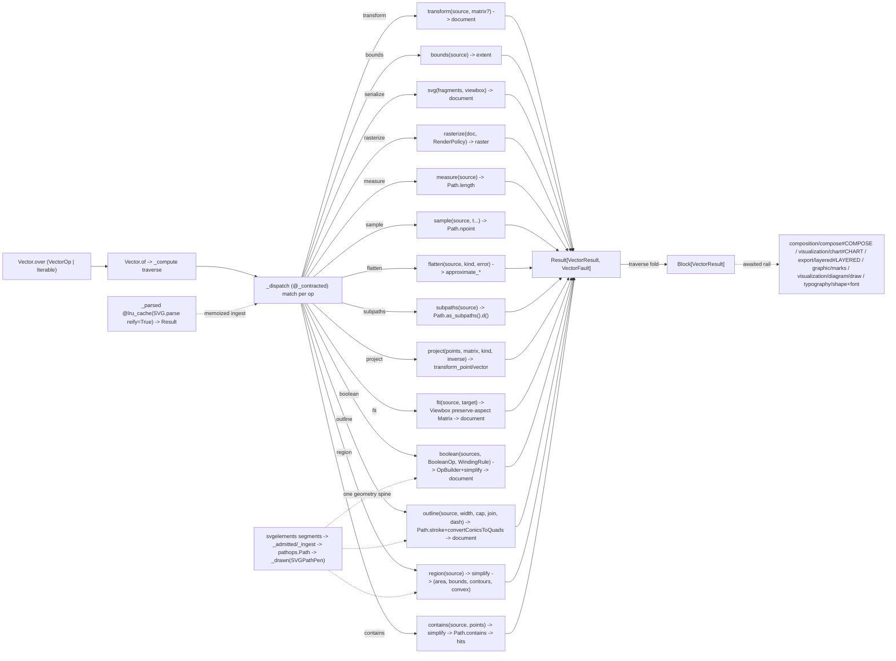

# [PY_ARTIFACTS_GRAPHIC_VECTOR]

The host-free SVG-geometry primitive every visual and document plane composes its vector work from. `Vector` is ONE modal owner over the closed `VectorOp` family, normalizing `VectorOp | Iterable[VectorOp]` at the head so a lone query and a mixed sheet are the same entrypoint, traversing the ops into one `RuntimeRail[Block[VectorResult]]` whose every outcome is the typed `VectorResult` (`document`/`extent`/`measure`/`sampled`/`contours`/`raster`/`region`), never an erased `bytes` a consumer re-parses. Beside the rail the page exposes ONE public composable geometry surface — `bounds`/`transform`/`fit`/`path`/`svg`/`px`/`measure`/`sample`/`flatten`/`subpaths`/`project`/`boolean`/`outline`/`text_path`/`region`/`rasterize` plus the `Element` `Protocol` and the `RenderPolicy` raster-policy owner — that the placement plane (`composition/compose#COMPOSE`) and the `typography/shape#SHAPE` text-on-path seam IMPORT and compose one hop in-process. Every fallible arm rails its provider raise into the closed `VectorFault` `@tagged_union` (`parse`/`render`/`singular`/`empty`/`contract`/`open_path`/`degenerate`); the interior is total over `Result[VectorResult, VectorFault]`, never a railless body trusting `async_boundary` to swallow an `xml.etree.ElementTree.ParseError`, a `resvg` `ValueError`, or a `pathops` `PathOpsError` it never classified.

`svgelements` (pure-Python `Python`, zero-native, host-free, runtime) parses an SVG document into a typed `Shape` tree, resolves bounding geometry through `Shape.bbox(with_stroke=)`, transforms each shape through `Path(geometry) * Matrix`, fits a source into a target viewport through the `Viewbox` preserve-aspect `Matrix`, measures total arc length and vectorized-samples parametric points over the combined `Path` through the numpy-accelerated `Path.npoint`, decomposes the outline into per-contour `Subpath` views, flattens curves to cubics/quads/arcs for a polyline/toolpath consumer, projects points or direction vectors through (or inverse-through) a `Matrix`, and re-serializes every fragment through one `Path.d()` styled egress onto one viewBox-framed `<svg>`; `skia-pathops` (the abi3 `pathops._pathops.abi3.so` binding of Skia's `SkPathOps`/`SkStroke`, runtime) owns the boolean/offset/outline algebra svgelements cannot express — N-ary planar set operations (`op`/`OpBuilder` over `union`/`difference`/`intersection`/`xor`/`reverse_difference`), self-intersection removal and winding repair (`simplify`), stroke-to-outline / fixed-width offset (`Path.stroke` with cap/join/miter/dash), the area/bounds/convexity/contour query family, and the fill-rule point-in-path hit test (`Path.contains`) — over ONE mutable `Path` the svgelements segment stream draws into through the shared FontTools pen protocol and the result draws back out of into a `fonttools` `SVGPathPen`, so the geometry never re-parses a `d` string between ops; `resvg_py` (the runtime native `resvg_py.cpython-315-darwin.so` embedding the Rust `resvg 0.47.0` engine, runtime) rasterizes a placed document to PNG bytes through `svg_to_bytes` on the core with no Cairo, headless-browser, or external-process dependency. The expensive `SVG.parse(reify=True)` ingestion is memoized on the source `bytes` by one `@lru_cache` core that captures the parse fault, so a consumer that queries `bounds`, then `transform`, then `rasterize` over one source parses it once and a malformed source rails once. Because the resvg render, the `svgelements` parse/measure/sample, and the `pathops` boolean/simplify/stroke are all synchronous native/CPU work, `Vector.of` crosses the whole op batch through one `WORKER_BAND`-bounded `to_process` seam off the event loop rather than rendering inline on it, while the in-process composable functions stay synchronous for the placement consumer (`composition/compose#COMPOSE`) that owns its own offload. This page owns ONLY the geometry primitive; the post-render placement logic (scale-fit/n-up/crop/rotate/overlay/annotate/metadata) is `composition/compose#COMPOSE`'s exclusively — that owner consumes this surface, it does not re-own it.

## [01]-[INDEX]

- [01]-[VECTOR]: the SVG-geometry primitive owner over the closed-payload `VectorOp` family, the typed `VectorResult` outcome, and the closed `VectorFault` provider-exception vocabulary — `transform`/`bounds`/`fit`/`serialize`/`rasterize`/`measure`/`sample`/`flatten`/`subpaths`/`project`/`boolean`/`outline`/`region` folding the `svgelements` `SVG.parse(reify=True)` typed-tree ingestion memoized by one `@lru_cache(_parsed)` core, the `elements(conditional=isinstance Shape)` drawable-shape selection that excludes the non-drawable document root, the `Path`/`PathSegment` segment algebra (`Path.d`/`Path.bbox(with_stroke=)`/`Path.length`/`Path.point`/`Path.npoint`/`Path.segments`/`Path.as_subpaths`/`approximate_arcs_with_cubics`), the spec-faithful affine `Matrix` (`scale`/`translate`/`rotate`/`skew` factories composed by `*`, `determinant`-guarded `inverse`, `transform_point`/`transform_vector`) plus the `Viewbox` preserve-aspect fit `Matrix`, the `Length`/`Color`/`Point` value objects, the `skia-pathops` boolean/offset/outline spine (`OpBuilder`/`op` set-ops keyed by the `BooleanOp` selector, `simplify` winding repair, `Path.stroke` keyed by `CapStyle`/`JoinStyle`, the `area`/`bounds`/`isConvex`/contour-count `region` query and the `Path.contains` fill-rule `contains` point-in-path hit test, the `WindingRule`-keyed `fillType`, all over ONE `pathops.Path` bridged by `getPen`/`draw` through the FontTools pen protocol and the `fonttools` `SVGPathPen`), the one `path`/`svg` styled-egress fold onto a viewBox-framed `<svg>`, and the `resvg_py.svg_to_bytes` SVG-to-PNG raster floor under the one `RenderPolicy` — the public composable surface the placement plane imports one hop, the `Vector.over`/`of` modal rail the awaited uniform-op contract over `Block[VectorResult]`, and the `Element` `Protocol` typing the drawable view the geometry fold returns.

## [02]-[VECTOR]

- Owner: `Vector` the one SVG-geometry primitive owner holding `ops: tuple[VectorOp, ...]` and discriminating operation over the closed `VectorOp` `expression.tagged_union` whose every case carries its own typed payload, never a `StrEnum` keyed against a shared erased `dict[str, object]`; projecting one closed `VectorResult` family whose every case carries its own typed outcome, never a comma-joined byte string a consumer re-parses; and railing every provider raise into the closed `VectorFault` `@tagged_union`, never `None`-as-failure and never a bare `async_boundary` catch swallowing an unclassified raise. The `svgelements` `SVG` document is the vector working surface, the `Matrix`/`Path`/`Color`/`Length`/`Point`/`bbox` algebra the geometry-and-transform surface, `resvg_py.svg_to_bytes` the in-process SVG-to-PNG raster floor on the core. `svgelements` owns the SVG path grammar, the affine algebra, the shape primitives (`Rect`/`Circle`/`Ellipse`/`Polygon`/`Polyline`/`SimpleLine`), the curve measure/sample/flatten/decompose query family, and the color/length/point parse — this owner reads `bbox` over the `Shape`-narrowed `elements(conditional=)` sweep, folds the document shapes into one combined `Path` for the measure/sample/flatten/subpaths queries, transforms each shape through `Path(geometry) * Matrix`, and serializes every fragment through the one `path` styled-egress owner onto one `svg`-built viewBox-framed `<svg>` document, never a second path-string emitter, a hand-rolled affine helper, a hand-emitted `<rect>`/`<line>` string, or a re-parsed path string. The placement, n-up, crop, rotate, overlay, annotate, and metadata operations are NOT this owner's concern — they are `composition/compose#COMPOSE`'s.
- Cases: `VectorOp` cases — `Transform(source, matrix=None)` (ingest through the memoized `_parsed`, apply the composed `Matrix` to every drawable shape through `path(shape, matrix)`, and re-emit the transformed SVG framed to the resolved content bbox; `matrix=None` is the identity-normalize form that bakes `reify=True` absolute coordinates, collapsing the prior separate `Parse` arm into the identity case of the one transform body) · `Bounds(source, kind=GEOMETRIC)` (resolve the union `(xmin, ymin, xmax, ymax)` `extent` over `Shape.bbox(with_stroke=kind is INK)`, the geometric layout box or the stroke-inclusive ink extent a tight-crop consumer keys by the `BoundsKind` policy value, never a `with_stroke: bool` knob) · `Fit(source, target)` (compose the `Viewbox` preserve-aspect fit `Matrix` from the resolved source bbox into the `target` viewport and re-emit the placed `document`, the source→target scale-fit `composition/compose#COMPOSE` delegates rather than hand-computing) · `Serialize(fragments, viewbox)` (assemble pre-built `path` fragments onto a fresh `viewbox`-framed `svg` `<svg>` document) · `Rasterize(document, render)` (rasterize the placed document through `resvg_py.svg_to_bytes(**render.kwargs(document))` under the one `RenderPolicy`, returning PNG `raster` bytes) · `Measure(source)` (total arc length over the combined `Path.length()`) · `Sample(source, positions)` (vectorized parametric points at `t ∈ [0, 1]` over the numpy-backed `Path.npoint`, the `positions: float | Iterable[float]` normalized to one tuple at the factory head per `MODAL_ARITY`) · `Flatten(source, kind, error)` (replace every `Arc`/cubic through the `FlattenKind`-keyed `approximate_arcs_with_cubics`/`approximate_arcs_with_quads`/`approximate_bezier_with_circular_arcs` row, re-emitting a polyline/toolpath `document`) · `Subpaths(source)` (decompose the combined outline into per-contour `Subpath.d()` strings over `Path.as_subpaths`, the `contours` family a winding/hole/toolpath consumer keys per closed loop) · `Project(points, matrix, kind=POINT, inverse=False)` (map each domain point through `Point.matrix_transform` or each direction through `Matrix.transform_vector` keyed by `ProjectKind`, optionally inverse-through a `determinant`-guarded `Matrix(matrix).inverse()` copy, the device↔user-space mapping a hit-test/placement consumer needs) · `Boolean(sources, op=UNION, fill=WINDING)` (ingest each `svgelements`-parsed outline into ONE `pathops.Path` through `getPen`, fold the operands through `OpBuilder.add(path, PathOp)`+`resolve` keyed by the `BooleanOp` selector, `simplify` the winding, set `fillType` from the `WindingRule`, and `draw` the result back to an `SVGPathPen` for one styled `document` — the set-op algebra `svgelements` cannot express) · `Outline(source, width, cap=BUTT, join=MITER, miter=4.0, dash=None)` (`Path.stroke` the centerline into a closed filled outline keyed by `CapStyle`/`JoinStyle`, `convertConicsToQuads` for SVG round-trip, and `draw` back — the stroke-to-outline / fixed-width offset the `marks`/`diagram` plane needs for thick connectors and offset boundaries) · `TextPath(glyphs, baseline, offset=0.0)` (thread each `typography/shape#SHAPE` `PositionedGlyphRun` per-glyph outline `(d-string, advance)` along the baseline `Path` at its arc-length position via `Path.point` + a tangent-following `Matrix(tx, ty, -ty, tx, px, py)`, then `OpBuilder`-union the placed glyphs — overlap-merge on tight curves — into one filled `document`; the text-on-path the shape plane composes at this seam for a curved baseline, never a `pathops` import in shape) · `Region(source)` (`simplify` then read the `abs(area)`/`bounds`/contour-count/`isConvex` facts a winding/hole/toolpath consumer keys per outline) · `Contains(source, points)` (`simplify` the ingested outline, then `Path.contains` each `(x, y)` under the resolved `FillType` into one `tuple[bool, ...]` `hits`, the point-in-path membership a placement/hit-test consumer keys — the `points: Iterable[Point2]` normalized to one tuple at the factory head per `MODAL_ARITY`, the hit-test the `region` facts alone cannot answer) — matched by one total `match`/`case`; never a per-source-media-type parse sibling, never a per-shape transform method, never a per-`PathOp` boolean method, never a parallel rasterizer. `VectorResult` cases — `document` (transform/serialize/flatten/fit/boolean/outline/text_path SVG bytes), `extent` (the `Bounds` tuple), `measure` (the arc-length float), `sampled` (the projected/sampled `tuple[Point2, ...]`), `contours` (the per-subpath `tuple[str, ...]` d-strings), `raster` (the rasterize PNG bytes), `region` (the `(area, bounds, contour_count, convex)` `Region` facts), `hits` (the per-point `tuple[bool, ...]` point-in-path membership) — so the rail outcome is structurally addressable, never `bytes` discriminated by length.
- Modality: `Vector.over` is the one modal-arity entrypoint normalizing `VectorOp | Iterable[VectorOp]` into the `ops` tuple by a structural `match` at the head, so a lone geometry query is the one-element case and a mixed transform + sample + rasterize batch is the multi-element case under the identical surface — never a `batch: bool`, never a `mode` knob, and never a per-op or `of_many` sibling. The operation is the value's `VectorOp` case; the arity is the value's shape.
- Auto: `_parsed` is the one `@lru_cache(maxsize=128)` ingestion core — `SVG.parse(BytesIO(source), reify=True)` keyed on the source `bytes` and wrapped in one `try` mapping a `ParseError`/`ValueError`/`TypeError` onto `VectorFault.parse`, `reify=True` resolving transforms into shape geometry so every downstream `bbox()`/`Path` read returns absolute coordinates, and the cache collapsing the repeated parse a multi-query consumer would otherwise pay per op (a malformed source rails once, never per arm); `_shapes` narrows the document through `elements(conditional=lambda element: isinstance(element, Shape))` so the non-drawable `SVG` root and the `Group`/`Use` containers are excluded — the prior `hasattr(element, "bbox")` filter admitted the root, whose `Path(root)` then crashed every outline fold; `_bounds` folds the `Shape.bbox()` boxes into the `(min xmin, min ymin, max xmax, max ymax)` envelope, railing an empty shape set onto `VectorFault.empty`; `_outline` folds every shape's `Path(shape).segments()` through `chain.from_iterable` into one combined `Path` for the measure/sample/flatten/subpaths queries, railing an empty outline onto `VectorFault.empty`; `path` composes `(Path(geometry) * matrix).d()` (identity when `matrix is None`) and admits the optional `Style` stroke through `Color(style[0]).hex`, emitting the styled or bare `<path>` fragment; `svg` frames every fragment body in a fresh `<svg>` whose `viewBox` is the full `xmin ymin width height` extent so non-origin geometry is framed, never clipped to a `0 0 w h` box; `px` resolves a CSS `Length` to absolute px through `Length(length).value(ppi=96.0, viewbox=...)`; `sample` passes `np.asarray(positions)` into `Path.npoint`, reading the `(N, 2)` ndarray (or railing `None` onto `VectorFault.empty`); `project` guards `matrix.determinant` before inverting and inverts a `Matrix(matrix)` copy so the caller's matrix is never mutated; `rasterize` folds the placed document through `resvg_py.svg_to_bytes(**render.kwargs(...))` and maps its `ValueError` onto `VectorFault.render`. Base and transformed shapes both serialize through the one `path` styled-egress owner, never a parallel base-versus-styled emitter; `composition/compose#COMPOSE` parses its own placement angle directly through `svgelements.Angle.parse`, never an imported vector forwarder.
- Faults: `VectorFault` is the one closed `@tagged_union` vocabulary every arm maps its provider raise into — `parse` (an `xml.etree.ElementTree.ParseError`/`ValueError`/`TypeError` from `SVG.parse` over malformed markup, carrying the message; `ParseError` is the real raise the sibling `(ValueError, TypeError)` slice would have missed, since svgelements' default `on_error='ignore'` still surfaces a structural XML fault), `render` (a `resvg_py.svg_to_bytes` `ValueError` on empty/invalid SVG or a bad option value), `singular` (a `project` inverse against a `determinant == 0` matrix, guarded before the `1/det` raise rather than catching the resulting `ZeroDivisionError`), `empty` (a document with no drawable shape, or an outline with no segment — the `min()`-over-empty and `npoint`-`None` causes the interior would otherwise raise on), `contract` (a `BeartypeCallHintViolation` the `_contracted` definition-time weave lifts onto `_dispatch`'s rail, never raising into `_compute`), `open_path` (a `pathops.OpenPathError` when a boolean/stroke arm meets an unclosed contour, guarded as a precondition fault at the incurring `_resolved` seam), and `degenerate` (a `pathops.PathOpsError` leaf — `NumberOfPointsError`/`UnsupportedVerbError`/the root — carrying the leaf type name) — each provider raise named exactly at the arm that incurs it, never a bare `except Exception` and never a railless body trusting the boundary capsule to swallow it; the `pathops` raises cross the shared `_resolved` thunk-trap that names `OpenPathError` before its `PathOpsError` base so the precise open-path cause is not shadowed by the broad leaf, and recovery keys on the case, never a reconstructed message. `Color(value)` is lenient (a malformed color resolves rather than raising), so no `color` fault case is minted — an illusory rail the page does not claim.
- Receipt: `Vector` is a geometry primitive — its rail returns one `Block[VectorResult]` and its composable functions return SVG bytes, a bounds tuple, a float, sampled points, per-contour d-strings, or PNG bytes that the consuming placement/chart/diagram/export plane keys into its own `ContentIdentity.of` and contributes to `core/receipt#RECEIPT` `ArtifactReceipt.Preview`; this primitive mints no content key and adds no receipt case, so the figure-placement evidence (shape count, source/target viewBox, applied transform, resolved bbox, output byte length) is the consuming owner's receipt, never a parallel vector-receipt type.
- Growth: a new geometry query is one `VectorOp` case plus one composable function over the existing `svgelements`/`pathops` surface — a curvature/tangent query rides `Path.point` plus a finite difference, a unit-converted measure rides `Length.to_mm`/`to_inch` once an egress needs the string-suffixed non-px form parsed back to a scalar — never a re-implemented SVG geometry engine; a new boolean kind is one `BooleanOp` member (its `.name` already resolving the `pathops.PathOp` member), a new stroke cap/join one `CapStyle`/`JoinStyle` member, a winding-policy shift one `WindingRule` member; text-on-path is the landed `text_path`/`VectorOp.TextPath` case threading a `typography/shape#SHAPE` `PositionedGlyphRun`'s per-glyph outlines along a baseline `Path` (arc-length `Path.point` + tangent-following `Matrix` + `OpBuilder` union overlap-merge), and a knockout boolean (glyph ∩ clip) composes the SAME `getPen`/`draw` pen spine directly onto the `typography/shape`+`typography/font` glyph-outline producers with no serialization hop; a new transform composition (pre/post compose order) is one `Matrix` factory or compose row carried into the existing `transform`/`project`/`fit` body — never a hand-rolled affine; a new flatten target is one `FlattenKind` member plus one `_FLATTEN` row; a new projection mode is one `ProjectKind` member plus one `_PROJECT` row; a new resvg sizing/font/policy knob is one field on the existing `RenderPolicy` row carried into the one `svg_to_bytes` spread — never a second rasterizer; a new fault cause is one `VectorFault` case; a new outcome shape is one `VectorResult` case; zero new surface.

```python signature
# --- [RUNTIME_PRELUDE] ------------------------------------------------------------------
from collections.abc import Callable, Iterable, Mapping
from enum import StrEnum
from functools import lru_cache, wraps
from io import BytesIO
from itertools import chain
from typing import TYPE_CHECKING, Literal, Protocol, Self, assert_never
from xml.etree.ElementTree import ParseError

import numpy as np
from anyio import to_process
from beartype import BeartypeConf, beartype
from beartype.roar import BeartypeCallHintViolation
from builtins import frozendict
from expression import Error, Ok, Result, case, tag, tagged_union
from expression.collections import Block
from expression.extra.result import traverse
from msgspec import Struct
from msgspec.structs import asdict

from rasm.runtime.faults import RuntimeRail, async_boundary
from rasm.runtime.lanes import WORKER_BAND

lazy import pathops
lazy import resvg_py
lazy from fontTools.pens.svgPathPen import SVGPathPen
lazy from svgelements import SVG, Close, Color, CubicBezier, Length, Line, Matrix, Move, Path, Point, QuadraticBezier, Shape, Viewbox

if TYPE_CHECKING:
    import pathops
    from svgelements import SVG, Matrix, Path, Point, Shape

# --- [TYPES] ----------------------------------------------------------------------------
type Bounds = tuple[float, float, float, float]
type Point2 = tuple[float, float]
type Span = str | float
type Style = tuple[str, float] | None
type RenderKwargs = dict[str, str | int | float | bool | list[str] | None]
type ShapeRendering = Literal["optimize_speed", "crisp_edges", "geometric_precision"]
type TextRendering = Literal["optimize_speed", "optimize_legibility", "geometric_precision"]
type ImageRendering = Literal["optimize_quality", "optimize_speed"]
type VectorOpTag = Literal["transform", "bounds", "serialize", "rasterize", "measure", "sample", "flatten", "subpaths", "project", "boolean", "outline", "text_path", "region", "contains", "clip", "fit"]
type VectorResultTag = Literal["document", "extent", "measure", "sampled", "contours", "raster", "region", "hits"]
type VectorFaultTag = Literal["parse", "render", "singular", "empty", "contract", "open_path", "degenerate"]
type Region = tuple[float, Bounds, int, bool]  # (absolute area, tight bounds, contour count, convex)


class FlattenKind(StrEnum):
    CUBICS = "cubics"
    QUADS = "quads"
    ARCS = "arcs"


class ProjectKind(StrEnum):
    POINT = "point"
    VECTOR = "vector"


# the pathops boolean/stroke/winding selectors — each member NAME mirrors the `pathops.PathOp`/`LineCap`/`LineJoin`/`FillType`
# member it resolves to through `getattr(pathops.<Enum>, member.name)`, so the correspondence is one derivation, never a parallel map.
class BooleanOp(StrEnum):
    UNION = "union"
    DIFFERENCE = "difference"
    INTERSECTION = "intersection"
    XOR = "xor"
    REVERSE_DIFFERENCE = "reverse-difference"


class CapStyle(StrEnum):
    BUTT_CAP = "butt-cap"
    ROUND_CAP = "round-cap"
    SQUARE_CAP = "square-cap"


class JoinStyle(StrEnum):
    MITER_JOIN = "miter-join"
    ROUND_JOIN = "round-join"
    BEVEL_JOIN = "bevel-join"


class WindingRule(StrEnum):
    WINDING = "winding"
    EVEN_ODD = "even-odd"
    INVERSE_WINDING = "inverse-winding"
    INVERSE_EVEN_ODD = "inverse-even-odd"


class BoundsKind(StrEnum):
    GEOMETRIC = "geometric"  # tight path extent
    INK = "ink"              # stroke-inclusive visual extent (bbox with_stroke=True)


class Element(Protocol):
    def bbox(self) -> Bounds | None: ...


# --- [MODELS] ---------------------------------------------------------------------------
class RenderPolicy(Struct, frozen=True):
    width: int | None = None
    height: int | None = None
    zoom: float | None = None
    dpi: float = 0.0
    background: str | None = None
    style_sheet: str | None = None
    resources_dir: str | None = None
    languages: tuple[str, ...] = ()
    skip_system_fonts: bool = False
    font_size: float = 16.0
    font_files: tuple[str, ...] = ()
    font_dirs: tuple[str, ...] = ()
    font_family: str | None = None
    serif_family: str | None = None
    sans_serif_family: str | None = None
    cursive_family: str | None = None
    fantasy_family: str | None = None
    monospace_family: str | None = None
    shape_rendering: ShapeRendering = "geometric_precision"
    text_rendering: TextRendering = "optimize_legibility"
    image_rendering: ImageRendering = "optimize_quality"
    log_information: bool = False

    def kwargs(self, source: Mapping[str, str]) -> RenderKwargs:
        # parameterized over the source-keyword mapping (`{"svg_string": markup}` OR `{"svg_path": path}`) the
        # consumer projects, so the SAME policy sources from this owner's document bytes AND the
        # `composition/compose#COMPOSE` `RasterSource.keywords()` markup-or-file case; the policy rows win on collision.
        rows = {key: (list(value) or None) if isinstance(value, tuple) else value for key, value in asdict(self).items()}
        return {**source, **rows}


# --- [ERRORS] ---------------------------------------------------------------------------
@tagged_union(frozen=True)
class VectorFault:
    tag: VectorFaultTag = tag()
    parse: str = case()
    render: str = case()
    singular: None = case()
    empty: None = case()
    contract: str = case()
    open_path: None = case()   # a pathops boolean/stroke met an unclosed contour (`OpenPathError`)
    degenerate: str = case()   # a pathops `PathOpsError` leaf (`NumberOfPointsError`/`UnsupportedVerbError`/root)


# --- [OPERATIONS] -----------------------------------------------------------------------
@lru_cache(maxsize=128)
def _parsed(source: bytes) -> Result["SVG", VectorFault]:
    try:
        return Ok(SVG.parse(BytesIO(source), reify=True))
    except (ParseError, ValueError, TypeError) as fault:
        return Error(VectorFault(parse=str(fault)))


def _shapes(document: "SVG") -> list["Shape"]:
    return list(document.elements(conditional=lambda element: isinstance(element, Shape)))


def _scene(source: bytes) -> Result[list["Shape"], VectorFault]:
    return _parsed(source).map(_shapes)


def _bounds(shapes: list["Shape"], kind: BoundsKind = BoundsKind.GEOMETRIC, /) -> Result[Bounds, VectorFault]:
    boxes = [box for shape in shapes if (box := shape.bbox(with_stroke=kind is BoundsKind.INK)) is not None]
    return (
        Ok((min(b[0] for b in boxes), min(b[1] for b in boxes), max(b[2] for b in boxes), max(b[3] for b in boxes)))
        if boxes
        else Error(VectorFault(empty=None))
    )


def _outline(shapes: list["Shape"], /) -> Result["Path", VectorFault]:
    outline = Path(*chain.from_iterable(Path(shape).segments() for shape in shapes))
    return Ok(outline) if len(outline) else Error(VectorFault(empty=None))


_FLATTEN: frozendict[FlattenKind, Callable[["Path", float], object]] = frozendict({
    FlattenKind.CUBICS: lambda outline, error: outline.approximate_arcs_with_cubics(error),
    FlattenKind.QUADS: lambda outline, error: outline.approximate_arcs_with_quads(error),
    FlattenKind.ARCS: lambda outline, error: outline.approximate_bezier_with_circular_arcs(error),
})
_PROJECT: frozendict[ProjectKind, Callable[["Matrix", "Point"], "Point"]] = frozendict({
    ProjectKind.POINT: lambda active, point: point.matrix_transform(active),
    ProjectKind.VECTOR: lambda active, point: active.transform_vector(point),
})


# --- [PATHOPS_SPINE] — ONE geometry spine: svgelements Path segments -> pathops.Path -> boolean/simplify/stroke -> SVG d,
# never a re-parsed `d` between ops. The boolean/offset/outline algebra svgelements' Path/Matrix cannot express.
def _ingest(outline: "Path", target: "pathops.Path", /) -> None:
    pen = target.getPen()  # the FontTools PathPen the svgelements segment stream draws into
    for segment in outline.segments():
        match segment:
            case Move():
                pen.moveTo((float(segment.end.x), float(segment.end.y)))
            case Close():
                pen.closePath()
            case CubicBezier():
                pen.curveTo(
                    (float(segment.control1.x), float(segment.control1.y)),
                    (float(segment.control2.x), float(segment.control2.y)),
                    (float(segment.end.x), float(segment.end.y)),
                )
            case QuadraticBezier():
                pen.qCurveTo((float(segment.control.x), float(segment.control.y)), (float(segment.end.x), float(segment.end.y)))
            case _:  # Line and the arcs pre-flattened to cubics upstream
                pen.lineTo((float(segment.end.x), float(segment.end.y)))


def _admitted(outline: "Path", /) -> "pathops.Path":
    outline.approximate_arcs_with_cubics(0.1)  # the pen speaks move/line/cubic/quad/close, never an arc/conic verb
    target = pathops.Path()
    _ingest(outline, target)
    return target


def _to_pathops(source: bytes, /) -> Result["pathops.Path", VectorFault]:
    return _scene(source).bind(_outline).map(_admitted)


def _drawn(result: "pathops.Path", /) -> str:
    result.convertConicsToQuads(0.25)  # SVG has no conic verb; round caps/joins emit conics
    pen = SVGPathPen(None)
    result.draw(pen)
    return pen.getCommands()


def _framed(result: "pathops.Path", /) -> Result[bytes, VectorFault]:
    if not len(result):  # len is the contour count; an empty boolean/stroke result rails empty rather than an empty bounds read
        return Error(VectorFault(empty=None))
    box = result.bounds
    return Ok(svg((f'<path d="{_drawn(result)}"/>',), (float(box[0]), float(box[1]), float(box[2]), float(box[3]))))


def _resolved[T](work: Callable[[], T], /) -> Result[T, VectorFault]:
    try:
        return Ok(work())
    except pathops.OpenPathError:
        return Error(VectorFault(open_path=None))
    except pathops.PathOpsError as fault:
        return Error(VectorFault(degenerate=type(fault).__name__))


def boolean(sources: tuple[bytes, ...], op: BooleanOp = BooleanOp.UNION, fill: WindingRule = WindingRule.WINDING) -> Result[bytes, VectorFault]:
    def _fold(paths: Block["pathops.Path"], /) -> Result[bytes, VectorFault]:
        def _run() -> "pathops.Path":
            builder, member = pathops.OpBuilder(fix_winding=True, keep_starting_points=True), getattr(pathops.PathOp, op.name)
            for operand in paths:  # the first add seeds the base, each later add applies `op` against the accumulator
                builder.add(operand, member)
            result = builder.resolve()
            result.simplify(fix_winding=True)
            result.fillType = getattr(pathops.FillType, fill.name)
            return result

        return _resolved(_run).bind(_framed)

    return traverse(_to_pathops, Block.of_seq(sources)).bind(_fold)


def outline(source: bytes, width: float = 1.0, cap: CapStyle = CapStyle.BUTT_CAP, join: JoinStyle = JoinStyle.MITER_JOIN, miter: float = 4.0, dash: tuple[float, ...] | None = None) -> Result[bytes, VectorFault]:
    def _stroke(centerline: "pathops.Path", /) -> Result[bytes, VectorFault]:
        def _run() -> "pathops.Path":
            centerline.stroke(width, getattr(pathops.LineCap, cap.name), getattr(pathops.LineJoin, join.name), miter, dash)
            centerline.simplify(fix_winding=True)
            return centerline

        return _resolved(_run).bind(_framed)

    return _to_pathops(source).bind(_stroke)


def region(source: bytes) -> Result[Region, VectorFault]:
    def _read(shape: "pathops.Path", /) -> Result[Region, VectorFault]:
        def _run() -> Region:
            shape.simplify(fix_winding=True)
            if not len(shape):  # guard the bounds read: an empty path has no extent
                return (0.0, (0.0, 0.0, 0.0, 0.0), 0, True)
            box = shape.bounds
            return (abs(float(shape.area)), (float(box[0]), float(box[1]), float(box[2]), float(box[3])), len(shape), bool(shape.isConvex))

        return _resolved(_run).bind(lambda facts: Ok(facts) if facts[2] else Error(VectorFault(empty=None)))

    return _to_pathops(source).bind(_read)


def contains(source: bytes, points: tuple[Point2, ...]) -> Result[tuple[bool, ...], VectorFault]:
    def _hit(shape: "pathops.Path", /) -> Result[tuple[bool, ...], VectorFault]:
        def _run() -> tuple[bool, ...]:
            shape.simplify(fix_winding=True)  # canonicalize winding first so the FillType point-in-path test is well-defined
            return tuple(bool(shape.contains((float(x), float(y)))) for x, y in points)

        return _resolved(_run)

    return _to_pathops(source).bind(_hit)


def _rect_path(rect: Bounds, /) -> "pathops.Path":
    # the crop window as a closed `pathops.Path` rectangle each per-shape intersection cuts against.
    x0, y0, x1, y1 = rect
    window = pathops.Path()
    pen = window.getPen()
    pen.moveTo((x0, y0))
    pen.lineTo((x1, y0))
    pen.lineTo((x1, y1))
    pen.lineTo((x0, y1))
    pen.closePath()
    return window


def clip(source: bytes, rect: Bounds) -> Result[bytes, VectorFault]:
    # per-shape geometric crop: intersect EACH drawable shape's outline against the crop rect through
    # `pathops.op(shape, window, INTERSECTION)`, keeping only the non-empty survivors as separate `<path>`
    # fragments framed to the rect — the true geometry cut `composition/compose#COMPOSE`'s Crop arm composes in
    # place of a CSS `<clipPath>`, so a straddling shape is really severed at the crop edge, not masked, and
    # separate shapes stay separate fragments rather than collapsing into one merged path a whole-document boolean gives.
    def _cut(shapes: list["Shape"], /) -> Result[bytes, VectorFault]:
        def _run() -> bytes:
            window = _rect_path(rect)
            fragments = tuple(
                f'<path d="{_drawn(clipped)}"/>'
                for shape in shapes
                if len(clipped := pathops.op(_admitted(Path(*Path(shape).segments())), window, pathops.PathOp.INTERSECTION))
            )
            return svg(fragments, rect)

        return _resolved(_run)

    return _scene(source).bind(_cut)


def elements(source: bytes) -> list[Element]:
    # the public drawable-shape sweep the placement plane reads (`composition/compose#COMPOSE`): parse once
    # (the memoized `_parsed`), narrow to the drawable `Shape` set through `_scene`; a malformed source yields
    # the empty list so a placement fold and the crop bbox pre-filter read `Element.bbox()` without re-parsing.
    return _scene(source).default_value([])


def text_path(glyphs: tuple[tuple[str, float], ...], baseline: bytes, offset: float = 0.0) -> Result[bytes, VectorFault]:
    # thread each `typography/shape#SHAPE` PositionedGlyphRun per-glyph outline (an SVG `d`-string + its advance) along
    # the baseline `Path` parsed from `baseline`: place each glyph at its cumulative arc-length position with a tangent-
    # following affine, then OpBuilder-union the placed glyphs (overlap-merge on tight curves) into one filled document.
    # `typography/shape#SHAPE` composes THIS entrypoint at the seam for a curved-baseline run — the `skia-pathops`/`svgelements`
    # algebra never crosses into shape; a straight-baseline run stays shape's own advance-threaded pen.
    def _thread(spine: "Path", /) -> Result[bytes, VectorFault]:
        total = spine.length()
        if total <= 0.0 or not glyphs:
            return Error(VectorFault(empty=None))

        def _placed(cursor: float, d: str, advance: float, /) -> "pathops.Path":
            frac = min(max(cursor + advance * 0.5, 0.0) / total, 1.0)  # `Path.point` is arc-length-normalized: the glyph mid-advance position
            here, ahead = spine.point(frac), spine.point(min(frac + 1e-3, 1.0))
            dx, dy = float(ahead.x - here.x), float(ahead.y - here.y)
            norm = (dx * dx + dy * dy) ** 0.5 or 1.0
            tx, ty = dx / norm, dy / norm  # unit tangent; Matrix(tx, ty, -ty, tx, px, py) rotates the glyph x-axis onto the baseline tangent
            return _admitted(Path(d) * Matrix(tx, ty, -ty, tx, float(here.x), float(here.y)))

        def _run() -> "pathops.Path":
            builder, cursor = pathops.OpBuilder(fix_winding=True, keep_starting_points=True), offset
            for d, advance in glyphs:  # each non-empty placed glyph is one UNION operand so tight-curve overlaps merge into one outline
                if d:
                    builder.add(_placed(cursor, d, advance), pathops.PathOp.UNION)
                cursor += advance
            result = builder.resolve()
            result.simplify(fix_winding=True)
            return result

        return _resolved(_run).bind(_framed)

    return _scene(baseline).bind(lambda shapes: _outline(shapes).bind(_thread))


def fit(source: bytes, target: Bounds) -> Result[bytes, VectorFault]:
    def _place(shapes: list["Shape"], /) -> Result[bytes, VectorFault]:
        return _bounds(shapes).map(lambda src: svg(tuple(path(shape, _fit_matrix(src, target)) for shape in shapes), target))

    return _scene(source).bind(_place)


def _fit_matrix(src: Bounds, target: Bounds, /) -> "Matrix":
    content = f"{src[0]} {src[1]} {src[2] - src[0]} {src[3] - src[1]}"
    viewport = f"{target[0]} {target[1]} {target[2] - target[0]} {target[3] - target[1]}"
    return Matrix(Viewbox(content, preserve_aspect_ratio="xMidYMid meet").transform(Viewbox(viewport)))


def path(geometry: object, matrix: "Matrix | None" = None, style: Style = None) -> str:
    shape = Path(geometry) if matrix is None else Path(geometry) * matrix
    stroke = "" if style is None else f' fill="none" stroke="{Color(style[0]).hex}" stroke-width="{style[1]}"'
    return f'<path d="{shape.d()}"{stroke}/>'


def svg(fragments: Iterable[str], viewbox: Bounds) -> bytes:
    xmin, ymin, xmax, ymax = viewbox
    width, height = xmax - xmin, ymax - ymin
    body = "".join(fragments)
    return f'<svg xmlns="http://www.w3.org/2000/svg" width="{width}" height="{height}" viewBox="{xmin} {ymin} {width} {height}">{body}</svg>'.encode()


def px(length: Span, viewbox: object = None) -> float:
    return Length(length).value(ppi=96.0, viewbox=viewbox)


def bounds(source: bytes, kind: BoundsKind = BoundsKind.GEOMETRIC) -> Result[Bounds, VectorFault]:
    return _scene(source).bind(lambda shapes: _bounds(shapes, kind))


def transform(source: bytes, matrix: "Matrix | None" = None) -> Result[bytes, VectorFault]:
    return _scene(source).bind(
        lambda shapes: _bounds(shapes).map(lambda box: svg(tuple(path(shape, matrix) for shape in shapes), box))
    )


def measure(source: bytes) -> Result[float, VectorFault]:
    return _scene(source).bind(_outline).map(lambda outline: outline.length())


def sample(source: bytes, positions: tuple[float, ...]) -> Result[tuple[Point2, ...], VectorFault]:
    return _scene(source).bind(_outline).bind(lambda outline: _points(outline.npoint(np.asarray(positions, dtype=float))))


def _points(xy: object, /) -> Result[tuple[Point2, ...], VectorFault]:
    return Error(VectorFault(empty=None)) if xy is None else Ok(tuple((float(x), float(y)) for x, y in xy))


def subpaths(source: bytes) -> Result[tuple[str, ...], VectorFault]:
    return _scene(source).bind(_outline).map(lambda outline: tuple(contour.d() for contour in outline.as_subpaths()))


def flatten(source: bytes, kind: FlattenKind = FlattenKind.CUBICS, error: float = 0.1) -> Result[bytes, VectorFault]:
    def _emit(shapes: list["Shape"], /) -> Result[bytes, VectorFault]:
        return _outline(shapes).bind(lambda outline: _bounds(shapes).map(lambda box: _flattened(outline, kind, error, box)))

    return _scene(source).bind(_emit)


def _flattened(outline: "Path", kind: FlattenKind, error: float, box: Bounds, /) -> bytes:
    _FLATTEN[kind](outline, error)
    return svg((f'<path d="{outline.d()}"/>',), box)


def project(points: Iterable[Point2], matrix: "Matrix", kind: ProjectKind = ProjectKind.POINT, inverse: bool = False) -> Result[tuple[Point2, ...], VectorFault]:
    if inverse and matrix.determinant == 0:
        return Error(VectorFault(singular=None))
    active, apply = (Matrix(matrix).inverse() if inverse else matrix), _PROJECT[kind]
    return Ok(tuple((float(r.x), float(r.y)) for r in (apply(active, Point(*pt)) for pt in points)))


def rasterize(document: bytes, render: RenderPolicy = RenderPolicy()) -> Result[bytes, VectorFault]:
    try:
        return Ok(resvg_py.svg_to_bytes(**render.kwargs({"svg_string": document.decode()})))
    except ValueError as fault:
        return Error(VectorFault(render=str(fault)))


# --- [COMPOSITION] ----------------------------------------------------------------------
@tagged_union(frozen=True)
class VectorOp:
    tag: VectorOpTag = tag()
    transform: tuple[bytes, "Matrix | None"] = case()
    bounds: tuple[bytes, BoundsKind] = case()
    serialize: tuple[tuple[str, ...], Bounds] = case()
    rasterize: tuple[bytes, RenderPolicy] = case()
    measure: bytes = case()
    sample: tuple[bytes, tuple[float, ...]] = case()
    flatten: tuple[bytes, FlattenKind, float] = case()
    subpaths: bytes = case()
    project: tuple[tuple[Point2, ...], "Matrix", ProjectKind, bool] = case()
    boolean: tuple[tuple[bytes, ...], BooleanOp, WindingRule] = case()
    outline: tuple[bytes, float, CapStyle, JoinStyle, float, tuple[float, ...] | None] = case()
    text_path: tuple[tuple[tuple[str, float], ...], bytes, float] = case()  # (per-glyph (SVG d-string, advance), baseline SVG, along-path offset)
    region: bytes = case()
    contains: tuple[bytes, tuple[Point2, ...]] = case()
    clip: tuple[bytes, Bounds] = case()
    fit: tuple[bytes, Bounds] = case()

    @staticmethod
    def Transform(source: bytes, matrix: "Matrix | None" = None) -> "VectorOp":
        return VectorOp(transform=(source, matrix))

    @staticmethod
    def Bounds(source: bytes, kind: BoundsKind = BoundsKind.GEOMETRIC) -> "VectorOp":
        return VectorOp(bounds=(source, kind))

    @staticmethod
    def Boolean(sources: Iterable[bytes], op: BooleanOp = BooleanOp.UNION, fill: WindingRule = WindingRule.WINDING) -> "VectorOp":
        return VectorOp(boolean=(tuple(sources), op, fill))

    @staticmethod
    def Outline(source: bytes, width: float = 1.0, cap: CapStyle = CapStyle.BUTT_CAP, join: JoinStyle = JoinStyle.MITER_JOIN, miter: float = 4.0, dash: tuple[float, ...] | None = None) -> "VectorOp":
        return VectorOp(outline=(source, width, cap, join, miter, dash))

    @staticmethod
    def TextPath(glyphs: Iterable[tuple[str, float]], baseline: bytes, offset: float = 0.0) -> "VectorOp":
        return VectorOp(text_path=(tuple(glyphs), baseline, offset))

    @staticmethod
    def Region(source: bytes) -> "VectorOp":
        return VectorOp(region=source)

    @staticmethod
    def Contains(source: bytes, points: Iterable[Point2]) -> "VectorOp":
        return VectorOp(contains=(source, tuple(points)))

    @staticmethod
    def Clip(source: bytes, rect: Bounds) -> "VectorOp":
        return VectorOp(clip=(source, rect))

    @staticmethod
    def Fit(source: bytes, target: Bounds) -> "VectorOp":
        return VectorOp(fit=(source, target))

    @staticmethod
    def Serialize(fragments: tuple[str, ...], viewbox: Bounds) -> "VectorOp":
        return VectorOp(serialize=(fragments, viewbox))

    @staticmethod
    def Rasterize(document: bytes, render: RenderPolicy = RenderPolicy()) -> "VectorOp":
        return VectorOp(rasterize=(document, render))

    @staticmethod
    def Measure(source: bytes) -> "VectorOp":
        return VectorOp(measure=source)

    @staticmethod
    def Sample(source: bytes, positions: float | Iterable[float]) -> "VectorOp":
        return VectorOp(sample=(source, (positions,) if isinstance(positions, float) else tuple(positions)))

    @staticmethod
    def Flatten(source: bytes, kind: FlattenKind = FlattenKind.CUBICS, error: float = 0.1) -> "VectorOp":
        return VectorOp(flatten=(source, kind, error))

    @staticmethod
    def Subpaths(source: bytes) -> "VectorOp":
        return VectorOp(subpaths=source)

    @staticmethod
    def Project(points: Iterable[Point2], matrix: "Matrix", kind: ProjectKind = ProjectKind.POINT, inverse: bool = False) -> "VectorOp":
        return VectorOp(project=(tuple(points), matrix, kind, inverse))


@tagged_union(frozen=True)
class VectorResult:
    tag: VectorResultTag = tag()
    document: bytes = case()
    extent: Bounds = case()
    measure: float = case()
    sampled: tuple[Point2, ...] = case()
    contours: tuple[str, ...] = case()
    raster: bytes = case()
    region: Region = case()
    hits: tuple[bool, ...] = case()


_CONTRACT = BeartypeConf(is_pep484_tower=True)


def _contracted(operation: Callable[[VectorOp], Result[VectorResult, VectorFault]], /) -> Callable[[VectorOp], Result[VectorResult, VectorFault]]:
    guarded = beartype(conf=_CONTRACT)(operation)

    @wraps(operation)
    def call(op: VectorOp, /) -> Result[VectorResult, VectorFault]:
        try:
            return guarded(op)
        except BeartypeCallHintViolation as violation:
            return Error(VectorFault(contract=type(violation).__name__))

    return call


@_contracted
def _dispatch(op: VectorOp, /) -> Result[VectorResult, VectorFault]:
    match op:
        case VectorOp(tag="transform", transform=(source, matrix)):
            return transform(source, matrix).map(lambda document: VectorResult(document=document))
        case VectorOp(tag="bounds", bounds=(source, kind)):
            return bounds(source, kind).map(lambda extent: VectorResult(extent=extent))
        case VectorOp(tag="serialize", serialize=(fragments, viewbox)):
            return Ok(VectorResult(document=svg(fragments, viewbox)))
        case VectorOp(tag="rasterize", rasterize=(document, render)):
            return rasterize(document, render).map(lambda raster: VectorResult(raster=raster))
        case VectorOp(tag="measure", measure=source):
            return measure(source).map(lambda length: VectorResult(measure=length))
        case VectorOp(tag="sample", sample=(source, positions)):
            return sample(source, positions).map(lambda points: VectorResult(sampled=points))
        case VectorOp(tag="flatten", flatten=(source, kind, error)):
            return flatten(source, kind, error).map(lambda document: VectorResult(document=document))
        case VectorOp(tag="subpaths", subpaths=source):
            return subpaths(source).map(lambda contours: VectorResult(contours=contours))
        case VectorOp(tag="project", project=(points, matrix, kind, inverse)):
            return project(points, matrix, kind, inverse).map(lambda projected: VectorResult(sampled=projected))
        case VectorOp(tag="boolean", boolean=(sources, op, fill)):
            return boolean(sources, op, fill).map(lambda document: VectorResult(document=document))
        case VectorOp(tag="outline", outline=(source, width, cap, join, miter, dash)):
            return outline(source, width, cap, join, miter, dash).map(lambda document: VectorResult(document=document))
        case VectorOp(tag="text_path", text_path=(glyphs, baseline, offset)):
            return text_path(glyphs, baseline, offset).map(lambda document: VectorResult(document=document))
        case VectorOp(tag="region", region=source):
            return region(source).map(lambda facts: VectorResult(region=facts))
        case VectorOp(tag="contains", contains=(source, points)):
            return contains(source, points).map(lambda flags: VectorResult(hits=flags))
        case VectorOp(tag="clip", clip=(source, rect)):
            return clip(source, rect).map(lambda document: VectorResult(document=document))
        case VectorOp(tag="fit", fit=(source, target)):
            return fit(source, target).map(lambda document: VectorResult(document=document))
        case _ as unreachable:
            assert_never(unreachable)


def _normalized(ops: VectorOp | Iterable[VectorOp], /) -> tuple[VectorOp, ...]:
    match ops:
        case VectorOp():
            return (ops,)
        case _:
            return tuple(ops)


def _worked(ops: tuple[VectorOp, ...], /) -> Result[Block[VectorResult], VectorFault]:
    return traverse(_dispatch, Block.of_seq(ops))


class Vector(Struct, frozen=True):
    ops: tuple[VectorOp, ...]

    @classmethod
    def over(cls, ops: VectorOp | Iterable[VectorOp], /) -> Self:
        return cls(ops=_normalized(ops))

    async def of(self) -> RuntimeRail[Block[VectorResult]]:
        return await async_boundary("vector.sheet", self._compute)

    async def _compute(self) -> Result[Block[VectorResult], VectorFault]:
        # the resvg native render plus the svgelements parse/measure/sample is synchronous native/CPU work, so the whole
        # op batch crosses ONE WORKER_BAND-bounded subprocess seam off the event loop, never inline on it; the fail-fast
        # `traverse` runs in the worker so a malformed source still rails `VectorFault.parse` once over the batch.
        return await to_process.run_sync(_worked, self.ops, limiter=WORKER_BAND)


# --- [EXPORTS] --------------------------------------------------------------------------
__all__ = [
    "BooleanOp", "Bounds", "BoundsKind", "CapStyle", "Element", "FlattenKind", "JoinStyle", "Length", "Point2", "ProjectKind", "Region", "RenderPolicy", "Style", "Vector", "VectorFault", "VectorOp", "VectorResult", "WindingRule",
    "boolean", "bounds", "clip", "contains", "elements", "fit", "flatten", "measure", "outline", "path", "project", "px", "rasterize", "region", "sample", "subpaths", "svg", "text_path", "transform",
]
```

The `svgelements` geometry surface is the spec-faithful primitive every placement consumer reads through one memoized, fault-railed ingestion: `SVG.parse(source, reify=True)` is the single polymorphic ingestion factory across filename/file-object/`str` source, `reify=True` baking transforms into shape geometry so a downstream `bbox()`/`Path` read returns absolute coordinates, and the `@lru_cache(_parsed)` core keying on the source `bytes` so a multi-query consumer pays the parse once and a malformed source rails `VectorFault.parse` once. `SVG.elements(conditional=)` is the single selection surface — a predicate discriminates which resolved nodes the iterator yields, never a `find`/`select`/`filter` family — and `_shapes` narrows it by `isinstance(element, Shape)` into the drawable set, excluding the non-drawable `SVG` document root the prior `hasattr(element, "bbox")` filter admitted (whose `Path(root)` then crashed every outline fold). `Matrix` is the one affine owner whose bare `scale`/`translate`/`rotate`/`skew` factories build a transform, `*` composes, and `determinant`/`inverse` answer invertibility — `inverse()` mutates in place and divides by the determinant, so `project` guards `matrix.determinant == 0` onto `VectorFault.singular` before inverting and inverts a `Matrix(matrix)` copy so the caller's matrix is never mutated, mapping each point through `Point.matrix_transform` (full affine) or each direction through `Matrix.transform_vector` (translation-free) keyed by `ProjectKind`. `Path` is the one mutable `MutableSequence` of `PathSegment` over the `Move`/`Line`/`Close`/`QuadraticBezier`/`CubicBezier`/`Arc` grammar whose `d()`/`bbox()`/`segments()`/`length()`/`point()`/`npoint()`/`as_subpaths()`/`approximate_arcs_with_cubics()` query, measure, vectorized-sample, decompose, flatten, and serialize through one owner, never a re-parsed path string — `_outline` folds every shape's segments through `chain.from_iterable` into one combined `Path` so `measure`/`sample`/`flatten`/`subpaths` operate on the whole document outline. `sample` passes `numpy.asarray(positions)` into `Path.npoint`, the numpy-accelerated vectorized sweep returning one `(N, 2)` array (or `None` for an empty path, railed `VectorFault.empty`) where the prior per-position `Path.point` generator re-derived one query at a time; `subpaths` reads `Path.as_subpaths()` for the per-contour `Subpath.d()` strings a winding/hole/toolpath consumer keys per closed loop. Base and transformed shapes both serialize through the one `path(geometry, matrix, style)` styled-egress owner: the optional `Style` tuple admits a stroke literal through the catalogued `Color(value)` parse and emits the `Color(value).hex` channel literal, while a `None` style emits the bare `<path d="..."/>` base fragment, and `svg` frames every body in a `viewBox` of the full `xmin ymin width height` extent so non-origin geometry is framed rather than clipped to a `0 0 w h` box. The `resvg_py.svg_to_bytes` raster floor is the terminal SVG-to-PNG sink: it rasterizes the placed document on the core through the embedded Rust `resvg 0.47.0` engine with no Cairo, headless-browser, or external-process dependency, the `RenderPolicy.kwargs` projecting the full sizing/parsing/font/policy/diagnostic axis through one `asdict`-driven spread (each `()`-default tuple field coercing to `list(value) or None` so `languages`/`font_files`/`font_dirs` arrive as the catalogue's `list[str] | None` shape) onto the one `svg_to_bytes` call typed `RenderKwargs`, never a hand-forwarded keyword wall or an erased `dict[str, object]` bag, and mapping the engine's `ValueError` onto `VectorFault.render`.

The `skia-pathops` boolean/offset/outline spine is the second geometry engine — the set-op, winding-repair, stroke-to-outline, and geometric-query algebra `svgelements` has no member for — composed onto the same rail without a second `d`-parse. `_admitted` flattens every `Arc` to cubics on the `svgelements` side then `_ingest` replays the segment stream into a `pathops.Path` through the FontTools `getPen()` under one total `match` over `Move`/`Close`/`CubicBezier`/`QuadraticBezier`/`Line`, so a source outline crosses into the Skia accumulator once; `boolean` folds N operands through `OpBuilder.add(path, getattr(pathops.PathOp, op.name))`+`resolve` (the first add seeding the base, each later add applying the `BooleanOp`-selected `PathOp`), `simplify(fix_winding=True)` canonicalizes self-intersections, and the `WindingRule`-selected `fillType` fixes what "inside" means; `outline` runs `Path.stroke(width, LineCap, LineJoin, miter, dash)` to convert an open centerline into a closed filled offset outline; `region` reads `abs(area)`/`bounds`/contour-count/`isConvex` for the winding/hole/area/convexity query a toolpath or placement consumer keys per contour, and `contains` tests each point through `Path.contains` under the resolved `fillType` for the point-in-path hit test that same consumer keys per placement (the membership the `region` facts alone cannot answer); and every result `convertConicsToQuads(0.25)` then `draw`s back into a `fonttools` `SVGPathPen`, whose `getCommands()` `d`-string frames through the one `svg()` viewBox owner — ONE geometry spine from the parsed `svgelements` outline through the Skia boolean/offset to the SVG fragment, the `OpenPathError`/`PathOpsError` raises railed at the shared `_resolved` trap and the whole batch riding the same `WORKER_BAND` `to_process` seam as the resvg render, since `op`/`simplify`/`stroke` are synchronous native CPU work. The same `getPen`/`draw` pen protocol the `fonttools`/`uharfbuzz` glyph producers speak lets a future glyph-outline boolean or offset compose `pathops` directly onto `typography/shape`+`typography/font` with no serialization hop.



## [03]-[RESEARCH]

- [SCENE_PREDICATE] [RESOLVED]: the drawable-shape selection is `document.elements(conditional=lambda element: isinstance(element, Shape))`, verified by reflection — `SVG.elements()` yields the `SVG` document root itself (which carries a `bbox` attribute, so the prior `hasattr(element, "bbox")` post-filter ADMITTED it), and `Path(svg_root)` then raised `AttributeError: 'SVG' object has no attribute 'fill'`, crashing `_outline` and therefore `measure`/`sample`/`flatten`/`subpaths` on every real document. `isinstance(element, Shape)` was confirmed `False` for the root and `True` for `Rect`/`Circle`, and the catalogued `elements(conditional=)` predicate is the doctrine-correct selection surface (not a post-`hasattr` filter), so the fold operates over genuine drawables alone. Justified on DOMAIN (the geometry fold owns drawable shapes, never the document container) and PACKAGE (the `Shape` base and the `conditional=` predicate are the catalogued selection surface).
- [VECTORIZED_SAMPLE] [RESOLVED]: `Sample` rides `Path.npoint(np.asarray(positions, dtype=float))`, verified to require a numpy array input (it boolean-indexes `positions` and scales it by the segment count) and return one `(N, 2)` `ndarray` (or `None` on a zero-segment outline). The prior page deferred `npoint` "until the catalogue reflects npoint's array return shape" while serving a per-position `Path.point` generator — a false deferral, since `npoint` is a catalogued member and its return is now reflected; the vectorized form layers the shared `numpy` rail onto the folder `svgelements` surface (LIBRARY_DEPTH), one array sweep where the generator re-derived one query per `t`. Justified on PACKAGE (`Path.npoint` + the admitted `numpy` rail).
- [SUBPATH_DECOMPOSE] [RESOLVED]: `Subpaths` rides `Path.as_subpaths()` (a generator yielding `Subpath` views, each with its own `Subpath.d()` serializer), verified by reflection over a two-contour outline (a `Rect` and a `Circle` decomposed to two `d`-strings). The prior page deferred `as_subpaths` "once the catalogue reflects Subpath's own serialize accessor" — a second false deferral, since `Subpath.d()` is a real method on a catalogued type; the `Subpaths` op plus the `VectorResult.contours` case land the per-contour decomposition a winding-number/hole-detection/per-loop-toolpath consumer needs. Justified on PACKAGE (`Path.as_subpaths`/`Subpath.d`) and DOMAIN (per-contour access is a core SVG-geometry query, not the combined outline alone).
- [PROJECT_KIND] [RESOLVED]: `Project` carries the `ProjectKind` policy value (`POINT` through `Point.matrix_transform`, `VECTOR` through `Matrix.transform_vector`), both verified present, so a tangent/normal/direction projects translation-free where a point projects through the full affine — the `_PROJECT` `frozendict` keys the apply function so a third mode is one row, never a `bool`. The inverse leg was reflected to expose two prior bugs the rebuild closes: `Matrix.inverse()` MUTATES the receiver in place (it reassigns `self.a`/`self.b`/…), so the prior `matrix.inverse()` silently mutated the caller's shared matrix — `project` now inverts a `Matrix(matrix)` copy — and it raises `ZeroDivisionError` on a singular operand, now guarded by `matrix.determinant == 0` onto `VectorFault.singular`. Justified on PACKAGE (`Matrix.transform_vector`/`Matrix.determinant`) and DOMAIN (direction projection and a non-mutating, singular-safe inverse are the geometry the device↔user mapping owes).
- [VIEWBOX_FRAME] [RESOLVED]: `svg(fragments, viewbox: Bounds)` frames the document with a `viewBox` of the full `xmin ymin width height` extent. The prior `svg(fragments, width, height)` emitted `viewBox="0 0 {w} {h}"` while `transform` sized the document to `(xmax - xmin, ymax - ymin)` — verified against a reified document whose content bbox is `(2, 3, 19, 19)`, so geometry at `x ∈ [2, 19]` was clipped outside a `0 0 17 16` box. One `svg` owner taking the `Bounds` serves both legs: `transform`/`flatten` pass the resolved content bbox, and `composition/compose#COMPOSE` passes its target frame (origin `0, 0` for a placed sheet, nonzero for a cropped view), never a second serializer. Justified on DOMAIN (a viewBox must frame the geometry it carries; SVG admits a nonzero viewBox origin).
- [PATHOPS_BOOLEAN] [RESOLVED]: the `skia-pathops` boolean/offset/outline arm closes the single largest gap the brief and the `skia-pathops.md` `[STACKING]` section both assign this owner — the set-op, winding-repair, stroke-to-outline, and geometric-query algebra `svgelements`' `Path`/`Matrix` has no member for. Every cited member is verified present on the installed `pathops 0.9.2` (`op`/`simplify`/`OpBuilder`; `PathOp` 5 members / `FillType` 4 / `LineCap` 3 / `LineJoin` 3; `Path.stroke(width, cap, join, miter_limit, dash_array, dash_offset)`/`getPen`/`draw`/`convertConicsToQuads`/`area`/`bounds`/`isConvex`/`fillType`; `OpenPathError`/`PathOpsError`/`NumberOfPointsError`/`UnsupportedVerbError`), and the `OpBuilder.add(p, PathOp.UNION)`×N + `resolve` fold was exercised end-to-end (two overlapping triangles union to one contour of area `87.5`) and its result drawn to a `fonttools` `SVGPathPen` (`M0.0 0.0H10.0V5.0H15.0V15.0Z`). The `BooleanOp`/`CapStyle`/`JoinStyle`/`WindingRule` local `StrEnum`s carry member NAMES mirroring the `pathops` enum members, so `getattr(pathops.<Enum>, member.name)` is ONE derivation (never a hand-synced `frozendict` parallel to the provider enum), the same boundary-vocabulary discipline `FlattenKind`/`ProjectKind` hold over `svgelements`. The geometry spine never re-parses a `d` between ops: `_admitted` flattens arcs to cubics, `_ingest` replays svgelements segments into the `pathops.Path` pen under one total `match` over `Move`/`Close`/`CubicBezier`/`QuadraticBezier`/`Line`, and `_drawn` `convertConicsToQuads` then `draw`s back — the `op(one, two, PathOp.REVERSE_DIFFERENCE)` binary form and the `OpBuilder` N-way form both sidestep the `reverse_difference` top-level import asymmetry (verified absent at top level, present at `pathops.operations`). Justified on PACKAGE (the whole boolean/offset/outline surface the page ignored) and CONSUMER (`marks`/`diagram` thick connectors and offset boundaries, and the glyph-outline booleans the typography plane composes onto the shared pen spine).
- [GROWTH_AXES] [RESOLVED]: two of the three prior growth axes are promoted to real cases now the `pathops` boolean/offset consumers (marks/diagram) exist — `Path.bbox(with_stroke=True)` lands as the `BoundsKind.INK` policy value on `Bounds` (the stroke-inclusive ink extent a tight crop keys, verified `with_stroke` in the `Path.bbox` signature), and `svgelements.Viewbox` lands as the `Fit` op (`Viewbox(content, "xMidYMid meet").transform(Viewbox(viewport))` -> a `Matrix`, verified returning the parseable transform string `translate(0, 50) scale(2, 2)` for a `100×50` content into a `200×200` viewport). The third — a unit-converted measure — STAYS a growth axis: `Length.to_mm(ppi=)`/`to_inch(ppi=)` return unit-SUFFIXED strings (`"25.4mm"`/`"1in"`) not scalars, and `Length.value_in_units` is unreliable on the installed `svgelements 1.9.6` (its attribute access returns a float, defeating a clean call), so a numeric non-px measure needs a suffix-strip an egress consumer has no contract for yet; forcing it now would ship the exact fragile string-parse the density bar rejects. It lands as one `px` unit policy once a `pt`/`mm` egress declares the parse, never the catalogue.
- [POINT_HIT_TEST] [RESOLVED]: `Contains(source, points)` closes the point-in-path hit-test the prior surface's prose PROMISED (the `region` description named a "hit-test query") but no op implemented — `region` reads `abs(area)`/`bounds`/contour-count/`isConvex` and never answers point membership, so the claim was illusory against the fence. `pathops.Path.contains(pt)` is the verified catalogued query member (skia-pathops query [05], the fill-rule point-in-path test), so the arm ingests the outline once through the shared `_to_pathops` spine, `simplify(fix_winding=True)` canonicalizes the winding, and `Path.contains` each `(x, y)` under the resolved `FillType` folds one `tuple[bool, ...]` `hits` — the placement/toolpath membership `project` (device↔user mapping) and `region` (area/winding facts) cannot answer. The `points: Iterable[Point2]` normalize to one tuple at the `Contains` factory head per `MODAL_ARITY`, so a single hit and a mask sweep are the one arm; the `pathops` raise rails through the shared `_resolved` trap onto `open_path`/`degenerate` exactly as `region`/`boolean`/`outline` do. Justified on PACKAGE (`Path.contains` was an unused verified member), CONSUMER (the hit test the `marks`/`diagram`/placement plane keys per point), and the prose-vs-implementation gap the region hit-test claim opened.
