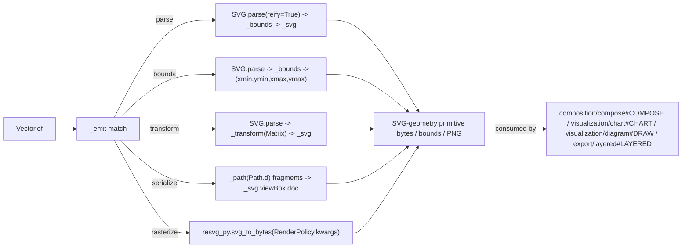

# [PY_ARTIFACTS_GRAPHIC_VECTOR]

The SVG-geometry primitive every visual and document plane composes its vector work from. `Vector` is ONE owner over the pure SVG geometry/transform/parse/bounds/serialize surface — `svgelements` (pure-Python `py3-none-any`, zero-native, host-free, cp315-core) parses an SVG document into a typed `PathSegment`-and-shape tree, resolves its bounding geometry, transforms it through the spec-faithful affine `Matrix` algebra, and re-serializes every fragment through one `Path.d()` styled egress; `resvg-py` (the native `cpython-315-darwin.so` embedding the Rust `resvg 0.47.0` engine, cp315-core) rasterizes a placed SVG document to PNG bytes through `svg_to_bytes` on the core with no Cairo, headless-browser, or external-process dependency. `VectorOp` is ONE closed family carrying each operation's typed payload, never an erased `params` bag, dispatched by one total `match`. It is the geometry substrate the placement plane (`composition/compose#COMPOSE`), the chart plane (`visualization/chart#CHART`), the diagram plane (`visualization/diagram#DRAW`), and the editable named-layer egress (`export/layered#LAYERED`) consume — they read SVG geometry, compose transforms, query bounds, and rasterize through this one primitive rather than each re-implementing the SVG path grammar or the affine algebra `svgelements` already owns. This page owns ONLY the geometry primitive; the post-render placement logic (scale-fit/n-up/crop/rotate/overlay/annotate/metadata) is `composition/compose#COMPOSE`'s exclusively — that owner consumes this primitive, it does not re-own it.

## [01]-[INDEX]

- [01]-[VECTOR]: the SVG-geometry primitive owner over the closed-payload `VectorOp` family — parse/bounds/transform/serialize/rasterize folding the `svgelements` `SVG.parse(reify=True)` typed-tree ingestion, the `Path`/`PathSegment` segment algebra, the spec-faithful affine `Matrix` (`scale`/`translate`/`rotate`/`skew` factories composed by `*`, `pre_*`/`post_*` compose, `inverse`), the `Length`/`Color`/`Angle`/`Point` value objects (unit resolution, color-channel parse, CSS-angle parse, point geometry), the `bbox(transformed=, with_stroke=)` bounds query, and the one `_path`/`_svg` styled-egress fold onto a viewBox-sized `<svg>` document, plus the `resvg_py.svg_to_bytes` SVG-to-PNG raster floor over the embedded Rust `resvg 0.47.0` engine — the `Element` `Protocol` declaring the one `bbox()` method the geometry fold touches, never an erased `object` and never an uncatalogued `svgelements` base type.

## [02]-[VECTOR]

- Owner: `Vector` the one SVG-geometry primitive owner discriminating operation over the closed `VectorOp` `expression.tagged_union` whose every case carries its own typed payload, never a `StrEnum` keyed against a shared erased `dict[str, object]`; the `svgelements` `SVG` document is the vector working surface, the `Matrix`/`Path`/`Color`/`Length`/`Angle`/`Point`/`bbox` algebra the geometry-and-transform surface, `resvg_py.svg_to_bytes` the in-process SVG-to-PNG raster floor on the core. `svgelements` owns the SVG path grammar, the affine algebra, the shape primitives (`Rect`/`Circle`/`Ellipse`/`Polygon`/`Polyline`/`SimpleLine`), and the color/length/angle/point parse — this owner reads `bbox` through the `Element` protocol, transforms each element through `Path(geometry) * Matrix`, and serializes every fragment through the one `_path` styled-egress owner onto one `_svg`-built viewBox-sized `<svg>` document, never a second path-string emitter, a hand-rolled affine helper, a hand-emitted `<rect>`/`<line>` string, or a re-parsed path string. The placement, n-up, crop, rotate, overlay, annotate, and metadata operations are NOT this owner's concern — they are `composition/compose#COMPOSE`'s; `Vector` resolves the parse/transform/bounds/serialize/rasterize primitives that placement plane composes, but lays nothing out itself.
- Cases: `VectorOp` cases — `Parse(source)` (ingest an SVG document through `SVG.parse(BytesIO(source), reify=True)` into a typed tree, `reify=True` resolving transforms into element geometry so every downstream `bbox()` read returns absolute coordinates) · `Bounds(source)` (resolve the document or element bounding box through the `Element` protocol's `bbox()` over `_elements`, the `(xmin, ymin, xmax, ymax)` tuple the layout-and-bounds question every placement consumer needs) · `Transform(source, matrix)` (apply a composed `Matrix` to every element through `Path(geometry) * matrix` and re-emit the transformed SVG, the affine carried as the typed `Matrix` payload composed from the `scale`/`translate`/`rotate`/`skew` factories never a hand-rolled coordinate transform) · `Serialize(fragments, width, height)` (fold every `Path.d()` body through the one `_path` styled-egress owner onto a fresh viewBox-sized `_svg` `<svg>` document, the optional `Style` tuple admitting a stroke literal through the catalogued `Color(value)` parse and emitting the `Color(value).hex` channel literal) · `Rasterize(document, render)` (rasterize the placed SVG document through `resvg_py.svg_to_bytes(**render.kwargs(document))` on the core under the one `RenderPolicy`, returning PNG bytes) — matched by one total `match`/`case`; never a per-source-media-type parse sibling, never a per-shape transform method, never a parallel rasterizer.
- Entry: `Vector.of` is `async` over the runtime `async_boundary` and dispatches the `VectorOp` case; every arm resolves synchronously on the cp315 core inside the async capsule — `svgelements` is pure-Python and imports on the core, and `resvg_py` is the cp315 native extension that imports at boundary scope on the core — so no leg crosses a process seam and no arm forces the async dispatch; the `async_boundary` is the uniform consumer contract the placement, chart, diagram, and layered-export planes `await`. The `svgelements` and `resvg_py` imports land at boundary scope inside each arm, never at module top, so no geometry import escapes the per-arm capsule.
- Auto: `_parse` ingests through `SVG.parse(BytesIO(source), reify=True)` then narrows the `SVG.elements()` sweep by `hasattr(element, "bbox")` into the `Element` protocol list; `_bounds` folds the document-element `bbox()` boxes into the `(min xmin, min ymin, max xmax, max ymax)` envelope; `_transform` applies one `Matrix` to every element through the one `_path(element, transform)` owner; `_path` composes `(Path(geometry) * transform).d()` and admits the optional `Style` stroke through `Color(style[0]).hex`, emitting either the styled `<path d="..." fill="none" stroke="..." stroke-width="..."/>` fragment or the bare `<path d="..."/>` base fragment; `_svg` wraps every `Path.d()` body in a fresh `width`/`height`/`viewBox`-sized `<svg>` document; `_px` resolves a CSS `Length` to absolute px through `Length(length).value(ppi=96.0)`; `_angle` admits an angle string through `Angle.parse(angle)`; `_rasterize` folds the placed document through `resvg_py.svg_to_bytes(**render.kwargs(...))` returning PNG bytes. Base elements and transformed elements both serialize through the one `_path` styled-egress owner, never a parallel base-versus-styled emitter.
- Receipt: `Vector` is a geometry primitive — its arms return SVG bytes, a bounds tuple, a transformed document, or PNG bytes that the consuming placement/chart/diagram/export plane keys into its own `ContentIdentity.of` and contributes to `core/receipt#RECEIPT` `ArtifactReceipt.Preview`; this primitive mints no content key and adds no receipt case, so the figure-placement evidence (element count, source/target viewBox, applied transform, resolved bbox, output byte length) is the consuming owner's receipt, never a parallel vector-receipt type.
- Packages: `svgelements` (`SVG.parse(source, reify=True, ppi=96.0)`/`SVG.elements(conditional=)`, `Path`/`Path.d(relative=, transformed=, smooth=)`/`Path.bbox(transformed=, with_stroke=)`/`Path.point`/`Path.length`, the `Move`/`Line`/`Close`/`QuadraticBezier`/`CubicBezier`/`Arc` `PathSegment` grammar, `Matrix(*components)`/`Matrix.parse`/`Matrix.scale`/`Matrix.translate`/`Matrix.rotate`/`Matrix.skew`/`Matrix.pre_*`/`Matrix.post_*`/`Matrix.inverse`/`Matrix.transform_point` composed by `*`, `Length(value).value(ppi=, viewbox=)`, `Color(value)`/`Color.parse`/`Color.hex`/`Color.over`/`Color.distance`, `Angle.parse`/`Angle.as_degrees`/`Angle.as_radians`/`Angle.normalized`, `Point(x, y)`/`Point.distance_to`/`Point.matrix_transform`/`Point.reflected_across`, the `Rect`/`Circle`/`Ellipse`/`Polygon`/`Polyline`/`SimpleLine` shape primitives, the `Group`/`Use` containers `SVG.elements()` resolves through, `Viewbox` viewport->`Matrix`, pure-Python `py2.py3-none-any` v1.9.6 reflected on cp315, version via `SVGELEMENTS_VERSION` not `__version__`) on the cp315 core; `resvg-py` (`svg_to_bytes(svg_string=None, svg_path=None, ...)` SVG-to-PNG over the embedded Rust `resvg 0.47.0` engine — `svg_string`/`svg_path` source (`.svgz` decompresses on the path arm), `width`/`height`/`zoom`/`dpi` sizing, `background`/`style_sheet`/`resources_dir`/`languages` parsing, `skip_system_fonts`/`font_size`/`font_files`/`font_dirs`/`font_family`/`serif_family`/`sans_serif_family`/`cursive_family`/`fantasy_family`/`monospace_family` font, `shape_rendering`/`text_rendering`/`image_rendering` `Literal` policy, `log_information` diagnostics, `__resvg_version__` engine tag, native `resvg_py.cpython-315-darwin.so` v0.3.3 reflected on cp315, raises `ValueError` on empty/invalid SVG) on the cp315 core; runtime (`faults.RuntimeRail`/`async_boundary`).
- Growth: a new geometry query (arc length, parametric point, subpath split) is one `VectorOp` case plus one arm over the existing `Path.length`/`Path.point`/`Path.as_subpaths` surface — never a re-implemented SVG geometry engine; a new transform composition (skew, pre/post compose order) is one `Matrix` factory or compose row carried into the existing `_transform` arm — never a hand-rolled affine; a new shape primitive is the catalogued `svgelements` shape class reached through the one `_path` owner — never a hand-emitted shape string; a new curve-flatten egress (`approximate_arcs_with_cubics` for a toolpath consumer) is one `Path` flatten row on the existing serialize arm; a new resvg sizing/font/policy/diagnostic knob is one field on the existing `RenderPolicy` row carried into the one `svg_to_bytes` spread — never a second rasterizer; zero new surface.
- Boundary: the placement, n-up, crop, rotate, overlay, annotate, and metadata logic is `composition/compose#COMPOSE`'s exclusively — this owner resolves no figure layout and grows no placement arm; the chart/mark/nanoplot rasterization-to-export floor is `visualization/chart#EXPORT` `vl-convert`'s — this owner rasterizes only a placed SVG document through `resvg_py.svg_to_bytes` and re-renders no chart; the editable named-layer egress (the `drawsvg` `Group`/PDF OCG hierarchical-layer authoring) is `export/layered#LAYERED`'s — this owner emits a flat single-`<svg>` document and authors no named-layer structure; ICC profile attachment and color management stay in `graphic/color/managed#MANAGED` — this owner consumes a color-managed raster, it builds no transform; a per-graphic-type geometry class family, a per-shape transform method, a parallel base-versus-styled path-string emitter pair beside the one `_path` owner, a hand-rolled affine helper beside the `Matrix` algebra, a hand-emitted `<rect>`/`<line>` string beside the catalogued shape primitives, a re-parsed `d` path string beside the one mutable `Path` owner, and a second SVG renderer beside `resvg_py`/`vl-convert` are the deleted forms; no UI, no live viewer. `svgelements` is pure-Python `py2.py3-none-any` and imports on the cp315 core; `resvg_py` is the cp315 native extension importing at boundary scope on the core — neither crosses a process seam, so the vector primitive is the host-free geometry floor the gated raster band (`graphic/raster`) never touches. The two RESEARCH catalogue-deepen seams `composition/compose#COMPOSE` already tracks — the `svgelements` shape positional-constructor grammar and the `Angle.parse` classmethod spelling — ride this owner's `_path`/`_angle` cite-points so the `Parse`/`Bounds`/`Transform`/`Serialize`/`Rasterize` arms stay fully settled; every other `svgelements` and `resvg_py` spelling is settled fence code against the folder `.api` catalogues.

```python signature
from collections.abc import Iterable
from io import BytesIO
from typing import TYPE_CHECKING, Literal, Protocol, assert_never

from expression import case, tag, tagged_union
from msgspec import Struct
from msgspec.structs import asdict

from rasm.runtime.faults import RuntimeRail, async_boundary

if TYPE_CHECKING:
    from svgelements import SVG, Angle, Matrix

type Bounds = tuple[float, float, float, float]
type Length = str | float
type Style = tuple[str, float] | None
type ShapeRendering = Literal["optimize_speed", "crisp_edges", "geometric_precision"]
type TextRendering = Literal["optimize_speed", "optimize_legibility", "geometric_precision"]
type ImageRendering = Literal["optimize_quality", "optimize_speed"]
type VectorOpTag = Literal["parse", "bounds", "transform", "serialize", "rasterize"]


class Element(Protocol):
    def bbox(self) -> Bounds | None: ...


class RenderPolicy(Struct, frozen=True):
    width: int | None = None
    height: int | None = None
    zoom: float | None = None
    dpi: float = 0.0
    background: str | None = None
    style_sheet: str | None = None
    resources_dir: str | None = None
    languages: tuple[str, ...] = ()
    skip_system_fonts: bool = False
    font_size: float = 16.0
    font_files: tuple[str, ...] = ()
    font_dirs: tuple[str, ...] = ()
    font_family: str | None = None
    serif_family: str | None = None
    sans_serif_family: str | None = None
    cursive_family: str | None = None
    fantasy_family: str | None = None
    monospace_family: str | None = None
    shape_rendering: ShapeRendering = "geometric_precision"
    text_rendering: TextRendering = "optimize_legibility"
    image_rendering: ImageRendering = "optimize_quality"
    log_information: bool = False

    def kwargs(self, document: bytes) -> dict[str, object]:
        return {"svg_string": document.decode(), **{key: list(value) or None if isinstance(value, tuple) else value for key, value in asdict(self).items()}}


@tagged_union(frozen=True)
class VectorOp:
    tag: VectorOpTag = tag()
    parse: bytes = case()
    bounds: bytes = case()
    transform: tuple[bytes, "Matrix"] = case()
    serialize: tuple[tuple[str, ...], float, float] = case()
    rasterize: tuple[bytes, RenderPolicy] = case()

    @staticmethod
    def Parse(source: bytes) -> "VectorOp":
        return VectorOp(parse=source)

    @staticmethod
    def Bounds(source: bytes) -> "VectorOp":
        return VectorOp(bounds=source)

    @staticmethod
    def Transform(source: bytes, matrix: "Matrix") -> "VectorOp":
        return VectorOp(transform=(source, matrix))

    @staticmethod
    def Serialize(fragments: tuple[str, ...], width: float, height: float) -> "VectorOp":
        return VectorOp(serialize=(fragments, width, height))

    @staticmethod
    def Rasterize(document: bytes, render: RenderPolicy = RenderPolicy()) -> "VectorOp":
        return VectorOp(rasterize=(document, render))


class Vector(Struct, frozen=True):
    op: VectorOp

    async def of(self) -> RuntimeRail[bytes]:
        return await async_boundary(f"vector.{self.op.tag}", self._emit)

    async def _emit(self) -> bytes:
        from svgelements import SVG, Matrix

        match self.op:
            case VectorOp(tag="parse", parse=source):
                document = SVG.parse(BytesIO(source), reify=True)
                xmin, ymin, xmax, ymax = _bounds(document)
                return _svg(_transform(document, Matrix()), xmax - xmin, ymax - ymin)
            case VectorOp(tag="bounds", bounds=source):
                document = SVG.parse(BytesIO(source), reify=True)
                return ",".join(f"{value}" for value in _bounds(document)).encode()
            case VectorOp(tag="transform", transform=(source, matrix)):
                document = SVG.parse(BytesIO(source), reify=True)
                xmin, ymin, xmax, ymax = _bounds(document)
                return _svg(_transform(document, matrix), xmax - xmin, ymax - ymin)
            case VectorOp(tag="serialize", serialize=(fragments, width, height)):
                return _svg(fragments, width, height)
            case VectorOp(tag="rasterize", rasterize=(document, render)):
                import resvg_py

                return resvg_py.svg_to_bytes(**render.kwargs(document))
            case _:
                assert_never(self.op)


def _elements(document: "SVG") -> list[Element]:
    return [element for element in document.elements() if hasattr(element, "bbox")]


def _bounds(document: "SVG") -> Bounds:
    boxes = [box for element in _elements(document) if (box := element.bbox()) is not None]
    return (min(b[0] for b in boxes), min(b[1] for b in boxes), max(b[2] for b in boxes), max(b[3] for b in boxes))


def _path(geometry: object, transform: "Matrix", style: Style = None) -> str:
    from svgelements import Color, Path

    body = (Path(geometry) * transform).d()
    stroke = "" if style is None else f' fill="none" stroke="{Color(style[0]).hex}" stroke-width="{style[1]}"'
    return f'<path d="{body}"{stroke}/>'


def _transform(document: "SVG", transform: "Matrix") -> list[str]:
    return [_path(element, transform) for element in _elements(document)]


def _px(length: Length) -> float:
    from svgelements import Length as SvgLength

    return SvgLength(length).value(ppi=96.0)


def _angle(angle: str) -> "Angle":
    from svgelements import Angle

    return Angle.parse(angle)


def _svg(fragments: Iterable[str], width: float, height: float) -> bytes:
    body = "".join(fragments)
    return f'<svg xmlns="http://www.w3.org/2000/svg" width="{width}" height="{height}" viewBox="0 0 {width} {height}">{body}</svg>'.encode()
```

The `svgelements` geometry surface is the spec-faithful primitive every placement consumer reads through: `SVG.parse(source, reify=True)` is the single polymorphic ingestion factory across filename/file-object/`str` source, `reify=True` baking transforms into element geometry so a downstream `bbox()` read returns absolute coordinates; `SVG.elements(conditional=)` is the single selection surface (a predicate discriminates which resolved nodes the iterator yields, never a `find`/`select`/`filter` family) and `_elements` narrows it by `hasattr(element, "bbox")` into the local `Element` `Protocol` declaring the one `bbox()` method the fold touches; `Matrix` is the one affine owner whose bare `scale`/`translate`/`rotate`/`skew` factories build a transform, `pre_*`/`post_*` rows compose in the requested order, and a shape transforms by `element * matrix` returning the same node type; `Path` is the one mutable `MutableSequence` of `PathSegment` over the `Move`/`Line`/`Close`/`QuadraticBezier`/`CubicBezier`/`Arc` grammar whose `d()`/`bbox()`/`length()`/`point()` query and serialize through one owner, never a re-parsed path string; `Length`/`Color`/`Angle`/`Point` are spec-faithful value objects each owning its parse and resolution so vector egress never hand-multiplies a float or hand-parses a color string. Base elements and transformed elements both serialize through the one `_path(geometry, transform, style)` styled-egress owner: the optional `Style` tuple admits a stroke literal through the catalogued `Color(value)` parse (an invalid SVG/CSS color rejects at admission) and emits the `Color(value).hex` channel literal, while a `None` style emits the bare `<path d="..."/>` base fragment, replacing any parallel base-versus-styled emitter pair. The `resvg_py.svg_to_bytes` raster floor is the terminal SVG-to-PNG sink: it rasterizes the placed document on the core through the embedded Rust `resvg 0.47.0` engine with no Cairo, headless-browser, or external-process dependency, the `RenderPolicy.kwargs` projecting the full sizing/parsing/font/policy/diagnostic axis through one `asdict`-driven spread (each `()`-default tuple field coercing to `list(value) or None` so `languages`/`font_files`/`font_dirs` arrive as the catalogue's `list[str] | None` shape) onto the one `svg_to_bytes` call, never a hand-forwarded keyword wall and never a second rasterizer.



## [03]-[RESEARCH]

- [VECTOR_SETTLED]: the in-process `SVG.parse(source, reify=True)`/`SVG.elements`, `Path(geometry)`/`Path.d`/`Path.bbox`, `Matrix.scale`/`Matrix.translate`/`Matrix.rotate` (composed by `*`), `Length(value).value(ppi=...)`, and the `Color(value)` color-admission value object verify against the folder `.api` catalogue for `svgelements`, a VERIFIED REAL reflection (`1.9.6` on the cp315 core, pure-Python `py2.py3-none-any`, version via `SVGELEMENTS_VERSION`). The `Parse`/`Bounds`/`Transform`/`Serialize` arms are SETTLED fence code: `reify=True` resolves transforms into element geometry so the `bbox()` read returns absolute coordinates, each transform composes through one `Matrix` never a hand-rolled affine, and every fragment serializes through `Path(geometry).d()`. Base elements and styled fragments both serialize through the one `_path(geometry, transform, style)` styled-egress owner: the optional `Style` tuple admits the stroke literal through the catalogued `Color(value)` parse (an invalid SVG/CSS color rejects at admission) and emits the `Color(value).hex` channel literal — `.hex` is the catalogued `Color` accessor (the catalogue documents `Color` as "color parse and channel access") — while a `None` style emits the bare `<path d="..."/>` base fragment, so a single path-string owner replaces any parallel emitter pair and any hand-emitted `<rect>`/`<line>` string. The iterated element rides the local `Element` `Protocol` declaring the one `bbox()` method the fence touches, never an erased `object` and never an uncatalogued `svgelements` base type; `_elements` narrows the `SVG.elements()` sweep by `hasattr(element, "bbox")`. Bounds query is `bbox()` on the document elements; transform and serialize re-emit through that one `_path`/`Path.d()` owner onto one `_svg`-built `<svg>` document. svgelements owns the SVG path grammar, affine algebra, shape primitives, and color parse; the vector primitive never re-implements any of them and never rasterizes a chart.
- [SHAPE_CTOR_RESEARCH]: the shape primitives the consuming placement plane builds (`SimpleLine`/`Circle`/`Ellipse`/`Polyline`/`Polygon`/`Rect`) resolve through `getattr(svgelements, primitive)(*args)`, positionally constructing each shape. The folder `.api` catalogue for `svgelements` rows each primitive by role (`Circle` "circle by center and radius", `Ellipse` "ellipse by center and two radii", `Rect` "axis-aligned rectangle", `Polygon`/`Polyline` "point sequence", `SimpleLine` "single line segment") but does NOT catalogue the positional constructor arity or argument order of any shape — the `Circle(cx, cy, r)`, `Ellipse(cx, cy, rx, ry)`, `Rect(x, y, w, h)`, `SimpleLine(x1, y1, x2, y2)`, and `*points`-spread `Polygon`/`Polyline` call grammar is a RESEARCH item, never settled fence code, until the catalogue reflects each shape's constructor signature. This vector primitive owns the parse/transform/bounds/serialize/rasterize surface and routes the shape-primitive construction through the one `_path` cite-point so the `Parse`/`Bounds`/`Transform`/`Serialize`/`Rasterize` arms stay fully settled; the placement plane (`composition/compose#COMPOSE`) carries the per-mark shape construction and its `MarkKind.shape` builder, so this deepen item is shared between the two owners. Close-condition: `.api` catalogue reflects each shape's positional constructor signature.
- [ROTATE_PARSE_RESEARCH]: the `_angle` helper resolves an angle string through `svgelements.Angle.parse(angle)` at one boundary-scoped cite-point. The folder `.api` catalogue for `svgelements` confirms the `Angle` value object (CSS `deg`/`rad`/`grad`/`turn`, `as_degrees`/`as_radians`/`normalized`) and `Matrix.rotate(angle)`, and the `[03]-[ENTRYPOINTS]` value-object row [06] names `Angle.parse(value)` — so `Angle.parse` is catalogue-confirmed as the string-admission classmethod; the `_angle` cite-point is settled fence code against the row. The placement plane (`composition/compose#COMPOSE`) consumes `_angle` for its `Rotate` arm; this primitive owns the cite-point and the catalogued spelling, so the `Transform` arm's `Matrix.rotate(Angle.parse(...))` composition stays settled.
- [RASTER_FLOOR_SETTLED]: the `Rasterize` arm rasterizes the placed document through `resvg_py.svg_to_bytes(**render.kwargs(document))` on the cp315 core; `import resvg_py` resolves at boundary scope inline at the one `_emit` rasterize dispatch site, never module-top and never behind a single-call forwarding helper. `RenderPolicy.kwargs(document)` merges the `{"svg_string": document.decode()}` source dict with the `msgspec.structs.asdict(self)` field projection — `asdict` verifies against the branch `.api` catalogue for `msgspec` as the `structs.asdict(struct)` row — coercing each `()`-default tuple field to `list(value) or None` so `languages`/`font_files`/`font_dirs` arrive as the catalogue's `list[str] | None` shape and the one spread replaces a 24-keyword hand-forward. Every `svg_to_bytes` keyword the spread carries — `svg_string`, `width`, `height`, `zoom`, `dpi`, `background`, `style_sheet`, `resources_dir`, `languages`, `skip_system_fonts`, `font_size`, `font_files`, `font_dirs`, `font_family`, `serif_family`, `sans_serif_family`, `cursive_family`, `fantasy_family`, `monospace_family`, `shape_rendering`, `text_rendering`, `image_rendering`, `log_information` — verifies against the folder `.api` catalogue for `resvg-py` (`0.3.3` reflected on cp315, native `resvg_py.cpython-315-darwin.so` embedding the Rust `resvg 0.47.0` engine): the catalogue source/sizing/parsing/font/policy/logging axis table is the settled signature, the `RenderPolicy` field names match the catalogued keyword names one-for-one so the `asdict` spread is total over the signature, `svg_string` and `svg_path` are the one-required source row pair (`.svgz` decompresses on the path arm), the `dpi=0.0` default defers to the SVG-declared size, the `log_information` boolean prints resvg debug logs as the diagnostics row, and the `shape_rendering`/`text_rendering`/`image_rendering` `Literal` policy defaults (`geometric_precision`/`optimize_legibility`/`optimize_quality`) match the reflected stub. `svg_to_bytes` returns PNG `bytes` and raises `ValueError` on empty or invalid SVG, an unparseable `background`, or render failure. resvg-py owns SVG-to-PNG with no Cairo, headless-browser, or external-process dependency — the vector primitive never re-implements SVG path flattening, text shaping, or PNG encoding the resvg engine already owns, and the chart/mark/nanoplot rasterization-to-export floor stays in `visualization/chart#EXPORT` `vl-convert`. All resvg-py members are catalogue-confirmed settled fence code; this page carries no resvg-py RESEARCH gate.
- [PLACEMENT_SPLIT] [RESOLVED]: the post-render figure placement, n-up sheet tiling, crop, rotate-place, registration-overlay, rasterize-then-annotate, and EXIF/XMP metadata logic — the `FigureOp`/`Figure` owner, the `MarkKind`/`MarkSpec` registration-overlay vocabulary, the `DrawOp` pillow draw family, the `RasterSource` source case, and the gated-band `pillow` annotate/metadata pass — is split to the sibling `composition/compose#COMPOSE` owner, the post-render composition plane that READS this geometry primitive's parse/transform/bounds/serialize/rasterize surface and lays out already-emitted graphics. This `Vector` page owns ONLY the geometry primitive (`svgelements` parse/transform/bounds/serialize + `resvg_py` rasterize); the placement plane composes it and never re-owns the SVG geometry, the affine algebra, or the rasterizer. The split is the disciplined collapse boundary: a placement arm grafted onto `VectorOp`, a layout helper on this primitive, and a gated-band `pillow` pass on this host-free owner are the rejected forms — the geometry primitive lands once here, consumed by the placement (`composition/compose#COMPOSE`), chart (`visualization/chart#CHART`), diagram (`visualization/diagram#DRAW`), and editable named-layer egress (`export/layered#LAYERED`) planes. The `svgelements` shape positional-constructor grammar (`[SHAPE_CTOR_RESEARCH]`) is the one deepen item shared between this primitive's `_path` cite-point and the placement plane's `MarkKind.shape` builder; every other geometry spelling is settled fence code.
</content>
</invoke>
