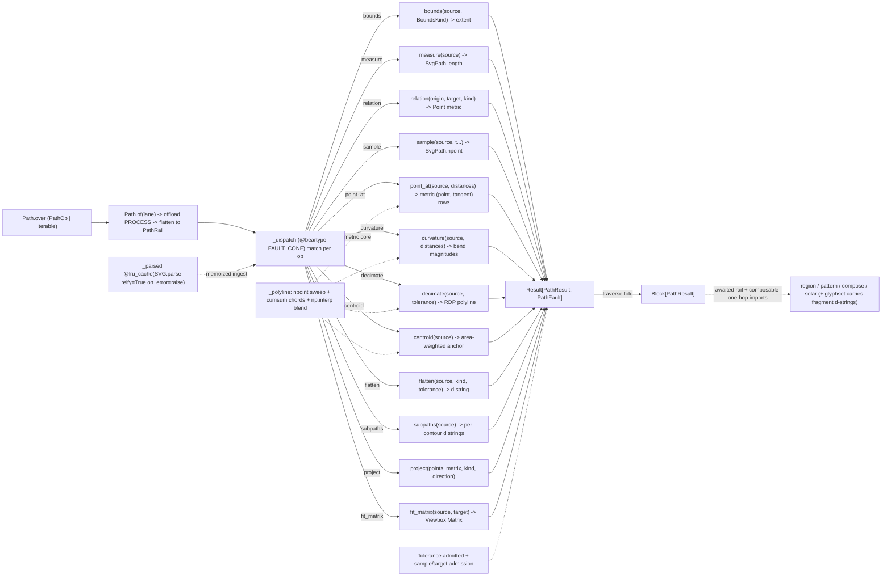

# [PY_ARTIFACTS_GRAPHIC_VECTOR_PATH]

Vector parse, query, affine, point-relation, measure, and sample behavior lives in one `svgelements` substrate. `Path` normalizes `PathOp | Iterable[PathOp]` and traverses the closed family into `PathRail` — the offload's runtime rail flattened onto `PathFault | BoundaryFault`, the same union form region's `RegionRail` carries; composable functions expose the same geometry in-process without minting receipts or emitting documents. Every fallible arm returns `Result[..., PathFault]`, and every operation yields a typed `PathResult`.

`svgelements` parses SVG into a typed `Shape` tree, resolves `Shape.bbox`, applies `Matrix`, fits `Viewbox`, measures `SvgPath`, and flattens curves. `_parsed` memoizes `SVG.parse(reify=True, on_error="raise")` by source bytes. `point_at` derives metric positions and endpoint-safe unit tangents; `curvature` preserves signed bend; `decimate` applies Ramer-Douglas-Peucker; `centroid` folds signed contour areas. One `Tolerance` policy carries every density and error anchor. `Path.of` offloads the CPU batch through the caller's process lane; synchronous composables remain available to consumers that own their crossing.

## [01]-[INDEX]

- [01]-[PATH]: the SVG parse/query/affine/measure/sample substrate over the closed `PathOp` family — the memoized `_parsed` core, the `Matrix` affine, the `Viewbox` fit, the metric arc-length kernels (`point_at`/`curvature`/`decimate`/`centroid` over one numpy sweep), and the `Length` unit egress — the composable surface region/pattern/compose/solar import one hop, on the `Path.over`/`of` modal rail over `Block[PathResult]`.

## [02]-[PATH]

- Owner: `Path` the one parse/query/affine substrate owner holding `ops: tuple[PathOp, ...]` and discriminating over the closed `PathOp` `expression.tagged_union` whose every case carries its own typed payload, never a `StrEnum` keyed against a shared erased `dict`; projecting one closed `PathResult` family; and railing every provider raise into `PathFault`, never `None`-as-failure. This owner reads `bbox` over the `Shape`-narrowed `elements(conditional=)` sweep, folds the document shapes into one combined `SvgPath` for the measure/sample/metric/flatten/subpaths queries, and serializes geometry ONLY as `d` strings through the one `fragment` egress — document assembly is `graphic/vector/region#REGION`'s drawsvg surface, never an f-string here.
- Cases: `PathOp` splits by return shape across bounds, measure, `PointRelation` distance/angle, parametric sample, metric point/tangent, signed curvature, decimation, centroid, flatten, subpaths, projection, and fit. `BoundsKind`, `FlattenKind`, `ProjectKind`, and `ProjectDirection` replace boolean knobs; `ComposeStep` carries exact per-step payloads, so rotation has no dummy second scalar. `Decimate` and `Flatten` carry an admitted `Tolerance` directly. `PathFault.policy` captures invalid samples, density/error values, and target extents before provider calls. `PathResult` remains the closed extent, measure, sampled, oriented, curved, reduced, anchor, contours, fragment, and placed family.
- Entry: `Path.over` normalizes `PathOp | Iterable[PathOp]` into the `ops` tuple by a structural `match` at the head, so a lone query is the one-element case and a mixed batch the multi-element case under the identical surface — never a `batch: bool`, never a per-op sibling.
- Auto: `_parsed` is the one `@lru_cache` ingestion core keyed on the source `bytes`, `reify=True` resolving transforms so every `bbox()`/`SvgPath` read returns absolute coordinates, `on_error="raise"` surfacing the malformed-input raise the `except` arm rails (the provider default `"ignore"` admits a partial tree the fault vocabulary never sees), and the cache collapsing the repeated parse a multi-query consumer otherwise pays per op; `scene` narrows through `isinstance(element, Shape)` to exclude the non-drawable root and `Group`/`Use` containers (the root carries a `bbox` attribute, so an attribute post-filter admits it and then crashes every outline fold — the rejected form) and returns the railed immutable tuple, never a bare mutable list a consumer mistakes for a settled collection; `combined` folds every shape's segments into one outline; `_polyline` is the one metric kernel core (`npoint` over `tolerance.samples`, cumulative chord lengths via one `np.cumsum`) that `point_at`/`curvature`/`decimate`/`centroid` share, one vectorized sweep for four queries, each interpolating through `np.interp` over the monotone chord lengths; `in_units` converts through the catalogued `to_mm`/`to_cm`/`to_inch` rows and reads the returned `Length.amount`, so the numeric egress is a value read, never a rendered-string strip.
- Receipt: `Path` is a geometry substrate — its rail returns one `Block[PathResult]` and its composable functions return geometry values the consuming producer keys into its own `ContentIdentity.key` mint; this substrate mints no content key and adds no receipt case. Contract violations are not a local fault case: `_dispatch` is `@beartype(conf=FAULT_CONF)`-woven, so a violation raises the one `BeartypeCallHintViolation` the runtime `CLASSIFY` table folds onto the `RuntimeRail` as `BoundaryFault.api` at the lane boundary — a local `contract` case is a second carrier for a runtime-owned fact.
- Growth: a geometry query adds one `PathOp` case and one composable over the existing kernel; flatten, projection, unit, tolerance, fault, and result families grow through their owning case or row. New parameter arity extends the payload-carrying owner instead of appending scalar slots.
- Packages: `svgelements` (`SVG.parse(reify=True, on_error=)`/`elements(conditional=)`, `SvgPath.d`/`bbox(with_stroke=)`/`length`/`npoint`/`segments`/`as_subpaths`/`approximate_arcs_with_cubics`/`approximate_arcs_with_quads`/`approximate_bezier_with_circular_arcs`, `Matrix` factories + `pre_*`/`post_*` + `determinant`/`inverse` + `transform_point`/`transform_vector`, `Viewbox(...).transform(...)`, `Length.value`/`to_mm`/`to_cm`/`to_inch`/`amount`, `Point.distance_to`/`angle_to`/`polar_to`/`reflected_across`/`matrix_transform`); `numpy` (the `npoint` sweep, `cumsum`/`interp`/`linalg.norm` kernels); `expression` (`tagged_union`, `Result`, `Block`, `traverse`); `msgspec` (`Struct`); `beartype` (the `FAULT_CONF` weave); runtime `lanes`/`faults`.
- Boundary: no boolean/offset/stroke/winding algebra and no `pathops` import (that is `graphic/vector/region#REGION`); no document assembly, `<svg>`/`<path>` emission, paint, or raster (region's drawsvg/resvg surface); no repeating fill geometry (`graphic/vector/pattern#PATTERN`); no receipt or identity minting (the consuming producer's); no folder-minted limiter or retry — the one native seam is the runtime lane's `offload`; no rail-collapsing convenience export — a consumer that wants the drawable set composes `scene` and holds the `Result`.

```python signature
# --- [RUNTIME_PRELUDE] ------------------------------------------------------------------
import math

from builtins import frozendict
from collections.abc import Callable, Iterable
from enum import StrEnum
from functools import lru_cache
from io import BytesIO
from itertools import chain
from typing import Final, Literal, Self, assert_never
from xml.etree.ElementTree import ParseError

import numpy as np
from beartype import beartype
from expression import Error, Ok, Result, case, tag, tagged_union
from expression.collections import Block
from expression.extra.result import traverse
from msgspec import Struct

from rasm.runtime.faults import FAULT_CONF, BoundaryFault
from rasm.runtime.lanes import LanePolicy
from rasm.runtime.workers import Kernel, KernelTrait

lazy from svgelements import SVG, Close, Length, Matrix, Point, Shape, Viewbox
lazy from svgelements import Path as SvgPath

# --- [TYPES] ----------------------------------------------------------------------------
type Bounds = tuple[float, float, float, float]
type Point2 = tuple[float, float]
type Oriented = tuple[Point2, Point2]  # (position, unit tangent) — one metric point-at-distance row
type Span = str | float
type Geometry = str | Shape | SvgPath
type PathOpTag = Literal[
    "bounds", "measure", "relation", "sample", "point_at", "curvature", "decimate", "centroid", "flatten", "subpaths", "project", "fit_matrix"
]
type PathResultTag = Literal["extent", "measure", "sampled", "oriented", "curved", "reduced", "anchor", "contours", "fragment", "placed"]
type PathFaultTag = Literal["parse", "singular", "empty", "policy"]
type PathRail = Result[Block[PathResult], PathFault | BoundaryFault]


class FlattenKind(StrEnum):
    CUBICS = "cubics"
    QUADS = "quads"
    ARCS = "arcs"


class ProjectKind(StrEnum):
    POINT = "point"
    VECTOR = "vector"


class PointRelation(StrEnum):
    DISTANCE = "distance_to"
    ANGLE = "angle_to"


class BoundsKind(StrEnum):
    GEOMETRIC = "geometric"  # tight path extent
    INK = "ink"  # stroke-inclusive visual extent (bbox with_stroke=True)


@tagged_union(frozen=True)
class ComposeStep:
    tag: Literal["scale", "translate", "rotate", "skew"] = tag()
    scale: tuple[float, float] = case()
    translate: tuple[float, float] = case()
    rotate: float = case()
    skew: tuple[float, float] = case()


class ComposeOrder(StrEnum):
    PRE = "pre"  # left-compose (the new step applies BEFORE the accumulated transform)
    POST = "post"  # right-compose (the new step applies AFTER the accumulated transform)


class ProjectDirection(StrEnum):
    FORWARD = "forward"
    INVERSE = "inverse"


class Unit(StrEnum):
    MM = "mm"
    CM = "cm"
    INCH = "in"


# --- [MODELS] ---------------------------------------------------------------------------
class Tolerance(Struct, frozen=True):
    # ONE tolerance/density policy row — every arc-flatten error, conic tolerance, resolution,
    # tangent step, and sweep density reads here, never an inline float.
    flatten: float = 0.1  # arc->cubic max deviation (user units)
    conic: float = 0.25  # conic->quad tolerance the region draw-back composes
    ppi: float = 96.0  # CSS px resolution anchor for Length.value
    tangent: float = 1e-3  # forward-step fraction for the chord tangent and curvature reads
    samples: int = 512  # metric-kernel polyline density (the one npoint sweep)

    def admitted(self, /) -> "Result[Self, PathFault]":
        match self:
            case Tolerance(flatten=value) if not math.isfinite(value) or value <= 0.0:
                return Error(PathFault(policy=("flatten", value)))
            case Tolerance(conic=value) if not math.isfinite(value) or value <= 0.0:
                return Error(PathFault(policy=("conic", value)))
            case Tolerance(ppi=value) if not math.isfinite(value) or value <= 0.0:
                return Error(PathFault(policy=("ppi", value)))
            case Tolerance(tangent=value) if not math.isfinite(value) or value <= 0.0:
                return Error(PathFault(policy=("tangent", value)))
            case Tolerance(samples=value) if value < 2:
                return Error(PathFault(policy=("samples", float(value))))
            case Tolerance():
                return Ok(self)
            case _ as unreachable:
                assert_never(unreachable)


TOLERANCE: Final[Tolerance] = Tolerance()


# --- [ERRORS] ---------------------------------------------------------------------------
@tagged_union(frozen=True)
class PathFault:  # the closed provider-raise vocabulary; svgelements Color parse is lenient (a malformed color resolves), so no color fault case
    tag: PathFaultTag = tag()
    parse: str = case()  # ParseError/ValueError/TypeError from SVG.parse(on_error="raise") over malformed markup
    singular: None = case()  # a project inverse against a determinant==0 matrix, guarded before the 1/det raise
    empty: None = case()  # no drawable shape, an outline with no segment, or a zero-length metric sweep
    policy: tuple[str, float] = case()


# --- [OPERATIONS] -----------------------------------------------------------------------
@lru_cache(maxsize=128)
def _parsed(source: bytes) -> Result["SVG", PathFault]:
    try:
        return Ok(SVG.parse(BytesIO(source), reify=True, on_error="raise"))
    except (ParseError, ValueError, TypeError) as fault:
        return Error(PathFault(parse=str(fault)))


def scene(source: bytes) -> Result[tuple["Shape", ...], PathFault]:
    # drawable sweep: isinstance(Shape) excludes the SVG root and Group/Use containers that crash the outline fold.
    return _parsed(source).map(lambda document: tuple(document.elements(conditional=lambda element: isinstance(element, Shape))))


def combined(source: bytes) -> Result["SvgPath", PathFault]:
    def _fold(shapes: tuple["Shape", ...], /) -> Result["SvgPath", PathFault]:
        outline = SvgPath(*chain.from_iterable(SvgPath(shape).segments() for shape in shapes))
        return Ok(outline) if len(outline) else Error(PathFault(empty=None))

    return scene(source).bind(_fold)


def _boxes(shapes: tuple["Shape", ...], kind: BoundsKind = BoundsKind.GEOMETRIC, /) -> Result[Bounds, PathFault]:
    boxes = [box for shape in shapes if (box := shape.bbox(with_stroke=kind is BoundsKind.INK)) is not None]
    return (
        Ok((min(b[0] for b in boxes), min(b[1] for b in boxes), max(b[2] for b in boxes), max(b[3] for b in boxes)))
        if boxes
        else Error(PathFault(empty=None))
    )


def bounds(source: bytes, kind: BoundsKind = BoundsKind.GEOMETRIC) -> Result[Bounds, PathFault]:
    return scene(source).bind(lambda shapes: _boxes(shapes, kind))


def measure(source: bytes) -> Result[float, PathFault]:
    return combined(source).map(lambda outline: outline.length())


def sample(source: bytes, positions: tuple[float, ...]) -> Result[tuple[Point2, ...], PathFault]:
    def _points(xy: object, /) -> Result[tuple[Point2, ...], PathFault]:
        return Error(PathFault(empty=None)) if xy is None else Ok(tuple((float(x), float(y)) for x, y in xy))

    invalid = next((position for position in positions if not 0.0 <= position <= 1.0), None)
    return (
        Error(PathFault(policy=("sample", invalid)))
        if invalid is not None
        else combined(source).bind(lambda outline: _points(outline.npoint(np.asarray(positions, dtype=float))))
    )


def _polyline(outline: "SvgPath", tolerance: Tolerance, /) -> Result[tuple[np.ndarray, np.ndarray], PathFault]:
    # ONE metric kernel core: a dense npoint sweep plus cumulative chord lengths; point_at/curvature/
    # decimate/centroid interpolate over this pair, one pass, four queries.
    match tolerance.admitted():  # Result is a constructor-function rail: patterns match the tagged shape, never Ok/Error class heads
        case Result(tag="error", error=fault):
            return Error(fault)
        case Result(tag="ok"):
            xy = outline.npoint(np.linspace(0.0, 1.0, tolerance.samples))
        case _ as unreachable:
            assert_never(unreachable)
    if xy is None or len(xy) < 2:
        return Error(PathFault(empty=None))
    lengths = np.concatenate(([0.0], np.cumsum(np.linalg.norm(np.diff(xy, axis=0), axis=1))))
    return Ok((np.asarray(xy, dtype=float), lengths)) if lengths[-1] > 0.0 else Error(PathFault(empty=None))


def _blend(marks: np.ndarray, xy: np.ndarray, lengths: np.ndarray, /) -> np.ndarray:
    # monotone chord-length interpolation: np.interp per axis over the cumulative lengths — the catalogued
    # piecewise-linear primitive, never a hand-rolled searchsorted lerp.
    return np.stack([np.interp(marks, lengths, xy[:, 0]), np.interp(marks, lengths, xy[:, 1])], axis=1)


def point_at(source: bytes, distances: tuple[float, ...], tolerance: Tolerance = TOLERANCE) -> Result[tuple[Oriented, ...], PathFault]:
    # METRIC point-at-distance: interp onto cumulative chord lengths, with a central chord that remains
    # one-sided at each endpoint; parametric t is not proportional to mixed-segment distance. A NaN distance
    # refuses on the policy rail BEFORE the sweep — ±inf clamps to an endpoint, but NaN rides `np.clip` through
    # `np.interp` and poisons the row — the same admission `curvature` runs.
    invalid = next((distance for distance in distances if math.isnan(distance)), None)
    if invalid is not None:
        return Error(PathFault(policy=("point_at", invalid)))

    def _rows(sweep: tuple[np.ndarray, np.ndarray], /) -> tuple[Oriented, ...]:
        xy, lengths = sweep
        total = float(lengths[-1])
        where = np.clip(np.asarray(distances, dtype=float), 0.0, total)
        here = _blend(where, xy, lengths)
        step = max(tolerance.tangent * total, 1e-9)
        back = _blend(np.clip(where - step, 0.0, total), xy, lengths)
        front = _blend(np.clip(where + step, 0.0, total), xy, lengths)
        delta = front - back
        norms = np.linalg.norm(delta, axis=1, keepdims=True)
        unit = np.where(norms > 0.0, delta / np.where(norms > 0.0, norms, 1.0), np.array([1.0, 0.0]))
        return tuple(((float(p[0]), float(p[1])), (float(t[0]), float(t[1]))) for p, t in zip(here, unit, strict=True))

    return combined(source).bind(lambda outline: _polyline(outline, tolerance)).map(_rows)


def curvature(source: bytes, distances: tuple[float, ...], tolerance: Tolerance = TOLERANCE) -> Result[tuple[float, ...], PathFault]:
    # signed bend at metric distances off the same sweep: central finite differences over the
    # arc-length parameterization, κ = (x'y'' − y'x'') / ‖(x', y')‖³ — the offset-quality and tick-density read.
    invalid = next((distance for distance in distances if math.isnan(distance)), None)
    if invalid is not None:
        return Error(PathFault(policy=("curvature", invalid)))

    def _rows(sweep: tuple[np.ndarray, np.ndarray], /) -> tuple[float, ...]:
        xy, lengths = sweep
        total = float(lengths[-1])
        step = max(tolerance.tangent * total, 1e-9)
        where = np.clip(np.asarray(distances, dtype=float), 0.0, total)
        # stencil selection is per query: an interior distance keeps the centred stencil, a distance within one step
        # of an end switches to the second-order one-sided stencil — a clipped duplicate sample would halve d1 and
        # corrupt d2 at exactly the cap/terminal ticks an endpoint query reads.
        head, tail = (where - step < 0.0)[:, None], (where + step > total)[:, None]
        p0 = _blend(where, xy, lengths)
        pf1 = _blend(np.clip(where + step, 0.0, total), xy, lengths)
        pf2 = _blend(np.clip(where + 2.0 * step, 0.0, total), xy, lengths)
        pb1 = _blend(np.clip(where - step, 0.0, total), xy, lengths)
        pb2 = _blend(np.clip(where - 2.0 * step, 0.0, total), xy, lengths)
        d1 = np.where(head, -3.0 * p0 + 4.0 * pf1 - pf2, np.where(tail, 3.0 * p0 - 4.0 * pb1 + pb2, pf1 - pb1)) / (2.0 * step)
        d2 = np.where(head, p0 - 2.0 * pf1 + pf2, np.where(tail, p0 - 2.0 * pb1 + pb2, pf1 - 2.0 * p0 + pb1)) / (step * step)
        speed = np.linalg.norm(d1, axis=1)
        kappa = (d1[:, 0] * d2[:, 1] - d1[:, 1] * d2[:, 0]) / np.where(speed > 0.0, speed**3, 1.0)
        return tuple(float(k) for k in kappa)

    return combined(source).bind(lambda outline: _polyline(outline, tolerance)).map(_rows)


def decimate(source: bytes, tolerance: Tolerance = TOLERANCE) -> Result[tuple[Point2, ...], PathFault]:
    # RDP over the metric sweep: keep the farthest-deviating vertex while it exceeds tolerance.flatten.
    def _reduced(sweep: tuple[np.ndarray, np.ndarray], /) -> tuple[Point2, ...]:
        xy, _ = sweep
        limit = tolerance.flatten
        keep = np.zeros(len(xy), dtype=bool)
        keep[[0, len(xy) - 1]] = True
        stack = [(0, len(xy) - 1)]
        while stack:
            lo, hi = stack.pop()
            if hi - lo < 2:
                continue
            chord = xy[hi] - xy[lo]
            norm = float(np.linalg.norm(chord)) or 1.0
            offsets = xy[lo + 1 : hi] - xy[lo]
            deviation = np.abs(chord[0] * offsets[:, 1] - chord[1] * offsets[:, 0]) / norm  # 2D cross z-component; np.cross 2D is deprecated
            peak = int(np.argmax(deviation))
            if float(deviation[peak]) > limit:
                keep[lo + 1 + peak] = True
                stack.extend(((lo, lo + 1 + peak), (lo + 1 + peak, hi)))
        return tuple((float(x), float(y)) for x, y in xy[keep])

    return combined(source).bind(lambda outline: _polyline(outline, tolerance)).map(_reduced)


def centroid(source: bytes, tolerance: Tolerance = TOLERANCE) -> Result[Point2, PathFault]:
    # area-weighted centroid: per-contour shoelace area weights the per-contour centroid, holes
    # subtracting by signed area; a zero-area document rails empty, never a NaN.
    def _weighted(outline: "SvgPath", /) -> Result[Point2, PathFault]:
        total_area, moment = 0.0, np.zeros(2)
        for contour in outline.as_subpaths():  # per-contour accumulation kernel; open and degenerate contours contribute no area
            segments = tuple(contour.segments())
            if not any(isinstance(segment, Close) for segment in segments):
                continue  # shoelace closure is real only on an explicitly closed contour — np.roll on an open one mints a phantom closing edge
            match _polyline(SvgPath(*segments), tolerance):
                case Result(tag="ok", ok=(xy, _)) if len(xy) >= 3:
                    x, y = xy[:, 0], xy[:, 1]
                    cross = x * np.roll(y, -1) - np.roll(x, -1) * y
                    area = float(np.sum(cross)) / 2.0
                    if area == 0.0:
                        continue
                    cx = float(np.sum((x + np.roll(x, -1)) * cross)) / (6.0 * area)
                    cy = float(np.sum((y + np.roll(y, -1)) * cross)) / (6.0 * area)
                    total_area += area
                    moment += area * np.array([cx, cy])
                case _:
                    continue
        return Ok((float(moment[0] / total_area), float(moment[1] / total_area))) if total_area != 0.0 else Error(PathFault(empty=None))

    return combined(source).bind(_weighted)


_FLATTEN: Final[frozendict[FlattenKind, Callable[["SvgPath", float], object]]] = frozendict({
    FlattenKind.CUBICS: lambda outline, error: outline.approximate_arcs_with_cubics(error),
    FlattenKind.QUADS: lambda outline, error: outline.approximate_arcs_with_quads(error),
    FlattenKind.ARCS: lambda outline, error: outline.approximate_bezier_with_circular_arcs(error),
})
_PROJECT: Final[frozendict[ProjectKind, Callable[["Matrix", "Point"], "Point"]]] = frozendict({
    ProjectKind.POINT: lambda active, point: point.matrix_transform(active),
    ProjectKind.VECTOR: lambda active, point: active.transform_vector(point),
})
_CONVERTER: Final[frozendict[Unit, str]] = frozendict({Unit.MM: "to_mm", Unit.CM: "to_cm", Unit.INCH: "to_inch"})


def flatten(source: bytes, kind: FlattenKind = FlattenKind.CUBICS, tolerance: Tolerance = TOLERANCE) -> Result[str, PathFault]:
    def _emit(outline: "SvgPath", /) -> str:
        _FLATTEN[kind](outline, tolerance.flatten)
        return outline.d()

    return tolerance.admitted().bind(lambda _: combined(source)).map(_emit)


def subpaths(source: bytes) -> Result[tuple[str, ...], PathFault]:
    return combined(source).map(lambda outline: tuple(contour.d() for contour in outline.as_subpaths()))


def relation(origin: Point2, target: Point2, kind: PointRelation) -> float:
    return float(getattr(Point(*origin), kind.value)(Point(*target)))


def project(
    points: Iterable[Point2], matrix: "Matrix", kind: ProjectKind = ProjectKind.POINT, direction: ProjectDirection = ProjectDirection.FORWARD
) -> Result[tuple[Point2, ...], PathFault]:
    match direction:
        case ProjectDirection.INVERSE if matrix.determinant == 0:
            return Error(PathFault(singular=None))
        case ProjectDirection.INVERSE:
            active = Matrix(matrix).inverse()
        case ProjectDirection.FORWARD:
            active = matrix
        case _ as unreachable:
            assert_never(unreachable)
    apply = _PROJECT[kind]
    return Ok(tuple((float(r.x), float(r.y)) for r in (apply(active, Point(*pt)) for pt in points)))


def fit_matrix(source: bytes, target: Bounds) -> Result["Matrix", PathFault]:
    def _fit(src: Bounds, /) -> "Matrix":
        content = f"{src[0]} {src[1]} {src[2] - src[0]} {src[3] - src[1]}"
        viewport = f"{target[0]} {target[1]} {target[2] - target[0]} {target[3] - target[1]}"
        return Matrix(Viewbox(content, preserve_aspect_ratio="xMidYMid meet").transform(Viewbox(viewport)))

    width, height = target[2] - target[0], target[3] - target[1]
    return Error(PathFault(policy=("target", min(width, height)))) if width <= 0.0 or height <= 0.0 else bounds(source).map(_fit)


def compose(steps: tuple[ComposeStep, ...], order: ComposeOrder = ComposeOrder.POST) -> "Matrix":
    matrix = Matrix()
    for step in steps:
        match step:
            case ComposeStep(tag="rotate", rotate=angle):
                getattr(matrix, f"{order.value}_rotate")(angle)
            case ComposeStep(tag="skew", skew=(ax, ay)):
                # svgelements ships no `{pre,post}_skew`: the axis pair lowers onto the order-specific
                # skew_x/skew_y legs, x-leg first, a zero component skipped so a single-axis skew is one primitive.
                if ax:
                    getattr(matrix, f"{order.value}_skew_x")(ax)
                if ay:
                    getattr(matrix, f"{order.value}_skew_y")(ay)
            case ComposeStep(tag="scale", scale=pair) | ComposeStep(tag="translate", translate=pair):
                getattr(matrix, f"{order.value}_{step.tag}")(*pair)
            case _ as unreachable:
                assert_never(unreachable)
    return matrix


def reflect(points: Iterable[Point2], across: Point2) -> tuple[Point2, ...]:
    pivot = Point(*across)
    return tuple((float(r.x), float(r.y)) for r in (Point(*pt).reflected_across(pivot) for pt in points))


def polar(origin: Point2, angle: float, distance: float) -> Point2:
    placed = Point(*origin).polar_to(angle, distance)
    return (float(placed.x), float(placed.y))


def px(length: Span, viewbox: "Viewbox | None" = None, tolerance: Tolerance = TOLERANCE) -> float:
    return Length(length).value(ppi=tolerance.ppi, viewbox=viewbox)


def in_units(length: Span, unit: Unit = Unit.MM) -> float:
    # unit egress: the catalogued to_mm/to_cm/to_inch conversion returns a Length whose `amount` is the
    # numeric value in that unit — a value read, never a rendered-string strip.
    return float(getattr(Length(length), _CONVERTER[unit])().amount)


def fragment(geometry: Geometry, matrix: "Matrix | None" = None) -> str:
    # d-string egress through ONE owner; the <path> element, paint, and framing are region's drawsvg surface, never emitted here.
    return (SvgPath(geometry) if matrix is None else SvgPath(geometry) * matrix).d()


# --- [COMPOSITION] ----------------------------------------------------------------------
@tagged_union(frozen=True)
class PathOp:
    tag: PathOpTag = tag()
    bounds: tuple[bytes, BoundsKind] = case()
    measure: bytes = case()
    relation: tuple[Point2, Point2, PointRelation] = case()
    sample: tuple[bytes, tuple[float, ...]] = case()
    point_at: tuple[bytes, tuple[float, ...]] = case()
    curvature: tuple[bytes, tuple[float, ...]] = case()
    decimate: tuple[bytes, Tolerance] = case()
    centroid: bytes = case()
    flatten: tuple[bytes, FlattenKind, Tolerance] = case()
    subpaths: bytes = case()
    project: tuple[tuple[Point2, ...], "Matrix", ProjectKind, ProjectDirection] = case()
    fit_matrix: tuple[bytes, Bounds] = case()

    @staticmethod
    def Bounds(source: bytes, kind: BoundsKind = BoundsKind.GEOMETRIC) -> "PathOp":
        return PathOp(bounds=(source, kind))

    @staticmethod
    def Measure(source: bytes) -> "PathOp":
        return PathOp(measure=source)

    @staticmethod
    def Relation(origin: Point2, target: Point2, kind: PointRelation) -> "PathOp":
        return PathOp(relation=(origin, target, kind))

    @staticmethod
    def Sample(source: bytes, positions: float | Iterable[float]) -> "PathOp":
        return PathOp(sample=(source, tuple(positions) if isinstance(positions, Iterable) else (positions,)))

    @staticmethod
    def PointAt(source: bytes, distances: float | Iterable[float]) -> "PathOp":
        return PathOp(point_at=(source, tuple(distances) if isinstance(distances, Iterable) else (distances,)))

    @staticmethod
    def Curvature(source: bytes, distances: float | Iterable[float]) -> "PathOp":
        return PathOp(curvature=(source, tuple(distances) if isinstance(distances, Iterable) else (distances,)))

    @staticmethod
    def Decimate(source: bytes, tolerance: Tolerance = TOLERANCE) -> "PathOp":
        return PathOp(decimate=(source, tolerance))

    @staticmethod
    def Centroid(source: bytes) -> "PathOp":
        return PathOp(centroid=source)

    @staticmethod
    def Flatten(source: bytes, kind: FlattenKind = FlattenKind.CUBICS, tolerance: Tolerance = TOLERANCE) -> "PathOp":
        return PathOp(flatten=(source, kind, tolerance))

    @staticmethod
    def Subpaths(source: bytes) -> "PathOp":
        return PathOp(subpaths=source)

    @staticmethod
    def Project(
        points: Iterable[Point2],
        matrix: "Matrix",
        kind: ProjectKind = ProjectKind.POINT,
        direction: ProjectDirection = ProjectDirection.FORWARD,
    ) -> "PathOp":
        return PathOp(project=(tuple(points), matrix, kind, direction))

    @staticmethod
    def FitMatrix(source: bytes, target: Bounds) -> "PathOp":
        return PathOp(fit_matrix=(source, target))


@tagged_union(frozen=True)
class PathResult:
    tag: PathResultTag = tag()
    extent: Bounds = case()
    measure: float = case()
    sampled: tuple[Point2, ...] = case()
    oriented: tuple[Oriented, ...] = case()
    curved: tuple[float, ...] = case()
    reduced: tuple[Point2, ...] = case()
    anchor: Point2 = case()
    contours: tuple[str, ...] = case()
    fragment: str = case()
    placed: "Matrix" = case()


@beartype(conf=FAULT_CONF)
def _dispatch(op: PathOp, /) -> Result[PathResult, PathFault]:
    # FAULT_CONF raises the one BeartypeCallHintViolation the runtime CLASSIFY table folds onto the
    # RuntimeRail as BoundaryFault.api at the lane boundary — never a local contract case.
    match op:
        case PathOp(tag="bounds", bounds=(source, kind)):
            return bounds(source, kind).map(lambda extent: PathResult(extent=extent))
        case PathOp(tag="measure", measure=source):
            return measure(source).map(lambda length: PathResult(measure=length))
        case PathOp(tag="relation", relation=(origin, target, kind)):
            return Ok(PathResult(measure=relation(origin, target, kind)))
        case PathOp(tag="sample", sample=(source, positions)):
            return sample(source, positions).map(lambda points: PathResult(sampled=points))
        case PathOp(tag="point_at", point_at=(source, distances)):
            return point_at(source, distances).map(lambda rows: PathResult(oriented=rows))
        case PathOp(tag="curvature", curvature=(source, distances)):
            return curvature(source, distances).map(lambda rows: PathResult(curved=rows))
        case PathOp(tag="decimate", decimate=(source, tolerance)):
            return decimate(source, tolerance).map(lambda points: PathResult(reduced=points))
        case PathOp(tag="centroid", centroid=source):
            return centroid(source).map(lambda point: PathResult(anchor=point))
        case PathOp(tag="flatten", flatten=(source, kind, tolerance)):
            return flatten(source, kind, tolerance).map(lambda d: PathResult(fragment=d))
        case PathOp(tag="subpaths", subpaths=source):
            return subpaths(source).map(lambda contours: PathResult(contours=contours))
        case PathOp(tag="project", project=(points, matrix, kind, direction)):
            return project(points, matrix, kind, direction).map(lambda projected: PathResult(sampled=projected))
        case PathOp(tag="fit_matrix", fit_matrix=(source, target)):
            return fit_matrix(source, target).map(lambda placed: PathResult(placed=placed))
        case _ as unreachable:
            assert_never(unreachable)


def _worked(ops: tuple[PathOp, ...], /) -> Result[Block[PathResult], PathFault]:
    return traverse(_dispatch, Block.of_seq(ops))


class Path(Struct, frozen=True):
    ops: tuple[PathOp, ...]

    @classmethod
    def over(cls, ops: PathOp | Iterable[PathOp], /) -> Self:
        match ops:
            case PathOp():
                return cls(ops=(ops,))
            case _:
                return cls(ops=tuple(ops))

    async def of(self, lane: LanePolicy, /) -> PathRail:
        # sweep is synchronous native CPU work: the whole batch crosses as one HOSTILE kernel onto the warm
        # process pool under the runtime-owned worker bound — zero folder-minted limiters; the runtime rail
        # flattens onto the path fault union so the caller reads one Result.
        railed = await lane.offload(Kernel.of(_worked, KernelTrait.HOSTILE), self.ops)
        return railed.bind(lambda inner: inner)


# --- [EXPORTS] --------------------------------------------------------------------------
__all__ = (
    "Bounds",
    "BoundsKind",
    "ComposeOrder",
    "ComposeStep",
    "FlattenKind",
    "Geometry",
    "Oriented",
    "Path",
    "PathFault",
    "PathOp",
    "PathRail",
    "PathResult",
    "Point2",
    "PointRelation",
    "ProjectDirection",
    "ProjectKind",
    "Span",
    "TOLERANCE",
    "Tolerance",
    "Unit",
    "bounds",
    "centroid",
    "combined",
    "compose",
    "curvature",
    "decimate",
    "fit_matrix",
    "flatten",
    "fragment",
    "in_units",
    "measure",
    "point_at",
    "polar",
    "project",
    "px",
    "reflect",
    "relation",
    "sample",
    "scene",
    "subpaths",
)
```



## [03]-[RESEARCH]

<!-- source-only: research row template:
[TOKEN]-[OPEN|BLOCKED]: <exact question>; <verification route>.
-->

(none)
