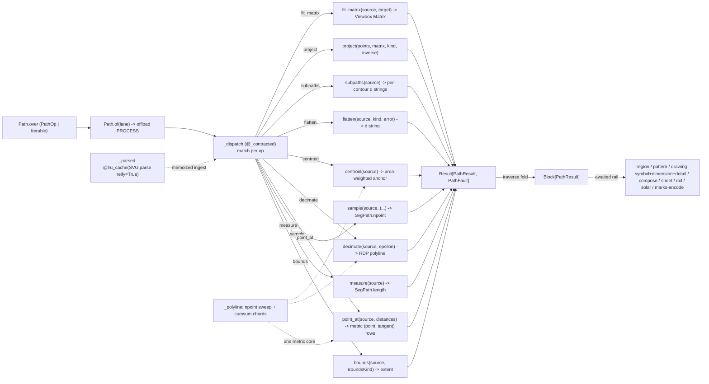

# [PY_ARTIFACTS_GRAPHIC_VECTOR_PATH]

The s1 parse/query/affine/measure/sample substrate of the vector plane — the one `svgelements` owner every geometry consumer composes one hop, minting no receipt and emitting no document. `Path` is ONE modal owner over the closed `PathOp` family, normalizing `PathOp | Iterable[PathOp]` at the head so a lone bounds query and a mixed measure + sample + centroid batch are the same entrypoint, traversing the ops into one `RuntimeRail[Block[PathResult]]` whose every outcome is the typed `PathResult` (`extent`/`measure`/`sampled`/`oriented`/`reduced`/`anchor`/`contours`/`fragment`/`placed`), never an erased `bytes` a consumer re-parses. Beside the rail the page exposes ONE public composable geometry surface — `scene`/`combined`/`bounds`/`measure`/`sample`/`point_at`/`decimate`/`centroid`/`flatten`/`subpaths`/`project`/`fit_matrix`/`compose`/`reflect`/`polar`/`px`/`in_units`/`fragment` — that `graphic/vector/region#REGION`, `graphic/vector/pattern#PATTERN`, the drawing producers (`symbol`/`dimension`/`detail`), the placement plane (`composition/compose#COMPOSE`, `composition/sheet#SHEET`), `export/dxf#DXF`, `visualization/diagram/solar#SOLAR`, and `graphic/marks/encode#ENCODE` import and compose in-process. Every fallible arm rails its provider raise into the closed `PathFault` `@tagged_union` (`parse`/`singular`/`empty`/`contract`); the interior is total over `Result[PathResult, PathFault]`.

`svgelements` (pure-Python, zero-native, host-free) parses an SVG document into a typed `Shape` tree, resolves bounding geometry through `Shape.bbox(with_stroke=)`, transforms each shape through `SvgPath(geometry) * Matrix`, fits a source extent into a target viewport through the `Viewbox` preserve-aspect `Matrix`, measures total arc length and vectorized-samples parametric points over the combined outline through the numpy-accelerated `SvgPath.npoint`, decomposes the outline into per-contour `Subpath` views, and flattens curves to cubics/quads/arcs for a polyline/toolpath consumer. The expensive `SVG.parse(reify=True)` ingestion is memoized on the source `bytes` by the one `@lru_cache(maxsize=128)` `_parsed` core that captures the parse fault, so a consumer that queries `bounds`, then `measure`, then `point_at` over one source parses it once and a malformed source rails once — the hot ingress every downstream re-parse short-circuits on. Three owned metric kernels close what the parametric surface cannot answer: `point_at` resolves points AND unit tangents at metric arc-length distances over one numpy cumulative-chord sweep (the tick-spacing/text-on-path substrate — a `t ∈ [0,1]` parametric sample is NOT proportional to distance across mixed segment lengths, the rejected form), `decimate` reduces a sampled polyline under a max-deviation tolerance (Ramer-Douglas-Peucker over the same sweep), and `centroid` folds per-contour shoelace areas into the area-weighted document centroid (the vertex-mean stand-in `drawing/detail#DETAIL` carried is the rejected form). Every tolerance and density anchor lives on the one `Tolerance` policy row — `flatten=0.1`/`conic=0.25`/`ppi=96.0`/`tangent=1e-3` — never an inline magic float. Because the parse/measure/sample sweep is synchronous CPU work, the modal rail crosses the whole op batch through the runtime lane's `offload(..., modality=Modality.PROCESS)` under the runtime-owned worker bound, while the composable functions stay synchronous for consumers that own their own lane crossing. This page owns ONLY the parse/query/affine substrate; boolean/offset/outline algebra, document serialization, and rasterization are `graphic/vector/region#REGION`'s, and repeating fill geometry is `graphic/vector/pattern#PATTERN`'s.

## [01]-[INDEX]

- [01]-[PATH]: the SVG parse/query/affine/measure/sample substrate over the closed-payload `PathOp` family, the typed `PathResult` outcome, and the closed `PathFault` provider-exception vocabulary — the memoized `_parsed` `SVG.parse(reify=True)` ingestion core, the `elements(conditional=isinstance Shape)` drawable narrowing, the combined-outline fold, the `Matrix` affine (`scale`/`translate`/`rotate`/`skew` factories, ordered `pre_*`/`post_*` `compose`, `determinant`-guarded copy-inverse `project`), the `Viewbox` preserve-aspect `fit_matrix`, the metric arc-length kernels (`point_at`/`decimate`/`centroid` over one numpy cumulative-chord sweep), the `FlattenKind`-keyed curve flatten, per-contour `subpaths`, the `Point` `reflect`/`polar` helpers, the `Length` unit egress (`px`/`in_units`), and the `fragment` d-string egress — the public composable surface region/pattern/drawing/placement/dxf/solar/marks import one hop, and the `Path.over`/`of` modal rail the awaited uniform-op contract over `Block[PathResult]`.

## [02]-[PATH]

- Owner: `Path` the one parse/query/affine substrate owner holding `ops: tuple[PathOp, ...]` and discriminating operation over the closed `PathOp` `expression.tagged_union` whose every case carries its own typed payload, never a `StrEnum` keyed against a shared erased `dict[str, object]`; projecting one closed `PathResult` family whose every case carries its own typed outcome; and railing every provider raise into the closed `PathFault` `@tagged_union`, never `None`-as-failure. The `svgelements` `SVG` document is the working surface, the `Matrix`/`SvgPath`/`Length`/`Point`/`bbox` algebra the geometry-and-transform surface. This owner reads `bbox` over the `Shape`-narrowed `elements(conditional=)` sweep, folds the document shapes into one combined `SvgPath` for the measure/sample/metric/flatten/subpaths queries, and serializes geometry ONLY as `d` strings through the one `fragment` egress — document assembly (`<svg>` framing, `<path>` elements, defs, paint) is `graphic/vector/region#REGION`'s drawsvg surface, never an f-string here.
- Cases: `PathOp` cases — `Bounds(source, kind=GEOMETRIC)` (the union `(xmin, ymin, xmax, ymax)` `extent` over `Shape.bbox(with_stroke=kind is INK)`, keyed by the `BoundsKind` policy value, never a `with_stroke: bool` knob) · `Measure(source)` (total arc length over the combined `SvgPath.length()`) · `Sample(source, positions)` (parametric points at `t ∈ [0, 1]` over the numpy-backed `npoint`, `positions` normalized to one tuple at the factory head per `MODAL_ARITY`) · `PointAt(source, distances)` (the METRIC kernel: points + unit tangents at arc-length distances in user units over the `_polyline` cumulative-chord sweep — the tick-spacing law `drawing/dimension#DIMENSION` keys and the text-on-path positions `graphic/vector/region#REGION` threads; distances normalize at the factory head) · `Decimate(source, epsilon)` (Ramer-Douglas-Peucker polyline reduction under the max-deviation `epsilon`, defaulted from the `Tolerance` row — the toolpath/plot-weight reducer) · `Centroid(source)` (the area-weighted document centroid: per-contour shoelace areas weight per-contour centroids, holes subtracting by signed area) · `Flatten(source, kind, error)` (replace every `Arc`/cubic through the `FlattenKind`-keyed `_FLATTEN` row, emitting the flattened `d` string) · `Subpaths(source)` (per-contour `Subpath.d()` strings over `as_subpaths`, the `contours` family a winding/hole/toolpath consumer keys per closed loop) · `Project(points, matrix, kind=POINT, inverse=False)` (map each point through `Point.matrix_transform` or each direction through `Matrix.transform_vector` keyed by `ProjectKind`, optionally inverse-through a `determinant`-guarded `Matrix(matrix)` copy — `Matrix.inverse()` mutates its receiver and divides by the determinant, so the copy-and-guard is the only sound form) · `FitMatrix(source, target)` (the `Viewbox` preserve-aspect fit `Matrix` from the resolved source bbox into the `target` viewport — the source→target scale-fit `composition/compose#COMPOSE` delegates; the MATRIX is the outcome, the placed document is region's) — matched by one total `match`/`case`; never a per-source parse sibling, never a per-shape transform method. `PathResult` cases — `extent` (the bounds tuple), `measure` (the arc-length float), `sampled` (parametric `tuple[Point2, ...]`), `oriented` (metric `tuple[(point, unit_tangent), ...]` rows), `reduced` (the decimated polyline), `anchor` (the centroid `Point2`), `contours` (per-subpath d-strings), `fragment` (a flattened/transformed `d` string), `placed` (the fit/composed `Matrix`) — structurally addressable, never `bytes` discriminated by length.
- Modality: `Path.over` is the one modal-arity entrypoint normalizing `PathOp | Iterable[PathOp]` into the `ops` tuple by a structural `match` at the head, so a lone geometry query is the one-element case and a mixed batch is the multi-element case under the identical surface — never a `batch: bool`, never a per-op sibling. The operation is the value's `PathOp` case; the arity is the value's shape.
- Auto: `_parsed` is the one `@lru_cache(maxsize=128)` ingestion core — `SVG.parse(BytesIO(source), reify=True)` keyed on the source `bytes`, wrapped in one `try` mapping `ParseError`/`ValueError`/`TypeError` onto `PathFault.parse`, `reify=True` resolving transforms so every downstream `bbox()`/`SvgPath` read returns absolute coordinates, the cache collapsing the repeated parse a multi-query consumer would otherwise pay per op (a malformed source rails once, never per arm); `scene` narrows through `elements(conditional=lambda element: isinstance(element, Shape))` so the non-drawable `SVG` root and the `Group`/`Use` containers are excluded (the root carries a `bbox` attribute, so an attribute post-filter admits it and `SvgPath(root)` then crashes every outline fold — the rejected form); `combined` folds every shape's `SvgPath(shape).segments()` through `chain.from_iterable` into one outline, railing an empty segment set onto `PathFault.empty`; `_polyline` is the one metric kernel core — `npoint` over `tolerance.samples` evenly-spaced parameters, cumulative chord lengths via one `np.cumsum` of segment norms — that `point_at`/`decimate`/`centroid` share, one vectorized sweep instead of three re-derivations; `point_at` interpolates each metric distance onto the polyline (`np.searchsorted` over the cumulative lengths, linear blend within the chord) and reads the unit tangent off the local chord under the `tolerance.tangent` step; `fragment` composes `(SvgPath(geometry) * matrix).d()` (identity when `matrix is None`) — the `d`-string egress every serializing consumer receives, never a styled `<path>` element; `px` resolves a CSS `Length` through `Length(length).value(ppi=tolerance.ppi, viewbox=...)`; `in_units` converts through the catalogued `to_mm`/`to_cm`/`to_inch` rows and strips the target unit's own declared suffix (`"25.4mm"` → `25.4`) — the conversion emits exactly its unit token, so the strip is total, never a general string parse.
- Faults: `PathFault` is the one closed `@tagged_union` vocabulary every arm maps its provider raise into — `parse` (an `xml.etree.ElementTree.ParseError`/`ValueError`/`TypeError` from `SVG.parse` over malformed markup; `ParseError` is the real raise svgelements' default `on_error='ignore'` still surfaces on a structural XML fault), `singular` (a `project` inverse against a `determinant == 0` matrix, guarded before the `1/det` raise), `empty` (a document with no drawable shape, an outline with no segment, or a zero-length metric sweep — the `min()`-over-empty and `npoint`-`None` causes the interior would otherwise raise on), `contract` (a `BeartypeCallHintViolation` the `_contracted` weave lifts onto `_dispatch`'s rail) — each raise named at the arm that incurs it, never a bare `except Exception`. `Color(value)` is lenient (a malformed color resolves rather than raising), so no color fault case is minted.
- Receipt: `Path` is a geometry substrate — its rail returns one `Block[PathResult]` and its composable functions return geometry values that the consuming producer keys into its own `ContentIdentity.of` and contributes to `core/receipt#RECEIPT`; this substrate mints no content key and adds no receipt case.
- Growth: a new geometry query is one `PathOp` case plus one composable function over the existing `svgelements` surface — a curvature query rides the `_polyline` sweep plus a second difference — never a re-implemented geometry engine; a new flatten target is one `FlattenKind` member plus one `_FLATTEN` row; a new projection mode is one `ProjectKind` member plus one `_PROJECT` row; a new unit egress is one `Unit` member (its suffix the strip token); a new tolerance/density anchor is one `Tolerance` field, never an inline float; a new fault cause is one `PathFault` case; a new outcome shape is one `PathResult` case; zero new surface.
- Packages: `svgelements` (`SVG.parse(reify=True)`/`elements(conditional=)`, `SvgPath.d`/`bbox(with_stroke=)`/`length`/`npoint`/`segments`/`as_subpaths`/`approximate_arcs_with_cubics`/`approximate_arcs_with_quads`/`approximate_bezier_with_circular_arcs`, `Matrix` factories + `pre_*`/`post_*` + `determinant`/`inverse` + `transform_point`/`transform_vector`, `Viewbox(content, preserve_aspect_ratio=).transform(Viewbox(viewport))`, `Length.value(ppi=, viewbox=)`/`to_mm`/`to_cm`/`to_inch`, `Point.distance_to`/`angle_to`/`polar_to`/`reflected_across`/`matrix_transform`); `numpy` (the `npoint` array sweep, `cumsum`/`searchsorted`/`linalg.norm` metric kernels); `expression` (`tagged_union`/`case`/`tag`, `Result`/`Ok`/`Error`, `Block`, `Map.of_seq` dispatch tables, `traverse`); `msgspec` (`Struct` the `Tolerance` policy row and the modal owner); `beartype` (the `_contracted` definition-time contract weave); runtime `lanes` (`LanePolicy.offload`/`Modality.PROCESS` the one worker seam), runtime `faults` (`RuntimeRail`).
- Boundary: no boolean/offset/stroke/winding algebra and no `pathops` import (that is `graphic/vector/region#REGION`); no document assembly, `<svg>`/`<path>` element emission, paint, or raster (region's drawsvg/resvg surface); no repeating fill geometry (`graphic/vector/pattern#PATTERN`); no receipt or identity minting (the consuming producer's); no folder-minted limiter or retry — the one native seam is the runtime lane's `offload`.

```python signature
# --- [RUNTIME_PRELUDE] ------------------------------------------------------------------
from collections.abc import Callable, Iterable
from enum import StrEnum
from functools import lru_cache, wraps
from io import BytesIO
from itertools import chain
from typing import TYPE_CHECKING, Final, Literal, Protocol, Self, assert_never
from xml.etree.ElementTree import ParseError

import numpy as np
from beartype import BeartypeConf, beartype
from beartype.roar import BeartypeCallHintViolation
from expression import Error, Ok, Result, case, tag, tagged_union
from expression.collections import Block, Map
from expression.extra.result import traverse
from msgspec import Struct

from rasm.runtime.faults import RuntimeRail
from rasm.runtime.lanes import LanePolicy, Modality

lazy from svgelements import SVG, Close, Color, CubicBezier, Length, Line, Matrix, Move, Point, QuadraticBezier, Shape, Viewbox
lazy from svgelements import Path as SvgPath

if TYPE_CHECKING:
    from svgelements import SVG, Matrix, Point, Shape
    from svgelements import Path as SvgPath

# --- [TYPES] ----------------------------------------------------------------------------
type Bounds = tuple[float, float, float, float]
type Point2 = tuple[float, float]
type Oriented = tuple[Point2, Point2]  # (position, unit tangent) — one metric point-at-distance row
type Span = str | float
type PathOpTag = Literal["bounds", "measure", "sample", "point_at", "decimate", "centroid", "flatten", "subpaths", "project", "fit_matrix"]
type PathResultTag = Literal["extent", "measure", "sampled", "oriented", "reduced", "anchor", "contours", "fragment", "placed"]
type PathFaultTag = Literal["parse", "singular", "empty", "contract"]


class FlattenKind(StrEnum):
    CUBICS = "cubics"
    QUADS = "quads"
    ARCS = "arcs"


class ProjectKind(StrEnum):
    POINT = "point"
    VECTOR = "vector"


class BoundsKind(StrEnum):
    GEOMETRIC = "geometric"  # tight path extent
    INK = "ink"  # stroke-inclusive visual extent (bbox with_stroke=True)


# each member NAME mirrors the svgelements `Matrix.<order>_<step>` compose method, so `getattr(matrix, f"{order}_{step}")`
# is ONE derivation, never a parallel map; `Unit` members carry their own strip token so `in_units` is total.
class ComposeStep(StrEnum):
    SCALE = "scale"
    TRANSLATE = "translate"
    ROTATE = "rotate"
    SKEW = "skew"


class ComposeOrder(StrEnum):
    PRE = "pre"  # left-compose (the new step applies BEFORE the accumulated transform)
    POST = "post"  # right-compose (the new step applies AFTER the accumulated transform)


class Unit(StrEnum):
    MM = "mm"
    CM = "cm"
    INCH = "in"

    @property
    def converter(self) -> str:
        return {"mm": "to_mm", "cm": "to_cm", "in": "to_inch"}[self.value]


class Element(Protocol):
    def bbox(self) -> Bounds | None: ...


# --- [MODELS] ---------------------------------------------------------------------------
class Tolerance(Struct, frozen=True):
    # the ONE tolerance/density policy row — every arc-flatten error, conic tolerance, resolution
    # anchor, tangent step, and metric-sweep density reads here, never an inline magic float.
    flatten: float = 0.1  # arc->cubic max deviation (user units)
    conic: float = 0.25  # conic->quad tolerance the region draw-back composes
    ppi: float = 96.0  # CSS px resolution anchor for Length.value
    tangent: float = 1e-3  # forward-step fraction for the chord tangent read
    samples: int = 512  # metric-kernel polyline density (the one npoint sweep)


TOLERANCE: Final[Tolerance] = Tolerance()


# --- [ERRORS] ---------------------------------------------------------------------------
@tagged_union(frozen=True)
class PathFault:
    tag: PathFaultTag = tag()
    parse: str = case()
    singular: None = case()
    empty: None = case()
    contract: str = case()


# --- [OPERATIONS] -----------------------------------------------------------------------
@lru_cache(maxsize=128)
def _parsed(source: bytes) -> Result["SVG", PathFault]:
    try:
        return Ok(SVG.parse(BytesIO(source), reify=True))
    except (ParseError, ValueError, TypeError) as fault:
        return Error(PathFault(parse=str(fault)))


def scene(source: bytes) -> Result[list["Shape"], PathFault]:
    # the drawable sweep: isinstance(Shape) excludes the SVG root and Group/Use containers the
    # outline fold would crash on; region and the placement plane read this surface one hop.
    return _parsed(source).map(lambda document: list(document.elements(conditional=lambda element: isinstance(element, Shape))))


def elements(source: bytes) -> list[Element]:
    return scene(source).default_value([])


def combined(source: bytes) -> Result["SvgPath", PathFault]:
    def _fold(shapes: list["Shape"], /) -> Result["SvgPath", PathFault]:
        outline = SvgPath(*chain.from_iterable(SvgPath(shape).segments() for shape in shapes))
        return Ok(outline) if len(outline) else Error(PathFault(empty=None))

    return scene(source).bind(_fold)


def _boxes(shapes: list["Shape"], kind: BoundsKind = BoundsKind.GEOMETRIC, /) -> Result[Bounds, PathFault]:
    boxes = [box for shape in shapes if (box := shape.bbox(with_stroke=kind is BoundsKind.INK)) is not None]
    return (
        Ok((min(b[0] for b in boxes), min(b[1] for b in boxes), max(b[2] for b in boxes), max(b[3] for b in boxes)))
        if boxes
        else Error(PathFault(empty=None))
    )


def bounds(source: bytes, kind: BoundsKind = BoundsKind.GEOMETRIC) -> Result[Bounds, PathFault]:
    return scene(source).bind(lambda shapes: _boxes(shapes, kind))


def measure(source: bytes) -> Result[float, PathFault]:
    return combined(source).map(lambda outline: outline.length())


def sample(source: bytes, positions: tuple[float, ...]) -> Result[tuple[Point2, ...], PathFault]:
    def _points(xy: object, /) -> Result[tuple[Point2, ...], PathFault]:
        return Error(PathFault(empty=None)) if xy is None else Ok(tuple((float(x), float(y)) for x, y in xy))

    return combined(source).bind(lambda outline: _points(outline.npoint(np.asarray(positions, dtype=float))))


def _polyline(outline: "SvgPath", tolerance: Tolerance, /) -> Result[tuple[np.ndarray, np.ndarray], PathFault]:
    # the ONE metric kernel core: a dense parametric npoint sweep plus cumulative chord lengths;
    # point_at/decimate/centroid all interpolate over this pair, one vectorized pass, three queries.
    xy = outline.npoint(np.linspace(0.0, 1.0, tolerance.samples))
    if xy is None or len(xy) < 2:
        return Error(PathFault(empty=None))
    lengths = np.concatenate(([0.0], np.cumsum(np.linalg.norm(np.diff(xy, axis=0), axis=1))))
    return Ok((np.asarray(xy, dtype=float), lengths)) if lengths[-1] > 0.0 else Error(PathFault(empty=None))


def point_at(source: bytes, distances: tuple[float, ...], tolerance: Tolerance = TOLERANCE) -> Result[tuple[Oriented, ...], PathFault]:
    # METRIC point-at-distance: searchsorted onto the cumulative chord lengths, linear blend within the
    # chord, unit tangent off the local chord — parametric t is NOT proportional to distance (the rejected form).
    def _rows(sweep: tuple[np.ndarray, np.ndarray], /) -> tuple[Oriented, ...]:
        xy, lengths = sweep
        total = float(lengths[-1])
        where = np.clip(np.asarray(distances, dtype=float), 0.0, total)
        ahead = np.clip(where + tolerance.tangent * total, 0.0, total)

        def _blend(marks: np.ndarray, /) -> np.ndarray:
            index = np.clip(np.searchsorted(lengths, marks, side="right") - 1, 0, len(lengths) - 2)
            span = lengths[index + 1] - lengths[index]
            frac = np.where(span > 0.0, (marks - lengths[index]) / np.where(span > 0.0, span, 1.0), 0.0)
            return xy[index] + (xy[index + 1] - xy[index]) * frac[:, None]

        here, front = _blend(where), _blend(ahead)
        delta = front - here
        norms = np.linalg.norm(delta, axis=1)
        unit = np.where(norms[:, None] > 0.0, delta / np.where(norms[:, None] > 0.0, norms[:, None], 1.0), np.array([1.0, 0.0]))
        return tuple(((float(p[0]), float(p[1])), (float(t[0]), float(t[1]))) for p, t in zip(here, unit, strict=True))

    return combined(source).bind(lambda outline: _polyline(outline, tolerance)).map(_rows)


def decimate(source: bytes, epsilon: float | None = None, tolerance: Tolerance = TOLERANCE) -> Result[tuple[Point2, ...], PathFault]:
    # Ramer-Douglas-Peucker over the metric sweep: keep the farthest-deviating vertex while it exceeds
    # epsilon (default: the flatten row) — the plot-weight/toolpath reducer, iterative, never recursive.
    def _reduced(sweep: tuple[np.ndarray, np.ndarray], /) -> tuple[Point2, ...]:
        xy, _ = sweep
        limit = tolerance.flatten if epsilon is None else epsilon
        keep = np.zeros(len(xy), dtype=bool)
        keep[[0, len(xy) - 1]] = True
        stack = [(0, len(xy) - 1)]
        while stack:
            lo, hi = stack.pop()
            if hi - lo < 2:
                continue
            chord = xy[hi] - xy[lo]
            norm = float(np.linalg.norm(chord)) or 1.0
            offsets = xy[lo + 1 : hi] - xy[lo]
            deviation = np.abs(chord[0] * offsets[:, 1] - chord[1] * offsets[:, 0]) / norm  # 2D cross z-component; np.cross 2D is deprecated
            peak = int(np.argmax(deviation))
            if float(deviation[peak]) > limit:
                keep[lo + 1 + peak] = True
                stack.extend(((lo, lo + 1 + peak), (lo + 1 + peak, hi)))
        return tuple((float(x), float(y)) for x, y in xy[keep])

    return combined(source).bind(lambda outline: _polyline(outline, tolerance)).map(_reduced)


def centroid(source: bytes, tolerance: Tolerance = TOLERANCE) -> Result[Point2, PathFault]:
    # area-weighted document centroid: per-contour shoelace area weights the per-contour centroid,
    # holes subtracting by signed area; a degenerate zero-area document rails empty, never a NaN.
    def _weighted(outline: "SvgPath", /) -> Result[Point2, PathFault]:
        total_area, moment = 0.0, np.zeros(2)
        for contour in outline.as_subpaths():
            match _polyline(SvgPath(*contour.segments()), tolerance):
                case Ok((xy, _)):
                    pass
                case _:  # a degenerate contour contributes no area; the document-level empty rail closes below
                    continue
            x, y = xy[:, 0], xy[:, 1]
            cross = x * np.roll(y, -1) - np.roll(x, -1) * y
            area = float(np.sum(cross)) / 2.0
            if area == 0.0:
                continue
            cx = float(np.sum((x + np.roll(x, -1)) * cross)) / (6.0 * area)
            cy = float(np.sum((y + np.roll(y, -1)) * cross)) / (6.0 * area)
            total_area += area
            moment += area * np.array([cx, cy])
        return Ok((float(moment[0] / total_area), float(moment[1] / total_area))) if total_area != 0.0 else Error(PathFault(empty=None))

    return combined(source).bind(_weighted)


_FLATTEN: Final[Map[FlattenKind, Callable[["SvgPath", float], object]]] = Map.of_seq([
    (FlattenKind.CUBICS, lambda outline, error: outline.approximate_arcs_with_cubics(error)),
    (FlattenKind.QUADS, lambda outline, error: outline.approximate_arcs_with_quads(error)),
    (FlattenKind.ARCS, lambda outline, error: outline.approximate_bezier_with_circular_arcs(error)),
])
_PROJECT: Final[Map[ProjectKind, Callable[["Matrix", "Point"], "Point"]]] = Map.of_seq([
    (ProjectKind.POINT, lambda active, point: point.matrix_transform(active)),
    (ProjectKind.VECTOR, lambda active, point: active.transform_vector(point)),
])


def flatten(source: bytes, kind: FlattenKind = FlattenKind.CUBICS, error: float | None = None, tolerance: Tolerance = TOLERANCE) -> Result[str, PathFault]:
    def _emit(outline: "SvgPath", /) -> str:
        _FLATTEN[kind](outline, tolerance.flatten if error is None else error)
        return outline.d()

    return combined(source).map(_emit)


def subpaths(source: bytes) -> Result[tuple[str, ...], PathFault]:
    return combined(source).map(lambda outline: tuple(contour.d() for contour in outline.as_subpaths()))


def project(
    points: Iterable[Point2], matrix: "Matrix", kind: ProjectKind = ProjectKind.POINT, inverse: bool = False
) -> Result[tuple[Point2, ...], PathFault]:
    if inverse and matrix.determinant == 0:
        return Error(PathFault(singular=None))
    active, apply = (Matrix(matrix).inverse() if inverse else matrix), _PROJECT[kind]  # inverse mutates: copy, never the caller's matrix
    return Ok(tuple((float(r.x), float(r.y)) for r in (apply(active, Point(*pt)) for pt in points)))


def fit_matrix(source: bytes, target: Bounds) -> Result["Matrix", PathFault]:
    def _fit(src: Bounds, /) -> "Matrix":
        content = f"{src[0]} {src[1]} {src[2] - src[0]} {src[3] - src[1]}"
        viewport = f"{target[0]} {target[1]} {target[2] - target[0]} {target[3] - target[1]}"
        return Matrix(Viewbox(content, preserve_aspect_ratio="xMidYMid meet").transform(Viewbox(viewport)))

    return bounds(source).map(_fit)


def compose(steps: tuple[tuple[ComposeStep, float, float], ...], order: ComposeOrder = ComposeOrder.POST) -> "Matrix":
    # ONE ordered affine through the Matrix.pre_*/post_* compose family: rotate takes the lone angle,
    # scale/translate/skew the pair — a declared sequence, never a hand-built 6-tuple.
    matrix = Matrix()
    for step, a, b in steps:
        composed = getattr(matrix, f"{order.value}_{step.value}")
        composed(a) if step is ComposeStep.ROTATE else composed(a, b)
    return matrix


def reflect(points: Iterable[Point2], across: Point2) -> tuple[Point2, ...]:
    pivot = Point(*across)
    return tuple((float(r.x), float(r.y)) for r in (Point(*pt).reflected_across(pivot) for pt in points))


def polar(origin: Point2, angle: float, distance: float) -> Point2:
    placed = Point(*origin).polar_to(angle, distance)
    return (float(placed.x), float(placed.y))


def px(length: Span, viewbox: object = None, tolerance: Tolerance = TOLERANCE) -> float:
    return Length(length).value(ppi=tolerance.ppi, viewbox=viewbox)


def in_units(length: Span, unit: Unit = Unit.MM) -> float:
    # the unit egress: the catalogued to_mm/to_cm/to_inch conversion emits exactly its own unit token
    # ("25.4mm"), so removing the declared suffix is total — never a general string parse.
    converted = str(getattr(Length(length), unit.converter)())
    return float(converted.removesuffix(unit.value))


def fragment(geometry: object, matrix: "Matrix | None" = None) -> str:
    # the d-string egress: base and transformed geometry serialize through ONE owner; the <path>
    # element, paint, and document framing are region's drawsvg surface, never emitted here.
    return (SvgPath(geometry) if matrix is None else SvgPath(geometry) * matrix).d()


# --- [COMPOSITION] ----------------------------------------------------------------------
@tagged_union(frozen=True)
class PathOp:
    tag: PathOpTag = tag()
    bounds: tuple[bytes, BoundsKind] = case()
    measure: bytes = case()
    sample: tuple[bytes, tuple[float, ...]] = case()
    point_at: tuple[bytes, tuple[float, ...]] = case()
    decimate: tuple[bytes, float | None] = case()
    centroid: bytes = case()
    flatten: tuple[bytes, FlattenKind, float | None] = case()
    subpaths: bytes = case()
    project: tuple[tuple[Point2, ...], "Matrix", ProjectKind, bool] = case()
    fit_matrix: tuple[bytes, Bounds] = case()

    @staticmethod
    def Bounds(source: bytes, kind: BoundsKind = BoundsKind.GEOMETRIC) -> "PathOp":
        return PathOp(bounds=(source, kind))

    @staticmethod
    def Measure(source: bytes) -> "PathOp":
        return PathOp(measure=source)

    @staticmethod
    def Sample(source: bytes, positions: float | Iterable[float]) -> "PathOp":
        return PathOp(sample=(source, tuple(positions) if isinstance(positions, Iterable) else (positions,)))

    @staticmethod
    def PointAt(source: bytes, distances: float | Iterable[float]) -> "PathOp":
        return PathOp(point_at=(source, tuple(distances) if isinstance(distances, Iterable) else (distances,)))

    @staticmethod
    def Decimate(source: bytes, epsilon: float | None = None) -> "PathOp":
        return PathOp(decimate=(source, epsilon))

    @staticmethod
    def Centroid(source: bytes) -> "PathOp":
        return PathOp(centroid=source)

    @staticmethod
    def Flatten(source: bytes, kind: FlattenKind = FlattenKind.CUBICS, error: float | None = None) -> "PathOp":
        return PathOp(flatten=(source, kind, error))

    @staticmethod
    def Subpaths(source: bytes) -> "PathOp":
        return PathOp(subpaths=source)

    @staticmethod
    def Project(points: Iterable[Point2], matrix: "Matrix", kind: ProjectKind = ProjectKind.POINT, inverse: bool = False) -> "PathOp":
        return PathOp(project=(tuple(points), matrix, kind, inverse))

    @staticmethod
    def FitMatrix(source: bytes, target: Bounds) -> "PathOp":
        return PathOp(fit_matrix=(source, target))


@tagged_union(frozen=True)
class PathResult:
    tag: PathResultTag = tag()
    extent: Bounds = case()
    measure: float = case()
    sampled: tuple[Point2, ...] = case()
    oriented: tuple[Oriented, ...] = case()
    reduced: tuple[Point2, ...] = case()
    anchor: Point2 = case()
    contours: tuple[str, ...] = case()
    fragment: str = case()
    placed: "Matrix" = case()


_CONTRACT = BeartypeConf(is_pep484_tower=True)


def _contracted(operation: Callable[[PathOp], Result[PathResult, PathFault]], /) -> Callable[[PathOp], Result[PathResult, PathFault]]:
    guarded = beartype(conf=_CONTRACT)(operation)

    @wraps(operation)
    def call(op: PathOp, /) -> Result[PathResult, PathFault]:
        try:
            return guarded(op)
        except BeartypeCallHintViolation as violation:
            return Error(PathFault(contract=type(violation).__name__))

    return call


@_contracted
def _dispatch(op: PathOp, /) -> Result[PathResult, PathFault]:
    match op:
        case PathOp(tag="bounds", bounds=(source, kind)):
            return bounds(source, kind).map(lambda extent: PathResult(extent=extent))
        case PathOp(tag="measure", measure=source):
            return measure(source).map(lambda length: PathResult(measure=length))
        case PathOp(tag="sample", sample=(source, positions)):
            return sample(source, positions).map(lambda points: PathResult(sampled=points))
        case PathOp(tag="point_at", point_at=(source, distances)):
            return point_at(source, distances).map(lambda rows: PathResult(oriented=rows))
        case PathOp(tag="decimate", decimate=(source, epsilon)):
            return decimate(source, epsilon).map(lambda points: PathResult(reduced=points))
        case PathOp(tag="centroid", centroid=source):
            return centroid(source).map(lambda point: PathResult(anchor=point))
        case PathOp(tag="flatten", flatten=(source, kind, error)):
            return flatten(source, kind, error).map(lambda d: PathResult(fragment=d))
        case PathOp(tag="subpaths", subpaths=source):
            return subpaths(source).map(lambda contours: PathResult(contours=contours))
        case PathOp(tag="project", project=(points, matrix, kind, inverse)):
            return project(points, matrix, kind, inverse).map(lambda projected: PathResult(sampled=projected))
        case PathOp(tag="fit_matrix", fit_matrix=(source, target)):
            return fit_matrix(source, target).map(lambda placed: PathResult(placed=placed))
        case _ as unreachable:
            assert_never(unreachable)


def _worked(ops: tuple[PathOp, ...], /) -> Result[Block[PathResult], PathFault]:
    return traverse(_dispatch, Block.of_seq(ops))


class Path(Struct, frozen=True):
    ops: tuple[PathOp, ...]

    @classmethod
    def over(cls, ops: PathOp | Iterable[PathOp], /) -> Self:
        match ops:
            case PathOp():
                return cls(ops=(ops,))
            case _:
                return cls(ops=tuple(ops))

    async def of(self, lane: LanePolicy, /) -> RuntimeRail[Block[PathResult]]:
        # the parse/measure/sample sweep is synchronous CPU work: the whole batch crosses the runtime
        # lane's PROCESS offload under the runtime-owned worker bound — zero folder-minted limiters.
        return await lane.offload(_worked, self.ops, modality=Modality.PROCESS)


# --- [EXPORTS] --------------------------------------------------------------------------
__all__ = [
    "Bounds",
    "BoundsKind",
    "ComposeOrder",
    "ComposeStep",
    "Element",
    "FlattenKind",
    "Oriented",
    "Path",
    "PathFault",
    "PathOp",
    "PathResult",
    "Point2",
    "ProjectKind",
    "Span",
    "TOLERANCE",
    "Tolerance",
    "Unit",
    "bounds",
    "centroid",
    "combined",
    "compose",
    "decimate",
    "elements",
    "fit_matrix",
    "flatten",
    "fragment",
    "in_units",
    "measure",
    "point_at",
    "polar",
    "project",
    "px",
    "reflect",
    "sample",
    "scene",
    "subpaths",
]
```

The `svgelements` surface is the spec-faithful primitive every consumer reads through one memoized, fault-railed ingestion: `SVG.parse(BytesIO(source), reify=True)` is the single polymorphic ingestion, `reify=True` baking transforms into shape geometry so a downstream `bbox()`/`SvgPath` read returns absolute coordinates, and the `@lru_cache` `_parsed` core keying on the source `bytes` so a multi-query consumer pays the parse once and a malformed source rails `PathFault.parse` once. `elements(conditional=)` is the single selection surface — a predicate discriminates which resolved nodes the iterator yields, never a `find`/`select`/`filter` family — and `scene` narrows it by `isinstance(element, Shape)` into the drawable set. `Matrix` is the one affine owner whose bare `scale`/`translate`/`rotate`/`skew` factories build a transform, `*` composes, `pre_*`/`post_*` fold an ordered sequence through the one `compose` builder, and `determinant`/`inverse` answer invertibility — `inverse()` mutates in place and divides by the determinant, so `project` guards `determinant == 0` onto `PathFault.singular` before inverting a `Matrix(matrix)` copy, mapping each point through `Point.matrix_transform` (full affine) or each direction through `Matrix.transform_vector` (translation-free) keyed by `ProjectKind`. The metric kernels are one numpy sweep: `_polyline` runs `npoint` over `Tolerance.samples` evenly-spaced parameters and folds cumulative chord lengths through one `cumsum`, `point_at` interpolates metric distances by `searchsorted` + linear blend and reads unit tangents off the local chord under the `tangent` step, `decimate` keeps the farthest-deviating vertex while it exceeds the tolerance (iterative Ramer-Douglas-Peucker over the same array), and `centroid` folds per-contour shoelace areas so holes subtract by signed area — three consumer-critical metric queries the parametric `Path.point` grammar cannot answer, one vectorized core, zero per-query re-derivation. `Length` closes the unit axis both ways: `px` resolves CSS spans against the `Tolerance.ppi` anchor and the caller's viewbox, and `in_units` converts through the catalogued `to_mm`/`to_cm`/`to_inch` rows then strips exactly the target unit's own emitted token, so a `pt`-free scalar egress exists without a general string parse. `fragment` is the one geometry egress — a bare `d` string, base or transformed — and the page emits no `<path>` element, no `<svg>` frame, no paint, and no raster: document assembly is `graphic/vector/region#REGION`'s drawsvg surface, and the modal rail's only native seam is the runtime lane's `offload(modality=PROCESS)` under the runtime-owned worker bound.


