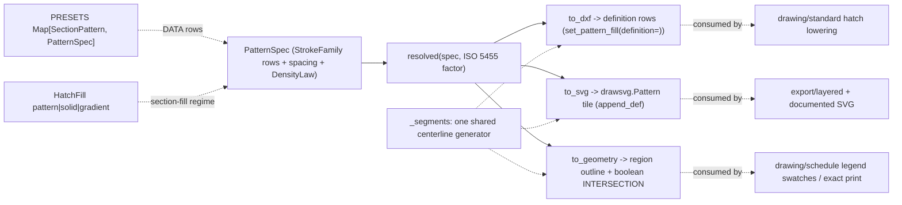

# [PY_ARTIFACTS_GRAPHIC_VECTOR_PATTERN]

The repeating-fill generator of the vector plane — ONE spec family that turns a declared stroke geometry into every fill the corpus needs. `PatternSpec` declares repeating fill as data: `StrokeFamily(angle, origin, delta, dash)` rows compose parallel stroke sets, `DensityLaw` fixes how spacing responds to drawing scale (paper-constant vs model-true under the ISO 5455 scale factor supplied as a VALUE), and the `HatchFill` union closes the ISO 128-50 section-fill regime — a scaled stroke pattern, a solid poché, or a two-stop graded fill — so a section producer keys ONE vocabulary for every fill it draws.

Three lowerings project from the one spec: `to_dxf` emits the ezdxf pattern-line definition rows `Hatch.set_pattern_fill(name, definition=)` consumes (ezdxf's OWN renderer draws the fill, never a bare foreign pattern name deferred to a CAD app), `to_svg` emits a `drawsvg.Pattern` def-tier tile a document references by id, and `to_geometry` generates REAL clipped stroke geometry through the region plane (stroked centerlines intersected against the boundary — the exact-print/legend-swatch/plot form where a tile reference is not acceptable). The preset catalog is DATA: ISO 128-50 material indications and the office families stand as `PatternSpec` rows under honest owned names, and density derives from the `DensityLaw` and the supplied scale factor — the borrowed ACAD name table (one name double-booked across two materials) and the hand-tuned per-material scale magic are the rejected forms. This page imports `graphic/vector/path#PATH` (fragment egress, tolerance rows) and `graphic/vector/region#REGION` (outline/boolean/document — the pathops clip lowering) and NOTHING above s1: the material→pattern BIND rows are `drawing/regime#REGIME`'s, the ezdxf `Hatch` entity mutation is `drawing/standard#STANDARD`'s, and solid/gradient COLOR VALUES arrive resolved from `graphic/color/derive#DERIVE` through the consumer's bind row — no literal hex here.

## [01]-[INDEX]

- [01]-[PATTERN]: the repeating-fill spec family and its three lowerings — `StrokeFamily` the parallel-stroke row, `PatternSpec` the composed family set with nominal spacing, `DensityLaw` the paper-constant/model-true scale response, `HatchFill` the closed pattern/solid/gradient section-fill regime, the `PRESETS` DATA catalog under owned names, `resolved` the one density fold, and the `to_dxf`/`to_svg`/`to_geometry` lowerings over the shared `_segments` generator.

## [02]-[PATTERN]

- Owner: `PatternSpec` the one repeating-fill spec — `families: tuple[StrokeFamily, ...]` composing any multi-direction pattern (a crosshatch is two families, a masonry course a long-dash family plus a staggered-vertical family), `spacing` the nominal stroke separation in paper mm, `law` the `DensityLaw` member fixing scale response. `HatchFill` is the closed fill-kind union a section producer carries: `pattern(PatternSpec)`, `solid(str)` (the poché color VALUE, resolved upstream), `gradient(Stops, float)` (stop rows with the grade angle). Every lowering is a projection FROM the spec — the spec never knows a target's API, and a target never re-derives geometry.
- Cases: `DensityLaw.PAPER` (spacing constant on the printed sheet: model spacing = `spacing / factor` under the ISO 5455 factor, so a 1:50 wall section and a 1:5 detail of one material print at the SAME visual density — the drafting-correct default), `DensityLaw.MODEL` (spacing true in model units: paper spacing = `spacing * factor` — the form a physically-meaningful pattern such as a masonry course keys, one brick one course at every scale). The law member and the factor VALUE are the whole scale axis; the hand-tuned per-material scale fudge is the rejected form.
- Auto: `resolved(spec, factor)` is the one density fold both non-DXF lowerings and the regime bind rows read; `_segments(family, window, spacing)` generates one family's stroke centerlines across a bounding window — one generator every lowering shares. `to_dxf` emits the `[angle, base, offset, *dash]` rows in the ezdxf definition format then applies density through `ezdxf.tools.pattern.scale_pattern`, so the DXF renderer draws from the SAME geometry the SVG tile and the clipped geometry draw; `to_svg` sizes one period tile from the deltas and draws typed `draw.Line`/`draw.Path` children of a `drawsvg.Pattern`; `to_geometry` strokes each centerline set through region `outline` then folds `boolean((strokes, boundary), INTERSECTION)` so the emitted document is REAL severed hatch inside the boundary — a mask or a tile reference is the rejected form where exact print or a plotter consumes the output.
- Receipt: pattern is generation vocabulary — no receipt case, no content key; the consuming producer (schedule legend, layered export, standard's hatch lowering) keys the emitted geometry into its own receipt.
- Growth: a new material or office pattern is one `PRESETS` row (a `PatternSpec` of `StrokeFamily` data), never a new generator; a new fill regime beside pattern/solid/gradient is one `HatchFill` case plus one arm in each consumer's lowering; a new lowering target is one projection function over the SAME `_segments` generator; a density variant is one `DensityLaw` member, never a per-material factor.
- Packages: `ezdxf` (`tools.pattern.scale_pattern` the definition scaler; the definition-row format `set_pattern_fill(definition=)` consumes — the entity mutation stays `drawing/standard#STANDARD`'s); `drawsvg` (`Pattern(width, height, patternUnits=)` the def-tier tile, `Line`/`Path` the stroke children); `numpy` (the window sweep); `expression` (`tagged_union`, `Map.of_seq` the preset table, `Result`); `msgspec` (`Struct`); `graphic/vector/path#PATH` (`Bounds`); `graphic/vector/region#REGION` (`outline`/`boolean`/`document` — the clip lowering).
- Boundary: the one fallible lowering is `to_geometry`, carrying the region plane's `RegionFault` rail whole — no parallel pattern fault vocabulary is minted for a plane that composes its faults from one owner. No material vocabulary and no bind rows (`drawing/regime#REGIME` binds `HatchMaterial` → preset + density); no ezdxf entity mutation (`drawing/standard#STANDARD` composes `to_dxf` output onto its `Hatch`); no color derivation (values arrive resolved); no receipt/identity; nothing above s1 imported.

```python signature
# --- [RUNTIME_PRELUDE] ------------------------------------------------------------------
from enum import StrEnum
from math import cos, radians, sin
from typing import Final, Literal

import numpy as np
from expression import Result, case, tag, tagged_union
from expression.collections import Map
from msgspec import Struct

from rasm.artifacts.graphic.vector.path import Bounds
from rasm.artifacts.graphic.vector.region import BooleanOp, RegionFault, Stops, boolean, document, outline

lazy import drawsvg as draw
lazy from ezdxf.tools import pattern as _dxfpattern

# --- [TYPES] ----------------------------------------------------------------------------
type DxfPatternLine = list[float]  # [angle, base_x, base_y, offset_x, offset_y, *dash] — the set_pattern_fill(definition=) row shape
type HatchFillTag = Literal["pattern", "solid", "gradient"]


class DensityLaw(StrEnum):
    PAPER = "paper"  # spacing constant on the printed sheet: model spacing = spacing / factor (drafting default)
    MODEL = "model"  # spacing true in model units: paper spacing = spacing * factor (physically-meaningful courses)


class SectionPattern(StrEnum):  # owned preset names — ISO 128-50 / ANSI / BS conventions under honest spellings, never a borrowed ACAD table
    GENERAL = "general"  # 45-degree single hatch — the ISO 128-50 general section indication
    DOUBLE = "double"  # paired 45-degree lines — alloy/reinforced convention
    CROSS = "cross"  # 0/90 grid
    CROSS_DIAGONAL = "cross_diagonal"  # 45/135 crosshatch
    HERRINGBONE = "herringbone"  # alternating dashed diagonals — timber grain
    END_GRAIN = "end_grain"  # tight crossed diagonals — timber end section
    INSULATION = "insulation"  # long-dash loop family — thermal batt convention
    EARTH = "earth"  # 45-degree dashed tick bands
    GRAVEL = "gravel"  # staggered short-dash families — hardcore/fill
    MASONRY = "masonry"  # 0-degree coursing plus staggered verticals — brick/block
    LIQUID = "liquid"  # 0-degree dashed pairs
    GLASS = "glass"  # sparse 135-degree wide lines


# --- [MODELS] ---------------------------------------------------------------------------
class StrokeFamily(Struct, frozen=True):
    # one parallel-stroke set: strokes run at `angle` (degrees) through `origin`, successive strokes
    # advance by `delta` (multiples of the resolved spacing); `dash` is +draw/-gap in paper mm, () = continuous.
    angle: float
    origin: tuple[float, float] = (0.0, 0.0)
    delta: tuple[float, float] = (0.0, 1.0)
    dash: tuple[float, ...] = ()


class PatternSpec(Struct, frozen=True):
    families: tuple[StrokeFamily, ...]
    spacing: float = 2.0  # nominal stroke separation, paper mm — the DensityLaw scales it, never a per-material fudge
    law: DensityLaw = DensityLaw.PAPER
    weight: float = 0.18  # stroke pen width, paper mm — the to_geometry outline width


@tagged_union(frozen=True)
class HatchFill:
    # the ISO 128-50 section-fill regime — a scaled stroke pattern, a solid poche, or a graded fill;
    # color VALUES arrive resolved, never literal here.
    tag: HatchFillTag = tag()
    pattern: PatternSpec = case()
    solid: str = case()
    gradient: tuple[Stops, float] = case()  # stop rows + grade angle (degrees)


# --- [TABLES] ---------------------------------------------------------------------------
_D45: Final[tuple[float, float]] = (0.0, 1.0)
PRESETS: Final[Map[SectionPattern, PatternSpec]] = Map.of_seq([
    (SectionPattern.GENERAL, PatternSpec(families=(StrokeFamily(45.0),), spacing=2.5)),
    (SectionPattern.DOUBLE, PatternSpec(families=(StrokeFamily(45.0), StrokeFamily(45.0, origin=(0.0, 0.4))), spacing=2.5)),
    (SectionPattern.CROSS, PatternSpec(families=(StrokeFamily(0.0), StrokeFamily(90.0)), spacing=3.0)),
    (SectionPattern.CROSS_DIAGONAL, PatternSpec(families=(StrokeFamily(45.0), StrokeFamily(135.0)), spacing=3.0)),
    (
        SectionPattern.HERRINGBONE,
        PatternSpec(
            families=(StrokeFamily(45.0, dash=(3.0, -3.0)), StrokeFamily(135.0, origin=(3.0, 0.0), dash=(3.0, -3.0))),
            spacing=3.0,
            law=DensityLaw.MODEL,
        ),
    ),
    (SectionPattern.END_GRAIN, PatternSpec(families=(StrokeFamily(45.0), StrokeFamily(135.0)), spacing=1.2)),
    (
        SectionPattern.INSULATION,
        PatternSpec(families=(StrokeFamily(0.0, dash=(4.0, -2.0)), StrokeFamily(0.0, origin=(3.0, 0.5), dash=(4.0, -2.0))), spacing=4.0),
    ),
    (SectionPattern.EARTH, PatternSpec(families=(StrokeFamily(45.0, dash=(6.0, -3.0)),), spacing=4.0)),
    (
        SectionPattern.GRAVEL,
        PatternSpec(families=(StrokeFamily(0.0, dash=(1.5, -2.5)), StrokeFamily(0.0, origin=(2.0, 0.5), dash=(1.5, -2.5))), spacing=2.0),
    ),
    (
        SectionPattern.MASONRY,
        PatternSpec(
            families=(StrokeFamily(0.0), StrokeFamily(90.0, dash=(4.0, -4.0)), StrokeFamily(90.0, origin=(4.0, 4.0), dash=(4.0, -4.0))),
            spacing=4.0,
            law=DensityLaw.MODEL,
        ),
    ),
    (SectionPattern.LIQUID, PatternSpec(families=(StrokeFamily(0.0, dash=(8.0, -4.0)), StrokeFamily(0.0, origin=(2.0, 0.5), dash=(8.0, -4.0))), spacing=3.0)),
    (SectionPattern.GLASS, PatternSpec(families=(StrokeFamily(135.0),), spacing=6.0)),
])


# --- [OPERATIONS] -----------------------------------------------------------------------
def resolved(spec: PatternSpec, factor: float, /) -> float:
    # the ONE density fold: PAPER holds sheet density constant, MODEL holds model truth; `factor` is
    # the ISO 5455 value the regime bind row supplies, never an import.
    return spec.spacing / factor if spec.law is DensityLaw.PAPER else spec.spacing * factor


def _segments(family: StrokeFamily, window: Bounds, spacing: float, /) -> tuple[tuple[tuple[float, float], tuple[float, float]], ...]:
    # one family's centerlines across the window: sweep origins along the rotated delta at the resolved
    # spacing, clip each stroke to the window diagonal — the shared generator core.
    x0, y0, x1, y1 = window
    span = float(np.hypot(x1 - x0, y1 - y0))
    ux, uy = cos(radians(family.angle)), sin(radians(family.angle))
    step_x, step_y = family.delta[0] * spacing, family.delta[1] * spacing
    nx, ny = -uy, ux  # stroke normal — origins advance across it
    count = int(span / max(float(np.hypot(step_x, step_y)), 1e-9)) + 1
    cx, cy = (x0 + x1) / 2.0 + family.origin[0], (y0 + y1) / 2.0 + family.origin[1]
    return tuple(
        (
            (cx + nx * k * spacing - ux * span / 2.0, cy + ny * k * spacing - uy * span / 2.0),
            (cx + nx * k * spacing + ux * span / 2.0, cy + ny * k * spacing + uy * span / 2.0),
        )
        for k in range(-count, count + 1)
    )


def to_dxf(spec: PatternSpec, factor: float, /) -> tuple[DxfPatternLine, ...]:
    # ezdxf definition rows in [angle, base, offset, *dash] format, density applied through scale_pattern
    # — ezdxf's own renderer draws the fill.
    base = [
        [family.angle, family.origin[0], family.origin[1], family.delta[0] * spec.spacing, family.delta[1] * spec.spacing, *family.dash]
        for family in spec.families
    ]
    scale = resolved(spec, factor) / spec.spacing
    return tuple(_dxfpattern.scale_pattern(base, factor=scale))


def to_svg(spec: PatternSpec, factor: float, stroke: str, /) -> "draw.Pattern":
    # the def-tier tile: one period sized from the resolved spacing, strokes drawn as typed elements;
    # the consumer registers the def once and fills by reference.
    spacing = resolved(spec, factor)
    side = max(spacing * 4.0, 1.0)
    tile = draw.Pattern(side, side, patternUnits="userSpaceOnUse")
    for family in spec.families:
        for (ax, ay), (bx, by) in _segments(family, (0.0, 0.0, side, side), spacing):
            dash = " ".join(str(abs(d)) for d in family.dash) if family.dash else None
            tile.append(draw.Line(ax, ay, bx, by, stroke=stroke, stroke_width=spec.weight, stroke_dasharray=dash))
    return tile


def to_geometry(spec: PatternSpec, boundary: bytes, window: Bounds, factor: float, /) -> Result[bytes, RegionFault]:
    # REAL clipped hatch: stroke every centerline to a closed outline, intersect against the boundary
    # through the region plane — severed geometry for exact print/legend/plot.
    spacing = resolved(spec, factor)
    lines = document(
        tuple(
            f"M{ax} {ay}L{bx} {by}"
            for family in spec.families
            for (ax, ay), (bx, by) in _segments(family, window, spacing)
        ),
        window,
    )
    return outline(lines, width=spec.weight).bind(lambda strokes: boolean((strokes, boundary), BooleanOp.INTERSECTION))


# --- [EXPORTS] --------------------------------------------------------------------------
__all__ = [
    "DensityLaw",
    "DxfPatternLine",
    "HatchFill",
    "PRESETS",
    "PatternSpec",
    "SectionPattern",
    "StrokeFamily",
    "resolved",
    "to_dxf",
    "to_geometry",
    "to_svg",
]
```



## [03]-[RESEARCH]

<!-- source-only: research row template:
[TOKEN]-[OPEN|BLOCKED]: <exact question>; <verification route>.
-->

(none)
