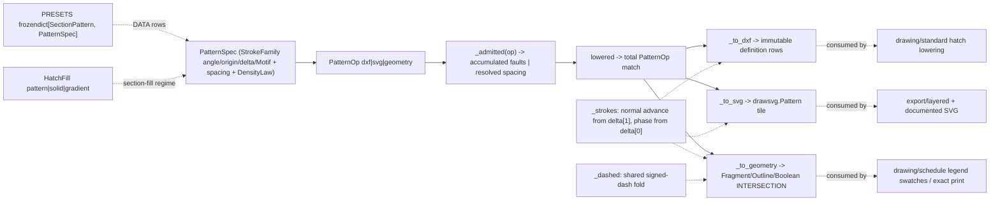

# [PY_ARTIFACTS_GRAPHIC_VECTOR_PATTERN]

`PatternSpec` owns repeating fill as generative data. Each `StrokeFamily` carries placement and one payload-bearing `Motif` case, `DensityLaw` resolves drawing scale, and one `PatternOp` family lowers the same correspondence into DXF rows, an SVG definition, or clipped geometry.

`lowered(op)` projects every `StrokeFamily` axis from one admitted `PatternOp`. DXF results carry immutable pattern-line rows, SVG results carry a `drawsvg.Pattern` definition, and geometry results carry region-clipped document bytes; `PatternFault.unlowerable` preserves a motif a target grammar cannot represent. `PRESETS` remains seed data over the same generative axes.

## [01]-[INDEX]

- [01]-[PATTERN]: `PatternSpec`, payload-bearing `Motif`, `PatternOp`, and `PatternResult` form one repeating-fill rail over the `_strokes` and `_dashed` generators.

## [02]-[PATTERN]

- Owner: `PatternSpec` carries the family set, nominal spacing, density law, and pen weight; `StrokeFamily` carries angle, origin, rotated-frame delta, and one `Motif` payload. `PatternOp` closes target-specific ingress, `PatternResult` closes per-target payloads, and `lowered` is the only public operational entrypoint.
- Cases: `DensityLaw.PAPER` resolves model spacing as `spacing / factor`, while `DensityLaw.MODEL` resolves it as `spacing * factor`. `Motif.line` owns its signed draw-gap rhythm; `Motif.loop` owns amplitude and chord error, so no mode-inapplicable dash or amplitude field survives on `StrokeFamily`.
- Auto: `_admitted(op)` accumulates the shared admission faults — family axes, motif payloads, spacing/factor/weight, and per-op boundary material — before `_lowered` dispatches, while target-grammar refusals stay in the target kernels (`_to_dxf` refuses a LOOP motif the HATCH grammar cannot state, `_to_svg` a free angle or mixed-axis period with no finite square tile); `_resolved` folds density once; `_strokes` resolves `delta[1]` onto the world normal and `delta[0]` onto dash phase; `_dashed` partitions the density-scaled line rhythm; `_looped` derives tessellation from amplitude and chord error; `_period` derives the first tile row whose phase repeats modulo the scaled dash period. `_to_dxf`, `_to_svg`, and `_to_geometry` are private target kernels beneath `lowered`.
- Receipt: pattern is generation vocabulary — no receipt case, no content key; the consuming producer (schedule legend, layered export, standard's hatch lowering) keys the emitted geometry into its own receipt.
- Growth: a new pattern is one `PRESETS` row; a stroke shape is one `Motif` case and one `_strokes` arm; a lowering target is one `PatternOp` case, one `PatternResult` case, and one private kernel; a density behavior is one `DensityLaw` member.
- Packages: `ezdxf` (`tools.pattern.scale_pattern` the definition scaler; the definition-row format `set_pattern_fill(definition=)` consumes — the entity mutation stays `drawing/standard#STANDARD`'s); `drawsvg` (`Pattern(width, height, patternUnits=)` the def-tier tile, `Lines` the stroke children with native `stroke_dasharray`/`stroke_dashoffset`); `expression` (`tagged_union`, `Result`); `msgspec` (`Struct`); stdlib `math` (the scalar trigonometry — no array substrate for a closed-form sweep); `graphic/vector/path#PATH` (`Bounds`/`Point2`); `graphic/vector/region#REGION` (`applied` over `RegionOp` — the clip lowering).
- Boundary: `PatternFault.degenerate` accumulates independent admission failures, `unlowerable` preserves target grammar limits, and `geometry` carries `RegionFault` whole. Material binding, ezdxf entity mutation, color derivation, identity, and receipts remain consumer-owned.

```python signature
# --- [RUNTIME_PRELUDE] ------------------------------------------------------------------
from enum import StrEnum
from fractions import Fraction
from itertools import accumulate, pairwise
from math import ceil, cos, hypot, isfinite, lcm, pi, radians, sin
from typing import Final, Literal, assert_never

from builtins import frozendict
from expression import Error, Ok, Result, case, tag, tagged_union
from msgspec import Struct

from rasm.artifacts.graphic.vector.path import Bounds, Point2
from rasm.artifacts.graphic.vector.region import BooleanOp, Fragment, RegionFault, RegionOp, Stops, applied

lazy import drawsvg as draw
lazy from ezdxf.tools import pattern as _dxfpattern

# --- [TYPES] ----------------------------------------------------------------------------
type DxfPatternLine = tuple[float, Point2, Point2, tuple[float, ...]]  # ezdxf HatchPatternLineType: [angle, base, offset, dashes] — scale_pattern and set_pattern_fill(definition=) both consume this nested shape
type Stroke = tuple[tuple[Point2, ...], float]  # one stroke polyline + its dash phase (mm along the stroke) — the generator row
type HatchFillTag = Literal["pattern", "solid", "gradient"]
type MotifTag = Literal["line", "loop"]
type PatternOpTag = Literal["dxf", "svg", "geometry"]
type PatternResultTag = Literal["dxf", "svg", "geometry"]


class DensityLaw(StrEnum):
    PAPER = "paper"  # spacing constant on the printed sheet: model spacing = spacing / factor (drafting default)
    MODEL = "model"  # spacing true in model units: paper spacing = spacing * factor (physically-meaningful courses)


@tagged_union(frozen=True)
class Motif:
    tag: MotifTag = tag()
    line: tuple[float, ...] = case()
    loop: tuple[float, float] = case()  # half-wave amplitude and maximum chord error


class SectionPattern(StrEnum):  # owned preset names — ISO 128-50 / ANSI / BS conventions under honest spellings, never a borrowed ACAD table
    GENERAL = "general"  # 45-degree single hatch — the ISO 128-50 general section indication
    DOUBLE = "double"  # paired 45-degree lines — alloy/reinforced convention
    CROSS = "cross"  # 0/90 grid
    CROSS_DIAGONAL = "cross_diagonal"  # 45/135 crosshatch
    HERRINGBONE = "herringbone"  # alternating dashed diagonals with course stagger — timber grain
    END_GRAIN = "end_grain"  # tight crossed diagonals — timber end section
    INSULATION = "insulation"  # LOOP-motif batt wave — thermal batt convention, real loops
    EARTH = "earth"  # 45-degree dashed tick bands
    GRAVEL = "gravel"  # phase-staggered short-dash courses — hardcore/fill
    MASONRY = "masonry"  # continuous coursing plus phase-staggered verticals — running-bond brick/block
    LIQUID = "liquid"  # staggered dashed pairs
    GLASS = "glass"  # sparse 135-degree wide lines


# --- [MODELS] ---------------------------------------------------------------------------
class StrokeFamily(Struct, frozen=True):
    # one parallel-stroke set: strokes run at `angle` (degrees) through `origin`; successive strokes
    # advance by the ROTATED-frame `delta` (multiples of the resolved spacing) — delta[1] the
    # perpendicular step and delta[0] the along-stroke phase stagger; Motif owns its mode payload.
    angle: float
    origin: tuple[float, float] = (0.0, 0.0)
    delta: tuple[float, float] = (0.0, 1.0)
    motif: Motif = Motif(line=())


class PatternSpec(Struct, frozen=True):
    families: tuple[StrokeFamily, ...]
    spacing: float = 2.0  # nominal stroke separation, paper mm — the DensityLaw scales it, never a per-material fudge
    law: DensityLaw = DensityLaw.PAPER
    weight: float = 0.18  # stroke pen width in paper mm; the geometry arm resolves it through RegionOp.Outline


@tagged_union(frozen=True)
class HatchFill:
    # the ISO 128-50 section-fill regime — a scaled stroke pattern, a solid poche, or a graded fill;
    # color VALUES arrive resolved, never literal here.
    tag: HatchFillTag = tag()
    pattern: PatternSpec = case()
    solid: str = case()
    gradient: tuple[Stops, float] = case()  # stop rows + grade angle (degrees)


@tagged_union(frozen=True)
class PatternOp:
    tag: PatternOpTag = tag()
    dxf: tuple[PatternSpec, float] = case()
    svg: tuple[PatternSpec, float, str] = case()
    geometry: tuple[PatternSpec, bytes, Bounds, float] = case()

    @staticmethod
    def Dxf(spec: PatternSpec, factor: float) -> "PatternOp":
        return PatternOp(dxf=(spec, factor))

    @staticmethod
    def Svg(spec: PatternSpec, factor: float, stroke: str) -> "PatternOp":
        return PatternOp(svg=(spec, factor, stroke))

    @staticmethod
    def Geometry(spec: PatternSpec, boundary: bytes, window: Bounds, factor: float) -> "PatternOp":
        return PatternOp(geometry=(spec, boundary, window, factor))


@tagged_union(frozen=True)
class PatternResult:
    tag: PatternResultTag = tag()
    dxf: tuple[DxfPatternLine, ...] = case()
    svg: "draw.Pattern" = case()
    geometry: bytes = case()


# --- [ERRORS] ---------------------------------------------------------------------------
@tagged_union(frozen=True)
class PatternFault:
    tag: Literal["degenerate", "unlowerable", "geometry"] = tag()
    degenerate: tuple[str, ...] = case()
    unlowerable: tuple[str, str] = case()  # (motif-or-axis, target) the target format cannot express — refused, never degraded
    geometry: RegionFault = case()  # the region plane's fault carried whole, never re-classified


# --- [TABLES] ---------------------------------------------------------------------------
_SQRT2: Final[float] = 2.0**0.5
PRESETS: Final[frozendict[SectionPattern, PatternSpec]] = frozendict({
    SectionPattern.GENERAL: PatternSpec(families=(StrokeFamily(45.0),), spacing=2.5),
    SectionPattern.DOUBLE: PatternSpec(families=(StrokeFamily(45.0), StrokeFamily(45.0, origin=(0.0, 0.4))), spacing=2.5),
    SectionPattern.CROSS: PatternSpec(families=(StrokeFamily(0.0), StrokeFamily(90.0)), spacing=3.0),
    SectionPattern.CROSS_DIAGONAL: PatternSpec(families=(StrokeFamily(45.0), StrokeFamily(135.0)), spacing=3.0),
    SectionPattern.HERRINGBONE: PatternSpec(
        families=(
            StrokeFamily(45.0, delta=(1.0, 1.0), motif=Motif(line=(3.0, -3.0))),
            StrokeFamily(135.0, delta=(1.0, 1.0), motif=Motif(line=(3.0, -3.0))),
        ),
        spacing=3.0,
        law=DensityLaw.MODEL,
    ),
    SectionPattern.END_GRAIN: PatternSpec(families=(StrokeFamily(45.0), StrokeFamily(135.0)), spacing=1.2),
    SectionPattern.INSULATION: PatternSpec(families=(StrokeFamily(0.0, motif=Motif(loop=(3.0, 0.1))),), spacing=8.0),
    SectionPattern.EARTH: PatternSpec(families=(StrokeFamily(45.0, motif=Motif(line=(6.0, -3.0))),), spacing=4.0),
    SectionPattern.GRAVEL: PatternSpec(families=(StrokeFamily(0.0, delta=(0.5, 1.0), motif=Motif(line=(1.5, -2.5))),), spacing=2.0),
    SectionPattern.MASONRY: PatternSpec(
        families=(StrokeFamily(0.0), StrokeFamily(90.0, delta=(1.0, 1.0), motif=Motif(line=(4.0, -4.0)))),
        spacing=4.0,
        law=DensityLaw.MODEL,
    ),
    SectionPattern.LIQUID: PatternSpec(families=(StrokeFamily(0.0, delta=(0.5, 1.0), motif=Motif(line=(8.0, -4.0))),), spacing=3.0),
    SectionPattern.GLASS: PatternSpec(families=(StrokeFamily(135.0),), spacing=6.0),
})


# --- [OPERATIONS] -----------------------------------------------------------------------
def _resolved(spec: PatternSpec, factor: float, /) -> float:
    # the ONE density fold: PAPER holds sheet density constant, MODEL holds model truth; `factor` is
    # the ISO 5455 value the regime bind row supplies, never an import.
    return spec.spacing / factor if spec.law is DensityLaw.PAPER else spec.spacing * factor


def _admitted(op: PatternOp, /) -> Result[float, PatternFault]:
    def _family(family: StrokeFamily, index: int, /) -> tuple[str, ...]:
        axes = () if all(isfinite(value) for value in (family.angle, *family.origin, *family.delta)) else (f"<family:{index}:non-finite-axis>",)
        advance = () if family.delta[1] != 0.0 else (f"<family:{index}:zero-perpendicular-advance>",)
        match family.motif:
            case Motif(tag="line", line=dash):
                motif = (
                    ()
                    if all(isfinite(value) and value != 0.0 and (value > 0.0) is (slot % 2 == 0) for slot, value in enumerate(dash))
                    else (f"<family:{index}:dash-must-alternate-draw-gap>",)
                )
            case Motif(tag="loop", loop=(amplitude, error)):
                motif = () if isfinite(amplitude) and isfinite(error) and amplitude > 0.0 and error > 0.0 else (f"<family:{index}:invalid-loop>",)
            case _ as unreachable:
                assert_never(unreachable)
        return (*axes, *advance, *motif)

    match op:
        case PatternOp(tag="dxf", dxf=(spec, factor)):
            boundary = ()
        case PatternOp(tag="svg", svg=(spec, factor, stroke)):
            boundary = () if stroke else ("<empty-stroke>",)
        case PatternOp(tag="geometry", geometry=(spec, source, (x0, y0, x1, y1), factor)):
            boundary = tuple(
                flaw
                for flaw, valid in (("<empty-boundary>", bool(source)), ("<degenerate-window>", x1 > x0 and y1 > y0))
                if not valid
            )
        case _ as unreachable:
            assert_never(unreachable)

    flaws = (
        *(("<empty-families>",) if not spec.families else ()),
        *(("<invalid-spacing-factor-or-weight>",) if not all(isfinite(value) and value > 0.0 for value in (spec.spacing, factor, spec.weight)) else ()),
        *(flaw for index, family in enumerate(spec.families) for flaw in _family(family, index)),
        *boundary,
    )
    return Error(PatternFault(degenerate=flaws)) if flaws else Ok(_resolved(spec, factor))


def _looped(a: Point2, b: Point2, loop: tuple[float, float], /) -> tuple[Point2, ...]:
    # the batt wave: linked semicircles alternating side, sampled to a polyline — the LOOP motif arm.
    (ax_, ay_), (bx, by) = a, b
    amplitude, error = loop
    span = hypot(bx - ax_, by - ay_)
    ux, uy = (bx - ax_) / span, (by - ay_) / span
    nx, ny = -uy, ux
    steps = max(ceil(pi * amplitude / error), 4)
    total = max(ceil(span / (2.0 * amplitude)), 1) * steps
    return tuple(
        (
            ax_ + ux * (span * t / total) + nx * (w := amplitude * sin(pi * (t % steps) / steps) * (-1.0) ** (t // steps)),
            ay_ + uy * (span * t / total) + ny * w,
        )
        for t in range(total + 1)
    )


def _strokes(family: StrokeFamily, window: Bounds, spacing: float, /) -> tuple[Stroke, ...]:
    # ONE generative correspondence every lowering projects: strokes run along u(angle); successive
    # delta[1] advances the line across its normal; delta[0] advances only dash phase because
    # translation along an infinite line is geometric identity.
    x0, y0, x1, y1 = window
    span = hypot(x1 - x0, y1 - y0)
    ux, uy = cos(radians(family.angle)), sin(radians(family.angle))
    sx, sy = family.delta[0] * spacing, family.delta[1] * spacing
    wx, wy = -sy * uy, sy * ux
    cx, cy = (x0 + x1) / 2.0 + family.origin[0], (y0 + y1) / 2.0 + family.origin[1]
    count = int(span / abs(sy)) + 1
    ends = tuple(
        (((cx + k * wx - ux * span / 2.0, cy + k * wy - uy * span / 2.0), (cx + k * wx + ux * span / 2.0, cy + k * wy + uy * span / 2.0)), k * sx)
        for k in range(-count, count + 1)
    )

    def _points(a: Point2, b: Point2, /) -> tuple[Point2, ...]:
        match family.motif:
            case Motif(tag="line"):
                return (a, b)
            case Motif(tag="loop", loop=loop):
                return _looped(a, b, loop)
            case _ as unreachable:
                assert_never(unreachable)

    return tuple((_points(a, b), phase) for (a, b), phase in ends)


def _dashed(points: tuple[Point2, ...], dash: tuple[float, ...], phase: float, /) -> tuple[tuple[Point2, ...], ...]:
    # the shared dash fold: split one straight run into +draw segments cycling the signed dash row,
    # entering the cycle at the stroke's phase; geometry composes it and SVG spells it natively.
    (ax_, ay_), (bx, by) = points[0], points[-1]
    span = hypot(bx - ax_, by - ay_)
    ux, uy = (bx - ax_) / span, (by - ay_) / span
    period = sum(abs(d) for d in dash)
    cycles = ceil((span + period) / period)
    starts = accumulate((abs(d) for _ in range(cycles) for d in dash), initial=-(phase % period))
    return tuple(
        ((ax_ + ux * lo, ay_ + uy * lo), (ax_ + ux * hi, ay_ + uy * hi))
        for (head, tail), d in zip(pairwise(starts), dash * cycles, strict=True)
        if d > 0.0 and (lo := max(head, 0.0)) < (hi := min(tail, span))
    )


def _d(points: tuple[Point2, ...], /) -> str:
    (hx, hy), *rest = points
    return f"M{hx} {hy}" + "".join(f"L{x} {y}" for x, y in rest)


def _period(family: StrokeFamily, spec: PatternSpec, spacing: float, /) -> tuple[Fraction, bool]:
    # a square tile wraps seamlessly only when one side-translation maps the family onto itself; on
    # the drafting angle set, rows repeat when their phase returns modulo the scaled dash period.
    match family.motif:
        case Motif(tag="line", line=row) if row and family.delta[0] != 0.0:
            repeats = (Fraction(str(abs(family.delta[0]) * spec.spacing)) / Fraction(str(sum(abs(value) for value in row)))).denominator
        case _:
            repeats = 1
    base = Fraction(str(abs(family.delta[1]))) * Fraction(str(spacing)) * repeats
    return base, family.angle % 90.0 == 45.0


def _to_dxf(spec: PatternSpec, spacing: float, /) -> Result[tuple[DxfPatternLine, ...], PatternFault]:
    # ezdxf definition rows in [angle, base, offset, *dash] format — angle, origin, rotated-frame delta,
    # and dash all native to the HATCH grammar; density applied through scale_pattern so ezdxf's own
    # renderer draws from the SAME correspondence. HATCH pattern lines are straight dashed families
    # only, so a LOOP motif refuses typed.
    if any(family.motif.tag == "loop" for family in spec.families):
        return Error(PatternFault(unlowerable=("loop", "dxf-pattern-definition")))

    def _row(family: StrokeFamily, /) -> DxfPatternLine:
        # the loop refusal above leaves only line motifs, so the dash payload reads directly off the active case
        return (family.angle, family.origin, (family.delta[0] * spec.spacing, family.delta[1] * spec.spacing), family.motif.line)

    scaled = _dxfpattern.scale_pattern([_row(family) for family in spec.families], factor=spacing / spec.spacing)
    return Ok(
        tuple(
            (float(angle), (float(base[0]), float(base[1])), (float(offset[0]), float(offset[1])), tuple(float(item) for item in dashes))
            for angle, base, offset, dashes in scaled
        )
    )


def _to_svg(spec: PatternSpec, spacing: float, stroke: str, /) -> Result["draw.Pattern", PatternFault]:
    # the def-tier tile: one seamless period sized from the family periods, strokes drawn as typed
    # draw.Lines with the dash as native stroke_dasharray and the delta stagger as stroke_dashoffset;
    # a non-45-multiple angle has no finite square period and refuses typed.
    if any(family.angle % 45.0 != 0.0 for family in spec.families):
        return Error(PatternFault(unlowerable=("free-angle", "svg-tile")))
    periods = tuple(_period(family, spec, spacing) for family in spec.families)
    if len({diagonal for _, diagonal in periods}) != 1:
        return Error(PatternFault(unlowerable=("mixed-axis-diagonal-periods", "svg-tile")))
    denominator = lcm(*(period.denominator for period, _ in periods))
    base = Fraction(lcm(*(period.numerator * (denominator // period.denominator) for period, _ in periods)), denominator)
    side = float(base) * (_SQRT2 if periods[0][1] else 1.0)

    def _tile() -> "draw.Pattern":
        # side > 0 structurally: base multiplies the admitted delta[1] != 0 by the admitted spacing > 0; a clamp would desynchronize
        # the tile extent from the (0, 0, side, side) stroke window and corrupt the seam.
        tile = draw.Pattern(side, side, patternUnits="userSpaceOnUse")
        for family in spec.families:
            match family.motif:
                case Motif(tag="line", line=row):
                    dash = " ".join(str(abs(value) * spacing / spec.spacing) for value in row) if row else None
                case Motif(tag="loop"):
                    dash = None
                case _ as unreachable:
                    assert_never(unreachable)
            for points, phase in _strokes(family, (0.0, 0.0, side, side), spacing):
                flat = tuple(coord for point in points for coord in point)
                tile.append(
                    draw.Lines(
                        *flat,
                        stroke=stroke,
                        stroke_width=spec.weight,
                        fill="none",
                        stroke_dasharray=dash,
                        stroke_dashoffset=phase if dash else None,
                    )
                )
        return tile

    return Ok(_tile())


def _to_geometry(spec: PatternSpec, boundary: bytes, window: Bounds, spacing: float, /) -> Result[bytes, PatternFault]:
    # REAL clipped hatch: dash the centerlines through the shared fold, stroke every run to a closed
    # outline, intersect against the boundary through region applied — severed geometry for exact
    # print/legend/plot; a mask or a tile reference is the rejected form.
    runs = tuple(
        run
        for family in spec.families
        for points, phase in _strokes(family, window, spacing)
        for run in (
            _dashed(points, dash, phase)
            if (dash := tuple(value * spacing / spec.spacing for value in family.motif.line) if family.motif.tag == "line" else ())
            else (points,)
        )
    )
    return (
        applied(RegionOp.Serialize(tuple(Fragment(path=_d(points)) for points in runs), window))
        .bind(lambda lines: applied(RegionOp.Outline(lines.document, width=spec.weight)))
        .bind(lambda strokes: applied(RegionOp.Boolean((strokes.document, boundary), BooleanOp.INTERSECTION)))
        .map(lambda merged: merged.document)
        .map_error(lambda fault: PatternFault(geometry=fault))
    )


def _lowered(op: PatternOp, spacing: float, /) -> Result[PatternResult, PatternFault]:
    match op:
        case PatternOp(tag="dxf", dxf=(spec, _factor)):
            return _to_dxf(spec, spacing).map(lambda rows: PatternResult(dxf=rows))
        case PatternOp(tag="svg", svg=(spec, _factor, stroke)):
            return _to_svg(spec, spacing, stroke).map(lambda tile: PatternResult(svg=tile))
        case PatternOp(tag="geometry", geometry=(spec, boundary, window, _factor)):
            return _to_geometry(spec, boundary, window, spacing).map(lambda document: PatternResult(geometry=document))
        case _ as unreachable:
            assert_never(unreachable)


def lowered(op: PatternOp, /) -> Result[PatternResult, PatternFault]:
    return _admitted(op).bind(lambda spacing: _lowered(op, spacing))


# --- [EXPORTS] --------------------------------------------------------------------------
__all__ = [
    "DensityLaw",
    "DxfPatternLine",
    "HatchFill",
    "Motif",
    "PRESETS",
    "PatternFault",
    "PatternOp",
    "PatternResult",
    "PatternSpec",
    "SectionPattern",
    "StrokeFamily",
    "lowered",
]
```



## [03]-[RESEARCH]

<!-- source-only: research row template:
[TOKEN]-[OPEN|BLOCKED]: <exact question>; <verification route>.
-->

(none)
