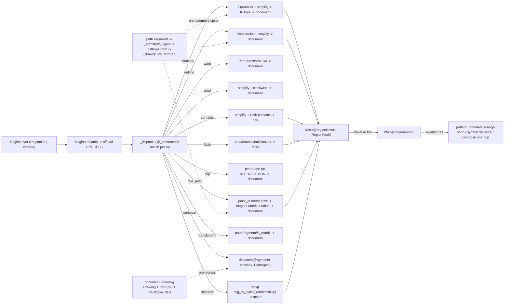

# [PY_ARTIFACTS_GRAPHIC_VECTOR_REGION]

The boolean/offset/serialization owner of the vector plane — the s1 surface that turns parsed geometry into set-operated, stroked, warped, wound, hit-tested, documented, and rasterized regions. `Region` is ONE modal owner over the closed `RegionOp` family, normalizing `RegionOp | Iterable[RegionOp]` at the head so a lone boolean and a mixed union + stroke + rasterize batch are the same entrypoint, traversing the ops into one `RuntimeRail[Block[RegionResult]]` whose every outcome is the typed `RegionResult` (`document`/`facts`/`hits`/`raster`), never an erased `bytes` a consumer re-parses. Beside the rail the page exposes the composable surface — `boolean`/`outline`/`warp`/`wind`/`contains`/`facts`/`clip`/`text_path`/`transform`/`fit`/`document`/`rasterize` plus the `RenderPolicy` raster-policy owner and the `PaintSpec` gradient/flat paint rows — that `graphic/vector/pattern#PATTERN`, `drawing/annotate#ANNOTATE`, and `drawing/symbol#SYMBOL` import one hop. Every fallible arm rails its provider raise into the closed `RegionFault` `@tagged_union` (`geometry`/`render`/`empty`/`contract`/`open_path`/`degenerate`); the interior is total over `Result[RegionResult, RegionFault]`, never a railless body trusting a boundary capsule to swallow a `pathops.PathOpsError` or a `resvg` `ValueError` it never classified.

`skia-pathops` (the abi3 binding of Skia's `SkPathOps`/`SkStroke`) owns the boolean/offset/outline algebra `svgelements` cannot express — N-ary planar set operations (`op`/`OpBuilder` over `union`/`difference`/`intersection`/`xor`/`reverse_difference`), self-intersection removal and winding repair (`simplify`), stroke-to-outline / fixed-width offset (`Path.stroke` with cap/join/miter/dash), the projective 3x3 `Path.transform` warp, the settable `Path.clockwise` winding normalization, the `area`/`bounds`/`controlPointBounds`/`isConvex` query family, and the fill-rule `Path.contains` hit test — over ONE mutable accumulator the `graphic/vector/path#PATH` segment stream draws into through the FontTools pen protocol and the result draws back out of into a `fonttools` `SVGPathPen`, so geometry never re-parses a `d` string between ops. `drawsvg` owns EVERY document emission: `Drawing`/`Group`/`Path(d=)`/`Raw` assemble fragments onto a viewBox-framed canvas, the `LinearGradient`/`RadialGradient` def-tier owners carry the `PaintSpec` gradient rows (the V13 graded region fill), and `as_svg().encode()` is the one egress — a hand-emitted f-string `<svg>`/`<path>` tag is the deleted form. `resvg_py.svg_to_bytes` rasterizes a placed document to PNG bytes in-process under the one `RenderPolicy`. TEXT-ON-PATH lands here as the `on_path` baseline threading: `typography/shape#SHAPE`'s `PositionedGlyphRun.on_path()` per-glyph outlines (the `to_svg_path` surface) lay along a baseline at METRIC arc-length positions composing path's `point_at` — never a local re-shape (the shape-once law; the SHAPE_QA vharfbuzz golden oracle is the parity proof for every consumer rewire). Because the pathops algebra, the drawsvg assembly of large sheets, and the resvg render are synchronous native/CPU work, the modal rail crosses the whole op batch through the runtime lane's `offload(..., modality=Modality.PROCESS)` under the runtime-owned worker bound — zero folder-minted limiters, zero folder runtime retry 

## [01]-[INDEX]

- [01]-[REGION]: the boolean/offset/outline/serialization owner over the closed-payload `RegionOp` family, the typed `RegionResult` outcome, and the closed `RegionFault` vocabulary — the `pathops` spine (`_ingest` pen replay under one total segment `match`, `_admitted` arc-to-cubic pre-flatten, `OpBuilder`/`op` set-ops keyed by `BooleanOp`, `simplify` winding repair, `Path.stroke` keyed by `CapStyle`/`JoinStyle`, the 3x3 `warp`, the `WindingDir`-keyed `wind`, the `RegionFacts` query, the `Path.contains` hit test), the per-shape geometric `clip`, the metric TEXT-ON-PATH threading shape's glyph outlines along path's `point_at` rows, the drawsvg `document` assembly with the `PaintSpec` flat/linear/radial paint rows, the `transform`/`fit` placed re-emissions over path's affine, and the `resvg_py.svg_to_bytes` raster floor under the one `RenderPolicy` — the composable surface pattern/annotate/symbol import one hop, and the `Region.over`/`of` modal rail the awaited uniform-op contract over `Block[RegionResult]`.

## [02]-[REGION]

- Owner: `Region` the one boolean/offset/serialization owner holding `ops: tuple[RegionOp, ...]` and discriminating operation over the closed `RegionOp` `expression.tagged_union` whose every case carries its own typed payload; projecting one closed `RegionResult` family; and railing every provider raise into the closed `RegionFault` `@tagged_union`. The `pathops.Path` accumulator is the boolean working surface, `drawsvg.Drawing` the one document canvas, `resvg_py.svg_to_bytes` the in-process raster floor. Parse, drawable narrowing, combined outlines, affine matrices, and metric positions arrive from `graphic/vector/path#PATH` (`scene`/`combined`/`fragment`/`fit_matrix`/`point_at`/`TOLERANCE`) — this owner never re-parses, never re-derives an affine, and never re-shapes text.
- Cases: `RegionOp` cases — `Boolean(sources, op=UNION, fill=WINDING)` (ingest each parsed outline into ONE `pathops.Path` through `getPen`, fold operands through `OpBuilder.add(path, PathOp)`+`resolve` keyed by the `BooleanOp` selector, `simplify` the winding, set `fillType` from the `WindingRule`, draw back — the set-op algebra svgelements has no member for) · `Outline(source, width, cap=BUTT, join=MITER, miter=4.0, dash=None)` (`Path.stroke` the centerline into a closed filled outline keyed by `CapStyle`/`JoinStyle` — the stroke-to-outline / fixed-width offset the marks/diagram plane keys for thick connectors and offset boundaries, and the scallop-band substrate `drawing/annotate#ANNOTATE` composes) · `Warp(source, coeffs)` (the full 3x3 `Path.transform(scaleX, skewY, skewX, scaleY, tX, tY, pX, pY, bias)` affine/PERSPECTIVE the svgelements 6-tuple `Matrix` cannot express — keystone/perspective placement on geometry already in the Skia accumulator) · `Wind(source, direction=CW)` (`simplify` to canonicalize then set the Skia `clockwise` policy so a disagreeing contour reverses — the hole-order/toolpath/nesting normalization `facts` reads but no query fixes) · `Contains(source, points)` (`simplify` then `Path.contains` each point under the resolved `FillType` into one `tuple[bool, ...]` — the membership the facts alone cannot answer) · `Facts(source)` (`simplify` then read `abs(area)`/`bounds`/contour-count/`isConvex`/`controlPointBounds` — the winding/hole/area/convexity/control-hull query a toolpath or placement consumer keys) · `Clip(source, rect)` (per-shape geometric crop: intersect EACH drawable outline against the window through `pathops.op(shape, window, INTERSECTION)`, keeping non-empty survivors as separate fragments framed to the rect — a straddling shape is really severed, not masked, and separate shapes stay separate fragments) · `TextPath(glyphs, baseline, offset=0.0)` (thread each `(d-string, advance)` glyph outline along the baseline at its METRIC mid-advance arc-length position — path's `point_at` resolves `(position, unit tangent)` rows in ONE vectorized call — placing each glyph by the tangent-following `Matrix(tx, ty, -ty, tx, px, py)` then `OpBuilder`-union the placed glyphs into one filled document; `glyphs` admits a `PositionedGlyphRun` or raw pairs, the run case reading `run.on_path()` at the factory head) · `Transform(source, matrix=None)` (re-emit every drawable through path's `fragment(shape, matrix)` onto one drawsvg document framed to the resolved content bbox; `matrix=None` is the identity-normalize form baking `reify=True` absolute coordinates) · `Fit(source, target)` (compose path's `fit_matrix` and re-emit the placed document into the target viewport — the scale-fit `composition/compose#COMPOSE` delegates) · `Serialize(fragments, viewbox, paint=None)` (assemble pre-built `d` fragments onto a fresh viewBox-framed drawsvg canvas under the optional `PaintSpec` — the one document assembly every producer routes through) · `Rasterize(document, render)` (`resvg_py.svg_to_bytes(**render.kwargs(...))` under the one `RenderPolicy`, PNG `raster` bytes) — matched by one total `match`/`case`. `RegionResult` cases — `document` (SVG bytes), `facts` (the `RegionFacts` tuple), `hits` (per-point membership), `raster` (PNG bytes).
- Modality: `Region.over` normalizes `RegionOp | Iterable[RegionOp]` into the `ops` tuple by a structural `match` at the head — a lone boolean is the one-element case, a mixed sheet the multi-element case, never a `batch: bool` and never a per-op sibling.
- Auto: `_ingest` replays the svgelements segment stream into a `pathops.Path` through the FontTools `getPen()` under one total `match` over `Move`/`Close`/`CubicBezier`/`QuadraticBezier`/`Line`; `_admitted` pre-flattens arcs to cubics under the path `TOLERANCE.flatten` row (the pen speaks move/line/cubic/quad/close, never an arc/conic verb); `_drawn` runs `convertConicsToQuads(TOLERANCE.conic)` (SVG has no conic verb; round caps/joins emit conics) then draws into a `fonttools` `SVGPathPen` whose `getCommands()` d-string feeds the one `document` assembly; `document` builds a `drawsvg.Drawing` sized to the viewbox extent with the full `xmin ymin width height` viewBox so non-origin geometry is framed, never clipped to a `0 0 w h` box, registers `PaintSpec` gradient defs once via `append_def`, and appends one `draw.Path(d=)` per fragment — `as_svg().encode()` is the one egress, an f-string tag the deleted form; `_resolved` is the shared thunk-trap naming `OpenPathError` BEFORE its `PathOpsError` base so the precise open-path cause is not shadowed by the broad leaf; `text_path` reads the glyph mid-advance distances as one vector, resolves every `(position, tangent)` row through ONE `point_at` call, and unions the placed glyphs so tight-curve overlaps merge into one outline; `rasterize` maps the engine's `ValueError` onto `RegionFault.render`.
- Faults: `RegionFault` — `geometry` (a `graphic/vector/path#PATH` `PathFault` carried whole: parse/singular/empty/contract faults from the composed substrate cross AS the typed case, never re-classified), `render` (a `resvg_py.svg_to_bytes` `ValueError` on empty/invalid SVG or a bad option value), `empty` (a boolean/stroke result with zero contours, or an empty glyph set — the bounds read the interior would otherwise crash on), `contract` (a `BeartypeCallHintViolation` the `_contracted` weave lifts onto `_dispatch`'s rail), `open_path` (a `pathops.OpenPathError` on an unclosed contour), `degenerate` (a `pathops.PathOpsError` leaf — `NumberOfPointsError`/`UnsupportedVerbError`/root — carrying the leaf type name).
- Receipt: `Region` is a geometry substrate — its results are keyed by the consuming producer into its own `ContentIdentity.of` and contributed to `core/receipt#RECEIPT`; this owner mints no content key and adds no receipt case.
- Growth: a new boolean kind is one `BooleanOp` member (its `.name` resolving the `pathops.PathOp` member by `getattr` — one derivation, never a parallel map); a new stroke cap/join one `CapStyle`/`JoinStyle` member; a winding-policy shift one `WindingRule` member; a winding target one `WindingDir` member; a new paint row one `PaintSpec` case lowered to its drawsvg def; a knockout glyph boolean composes the SAME `getPen`/`draw` pen spine directly onto the typography glyph producers with no serialization hop; a new resvg sizing/font/policy knob is one `RenderPolicy` field carried into the one `svg_to_bytes` spread — never a second rasterizer; a new fault cause is one `RegionFault` case; zero new surface.
- Packages: `skia-pathops` (`Path`/`getPen`/`draw`/`stroke`/`transform`/`clockwise`/`simplify`/`convertConicsToQuads`/`area`/`bounds`/`controlPointBounds`/`isConvex`/`contains`, `op`/`OpBuilder.add`+`resolve`, `PathOp`/`FillType`/`LineCap`/`LineJoin` enums, `OpenPathError`/`PathOpsError`/`NumberOfPointsError`/`UnsupportedVerbError`; `reverse_difference` is NOT re-exported at top level — the `op(one, two, PathOp.REVERSE_DIFFERENCE)` binary form and the `OpBuilder` N-way form are the always-top-level spellings); `drawsvg` (`Drawing(width, height, origin=)`/`append`/`append_def`/`as_svg`, `Path(d=)`/`Group`/`Raw`, `LinearGradient`/`RadialGradient` + `add_stop` — the `save_png`/video extras are absent on core, raster stays resvg); `resvg_py` (`svg_to_bytes`, the embedded `resvg 0.47.0` engine, `ValueError` the one raise); `fonttools` (`SVGPathPen` the draw-back pen); `svgelements` (segment types the pen replay matches; parse/affine arrive through path); `expression` (`tagged_union`/`Result`/`Block`/`Map.of_seq`/`traverse`); `msgspec` (`Struct`/`asdict` the `RenderPolicy` spread); `beartype` (the `_contracted` weave); runtime `lanes` (`offload`/`Modality.PROCESS`), runtime `faults` (`RuntimeRail`); `typography/shape#SHAPE` (`PositionedGlyphRun.on_path()`/`to_svg_path` — glyph outlines arrive shaped, never re-shaped here).
- Boundary: no parse/measure/sample/affine re-derivation (path's, composed one hop); no repeating fill geometry (`graphic/vector/pattern#PATTERN` composes THIS page's clip); no chart-origin SVG rasterization (`vl-convert`'s bundled resvg core owns it — one chart rasterizer, no parallel admission); no text shaping (`typography/shape#SHAPE` shapes; this page only places outlines); no receipt or identity minting; no folder-minted limiter/stamina — the native seam is the runtime lane's `offload`.

```python signature
# --- [RUNTIME_PRELUDE] ------------------------------------------------------------------
from collections.abc import Callable, Iterable, Mapping
from enum import StrEnum
from functools import wraps
from typing import TYPE_CHECKING, Literal, Self, assert_never

from beartype import BeartypeConf, beartype
from beartype.roar import BeartypeCallHintViolation
from expression import Error, Ok, Result, case, tag, tagged_union
from expression.collections import Block
from expression.extra.result import traverse
from msgspec import Struct
from msgspec.structs import asdict

from rasm.artifacts.graphic.vector.path import TOLERANCE, Bounds, PathFault, Point2, Tolerance, combined, fit_matrix, fragment, point_at, scene
from rasm.runtime.faults import RuntimeRail
from rasm.runtime.lanes import LanePolicy, Modality

lazy import drawsvg as draw
lazy import pathops
lazy import resvg_py
lazy from fontTools.pens.svgPathPen import SVGPathPen
lazy from svgelements import Close, CubicBezier, Matrix, Move, QuadraticBezier
lazy from svgelements import Path as SvgPath

if TYPE_CHECKING:
    import pathops
    from svgelements import Matrix, Shape
    from svgelements import Path as SvgPath

    from rasm.artifacts.typography.shape import PositionedGlyphRun

# --- [TYPES] ----------------------------------------------------------------------------
type RegionFacts = tuple[float, Bounds, int, bool, Bounds]  # (absolute area, tight bounds, contour count, convex, control-hull bounds)
type Glyphs = tuple[tuple[str, float], ...]  # per-glyph (origin-drawn SVG d-string, x-advance) — PositionedGlyphRun.on_path()
type Stroked = tuple[str, str, float]  # a per-fragment styled path: (d-string, stroke color, stroke width) — document strokes it, fill="none"
type Fragment = str | Stroked  # a document fragment: a bare d-string under the uniform paint, or a Stroked path rendering its own stroke/width
type Stops = tuple[tuple[float, str], ...]  # gradient (offset 0..1, resolved color value) rows — colors arrive resolved, never literal here
type RenderKwargs = dict[str, str | int | float | bool | list[str] | None]
type ShapeRendering = Literal["optimize_speed", "crisp_edges", "geometric_precision"]
type TextRendering = Literal["optimize_speed", "optimize_legibility", "geometric_precision"]
type ImageRendering = Literal["optimize_quality", "optimize_speed"]
type RegionOpTag = Literal[
    "boolean", "outline", "warp", "wind", "contains", "facts", "clip", "text_path", "transform", "fit", "serialize", "rasterize"
]
type RegionResultTag = Literal["document", "facts", "hits", "raster"]
type RegionFaultTag = Literal["geometry", "render", "empty", "contract", "open_path", "degenerate"]
type PaintTag = Literal["flat", "linear", "radial"]


# the pathops selectors — each member NAME mirrors the `pathops.PathOp`/`LineCap`/`LineJoin`/`FillType` member it
# resolves through `getattr(pathops.<Enum>, member.name)`, one derivation, never a parallel map.
class BooleanOp(StrEnum):
    UNION = "union"
    DIFFERENCE = "difference"
    INTERSECTION = "intersection"
    XOR = "xor"
    REVERSE_DIFFERENCE = "reverse-difference"


class CapStyle(StrEnum):
    BUTT_CAP = "butt-cap"
    ROUND_CAP = "round-cap"
    SQUARE_CAP = "square-cap"


class JoinStyle(StrEnum):
    MITER_JOIN = "miter-join"
    ROUND_JOIN = "round-join"
    BEVEL_JOIN = "bevel-join"


class WindingRule(StrEnum):
    WINDING = "winding"
    EVEN_ODD = "even-odd"
    INVERSE_WINDING = "inverse-winding"
    INVERSE_EVEN_ODD = "inverse-even-odd"


class WindingDir(StrEnum):  # target contour winding — maps onto the settable pathops.Path.clockwise
    CW = "cw"
    CCW = "ccw"


# --- [MODELS] ---------------------------------------------------------------------------
@tagged_union(frozen=True)
class PaintSpec:
    # the fill paint a serialized document carries: flat color value, or a drawsvg def-tier gradient
    # (the V13 graded region fill); color VALUES arrive resolved from graphic/color/derive, never literal.
    tag: PaintTag = tag()
    flat: str = case()
    linear: tuple[Stops, tuple[float, float, float, float]] = case()  # stops + (x1, y1, x2, y2) userSpaceOnUse
    radial: tuple[Stops, tuple[float, float, float]] = case()  # stops + (cx, cy, r)


class RenderPolicy(Struct, frozen=True):
    width: int | None = None
    height: int | None = None
    zoom: float | None = None
    dpi: float = 0.0
    background: str | None = None
    style_sheet: str | None = None
    resources_dir: str | None = None
    languages: tuple[str, ...] = ()
    skip_system_fonts: bool = False
    font_size: float = 16.0
    font_files: tuple[str, ...] = ()
    font_dirs: tuple[str, ...] = ()
    font_family: str | None = None
    serif_family: str | None = None
    sans_serif_family: str | None = None
    cursive_family: str | None = None
    fantasy_family: str | None = None
    monospace_family: str | None = None
    shape_rendering: ShapeRendering = "geometric_precision"
    text_rendering: TextRendering = "optimize_legibility"
    image_rendering: ImageRendering = "optimize_quality"
    log_information: bool = False

    def kwargs(self, source: Mapping[str, str]) -> RenderKwargs:
        # parameterized over the source-keyword mapping ({"svg_string": markup} OR {"svg_path": path}) the
        # consumer projects; each ()-default tuple coerces to `list(value) or None` per the engine's shape.
        rows = {key: (list(value) or None) if isinstance(value, tuple) else value for key, value in asdict(self).items()}
        return {**source, **rows}


# --- [ERRORS] ---------------------------------------------------------------------------
@tagged_union(frozen=True)
class RegionFault:
    tag: RegionFaultTag = tag()
    geometry: PathFault = case()  # the composed path substrate's fault carried whole, never re-classified
    render: str = case()
    empty: None = case()
    contract: str = case()
    open_path: None = case()  # a pathops boolean/stroke met an unclosed contour (OpenPathError)
    degenerate: str = case()  # a pathops PathOpsError leaf (NumberOfPointsError/UnsupportedVerbError/root)


# --- [OPERATIONS] -----------------------------------------------------------------------
# ONE geometry spine: path's svgelements segments -> pathops.Path -> boolean/simplify/stroke -> drawsvg document,
# never a re-parsed `d` between ops and never an f-string tag at egress.
def _ingest(outline: "SvgPath", target: "pathops.Path", /) -> None:
    pen = target.getPen()  # the FontTools PathPen the svgelements segment stream draws into
    for segment in outline.segments():
        match segment:
            case Move():
                pen.moveTo((float(segment.end.x), float(segment.end.y)))
            case Close():
                pen.closePath()
            case CubicBezier():
                pen.curveTo(
                    (float(segment.control1.x), float(segment.control1.y)),
                    (float(segment.control2.x), float(segment.control2.y)),
                    (float(segment.end.x), float(segment.end.y)),
                )
            case QuadraticBezier():
                pen.qCurveTo((float(segment.control.x), float(segment.control.y)), (float(segment.end.x), float(segment.end.y)))
            case _:  # Line and the arcs pre-flattened to cubics upstream
                pen.lineTo((float(segment.end.x), float(segment.end.y)))


def _admitted(outline: "SvgPath", tolerance: Tolerance = TOLERANCE, /) -> "pathops.Path":
    outline.approximate_arcs_with_cubics(tolerance.flatten)  # the pen speaks move/line/cubic/quad/close, never an arc/conic verb
    target = pathops.Path()
    _ingest(outline, target)
    return target


def _to_pathops(source: bytes, /) -> Result["pathops.Path", RegionFault]:
    return combined(source).map_error(lambda fault: RegionFault(geometry=fault)).map(_admitted)


def _drawn(result: "pathops.Path", tolerance: Tolerance = TOLERANCE, /) -> str:
    result.convertConicsToQuads(tolerance.conic)  # SVG has no conic verb; round caps/joins emit conics
    pen = SVGPathPen(None)
    result.draw(pen)
    return pen.getCommands()


def _resolved[T](work: Callable[[], T], /) -> Result[T, RegionFault]:
    try:
        return Ok(work())
    except pathops.OpenPathError:
        return Error(RegionFault(open_path=None))  # named BEFORE the PathOpsError base so the precise cause is not shadowed
    except pathops.PathOpsError as fault:
        return Error(RegionFault(degenerate=type(fault).__name__))


def _paint_defs(canvas: "draw.Drawing", paint: PaintSpec | None, /) -> str | None:
    # register the PaintSpec def ONCE and return the fill value; flat returns the color, gradients
    # return the registered def the appended paths reference — reusable paint, never inline duplication.
    match paint:
        case None:
            return None
        case PaintSpec(tag="flat", flat=color):
            return color
        case PaintSpec(tag="linear", linear=(stops, (x1, y1, x2, y2))):
            grad = draw.LinearGradient(x1, y1, x2, y2, gradientUnits="userSpaceOnUse")
            for offset, color in stops:
                grad.add_stop(offset, color)
            canvas.append_def(grad)
            return grad
        case PaintSpec(tag="radial", radial=(stops, (cx, cy, r))):
            grad = draw.RadialGradient(cx, cy, r, gradientUnits="userSpaceOnUse")
            for offset, color in stops:
                grad.add_stop(offset, color)
            canvas.append_def(grad)
            return grad
        case _ as unreachable:
            assert_never(unreachable)


def document(fragments: Iterable[Fragment], viewbox: Bounds, paint: PaintSpec | None = None) -> bytes:
    # the ONE document assembly: a drawsvg canvas framed to the full extent (non-origin geometry framed,
    # never clipped to `0 0 w h`), one draw.Path per fragment — a bare d-string under the uniform paint, a
    # `Stroked` path carrying its own stroke/width — gradient defs registered once.
    xmin, ymin, xmax, ymax = viewbox
    canvas = draw.Drawing(xmax - xmin, ymax - ymin, origin=(xmin, ymin))
    fill = _paint_defs(canvas, paint)
    for frag in fragments:
        match frag:
            case str() as d:
                canvas.append(draw.Path(d=d) if fill is None else draw.Path(d=d, fill=fill))
            case (d, stroke, width):
                canvas.append(draw.Path(d=d, stroke=stroke, stroke_width=width, fill="none"))
    return canvas.as_svg().encode()


def boolean(sources: tuple[bytes, ...], op: BooleanOp = BooleanOp.UNION, fill: WindingRule = WindingRule.WINDING) -> Result[bytes, RegionFault]:
    def _fold(paths: Block["pathops.Path"], /) -> Result[bytes, RegionFault]:
        def _run() -> "pathops.Path":
            builder, member = pathops.OpBuilder(fix_winding=True, keep_starting_points=True), getattr(pathops.PathOp, op.name)
            for operand in paths:  # the first add seeds the base, each later add applies `op` against the accumulator
                builder.add(operand, member)
            result = builder.resolve()
            result.simplify(fix_winding=True)
            result.fillType = getattr(pathops.FillType, fill.name)
            return result

        return _resolved(_run).bind(_framed)

    return traverse(_to_pathops, Block.of_seq(sources)).bind(_fold)


def _framed(result: "pathops.Path", /) -> Result[bytes, RegionFault]:
    if not len(result):  # len is the contour count; an empty boolean/stroke rails empty rather than an empty bounds read
        return Error(RegionFault(empty=None))
    box = result.bounds
    return Ok(document((_drawn(result),), (float(box[0]), float(box[1]), float(box[2]), float(box[3]))))


def outline(
    source: bytes,
    width: float = 1.0,
    cap: CapStyle = CapStyle.BUTT_CAP,
    join: JoinStyle = JoinStyle.MITER_JOIN,
    miter: float = 4.0,
    dash: tuple[float, ...] | None = None,
) -> Result[bytes, RegionFault]:
    def _stroke(centerline: "pathops.Path", /) -> Result[bytes, RegionFault]:
        def _run() -> "pathops.Path":
            centerline.stroke(width, getattr(pathops.LineCap, cap.name), getattr(pathops.LineJoin, join.name), miter, dash)
            centerline.simplify(fix_winding=True)
            return centerline

        return _resolved(_run).bind(_framed)

    return _to_pathops(source).bind(_stroke)


def warp(source: bytes, coeffs: tuple[float, float, float, float, float, float, float, float, float]) -> Result[bytes, RegionFault]:
    # the full 3x3 affine/PERSPECTIVE placement: pathops.Path.transform(scaleX, skewY, skewX, scaleY,
    # tX, tY, perspectiveX, perspectiveY, bias) in place — the keystone dewarp the 6-tuple Matrix lacks.
    def _apply(shape: "pathops.Path", /) -> Result[bytes, RegionFault]:
        def _run() -> "pathops.Path":
            shape.transform(*coeffs)
            return shape

        return _resolved(_run).bind(_framed)

    return _to_pathops(source).bind(_apply)


def wind(source: bytes, direction: WindingDir = WindingDir.CW) -> Result[bytes, RegionFault]:
    def _orient(shape: "pathops.Path", /) -> Result[bytes, RegionFault]:
        def _run() -> "pathops.Path":
            shape.simplify(fix_winding=True)
            shape.clockwise = direction is WindingDir.CW  # settable dominant-winding policy; reverses disagreeing contours
            return shape

        return _resolved(_run).bind(_framed)

    return _to_pathops(source).bind(_orient)


def contains(source: bytes, points: tuple[Point2, ...]) -> Result[tuple[bool, ...], RegionFault]:
    def _hit(shape: "pathops.Path", /) -> Result[tuple[bool, ...], RegionFault]:
        def _run() -> tuple[bool, ...]:
            shape.simplify(fix_winding=True)  # canonicalize winding first so the FillType point-in-path test is well-defined
            return tuple(bool(shape.contains((float(x), float(y)))) for x, y in points)

        return _resolved(_run)

    return _to_pathops(source).bind(_hit)


def facts(source: bytes) -> Result[RegionFacts, RegionFault]:
    def _read(shape: "pathops.Path", /) -> Result[RegionFacts, RegionFault]:
        def _run() -> RegionFacts:
            shape.simplify(fix_winding=True)
            if not len(shape):
                return (0.0, (0.0, 0.0, 0.0, 0.0), 0, True, (0.0, 0.0, 0.0, 0.0))
            box, hull = shape.bounds, shape.controlPointBounds  # tight extent + the control-hull extent a layout/collision consumer keys
            return (
                abs(float(shape.area)),
                (float(box[0]), float(box[1]), float(box[2]), float(box[3])),
                len(shape),
                bool(shape.isConvex),
                (float(hull[0]), float(hull[1]), float(hull[2]), float(hull[3])),
            )

        return _resolved(_run).bind(lambda read: Ok(read) if read[2] else Error(RegionFault(empty=None)))

    return _to_pathops(source).bind(_read)


def clip(source: bytes, rect: Bounds) -> Result[bytes, RegionFault]:
    # per-shape geometric crop: a straddling shape is really severed at the crop edge, not masked, and
    # separate shapes stay separate fragments rather than one merged whole-document boolean.
    def _window() -> "pathops.Path":
        x0, y0, x1, y1 = rect
        window = pathops.Path()
        pen = window.getPen()
        pen.moveTo((x0, y0))
        pen.lineTo((x1, y0))
        pen.lineTo((x1, y1))
        pen.lineTo((x0, y1))
        pen.closePath()
        return window

    def _cut(shapes: list["Shape"], /) -> Result[bytes, RegionFault]:
        def _run() -> bytes:
            window = _window()
            kept = tuple(
                _drawn(clipped)
                for shape in shapes
                if len(clipped := pathops.op(_admitted(SvgPath(*SvgPath(shape).segments())), window, pathops.PathOp.INTERSECTION))
            )
            return document(kept, rect)

        return _resolved(_run)

    return scene(source).map_error(lambda fault: RegionFault(geometry=fault)).bind(_cut)


def text_path(glyphs: "PositionedGlyphRun | Glyphs", baseline: bytes, offset: float = 0.0) -> Result[bytes, RegionFault]:
    # METRIC text-on-path: shape's origin-drawn glyph outlines lay at mid-advance arc-length distances
    # resolved through ONE point_at call; the tangent-following Matrix rotates each glyph onto the baseline.
    rows: Glyphs = glyphs.on_path() if hasattr(glyphs, "on_path") else tuple(glyphs)
    if not rows:
        return Error(RegionFault(empty=None))
    cursors = tuple(offset + sum(advance for _, advance in rows[:index]) + rows[index][1] * 0.5 for index in range(len(rows)))

    def _thread(oriented: tuple[tuple[Point2, Point2], ...], /) -> Result[bytes, RegionFault]:
        def _run() -> "pathops.Path":
            builder = pathops.OpBuilder(fix_winding=True, keep_starting_points=True)
            for (d, _), ((px_, py_), (tx, ty)) in zip(rows, oriented, strict=True):
                if d:  # each placed glyph is one UNION operand so tight-curve overlaps merge into one outline
                    builder.add(_admitted(SvgPath(d) * Matrix(tx, ty, -ty, tx, px_, py_)), pathops.PathOp.UNION)
            result = builder.resolve()
            result.simplify(fix_winding=True)
            return result

        return _resolved(_run).bind(_framed)

    return point_at(baseline, cursors).map_error(lambda fault: RegionFault(geometry=fault)).bind(_thread)


def transform(source: bytes, matrix: "Matrix | None" = None) -> Result[bytes, RegionFault]:
    def _emit(shapes: list["Shape"], /) -> Result[bytes, RegionFault]:
        boxes = [box for shape in shapes if (box := shape.bbox()) is not None]
        if not boxes:
            return Error(RegionFault(empty=None))
        extent = (min(b[0] for b in boxes), min(b[1] for b in boxes), max(b[2] for b in boxes), max(b[3] for b in boxes))
        return Ok(document(tuple(fragment(shape, matrix) for shape in shapes), extent))

    return scene(source).map_error(lambda fault: RegionFault(geometry=fault)).bind(_emit)


def fit(source: bytes, target: Bounds) -> Result[bytes, RegionFault]:
    def _place(matrix: "Matrix", /) -> Result[bytes, RegionFault]:
        return (
            scene(source)
            .map_error(lambda fault: RegionFault(geometry=fault))
            .map(lambda shapes: document(tuple(fragment(shape, matrix) for shape in shapes), target))
        )

    return fit_matrix(source, target).map_error(lambda fault: RegionFault(geometry=fault)).bind(_place)


def rasterize(source: bytes, render: RenderPolicy = RenderPolicy()) -> Result[bytes, RegionFault]:
    try:
        return Ok(resvg_py.svg_to_bytes(**render.kwargs({"svg_string": source.decode()})))
    except ValueError as fault:
        return Error(RegionFault(render=str(fault)))


# --- [COMPOSITION] ----------------------------------------------------------------------
@tagged_union(frozen=True)
class RegionOp:
    tag: RegionOpTag = tag()
    boolean: tuple[tuple[bytes, ...], BooleanOp, WindingRule] = case()
    outline: tuple[bytes, float, CapStyle, JoinStyle, float, tuple[float, ...] | None] = case()
    warp: tuple[bytes, tuple[float, float, float, float, float, float, float, float, float]] = case()
    wind: tuple[bytes, WindingDir] = case()
    contains: tuple[bytes, tuple[Point2, ...]] = case()
    facts: bytes = case()
    clip: tuple[bytes, Bounds] = case()
    text_path: tuple[Glyphs, bytes, float] = case()  # (per-glyph (d, advance), baseline SVG, along-path offset)
    transform: tuple[bytes, "Matrix | None"] = case()
    fit: tuple[bytes, Bounds] = case()
    serialize: tuple[tuple[str, ...], Bounds, PaintSpec | None] = case()
    rasterize: tuple[bytes, RenderPolicy] = case()

    @staticmethod
    def Boolean(sources: Iterable[bytes], op: BooleanOp = BooleanOp.UNION, fill: WindingRule = WindingRule.WINDING) -> "RegionOp":
        return RegionOp(boolean=(tuple(sources), op, fill))

    @staticmethod
    def Outline(
        source: bytes,
        width: float = 1.0,
        cap: CapStyle = CapStyle.BUTT_CAP,
        join: JoinStyle = JoinStyle.MITER_JOIN,
        miter: float = 4.0,
        dash: tuple[float, ...] | None = None,
    ) -> "RegionOp":
        return RegionOp(outline=(source, width, cap, join, miter, dash))

    @staticmethod
    def Warp(source: bytes, coeffs: tuple[float, float, float, float, float, float, float, float, float]) -> "RegionOp":
        return RegionOp(warp=(source, coeffs))

    @staticmethod
    def Wind(source: bytes, direction: WindingDir = WindingDir.CW) -> "RegionOp":
        return RegionOp(wind=(source, direction))

    @staticmethod
    def Contains(source: bytes, points: Iterable[Point2]) -> "RegionOp":
        return RegionOp(contains=(source, tuple(points)))

    @staticmethod
    def Facts(source: bytes) -> "RegionOp":
        return RegionOp(facts=source)

    @staticmethod
    def Clip(source: bytes, rect: Bounds) -> "RegionOp":
        return RegionOp(clip=(source, rect))

    @staticmethod
    def TextPath(glyphs: "PositionedGlyphRun | Iterable[tuple[str, float]]", baseline: bytes, offset: float = 0.0) -> "RegionOp":
        rows = glyphs.on_path() if hasattr(glyphs, "on_path") else tuple(glyphs)
        return RegionOp(text_path=(rows, baseline, offset))

    @staticmethod
    def Transform(source: bytes, matrix: "Matrix | None" = None) -> "RegionOp":
        return RegionOp(transform=(source, matrix))

    @staticmethod
    def Fit(source: bytes, target: Bounds) -> "RegionOp":
        return RegionOp(fit=(source, target))

    @staticmethod
    def Serialize(fragments: tuple[str, ...], viewbox: Bounds, paint: PaintSpec | None = None) -> "RegionOp":
        return RegionOp(serialize=(fragments, viewbox, paint))

    @staticmethod
    def Rasterize(source: bytes, render: RenderPolicy = RenderPolicy()) -> "RegionOp":
        return RegionOp(rasterize=(source, render))


@tagged_union(frozen=True)
class RegionResult:
    tag: RegionResultTag = tag()
    document: bytes = case()
    facts: RegionFacts = case()
    hits: tuple[bool, ...] = case()
    raster: bytes = case()


_CONTRACT = BeartypeConf(is_pep484_tower=True)


def _contracted(operation: Callable[[RegionOp], Result[RegionResult, RegionFault]], /) -> Callable[[RegionOp], Result[RegionResult, RegionFault]]:
    guarded = beartype(conf=_CONTRACT)(operation)

    @wraps(operation)
    def call(op: RegionOp, /) -> Result[RegionResult, RegionFault]:
        try:
            return guarded(op)
        except BeartypeCallHintViolation as violation:
            return Error(RegionFault(contract=type(violation).__name__))

    return call


@_contracted
def _dispatch(op: RegionOp, /) -> Result[RegionResult, RegionFault]:
    match op:
        case RegionOp(tag="boolean", boolean=(sources, kind, fill)):
            return boolean(sources, kind, fill).map(lambda emitted: RegionResult(document=emitted))
        case RegionOp(tag="outline", outline=(source, width, cap, join, miter, dash)):
            return outline(source, width, cap, join, miter, dash).map(lambda emitted: RegionResult(document=emitted))
        case RegionOp(tag="warp", warp=(source, coeffs)):
            return warp(source, coeffs).map(lambda emitted: RegionResult(document=emitted))
        case RegionOp(tag="wind", wind=(source, direction)):
            return wind(source, direction).map(lambda emitted: RegionResult(document=emitted))
        case RegionOp(tag="contains", contains=(source, points)):
            return contains(source, points).map(lambda flags: RegionResult(hits=flags))
        case RegionOp(tag="facts", facts=source):
            return facts(source).map(lambda read: RegionResult(facts=read))
        case RegionOp(tag="clip", clip=(source, rect)):
            return clip(source, rect).map(lambda emitted: RegionResult(document=emitted))
        case RegionOp(tag="text_path", text_path=(glyphs, baseline, offset)):
            return text_path(glyphs, baseline, offset).map(lambda emitted: RegionResult(document=emitted))
        case RegionOp(tag="transform", transform=(source, matrix)):
            return transform(source, matrix).map(lambda emitted: RegionResult(document=emitted))
        case RegionOp(tag="fit", fit=(source, target)):
            return fit(source, target).map(lambda emitted: RegionResult(document=emitted))
        case RegionOp(tag="serialize", serialize=(fragments, viewbox, paint)):
            return Ok(RegionResult(document=document(fragments, viewbox, paint)))
        case RegionOp(tag="rasterize", rasterize=(source, render)):
            return rasterize(source, render).map(lambda png: RegionResult(raster=png))
        case _ as unreachable:
            assert_never(unreachable)


def _worked(ops: tuple[RegionOp, ...], /) -> Result[Block[RegionResult], RegionFault]:
    return traverse(_dispatch, Block.of_seq(ops))


class Region(Struct, frozen=True):
    ops: tuple[RegionOp, ...]

    @classmethod
    def over(cls, ops: RegionOp | Iterable[RegionOp], /) -> Self:
        match ops:
            case RegionOp():
                return cls(ops=(ops,))
            case _:
                return cls(ops=tuple(ops))

    async def of(self, lane: LanePolicy, /) -> RuntimeRail[Block[RegionResult]]:
        # pathops/drawsvg/resvg are synchronous native/CPU work: the whole batch crosses the runtime
        # lane's PROCESS offload under the runtime-owned worker bound — zero folder-minted limiters.
        return await lane.offload(_worked, self.ops, modality=Modality.PROCESS)


# --- [EXPORTS] --------------------------------------------------------------------------
__all__ = [
    "BooleanOp",
    "CapStyle",
    "Fragment",
    "Glyphs",
    "JoinStyle",
    "PaintSpec",
    "Region",
    "RegionFacts",
    "RegionFault",
    "RegionOp",
    "RegionResult",
    "RenderPolicy",
    "Stops",
    "Stroked",
    "WindingDir",
    "WindingRule",
    "boolean",
    "clip",
    "contains",
    "document",
    "facts",
    "fit",
    "outline",
    "rasterize",
    "text_path",
    "transform",
    "warp",
    "wind",
]
```

The `skia-pathops` spine is the second geometry engine — the set-op, winding-repair, stroke-to-outline, projective-warp, and geometric-query algebra `svgelements` has no member for — composed onto the same rail without a second `d`-parse. `_admitted` flattens arcs to cubics under the path `Tolerance.flatten` row then `_ingest` replays the segment stream into a `pathops.Path` through the FontTools `getPen()` under one total `match`, so a source outline crosses into the Skia accumulator once; `boolean` folds N operands through `OpBuilder.add(path, getattr(pathops.PathOp, op.name))`+`resolve`, `simplify(fix_winding=True)` canonicalizes self-intersections, and the `WindingRule`-selected `fillType` fixes what "inside" means; `outline` runs `Path.stroke(width, LineCap, LineJoin, miter, dash)` to convert an open centerline into a closed filled offset outline; `warp` applies the full 3x3 `Path.transform` for the keystone/perspective placement the affine `Matrix` has no member for; `wind` sets the dominant `Path.clockwise` after a `simplify` so a hole-order/toolpath/nesting consumer reads one consistent winding; `facts` reads `abs(area)`/`bounds`/`controlPointBounds`/contour-count/`isConvex` and `contains` tests each point under the resolved fill rule; and every result `convertConicsToQuads(Tolerance.conic)` then draws back into a `fonttools` `SVGPathPen` whose d-string feeds the ONE `document` assembly. The `OpenPathError`/`PathOpsError` raises rail at the shared `_resolved` trap — the open-path case named before its base so the precise cause is never shadowed — and the whole batch rides the runtime lane's PROCESS offload, since `op`/`simplify`/`stroke` and the resvg render are synchronous native CPU work. The same `getPen`/`draw` pen protocol the `fonttools`/`uharfbuzz` glyph producers speak lets a glyph-outline boolean or offset compose `pathops` directly onto `typography/shape#SHAPE`+`typography/font#FONT` with no serialization hop.

`drawsvg` is the one serialization surface: `document` frames every emission on a `Drawing` whose `origin`/size carry the full `xmin ymin width height` extent so non-origin geometry is framed rather than clipped, each fragment lands as one typed `draw.Path(d=)`, and the `PaintSpec` rows lower onto the def-tier `LinearGradient`/`RadialGradient` owners registered once through `append_def` — the V13 graded region fill as data, with every color VALUE arriving resolved from `graphic/color/derive#DERIVE` through the consumer, never a literal here. The `Group`/`Raw` vocabulary stands for structured multi-fragment consumers (`export/layered#LAYERED`'s organized-SVG lane reads the same assembly law); the package's own raster/video extras are absent on core, so PNG stays `resvg_py.svg_to_bytes` under the one `RenderPolicy` whose `kwargs` projects the full sizing/parsing/font/policy axis through one `asdict`-driven spread onto the single call — a new knob is one policy field, never a second rasterizer. TEXT-ON-PATH is the metric composition of the two sibling surfaces: `PositionedGlyphRun.on_path()` supplies origin-drawn glyph outlines with advances (shaped ONCE upstream — the shape-once law; the SHAPE_QA vharfbuzz golden oracle proves every rewire's parity), `point_at` resolves every mid-advance distance to a `(position, unit tangent)` row in one vectorized call, and the tangent-following `Matrix(tx, ty, -ty, tx, px, py)` places each glyph before the `OpBuilder` union merges tight-curve overlaps into one filled outline — a parametric-`t` placement or a local re-shape is the rejected form.


