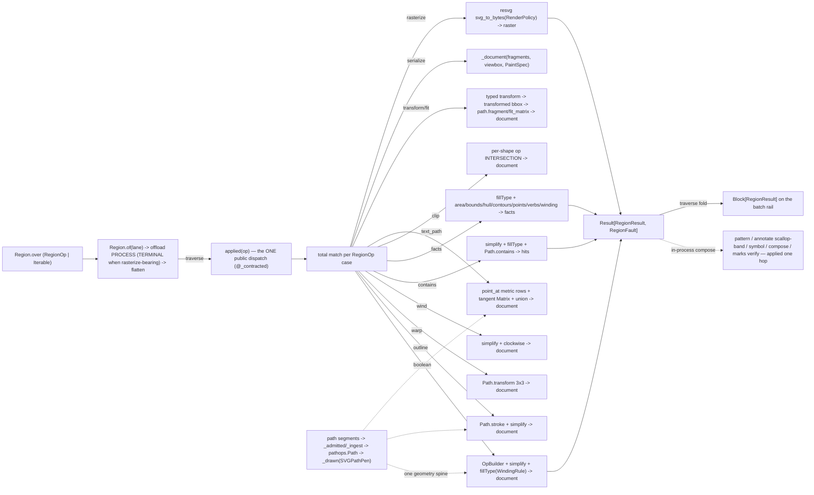

# [PY_ARTIFACTS_GRAPHIC_VECTOR_REGION]

`Region` owns boolean, offset, geometric-query, document, and raster operations over one closed `RegionOp` family. `applied(op)` is the in-process rail, while `Region.over(...).of(lane)` normalizes batch shape and crosses the batch as one `KernelTrait.HOSTILE` kernel onto the warm process pool — cooperative for trusted pathops/drawsvg geometry, `Enforcement.TERMINAL` under `_RASTER_DEADLINE` when the batch carries a `rasterize` op, because that arm decodes caller SVG through resvg and a malformed-input wedge dies only at wall-clock; private kernels preserve the `RegionFault` and `RegionResult` families at every call site.

`skia-pathops` (the abi3 binding of Skia's `SkPathOps`/`SkStroke`) owns the boolean/offset/outline algebra `svgelements` cannot express — N-ary planar set operations (`op`/`OpBuilder`), self-intersection removal and winding repair (`simplify`), stroke-to-outline offset (`Path.stroke` with cap/join/miter/dash), the projective 3x3 `Path.transform` warp, the settable `Path.clockwise` normalization, the `area`/`bounds`/`controlPointBounds`/`isConvex` query family, and the fill-rule `Path.contains` hit test — over ONE mutable accumulator the `graphic/vector/path#PATH` segment stream draws into through the FontTools pen protocol and draws back out of into a `fonttools` `SVGPathPen`, so geometry never re-parses a `d` string between ops. Every geometric query resolves its `WindingRule` onto `Path.fillType` BEFORE the read — `contains`, `area`, and the facts family are fill-rule-governed, so the winding policy is a case payload, never an ambient default. `drawsvg` owns EVERY document emission: `Drawing`/`Group`/`Path(d=)`/`Raw` assemble fragments onto a viewBox-framed canvas, the `LinearGradient`/`RadialGradient` def-tier owners carry the `PaintSpec` gradient rows, and `as_svg().encode()` is the one egress — a hand-emitted f-string tag is the rejected form. `resvg_py.svg_to_bytes` rasterizes a placed document to PNG bytes in-process under the one `RenderPolicy`. TEXT-ON-PATH lands here as the `text_path` baseline threading: `typography/shape#SHAPE`'s `PositionedGlyphRun.on_path()` per-glyph outlines lay along a baseline at METRIC arc-length positions composing path's `point_at`, never a local re-shape (the shape-once law). Because the pathops algebra, the drawsvg assembly, and the resvg render are synchronous native/CPU work, the modal rail crosses the whole batch through the runtime lane's `offload(Kernel.of(..., KernelTrait.HOSTILE))` — zero folder-minted limiters or retry callers, enforcement derived from the batch's own op census.

## [01]-[INDEX]

- [01]-[REGION]: the boolean/offset/outline/serialization owner over the closed `RegionOp` family — the `pathops` boolean/stroke/warp/wind/facts/contains spine under an explicit per-query `WindingRule`, the metric TEXT-ON-PATH threading, the drawsvg document assembly with `PaintSpec` paint, and the `resvg_py` raster floor under one `RenderPolicy` — one entrypoint family: `applied(op)` the in-process dispatch siblings compose, `Region.over`/`of` the batch rail over `Block[RegionResult]`.

## [02]-[REGION]

- Owner: `Region` holds `ops: tuple[RegionOp, ...]`, discriminates over the closed `RegionOp` family, projects one `RegionResult` family, and rails provider failures into `RegionFault`. `applied` is the ONE public dispatch. `pathops.Path` is the boolean working surface, `drawsvg.Drawing` the document canvas, and `resvg_py.svg_to_bytes` the raster floor. Parse, drawable narrowing, combined outlines, affine matrices, and metric positions arrive from `graphic/vector/path#PATH`.
- Cases: `RegionOp` cases split by outcome — `Boolean` (N-ary `OpBuilder` fold keyed by `BooleanOp`, `simplify` winding, `fillType` from `WindingRule` — the set-op algebra svgelements has no member for), `Outline` (`Path.stroke` centerline into a closed filled offset keyed by `CapStyle`/`JoinStyle`), `Warp` (full 3x3 `Path.transform` perspective), `Wind` (`simplify` then set `clockwise`), `Contains` (`WindingRule` resolved onto `Path.fillType` before `Path.contains`), `Facts` (fill-aware area plus tight/control bounds, contour/point/verb counts, convexity, winding, and contour starts), `Clip` (per-shape geometric crop), `TextPath` (metric mid-advance placement through `point_at` and tangent-following `Matrix`), `Transform`/`Fit` (typed placement followed by transformed extent), `Serialize` (closed `Fragment` rows under `PaintSpec`), and `Rasterize` (`resvg_py.svg_to_bytes` under `RenderPolicy`) — matched by one total `match`. `RegionResult` carries `document`, `facts`, `hits`, or `raster` payloads.
- Entry: `applied(op)` for one in-process operation; `Region.over` normalizes `RegionOp | Iterable[RegionOp]` into the `ops` tuple by a structural `match` at the head and `of(lane)` crosses the batch through one `PROCESS` offload, flattening the runtime rail onto the region fault union — a lone boolean the one-element case, a mixed sheet the multi-element case, never a `batch: bool` and never a per-op sibling export. Enforcement folds over the op census: a `rasterize`-bearing batch crosses `Enforcement.TERMINAL` with the `_RASTER_DEADLINE` budget — resvg parses untrusted caller SVG, so the pebble wall-clock kill is the one bound a wedged decode obeys — while a pathops-only batch stays cooperative on the warm pool.
- Auto: `_ingest` replays the svgelements segment stream into a `pathops.Path` through `getPen()` under one total `match`; `_admitted` pre-flattens arcs to cubics under `TOLERANCE.flatten`; `_drawn` runs `convertConicsToQuads(TOLERANCE.conic)` into `SVGPathPen`; `_document` frames a `drawsvg.Drawing` at the supplied extent, registers `PaintSpec` defs once, and exhaustively lowers each `Fragment` case; `_resolved` orders `OpenPathError` before `PathOpsError`; `_text_path` derives glyph mid-advance distances through one `accumulate` scan and one `point_at` call; `_transform` transforms typed shapes before reading their bounds, so serialized geometry and document extent share one fact.
- Receipt: `Region` is a geometry substrate — its results are keyed by the consuming producer into its own `ContentIdentity.key` mint; this owner mints no content key and adds no receipt case.
- Growth: a new boolean kind is one `BooleanOp` member (its `.name` resolving the `pathops.PathOp` member by `getattr`); a new stroke cap/join one `CapStyle`/`JoinStyle` member; a winding policy one `WindingRule` member (its `.name` resolving `pathops.FillType`, threaded to every fill-governed query); a winding target one `WindingDir` member; a new paint row one `PaintSpec` case lowered to its drawsvg def; a knockout glyph boolean composes the SAME `getPen`/`draw` spine onto the typography glyph producers with no serialization hop; a new resvg knob one `RenderPolicy` field carried into the one `svg_to_bytes` spread, never a second rasterizer; a new fault cause one `RegionFault` case; a new operation one `RegionOp` case plus one private kernel plus one `applied` arm — zero new public surface.
- Packages: `skia-pathops` (`Path`/`getPen`/`draw`/`stroke`/`transform`/`clockwise`/`fillType`/`simplify`/`convertConicsToQuads`/`area`/`bounds`/`controlPointBounds`/`isConvex`/`contains`, `op`/`OpBuilder.add`+`resolve`, `PathOp`/`FillType`/`LineCap`/`LineJoin`, `OpenPathError`/`PathOpsError` leaves; `reverse_difference` is NOT re-exported at top level, so the `op(one, two, PathOp.REVERSE_DIFFERENCE)` binary form and the `OpBuilder` N-way form are the top-level spellings); `drawsvg` (`Drawing`/`append`/`append_def`/`as_svg`, `Path(d=)`/`Group`/`Raw`, `LinearGradient`/`RadialGradient` + `add_stop`; save_png/video extras absent on core, raster stays resvg); `resvg_py` (`svg_to_bytes`, `ValueError` the one raise); `fonttools` (`SVGPathPen`); `svgelements` (segment types the pen replay matches); `expression`/`msgspec`/`beartype`; runtime `lanes`/`faults`; `typography/shape#SHAPE` (`PositionedGlyphRun.on_path()` — glyph outlines arrive shaped, never re-shaped here).
- Boundary: the fault rail carries a composed `graphic/vector/path#PATH` `PathFault` whole (`geometry`) rather than re-classifying it, mints `render`/`empty`/`contract`/`open_path`/`degenerate` for its own raises, and never trusts a boundary capsule to swallow an unclassified provider raise. No parse/measure/sample/affine re-derivation (path's, one hop); no repeating fill geometry (`graphic/vector/pattern#PATTERN` composes THIS page's `applied`); no chart-origin SVG rasterization (`vl-convert`'s bundled resvg owns it); no text shaping (`typography/shape#SHAPE` shapes; this page places outlines); no receipt or identity minting; no folder-minted limiter — the native seam is the runtime lane's `offload`.

```python signature
# --- [RUNTIME_PRELUDE] ------------------------------------------------------------------
from collections.abc import Callable, Iterable, Mapping
from enum import StrEnum
from functools import wraps
from itertools import accumulate
from typing import TYPE_CHECKING, Final, Literal, Self, assert_never

from beartype import BeartypeConf, beartype
from beartype.roar import BeartypeCallHintViolation
from expression import Error, Ok, Result, Some, case, tag, tagged_union
from expression.collections import Block
from expression.extra.result import traverse
from msgspec import Struct
from msgspec.structs import asdict

from rasm.artifacts.graphic.vector.path import TOLERANCE, Bounds, PathFault, Point2, Tolerance, combined, fit_matrix, fragment, point_at, scene
from rasm.runtime.faults import BoundaryFault
from rasm.runtime.lanes import LanePolicy
from rasm.runtime.workers import Enforcement, Kernel, KernelTrait

lazy import drawsvg as draw
lazy import pathops
lazy import resvg_py
lazy from fontTools.pens.svgPathPen import SVGPathPen
lazy from svgelements import Close, CubicBezier, Matrix, Move, QuadraticBezier
lazy from svgelements import Path as SvgPath

if TYPE_CHECKING:
    import pathops
    from svgelements import Matrix, Shape
    from svgelements import Path as SvgPath

    from rasm.artifacts.typography.shape import PositionedGlyphRun

# --- [TYPES] ----------------------------------------------------------------------------
type Glyphs = tuple[tuple[str, float, float, float, float], ...]  # per-glyph (d, x_advance, y_advance, x_offset, y_offset) — PositionedGlyphRun.on_path()
type Stops = tuple[tuple[float, str], ...]  # gradient (offset 0..1, resolved color value) rows — colors arrive resolved, never literal here
type Affine = tuple[float, float, float, float, float, float]  # the svgelements 6-tuple (a, b, c, d, e, f); Matrix constructed at the arm
type Perspective = tuple[float, float, float, float, float, float, float, float, float]  # the full pathops 3x3 row-major coefficients
type RenderKwargs = dict[str, str | int | float | bool | list[str] | None]
type ShapeRendering = Literal["optimize_speed", "crisp_edges", "geometric_precision"]
type TextRendering = Literal["optimize_speed", "optimize_legibility", "geometric_precision"]
type ImageRendering = Literal["optimize_quality", "optimize_speed"]
type RegionOpTag = Literal[
    "boolean", "outline", "warp", "wind", "contains", "facts", "clip", "text_path", "transform", "fit", "serialize", "rasterize"
]
type RegionResultTag = Literal["document", "facts", "hits", "raster"]
type RegionFaultTag = Literal["geometry", "render", "empty", "contract", "open_path", "degenerate"]
type PaintTag = Literal["flat", "linear", "radial"]
type FragmentTag = Literal["path", "stroke", "filled"]
type RegionRail = Result[Block[RegionResult], RegionFault | BoundaryFault]


# pathops selectors — each member NAME mirrors the pathops.PathOp/LineCap/LineJoin/FillType member
# resolved through getattr, one derivation, never a parallel map.
class BooleanOp(StrEnum):
    UNION = "union"
    DIFFERENCE = "difference"
    INTERSECTION = "intersection"
    XOR = "xor"
    REVERSE_DIFFERENCE = "reverse-difference"


class CapStyle(StrEnum):
    BUTT_CAP = "butt-cap"
    ROUND_CAP = "round-cap"
    SQUARE_CAP = "square-cap"


class JoinStyle(StrEnum):
    MITER_JOIN = "miter-join"
    ROUND_JOIN = "round-join"
    BEVEL_JOIN = "bevel-join"


class WindingRule(StrEnum):
    WINDING = "winding"
    EVEN_ODD = "even-odd"
    INVERSE_WINDING = "inverse-winding"
    INVERSE_EVEN_ODD = "inverse-even-odd"


class WindingDir(StrEnum):  # target contour winding — maps onto the settable pathops.Path.clockwise
    CW = "cw"
    CCW = "ccw"


# --- [CONSTANTS] --------------------------------------------------------------------------
_RASTER_DEADLINE: Final[float] = 30.0  # wall-clock budget for a rasterize-bearing batch; TERMINAL kills a wedged resvg decode at this bound


# --- [MODELS] ---------------------------------------------------------------------------
@tagged_union(frozen=True)
class PaintSpec:
    # fill paint a serialized document carries: flat color, or a drawsvg def-tier gradient; color
    # VALUES arrive resolved from graphic/color/derive, never literal.
    tag: PaintTag = tag()
    flat: str = case()
    linear: tuple[Stops, tuple[float, float, float, float]] = case()  # stops + (x1, y1, x2, y2) userSpaceOnUse
    radial: tuple[Stops, tuple[float, float, float]] = case()  # stops + (cx, cy, r)


@tagged_union(frozen=True)
class Fragment:
    tag: FragmentTag = tag()
    path: str = case()
    stroke: tuple[str, str, float] = case()
    filled: tuple[str, str] = case()  # (d, fill) — a per-fragment fill overriding the document-wide PaintSpec (the matte band's own color)


class RegionFacts(Struct, frozen=True):
    area: float
    bounds: Bounds
    control_bounds: Bounds
    contours: int
    points: int
    verbs: int
    convex: bool
    clockwise: bool
    starts: tuple[Point2, ...]
    fill: WindingRule


class RenderPolicy(Struct, frozen=True):
    width: int | None = None
    height: int | None = None
    zoom: float | None = None
    dpi: float = 0.0
    background: str | None = None
    style_sheet: str | None = None
    resources_dir: str | None = None
    languages: tuple[str, ...] = ()
    skip_system_fonts: bool = False
    font_size: float = 16.0
    font_files: tuple[str, ...] = ()
    font_dirs: tuple[str, ...] = ()
    font_family: str | None = None
    serif_family: str | None = None
    sans_serif_family: str | None = None
    cursive_family: str | None = None
    fantasy_family: str | None = None
    monospace_family: str | None = None
    shape_rendering: ShapeRendering = "geometric_precision"
    text_rendering: TextRendering = "optimize_legibility"
    image_rendering: ImageRendering = "optimize_quality"
    log_information: bool = False

    def kwargs(self, source: Mapping[str, str]) -> RenderKwargs:
        # parameterized over the source-keyword mapping ({svg_string} or {svg_path}) the consumer projects;
        # each ()-default tuple coerces to list(value) or None per the engine's shape.
        rows = {key: (list(value) or None) if isinstance(value, tuple) else value for key, value in asdict(self).items()}
        return {**source, **rows}


# --- [ERRORS] ---------------------------------------------------------------------------
@tagged_union(frozen=True)
class RegionFault:
    tag: RegionFaultTag = tag()
    geometry: PathFault = case()  # the composed path substrate's fault carried whole, never re-classified
    render: str = case()
    empty: None = case()
    contract: str = case()
    open_path: None = case()  # a pathops boolean/stroke met an unclosed contour (OpenPathError)
    degenerate: str = case()  # a pathops PathOpsError leaf (NumberOfPointsError/UnsupportedVerbError/root)


# --- [OPERATIONS] -----------------------------------------------------------------------
# ONE geometry spine: path segments -> pathops.Path -> boolean/simplify/stroke -> drawsvg document,
# never a re-parsed d between ops, never an f-string tag at egress.
def _ingest(outline: "SvgPath", target: "pathops.Path", /) -> None:
    pen = target.getPen()  # the FontTools PathPen the svgelements segment stream draws into
    for segment in outline.segments():
        match segment:
            case Move():
                pen.moveTo((float(segment.end.x), float(segment.end.y)))
            case Close():
                pen.closePath()
            case CubicBezier():
                pen.curveTo(
                    (float(segment.control1.x), float(segment.control1.y)),
                    (float(segment.control2.x), float(segment.control2.y)),
                    (float(segment.end.x), float(segment.end.y)),
                )
            case QuadraticBezier():
                pen.qCurveTo((float(segment.control.x), float(segment.control.y)), (float(segment.end.x), float(segment.end.y)))
            case _:  # Line and the arcs pre-flattened to cubics upstream
                pen.lineTo((float(segment.end.x), float(segment.end.y)))


def _admitted(outline: "SvgPath", tolerance: Tolerance = TOLERANCE, /) -> "pathops.Path":
    outline.approximate_arcs_with_cubics(tolerance.flatten)  # the pen speaks move/line/cubic/quad/close, never an arc/conic verb
    target = pathops.Path()
    _ingest(outline, target)
    return target


def _to_pathops(source: bytes, /) -> Result["pathops.Path", RegionFault]:
    return combined(source).map_error(lambda fault: RegionFault(geometry=fault)).map(_admitted)


def _drawn(result: "pathops.Path", tolerance: Tolerance = TOLERANCE, /) -> str:
    result.convertConicsToQuads(tolerance.conic)  # SVG has no conic verb; round caps/joins emit conics
    pen = SVGPathPen(None)
    result.draw(pen)
    return pen.getCommands()


def _resolved[T](work: Callable[[], T], /) -> Result[T, RegionFault]:
    try:
        return Ok(work())
    except pathops.OpenPathError:
        return Error(RegionFault(open_path=None))  # named BEFORE the PathOpsError base so the precise cause is not shadowed
    except pathops.PathOpsError as fault:
        return Error(RegionFault(degenerate=type(fault).__name__))


def _filled(shape: "pathops.Path", fill: WindingRule, /) -> "pathops.Path":
    # canonicalize winding, then resolve the query fill rule BEFORE any area/contains read — the rule
    # governs "inside", so it is the case's policy value, never an ambient default.
    shape.simplify(fix_winding=True)
    shape.fillType = getattr(pathops.FillType, fill.name)
    return shape


def _paint_defs(canvas: "draw.Drawing", paint: PaintSpec | None, /) -> "str | draw.LinearGradient | draw.RadialGradient | None":
    # register the PaintSpec def ONCE and return the fill; flat returns the color, gradients the
    # registered def the paths reference — reusable paint, never inline duplication.
    match paint:
        case None:
            return None
        case PaintSpec(tag="flat", flat=color):
            return color
        case PaintSpec(tag="linear", linear=(stops, (x1, y1, x2, y2))):
            grad = draw.LinearGradient(x1, y1, x2, y2, gradientUnits="userSpaceOnUse")
            for offset, color in stops:
                grad.add_stop(offset, color)
            canvas.append_def(grad)
            return grad
        case PaintSpec(tag="radial", radial=(stops, (cx, cy, r))):
            grad = draw.RadialGradient(cx, cy, r, gradientUnits="userSpaceOnUse")
            for offset, color in stops:
                grad.add_stop(offset, color)
            canvas.append_def(grad)
            return grad
        case _ as unreachable:
            assert_never(unreachable)


def _document(fragments: Iterable[Fragment], viewbox: Bounds, paint: PaintSpec | None = None, /) -> bytes:
    # ONE document assembly: a drawsvg canvas framed to the full extent (non-origin geometry framed,
    # never clipped to 0 0 w h), one draw.Path per fragment; gradient defs registered once.
    xmin, ymin, xmax, ymax = viewbox
    canvas = draw.Drawing(xmax - xmin, ymax - ymin, origin=(xmin, ymin))
    fill = _paint_defs(canvas, paint)
    for frag in fragments:
        match frag:
            case Fragment(tag="path", path=d):
                canvas.append(draw.Path(d=d) if fill is None else draw.Path(d=d, fill=fill))
            case Fragment(tag="stroke", stroke=(d, stroke, width)):
                canvas.append(draw.Path(d=d, stroke=stroke, stroke_width=width, fill="none"))
            case Fragment(tag="filled", filled=(d, own_fill)):
                canvas.append(draw.Path(d=d, fill=own_fill))
            case _ as unreachable:
                assert_never(unreachable)
    return canvas.as_svg().encode()


def _framed(result: "pathops.Path", /) -> Result[bytes, RegionFault]:
    if not len(result):  # len is the contour count; an empty boolean/stroke rails empty rather than an empty bounds read
        return Error(RegionFault(empty=None))
    box = result.bounds
    return Ok(_document((Fragment(path=_drawn(result)),), (float(box[0]), float(box[1]), float(box[2]), float(box[3]))))


def _boolean(sources: tuple[bytes, ...], op: BooleanOp, fill: WindingRule, /) -> Result[bytes, RegionFault]:
    def _fold(paths: Block["pathops.Path"], /) -> Result[bytes, RegionFault]:
        def _run() -> "pathops.Path":
            builder, member = pathops.OpBuilder(fix_winding=True, keep_starting_points=True), getattr(pathops.PathOp, op.name)
            for operand in paths:  # the first add seeds the base, each later add applies `op` against the accumulator
                builder.add(operand, member)
            return _filled(builder.resolve(), fill)

        return _resolved(_run).bind(_framed)

    return traverse(_to_pathops, Block.of_seq(sources)).bind(_fold)


def _outline(
    source: bytes, width: float, cap: CapStyle, join: JoinStyle, miter: float, dash: tuple[float, ...] | None, phase: float, /
) -> Result[bytes, RegionFault]:
    def _stroke(centerline: "pathops.Path", /) -> Result[bytes, RegionFault]:
        def _run() -> "pathops.Path":
            centerline.stroke(width, getattr(pathops.LineCap, cap.name), getattr(pathops.LineJoin, join.name), miter, dash, phase)
            centerline.simplify(fix_winding=True)
            return centerline

        return _resolved(_run).bind(_framed)

    return _to_pathops(source).bind(_stroke)


def _warp(source: bytes, coeffs: Perspective, /) -> Result[bytes, RegionFault]:
    # full 3x3 affine/PERSPECTIVE placement via pathops.Path.transform in place — the keystone dewarp the 6-tuple affine lacks.
    def _apply(shape: "pathops.Path", /) -> Result[bytes, RegionFault]:
        def _run() -> "pathops.Path":
            shape.transform(*coeffs)
            return shape

        return _resolved(_run).bind(_framed)

    return _to_pathops(source).bind(_apply)


def _wind(source: bytes, direction: WindingDir, /) -> Result[bytes, RegionFault]:
    def _orient(shape: "pathops.Path", /) -> Result[bytes, RegionFault]:
        def _run() -> "pathops.Path":
            shape.simplify(fix_winding=True)
            shape.clockwise = direction is WindingDir.CW  # settable dominant-winding policy; reverses disagreeing contours
            return shape

        return _resolved(_run).bind(_framed)

    return _to_pathops(source).bind(_orient)


def _contains(source: bytes, points: tuple[Point2, ...], fill: WindingRule, /) -> Result[tuple[bool, ...], RegionFault]:
    def _hit(shape: "pathops.Path", /) -> Result[tuple[bool, ...], RegionFault]:
        def _run() -> tuple[bool, ...]:
            ruled = _filled(shape, fill)
            return tuple(bool(ruled.contains((float(x), float(y)))) for x, y in points)

        return _resolved(_run)

    return _to_pathops(source).bind(_hit)


def _facts(source: bytes, fill: WindingRule, /) -> Result[RegionFacts, RegionFault]:
    def _read(shape: "pathops.Path", /) -> Result[RegionFacts, RegionFault]:
        def _run() -> RegionFacts:
            ruled = _filled(shape, fill)  # area is fill-rule-governed exactly as contains is
            if not len(ruled):
                return RegionFacts(
                    area=0.0,
                    bounds=(0.0, 0.0, 0.0, 0.0),
                    control_bounds=(0.0, 0.0, 0.0, 0.0),
                    contours=0,
                    points=0,
                    verbs=0,
                    convex=True,
                    clockwise=False,
                    starts=(),
                    fill=fill,
                )
            box, hull = ruled.bounds, ruled.controlPointBounds  # tight extent + the control-hull extent a layout/collision consumer keys
            return RegionFacts(
                area=abs(float(ruled.area)),
                bounds=(float(box[0]), float(box[1]), float(box[2]), float(box[3])),
                control_bounds=(float(hull[0]), float(hull[1]), float(hull[2]), float(hull[3])),
                contours=len(ruled),
                points=len(ruled.points),
                verbs=len(ruled.verbs),
                convex=bool(ruled.isConvex),
                clockwise=bool(ruled.clockwise),
                starts=tuple((float(point[0]), float(point[1])) for point in ruled.firstPoints),
                fill=fill,
            )

        return _resolved(_run).bind(lambda read: Ok(read) if read.contours else Error(RegionFault(empty=None)))

    return _to_pathops(source).bind(_read)


def _clip(source: bytes, rect: Bounds, /) -> Result[bytes, RegionFault]:
    # per-shape geometric crop: a straddling shape is really severed, not masked, and separate shapes
    # stay separate fragments, never one merged boolean.
    def _window() -> "pathops.Path":
        x0, y0, x1, y1 = rect
        window = pathops.Path()
        pen = window.getPen()
        pen.moveTo((x0, y0))
        pen.lineTo((x1, y0))
        pen.lineTo((x1, y1))
        pen.lineTo((x0, y1))
        pen.closePath()
        return window

    def _cut(shapes: tuple["Shape", ...], /) -> Result[bytes, RegionFault]:
        def _run() -> bytes:
            window = _window()
            kept = tuple(
                Fragment(path=_drawn(clipped))
                for shape in shapes
                if len(clipped := pathops.op(_admitted(SvgPath(shape)), window, pathops.PathOp.INTERSECTION))
            )
            return _document(kept, rect)

        return _resolved(_run)

    return scene(source).map_error(lambda fault: RegionFault(geometry=fault)).bind(_cut)


def _text_path(rows: Glyphs, baseline: bytes, offset: float, /) -> Result[bytes, RegionFault]:
    # METRIC text-on-path: shape's glyph outlines lay at mid-advance arc-length distances via ONE point_at
    # call; the tangent-following Matrix rotates each glyph onto the baseline, and the SHAPED x/y offsets plus the
    # y-advance trajectory translate in the tangent frame — combining marks, mark attachment, kerning
    # offsets, and vertical runs keep their shaped relationship, never a horizontal-only re-derivation.
    if not rows:
        return Error(RegionFault(empty=None))
    advances = tuple(x_advance for _, x_advance, _y_advance, _xo, _yo in rows)
    rises = tuple(accumulate((y_advance for _, _x, y_advance, _xo, _yo in rows), initial=0.0))[:-1]  # rise BEFORE each glyph
    cursors = tuple(offset + run - advance * 0.5 for run, advance in zip(accumulate(advances), advances, strict=True))

    def _thread(oriented: tuple[tuple[Point2, Point2], ...], /) -> Result[bytes, RegionFault]:
        def _run() -> "pathops.Path":
            builder = pathops.OpBuilder(fix_winding=True, keep_starting_points=True)
            for (d, _xa, _ya, x_off, y_off), rise, ((px_, py_), (tx, ty)) in zip(rows, rises, oriented, strict=True):
                if d:  # each placed glyph is one UNION operand so tight-curve overlaps merge into one outline
                    # shaped offsets and accumulated vertical advance ride the tangent frame: `along` shifts on the
                    # baseline direction, `above` on its normal (SVG y grows downward, so +y_off lifts).
                    along, above = x_off, y_off + rise
                    dx, dy = tx * along - ty * above, ty * along + tx * above
                    builder.add(_admitted(SvgPath(d) * Matrix(tx, ty, -ty, tx, px_ + dx, py_ + dy)), pathops.PathOp.UNION)
            result = builder.resolve()
            result.simplify(fix_winding=True)
            return result

        return _resolved(_run).bind(_framed)

    return point_at(baseline, cursors).map_error(lambda fault: RegionFault(geometry=fault)).bind(_thread)


def _transform(source: bytes, affine: Affine, /) -> Result[bytes, RegionFault]:
    def _emit(shapes: tuple["Shape", ...], /) -> Result[bytes, RegionFault]:
        matrix = Matrix(*affine)
        placed = tuple(shape * matrix for shape in shapes)
        boxes = [box for shape in placed if (box := shape.bbox()) is not None]
        if not boxes:
            return Error(RegionFault(empty=None))
        extent = (min(b[0] for b in boxes), min(b[1] for b in boxes), max(b[2] for b in boxes), max(b[3] for b in boxes))
        return Ok(_document(tuple(Fragment(path=fragment(shape)) for shape in placed), extent))

    return scene(source).map_error(lambda fault: RegionFault(geometry=fault)).bind(_emit)


def _fit(source: bytes, target: Bounds, /) -> Result[bytes, RegionFault]:
    def _place(matrix: "Matrix", /) -> Result[bytes, RegionFault]:
        return (
            scene(source)
            .map_error(lambda fault: RegionFault(geometry=fault))
            .map(lambda shapes: _document(tuple(Fragment(path=fragment(shape, matrix)) for shape in shapes), target))
        )

    return fit_matrix(source, target).map_error(lambda fault: RegionFault(geometry=fault)).bind(_place)


def _rasterize(source: bytes, render: RenderPolicy, /) -> Result[bytes, RegionFault]:
    try:
        return Ok(resvg_py.svg_to_bytes(**render.kwargs({"svg_string": source.decode()})))
    except ValueError as fault:
        return Error(RegionFault(render=str(fault)))


# --- [COMPOSITION] ----------------------------------------------------------------------
@tagged_union(frozen=True)
class RegionOp:
    tag: RegionOpTag = tag()
    boolean: tuple[tuple[bytes, ...], BooleanOp, WindingRule] = case()
    outline: tuple[bytes, float, CapStyle, JoinStyle, float, tuple[float, ...] | None, float] = case()
    warp: tuple[bytes, Perspective] = case()
    wind: tuple[bytes, WindingDir] = case()
    contains: tuple[bytes, tuple[Point2, ...], WindingRule] = case()
    facts: tuple[bytes, WindingRule] = case()
    clip: tuple[bytes, Bounds] = case()
    text_path: tuple[Glyphs, bytes, float] = case()  # (per-glyph (d, advance), baseline SVG, along-path offset)
    transform: tuple[bytes, Affine] = case()
    fit: tuple[bytes, Bounds] = case()
    serialize: tuple[tuple[Fragment, ...], Bounds, PaintSpec | None] = case()
    rasterize: tuple[bytes, RenderPolicy] = case()

    @staticmethod
    def Boolean(sources: Iterable[bytes], op: BooleanOp = BooleanOp.UNION, fill: WindingRule = WindingRule.WINDING) -> "RegionOp":
        return RegionOp(boolean=(tuple(sources), op, fill))

    @staticmethod
    def Outline(
        source: bytes,
        width: float = 1.0,
        cap: CapStyle = CapStyle.BUTT_CAP,
        join: JoinStyle = JoinStyle.MITER_JOIN,
        miter: float = 4.0,
        dash: tuple[float, ...] | None = None,
        phase: float = 0.0,
    ) -> "RegionOp":
        return RegionOp(outline=(source, width, cap, join, miter, dash, phase))

    @staticmethod
    def Warp(source: bytes, coeffs: Perspective) -> "RegionOp":
        return RegionOp(warp=(source, coeffs))

    @staticmethod
    def Wind(source: bytes, direction: WindingDir) -> "RegionOp":
        # direction IS the operation — the caller states the target winding; an ambient CW default would silently
        # reverse contours the caller never asked to normalize.
        return RegionOp(wind=(source, direction))

    @staticmethod
    def Contains(source: bytes, points: Iterable[Point2], fill: WindingRule = WindingRule.WINDING) -> "RegionOp":
        return RegionOp(contains=(source, tuple(points), fill))

    @staticmethod
    def Facts(source: bytes, fill: WindingRule = WindingRule.WINDING) -> "RegionOp":
        return RegionOp(facts=(source, fill))

    @staticmethod
    def Clip(source: bytes, rect: Bounds) -> "RegionOp":
        return RegionOp(clip=(source, rect))

    @staticmethod
    def TextPath(glyphs: "PositionedGlyphRun | Glyphs | Iterable[tuple[str, float]]", baseline: bytes, offset: float = 0.0) -> "RegionOp":
        # one structural narrowing over the three caller shapes: a run shapes through on_path(), an exported five-field
        # Glyphs row passes verbatim, and a legacy (d, x_advance) pair widens with zero y-advance and zero shaped offsets
        rows = (
            glyphs.on_path()
            if hasattr(glyphs, "on_path")
            else tuple(row if len(row) == 5 else (row[0], row[1], 0.0, 0.0, 0.0) for row in glyphs)
        )
        return RegionOp(text_path=(rows, baseline, offset))

    @staticmethod
    def Transform(source: bytes, affine: Affine) -> "RegionOp":
        return RegionOp(transform=(source, affine))

    @staticmethod
    def Fit(source: bytes, target: Bounds) -> "RegionOp":
        return RegionOp(fit=(source, target))

    @staticmethod
    def Serialize(fragments: Iterable[Fragment], viewbox: Bounds, paint: PaintSpec | None = None) -> "RegionOp":
        return RegionOp(serialize=(tuple(fragments), viewbox, paint))

    @staticmethod
    def Rasterize(source: bytes, render: RenderPolicy = RenderPolicy()) -> "RegionOp":
        return RegionOp(rasterize=(source, render))


@tagged_union(frozen=True)
class RegionResult:
    tag: RegionResultTag = tag()
    document: bytes = case()
    facts: RegionFacts = case()
    hits: tuple[bool, ...] = case()
    raster: bytes = case()


_CONTRACT = BeartypeConf(is_pep484_tower=True)


def _contracted(operation: Callable[[RegionOp], Result[RegionResult, RegionFault]], /) -> Callable[[RegionOp], Result[RegionResult, RegionFault]]:
    guarded = beartype(conf=_CONTRACT)(operation)

    @wraps(operation)
    def call(op: RegionOp, /) -> Result[RegionResult, RegionFault]:
        try:
            return guarded(op)
        except BeartypeCallHintViolation as violation:
            return Error(RegionFault(contract=str(violation)))

    return call


@_contracted
def applied(op: RegionOp, /) -> Result[RegionResult, RegionFault]:
    # ONE public dispatch: every sibling composes this in-process, the batch rail traverses it;
    # per-operation kernels stay private so no consumer bypasses the fault or result families.
    match op:
        case RegionOp(tag="boolean", boolean=(sources, kind, fill)):
            return _boolean(sources, kind, fill).map(lambda emitted: RegionResult(document=emitted))
        case RegionOp(tag="outline", outline=(source, width, cap, join, miter, dash, phase)):
            return _outline(source, width, cap, join, miter, dash, phase).map(lambda emitted: RegionResult(document=emitted))
        case RegionOp(tag="warp", warp=(source, coeffs)):
            return _warp(source, coeffs).map(lambda emitted: RegionResult(document=emitted))
        case RegionOp(tag="wind", wind=(source, direction)):
            return _wind(source, direction).map(lambda emitted: RegionResult(document=emitted))
        case RegionOp(tag="contains", contains=(source, points, fill)):
            return _contains(source, points, fill).map(lambda flags: RegionResult(hits=flags))
        case RegionOp(tag="facts", facts=(source, fill)):
            return _facts(source, fill).map(lambda read: RegionResult(facts=read))
        case RegionOp(tag="clip", clip=(source, rect)):
            return _clip(source, rect).map(lambda emitted: RegionResult(document=emitted))
        case RegionOp(tag="text_path", text_path=(rows, baseline, offset)):
            return _text_path(rows, baseline, offset).map(lambda emitted: RegionResult(document=emitted))
        case RegionOp(tag="transform", transform=(source, affine)):
            return _transform(source, affine).map(lambda emitted: RegionResult(document=emitted))
        case RegionOp(tag="fit", fit=(source, target)):
            return _fit(source, target).map(lambda emitted: RegionResult(document=emitted))
        case RegionOp(tag="serialize", serialize=(fragments, viewbox, paint)):
            return Ok(RegionResult(document=_document(fragments, viewbox, paint)))
        case RegionOp(tag="rasterize", rasterize=(source, render)):
            return _rasterize(source, render).map(lambda png: RegionResult(raster=png))
        case _ as unreachable:
            assert_never(unreachable)


def _worked(ops: tuple[RegionOp, ...], /) -> Result[Block[RegionResult], RegionFault]:
    return traverse(applied, Block.of_seq(ops))


class Region(Struct, frozen=True):
    ops: tuple[RegionOp, ...]

    @classmethod
    def over(cls, ops: RegionOp | Iterable[RegionOp], /) -> Self:
        match ops:
            case RegionOp():
                return cls(ops=(ops,))
            case _:
                return cls(ops=tuple(ops))

    async def of(self, lane: LanePolicy, /) -> RegionRail:
        # pathops/drawsvg/resvg are synchronous native/CPU work: the whole batch crosses as one HOSTILE kernel
        # onto the warm process pool — zero folder-minted limiters; the runtime rail flattens onto the
        # region fault union so the caller reads one Result. A rasterize op decodes caller SVG — untrusted
        # ingress — so its batch crosses TERMINAL under the wall-clock budget the pebble arm enforces; trusted
        # pathops/drawsvg batches stay cooperative.
        kernel = (
            Kernel.of(_worked, KernelTrait.HOSTILE, deadline=Some(_RASTER_DEADLINE), enforcement=Enforcement.TERMINAL)
            if any(op.tag == "rasterize" for op in self.ops)
            else Kernel.of(_worked, KernelTrait.HOSTILE)
        )
        railed = await lane.offload(kernel, self.ops)
        return railed.bind(lambda inner: inner)


# --- [EXPORTS] --------------------------------------------------------------------------
__all__ = [
    "Affine",
    "BooleanOp",
    "CapStyle",
    "Fragment",
    "Glyphs",
    "JoinStyle",
    "PaintSpec",
    "Perspective",
    "Region",
    "RegionFacts",
    "RegionFault",
    "RegionOp",
    "RegionRail",
    "RegionResult",
    "RenderPolicy",
    "Stops",
    "WindingDir",
    "WindingRule",
    "applied",
]
```



## [03]-[RESEARCH]

<!-- source-only: research row template:
[TOKEN]-[OPEN|BLOCKED]: <exact question>; <verification route>.
-->

(none)
