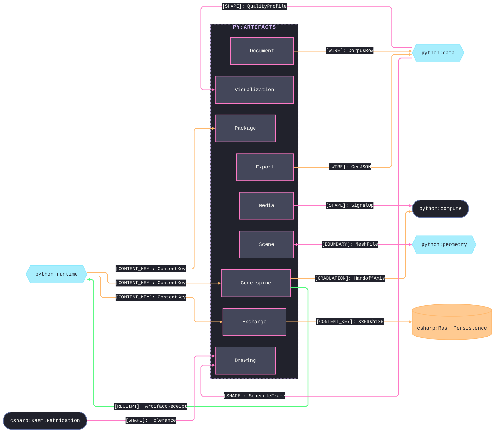

# [PY_ARTIFACTS_ARCHITECTURE]

`artifacts` owns the host-free durable-output engine turning data, compute, and geometry ingress into layer-clean files. Each sub-domain owns one polymorphic surface, every artifact keys by the runtime content key, and every receipt is one case of the kind-discriminated `ArtifactReceipt` union. Alignment with the Persistence, Fabrication, and Python peers travels the content-keyed wire, never a reference.

## [01]-[DOMAIN_MAP]

```text codemap
artifacts/
├── document/            # paginated structured documents: the DocumentNode tree and its emit/extract inverses
│   ├── model.py         # DocumentNode semantic tree, the PDF/UA StructureNode family, the DocumentDelta diff/merge algebra
│   ├── emit.py          # emission axis: every backend lowers FROM the DocumentNode tree
│   ├── lens.py          # DocumentLens extraction and recovery half over the reader backends
│   ├── egress.py        # PDF security and navigation finishing
│   ├── tagged.py        # Tagged-PDF PD/UA marked-content authoring and structural audit from the model tree
│   └── report.py        # reproducible notebook and section composition into the DocumentNode tree
├── visualization/       # data to visual artifact
│   ├── chart/
│   │   ├── spec.py      # ChartSpec engine union, derive-palette-threaded
│   │   └── export.py    # host-free chart render and format dispatch with the in-page VegaTransform pre-pass
│   ├── table.py         # great-tables publication-table owner exporting HTML/LaTeX/PDF
│   └── diagram/
│       ├── layout.py    # diagram coordinate assignment over five engines, emitting the ten DiagramKind rows
│       ├── draw.py      # named-layer SVG and editable .drawio emission over the DrawTarget selector
│       ├── schematic.py # named-symbol schematic producer for the diagram class the marks cannot express
│       ├── solar.py     # pvlib SPA solar-ephemeris and sun-path furniture owner
│       └── glyphset.py  # bounded diagram-primitive vocabulary the marks draw from
├── drawing/             # AEC drawing-production plane: owned ISO/NCS drafting vocabularies, dimensions, symbols, xrefs
│   ├── regime.py        # the owned drafting vocabulary and BIND substrate every drawing consumer reads; mints no receipt
│   ├── standard.py      # the ezdxf symbol-table lowering of the regime
│   ├── dimension.py     # ISO 129-1 dimensioning producer over the closed DimOp family, dual-lowered per DimTarget
│   ├── symbol.py        # AEC drawing-symbol vocabulary dual-lowered to drawsvg and ezdxf
│   ├── annotate.py      # ISO 128-2 leaders, keynotes, notes, and revision clouds, dual-lowered to drawsvg and ezdxf
│   ├── detail.py        # detail callouts, a content-keyed ezdxf block store, and the sheet cross-reference DAG
│   └── schedule.py      # AEC schedule and BIM QTO takeoff lowered into visualization/table; contributes the Schedule receipt
├── specification/       # CSI construction-specification plane on the pub/print substrate
│   ├── section.py       # CSI SectionFormat 3-part sections authored INTO DocumentNode; contributes the Spec receipt
│   └── classify.py      # MasterFormat/UniFormat/OmniClass vocabularies and the drawing<->spec resolver; mints no receipt
├── delivery/            # ISO 19650 delivery plane: container register and issue-for-construction transmittal
│   ├── register.py      # ISO 19650 register, sheet-index, and container-metadata owner; contributes the Register receipt
│   └── transmittal.py   # issue-for-construction orchestrator over imposition, archive, credential, and conformance
├── graphic/             # 2D graphic-primitive toolkit every visual and document plane composes
│   ├── raster/
│   │   ├── io.py        # pillow/pyvips IO, convert, thumbnail, montage working surface
│   │   ├── process.py   # raster vocabulary owner and produced-raster engine
│   │   └── measure.py   # perceptual-quality metrics and region/feature/registration measurement
│   ├── vector/
│   │   ├── path.py      # svgelements metric substrate: parse, point-at-distance, decimation, tolerance
│   │   ├── region.py    # skia-pathops boolean/offset/stroke-to-outline with metric text-on-path
│   │   └── pattern.py   # repeating-fill and hatch generator emitting to ezdxf and drawsvg
│   ├── marks/
│   │   ├── mark.py      # shared machine-readable-mark vocabulary both codec halves import
│   │   ├── encode.py    # segno/python-barcode/zxing-cpp mark generation
│   │   └── decode.py    # zxing-cpp decode inverse
│   ├── color/
│   │   ├── derive.py    # the one upstream color-derivation source: CIE/CAM16/spectral, gamut, CVD, harmony, WCAG
│   │   └── managed.py   # the downstream ICC/LUT/CCTF color-managed raster egress
│   ├── style.py         # theme-as-DATA SELECT owner: one Theme row set carries type, stroke, palette, ground, sheet family
│   └── layer.py         # LayerPlan semantic layer tree every layered producer projects into and exporter composes out of
├── typography/          # font binary, glyph shaping, math typesetting, and line-layout over one PositionedGlyphRun seam
│   ├── font.py          # FontEngineering subset/instance/axis/outline/embed-audit owner and the FaceMetrics value
│   ├── shape.py         # uharfbuzz shaping, bidi reorder, COLRv1 glyph render, SVG path export
│   ├── math.py          # the one ziamath mathematical-typesetting owner every formula consumer routes through
│   └── layout.py        # line-break, hyphenation, and Knuth-Plass paragraph layout
├── composition/         # assembling placed figures, sheets, and imposition
│   ├── compose.py       # post-render figure and section placement
│   ├── sheet.py         # single-sheet title-block/frame owner and the SheetSet multi-sheet register
│   └── imposition.py    # n-up, booklet, and signature imposition
├── export/              # editable layered hand-off for Illustrator/InDesign and DXF CAD exchange
│   ├── layered.py       # named-layer SVG, PDF OCG, PSD/PSB, layered TIFF, and ORA export
│   ├── indesign.py      # SimpleIDML template-mutation hand-off
│   └── dxf.py           # ezdxf DXF CAD-exchange owner over the DxfOp family and the geospatial bridge
├── exchange/            # metadata, provenance, and format identification at the boundary
│   ├── metadata.py      # EXIF/IPTC/XMP/ICC descriptive-metadata read/write over the MetaCarrier axis
│   ├── credential.py    # c2pa-python content-credential sign/read/embed keyed by the content key
│   ├── conformance.py   # pyhanko PAdES sign/stamp/augment/audit folding ConformanceVerdict
│   └── detect.py        # format-ID substrate over puremagic with a python-magic fallback
├── media/               # temporal media: container, codec, filter, timeline, subtitle, analysis, synthesis
│   ├── container.py     # av container spine: mux, demux, encode, transcode, HDR/color, HLS/DASH
│   ├── filtergraph.py   # closed FilterNode owner with capability-detected native-vs-substitute routing
│   ├── audio.py         # av audio stream encode, mux, resample, master
│   ├── timeline.py      # non-linear editing over the container and filtergraph spine
│   ├── subtitle.py      # pysubs2 parse/convert/retime/restyle, passthrough-mux, and burn-in
│   ├── analysis.py      # waveform, spectrogram, loudness, silence, scene-detect, thumbnail; capability-routed
│   └── synthesis.py     # numpy oscillator/noise/FM/AM/sweep/ADSR generation into the audio encoder
├── scene/               # 3D and spatial visualization
│   ├── render.py        # pyvista/vtk offscreen render, field-filter pipeline, and boolean CSG on the worker lane
│   ├── export.py        # glTF/VRML/OBJ/HTML scene-file export and the orbit rgb24 frame seam
│   └── stage.py         # usd-core USD/USDZ stage authoring and composition
├── core/                # production spine
│   ├── plan.py          # ArtifactPipeline content-keyed sub-graph-elision plan over the runtime session lane
│   ├── issue.py         # the constructing owner: issue(IssueRequest) over the modality union into pipeline and drain
│   └── receipt.py       # the one ArtifactReceipt union, ConformanceVerdict, and the Metrics.record seam
└── package/             # content-addressed compression, archive, and delta over one shared bundle vocabulary
    ├── bundle.py        # shared Bundle/CodecProfile/BundleManifest vocabulary and the BundleEvidence projection
    ├── codec.py         # single-blob compression composing bundle, plus the block-fan band with crc32_combine
    ├── archive.py       # archive containers and the reproducible-ZIP owner
    └── delta.py         # detools binary diff/patch; parent-keyed delta nodes against the base bundle key
```

## [02]-[SEAMS]



## [03]-[INTERNAL]

Nearly all wiring is internal, so the seam map stays thin: one production spine composes the primitive substrate, the producer planes, and the finishing tiers. Stage order is the spine diagram below; per-stage guards, conditioning, and rails live on the owning implementation pages.

```mermaid
---
config:
  theme: base
  look: classic
  layout: elk
  flowchart:
    curve: linear
    padding: 25
  themeVariables:
    darkMode: true
    fontFamily: "SF Mono, Menlo, Cascadia Mono, Segoe UI Mono, Consolas, monospace"
    useGradient: false
    dropShadow: "none"
    background: "#282A36"
    primaryColor: "#44475A"
    primaryTextColor: "#F8F8F2"
    primaryBorderColor: "#BD93F9"
    lineColor: "#FF79C6"
    textColor: "#F8F8F2"
    edgeLabelBackground: "#21222C"
    labelBackgroundColor: "#21222C"
  themeCSS: ".nodeLabel{font-size:13px;font-weight:500}.edgeLabel{font-size:12px;font-weight:500}.cluster-label .nodeLabel{font-size:13.5px;font-weight:700;letter-spacing:.08em}.edge-thickness-normal{stroke-width:2px}.edge-thickness-thick{stroke-width:3px}.edge-pattern-dashed,.edge-pattern-dotted{stroke-width:1.5px;stroke-dasharray:4 6}.node rect,.node circle,.node polygon,.node path,.node .outer-path{stroke-width:1.5px;filter:none!important}.cluster rect{stroke-width:1px!important;stroke-dasharray:5 4!important;filter:none!important}.marker path{transform:scale(.8);transform-origin:5px 5px}.marker circle{transform:scale(.48);transform-origin:5px 5px}.edgeLabel rect{transform-box:fill-box;transform-origin:center;transform:scale(1.1,1.2)}"
---
flowchart LR
    accTitle: Artifacts production spine
    accDescr: The internal pipeline from an issue request through the content-keyed plan and the producer engines drawing on the graphic and typography substrate, into composition, export and exchange finishing, the one receipt fold, and the content-addressed package close.
    Issue([Issue request]) --> Plan[[Pipeline plan]]
    Substrate[(Graphic + type substrate)] --> Engines
    Plan --> Engines[[Producer engines]]
    Engines --> Compose[[Composition]]
    Compose --> Finish[[Export + exchange]]
    Finish --> Fold[(Contribution fold)]
    Fold --> Package[[Package close]]
    Package --> Deliver([Transmittal])
    classDef boundary fill:#282A36,stroke:#BD93F9,color:#F8F8F2
    classDef primary fill:#44475A,stroke:#FF79C6,color:#F8F8F2
    classDef data fill:#FFB86CBF,stroke:#FFB86C,color:#282A36
    class Issue,Deliver boundary
    class Plan,Engines,Compose,Finish,Package primary
    class Substrate,Fold data
```



## [04]-[ORGANIZATION]

High-order producer planes sit on a shared primitive substrate. `graphic` and `typography` own the raster, vector, marks, color, style, layer, font, shaping, math, and line-layout primitives every plane composes over one `PositionedGlyphRun` seam; the producer planes lower onto them; `composition` places the outputs, `export` and `exchange` finish them, `core` is the production spine, and `package` is the content-addressed close.

- `core/receipt` is the one shared receipt owner every producer contributes one case to. `contribute` records numeric facts through the runtime `Metrics.record` arm; render duration stays the runtime `Metrics.measured` fact, never a receipt's.
- Outward figure handoff is landed, not re-minted: `core/receipt.graduates` projects any `ArtifactReceipt` into the `compute/graduation` `HandoffAxis(artifact=)` keyed by `ContentIdentity` under the governed residual-ceiling policy, a caller's tighter ceiling overriding. Sources re-mint no canonical concept, so the runtime `Structural.drift` query stays clean.
- `graphic/color/derive` is the one upstream color source every visual plane pulls palettes from; `graphic/color/managed` is the downstream ICC/LUT/CCTF egress the raster and document outputs route through.
- Host-free rendering cuts every sub-domain: `vl-convert` is the primary chart export, `lets-plot` the second host-free engine, and the great-tables Selenium path the one gated host path, never the default.
- Engine selection is the second structural axis: heavyweight render, raster, compression, text-layout, and 3D arms dispatch onto the runtime subprocess seam (`anyio.to_process.run_sync`) rather than importing provider-heavy modules into the core runtime path.
