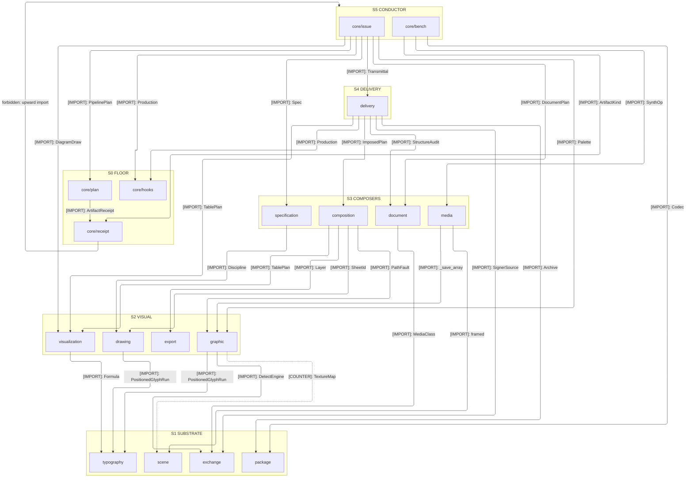
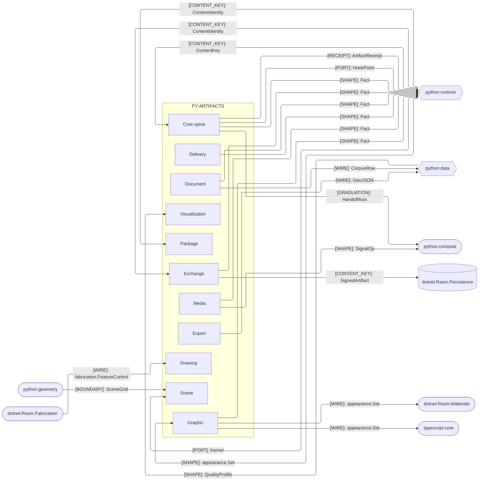
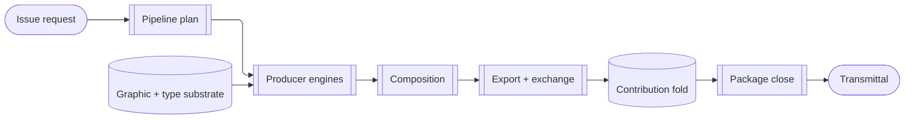

# [PY_ARTIFACTS_ARCHITECTURE]

`artifacts` owns the host-free durable-output engine at the top of the Python branch, each sub-domain closing its concern behind one polymorphic surface. Every artifact keys by the runtime content key, and alignment with every peer travels the content-keyed wire and the seam contracts, never a reference.

## [01]-[DOMAIN_MAP]

```text
artifacts/
├── document/            # Paginated structured documents: the DocumentNode tree and its emit/extract inverses
│   ├── model.py         # DocumentNode semantic tree, DocumentDelta diff/merge algebra, PDF/UA StructureNode family, lowering projections
│   ├── emit.py          # DocumentMode discriminant and the BACKENDS policy table seating every emission arm
│   ├── lens.py          # DocumentLens extraction and recovery half over the reader backends
│   ├── egress.py        # PDF security and navigation finishing
│   ├── tagged.py        # AccessOp arm table (_ARM), the pdf_oxide audit oracle, and the ArchiveCheck clause split
│   └── report.py        # Reproducible notebook and section composition into the DocumentNode tree
├── visualization/       # Data to visual artifact
│   ├── chart/
│   │   ├── spec.py      # ChartSpec engine union, derive-palette-threaded
│   │   └── export.py    # VlRow dual-dialect converter table, ChartRenderPolicy, and the vl-convert rasterizer seat
│   ├── table.py         # TablePlan seat; drawing/schedule lowers into it, delivery and composition import it
│   ├── dashboard.py     # Pane assembly over producer-emitted bytes and specs; the shared-runtime seat, no pane re-render
│   └── diagram/
│       ├── layout.py    # Diagram coordinate assignment over the layout engines, emitting the DiagramKind rows
│       ├── draw.py      # Target admission gate, mixed-intent fault accumulation, ziafont label outlining, hex_ramp styling
│       ├── glyphset.py  # Closed mark union keyed by the layout node/edge index; carries style, never geometry
│       ├── schematic.py # Named-symbol schematic producer for the diagram class the marks cannot express
│       └── solar.py     # Solar-ephemeris and sun-path furniture; emission rides the diagram draw target
├── drawing/             # AEC drawing-production plane: owned ISO/NCS drafting vocabularies, dimensions, symbols, xrefs
│   ├── regime.py        # StrEnum code-set families, LayerName/SheetId compose-parse inverses, paper() ISO 216 derivation
│   ├── standard.py      # Standard.of(scale, font) seeding projection: tables, overrides, hatch Result, pen colors
│   ├── dimension.py     # DimOp construction geometry, DimStyleFamily/DimTol columns, and the GdtFrame.decode wire seat
│   ├── symbol.py        # SymbolKind typed-geometry union, SymbolStyle, and the TagShape-driven IdTag generator
│   ├── annotate.py      # ISO 128-2 leaders, keynotes, notes, and revision clouds, dual-lowered to drawsvg and ezdxf
│   ├── detail.py        # Callout/CalloutBoundary/DetailSource families and the SymbolTarget dual egress
│   └── schedule.py      # ScheduleContent payload shapes, TableOp derivation from template data, legend lowerings
├── specification/       # CSI construction-specification plane on the pub/print substrate
│   ├── section.py       # SpecPayload single admission, article-roster validation, classify-resolved section numbers
│   └── classify.py      # MasterFormat/UniFormat/OmniClass vocabularies and the drawing<->spec resolver; mints no receipt
├── delivery/            # ISO 19650 delivery plane: container register, issue-for-construction transmittal, and issue announcement
│   ├── register.py      # RegisterOp union folded once into Composed; Schematron-validated, c14n2-canonical container XML
│   ├── gate.py          # GateVerdict fold; ArtifactKind-keyed threshold policy rows with a declared default, no bytes
│   ├── transmittal.py   # Tagged-union case bodies folding once into TransmittalEvidence; drives siblings via emit().work()
│   └── notice.py        # Observe subscriber over the TRANSMITTAL_ISSUED hook fact answering one MessageEnvelope
├── graphic/             # 2D graphic-primitive toolkit every visual and document plane composes
│   ├── raster/
│   │   ├── io.py        # pillow/pyvips IO, convert, thumbnail, montage working surface
│   │   ├── process.py   # Transform/TransformPolicy/TransformArm substrate; io -> measure -> process import direction
│   │   └── measure.py   # Perceptual-quality metrics and region/feature/registration measurement
│   ├── texture/         # Deep-pixel texture plane: the float32 substrate standing BESIDE the 8-bit raster half
│   │   ├── plane.py     # float32 (H,W,C) carrier, storage/transfer/alpha/mip vocabulary, and the DEEP_CODEC rows
│   │   ├── derive.py    # Channel derivation: normal/height/occlusion/curvature, packing, mip fold, one resampler
│   │   ├── ingest.py    # _ROLE_SPACE law table and _ALIASES grammar; classify stays total, pure, and accumulating
│   │   ├── set.py       # TextureSet producer, egress grammar, KTX2 tool seam; contributes the Texture receipt
│   │   └── ibl.py       # Environment prefilter kernels over the deep plane; products land on the set manifest
│   ├── vector/
│   │   ├── path.py      # PathOp traversal into PathRail on the shared PathFault | BoundaryFault union; receiptless
│   │   ├── region.py    # RegionOp family; applied() in-process rail beside the HOSTILE process-pool batch crossing
│   │   └── pattern.py   # StrokeFamily placement rows, Motif payload cases, and the DensityLaw scale resolver
│   ├── marks/
│   │   ├── mark.py      # TAXONOMY rows binding Symbology to behavior class and decode carrier; explicit None carriers
│   │   ├── encode.py    # Mark operation owner: segno/python-barcode/zxing-cpp generation with composed decode/verify
│   │   └── decode.py    # zxing-cpp scan substrate on the shared MarkFault rail
│   ├── color/
│   │   ├── derive.py    # Colorimetry seat the visual planes pull palettes from; no egress concern enters it
│   │   └── managed.py   # Downstream color egress the raster and document outputs route through
│   ├── style.py         # ThemeMode/ColorScheme/ColorRole selection over substrate-owned values; FamilyStack chain
│   └── layer.py         # LayerNode closed group/leaf family, LayerMeta identity and paint order, LayerComp visibility
├── typography/          # Font binary, glyph shaping, math typesetting, and line-layout over one PositionedGlyphRun seam
│   ├── font.py          # FontEngineering subset/instance/synthesize/axis/outline/embed-audit owner and the FaceMetrics value
│   ├── shape.py         # uharfbuzz shaping, bidi reorder, COLRv1 glyph render, SVG path export
│   ├── math.py          # Formula typesetting seat; consumers compose one route and bind no engine import
│   └── layout.py        # LayoutRequest arms, SegmentEngine and CollationPolicy selection, and the total-fit Item stream
├── composition/         # Assembling placed figures, sheets, and imposition
│   ├── compose.py       # FigureOp closed-payload union folded by one total match; placement-only arm bodies
│   ├── sheet.py         # SheetOp fold into Composed evidence, PdfProfile conformance value, ISO 7200 set verdict
│   └── imposition.py    # Imposition fold the delivery transmittal orchestrates over
├── export/              # Editable layered hand-off for Illustrator/InDesign and DXF CAD exchange
│   ├── layered.py       # Named-layer SVG, PDF OCG, PSD/PSB, layered TIFF, and ORA export
│   ├── indesign.py      # IdmlStep tagged union over the @use_working_copy algebra, drained once into IdmlFact
│   └── dxf.py           # DxfOp arms folded once into DxfComposed; regime-pen-layered Diagram and Bridge lowerings
├── exchange/            # Metadata, provenance, and format identification at the boundary
│   ├── metadata.py      # Two verb cases over the carrier-leading payload shape; field-namespace facets per carrier
│   ├── credential.py    # SignerSpec policy union, CredentialPolicy trust value, CredentialEvidence manifest decode
│   ├── conformance.py   # PdfSigner baseline ladder, RFC-3161 timestamp arm, LTV augmentation, seed-value reservation
│   └── detect.py        # DetectIdentity typed verdict: MediaClass and Container discriminants, Trust, confidence
├── media/               # Temporal media: container, codec, filter, timeline, subtitle, analysis, synthesis
│   ├── container.py     # av container spine: mux, demux, encode, transcode, HDR/color, HLS/DASH
│   ├── filtergraph.py   # wired() arm selection off filters_available, read once per build; AudioGraph capsule seat
│   ├── audio.py         # Pcm dtype union, the (frames, channels) frame-axis law, standalone composable primitives
│   ├── timeline.py      # TimelineOp family; Clip parent keys projected into ArtifactWork.parents for warm elision
│   ├── subtitle.py      # SubtitleOp union: Whisper admission, packet-interleaving Mux, styled-run rgb24 BurnIn
│   ├── analysis.py      # Waveform, spectrogram, loudness, silence, black/scene detect, thumbnail; capability-routed
│   └── synthesis.py     # SynthOp oscillator, noise, and calibration-video cases; MediaProfile/MediaEvidence seats
├── scene/               # 3D and spatial visualization
│   ├── spec.py          # RenderSpec projections, the closed style/camera/texture families, and the lazy pyvista proxy
│   ├── render.py        # Scene3d SceneOp producer: content-key mint, process-lane offload, receipt fold, and the rgb24 frame egress
│   ├── render_worker.py # Worker-only render bodies the runtime shipped gate resolves inside the process lane
│   ├── export.py        # Per-target ExportRow law: plotter writes, bundle capture, and USD delegation over every SceneTarget
│   └── stage.py         # RenderExport and MeshAuthor sources, PackageOp closes, recursive MeshScene PrimKind graph
├── core/                # Production spine
│   ├── plan.py          # ArtifactWork node columns, the PyDiGraph front resolution, and the min-slack CPM schedule
│   ├── issue.py         # Constructing owner: issue(IssueRequest) over the modality union, composing the lane front drive
│   ├── receipt.py       # ArtifactReceipt union, ConformanceVerdict, and the Metrics.record + hook-tap seam
│   ├── hooks.py         # ArtifactsLeg raise-leg roster, point rows under the rasm.artifacts grammar, closed msgspec payloads
│   └── bench.py         # BenchEntry rows pairing BenchSubject with typed BenchFeed edges; grading stays runtime-owned
└── package/             # Content-addressed compression, archive, and delta over one shared bundle vocabulary
    ├── bundle.py        # Shared Bundle/CodecProfile/BundleManifest vocabulary and the BundleEvidence projection
    ├── codec.py         # Single-blob compression composing bundle, with the parallel block-fan band
    ├── archive.py       # SevenZipFile and bounded-memory stream-zip rows; one directory recovering the member set
    └── delta.py         # One-to-one from-image diff composing the bundle vocabulary downward; imports no sibling
```

## [02]-[STRATA]

Strata rank the artifacts interior; seating rows carry only the law the fence cannot show. Every plane composes the floor (`ArtifactWork`, `ArtifactReceipt`), and the fence draws only each plane's discriminating imports.


```mermaid
---
config:
  layout: elk
  flowchart:
    curve: linear
    padding: 25
---
flowchart TB
    accTitle: Artifacts interior import strata
    accDescr: Import strata from the issue conductor down to the plan-receipt floor, the TextureMap counter-edge crossing texture data to scene.
    subgraph S5["S5 CONDUCTOR"]
        Issue[core/issue]
        Bench[core/bench]
    end
    subgraph S4["S4 DELIVERY"]
        Delivery[delivery]
    end
    subgraph S3["S3 COMPOSERS"]
        Media[media]
        Document[document]
        Composition[composition]
        Specification[specification]
    end
    subgraph S2["S2 VISUAL"]
        Graphic[graphic]
        Visualization[visualization]
        Drawing[drawing]
        Export[export]
    end
    subgraph S1["S1 SUBSTRATE"]
        Scene[scene]
        Typography[typography]
        Exchange[exchange]
        Package[package]
    end
    subgraph S0["S0 FLOOR"]
        Plan[core/plan]
        Receipt[core/receipt]
        Hooks[core/hooks]
    end
    Issue e1@-->|"[IMPORT]: Transmittal"| Delivery
    Issue e2@-->|"[IMPORT]: DocumentPlan"| Document
    Issue e3@-->|"[IMPORT]: Spec"| Specification
    Issue e4@-->|"[IMPORT]: DiagramDraw"| Visualization
    Issue e5@-->|"[IMPORT]: Palette"| Graphic
    Issue e6@-->|"[IMPORT]: PipelinePlan"| Plan
    Delivery e7@-->|"[IMPORT]: ImposedPlan"| Composition
    Delivery e8@-->|"[IMPORT]: SignerSource"| Exchange
    Delivery e9@-->|"[IMPORT]: Archive"| Package
    Delivery e10@-->|"[IMPORT]: TablePlan"| Visualization
    Composition e11@-->|"[IMPORT]: Layer"| Export
    Composition e12@-->|"[IMPORT]: SheetId"| Drawing
    Composition e13@-->|"[IMPORT]: PathFault"| Graphic
    Composition e14@-->|"[IMPORT]: TablePlan"| Visualization
    Specification e15@-->|"[IMPORT]: Discipline"| Drawing
    Document e16@-->|"[IMPORT]: MediaClass"| Exchange
    Media e17@-->|"[IMPORT]: framed"| Scene
    Media e18@-->|"[IMPORT]: _save_array"| Graphic
    Graphic e19@-->|"[IMPORT]: PositionedGlyphRun"| Typography
    Graphic e20@-->|"[IMPORT]: DetectEngine"| Exchange
    Drawing e21@-->|"[IMPORT]: PositionedGlyphRun"| Typography
    Visualization e22@-->|"[IMPORT]: Formula"| Typography
    Plan e23@-->|"[IMPORT]: ArtifactReceipt"| Receipt
    Issue e24@-->|"[IMPORT]: Production"| Hooks
    Bench e25@-->|"[IMPORT]: Codec"| Package
    Bench e26@-->|"[IMPORT]: ArtifactKind"| Receipt
    Bench e27@-->|"[IMPORT]: SynthOp"| Media
    Delivery e28@-->|"[IMPORT]: Production"| Hooks
    Delivery e29@-->|"[IMPORT]: StructureAudit"| Document
    Graphic e30@-.->|"[COUNTER]: TextureMap"| Scene
    Receipt f1@-->|"forbidden: upward import"| S5
```

- S0 `core/plan` + `core/receipt` + `core/hooks` — the spine floor imports no artifacts sibling above it.
- S0 seats the `ARTIFACT_POINTS` hook rows beside the work and receipt owners; `hooks` composes the runtime registry, never a producer page.
- `hooks` seats the `ArtifactsLeg` roster: it imports no artifacts sibling, so every raiser reaches it acyclically and mints its own `RAISES` table.
- S0 `receipt` composes runtime, the compute `HandoffAxis`, and the hooks `Production` fire — the one same-stratum interleave.
- S1 `typography`, `exchange`, `package`, `scene` — substrate planes composing the floor alone, holding no intra-stratum edge among themselves.
- S2 `graphic` + `drawing` + `visualization` + `export` — one visual stratum, module-acyclic.
- S2 `drawing/regime` composes `graphic/color/derive` and `vector/pattern`; `graphic/layer` and `style` compose the regime back.
- S2 `drawing/schedule` lowers into `visualization/table`; `visualization/chart/export` composes `export/layered`, the DXF owner hopping back.
- S2 `graphic/texture` imports the floor, generated `rasm.contracts` set classes, and its siblings alone; `graphic/raster` imports none of it back.
- S2→S1 `graphic/texture/set -> scene/spec` crosses as DATA — `lowered` fills `TextureSlot`-keyed `TextureMap` bindings, never an import.
- S3 `document`, `media`, `composition`, `specification` — composer planes over the visual stratum.
- S3 `specification/section` composes the document `BlockKind` tree in-stratum; `media` rides the scene `framed` parse floor and raster save hop.
- S4 `delivery` then S5 `core/issue` — `issue` alone imports upward-named producers, so the spine is floor and conductor, never one stratum.
- S4 `transmittal` fires its issued fact on the floor `Production` row and `notice` subscribes to it, so neither delivery page imports the other.
- S4 `delivery/gate` composes the S3 document audits and the S0 receipt bands downward; nothing imports it back, so the verdict adds no cycle.
- S5 `core/bench` rides the conductor stratum without conducting — no producer imports it or cycles through it.
- S5 `bench` composes the package recipes, the receipt `ArtifactKind`, and `media/synthesis` replay; native-offload kernels arrive as caller values.

## [03]-[SEAMS]


```mermaid
---
config:
  layout: elk
  flowchart:
    curve: linear
    padding: 25
---
flowchart LR
    accTitle: Artifacts package seam registry
    accDescr: Artifacts sub-domain owners exchanging content keys, receipts, wires, and shapes with Python, C#, and TypeScript peers.
    subgraph artifacts[PY:ARTIFACTS]
        Core[Core spine]
        Document[Document]
        Delivery[Delivery]
        Visualization[Visualization]
        Drawing[Drawing]
        Graphic[Graphic]
        Media[Media]
        Scene[Scene]
        Export[Export]
        Exchange[Exchange]
        Package[Package]
    end
    Geometry([python:geometry])
    Runtime{{python:runtime}}
    Data{{python:data}}
    Compute([python:compute])
    Persistence[(dotnet:Rasm.Persistence)]
    Fabrication([dotnet:Rasm.Fabrication])
    Materials([dotnet:Rasm.Materials])
    Interchange([typescript:core])
    Runtime e1@-->|"[CONTENT_KEY]: ContentKey"| Core
    Core e2@-->|"[RECEIPT]: ArtifactReceipt"| Runtime
    Runtime e3@-->|"[CONTENT_KEY]: ContentIdentity"| Exchange
    Runtime e4@-->|"[CONTENT_KEY]: ContentIdentity"| Package
    Core e5@-->|"[GRADUATION]: HandoffAxis"| Compute
    Media e6@-->|"[SHAPE]: SignalOp"| Compute
    Document e7@-->|"[WIRE]: CorpusRow"| Data
    Export e8@-->|"[WIRE]: GeoJSON"| Data
    Data e9@-->|"[SHAPE]: QualityProfile"| Visualization
    Fabrication e10@-->|"[WIRE]: fabrication.FeatureControl"| Drawing
    Geometry e11@-->|"[BOUNDARY]: SceneGrid"| Scene
    Exchange e12@-->|"[CONTENT_KEY]: SignedArtifact"| Persistence
    Runtime e13@-->|"[PORT]: Kernel"| Scene
    Core e14@-->|"[PORT]: HookPoint"| Runtime
    Runtime e15@-->|"[SHAPE]: appearance.Set"| Graphic
    Graphic e16@-->|"[WIRE]: appearance.Set"| Materials
    Graphic e17@-->|"[WIRE]: appearance.Set"| Interchange
    Core e18@-->|"[SHAPE]: Fact"| Runtime
    Delivery e19@-->|"[SHAPE]: Fact"| Runtime
    Document e20@-->|"[SHAPE]: Fact"| Runtime
    Graphic e21@-->|"[SHAPE]: Fact"| Runtime
    Media e22@-->|"[SHAPE]: Fact"| Runtime
    Exchange e23@-->|"[SHAPE]: Fact"| Runtime
```

`[SHAPE]: Fact` edges are the evidence half of the runtime seam and run outward: `core/receipt` builds each kind's `AuditFact` and `MeterFact` fan off the receipt it already carries, and every producer leg records that block through the runtime journal writer. Producing legs stay AWAITABLE by law, since recording suspends on a bounded intake, so the synchronous `contribute` projection carries no such edge.

Frozen names spell from the owner's endpoint page: `SignedArtifact` from Rasm.Persistence with the runtime `ContentKey` minting beneath it, `fabrication.FeatureControl` from Rasm.Fabrication admitted into `GdtFrame` at dimensioning, and the graduation hub as `HandoffAxis`, C#-spelled `GraduationEvidence`.

Python mints the plane set as its appearance document: generated `rasm.contracts.appearance.Set` carries the shape, and `graphic/texture/set` validates the completed document from its descriptor before it leaves the producer. Merkle set keys order the document while each stored file stays addressed by its own `PlaneRef.digest`, and two peers read the admitted set: Rasm.Materials as classification input, TypeScript core as a census-and-landing pair.

C#-pressed `baked` rides the same `Set` message under its own producer with the `appearance_key`, `provenance`, and `press` columns python leaves absent, and python reads none of it.

Production-fact points register onto the runtime `Hooks` registry under the `rasm.artifacts.<domain>.<point>` grammar, and the bench corpus consumes the runtime `Bench` tier, minting no timing. `TransmittalNotice` projects the issued fact onto `runtime/transport/event#MESSAGE`, so this folder mints no message envelope and joins no broker edge.

## [04]-[INTERNAL]

One production spine composes the primitive substrate, the producer planes, and the finishing tiers; per-stage guards, conditioning, and rails live on the owning implementation pages.


```mermaid
---
config:
  layout: elk
  flowchart:
    curve: linear
    padding: 25
---
flowchart LR
    accTitle: Artifacts production spine
    accDescr: How one issue request flows from plan admission through the producer and finishing stages onto the single receipt fold.
    Issue([Issue request]) e1@--> Plan[[Pipeline plan]]
    Substrate[(Graphic + type substrate)] e2@--> Engines
    Plan e3@--> Engines[[Producer engines]]
    Engines e4@--> Compose[[Composition]]
    Compose e5@--> Finish[[Export + exchange]]
    Finish e6@--> Fold[(Contribution fold)]
    Fold e7@--> Package[[Package close]]
    Package e8@--> Deliver([Transmittal])
```

High-order producer planes sit on a shared primitive substrate. `graphic` and `typography` own the raster, vector, marks, color, style, layer, font, shaping, math, and line-layout primitives every plane composes over one `PositionedGlyphRun` seam; the producer planes lower onto them; `composition` places the outputs, `export` and `exchange` finish them, `core` is the production spine, and `package` is the content-addressed close.

- `core/receipt` is the one shared receipt owner every producer contributes one case to.
- `core/plan` seats the one product-egress port — `ProductFact` describes each produced file, `ProductSink[F]` threading egress per fault family.
- Composite owners drive sibling producers only through the uniform `emit()`/`work()` contract; a sibling convenience entry is a phantom.
- `slot` threads the producer's pre-run input key; a produced-output content address lands only as a facts-band scalar.
- Producer sync projections read the landed evidence successor; re-invoking the fold or a frame author is a split-execution defect.
- Un-folded owners project nothing, so absence stays distinct from evidence.
- Dual-license provider pairs split by import reachability: no copyleft module is reachable from the permissive footing.
- Derivable constants land as policy tables on the owner, and each footing's closure audits from its imports alone.
- `contribute` records numeric facts through the runtime metrics arm; render duration stays a runtime fact, never a receipt's.
- `core/receipt.evidence` is the one durable-fact builder every kind funnels through; async legs await the record and sync entrypoints record none.
- Retention class per kind and the metered fact rows are receipt-owned tables; the aging window and the resource series stay the journal's.
- Production facts fire on the `core/hooks` rows at the issue seams and the contribute fold; `FRONT_DRAINED` fires from the lane drive as its gate.
- Observability subscribes through `Production.subscribed` at the app root, never in producer code.
- Issue-scope baggage the issue bracket binds attributes every signal; tenant promotion stays runtime-owned.
- `core/bench` grades producer kernels against threshold policy rows through the runtime bench tier.
- Bench timing, quantiles, and instruments stay runtime-owned.
- Each bench row's deterministic input is a typed `BenchFeed` edge; a regression is a graded verdict, never a fault.
- `delivery/gate` is the one quality-threshold owner: every bar, grade, and per-kind policy row seats there and no producer re-derives one.
- `delivery/notice` is the plane's one `Project` row over the `TRANSMITTAL_ISSUED` fact, handed to the runtime emitter at the composition root.
- Announcement ends at the message envelope value; lowering, format, and delivery are the runtime transport owner's.
- Outward figure handoff is landed, not re-minted: `core/receipt.graduates` projects any `ArtifactReceipt` into the compute graduation hub.
- Projection keys by `ContentIdentity` under the governed residual-ceiling policy, a caller's tighter ceiling overriding.
- Sources re-mint no canonical concept, so the runtime structural-drift query stays clean.
- `graphic/color/derive` is the one upstream color source every visual plane pulls palettes from.
- `graphic/color/managed` is the downstream ICC/LUT/CCTF egress the raster and document outputs route through.
- `graphic/texture` owns texture sets, environment products, and every deep codec lane; `graphic/raster` stops at the display-referred 8-bit surface.
- Host-free rendering cuts every sub-domain: chart export dispatches onto host-free engines only, ranked by the owner's policy row.
- One gated host-render path exists behind explicit opt-in, never the default.
- Engine selection is the second structural axis: heavy render, raster, compression, text-layout, and 3D arms cross as runtime `Kernel` values.
- `KernelTrait` rows derive each kernel's thread, subinterpreter, or process arm.
- Provider-heavy modules never import into the core runtime path.

## [05]-[BOUNDARIES]

- `artifacts` owns durable output alone — authoring, composing, and emitting every produced file the estate ships.
- UI surfaces, IFC/GLB geometry, and columnar or mesh interchange stay peer-owned.
- Store custody carves at the port: producers write through `core/plan#PLAN`'s `ProductSink`; residence, catalog, and store stay peer-owned.
- Envelope algebra, format, and protocol lowering stay runtime-owned; this folder projects facts, minting no attribute, header, or wire value.
