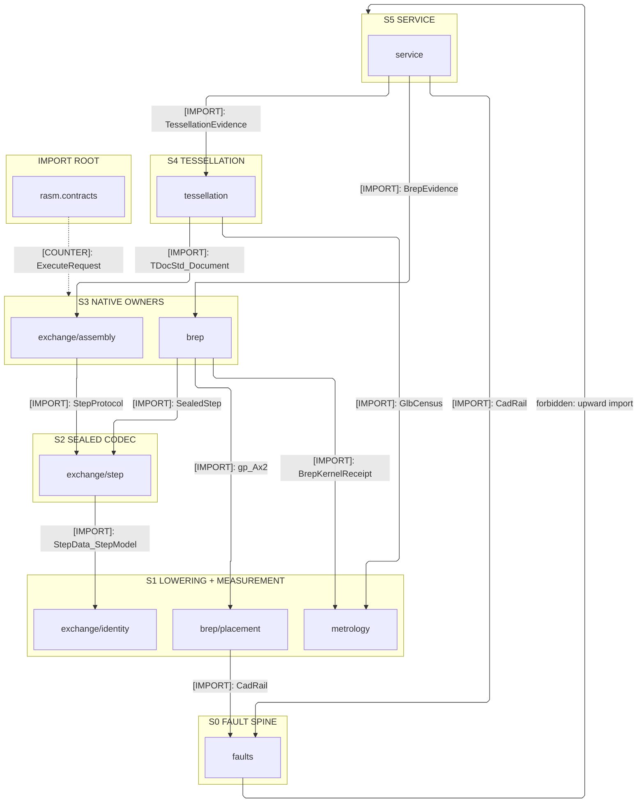
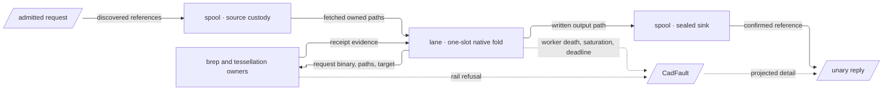

# [PY_CAD_ARCHITECTURE]

`cad` maps exact solid modeling and neutral CAD exchange onto one owner per sub-domain folder, each composing the OCP kernel below the boundary and returning the one `CadRail` the `faults` spine mints. Alignment with the geometry peer travels the `CadService` wire while generated `ArtifactService` carries every body by reference, so no native handle, local mirror, provider store, or stream state machine crosses.

## [01]-[DOMAIN_MAP]

```text codemap
cad/
├── faults.py           # CadFault spine: leg, case, and recovery vocabularies and the one wire projection
├── exchange/           # Correspondence to foreign exact representations, both directions
│   ├── identity.py     # Byte-stability contract: canonical header, product identity, schema and unit pins
│   ├── step.py         # ISO 10303 protocol admission and the unsealed/sealed codec pair
│   ├── assembly.py     # CAF reader family, XCAF label tree, names, colours, layers, and instances
│   └── iges.py         # IGES admission, absent schema evidence, and the surface-not-solid consequence
├── brep/               # Exact construction and modification of boundary representation
│   ├── placement.py    # Spatial vocabulary lowered onto gp frames, axes, curves, and rigid placement
│   ├── profile.py      # Loops, spans, regions, holes, orientation repair, and the exact arc-join offset
│   ├── solid.py        # Primitives and generative sweeps under one mint-from-parameters regime
│   ├── boolean.py      # N-ary set algebra: argument and tool partition, fuzzy tolerance, parallel run
│   ├── feature.py      # Sub-topology selection and the edge-feature builders it drives
│   ├── provenance.py   # Generated and modified correspondence carrying a name across a reseal
│   ├── operation.py    # Operation fold, builder admission, source resolution, and the seal handoff
│   └── tolerance.py    # Numeric regime: wire-carried, kernel-fixed, and file-owned tolerances
├── metrology/          # Measurement of shape, seated below both native owners
│   ├── properties.py   # Dimensional ladder, mass, centroid, area, and the non-finite refusal
│   └── census.py       # Emitted-file placement, triangle, closure, and volume census
├── tessellation/       # Discretized projection and its budget
│   ├── mesh.py         # Incremental mesher under the tessellation policy and the budget preflight
│   └── emission.py     # glTF writer, metadata map, and post-write extent admission
└── service/            # Governed call
    ├── provider.py     # CadService implementation over one spine and the ASGI composition
    ├── lane.py         # One-slot cancellable native lane and the process-global OCCT regime
    └── spool.py        # Policy admission, deadline derivation, and call-owned path custody
```

## [02]-[STRATA]



- S0 `faults` — imports no sibling, and every owner returns its `CadRail`; a refusal shape is one row here, never a band-local family.
- S1 lowering and measurement — `brep/placement`, `exchange/identity`, and `metrology` compose OCP and the spine, reaching no construction owner.
- S2 `exchange/step` — folds the identity contract into the sealed codec both native bands reach, and owns no construction of its own.
- S3 native owners — `brep` and `exchange/assembly` build over admitted generated values; neither imports a Python branch package.
- S4 `tessellation` — discretization composing the assembly document and the emitted-file census, above both because it reads what they produce.
- S5 `service` — served boundary, one-slot native lane, and call-spool custody; the only stratum that may spell a raise.
- S3→S1 `brep/operation` reaches `metrology/properties` for its receipt, so measurement imports no construction owner and the graph stays acyclic.
- `brep/operation` alone imports downward — admission at `brep/placement` (S1), sourcing at `exchange/step` (S2), so no arm back-imports the apex.
- `rasm.contracts` at `libs/contracts/gen/python` is the admitted import root every stratum reads, never a rank, carrying the same upward law.
- S5 `service` alone composes a branch sibling — runtime's `transport/artifact` for spool custody and the verified transfer; no lower rank reaches it.

## [03]-[SEAMS]


One `CadService` edge collapses every contract between these two packages at that kind: geometry dials `Execute` and `Tessellate`, the provider dials geometry's served `ArtifactService` for every input and every output body, and both directions carry references alone. Geometry draws the identical kind, direction, and label at its own `mesh` sub-domain.

## [04]-[INTERNAL]



- One deadline scope opens at the servicer and every inner window derives from the effective deadline, so no call re-threads that budget.
- Sources resolve ONCE at the spool under admitted validation; the worker takes resolved paths and re-derives no reference at all.
- Generated messages cross the pickle seam as binary alone and native handles never cross, so a fold's input is bytes, paths, and bounded scalars.
- Refusals cross that same seam as values, because a fault carries a frozen row and a coordinate that pickle by reference at both ends of it.
- Process-global OCCT state initializes inside the worker on first fold, so the parent holds no latch the fold reads and a respawn re-establishes it.
- Measurement decodes once: the emitted file is censused a single time, and both the kernel and tessellation receipts read that one census.
- Refusal converges at the servicer alone; interior owners return the rail, and one row beside the admitted stamp builds the terminal Connect error.

## [05]-[BOUNDARIES]

- `cad` owns exact solid modeling and neutral CAD exchange behind one generated service, every body crossing by reference.
- App root binds the provider address, the artifact client, credentials, process memory limits, and the call-spool filesystem quota.
- `rasm.contracts` owns the generated message and service vocabulary this package reads; no owner here re-spells a descriptor rule.
- `runtime` `transport/body` and `transport/artifact` own body admission and the verified artifact lifecycle this package composes.
- `geometry` owns mesh semantics, IFC projection, and every consumer-side quality verdict reached across the wire.
