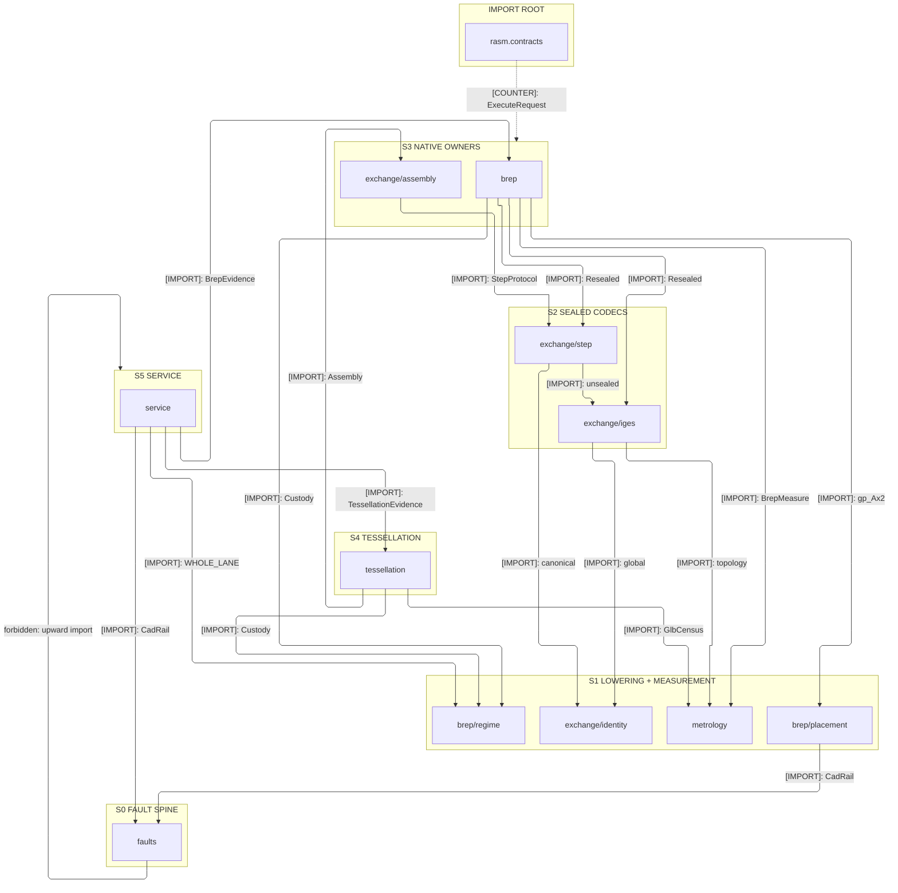
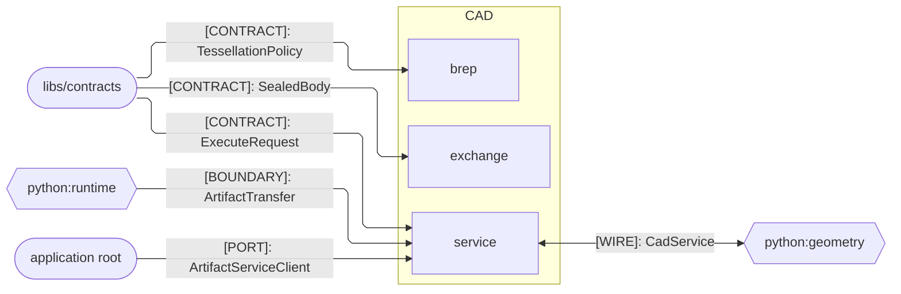
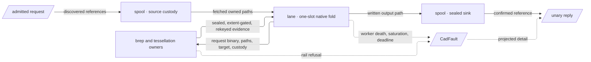

# [PY_CAD_ARCHITECTURE]

`cad` maps exact solid modeling and neutral CAD exchange onto one owner per sub-domain folder, each composing the OCP kernel below the boundary and returning the one `CadRail` the `faults` spine mints. Alignment with the geometry peer travels the `CadService` wire while generated `ArtifactService` carries every body by reference, so no native handle, local mirror, provider store, or stream state machine crosses.

## [01]-[DOMAIN_MAP]

```text
cad/
├── faults.py           # CadFault spine: leg, case, and recovery vocabularies and the one wire projection both ways
├── exchange/           # Correspondence to foreign exact representations, both directions
│   ├── identity.py     # Byte-stability contract: canonical STEP header, IGES global section, product identity, schema pins
│   ├── step.py         # ISO 10303 protocol admission, the unsealed/sealed codec pair, and the format-dispatched source resolve
│   ├── iges.py         # IGES codec pair under the metre regime the writer ignores, manifold B-rep entity mode, no protocol
│   └── assembly.py     # CAF reader family, XCAF label tree, the located root, and the per-placement identity walk
├── brep/               # Exact construction and modification of boundary representation
│   ├── regime.py       # Kernel regime: tolerance vocabulary and the parallel-custody grant every kernel reads
│   ├── placement.py    # Spatial vocabulary lowered onto gp frames, axes, planes, curves, and rigid placement
│   ├── profile.py      # Loops, spans, regions, holes, orientation repair, and the per-wire exact offset
│   ├── solid.py        # Primitives with angular bounds and generative sweeps under one mint-from-parameters regime
│   ├── boolean.py      # N-ary set algebra: operand partition, fuzzy tolerance, non-destructive run under custody
│   ├── feature.py      # Sub-topology selection and the edge and face feature builders it drives
│   ├── healing.py      # Stepwise exact repair under typed steps, answering what moved as Healing
│   ├── provenance.py   # Generated, modified, deleted, and kept correspondence rekeyed onto the sealed artifact
│   └── operation.py    # Operation fold, arm totality, emission dispatch, extent gate, and the seal handoff
├── metrology/          # Measurement of shape, seated below both native owners
│   ├── properties.py   # Dimensional ladder, mass, centroid, inertia, area, and the non-finite refusal
│   └── census.py       # Emitted-file placement, triangle, closure, volume, node census and the extent gate
├── tessellation/       # Discretized projection and its budget
│   ├── mesh.py         # Incremental mesher under the tessellation policy, the budget preflight, and the parts join
│   └── emission.py     # Deterministic glTF writer with pinned node naming and canonical asset metadata
└── service/            # Governed call
    ├── provider.py     # CadService implementation over one spine and the ASGI composition
    ├── lane.py         # One-slot cancellable native lane minting whole-lane custody and the process-global OCCT regime
    └── spool.py        # Policy admission, deadline derivation, call-owned path custody, and peer-fault lifting
```

## [02]-[STRATA]



- S0 `faults` — imports no sibling, and every owner returns its `CadRail`; a refusal shape is one row here, never a band-local family.
- S1 lowering and measurement — `brep/regime`, `brep/placement`, `exchange/identity`, and `metrology` reach only OCP and the spine.
- S1 `brep/regime` mints tolerance and `Custody`; the lane passes `WHOLE_LANE`, and kernel pages mint no parallel grant.
- S2 codecs — `exchange/step` owns format dispatch and imports `exchange/iges` for the surface arm; both emit sealed bodies.
- S3 native owners — `brep` and `exchange/assembly` build over admitted generated values; neither imports a Python branch package.
- S4 `tessellation` reads the assembly document, emitted-file census, and custody grant, so it seats above both native owners.
- S5 `service` — served boundary, one-slot native lane, and call-spool custody; the only stratum that may spell a raise.
- S3→S1 `brep/operation` reads `metrology/properties` for measurement and `metrology/census` for extent; measurement imports no constructor.
- `brep/operation` alone imports downward for placement, source resolution, and codec sealing; every arm remains below the apex.
- `rasm.contracts` at `libs/contracts/gen/python` is the admitted import root every stratum reads, never a rank, carrying the same upward law.
- S5 `service` alone composes runtime `transport/artifact` for spool custody and verified transfer; lower ranks remain branch-independent.

## [03]-[SEAMS]



One `CadService` edge collapses every contract between these two packages at that kind: geometry dials `Execute` and `Tessellate`, the provider dials geometry's served `ArtifactService` for every input and every output body, and both directions carry references alone. Geometry draws the identical kind, direction, and label at its own `mesh` sub-domain, where `mesh/cad` decodes an emitted body once into per-placement meshes joined on the provider's `PartIdentity.node`.

## [04]-[INTERNAL]



- One deadline scope opens at the servicer and every inner window derives from the effective deadline, so no call re-threads that budget.
- Sources resolve ONCE at the spool under admitted validation; the worker takes resolved paths and re-derives no reference at all.
- Generated messages cross the pickle seam as binary; native handles remain worker-local, and each fold receives bounded values plus `Custody`.
- Refusals cross that same seam as values, because a fault carries a frozen row and a coordinate that pickle by reference at both ends of it.
- Process-global OCCT state initializes inside the worker on first fold, so the parent holds no latch the fold reads and a respawn re-establishes it.
- Sealed outputs re-read before reply; readback proves format and extent, then rekeys correspondence onto decoded order.
- One emitted-file census supplies the measure's closure, the tessellation counts, and the parts roster, so measurement decodes once.
- Refusal converges at the servicer alone; interior owners return the rail, and one row beside the admitted stamp builds the terminal Connect error.

## [05]-[BOUNDARIES]

- `cad` owns exact solid modeling and neutral CAD exchange behind one generated service, every body crossing by reference.
- App root binds the provider address, the artifact client, credentials, process memory limits, and the call-spool filesystem quota.
- `rasm.contracts` owns the generated message and service vocabulary this package reads; no owner here re-spells a descriptor rule.
- `runtime` `transport/body` and `transport/artifact` own body admission and the verified artifact lifecycle this package composes.
- `geometry` owns mesh semantics, the per-placement body decode, IFC projection, and every consumer-side quality verdict reached across the wire.
- GLB is the estate's one discrete carrier; this package emits no second triangle wire beside it.
