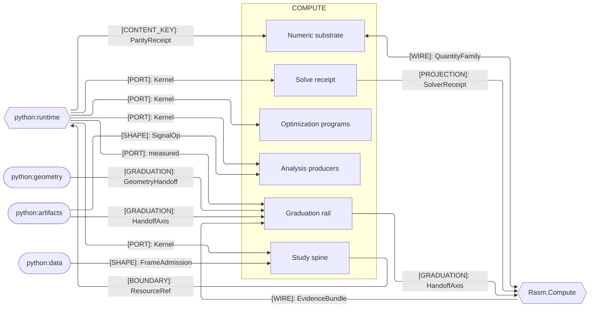
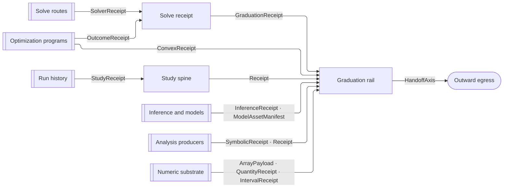
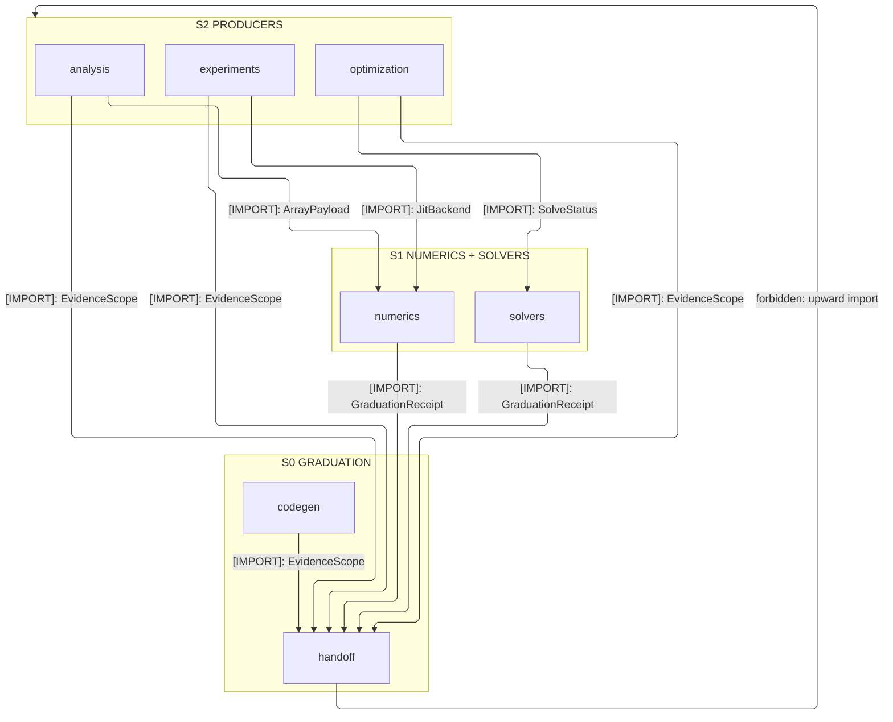

# [PY_COMPUTE_ARCHITECTURE]

`compute` maps host-free offline scientific evidence outward through one rail: independent numeric-science sub-domains converge on the one graduation rail — solve routes fold the one solve receipt, every producer streams runtime receipts through the hub evidence weave, and each graduating axis owner clears the one admission gate — and the numeric substrate every sub-domain admits through carries any backend array while the package imports no host runtime. Geometry, columnar data, and tensor sessions cross the `HandoffAxis` as receipt data, decoded and never re-owned.

## [01]-[DOMAIN_MAP]

```text codemap
compute/                    # Offline scientific evidence, graduating outward through one rail
├── solvers/                # Unified solve routes plus sensitivity, weak-form assembly, and field readout
│   ├── receipt.py          # SolverReceipt — the method-discriminated receipt every route folds
│   ├── linear.py           # LinearIntent — dense, sparse, and eigen solves
│   ├── nonlinear.py        # NonlinearIntent — root, minimise, fixed-point, and least-squares solves
│   ├── quadrature.py       # QuadratureIntent — quadrature, interpolation, and the weak-form FEM fold
│   ├── differential.py     # DifferentialIntent — adjoint-differentiable ODE, SDE, and CDE integration
│   ├── sensitivity.py      # Differentiation — reverse-mode and implicit-adjoint sensitivity over the solvers
│   ├── mesh.py             # MeshField/MeshExchange — topology and fields beside the assemble/read/write interchange
│   └── field.py            # FieldQuery — interpolate, project, and resample readout over a discrete field
├── optimization/           # Offline optimization discriminated by problem structure
│   ├── design.py           # DesignProblem — differentiable design over the implicit-adjoint gradient
│   ├── program.py          # ProgramIntent — constrained, integer, global, and assignment programs
│   └── convex.py           # ConvexProgram — disciplined-convex programs with a dual-certificate proof
├── experiments/            # Study spine, run history, inference, and model assets
│   ├── study.py            # Study — DOE sampling, sensitivity, surrogate fitting, benchmark discriminant
│   ├── history.py          # RunHistory — content-keyed run persistence, partial resume, comparison
│   ├── inference.py        # Inference — gradient-MCMC posteriors with convergence diagnostics
│   └── model.py            # ModelAsset — classical-estimator validation, smoke inference, ONNX export
├── numerics/               # Numeric substrate every sub-domain admits through
│   ├── array.py            # ArrayPayload — namespace-dispatched array admission
│   ├── jit.py              # JitBackend — numba LLVM, ufunc, C-ABI, and XLA compile routes over one capture table
│   ├── interval.py         # IntervalNumerics — the certified-interval floor ladder
│   ├── quantity.py         # UncertainQuantity — correlated uncertainty through unit algebra
│   └── statistics.py       # TestIntent — in-memory hypothesis tests and MLE distribution fit
├── analysis/               # Classical-math evidence producers
│   ├── signal.py           # SignalOp — IIR/FIR filtering, spectral estimation, resample, wavelet fold
│   ├── transform.py        # TransformOp — DFT, trigonometric, Hankel, and analytic-signal transforms
│   ├── symbolic.py         # SymbolicDerivation — symbolic lowering to a numpy or C handoff artifact
│   └── spatial.py          # SpatialQuery — neighbour, hull, Delaunay, Voronoi, and alpha-shape folds
└── graduation/             # Multi-domain graduation hub and C# stub codegen
    ├── handoff.py          # GraduationReceipt/HandoffAxis — outward egress, geometry decode, evidence weave
    └── codegen.py          # StubCodegen — EvidenceBundle decode into typed stubs and schema under the drift gate
```

## [02]-[SEAMS]



`ContentIdentity` keys ride beneath the `ParityReceipt` parity seam, the graduation reverse leg carries `EvidenceBundle` — C#-owned as `GraduationEvidence`, an offline artifact `codegen` decodes — and `UncertainQuantity` is the interior owner beneath the C#-spelled `QuantityFamily` wire; each collapsed edge stands for every contract between the two owners at that kind, with the per-contract wiring on the owning implementation pages.

## [03]-[INTERNAL]

Independent sub-domains produce nothing outward on their own: every producer streams runtime receipts through the hub evidence weave under its `EvidenceScope` row — the universal floor — while the graduating axis owners project `GraduationReceipt` onto the single rail that crosses outward; the study, history, statistics, signal, transform, spatial, field, mesh, and sensitivity owners stop at the receipt rail by charter.



Convergence above answers what folds where; the strata below answer which sub-domain may import which.

- S0 `graduation` — mints the outward rail exactly once (`HandoffAxis`, `GraduationReceipt`, `EvidenceScope`) and imports no compute sibling; `codegen` composes `handoff` inside the stratum, and every producer returns through the hub.
- S1 `numerics` + `solvers` — one band: `solvers` folds `SolverReceipt`/`SolveStatus` onto the rail, `numerics` admits `ArrayPayload` and the `JitBackend`/`LoweredSpec` compile routes; the interleave is module-acyclic — `quadrature` composes `jit`, `interval` composes the receipt `graduate` fold — so no stratum cycle exists at module grain.
- S2 `analysis` + `experiments` + `optimization` — the producer tier no sibling imports: analysis composes `ArrayPayload`, experiments the `JitBackend` capture and the study spine, optimization the `SolveStatus` verdicts and the receipt `graduate` fold; all three stream receipts through the hub weave under their `EvidenceScope` rows, and their axis owners project `GraduationReceipt`.



## [04]-[ORGANIZATION]

Sub-domains are independent numeric-science concerns meeting only through the one solve receipt and the one graduation rail. Each discriminates variation by problem structure — solve route, program class, experiment stage — and composes the numeric substrate rather than re-owning it, so a new route or program class lands as a case on the owning discriminant, never a parallel owner. Per-owner wiring lives on the owning implementation pages.

## [05]-[BOUNDARIES]

- `compute` is not a production runtime, benchmark authority, substrate selector, tensor-session owner, or product-receipt owner.
- It owns offline evidence that graduates through the one rail.
- Columnar and labelled-array interchange stays in the `data` branch; `compute` composes its shapes, never re-owning the data interior.
- Labelled arms extract `.data` and coords; the study DOE-frame arm admits through the published data contract.
- Columnar and gridded statistical aggregation is the `data` branch gridded/field owner; `numerics/statistics` operates on in-memory samples only.
- Geometry tessellation, registration, and topology stay in the `geometry` branch, graduating as `GeometryHandoff` data under its minted union.
- `compute` decodes the crossing at its `HandoffAxis` geometry case; it never re-implements geometry and never imports it.
- Classical statistics, validated numerics, surrogate and classification model assets, and gradient-MCMC inference are in-scope.
- Generative and deep-learning model authoring is out of scope across every sub-domain.
