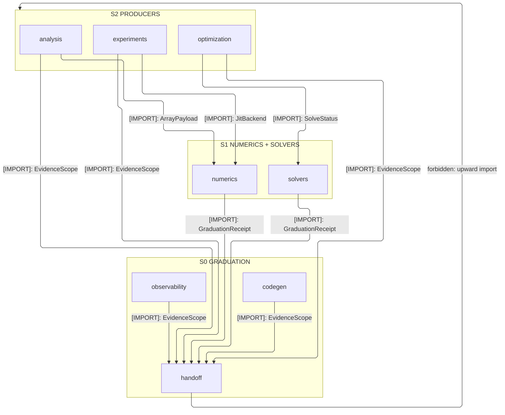
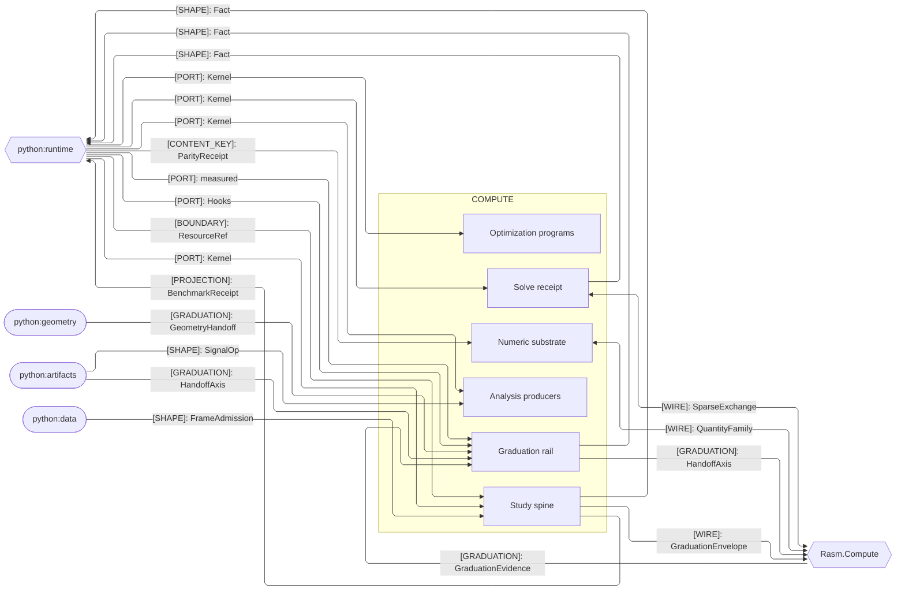
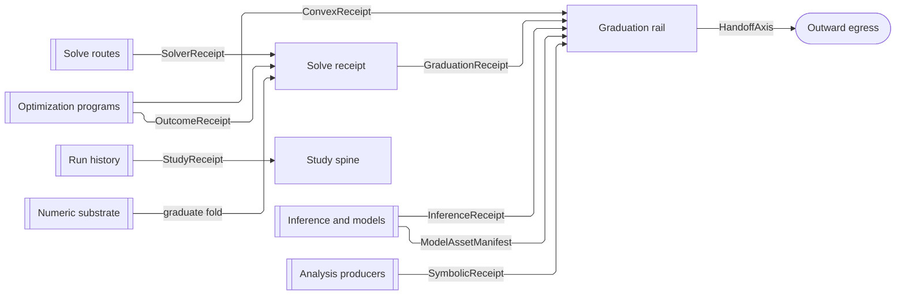

# [PY_COMPUTE_ARCHITECTURE]

`compute` maps host-free offline scientific evidence outward through one rail: independent numeric-science sub-domains meet at the graduation rail, solve routes fold the one solve receipt, and each graduating axis owner clears the one admission gate, while the numeric substrate every sub-domain admits through carries any backend array. Geometry, columnar data, and tensor sessions cross the `HandoffAxis` as receipt data, decoded and never re-owned.

## [01]-[DOMAIN_MAP]

```text codemap
compute/                    # Offline scientific evidence, graduating outward through one rail
├── solvers/                # Unified solve routes plus sensitivity, weak-form assembly, and field readout
│   ├── receipt.py          # Method-tagged tuple payloads, the bounded SolveStatus vocabulary, the graduate fold
│   ├── linear.py           # LinearIntent dispatch; the sparse exchange pairs with the C# factor lane
│   ├── nonlinear.py        # NonlinearIntent arms; each solve folds the method-discriminated receipt
│   ├── quadrature.py       # QuadratureIntent arms; composes jit and the receipt graduate fold
│   ├── differential.py     # DifferentialIntent arms; adjoint integration folds the receipt
│   ├── sensitivity.py      # DiffModeTag tagged union entered through differentiate; no per-mode method family
│   ├── mesh.py             # ElementKind and FemForm originate here; CTOR table composed downward, AssembledSystem out
│   └── field.py            # ReadoutKind axis over interpolate/project/resample; consumes solutions, produces none
├── optimization/           # Offline optimization discriminated by problem structure
│   ├── design.py           # Field/Mesh/Density objectives over optimistix minimise under the ImplicitAdjoint default
│   ├── program.py          # ProgramIntent classes; verdicts read the solver SolveStatus
│   └── convex.py           # Cone-family discriminant, the Backend row axis, normalized dual multipliers as proof
├── experiments/            # Study spine, run history, inference, and model assets
│   ├── study.py            # Study spine; DOE frames admit through the published data contract
│   ├── history.py          # Multi-run cohort; Partial resume recomputing indices over the whole response vector
│   ├── inference.py        # Inference owner; InferenceReceipt projects onto the graduation rail
│   └── model.py            # ModelAsset owner; the GraduationEnvelope layout hand-copies the C# writer, never imports
├── numerics/               # Numeric substrate every sub-domain admits through
│   ├── array.py            # ArrayPayload admission floor every producer stratum composes
│   ├── jit.py              # JitBackend capture table; experiments and quadrature compose it
│   ├── interval.py         # IntervalOp dispatch whose receipt names the certifying Floor and the ball width
│   ├── quantity.py         # UncertainQuantity; interior owner beneath the C#-spelled QuantityFamily wire
│   └── statistics.py       # TestIntent hypothesis routes and MLE fit; report keys intent-owned over sample bytes
├── analysis/               # Classical-math evidence producers
│   ├── signal.py           # SignalOp folds; artifacts hands SignalOp shapes across the seam
│   ├── transform.py        # FOURIER_ROUTES row table, one forward and one inverse body, the SpectralReadout axis
│   ├── symbolic.py         # Block[SymbolicOp] left-fold over ExprForm; one discriminated Outcome per derivation
│   └── spatial.py          # SpatialEvidence resolve fold; one-way graduation, no trimesh surface re-owned
└── graduation/             # Multi-domain graduation hub and C# stub codegen
    ├── handoff.py          # Rail mint: HandoffAxis, GraduationReceipt, EvidenceScope, minted exactly once
    ├── codegen.py          # ast-built msgspec stubs and JSON Schema $defs from the CamelCase bundle decode
    └── observability.py    # Point vocabulary derived onto the runtime registry; cpu-rss-io-switch band per kernel
```

## [02]-[STRATA]

Strata rank the compute interior; seating rows carry only the law the fence cannot show.


```mermaid
---
config:
  layout: elk
  flowchart:
    curve: linear
    padding: 25
---
flowchart TB
    accTitle: Compute interior import strata
    accDescr: Import strata from the producers down to the graduation foundation, each labeled edge naming one sourced type.
    subgraph S2["S2 PRODUCERS"]
        Analysis[analysis]
        Experiments[experiments]
        Optimization[optimization]
    end
    subgraph S1["S1 NUMERICS + SOLVERS"]
        Numerics[numerics]
        Solvers[solvers]
    end
    subgraph S0["S0 GRADUATION"]
        Codegen[codegen]
        Handoff[handoff]
        Observability[observability]
    end
    Analysis e1@-->|"[IMPORT]: ArrayPayload"| Numerics
    Analysis e2@-->|"[IMPORT]: EvidenceScope"| Handoff
    Experiments e3@-->|"[IMPORT]: JitBackend"| Numerics
    Experiments e4@-->|"[IMPORT]: EvidenceScope"| Handoff
    Optimization e5@-->|"[IMPORT]: SolveStatus"| Solvers
    Optimization e6@-->|"[IMPORT]: EvidenceScope"| Handoff
    Numerics e7@-->|"[IMPORT]: GraduationReceipt"| Handoff
    Solvers e8@-->|"[IMPORT]: GraduationReceipt"| Handoff
    Codegen e9@-->|"[IMPORT]: EvidenceScope"| Handoff
    Observability e10@-->|"[IMPORT]: EvidenceScope"| Handoff
    Handoff f1@-->|"forbidden: upward import"| S2
```

- S0 `graduation` — mints the outward rail (`HandoffAxis`, `GraduationReceipt`, `EvidenceScope`) exactly once and imports no compute sibling.
- S0 `codegen` and `observability` compose `handoff` in-stratum; the hub weave re-enters `observability` through one lazy seam.
- S1 `numerics` + `solvers` — one module-acyclic stratum: `solvers` folds `SolverReceipt`/`SolveStatus` onto the rail.
- S1 merged rank stays module-acyclic — `interval` reads `receipt`'s `graduate` while `receipt` reads `array`'s floor, no module pair looping.
- S1 interleave: `quadrature` composes `jit` and the receipt `graduate` fold, `interval` that fold, `receipt` mounting the `EngineProfile` band.
- S2 `analysis` + `experiments` + `optimization` — the producer stratum no sibling imports.
- S2 producers hold no intra-stratum edge — `design` and `program` stay parallel programs, the floor asymmetry a policy fact, never an import.
- S2→S0 `EvidenceScope` edges skip S1 lawfully — the weave is floor capability every stratum reaches, and no S1 mediation exists to bypass.

## [03]-[SEAMS]


```mermaid
---
config:
  layout: elk
  flowchart:
    curve: linear
    padding: 25
---
flowchart LR
    accTitle: Compute package seam registry
    accDescr: Compute sub-domain owners exchanging graduation evidence, quantities, content keys, and the Kernel port with peers.
    subgraph compute[COMPUTE]
        Graduation[Graduation rail]
        Solvers[Solve receipt]
        Numerics[Numeric substrate]
        Experiments[Study spine]
        Analysis[Analysis producers]
        Optimization[Optimization programs]
    end
    Compute{{Rasm.Compute}}
    Runtime{{python:runtime}}
    Geometry([python:geometry])
    Artifacts([python:artifacts])
    Data([python:data])
    Graduation e1@-->|"[GRADUATION]: HandoffAxis"| Compute
    Compute e2@-->|"[GRADUATION]: GraduationEvidence"| Graduation
    Experiments e3@-->|"[WIRE]: GraduationEnvelope"| Compute
    Solvers e4@<-->|"[WIRE]: SparseExchange"| Compute
    Numerics e5@<-->|"[WIRE]: QuantityFamily"| Compute
    Geometry e6@-->|"[GRADUATION]: GeometryHandoff"| Graduation
    Artifacts e7@-->|"[GRADUATION]: HandoffAxis"| Graduation
    Artifacts e8@-->|"[SHAPE]: SignalOp"| Analysis
    Runtime e9@-->|"[CONTENT_KEY]: ParityReceipt"| Numerics
    Runtime e10@-->|"[BOUNDARY]: ResourceRef"| Experiments
    Data e11@-->|"[SHAPE]: FrameAdmission"| Experiments
    Experiments e12@-->|"[PROJECTION]: BenchmarkReceipt"| Runtime
    Graduation e13@-->|"[SHAPE]: Fact"| Runtime
    Experiments e14@-->|"[SHAPE]: Fact"| Runtime
    Solvers e15@-->|"[SHAPE]: Fact"| Runtime
    Runtime e16@-->|"[PORT]: Kernel"| Solvers
    Runtime e17@-->|"[PORT]: measured"| Graduation
    Runtime e18@-->|"[PORT]: Hooks"| Graduation
    Runtime e19@-->|"[PORT]: Kernel"| Experiments
    Runtime e20@-->|"[PORT]: Kernel"| Analysis
    Runtime e21@-->|"[PORT]: Kernel"| Optimization
```

`ContentIdentity` keys ride beneath the `ParityReceipt` parity seam, the graduation reverse leg spells the owner's `GraduationEvidence`, landed interior as `EvidenceBundle`, and `UncertainQuantity` is the interior owner beneath the C#-spelled `QuantityFamily` wire. `experiments/model#ENVELOPE` rides the forward model crossing as the `GraduationEnvelope` copy the C# identity gate ingests, `solvers/linear#EXCHANGE` pairs the sparse containers with the C# factor lane, and each collapsed edge stands for every contract at its kind, per-contract wiring on the owning pages.

Every leg admitting, writing, or consuming a countable population records through the runtime `Journal` writer on the `[SHAPE]: Fact` durable half, whose `Ledger` a composition root binds and this package never implements. Producing legs are awaitable by law, so a synchronous entrypoint reaches the plane through its own twin. `Resource.COMPUTE` charges once per dispatch at the resource band's async close, and each `Fact` edge carries the evidence its own fold owns.

## [04]-[INTERNAL]

Independent sub-domains produce nothing outward on their own: every producer streams runtime receipts through the hub evidence weave under its `EvidenceScope` row, the graduating axis owners project `GraduationReceipt` onto the single rail that crosses outward, and an owner with no `HandoffAxis` case stops at the receipt rail by charter.


```mermaid
---
config:
  layout: elk
  flowchart:
    curve: linear
    padding: 25
---
flowchart LR
    accTitle: Compute internal receipt spine
    accDescr: Numeric-science sub-domains fold solve receipts and graduating axis evidence onto the single graduation rail crossing outward.
    SolveRoutes[[Solve routes]] e1@-->|"SolverReceipt"| Receipt[Solve receipt]
    Optimization[[Optimization programs]] e2@-->|"OutcomeReceipt"| Receipt
    Optimization e3@-->|"ConvexReceipt"| Handoff[Graduation rail]
    History[[Run history]] e4@-->|"StudyReceipt"| Study[Study spine]
    Experiments[[Inference and models]] e5@-->|"InferenceReceipt"| Handoff
    Experiments e6@-->|"ModelAssetManifest"| Handoff
    Numerics[[Numeric substrate]] e7@-->|"graduate fold"| Receipt
    Receipt e8@-->|"GraduationReceipt"| Handoff
    Analysis[[Analysis producers]] e9@-->|"SymbolicReceipt"| Handoff
    Handoff e10@-->|"HandoffAxis"| Out([Outward egress])
```

Sub-domains are independent numeric-science concerns. Each discriminates variation by its own problem structure and composes the numeric substrate rather than re-owning it, so a new route or program class lands as a case on the owning discriminant, never a parallel owner. Per-owner wiring lives on the owning implementation pages.

## [05]-[BOUNDARIES]

- `compute` owns offline evidence on the one rail — no runtime, benchmark authority, substrate selector, tensor session, or product receipt seats.
- Columnar and labelled-array interchange stays in the `data` branch; `compute` composes its shapes, never re-owning the data interior.
- Columnar and gridded statistical aggregation is the `data` branch gridded/field owner; `numerics/statistics` operates on in-memory samples only.
- Geometry tessellation, registration, and topology stay in the `geometry` branch, graduating as `GeometryHandoff` data under its minted union.
- `compute` decodes the crossing at its `HandoffAxis` geometry case; it never re-implements geometry and never imports it.
- Scope admits classical evidence — a capability lands where its receipt fits a `HandoffAxis` or rail case; deep-learning authoring fits none.
